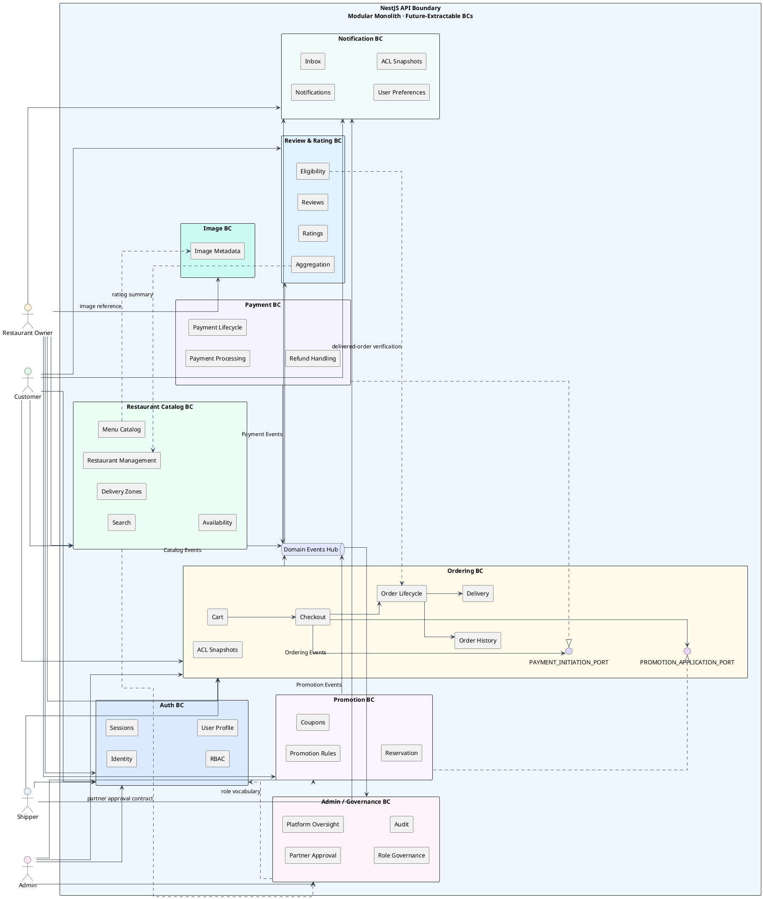
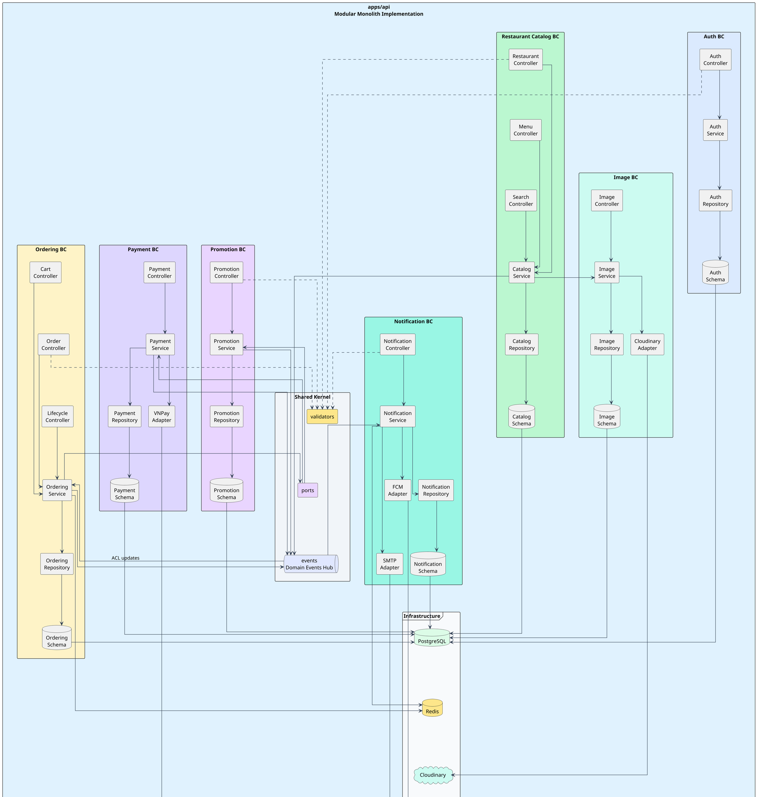

# **ATTRIBUTE-DRIVEN** **DESIGN DOCUMENT**

### SoLi Food Delivery Platform

_Prepared by_

Architecture Team

##### **Table of content**

**1. Design Constraints.....................................................................................................................**

**2. Quality Attribute Requirements...............................................................................................**

2.1. Performance..............................................................................................................................................

2.1.1. Restaurant Search Response Time............................................................................................

2.1.2. Order Status Propagation to Customer....................................................................................

2.1.3. Checkout End-to-End Latency....................................................................................................

2.1.4. Menu / Availability Update Propagation................................................................................

2.2. Availability.................................................................................................................................................

2.2.1. Authentication Endpoint Availability......................................................................................

2.2.2. Real-Time Channel Graceful Degradation...............................................................................

2.2.3. Optional Notification-Channel Degradation...........................................................................

2.3. Reliability...................................................................................................................................................

2.3.1. Order Placement Idempotency...................................................................................................

2.3.2. Payment IPN Webhook Idempotency.......................................................................................

2.3.3. Order State-Machine Integrity...................................................................................................

2.3.4. Single-Restaurant Cart Invariant...............................................................................................

2.3.5. Atomic Shipper Assignment........................................................................................................

2.3.6. Payment Timeout Recovery.........................................................................................................

2.3.7. Restaurant Acceptance Timeout.................................................................................................

2.3.8. Refund and Promotion Compensation Reliability................................................................

2.4. Security.......................................................................................................................................................

2.4.1. VNPay Callback Integrity............................................................................................................

2.4.2. Authentication & Session Management...................................................................................

2.4.3. Role-Based Authorization............................................................................................................

2.4.4. Input Validation & Injection Resistance..................................................................................

2.4.5. Rate Limiting on Public Endpoints...........................................................................................

2.5. Scalability...................................................................................................................................................

2.5.1. Horizontal Scaling of API Instances.........................................................................................

2.5.2. Cart and Idempotency Storage Scaling....................................................................................

2.6. Flexibility....................................................................................................................................................

2.6.1. Generalizing Payment Provider Integration...........................................................................

2.6.2. Adding a New Order Status.........................................................................................................

2.6.3. Replacing a Notification Channel Provider............................................................................

2.7. Interoperability........................................................................................................................................

2.7.1. VNPay Gateway Integration........................................................................................................

2.7.2. Push Notification Multi-Channel Dispatch.............................................................................

2.7.3. Image Upload via Cloudinary.....................................................................................................

2.8. Supportability...........................................................................................................................................

2.8.1. Audit Trail for Order Lifecycle..................................................................................................

2.8.2. Structured Logging on Cross-BC Events.................................................................................

2.8.3. Stuck-Order Diagnostics..............................................................................................................

2.9. Maintainability.........................................................................................................................................

2.9.1. Bounded-Context Boundary Enforcement..............................................................................

2.9.2. Schema Evolution via Drizzle Migrations...............................................................................

2.10. Testability................................................................................................................................................

2.10.1. Deterministic Order Placement Tests.....................................................................................

2.11. Usability...................................................................................................................................................

2.11.1. Sub-2-Minute Registration Flow.............................................................................................

2.11.2. Predictable Restaurant Discovery...........................................................................................

2.12. Conceptual Integrity.............................................................................................................................

2.12.1. Single Order-Status Vocabulary..............................................................................................

2.12.2. Event Envelope Consistency......................................................................................................

**3. Architectural Representation...................................................................................................**

3.1. Logical View..............................................................................................................................................

3.2. Implementation View.............................................................................................................................

3.3. Deployment View....................................................................................................................................

3.4. Data View...................................................................................................................................................

## 1. Design Constraints

In this ADD, **Design Constraints** are expressed as quality drivers: the quality concerns that constrain the architecture and force specific design responsibilities. Technology choices are consequences of these drivers, not the primary constraints.

ー **Performance** :
- **Constraint:** Search, checkout, cart mutation, order-status propagation, and notification delivery must stay responsive during normal mobile/web use.
- **Architectural implication:** Reads are paginated, cart and idempotency state are kept in Redis, checkout is concentrated in one command handler, and non-critical side effects are emitted after commit.
- **Affected modules:** Restaurant Catalog, Ordering, Cart, Payment, Notification, Redis, PostgreSQL.
- **Design pressure:** Avoid chatty cross-context calls, prevent N+1 list reads, keep event handlers lightweight, and preserve p95 targets for the user-visible purchase path.

ー **Availability** :
- **Constraint:** Authentication, ordering, payment confirmation, and notification recovery must remain usable when optional providers or client connections degrade.
- **Architectural implication:** Core business state is persisted in PostgreSQL, sessions are database-backed, notification inbox rows are durable, and SMTP/FCM providers degrade through Noop/Stub adapters.
- **Affected modules:** Auth, Ordering, Payment, Notification, Redis, PostgreSQL, external provider adapters.
- **Design pressure:** Keep optional channels from blocking committed order/payment flows and define fallback reads for disconnected clients.

ー **Reliability** :
- **Constraint:** The platform must prevent duplicate orders, invalid order transitions, duplicate payment updates, and inconsistent promotion/refund side effects.
- **Architectural implication:** Ordering uses Redis idempotency plus a database uniqueness backstop, lifecycle transitions use a closed state machine and optimistic locking, and payment IPN processing verifies terminal states before mutation.
- **Affected modules:** Ordering, Order Lifecycle, Payment, Promotion, Notification, Redis, PostgreSQL.
- **Design pressure:** Put invariants in backend handlers and database constraints, emit events only after commit, and make compensation handlers idempotent.

ー **Security** :
- **Constraint:** Identity, role-based access, payment callback integrity, and public endpoint abuse protection must protect money, orders, and administrative actions.
- **Architectural implication:** Better Auth owns credential/session handling, route guards and service checks enforce roles and ownership, VNPay callbacks are HMAC verified before lookup/mutation, and rate limiting is reserved for the edge or Nest throttling layer.
- **Affected modules:** Auth, Payment, Ordering, Restaurant Catalog, Promotion, Notification, Image, Admin/Governance surfaces.
- **Design pressure:** Keep secrets in validated environment variables, avoid custom cryptography, deny unauthorized access before mutation, and avoid leaking order existence across ownership boundaries.

ー **Scalability** :
- **Constraint:** Browse/search and cart/order traffic must grow beyond one process while respecting the modular-monolith boundary.
- **Architectural implication:** HTTP state is externalized to PostgreSQL and Redis; scaling means replicating the whole API instance, while WebSocket fan-out requires sticky sessions or a Socket.IO Redis adapter before multi-instance correctness.
- **Affected modules:** API runtime, Restaurant Catalog, Cart, Ordering, Notification Gateway, Redis, PostgreSQL.
- **Design pressure:** Keep modules stateless at the process level, isolate hot volatile keys in Redis, and document the EventBus limitation before extracting services.

ー **Flexibility** :
- **Constraint:** Payment providers, notification providers, order statuses, and promotion rules must be changeable without rewriting checkout or lifecycle ownership.
- **Architectural implication:** Ordering depends on Payment and Promotion through ports, notification channels are provider interfaces, and lifecycle states are centralized in one enum/transition matrix.
- **Affected modules:** Ordering, Payment, Promotion, Notification, shared ports, shared events.
- **Design pressure:** Avoid concrete cross-BC imports, keep provider details behind adapters, and update contract tests whenever core vocabularies evolve.

ー **Maintainability** :
- **Constraint:** The backend must remain understandable as bounded contexts with clear data ownership even while deployed as one application.
- **Architectural implication:** Source code is organized by BC modules under `apps/api/src/module`, shared contracts live under `src/shared`, infrastructure helpers stay under `src/lib`, and Drizzle schemas group tables by owner.
- **Affected modules:** All backend BCs, shared events, shared ports, Drizzle schema/migrations.
- **Design pressure:** Prevent boundary erosion, keep routine CRUD inside its owning module, and treat cross-context reads as snapshots or public contracts.

ー **Testability** :
- **Constraint:** Critical order, payment, promotion, notification, and lifecycle rules must be verifiable deterministically in CI.
- **Architectural implication:** Command handlers and services use dependency injection, providers can be stubbed, and e2e tests run against controlled PostgreSQL/Redis services.
- **Affected modules:** Ordering, Payment, Promotion, Notification, Cart, ACL projections, test setup.
- **Design pressure:** Keep time, provider calls, and Redis/DB dependencies controllable; preserve small handler contracts that can be tested without full client stacks.

ー **Usability** :
- **Constraint:** Users must receive predictable feedback for discovery, cart conflicts, payment failure, delivery updates, and notification recovery.
- **Architectural implication:** Backend responses include structured error reasons, cart mutations return the full cart payload, order/payment states are durable, and notification inbox reads support recovery after realtime disconnects.
- **Affected modules:** Restaurant Catalog, Cart, Ordering, Payment, Notification, Auth.
- **Design pressure:** Make backend state transitions and error codes explicit so web/mobile clients can present clear next actions without duplicating business logic.

ー **Interoperability** :
- **Constraint:** The platform must integrate predictably with VNPay, Cloudinary, FCM, SMTP, Expo/mobile clients, and web clients.
- **Architectural implication:** External systems are wrapped by adapters, gateway payloads are canonicalized, image bytes remain in Cloudinary, and clients consume backend REST/WebSocket contracts rather than database structures.
- **Affected modules:** Payment, Image, Notification, Auth, client API contracts.
- **Design pressure:** Preserve provider-specific protocol rules at the adapter boundary and keep domain modules free of provider payload formats where possible.

ー **Supportability** :
- **Constraint:** Operators and developers must be able to diagnose lifecycle decisions, payment outcomes, notification failures, and cross-context event issues.
- **Architectural implication:** Order transitions append audit rows, payment transactions preserve provider references/payload metadata, notification delivery attempts are logged, and NestJS loggers mark handler failures.
- **Affected modules:** Ordering, Payment, Notification, Promotion, Admin/Governance surfaces.
- **Design pressure:** Store enough actor/target/outcome context for investigation, and add correlation/central logging before relying on production SLO claims.

ー **Conceptual Integrity** :
- **Constraint:** The architecture must use one shared language for roles, order states, events, data ownership, and BC responsibilities.
- **Architectural implication:** Role vocabulary is centralized in Auth, order lifecycle vocabulary is centralized in Ordering, events are explicit POJOs, and each table group has a single owning BC.
- **Affected modules:** Auth, Ordering, shared events, Restaurant Catalog, Payment, Promotion, Notification, Image, Review & Rating target model.
- **Design pressure:** Avoid parallel meanings for the same business concept, keep Image and Notification independent from Catalog/Review, and treat Review & Rating as its own BC rather than a UI add-on.

## 2. Quality Attribute Requirements

#### 2.1. Performance

##### 2.1.1. QA-P-01 — Restaurant Search Response Time *[Implemented]*

| Element            | Description                                                                                                                                                                                                                                                |
|--------------------|------------------------------------------------------------------------------------------------------------------------------------------------------------------------------------------------------------------------------------------------------------|
| Stimulus           | Customer submits a restaurant / item search query                                                                                                                                                                                                          |
| Stimulus Source    | Customer client                                                                                                                                                                                                                                            |
| Environment        | Normal operational load (≤ 1× projected peak)                                                                                                                                                                                                              |
| Artifact           | `restaurant-catalog/search` controller + repository ([search.repository.ts](../../../src/module/restaurant-catalog/search/search.repository.ts)); PostgreSQL                                                                                              |
| Response           | First page of results returned with pagination metadata                                                                                                                                                                                                    |
| Response Measure   | p95 ≤ 2 s; page size ≤ 20; results ordered deterministically                                                                                                                                                                                              |
| Architectural Tactics | Paginated queries (`offset`/`limit`); approved/open composite index on restaurants; planned Redis read-through caching for hot queries (Cache-Aside)                                                                                                      |

##### 2.1.2. QA-P-02 — Order Status Propagation to Customer *[Partial]*

| Element            | Description                                                                                                                                  |
|--------------------|----------------------------------------------------------------------------------------------------------------------------------------------|
| Stimulus           | Order status transitions (e.g., `confirmed → preparing`)                                                                                     |
| Stimulus Source    | Restaurant / shipper / admin HTTP client, or system task                                                                                     |
| Environment        | Normal load; customer device online; WebSocket session active                                                                                |
| Artifact           | [NotificationGateway](../../../src/module/notification/gateway/notification.gateway.ts) → `room:user:{userId}`; Socket.IO `/notifications` ns |
| Response           | Connected notification clients receive `WS_NOTIFICATION_CREATED`; persisted notification rows remain available for REST inbox reloads         |
| Response Measure   | Backend event-to-WebSocket emit latency target ≤ 5 s p95; client screen refresh/rendering behavior is implementation-specific and currently only partial |
| Architectural Tactics | In-process EventBus → event handler → WebSocket emit; Redis-tracked presence enables fan-out only to active sessions                         |

##### 2.1.3. QA-P-03 — Checkout End-to-End Latency *[Implemented]*

| Element            | Description                                                                                                                                       |
|--------------------|---------------------------------------------------------------------------------------------------------------------------------------------------|
| Stimulus           | Customer submits Place-Order request                                                                                                              |
| Stimulus Source    | Customer client                                                                                                                                    |
| Environment        | Normal load; payment method = COD                                                                                                                 |
| Artifact           | [PlaceOrderHandler](../../../src/module/ordering/order/commands/place-order.handler.ts); Drizzle transaction over `orders`, `order_items`, `order_status_logs` |
| Response           | Order persisted; `OrderPlacedEvent` dispatched; response returned                                                                                 |
| Response Measure   | p95 ≤ 3 s including ACL snapshot reads, promotion reservation, haversine validation, and DB commit                                                |
| Architectural Tactics | Single ACID transaction; idempotency short-circuit on Redis hit; haversine in-memory; ACL reads from local snapshot tables (no cross-BC RPC)      |

##### 2.1.4. QA-P-04 — Menu / Availability Update Propagation *[Partial]*

| Element            | Description                                                                                                              |
|--------------------|--------------------------------------------------------------------------------------------------------------------------|
| Stimulus           | Restaurant edits menu item price / availability                                                                          |
| Stimulus Source    | Restaurant management client                                                                                             |
| Environment        | Normal load                                                                                                              |
| Artifact           | Restaurant-catalog → publishes `MenuItemUpdatedEvent` ([menu-item-updated.event.ts](../../../src/shared/events/menu-item-updated.event.ts)); Ordering ACL projector |
| Response           | `ordering_menu_item_snapshots` updated; subsequent place-order uses fresh data                                           |
| Response Measure   | Propagation target ≤ 10 s; current same-process event dispatch is expected to complete substantially faster, but formal latency measurement is still pending |

---

#### 2.2. Availability

##### 2.2.1. QA-A-01 — Authentication Endpoint Availability *[Partial]*

| Element            | Description                                                                                                                       |
|--------------------|-----------------------------------------------------------------------------------------------------------------------------------|
| Stimulus           | Customer / partner submits sign-in or session validation                                                                          |
| Stimulus Source    | Any client                                                                                                                        |
| Environment        | Calendar month, normal + occasional partial outage                                                                                |
| Artifact           | Better Auth integration ([lib/auth.ts](../../../src/lib/auth.ts)); PostgreSQL session store                                       |
| Response           | Successful authentication when PostgreSQL/auth dependencies are available; failures surface as standard HTTP errors without relying on in-memory session state |
| Response Measure   | Availability target: 99.5 percent deployment objective for the authentication path; operational validation and resilience evidence are still pending |
| Architectural Tactics | Stateless app instances (planned horizontal scale); fail-fast at startup on config errors; restart-friendly Docker container       |

##### 2.2.2. QA-A-02 — Real-Time Channel Graceful Degradation *[Partial]*

| Element            | Description                                                                                                              |
|--------------------|--------------------------------------------------------------------------------------------------------------------------|
| Stimulus           | WebSocket connection lost (network, server restart)                                                                      |
| Stimulus Source    | Customer / shipper / restaurant client                                                                                   |
| Environment        | Mobile network handover, degraded connectivity                                                                            |
| Artifact           | NotificationGateway plus REST NotificationController                                                                      |
| Response           | Backend supports recovery through the REST inbox at `/api/notifications/my`; mobile implements a notification socket and on-demand inbox fetch, while the defined unread-count polling hook is not wired and automatic order-detail polling is not implemented across clients |
| Response Measure   | In-app notifications are persisted with a 90-day `expiresAt`; reconnect re-joins the per-user room and new deliveries remain idempotent by notification key |
| Architectural Tactics | Durable notification store; idempotent `notification.id`; per-user room rejoin on reconnect                              |

##### 2.2.3. QA-A-03 — Optional Notification-Channel Degradation *[Implemented]*

| Element            | Description                                                                                                              |
|--------------------|--------------------------------------------------------------------------------------------------------------------------|
| Stimulus           | SMTP or FCM unreachable / credentials absent                                                                             |
| Stimulus Source    | External provider outage                                                                                                 |
| Environment        | Provider degraded                                                                                                        |
| Artifact           | `EmailChannel`, `PushChannel` providers                                                                                  |
| Response           | Core flows (order placement, payment) continue; the affected notification channel logs failure to `notification_delivery_logs` |
| Response Measure   | Zero impact on order-state correctness; failed dispatches retried by future iteration (currently logged, not auto-retried) |

---

#### 2.3. Reliability

##### 2.3.1. QA-R-01 — Order Placement Idempotency *[Implemented]*

| Element            | Description                                                                                                                                                          |
|--------------------|----------------------------------------------------------------------------------------------------------------------------------------------------------------------|
| Stimulus           | Client retries Place-Order request after timeout or unknown response                                                                                                  |
| Stimulus Source    | Customer client                                                                                                                                     |
| Environment        | Network instability                                                                                                                                                  |
| Artifact           | [PlaceOrderHandler](../../../src/module/ordering/order/commands/place-order.handler.ts); Redis `idempotency:order:{key}`; `orders.cart_id` UNIQUE constraint         |
| Response           | Identical `orderId` returned; no duplicate `orders` row; no double-charge                                                                                            |
| Response Measure   | Zero duplicate orders across retries with identical `X-Idempotency-Key` within `ORDER_IDEMPOTENCY_TTL_SECONDS` (fallback 300 s)                                      |
| Architectural Tactics | D5-A Redis idempotency key (fast path); D5-B DB `UNIQUE(cart_id)` (backstop); transactional commit before publishing `OrderPlacedEvent`                              |

##### 2.3.2. QA-R-02 — Payment IPN Webhook Idempotency *[Implemented]*

| Element            | Description                                                                                                                            |
|--------------------|----------------------------------------------------------------------------------------------------------------------------------------|
| Stimulus           | VNPay retries the IPN callback                                                                                                         |
| Stimulus Source    | VNPay gateway                                                                                                                          |
| Environment        | VNPay retry policy (until `RspCode=00`)                                                                                                |
| Artifact           | [ProcessIpnHandler](../../../src/module/payment/commands/process-ipn.handler.ts); `payment_transactions.version`                       |
| Response           | First call updates state and publishes `PaymentConfirmedEvent` / `PaymentFailedEvent`; subsequent calls return success without re-emit |
| Response Measure   | Zero duplicate state transitions; zero duplicate downstream events under arbitrary retry counts                                        |
| Architectural Tactics | Signature verification first; lookup by `vnp_TxnRef`; terminal-state short-circuit; optimistic-lock `version` increment                |

##### 2.3.3. QA-R-03 — Order State-Machine Integrity *[Implemented]*

| Element            | Description                                                                                                                                                    |
|--------------------|----------------------------------------------------------------------------------------------------------------------------------------------------------------|
| Stimulus           | Any actor (customer, restaurant, shipper, admin, scheduled task) requests an order status transition                                                            |
| Stimulus Source    | Any of the above                                                                                                                                               |
| Environment        | Normal + concurrent operation                                                                                                                                  |
| Artifact           | [TRANSITIONS map](../../../src/module/ordering/order-lifecycle/constants/transitions.ts) (closed transition matrix); [TransitionOrderHandler](../../../src/module/ordering/order-lifecycle/commands/transition-order.handler.ts) (enforcement + optimistic lock); [OrderLifecycleService](../../../src/module/ordering/order-lifecycle/services/order-lifecycle.service.ts) (ownership checks); `orders.version`; `order_status_logs` |
| Response           | Disallowed transitions rejected with a typed error; allowed transitions commit atomically and append an audit log                                              |
| Response Measure   | 100 % of disallowed transitions rejected; 100 % committed transitions logged; concurrent transition attempts fail-safe via optimistic-lock retry / rejection   |
| Architectural Tactics | Hand-crafted TRANSITIONS map (D6-A) in `constants/transitions.ts`; `TransitionOrderHandler` enforces via `@CommandHandler`; optimistic locking on `version`; transactional INSERT into `order_status_logs` |

##### 2.3.4. QA-R-04 — Single-Restaurant Cart Invariant *[Implemented]*

| Element            | Description                                                                                                                |
|--------------------|----------------------------------------------------------------------------------------------------------------------------|
| Stimulus           | Customer adds an item from Restaurant B to a cart already containing items from Restaurant A                                |
| Stimulus Source    | Customer client                                                                                                            |
| Environment        | Normal                                                                                                                     |
| Artifact           | [CartService](../../../src/module/ordering/cart/cart.service.ts)                                                            |
| Response           | Request rejected with a structured error (`CART_RESTAURANT_CONFLICT`); existing cart left unchanged                         |
| Response Measure   | 100 % rejection in unit / e2e tests; cart store remains consistent                                                          |
| Architectural Tactics | BR-2 enforcement in service before Redis write                                                                              |

##### 2.3.5. QA-R-05 — Atomic Shipper Assignment *[Implemented]*

| Element            | Description                                                                                                              |
|--------------------|--------------------------------------------------------------------------------------------------------------------------|
| Stimulus           | Two shippers concurrently accept the same dispatch                                                                       |
| Stimulus Source    | Shipper mobile clients                                                                                                   |
| Environment        | Concurrent acceptance                                                                                                    |
| Artifact           | T-09 (`ready_for_pickup → picked_up`) in [TransitionOrderHandler](../../../src/module/ordering/order-lifecycle/commands/transition-order.handler.ts); `orders.version`; `orders.shipperId` |
| Response           | At most one shipper bound to the order; loser receives a typed conflict response                                         |
| Response Measure   | Logical guarantee: at most one shipper assignment per successful optimistic-lock commit on the same order row; concurrent validation remains operational work |
| Architectural Tactics | Shipper self-assignment occurs inside the same optimistic-lock status update that advances T-09; losing concurrent requests receive `ConflictException` |

##### 2.3.6. QA-R-06 — Payment Timeout Recovery *[Implemented]*

| Element            | Description                                                                                                                                                                     |
|--------------------|---------------------------------------------------------------------------------------------------------------------------------------------------------------------------------|
| Stimulus           | A payment transaction remains in `pending` or `awaiting_ipn` state beyond the configured `expiresAt` deadline                                                                   |
| Stimulus Source    | Customer inactivity, gateway delay, or payment abandonment                                                                                                                      |
| Environment        | Normal scheduled execution (`@Cron(EVERY_MINUTE)`)                                                                                                                              |
| Artifact           | [PaymentTimeoutTask](../../../src/module/payment/tasks/payment-timeout.task.ts); `payment_transactions.expiresAt`; `PaymentFailedEvent`                                          |
| Response           | Expired transaction transitioned to `failed` via optimistic lock; `PaymentFailedEvent` published; Ordering BC handler auto-cancels the order through the CQRS path              |
| Response Measure   | Expired transactions are selected by the every-minute sweeper; optimistic locking prevents duplicate state changes, but multi-pod duplicate-event behavior requires deployment validation |
| Architectural Tactics | Scheduled sweeper with optimistic-lock concurrency guard; event-driven cancellation cascade; terminal-state protection prevents double-processing                             |

##### 2.3.7. QA-R-07 — Restaurant Acceptance Timeout *[Implemented]*

| Element            | Description                                                                                                                                                                     |
|--------------------|---------------------------------------------------------------------------------------------------------------------------------------------------------------------------------|
| Stimulus           | A restaurant does not accept or reject an order within the configured acceptance window                                                                                         |
| Stimulus Source    | Restaurant operator inaction                                                                                                                                                    |
| Environment        | Normal scheduled execution (`@Cron(EVERY_MINUTE)`)                                                                                                                              |
| Artifact           | [OrderTimeoutTask](../../../src/module/ordering/order-lifecycle/tasks/order-timeout.task.ts); `RESTAURANT_ACCEPT_TIMEOUT_SECONDS` (from `app_settings`); `TransitionOrderCommand` |
| Response           | Order auto-cancelled via the same CQRS `TransitionOrderCommand` path used by all actors; T-05 fires for paid orders triggering the refund event automatically                   |
| Response Measure   | Eligible expired orders are scanned every minute and routed through `TransitionOrderCommand`; stuck-order diagnostics / alerting remain planned                                    |
| Architectural Tactics | Scheduler scan; reuse of existing CQRS command path (no bespoke cancellation logic); acceptance window configurable at runtime via `app_settings` without redeployment        |

##### 2.3.8. QA-R-08 — Refund and Promotion Compensation Reliability *[Partial]*

| Element            | Description                                                                                                                                                                     |
|--------------------|---------------------------------------------------------------------------------------------------------------------------------------------------------------------------------|
| Stimulus           | A VNPay-paid order is cancelled through a refund-triggering transition, or an order with a reserved promotion fails / is cancelled                                               |
| Stimulus Source    | Ordering BC emits `OrderCancelledAfterPaymentEvent` or `OrderStatusChangedEvent(cancelled/refunded)`                                                                             |
| Environment        | Normal; VNPay Refund API stubbed in current implementation (production retry TBD)                                                                                               |
| Artifact           | [OrderCancelledAfterPaymentHandler](../../../src/module/payment/events/order-cancelled-after-payment.handler.ts); [PromotionRollbackOnCancellationHandler](../../../src/module/ordering/order-lifecycle/events/promotion-rollback-on-cancellation.handler.ts); [PromotionService](../../../src/module/promotion/services/promotion.service.ts) |
| Response           | Payment refund state is advanced in Payment BC; promotion reservations/usages are rolled back through the promotion port; failures are logged and do not roll back the already committed order state |
| Response Measure   | Order cancellation / failed checkout correctness is independent of refund or promotion-rollback outcome; real refund retry automation remains planned, while promotion counter rollback is implemented idempotently |
| Architectural Tactics | Event-driven async compensation; failure containment in payment/refund handlers; promotion rollback through `PROMOTION_APPLICATION_PORT` with idempotent counter decrements and usage status updates |

---

#### 2.4. Security

##### 2.4.1. QA-S-01 — VNPay Callback Integrity *[Implemented]*

| Element            | Description                                                                                                                                       |
|--------------------|---------------------------------------------------------------------------------------------------------------------------------------------------|
| Stimulus           | Forged or tampered VNPay IPN payload                                                                                                              |
| Stimulus Source    | Attacker / Internet                                                                                                                               |
| Environment        | Public IPN endpoint                                                                                                                               |
| Artifact           | [VNPayService.verifyReturnUrl / verifyIpn](../../../src/module/payment/services/vnpay.service.ts); `crypto.timingSafeEqual`                       |
| Response           | Request rejected; no state mutation; no events emitted                                                                                            |
| Response Measure   | Invalid HMAC-SHA512 payloads are rejected before state mutation; penetration / negative security tests are recommended validation                                                    |
| Architectural Tactics | Signature verification **before** any DB lookup; constant-time comparison; ordered URL-encoded canonicalization per VNPay spec                    |

##### 2.4.2. QA-S-02 — Authentication & Session Management *[Implemented]*

| Element            | Description                                                                                                                  |
|--------------------|------------------------------------------------------------------------------------------------------------------------------|
| Stimulus           | User sign-in / session validation                                                                                            |
| Stimulus Source    | Customer, restaurant, shipper, admin                                                                                          |
| Environment        | Public endpoints                                                                                                              |
| Artifact           | Better Auth + Drizzle adapter ([lib/auth.ts](../../../src/lib/auth.ts)); `session`, `account`, `verification` tables          |
| Response           | Strong session token issued; bearer token validated server-side on each request                                              |
| Response Measure   | Industry-standard password hashing (Better Auth default — scrypt); session secret ≥ 32 chars enforced at startup via Zod      |
| Architectural Tactics | Library-managed credential handling; HTTPS-only deployment (deployment constraint); no custom rolling of crypto             |

##### 2.4.3. QA-S-03 — Role-Based Authorization *[Implemented]*

| Element            | Description                                                                                                                                |
|--------------------|--------------------------------------------------------------------------------------------------------------------------------------------|
| Stimulus           | Unauthorized actor accesses an admin / restaurant / shipper endpoint                                                                       |
| Stimulus Source    | Any client                                                                                                                                 |
| Environment        | Any                                                                                                                                        |
| Artifact           | `user.role` (multi-role CSV); [`hasRole()`](../../../src/module/auth/role.util.ts) utility; route guards                                   |
| Response           | 401 (no session) / 403 (insufficient role); unauthorized attempts observable through server/access logs; order lifecycle mutations write persistent audit rows |
| Response Measure   | Protected endpoints deny missing or mismatched roles before service-layer mutation                                                         |
| Architectural Tactics | Multi-role bitmap-equivalent (CSV) checked via OR-logic helper; Better Auth `admin()` plugin for admin scoping                           |

##### 2.4.4. QA-S-05 — Input Validation & Injection Resistance *[Implemented]*

| Element            | Description                                                                                                                  |
|--------------------|------------------------------------------------------------------------------------------------------------------------------|
| Stimulus           | Client submits malformed DTO fields or HTML / JS payloads in catalog, cart, order, promotion, or notification requests        |
| Stimulus Source    | Authenticated or public client                                                                                                 |
| Environment        | Any                                                                                                                          |
| Artifact           | Global `ValidationPipe({ transform: true })` in [main.ts](../../../src/main.ts); class-validator DTOs                         |
| Response           | DTO validation rejects malformed payloads; Drizzle parameterization protects database access; stored review-text sanitization remains planned with UC-22 |
| Response Measure   | Invalid DTO payloads rejected before service-layer mutation; SQL injection prevented by Drizzle parameterized queries        |

##### 2.4.5. QA-S-06 — Rate Limiting on Public Endpoints *[Planned]*

| Element            | Description                                                                                                              |
|--------------------|--------------------------------------------------------------------------------------------------------------------------|
| Stimulus           | Burst of unauthenticated requests on login, register, or search endpoints                                                |
| Stimulus Source    | Attacker / abusive client                                                                                                |
| Environment        | Production                                                                                                               |
| Artifact           | Reverse proxy (planned) or `@nestjs/throttler` (not yet integrated)                                                      |
| Response           | Excess requests throttled with 429                                                                                       |
| Response Measure   | ≤ 100 req/min/IP for login; ≤ 300 req/min/IP for catalog                                                                  |
| Architectural Tactics | Edge-layer throttling (nginx / cloud LB) OR module-level throttler; not yet implemented in `apps/api`                     |

---

#### 2.5. Scalability

##### 2.5.1. QA-SC-01 — Horizontal Scaling of API Instances *[Partial]*

| Element            | Description                                                                                                                |
|--------------------|----------------------------------------------------------------------------------------------------------------------------|
| Stimulus           | Browse / search traffic and active notification sessions grow beyond the single-instance baseline during peak hour         |
| Stimulus Source    | Aggregate customer traffic and active WebSocket sessions                                                                     |
| Environment        | Peak hour                                                                                                                  |
| Artifact           | Stateless NestJS API instances behind a load balancer (planned deployment topology); PostgreSQL primary                     |
| Response           | Additional API instances can absorb stateless HTTP traffic; WebSocket fan-out requires sticky sessions or a Socket.IO Redis adapter before true multi-instance delivery correctness |
| Response Measure   | Architecture target: p95 search response ≤ 2 s for stateless HTTP traffic; formal load testing and per-instance CPU thresholds remain pending validation |
| Architectural Tactics | Stateless HTTP design (no in-memory session); Redis-shared cart, idempotency, and presence; database connection pooling; WebSocket room membership remains process-local in the current gateway |
| Constraint         | **In-process synchronous EventBus** assumes all participating modules live inside the same application instance. Replicated full-instance scaling behind a load balancer remains valid for the modular monolith, but separating publishers and listeners into different deployables would require an external broker before that topology is viable. |

##### 2.5.2. QA-SC-02 — Cart and Idempotency Storage Scaling *[Implemented]*

| Element            | Description                                                                                                              |
|--------------------|--------------------------------------------------------------------------------------------------------------------------|
| Stimulus           | High concurrent cart mutation / order submission                                                                         |
| Stimulus Source    | Customer fleet                                                                                                           |
| Environment        | Peak                                                                                                                     |
| Artifact           | Redis service/instance accessed through an `ioredis` client with capped backoff retry                                      |
| Response           | Cart writes complete in O(1) per key; idempotency lookup is O(1)                                                         |
| Response Measure   | Target p95 cart operation ≤ 50 ms; benchmark validation remains operational work                                         |
| Architectural Tactics | Per-customer cart key; per-idempotency-key set with TTL; lazy-connect + capped exponential backoff retry                 |

---

#### 2.6. Flexibility

##### 2.6.1. QA-FL-01 — Generalizing Payment Provider Integration *[Partial]*

| Element            | Description                                                                                                                                |
|--------------------|--------------------------------------------------------------------------------------------------------------------------------------------|
| Stimulus           | Add a non-VNPay payment provider (e.g., MoMo, ZaloPay)                                                                                     |
| Stimulus Source    | Product roadmap                                                                                                                            |
| Environment        | Development                                                                                                                                |
| Artifact           | `IPaymentInitiationPort` ([payment-initiation.port.ts](../../../src/shared/ports/payment-initiation.port.ts)); Payment module               |
| Response           | Ordering is decoupled from the concrete Payment service, but the current port method is VNPay-specific (`initiateVNPayPayment`) and must be generalized before adding MoMo / ZaloPay without Ordering changes |
| Response Measure   | Current state: zero concrete Payment imports in `module/ordering`; target state: provider-neutral initiation contract and provider-selection tests |
| Architectural Tactics | Ports & Adapters boundary exists; provider strategy and payment-method-neutral port are planned                                            |

##### 2.6.2. QA-FL-02 — Adding a New Order Status *[Implemented]*

| Element            | Description                                                                                                                          |
|--------------------|--------------------------------------------------------------------------------------------------------------------------------------|
| Stimulus           | Add a new lifecycle status (e.g., `awaiting_courier`)                                                                                |
| Stimulus Source    | Operations roadmap                                                                                                                   |
| Environment        | Development                                                                                                                          |
| Artifact           | `order.schema.ts` enum; `TRANSITIONS` map; notification handlers                                                                  |
| Response           | New status added to enum, transition matrix, and audit log writer                                                                    |
| Response Measure   | Required changes are concentrated in the order enum, transition map, and notification mapping; transition-matrix tests are recommended validation |

##### 2.6.3. QA-FL-03 — Replacing a Notification Channel Provider *[Implemented]*

| Element            | Description                                                                                                          |
|--------------------|----------------------------------------------------------------------------------------------------------------------|
| Stimulus           | Replace FCM with another push provider                                                                               |
| Stimulus Source    | Operations / cost decision                                                                                           |
| Environment        | Development                                                                                                          |
| Artifact           | `PushProvider` interface ([push-provider.interface.ts](../../../src/module/notification/channels/push/push-provider.interface.ts)) |
| Response           | New adapter added; module factory rebinds the token                                                                  |
| Response Measure   | Zero changes in event handlers or domain code                                                                        |

---

#### 2.7. Interoperability

##### 2.7.1. QA-I-01 — VNPay Gateway Integration *[Implemented]*

| Element            | Description                                                                                                                       |
|--------------------|-----------------------------------------------------------------------------------------------------------------------------------|
| Stimulus           | Customer pays online                                                                                                              |
| Stimulus Source    | Customer / VNPay return + IPN callbacks                                                                                            |
| Environment        | Public Internet                                                                                                                   |
| Artifact           | [VNPayService](../../../src/module/payment/services/vnpay.service.ts); `vnp_*` parameters; `crypto` HMAC-SHA512                   |
| Response           | Payment URL generated; return + IPN parsed; signed correctly; result persisted                                                    |
| Response Measure   | Conformance to VNPay spec is verifiable through sandbox/manual tests for signature, ordering, and encoding                         |

##### 2.7.2. QA-I-02 — Push Notification Multi-Channel Dispatch *[Implemented]*

| Element            | Description                                                                                                              |
|--------------------|--------------------------------------------------------------------------------------------------------------------------|
| Stimulus           | NotificationService persists a notification row from a domain-event handler                                             |
| Stimulus Source    | Cross-BC event handlers                                                                                                  |
| Environment        | Customer in foreground / background / offline                                                                            |
| Artifact           | [ChannelDispatcherService](../../../src/module/notification/services/channel-dispatcher.service.ts); `InAppChannelService`, `EmailChannelService`, `PushChannelService` |
| Response           | Channels chosen by user preferences and presence; each channel delivers independently                                    |
| Response Measure   | Delivery attempts are recorded in `notification_delivery_logs`; provider success-rate targets require operational monitoring |

##### 2.7.3. QA-I-03 — Image Upload via Cloudinary *[Implemented]*

| Element            | Description                                                                                                              |
|--------------------|--------------------------------------------------------------------------------------------------------------------------|
| Stimulus           | Restaurant uploads a menu-item image                                                                                     |
| Stimulus Source    | Restaurant management client                                                                                             |
| Environment        | Normal                                                                                                                   |
| Artifact           | [Cloudinary provider](../../../src/module/image/cloudinary.provider.ts); signed upload                                   |
| Response           | Image uploaded to Cloudinary; URL persisted in `images` table                                                            |
| Response Measure   | Target upload latency p95 ≤ 5 s for images ≤ 2 MB; actual latency depends on Cloudinary/network conditions               |

---

#### 2.8. Supportability

##### 2.8.1. QA-SUP-01 — Audit Trail for Order Lifecycle *[Implemented]*

| Element            | Description                                                                                                              |
|--------------------|--------------------------------------------------------------------------------------------------------------------------|
| Stimulus           | Any order status transition                                                                                              |
| Stimulus Source    | Any actor                                                                                                                |
| Environment        | Any                                                                                                                      |
| Artifact           | `order_status_logs` table                                                                                                |
| Response           | One row per transition: `{orderId, fromStatus, toStatus, triggeredBy (UUID|null), triggeredByRole, note, createdAt}`; `fromStatus` is nullable for the initial creation entry |
| Response Measure   | 100 % of committed transitions audited; queryable by orderId, actor, or time range                                       |

##### 2.8.2. QA-SUP-02 — Structured Logging on Cross-BC Events *[Partial]*

| Element            | Description                                                                                                              |
|--------------------|--------------------------------------------------------------------------------------------------------------------------|
| Stimulus           | An event handler fails (e.g., ACL projection error, channel dispatch error)                                              |
| Stimulus Source    | Internal                                                                                                                 |
| Environment        | Production                                                                                                               |
| Artifact           | NestJS `Logger`; handler-specific failure policies in `@EventsHandler` classes                                            |
| Response           | Error logged at ERROR level with context (`eventType`, `aggregateId`); notification and refund handlers absorb failures, while ACL projectors currently log and rethrow after failed snapshot writes |
| Response Measure   | Handler failures are logged with contextual IDs; ≤ 5 minute detection requires active log monitoring until APM is integrated |
| Gap                | No central log aggregation or correlation IDs in the implemented baseline; APM / OpenTelemetry is future work             |

##### 2.8.3. QA-SUP-03 — Stuck-Order Diagnostics *[Planned]*

| Element            | Description                                                                                                              |
|--------------------|--------------------------------------------------------------------------------------------------------------------------|
| Stimulus           | An order remains in a non-terminal status beyond a configured threshold                                                  |
| Stimulus Source    | Scheduler                                                                                                                |
| Environment        | Production                                                                                                               |
| Artifact           | Future diagnostic task and admin monitoring surface; current `OrderTimeoutTask` only auto-cancels expired pending / paid orders |
| Response           | Order flagged with a reason code and surfaced on the admin monitoring view                                               |
| Response Measure   | Detection latency ≤ 1 minute past threshold                                                                              |

---

#### 2.9. Maintainability

##### 2.9.1. QA-MA-01 — Bounded-Context Boundary Enforcement *[Implemented]*

| Element            | Description                                                                                                              |
|--------------------|--------------------------------------------------------------------------------------------------------------------------|
| Stimulus           | A developer attempts to import a Payment / Promotion concrete class into Ordering                                        |
| Stimulus Source    | Pull request                                                                                                             |
| Environment        | Development                                                                                                              |
| Artifact           | Ports (`PAYMENT_INITIATION_PORT`, `PROMOTION_APPLICATION_PORT`); ACL snapshot tables                                     |
| Response           | The compiler permits it, but architectural reviews / planned ESLint boundary rules forbid it; only the port symbol is imported |
| Response Measure   | Zero cross-BC concrete imports in `module/ordering` (verified by grep / planned ESLint rule)                              |

##### 2.9.2. QA-MA-02 — Schema Evolution via Drizzle Migrations *[Implemented]*

| Element            | Description                                                                                                              |
|--------------------|--------------------------------------------------------------------------------------------------------------------------|
| Stimulus           | New table / column added                                                                                                 |
| Stimulus Source    | Developer                                                                                                                |
| Environment        | Development → staging → production                                                                                       |
| Artifact           | Drizzle Kit migrations; `drizzle.config.ts`                                                                              |
| Response           | Generated migration file applied; existing data preserved                                                                |
| Response Measure   | Migrations are forward-compatible (no destructive rewrites without a coordinated release)                                |

---

#### 2.10. Testability

##### 2.10.1. QA-T-01 — Deterministic Order Placement Tests *[Implemented]*

| Element            | Description                                                                                                              |
|--------------------|--------------------------------------------------------------------------------------------------------------------------|
| Stimulus           | A new lifecycle / pricing rule is added                                                                                  |
| Stimulus Source    | Developer                                                                                                                |
| Environment        | CI                                                                                                                       |
| Artifact           | Jest unit + e2e tests; payment e2e ([test/payment.e2e-spec.ts](../../../test/payment.e2e-spec.ts))                       |
| Response           | Tests pass deterministically against ephemeral DB + Redis + stub providers                                               |
| Response Measure   | Existing e2e/spec coverage exercises payment, order, cart, ACL, promotion, and notification paths; coverage thresholds are not formalized |
| Architectural Tactics | Provider abstractions allow `NoopEmailProvider` / `StubPushProvider` in tests; injectable `RedisService` permits mocking |

---

#### 2.11. Usability

> Usability ASRs are owned by the client apps ([mobile](../../../../mobile), [web](../../../../web)), but listed here when they impose backend constraints.

##### 2.11.1. QA-U-01 — Sub-2-Minute Registration Flow *[Partial]*

| Element            | Description                                                                                                              |
|--------------------|--------------------------------------------------------------------------------------------------------------------------|
| Stimulus           | New customer signs up                                                                                                    |
| Stimulus Source    | Customer (mobile / web)                                                                                                  |
| Environment        | Normal mobile network                                                                                                    |
| Artifact           | Better Auth `emailAndPassword` flow; client UX                                                                            |
| Response           | Account created, session issued, first screen rendered                                                                   |
| Response Measure   | ≥ 90 % of first-time users complete in ≤ 2 minutes; SUS ≥ 80 in usability tests                                          |
| Backend Constraint | Account-creation API response p95 ≤ 2 s                                                                                  |

##### 2.11.2. QA-U-02 — Predictable Restaurant Discovery *[Implemented]*

| Element            | Description                                                                                                              |
|--------------------|--------------------------------------------------------------------------------------------------------------------------|
| Stimulus           | Customer browses restaurants from the home screen                                                                        |
| Stimulus Source    | Customer                                                                                                                  |
| Environment        | Normal                                                                                                                    |
| Artifact           | Restaurant-catalog public endpoints                                                                                      |
| Response           | Stable pagination cursors; consistent ordering across requests                                                            |
| Response Measure   | Deterministic backend ordering is implemented; user task-completion metrics remain a client usability-test target         |

---

#### 2.12. Conceptual Integrity

##### 2.12.1. QA-CI-01 — Single Order-Status Vocabulary *[Implemented]*

| Element            | Description                                                                                                              |
|--------------------|--------------------------------------------------------------------------------------------------------------------------|
| Stimulus           | Any module reads or writes order status                                                                                  |
| Stimulus Source    | Internal modules                                                                                                          |
| Environment        | Any                                                                                                                       |
| Artifact           | `orderStatusEnum` in [order.schema.ts](../../../src/module/ordering/order/order.schema.ts)                               |
| Response           | All modules consume the same enum; cross-BC consumers receive status as a string literal type matching the enum           |
| Response Measure   | Zero parallel status vocabularies across implemented modules; contract tests for the allowed set are recommended validation |

##### 2.12.2. QA-CI-02 — Event Envelope Consistency *[Implemented]*

| Element            | Description                                                                                                              |
|--------------------|--------------------------------------------------------------------------------------------------------------------------|
| Stimulus           | A new domain event is introduced                                                                                         |
| Stimulus Source    | Developer                                                                                                                |
| Environment        | Development                                                                                                              |
| Artifact           | [shared/events](../../../src/shared/events) — all events are immutable POJOs with explicit constructors                  |
| Response           | New event follows the same shape and is exported through the barrel `index.ts`                                           |
| Response Measure   | Code review currently enforces event-shape consistency; automated lint/fitness rules are planned                         |

---

## 3. Architectural Representation

To describe the architecture of the SoLi Food Delivery Platform, the following views are presented:

#### 3.1. Logical View

This view is intentionally domain-only. It shows bounded contexts, business capabilities, ports, and domain-event dependencies without implementation, persistence, or external integration detail.

Subsystems:

ーAuth BC owns identity, sessions, role-based access control, and user profile data. All actors authenticate through Auth BC; role vocabulary is shared with Governance.

ーRestaurant Catalog BC owns restaurant identity, menu catalog, public search, delivery-zone definitions, and item availability. Search remains inside Catalog rather than becoming a separate subsystem.

ーImage BC is independent from Restaurant Catalog. Catalog references image metadata, while Image BC owns image-related business responsibilities; storage and CDN integration detail appears only in later views.

ーOrdering BC owns cart, checkout, order lifecycle, delivery progress, order history, and ACL snapshots for catalog and delivery-zone data. It defines `PAYMENT_INITIATION_PORT` and `PROMOTION_APPLICATION_PORT` as outbound ports; Payment BC and Promotion BC implement these ports respectively, keeping Ordering decoupled from payment and promotion specifics.

ーPayment BC owns payment processing, payment lifecycle, and refund handling. It implements the `PAYMENT_INITIATION_PORT` port defined by Ordering. Provider and gateway integration detail appears only in the Implementation View.

ーPromotion BC owns promotion rules, coupons, and a reservation lifecycle for atomic coupon application. It implements the `PROMOTION_APPLICATION_PORT` port defined by Ordering.

ーNotification BC owns notifications, inbox behavior, user preferences, and ACL snapshots for restaurant data. It is not merged with Ordering or Review because user communication is its own business concern.

ーReview & Rating BC owns eligibility (verified via an Order Lifecycle contract rather than direct history access, avoiding UI-level coupling), reviews, ratings, and aggregation that feeds rating summaries back to Restaurant Catalog.

ーAdmin/Governance BC owns partner approval, platform oversight of orders and promotions, role governance, and audit. Catalog reads approval status from Governance through a partner approval contract. Role vocabulary is sourced from Auth.

ーThe Domain Events Hub shown here represents business event flow between bounded contexts. Catalog, Ordering, Payment, and Promotion publish domain events to the Hub; Notification, Review, and Governance subscribe. Transport and subscription routing detail appears in the Implementation View.

#### 3.2. Implementation View

This view shows the implementation architecture at module level inside the modular monolith. Each bounded context is reduced to the implementation chain that is actually important at this level: controller, service, repository, schema, shared-kernel contracts, and explicit integration adapters.

Architecture Summary:

ーEach implemented bounded context keeps an explicit controller → service → repository → schema path, and each schema connects directly to PostgreSQL so persistence ownership is visible at the correct abstraction level.

ーCross-context dependencies now originate from internal components only: `CatalogService` depends on `ImageService`, while `OrderingService` reaches Payment and Promotion through shared ports rather than through BC-to-BC links.

ーThe Shared Kernel is no longer decorative: the Domain Events Hub receives publications from Catalog, Ordering, Payment, and Promotion services, and dispatches them to Notification plus Ordering ACL consumers; validators are also used directly by selected controllers.

ーPostgreSQL backs every bounded-context schema; Redis is used only by `OrderingService` and `NotificationService`.

ーExternal integrations terminate at explicit adapters and service-level callers only: Image uses `CloudinaryAdapter`, Payment uses `VNPayAdapter`, and Notification uses `FCMAdapter` plus `SMTPAdapter`.

#### 3.3. Deployment View

```plantuml
@startuml SoLi_Deployment_View
skinparam backgroundColor #FFFFFF
skinparam shadowing false
skinparam componentStyle rectangle
skinparam packageStyle rectangle
skinparam defaultTextAlignment center
skinparam ArrowColor #334155
left to right direction

actor Developer #F3F4F6
cloud "Internet" as Internet #DBEAFE

node "Client Devices" as ClientDevices #F8FAFC {
  component "Browser\nweb dashboard" as Browser #FED7AA
  component "Mobile app\nExpo runtime" as MobileRuntime #99F6E4
}

node "GitHub" as GitHub #F3F4F6 {
  component "Repository\nmaster branch" as GitHubRepo
  component "GitHub Actions\nci.yml" as Actions
  component "validate.yml\nlint/typecheck/audit/tests/build/e2e" as ValidateJob #BAE6FD
  component "publish-docker.yml\nDocker Buildx api+web" as DockerJob #FED7AA
  component "publish-mobile.yml\nEAS Android artifact" as MobileJob #99F6E4
  component "GHCR\napi:web images\nbranch + short-SHA tags" as GHCR #E0E7FF
}

cloud "Render Deploy Hooks\n[documented target]" as RenderHooks #DBEAFE

node "Render / Production Runtime\nSingle region; HA target" as Render #E0F2FE {
  component "Managed HTTPS Edge\nTLS termination" as Edge #DBEAFE
  component "Load Balancer\n[Target]" as LoadBalancer #BAE6FD
  component "Static Web Service\nnginx + React image" as WebService #FED7AA

  rectangle "API Autoscaling Group\nscale FULL modular-monolith instances" as ApiGroup #E0F2FE {
    node "API Instance 1\nNestJS Docker image\nall BCs loaded" as Api1 #BAE6FD
    node "API Instance 2\nNestJS Docker image\nall BCs loaded" as Api2 #BAE6FD
    node "API Instance N\nAutoscaling target" as ApiN #BAE6FD
  }

  component "Autoscaling Policy\nCPU / latency / connection pressure\n[Planned]" as Autoscaling #FDE68A
  component "Sticky Sessions\nOR Socket.IO Redis Adapter\n[Required for multi-instance WS]" as WsScaling #FDE68A
  database "Managed PostgreSQL\nprimary + backups\nread replica target" as ManagedPostgres #BBF7D0
  database "Managed Redis / Valkey\nshared cart, lock, idempotency,\npresence, rate-limit buckets" as ManagedRedis #FDE68A
  component "Monitoring Stack\nRender logs implemented;\nPrometheus/Grafana/APM planned" as Monitoring #FECACA
  component "Rate Limiting\nedge or Nest throttler\n[Planned]" as RateLimiting #FECACA
}

cloud "VNPay" as VNPay #DDD6FE
cloud "Cloudinary" as Cloudinary #CCFBF1
cloud "Firebase Cloud Messaging" as FCM #DCFCE7
cloud "SMTP Provider" as SMTP #F5F5F4

Developer --> GitHubRepo : push to master
GitHubRepo --> Actions
Actions --> ValidateJob
ValidateJob --> DockerJob
ValidateJob --> MobileJob
DockerJob --> GHCR
GHCR --> RenderHooks : immutable image tag / imgURL
RenderHooks --> WebService : pull web image
RenderHooks --> Api1 : pull api image
RenderHooks --> Api2 : pull same api image
RenderHooks --> ApiN : pull same api image

Browser --> Internet
MobileRuntime --> Internet
Internet --> Edge : HTTPS
Edge --> WebService : static assets
Edge --> LoadBalancer : API REST / realtime
WebService --> LoadBalancer : browser API calls
LoadBalancer --> Api1
LoadBalancer --> Api2
LoadBalancer --> ApiN
Autoscaling ..> ApiGroup

Api1 --> ManagedPostgres
Api2 --> ManagedPostgres
ApiN --> ManagedPostgres
Api1 --> ManagedRedis
Api2 --> ManagedRedis
ApiN --> ManagedRedis
RateLimiting --> ManagedRedis
WsScaling ..> LoadBalancer
WsScaling ..> ManagedRedis
WsScaling ..> ApiGroup

Api1 --> VNPay : HTTPS payment redirect/IPN
Api2 --> VNPay
ApiN --> VNPay
Api1 --> Cloudinary : signed upload / metadata
Api2 --> Cloudinary
ApiN --> Cloudinary
Api1 --> FCM : push delivery
Api2 --> FCM
ApiN --> FCM
Api1 --> SMTP : email delivery
Api2 --> SMTP
ApiN --> SMTP

Api1 --> Monitoring
Api2 --> Monitoring
ApiN --> Monitoring
LoadBalancer --> Monitoring
ManagedPostgres --> Monitoring
ManagedRedis --> Monitoring
@enduml
```

This view describes the deployment target required by QA-SC-01 and the availability scenarios, while preserving the current modular-monolith constraint. Scaling means adding complete API instances that each load every bounded context; it does not split the system into microservices.

Environment:

ーCurrent repository delivery is image-based: GitHub Actions validates the monorepo, builds API/web Docker images with Docker Buildx, publishes them to GHCR, and packages the mobile APK through EAS. Render deploy hooks are documented in `CD_GUIDE.md` as the next deployment automation step and are marked as a target because they are not present in `ci.yml` yet.

ーThe production topology introduces a managed HTTPS edge and load balancer in front of the web service and an API autoscaling group. The minimum HA target is API Instance 1 and API Instance 2; API Instance N represents autoscaling under load.

ーEach API instance runs the same NestJS Docker image and contains Auth, Restaurant Catalog, Image, Ordering, Payment, Promotion, Notification, and all implemented modules. Cross-BC events remain in-process inside each instance.

ーPostgreSQL remains the durable source of truth. The target deployment adds managed backups and a read-replica option for reporting/monitoring load, but write ownership remains a single-primary model.

ーRedis/Valkey is shared across API instances for cart keys, checkout locks, idempotency keys, WebSocket presence, and future rate-limit buckets.

ーWebSocket scale requires one of two explicit strategies before multi-instance correctness can be claimed: load-balancer sticky sessions so a user's socket stays on the instance that owns its room, or a Socket.IO Redis adapter so room membership and emits are coordinated across instances. The current gateway has process-local rooms, so this is a target topology item.

ーRate limiting is a planned deployment control, implemented either at the edge/reverse proxy or inside NestJS with Redis-backed counters so quotas are consistent across all API instances.

ーMonitoring is layered: Render logs and health/startup diagnostics exist as the current baseline, while Prometheus/Grafana/APM, alerting, and stuck-order dashboards are planned production additions needed for supportability claims.

Deployment Example:

ーDeveloper pushes to `master`.

ー`ci.yml` runs `validate.yml`, then `publish-docker.yml` and `publish-mobile.yml` after validation succeeds.

ー`publish-docker.yml` builds the API image from `apps/api/Dockerfile` and the web image from `apps/web/Dockerfile`, tags them with branch and short-SHA metadata, and pushes them to GHCR.

ーRender deploy hooks pull the immutable GHCR image tags and roll the web service plus every API instance in the autoscaling group.

ーThe load balancer routes REST traffic across full API instances; realtime traffic uses sticky sessions or the Socket.IO Redis adapter target.

ーAll API instances share PostgreSQL and Redis/Valkey and call VNPay, Cloudinary, FCM, and SMTP only through implementation-layer provider adapters.

#### 3.4. Data View

```plantuml
@startuml SoLi_Data_View
skinparam backgroundColor #FFFFFF
skinparam shadowing false
skinparam packageStyle rectangle
skinparam defaultTextAlignment left
skinparam ArrowColor #334155
skinparam linetype ortho
skinparam classAttributeIconSize 0
hide circle
hide methods
left to right direction

package "PostgreSQL\nsingle physical database\nlogical schemas grouped by BC ownership" as PG #DCFCE7 {
  package "AUTH" as DAuth #DBEAFE {
    entity "user" as users {
      *id : uuid
      --
      email : text
      name : text
      role : text
      banned : boolean
      createdAt : timestamp
    }

    entity "session" as sessions {
      *id : uuid
      --
      userId : uuid
      token : text
      expiresAt : timestamp
      ipAddress : text
    }

    entity "account" as accounts {
      *id : uuid
      --
      userId : uuid
      providerId : text
      accountId : text
      password : text
    }

    entity "verification" as verifications {
      *id : uuid
      --
      identifier : text
      value : text
      expiresAt : timestamp
    }
  }

  package "RESTAURANT_CATALOG" as DCatalog #BBF7D0 {
    entity "restaurants" as restaurants {
      *id : uuid
      --
      ownerId : uuid
      name : text
      isOpen : boolean
      isApproved : boolean
      latitude : double
      longitude : double
    }

    entity "delivery_zones" as delivery_zones {
      *id : uuid
      --
      restaurantId : uuid
      radiusKm : double
      baseFee : integer
      perKmRate : integer
      isActive : boolean
    }

    entity "menu_categories" as menu_categories {
      *id : uuid
      --
      restaurantId : uuid
      name : text
      displayOrder : integer
    }

    entity "menu_items" as menu_items {
      *id : uuid
      --
      restaurantId : uuid
      categoryId : uuid
      name : text
      price : integer
      status : enum
      imageUrl : text
    }

    entity "modifier_groups" as modifier_groups {
      *id : uuid
      --
      menuItemId : uuid
      name : text
      minSelections : integer
      maxSelections : integer
    }

    entity "modifier_options" as modifier_options {
      *id : uuid
      --
      groupId : uuid
      name : text
      price : integer
      isAvailable : boolean
    }
  }

  package "IMAGE" as DImage #CCFBF1 {
    entity "images" as images {
      *id : uuid
      --
      publicId : text
      secureUrl : text
      width : integer
      height : integer
      createdAt : timestamp
    }
  }

  package "ORDERING" as DOrdering #FEF3C7 {
    entity "orders" as orders {
      *id : uuid
      --
      customerId : uuid
      restaurantId : uuid
      cartId : uuid
      status : enum
      totalAmount : integer
      paymentMethod : enum
      shipperId : uuid
      version : integer
    }

    entity "order_items" as order_items {
      *id : uuid
      --
      orderId : uuid
      menuItemId : uuid
      itemName : text
      unitPrice : integer
      quantity : integer
      subtotal : integer
    }

    entity "order_status_logs" as order_status_logs {
      *id : uuid
      --
      orderId : uuid
      fromStatus : enum
      toStatus : enum
      triggeredByRole : enum
      createdAt : timestamp
    }

    entity "app_settings" as app_settings {
      *key : text
      --
      value : text
      description : text
      updatedAt : timestamp
    }

    entity "ordering_restaurant_snapshots" as ordering_restaurant_snapshots {
      *restaurantId : uuid
      --
      ownerId : uuid
      name : text
      isOpen : boolean
      isApproved : boolean
      lastSyncedAt : timestamp
    }

    entity "ordering_menu_item_snapshots" as ordering_menu_item_snapshots {
      *menuItemId : uuid
      --
      restaurantId : uuid
      name : text
      price : integer
      status : enum
      lastSyncedAt : timestamp
    }

    entity "ordering_delivery_zone_snapshots" as ordering_delivery_zone_snapshots {
      *zoneId : uuid
      --
      restaurantId : uuid
      radiusKm : double
      baseFee : integer
      perKmRate : integer
      isActive : boolean
    }
  }

  package "PAYMENT" as DPayment #DDD6FE {
    entity "payment_transactions" as payment_transactions {
      *id : uuid
      --
      orderId : uuid
      customerId : uuid
      amount : integer
      status : enum
      providerTxnId : text
      expiresAt : timestamp
      version : integer
    }
  }

  package "PROMOTION" as DPromotion #E9D5FF {
    entity "promotions" as promotions {
      *id : uuid
      --
      restaurantId : uuid
      scope : enum
      status : enum
      trigger : enum
      discountValue : integer
      currentTotalUses : integer
      version : integer
    }

    entity "coupon_codes" as coupon_codes {
      *id : uuid
      --
      promotionId : uuid
      code : text
      status : enum
      maxUses : integer
      currentUses : integer
    }

    entity "promotion_usages" as promotion_usages {
      *id : uuid
      --
      promotionId : uuid
      couponCodeId : uuid
      orderId : uuid
      customerId : uuid
      discountAmount : integer
      status : enum
    }
  }

  package "NOTIFICATION" as DNotification #99F6E4 {
    entity "notifications" as notifications {
      *id : uuid
      --
      recipientId : uuid
      type : enum
      channel : enum
      status : enum
      orderId : uuid
      idempotencyKey : text
    }

    entity "notification_preferences" as notification_preferences {
      *id : uuid
      --
      userId : uuid
      pushEnabled : boolean
      inAppEnabled : boolean
      emailEnabled : boolean
      mutedTypes : jsonb
    }

    entity "device_tokens" as device_tokens {
      *id : uuid
      --
      userId : uuid
      token : text
      platform : enum
      isActive : boolean
      lastSeenAt : timestamp
    }

    entity "notification_delivery_logs" as notification_delivery_logs {
      *id : uuid
      --
      notificationId : uuid
      channel : enum
      status : enum
      attemptNumber : integer
      errorCode : text
    }

    entity "notification_restaurant_snapshots" as notification_restaurant_snapshots {
      *restaurantId : uuid
      --
      ownerId : uuid
      name : text
      lastSyncedAt : timestamp
    }
  }

  package "REVIEW_RATING\n[Target logical schema]" as DReview #E0F2FE {
    entity "reviews\n[Planned]" as reviews <<planned>> {
      *id : uuid
      --
      orderId : uuid
      customerId : uuid
      targetType : text
      targetId : uuid
      rating : integer
      moderationStatus : text
    }

    entity "ratings\n[Planned]" as ratings <<planned>> {
      *targetType : text
      *targetId : uuid
      --
      avgRating : decimal
      reviewCount : integer
      updatedAt : timestamp
    }
  }

  package "ADMIN_GOVERNANCE\n[Target logical schema]" as DAdmin #FDF2F8 {
    entity "partner_applications\n[Planned]" as partner_applications <<planned>> {
      *id : uuid
      --
      applicantUserId : uuid
      partnerType : text
      status : text
      reviewedBy : uuid
      decidedAt : timestamp
    }

    entity "governance_audit_logs\n[Planned]" as governance_audit_logs <<planned>> {
      *id : uuid
      --
      actorId : uuid
      action : text
      targetType : text
      targetId : uuid
      createdAt : timestamp
    }
  }
}

package "SHARED_STATE\nRedis / Valkey" as DShared #FDE68A {
  entity "cart:{customerId}" as cart_state <<redis>> {
    *customerId : uuid
    --
    restaurantId : uuid
    items : json
    totals : json
    ttlSeconds : integer
  }

  entity "cart:{customerId}:lock" as checkout_locks <<redis>> {
    *customerId : uuid
    --
    lockToken : text
    ttlSeconds : integer
  }

  entity "idempotency:order:{key}" as order_idempotency_keys <<redis>> {
    *key : text
    --
    orderId : uuid
    responseBody : json
    ttlSeconds : integer
  }

  entity "ws:connections:{userId}" as ws_presence <<redis>> {
    *userId : uuid
    --
    connectionCount : integer
    heartbeatTtl : integer
  }

  entity "rate-limit buckets\n[Planned]" as rate_limit_buckets <<planned>> {
    *bucketKey : text
    --
    windowStart : timestamp
    count : integer
    ttlSeconds : integer
  }
}

package "EXTERNAL_DATA_OWNERS" as DExternal #F5F3FF {
  entity "VNPay gateway" as vnpay_gateway <<external>> {
    *providerTxnId : text
    --
    amount : integer
    responseCode : text
    ipnPayload : json
  }

  entity "Cloudinary assets" as cloudinary_assets <<external>> {
    *publicId : text
    --
    secureUrl : text
    width : integer
    height : integer
  }

  entity "FCM delivery" as fcm_delivery <<external>> {
    *registrationToken : text
    --
    platform : text
    deliveryStatus : text
  }

  entity "SMTP delivery" as smtp_delivery <<external>> {
    *messageId : text
    --
    recipientEmail : text
    deliveryStatus : text
  }
}

DAuth -[hidden]right-> DCatalog
DImage -[hidden]right-> DOrdering
DPayment -[hidden]right-> DPromotion
DNotification -[hidden]right-> DReview
DAdmin -[hidden]right-> DShared
DShared -[hidden]right-> DExternal
DAuth -[hidden]down-> DImage
DCatalog -[hidden]down-> DOrdering
DImage -[hidden]down-> DPayment
DOrdering -[hidden]down-> DPromotion
DPayment -[hidden]down-> DNotification
DPromotion -[hidden]down-> DReview
DNotification -[hidden]down-> DAdmin

users ||--o{ sessions : userId
users ||--o{ accounts : userId
verifications }o..|| users : identifier / email

users ||..o{ restaurants : ownerId
restaurants ||--o{ delivery_zones : restaurantId
restaurants ||--o{ menu_categories : restaurantId
restaurants ||--o{ menu_items : restaurantId
menu_categories ||--o{ menu_items : categoryId
menu_items ||--o{ modifier_groups : menuItemId
modifier_groups ||--o{ modifier_options : groupId

users ||..o{ orders : customerId
users ||..o{ orders : shipperId
restaurants ||..o{ orders : restaurantId
orders ||--o{ order_items : orderId
orders ||--o{ order_status_logs : orderId
menu_items ||..o{ order_items : menuItemId snapshot

restaurants ||..o{ ordering_restaurant_snapshots : event projection
menu_items ||..o{ ordering_menu_item_snapshots : event projection
delivery_zones ||..o{ ordering_delivery_zone_snapshots : event projection
restaurants ||..o{ notification_restaurant_snapshots : event projection

orders ||..o{ payment_transactions : logical orderId
users ||..o{ payment_transactions : logical customerId
payment_transactions }o..|| vnpay_gateway : providerTxnId / IPN

promotions ||..o{ coupon_codes : logical promotionId
promotions ||..o{ promotion_usages : logical promotionId
coupon_codes ||..o{ promotion_usages : logical couponCodeId
orders ||..o{ promotion_usages : logical orderId
users ||..o{ promotion_usages : logical customerId
restaurants ||..o{ promotions : restaurantId scope

users ||..o{ notifications : recipientId
orders ||..o{ notifications : logical orderId
notifications ||..o{ notification_delivery_logs : logical notificationId
users ||..o{ notification_preferences : logical userId
users ||..o{ device_tokens : logical userId
device_tokens }o..|| fcm_delivery : registration token
notifications }o..|| smtp_delivery : email metadata

images }o..|| cloudinary_assets : publicId / secureUrl
orders ||..o{ reviews : eligibility orderId
users ||..o{ reviews : customerId
reviews }o..|| ratings : aggregation
ratings }o..|| restaurants : restaurant rating summary

users ||..o{ partner_applications : applicantUserId
users ||..o{ governance_audit_logs : actorId
restaurants ||..o{ governance_audit_logs : targetId

users ||..o{ cart_state : customerId key
cart_state }o..|| restaurants : restaurantId
orders ||..o{ order_idempotency_keys : cached create response
users ||..o{ checkout_locks : checkout lock
users ||..o{ ws_presence : presence key
users ||..o{ rate_limit_buckets : quota key
@enduml
```

Focuses on data ownership and storage strategy.

Primary Storage:

ーPostgreSQL remains one physical database for the modular monolith, but tables are grouped by bounded-context ownership and avoid unnecessary cross-BC foreign keys to preserve future database-per-service extractability.

ーAuth owns Better Auth identity/session tables. `session.userId` and `account.userId` are real FKs to `user.id` because they are inside the same Auth ownership boundary.

ーRestaurant Catalog owns restaurants, delivery zones, menu categories, menu items, modifier groups, and modifier options. These use real internal FKs because they are one BC aggregate family.

ーImage owns the `images` table and only stores metadata/provider identifiers. Image bytes remain with the external image provider; Catalog references image URLs but does not own image storage.

ーOrdering owns `orders`, `order_items`, `order_status_logs`, `app_settings`, and Ordering ACL snapshot tables. `order_items` and `order_status_logs` have real FKs to `orders`; cross-context IDs such as `customerId`, `restaurantId`, `menuItemId`, and `shipperId` are logical UUID references. Delivery fulfillment is currently represented by order status plus `shipperId`; a separate Delivery/Dispatch schema is not implemented today.

ーPayment owns `payment_transactions`. `orderId` and `customerId` are logical references, not PostgreSQL FKs, so Payment can be extracted independently later.

ーPromotion owns promotions, coupon codes, and promotion usage rows. Promotion references `orderId`, `customerId`, and restaurant scope through logical UUIDs to keep checkout compensation independent from Ordering table structure.

ーNotification owns notifications, preferences, device tokens, delivery logs, and notification restaurant snapshots. Delivery logs reference notifications logically; inbox rows are durable recovery state for realtime degradation.

ーReview & Rating is a target logical schema, not an implemented Drizzle schema today. It is included because SRS UC-22 and BRD review/rating requirements require a separate future BC with delivered-order eligibility and rating aggregation.

ーAdmin/Governance is a target logical schema for partner application decisions and governance audit logs. Current admin behavior remains implemented through Auth, Restaurant Catalog, Ordering, Payment, and Promotion surfaces; dedicated governance tables are not implemented today.

ーRedis/Valkey stores volatile and high-churn state: carts, checkout locks, idempotency response caches, WebSocket presence reference counts, and planned rate-limit counters.

ーExternal data owners remain outside the platform database: VNPay owns gateway authority, Cloudinary owns image bytes, FCM owns push delivery, and SMTP owns email delivery.

Security Measures:

ーAll client-server and provider traffic is encrypted using HTTPS/TLS in production.

ーSecrets are injected through environment variables validated at startup by Zod.

ーPasswords and sessions are handled by Better Auth; the backend does not implement custom credential cryptography.

ーRBAC uses `admin`, `restaurant`, `shipper`, and `user` roles with route guards plus service/handler ownership checks.

ーCross-context identifiers are stored as UUID references to preserve bounded-context autonomy and database-per-service readiness.

ーDrizzle parameterized queries protect database access from SQL injection.

ーNotification rooms are server-assigned from validated sessions and scoped as `room:user:{userId}`; Redis presence keys do not authorize access by themselves.

ーPayment signatures are verified before database lookup or mutation.

ーOrder, payment, promotion, and notification state changes are audited through append-only or lifecycle tables.
