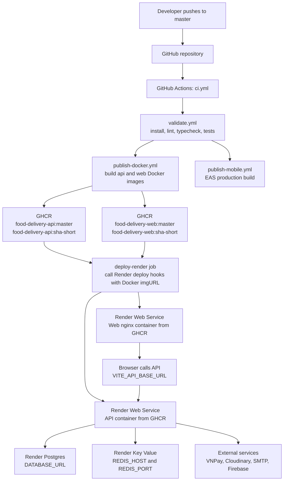

# Render CD Guide

This guide describes the recommended continuous deployment setup for this repository on Render. It assumes the existing GitHub Actions pipeline remains the source of truth for building and publishing Docker images.

## Current CI Contract

The root workflow `.github/workflows/ci.yml` runs on pushes to `master`:

1. `validate`
2. `publish-docker`
3. `publish-mobile`

The reusable Docker workflow `.github/workflows/publish-docker.yml` builds both apps and pushes prebuilt images to GitHub Container Registry (GHCR):

```text
ghcr.io/<owner>/<repo>-api:master
ghcr.io/<owner>/<repo>-api:sha-<short-sha>
ghcr.io/<owner>/<repo>-web:master
ghcr.io/<owner>/<repo>-web:sha-<short-sha>
```

Render should deploy these prebuilt images instead of rebuilding the monorepo.

## Recommended Render Topology

Use Render Free tier while the project is in development:

| Component              | Render resource             | Image/source                             | Plan                             |
| ---------------------- | --------------------------- | ---------------------------------------- | -------------------------------- |
| API                    | Web Service, Existing Image | `ghcr.io/<owner>/<repo>-api:master`      | Free                             |
| Web dashboard          | Web Service, Existing Image | `ghcr.io/<owner>/<repo>-web:master`      | Free                             |
| Postgres               | Render Postgres             | Managed database                         | Free for short-lived development |
| Redis-compatible cache | Render Key Value            | Managed Redis/Valkey-compatible instance | Free                             |

Free web services spin down after 15 minutes without traffic and can take about a minute to spin back up. This is acceptable for development/demo environments, not production.

Render Postgres Free databases are useful for short-lived development environments. Do not treat the Free database tier as durable production storage.

## One-Time Render Setup

### 1. Make GHCR Pullable by Render

If the GHCR packages are public, Render can pull them directly.

If they are private, create a GitHub personal access token with package read access, then add it in Render:

1. Open Render Dashboard.
2. Go to workspace registry credentials.
3. Add a Docker registry credential for `ghcr.io`.
4. Use your GitHub username and the package-read token.
5. Reuse that credential for both the API and web image-backed services.

Render supports prebuilt image-backed services and private images from GitHub Container Registry.

### 2. Create the API Web Service

1. Render Dashboard -> New -> Web Service.
2. Source Code -> Existing Image.
3. Image URL:

   ```text
   ghcr.io/<owner>/<repo>-api:master
   ```

4. Instance type: Free.
5. Port: the API Dockerfile exposes `3000`, and `apps/api/src/main.ts` also defaults to `3000` when `PORT` is unset.
6. Add registry credentials if the GHCR package is private.

Required environment variables:

```env
NODE_ENV=production
DATABASE_URL=<Render Postgres external or internal connection string>
BETTER_AUTH_SECRET=<at least 32 characters>
BETTER_AUTH_URL=https://<api-service>.onrender.com
CORS_ORIGIN=https://<web-service>.onrender.com
REDIS_HOST=<Render Key Value host>
REDIS_PORT=<Render Key Value port>
VNPAY_TMN_CODE=<merchant code or sandbox code>
VNPAY_HASH_SECRET=<hash secret or sandbox secret>
VNPAY_URL=https://sandbox.vnpayment.vn/paymentv2/vpcpay.html
VNPAY_RETURN_URL=https://<api-service>.onrender.com/api/payments/vnpay/return
CLOUDINARY_CLOUD_NAME=<cloud name>
CLOUDINARY_API_KEY=<api key>
CLOUDINARY_API_SECRET=<api secret>
```

The current API code expects `REDIS_HOST` and `REDIS_PORT`, not `REDIS_URL`. If Render only gives you an internal Key Value URL such as `redis://red-xxxx:6379`, split the hostname and port into those two variables. If you need external Key Value access with TLS/password, update `apps/api/src/lib/redis/redis.module.ts` before deploying.

Optional environment variables:

```env
PAYMENT_SESSION_TIMEOUT_SECONDS=1800
SMTP_HOST=
SMTP_PORT=587
SMTP_SECURE=false
SMTP_USER=
SMTP_PASS=
SMTP_FROM=noreply@soli.dev
FIREBASE_SERVICE_ACCOUNT_PATH=
```

### 3. Create the Web Dashboard Service

1. Render Dashboard -> New -> Web Service.
2. Source Code -> Existing Image.
3. Image URL:

   ```text
   ghcr.io/<owner>/<repo>-web:master
   ```

4. Instance type: Free.
5. Port: the web Dockerfile uses nginx and exposes `80`.
6. Add registry credentials if the GHCR package is private.

Important: the web app uses `import.meta.env.VITE_API_BASE_URL`. Vite embeds this value at build time, not at container runtime. The current prebuilt web image will use the value available during the CI Docker build. If CI does not pass `VITE_API_BASE_URL=https://<api-service>.onrender.com` during `docker build`, the deployed web image may still point at `http://localhost:3000`.

For the current pipeline, the API service is the safest first Render deployment target. Deploy the web image after updating the Docker build to pass the Render API URL as a build argument.

## Continuous Deployment from GitHub Actions

Use Render deploy hooks after `publish-docker` completes. This keeps CI responsible for image builds and asks Render only to pull and run the already-published image.

Create these GitHub Actions secrets:

```text
RENDER_API_DEPLOY_HOOK
RENDER_WEB_DEPLOY_HOOK
```

Each value should be the deploy hook URL from the matching Render service.

Then extend `.github/workflows/ci.yml` with a deploy job after `publish-docker`:

```yaml
deploy-render:
  name: Deploy prebuilt images to Render
  needs: publish-docker
  runs-on: ubuntu-latest
  if: github.ref == 'refs/heads/master'
  steps:
    - name: Deploy API image
      env:
        RENDER_API_DEPLOY_HOOK: ${{ secrets.RENDER_API_DEPLOY_HOOK }}
      run: |
        set -euo pipefail
        repo="${GITHUB_REPOSITORY,,}"
        image="ghcr.io/${repo}-api:sha-${GITHUB_SHA::7}"
        encoded_image="$(node -p "encodeURIComponent(process.argv[1])" "$image")"
        curl --fail --show-error --silent \
          "${RENDER_API_DEPLOY_HOOK}&imgURL=${encoded_image}"

    - name: Deploy web image
      env:
        RENDER_WEB_DEPLOY_HOOK: ${{ secrets.RENDER_WEB_DEPLOY_HOOK }}
      run: |
        set -euo pipefail
        repo="${GITHUB_REPOSITORY,,}"
        image="ghcr.io/${repo}-web:sha-${GITHUB_SHA::7}"
        encoded_image="$(node -p "encodeURIComponent(process.argv[1])" "$image")"
        curl --fail --show-error --silent \
          "${RENDER_WEB_DEPLOY_HOOK}&imgURL=${encoded_image}"
```

The snippet deploys the immutable short-SHA image that was just published by the `publish-docker` job. Render deploy hooks also support deploying a specific image tag or digest through the `imgURL` query parameter.

If you only want to deploy the API first, omit the `Deploy web image` step until the web image receives the correct `VITE_API_BASE_URL` at build time.

## CI/CD Architecture



## Optional Blueprint Reference

Manual setup is simpler for the first deployment, but a future `render.yaml` can document image-backed services:

```yaml
services:
  - type: web
    name: food-delivery-api
    runtime: image
    plan: free
    image:
      url: ghcr.io/<owner>/<repo>-api:master
      creds:
        fromRegistryCreds:
          name: ghcr-readonly
    envVars:
      - key: NODE_ENV
        value: production
      - key: DATABASE_URL
        sync: false
      - key: BETTER_AUTH_SECRET
        sync: false
      - key: BETTER_AUTH_URL
        value: https://<api-service>.onrender.com
      - key: CORS_ORIGIN
        value: https://<web-service>.onrender.com
      - key: REDIS_HOST
        sync: false
      - key: REDIS_PORT
        sync: false

  - type: web
    name: food-delivery-web
    runtime: image
    plan: free
    image:
      url: ghcr.io/<owner>/<repo>-web:master
      creds:
        fromRegistryCreds:
          name: ghcr-readonly
```

## Database Migrations

This repository has the API script:

```bash
pnpm --filter api db:migrate
```

The current production API image does not include dev dependencies such as `drizzle-kit`, so do not assume the container can run migrations after deployment. Use one of these approaches:

1. Run migrations from GitHub Actions before triggering Render deployment.
2. Create a dedicated migration image/stage that includes the migration tooling.
3. Run migrations manually from a trusted machine for early development.

Do not enable automatic API deploys before the migration path is decided, because the app can boot against an old schema.

## Verification Checklist

After each deployment:

1. Open `https://<api-service>.onrender.com/docs` and confirm the API reference loads.
2. Open `https://<api-service>.onrender.com/api-spec.json` and confirm JSON is returned.
3. Confirm CORS allows the web origin.
4. Confirm the API logs show successful Postgres and Redis connections.
5. Confirm the web app calls the Render API URL, not `localhost`.

## Sources

- Render prebuilt image deployments: https://render.com/docs/deploying-an-image
- Render deploy hooks with `imgURL`: https://render.com/docs/deploy-hooks
- Render Blueprint image credentials: https://render.com/docs/blueprint-spec
- Render Free tier behavior: https://render.com/docs/free
