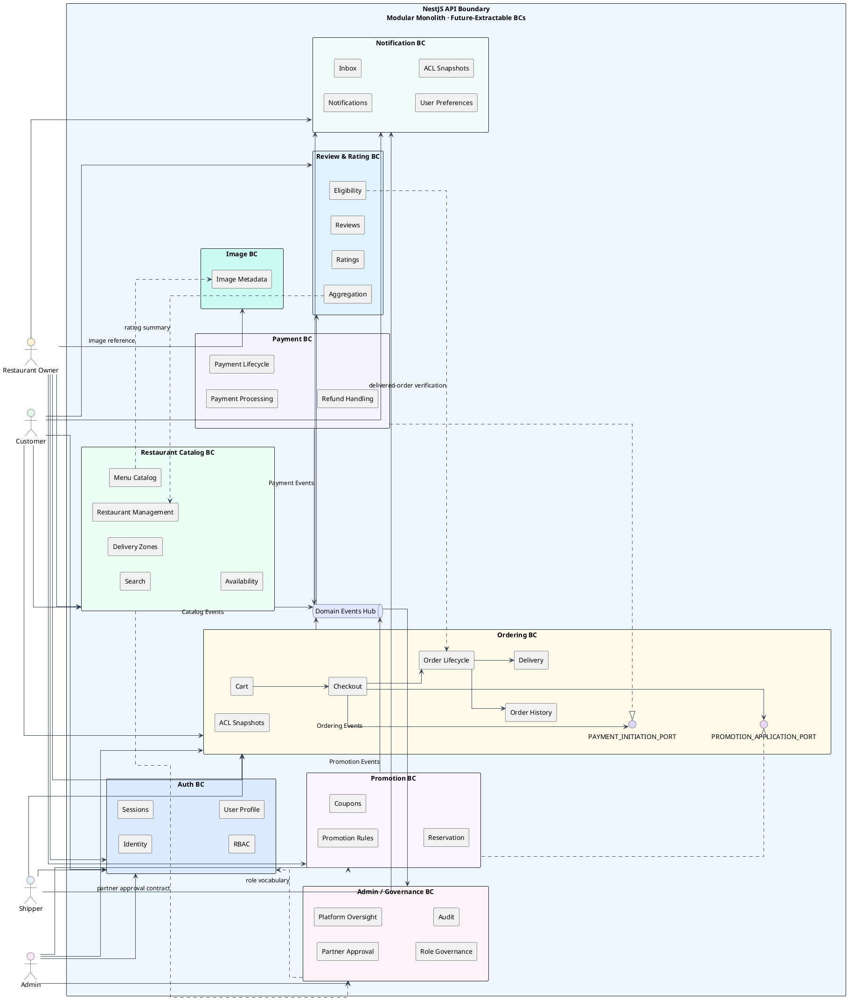
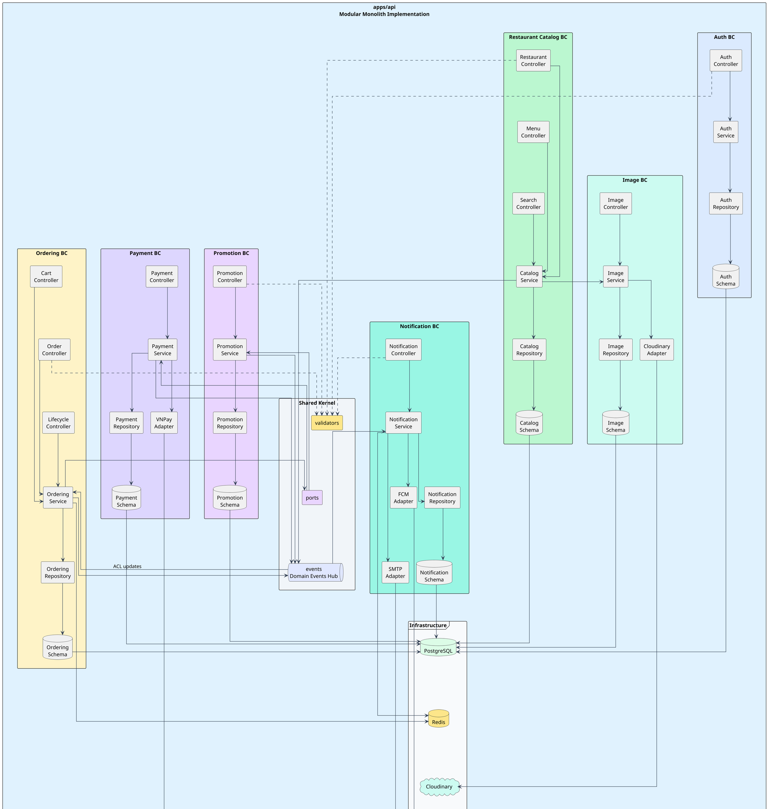
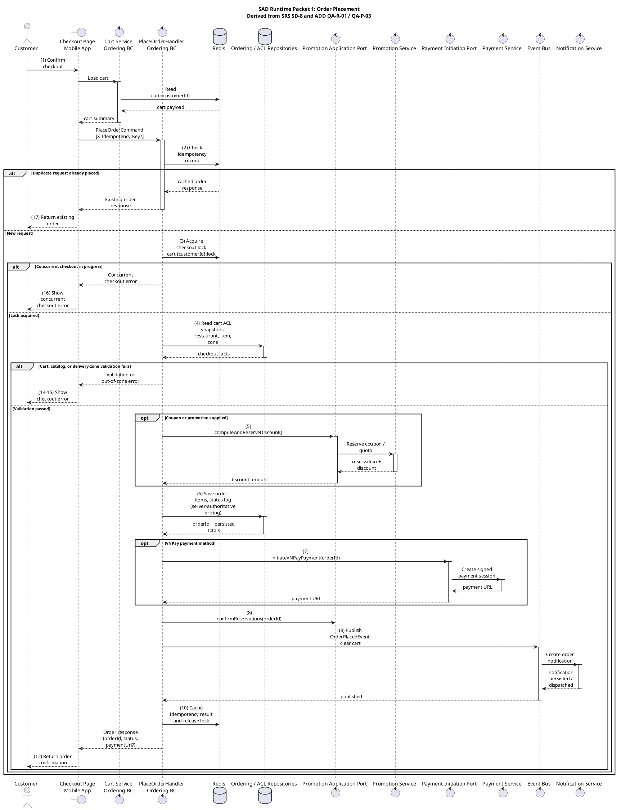
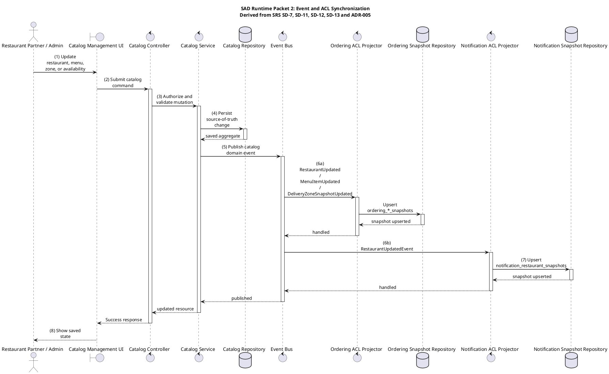
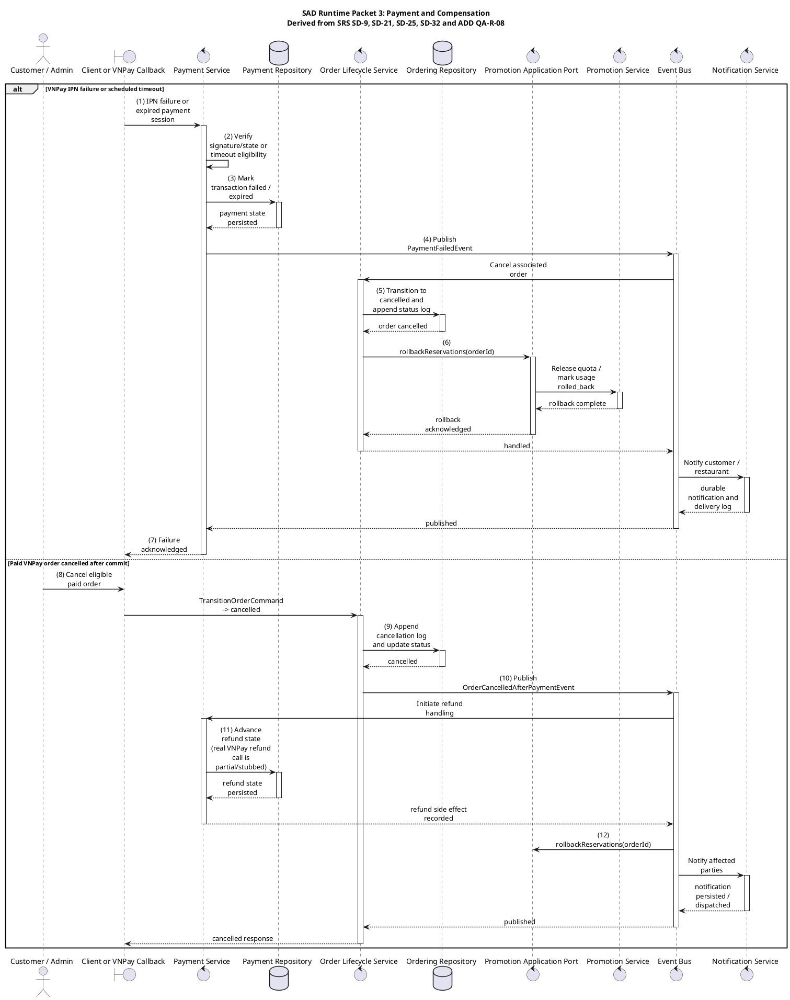
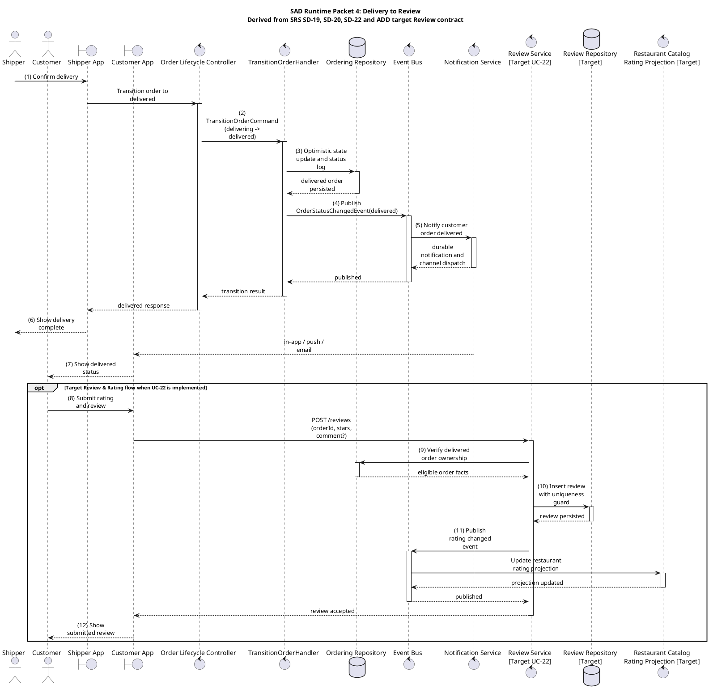

# **SoLi Food Delivery Platform Software Architecture Document (SAD)**

#### **CONTENT OWNER: Architecture Team**

**DOCUMENT NUMBER:** SAD-SOLI-FOODDELIVERY  
**RELEASE/REVISION:** 1.0  
**RELEASE/REVISION DATE:** 2026-05-23

All future revisions to this document shall be approved by the content owner prior to release.

---

## **Table of Contents**

**1** [**Documentation Roadmap**](#1-documentation-roadmap)

**1.1** [**Document Management and Configuration Control Information**](#11-document-management-and-configuration-control-information)

**1.2** [**Purpose and Scope of the SAD**](#12-purpose-and-scope-of-the-sad)

**1.3** [**How the SAD Is Organized**](#13-how-the-sad-is-organized)

**1.4** [**Stakeholder Representation**](#14-stakeholder-representation)

**1.5** [**Viewpoint Definitions**](#15-viewpoint-definitions)

**1.5.1** [**Logical Viewpoint Definition**](#151-logical-viewpoint-definition)

**1.5.1.1** [**Abstract**](#1511-abstract)

**1.5.1.2** [**Stakeholders and Their Concerns Addressed**](#1512-stakeholders-and-their-concerns-addressed)

**1.5.1.3** [**Elements, Relations, Properties, and Constraints**](#1513-elements-relations-properties-and-constraints)

**1.5.1.4** [**Language(s) to Model/Represent Conforming Views**](#1514-languages-to-modelrepresent-conforming-views)

**1.5.1.5** [**Applicable Evaluation/Analysis Techniques and Consistency/Completeness Criteria**](#1515-applicable-evaluationanalysis-techniques-and-consistencycompleteness-criteria)

**1.5.1.6** [**Viewpoint Source**](#1516-viewpoint-source)

**1.5.2** [**Implementation Viewpoint Definition**](#152-implementation-viewpoint-definition)

**1.5.2.1** [**Abstract**](#1521-abstract)

**1.5.2.2** [**Stakeholders and Their Concerns Addressed**](#1522-stakeholders-and-their-concerns-addressed)

**1.5.2.3** [**Elements, Relations, Properties, and Constraints**](#1523-elements-relations-properties-and-constraints)

**1.5.2.4** [**Language(s) to Model/Represent Conforming Views**](#1524-languages-to-modelrepresent-conforming-views)

**1.5.2.5** [**Applicable Evaluation/Analysis Techniques and Consistency/Completeness Criteria**](#1525-applicable-evaluationanalysis-techniques-and-consistencycompleteness-criteria)

**1.5.2.6** [**Viewpoint Source**](#1526-viewpoint-source)

**1.5.3** [**Data Viewpoint Definition**](#153-data-viewpoint-definition)

**1.5.3.1** [**Abstract**](#1531-abstract)

**1.5.3.2** [**Stakeholders and Their Concerns Addressed**](#1532-stakeholders-and-their-concerns-addressed)

**1.5.3.3** [**Elements, Relations, Properties, and Constraints**](#1533-elements-relations-properties-and-constraints)

**1.5.3.4** [**Language(s) to Model/Represent Conforming Views**](#1534-languages-to-modelrepresent-conforming-views)

**1.5.3.5** [**Applicable Evaluation/Analysis Techniques and Consistency/Completeness Criteria**](#1535-applicable-evaluationanalysis-techniques-and-consistencycompleteness-criteria)

**1.5.3.6** [**Viewpoint Source**](#1536-viewpoint-source)

**1.5.4** [**Runtime Viewpoint Definition**](#154-runtime-viewpoint-definition)

**1.5.4.1** [**Abstract**](#1541-abstract)

**1.5.4.2** [**Stakeholders and Their Concerns Addressed**](#1542-stakeholders-and-their-concerns-addressed)

**1.5.4.3** [**Elements, Relations, Properties, and Constraints**](#1543-elements-relations-properties-and-constraints)

**1.5.4.4** [**Language(s) to Model/Represent Conforming Views**](#1544-languages-to-modelrepresent-conforming-views)

**1.5.4.5** [**Applicable Evaluation/Analysis Techniques and Consistency/Completeness Criteria**](#1545-applicable-evaluationanalysis-techniques-and-consistencycompleteness-criteria)

**1.5.4.6** [**Viewpoint Source**](#1546-viewpoint-source)

**1.5.5** [**Deployment Viewpoint Definition**](#155-deployment-viewpoint-definition)

**1.5.5.1** [**Abstract**](#1551-abstract)

**1.5.5.2** [**Stakeholders and Their Concerns Addressed**](#1552-stakeholders-and-their-concerns-addressed)

**1.5.5.3** [**Elements, Relations, Properties, and Constraints**](#1553-elements-relations-properties-and-constraints)

**1.5.5.4** [**Language(s) to Model/Represent Conforming Views**](#1554-languages-to-modelrepresent-conforming-views)

**1.5.5.5** [**Applicable Evaluation/Analysis Techniques and Consistency/Completeness Criteria**](#1555-applicable-evaluationanalysis-techniques-and-consistencycompleteness-criteria)

**1.5.5.6** [**Viewpoint Source**](#1556-viewpoint-source)

**1.5.6** [**Development / Process Viewpoint Definition**](#156-development--process-viewpoint-definition)

**1.5.6.1** [**Abstract**](#1561-abstract)

**1.5.6.2** [**Stakeholders and Their Concerns Addressed**](#1562-stakeholders-and-their-concerns-addressed)

**1.5.6.3** [**Elements, Relations, Properties, and Constraints**](#1563-elements-relations-properties-and-constraints)

**1.5.6.4** [**Language(s) to Model/Represent Conforming Views**](#1564-languages-to-modelrepresent-conforming-views)

**1.5.6.5** [**Applicable Evaluation/Analysis Techniques and Consistency/Completeness Criteria**](#1565-applicable-evaluationanalysis-techniques-and-consistencycompleteness-criteria)

**1.5.6.6** [**Viewpoint Source**](#1566-viewpoint-source)

**1.6** [**How a View is Documented**](#16-how-a-view-is-documented)

**1.7** [**Relationship to Other SADs**](#17-relationship-to-other-sads)

**1.8** [**Process for Updating this SAD**](#18-process-for-updating-this-sad)

**2** [**Architecture Background**](#2-architecture-background)

**2.1** [**Problem Background**](#21-problem-background)

**2.1.1** [**System Overview**](#211-system-overview)

**2.1.2** [**Goals and Context**](#212-goals-and-context)

**2.1.3** [**Significant Driving Requirements**](#213-significant-driving-requirements)

**2.2** [**Solution Background**](#22-solution-background)

**2.2.1** [**Architectural Approaches**](#221-architectural-approaches)

**2.2.2** [**Analysis Results**](#222-analysis-results)

**2.2.3** [**Requirements Coverage**](#223-requirements-coverage)

**2.2.4** [**Summary of Background Changes Reflected in Current Version**](#224-summary-of-background-changes-reflected-in-current-version)

**2.3** [**Product Line Reuse Considerations**](#23-product-line-reuse-considerations)

**3** [**Views**](#3-views)

**3.1** [**Logical View**](#31-logical-view)

**3.1.1** [**View Description**](#311-view-description)

**3.1.2** [**View Packet Overview**](#312-view-packet-overview)

**3.1.3** [**Architecture Background**](#313-architecture-background)

**3.1.4** [**Variability Mechanisms**](#314-variability-mechanisms)

**3.1.5** [**View Packets**](#315-view-packets)

**3.1.5.1** [**Logical Architecture Packet**](#3151-logical-architecture-packet)

3.1.5.1.1 Primary Presentation

3.1.5.1.2 Element Catalog

3.1.5.1.3 Context Diagram

3.1.5.1.4 Variability Mechanisms

3.1.5.1.5 Architecture Background

3.1.5.1.6 Related View Packets

**3.2** [**Implementation View**](#32-implementation-view)

**3.2.1** [**View Description**](#321-view-description)

**3.2.2** [**View Packet Overview**](#322-view-packet-overview)

**3.2.3** [**Architecture Background**](#323-architecture-background)

**3.2.4** [**Variability Mechanisms**](#324-variability-mechanisms)

**3.2.5** [**View Packets**](#325-view-packets)

**3.2.5.1** [**Source and Artifact Packet**](#3251-source-and-artifact-packet)

3.2.5.1.1 Primary Presentation

3.2.5.1.2 Element Catalog

3.2.5.1.3 Context Diagram

3.2.5.1.4 Variability Mechanisms

3.2.5.1.5 Architecture Background

3.2.5.1.6 Related View Packets

**3.3** [**Data View**](#33-data-view)

**3.3.1** [**View Description**](#331-view-description)

**3.3.2** [**View Packet Overview**](#332-view-packet-overview)

**3.3.3** [**Architecture Background**](#333-architecture-background)

**3.3.4** [**Variability Mechanisms**](#334-variability-mechanisms)

**3.3.5** [**View Packets**](#335-view-packets)

**3.3.5.1** [**Data Ownership Packet**](#3351-data-ownership-packet)

3.3.5.1.1 Primary Presentation

3.3.5.1.2 Element Catalog

3.3.5.1.3 Context Diagram

3.3.5.1.4 Variability Mechanisms

3.3.5.1.5 Architecture Background

3.3.5.1.6 Related View Packets

**3.4** [**Runtime View**](#34-runtime-view)

**3.4.1** [**View Description**](#341-view-description)

**3.4.2** [**View Packet Overview**](#342-view-packet-overview)

**3.4.3** [**Architecture Background**](#343-architecture-background)

**3.4.4** [**Variability Mechanisms**](#344-variability-mechanisms)

**3.4.5** [**View Packets**](#345-view-packets)

**3.4.5.1** [**Order Placement Runtime Packet**](#3451-order-placement-runtime-packet)

3.4.5.1.1 Primary Presentation

3.4.5.1.2 Element Catalog

3.4.5.1.3 Context Diagram

3.4.5.1.4 Variability Mechanisms

3.4.5.1.5 Architecture Background

3.4.5.1.6 Related View Packets

**3.4.5.2** [**Event and ACL Synchronization Runtime Packet**](#3452-event-and-acl-synchronization-runtime-packet)

3.4.5.2.1 Primary Presentation

3.4.5.2.2 Element Catalog

3.4.5.2.3 Context Diagram

3.4.5.2.4 Variability Mechanisms

3.4.5.2.5 Architecture Background

3.4.5.2.6 Related View Packets

**3.4.5.3** [**Payment Compensation Runtime Packet**](#3453-payment-compensation-runtime-packet)

3.4.5.3.1 Primary Presentation

3.4.5.3.2 Element Catalog

3.4.5.3.3 Context Diagram

3.4.5.3.4 Variability Mechanisms

3.4.5.3.5 Architecture Background

3.4.5.3.6 Related View Packets

**3.4.5.4** [**Delivery to Review Runtime Packet**](#3454-delivery-to-review-runtime-packet)

3.4.5.4.1 Primary Presentation

3.4.5.4.2 Element Catalog

3.4.5.4.3 Context Diagram

3.4.5.4.4 Variability Mechanisms

3.4.5.4.5 Architecture Background

3.4.5.4.6 Related View Packets

**3.5** [**Deployment View**](#35-deployment-view)

**3.5.1** [**View Description**](#351-view-description)

**3.5.2** [**View Packet Overview**](#352-view-packet-overview)

**3.5.3** [**Architecture Background**](#353-architecture-background)

**3.5.4** [**Variability Mechanisms**](#354-variability-mechanisms)

**3.5.5** [**View Packets**](#355-view-packets)

**3.5.5.1** [**Runtime Deployment Packet**](#3551-runtime-deployment-packet)

3.5.5.1.1 Primary Presentation

3.5.5.1.2 Element Catalog

3.5.5.1.3 Context Diagram

3.5.5.1.4 Variability Mechanisms

3.5.5.1.5 Architecture Background

3.5.5.1.6 Related View Packets

**3.6** [**Development / Process View**](#36-development--process-view)

**3.6.1** [**View Description**](#361-view-description)

**3.6.2** [**View Packet Overview**](#362-view-packet-overview)

**3.6.3** [**Architecture Background**](#363-architecture-background)

**3.6.4** [**Variability Mechanisms**](#364-variability-mechanisms)

**3.6.5** [**View Packets**](#365-view-packets)

**3.6.5.1** [**Validation and Release Packet**](#3651-validation-and-release-packet)

3.6.5.1.1 Primary Presentation

3.6.5.1.2 Element Catalog

3.6.5.1.3 Context Diagram

3.6.5.1.4 Variability Mechanisms

3.6.5.1.5 Architecture Background

3.6.5.1.6 Related View Packets

**4** [**Relations Among Views**](#4-relations-among-views)

**4.1** [**General Relations Among Views**](#41-general-relations-among-views)

**4.2** [**View-to-View Relations**](#42-view-to-view-relations)

**5** [**Referenced Materials**](#5-referenced-materials)

**6** [**Directory**](#6-directory)

**6.1** [**Index**](#61-index)

**6.2** [**Glossary**](#62-glossary)

**6.3** [**Acronym List**](#63-acronym-list)

**7** [**Sample Figures & Tables**](#7-sample-figures--tables)

---

## **List of Figures**

Figure 1: Logical View - bounded contexts and domain dependencies  
Figure 2: Implementation View - code units, persistence, adapters, clients, and delivery artifacts  
Figure 3: Data View - PostgreSQL ownership, Redis state, and external data owners  
Figure 4: Runtime View Packet 1 - Order Placement Runtime  
Figure 5: Runtime View Packet 2 - Event and ACL Synchronization Runtime  
Figure 6: Runtime View Packet 3 - Payment Compensation Runtime  
Figure 7: Runtime View Packet 4 - Delivery to Review Runtime  
Figure 8: Deployment View - runtime nodes and external services  
Figure 9: Development / Process View - validation, packaging, and release flow

## **List of Tables**

Table 1: Document revision history  
Table 2: Stakeholders and Relevant Viewpoints  
Table 3: Viewpoints Defined in this SAD  
Table 4: Significant Driving Requirements  
Table 5: Architectural Approaches and ADR Use  
Table 6: Analysis Results  
Table 7: Requirements Coverage Summary  
Table 8: Views Presented in this SAD  
Table 9: Logical View Packet Overview  
Table 10: Logical View Element Catalog  
Table 11: Implementation View Packet Overview  
Table 12: Implementation View Element Catalog  
Table 13: Data View Packet Overview  
Table 14: Data Ownership Catalog  
Table 15: Runtime View Packet Overview  
Table 16: Runtime Scenario Trace  
Table 17: Deployment View Packet Overview  
Table 18: Deployment Assumptions  
Table 19: Development / Process View Packet Overview  
Table 20: Process Catalog  
Table 21: General Relations Among Views  
Table 22: View-to-View Relations  
Table 23: Referenced Materials  
Table 24: Architecture Element Index  
Table 25: Glossary  
Table 26: Acronym List  
Table 27: Sample Figures and Tables Status

---

### **1 Documentation Roadmap**

The Documentation Roadmap is the entry point for readers of this SAD. It explains the document control information, scope, organization, stakeholder mapping, viewpoint definitions, view documentation rules, relationship to companion architecture documents, and the update process.

Subsections of Section 1 follow the SAD template structure:

- Section 1.1 records revision management and configuration control information.
- Section 1.2 defines the purpose and scope of the SAD.
- Section 1.3 explains how the SAD is organized.
- Section 1.4 maps stakeholders to architecture viewpoints.
- Section 1.5 defines the viewpoints used by Section 3 views.
- Section 1.6 defines the standard view-packet format.
- Section 1.7 identifies relationship to other SADs and companion architecture artifacts.
- Section 1.8 defines the process for updating this SAD.

#### **1.1 Document Management and Configuration Control Information**

_Table 1: Document revision history_

| Revision Number | Revision Release Date | Purpose of Revision | Scope of Revision |
|---|---|---|---|
| 1.0 | 2026-05-23 | Establish a template-compliant Software Architecture Document for the SoLi Food Delivery Platform. | Entire SAD organized according to SAD-Template.md; architecture content migrated from ASR, ADD, ADR, traceability matrices, requirements documents, deployment artifacts, and source evidence. |

#### **1.2 Purpose and Scope of the SAD**

This SAD specifies the software architecture for the SoLi Food Delivery Platform. It documents the structures of the system, the externally visible properties of architectural elements, and the relationships among those elements. It uses the SEI Views and Beyond style from SAD-Template.md.

The scope covers:

- Backend API: NestJS modular monolith under apps/api.
- Web dashboard: React/Vite dashboard under apps/web.
- Mobile application: Expo React Native application under apps/mobile.
- Persistent data: PostgreSQL with Drizzle ORM schemas grouped by bounded-context ownership.
- Runtime state: Redis / Valkey for cart, checkout locks, idempotency, presence, unread-count acceleration, and planned rate-limit buckets.
- External providers: VNPay, Cloudinary, Firebase Cloud Messaging, and SMTP email.
- Delivery process: GitHub Actions validation, Docker image publication, mobile artifact publication, and Render image-based deployment.

The SAD includes architectural information only: elements, relations, externally visible behavior, constraints, quality-attribute tactics, and traceability. Detailed endpoint contracts, screen layouts, and private code logic belong to downstream requirements, source code, and test artifacts.

Source authority rule: when a structure is present in repository source, this SAD uses the repository as the primary evidence. When a target architecture structure is required by the approved requirements, ASR, ADD, or ADR documents and a matching source unit is absent from the repository, this SAD keeps the structure as an architecture contract and traces it to those approved documents. Tables 10, 12, 14, and 22 make this distinction explicit without adding progress labels.

#### **1.3 How the SAD Is Organized**

This SAD is organized into the following template sections:

- **Section 1, Documentation Roadmap,** provides document control, purpose, stakeholder mapping, viewpoint definitions, view documentation rules, relationship to companion SADs, and update process.
- **Section 2, Architecture Background,** explains the problem background, goals, significant driving requirements, architectural approaches, analysis results, requirements coverage, background changes, and product-line reuse considerations.
- **Section 3, Views,** specifies the Logical, Implementation, Data, Runtime, Deployment, and Development / Process views. Each view conforms to a viewpoint defined in Section 1.5 and is documented with view packets as required by Section 1.6.
- **Section 4, Relations Among Views,** records consistency relations and mappings among views.
- **Section 5, Referenced Materials,** lists source documents and source artifacts cited by this SAD.
- **Section 6, Directory,** provides an index, glossary, and acronym list.
- **Section 7, Sample Figures & Tables,** is retained for template compliance and records the sample-section status for this project document.

#### **1.4 Stakeholder Representation**

_Table 2: Stakeholders and Relevant Viewpoints_

| Stakeholder | Concerns addressed by this SAD | Viewpoint(s) that apply to that class of stakeholder concerns |
|---|---|---|
| Customers | Fast discovery, predictable checkout, payment safety, order status visibility, review eligibility. | Logical, Runtime, Deployment, Data |
| Restaurant partners | Menu management, availability updates, order intake, promotion management, reliable notifications. | Logical, Runtime, Implementation, Data |
| Delivery personnel | Assignment correctness, status transitions, delivery confirmation, mobile connectivity. | Logical, Runtime, Deployment |
| Platform administrators | Partner governance, role control, platform oversight, cancellation/refund authority, reporting, auditability. | Logical, Data, Runtime, Development / Process |
| Development team | Module ownership, code navigation, testability, release flow, schema migration flow. | Implementation, Data, Development / Process |
| Architecture reviewers | Traceability, consistency among views, ADR alignment, quality-attribute tactics, risk posture. | All viewpoints |
| Operations and deployment owners | Runtime topology, provider configuration, availability and scaling assumptions, delivery process. | Deployment, Development / Process, Data |
| External providers | Stable integration boundaries, secure protocol usage, clear data ownership. | Runtime, Deployment, Data |

#### **1.5 Viewpoint Definitions**

The SAD uses six viewpoints. Each viewpoint has a corresponding view in Section 3.

_Table 3: Viewpoints Defined in this SAD_

| Viewpoint | Corresponding view | Primary structure type | Main stakeholder concerns |
|---|---|---|---|
| Logical | 3.1 Logical View | Module and domain structure | Business capability ownership, bounded-context boundaries, cross-context contracts. |
| Implementation | 3.2 Implementation View | Module and allocation structure | Repository structure, source ownership, build artifacts, source-to-architecture mapping. |
| Data | 3.3 Data View | Data model structure | Data ownership, persistence boundaries, snapshot rules, external data authority. |
| Runtime | 3.4 Runtime View | Component-and-connector structure | Dynamic behavior for checkout, event projection, payment compensation, delivery and review. |
| Deployment | 3.5 Deployment View | Allocation structure | Runtime nodes, scaling, shared state, provider integration, CI/CD release topology. |
| Development / Process | 3.6 Development / Process View | Allocation and process structure | Validation gates, packaging, migration sequencing, release artifacts. |

##### **1.5.1 Logical Viewpoint Definition**

###### **1.5.1.1 Abstract**

Views conforming to the Logical viewpoint partition the platform by business capability and bounded context.

###### **1.5.1.2 Stakeholders and Their Concerns Addressed**

Customers, restaurant partners, delivery personnel, administrators, development team members, and architecture reviewers use this viewpoint to understand which business responsibilities belong to each context and which cross-context relationships are allowed.

###### **1.5.1.3 Elements, Relations, Properties, and Constraints**

Elements are actors, bounded contexts, domain components, shared ports, and domain-event channels. Relations include actor access, context dependency, event publication/subscription, ACL projection, and port realization. Constraints include single ownership for each business rule and explicit dependency boundaries between contexts.

###### **1.5.1.4 Language(s) to Model/Represent Conforming Views**

PlantUML component notation and text element catalogs.

###### **1.5.1.5 Applicable Evaluation/Analysis Techniques and Consistency/Completeness Criteria**

Completeness criteria: every SRS domain and every AD-1 through AD-12 driver maps to one bounded context or cross-context relation; every ADR is visible through at least one logical element or relation; no context owns another context's business state.

###### **1.5.1.6 Viewpoint Source**

SAD-Template.md, ADD_FoodDelivery.md Logical View, ADR-001, ADR-002, ADR-004, ADR-005, and the traceability matrices.

##### **1.5.2 Implementation Viewpoint Definition**

###### **1.5.2.1 Abstract**

Views conforming to the Implementation viewpoint map architectural responsibilities to source units, modules, schemas, adapters, client applications, tests, and delivery artifacts.

###### **1.5.2.2 Stakeholders and Their Concerns Addressed**

Developers, testers, maintainers, release owners, and architecture reviewers use this viewpoint to locate architectural responsibilities in the repository and to verify that source ownership follows bounded-context ownership.

###### **1.5.2.3 Elements, Relations, Properties, and Constraints**

Elements include apps/api NestJS modules, apps/mobile features, apps/web features, infrastructure modules, shared events, shared ports, Drizzle schemas, Redis access, external-provider adapters, workflows, and container artifacts. Relations include source dependency, composition, adapter binding, schema export, workflow dependency, and artifact publication.

###### **1.5.2.4 Language(s) to Model/Represent Conforming Views**

PlantUML component notation, repository links, and text catalogs.

###### **1.5.2.5 Applicable Evaluation/Analysis Techniques and Consistency/Completeness Criteria**

Completeness criteria: every major backend context, shared contract, storage mechanism, provider boundary, client surface, and CI/CD artifact has an owner and trace. Consistency criteria: source units must not contradict the logical ownership model.

###### **1.5.2.6 Viewpoint Source**

ADD_FoodDelivery.md Implementation View, apps/api source tree, apps/web source tree, apps/mobile source tree, ADR-001 through ADR-008, and CI/CD workflows.

##### **1.5.3 Data Viewpoint Definition**

###### **1.5.3.1 Abstract**

Views conforming to the Data viewpoint show durable data ownership, runtime state ownership, external data authority, and allowed references among data groups.

###### **1.5.3.2 Stakeholders and Their Concerns Addressed**

Developers, DB maintainers, testers, administrators, and architecture reviewers use this viewpoint to understand which context owns each table group, which state is volatile, and which provider owns external records.

###### **1.5.3.3 Elements, Relations, Properties, and Constraints**

Elements include PostgreSQL table groups, Redis key groups, and provider-owned data records. Relations include ownership, logical reference, event-projected snapshot, foreign-key-like local relation, and external-provider reference. Constraints include module-owned schemas, cross-context ID references, and local snapshots for cross-context reads.

###### **1.5.3.4 Language(s) to Model/Represent Conforming Views**

PlantUML entity/class notation and data ownership catalogs.

###### **1.5.3.5 Applicable Evaluation/Analysis Techniques and Consistency/Completeness Criteria**

Completeness criteria: each durable or runtime data item has a bounded-context owner or external provider owner; cross-context references are explicit; Redis state is separate from PostgreSQL durable state.

###### **1.5.3.6 Viewpoint Source**

ADD_FoodDelivery.md Data View, ADR-003, ADR-005, ADR-006, ADR-008, and Drizzle schema exports.

##### **1.5.4 Runtime Viewpoint Definition**

###### **1.5.4.1 Abstract**

Views conforming to the Runtime viewpoint show dynamic interactions among actors, clients, modules, ports, EventBus handlers, storage, and providers for architecturally significant scenarios.

###### **1.5.4.2 Stakeholders and Their Concerns Addressed**

Customers, restaurant partners, delivery personnel, administrators, testers, and architecture reviewers use this viewpoint to understand behavior under stimulus: order placement, catalog-to-ACL synchronization, payment compensation, and delivery-to-review flow.

###### **1.5.4.3 Elements, Relations, Properties, and Constraints**

Elements include actors, clients, command handlers, services, ports, event bus, projectors, repositories, databases, Redis, and providers. Relations include synchronous call, transaction boundary, event publication, event handling, compensation, and notification delivery.

###### **1.5.4.4 Language(s) to Model/Represent Conforming Views**

PlantUML sequence diagrams and runtime scenario trace tables.

###### **1.5.4.5 Applicable Evaluation/Analysis Techniques and Consistency/Completeness Criteria**

Completeness criteria: every runtime packet maps to at least one SRS UC, one ASR driver, one ADD quality scenario, and one ADR. Runtime packets must not duplicate static source decomposition from the Implementation View.

###### **1.5.4.6 Viewpoint Source**

SRS_FoodDelivery.md, SRS_SequenceDiagrams.md, Utility-Tree-ASRs.md, ADD_FoodDelivery.md Runtime scenarios, and ADR-004, ADR-006, ADR-007, ADR-008.

##### **1.5.5 Deployment Viewpoint Definition**

###### **1.5.5.1 Abstract**

Views conforming to the Deployment viewpoint allocate software artifacts to runtime nodes, shared state services, managed databases, external providers, and delivery infrastructure.

###### **1.5.5.2 Stakeholders and Their Concerns Addressed**

Operations owners, release owners, developers, security reviewers, and architecture reviewers use this viewpoint to reason about availability, horizontal scaling, shared state, provider boundaries, and deployment dependencies.

###### **1.5.5.3 Elements, Relations, Properties, and Constraints**

Elements include client devices, HTTPS edge, load balancer, API runtime group, static web service, PostgreSQL, Redis / Valkey, Cloudinary, VNPay, FCM, SMTP, GitHub Actions, GHCR, and Render deploy hooks. Relations include HTTP, WebSocket, image pull, provider call, shared-state access, and monitoring flow.

###### **1.5.5.4 Language(s) to Model/Represent Conforming Views**

PlantUML deployment notation and deployment assumption tables.

###### **1.5.5.5 Applicable Evaluation/Analysis Techniques and Consistency/Completeness Criteria**

Completeness criteria: the deployment view includes client apps, load balancer, API Instance 1, API Instance 2, autoscaling design, Redis, PostgreSQL, Cloudinary, VNPay, FCM, email, CI/CD, and at least two runtime API instances.

###### **1.5.5.6 Viewpoint Source**

ADD_FoodDelivery.md Deployment View, CD_GUIDE.md, docker-compose.yml, Dockerfiles, GitHub workflows, ADR-001, ADR-003, ADR-006, ADR-007, ADR-008.

##### **1.5.6 Development / Process Viewpoint Definition**

###### **1.5.6.1 Abstract**

Views conforming to the Development / Process viewpoint show how source changes pass through validation, packaging, database-shape checks, image publication, mobile artifact publication, and runtime release.

###### **1.5.6.2 Stakeholders and Their Concerns Addressed**

Developers, testers, release owners, operations owners, and architecture reviewers use this viewpoint to verify that release artifacts are validated and that source, schema, and runtime artifacts remain aligned.

###### **1.5.6.3 Elements, Relations, Properties, and Constraints**

Elements include repository source, CI workflow, validation workflow, Postgres/Redis CI services, lint/typecheck/audit/test/build steps, Docker publication workflow, mobile publication workflow, GHCR images, APK artifact, migration gate, and Render services. Relations include workflow dependency, artifact generation, publication, and release dependency.

###### **1.5.6.4 Language(s) to Model/Represent Conforming Views**

PlantUML component/activity style and process catalogs.

###### **1.5.6.5 Applicable Evaluation/Analysis Techniques and Consistency/Completeness Criteria**

Completeness criteria: each release artifact passes through validation and has a packaging or deployment destination; migration and environment configuration are visible in the process.

###### **1.5.6.6 Viewpoint Source**

GitHub workflows, CD_GUIDE.md, Dockerfiles, Drizzle schema flow, and ADR-008.

#### **1.6 How a View is Documented**

Section 3 contains one view for each viewpoint listed in Section 1.5. Each view is documented as a set of view packets. The letter i denotes the view number and j denotes the view-packet number.

- Section 3.i: Name of view.
- Section 3.i.1: View Description.
- Section 3.i.2: View Packet Overview.
- Section 3.i.3: Architecture Background.
- Section 3.i.4: Variability Mechanisms.
- Section 3.i.5: View Packets.
- Section 3.i.5.j: View packet j.
- Section 3.i.5.j.1: Primary Presentation.
- Section 3.i.5.j.2: Element Catalog.
- Section 3.i.5.j.2.1: Elements.
- Section 3.i.5.j.2.2: Relations.
- Section 3.i.5.j.2.3: Interfaces.
- Section 3.i.5.j.2.4: Behavior.
- Section 3.i.5.j.2.5: Constraints.
- Section 3.i.5.j.3: Context Diagram.
- Section 3.i.5.j.4: Variability Mechanisms.
- Section 3.i.5.j.5: Architecture Background.
- Section 3.i.5.j.6: Related View Packets.

#### **1.7 Relationship to Other SADs**

This is the SAD for the SoLi Food Delivery Platform in this repository. It incorporates by reference the ASR, ADD, ADR, SRS, use-case, user-story, deployment, and source artifacts listed in Section 5. No separate SoLi SAD supersedes this document.

#### **1.8 Process for Updating this SAD**

Updates to this SAD follow this process:

1. Identify the changed requirement, driver, decision, view element, source artifact, or deployment artifact.
2. Update the owning source artifact first when the change belongs outside the SAD.
3. Update the affected viewpoint definition, view packet, relation table, referenced material, index, glossary, or acronym list.
4. Recheck traceability from User Story to UC to SRS to ASR to ADD to ADR to SAD.
5. Recheck figure order, table order, local links, diagram block balance, and banned progress wording.
6. Record the revision in Table 1.

---

### **2 Architecture Background**

#### **2.1 Problem Background**

##### **2.1.1 System Overview**

SoLi is a multi-role food delivery marketplace that connects customers, restaurant partners, delivery personnel, administrators, and external providers. The system supports account access, restaurant discovery, cart and checkout, COD and VNPay payment, menu and availability management, order lifecycle transitions, promotions, notifications, delivery completion, review/rating, and administrative governance.

The backend architecture is a modular monolith: one NestJS API deployable contains bounded contexts with explicit module ownership, local persistence boundaries, in-process EventBus integration, ACL snapshots, Redis runtime state, and ports/adapters for external or cross-context variation points.

##### **2.1.2 Goals and Context**

The business goals originate from the Vision and Scope document and BRD:

- BO-1: reduce average ordering time below five minutes.
- BO-2: increase restaurant partner daily order volume.
- BO-3: achieve a delivery success rate of 95 percent or higher.
- BO-4: process a high share of completed orders through digital payment.

The binding business rules are:

- BR-1: partner verification before operation.
- BR-2: single-restaurant cart constraint.
- BR-3: delivery radius constraint.
- BR-4: COD and VNPay payment methods with server-side payment confirmation.
- BR-5: commission calculation from completed order GMV.
- BR-6: one designated operating service area.
- BR-7: sequential order lifecycle integrity.
- BR-8: real-time restaurant and item availability control.
- BR-9: exclusion of B2B enterprise ordering and subscription meal plans.

##### **2.1.3 Significant Driving Requirements**

_Table 4: Significant Driving Requirements_

| Driver | Requirement pressure | Architecture response | Trace |
|---|---|---|---|
| AD-1 | Exactly-once order creation under retry and network loss. | Redis idempotency key, cart checkout lock, database uniqueness, ACID order transaction. | US-7, UC-8, QA-R-01, ADR-004, ADR-006, ADR-008 |
| AD-2 | Online payment integrity. | VNPay HMAC-SHA512 verification, constant-time comparison, idempotent IPN processing, transaction versioning. | US-7, UC-9, UC-25, QA-S-01, QA-R-02, ADR-007, ADR-008 |
| AD-3 | Bounded-context decoupling under one deployable. | Modular monolith, module ownership, domain events, ACL snapshots, shared ports. | UC-2 through UC-35, QA-MA-01, ADR-001, ADR-002, ADR-005 |
| AD-4 | Real-time order status visibility. | Notification Gateway, durable inbox, Redis presence, FCM/email/in-app channels. | US-9, UC-20, UC-26, QA-P-02, QA-A-02, ADR-004, ADR-006 |
| AD-5 | Order state-machine integrity. | Closed transition map, role-scoped transitions, optimistic locking, order status logs. | US-8, UC-14 through UC-21, QA-R-03, ADR-002, ADR-008 |
| AD-6 | Single-restaurant cart constraint. | Redis cart state keyed by customer, cart validation, checkout revalidation. | US-5, US-22, UC-4, UC-5, QA-R-04, ADR-006 |
| AD-7 | Delivery radius constraint. | Geo service, delivery-zone snapshots, checkout pricing and ETA validation. | US-6, US-20, UC-6 through UC-8, QA-CI-01, ADR-005 |
| AD-8 | Partner approval integrity. | Auth role model, restaurant approval contract, shipper eligibility, partner activation control. | US-10, US-14, US-18, UC-11, UC-16, UC-27, UC-28, ADR-002 |
| AD-9 | Optional notification degradation. | Provider abstraction, durable inbox, no-op/stub providers, channel dispatcher isolation. | US-9, UC-26, QA-A-03, QA-FL-03, ADR-007 |
| AD-10 | Privileged-action auditability. | Order status logs, payment transactions, notification delivery logs, governance audit trail. | US-25 through US-32, UC-27 through UC-35, QA-SUP-01, ADR-003, ADR-008 |
| AD-11 | Public endpoint abuse control. | Planned Redis-backed rate-limit buckets at edge or Nest layer, role-aware public/private endpoint policy. | UC-1, UC-2, UC-31, UC-35, QA-S-06, ADR-006, ADR-007 |
| AD-12 | Post-commit compensation reliability. | Payment refund handler, promotion reservation rollback/confirmation, idempotent event handlers. | UC-21, UC-25, UC-32, QA-R-08, ADR-004, ADR-007, ADR-008 |

#### **2.2 Solution Background**

##### **2.2.1 Architectural Approaches**

_Table 5: Architectural Approaches and ADR Use_

| ADR | Accepted approach | SAD location | Driver and QA trace |
|---|---|---|---|
| ADR-001 | Modular monolith architecture. | Logical, Implementation, Deployment, Development / Process views. | AD-1, AD-3, AD-4, QA-MA-01, QA-SC-01 |
| ADR-002 | Bounded-context separation. | Logical, Implementation, Data views. | AD-3, AD-5, AD-8, QA-CI-01 |
| ADR-003 | Database per BC ownership. | Data View and Relations Among Views. | AD-3, AD-5, AD-10, QA-MA-02 |
| ADR-004 | In-process EventBus communication. | Logical and Runtime views. | AD-3, AD-4, AD-12 |
| ADR-005 | ACL snapshot pattern. | Logical, Data, Runtime views. | AD-3, AD-7, QA-P-04, QA-CI-02 |
| ADR-006 | Redis runtime layer. | Data, Runtime, Deployment views. | AD-1, AD-4, AD-6, AD-11, QA-SC-02 |
| ADR-007 | Ports and adapters integration pattern. | Logical, Implementation, Runtime views. | AD-2, AD-9, AD-12, QA-FL-01, QA-I-01, QA-I-03 |
| ADR-008 | Drizzle type-safe persistence layer. | Implementation, Data, Development / Process views. | AD-1, AD-2, AD-5, AD-10, QA-MA-02, QA-T-01 |

The selected approach preserves domain boundaries while keeping the platform in one deployable. Cross-context coordination uses local domain events, explicit ports, and ACL snapshots. Durable state is grouped by bounded-context ownership in one PostgreSQL database. Volatile coordination state is externalized to Redis / Valkey so multiple API instances can share carts, locks, idempotency keys, presence, and planned rate-limit buckets.

##### **2.2.2 Analysis Results**

_Table 6: Analysis Results_

| Quality attribute | Realization tactics | Architecture elements | Trace |
|---|---|---|---|
| Performance | Paginated search, Redis cart operations, local ACL snapshots, Socket.IO push, efficient checkout command. | Catalog Search, Cart Redis Repository, ACL Snapshot Repositories, Notification Gateway, PlaceOrderHandler. | QA-P-01, QA-P-02, QA-P-03, QA-P-04 |
| Availability | At least two API instances, load balancer, shared Redis, durable inbox fallback, provider degradation through channel adapters. | Deployment View, Notification BC, Redis / Valkey, external providers. | QA-A-01, QA-A-02, QA-A-03 |
| Reliability | ACID order transaction, Redis locks, idempotency keys, optimistic locking, closed transition map, compensation handlers. | Ordering, Payment, Promotion, EventBus, PostgreSQL. | QA-R-01 through QA-R-08 |
| Security | Better Auth, role checks, ownership validation, ValidationPipe, Drizzle parameterized access, VNPay signature verification, planned rate-limit buckets. | Auth BC, controllers/services, VNPayService, planned Redis rate limiting, environment schema. | QA-S-01, QA-S-02, QA-S-03, QA-S-05, QA-S-06 |
| Scalability | Full-instance horizontal scaling, stateless API processes, shared Redis runtime state, database primary plus reporting replica option. | Deployment View, Redis, PostgreSQL, API runtime group. | QA-SC-01, QA-SC-02 |
| Flexibility | Ports for payment and promotion, provider abstractions for push/email/image/payment, isolated pricing engine, transition map. | Shared ports, Payment BC, Promotion BC, Notification channels, Image BC. | QA-FL-01, QA-FL-02, QA-FL-03 |
| Interoperability | Provider adapters, signed provider protocols, canonical event envelopes, external data-owner boundaries. | VNPayService, CloudinaryProvider, FirebasePushProvider, NodemailerEmailProvider, shared events. | QA-I-01, QA-I-02, QA-I-03 |
| Supportability | Status logs, payment transactions, notification delivery logs, structured release validation, monitoring and diagnostics. | Ordering, Payment, Notification, Development / Process View, Deployment View. | QA-SUP-01, QA-SUP-02, QA-SUP-03 |
| Maintainability | Bounded-context modules, controller/service/repository layering, schema ownership, shared ports/events, Drizzle migrations. | Logical View, Implementation View, Data View. | QA-MA-01, QA-MA-02 |
| Testability | Unit specs, e2e payment tests, deterministic promotion engine, CI services for Postgres and Redis, typecheck and build gates. | GitHub validation workflow, test folders, Promotion Pricing Engine, payment e2e. | QA-T-01 |
| Usability | Mobile and web flows for auth, discovery, cart, checkout, orders, notifications, menu, and order dashboards. | apps/mobile, apps/web, REST API, Notification Gateway. | QA-U-01, QA-U-02 |
| Conceptual Integrity | Single role vocabulary, single order transition map, canonical event envelopes, one promotion contract, one persistence style. | Auth role utility, transitions.ts, shared events, shared ports, Drizzle schemas. | QA-CI-01, QA-CI-02 |
| Manageability | Admin/Governance, app settings, deployment environment variables, CI/CD release gates, dashboard/monitoring surfaces. | Governance context, AppSettingsService, CD guide, CI/CD, Deployment View. | UC-27 through UC-35, AD-10 |
| Reusability | Configuration-with-history pattern, ports/adapters, shared validators, reusable provider abstractions. | Shared kernel, Promotion and Payment ports, Notification providers, governance configuration. | US-30, ADR-007 |

Architecture audit conclusions:

- Business drivers AD-1 through AD-12 are used by at least one view and one decision.
- Runtime scenarios are tied to SRS UCs and ADD quality scenarios.
- Deployment decisions trace to availability, scalability, security, interoperability, and supportability drivers.
- The flight-booking backlog and ADD example are treated as course/example inputs only; they do not introduce SoLi requirements.

##### **2.2.3 Requirements Coverage**

_Table 7: Requirements Coverage Summary_

| Trace layer | Source artifact | SAD usage |
|---|---|---|
| Vision | [../Food_Delivery_Vision_and_Scope.md](../Food_Delivery_Vision_and_Scope.md) | Business goals, market context, release scope, stakeholder concerns. |
| BRD | [../BRD.md](../BRD.md) | Business objectives, stakeholder profiles, system context, non-functional expectations. |
| Business Rules | [../Business_Rules.md](../Business_Rules.md) | Cart, payment, lifecycle, commission, partner approval, geography, availability constraints. |
| User Stories | [../User-Stories-and-Acceptance-Criteria.md](../User-Stories-and-Acceptance-Criteria.md) | Story-to-UC trace, acceptance criteria, QA references, orphan audit closure. |
| Use Cases | [../USE_CASE_SPECIFICATION.md](../USE_CASE_SPECIFICATION.md), [../SRS_FoodDelivery.md](../SRS_FoodDelivery.md), [../SRS_SequenceDiagrams.md](../SRS_SequenceDiagrams.md) | UC-DOM-01 through UC-DOM-12 and SRS UC-1 through UC-35. |
| ASR | [ASR_FoodDelivery.md](ASR_FoodDelivery.md), [../Utility-Tree-ASRs.md](../Utility-Tree-ASRs.md) | Architectural drivers AD-1 through AD-12 and QA scenario links. |
| ADD | [ADD_FoodDelivery.md](ADD_FoodDelivery.md) | Architecture views, quality-attribute scenario bodies, design constraints. |
| ADR | [ADR_FoodDelivery.md](ADR_FoodDelivery.md) | Accepted decisions ADR-001 through ADR-008. |
| Source and delivery artifacts | apps/api, apps/web, apps/mobile, GitHub workflows, Dockerfiles, CD guide | Module composition, schemas, repositories, handlers, providers, clients, packaging, deployment topology. |

Coverage rule: every architecture element in this SAD must trace to at least one source in Table 7. Repository evidence has priority where code exists. Approved documents in Table 7 are the authority for target architecture elements whose repository source unit is absent. The authoritative traceability matrices are maintained in [../User-Stories-and-Acceptance-Criteria.md](../User-Stories-and-Acceptance-Criteria.md). This SAD uses those matrices as the traceability contract.

##### **2.2.4 Summary of Background Changes Reflected in Current Version**

Revision 1.0 of this SAD normalizes the architecture documentation to the SAD-Template.md structure. The prior custom top-level organization is removed. Architecture content is migrated into the template locations: Section 2 for architecture background, ADR summary, analysis, and requirements coverage; Section 3 for view packets; Section 4 for view relations; Section 5 for references; Section 6 for directory; and Section 7 for template sample-section status.

#### **2.3 Product Line Reuse Considerations**

Reusable architectural assets in this product line are:

- Modular-monolith bounded-context structure.
- Ports and adapters for payment, promotion, image, push, and email providers.
- Drizzle schema ownership and migration pattern.
- Redis runtime-state pattern for high-churn coordination state.
- Event envelope and in-process EventBus integration pattern.
- Configuration-with-history governance pattern for operational settings.
- CI/CD workflow pattern for validation, Docker image publication, mobile artifact publication, and image-backed deployment.

The course/example artifacts [ADD.md](ADD.md), [ASR - Architectual Significant Requirements.md](ASR%20-%20Architectual%20Significant%20Requirements.md), and [Product backlog - Flight Booking System.md](Product%20backlog%20-%20Flight%20Booking%20System.md) were reviewed for format and QA vocabulary. They are not SoLi requirements sources and do not add architecture elements to this SAD.

---

### **3 Views**

This section contains the views of the software architecture. Each view conforms to a viewpoint defined in Section 1.5 and uses the view-packet format defined in Section 1.6.

_Table 8: Views Presented in this SAD_

| Name of view | Viewpoint that defines this view | Types of elements and relations shown | Is this a module view? | Is this a component-and-connector view? | Is this an allocation view? |
|---|---|---|---|---|---|
| Logical View | Logical | Actors, bounded contexts, domain components, events, ports, dependencies. | Yes | Limited | No |
| Implementation View | Implementation | Source units, modules, schemas, clients, providers, CI/CD artifacts. | Yes | Limited | Yes |
| Data View | Data | Table groups, Redis keys, provider-owned records, ownership and reference relations. | Limited | No | Yes |
| Runtime View | Runtime | Actors, clients, handlers, services, ports, EventBus, storage, providers, dynamic calls. | No | Yes | No |
| Deployment View | Deployment | Nodes, runtime instances, shared services, external providers, release infrastructure. | No | Yes | Yes |
| Development / Process View | Development / Process | Repository, validation workflows, artifacts, image publication, release steps. | Limited | No | Yes |

#### **3.1 Logical View**

##### **3.1.1 View Description**

The Logical View partitions SoLi by business capability. It shows actors, bounded contexts, domain components, outbound ports, domain events, and cross-context contracts. It omits concrete repositories, controllers, databases, and provider runtime details.

##### **3.1.2 View Packet Overview**

_Table 9: Logical View Packet Overview_

| View packet | Coverage | Rationale |
|---|---|---|
| 3.1.5.1 Logical Architecture Packet | Bounded contexts, actors, domain events, ports, logical dependencies. | One logical packet covers the domain decomposition without mixing runtime or source-unit details. |

##### **3.1.3 Architecture Background**

The logical architecture follows ADR-001 and ADR-002: one backend deployable, separated by bounded contexts. Restaurant search remains inside Restaurant Catalog; delivery-zone ownership remains in Catalog; delivery progress is represented through Ordering lifecycle and shipper transitions; Notification is separate from Ordering because user communication and delivery state are different responsibilities. Review & Rating and Admin/Governance are first-class architecture contracts required by SRS, BRD, ADD, ADR-002, and the trace matrices; their source authority is the approved architecture documentation when a repository module is absent.

##### **3.1.4 Variability Mechanisms**

Logical variability is provided through bounded-context contracts, domain events, shared ports, provider adapters, and configuration-backed policy values. These mechanisms allow provider replacement, promotion-rule evolution, order-transition extension, and reporting-policy evolution while preserving the same bounded-context ownership model.

##### **3.1.5 View Packets**

###### **3.1.5.1 Logical Architecture Packet**

**3.1.5.1.1 Primary Presentation**

_Figure 1: Logical View - bounded contexts and domain dependencies_

Reuse note: Figure 1 is reused from [ADD_FoodDelivery.md](ADD_FoodDelivery.md) Section 3.1 Logical View. SAD-specific source/status evidence is captured in the element catalog and architecture background; the view itself is not redrawn.

**3.1.5.1.2 Element Catalog**

_Table 10: Logical View Element Catalog_

| Element | Responsibility | Source authority | Trace |
|---|---|---|---|
| Auth BC | Identity, sessions, role vocabulary, profile access. | Repository plus SRS/ASR/ADR. | US-1, UC-1, AD-8, AD-10, ADR-002 |
| Restaurant Catalog BC | Restaurants, menu, modifiers, search, delivery zones, availability events. | Repository plus SRS/ASR/ADR. | US-2, US-4, US-10 through US-12, UC-2, UC-3, UC-7, UC-11 through UC-13 |
| Image BC | Image metadata and external asset-provider boundary. | Repository plus ADD/ADR. | UC-12, QA-I-03, ADR-007 |
| Ordering BC | Cart, checkout, order lifecycle, delivery progress, history, ACL snapshots. | Repository plus SRS/ASR/ADR. | US-5 through US-9, US-16, US-17, US-22 through US-24, US-34, US-35 |
| Payment BC | VNPay initiation, IPN processing, payment lifecycle, refund handling. | Repository plus SRS/ASR/ADR. | US-7, US-21, US-29, UC-9, UC-25, AD-2, AD-12 |
| Promotion BC | Restaurant and platform promotion rules, coupon codes, quota reservation, rollback. | Repository plus SRS/ASR/ADR. | US-36, US-37, UC-23, UC-24, AD-12 |
| Notification BC | Durable inbox, realtime gateway, in-app/push/email channels, preferences, presence, ACL snapshots. | Repository plus SRS/ASR/ADR. | US-9, UC-20, UC-26, AD-4, AD-9 |
| Review & Rating BC | Delivered-order eligibility, review records, rating aggregation. | Approved target contract from SRS, BRD, ADD, and ADR; no standalone backend module is present. | US-33, UC-22, BRD SM-3, ADR-002 |
| Admin / Governance BC | Partner approval, role governance, platform oversight, audit. | Approved target/partial contract from SRS, BRD, ADD, ASR, and ADR; repository evidence covers restaurant approval, role checks, order logs, payment transactions, and notification delivery logs, but no dedicated Governance module exists. | US-18 through US-32, US-37, UC-27 through UC-35, AD-8, AD-10 |
| Domain Events Hub | Cross-context event publication inside the modular monolith. | Repository plus ADR. | ADR-004, AD-3, AD-4, AD-12 |
| Payment and Promotion ports | Dependency-inversion boundary from Ordering to Payment and Promotion. | Repository plus ADR. | ADR-007, AD-2, AD-12 |

**3.1.5.1.2.1 Elements**

Elements are the actors, bounded contexts, domain components, event hub, and shared ports shown in Figure 1.

**3.1.5.1.2.2 Relations**

Allowed relations are actor access, context dependency, event publication/subscription, ACL projection, and port realization.

**3.1.5.1.2.3 Interfaces**

Interfaces visible across context boundaries are domain events, PAYMENT_INITIATION_PORT, PROMOTION_APPLICATION_PORT, REST/Socket.IO client contracts, and ACL snapshot projections.

**3.1.5.1.2.4 Behavior**

Logical behavior is captured by the runtime packets in Section 3.4. The Logical View owns responsibility allocation rather than temporal flow.

**3.1.5.1.2.5 Constraints**

Each business invariant has one owner. Cross-context reads use stable contracts, ports, events, or snapshots. Payment and promotion provider details stay outside Ordering.

**3.1.5.1.3 Context Diagram**

Figure 1 is also the context diagram for the Logical View. The distinguished scope is the NestJS API Boundary rectangle. External actors are Customer, Restaurant Owner, Shipper, and Admin.

**3.1.5.1.4 Variability Mechanisms**

Variability is expressed through ports, provider adapters, event subscribers, and configuration values.

**3.1.5.1.5 Architecture Background**

This packet realizes ADR-001, ADR-002, ADR-004, ADR-005, and ADR-007.

**3.1.5.1.6 Related View Packets**

Related packets: 3.2.5.1 maps these logical contexts to source units; 3.3.5.1 maps them to data ownership; 3.4.5.1 through 3.4.5.4 show runtime behavior.

#### **3.2 Implementation View**

##### **3.2.1 View Description**

The Implementation View maps the logical architecture onto repository structure, NestJS modules, Drizzle schemas, Redis usage, provider adapters, web/mobile clients, and CI/CD artifacts.

##### **3.2.2 View Packet Overview**

_Table 11: Implementation View Packet Overview_

| View packet | Coverage | Rationale |
|---|---|---|
| 3.2.5.1 Source and Artifact Packet | apps/api modules, apps/web, apps/mobile, infrastructure, storage, providers, workflows, Docker artifacts. | One packet keeps source allocation and delivery artifacts visible without duplicating runtime sequences. |

##### **3.2.3 Architecture Background**

The repository is organized as a monorepo with apps/api, apps/web, and apps/mobile. The backend uses NestJS modules, Better Auth, Drizzle, Redis, CQRS/EventBus, provider adapters, and shared contracts. The web and mobile clients consume API and realtime contracts from the backend. Delivery artifacts are produced through GitHub workflows and Dockerfiles.

##### **3.2.4 Variability Mechanisms**

Implementation variability is provided through NestJS dependency injection, shared ports, provider abstractions, environment schema validation, workflow inputs, Docker build matrix entries, and client feature modules.

##### **3.2.5 View Packets**

###### **3.2.5.1 Source and Artifact Packet**

**3.2.5.1.1 Primary Presentation**

_Figure 2: Implementation View - backend source units, persistence, adapters, and shared contracts_

Reuse note: Figure 2 is reused from [ADD_FoodDelivery.md](ADD_FoodDelivery.md) Section 3.2 Implementation View. Client applications, CI/CD workflows, Dockerfiles, and deployment artifacts remain allocated in the element catalog, Deployment View, and Development / Process View so the ADD implementation diagram is not redrawn.

**3.2.5.1.2 Element Catalog**

_Table 12: Implementation View Element Catalog_

| Element | Responsibility | Source authority and trace |
|---|---|---|
| app.module.ts | Composes Config, Database, Redis, Geo, Schedule, Restaurant Catalog, Promotion, Ordering, Payment, Notification, Image, and Better Auth. | Repository: [../../../src/app.module.ts](../../../src/app.module.ts) |
| main.ts | API bootstrap, CORS, global validation, docs endpoint, static public assets. | Repository: [../../../src/main.ts](../../../src/main.ts) |
| Auth | Better Auth persistence and role utility. | Repository: [../../../src/lib/auth.ts](../../../src/lib/auth.ts), [../../../src/module/auth/auth.schema.ts](../../../src/module/auth/auth.schema.ts) |
| Restaurant Catalog | Restaurant, menu/modifier, search, zones, availability events. | Repository: [../../../src/module/restaurant-catalog](../../../src/module/restaurant-catalog) |
| Image | Image metadata plus Cloudinary adapter boundary. | Repository: [../../../src/module/image](../../../src/module/image) |
| Ordering | Redis cart, checkout, lifecycle, history, ACL, order timeout, delivery transitions. | Repository: [../../../src/module/ordering](../../../src/module/ordering) |
| Payment | VNPay initiation/IPN, payment transactions, timeout, refund handling. | Repository: [../../../src/module/payment](../../../src/module/payment) |
| Promotion | Promotion rules, coupon codes, pricing engine, reservation/confirmation/rollback. | Repository: [../../../src/module/promotion](../../../src/module/promotion) |
| Notification | Inbox, Socket.IO gateway, FCM/email/in-app channels, presence, ACL snapshots. | Repository: [../../../src/module/notification](../../../src/module/notification) |
| Review & Rating architecture contract | Review eligibility, review records, rating aggregation. | Approved documents: UC-22, US-33, ADD Logical View, ADR-002 |
| Admin / Governance architecture contract | Partner approval, role governance, platform oversight, privileged-action audit. | Approved documents plus repository surfaces: UC-27 through UC-35, US-18 through US-32, ADD Logical View, ADR-002; restaurant approval in [../../../src/module/restaurant-catalog/restaurant/restaurant.controller.ts](../../../src/module/restaurant-catalog/restaurant/restaurant.controller.ts), role checks in [../../../src/module/auth/role.util.ts](../../../src/module/auth/role.util.ts), order audit in [../../../src/module/ordering/order/order.schema.ts](../../../src/module/ordering/order/order.schema.ts) |
| Shared events | Cross-context event contract. | Repository: [../../../src/shared/events](../../../src/shared/events) |
| Shared ports | Payment and promotion dependency-inversion interfaces. | Repository: [../../../src/shared/ports](../../../src/shared/ports) |
| Drizzle schema barrel | Exports module-owned schemas for migrations and type-safe database access. | Repository: [../../../src/drizzle/schema.ts](../../../src/drizzle/schema.ts) |
| Redis module | Shared ioredis client and atomic helpers. | Repository: [../../../src/lib/redis](../../../src/lib/redis) |
| Web dashboard | Restaurant/admin dashboard surfaces for auth, restaurant, menu, orders, and image upload. | Repository: [../../../../web/src/features](../../../../web/src/features) |
| Mobile app | Customer-facing auth, restaurants, cart, checkout, orders, notifications, and location features. | Repository: [../../../../mobile/src/features](../../../../mobile/src/features) |
| CI/CD | Validation, Docker publication, mobile packaging. | Repository: [../../../../../.github/workflows](../../../../../.github/workflows) |

**3.2.5.1.2.1 Elements**

Elements in Figure 2 are backend source units, provider adapters, storage interfaces, shared-kernel contracts, and infrastructure dependencies. Client packages, workflow files, and packaging artifacts are cataloged here and allocated in Sections 3.5 and 3.6.

**3.2.5.1.2.2 Relations**

Relations include module composition, source dependency, provider adapter binding, schema export, workflow sequence, and artifact publication.

**3.2.5.1.2.3 Interfaces**

Visible implementation interfaces are REST, Socket.IO, DB_CONNECTION, RedisService, shared events, shared ports, and provider APIs. GitHub workflow contracts, Docker image tags, and mobile artifact outputs are described by the Development / Process View.

**3.2.5.1.2.4 Behavior**

Behavioral flows are described in the Runtime View. The Implementation View identifies the source units that participate in those flows.

**3.2.5.1.2.5 Constraints**

Business modules must preserve bounded-context ownership. Provider-specific behavior must remain behind adapters. Workflow artifacts must preserve validation before publication.

**3.2.5.1.3 Context Diagram**

Figure 2 is the context diagram for this packet. The distinguished scope is `apps/api`; client and delivery artifact boundaries are related allocation evidence captured in Sections 3.5 and 3.6.

**3.2.5.1.4 Variability Mechanisms**

NestJS DI tokens, environment configuration, provider interfaces, workflow matrices, and client feature modules provide variability.

**3.2.5.1.5 Architecture Background**

This packet realizes ADR-001, ADR-002, ADR-003, ADR-006, ADR-007, and ADR-008.

**3.2.5.1.6 Related View Packets**

Related packets: 3.1.5.1 for logical ownership, 3.3.5.1 for data ownership, 3.6.5.1 for workflow and release process.

#### **3.3 Data View**

##### **3.3.1 View Description**

The Data View shows PostgreSQL as the single physical database with logical table groups owned by bounded contexts. It also shows Redis / Valkey runtime state and external provider data ownership. Local foreign-key-style relations remain inside ownership boundaries; cross-context references are logical UUIDs or event-projected snapshots. Drizzle schema files are the authority for repository-present data groups; approved requirements, ASR, ADD, and ADR documents are the authority for target data contracts whose module-owned schema is absent.

##### **3.3.2 View Packet Overview**

_Table 13: Data View Packet Overview_

| View packet | Coverage | Rationale |
|---|---|---|
| 3.3.5.1 Data Ownership Packet | PostgreSQL table groups, Redis key groups, provider-owned data, ownership and reference relations. | One data packet keeps durable, volatile, and external data authority in one ownership map. |

##### **3.3.3 Architecture Background**

The Data View realizes ADR-003 and ADR-008 for PostgreSQL and Drizzle ownership, ADR-005 for ACL snapshots, and ADR-006 for Redis runtime state. It supports AD-1, AD-2, AD-3, AD-5, AD-6, AD-7, AD-10, AD-11, and AD-12.

##### **3.3.4 Variability Mechanisms**

Data variability is provided through schema migrations, context-owned table groups, Redis TTLs, provider references, version fields, and snapshot refresh through events.

##### **3.3.5 View Packets**

###### **3.3.5.1 Data Ownership Packet**

**3.3.5.1.1 Primary Presentation**

_Figure 3: Data View - PostgreSQL ownership, Redis state, and external data owners_

Reuse note: Figure 3 is reused from [ADD_FoodDelivery.md](ADD_FoodDelivery.md) Section 3.4 Data View. The implemented Image schema remains metadata-only (`publicId`, `secureUrl`, `width`, `height`, `createdAt`); Review/Rating, Admin/Governance, and rate-limit buckets stay explicitly marked as target/planned contracts.

```plantuml
@startuml SoLi_Data_View
skinparam backgroundColor #FFFFFF
skinparam shadowing false
skinparam packageStyle rectangle
skinparam defaultTextAlignment left
skinparam ArrowColor #334155
skinparam linetype ortho
skinparam classAttributeIconSize 0
hide circle
hide methods
left to right direction

package "PostgreSQL\nsingle physical database\nlogical schemas grouped by BC ownership" as PG #DCFCE7 {
  package "AUTH" as DAuth #DBEAFE {
    entity "user" as users {
      *id : uuid
      --
      email : text
      name : text
      role : text
      banned : boolean
      createdAt : timestamp
    }

    entity "session" as sessions {
      *id : uuid
      --
      userId : uuid
      token : text
      expiresAt : timestamp
      ipAddress : text
    }

    entity "account" as accounts {
      *id : uuid
      --
      userId : uuid
      providerId : text
      accountId : text
      password : text
    }

    entity "verification" as verifications {
      *id : uuid
      --
      identifier : text
      value : text
      expiresAt : timestamp
    }
  }

  package "RESTAURANT_CATALOG" as DCatalog #BBF7D0 {
    entity "restaurants" as restaurants {
      *id : uuid
      --
      ownerId : uuid
      name : text
      isOpen : boolean
      isApproved : boolean
      latitude : double
      longitude : double
    }

    entity "delivery_zones" as delivery_zones {
      *id : uuid
      --
      restaurantId : uuid
      radiusKm : double
      baseFee : integer
      perKmRate : integer
      isActive : boolean
    }

    entity "menu_categories" as menu_categories {
      *id : uuid
      --
      restaurantId : uuid
      name : text
      displayOrder : integer
    }

    entity "menu_items" as menu_items {
      *id : uuid
      --
      restaurantId : uuid
      categoryId : uuid
      name : text
      price : integer
      status : enum
      imageUrl : text
    }

    entity "modifier_groups" as modifier_groups {
      *id : uuid
      --
      menuItemId : uuid
      name : text
      minSelections : integer
      maxSelections : integer
    }

    entity "modifier_options" as modifier_options {
      *id : uuid
      --
      groupId : uuid
      name : text
      price : integer
      isAvailable : boolean
    }
  }

  package "IMAGE" as DImage #CCFBF1 {
    entity "images" as images {
      *id : uuid
      --
      publicId : text
      secureUrl : text
      width : integer
      height : integer
      createdAt : timestamp
    }
  }

  package "ORDERING" as DOrdering #FEF3C7 {
    entity "orders" as orders {
      *id : uuid
      --
      customerId : uuid
      restaurantId : uuid
      cartId : uuid
      status : enum
      totalAmount : integer
      paymentMethod : enum
      shipperId : uuid
      version : integer
    }

    entity "order_items" as order_items {
      *id : uuid
      --
      orderId : uuid
      menuItemId : uuid
      itemName : text
      unitPrice : integer
      quantity : integer
      subtotal : integer
    }

    entity "order_status_logs" as order_status_logs {
      *id : uuid
      --
      orderId : uuid
      fromStatus : enum
      toStatus : enum
      triggeredByRole : enum
      createdAt : timestamp
    }

    entity "app_settings" as app_settings {
      *key : text
      --
      value : text
      description : text
      updatedAt : timestamp
    }

    entity "ordering_restaurant_snapshots" as ordering_restaurant_snapshots {
      *restaurantId : uuid
      --
      ownerId : uuid
      name : text
      isOpen : boolean
      isApproved : boolean
      lastSyncedAt : timestamp
    }

    entity "ordering_menu_item_snapshots" as ordering_menu_item_snapshots {
      *menuItemId : uuid
      --
      restaurantId : uuid
      name : text
      price : integer
      status : enum
      lastSyncedAt : timestamp
    }

    entity "ordering_delivery_zone_snapshots" as ordering_delivery_zone_snapshots {
      *zoneId : uuid
      --
      restaurantId : uuid
      radiusKm : double
      baseFee : integer
      perKmRate : integer
      isActive : boolean
    }
  }

  package "PAYMENT" as DPayment #DDD6FE {
    entity "payment_transactions" as payment_transactions {
      *id : uuid
      --
      orderId : uuid
      customerId : uuid
      amount : integer
      status : enum
      providerTxnId : text
      expiresAt : timestamp
      version : integer
    }
  }

  package "PROMOTION" as DPromotion #E9D5FF {
    entity "promotions" as promotions {
      *id : uuid
      --
      restaurantId : uuid
      scope : enum
      status : enum
      trigger : enum
      discountValue : integer
      currentTotalUses : integer
      version : integer
    }

    entity "coupon_codes" as coupon_codes {
      *id : uuid
      --
      promotionId : uuid
      code : text
      status : enum
      maxUses : integer
      currentUses : integer
    }

    entity "promotion_usages" as promotion_usages {
      *id : uuid
      --
      promotionId : uuid
      couponCodeId : uuid
      orderId : uuid
      customerId : uuid
      discountAmount : integer
      status : enum
    }
  }

  package "NOTIFICATION" as DNotification #99F6E4 {
    entity "notifications" as notifications {
      *id : uuid
      --
      recipientId : uuid
      type : enum
      channel : enum
      status : enum
      orderId : uuid
      idempotencyKey : text
    }

    entity "notification_preferences" as notification_preferences {
      *id : uuid
      --
      userId : uuid
      pushEnabled : boolean
      inAppEnabled : boolean
      emailEnabled : boolean
      mutedTypes : jsonb
    }

    entity "device_tokens" as device_tokens {
      *id : uuid
      --
      userId : uuid
      token : text
      platform : enum
      isActive : boolean
      lastSeenAt : timestamp
    }

    entity "notification_delivery_logs" as notification_delivery_logs {
      *id : uuid
      --
      notificationId : uuid
      channel : enum
      status : enum
      attemptNumber : integer
      errorCode : text
    }

    entity "notification_restaurant_snapshots" as notification_restaurant_snapshots {
      *restaurantId : uuid
      --
      ownerId : uuid
      name : text
      lastSyncedAt : timestamp
    }
  }

  package "REVIEW_RATING\n[Target logical schema]" as DReview #E0F2FE {
    entity "reviews\n[Planned]" as reviews <<planned>> {
      *id : uuid
      --
      orderId : uuid
      customerId : uuid
      targetType : text
      targetId : uuid
      rating : integer
      moderationStatus : text
    }

    entity "ratings\n[Planned]" as ratings <<planned>> {
      *targetType : text
      *targetId : uuid
      --
      avgRating : decimal
      reviewCount : integer
      updatedAt : timestamp
    }
  }

  package "ADMIN_GOVERNANCE\n[Target logical schema]" as DAdmin #FDF2F8 {
    entity "partner_applications\n[Planned]" as partner_applications <<planned>> {
      *id : uuid
      --
      applicantUserId : uuid
      partnerType : text
      status : text
      reviewedBy : uuid
      decidedAt : timestamp
    }

    entity "governance_audit_logs\n[Planned]" as governance_audit_logs <<planned>> {
      *id : uuid
      --
      actorId : uuid
      action : text
      targetType : text
      targetId : uuid
      createdAt : timestamp
    }
  }
}

package "SHARED_STATE\nRedis / Valkey" as DShared #FDE68A {
  entity "cart:{customerId}" as cart_state <<redis>> {
    *customerId : uuid
    --
    restaurantId : uuid
    items : json
    totals : json
    ttlSeconds : integer
  }

  entity "cart:{customerId}:lock" as checkout_locks <<redis>> {
    *customerId : uuid
    --
    lockToken : text
    ttlSeconds : integer
  }

  entity "idempotency:order:{key}" as order_idempotency_keys <<redis>> {
    *key : text
    --
    orderId : uuid
    responseBody : json
    ttlSeconds : integer
  }

  entity "ws:connections:{userId}" as ws_presence <<redis>> {
    *userId : uuid
    --
    connectionCount : integer
    heartbeatTtl : integer
  }

  entity "rate-limit buckets\n[Planned]" as rate_limit_buckets <<planned>> {
    *bucketKey : text
    --
    windowStart : timestamp
    count : integer
    ttlSeconds : integer
  }
}

package "EXTERNAL_DATA_OWNERS" as DExternal #F5F3FF {
  entity "VNPay gateway" as vnpay_gateway <<external>> {
    *providerTxnId : text
    --
    amount : integer
    responseCode : text
    ipnPayload : json
  }

  entity "Cloudinary assets" as cloudinary_assets <<external>> {
    *publicId : text
    --
    secureUrl : text
    width : integer
    height : integer
  }

  entity "FCM delivery" as fcm_delivery <<external>> {
    *registrationToken : text
    --
    platform : text
    deliveryStatus : text
  }

  entity "SMTP delivery" as smtp_delivery <<external>> {
    *messageId : text
    --
    recipientEmail : text
    deliveryStatus : text
  }
}

DAuth -[hidden]right-> DCatalog
DImage -[hidden]right-> DOrdering
DPayment -[hidden]right-> DPromotion
DNotification -[hidden]right-> DReview
DAdmin -[hidden]right-> DShared
DShared -[hidden]right-> DExternal
DAuth -[hidden]down-> DImage
DCatalog -[hidden]down-> DOrdering
DImage -[hidden]down-> DPayment
DOrdering -[hidden]down-> DPromotion
DPayment -[hidden]down-> DNotification
DPromotion -[hidden]down-> DReview
DNotification -[hidden]down-> DAdmin

users ||--o{ sessions : userId
users ||--o{ accounts : userId
verifications }o..|| users : identifier / email

users ||..o{ restaurants : ownerId
restaurants ||--o{ delivery_zones : restaurantId
restaurants ||--o{ menu_categories : restaurantId
restaurants ||--o{ menu_items : restaurantId
menu_categories ||--o{ menu_items : categoryId
menu_items ||--o{ modifier_groups : menuItemId
modifier_groups ||--o{ modifier_options : groupId

users ||..o{ orders : customerId
users ||..o{ orders : shipperId
restaurants ||..o{ orders : restaurantId
orders ||--o{ order_items : orderId
orders ||--o{ order_status_logs : orderId
menu_items ||..o{ order_items : menuItemId snapshot

restaurants ||..o{ ordering_restaurant_snapshots : catalog event projection
menu_items ||..o{ ordering_menu_item_snapshots : catalog event projection
delivery_zones ||..o{ ordering_delivery_zone_snapshots : catalog event projection
restaurants ||..o{ notification_restaurant_snapshots : catalog event projection

orders ||..o{ payment_transactions : logical orderId
users ||..o{ payment_transactions : logical customerId
payment_transactions }o..|| vnpay_gateway : providerTxnId / IPN

promotions ||..o{ coupon_codes : logical promotionId
promotions ||..o{ promotion_usages : logical promotionId
coupon_codes ||..o{ promotion_usages : logical couponCodeId
orders ||..o{ promotion_usages : logical orderId
users ||..o{ promotion_usages : logical customerId
restaurants ||..o{ promotions : restaurantId scope

users ||..o{ notifications : recipientId
orders ||..o{ notifications : logical orderId
notifications ||..o{ notification_delivery_logs : logical notificationId
users ||..o{ notification_preferences : logical userId
users ||..o{ device_tokens : logical userId
device_tokens }o..|| fcm_delivery : registration token
notifications }o..|| smtp_delivery : email metadata

images }o..|| cloudinary_assets : publicId / secureUrl
orders ||..o{ reviews : eligibility orderId
users ||..o{ reviews : customerId
reviews }o..|| ratings : aggregation
ratings }o..|| restaurants : restaurant rating summary

users ||..o{ partner_applications : applicantUserId
users ||..o{ governance_audit_logs : actorId
restaurants ||..o{ governance_audit_logs : targetId

users ||..o{ cart_state : customerId key
cart_state }o..|| restaurants : restaurantId
orders ||..o{ order_idempotency_keys : cached create response
users ||..o{ checkout_locks : checkout lock
users ||..o{ ws_presence : presence key
users ||..o{ rate_limit_buckets : quota key
@enduml
```

**3.3.5.1.2 Element Catalog**

_Table 14: Data Ownership Catalog_

| Data group | Owner | Storage | Source authority | Notes |
|---|---|---|---|---|
| Users, sessions, accounts, verification | Auth BC | PostgreSQL | Drizzle schema. | Internal Auth relations stay inside one ownership boundary. |
| Restaurants, zones, menu, modifiers | Restaurant Catalog BC | PostgreSQL | Drizzle schema. | Catalog emits events for downstream ACL snapshots. |
| Image metadata | Image BC | PostgreSQL plus Cloudinary | Drizzle schema plus provider contract. | Database stores metadata; image bytes are external assets. |
| Cart | Ordering BC | Redis | Redis repository and ADR-006. | Volatile per-customer cart state. |
| Orders, items, status logs, app settings | Ordering BC | PostgreSQL | Drizzle schema. | Lifecycle audit and checkout transaction boundary. |
| Ordering ACL snapshots | Ordering BC | PostgreSQL | Drizzle schema plus ADR-005. | Local read models for checkout decisions. |
| Payment transactions | Payment BC | PostgreSQL | Drizzle schema. | Logical references to order and customer IDs. |
| Promotions, coupons, usage | Promotion BC | PostgreSQL | Drizzle schema. | Reservation/confirmation/rollback supports compensation. |
| Notifications, preferences, tokens, delivery logs | Notification BC | PostgreSQL | Drizzle schema. | Durable inbox and channel delivery evidence. |
| Notification ACL snapshots | Notification BC | PostgreSQL | Drizzle schema plus ADR-005. | Local routing data for restaurant-related notifications. |
| Review and rating | Review & Rating BC | PostgreSQL | SRS, BRD, ADD, and ADR target data contract. | Delivered-order eligibility and aggregate rating summaries. |
| Governance audit and partner application decisions | Admin / Governance BC | PostgreSQL | SRS, BRD, ADD, ASR, and ADR target data contract; repository evidence covers restaurant approval, role state, order status logs, payment transactions, and notification delivery logs. | Admin decisions and privileged action history. |
| Idempotency, locks, presence, planned rate-limit buckets | Owning BC per use case | Redis / Valkey | Redis repository, ASR, ADD, and deployment target. | Shared runtime state across API instances; rate limiting is planned. |
| Gateway, asset, push, and email authority | External providers | Provider-owned | Provider contracts and adapters. | Referenced by provider IDs, URLs, tokens, and delivery metadata. |

**3.3.5.1.2.1 Elements**

Elements are the PostgreSQL table groups, Redis key groups, and external provider records shown in Figure 3.

**3.3.5.1.2.2 Relations**

Relations are owner relation, local data relation, logical UUID reference, event-projected snapshot, Redis key scope, and provider reference.

**3.3.5.1.2.3 Interfaces**

Interfaces are Drizzle schemas/repositories, DB_CONNECTION, RedisService, provider identifiers, and event projectors.

**3.3.5.1.2.4 Behavior**

Data behavior includes ACID transactions for order creation, optimistic locking for lifecycle/payment state, TTL expiry for volatile Redis keys, and idempotent snapshot upserts.

**3.3.5.1.2.5 Constraints**

Only owning contexts write their table groups. Cross-context reads use ports, events, repositories, or snapshots. External provider payloads remain at the adapter boundary.

**3.3.5.1.3 Context Diagram**

Figure 3 is the context diagram for data ownership. The distinguished scope is PostgreSQL plus Redis state controlled by the SoLi backend; external providers are outside the data ownership boundary.

**3.3.5.1.4 Variability Mechanisms**

Schema migrations, event replay, TTL configuration, provider identifiers, and reporting replicas are the variability mechanisms for this packet.

**3.3.5.1.5 Architecture Background**

This packet realizes ADR-003, ADR-005, ADR-006, and ADR-008.

**3.3.5.1.6 Related View Packets**

Related packets: 3.1.5.1 for ownership semantics, 3.2.5.1 for source schema ownership, 3.4.5.1 and 3.4.5.2 for transaction and projection behavior.

#### **3.4 Runtime View**

##### **3.4.1 View Description**

The Runtime View shows dynamic interactions for architecturally significant scenarios: order placement, EventBus + ACL synchronization, payment compensation, and delivery-to-review. It contains sequence diagrams only for flows that are driven by SRS UCs and ASR/ADD quality scenarios.

##### **3.4.2 View Packet Overview**

_Table 15: Runtime View Packet Overview_

| View packet | Runtime scenario | UC and driver coverage |
|---|---|---|
| 3.4.5.1 Order Placement Runtime Packet | Checkout from cart to order response. | UC-8, UC-9, UC-23, UC-24, AD-1, AD-2, AD-6, AD-7, AD-12 |
| 3.4.5.2 Event and ACL Synchronization Runtime Packet | Catalog change to Ordering/Notification snapshots. | UC-7, UC-11, UC-12, UC-13, UC-26, AD-3, AD-7, AD-9 |
| 3.4.5.3 Payment Compensation Runtime Packet | VNPay failure/timeout to cancellation, refund, promotion rollback, notification. | UC-9, UC-21, UC-25, UC-32, AD-2, AD-12 |
| 3.4.5.4 Delivery to Review Runtime Packet | Delivery confirmation to customer notification and review eligibility. | UC-19, UC-20, UC-22, AD-4, AD-5, AD-10 |

##### **3.4.3 Architecture Background**

The Runtime View realizes ADD runtime scenarios and SRS sequence flows while preserving the modular-monolith decisions from ADR-001, ADR-004, ADR-006, ADR-007, and ADR-008. Runtime packets focus on stimulus-response behavior rather than source-code decomposition.

Reuse note: Figures 4 through 7 are new SAD runtime packets because no single ADD runtime view corresponds to these architecture-level scenarios. Their participant style, message numbering, activation bars, and boundary/control/database notation are derived from [../SRS_SequenceDiagrams.md](../SRS_SequenceDiagrams.md), especially SD-8, SD-9, SD-11 through SD-13, SD-19 through SD-22, SD-25, SD-26, and SD-32.

##### **3.4.4 Variability Mechanisms**

Runtime variability is provided by payment method selection, provider adapters, event handlers, compensation handlers, Redis TTLs, state-machine transitions, and notification channel preferences.

##### **3.4.5 View Packets**

###### **3.4.5.1 Order Placement Runtime Packet**

**3.4.5.1.1 Primary Presentation**

_Figure 4: Runtime View Packet 1 - Order Placement Runtime_

**3.4.5.1.2 Element Catalog**

Elements: Customer, Checkout Page / Mobile App, Cart Service, PlaceOrderHandler, Redis, Ordering / ACL repositories, Promotion Application Port, Promotion Service, Payment Initiation Port, Payment Service, EventBus, Notification Service.

Relations: synchronous command call, Redis cart/lock/idempotency access, repository transaction, port call, event publication, event handling, notification persistence.

Interfaces: PlaceOrderCommand, PAYMENT_INITIATION_PORT, PROMOTION_APPLICATION_PORT, OrderPlacedEvent, Redis key contracts, Drizzle repositories.

Behavior: checkout validates cart, restaurant, items, delivery zone, promotion, payment method, and idempotency before order response.

Constraints: order response must remain duplicate-safe under retry; promotion confirmation and rollback must remain explicit; events are published after durable state changes.

**3.4.5.1.3 Context Diagram**

Figure 4 provides the packet context. The distinguished scope is the checkout runtime flow from customer stimulus to persisted order response.

**3.4.5.1.4 Variability Mechanisms**

Payment method, promotion rule set, idempotency TTL, cart lock TTL, and notification channels are variable within this packet.

**3.4.5.1.5 Architecture Background**

Trace: UC-8, UC-9, UC-23, UC-24, AD-1, AD-2, AD-6, AD-7, AD-12, ADR-004, ADR-006, ADR-007, ADR-008.

**3.4.5.1.6 Related View Packets**

Related packets: 3.1.5.1 for BC ownership, 3.2.5.1 for source units, 3.3.5.1 for data ownership, 3.4.5.3 for payment compensation.

###### **3.4.5.2 Event and ACL Synchronization Runtime Packet**

**3.4.5.2.1 Primary Presentation**

_Figure 5: Runtime View Packet 2 - Event and ACL Synchronization Runtime_

**3.4.5.2.2 Element Catalog**

Elements: Restaurant Partner / Admin, Catalog Management UI, Catalog Controller, Catalog Service, Catalog Repository, EventBus, Ordering ACL Projector, Ordering Snapshot Repository, Notification ACL Projector, Notification Snapshot Repository.

Relations: catalog mutation, event publication, projector subscription, idempotent snapshot upsert, local snapshot read readiness.

Interfaces: Catalog update commands, RestaurantUpdatedEvent, MenuItemUpdatedEvent, delivery-zone update event, snapshot repository contracts.

Behavior: Catalog remains source of truth; Ordering and Notification receive local snapshots through in-process event handlers.

Constraints: Ordering and Notification must not depend on Catalog table internals for checkout or notification routing decisions.

**3.4.5.2.3 Context Diagram**

Figure 5 provides the packet context. The distinguished scope is catalog-change propagation into local ACL snapshots.

**3.4.5.2.4 Variability Mechanisms**

Snapshot schemas, event handlers, event replay, and snapshot upsert policies are variable within this packet.

**3.4.5.2.5 Architecture Background**

Trace: UC-7, UC-11, UC-12, UC-13, UC-26, AD-3, AD-7, AD-9, ADR-004, ADR-005, ADR-008.

**3.4.5.2.6 Related View Packets**

Related packets: 3.1.5.1 for logical dependency, 3.3.5.1 for snapshot ownership, 3.4.5.1 for checkout consumption of snapshots.

###### **3.4.5.3 Payment Compensation Runtime Packet**

**3.4.5.3.1 Primary Presentation**

_Figure 6: Runtime View Packet 3 - Payment Compensation Runtime_

**3.4.5.3.2 Element Catalog**

Elements: Customer / Admin actor, client or VNPay callback boundary, Payment Service, Payment Repository, Order Lifecycle Service, Ordering Repository, Promotion Application Port, Promotion Service, EventBus, Notification Service.

Relations: IPN/timeout stimulus, payment state mutation, event publication, order cancellation, refund-state advancement, promotion rollback, notification delivery.

Interfaces: PAYMENT_INITIATION_PORT, PROMOTION_APPLICATION_PORT, PaymentFailedEvent, OrderCancelledAfterPaymentEvent, TransitionOrderCommand, VNPay signed protocol.

Behavior: payment failure or timeout results in durable payment state, order cancellation, promotion rollback, and notification side effects. A paid VNPay cancellation publishes a refund-side-effect event; the current source records refund state while the real VNPay refund API remains partial/stubbed.

Constraints: compensation is idempotent; Ordering does not call VNPay directly; Payment owns provider financial state.

**3.4.5.3.3 Context Diagram**

Figure 6 provides the packet context. The distinguished scope is compensation after a payment failure, timeout, or paid-order cancellation.

**3.4.5.3.4 Variability Mechanisms**

Payment provider adapter, payment timeout value, refund policy, promotion rollback policy, and notification channel selection are variable within this packet.

**3.4.5.3.5 Architecture Background**

Trace: UC-9, UC-21, UC-25, UC-32, AD-2, AD-12, QA-R-08, ADR-004, ADR-007, ADR-008.

**3.4.5.3.6 Related View Packets**

Related packets: 3.4.5.1 for order placement, 3.3.5.1 for payment/promotion data ownership, 3.5.5.1 for VNPay provider allocation.

###### **3.4.5.4 Delivery to Review Runtime Packet**

**3.4.5.4.1 Primary Presentation**

_Figure 7: Runtime View Packet 4 - Delivery to Review Runtime_

**3.4.5.4.2 Element Catalog**

Elements: Shipper, Customer, Shipper App, Customer App, Order Lifecycle Controller, TransitionOrderHandler, Ordering Repository, EventBus, Notification Service, target Review Service, target Review Repository, target Restaurant Catalog rating projection.

Relations: lifecycle transition, optimistic state update, event publication, customer notification, target review eligibility check, target review persistence, target rating projection update.

Interfaces: TransitionOrderCommand, OrderStatusChangedEvent, notification channel contracts, review submission contract, rating-summary contract.

Behavior: delivery completion publishes customer notification in the implemented Ordering/Notification path. The Review & Rating portion remains the UC-22 target contract and is shown as an optional target flow.

Constraints: review eligibility depends on delivered-order ownership when the target Review BC is implemented; lifecycle transitions remain governed by the single transition map.

**3.4.5.4.3 Context Diagram**

Figure 7 provides the packet context. The distinguished scope is delivery completion, implemented notification, and the approved target review/rating extension.

**3.4.5.4.4 Variability Mechanisms**

Review moderation policy, rating aggregation policy, notification channel selection, and delivery-state rules are variable within this packet.

**3.4.5.4.5 Architecture Background**

Trace: UC-19, UC-20, UC-22, AD-4, AD-5, AD-10, QA-SUP-01, ADR-002, ADR-004, ADR-008.

**3.4.5.4.6 Related View Packets**

Related packets: 3.1.5.1 for logical responsibility, 3.3.5.1 for order/review data ownership, 3.5.5.1 for realtime deployment allocation.

_Table 16: Runtime Scenario Trace_

| Runtime packet | UC trace | ASR/ADD trace | ADR trace |
|---|---|---|---|
| Order Placement | UC-8, UC-9, UC-23, UC-24 | AD-1, AD-2, AD-6, AD-7, AD-12; QA-R-01, QA-P-03, QA-R-08 | ADR-004, ADR-006, ADR-007, ADR-008 |
| Event and ACL Synchronization | UC-7, UC-11, UC-12, UC-13, UC-26 | AD-3, AD-7, AD-9; QA-P-04, QA-CI-02 | ADR-004, ADR-005, ADR-008 |
| Payment Compensation | UC-9, UC-21, UC-25, UC-32 | AD-2, AD-12; QA-S-01, QA-R-02, QA-R-08 | ADR-004, ADR-007, ADR-008 |
| Delivery to Review | UC-19, UC-20, UC-22 | AD-4, AD-5, AD-10; QA-P-02, QA-R-03, QA-SUP-01 | ADR-002, ADR-004, ADR-008 |

#### **3.5 Deployment View**

##### **3.5.1 View Description**

The Deployment View allocates software artifacts to runtime nodes and external services. It includes client apps, HTTPS edge, load balancer, minimum two API runtime instances, autoscaling policy, Redis, PostgreSQL, Cloudinary, VNPay, FCM, Email, and CI/CD pipeline.

##### **3.5.2 View Packet Overview**

_Table 17: Deployment View Packet Overview_

| View packet | Coverage | Rationale |
|---|---|---|
| 3.5.5.1 Runtime Deployment Packet | Client devices, GitHub/GHCR/Render delivery path, edge, load balancer, API runtime group, data services, providers, monitoring. | One deployment packet maps artifacts to runtime nodes and external systems. |

##### **3.5.3 Architecture Background**

The deployment model supports full-instance scaling of the modular monolith, shared runtime state, managed durable state, provider boundaries, and CI/CD-controlled artifact flow.

##### **3.5.4 Variability Mechanisms**

Deployment variability is provided through environment variables, image tags, API instance count, autoscaling thresholds, Redis/Valkey configuration, PostgreSQL backup/replica options, provider credentials, and workflow inputs.

##### **3.5.5 View Packets**

###### **3.5.5.1 Runtime Deployment Packet**

**3.5.5.1.1 Primary Presentation**

_Figure 8: Deployment View - runtime nodes and external services_

Reuse note: Figure 8 is reused from [ADD_FoodDelivery.md](ADD_FoodDelivery.md) Section 3.3 Deployment View. Target, planned, and documented-target labels are preserved because they are part of the approved deployment architecture and are also reflected in [CD_GUIDE.md](CD_GUIDE.md).

```plantuml
@startuml SoLi_Deployment_View
skinparam backgroundColor #FFFFFF
skinparam shadowing false
skinparam componentStyle rectangle
skinparam packageStyle rectangle
skinparam defaultTextAlignment center
skinparam ArrowColor #334155
left to right direction

actor Developer #F3F4F6
cloud "Internet" as Internet #DBEAFE

node "Client Devices" as ClientDevices #F8FAFC {
  component "Browser\nweb dashboard" as Browser #FED7AA
  component "Mobile app\nExpo runtime" as MobileRuntime #99F6E4
}

node "GitHub" as GitHub #F3F4F6 {
  component "Repository\nmaster branch" as GitHubRepo
  component "GitHub Actions\nci.yml" as Actions
  component "validate.yml\nlint/typecheck/audit/tests/build/e2e" as ValidateJob #BAE6FD
  component "publish-docker.yml\nDocker Buildx api+web" as DockerJob #FED7AA
  component "publish-mobile.yml\nEAS Android artifact" as MobileJob #99F6E4
  component "GHCR\napi:web images\nbranch + short-SHA tags" as GHCR #E0E7FF
}

cloud "Render Deploy Hooks\n[documented target]" as RenderHooks #DBEAFE

node "Render / Production Runtime\nSingle region; HA target" as Render #E0F2FE {
  component "Managed HTTPS Edge\nTLS termination" as Edge #DBEAFE
  component "Load Balancer\n[Target]" as LoadBalancer #BAE6FD
  component "Static Web Service\nnginx + React image" as WebService #FED7AA

  rectangle "API Autoscaling Group\nscale FULL modular-monolith instances" as ApiGroup #E0F2FE {
    node "API Instance 1\nNestJS Docker image\nall BCs loaded" as Api1 #BAE6FD
    node "API Instance 2\nNestJS Docker image\nall BCs loaded" as Api2 #BAE6FD
    node "API Instance N\nAutoscaling target" as ApiN #BAE6FD
  }

  component "Autoscaling Policy\nCPU / latency / connection pressure\n[Planned]" as Autoscaling #FDE68A
  component "Sticky Sessions\nOR Socket.IO Redis Adapter\n[Required for multi-instance WS]" as WsScaling #FDE68A
  database "Managed PostgreSQL\nprimary + backups\nread replica target" as ManagedPostgres #BBF7D0
  database "Managed Redis / Valkey\nshared cart, lock, idempotency,\npresence, rate-limit buckets" as ManagedRedis #FDE68A
  component "Monitoring Stack\nRender logs implemented;\nPrometheus/Grafana/APM planned" as Monitoring #FECACA
  component "Rate Limiting\nedge or Nest throttler\n[Planned]" as RateLimiting #FECACA
}

cloud "VNPay" as VNPay #DDD6FE
cloud "Cloudinary" as Cloudinary #CCFBF1
cloud "Firebase Cloud Messaging" as FCM #DCFCE7
cloud "SMTP Provider" as SMTP #F5F5F4

Developer --> GitHubRepo : push to master
GitHubRepo --> Actions
Actions --> ValidateJob
ValidateJob --> DockerJob
ValidateJob --> MobileJob
DockerJob --> GHCR
GHCR --> RenderHooks : immutable image tag / imgURL
RenderHooks --> WebService : pull web image
RenderHooks --> Api1 : pull api image
RenderHooks --> Api2 : pull same api image
RenderHooks --> ApiN : pull same api image

Browser --> Internet
MobileRuntime --> Internet
Internet --> Edge : HTTPS
Edge --> WebService : static assets
Edge --> LoadBalancer : API REST / realtime
WebService --> LoadBalancer : browser API calls
LoadBalancer --> Api1
LoadBalancer --> Api2
LoadBalancer --> ApiN
Autoscaling ..> ApiGroup

Api1 --> ManagedPostgres
Api2 --> ManagedPostgres
ApiN --> ManagedPostgres
Api1 --> ManagedRedis
Api2 --> ManagedRedis
ApiN --> ManagedRedis
RateLimiting --> ManagedRedis
WsScaling ..> LoadBalancer
WsScaling ..> ManagedRedis
WsScaling ..> ApiGroup

Api1 --> VNPay : HTTPS payment redirect/IPN
Api2 --> VNPay
ApiN --> VNPay
Api1 --> Cloudinary : signed upload / metadata
Api2 --> Cloudinary
ApiN --> Cloudinary
Api1 --> FCM : push delivery
Api2 --> FCM
ApiN --> FCM
Api1 --> SMTP : email delivery
Api2 --> SMTP
ApiN --> SMTP

Api1 --> Monitoring
Api2 --> Monitoring
ApiN --> Monitoring
LoadBalancer --> Monitoring
ManagedPostgres --> Monitoring
ManagedRedis --> Monitoring
@enduml
```

**3.5.5.1.2 Element Catalog**

_Table 18: Deployment Assumptions_

| Assumption | Architecture rule | Trace |
|---|---|---|
| Minimum runtime availability | The deployment view uses at least two API instances behind a load balancer as a target topology. | QA-A-01, QA-A-02, QA-SC-01 |
| Scaling unit | API scaling means adding complete modular-monolith instances, not splitting individual BCs into services. | ADR-001, ADR-004 |
| Shared volatile state | Redis / Valkey is shared by all API instances for carts, locks, idempotency, presence, and quotas. | ADR-006 |
| Durable state | PostgreSQL remains the durable source of truth with backup and replica options for operational reporting. | ADR-003, ADR-008 |
| Realtime traffic | Multi-instance WebSocket traffic requires sticky sessions or a Socket.IO Redis adapter before multi-instance realtime correctness can be claimed. | AD-4, QA-A-02 |
| External providers | VNPay, Cloudinary, FCM, and SMTP are called only through provider adapters. | ADR-007 |
| CI/CD | GitHub Actions validates, builds, packages, and publishes images/artifacts; Render deploy hooks are documented as the target image-backed deployment step. | Development / Process View |

**3.5.5.1.2.1 Elements**

Elements are client devices, GitHub, GitHub Actions, GHCR, Render deploy hooks, HTTPS edge, load balancer, web service, API autoscaling group, API Instance 1, API Instance 2, API Instance N, PostgreSQL, Redis / Valkey, monitoring, rate limiting, and providers.

**3.5.5.1.2.2 Relations**

Relations include HTTPS, REST, realtime channel, image pull, database connection, Redis connection, provider API call, monitoring flow, and workflow artifact publication.

**3.5.5.1.2.3 Interfaces**

Interfaces are HTTPS endpoints, Socket.IO namespace, provider APIs, Docker image tags, GHCR registry contract, Render deploy hooks, PostgreSQL connection, Redis connection, and environment variables.

**3.5.5.1.2.4 Behavior**

The load balancer routes traffic to API instances. API instances share Redis and PostgreSQL. Provider calls leave through adapters. CI/CD builds artifacts and deploys by immutable image reference.

**3.5.5.1.2.5 Constraints**

API instances must be stateless at the process level. Redis and PostgreSQL must be reachable from every API instance. Provider secrets must come from environment configuration.

**3.5.5.1.3 Context Diagram**

Figure 8 is the context diagram for deployment. The distinguished scope is the Render / Production Runtime node.

**3.5.5.1.4 Variability Mechanisms**

API instance count, image tags, autoscaling thresholds, Redis adapter selection, provider credentials, and PostgreSQL backup/replica settings are variable.

**3.5.5.1.5 Architecture Background**

This packet realizes ADR-001, ADR-003, ADR-006, ADR-007, ADR-008, AD-4, AD-11, and the CD guide.

**3.5.5.1.6 Related View Packets**

Related packets: 3.2.5.1 for artifacts, 3.3.5.1 for data services, 3.6.5.1 for release process.

#### **3.6 Development / Process View**

##### **3.6.1 View Description**

The Development / Process View shows how source changes move from developer commit to validated artifact and runtime release. It uses the repository workflows and deployment guide as process evidence.

##### **3.6.2 View Packet Overview**

_Table 19: Development / Process View Packet Overview_

| View packet | Coverage | Rationale |
|---|---|---|
| 3.6.5.1 Validation and Release Packet | Source change, CI, validation workflow, test services, Docker images, GHCR, APK artifact, migration gate, Render services. | One process packet captures release flow without duplicating deployment node allocation. |

##### **3.6.3 Architecture Background**

The process view supports ADR-008 by tying schema shape to validation and release, supports ADR-001 by validating one monorepo, and supports quality scenarios for testability, supportability, maintainability, and security.

##### **3.6.4 Variability Mechanisms**

Process variability is provided through workflow triggers, reusable setup action, service containers, pnpm/turbo commands, Docker build matrix, mobile build profile, environment variables, and migration gate configuration.

##### **3.6.5 View Packets**

###### **3.6.5.1 Validation and Release Packet**

**3.6.5.1.1 Primary Presentation**

_Figure 9: Development / Process View - validation, packaging, and release flow_

Reuse note: Figure 9 is a new SAD allocation/process packet because ADD does not contain a development/process diagram. It is derived from [.github/workflows/ci.yml](../../../../../.github/workflows/ci.yml), [.github/workflows/validate.yml](../../../../../.github/workflows/validate.yml), [.github/workflows/publish-docker.yml](../../../../../.github/workflows/publish-docker.yml), [.github/workflows/publish-mobile.yml](../../../../../.github/workflows/publish-mobile.yml), the API/web Dockerfiles, and [CD_GUIDE.md](CD_GUIDE.md).

```plantuml
@startuml SoLi_Development_Process_View
skinparam backgroundColor #FFFFFF
skinparam shadowing false
skinparam componentStyle rectangle
skinparam packageStyle rectangle
skinparam ArrowColor #334155
left to right direction

actor Developer
node "GitHub Repository" as Repo #F3F4F6 {
  component "source code\napps/api apps/web apps/mobile" as Source
  component "push to master" as Push
}

node "GitHub Actions" as Actions #E0F2FE {
  component "ci.yml" as CI
  component "validate.yml" as Validate
  component "Postgres 18 service" as CiPostgres #BBF7D0
  component "Redis 7 service" as CiRedis #FDE68A
  component "lint + typecheck" as Check
  component "pnpm audit\n--audit-level high" as Audit
  component "unit tests" as Unit
  component "build" as Build
  component "db:push" as DbPush
  component "api e2e tests" as E2E
  component "publish-docker.yml" as PublishDocker
  component "publish-mobile.yml" as PublishMobile
}

node "Artifacts" as Artifacts #F8FAFC {
  component "API Docker image\nbranch + short-SHA tag" as ApiImage #BAE6FD
  component "Web Docker image\nbranch + short-SHA tag" as WebImage #FED7AA
  component "Mobile APK\nEAS preview local build" as MobileApk #99F6E4
  component "GHCR" as GHCR #E0E7FF
}

node "Release Environment" as Release #ECFDF5 {
  component "Migration gate\nrequired before image rollout" as MigrationGate
  component "Render API service\n[documented target]" as RenderApi
  component "Render web service\n[documented target]" as RenderWeb
  database "PostgreSQL" as RuntimePostgres
  database "Redis / Valkey" as RuntimeRedis
}

Developer --> Push
Push --> Source
Source --> CI
CI --> Validate
Validate --> CiPostgres
Validate --> CiRedis
Validate --> Check
Check --> Audit
Audit --> Unit
Unit --> Build
Build --> DbPush
DbPush --> E2E
E2E --> PublishDocker
E2E --> PublishMobile
PublishDocker --> ApiImage
PublishDocker --> WebImage
ApiImage --> GHCR
WebImage --> GHCR
PublishMobile --> MobileApk
GHCR --> MigrationGate
MigrationGate --> RenderApi
MigrationGate --> RenderWeb
RenderApi --> RuntimePostgres
RenderApi --> RuntimeRedis
RenderWeb --> RenderApi
@enduml
```

**3.6.5.1.2 Element Catalog**

_Table 20: Process Catalog_

| Process step | Artifact | Architecture purpose |
|---|---|---|
| Source change | apps/api, apps/web, apps/mobile, docs | Drives code and documentation evolution under one repository. |
| Validate workflow | .github/workflows/validate.yml | Runs lint, typecheck, high-severity audit, unit tests, build, `pnpm --filter=api run db:push`, and API e2e with PostgreSQL 18 and Redis 7 service containers. |
| Docker publication | .github/workflows/publish-docker.yml | Builds API and web Docker images using Buildx and publishes branch and short-SHA tags to GHCR. |
| Mobile packaging | .github/workflows/publish-mobile.yml | Produces an Android APK through `eas build --platform android --profile preview --local --non-interactive --output build.apk`. |
| Migration gate | Drizzle migration / push process | Ensures database shape matches the runtime image before release traffic; CD_GUIDE notes the current production API image should not be assumed to run migrations itself. |
| Runtime release | Render image-backed services | Pulls API/web images from GHCR, injects environment variables, connects to Postgres and Redis/Valkey; deploy hooks are documented target automation, not present in `ci.yml`. |

**3.6.5.1.2.1 Elements**

Elements are source code, GitHub workflows, validation steps, service containers, images, APK artifact, GHCR, migration gate, and Render services.

**3.6.5.1.2.2 Relations**

Relations include trigger, validation dependency, test-service dependency, artifact generation, registry publication, migration dependency, and runtime release dependency.

**3.6.5.1.2.3 Interfaces**

Interfaces include GitHub Actions workflow contracts, setup action inputs, pnpm/turbo commands, Docker build context, GHCR image tags, Render deploy hooks, and Drizzle database commands.

**3.6.5.1.2.4 Behavior**

The workflow validates source and database shape before artifact publication. Docker images and the mobile artifact are produced after validation. Runtime release consumes published images and environment configuration.

**3.6.5.1.2.5 Constraints**

Release artifacts must be produced from validated source. Database shape changes must be coordinated with runtime image rollout. Secrets must remain outside source and images.

**3.6.5.1.3 Context Diagram**

Figure 9 is the context diagram for the development/process packet. The distinguished scope is GitHub Actions plus release artifacts.

**3.6.5.1.4 Variability Mechanisms**

Workflow inputs, build matrix entries, environment variables, mobile build profile, and migration sequencing are variable.

**3.6.5.1.5 Architecture Background**

This packet realizes ADR-001 and ADR-008 and supports testability, maintainability, supportability, and security analysis results.

**3.6.5.1.6 Related View Packets**

Related packets: 3.2.5.1 for artifacts, 3.5.5.1 for runtime deployment allocation, 3.3.5.1 for database-shape ownership.

---

### **4 Relations Among Views**

Each view provides a different perspective and design handle on the same architecture. The views are not independent: logical contexts map to source modules, source modules map to data ownership, runtime scenarios use those modules and data stores, deployment allocates runtime components to nodes, and development/process flow produces the deployable artifacts.

#### **4.1 General Relations Among Views**

_Table 21: General Relations Among Views_

| Relation | Rule | Consistency check |
|---|---|---|
| Logical to Implementation | Every logical bounded context maps to a source module, source contract, or requirements-backed architecture contract. | Logical element catalog and Implementation element catalog share the same context names. |
| Logical to Data | Each bounded context owns a data group or an explicit external/provider-owned data relation. | Data Ownership Catalog assigns owner to every table group and Redis key group. |
| Logical to Runtime | Each runtime participant belongs to one logical context or external actor/provider. | Runtime Scenario Trace maps each flow to UCs, ADs, ADD scenarios, and ADRs. |
| Implementation to Data | Drizzle schemas and Redis repositories belong to source modules that own the corresponding data groups. | schema.ts exports module-owned schemas; Redis state is owned by use-case context. |
| Runtime to Data | Runtime flows mutate only data owned by the participating context or through an explicit port/event contract. | Checkout, ACL sync, compensation, and review packets list their interfaces and constraints. |
| Runtime to Deployment | Runtime behavior assumes shared PostgreSQL/Redis and provider access from every API instance. | Deployment packet includes managed PostgreSQL, managed Redis/Valkey, and providers. |
| Development / Process to Deployment | CI/CD produces the images and artifacts deployed by the runtime topology. | Development packet publishes API/web images to GHCR and mobile APK artifact. |
| ADR to Views | Every ADR appears in at least one view or relation. | Table 5 and view-packet architecture background sections reference ADR-001 through ADR-008. |
| Quality attributes to Views | Each quality attribute has a tactic and at least one architectural element. | Table 6 maps quality attributes to tactics, elements, and QA scenario IDs. |

#### **4.2 View-to-View Relations**

_Table 22: View-to-View Relations_

| From view | To view | Mapping |
|---|---|---|
| Logical | Implementation | Auth BC maps to Better Auth and auth schema; Catalog BC maps to restaurant-catalog; Ordering BC maps to ordering; Payment BC maps to payment; Promotion BC maps to promotion; Notification BC maps to notification; Image BC maps to image; Review and Governance map to SRS/ADD architecture contracts. |
| Logical | Data | Each BC owns its table group; Catalog emits snapshot events; Ordering and Notification own local ACL snapshots; Redis keys are owned by Ordering, Notification, or cross-cutting runtime policy. |
| Logical | Runtime | Runtime participants are instances of logical contexts: Checkout from Ordering, Payment from Payment, Promotion from Promotion, Notification from Notification, Review Eligibility from Review & Rating. |
| Implementation | Data | Drizzle schemas, repositories, schema.ts, and Redis repositories are the source units that access PostgreSQL and Redis groups. |
| Implementation | Development / Process | CI workflows validate source units and package API/web/mobile artifacts. |
| Runtime | Deployment | Sequence participants execute inside API runtime instances or external providers; shared state services make multi-instance behavior coherent. |
| Deployment | Development / Process | GitHub Actions and GHCR feed Render image-backed services and mobile APK publication. |
| Data | Deployment | PostgreSQL and Redis/Valkey are allocated as managed runtime services, reachable by API Instance 1, API Instance 2, and API Instance N. |

Known consistency status: target-only and planned elements are explicitly labeled in the views. Repository source remains authoritative for implemented modules, schemas, providers, workflows, and deployment artifacts; approved architecture documents remain authoritative for target contracts that do not yet have source modules.

---

### **5 Referenced Materials**

_Table 23: Referenced Materials_

| Reference | Role in this SAD |
|---|---|
| [SAD-Template.md](SAD-Template.md) | Canonical SAD structure and view-packet documentation template. |
| [../Food_Delivery_Vision_and_Scope.md](../Food_Delivery_Vision_and_Scope.md) | Vision, business objectives, release scope, stakeholder concerns. |
| [../BRD.md](../BRD.md) | Business requirements, stakeholders, success metrics, risks, system context. |
| [../Business_Rules.md](../Business_Rules.md) | Canonical BR-1 through BR-9 constraints. |
| [../User-Stories-and-Acceptance-Criteria.md](../User-Stories-and-Acceptance-Criteria.md) | User stories, acceptance criteria, traceability matrices, orphan audit. |
| [../USE_CASE_SPECIFICATION.md](../USE_CASE_SPECIFICATION.md) | Domain-level UC-DOM-01 through UC-DOM-12. |
| [../UC_DECOMPOSITION_REVIEW.md](../UC_DECOMPOSITION_REVIEW.md) | Use-case decomposition review and traceability expectations. |
| [../SRS_FoodDelivery.md](../SRS_FoodDelivery.md) | Atomic UC-1 through UC-35 requirements. |
| [../SRS_SequenceDiagrams.md](../SRS_SequenceDiagrams.md) | SD-1 through SD-35 runtime interaction reference. |
| [../SRS_WRITING_EXECUTION_PLAN.md](../SRS_WRITING_EXECUTION_PLAN.md) | SRS writing process, phase decomposition, terminology governance. |
| [../Utility-Tree-ASRs.md](../Utility-Tree-ASRs.md) | Utility-tree ASR and QA scenario evidence. |
| [ASR_FoodDelivery.md](ASR_FoodDelivery.md) | Architectural drivers, constraints, ASR trace. |
| [ASR - Architectual Significant Requirements.md](ASR%20-%20Architectual%20Significant%20Requirements.md) | Raw/legacy ASR reference reviewed for QA concern vocabulary. |
| [ADD_FoodDelivery.md](ADD_FoodDelivery.md) | ADD scenarios and source architecture views. |
| [ADD.md](ADD.md) | Course/example ADD reference; format input only. |
| [ADR_FoodDelivery.md](ADR_FoodDelivery.md) | Accepted architecture decision records ADR-001 through ADR-008. |
| [Quality-Attributes-Architecture-Strategies.md](Quality-Attributes-Architecture-Strategies.md) | QA tactics and modular-monolith strategy reference. |
| [14 Quality Attribute.md](14%20Quality%20Attribute.md) | Course quality attribute taxonomy. |
| [Product backlog - Flight Booking System.md](Product%20backlog%20-%20Flight%20Booking%20System.md) | Course/example backlog reference; not a SoLi requirement source. |
| [CD_GUIDE.md](CD_GUIDE.md) | Render CD topology, GHCR image deployment, environment variables, migration notes. |
| [../../../../../docker-compose.yml](../../../../../docker-compose.yml) | Local PostgreSQL and Redis runtime services. |
| [../../../../../.github/workflows/ci.yml](../../../../../.github/workflows/ci.yml) | Root CI/CD workflow. |
| [../../../../../.github/workflows/validate.yml](../../../../../.github/workflows/validate.yml) | Validation workflow with Postgres and Redis services. |
| [../../../../../.github/workflows/publish-docker.yml](../../../../../.github/workflows/publish-docker.yml) | API and web Docker image publication. |
| [../../../../../.github/workflows/publish-mobile.yml](../../../../../.github/workflows/publish-mobile.yml) | Mobile APK packaging. |
| [../../../src/app.module.ts](../../../src/app.module.ts) | Backend module composition. |
| [../../../src/drizzle/schema.ts](../../../src/drizzle/schema.ts) | Drizzle schema barrel. |
| [../../../src/module/restaurant-catalog](../../../src/module/restaurant-catalog) | Restaurant Catalog source evidence. |
| [../../../src/module/ordering](../../../src/module/ordering) | Ordering, cart, lifecycle, history, ACL source evidence. |
| [../../../src/module/payment](../../../src/module/payment) | Payment and VNPay source evidence. |
| [../../../src/module/promotion](../../../src/module/promotion) | Promotion source evidence. |
| [../../../src/module/notification](../../../src/module/notification) | Notification, channels, gateway, presence source evidence. |
| [../../../src/module/image](../../../src/module/image) | Image and Cloudinary source evidence. |
| [../../../src/shared/events](../../../src/shared/events) | Shared EventBus contracts. |
| [../../../src/shared/ports](../../../src/shared/ports) | Shared payment and promotion ports. |
| [../../../../web/src/features](../../../../web/src/features) | Web dashboard feature evidence. |
| [../../../../mobile/src/features](../../../../mobile/src/features) | Mobile feature evidence. |

---

### **6 Directory**

#### **6.1 Index**

_Table 24: Architecture Element Index_

| Index term | Defined in | Used in |
|---|---|---|
| API Runtime Group | 3.5.5.1 | 2.2.2, 4.1, 4.2 |
| Auth BC | 3.1.5.1 | 3.2.5.1, 3.3.5.1, 4.2 |
| Cart | 3.1.5.1 | 3.3.5.1, 3.4.5.1 |
| Catalog ACL snapshots | 3.3.5.1 | 3.4.5.2, 4.2 |
| Cloudinary | 3.5.5.1 | 3.2.5.1, 3.3.5.1 |
| Domain Events Hub | 3.1.5.1 | 3.4.5.2, 3.4.5.3, 4.1 |
| Drizzle | 3.2.5.1 | 3.3.5.1, 3.6.5.1 |
| Notification Gateway | 3.2.5.1 | 3.4.5.1, 3.4.5.4, 3.5.5.1 |
| PAYMENT_INITIATION_PORT | 3.1.5.1 | 3.4.5.1, 3.4.5.3 |
| PROMOTION_APPLICATION_PORT | 3.1.5.1 | 3.4.5.1, 3.4.5.3 |
| PostgreSQL | 3.3.5.1 | 3.4.5.1 through 3.4.5.4, 3.5.5.1 |
| Redis / Valkey | 3.3.5.1 | 3.4.5.1, 3.5.5.1 |
| VNPay | 3.5.5.1 | 3.4.5.1, 3.4.5.3 |

#### **6.2 Glossary**

_Table 25: Glossary_

| Term | Definition |
|---|---|
| Software architecture | The structure or structures of a system, comprising software elements, externally visible properties of those elements, and the relationships among them. |
| View | A representation of the system from the perspective of a related set of concerns. |
| Viewpoint | A specification of conventions for constructing and using a view. |
| View packet | The smallest package of architectural documentation that can be given to a stakeholder. |
| Bounded context | A domain boundary that owns a vocabulary, business rules, source units, and data contracts. |
| Modular monolith | A single deployable organized by internal modules with explicit boundaries. |
| ACL snapshot | A local read model that protects one context from another context's internal data model. |
| Port | An interface that defines a dependency boundary without depending on a concrete provider. |
| Adapter | A concrete connector that satisfies a port or provider interface. |
| Runtime state | Volatile state used for coordination, cached responses, presence, locks, or rate-limit windows. |
| Durable state | Persistent business state stored in PostgreSQL or provider-owned storage. |

#### **6.3 Acronym List**

_Table 26: Acronym List_

| Acronym | Meaning |
|---|---|
| ACL | Anti-Corruption Layer |
| ADD | Attribute-Driven Design |
| ADR | Architecture Decision Record |
| API | Application Programming Interface |
| ASR | Architecturally Significant Requirement |
| BC | Bounded Context |
| BR | Business Rule |
| BRD | Business Requirements Document |
| CI/CD | Continuous Integration / Continuous Delivery |
| COD | Cash on Delivery |
| CQRS | Command Query Responsibility Segregation |
| DB | Database |
| FCM | Firebase Cloud Messaging |
| GHCR | GitHub Container Registry |
| IPN | Instant Payment Notification |
| QA | Quality Attribute |
| RBAC | Role-Based Access Control |
| SAD | Software Architecture Document |
| SEI | Software Engineering Institute |
| SRS | Software Requirements Specification |
| UC | Use Case |
| VNPay | Vietnam Payment gateway |

---

### **7 Sample Figures & Tables**

_Table 27: Sample Figures and Tables Status_

| Template item | Project handling |
|---|---|
| Sample Figure | The sample figure placeholder is replaced by project Figure 1 through Figure 9 in Section 3. |
| Sample Table | The sample table placeholder is replaced by project Table 1 through Table 27 across Sections 1 through 7. |
