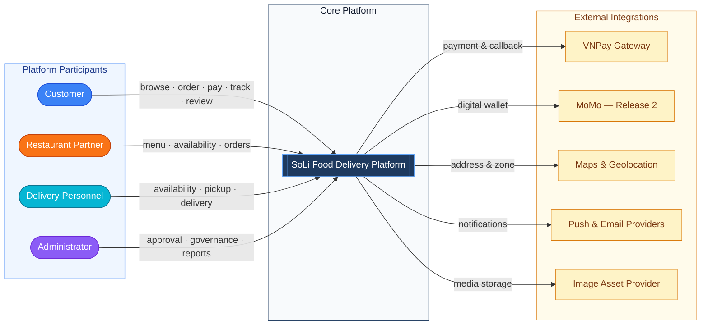
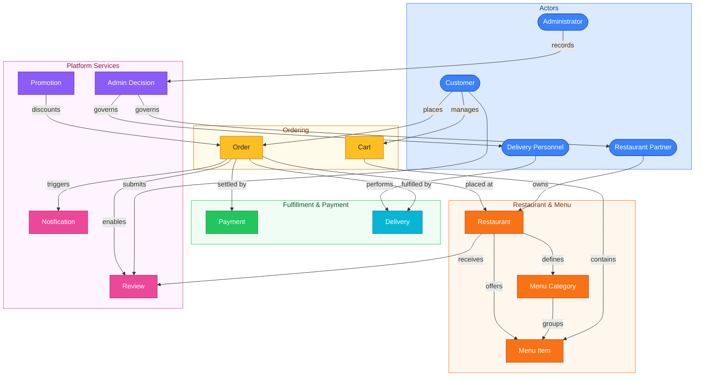
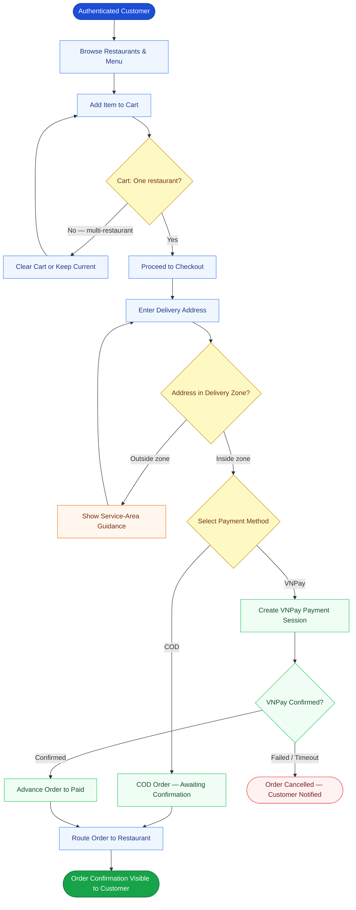
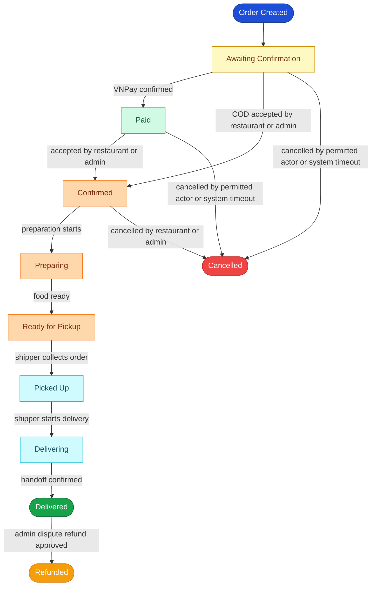
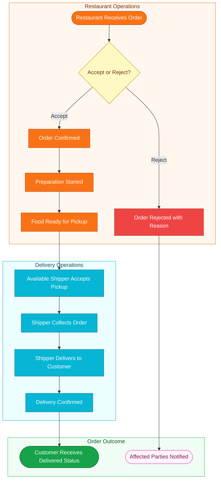
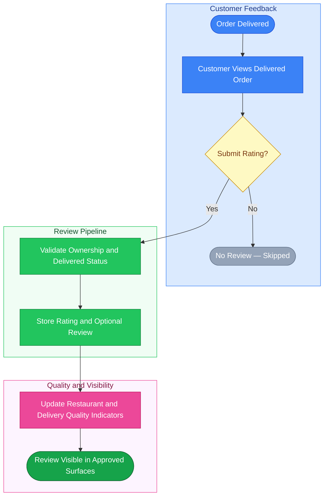

# Business Requirements Document (BRD)

## SoLi Food Delivery Platform

### *Nen tang Dat va Giao Do an Truc tuyen*

---

| Field | Detail |
|---|---|
| Version | 1.1 |
| Date | May 24, 2026 |
| Status | Final Baseline - Submission Ready |
| Document Owner | Business Analysis Team |
| Architecture Style | Modular Monolith |
| Classification | Internal - Academic Submission Documentation |
| Validation Basis | Vision and Scope, Business Rules, User Stories, Use Case Specification, SRS, SRS Sequence Diagrams, Utility Tree, ASR, ADD, ADR, SAD, and implementation validation evidence |

---

# 0. Document Control

## 0.1 Revision History

| Version | Date | Author | Description |
|---|---|---|---|
| 0.1 | 28/01/2026 | Development Team | Initial business requirements baseline |
| 1.0 | 28/01/2026 | Development Team | Release 1 business baseline |
| 1.1 | 24/05/2026 | Business Analysis Team | Final submission baseline with terminology normalization, release alignment, cross-document trace closure, reference completion, and DOCX-ready formatting |

## 0.2 Approval Readiness

| Role | Approval Responsibility | Submission Status |
|---|---|---|
| Product Owner | Confirms business objectives, success metrics, scope, and release allocation | Role-defined approval ready |
| Business Analyst Lead | Confirms requirements quality, traceability, business rules, and document completeness | Role-defined approval ready |
| Technical Lead | Confirms alignment with modular-monolith architecture references and implementation validation evidence | Role-defined approval ready |
| Project Supervisor | Confirms academic submission fitness and artifact consistency | Role-defined approval ready |

Approval signatures are applied in the generated DOCX submission package. The BRD itself records the role-level approval responsibilities and readiness state so the Markdown source contains no blank approval cells.

## 0.3 Table of Contents

- [1. Introduction](#1-introduction)
- [2. Business Context](#2-business-context)
- [3. Stakeholders](#3-stakeholders)
- [4. System Context](#4-system-context)
- [5. Business Domain Model](#5-business-domain-model)
- [6. Business Process Flows](#6-business-process-flows)
- [7. Business Requirements](#7-business-requirements)
- [8. Functional Capability Overview](#8-functional-capability-overview)
- [9. Security and Permissions](#9-security-and-permissions)
- [10. Non-Functional Requirements](#10-non-functional-requirements)
- [11. Constraints and Limitations](#11-constraints-and-limitations)
- [12. Traceability Matrix](#12-traceability-matrix)
- [13. Submission Readiness Register](#13-submission-readiness-register)
- [14. Appendix](#14-appendix)

---

# 1. Introduction

## 1.1 Purpose

This Business Requirements Document defines the business baseline for the SoLi Food Delivery Platform, a multi-role marketplace connecting customers, restaurant partners, delivery personnel, and platform administrators. It captures the business intent, objectives, success metrics, stakeholder needs, domain model, process flows, requirements, release allocation, and traceability needed for academic architecture submission.

This BRD is a target architecture and approved design artifact. Implementation evidence is used only to validate terminology, feasibility, and cross-document consistency. Business intent remains governed by the source documents listed in Section 14.

## 1.2 Scope

This BRD covers Release 1 target scope and the approved Release 2 and Release 3 roadmap for the Food Delivery Platform.

Release 1 target scope includes:

- Customer registration, authentication, restaurant discovery, cart, checkout, order history, and status tracking
- Restaurant partner onboarding, approval, menu management, availability control, and order reception
- Delivery personnel onboarding, availability, pickup, delivery progress, and delivery confirmation
- Administrator account governance, partner approval, operational oversight, order intervention, and reporting
- Payment processing through Cash on Delivery (COD) and VNPay
- Review and rating baseline after delivery
- Order-related notification capability across participant roles

Approved roadmap allocation covers:

- Release 2: MoMo payment, expanded live map tracking, promotion management, stock/branch refinements, channel-preference refinements, and operational monitoring expansion
- Release 3: loyalty points, group orders, scheduled orders, advanced analytics, fraud detection, predictive ETA, and additional wallet support

Companion artifacts own technical details that sit outside the BRD boundary:

- Use case flows and actor-system interaction detail: [USE_CASE_SPECIFICATION.md](USE_CASE_SPECIFICATION.md)
- Functional requirements and activity diagrams: [SRS_FoodDelivery.md](SRS_FoodDelivery.md)
- Sequence flow details: [SRS_SequenceDiagrams.md](SRS_SequenceDiagrams.md)
- Architecture drivers and decisions: [ASR-ADD-SAD/ASR_FoodDelivery.md](ASR-ADD-SAD/ASR_FoodDelivery.md), [ASR-ADD-SAD/ADD_FoodDelivery.md](ASR-ADD-SAD/ADD_FoodDelivery.md), [ASR-ADD-SAD/ADR_FoodDelivery.md](ASR-ADD-SAD/ADR_FoodDelivery.md), and [ASR-ADD-SAD/SAD_FoodDelivery.md](ASR-ADD-SAD/SAD_FoodDelivery.md)

## 1.3 Intended Audience

| Audience | Purpose |
|---|---|
| Business Analyst | Maintains business scope, rules, requirements, and traceability |
| Product Owner / Project Supervisor | Reviews business value, release alignment, and submission readiness |
| Development Team | Uses the BRD as business context for implementation validation and architectural alignment |
| QA Team | Derives business-level acceptance coverage and end-to-end validation scope |
| Architecture Team | Maps requirements to ASR, ADD, ADR, and SAD artifacts |
| Stakeholder Representatives | Validate customer, restaurant, shipper, and administrator workflows |

## 1.4 Definitions and Glossary

| Term | Definition |
|---|---|
| Platform | The SoLi Food Delivery Platform described by this BRD |
| Customer | A registered user who discovers restaurants, builds a cart, places orders, tracks delivery, and submits reviews |
| Restaurant Partner | An approved food business partner that manages menus, availability, and order preparation |
| Delivery Personnel / Shipper | An approved courier who accepts delivery assignments and completes deliveries |
| Administrator | A platform operator responsible for approvals, governance, operational oversight, reports, and exception handling |
| Order | A confirmed customer request for menu items from one restaurant, governed by a controlled lifecycle |
| Cart | A pre-checkout collection of menu items that belongs to one customer and exactly one restaurant |
| Confirmed | The order status meaning the restaurant has accepted the order for preparation |
| COD | Cash on Delivery, settled by the customer during handoff |
| VNPay | Release 1 online payment gateway for digital order settlement |
| MoMo | Release 2 digital wallet gateway in the approved payment roadmap |
| Delivery Zone | Restaurant-defined geographic service area used during checkout validation |
| Service Area | Platform-level geographic operating area for the initial marketplace launch |
| Review | Customer rating and optional text feedback submitted after delivery |
| Promotion | Discount or campaign rule applied through restaurant or platform governance |
| Commission | Platform revenue calculated as a fixed percentage of delivered-order GMV |
| GMV | Gross Merchandise Value, calculated from completed order totals before platform commission |
| BRD Requirement | A business requirement defined in this document, identified as BRD-01 through BRD-16 |
| Business Rule Anchor | A rule defined in [Business_Rules.md](Business_Rules.md), referenced as BUS-BR-N to avoid confusion with BRD requirement IDs |
| BO | Business Objective from [Food_Delivery_Vision_and_Scope.md](Food_Delivery_Vision_and_Scope.md) |
| SM | Success Metric from [Food_Delivery_Vision_and_Scope.md](Food_Delivery_Vision_and_Scope.md) |
| FE | Feature reference from [Food_Delivery_Vision_and_Scope.md](Food_Delivery_Vision_and_Scope.md) |
| UC | Use case identifier from [SRS_FoodDelivery.md](SRS_FoodDelivery.md) and [USE_CASE_SPECIFICATION.md](USE_CASE_SPECIFICATION.md) |
| ASR | Architecturally Significant Requirement from [ASR-ADD-SAD/ASR_FoodDelivery.md](ASR-ADD-SAD/ASR_FoodDelivery.md) |
| ADD | Attribute-Driven Design artifact from [ASR-ADD-SAD/ADD_FoodDelivery.md](ASR-ADD-SAD/ADD_FoodDelivery.md) |
| ADR | Architecture Decision Record from [ASR-ADD-SAD/ADR_FoodDelivery.md](ASR-ADD-SAD/ADR_FoodDelivery.md) |
| SAD | Software Architecture Document from [ASR-ADD-SAD/SAD_FoodDelivery.md](ASR-ADD-SAD/SAD_FoodDelivery.md) |

---

# 2. Business Context

## 2.1 Background

Vietnam's food and beverage service market continues to move toward digital ordering and delivery. Customers seek fast ordering, transparent payment, and reliable tracking. Restaurants need a centralized digital channel to manage menus, orders, availability, and partner growth. Delivery personnel need structured assignment flows, route visibility, and transparent delivery records.

Established marketplace platforms such as GrabFood, ShopeeFood, and Baemin validate the food-delivery business model. The SoLi platform addresses the same marketplace need in an academic project setting while demonstrating a scalable modular-monolith architecture and complete business-to-architecture traceability.

## 2.2 Business Opportunity

The platform creates a unified marketplace for:

- Customers who want fast discovery, checkout, payment choice, tracking, and post-delivery feedback
- Restaurant partners who want increased digital reach, menu control, and reliable order reception
- Delivery personnel who want structured assignments and transparent completion records
- Administrators who need governance, monitoring, reporting, and exception handling

The platform improves the full value chain from restaurant discovery through order placement, payment, preparation, pickup, delivery, review, and reporting.

## 2.3 Business Objectives

| ID | Objective | Target | Timeline |
|---|---|---|---|
| BO-1 | Reduce average customer time spent ordering food by 50% | Under 5 minutes from browsing to order confirmation; stretch target under 3 minutes | 6 months after Release 1 |
| BO-2 | Enable restaurant partners to increase daily order volume by 30% | 30% increase in average daily orders per active partner | 12 months after Release 1 |
| BO-3 | Achieve delivery success rate of 95% or higher | At least 95% of dispatched orders delivered successfully | 6 months after Release 1 |
| BO-4 | Process online payments for at least 70% of all completed orders | At least 70% of completed orders settled through VNPay or approved digital wallet methods | 6 months after Release 1 |

## 2.4 Success Metrics

| ID | Metric | Target | Measurement Window |
|---|---|---|---|
| SM-1 | Active registered customers placing at least one order per week | At least 500 customers | 3 months after Release 1 |
| SM-2 | Restaurant partners actively processing orders | At least 30 partners | 3 months after Release 1 |
| SM-3 | Average customer satisfaction rating from post-delivery reviews | At least 4.0 / 5.0 | 6 months after Release 1 |
| SM-4 | Average order-to-delivery time inside the service area | 45 minutes or less | 6 months after Release 1 |

## 2.5 Business Risks and Mitigations

| ID | Risk | Probability | Impact | Mitigation Direction |
|---|---|---:|---:|---|
| RI-1 | Competition from established food delivery platforms reduces adoption | High | 8 | Differentiate through reliability, partner onboarding quality, predictable checkout, and user experience |
| RI-2 | Restaurant partner supply at launch falls below customer expectations | Medium | 9 | Treat partner acquisition and approval as a launch readiness workstream tied to SM-2 |
| RI-3 | Delivery personnel supply falls below peak-hour demand | Medium | 7 | Use availability controls, dispatch visibility, and operational monitoring to balance demand and supply |
| RI-4 | Payment gateway disruption affects checkout trust | Low | 8 | Maintain COD as Release 1 fallback and verify VNPay callback integrity before order progression |
| RI-5 | Real-time status visibility degrades under peak load | Medium | 6 | Use defined latency targets, notification fallback paths, and architecture-level scaling guidance |

## 2.6 Business Assumptions and Dependencies

### Assumptions

| ID | Assumption |
|---|---|
| AS-1 | Customers, restaurant staff, delivery personnel, and administrators have smartphones or internet-connected devices |
| AS-2 | Restaurant partners maintain accurate menus, prices, hours, delivery zones, and availability states |
| AS-3 | Payment gateway providers maintain at least 99.5% API availability for supported payment operations |
| AS-4 | A minimum viable pool of delivery personnel is available in the target service area at launch |
| AS-5 | The platform operates under academic project constraints while preserving enterprise documentation discipline |

### Dependencies

| ID | Dependency |
|---|---|
| DE-1 | Geolocation and map capability depends on the selected provider contract and quota limits |
| DE-2 | Real-time order visibility depends on sustained client connectivity and server-side notification delivery |
| DE-3 | Online payment completion depends on gateway redirect, callback integrity, and settlement confirmation |
| DE-4 | Push and email delivery depend on configured provider credentials and channel availability |

---

# 3. Stakeholders

## 3.1 Stakeholder Profiles

| Stakeholder | Role in Platform | Primary Value | Key Concerns | Constraints |
|---|---|---|---|---|
| Customers | Discover restaurants, place orders, pay, track, review | Fast ordering, wide choice, transparent status, safe payment | Ease of use, delivery reliability, clear pricing, review trust | Requires internet access and a supported client device |
| Restaurant Partners | Manage restaurant profile, menus, availability, orders, promotions | Increased order volume, digital reach, operational control | Reliable alerts, clear order flow, fair commission, simple menu updates | Requires trained staff and stable internet at the restaurant |
| Delivery Personnel | Accept pickup assignments and complete deliveries | Flexible earning opportunity and transparent delivery records | Fair dispatch, correct pickup status, clear completion records | Requires GPS-capable smartphone and mobile data |
| Platform Administrators | Govern users, partners, orders, reports, promotions, and exceptions | Central control, marketplace safety, operational insight | Fraud prevention, partner accountability, auditability, policy enforcement | Academic team size and student-budget infrastructure |
| Payment Gateway Providers | Process digital payments and callbacks | Transaction volume and compliant integration | API compliance, secure credentials, callback verification | Integration follows provider documentation and certification rules |
| Notification Providers | Deliver push or email messages | Reliable communication channel for order events | Credential security, delivery reliability, rate limits | Channel contracts and provider quota rules apply |
| Development and Architecture Team | Build, validate, and document the platform | Technical quality, maintainability, traceable architecture | Clear requirements, stable decisions, feasible release scope | Academic schedule and modular-monolith architecture constraints |

## 3.2 Stakeholder Alignment Summary

| Concern | Stakeholder Benefit | BRD Coverage |
|---|---|---|
| Fast ordering | Customers complete selection and checkout quickly | BO-1, SM-1, BRD-01, BRD-03, BRD-05, BRD-07 |
| Partner growth | Restaurants gain digital order volume | BO-2, SM-2, BRD-02, BRD-04, BRD-09, BRD-14 |
| Delivery reliability | Customers and shippers share accurate lifecycle state | BO-3, SM-4, BRD-08, BRD-10, BRD-11, BRD-12 |
| Payment trust | Customers and platform operators rely on verified settlement state | BO-4, BRD-07, BRD-12, BRD-15 |
| Governance | Administrators maintain marketplace integrity | BRD-02, BRD-16 |

---

# 4. System Context

## 4.1 Context Diagram

_Figure 1: Business context diagram - roles and external business services_

## 4.2 External System Descriptions

| External System | Business Purpose | Integration Direction | Release Allocation |
|---|---|---|---|
| VNPay | Online payment processing for customer orders | Bidirectional payment initiation, redirect, return, and IPN callback | Release 1 |
| MoMo | Digital wallet payment option in the approved payment roadmap | Bidirectional payment initiation and callback | Release 2 |
| Maps and Geolocation Provider | Address geocoding, distance calculation, delivery-zone validation, and service-area enforcement | Query and response | Release 1 |
| Push and Email Providers | Push, in-app, and email notification delivery for workflow events | Outbound from platform | Release 1 and channel expansion in Release 2 |
| Image Asset Provider | Media storage and delivery for restaurant and menu imagery | Upload, metadata reference, and delivery URL | Release 1 |

---

# 5. Business Domain Model

## 5.1 Domain Model Diagram

_Figure 2: Conceptual business domain model_

The model below is conceptual. Physical data ownership and schema design are defined in the ADD and SAD Data Views.

## 5.2 Domain Object Descriptions

| Domain Object | Description |
|---|---|
| Customer | Registered buyer who discovers food, builds a cart, places orders, pays, tracks delivery, views history, and reviews delivered orders |
| Restaurant Partner | Approved business partner responsible for restaurant profile, menu, availability, preparation, order acceptance, and restaurant-level promotions |
| Delivery Personnel | Approved courier responsible for accepting pickup work, collecting orders, marking delivery progress, and confirming delivery completion |
| Administrator | Platform operator responsible for approval, governance, reports, exception handling, promotions, and audit oversight |
| Restaurant | Marketplace outlet with profile, operating hours, delivery zone, menu, approval state, and availability state |
| MenuCategory | Restaurant-defined group for menu organization |
| MenuItem | Sellable food or beverage product with price, availability, category, media, and optional modifiers |
| Cart | Customer-owned pre-checkout selection constrained to one restaurant |
| Order | Commercial transaction with lifecycle state, customer, restaurant, items, payment method, delivery address, and audit history |
| Payment | Settlement record for COD or digital payment, including amount, method, status, and provider reference |
| Delivery | Fulfillment record for pickup, transit, delivery confirmation, and shipper assignment |
| Review | Customer feedback for a delivered order, including rating and optional text |
| Promotion | Discount or campaign rule governed by restaurant or platform authority |
| Notification | Workflow alert sent to customer, restaurant, shipper, or administrator |
| AdminDecision | Governance action such as approval, rejection, suspension, role change, cancellation, refund approval, or policy update |

---

# 6. Business Process Flows

## 6.1 Order Placement and Payment Workflow

_Figure 3: Customer order placement and payment workflow_

## 6.2 Order Status Lifecycle

_Figure 4: Business order lifecycle_

### Transition Ownership Summary

| Transition | From | To | Permitted Actors | Payment Effect |
|---|---|---|---|---|
| T-01 | Awaiting Confirmation | Confirmed | Restaurant, Administrator | COD order proceeds to fulfillment |
| T-02 | Awaiting Confirmation | Paid | System through verified gateway callback | VNPay payment confirmed |
| T-03 | Awaiting Confirmation | Cancelled | Customer, Restaurant, Administrator, System | No refund for COD; VNPay payment attempt is closed |
| T-04 | Paid | Confirmed | Restaurant, Administrator | VNPay-paid order proceeds to fulfillment |
| T-05 | Paid | Cancelled | Customer, Restaurant, Administrator, System | VNPay refund or compensation path applies |
| T-06 | Confirmed | Preparing | Restaurant, Administrator | No payment change |
| T-07 | Confirmed | Cancelled | Restaurant, Administrator | Refund applies when payment is already confirmed |
| T-08 | Preparing | Ready for Pickup | Restaurant, Administrator | No payment change |
| T-09 | Ready for Pickup | Picked Up | Delivery Personnel, Administrator | Shipper assignment recorded |
| T-10 | Picked Up | Delivering | Assigned Delivery Personnel, Administrator | No payment change |
| T-11 | Delivering | Delivered | Assigned Delivery Personnel, Administrator | Order completion contributes to GMV and commission |
| T-12 | Delivered | Refunded | Administrator | Dispute refund recorded |

## 6.3 Restaurant and Delivery Workflow

_Figure 5: Restaurant preparation and delivery workflow_

## 6.4 Cancellation and Refund Workflow

_Figure 6: Cancellation and refund workflow_

```mermaid
flowchart TD
    subgraph CancelFlow["Cancellation Flow"]
        A(["Cancellation Request"])
        B{"Order State Permits Cancellation?"}
        C["Reject Request with Reason"]
        D["Record Cancellation Reason"]
        E{"Payment Already Confirmed Online?"}
        F["Close COD Order"]
        G["Initiate Digital Refund or Compensation"]
        H["Notify Customer, Restaurant and Shipper"]
        I(["Cancellation Complete"])
    end

    subgraph DisputeFlow["Dispute and Refund Flow"]
        J(["Delivered-Order Dispute"])
        K["Administrator Reviews Dispute"]
        L["Approve Refund"]
        M(["Refund Recorded and Customer Notified"])
    end

    A --> B
    B -->|"No"| C
    B -->|"Yes"| D --> E
    E -->|"COD"| F --> H --> I
    E -->|"Online Payment"| G --> H --> I
    J --> K --> L --> M

    classDef startNode fill:#3B82F6,stroke:#1D4ED8,color:#fff
    classDef processNode fill:#EFF6FF,stroke:#3B82F6,color:#1E3A8A
    classDef decisionNode fill:#FEF9C3,stroke:#CA8A04,color:#78350F
    classDef codNode fill:#F0FDF4,stroke:#22C55E,color:#14532D
    classDef refundNode fill:#FEF3C7,stroke:#F59E0B,color:#78350F
    classDef notifyNode fill:#FDF4FF,stroke:#EC4899,color:#831843
    classDef successNode fill:#16A34A,stroke:#166534,color:#fff
    classDef rejectNode fill:#FEE2E2,stroke:#EF4444,color:#7F1D1D
    classDef adminNode fill:#EDE9FE,stroke:#8B5CF6,color:#4C1D95

    class A,J startNode
    class C rejectNode
    class D,H processNode
    class B,E decisionNode
    class F,I codNode
    class G refundNode
    class K,L adminNode
    class M successNode

    style CancelFlow fill:#EFF6FF,stroke:#3B82F6,color:#1E3A8A
    style DisputeFlow fill:#EDE9FE,stroke:#8B5CF6,color:#4C1D95
```

## 6.5 Review and Rating Workflow

_Figure 7: Post-delivery review workflow_

---

# 7. Business Requirements

Each BRD requirement is discrete, verifiable, traceable to business objectives and source artifacts, and aligned with the approved release roadmap. Business rules from [Business_Rules.md](Business_Rules.md) are referenced as BUS-BR-N.

## 7.1 Requirements Register

| BRD ID | Requirement | Business Requirement Statement | Business Value | Release Allocation | Source Anchors |
|---|---|---|---|---|---|
| BRD-01 | Customer Identity and Access | The platform shall support customer registration, authentication, session handling, profile data, and saved delivery addresses through secure account access. | Enables personalized ordering, order ownership, history, review attribution, and secure checkout. | Release 1 | BO-1, SM-1, FE-1, US-1, UC-1 |
| BRD-02 | Partner Verification and Role Activation | Administrators shall approve restaurant partners and delivery personnel before they can receive orders or delivery assignments. | Protects marketplace trust, safety, service quality, and partner accountability. | Release 1 | BUS-BR-1, BO-2, BO-3, SM-2, FE-6, FE-7, FE-8, US-10, US-14, US-18 |
| BRD-03 | Unified Restaurant and Food Discovery | Customers shall search and browse restaurants and menu items by keyword, category, cuisine, tag, and proximity through a unified discovery flow. | Reduces time to order and increases restaurant exposure. | Release 1 | BO-1, BO-2, SM-1, SM-2, FE-2, US-2 |
| BRD-04 | Restaurant Menu and Availability Management | Restaurant partners shall manage profiles, delivery zones, menu categories, menu items, images, prices, and availability states. | Keeps menu data accurate, reduces unfulfillable orders, and supports restaurant autonomy. | Release 1 with Release 2 stock and branch refinements | BUS-BR-8, BO-2, SM-2, FE-6, US-10, US-11, US-12 |
| BRD-05 | Single-Restaurant Cart Constraint | A customer's cart shall contain items from exactly one restaurant. Attempts to add another restaurant's item shall require clearing the cart or keeping the existing cart. | Preserves fulfillment integrity, pricing consistency, and checkout simplicity. | Release 1 | BUS-BR-2, BO-1, FE-3, US-5, US-22 |
| BRD-06 | Delivery Zone and Service Area Validation | Checkout shall validate the customer address against restaurant delivery zones and the platform service area before order submission. | Prevents undeliverable orders, avoidable cancellations, and delivery cost waste. | Release 1 with Release 2 map refinement | BUS-BR-3, BUS-BR-6, BO-3, SM-4, FE-3, FE-5, US-6, US-20 |
| BRD-07 | Checkout and Payment Support | Customers shall place orders using COD or VNPay in Release 1. VNPay orders shall advance only after verified gateway confirmation. | Supports payment choice, lowers cash-handling risk, and drives BO-4 digital payment adoption. | Release 1; MoMo in Release 2; additional wallets in Release 3 | BUS-BR-4, BO-4, FE-4, US-7 |
| BRD-08 | Order Lifecycle and Status Visibility | Every order shall follow the approved lifecycle from Awaiting Confirmation through Delivered or an applicable terminal exception, with role-controlled transitions and visible status history. | Creates a trustworthy operational record for customers, restaurants, shippers, administrators, and reports. | Release 1 | BUS-BR-7, BO-1, BO-3, SM-3, SM-4, FE-5, US-8, US-9, US-34 |
| BRD-09 | Restaurant Order Reception and Preparation | Restaurant partners shall receive order alerts, accept or reject eligible orders, update preparation status, and mark food ready for pickup. | Enables timely preparation and protects the 45-minute delivery metric. | Release 1 | BO-3, SM-2, SM-4, FE-6, US-13, US-23, US-24 |
| BRD-10 | Delivery Dispatch and Completion | Delivery personnel shall manage availability, accept eligible pickup work, mark pickup and delivery progress, and confirm successful delivery. | Enables delivery success, correct assignment, and completion measurement. | Release 1 with Release 2 earnings and rating refinements | BO-3, SM-4, FE-7, US-14, US-15, US-16, US-17 |
| BRD-11 | Notifications and Alerts | The platform shall deliver workflow-relevant notifications for order placement, payment results, restaurant action, pickup readiness, delivery progress, cancellation, refund, and review prompts. | Reduces manual polling, accelerates response time, and improves participant confidence. | Release 1 with Release 2 channel-preference refinement | BO-1, BO-3, SM-3, FE-12, US-9, US-13, US-23, US-24 |
| BRD-12 | Cancellation, Refund, and Compensation | The platform shall support payment-aware cancellation, refund, and compensation flows with reason capture, actor traceability, and affected-party notifications. | Reduces disputes, protects financial correctness, and supports operational transparency. | Release 1 | BUS-BR-4, BUS-BR-7, BO-3, BO-4, FE-4, FE-5, US-24, US-29, US-35 |
| BRD-13 | Review and Rating | Customers shall submit ratings and optional reviews after delivery, and aggregated quality signals shall support restaurant profiles, search, and marketplace trust. | Drives SM-3 customer satisfaction measurement and partner quality incentives. | Release 1 baseline with Release 2 moderation refinement | SM-3, FE-9, US-33 |
| BRD-14 | Promotions, Coupons, and Loyalty | Restaurant and platform stakeholders shall manage discount codes, flash sales, and loyalty incentives according to approved scope and checkout validation rules. | Supports customer acquisition, retention, restaurant campaigns, and repeat order volume. | Promotion management in Release 2; loyalty points in Release 3 | SM-1, FE-10, US-36, US-37 |
| BRD-15 | Commission and Operational Reporting | The platform shall calculate commission from delivered-order GMV and provide operational and financial reporting for administrators and restaurant partners. | Supports revenue governance, settlement transparency, and business decision-making. | Release 1 reporting baseline with Release 2 dashboard expansion | BUS-BR-5, BO-2, SM-2, FE-8, US-21, US-30, US-31 |
| BRD-16 | Administration, Governance, Audit, and Exclusions | Administrators shall manage user accounts, roles, partner decisions, suspensions, platform health, promotions, audits, and explicit marketplace exclusions. B2B enterprise ordering and subscription meal plans remain excluded from all releases. | Maintains platform integrity, policy compliance, operational control, and academic scope discipline. | Release 1 governance baseline with Release 2 and Release 3 dashboard expansion | BUS-BR-1, BUS-BR-9, BO-2, BO-3, FE-8, US-18, US-19, US-25, US-26, US-27, US-28, US-29, US-32 |

## 7.2 Business Rule Coverage

| Business Rule Anchor | Source Rule | BRD Coverage |
|---|---|---|
| BUS-BR-1 | Partner verification | BRD-02, BRD-16 |
| BUS-BR-2 | Single-restaurant cart | BRD-05 |
| BUS-BR-3 | Delivery radius constraint | BRD-06 |
| BUS-BR-4 | COD and VNPay payment rules | BRD-07, BRD-12 |
| BUS-BR-5 | Commission calculation | BRD-15 |
| BUS-BR-6 | Geographic scope constraint | BRD-06 |
| BUS-BR-7 | Order lifecycle integrity | BRD-08, BRD-12 |
| BUS-BR-8 | Real-time availability control | BRD-04 |
| BUS-BR-9 | Enterprise exclusion | BRD-16 |

---

# 8. Functional Capability Overview

## 8.1 Functional Capability List

| FC ID | Capability | Feature Reference | Target Release Allocation | BRD Requirements |
|---|---|---|---|---|
| FC-01 | Customer Identity and Access | FE-1 | Release 1 | BRD-01 |
| FC-02 | Unified Restaurant and Food Discovery | FE-2 | Release 1 | BRD-03 |
| FC-03 | Cart Management and Checkout | FE-3 | Release 1 | BRD-05, BRD-06, BRD-07 |
| FC-04 | Payment Processing - COD and VNPay | FE-4 | Release 1; MoMo Release 2; additional wallets Release 3 | BRD-07, BRD-12 |
| FC-05 | Order Status Tracking | FE-5 | Release 1 status tracking; Release 2 live map tracking | BRD-08, BRD-11 |
| FC-06 | Restaurant Management Portal | FE-6 | Release 1 menu and order management; Release 2 stock, campaign, and branch refinements | BRD-02, BRD-04, BRD-09, BRD-14 |
| FC-07 | Delivery Personnel Portal | FE-7 | Release 1 availability, pickup, and delivery; Release 2 earnings and rating refinements | BRD-02, BRD-10 |
| FC-08 | Administrator Dashboard | FE-8 | Release 1 governance and reports; Release 2 monitoring expansion; Release 3 BI expansion | BRD-15, BRD-16 |
| FC-09 | Review and Rating System | FE-9 | Release 1 baseline review; Release 2 moderation refinement | BRD-13 |
| FC-10 | Promotions and Loyalty | FE-10 | Release 2 promotions and coupon campaigns; Release 3 loyalty points | BRD-14 |
| FC-11 | Multi-Branch, Group Orders, and Scheduling | FE-11 | Release 3 | BRD-04, BRD-14, BRD-16 |
| FC-12 | Notifications | FE-12 | Release 1 order workflow notifications; Release 2 channel-preference refinement | BRD-11 |

## 8.2 Defined Supporting Artifacts

| Artifact | Location | Role in BRD Trace |
|---|---|---|
| Vision and Scope | [Food_Delivery_Vision_and_Scope.md](Food_Delivery_Vision_and_Scope.md) | Source for BO, SM, FE, release allocation, risks, assumptions, and dependencies |
| Business Rules | [Business_Rules.md](Business_Rules.md) | Source for hard business rules BUS-BR-1 through BUS-BR-9 |
| User Stories and Acceptance Criteria | [User-Stories-and-Acceptance-Criteria.md](User-Stories-and-Acceptance-Criteria.md) | Source for US coverage and acceptance-level trace |
| Use Case Specification | [USE_CASE_SPECIFICATION.md](USE_CASE_SPECIFICATION.md) | Source for domain-level use cases UC-DOM-01 through UC-DOM-12 |
| SRS | [SRS_FoodDelivery.md](SRS_FoodDelivery.md) | Source for UC-1 through UC-35 functional behavior |
| SRS Sequence Diagrams | [SRS_SequenceDiagrams.md](SRS_SequenceDiagrams.md) | Source for sequence-level flow validation |
| Utility Tree ASRs | [Utility-Tree-ASRs.md](Utility-Tree-ASRs.md) | Source for measurable quality attribute scenarios |
| ASR | [ASR-ADD-SAD/ASR_FoodDelivery.md](ASR-ADD-SAD/ASR_FoodDelivery.md) | Source for architecture drivers AD-1 through AD-12 |
| ADD | [ASR-ADD-SAD/ADD_FoodDelivery.md](ASR-ADD-SAD/ADD_FoodDelivery.md) | Source for quality scenarios and architecture views |
| ADR | [ASR-ADD-SAD/ADR_FoodDelivery.md](ASR-ADD-SAD/ADR_FoodDelivery.md) | Source for architecture decisions ADR-001 through ADR-008 |
| SAD | [ASR-ADD-SAD/SAD_FoodDelivery.md](ASR-ADD-SAD/SAD_FoodDelivery.md) | Source for final architecture view packaging and cross-view trace |
| CD Guide | [ASR-ADD-SAD/CD_GUIDE.md](ASR-ADD-SAD/CD_GUIDE.md) | Source for deployment and release-process alignment |

---

# 9. Security and Permissions

## 9.1 Role Matrix

| Capability | Customer | Restaurant Partner | Delivery Personnel | Administrator |
|---|---|---|---|---|
| Register and authenticate | Yes | Yes | Yes | Yes |
| Browse restaurants and menu items | Yes | Yes | No | Yes |
| Manage customer cart and checkout | Yes | No | No | No |
| Place and track own orders | Yes | No | No | Yes, all orders |
| Submit delivered-order reviews | Yes | No | No | Review oversight |
| Manage own restaurant profile and menu | No | Yes | No | Yes |
| Toggle restaurant and item availability | No | Yes | No | Yes |
| Receive and manage incoming orders | No | Yes | No | Yes, oversight |
| Toggle delivery availability | No | No | Yes | Yes, oversight |
| Accept pickup and update delivery status | No | No | Yes | Yes, exception handling |
| Manage all user accounts | No | No | No | Yes |
| Approve, reject, suspend, or reactivate partners | No | No | No | Yes |
| Access operational reports | Own data | Own restaurant data | Own delivery data | Platform-wide data |
| Configure platform promotions and commission settings | No | Own restaurant promotions | No | Yes |
| View audit and governance records | Own account history | Own partner decisions | Own partner decisions | Platform-wide audit |

## 9.2 Security Considerations

| Area | Requirement |
|---|---|
| Authentication | Accounts shall use secure credential management, authenticated sessions, and logout/session-expiry handling. |
| Authorization | Role-based access control shall guard all protected actions and data scopes. |
| Payment Data | Payment credentials and secrets shall stay outside source control; VNPay callbacks shall be cryptographically verified before order state changes. |
| Location Data | Customer addresses and active delivery location data shall be transmitted over encrypted channels and excluded from application logs. |
| Input Validation | All actor-supplied inputs shall be validated at platform boundaries to prevent injection, stored script execution, and data manipulation. |
| Auditability | Privileged actions shall record actor, target, decision, timestamp, and reason where the business flow requires a reason. |
| Privacy | Personally identifiable information, payment-sensitive data, and exact location data shall be protected according to least-disclosure principles. |

---

# 10. Non-Functional Requirements

## 10.1 Performance

| Requirement | Target | Source Trace |
|---|---|---|
| Restaurant list first-page render | <= 2 seconds under typical mobile network conditions | Utility Tree, BO-1 |
| Restaurant or item search backend response | p95 <= 2 seconds with pagination under normal operating conditions | Utility Tree, BRD-03 |
| Order placement response | p95 <= 3 seconds under normal operating load | ADD QA-P-03, BRD-07 |
| Order status update visibility | <= 5 seconds from status change to customer visibility under normal conditions | Utility Tree, ASR AD-4 |
| Menu or availability propagation | <= 60 seconds for menu edits; <= 10 seconds for availability changes under peak load | Utility Tree, BRD-04 |
| Admin monitoring view | p95 <= 2 seconds for 1,000 active orders with displayed data freshness <= 60 seconds | Utility Tree, BRD-15 |

## 10.2 Availability

| Requirement | Target | Source Trace |
|---|---|---|
| Authentication endpoints | Monthly uptime >= 99.9% with retryable error behavior | Utility Tree |
| Real-time order status channel | Monthly uptime >= 99.9% with fallback through refresh or polling | Utility Tree |
| Payment provider availability assumption | Provider API availability >= 99.5% | AS-3 |
| Notification channel resilience | Core order flow continues when optional channel delivery is degraded | ASR AD-9, ADD QA-A-03 |

## 10.3 Reliability

| Requirement | Target | Source Trace |
|---|---|---|
| Delivery success | At least 95% of dispatched orders delivered successfully | BO-3 |
| Order lifecycle integrity | 100% of invalid out-of-sequence transitions rejected | Utility Tree, BUS-BR-7 |
| Checkout idempotency | Repeated checkout with the same idempotency key returns the same order and creates zero duplicates | Utility Tree, ASR AD-1 |
| Shipper assignment atomicity | At most one shipper assigned to a single order | Utility Tree, ASR AD-5 |
| Payment state handling | VNPay callbacks, payment failure, timeout, cancellation, refund, and compensation paths are deterministic and idempotent | BUS-BR-4, ASR AD-2, ASR AD-12 |

## 10.4 Scalability

| Requirement | Target | Source Trace |
|---|---|---|
| Browse and search load | Platform meets p95 search targets at 2x projected peak browse/search load | Utility Tree |
| Runtime scale model | API scaling uses complete modular-monolith instances behind a load balancer | SAD Deployment View, ADR-001 |
| Shared runtime state | Cart, locks, idempotency, presence, and rate-limit state are assigned to Redis / Valkey runtime storage | ADR-006, SAD Data View |

## 10.5 Security

| Requirement | Target | Source Trace |
|---|---|---|
| Authentication and session security | OWASP ASVS Level 2 aligned controls for account access | Utility Tree, ASR AD-8 |
| Admin authorization | 100% of unauthorized admin requests denied with non-sensitive responses and recorded security context | Utility Tree, BRD-16 |
| Payment integrity | VNPay callback integrity verified before state mutation | Utility Tree, ASR AD-2 |
| Review input safety | Review text validated and sanitized before display | Utility Tree, BRD-13 |
| Secrets management | Credentials managed through environment configuration and excluded from source control | BRD-07, BRD-16 |

## 10.6 Maintainability and Conceptual Integrity

| Requirement | Target | Source Trace |
|---|---|---|
| Architecture style | Platform responsibilities organized as a modular monolith with bounded contexts | ADR-001, ADR-002 |
| Data ownership | One PostgreSQL platform database with bounded-context ownership of table groups | ADR-003, ADR-008 |
| Event coordination | In-process EventBus with explicit events and ACL snapshots | ADR-004, ADR-005 |
| Provider integration | Payment, notification, image, and external integrations handled behind ports and adapters | ADR-007 |
| Order status vocabulary | One shared order-status model across modules and documents | Utility Tree, ADD QA-CI-01, SAD Runtime View |
| Documentation currency | BRD, SRS, ASR, ADD, ADR, and SAD remain synchronized before submission baselines are exported to DOCX | Section 12, Section 13 |

---

# 11. Constraints and Limitations

| ID | Constraint / Limitation | Release Applicability | Business Rationale |
|---|---|---|---|
| LI-1 | The marketplace serves one designated geographic service area in Release 1. | Release 1 | Controls operational complexity and delivery feasibility. |
| LI-2 | Release 1 supports COD and VNPay. MoMo is allocated to Release 2 and additional wallet methods to Release 3. | Release 1 through Release 3 | Balances payment choice with gateway certification effort. |
| LI-3 | AI/ML capabilities such as personalized recommendations, image search, fraud detection, and predictive ETA are allocated to the Release 3+ roadmap. | Release 3+ | Protects Release 1 and Release 2 delivery focus. |
| LI-4 | B2B enterprise ordering and subscription meal plans are excluded from the approved release set. | All releases | Preserves marketplace scope discipline. |
| LI-5 | Infrastructure costs remain within student project budget constraints. | All releases | Supports academic viability and repeatable deployment. |
| LI-6 | Team capacity is constrained by academic group size and semester timeline. | All releases | Keeps target scope aligned with available project capacity. |
| LI-7 | Release 1 provides status tracking and workflow notifications; live map-based shipper tracking is allocated to Release 2. | Release 1 and Release 2 | Separates essential order visibility from enhanced map tracking. |

---

# 12. Traceability Matrix

## 12.1 End-to-End Requirement Trace

| BRD ID | BO | SM | FE | Business Rule Anchor | User Stories | UC / SRS Trace | ASR Trace | ADD / ADR / SAD Trace |
|---|---|---|---|---|---|---|---|---|
| BRD-01 | BO-1 | SM-1 | FE-1 | Account security rules | US-1 | UC-1; UC-DOM-01; SD-1 | AD-8, AD-10, AD-11 | ADD QA-S-02, QA-S-03, QA-U-01; ADR-001, ADR-002, ADR-008; SAD 3.1, 3.2 |
| BRD-02 | BO-2, BO-3 | SM-2 | FE-6, FE-7, FE-8 | BUS-BR-1 | US-10, US-14, US-18 | UC-11, UC-16, UC-27, UC-28; UC-DOM-06, UC-DOM-07, UC-DOM-10; SD-11, SD-16, SD-27, SD-28 | AD-8, AD-10 | ADD Logical View, QA-S-03, QA-SUP-02; ADR-001, ADR-002, ADR-003, ADR-008; SAD 3.1, 3.4 |
| BRD-03 | BO-1, BO-2 | SM-1, SM-2 | FE-2 | Discovery source rules | US-2 | UC-2, UC-3; UC-DOM-02; SD-2, SD-3 | AD-3, AD-11 | ADD QA-P-01, QA-SC-01, QA-U-02; ADR-001, ADR-002, ADR-008; SAD 3.1, 3.2 |
| BRD-04 | BO-2, BO-3 | SM-2, SM-4 | FE-6 | BUS-BR-8 | US-10, US-11, US-12, US-23 | UC-7, UC-11, UC-12, UC-13, UC-15; UC-DOM-06; SD-7, SD-11, SD-12, SD-13, SD-15 | AD-3, AD-7, AD-8 | ADD QA-P-04, QA-MA-01, QA-CI-02; ADR-002, ADR-004, ADR-005, ADR-008; SAD 3.1, 3.3, 3.4 |
| BRD-05 | BO-1 | SM-1 | FE-3 | BUS-BR-2 | US-5, US-22 | UC-4, UC-5, UC-8; UC-DOM-03; SD-4, SD-5, SD-8 | AD-1, AD-6 | ADD QA-R-01, QA-R-04, QA-SC-02; ADR-003, ADR-006, ADR-008; SAD 3.3, 3.4 |
| BRD-06 | BO-3 | SM-4 | FE-3, FE-5 | BUS-BR-3, BUS-BR-6 | US-6, US-20 | UC-6, UC-7, UC-8; UC-DOM-03, UC-DOM-06; SD-6, SD-7, SD-8 | AD-7 | ADD QA-R-04, QA-MA-01, QA-I-02; ADR-005, ADR-006, ADR-008; SAD 3.3, 3.4 |
| BRD-07 | BO-1, BO-4 | SM-1 | FE-4 | BUS-BR-4 | US-7 | UC-8, UC-9, UC-25; UC-DOM-03, UC-DOM-04; SD-8, SD-9, SD-25 | AD-1, AD-2, AD-12 | ADD QA-S-01, QA-R-02, QA-R-06, QA-I-01; ADR-004, ADR-007, ADR-008; SAD 3.4, 3.5 |
| BRD-08 | BO-1, BO-3 | SM-3, SM-4 | FE-5 | BUS-BR-7 | US-8, US-9, US-34 | UC-8, UC-10, UC-14, UC-15, UC-18, UC-19, UC-20, UC-21; UC-DOM-05, UC-DOM-07; SD-8, SD-10, SD-14, SD-15, SD-18, SD-19, SD-20, SD-21 | AD-4, AD-5, AD-10 | ADD QA-R-03, QA-P-02, QA-CI-01, QA-SUP-01; ADR-002, ADR-004, ADR-008; SAD 3.4 |
| BRD-09 | BO-3 | SM-2, SM-4 | FE-6 | Restaurant order rules | US-13, US-23, US-24 | UC-14, UC-15, UC-21, UC-26; UC-DOM-06, UC-DOM-08; SD-14, SD-15, SD-21, SD-26 | AD-4, AD-5, AD-10, AD-12 | ADD QA-R-03, QA-R-07, QA-P-02, QA-SUP-01; ADR-002, ADR-004, ADR-008; SAD 3.4 |
| BRD-10 | BO-3 | SM-4 | FE-7 | Delivery operation rules | US-14, US-15, US-16, US-17 | UC-16, UC-17, UC-18, UC-19; UC-DOM-07; SD-16, SD-17, SD-18, SD-19 | AD-4, AD-5, AD-8 | ADD QA-R-05, QA-P-02, QA-S-03, QA-CI-01; ADR-001, ADR-002, ADR-003, ADR-008; SAD 3.4 |
| BRD-11 | BO-1, BO-3 | SM-3 | FE-12 | Notification workflow rules | US-9, US-13, US-23, US-24 | UC-20, UC-26; UC-DOM-08, UC-DOM-11; SD-20, SD-26 | AD-4, AD-9, AD-10 | ADD QA-A-02, QA-A-03, QA-I-02, QA-FL-03; ADR-004, ADR-006, ADR-007; SAD 3.4, 3.5 |
| BRD-12 | BO-3, BO-4 | SM-3, SM-4 | FE-4, FE-5 | BUS-BR-4, BUS-BR-7 | US-24, US-29, US-35 | UC-21, UC-25, UC-32; UC-DOM-04, UC-DOM-05, UC-DOM-10; SD-21, SD-25, SD-32 | AD-2, AD-5, AD-12 | ADD QA-R-08, QA-FL-02, QA-SUP-01; ADR-004, ADR-007, ADR-008; SAD 3.4 |
| BRD-13 | BO-2 | SM-3 | FE-9 | Review eligibility rules | US-33 | UC-10, UC-22; UC-DOM-09; SD-10, SD-22 | AD-5, AD-10 | ADD Logical View Review & Rating; ADD QA-S-02, QA-SUP-01; ADR-001, ADR-002; SAD 3.1, 3.4 |
| BRD-14 | BO-1, BO-2 | SM-1, SM-2 | FE-10 | Promotion scope rules | US-36, US-37 | UC-23, UC-24; UC-DOM-06, UC-DOM-10; SD-23, SD-24 | AD-3, AD-12 | ADD Promotion BC, QA-R-08, QA-FL-01; ADR-002, ADR-007, ADR-008; SAD 3.1, 3.4 |
| BRD-15 | BO-2, BO-4 | SM-2 | FE-8 | BUS-BR-5 | US-21, US-30, US-31 | UC-25, UC-33, UC-34; UC-DOM-04, UC-DOM-12; SD-25, SD-33, SD-34 | AD-10, AD-12 | ADD QA-SUP-03, QA-I-02; ADR-003, ADR-008; SAD 3.3, 3.6 |
| BRD-16 | BO-2, BO-3 | SM-2, SM-4 | FE-8 | BUS-BR-1, BUS-BR-9 | US-18, US-19, US-25, US-26, US-27, US-28, US-29, US-32 | UC-27, UC-28, UC-29, UC-30, UC-31, UC-32, UC-34, UC-35; UC-DOM-10, UC-DOM-12; SD-27 through SD-35 | AD-8, AD-10, AD-11 | ADD Admin/Governance contract, QA-S-03, QA-SUP-02, QA-SUP-03; ADR-001, ADR-002, ADR-003, ADR-008; SAD 3.1, 3.2, 3.6 |

## 12.2 Trace Closure Summary

| Trace Layer | Closure Result | Evidence |
|---|---|---|
| BO to SM | Closed | BO-1 through BO-4 and SM-1 through SM-4 are preserved from Vision and Scope. |
| SM to Feature | Closed | Section 8 maps FE-1 through FE-12 to release allocation and BRD requirements. |
| Feature to BRD Requirement | Closed | Every FE maps to at least one BRD requirement. |
| Business Rule to BRD Requirement | Closed | BUS-BR-1 through BUS-BR-9 are covered in Section 7.2. |
| BRD Requirement to User Story | Closed | Section 12.1 maps each BRD requirement to one or more user stories. |
| User Story to Use Case | Closed | User-story trace is aligned with UC-1 through UC-35 and UC-DOM-01 through UC-DOM-12. |
| Use Case to SRS and Sequence | Closed | UC and SD references are included in Section 12.1. |
| SRS to ASR | Closed | ASR drivers AD-1 through AD-12 cover the architecturally significant flows. |
| ASR to ADD and ADR | Closed | ADD quality scenarios and ADR-001 through ADR-008 are referenced in the trace matrix. |
| ADD and ADR to SAD | Closed | SAD views 3.1 through 3.6 package logical, implementation, data, runtime, deployment, and process views. |

## 12.3 Duplicate and Orphan Review

| Review Area | Result |
|---|---|
| Orphan BO | None |
| Orphan SM | None |
| Orphan FE | None |
| Orphan business rule | None |
| Orphan BRD requirement | None |
| Duplicate requirements | Resolved by using BRD-01 through BRD-16 and mapping source business rules as BUS-BR-N anchors |
| Invalid references | None in the final BRD artifact map |
| Conflicting release allocation | Resolved through Section 8.1 target release allocation |

---

# 13. Submission Readiness Register

| Check | Result | Evidence |
|---|---|---|
| Submission wording normalized | Pass | Status and scope terms use Final Baseline, target release scope, approved roadmap, defined artifact, and role-defined approval language. |
| Approval section complete | Pass | Section 0.2 has no blank cells and defines approval readiness by role. |
| Business consistency | Pass | Objectives, success metrics, risks, assumptions, and workflows align with Vision and Scope plus Business Rules. |
| Requirement completeness | Pass | BRD-01 through BRD-16 cover identity, partner verification, discovery, menu, cart, delivery zone, payment, lifecycle, restaurant operations, delivery, notifications, cancellation, review, promotions, commission, and governance. |
| Scope alignment | Pass | Release 1, Release 2, and Release 3 allocations are explicit in Sections 1.2, 8.1, and 11. |
| Terminology consistency | Pass | Awaiting Confirmation, Confirmed, Paid, Ready for Pickup, Picked Up, Delivering, Delivered, Cancelled, and Refunded are used consistently. |
| Traceability closure | Pass | Section 12 traces BRD requirements through BO, SM, FE, business rules, user stories, use cases, SRS, ASR, ADD, ADR, and SAD. |
| Mermaid diagrams | Pass | Figures 1 through 7 use DOCX-friendly Mermaid `flowchart` or `classDiagram` syntax with unique node identifiers. |
| Formatting readiness | Pass | Heading levels, tables, captions, artifact links, and glossary entries are normalized for DOCX conversion. |
| Submission blocker review | Pass | The BRD contains no empty sections, blank approval rows, unresolved artifact rows, or orphan requirement rows. |

---

# 14. Appendix

## 14.1 Authoritative References

| Priority | Reference | Location | Role |
|---:|---|---|---|
| 1 | Vision and Scope | [Food_Delivery_Vision_and_Scope.md](Food_Delivery_Vision_and_Scope.md) | Business goals, scope, release allocation, risks, assumptions, dependencies |
| 2 | BRD | [BRD.md](BRD.md) | Business requirements baseline |
| 3 | Business Rules | [Business_Rules.md](Business_Rules.md) | Hard business rules and constraints |
| 4 | User Stories and Acceptance Criteria | [User-Stories-and-Acceptance-Criteria.md](User-Stories-and-Acceptance-Criteria.md) | Story-level acceptance and QA trace |
| 5 | Use Case Specification | [USE_CASE_SPECIFICATION.md](USE_CASE_SPECIFICATION.md) | Domain-level actor-system interaction |
| 6 | SRS | [SRS_FoodDelivery.md](SRS_FoodDelivery.md) | Functional requirements and UC details |
| 7 | SRS Sequence Diagrams | [SRS_SequenceDiagrams.md](SRS_SequenceDiagrams.md) | Sequence-level interaction detail |
| 8 | Utility Tree ASRs | [Utility-Tree-ASRs.md](Utility-Tree-ASRs.md) | Quality attribute scenarios and response measures |
| 9 | ASR | [ASR-ADD-SAD/ASR_FoodDelivery.md](ASR-ADD-SAD/ASR_FoodDelivery.md) | Architectural drivers and significant functional areas |
| 10 | ADD | [ASR-ADD-SAD/ADD_FoodDelivery.md](ASR-ADD-SAD/ADD_FoodDelivery.md) | Attribute-driven design scenarios and views |
| 11 | ADR | [ASR-ADD-SAD/ADR_FoodDelivery.md](ASR-ADD-SAD/ADR_FoodDelivery.md) | Architecture decisions ADR-001 through ADR-008 |
| 12 | SAD | [ASR-ADD-SAD/SAD_FoodDelivery.md](ASR-ADD-SAD/SAD_FoodDelivery.md) | Final software architecture packaging and cross-view trace |
| 13 | Implementation Validation Evidence | [../../src](../../src), [../../../web/src](../../../web/src), [../../../mobile/src](../../../mobile/src) | Validation of implemented terminology, feasibility, and artifact consistency |

## 14.2 Architecture Decision Reference

| ADR | Decision | BRD Relevance |
|---|---|---|
| ADR-001 | Adopt Modular Monolith Architecture | Governs architecture style for all BRD capabilities |
| ADR-002 | Adopt Bounded Context Separation | Supports capability ownership across Auth, Catalog, Ordering, Payment, Promotion, Notification, Review, and Governance |
| ADR-003 | Use Database per BC Ownership | Supports data ownership, reports, and audit boundaries |
| ADR-004 | Use In-process EventBus Communication | Supports workflow events, status visibility, and notifications |
| ADR-005 | Adopt ACL Snapshot Pattern | Supports checkout validation, delivery zones, and cross-context read stability |
| ADR-006 | Use Redis Runtime Layer | Supports cart, checkout locks, idempotency, presence, and volatile state |
| ADR-007 | Use Ports and Adapters Integration Pattern | Supports VNPay, notification, image, and payment-provider extensibility |
| ADR-008 | Adopt Drizzle Type-safe Persistence Layer | Supports durable state, schema evolution, and type-safe data access |

## 14.3 Final Submission Statement

This BRD is complete for DOCX conversion and academic submission as the business baseline for the SoLi Food Delivery Platform. The document preserves business intent, release allocation, traceability, terminology consistency, and architecture-document synchronization.

**BRD ready for submission**
