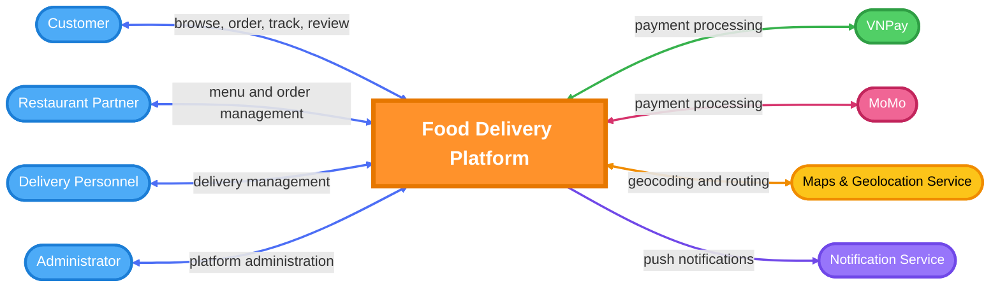
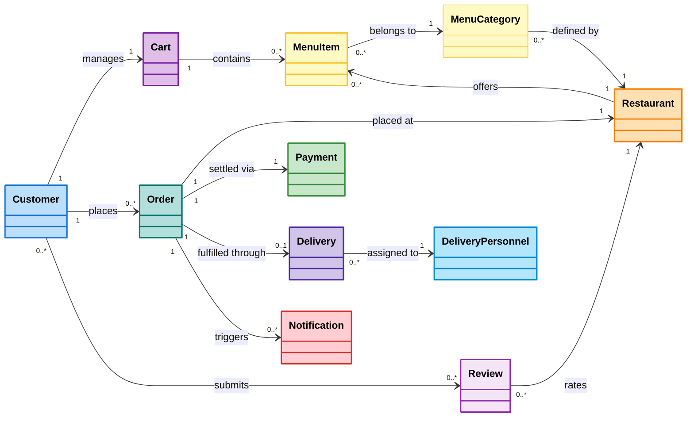
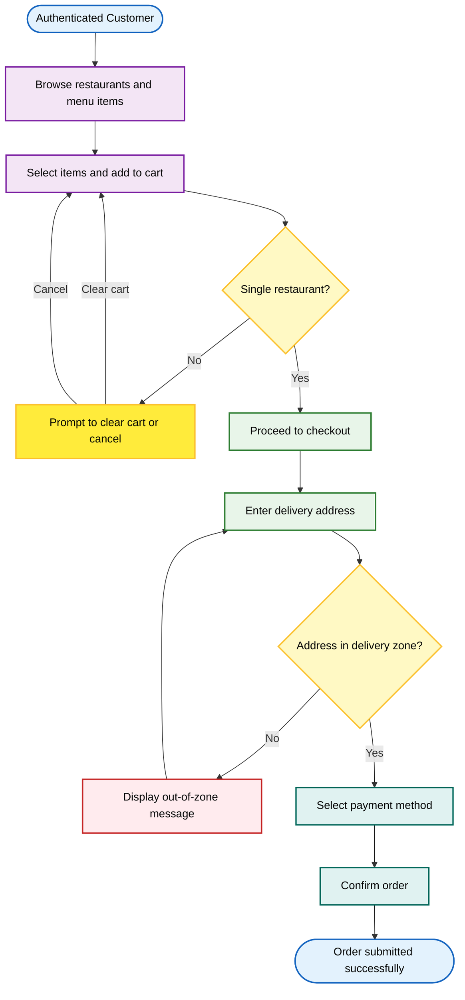
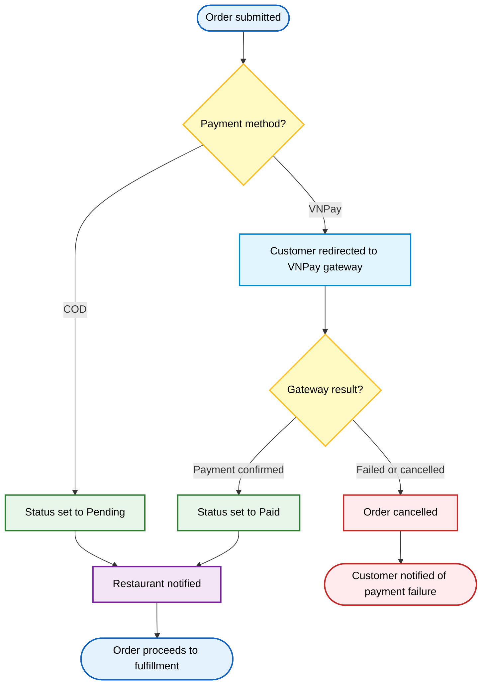
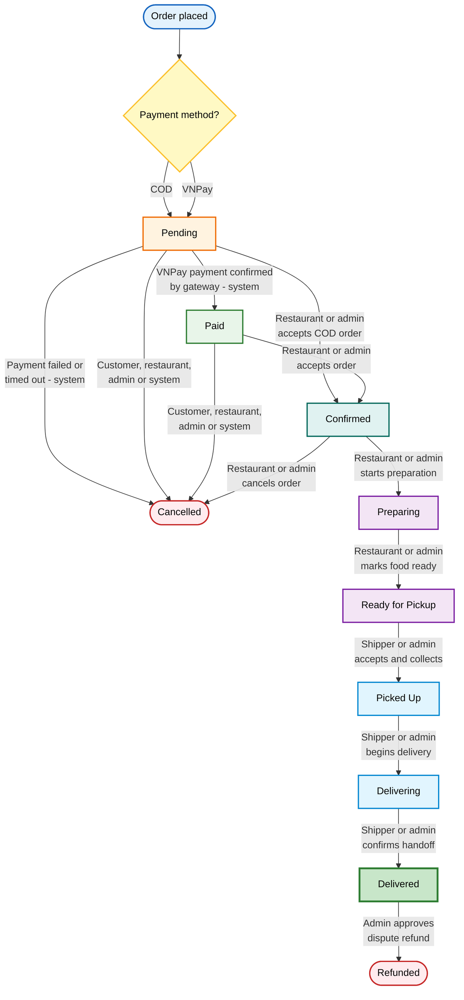
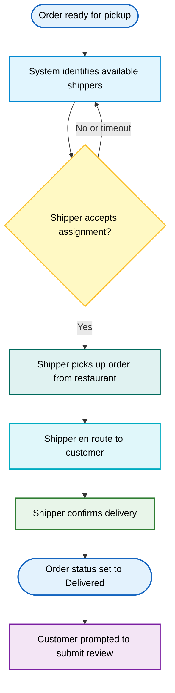
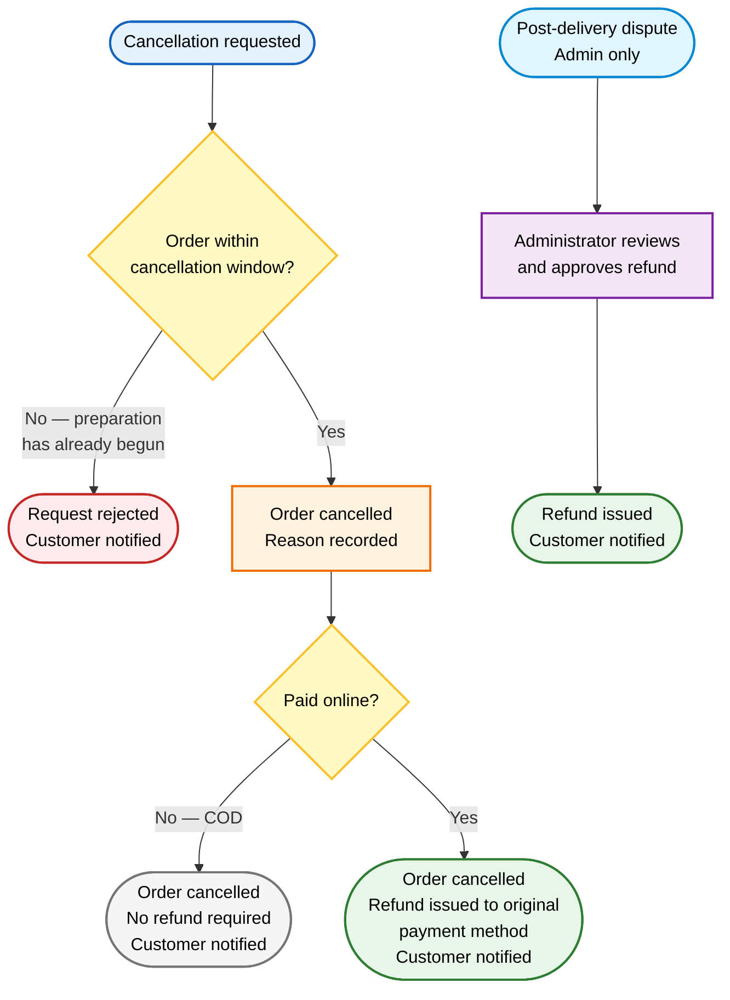

# Business Requirements Document (BRD)

## Food Delivery Platform

### *Nền tảng Đặt và Giao Đồ ăn Trực tuyến*

---

**Version:** 1.0
**Date:** January 28, 2026
**Status:** Baseline
**Document Owner:** Development Team
**Classification:** Internal — Project Documentation

---

# 0. Document Control

## 0.1 Revision History

| Version | Date | Author | Description |
|---|---|---|---|
| 0.1 | 28/01/2026 | Development Team | Initial draft |
| 1.0 | 28/01/2026 | Development Team | Baseline release |

## 0.2 Approval

| Role | Name | Signature | Date |
|---|---|---|---|
| Product Owner | | | |
| Business Analyst Lead | | | |
| Technical Lead | | | |
| Project Supervisor | | | |

## 0.3 Table of Contents

- [1. Introduction](#1-introduction)
- [2. Business Context](#2-business-context)
- [3. Stakeholders](#3-stakeholders)
- [4. System Context](#4-system-context)
- [5. Business Domain Model](#5-business-domain-model)
- [6. Business Process Flows](#6-business-process-flows)
- [7. Business Requirements](#7-business-requirements)
- [8. Functional Capability Overview](#8-functional-capability-overview)
- [9. Security and Permissions](#9-security-and-permissions)
- [10. Non-Functional Requirements](#10-non-functional-requirements)
- [11. Constraints and Limitations](#11-constraints-and-limitations)
- [12. Traceability Matrix](#12-traceability-matrix)
- [13. Open Issues](#13-open-issues)
- [14. Appendix](#14-appendix)

---

# 1. Introduction

## 1.1 Purpose

This Business Requirements Document (BRD) defines the business requirements for the Food Delivery Platform — a multi-role marketplace that connects customers, restaurant partners, and delivery personnel within a unified digital ordering and fulfillment ecosystem.

The BRD establishes the business context, goals, stakeholder needs, domain model, process flows, and functional and non-functional requirements that the system must satisfy. It serves as the authoritative reference for business intent and provides the foundation for all subsequent specification, design, and testing artifacts.

## 1.2 Scope

This document covers the requirements for Release 1 (MVP) of the Food Delivery Platform, including:

- Customer-facing restaurant discovery, ordering, and real-time order tracking
- Restaurant partner menu management and order reception
- Delivery personnel dispatch and delivery management
- Administrator platform oversight and operational reporting
- Payment processing via Cash on Delivery (COD) and VNPay

Requirements for Release 2 and Release 3 features are noted where relevant but are not elaborated within this document. The following are explicitly out of scope for this BRD:

- Technical architecture or system design
- API endpoint specifications or database schemas
- Detailed use case specifications
- User story acceptance criteria

Those artifacts are maintained in separate, linked documents (see Section 14.2).

## 1.3 Intended Audience

| Audience | Purpose |
|---|---|
| Business Analyst | Primary author and maintainer of this document |
| Product Owner / Project Supervisor | Business requirements review and approval |
| Development Team (Frontend, Backend) | Understanding business intent prior to detailed specification |
| QA Team | Deriving acceptance conditions and overall test scope |
| Stakeholder Representatives (Restaurants, Administrators) | Review of business flows and requirements for accuracy |

## 1.4 Definitions and Glossary

| Term | Definition |
|---|---|
| **Platform** | The Food Delivery Platform system described in this document |
| **Customer** | An end user who browses restaurants, places orders, and receives food deliveries |
| **Restaurant Partner** | A business entity operating a food outlet registered and approved on the platform |
| **Delivery Personnel (Shipper)** | A registered courier who fulfills food deliveries on behalf of the platform |
| **Administrator** | A platform operator with full oversight and management access across all roles |
| **Order** | A confirmed request from a customer to receive specific menu items from a single restaurant |
| **Cart** | A temporary, pre-checkout collection of selected menu items belonging to one restaurant |
| **COD** | Cash on Delivery — payment settled in cash by the customer upon delivery |
| **VNPay** | A Vietnamese digital payment gateway integrated for online order settlement |
| **MoMo** | A Vietnamese mobile e-wallet payment gateway (planned for Release 2) |
| **MVP** | Minimum Viable Product — the feature set delivered in Release 1 |
| **Delivery Zone** | The geographic area within which a restaurant accepts and fulfills delivery orders |
| **Dispatch** | The process of assigning an accepted order to an available delivery person |
| **Service Zone** | The overall geographic area served by the platform in the initial release |
| **BR** | Business Requirement |
| **BO** | Business Objective, as defined in the Vision and Scope document |
| **SM** | Success Metric, as defined in the Vision and Scope document |
| **FE** | Feature identifier, as defined in the Vision and Scope document |

---

# 2. Business Context

## 2.1 Background

The food and beverage service industry in Vietnam is undergoing rapid digital transformation. Consumers who wish to order food currently rely on in-person visits, telephone ordering, or fragmented third-party platforms that provide inconsistent delivery experiences and limited restaurant choices. Restaurants lack a centralized channel to manage orders efficiently and expand their digital customer reach. Delivery personnel operate without a structured system for route optimization or transparent earnings tracking.

Established platforms such as GrabFood, ShopeeFood, and Baemin have validated the market opportunity for food delivery marketplaces in Vietnam. However, a need remains for a well-architected, scalable platform designed from the ground up as both a practical operational solution and a reference implementation for modern multi-role marketplace systems.

## 2.2 Business Opportunity

The Food Delivery Platform addresses the opportunity to build a comprehensive, multi-role marketplace connecting three core participants in the food delivery value chain:

- **Customers** — individuals seeking fast, convenient access to food from a wide range of restaurants
- **Restaurant Partners** — food businesses seeking to expand their digital customer reach and streamline order reception
- **Delivery Personnel (Shippers)** — individuals seeking structured, flexible earning opportunities

By automating order processing, real-time tracking, payment management, and dispatch, the platform creates measurable operational improvements for all three participant groups. The platform is also positioned to expand into adjacent verticals — grocery delivery, pharmacy delivery, and other on-demand services — in future release cycles.

## 2.3 Business Objectives

| ID | Objective | Target | Timeline |
|---|---|---|---|
| **BO-1** | Reduce average customer time spent ordering food by 50% | Under 5 minutes from browsing to order confirmation | 6 months post-release |
| **BO-2** | Enable restaurant partners to increase daily order volume by 30% | 30% increase in average daily orders per active partner | 12 months post-release |
| **BO-3** | Achieve a delivery success rate of 95% or higher | ≥ 95% of dispatched orders delivered successfully | 6 months post-release |
| **BO-4** | Process online payments for at least 70% of all orders | ≥ 70% of completed orders settled via VNPay or future digital methods | 6 months post-release |

## 2.4 Success Metrics

| ID | Metric | Target | Measurement Window |
|---|---|---|---|
| **SM-1** | Active registered customers placing at least one order per week | ≥ 500 customers | 3 months post-release |
| **SM-2** | Restaurant partners actively processing orders | ≥ 30 partners | 3 months post-release |
| **SM-3** | Average customer satisfaction rating from post-delivery reviews | ≥ 4.0 / 5.0 | 6 months post-release |
| **SM-4** | Average order-to-delivery time within the service zone | ≤ 45 minutes | 6 months post-release |

## 2.5 Business Risks

| ID | Risk | Probability | Impact (1–10) | Mitigation Direction |
|---|---|---|---|---|
| **RI-1** | Competition from GrabFood, ShopeeFood, and Baemin hinders user adoption | High (0.7) | 8 | Differentiate through reliability, partner onboarding quality, and user experience |
| **RI-2** | Insufficient restaurant partner onboarding at launch reduces platform utility | Medium (0.5) | 9 | Treat partner onboarding as a pre-launch workstream with a minimum viable partner target |
| **RI-3** | Delivery personnel shortage during peak hours degrades delivery experience | Medium (0.5) | 7 | Design flexible incentive mechanisms; plan for peak-hour capacity |
| **RI-4** | Payment gateway integration failures disrupt order flow and reduce trust | Low (0.3) | 8 | Implement COD as a fallback; conduct thorough sandbox testing before go-live |
| **RI-5** | Real-time tracking performance degrades under high concurrency | Medium (0.4) | 6 | Load test real-time infrastructure prior to release |

## 2.6 Business Assumptions and Dependencies

### Assumptions

| ID | Assumption |
|---|---|
| **AS-1** | Smartphones and internet access are available to all platform participants (customers, restaurant staff, delivery personnel) |
| **AS-2** | Restaurant partners will maintain current menus, pricing, and operating hours on the platform |
| **AS-3** | Payment gateway providers (VNPay, MoMo) will maintain API availability of at least 99.5% |
| **AS-4** | A minimum viable pool of delivery personnel will be available in the target service area at launch |

### Dependencies

| ID | Dependency |
|---|---|
| **DE-1** | Map and geolocation capabilities depend on the availability and quota limits of the selected provider (Google Maps or Mapbox) |
| **DE-2** | Real-time order tracking depends on sustained WebSocket connectivity between the server and client devices |

---

# 3. Stakeholders

## 3.1 Stakeholder Profiles

| Stakeholder | Role in System | Primary Value | Key Concerns | Constraints |
|---|---|---|---|---|
| **Customers** | Place orders, track deliveries, submit reviews | Fast, convenient ordering; wide restaurant choice; time savings | Ease of use; reliable delivery times; transparent pricing | Requires smartphone or internet-connected device |
| **Restaurant Partners** | Manage menus, receive and fulfill orders | Expanded customer reach; increased order volume; brand visibility | Minimal integration effort; reliable order flow; fair revenue terms | Staff training required; stable internet needed at the order reception point |
| **Delivery Personnel (Shippers)** | Accept and fulfill delivery assignments | Flexible income; transparent earnings tracking | Fair and efficient dispatch; accurate earnings; reasonable ratings system | Requires GPS-enabled smartphone with mobile data |
| **Platform Administrators** | Manage users, approve partners, oversee operations | Centralized control; platform quality; operational metrics | Fraud prevention; partner accountability; operational efficiency | Limited initial team; early processes may be partially manual |
| **Payment Gateway Providers (VNPay, MoMo)** | Process digital payments on behalf of the platform | Transaction volume and partnership revenue | API compliance; regulatory alignment; sandbox testing requirements | Integration must follow official documentation and certification procedures |
| **Development Team** | Design, build, and maintain the system | Technical growth; portfolio project delivery | Clear requirements; well-scoped architecture; realistic timeline | Academic timeline; team size limited to 3–5 members |

---

# 4. System Context

## 4.1 Context Diagram

The diagram below places the Food Delivery Platform at the system boundary, showing its four primary user roles and four external system integrations.

## 4.2 External System Descriptions

| External System | Purpose | Integration Direction | Release |
|---|---|---|---|
| **VNPay** | Online payment processing for customer orders | Bidirectional — payment initiation and IPN callback | Release 1 |
| **MoMo** | Mobile e-wallet payment processing | Bidirectional — payment initiation and callback | Release 2 (planned) |
| **Maps and Geolocation Service** (Google Maps or Mapbox) | Address geocoding, delivery zone validation, distance calculation | Bidirectional — query and response | Release 1 |
| **Notification Service** (Firebase Cloud Messaging, Websocket, Nodemailer) | Push notifications to customer, restaurant, and shipper mobile applications | Outbound from platform | Release 1 |

---

# 5. Business Domain Model

## 5.1 Domain Model Diagram

The following diagram represents the core business domain objects and their relationships. This is a conceptual model — it is not a database schema or object design.

## 5.2 Domain Objects Description

| Domain Object | Description |
|---|---|
| **Customer** | A registered user who browses the platform, builds a cart, places orders, makes payments, tracks deliveries, and submits reviews |
| **Restaurant** | A registered and approved food business partner that publishes menus, receives orders, manages preparation, and defines its delivery zone |
| **MenuCategory** | A named grouping used by a restaurant to organize its menu items (e.g., Appetizers, Main Course, Beverages) |
| **MenuItem** | An individual food or beverage product offered by a restaurant, with a name, price, availability status, category, and optional tags |
| **Cart** | A temporary, pre-checkout collection of selected menu items belonging to exactly one restaurant |
| **Order** | A confirmed request from a customer to receive specific menu items from a single restaurant, with a defined lifecycle from placement through delivery or cancellation |
| **Payment** | A record of the financial transaction associated with an order, capturing method (COD or VNPay), amount, and settlement status |
| **Delivery** | The fulfillment record for an order, tracking assignment to a delivery person, pickup, transit, and delivery confirmation |
| **Delivery Personnel** | A registered courier who accepts delivery assignments, picks up orders from restaurants, and delivers them to customers |
| **Review** | A customer-submitted numeric rating and optional written comment evaluating a completed order or restaurant experience |
| **Notification** | A system-generated alert sent to one or more platform participants in response to an order lifecycle event or system condition |

---

# 6. Business Process Flows

## 6.1 Order Placement Workflow

The following diagram describes the customer journey from authentication through order submission.

## 6.2 Payment Workflow

## 6.3 Order Status Lifecycle

Every order progresses through a well-defined lifecycle from placement through delivery, cancellation, or refund. Two parallel entry paths exist depending on payment method: COD orders enter the lifecycle at **Pending**, while VNPay orders must clear a payment confirmation step before the restaurant can act. The system enforces which actor may trigger each transition; no actor may skip a state or act outside their permitted role.

System-initiated transitions (payment timeout, order acceptance timeout) run automatically on a scheduled basis without requiring any manual intervention.

### Transition Ownership Summary

| Transition | From | To | Permitted Actors | Refund Triggered? |
|---|---|---|---|---|
| T-01 | Pending | Confirmed | Restaurant, Admin | No |
| T-02 | Pending | Paid | System (gateway callback) | No |
| T-03 | Pending | Cancelled | Customer, Restaurant, Admin, System | No |
| T-04 | Paid | Confirmed | Restaurant, Admin | No |
| T-05 | Paid | Cancelled | Customer, Restaurant, Admin, System | Yes — VNPay refund initiated |
| T-06 | Confirmed | Preparing | Restaurant, Admin | No |
| T-07 | Confirmed | Cancelled | Restaurant, Admin | Yes — VNPay refund initiated |
| T-08 | Preparing | Ready for Pickup | Restaurant, Admin | No |
| T-09 | Ready for Pickup | Picked Up | Shipper, Admin | No |
| T-10 | Picked Up | Delivering | Shipper, Admin | No |
| T-11 | Delivering | Delivered | Shipper, Admin | No |
| T-12 | Delivered | Refunded | Admin only | Yes — dispute refund |

## 6.4 Delivery Workflow

## 6.5 Cancellation and Refund Workflow

Orders may be cancelled by the customer, the restaurant, or an administrator, provided the order has not yet entered active preparation. Once a restaurant begins preparing an order, cancellation is no longer available through any channel. A cancellation reason is required in all cases for operational traceability.

Refund eligibility is determined by payment method. COD orders carry no monetary refund obligation. Orders settled via online payment are refunded to the customer's original payment method when cancelled after payment has been confirmed. Administrators may separately approve a refund for a delivered order to resolve a customer dispute.

### Cancellation and Refund Summary

| Scenario | Who May Act | Refund Outcome |
|---|---|---|
| Order not yet in preparation | Customer, Restaurant, Administrator | Refund if paid online; none for COD |
| Order in preparation or later | — | Cancellation not permitted |
| Post-delivery dispute | Administrator only | Full refund to original payment method |

---

# 7. Business Requirements

Each Business Requirement defines a discrete, verifiable business need that the platform must satisfy. Requirements are linked to Business Objectives, Success Metrics, and platform features to support traceability.

---

## BR-1: Customer Identity and Access Management

| Attribute | Detail |
|---|---|
| **BR ID** | BR-1 |
| **Requirement Name** | Customer Identity and Access Management |
| **Description** | The platform must support customer self-registration, secure authentication (email/password and OAuth-based social login), session management, and basic profile management including display name, phone number, and saved delivery addresses. |
| **Business Value** | Identity is the prerequisite for every personalized platform service — order history, saved addresses, and review attribution. Without reliable authentication, no transactional or personalized capability is accessible to the customer. |
| **Related Business Areas** | Customer Experience, Platform Security |
| **Related Artifacts** | BO-1, SM-1, FE-1; User Story: US-1 |

---

## BR-2: Single-Restaurant Cart Constraint

| Attribute | Detail |
|---|---|
| **BR ID** | BR-2 |
| **Requirement Name** | Single-Restaurant Cart Constraint |
| **Description** | A customer's active cart must contain items from exactly one restaurant at a time. If a customer attempts to add items from a second restaurant, the platform must prompt the customer to either clear the existing cart and start a new selection, or cancel the action and retain the current cart. |
| **Business Value** | Maintains operational consistency across pricing, delivery zone enforcement, and order fulfillment. Mixed-restaurant carts cannot be dispatched to a single delivery agent and create irreconcilable checkout conflicts. |
| **Related Business Areas** | Cart Management, Order Processing |
| **Related Artifacts** | FE-3; User Story: US-5 |

---

## BR-3: Delivery Zone Validation

| Attribute | Detail |
|---|---|
| **BR ID** | BR-3 |
| **Requirement Name** | Delivery Zone Validation |
| **Description** | At checkout, the platform must validate whether the customer's specified delivery address falls within the selected restaurant's configured delivery zone. Orders with delivery addresses outside the zone must be blocked at checkout with a clear, actionable explanation. |
| **Business Value** | Prevents undeliverable orders from entering the fulfillment pipeline. Unvalidated orders result in cancellations, refund costs, wasted delivery personnel trips, and negative customer experience. |
| **Related Business Areas** | Checkout, Delivery Management, Restaurant Configuration |
| **Related Artifacts** | BO-3, SM-4, FE-3, FE-5; User Story: US-6 |

---

## BR-4: Payment Method Support

| Attribute | Detail |
|---|---|
| **BR ID** | BR-4 |
| **Requirement Name** | Payment Method Support |
| **Description** | The platform must support at minimum Cash on Delivery (COD) and VNPay as payment methods at checkout. Each order is settled by exactly one payment method selected by the customer. For VNPay orders, payment confirmation from the gateway must be received and verified before the order status advances. |
| **Business Value** | COD broadens platform accessibility for customers without digital payment accounts. VNPay enables faster settlement, reduces cash-handling risk for delivery personnel, and supports BO-4 (70% digital payment target). |
| **Related Business Areas** | Payment Processing, Checkout |
| **Related Artifacts** | BO-4, FE-4; User Story: US-7 |

---

## BR-5: Unified Restaurant and Food Discovery

| Attribute | Detail |
|---|---|
| **BR ID** | BR-5 |
| **Requirement Name** | Unified Restaurant and Food Discovery |
| **Description** | Customers must be able to search and browse restaurants and menu items through a single unified discovery interface. Search must support filtering by keyword, cuisine type, food category, tag, and geographic proximity. A single search request must return both matching restaurants and matching menu items in one response. |
| **Business Value** | Discovery is the primary entry point to the ordering funnel. Effective, unified search reduces the time from intent to order placement, directly supporting BO-1 (reduce average ordering time by 50%). |
| **Related Business Areas** | Customer Experience, Restaurant Discoverability |
| **Related Artifacts** | BO-1, BO-2, SM-1, SM-2, FE-2; User Story: US-2 |

---

## BR-6: Restaurant Menu Publication and Management

| Attribute | Detail |
|---|---|
| **BR ID** | BR-6 |
| **Requirement Name** | Restaurant Menu Publication and Management |
| **Description** | Restaurant partners must be able to self-manage their menus through a dedicated portal — creating, updating, and deactivating menu categories and items, setting prices, managing item availability, and uploading images. Menu changes must be reflected to customers promptly. |
| **Business Value** | Enables restaurant partners to operate independently, reduces platform support overhead for menu changes, and maintains the menu accuracy required to prevent unfulfillable orders. |
| **Related Business Areas** | Restaurant Management, Menu Accuracy, Order Fulfillment |
| **Related Artifacts** | BO-2, SM-2, FE-6; User Story: US-11 |

---

## BR-7: Order Lifecycle and Status Management

| Attribute | Detail |
|---|---|
| **BR ID** | BR-7 |
| **Requirement Name** | Order Lifecycle and Status Management |
| **Description** | Every order must progress through a well-defined lifecycle: Pending or Awaiting Payment → Confirmed → Preparing → Ready for Pickup → In Delivery → Delivered (or Cancelled at applicable stages). Each status transition must be triggered by the appropriate role, timestamped, and communicated in real time to all relevant participants. |
| **Business Value** | Lifecycle transparency reduces support requests, enables accurate delivery time estimation, and provides the event foundation for notifications, tracking, financial reporting, and operational audit. |
| **Related Business Areas** | Order Processing, Delivery Management, Customer Experience, Operations |
| **Related Artifacts** | BO-1, BO-3, SM-4, FE-5, FE-6; User Story: US-8 |

---

## BR-8: Real-Time Order and Delivery Tracking

| Attribute | Detail |
|---|---|
| **BR ID** | BR-8 |
| **Requirement Name** | Real-Time Order and Delivery Tracking |
| **Description** | Customers must receive real-time status updates as their order progresses through the lifecycle. During active delivery, the delivery personnel's location must be visible to the customer on a map. Status updates must be delivered within a defined latency threshold under normal operating conditions. |
| **Business Value** | Real-time visibility reduces customer anxiety, lowers the volume of "where is my order" support contacts, and is a primary competitive differentiator versus traditional ordering channels (phone, walk-in). |
| **Related Business Areas** | Customer Experience, Delivery Management |
| **Related Artifacts** | BO-1, BO-3, SM-3, SM-4, FE-5; User Story: US-9 |

---

## BR-9: Restaurant Order Reception and Management

| Attribute | Detail |
|---|---|
| **BR ID** | BR-9 |
| **Requirement Name** | Restaurant Order Reception and Management |
| **Description** | Restaurant partners must receive new order alerts in real time through their portal, acknowledge or reject incoming orders within a defined window, update preparation status as work progresses, and mark orders as ready for pickup. Orders not acknowledged within the defined window must trigger a platform-level escalation. |
| **Business Value** | Reliable order acknowledgment and status updates are essential to meeting the 45-minute order-to-delivery target (SM-4) and the 95% delivery success rate (BO-3). Unacknowledged orders directly increase cancellation rates and customer dissatisfaction. |
| **Related Business Areas** | Restaurant Management, Order Processing, Delivery Coordination |
| **Related Artifacts** | BO-3, SM-2, SM-4, FE-6; User Story: US-13 |

---

## BR-10: Delivery Personnel Dispatch and Management

| Attribute | Detail |
|---|---|
| **BR ID** | BR-10 |
| **Requirement Name** | Delivery Personnel Dispatch and Management |
| **Description** | The platform must match available delivery personnel to pending orders based on proximity and current availability. Delivery personnel must be able to toggle their availability status, review and accept or decline assignments, confirm order pickup from the restaurant, and confirm delivery completion to the customer. |
| **Business Value** | Efficient dispatch is the primary operational lever for achieving BO-3 (95% delivery success rate) and SM-4 (average delivery ≤ 45 minutes). Ineffective dispatch results in delayed deliveries, poor customer experience, and order cancellations. |
| **Related Business Areas** | Delivery Operations, Order Fulfillment |
| **Related Artifacts** | BO-3, SM-4, FE-7; User Stories: US-16, US-17 |

---

## BR-11: Administrator Platform Oversight

| Attribute | Detail |
|---|---|
| **BR ID** | BR-11 |
| **Requirement Name** | Administrator Platform Oversight |
| **Description** | Administrators must have full visibility and control over the platform — managing all user accounts, approving or suspending restaurant and delivery personnel registrations, monitoring active orders, and accessing revenue and operational reports. |
| **Business Value** | Centralized oversight ensures partner quality, enforces platform policies, enables rapid response to operational incidents, and provides the data foundation for business decision-making and governance. |
| **Related Business Areas** | Platform Governance, Risk Management, Business Intelligence |
| **Related Artifacts** | BO-2, SM-2, FE-8; User Story: US-21 |

---

## BR-12: Notifications and Alerts

| Attribute | Detail |
|---|---|
| **BR ID** | BR-12 |
| **Requirement Name** | Notifications and Alerts |
| **Description** | The platform must deliver timely notifications to all participant roles for workflow-relevant events — including order placement confirmations, preparation status updates, delivery assignment alerts, delivery completion confirmations, and payment results. Notifications must be delivered via push notification to mobile applications and in-app messaging where supported. |
| **Business Value** | Proactive notifications eliminate manual status polling, accelerate workflow response times (restaurant acknowledgment, shipper pickup), and improve satisfaction across all roles. |
| **Related Business Areas** | Customer Experience, Restaurant Operations, Delivery Operations |
| **Related Artifacts** | BO-1, BO-3, SM-3, FE-12; User Story: US-9 |

---

## BR-13: Review and Rating System

| Attribute | Detail |
|---|---|
| **BR ID** | BR-13 |
| **Requirement Name** | Review and Rating System |
| **Description** | Customers must be able to submit a numeric rating and optional written review for completed orders. Ratings must evaluate both the restaurant experience and the delivery experience. Aggregated ratings must be displayed on restaurant profiles and search results. |
| **Business Value** | Ratings provide the social proof that drives informed purchasing decisions, incentivize quality improvement among restaurant and delivery partners, and are a key input to the SM-3 satisfaction target (≥ 4.0 / 5.0). |
| **Related Business Areas** | Customer Experience, Partner Quality Management |
| **Related Artifacts** | SM-3, FE-9; User Story: US-19 |

---

## BR-14: Promotional and Loyalty Features

| Attribute | Detail |
|---|---|
| **BR ID** | BR-14 |
| **Requirement Name** | Promotional and Loyalty Features |
| **Description** | The platform must support discount code redemption at checkout, time-limited flash sales initiated by restaurant partners or administrators, and a customer loyalty points program that rewards repeat ordering behavior. |
| **Business Value** | Promotions are a primary acquisition and retention mechanism in competitive food delivery markets. A loyalty program supports SM-1 (weekly active customers ≥ 500) and drives long-term repeat order volume. |
| **Related Business Areas** | Marketing, Customer Retention, Restaurant Partnership |
| **Related Artifacts** | SM-1, FE-10 |

---

# 8. Functional Capability Overview

## 8.1 Functional Capability List

The table below maps each functional capability to its originating feature reference, target release, and current scope status.

| FC ID | Capability | Feature Reference | Target Release | Scope Status |
|---|---|---|---|---|
| FC-1 | Customer Identity and Access | FE-1 | Release 1 | In Scope |
| FC-2 | Unified Restaurant and Food Discovery | FE-2 | Release 1 | In Scope |
| FC-3 | Cart Management and Checkout | FE-3 | Release 1 | In Scope |
| FC-4 | Payment Processing — COD and VNPay | FE-4 | Release 1 | In Scope |
| FC-5 | Order Status Tracking | FE-5 | Release 1 ; Release 2 (live map tracking) | Partial |
| FC-6 | Restaurant Management Portal | FE-6 | Release 1 (menu and order management core); Release 2 (flash sales, multi-branch) | Partial |
| FC-7 | Delivery Personnel Portal | FE-7 | Release 1 | In Scope |
| FC-8 | Administrator Dashboard | FE-8 | Release 1 (user management, approvals, basic reporting) | In Scope |
| FC-9 | Review and Rating System | FE-9 | Release 2 | Planned |
| FC-10 | Promotions and Loyalty | FE-10 | Release 2+ | Planned |
| FC-11 | Multi-Branch and Group Orders | FE-11 | Release 3 | Future |
| FC-12 | Push Notifications | FE-12 | Release 1 (order events)| In Scope |

## 8.2 Future Detailed Documentation

The following specification artifacts are planned to elaborate the capabilities listed above. They are not included in this BRD but are referenced for traceability.

| Document | Description | Status |
|---|---|---|
| Use Case Document | Detailed use case specifications per functional capability | Planned |
| User Story Document | Agile user stories with acceptance criteria | In Progress |
| Software Requirements Specification (SRS) | Full functional and non-functional requirements with priority and verification method | Planned |
| System Architecture Document | Component architecture, deployment model, and integration design | Planned |
| API Specification | REST API contract definitions for all external-facing endpoints | Planned |
| Data Model Document | Relational schema, entity definitions, and data flow documentation | Planned |
| Test Plan | Test strategy, test case outlines, and acceptance test plan | Planned |

---

# 9. Security and Permissions

## 9.1 Role Matrix

The following matrix defines which platform capabilities are accessible by each user role.

| Capability | Customer | Restaurant Partner | Delivery Personnel | Administrator |
|---|---|---|---|---|
| Register and authenticate | ✓ | ✓ | ✓ | ✓ |
| Browse restaurants and menu items | ✓ | — | — | ✓ |
| Manage cart and proceed to checkout | ✓ | — | — | — |
| Place and track own orders | ✓ | — | — | ✓ (view all) |
| Submit reviews and ratings | ✓ | — | — | — |
| Manage own restaurant profile and menu | — | ✓ | — | ✓ |
| Receive and manage incoming orders | — | ✓ | — | ✓ (view) |
| Toggle availability and accept delivery assignments | — | — | ✓ | — |
| Update delivery pickup and completion status | — | — | ✓ | — |
| Manage all user accounts | — | — | — | ✓ |
| Approve or suspend partner accounts | — | — | — | ✓ |
| Access platform-wide operational reports | — | ✓ (own data) | ✓ (own data) | ✓ (all data) |
| Configure platform-level promotions | — | ✓ (own promotions) | — | ✓ |

## 9.2 Security Considerations

| Area | Requirement |
|---|---|
| **Authentication** | All user accounts must be protected by secure credential management. Authentication must follow industry-standard protocols; sessions must be invalidated upon logout or expiry. |
| **Authorization** | All platform actions must enforce role-based access control. No action may be performed or data returned outside a caller's assigned role and scope. |
| **Payment Data** | Payment gateway credentials and transaction identifiers must never be stored in source control. All payment data in transit must be encrypted. Payment callbacks from VNPay must be cryptographically verified before any order state change is applied. |
| **Location Data** | Customer delivery addresses and real-time location data must be transmitted over encrypted channels and must not appear in server logs or error responses. |
| **Input Validation** | All customer-supplied inputs must be validated at the system boundary to prevent injection and manipulation attacks. |
| **PII in Logs** | Personally identifiable information (PII), payment data, and location data must be excluded from application and infrastructure logs. |

---

# 10. Non-Functional Requirements

## 10.1 Performance

| Requirement | Target |
|---|---|
| Search and browse response time | p95 ≤ 2 seconds under normal operating load |
| Order placement end-to-end response | ≤ 3 seconds under normal operating load |
| Real-time order status update delivery | ≤ 3 seconds from event occurrence to client receipt |
| Admin dashboard page load | p95 ≤ 3 seconds under normal operating load |

## 10.2 Availability

| Requirement | Target |
|---|---|
| Authentication service monthly uptime | ≥ 99% |
| Order processing service monthly uptime | ≥ 99% |
| Payment gateway availability (per provider SLA) | ≥ 99% (AS-3) |
| Graceful degradation | Non-critical features must degrade gracefully without causing full platform unavailability |

## 10.3 Scalability

| Requirement | Target |
|---|---|
| Load test target | Platform must meet p95 performance targets at 2× projected peak concurrent user load |
| Real-time connection concurrency | WebSocket infrastructure must support the projected peak number of concurrent active orders without service degradation |
| Data volume growth | System must support growth in restaurant and menu item volume through Release 2 without requiring structural re-architecture |

## 10.4 Reliability

| Requirement | Target |
|---|---|
| Delivery success rate | ≥ 95% of dispatched orders delivered successfully (BO-3) |
| Order idempotency | Duplicate order placement requests within a defined window must not result in duplicate orders |
| Payment state handling | Payment state transitions must be idempotent and deterministic |
| Data consistency | Order status must remain consistent across all participant views — customer, restaurant, shipper, and administrator — at all times |

## 10.5 Security

| Requirement | Target |
|---|---|
| Authentication strength | Compliant with OWASP Application Security Verification Standard (ASVS) Level 2 |
| Payment integration compliance | VNPay integration must pass sandbox certification before production deployment |
| Secrets management | All API credentials managed via environment variables; none committed to source control |
| Data in transit | All client-server communication encrypted via TLS |

## 10.6 Maintainability

| Requirement | Target |
|---|---|
| Containerization | All platform services must be containerized (Docker) to ensure environment consistency across development and production |
| Configuration management | All environment-specific configuration managed through environment variables with no hard-coded credentials |
| Module independence | Platform modules must be structured to allow independent evolution without requiring cascading changes across unrelated capabilities |
| Documentation currency | This BRD and linked specification documents must be updated to reflect all accepted scope changes before implementation begins |

---

# 11. Constraints and Limitations

| ID | Constraint / Limitation | Applicable Releases |
|---|---|---|
| **LI-1** | The platform serves a single designated geographic service area in the initial release. Multi-region expansion is planned for subsequent releases. | Release 1 |
| **LI-2** | Release 1 supports COD and VNPay only. MoMo and additional digital payment gateways are planned for Release 2. | Release 1 |
| **LI-3** | AI and ML-powered capabilities — including personalized recommendations, image-based search, fraud detection, and predictive delivery ETA — are excluded from Releases 1 and 2. | Releases 1–2 |
| **LI-4** | B2B enterprise ordering and subscription meal plan features are out of scope for all planned releases. | All releases |
| **LI-5** | Infrastructure costs must remain within student project budget constraints. Free-tier and student-tier cloud resources are to be prioritized. | Release 1 |
| **LI-6** | Development team capacity is constrained by academic group size (3–5 members). Scope commitments for Release 1 must reflect this constraint. | Release 1 |
| **LI-7** | Full map-based live delivery tracking (shipper location visible to customer in real time) is targeted for Release 2. Release 1 provides order status updates only. | Release 1 |

---

# 12. Traceability Matrix

The following matrix traces each Business Requirement to its supporting Business Objectives, Success Metrics, and mapped platform features.

| BR ID | Requirement Name | BO-1 | BO-2 | BO-3 | BO-4 | SM-1 | SM-2 | SM-3 | SM-4 | Features |
|---|---|---|---|---|---|---|---|---|---|---|
| BR-1 | Customer Identity | ✓ | | | | ✓ | | | | FE-1 |
| BR-2 | Single-Restaurant Cart | ✓ | | ✓ | | | | | | FE-3 |
| BR-3 | Delivery Zone Validation | | | ✓ | | | | | ✓ | FE-3, FE-5 |
| BR-4 | Payment Method Support | ✓ | | | ✓ | | | | | FE-4 |
| BR-5 | Unified Discovery | ✓ | ✓ | | | ✓ | ✓ | | | FE-2 |
| BR-6 | Menu Management | ✓ | ✓ | | | | ✓ | | | FE-6 |
| BR-7 | Order Lifecycle | ✓ | ✓ | ✓ | | ✓ | ✓ | ✓ | ✓ | FE-5, FE-6 |
| BR-8 | Real-Time Tracking | ✓ | | ✓ | | ✓ | | ✓ | ✓ | FE-5 |
| BR-9 | Restaurant Order Mgmt | ✓ | ✓ | ✓ | | | ✓ | | ✓ | FE-6 |
| BR-10 | Delivery Dispatch | | | ✓ | | | | ✓ | ✓ | FE-7 |
| BR-11 | Admin Oversight | | ✓ | ✓ | | | ✓ | ✓ | | FE-8 |
| BR-12 | Notifications | ✓ | | ✓ | | ✓ | | ✓ | | FE-12 |
| BR-13 | Reviews and Ratings | | ✓ | | | | ✓ | ✓ | | FE-9 |
| BR-14 | Promotions and Loyalty | ✓ | ✓ | | | ✓ | ✓ | | | FE-10 |

---

# 13. Open Issues

The following items require resolution or clarification before or during detailed specification.

| ID | Issue | Owner | Priority | Status |
|---|---|---|---|---|
| **OI-1** | Maps and geolocation provider selection (Google Maps vs. Mapbox) pending cost and API quota analysis | Development Team | High | Open |
| **OI-2** | MoMo payment integration timeline and API certification requirements not yet confirmed | Development Team | Medium | Open |
| **OI-3** | Delivery zone definition format per restaurant not yet determined — radius-based circle vs. polygon | Business Analyst | High | Open |
| **OI-4** | Refund processing policy and timeline for VNPay-settled cancelled orders pending gateway clarification | Business Analyst | High | Open |
| **OI-5** | Order cancellation eligibility window — how late in the lifecycle a customer may initiate cancellation — not yet specified | Business Analyst | Medium | Open |
| **OI-6** | Review moderation policy — manual vs. automated content filtering — not yet defined | Product Owner | Medium | Open |
| **OI-7** | Restaurant order acknowledgment SLA — the timeout window before platform escalation triggers — not yet agreed with partners | Business Analyst | High | Open |
| **OI-8** | Delivery personnel onboarding and identity verification process not yet defined | Operations | Medium | Open |

---

# 14. Appendix

## 14.1 References

| Reference | Document | Version | Date |
|---|---|---|---|
| Vision and Scope Document | `Food_Delivery_Vision_and_Scope.md` | 1.0 | 28/01/2026 |
| OWASP Application Security Verification Standard | ASVS | 4.0 | — |
| VNPay Integration Documentation | VNPay Developer Portal | Current | — |

## 14.2 Supporting Documents

The following documents are planned as linked specification artifacts that elaborate on the content of this BRD. They are referenced here but not included.

| Document | Location | Status |
|---|---|---|
| User Stories and Acceptance Criteria | `apps/api/docs/Final_Documents/User-Stories-and-Acceptance-Criteria.md` | In Progress |
| Use Case Document | `apps/api/docs/Final_Documents/` *(planned)* | Planned |
| Software Requirements Specification (SRS) | `apps/api/docs/Final_Documents/` *(planned)* | Planned |
| System Architecture Document | `apps/api/docs/Final_Documents/` *(planned)* | Planned |
| API Specification | `apps/api/docs/` *(planned)* | Planned |
| Data Model Document | `apps/api/docs/Final_Documents/` *(planned)* | Planned |
| Test Plan | `apps/api/docs/Final_Documents/` *(planned)* | Planned |
