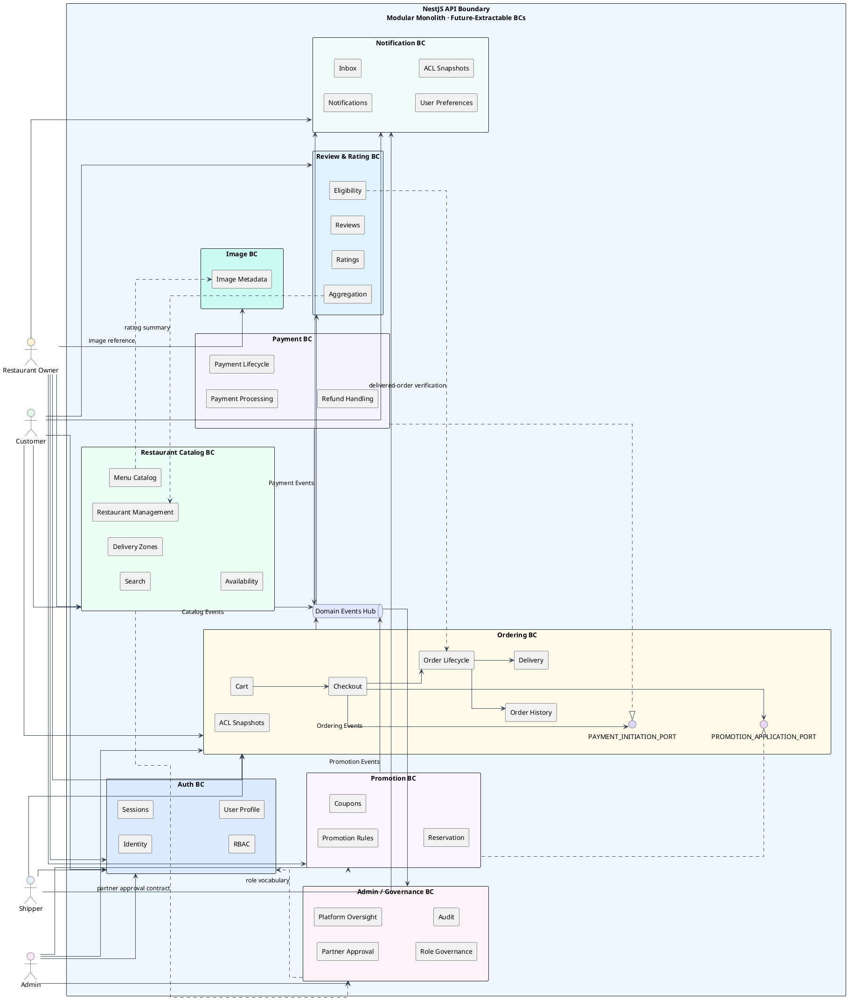
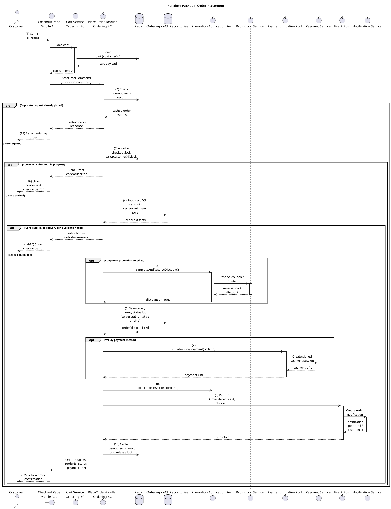
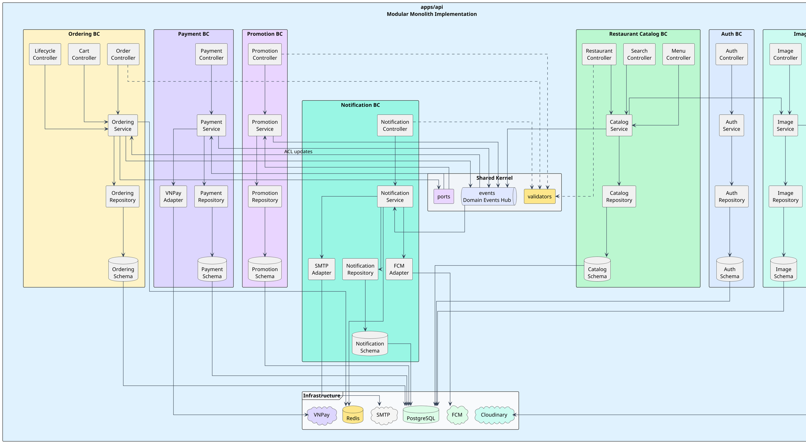
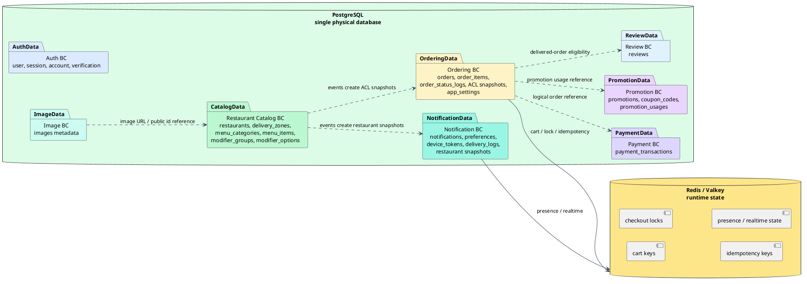
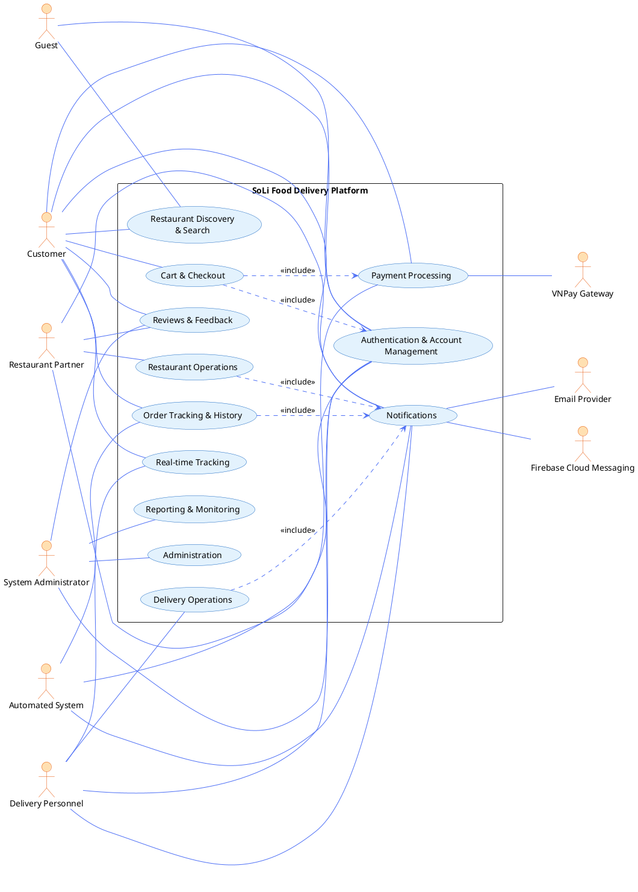

```plantuml
@startuml SoLi_Deployment_View
skinparam backgroundColor #FFFFFF
skinparam shadowing false
skinparam componentStyle rectangle
skinparam packageStyle rectangle
skinparam defaultTextAlignment center
skinparam ArrowColor #334155
left to right direction

actor Developer #F3F4F6
cloud "Internet" as Internet #DBEAFE

node "Client Devices" as ClientDevices #F8FAFC {
  component "Browser\nweb dashboard" as Browser #FED7AA
  component "Mobile app\nExpo runtime" as MobileRuntime #99F6E4
}

node "GitHub" as GitHub #F3F4F6 {
  component "Repository\nmaster branch" as GitHubRepo
  component "GitHub Actions\nci.yml" as Actions
  component "validate.yml\nlint/typecheck/audit/tests/build/e2e" as ValidateJob #BAE6FD
  component "publish-docker.yml\nDocker Buildx api+web" as DockerJob #FED7AA
  component "publish-mobile.yml\nEAS Android artifact" as MobileJob #99F6E4
  component "GHCR\napi:web images\nbranch + short-SHA tags" as GHCR #E0E7FF
}

cloud "Render Deploy Hooks\n[documented target]" as RenderHooks #DBEAFE

node "Render / Production Runtime\nSingle region; HA target" as Render #E0F2FE {
  component "Managed HTTPS Edge\nTLS termination" as Edge #DBEAFE
  component "Load Balancer\n[Target]" as LoadBalancer #BAE6FD
  component "Static Web Service\nnginx + React image" as WebService #FED7AA

  rectangle "API Autoscaling Group\nscale FULL modular-monolith instances" as ApiGroup #E0F2FE {
    node "API Instance 1\nNestJS Docker image\nall BCs loaded" as Api1 #BAE6FD
    node "API Instance 2\nNestJS Docker image\nall BCs loaded" as Api2 #BAE6FD
    node "API Instance N\nAutoscaling target" as ApiN #BAE6FD
  }

  component "Autoscaling Policy\nCPU / latency / connection pressure\n[Planned]" as Autoscaling #FDE68A
  component "Sticky Sessions\nOR Socket.IO Redis Adapter\n[Required for multi-instance WS]" as WsScaling #FDE68A
  database "Managed PostgreSQL\nprimary + backups\nread replica target" as ManagedPostgres #BBF7D0
  database "Managed Redis / Valkey\nshared cart, lock, idempotency,\npresence, rate-limit buckets" as ManagedRedis #FDE68A
  component "Monitoring Stack\nRender logs implemented;\nPrometheus/Grafana/APM planned" as Monitoring #FECACA
  component "Rate Limiting\nedge or Nest throttler\n[Planned]" as RateLimiting #FECACA
}

cloud "VNPay" as VNPay #DDD6FE
cloud "Cloudinary" as Cloudinary #CCFBF1
cloud "Firebase Cloud Messaging" as FCM #DCFCE7
cloud "SMTP Provider" as SMTP #F5F5F4

Developer --> GitHubRepo : push to master
GitHubRepo --> Actions
Actions --> ValidateJob
ValidateJob --> DockerJob
ValidateJob --> MobileJob
DockerJob --> GHCR
GHCR --> RenderHooks : immutable image tag / imgURL
RenderHooks --> WebService : pull web image
RenderHooks --> Api1 : pull api image
RenderHooks --> Api2 : pull same api image
RenderHooks --> ApiN : pull same api image

Browser --> Internet
MobileRuntime --> Internet
Internet --> Edge : HTTPS
Edge --> WebService : static assets
Edge --> LoadBalancer : API REST / realtime
WebService --> LoadBalancer : browser API calls
LoadBalancer --> Api1
LoadBalancer --> Api2
LoadBalancer --> ApiN
Autoscaling ..> ApiGroup

Api1 --> ManagedPostgres
Api2 --> ManagedPostgres
ApiN --> ManagedPostgres
Api1 --> ManagedRedis
Api2 --> ManagedRedis
ApiN --> ManagedRedis
RateLimiting --> ManagedRedis
WsScaling ..> LoadBalancer
WsScaling ..> ManagedRedis
WsScaling ..> ApiGroup

Api1 --> VNPay : HTTPS payment redirect/IPN
Api2 --> VNPay
ApiN --> VNPay
Api1 --> Cloudinary : signed upload / metadata
Api2 --> Cloudinary
ApiN --> Cloudinary
Api1 --> FCM : push delivery
Api2 --> FCM
ApiN --> FCM
Api1 --> SMTP : email delivery
Api2 --> SMTP
ApiN --> SMTP

Api1 --> Monitoring
Api2 --> Monitoring
ApiN --> Monitoring
LoadBalancer --> Monitoring
ManagedPostgres --> Monitoring
ManagedRedis --> Monitoring
@enduml
```

# ĐẠI HỌC QUỐC GIA TP. HỒ CHÍ MINH

# TRƯỜNG ĐẠI HỌC CÔNG NGHỆ THÔNG TIN

# KHOA CÔNG NGHỆ PHẦN MỀM

## ĐỒ ÁN 1/2

## BÁO CÁO PHÂN TÍCH, THIẾT KẾ, XÂY DỰNG VÀ KIỂM THỬ HỆ THỐNG SOLI FOOD DELIVERY PLATFORM

**GV hướng dẫn:** Nguyễn Thị Xuân Hương  
**SV thực hiện:**  
[Mã số sinh viên 1 - Họ và tên]  
[Mã số sinh viên 2 - Họ và tên]  
**TP. Hồ Chí Minh, 2026**

---

# LỜI CẢM ƠN

Nhóm thực hiện trân trọng cảm ơn giảng viên hướng dẫn đã định hướng, góp ý và theo dõi xuyên suốt quá trình thực hiện đề tài. Những góp ý về yêu cầu nghiệp vụ, kiến trúc hệ thống, cách tổ chức tài liệu và tiêu chuẩn trình bày đã giúp nhóm hoàn thiện sản phẩm theo hướng nhất quán giữa nhu cầu nghiệp vụ, hiện trạng triển khai và yêu cầu học thuật.

Nhóm cũng cảm ơn các thành viên đã phối hợp trong quá trình phân tích yêu cầu, xây dựng kiến trúc, phát triển ứng dụng backend, web, mobile, kiểm thử và hoàn thiện bộ tài liệu cuối kỳ. Báo cáo này được xây dựng trên cơ sở đối chiếu chặt chẽ giữa tài liệu nghiệp vụ, tài liệu yêu cầu, tài liệu kiến trúc và hiện trạng mã nguồn của dự án SoLi Food Delivery Platform.

---

# MỤC LỤC

- Lời cảm ơn
- Lời nói đầu
- Chương 1. Tổng quan đề tài
- Chương 2. Cơ sở lý thuyết
- Chương 3. Phân tích và thiết kế hệ thống
- Chương 4. Xây dựng ứng dụng và kiểm thử chương trình
- Kết luận và hướng phát triển
- Tài liệu tham khảo

---

# LỜI NÓI ĐẦU

SoLi Food Delivery Platform là đề tài xây dựng nền tảng đặt và giao đồ ăn trực tuyến theo mô hình marketplace nhiều vai trò, kết nối khách hàng, nhà hàng, shipper và quản trị viên trên cùng một hệ thống. Mục tiêu của đề tài không chỉ dừng lại ở việc hiện thực hóa một ứng dụng phục vụ quy trình đặt món, thanh toán, giao hàng và theo dõi trạng thái đơn hàng, mà còn hướng đến một bộ tài liệu kỹ thuật hoàn chỉnh, thể hiện rõ sự liên kết giữa định hướng kinh doanh, yêu cầu hệ thống, kiến trúc phần mềm và trạng thái triển khai thực tế.

Báo cáo được trình bày như một tài liệu học thuật độc lập. Nội dung tập trung làm rõ bối cảnh hình thành đề tài, mục tiêu nghiệp vụ, phạm vi triển khai, cơ sở công nghệ, mô hình kiến trúc, thiết kế dữ liệu, thiết kế giao diện, cấu trúc dự án và chiến lược kiểm thử. Các thuật ngữ nghiệp vụ và kỹ thuật được thống nhất xuyên suốt để người đọc có thể nắm được toàn bộ hệ thống mà không cần mở đồng thời nhiều tài liệu phụ trợ.

Trong phạm vi báo cáo này, nhóm trình bày tổng quan đề tài, cơ sở công nghệ và AI, kiến trúc hệ thống, thiết kế use case, thiết kế dữ liệu, thiết kế giao diện, cấu trúc dự án, cách thức kiểm thử và định hướng phát triển tiếp theo của hệ thống SoLi Food Delivery Platform.

---

# Chương 1. TỔNG QUAN ĐỀ TÀI

## 1.1 Động lực nghiên cứu và lý do chọn đề tài

Ngành dịch vụ ăn uống tại Việt Nam đang chuyển dịch mạnh sang môi trường số. Tuy nhiên, ở nhiều bối cảnh thực tế, trải nghiệm đặt món vẫn bị phân mảnh: khách hàng phải tìm kiếm thông tin trên nhiều kênh khác nhau; nhà hàng khó kiểm soát đồng thời menu, tình trạng mở cửa và luồng xử lý đơn; lực lượng giao hàng thiếu một quy trình thống nhất để nhận, lấy và hoàn tất đơn; trong khi đơn vị vận hành gặp khó khăn khi cần giám sát toàn bộ vòng đời đơn hàng trên cùng một nền tảng.

Vấn đề của bài toán không chỉ nằm ở việc “xây một ứng dụng đặt món”, mà nằm ở việc tổ chức được một hệ thống nhiều vai trò có thể vận hành đồng bộ. Một nền tảng giao đồ ăn muốn phát huy hiệu quả phải đồng thời giải quyết nhiều yêu cầu: hỗ trợ khám phá nhà hàng và món ăn thuận tiện cho khách hàng, cho phép nhà hàng xử lý đơn theo nhịp bếp thực tế, hỗ trợ shipper theo dõi và cập nhật trạng thái giao hàng, đồng thời cung cấp cho quản trị viên khả năng quan sát và điều phối toàn cục.

Đề tài SoLi Food Delivery Platform được lựa chọn vì hội tụ cả hai giá trị. Ở góc độ ứng dụng, đề tài giải quyết một nhu cầu có thật, có phạm vi đủ lớn để phản ánh đúng bài toán nền tảng số nhiều tác nhân. Ở góc độ học thuật, đề tài tạo điều kiện để phân tích đồng thời các lớp bài toán quan trọng của kỹ nghệ phần mềm hiện đại như mô hình hóa nghiệp vụ, quản lý trạng thái đơn hàng, thiết kế kiến trúc theo bounded context, đồng bộ dữ liệu giữa nhiều ứng dụng khách và tích hợp các dịch vụ ngoài như thanh toán, lưu trữ ảnh, thông báo đẩy và quan sát hệ thống.

Những lý do chính khiến đề tài có giá trị nghiên cứu và triển khai gồm:

- Phản ánh đúng một bài toán chuyển đổi số phổ biến trong lĩnh vực dịch vụ ăn uống.
- Bao phủ đầy đủ chuỗi tác nhân chính gồm khách hàng, nhà hàng, shipper và quản trị viên.
- Có đủ chiều sâu để nghiên cứu từ lớp nghiệp vụ đến lớp kiến trúc và triển khai.
- Tạo môi trường phù hợp để khảo sát các quyết định thiết kế có tính hệ thống như module hóa, tách trách nhiệm dữ liệu, xử lý sự kiện và mở rộng đa kênh.
- Mở ra khả năng phát triển các hướng nâng cao như quan sát vận hành, phân tích dữ liệu và AI đa phương thức trong các giai đoạn tiếp theo.

## 1.2 Khảo sát hiện trạng

Thị trường giao đồ ăn trực tuyến tại Việt Nam đã có nhiều nền tảng lớn chứng minh nhu cầu thực tế của mô hình marketplace. Tuy nhiên, khi xem xét ở góc độ kỹ nghệ phần mềm, bài toán vẫn còn nhiều điểm đáng nghiên cứu: làm thế nào để một hệ thống nhiều vai trò giữ được luồng nghiệp vụ nhất quán; làm thế nào để menu, giỏ hàng, thanh toán, giao hàng, thông báo và đánh giá vận hành như một chuỗi liên tục; và làm thế nào để kiến trúc đủ rõ ràng để có thể mở rộng mà không làm mất kiểm soát chất lượng.

Các nền tảng hiện có thường tối ưu cho quy mô vận hành lớn, nhưng đối với một đồ án học thuật, giá trị trọng tâm không nằm ở việc sao chép đầy đủ mọi năng lực thương mại. Giá trị nằm ở việc chọn đúng phạm vi cốt lõi, mô hình hóa rõ các tác nhân, xây dựng được luồng đặt hàng hoàn chỉnh, chứng minh tính đúng đắn của các trạng thái quan trọng và trình bày kiến trúc theo cách có thể kiểm chứng.

SoLi được định hướng như một hệ thống có phạm vi đủ rộng để phản ánh thực tế nhưng vẫn đủ tập trung để hoàn thành trong khuôn khổ đồ án. Hệ thống bao phủ các luồng chính: khách hàng khám phá và đặt món; nhà hàng quản lý menu và xử lý đơn; shipper tiếp nhận và hoàn tất giao hàng; quản trị viên giám sát, phê duyệt và can thiệp khi phát sinh ngoại lệ; các dịch vụ ngoài hỗ trợ thanh toán, hình ảnh, thông báo và telemetry.

## 1.3 Đối tượng và phạm vi nghiên cứu

Đối tượng nghiên cứu của đề tài là nền tảng đặt và giao đồ ăn trực tuyến theo mô hình nhiều vai trò. Báo cáo tập trung vào các khía cạnh sau:

- Mô hình nghiệp vụ của marketplace giao đồ ăn, bao gồm customer, restaurant partner, shipper và administrator.
- Quy trình đặt món từ khám phá nhà hàng, chọn món, quản lý giỏ hàng, checkout, thanh toán đến theo dõi đơn.
- Mô hình vận hành của nhà hàng và shipper trong vòng đời xử lý đơn.
- Kiến trúc backend modular monolith theo bounded context, có tách ranh giới dữ liệu, sự kiện và adapter tích hợp.
- Thiết kế dữ liệu quan hệ, snapshot đọc xuyên miền, runtime state trong Redis và các bảng audit.
- Các yêu cầu chất lượng liên quan đến hiệu năng, độ tin cậy, bảo mật, khả năng mở rộng, quan sát vận hành và khả năng bảo trì.

Phạm vi triển khai hiện tại tập trung vào Release 1 với các năng lực cốt lõi: xác thực, discovery, menu, delivery zone, cart, checkout, COD, VNPay, order lifecycle, order history, notification, promotion baseline, review baseline, admin dashboard, restaurant portal và mobile customer app. Các hướng như MoMo, live GPS đầy đủ, phân tích BI nâng cao, loyalty points, group order, scheduled order và AI gợi ý cá nhân hóa được xem là lộ trình mở rộng.

## 1.4 Mục tiêu đề tài

### 1.4.1 Mục tiêu nghiệp vụ

Về nghiệp vụ, hệ thống hướng đến bốn mục tiêu chính:

| Mục tiêu | Nội dung | Thước đo kỳ vọng |
|---|---|---|
| BO-1 | Rút ngắn thời gian khách hàng hoàn tất đặt món | Dưới 5 phút từ duyệt món đến xác nhận đơn; mục tiêu nâng cao dưới 3 phút |
| BO-2 | Hỗ trợ nhà hàng tăng lượng đơn hằng ngày | Tăng 30% số đơn trung bình của đối tác hoạt động sau khi vận hành ổn định |
| BO-3 | Nâng cao tỷ lệ giao hàng thành công | Tỷ lệ đơn đã dispatch và giao thành công đạt ít nhất 95% |
| BO-4 | Thúc đẩy thanh toán trực tuyến | Ít nhất 70% đơn hoàn tất được thanh toán qua VNPay hoặc ví điện tử được hỗ trợ |

Các mục tiêu này cho thấy hệ thống không chỉ là một ứng dụng CRUD, mà là nền tảng vận hành chuỗi giá trị từ nhu cầu ăn uống của khách hàng đến doanh thu của nhà hàng, năng lực giao hàng và quản trị nền tảng.

### 1.4.2 Yêu cầu chức năng hệ thống

Nhóm chức năng trọng tâm gồm:

- **Xác thực và tài khoản:** đăng ký, đăng nhập, quản lý phiên, hồ sơ người dùng và vai trò.
- **Khám phá nhà hàng:** tìm kiếm nhà hàng và món ăn, xem chi tiết menu, category, modifier và phí giao dự kiến.
- **Giỏ hàng và checkout:** duy trì giỏ hàng một nhà hàng, cập nhật số lượng, chọn modifier, xác nhận địa chỉ, chọn COD hoặc VNPay.
- **Thanh toán:** tạo phiên VNPay, xử lý IPN, hiển thị return URL chỉ đọc, theo dõi lịch sử giao dịch và hỗ trợ trạng thái refund.
- **Vòng đời đơn hàng:** chuyển trạng thái từ pending đến delivered hoặc các trạng thái kết thúc ngoại lệ; ghi nhận timeline và actor thực hiện.
- **Vận hành nhà hàng:** quản lý hồ sơ, menu, delivery zone, trạng thái món và xử lý đơn.
- **Giao hàng:** shipper xem đơn khả dụng, nhận đơn, cập nhật pickup, en-route và delivered.
- **Thông báo:** inbox, push token, tùy chọn kênh, quiet hours, email/push/in-app và real-time delivery.
- **Khuyến mãi và đánh giá:** quản lý promotion/coupon, áp dụng giảm giá tại checkout, gửi review sau đơn hàng đã giao.
- **Quản trị:** dashboard, quản lý người dùng, nhà hàng, đơn hàng, promotion và analytics vận hành.

### 1.4.3 Yêu cầu dữ liệu, giao diện, phần cứng và phần mềm

Dữ liệu lõi của hệ thống được lưu trong PostgreSQL với quyền sở hữu bảng theo bounded context. Redis được sử dụng cho trạng thái runtime có vòng đời ngắn như cart, idempotency key, lock và một phần presence. Các đối tượng tích hợp như ảnh, thanh toán, push notification và email được lưu bằng metadata nội bộ, trong khi payload hoặc tài nguyên thực tế được quản lý bởi nhà cung cấp tương ứng.

Về giao diện, hệ thống có ba bề mặt chính: ứng dụng mobile cho khách hàng và các luồng di động; web portal cho nhà hàng; admin portal cho quản trị viên. Cách tách giao diện này giúp mỗi nhóm actor có không gian thao tác phù hợp với nhiệm vụ của mình, đồng thời tránh nhồi toàn bộ chức năng vào một UI duy nhất.

Về phần mềm, hệ thống cần môi trường Node.js/pnpm, PostgreSQL, Redis, Docker/Docker Compose, trình duyệt hiện đại và thiết bị di động hoặc giả lập để chạy Expo. Môi trường triển khai có thể đóng gói backend, web và admin bằng container; mobile được xây dựng theo quy trình Expo/EAS.

### 1.4.4 Yêu cầu phi chức năng và mục tiêu chất lượng

Hệ thống SoLi được đánh giá theo một tập thuộc tính chất lượng rộng hơn các chỉ tiêu cơ bản của một ứng dụng web thông thường. Các thuộc tính này được chọn vì chúng tác động trực tiếp đến khả năng vận hành của một marketplace nhiều vai trò.

| Thuộc tính chất lượng | Mục tiêu | Biểu hiện trong hệ thống |
|---|---|---|
| Performance | Giữ trải nghiệm tương tác nhanh, đặc biệt ở discovery và checkout | Tìm kiếm trang đầu p95 không quá 2 giây; checkout p95 không quá 3 giây trong tải vận hành bình thường; truy vấn list có phân trang và index |
| Availability | Hạn chế gián đoạn ở các đường dẫn cốt lõi | Xác thực, checkout, payment confirmation và notification inbox có đường fallback; provider tùy chọn không được làm hỏng trạng thái đơn đã commit |
| Reliability | Bảo toàn trạng thái đơn và tiền | Checkout có idempotency; lifecycle có transition matrix; IPN thanh toán xác minh chữ ký và xử lý lặp an toàn; order log ghi lại chuyển trạng thái |
| Security | Bảo vệ tài khoản, vai trò, dữ liệu cá nhân và thanh toán | Better Auth quản lý phiên; RBAC bảo vệ endpoint; ValidationPipe kiểm soát input; VNPay callback được kiểm tra HMAC; secret nằm trong biến môi trường |
| Scalability | Có đường mở rộng khi lưu lượng tăng | API instance hướng tới stateless; Redis tách runtime state; PostgreSQL giữ durable state; WebSocket nhiều instance cần sticky session hoặc Socket.IO Redis adapter |
| Modifiability | Giảm chi phí thay đổi nghiệp vụ | Backend chia theo bounded context; Ordering gọi Payment/Promotion qua ports; provider nằm sau adapter; schema Drizzle nằm gần module sở hữu |
| Observability | Có đủ tín hiệu để điều tra lỗi và đo vận hành | OpenTelemetry export traces/metrics/logs qua OTLP; custom JSON logger; request context; domain metrics cho order placed và payment failures; Grafana Faro/PostHog/Sentry ở client |
| Maintainability | Duy trì tính dễ đọc, dễ kiểm thử và dễ bàn giao | Controller/service/repository/schema rõ ràng; unit test cho service/handler; e2e test cho API flow; CI chạy lint, typecheck, test, build và e2e |

Từ góc nhìn chất lượng, các mục tiêu trên liên kết với nhau. Hiệu năng checkout không thể tách khỏi thiết kế cart Redis và transaction order; độ tin cậy thanh toán không thể tách khỏi idempotency IPN; khả năng bảo trì không thể tách khỏi ranh giới bounded context; còn khả năng quan sát vận hành là điều kiện để đánh giá thực tế các mục tiêu sau khi triển khai.

---

# Chương 2. CƠ SỞ LÝ THUYẾT VÀ CÔNG NGHỆ SỬ DỤNG

Phần này trình bày các thành phần công nghệ chính được áp dụng cho SoLi, phân tích ưu/nhược điểm và lý do lựa chọn phù hợp với bài toán dự án.

## 2.1 Backend: Node.js, TypeScript, NestJS

**Giới thiệu:** Backend được xây dựng bằng TypeScript trên nền Node.js và NestJS. NestJS tổ chức ứng dụng bằng module, controller, provider, dependency injection và lifecycle hook, phù hợp với cách phân tách bounded context trong một modular monolith.

**Ưu điểm:** TypeScript giúp kiểm soát kiểu dữ liệu ở compile time, đặc biệt hữu ích khi hệ thống có nhiều DTO, enum trạng thái, schema Drizzle và contract API. NestJS cung cấp dependency injection, module boundary, interceptor, guard, pipe, scheduler, WebSocket gateway và OpenAPI integration, nhờ đó backend có cấu trúc rõ ràng hơn so với một Express app thuần.

**Nhược điểm:** Node.js có event loop đơn luồng nên không phù hợp để xử lý tác vụ CPU-bound nặng trong cùng process. NestJS cũng có mức trừu tượng cao hơn, đòi hỏi nhóm phát triển hiểu module graph, provider scope và dependency injection để tránh coupling không kiểm soát.

**Lý do lựa chọn:** Bài toán SoLi có nhiều miền nghiệp vụ nhưng vẫn nằm trong phạm vi một nhóm đồ án. NestJS cho phép tổ chức backend thành các module độc lập như Auth, Restaurant Catalog, Ordering, Payment, Promotion, Notification, Review và Admin Analytics mà chưa phải chịu chi phí vận hành microservices. Đây là lựa chọn cân bằng giữa tốc độ phát triển, tính học thuật của kiến trúc và khả năng mở rộng sau này.

## 2.2 Persistence: PostgreSQL + Drizzle ORM

**Giới thiệu:** PostgreSQL là hệ quản trị cơ sở dữ liệu quan hệ chính. Drizzle ORM được dùng để khai báo schema bằng TypeScript, sinh migration bằng Drizzle Kit và viết truy vấn kiểu an toàn nhưng vẫn giữ tinh thần SQL gần với cơ sở dữ liệu.

**Ưu điểm:** PostgreSQL phù hợp với dữ liệu giao dịch có ràng buộc rõ ràng như order, order item, payment transaction, promotion usage và notification log. Drizzle giúp schema, enum, index và type suy luận nằm gần mã nguồn, tạo sự nhất quán giữa model dữ liệu và repository. Cách tiếp cận SQL-like của Drizzle cũng làm cho truy vấn dễ audit hơn so với ORM che giấu quá nhiều chi tiết.

**Nhược điểm:** Drizzle không loại bỏ nhu cầu hiểu SQL. Các truy vấn phức tạp, index đặc thù, partial index hoặc tối ưu hiệu năng vẫn đòi hỏi kiến thức cơ sở dữ liệu. Nhóm phát triển cũng phải quản lý migration cẩn thận để tránh lệch giữa schema TypeScript và database thực tế.

**Lý do lựa chọn:** Checkout, thanh toán và promotion cần transaction rõ ràng, số tiền kiểu integer, audit log và idempotency. PostgreSQL đáp ứng yêu cầu tính nhất quán, còn Drizzle giữ được type-safety trong TypeScript mà không làm mất khả năng kiểm soát SQL.

## 2.3 In-memory / Cache: Redis

**Giới thiệu:** Redis được sử dụng như runtime state layer cho các dữ liệu ngắn hạn và cần truy xuất nhanh: cart, idempotency key, checkout lock, presence và một số trạng thái hỗ trợ notification.

**Ưu điểm:** Redis có độ trễ thấp, hỗ trợ TTL tự nhiên và phù hợp với các key có vòng đời ngắn. Cart có thể được cập nhật nhanh mà không làm phình transaction database; idempotency key và lock giúp bảo vệ checkout khỏi retry hoặc request trùng; presence giúp realtime notification vận hành linh hoạt hơn.

**Nhược điểm:** Redis là lớp dữ liệu volatile hơn PostgreSQL, do đó không nên dùng làm nguồn sự thật cho order, payment hoặc ledger nghiệp vụ. Khi mở rộng nhiều instance, Redis cũng trở thành dependency quan trọng cần theo dõi sức khỏe và cấu hình backup/persistence phù hợp.

**Lý do lựa chọn:** Giỏ hàng và idempotency là dữ liệu runtime điển hình: cần nhanh, có TTL và không nhất thiết lưu vĩnh viễn. Redis giúp PostgreSQL tập trung vào dữ liệu durable, đồng thời giảm độ trễ của các thao tác có tần suất cao.

## 2.4 Frontend: React + Vite + Tailwind; Mobile: Expo React Native

**Giới thiệu:** Web portal và admin portal sử dụng React với Vite, Tailwind CSS, shadcn/radix-style UI primitives, React Router, React Query và Axios. Mobile app sử dụng Expo SDK 55, React Native, Expo Router, NativeWind, React Query, Zustand và các API native như Secure Store, Location, Notifications, Firebase Messaging và Sentry.

**Ưu điểm:** React tạo mô hình component quen thuộc cho cả web và mobile. Vite giúp quá trình phát triển web nhanh và đơn giản. Expo Router cung cấp file-based routing cho mobile, còn EAS/dev client hỗ trợ phát triển và đóng gói ứng dụng native theo quy trình nhất quán. React Query giúp quản lý server state, cache, loading và retry tốt hơn so với gọi API thủ công rời rạc.

**Nhược điểm:** Ứng dụng SPA và mobile client cần kiểm soát bundle, trạng thái cache, lỗi mạng và đồng bộ phiên đăng nhập. Expo giúp giảm chi phí native nhưng vẫn có giới hạn khi cần module native đặc thù hoặc tối ưu sâu trên từng nền tảng.

**Lý do lựa chọn:** SoLi có ba nhóm giao diện khác nhau. React/Vite phù hợp với restaurant portal và admin portal cần thao tác bảng, dashboard, form và routing nhanh. Expo phù hợp với customer mobile journey vì hỗ trợ navigation, secure storage, push notification, location và build mobile trong một hệ sinh thái thống nhất.

## 2.5 Real-time: Socket.IO

**Giới thiệu:** Socket.IO được dùng cho kênh thời gian thực, đặc biệt là notification gateway và cập nhật trạng thái đơn hàng.

**Ưu điểm:** Socket.IO cung cấp abstraction trên WebSocket, có cơ chế fallback và hệ sinh thái client tốt cho web/mobile. Room và event giúp gửi thông báo theo user, role hoặc order một cách trực quan.

**Nhược điểm:** Khi chạy nhiều API instance, room membership và emit không còn tự động nhất quán nếu chỉ dựa vào bộ nhớ process. Hệ thống cần sticky session hoặc Socket.IO Redis adapter trước khi tuyên bố hỗ trợ realtime multi-instance đầy đủ.

**Lý do lựa chọn:** Theo dõi đơn và thông báo là các luồng cần phản hồi nhanh, nhưng hệ thống vẫn cần triển khai gọn trong phạm vi đồ án. Socket.IO đáp ứng tốt nhu cầu realtime ban đầu và vẫn có đường mở rộng rõ ràng khi cần scale.

## 2.6 Observability

**Giới thiệu:** Backend có OpenTelemetry SDK, OTLP exporters cho traces, metrics và logs, RuntimeNodeInstrumentation, auto-instrumentations, custom JSON logger, request context, redaction utilities và domain metrics. Web portal có Grafana Faro và PostHog. Mobile app có Sentry React Native.

**Ưu điểm:** OpenTelemetry chuẩn hóa cách thu thập telemetry, giúp hệ thống không phụ thuộc cứng vào một vendor ngay từ đầu. JSON logger và request context hỗ trợ correlation khi điều tra lỗi. Domain metrics như số order đặt thành công và payment failure giúp chuyển một phần nghiệp vụ thành tín hiệu vận hành. Grafana Faro, PostHog và Sentry bổ sung góc nhìn client-side.

**Nhược điểm:** Observability làm tăng độ phức tạp cấu hình và chi phí lưu trữ. Nếu instrumentation quá dày hoặc không có redaction, log/trace có thể gây nhiễu hoặc rủi ro dữ liệu nhạy cảm. Do đó telemetry cần sampling, bỏ qua silent path và kiểm soát payload.

**Lý do lựa chọn:** Food delivery là bài toán có nhiều lỗi khó tái hiện: payment callback, notification failure, checkout retry, timeout và lỗi realtime. Observability giúp nhóm phát triển hiểu điều gì xảy ra trong runtime, từ đó đánh giá được độ tin cậy và chất lượng vận hành thay vì chỉ dựa vào kiểm thử cục bộ.

## 2.7 Testing

**Giới thiệu:** Backend sử dụng Jest, ts-jest, @nestjs/testing và Supertest. Test suite gồm unit test trong `apps/api/src` và e2e test trong `apps/api/test`, chạy với PostgreSQL và Redis ở môi trường CI.

**Ưu điểm:** Jest phù hợp với TypeScript/NestJS, hỗ trợ mock, spy và cấu trúc describe/it rõ ràng. Supertest phù hợp để kiểm thử HTTP API qua app NestJS thật. Việc có cả unit và e2e giúp kiểm tra từ logic thuần đến luồng API hoàn chỉnh.

**Nhược điểm:** E2E test cần dữ liệu setup ổn định, database sạch và thời gian chạy dài hơn unit test. Mock quá nhiều có thể làm test xa thực tế; ngược lại, integration quá rộng có thể làm CI chậm và khó debug.

**Lý do lựa chọn:** Các nghiệp vụ như checkout, payment IPN, order lifecycle, promotion reservation, notification fan-out và review eligibility đều có nhiều điều kiện biên. Jest/Supertest cho phép kiểm tra có hệ thống cả logic nghiệp vụ lẫn hành vi API.

## 2.8 DevOps & CI/CD

**Giới thiệu:** Monorepo sử dụng pnpm workspace và Turbo để điều phối build/lint/test. Docker/Docker Compose phục vụ môi trường local và đóng gói API/web/admin. GitHub Actions chạy CI validate, pipeline riêng cho api/web/admin/mobile, đóng gói Docker image và publish lên GHCR. Render và Terraform được chuẩn bị cho triển khai hạ tầng.

**Ưu điểm:** Docker giúp tái tạo môi trường chạy PostgreSQL, Redis, API, web và admin. GitHub Actions tự động hóa lint, typecheck, audit, unit test, build, migration push và e2e test. GHCR tạo registry ảnh container có tag theo branch và short SHA. Terraform giúp mô tả hạ tầng bằng mã.

**Nhược điểm:** CI/CD có nhiều biến môi trường và secret, cần quản lý cẩn thận. Pipeline càng đầy đủ thì càng tốn thời gian chạy, đặc biệt khi có e2e test với database và Redis.

**Lý do lựa chọn:** Đồ án cần chứng minh không chỉ chạy được trên máy phát triển mà còn có quy trình kiểm chứng và đóng gói nghiêm túc. DevOps stack hiện tại giúp hệ thống có đường đi từ mã nguồn đến artifact triển khai một cách có kiểm soát.

## 2.9 API Documentation & Validation

**Giới thiệu:** Backend tạo OpenAPI document bằng `@nestjs/swagger`, hợp nhất thêm schema từ Better Auth và phục vụ `api-spec.json`. Scalar NestJS API Reference được dùng để hiển thị tài liệu API tại `/docs`. Validation được triển khai bằng Nest `ValidationPipe`, class-validator/class-transformer cho DTO và Zod cho cấu hình môi trường cùng schema phía client.

**Ưu điểm:** OpenAPI giúp web, admin và mobile có contract rõ ràng khi tích hợp API. Scalar cung cấp giao diện đọc tài liệu API trực quan hơn cho quá trình kiểm thử thủ công. ValidationPipe chuyển đổi và kiểm tra input ở biên hệ thống, còn Zod phù hợp cho cấu hình và form/client schema.

**Nhược điểm:** Tài liệu API chỉ đáng tin khi DTO, decorator, response shape và auth schema được cập nhật đồng bộ. Nếu thiếu discipline, OpenAPI có thể trở thành mô tả sai lệch so với runtime.

**Lý do lựa chọn:** SoLi có nhiều client và nhiều nhóm endpoint. Tài liệu API và validation layer giúp giảm lỗi tích hợp, tăng khả năng kiểm thử và làm rõ contract giữa backend với web/mobile/admin.

## 2.10 AI đa phương thức cho đánh giá chất lượng sản phẩm

### 2.10.1 Bài toán nghiệp vụ

Trong các nền tảng thương mại điện tử và marketplace, đánh giá của người dùng không chỉ là một đoạn văn bản ngắn. Người dùng thường để lại ảnh sản phẩm, bình luận ngắn, tiếng Việt không dấu, tiếng Anh xen lẫn, emoji, slang hoặc nhận xét rất rời rạc. Nếu chỉ nhìn rating sao, hệ thống khó hiểu vì sao sản phẩm hoặc nhà hàng được đánh giá tốt hoặc kém. Nếu chỉ nhìn text, hệ thống bỏ lỡ tín hiệu trực quan như bao bì, hình thức món ăn, hư hỏng hoặc chênh lệch giữa ảnh và thực tế.

Đối với SoLi, hướng AI được đặt trong lộ trình nâng cao nhằm hỗ trợ đánh giá chất lượng sản phẩm/món ăn và giải thích lý do đánh giá. Mục tiêu không phải thay thế người dùng, mà là tạo thêm một lớp hỗ trợ phân tích phản hồi để nhà hàng và quản trị viên hiểu rõ hơn chất lượng trải nghiệm sau giao hàng.

### 2.10.2 Động lực áp dụng AI

AI có giá trị khi dữ liệu phản hồi trở nên lớn và khó đọc thủ công. Một hệ thống có thể nhận diện xu hướng chất lượng, phát hiện nhóm phản hồi tiêu cực, tách tín hiệu về giá, chất lượng và hình thức, đồng thời sinh giải thích ngắn gọn sẽ giúp nhà hàng cải thiện menu và giúp quản trị viên ưu tiên xử lý vấn đề.

### 2.10.3 Hạn chế của ảnh đơn lẻ

Ảnh có thể thể hiện tình trạng sản phẩm, bao bì hoặc hình thức trình bày, nhưng ảnh không luôn cho biết cảm nhận của người dùng. Một bức ảnh đẹp có thể đi kèm bình luận chê giá cao; một ảnh mờ có thể không đủ thông tin; nhiều ảnh không chứa toàn bộ ngữ cảnh giao hàng. Vì vậy mô hình chỉ dùng ảnh dễ bị thiếu tín hiệu về vị, giá, thời gian chờ hoặc thái độ phục vụ.

### 2.10.4 Hạn chế của văn bản đơn lẻ

Văn bản review thường ngắn, nhiễu và không chuẩn hóa. Các câu như "ok", "ngon", "hơi ít", "good", "xấu hơn hình" chứa thông tin nhưng rất phụ thuộc ngữ cảnh. Nếu không có ảnh, mô hình khó đánh giá các tín hiệu thị giác như màu sắc, đóng gói, lượng đồ ăn hoặc tình trạng sản phẩm.

### 2.10.5 Lý do cần Multimodal AI

Multimodal AI kết hợp ảnh và văn bản để bù trừ điểm yếu của từng nguồn dữ liệu. Văn bản cung cấp ý định, cảm xúc và tiêu chí đánh giá của người dùng; ảnh cung cấp bằng chứng trực quan về hình thức và chất lượng vật lý. Khi hai nguồn nhất quán, mô hình có cơ sở mạnh hơn; khi hai nguồn mâu thuẫn, mô hình có thể đánh dấu trường hợp cần xem xét kỹ.

Luồng tiếp cận tổng quát:

```text
Business Problem
↓
AI Problem
↓
Multimodal Solution
↓
ConvNeXt
↓
XLM-RoBERTa
↓
Fusion Layer
↓
Explainable AI
↓
AI Agent
```

### 2.10.6 Multimodal Solution

Giải pháp AI được định hướng như một service riêng, nơi backend gửi ảnh và nội dung review để nhận về điểm chất lượng tổng thể, điểm theo yếu tố và giải thích. Cách tổ chức service riêng giúp hệ thống giao đồ ăn vẫn giữ lõi nghiệp vụ ổn định, còn AI có thể phát triển độc lập về mô hình, GPU, batch inference và pipeline dữ liệu.

### 2.10.7 ConvNeXt cho ảnh

ConvNeXt được dùng như bộ trích xuất đặc trưng hình ảnh. Mô hình phù hợp với các dấu hiệu thị giác tinh như bao bì, màu sắc, hình thức trình bày, hư hỏng, sai khác hình ảnh hoặc chất lượng ảnh. Trong lộ trình huấn luyện, ConvNeXt có thể được fine-tune từ pretrained weights và thay classification head bằng regression/multi-output head phục vụ điểm chất lượng.

### 2.10.8 XLM-RoBERTa cho văn bản

XLM-RoBERTa phù hợp với bình luận đa ngôn ngữ và code-mixed Việt-Anh. Với dữ liệu review thực tế, mô hình text cần xử lý câu ngắn, sai chính tả, viết tắt, emoji và từ lóng. XLM-R giúp giảm nhu cầu xây nhiều pipeline riêng cho từng ngôn ngữ, đồng thời giữ được biểu diễn ngữ nghĩa ở cấp subword.

### 2.10.9 Fusion Layer

Fusion Layer kết hợp embedding ảnh từ ConvNeXt và embedding văn bản từ XLM-RoBERTa. Cách đơn giản là concatenation rồi đưa qua fully connected layers để dự đoán overall score và factor scores. Hướng nâng cao là cross-attention để văn bản có thể chú ý đến vùng ảnh liên quan và ảnh có thể được diễn giải trong ngữ cảnh câu nhận xét.

### 2.10.10 Explainable AI và AI Agent

Explainable AI giúp mô hình không chỉ trả về điểm số mà còn cho biết vì sao có dự đoán đó. Grad-CAM có thể chỉ ra vùng ảnh ảnh hưởng mạnh đến kết quả; attention visualization giúp nhận diện từ hoặc cụm từ quan trọng; SHAP/LIME hỗ trợ phân tích đóng góp giữa ảnh, text và lớp fusion. AI Agent nhận các kết quả này và sinh một đoạn giải thích ngắn bằng ngôn ngữ tự nhiên, giúp nhà hàng hoặc quản trị viên đọc được lý do đánh giá mà không cần hiểu chi tiết mô hình.

---

# Chương 3. PHÂN TÍCH VÀ THIẾT KẾ HỆ THỐNG

## 3.1 Kiến trúc hệ thống

### 3.1.1 Logical View

Ở mức logic, các thành phần chính của hệ thống gồm Auth BC, Restaurant Catalog BC, Image BC, Ordering BC, Payment BC, Promotion BC, Notification BC, Review BC và Admin Analytics BC. Mobile app, restaurant web và admin portal không làm việc trực tiếp với dữ liệu thô, mà đi qua backend API và các contract nghiệp vụ tương ứng.



Thiết kế logic này làm rõ ba nguyên tắc vận hành của hệ thống. Thứ nhất, dữ liệu và luật nghiệp vụ phải có chủ sở hữu duy nhất. Thứ hai, giao tiếp xuyên miền phải đi qua event, snapshot hoặc adapter thay vì join chéo tùy tiện. Thứ ba, mỗi bề mặt client chỉ nhìn thấy hệ thống qua các use case và API phù hợp với vai trò của nó.

### 3.1.2 Runtime View

Runtime View của SoLi tập trung vào những luồng có tác động trực tiếp đến doanh thu, tính đúng đắn nghiệp vụ và trải nghiệm người dùng.



**Packet 1 - Order placement**: customer duyệt nhà hàng, thêm món vào giỏ, checkout; Ordering BC kiểm tra single-restaurant constraint, khả năng phục vụ của restaurant, phạm vi delivery zone, idempotency và promotion trước khi tạo order.

**Packet 2 - Event and ACL synchronization**: các thay đổi từ Restaurant Catalog BC như giá món, availability hoặc delivery zone được phát qua event nội tiến trình; Ordering BC duy trì các bảng snapshot cục bộ để dùng cho checkout.

**Packet 3 - Payment compensation**: Payment BC xử lý redirect URL, IPN callback, timeout và refund; khi có hủy đơn sau thanh toán, hiệu ứng bù trừ được lan sang Notification BC và Promotion BC.

**Packet 4 - Delivery to review**: shipper chuyển đơn qua các trạng thái `picked_up`, `delivering`, `delivered`; khi hoàn tất giao hàng, Notification BC gửi tín hiệu cho khách hàng và Review BC có đủ điều kiện để tiếp nhận đánh giá hậu đơn hàng.

Điểm nổi bật của runtime là các trạng thái cốt lõi được cập nhật trong phạm vi giao dịch hoặc command handler kiểm soát chặt, còn những tác động phụ như thông báo, projection và phân tích được xử lý sau đó theo hướng sự kiện. Cách tiếp cận này giảm coupling nhưng vẫn bảo vệ tốt tính nhất quán của order và payment.

### 3.1.3 Implementation View

Implementation View ánh xạ kiến trúc logic sang module, repository, schema, adapter, shared kernel và hạ tầng tích hợp.



Hình trên cho thấy mỗi bounded context được triển khai theo chuỗi controller, service, repository và schema. Shared Kernel không chứa nghiệp vụ lõi của một miền cụ thể mà đóng vai trò tập hợp validator, port và event dùng chung. External integrations chỉ xuất hiện sau adapter để Payment, Image và Notification không lan truyền payload nhà cung cấp vào business logic.

```text
apps/
  api/
    src/module/
      admin-analytics/
      auth/
      image/
      notification/
      ordering/
      payment/
      promotion/
      restaurant-catalog/
      review/
  mobile/
  web/
  admin/
infra/
  render/
docs/
tools/
```

Ở lớp backend, từng bounded context có module NestJS, schema Drizzle, service, repository, controller và adapter riêng. Ở lớp client, `apps/mobile` phục vụ customer journey, `apps/web` phục vụ restaurant operations và `apps/admin` phục vụ governance. Việc chia ứng dụng theo vai trò sử dụng giúp hệ thống bám sát nghiệp vụ hơn thay vì gộp tất cả vào một bề mặt UI duy nhất.

### 3.1.4 Data View

Data View của SoLi tuân theo nguyên tắc database per bounded-context ownership trong cùng một PostgreSQL instance. Đây không phải là mô hình “mỗi BC một database vật lý”, mà là mô hình “mỗi BC một vùng sở hữu dữ liệu” trên cùng hạ tầng lưu trữ.



Ba đặc điểm quan trọng của Data View là:

- `orders`, `order_items`, `order_status_logs` thuộc Ordering BC; `payment_transactions` thuộc Payment BC; `promotions`, `coupon_codes`, `promotion_usages` thuộc Promotion BC; `notifications` và các bảng phụ thuộc thuộc Notification BC.
- Các quan hệ xuyên BC chủ yếu lưu dưới dạng UUID logic, không ép buộc foreign key vật lý xuyên ranh giới nghiệp vụ.
- Ordering BC và Notification BC dùng ACL snapshot (`ordering_restaurant_snapshots`, `ordering_menu_item_snapshots`, `ordering_delivery_zone_snapshots`, `notification_restaurant_snapshots`) để tránh đọc trực tiếp bảng của Catalog BC.

Thiết kế này giúp hệ thống đạt được sự cân bằng giữa tính nhất quán, tốc độ truy xuất, khả năng mở rộng hợp lý và đặc biệt là tính bảo trì của mã nguồn.

### 3.1.5 Deployment View

Về triển khai, SoLi gồm client devices, GitHub/GHCR delivery path, edge/runtime, API instance group, PostgreSQL, Redis/Valkey và các dịch vụ ngoài.



Mô hình triển khai trên giữ nguyên tính chất modular monolith: khi mở rộng, hệ thống nhân bản toàn bộ API instance thay vì tách từng bounded context thành service riêng. PostgreSQL là nguồn dữ liệu bền vững; Redis/Valkey là lớp trạng thái dùng chung; CI/CD tạo artifact container có thể triển khai bằng image tag bất biến.

### 3.1.6 Architectural Decisions

#### ADR-001 - Adopt Modular Monolith Architecture

**Bối cảnh:** Hệ thống có nhiều miền nghiệp vụ nhưng quy mô nhóm và chi phí vận hành chưa phù hợp để tách microservices ngay từ đầu.

**Các phương án được xem xét:** Layered monolith, microservices và modular monolith.

**So sánh và đánh đổi:** Layered monolith đơn giản nhưng dễ làm mờ ranh giới nghiệp vụ. Microservices cho khả năng scale từng service nhưng tăng chi phí triển khai, quan sát, dữ liệu phân tán và giao tiếp mạng. Modular monolith giữ một deployable nhưng vẫn buộc module theo bounded context.

**Quyết định:** Backend được tổ chức theo modular monolith.

**Lý do lựa chọn:** Cách tiếp cận này phù hợp với đội ngũ nhỏ, giảm độ phức tạp vận hành và vẫn cho phép phân tách module theo Auth, Catalog, Ordering, Payment, Promotion, Notification và Review.

**Tác động:** Các bounded context nằm trong cùng runtime NestJS; cross-context communication cần kỷ luật qua public contract, event, port hoặc snapshot để tránh biến modular monolith thành layered monolith lỏng lẻo.

#### ADR-003 - Use Database per BC Ownership

**Bối cảnh:** Dữ liệu của hệ thống có quan hệ chặt chẽ nhưng mỗi miền nghiệp vụ cần quyền sở hữu rõ để tránh sửa chéo và join tùy tiện.

**Các phương án được xem xét:** Một database dùng chung không giới hạn, database vật lý riêng cho từng context, hoặc một PostgreSQL instance với ownership theo table group.

**So sánh và đánh đổi:** Database dùng chung dễ triển khai nhưng tạo coupling dữ liệu mạnh. Database riêng cho từng context làm rõ ownership nhưng tăng chi phí transaction, migration và vận hành. Ownership theo table group giữ một hạ tầng cơ sở dữ liệu nhưng vẫn xác định miền sở hữu.

**Quyết định:** Sử dụng một PostgreSQL instance, trong đó các bảng được phân quyền sở hữu logic theo bounded context.

**Lý do lựa chọn:** Checkout và payment cần tính nhất quán giao dịch, trong khi đồ án vẫn cần kiến trúc dữ liệu dễ đọc và dễ kiểm chứng.

**Tác động:** Quan hệ nội bộ context có thể dùng ràng buộc rõ ràng; quan hệ xuyên context ưu tiên UUID logic, snapshot hoặc repository contract thay vì join trực tiếp.

#### ADR-004 - Use In-process EventBus Communication

**Bối cảnh:** Nhiều side effect cần xảy ra sau các thay đổi nghiệp vụ, chẳng hạn order placed tạo notification, payment confirmed cập nhật lifecycle hoặc catalog update cập nhật snapshot.

**Các phương án được xem xét:** Gọi service trực tiếp, message broker ngoài process hoặc EventBus nội tiến trình.

**So sánh và đánh đổi:** Direct call dễ hiểu nhưng tăng coupling. Message broker phù hợp quy mô lớn nhưng tăng chi phí vận hành và độ trễ. EventBus nội tiến trình giữ luồng bất đồng bộ nhẹ trong cùng deployable.

**Quyết định:** Dùng EventBus nội tiến trình cho propagation giữa bounded context.

**Lý do lựa chọn:** Hệ thống vẫn triển khai như modular monolith nên EventBus nội tiến trình đủ để tách side effect và projection mà không cần broker phân tán.

**Tác động:** Event handler phải idempotent và nhẹ. Khi mở rộng đa instance, những event cần đảm bảo toàn cục có thể phải chuyển sang broker hoặc outbox/inbox.

#### ADR-005 - Adopt ACL Snapshot Pattern

**Bối cảnh:** Ordering cần dữ liệu nhà hàng, món, giá, delivery zone và availability khi checkout; Notification cần thông tin chủ nhà hàng để định tuyến thông báo.

**Các phương án được xem xét:** Join trực tiếp bảng của Catalog, gọi runtime service sang Catalog, hoặc duy trì snapshot cục bộ.

**So sánh và đánh đổi:** Join trực tiếp nhanh ở giai đoạn đầu nhưng phá vỡ ownership. Runtime call giữ ownership nhưng làm checkout phụ thuộc độ sẵn sàng của module khác. Snapshot tăng chi phí đồng bộ nhưng làm luồng trọng yếu ổn định hơn.

**Quyết định:** Ordering và Notification duy trì ACL snapshots cho dữ liệu cần đọc xuyên miền.

**Lý do lựa chọn:** Checkout cần quyết định nhanh và ổn định, đặc biệt với giá, availability và delivery zone tại thời điểm đặt hàng.

**Tác động:** Hệ thống phải có projector và chiến lược upsert snapshot. Khi Catalog thay đổi, snapshot cần được cập nhật qua event để tránh checkout dùng dữ liệu quá cũ.

#### ADR-006 - Use Redis Runtime Layer

**Bối cảnh:** Cart, checkout lock, idempotency key và presence là trạng thái runtime cần độ trễ thấp và TTL.

**Các phương án được xem xét:** Chỉ dùng PostgreSQL, lưu trong bộ nhớ process hoặc dùng Redis.

**So sánh và đánh đổi:** PostgreSQL bền vững nhưng không tối ưu cho trạng thái ngắn hạn có tần suất cao. Bộ nhớ process rất nhanh nhưng mất dữ liệu khi restart và không chia sẻ giữa instance. Redis cung cấp TTL, lock và shared runtime state.

**Quyết định:** Dùng Redis làm runtime state layer.

**Lý do lựa chọn:** Redis phù hợp với dữ liệu ngắn hạn, cần truy xuất nhanh và cần chia sẻ giữa các API instance trong tương lai.

**Tác động:** Các dữ liệu nghiệp vụ bền vững vẫn phải commit vào PostgreSQL. Redis trở thành dependency vận hành quan trọng cần health check, retry và cấu hình kết nối rõ ràng.

#### ADR-007 - Use Ports and Adapters Integration Pattern

**Bối cảnh:** Hệ thống tích hợp nhiều provider như VNPay, Cloudinary, Firebase Cloud Messaging và SMTP. Các provider có giao thức và payload riêng.

**Các phương án được xem xét:** Import SDK trực tiếp trong business logic, dùng shared integration service, hoặc tổ chức ports and adapters.

**So sánh và đánh đổi:** Import trực tiếp nhanh nhưng lan provider detail vào nghiệp vụ. Shared integration service giảm trùng lặp nhưng dễ thành dependency chung quá lớn. Ports and adapters giữ nghiệp vụ phụ thuộc vào contract nội bộ.

**Quyết định:** Dùng ports and adapters cho tích hợp ngoài.

**Lý do lựa chọn:** Ordering không nên biết chi tiết VNPay hoặc promotion implementation; Notification không nên trộn policy gửi với SDK provider; Image không nên làm Catalog phụ thuộc trực tiếp vào Cloudinary.

**Tác động:** Mỗi provider có adapter riêng, dễ thay thế hoặc stub khi test. Contract nội bộ cần được giữ ổn định để không phát tán thay đổi của provider.

#### ADR-008 - Adopt Drizzle Type-safe Persistence Layer

**Bối cảnh:** Backend TypeScript cần truy vấn SQL rõ ràng, type-safe và có migration tương ứng với schema.

**Các phương án được xem xét:** Raw SQL với `pg`, Prisma hoặc Drizzle ORM/Drizzle Kit.

**So sánh và đánh đổi:** Raw SQL minh bạch nhưng dễ thiếu type-safety. Prisma năng suất cao nhưng abstraction dày hơn và có thể làm schema/migration ít sát SQL hơn. Drizzle giữ truy vấn gần SQL, schema bằng TypeScript và type inference tốt.

**Quyết định:** Dùng Drizzle ORM và Drizzle Kit cho persistence layer.

**Lý do lựa chọn:** Drizzle phù hợp với modular monolith TypeScript, cho phép mỗi context sở hữu schema riêng và vẫn đọc được cấu trúc SQL trong báo cáo kỹ thuật.

**Tác động:** Repository cần được viết có kỷ luật, migration cần kiểm tra kỹ, và những tối ưu SQL đặc thù vẫn đòi hỏi kiến thức PostgreSQL.

## 3.2 Thiết kế Use Case

Phần này trình bày các domain use case ở cấp độ hệ thống. Cấu trúc bảng, tên thuộc tính và nội dung mô tả được giữ thống nhất để bảo toàn ý nghĩa nghiệp vụ của từng nhóm tương tác.

### 3.2.1 Sơ đồ Use Case tổng thể



### 3.2.2 UC-DOM-01 — Authentication & Account Management

| Attribute | Detail |
|-----------|--------|
| **Use Case ID** | UC-DOM-01 |
| **Use Case Name** | Authentication & Account Management |
| **Created By** | Business Analysis Team |
| **Last Updated By** | Business Analysis Team |
| **Created Date** | 15/01/2026 |
| **Updated Date** | 28/01/2026 |
| **Actors** | Primary: Guest, Customer, Restaurant Partner, Delivery Personnel, System Administrator. |
| **Description** | This domain enables identity establishment and identity-related lifecycle operations across the platform. It covers self-registration, sign-in, sign-out, session refresh, profile management, email verification, password recovery, social sign-in (planned), and administrative role and account-state controls. Authentication is the prerequisite for every personalized capability such as cart management, ordering, partner operations, and delivery assignments. |
| **Preconditions** | The platform is reachable. The user has an internet-connected client device. For administrative sub-flows, the actor's session is associated with the `admin` role. |
| **Postconditions** | A valid authenticated session is established or invalidated as appropriate. User profile attributes, role assignments, or account-state flags are persisted. |
| **Priority** | P1 — Must |
| **Frequency of Use** | Very high — every interactive session begins with authentication. |
| **Normal Course of Events** | 1. The actor opens the client application. <br> 2. The actor selects "Register" or "Sign In". <br> 3. For registration, the actor supplies name, email, password, and accepts the terms of service. <br> 4. The system validates input format, ensures email uniqueness, persists the user account, and assigns the default `user` role. <br> 5. The actor signs in with email and password; the system verifies credentials and issues an authenticated session token. <br> 6. The actor may view and update profile details (display name, avatar, phone) at any time. <br> 7. The actor may sign out, which invalidates the current session. |
| **Alternative Courses** | **A1 — Email verification:** Following registration, the customer requests verification; the system dispatches a verification email containing a single-use link. <br> **A2 — Forgotten password recovery:** The actor selects "Forgot password"; the system emails a time-limited reset link; the actor sets a new password and is redirected to sign-in. <br> **A3 — Social sign-in (Planned, R2):** The actor signs in with an external identity provider; on first use, a platform account is created and linked to the provider identity. <br> **A4 — Administrative role assignment:** The administrator selects a user account and assigns or revokes a role (`restaurant`, `shipper`, `admin`). <br> **A5 — Administrative ban / suspension:** The administrator marks a user account as banned; subsequent sign-in attempts are rejected. <br> **A6 — Administrative impersonation (Planned/Partial):** The administrator initiates a debug impersonation session for a target user, scoped and audit-logged. |
| **Exceptions** | **E1 — Duplicate email:** Registration is rejected with a clear error; the actor is invited to sign in or recover the password. <br> **E2 — Invalid credentials:** Sign-in is rejected; the system applies rate-limiting after repeated failures. <br> **E3 — Banned account:** Sign-in is rejected with a notice referring the actor to support. <br> **E4 — Expired session:** Protected actions return an authentication error; the actor is redirected to sign in or refresh. <br> **E5 — Reset link expired or already used:** The recovery flow is rejected; the actor is invited to request a new link. |
| **Includes** | None. |
| **Extends** | Request Email Verification «extends» Register Account. |
| **Special Requirements** | Credentials must be stored using industry-standard hashing. Sessions must be invalidated upon explicit sign-out. The platform must enforce role-based access control (RBAC) on all protected endpoints. All authentication traffic must be transported over TLS. PII must not appear in application logs. |
| **Assumptions** | Users have access to the email account they register with. The administrator account is provisioned out-of-band before go-live. |
| **Notes & Issues** | Social sign-in (UC-AUTH-11) is approved business capability but not configured in the current release. Password reset (UC-AUTH-12) is partial — recovery flow exists; UI exposure is finalized in R1.1. |

### 3.2.3 UC-DOM-02 — Restaurant Discovery & Search

| Attribute | Detail |
|-----------|--------|
| **Use Case ID** | UC-DOM-02 |
| **Use Case Name** | Restaurant Discovery & Search |
| **Created By** | Business Analysis Team |
| **Last Updated By** | Business Analysis Team |
| **Created Date** | 15/01/2026 |
| **Updated Date** | 28/01/2026 |
| **Actors** | Primary: Guest, Customer. |
| **Description** | This domain exposes the unified discovery surface through which guests and customers browse approved restaurants, examine menus and modifier options, search by keyword, filter by cuisine, category, tag, and geographic proximity, and review delivery fee estimates and rating summaries. The discovery surface drives the order funnel and is intentionally accessible without authentication for restaurants and menu items. |
| **Preconditions** | The platform is reachable. At least one restaurant is approved and active. For geographic filtering, the actor's device has supplied a location or the actor has entered a delivery address. |
| **Postconditions** | The actor has obtained a list of restaurants and/or menu items consistent with the supplied criteria. No business state is modified by discovery actions. |
| **Priority** | P1 — Must |
| **Frequency of Use** | Very high — discovery is the primary entry point to ordering. |
| **Normal Course of Events** | 1. The actor opens the application's discovery surface. <br> 2. The system displays approved restaurants ordered by relevance and proximity. <br> 3. The actor selects a restaurant; the system displays the restaurant profile, operating hours, menu categories, and menu items. <br> 4. The actor opens a menu item detail view; the system displays item description, pricing, availability, image, and configurable modifier options. <br> 5. The actor optionally enters a delivery address; the system computes and displays the delivery fee estimate based on the restaurant's configured delivery zone. |
| **Alternative Courses** | **A1 — Keyword search:** The actor enters a search term; the system returns matching restaurants and menu items in a single response with separate result counts. <br> **A2 — Filter by cuisine, category, or tag:** The actor applies one or more filters; the system constrains results accordingly. <br> **A3 — Filter by delivery radius:** The actor enables proximity-based filtering; the system returns only restaurants whose delivery zone covers the actor's location. <br> **A4 — View ratings summary (Planned, R2):** The actor opens a restaurant's profile; the system displays aggregate star rating and recent reviews. |
| **Exceptions** | **E1 — No results:** The system displays a clear empty-state with suggestions to broaden criteria. <br> **E2 — Out-of-zone address:** The delivery estimate sub-flow returns a zone-coverage error; the actor is invited to revise the address or choose another restaurant. <br> **E3 — Restaurant unavailable:** A restaurant currently closed or sold out is displayed with a non-actionable indicator. |
| **Includes** | View Restaurant Detail «include» View Delivery Fee Estimate; View Menu Item Detail «include» View Modifier Options. |
| **Extends** | Filter by Cuisine «extends» Search Restaurants & Menu Items; Filter by Category/Tag «extends» Search Restaurants & Menu Items; Filter by Delivery Radius «extends» Search Restaurants & Menu Items. |
| **Special Requirements** | Search must support accent-insensitive matching for the Vietnamese language. Discovery endpoints must remain accessible to anonymous users. Result pagination must be enforced to bound response sizes. |
| **Assumptions** | Restaurant partners maintain accurate menu data and operating hours. Geolocation services are available with sufficient quota. |
| **Notes & Issues** | Ratings summary depends on the Reviews & Feedback domain (UC-DOM-09) and inherits its planned-R2 status. |

### 3.2.4 UC-DOM-03 — Cart & Checkout

| Attribute | Detail |
|-----------|--------|
| **Use Case ID** | UC-DOM-03 |
| **Use Case Name** | Cart & Checkout |
| **Created By** | Business Analysis Team |
| **Last Updated By** | Business Analysis Team |
| **Created Date** | 15/01/2026 |
| **Updated Date** | 28/01/2026 |
| **Actors** | Primary: Customer. Secondary: Automated System. |
| **Description** | This domain governs the construction of the customer's cart, modification of cart items and modifier selections, and the checkout transition that converts the cart into a confirmed order. Checkout enforces the single-restaurant cart constraint, delivery zone eligibility, payment method selection, and order idempotency. |
| **Preconditions** | The customer is authenticated. The customer has selected at least one menu item from one approved restaurant. The customer has a deliverable address. |
| **Postconditions** | An order has been created and is associated with the customer, the restaurant, and the chosen payment method. The cart is cleared on successful checkout. |
| **Priority** | P1 — Must |
| **Frequency of Use** | High — every transaction passes through this domain. |
| **Normal Course of Events** | 1. The customer adds a menu item to the cart, optionally with modifier selections and quantity. <br> 2. The system validates the single-restaurant constraint and persists the cart line. <br> 3. The customer reviews, updates quantity, edits modifiers, or removes items. <br> 4. The customer initiates checkout. <br> 5. The system re-validates the cart, confirms delivery zone eligibility for the supplied address, computes delivery fee, and presents the order summary. <br> 6. The customer selects a payment method (COD or VNPay) and confirms the order. <br> 7. The system applies an idempotency key, persists the order in `pending` state, clears the cart, and dispatches the appropriate downstream events (notifications and, for VNPay, payment URL generation). |
| **Alternative Courses** | **A1 — Cross-restaurant addition:** The customer attempts to add an item from a different restaurant; the system prompts the customer to either clear the existing cart or cancel the action. <br> **A2 — Modifier price re-resolution:** At checkout, the system re-resolves modifier prices from the catalog snapshot to guarantee price integrity. <br> **A3 — Apply discount code (Planned, R2):** The customer enters a promotion code; the system validates eligibility and adjusts the order total. <br> **A4 — Save delivery address:** On checkout, the customer may save the entered address to their profile for future use. |
| **Exceptions** | **E1 — Item unavailable at checkout:** A previously cart-added item is now sold out; the system invites the customer to remove it before continuing. <br> **E2 — Address outside delivery zone:** Checkout is blocked with a zone-coverage error; the customer must enter a deliverable address. <br> **E3 — Duplicate submission:** A repeated submission within the idempotency window is silently de-duplicated. <br> **E4 — Restaurant closed:** Checkout is blocked with a restaurant-status error. |
| **Includes** | Place Order «include» Validate Single-Restaurant Cart; Place Order «include» Validate Delivery Radius; Place Order «include» Apply Idempotency Key; Place Order «include» Select Payment Method. |
| **Extends** | Apply Discount Code «extends» Place Order. |
| **Special Requirements** | Cart state is held in a low-latency cache keyed by user identity. Checkout enforces transactional integrity — an order is either fully created or not created. Modifier and item pricing must be re-resolved server-side at checkout. The idempotency window must align with the configured platform setting. |
| **Assumptions** | Customers have valid delivery addresses within the platform's service area. Restaurants maintain up-to-date availability flags on items. |
| **Notes & Issues** | Promotion-code redemption is approved and modeled but deferred to Release 2. |

### 3.2.5 UC-DOM-04 — Payment

| Attribute | Detail |
|-----------|--------|
| **Use Case ID** | UC-DOM-04 |
| **Use Case Name** | Payment |
| **Created By** | Business Analysis Team |
| **Last Updated By** | Business Analysis Team |
| **Created Date** | 15/01/2026 |
| **Updated Date** | 28/01/2026 |
| **Actors** | Primary: Customer, System Administrator. Secondary: VNPay Gateway, Automated System. |
| **Description** | This domain manages the financial settlement of orders. It supports two payment paths: Cash on Delivery (COD), in which the order proceeds directly to the restaurant fulfillment workflow; and VNPay, in which the customer is redirected to the gateway, the platform receives an Instant Payment Notification (IPN), and the order is transitioned to `paid` only after cryptographic verification. The domain also encompasses payment-driven auto-cancellation for unpaid orders, refund initiation on cancellation of paid orders, and administrator-initiated dispute refunds on delivered orders. |
| **Preconditions** | An order has been placed and is in the `pending` state. For VNPay, the customer is signed in and the gateway is reachable. For dispute refund, the order is in the `delivered` state. |
| **Postconditions** | The order's payment state is recorded as `paid`, `failed`, `cancelled`, or `refunded`. Notifications are dispatched to relevant participants. |
| **Priority** | P1 — Must |
| **Frequency of Use** | Very high — every order produces at least one payment-domain interaction. |
| **Normal Course of Events** | **VNPay flow** — 1. At checkout the system generates a signed VNPay payment URL and redirects the customer. <br> 2. The customer completes payment at the VNPay portal. <br> 3. The gateway sends an IPN callback to the platform. <br> 4. The platform verifies the HMAC signature, reconciles the transaction, and transitions the order to `paid`. <br> 5. The browser-return URL renders a UI confirmation; no business state is mutated through this redirect. <br> **COD flow** — 1. The customer selects COD at checkout. <br> 2. The order proceeds directly to the restaurant for acceptance; settlement is recorded by the shipper at delivery time. |
| **Alternative Courses** | **A1 — Payment timeout:** A `pending` order whose VNPay payment is not confirmed within the configured threshold is auto-transitioned to `cancelled`; a payment-failed notification is dispatched. <br> **A2 — Refund on cancellation after payment:** When a paid order is cancelled, the platform initiates a refund to the original payment instrument and notifies the customer. <br> **A3 — Admin dispute refund:** The administrator approves a refund on a delivered order; the platform initiates the refund and transitions the order to `refunded`. <br> **A4 — View payment receipt:** The customer reviews the receipt and transaction reference from order detail. |
| **Exceptions** | **E1 — Signature verification failure:** The IPN is rejected; no state change is applied; the event is logged for audit. <br> **E2 — Duplicate IPN:** Repeated callbacks for the same transaction are idempotently ignored. <br> **E3 — Gateway unreachable:** The customer is informed; the order remains in `pending` until the timeout cycle resolves it. <br> **E4 — Refund rejected by gateway:** The administrator is alerted; the order remains marked for manual reconciliation. |
| **Includes** | Process VNPay IPN «include» Transition Order to Paid. |
| **Extends** | None |
| **Special Requirements** | All gateway communications must be signed and verified using the configured HMAC scheme. Gateway credentials must be managed via environment variables. Payment-state transitions must be idempotent. PII and payment identifiers must not appear in application logs. |
| **Assumptions** | The VNPay sandbox certification has been completed prior to production deployment. The payment gateway maintains the SLA stated in BRD AS-3. |
| **Notes & Issues** | MoMo integration is approved as a Release 2 capability and is modeled here as a future extension of the VNPay flow. |

### 3.2.6 UC-DOM-05 — Order Tracking & History

| Attribute | Detail |
|-----------|--------|
| **Use Case ID** | UC-DOM-05 |
| **Use Case Name** | Order Tracking & History |
| **Created By** | Business Analysis Team |
| **Last Updated By** | Business Analysis Team |
| **Created Date** | 15/01/2026 |
| **Updated Date** | 28/01/2026 |
| **Actors** | Primary: Customer. Secondary: Automated System. |
| **Description** | This domain enables the customer to monitor the lifecycle of their orders and review historical orders. It includes paginated history retrieval, order detail inspection, real-time status tracking, status timeline review, customer-initiated cancellation of orders that have not yet entered preparation, system-driven auto-cancellation when restaurant acceptance times out, and one-tap reorder convenience. |
| **Preconditions** | The customer is authenticated and has at least one order on record (for history-related flows). For real-time tracking, the customer holds an active order in a non-terminal state. |
| **Postconditions** | The customer has obtained the requested view. For cancellation, the order is transitioned to `cancelled` and downstream refund and notification events are dispatched. For reorder, a draft cart is prepared with the previous order's items and modifiers. |
| **Priority** | P1 — Must |
| **Frequency of Use** | High — order history and tracking are accessed once per active order and on demand thereafter. |
| **Normal Course of Events** | 1. The customer opens "My Orders". <br> 2. The system displays a paginated list of orders sorted by recency, including status, total, and restaurant. <br> 3. The customer selects an order to view detail, including items, modifiers, charges, payment method, status, and the status transition timeline. <br> 4. For an active order, the system streams real-time status updates to the customer through the notification channel. |
| **Alternative Courses** | **A1 — Cancel order before preparation:** The customer cancels an order in `pending` or `paid` state; the system records the reason, transitions the order to `cancelled`, and triggers refund and notifications as applicable. <br> **A2 — Reorder:** The customer selects "Reorder" on a previous order; the system returns the items and modifier selections from the source order for the client to pre-fill the cart (read-only; no server-side cart state is created). <br> **A3 — System-driven auto-cancellation:** When a restaurant fails to accept an order within the configured threshold, the platform automatically transitions the order to `cancelled` and notifies the customer. |
| **Exceptions** | **E1 — Cancellation no longer permitted:** The order is in preparation or later; the system blocks cancellation and informs the customer. <br> **E2 — Reorder item unavailable:** Some items in the source order are no longer available; the customer is informed and asked to confirm the partial reorder. |
| **Includes** | View Order Detail «include» View Status Timeline. |
| **Extends** | None. |
| **Special Requirements** | Real-time status delivery latency must remain under 3 seconds under normal operating load. Order timeline entries must be immutable and timestamped at second precision. |
| **Assumptions** | The customer remains authenticated when accessing personal order data. The customer's device supports persistent real-time connectivity. |
| **Notes & Issues** | Live shipper GPS tracking is covered separately in UC-DOM-11 (Real-time Tracking) and is targeted for Release 2. |

### 3.2.7 UC-DOM-06 — Restaurant Operations

| Attribute | Detail |
|-----------|--------|
| **Use Case ID** | UC-DOM-06 |
| **Use Case Name** | Restaurant Operations |
| **Created By** | Business Analysis Team |
| **Last Updated By** | Business Analysis Team |
| **Created Date** | 15/01/2026 |
| **Updated Date** | 28/01/2026 |
| **Actors** | Primary: Restaurant Partner. Secondary: System Administrator (oversight and elevated privileges). |
| **Description** | This domain provides the restaurant partner with the operational tools required to run their business on the platform. It encompasses restaurant onboarding and profile management, real-time open/closed control, end-to-end order handling from acceptance through ready-for-pickup, full menu and modifier management, and configuration of delivery zones with associated fees and ETAs. Flash-sale management is approved as a Release 2 extension. |
| **Preconditions** | The actor is authenticated as a restaurant partner. For order-handling sub-flows, the restaurant has at least one active order. For administrative override, the actor is authenticated as administrator. |
| **Postconditions** | Restaurant profile, menu, modifier, and delivery zone changes are persisted and reflected to customers. Order state transitions are recorded with timestamp and actor attribution. Downstream notifications are dispatched. |
| **Priority** | P1 — Must |
| **Frequency of Use** | Continuous during restaurant operating hours. |
| **Normal Course of Events** | **Onboarding** — 1. The restaurant partner registers the restaurant, supplying name, address, contact information, opening hours, and cuisine type. <br> 2. The restaurant remains in unapproved state until administrator approval. <br> **Daily operations** — 3. The partner toggles the restaurant to "open" at the start of service. <br> 4. New orders appear in the kitchen view in real time. <br> 5. The partner accepts each order, transitioning it to `confirmed`. <br> 6. The partner marks the order as `preparing` when work begins, then `ready_for_pickup` when complete. <br> **Menu management** — 7. The partner creates and maintains menu categories, items, modifier groups, and modifier options, with images, prices, and availability flags. <br> **Delivery zone management** — 8. The partner configures one or more delivery zones with radius, base fee, distance pricing, ETA parameters, and quiet hours. |
| **Alternative Courses** | **A1 — Reject / cancel order before preparation:** The partner cancels an order with a reason; refund is initiated when applicable. <br> **A2 — Toggle item availability:** The partner marks an item as sold out; it is hidden from new cart additions and search results. <br> **A3 — Update modifier group:** The partner adjusts modifier options or pricing; existing carts are not retroactively repriced. <br> **A4 — Deactivate delivery zone:** The partner removes coverage of a zone; subsequent orders for addresses in that zone are blocked at checkout. <br> **A5 — Manage flash sale (Planned, R2):** The partner creates a time-limited price reduction for selected items. <br> **A6 — Administrator override:** The administrator updates restaurant data or transitions order state on behalf of the partner. |
| **Exceptions** | **E1 — Restaurant not yet approved:** Customer-facing operations (open status, accepting orders) are blocked until administrator approval. <br> **E2 — Item in active cart:** Deletion of an item with active customer carts is allowed; carts are revalidated at checkout. <br> **E3 — Order acceptance timeout:** If the partner does not accept the order within the configured threshold, the platform auto-cancels and notifies the customer. <br> **E4 — Invalid zone radius:** Configuration with an unreasonable radius is rejected by validation. |
| **Includes** | None. |
| **Extends** | None. |
| **Special Requirements** | The kitchen view must update in real time without page refresh. Menu and modifier changes must propagate promptly to the customer-facing catalog. Delivery zone fee computation must be deterministic and auditable. |
| **Assumptions** | Restaurant staff have stable internet connectivity at the order-reception point. Menu pricing is the partner's responsibility. |
| **Notes & Issues** | Multi-branch grouping is approved for Release 3 and treated as a future extension of restaurant onboarding. |

### 3.2.8 UC-DOM-07 — Delivery Operations

| Attribute | Detail |
|-----------|--------|
| **Use Case ID** | UC-DOM-07 |
| **Use Case Name** | Delivery Operations |
| **Created By** | Business Analysis Team |
| **Last Updated By** | Business Analysis Team |
| **Created Date** | 15/01/2026 |
| **Updated Date** | 28/01/2026 |
| **Actors** | Primary: Delivery Personnel (Shipper). Secondary: System Administrator. |
| **Description** | This domain enables delivery personnel to claim, transport, and complete delivery assignments. It provides visibility into the available order pool, the shipper's currently active delivery, and historical deliveries. Optimized routing and earnings statements are approved Release 2 extensions. |
| **Preconditions** | The actor is authenticated as delivery personnel and has been approved by the administrator. The shipper holds a current online status. |
| **Postconditions** | The order moves through the delivery lifecycle (`ready_for_pickup → picked_up → delivering → delivered`). Each transition is timestamped and actor-attributed. Notifications are dispatched to the customer and the restaurant at the appropriate stages. |
| **Priority** | P1 — Must |
| **Frequency of Use** | Continuous during delivery shifts. |
| **Normal Course of Events** | 1. The shipper opens the delivery application and views the available order pool — orders in `ready_for_pickup` state. <br> 2. The shipper selects an order; the platform applies first-come-first-served self-assignment. <br> 3. The shipper navigates to the restaurant and confirms pickup, transitioning the order to `picked_up`. <br> 4. The shipper marks the order as en-route, transitioning to `delivering`. <br> 5. Upon handing the order to the customer, the shipper confirms delivery; the order transitions to `delivered`. <br> 6. The shipper reviews delivery history at any time. |
| **Alternative Courses** | **A1 — Multiple shippers attempt to claim:** Only the first claim succeeds; subsequent attempts receive a contention error and the pool is refreshed. <br> **A2 — Administrator override:** The administrator transitions the order on the shipper's behalf for exceptional cases. <br> **A3 — View optimized route (Planned, R2):** The shipper views a suggested pickup-and-delivery route. <br> **A4 — View earnings statement (Planned, R2):** The shipper reviews cumulative earnings and commission deductions by period. |
| **Exceptions** | **E1 — Order no longer available:** The selected order has been cancelled or claimed; the pool is refreshed. <br> **E2 — Pickup denied at restaurant:** The shipper reports a discrepancy; the administrator intervenes. <br> **E3 — Customer not reachable:** The shipper logs the issue; the administrator decides on resolution. |
| **Includes** | None. |
| **Extends** | None in current scope. |
| **Special Requirements** | Self-assignment must be atomic to prevent duplicate claims. The shipper's active delivery is constrained to one at a time. Live GPS broadcast (UC-TRACK-03) is governed under UC-DOM-11. |
| **Assumptions** | Shippers operate GPS-enabled smartphones with mobile data. Identity verification is completed during onboarding. |
| **Notes & Issues** | Earnings reporting depends on commission configuration in UC-DOM-10 and the reporting subsystem in UC-DOM-12. |

### 3.2.9 UC-DOM-08 — Notifications

| Attribute | Detail |
|-----------|--------|
| **Use Case ID** | UC-DOM-08 |
| **Use Case Name** | Notifications |
| **Created By** | Business Analysis Team |
| **Last Updated By** | Business Analysis Team |
| **Created Date** | 15/01/2026 |
| **Updated Date** | 28/01/2026 |
| **Actors** | Primary: Authenticated User (Customer, Restaurant Partner, Delivery Personnel, System Administrator). Secondary: Automated System, Firebase Cloud Messaging, Email Provider. |
| **Description** | This domain delivers timely workflow alerts across in-app, push, email, and real-time notification channels. It supports a real-time notification stream, push notifications via Firebase Cloud Messaging (FCM), and transactional email notifications for customer-facing events such as order confirmation, payment confirmation, refund processing, and delivery completion. Authenticated users may manage devices, configure notification preferences, and benefit from quiet-hours suppression for non-urgent channels. |
| **Preconditions** |The recipient is an authenticated user. For push delivery, the user has registered at least one valid device token. For email delivery, the customer account contains a valid email address. For real-time delivery, the user has an active real-time session connection. |
| **Postconditions** | The notification is recorded in the user's inbox, dispatched on the eligible channels according to role eligibility and notification preferences, and reflected in the unread count. |
| **Priority** | P1 — Must |
| **Frequency of Use** | Continuous and event-driven; tightly coupled to order lifecycle events. |
| **Normal Course of Events** | 1. A domain event (e.g., order placed, order status changed, payment confirmed) occurs. <br> 2. The notification subsystem maps the event to one or more recipient–channel combinations defined by the platform's status-transition map. <br> 3. For each recipient, the in-app record is persisted. <br> 4. Push and email channels are dispatched subject to user preferences and quiet-hours rules. <br> 5. The recipient views, reads, or batch-reads notifications from the inbox. |
| **Alternative Courses** | **A1 — Register device push token:** The user registers a new device token for push delivery. <br> **A2 — Update notification preferences:** The user toggles channels (in-app, push, email) and configures quiet-hours windows. <br> **A3 — Mark all as read:** The user clears the unread badge in a single action. <br> **A4 — Manage registered devices:** The user reviews and removes previously registered devices associated with their account. <br> **A5 — Token cleanup:** The platform automatically purges inactive or invalid tokens. <br> **A6 — Quiet-hours suppression:** During configured windows, push and email notifications are suppressed while in-app notifications remain available. |
| **Exceptions** | **E1 — FCM rejection:** A push delivery fails for a token; the system records the failure and may deactivate persistently failing tokens. <br> **E2 — Email bounce:** The email provider reports a bounce; the system marks the address as undeliverable for that channel. <br> **E3 — User offline:** The user is not connected; in-app notifications are persisted and surfaced upon next sign-in. |
| **Includes** | View Notification Inbox «include» View Unread Count; Receive Push Notification «include» Respect Quiet Hours; Receive Email Notification «include» Respect Quiet Hours. |
| **Extends** | Mark Notification as Read «extends» View Notification Inbox; Mark All as Read «extends» View Notification Inbox. |
| **Special Requirements** | Real-time event-to-client latency must be under 3 seconds under normal load. Real-time presence state is tracked centrally to support multi-device notification delivery. PII must be excluded from server logs. Notification delivery must remain consistent across multiple devices for the same user. |
| **Assumptions** | FCM and SMTP providers maintain availability targets. Users keep at least one device active for time-sensitive workflows. |
| **Notes & Issues** | Shipper-assignment notifications and multi-device synchronization are approved platform capabilities and may be expanded in Release 2 without affecting the core notification lifecycle. Channel-fanout policy is owned by the platform and may be tuned without business-rule changes. |

### 3.2.10 UC-DOM-09 — Reviews & Feedback

| Attribute | Detail |
|-----------|--------|
| **Use Case ID** | UC-DOM-09 |
| **Use Case Name** | Reviews & Feedback |
| **Created By** | Business Analysis Team |
| **Last Updated By** | Business Analysis Team |
| **Created Date** | 15/01/2026 |
| **Updated Date** | 28/01/2026 |
| **Actors** | Primary: Guest, Customer, Restaurant Partner, System Administrator. |
| **Description** | This domain enables customers to submit numeric ratings and written reviews of completed orders, restaurant partners to respond to customer reviews, and administrators to moderate inappropriate content. Aggregate rating statistics are surfaced on restaurant profiles and search results. The domain is approved for Release 2. |
| **Preconditions** | For submission, the customer has at least one order in `delivered` status that has not yet been reviewed. For moderation, the actor is the system administrator. |
| **Postconditions** | The review is persisted, optionally moderated, and aggregated into the restaurant's rating profile. Restaurant responses and moderation outcomes are linked to the originating review. |
| **Priority** | P3 — Could |
| **Frequency of Use** | Moderate — once per delivered order at most. |
| **Normal Course of Events** | 1. The customer opens a delivered order. <br> 2. The customer submits a star rating (1–5) and an optional written comment. <br> 3. The platform persists the review, links it to the order and restaurant, and updates the aggregate rating. <br> 4. The restaurant partner views and optionally responds to the review. <br> 5. Guests and customers see the review on the restaurant's public profile. |
| **Alternative Courses** | **A1 — Flag abusive review:** Any user reports a review for moderation. <br> **A2 — Administrator moderation:** The administrator reviews flagged content and either approves, redacts, or removes the review. <br> **A3 — View restaurant rating summary:** Discovery surfaces and restaurant profiles display the aggregate star rating and recent reviews. |
| **Exceptions** | **E1 — Ineligible order:** Submission is rejected if the order is not delivered or is already reviewed. <br> **E2 — Inappropriate content:** Automated content checks (planned) flag the review for moderation prior to publication. |
| **Includes** | None. |
| **Extends** | None. |
| **Special Requirements** | Each customer may submit at most one review per order. Reviews must be linked to the originating order for auditability. Moderation actions must be logged in the administrator audit trail. |
| **Assumptions** | A content moderation policy will be defined prior to Release 2 launch. |
| **Notes & Issues** | Open issue OI-6 in the BRD records the choice between manual and automated content moderation; resolution is pending. |

### 3.2.11 UC-DOM-10 — Administration

| Attribute | Detail |
|-----------|--------|
| **Use Case ID** | UC-DOM-10 |
| **Use Case Name** | Administration |
| **Created By** | Business Analysis Team |
| **Last Updated By** | Business Analysis Team |
| **Created Date** | 15/01/2026 |
| **Updated Date** | 28/01/2026 |
| **Actors** | Primary: System Administrator. |
| **Description** | This domain provides cross-cutting platform governance, operational oversight, configuration management, and monitoring capabilities. It encompasses restaurant and shipper approval workflows, partner suspension management, full-platform order oversight with composable filters, order-state override authority, dispute refunds on delivered orders, user account administration and suspension control, configuration of application settings and commission rates, audit-log inspection, promotion-performance monitoring, and revenue-report access. |
| **Preconditions** | The actor is authenticated as administrator. |
| **Postconditions** | The selected administrative action is applied. Partner approval and suspension states, user states, order states, refunds, and configuration values are persisted. Notifications are dispatched where business-relevant, and audit-log entries are recorded for traceability. |
| **Priority** | P1 — Must |
| **Frequency of Use** | Continuous — administration is a daily activity. |
| **Normal Course of Events** | 1. The administrator signs in to the web portal. <br> 2. The administrator reviews pending restaurant registrations and approves eligible partners. <br> 3. The administrator monitors active orders across the platform using composable filters (status, date, restaurant, customer). <br> 4. The administrator inspects order detail and, where required, overrides order state (e.g., force-cancel an unresponsive order). <br> 5. The administrator approves a dispute refund on a delivered order. <br> 6. The administrator manages user accounts — search, role assignment, ban / unban. <br> 7. The administrator reviews and updates application settings such as timeout thresholds and commission rates. |
| **Alternative Courses** | **A1 — Suspend a restaurant:** A non-compliant restaurant is suspended and removed from the public catalog. <br> **A2 — Approve / suspend shipper:** The administrator manages shipper onboarding state. <br> **A3 — View revenue reports (Planned, R2):** The administrator runs a report by period or restaurant. <br> **A4 — View promotion performance (Planned, R3):** The administrator analyzes campaign uptake. <br> **A5 — Review audit log (Planned, R2):** The administrator inspects historical administrative actions. |
| **Exceptions** | **E1 — Override blocked by lifecycle:** Some transitions are not permitted from certain states; the system rejects the override with an explanatory message. <br> **E2 — Refund failure at gateway:** The dispute refund cannot be settled automatically; a manual reconciliation case is created. <br> **E3 — Ban during active session:** Banning a user with an active session immediately invalidates the session. |
| **Includes** | View All Orders «include» View Any Order Detail. |
| **Extends** | None. |
| **Special Requirements** | All administrative actions must be auditable. Administrator privileges are subject to role-based access control. Configuration changes must take effect without service restart. Refund execution must be idempotent and reconcilable with gateway records. |
| **Assumptions** | The administrator team is small and trusted in the initial release; advanced delegation models (sub-roles) are not required for MVP. |
| **Notes & Issues** | Audit log surfacing (UC-ADMIN-14) is approved and planned for Release 2. Commission-rate management (UC-ADMIN-15) is partial and to be completed alongside the reporting suite. |

### 3.2.12 UC-DOM-11 — Real-time Tracking

| Attribute | Detail |
|-----------|--------|
| **Use Case ID** | UC-DOM-11 |
| **Use Case Name** | Real-time Tracking |
| **Created By** | Business Analysis Team |
| **Last Updated By** | Business Analysis Team |
| **Created Date** | 15/01/2026 |
| **Updated Date** | 28/01/2026 |
| **Actors** | Primary: Customer, Delivery Personnel. |
| **Description** | This domain provides the customer with real-time visibility into their active order. In Release 1, this manifests as real-time order-status tracking delivered through persistent client connections. In Release 2, the domain is extended with live GPS broadcast from the delivery personnel and dynamic estimated-arrival-time updates rendered on a map. |
| **Preconditions** | The customer holds an active order in a non-terminal state. The customer's client device maintains an active real-time session connection. For live GPS, the shipper has consented to location broadcast and is actively delivering the order. |
| **Postconditions** | The customer is presented with the most recent order status and, when available, the live shipper position and updated ETA. No business state is mutated by tracking. |
| **Priority** | P1 — Must (status updates) ; P3 — Could (live GPS, R2) |
| **Frequency of Use** | High during active orders. |
| **Normal Course of Events** | 1. The customer opens the active order screen. <br> 2. The system continuously updates the customer with the latest order status as the delivery lifecycle progresses. <br> 3. As the order enters the `delivering` state, the customer sees status indication and an ETA derived from the configured zone parameters. |
| **Alternative Courses** | **A1 — Live GPS tracking (Planned, R2):** The shipper's location is broadcast at a moderate cadence; the customer sees the delivery location update on the map in real time. <br> **A2 — Dynamic estimated arrival time (Partial → R2):** The platform recomputes estimated arrival time based on current delivery progress and routing conditions. <br> **A3 — Reconnection:** The client recovers from a transient disconnect and re-synchronizes with the latest server-side state. |
| **Exceptions** | **E1 — Connection lost:** The client falls back to periodic synchronization and re-establishes the real-time session when connectivity is restored. <br> **E2 — GPS unavailable on shipper device:** Live GPS is suppressed; status updates remain available. |
| **Includes** | View Live GPS of Shipper on Map «include» Share Live Delivery Location. |
| **Extends** | None. |
| **Special Requirements** | Latency from event to client must remain under 3 seconds. Live GPS broadcast must respect the shipper's privacy and only be active for the assigned customer during the active order. |
| **Assumptions** | Customers maintain network connectivity during the delivery window. Map provider quotas are sufficient for projected concurrency. |
| **Notes & Issues** | Open issue OI-1 in the BRD records the pending decision between Google Maps and Mapbox; resolution affects this domain. |

### 3.2.13 UC-DOM-12 — Reporting & Monitoring

| Attribute | Detail |
|-----------|--------|
| **Use Case ID** | UC-DOM-12 |
| **Use Case Name** | Reporting & Monitoring |
| **Created By** | Business Analysis Team |
| **Last Updated By** | Business Analysis Team |
| **Created Date** | 15/01/2026 |
| **Updated Date** | 28/01/2026 |
| **Actors** | Primary: System Administrator. |
| **Description** | This domain provides administrators with operational and financial visibility into platform activity. It includes platform-wide order volume and status breakdown, restaurant performance reporting, delivery performance monitoring, platform revenue metrics, commission reporting, exportable reporting datasets, and demand heatmaps. Basic monitoring capabilities are available in Release 1 through composable operational filters, while the complete reporting suite is approved for Release 2. |
| **Preconditions** | The actor is authenticated as administrator. Sufficient historical data exists for the requested reporting period. |
| **Postconditions** | The administrator has obtained the requested report, monitoring view, or exported dataset. No business state is modified by reporting actions. |
| **Priority** | P2 — Should |
| **Frequency of Use** | Daily for operational monitoring; periodic for financial and performance reporting. |
| **Normal Course of Events** | 1. The administrator opens the reporting console. <br> 2. The administrator selects the desired operational or financial report and the reporting period. <br> 3. The system computes aggregates and presents the results in tabular and chart form. <br> 4. The administrator may export the selected reporting dataset for offline analysis or reconciliation. |
| **Alternative Courses** | **A1 — Filter by restaurant or delivery personnel:** The administrator narrows the report to a specific operational partner. <br> **A2 — Export reporting data:** The administrator exports the selected reporting dataset for offline analysis and reconciliation. <br> **A3 — Live operational monitoring:** The administrator observes near real-time operational activity using filtered order and status views. |
| **Exceptions** | **E1 — No data in reporting period:** The system displays a clear empty-state result. <br> **E2 — Export size limit exceeded:** The administrator is prompted to narrow the reporting scope or period. |
| **Includes** | None. |
| **Extends** | None. |
| **Special Requirements** | Reports must complete within the platform's interactive performance budget for the requested period. Aggregation queries must not negatively impact operational order-processing workloads. Personally identifiable information (PII) must be excluded from exported datasets unless explicitly authorized for support or audit purposes through access-controlled workflows. |
| **Assumptions** | The reporting subsystem reads from operational data stores in Release 1. A dedicated analytics datastore may be introduced in Release 2 if reporting performance or scalability requirements increase. |
| **Notes & Issues** | Reporting depends on commission configuration managed under UC-DOM-10. Demand heatmaps depend on the geolocation provider selected under BRD Open Issue OI-1. |

## 3.3 Thiết kế CSDL

### 3.3.1 ERD tổng thể

Thiết kế cơ sở dữ liệu của SoLi bám sát nguyên tắc ownership theo bounded context. Mỗi bảng có một miền nghiệp vụ sở hữu duy nhất, còn nhu cầu đọc xuyên miền được giải quyết thông qua logical reference hoặc snapshot cục bộ. Cách tiếp cận này làm rõ trách nhiệm nghiệp vụ, giảm coupling và hỗ trợ tốt cho các luồng giao dịch trọng yếu như checkout, payment và notification.

```plantuml
@startuml SoLi_Data_View
skinparam backgroundColor #FFFFFF
skinparam shadowing false
skinparam packageStyle rectangle
skinparam defaultTextAlignment left
skinparam ArrowColor #334155
skinparam linetype ortho
skinparam classAttributeIconSize 0
hide circle
hide methods
left to right direction

package "PostgreSQL\nsingle physical database\nlogical schemas grouped by BC ownership" as PG #DCFCE7 {
  package "AUTH" as DAuth #DBEAFE {
    entity "user" as users {
      *id : uuid
      --
      email : text
      name : text
      role : text
      banned : boolean
      createdAt : timestamp
    }

    entity "session" as sessions {
      *id : uuid
      --
      userId : uuid
      token : text
      expiresAt : timestamp
      ipAddress : text
    }

    entity "account" as accounts {
      *id : uuid
      --
      userId : uuid
      providerId : text
      accountId : text
      password : text
    }

    entity "verification" as verifications {
      *id : uuid
      --
      identifier : text
      value : text
      expiresAt : timestamp
    }
  }

  package "RESTAURANT_CATALOG" as DCatalog #BBF7D0 {
    entity "restaurants" as restaurants {
      *id : uuid
      --
      ownerId : uuid
      name : text
      isOpen : boolean
      isApproved : boolean
      latitude : double
      longitude : double
    }

    entity "delivery_zones" as delivery_zones {
      *id : uuid
      --
      restaurantId : uuid
      radiusKm : double
      baseFee : integer
      perKmRate : integer
      isActive : boolean
    }

    entity "menu_categories" as menu_categories {
      *id : uuid
      --
      restaurantId : uuid
      name : text
      displayOrder : integer
    }

    entity "menu_items" as menu_items {
      *id : uuid
      --
      restaurantId : uuid
      categoryId : uuid
      name : text
      price : integer
      status : enum
      imageUrl : text
    }

    entity "modifier_groups" as modifier_groups {
      *id : uuid
      --
      menuItemId : uuid
      name : text
      minSelections : integer
      maxSelections : integer
    }

    entity "modifier_options" as modifier_options {
      *id : uuid
      --
      groupId : uuid
      name : text
      price : integer
      isAvailable : boolean
    }
  }

  package "ORDERING" as DOrdering #FFF7E0 {
    entity "orders" as orders {
      *id : uuid
      --
      customerId : uuid
      restaurantId : uuid
      restaurantName : text
      cartId : uuid
      status : enum
      totalAmount : integer
    }

    entity "order_items" as order_items {
      *id : uuid
      --
      orderId : uuid
      menuItemId : uuid
      itemName : text
      unitPrice : integer
    }

    entity "order_status_logs" as order_status_logs {
      *id : uuid
      --
      orderId : uuid
      fromStatus : enum
      toStatus : enum
      createdAt : timestamp
    }

    entity "ordering_restaurant_snapshots" as ors {
      *restaurantId : uuid
      --
      name : text
      isOpen : boolean
      address : text
    }

    entity "ordering_menu_item_snapshots" as oms {
      *menuItemId : uuid
      --
      restaurantId : uuid
      name : text
      price : integer
    }

    entity "ordering_delivery_zone_snapshots" as odz {
      *zoneId : uuid
      --
      restaurantId : uuid
      name : text
      radiusKm : double
    }

    entity "app_settings" as app_settings {
      *key : text
      --
      value : text
    }
  }

  package "PAYMENT & PROMOTION" as DPayment #F5F3FF {
    entity "payment_transactions" as payment_transactions {
      *id : uuid
      --
      orderId : uuid
      customerId : uuid
      amount : integer
      status : enum
    }

    entity "promotions" as promotions {
      *id : uuid
      --
      name : text
      type : enum
      scope : enum
    }

    entity "coupon_codes" as coupon_codes {
      *id : uuid
      --
      promotionId : uuid
      code : text
    }

    entity "promotion_usages" as promotion_usages {
      *id : uuid
      --
      promotionId : uuid
      orderId : uuid
      customerId : uuid
      discountAmount : integer
      status : enum
    }
  }

  package "NOTIFICATION" as DNotif #F0FDFA {
    entity "notifications" as notifications {
      *id : uuid
      --
      recipientId : uuid
      type : enum
      channel : enum
      title : text
      body : text
    }

    entity "notification_preferences" as notification_preferences {
      *id : uuid
      --
      userId : uuid
      pushEnabled : boolean
    }

    entity "device_tokens" as device_tokens {
      *id : uuid
      --
      userId : uuid
      token : text
      platform : enum
    }

    entity "notification_delivery_logs" as notification_delivery_logs {
      *id : uuid
      --
      notificationId : uuid
      channel : text
      status : enum
    }

    entity "notification_restaurant_snapshots" as nrs {
      *restaurantId : uuid
      --
      ownerId : uuid
      name : text
    }
  }

  package "REVIEW & IMAGE" as DReview #E0F2FE {
    entity "reviews" as reviews {
      *id : uuid
      --
      orderId : uuid
      customerId : uuid
      restaurantId : uuid
      stars : smallint
    }

    entity "images" as images {
      *id : uuid
      --
      publicId : text
      secureUrl : text
      width : integer
      height : integer
    }
  }
}

@enduml
```



Ở mức tổng thể, hệ dữ liệu được chia thành ba lớp: dữ liệu lõi giao dịch, dữ liệu hỗ trợ tính đúng đắn và dữ liệu projection hoặc auxiliary. Phân lớp này giúp người đọc hiểu vì sao một số bảng giữ vai trò nguồn sự thật nghiệp vụ, trong khi các bảng khác chỉ tồn tại để phục vụ hiệu năng hoặc điều phối runtime.

### 3.3.2 Auth BC

Auth BC chịu trách nhiệm định danh, phiên và liên kết tới provider. Dưới đây là từ điển dữ liệu chi tiết theo từng bảng, bao gồm tên cột, kiểu, ràng buộc/index và ý nghĩa nghiệp vụ.

**Mô tả BC:** Auth BC quản lý danh tính người dùng, phiên đăng nhập, thông tin xác minh và liên kết provider. Đây là miền nền tảng vì mọi thao tác cá nhân hóa như checkout, order history, restaurant operation, shipper operation và administration đều cần actor đã xác thực.

**Danh sách bảng:** `user`, `session`, `account`, `verification`.

**Quan hệ:** `session.user_id` và `account.user_id` liên kết tới `user.id` theo hướng một user có nhiều session và nhiều account provider. `verification` không phụ thuộc trực tiếp vào user mà lưu thông tin xác minh theo identifier, phù hợp cho email/phone verification và reset flow.

**Ý nghĩa nghiệp vụ:** Auth BC tạo nền cho RBAC và ownership. Vai trò lưu trên user quyết định khả năng truy cập các vùng như restaurant portal, shipper flow hoặc admin portal; session quyết định tính hợp lệ của request; account và verification hỗ trợ các luồng xác thực mở rộng.

#### Bảng: `user`

| Cột | Kiểu | Ràng buộc / Index | Ý nghĩa nghiệp vụ |
|---|---:|---|---|
| `id` | `uuid` | PK, `defaultRandom()` | Định danh duy nhất người dùng |
| `name` | `text` | NOT NULL | Tên hoặc hiển thị của người dùng |
| `email` | `text` | NOT NULL, UNIQUE | Địa chỉ email (đăng nhập / liên hệ) |
| `phone_number` | `text` | NULL | Số điện thoại liên hệ |
| `phone_number_verified` | `boolean` | DEFAULT false | Cờ xác thực số điện thoại |
| `email_verified` | `boolean` | DEFAULT false, NOT NULL | Cờ xác thực email |
| `image` | `text` | NULL | URL avatar / ảnh hồ sơ |
| `role` | `text` | NULL | Vai trò (customer/restaurant/shipper/admin) |
| `banned` | `boolean` | DEFAULT false | Cờ tài khoản bị khóa |
| `ban_reason` | `text` | NULL | Lý do bị khóa (nếu có) |
| `ban_expires` | `timestamp` | NULL | Thời hạn khóa (nếu có) |
| `created_at` | `timestamp` | DEFAULT now(), NOT NULL | Thời điểm tạo bản ghi |
| `updated_at` | `timestamp` | DEFAULT now() `on update`, NOT NULL | Thời điểm cập nhật bản ghi |

#### Bảng: `session`

| Cột | Kiểu | Ràng buộc / Index | Ý nghĩa nghiệp vụ |
|---|---:|---|---|
| `id` | `uuid` | PK, `defaultRandom()` | Định danh session |
| `expires_at` | `timestamp` | NOT NULL | Thời hạn phiên |
| `token` | `text` | NOT NULL, UNIQUE | Token phiên (xác thực API/ứng dụng) |
| `created_at` / `updated_at` | `timestamp` | timestamps | Audit vòng đời session |
| `ip_address` | `text` | NULL | IP đăng nhập (hữu ích cho audit) |
| `user_agent` | `text` | NULL | Chuỗi user-agent |
| `user_id` | `uuid` | NOT NULL, FK logic → `user.id` (ON DELETE CASCADE); index: `session_userId_idx` | Liên kết tới chủ sở hữu session |
| `impersonated_by` | `text` | NULL | Ghi nhận user thực hiện impersonation (nếu có) |

#### Bảng: `account`

| Cột | Kiểu | Ràng buộc / Index | Ý nghĩa nghiệp vụ |
|---|---:|---|---|
| `id` | `uuid` | PK | Định danh record account |
| `account_id` | `text` | NOT NULL | ID do provider cung cấp |
| `provider_id` | `text` | NOT NULL | Tên/ID provider (e.g., oauth provider) |
| `user_id` | `uuid` | NOT NULL, FK logic → `user.id` (ON DELETE CASCADE); index: `account_userId_idx` | Liên kết tới user sở hữu account |
| `access_token` / `refresh_token` / `id_token` | `text` | NULL | Tokens provider (nếu sử dụng OAuth) |
| `access_token_expires_at` / `refresh_token_expires_at` | `timestamp` | NULL | Hạn token provider |
| `scope` | `text` | NULL | Phạm vi token |
| `password` | `text` | NULL | Hash mật khẩu khi dùng local auth |
| `created_at` / `updated_at` | `timestamp` | timestamps | Audit |

#### Bảng: `verification`

| Cột | Kiểu | Ràng buộc / Index | Ý nghĩa nghiệp vụ |
|---|---:|---|---|
| `id` | `uuid` | PK | Định danh verification |
| `identifier` | `text` | NOT NULL; index: `verification_identifier_idx` | Thẻ nhận diện (email/phone) |
| `value` | `text` | NOT NULL | Mã/giá trị xác thực |
| `expires_at` | `timestamp` | NOT NULL | Hết hạn mã xác thực |
| `created_at` / `updated_at` | `timestamp` | timestamps | Audit |

---

### 3.3.3 Restaurant Catalog BC

Đây là miền chứa hồ sơ nhà hàng, menu và các thực thể hỗ trợ khám phá. Các cột và index phản ánh yêu cầu truy vấn công khai (search, filter, list) và tính nhất quán giới hạn trong nội bộ nhà hàng.

**Mô tả BC:** Restaurant Catalog BC sở hữu dữ liệu nhà hàng, vùng giao hàng, category, món ăn, nhóm modifier và option. Miền này phục vụ cả discovery của khách hàng và workspace vận hành của nhà hàng.

**Danh sách bảng:** `restaurants`, `delivery_zones`, `menu_categories`, `menu_items`, `modifier_groups`, `modifier_options`.

**Quan hệ:** Một nhà hàng có nhiều delivery zone, category và menu item. Một menu item có thể thuộc một category, có nhiều modifier group; mỗi modifier group có nhiều modifier option. Quan hệ trong Catalog dùng foreign key nội bộ vì toàn bộ các bảng này cùng thuộc một miền sở hữu.

**Ý nghĩa nghiệp vụ:** Catalog quyết định khách hàng có thể thấy nhà hàng nào, món nào có thể đặt, phí giao hàng ước tính ra sao và nhà hàng có đang đủ điều kiện nhận đơn hay không. Vì vậy đây là miền ảnh hưởng trực tiếp đến conversion của customer journey và tính đúng đắn của checkout.

#### Bảng: `restaurants`

| Cột | Kiểu | Ràng buộc / Index | Ý nghĩa nghiệp vụ |
|---|---:|---|---|
| `id` | `uuid` | PK | Định danh nhà hàng |
| `owner_id` | `uuid` | NOT NULL | Chủ sở hữu (user id) |
| `name` | `text` | NOT NULL | Tên nhà hàng |
| `description` | `text` | NULL | Mô tả |
| `address` | `text` | NOT NULL | Địa chỉ hiển thị |
| `phone` | `text` | NOT NULL | SĐT liên hệ |
| `is_open` / `is_approved` | `boolean` | NOT NULL, DEFAULT false; composite index: `restaurants_approved_open_idx` | Trạng thái hoạt động / phê duyệt (dùng cho lọc public) |
| `latitude` / `longitude` | `double precision` | NULL | Tọa độ dùng cho tính toán khoảng cách/ETA |
| `cuisine_type` | `text` | NULL | Tag hoặc loại ẩm thực |
| `logo_url` / `cover_image_url` | `text` | NULL | Tham chiếu media (Image BC) |
| `average_rating` / `rating_sum` / `review_count` | `real` / `integer` | denormalized counters, DEFAULTs present | Dùng để hiển thị rating nhanh, cập nhật bởi review handler |
| `created_at` / `updated_at` | `timestamp` | timestamps | Audit |

#### Bảng: `delivery_zones`

| Cột | Kiểu | Ràng buộc / Index | Ý nghĩa nghiệp vụ |
|---|---:|---|---|
| `id` | `uuid` | PK | Định danh zone |
| `restaurant_id` | `uuid` | NOT NULL, FK → `restaurants.id` (ON DELETE CASCADE) | Thuộc về nhà hàng |
| `name` | `text` | NOT NULL | Tên vùng |
| `radius_km` | `double precision` | NOT NULL | Bán kính phục vụ |
| `base_fee` / `per_km_rate` | `integer` | DEFAULT 0 | Công thức phí giao |
| `avg_speed_kmh` / `prep_time_minutes` / `buffer_minutes` | `real` | defaults | Thông số dùng cho ước tính ETA |
| `is_active` | `boolean` | DEFAULT true | Cờ kích hoạt vùng |
| `created_at` / `updated_at` | `timestamp` | timestamps | Audit |

#### Bảng: `menu_categories`

| Cột | Kiểu | Ràng buộc / Index | Ý nghĩa nghiệp vụ |
|---|---:|---|---|
| `id` | `uuid` | PK | Định danh category |
| `restaurant_id` | `uuid` | NOT NULL, FK → `restaurants.id` | Thuộc về nhà hàng |
| `name` | `text` | NOT NULL | Tên nhóm món |
| `display_order` | `integer` | DEFAULT 0 | Thứ tự hiển thị |
| `created_at` / `updated_at` | `timestamp` | timestamps | Audit |

Index: `menu_categories_restaurant_name_uidx` (unique on `restaurant_id`,`name`) — ngăn trùng tên category trong cùng nhà hàng.

#### Bảng: `menu_items`

| Cột | Kiểu | Ràng buộc / Index | Ý nghĩa nghiệp vụ |
|---|---:|---|---|
| `id` | `uuid` | PK | Định danh món |
| `restaurant_id` | `uuid` | NOT NULL, FK → `restaurants.id` | Thuộc nhà hàng |
| `name` | `text` | NOT NULL | Tên món |
| `description` | `text` | NULL | Mô tả |
| `price` | `integer` | NOT NULL | Giá (VND, integer) |
| `sku` | `text` | NULL | Mã sản phẩm (nếu có) |
| `category_id` | `uuid` | FK → `menu_categories.id` (ON DELETE SET NULL) | Phân nhóm |
| `status` | `menu_item_status` enum | DEFAULT 'available' | Trạng thái availability |
| `image_url` | `text` | NULL | Tham chiếu media |
| `tags` | `text[]` | GIN index `menu_items_tags_gin_idx` | Mảng tag hỗ trợ tìm kiếm |
| `created_at` / `updated_at` | `timestamp` | timestamps | Audit |

#### Bảng: `modifier_groups` và `modifier_options`

`modifier_groups` lưu cấu trúc nhóm tùy chọn của một món; `modifier_options` lưu từng lựa chọn trong nhóm.

| Cột (modifier_groups) | Kiểu | Ràng buộc | Ý nghĩa |
|---|---:|---|---|
| `id` | `uuid` | PK | Định danh nhóm |
| `menu_item_id` | `uuid` | FK → `menu_items.id` | Thuộc món |
| `name` | `text` | NOT NULL | Tên nhóm |
| `min_selections` / `max_selections` | `integer` | DEFAULTs | Giới hạn chọn |

| Cột (modifier_options) | Kiểu | Ràng buộc | Ý nghĩa |
|---|---:|---|---|
| `id` | `uuid` | PK | Định danh option |
| `group_id` | `uuid` | FK → `modifier_groups.id` | Thuộc nhóm |
| `name` | `text` | NOT NULL | Tên lựa chọn |
| `price` | `integer` | DEFAULT 0 | Giá thêm (VND) |
| `is_default` | `boolean` | DEFAULT false | Cờ mặc định |
| `is_available` | `boolean` | DEFAULT true | Trạng thái |

---

### 3.3.4 Ordering BC

Ordering BC là aggregate trung tâm cho vòng đời đơn hàng; các bảng dưới đây thể hiện model ổn định dùng cho giao dịch và audit.

**Mô tả BC:** Ordering BC quản lý cart runtime, checkout, order lifecycle, order history, delivery progress, ACL snapshots và runtime settings liên quan đến đặt hàng. Đây là miền có mức độ rủi ro nghiệp vụ cao nhất vì một lỗi nhỏ có thể tạo trùng đơn, sai tiền hoặc sai trạng thái.

**Danh sách bảng:** `orders`, `order_items`, `order_status_logs`, `ordering_restaurant_snapshots`, `ordering_menu_item_snapshots`, `ordering_delivery_zone_snapshots`, `app_settings`.

**Quan hệ:** `orders` là aggregate root. `order_items` và `order_status_logs` phụ thuộc vào `orders`. Các bảng snapshot có khóa chính là ID upstream từ Catalog nhưng được lưu như dữ liệu cục bộ của Ordering. `app_settings` lưu cấu hình runtime như TTL idempotency, thời gian giữ cart và timeout chờ nhà hàng.

**Ý nghĩa nghiệp vụ:** Ordering biến cart thành order bền vững, lưu snapshot giá và địa chỉ tại thời điểm checkout, kiểm soát lifecycle theo transition hợp lệ và tạo audit trail. Đây là miền bảo vệ tính nhất quán của trải nghiệm đặt hàng từ lúc xác nhận checkout đến lúc giao xong hoặc kết thúc ngoại lệ.

#### Bảng: `orders`

| Cột | Kiểu | Ràng buộc / Index | Ý nghĩa nghiệp vụ |
|---|---:|---|---|
| `id` | `uuid` | PK | Định danh order |
| `customer_id` | `uuid` | NOT NULL | Tham chiếu cross-context tới khách hàng |
| `restaurant_id` | `uuid` | NOT NULL | Tham chiếu cross-context tới nhà hàng |
| `restaurant_name` | `text` | NOT NULL | Snapshot tên nhà hàng tại thời điểm đặt |
| `cart_id` | `uuid` | NOT NULL, UNIQUE (`orders_cart_id_unique`) | Khóa idempotency — một cart tạo đúng một order |
| `status` | `order_status` enum | DEFAULT 'pending' | Trạng thái lifecycle |
| `total_amount` / `shipping_fee` / `discount_amount` | `integer` | NOT NULL | Các khoản tiền (VND) |
| `estimated_delivery_minutes` | `real` | NULL | Thời gian ước tính giao (minutes) |
| `payment_method` | `order_payment_method` enum | NOT NULL | Phương thức thanh toán (cod|vnpay) |
| `delivery_address` | `jsonb` | NOT NULL | DeliveryAddress snapshot (street, city, lat/lon) |
| `note` | `text` | NULL | Ghi chú khách hàng |
| `payment_url` | `text` | NULL | VNPay redirect URL nếu có |
| `expires_at` | `timestamp with time zone` | NULL | Hết hạn chờ nhà hàng xác nhận |
| `version` | `integer` | DEFAULT 0 | Optimistic lock counter |
| `shipper_id` | `uuid` | NULL | ID shipper khi được gán |
| `created_at` / `updated_at` | `timestamp` | timestamps | Audit |

#### Bảng: `order_items`

| Cột | Kiểu | Ràng buộc | Ý nghĩa nghiệp vụ |
|---|---:|---|---|
| `id` | `uuid` | PK | Định danh order item |
| `order_id` | `uuid` | NOT NULL, FK → `orders.id` (ON DELETE CASCADE) | Thuộc order |
| `menu_item_id` | `uuid` | NOT NULL | Cross-context reference đến menu item |
| `item_name` | `text` | NOT NULL | Snapshot tên món |
| `unit_price` | `integer` | NOT NULL | Giá đơn vị tại thời điểm checkout |
| `modifiers_price` | `integer` | DEFAULT 0 | Tổng phí modifier |
| `quantity` | `integer` | NOT NULL | Số lượng |
| `subtotal` | `integer` | NOT NULL | Tổng line item |
| `modifiers` | `jsonb` | NOT NULL, DEFAULT [] | Chi tiết lựa chọn modifier (OrderModifier[])

#### Bảng: `order_status_logs`

| Cột | Kiểu | Ràng buộc | Ý nghĩa |
|---|---:|---|---|
| `id` | `uuid` | PK | Định danh log |
| `order_id` | `uuid` | NOT NULL, FK → `orders.id` | Thuộc order |
| `from_status` | `order_status` enum | NULL | Trạng thái trước đó (nullable cho creation) |
| `to_status` | `order_status` enum | NOT NULL | Trạng thái đến |
| `triggered_by` | `uuid` | NULL | Actor ID hoặc NULL cho hệ thống |
| `triggered_by_role` | `order_triggered_by_role` enum | NOT NULL | Vai trò gây chuyển trạng thái |
| `note` | `text` | NULL | Ghi chú chuyển trạng thái |
| `cancellation_reason` | `order_cancellation_reason` enum | NULL | Lý do hủy (nếu applicable) |
| `created_at` | `timestamp` | DEFAULT now() | Thời điểm log |

#### Bảng projection: `ordering_restaurant_snapshots`, `ordering_menu_item_snapshots`, `ordering_delivery_zone_snapshots`

Những bảng này là read-model (ACL snapshots) do Ordering BC duy trì độc lập, dùng để validate giá/availability/vùng giao tại thời điểm checkout. Các trường chính, kiểu và index đã được mô tả trong schema (ví dụ `ordering_delivery_zone_snapshots` có index trên `restaurantId`).

#### Bảng: `app_settings`

| Cột | Kiểu | Ràng buộc | Ý nghĩa |
|---|---:|---|---|
| `key` | `text` | PK | Khóa cấu hình runtime |
| `value` | `text` | NOT NULL | Giá trị (text — consumer parse) |
| `description` | `text` | NULL | Mô tả |
| `updated_at` | `timestamp` | DEFAULT now() on update | Thời điểm cập nhật |

---

### 3.3.5 Payment BC

**Mô tả BC:** Payment BC sở hữu vòng đời giao dịch thanh toán, đặc biệt với VNPay. Miền này tách khỏi Ordering để order lifecycle không phụ thuộc trực tiếp vào giao thức của payment gateway.

**Danh sách bảng:** `payment_transactions`.

**Quan hệ:** `payment_transactions.order_id` và `payment_transactions.customer_id` là logical reference tới Ordering/Auth. Payment không cần foreign key vật lý xuyên miền vì trạng thái tài chính được quản lý theo ledger của chính Payment BC và được đồng bộ với Ordering qua command/event.

**Ý nghĩa nghiệp vụ:** Payment BC bảo vệ niềm tin thanh toán bằng signed payment URL, HMAC verification cho IPN, trạng thái awaiting/completed/failed/refund và idempotency theo provider transaction. Return URL chỉ phục vụ hiển thị, còn IPN hợp lệ mới thay đổi trạng thái kinh doanh.

#### Bảng: `payment_transactions`

| Cột | Kiểu | Ràng buộc / Index | Ý nghĩa nghiệp vụ |
|---|---:|---|---|
| `id` | `uuid` | PK | Định danh transaction |
| `order_id` | `uuid` | NOT NULL | Cross-context order reference |
| `customer_id` | `uuid` | NOT NULL | Cross-context customer reference |
| `amount` | `integer` | NOT NULL | Số tiền (VND) |
| `status` | `payment_status` enum | DEFAULT 'pending' | Trạng thái thanh toán |
| `payment_url` | `text` | NULL | VNPay redirect URL |
| `provider_txn_id` | `text` | UNIQUE (`payment_transactions_provider_txn_id_unique`) | Mã giao dịch do gateway — dùng cho idempotency IPN |
| `vnp_response_code` | `text` | NULL | Mã trả về từ VNPay |
| `raw_ipn_payload` | `jsonb` | NULL | Lưu query params IPN cho forensic |
| `ipn_received_at` / `paid_at` / `refund_initiated_at` / `refunded_at` | `timestamp` | NULL | Timestamps vòng đời |
| `expires_at` | `timestamp` | NOT NULL; index: `idx_ptxn_expires_at` | Hạn phiên thanh toán (dùng cho timeout task) |
| `version` | `integer` | DEFAULT 0 | Optimistic lock |
| `created_at` / `updated_at` | `timestamp` | timestamps | Audit |

Indexes: `idx_ptxn_order_id`, `idx_ptxn_customer_id`, plus uniqueness on `provider_txn_id` to prevent double-processing IPN.

---

### 3.3.6 Promotion BC

**Mô tả BC:** Promotion BC quản lý campaign, coupon code và ledger sử dụng khuyến mãi. Miền này đóng vai trò tính giảm giá và bảo vệ quota khi nhiều checkout có thể diễn ra đồng thời.

**Danh sách bảng:** `promotions`, `coupon_codes`, `promotion_usages`.

**Quan hệ:** Một promotion có nhiều coupon code và nhiều promotion usage. Usage liên kết logic đến order/customer để ghi nhận reservation, confirmation hoặc rollback. Promotion có thể ở scope platform hoặc restaurant, nhờ đó hỗ trợ cả chiến dịch toàn nền tảng và chiến dịch riêng của đối tác.

**Ý nghĩa nghiệp vụ:** Promotion giúp tăng chuyển đổi và giữ chân người dùng nhưng cũng tạo rủi ro tài chính nếu áp dụng sai. Vì vậy dữ liệu promotion không chỉ lưu discount rule mà còn lưu quota, thời hạn, trạng thái, reservation và rollback để bảo vệ tính đúng đắn khi checkout hoặc cancellation xảy ra.

#### Bảng: `promotions`

| Cột | Kiểu | Ràng buộc / Index | Ý nghĩa nghiệp vụ |
|---|---:|---|---|
| `id` | `uuid` | PK | Định danh chương trình |
| `name` / `description` | `text` | NULLABLE | Metadata quản trị |
| `type` | `promotion_type` enum | NOT NULL | Cách tính giảm giá |
| `scope` | `promotion_scope` enum | NOT NULL | platform / restaurant |
| `status` | `promotion_status` enum | DEFAULT 'draft'; index: `idx_promotions_status` | Trạng thái lifecycle |
| `trigger` | `promotion_trigger` enum | NOT NULL | auto_apply / coupon_code |
| `stacking_mode` | `stacking_mode` enum | DEFAULT 'non_stackable' | Quy tắc chồng promotion |
| `restaurant_id` | `uuid` | NULL | Nếu NULL → platform-wide |
| `discount_value` | `integer` | NOT NULL | Giá trị giảm (theo type semantics) |
| `min_order_amount` / `max_discount_amount` | `integer` | NULL | Ràng buộc áp dụng |
| `max_total_uses` / `current_total_uses` | `integer` | NULL / DEFAULT 0 | Quota tổng |
| `max_uses_per_user` | `integer` | NULL | Quota per-user |
| `starts_at` / `ends_at` | `timestamp with tz` | NOT NULL | Khoảng thời gian hợp lệ |
| `version` | `integer` | DEFAULT 0 | Optimistic lock |
| `created_at` / `updated_at` | `timestamp` | timestamps | Audit |

#### Bảng: `coupon_codes`

| Cột | Kiểu | Ràng buộc / Index | Ý nghĩa |
|---|---:|---|---|
| `id` | `uuid` | PK | Định danh code |
| `promotion_id` | `uuid` | NOT NULL | Thuộc promotion |
| `code` | `text` | NOT NULL, UNIQUE (`coupon_codes_code_unique`) | Mã coupon (lookup O(1) tại checkout) |
| `status` | `coupon_status` enum | DEFAULT 'active' | Trạng thái code |
| `max_uses` / `current_uses` | `integer` | NULL / DEFAULT 0 | Quota cho code |
| `expires_at` | `timestamp` | NULL | Hết hạn code |

#### Bảng: `promotion_usages`

Ledger ghi nhận reservation/confirm/rollback của promotion tại thời điểm checkout.

| Cột | Kiểu | Ràng buộc / Index | Ý nghĩa |
|---|---:|---|---|
| `id` | `uuid` | PK | Định danh usage |
| `promotion_id` / `coupon_code_id` | `uuid` | Nullable FK logic | References |
| `order_id` / `customer_id` | `uuid` | NOT NULL | Cross-context refs |
| `discount_on_items` / `discount_on_shipping` / `discount_amount` | `integer` | NOT NULL | Số tiền giảm |
| `status` | `usage_status` enum | DEFAULT 'reserved'; index: `idx_promo_usages_status_reserved_at` | reserved/confirmed/rolled_back |
| `reserved_at` / `confirmed_at` / `rolled_back_at` | `timestamp` | timestamps | Audit lifecycle |

Indexes: `idx_promo_usages_order_id`, `idx_promo_usages_promo_customer`.

---

### 3.3.7 Notification BC

Notification BC lưu inbox, cấu hình người dùng, device tokens và nhật ký lần gửi để hỗ trợ fan-out và forensic.

**Mô tả BC:** Notification BC sở hữu việc tạo, lưu, gửi và theo dõi thông báo đa kênh. Miền này nhận tín hiệu từ order, payment, review và các luồng vận hành khác để chuyển thành thông tin phù hợp cho từng người nhận.

**Danh sách bảng:** `notifications`, `notification_preferences`, `device_tokens`, `notification_delivery_logs`, `notification_restaurant_snapshots`.

**Quan hệ:** `notifications` là bản ghi canonical trong inbox. `notification_delivery_logs` lưu nhiều lần gửi cho một notification. `notification_preferences` và `device_tokens` gắn với user. `notification_restaurant_snapshots` lưu mapping restaurant-owner để định tuyến thông báo cho nhà hàng mà không đọc trực tiếp Catalog.

**Ý nghĩa nghiệp vụ:** Notification giảm nhu cầu người dùng tự refresh và giữ các actor đồng bộ với vòng đời đơn hàng. Inbox bền vững giúp phục hồi khi realtime hoặc push thất bại; delivery log hỗ trợ điều tra khi thông báo không đến thiết bị; preference giúp tôn trọng lựa chọn kênh và quiet hours.

#### Bảng: `notifications`

| Cột | Kiểu | Ràng buộc / Index | Ý nghĩa |
|---|---:|---|---|
| `id` | `uuid` | PK | Định danh notification row |
| `recipient_id` | `uuid` | NOT NULL | Người nhận (cross-context) |
| `recipient_role` | `text` | NOT NULL | Vai trò người nhận |
| `type` | `notification_type` enum | NOT NULL | Loại notification |
| `channel` | `notification_channel` enum | NOT NULL | in_app / push / email / sms |
| `title` / `body` | `text` | NOT NULL | Nội dung thông báo |
| `data` | `jsonb` | NULL | Payload cho deep link/frontend |
| `status` | `notification_status` enum | DEFAULT 'pending' | Trạng thái gửi |
| `is_read` / `read_at` | `boolean` / `timestamp` | DEFAULT false | Trạng thái đọc |
| `order_id` | `uuid` | NULL | Tham chiếu business context |
| `idempotency_key` | `text` | NOT NULL, UNIQUE | Ngăn duplicate khi replay events |
| `delivery_attempts` | `integer` | DEFAULT 0 | Số lần thử gửi |
| `created_at` / `expires_at` | `timestamp` | timestamps | Audit / cleanup |

Indexes (notable): `notif_recipient_created_idx` (recipient, created_at); partial indexes for unread counts and retries are defined in migrations.

#### Bảng: `notification_preferences`

| Cột | Kiểu | Ràng buộc | Ý nghĩa |
|---|---:|---|---|
| `id` | `uuid` | PK | Định danh record |
| `user_id` | `uuid` | NOT NULL, UNIQUE | Một bản ghi trên một user |
| `push_enabled` / `in_app_enabled` / `email_enabled` / `sms_enabled` | `boolean` | DEFAULTs | Opt-in channels |
| `quiet_hours_start` / `quiet_hours_end` | `integer` | NULL | Quiet hours local hour (0–23) |
| `muted_types` | `jsonb` | DEFAULT [] | Loại notification bị tắt |
| `email` | `text` | NULL | Denormalized email để gửi nhanh |
| `timezone` | `text` | DEFAULT 'Asia/Ho_Chi_Minh' | Dùng để tính quiet hours |

#### Bảng: `device_tokens`

| Cột | Kiểu | Ràng buộc / Index | Ý nghĩa |
|---|---:|---|---|
| `id` | `uuid` | PK | Định danh token |
| `user_id` | `uuid` | NOT NULL | Chủ token |
| `token` | `text` | NOT NULL | FCM registration token |
| `platform` | `device_platform` enum | NOT NULL | ios/android/web |
| `is_active` | `boolean` | DEFAULT true | Token còn hoạt động |
| `last_seen_at` | `timestamp` | DEFAULT now() | Lần dùng gần nhất |
| `created_at` | `timestamp` | DEFAULT now() | Audit |

Unique / indexes: `device_token_user_token_unique` prevents duplicate token per user; partial active index speeds fan-out.

#### Bảng: `notification_delivery_logs`

Audit trail per delivery attempt: columns `notification_id`, `channel`, `status`, `attempt_number`, `error_code`, `error_message`, `attempted_at`. Index on `notificationId` for support queries.

#### Bảng projection: `notification_restaurant_snapshots`

Projection nhẹ cho mapping restaurant → owner used khi cần định tuyến notification cho chủ nhà hàng.

---

### 3.3.8 Review BC

**Mô tả BC:** Review BC quản lý đánh giá sau giao hàng, bao gồm rating sao, comment, tag và trạng thái moderation. Miền này tách biệt với Catalog để review không chỉ là một trường phụ trên nhà hàng mà là một workflow hậu đơn hàng có điều kiện riêng.

**Danh sách bảng:** `reviews`.

**Quan hệ:** Mỗi order có tối đa một review thông qua unique constraint trên `order_id`. `customer_id` và `restaurant_id` là logical reference. Chỉ các order đã giao mới đủ điều kiện được review ở tầng service, còn database bảo vệ các ràng buộc cơ bản như một review trên một order và stars trong khoảng 1-5.

**Ý nghĩa nghiệp vụ:** Review đóng vòng phản hồi của customer journey, cung cấp dữ liệu cho rating summary, hỗ trợ niềm tin marketplace và tạo đầu vào cho các hướng phân tích chất lượng hoặc AI sau này.

#### Bảng: `reviews`

| Cột | Kiểu | Ràng buộc / Index | Ý nghĩa |
|---|---:|---|---|
| `id` | `uuid` | PK | Định danh review |
| `order_id` | `uuid` | NOT NULL, UNIQUE (`reviews_order_id_unique`) | Một review cho mỗi order |
| `customer_id` | `uuid` | NOT NULL | Người gửi review |
| `restaurant_id` | `uuid` | NOT NULL | Nhà hàng nhận review |
| `stars` | `smallint` | NOT NULL, CHECK 1..5 | Rating 1–5 |
| `comment` | `text` | NULL | Nội dung review |
| `tags` | `text[]` | NULL | Thẻ mô tả |
| `moderation_status` | `review_moderation_status` enum | DEFAULT 'visible' | Trạng thái moderation |
| `moderation_reason` | `text` | NULL | Lý do ẩn/flag |
| `created_at` / `updated_at` | `timestamp` | timestamps | Audit |

Indexes: `reviews_restaurant_id_moderation_idx`, `reviews_customer_id_idx`.

---

### 3.3.9 Image BC

**Mô tả BC:** Image BC quản lý metadata ảnh và adapter upload. Binary ảnh không được lưu trong PostgreSQL; database chỉ lưu public id, secure URL và kích thước.

**Danh sách bảng:** `images`.

**Quan hệ:** Các miền như Catalog tham chiếu URL hoặc public id của ảnh ở mức logic. Image BC không cần foreign key ngược tới restaurant/menu item vì một ảnh có thể được dùng trong nhiều ngữ cảnh hiển thị.

**Ý nghĩa nghiệp vụ:** Tách Image BC giúp restaurant/menu không phải chịu chi phí lưu trữ binary và cho phép thay đổi provider media mà không làm thay đổi nghiệp vụ nhà hàng.

#### Bảng: `images`

| Cột | Kiểu | Ràng buộc | Ý nghĩa |
|---|---:|---|---|
| `id` | `uuid` | PK | Định danh ảnh |
| `public_id` | `text` | NOT NULL | Cloudinary public id |
| `secure_url` | `text` | NOT NULL | URL truy cập an toàn |
| `width` / `height` | `integer` | NOT NULL | Kích thước ảnh |
| `created_at` | `timestamp` | DEFAULT now() | Thời điểm upload |

`images` lưu metadata media; các thực thể tham chiếu tới ảnh (restaurants, menu_items) chỉ lưu `image_url`/`public_id` thay vì nhúng binary.

---


## 3.4 Thiết kế giao diện

### 3.4.1 Phân lớp giao diện

Hệ thống SoLi được tổ chức theo ba bề mặt giao diện tương ứng với ba nhóm vai trò sử dụng chính. Cách chia này phản ánh trực tiếp chiến lược phát triển đa ứng dụng khách nhưng dùng chung một lõi nghiệp vụ backend.

| Nhóm giao diện | Ứng dụng | Vai trò chính | Mục tiêu nghiệp vụ |
|----------------|----------|---------------|--------------------|
| Customer Mobile | `apps/mobile` | Guest, Customer, Shipper ở phạm vi di động | Khám phá nhà hàng, đặt món, theo dõi đơn, nhận thông báo, đánh giá |
| Restaurant Portal | `apps/web` | Restaurant Partner | Quản lý menu, nhận và xử lý đơn, điều hành hoạt động nhà hàng |
| Admin Portal | `apps/admin` | System Administrator | Quản trị toàn nền tảng, giám sát chỉ số, xử lý ngoại lệ và governance |

Việc tách giao diện theo vai trò cho phép mỗi ứng dụng tối ưu luồng sử dụng và vocabulary nghiệp vụ riêng của đối tượng mà không làm phức tạp quá mức một giao diện hợp nhất.

### 3.4.2 Giao diện ứng dụng khách hàng trên thiết bị di động

Ứng dụng di động là bề mặt quan trọng nhất của hệ thống vì đây là nơi hình thành phần lớn lưu lượng tương tác với nền tảng. Về mặt thiết kế, giao diện di động được tổ chức thành một chuỗi màn hình bám sát customer journey.

**Nhóm xác thực** gồm các màn hình đăng nhập, đăng ký và khởi tạo phiên sử dụng. Nhóm này tập trung vào tốc độ gia nhập hệ thống, giảm ma sát ban đầu và làm rõ trạng thái xác thực của người dùng.

**Nhóm khám phá** gồm trang chủ, danh sách nhà hàng, chi tiết nhà hàng và chi tiết món ăn. Nhiệm vụ của nhóm này là giúp người dùng chuyển từ nhu cầu chưa rõ ràng sang quyết định chọn nhà hàng và chọn món. Thiết kế nhóm khám phá nhấn mạnh tính dễ quét, thông tin về tình trạng hoạt động của nhà hàng, giá và khả năng tùy biến món ăn.

**Nhóm đặt hàng** gồm giỏ hàng, địa chỉ giao, bước checkout, chọn phương thức thanh toán và xác nhận đơn. Đây là nhóm giao diện có mật độ nghiệp vụ cao nhất, vì phải trình bày rõ line item, modifier, phí giao hàng, tổng tiền, trạng thái thanh toán và các ràng buộc giao hàng.

**Nhóm hậu đơn hàng** gồm theo dõi đơn hàng, lịch sử đơn và đánh giá sau giao. Vai trò của nhóm này là duy trì tính liên tục của trải nghiệm sau thời điểm thanh toán, đồng thời đóng vòng phản hồi để người dùng đánh giá chất lượng dịch vụ.

### 3.4.3 Giao diện cổng nhà hàng

Cổng nhà hàng được thiết kế như một workspace vận hành theo thời gian thực. Thay vì ưu tiên khám phá như mobile app, giao diện này tập trung vào khả năng phản ứng nhanh trước đơn hàng mới và khả năng cập nhật dữ liệu vận hành.

Các màn hình trọng tâm gồm dashboard vận hành, quản lý menu, quản lý modifier, quản lý vùng giao hàng và quản lý đơn hàng. Trong đó, dashboard vận hành đóng vai trò cửa ngõ để nhà hàng theo dõi tình trạng mở cửa, số lượng đơn đang chờ xử lý và các điểm nghẽn trong chuỗi chuẩn bị món.

Về mặt trải nghiệm, cổng nhà hàng phải hỗ trợ thao tác ngắn, rõ ràng và ít bước đối với các hành động cốt lõi như xác nhận đơn, chuyển trạng thái chuẩn bị, cập nhật tình trạng món ăn và điều chỉnh vùng giao hàng.

### 3.4.4 Giao diện cổng quản trị

Cổng quản trị có phạm vi quan sát rộng nhất trong toàn hệ thống. Mục tiêu của giao diện này không phải phục vụ một luồng nghiệp vụ đơn lẻ, mà là cung cấp góc nhìn điều hành cho người quản trị nền tảng.

Các cụm màn hình quan trọng gồm đăng nhập quản trị, dashboard KPI, quản lý đơn hàng toàn hệ thống, quản lý người dùng, quản lý đối tác và các khu vực quan sát hiệu năng vận hành. Trong đó, dashboard KPI là nơi tổng hợp các số đo như doanh thu, số lượng nhà hàng hoạt động, tỉ lệ hoàn tất đơn, top performers và các điểm nghẽn vận hành.

So với mobile app và cổng nhà hàng, giao diện quản trị ưu tiên mật độ thông tin cao hơn, khả năng lọc dữ liệu và khả năng can thiệp ngoại lệ. Điều này phù hợp với vai trò governance, monitoring và hỗ trợ vận hành của administrator.

### 3.4.5 Đánh giá thiết kế giao diện

Thiết kế giao diện của SoLi có thể được xem là nhất quán với kiến trúc đa vai trò của hệ thống. Mỗi ứng dụng khách tương ứng với một nhóm actor trung tâm, nhờ đó giảm nhiễu nhận thức và giúp từng bề mặt giao diện bám sát mục tiêu nghiệp vụ của chính nó. Đây là một quyết định thiết kế phù hợp cho đồ án có phạm vi tương đối lớn, vì nó cho phép phát triển song song nhiều luồng nghiệp vụ mà không buộc tất cả chúng phải cùng chia sẻ một kiến trúc trình bày duy nhất.

# Chương 4. XÂY DỰNG ỨNG DỤNG VÀ KIỂM THỬ CHƯƠNG TRÌNH

## 4.1 Yêu cầu phần cứng và phần mềm

### Yêu cầu về phần cứng

- Máy chủ triển khai API có khả năng chạy container Node.js/NestJS, kết nối tới PostgreSQL và Redis.
- Máy chủ hoặc dịch vụ web có khả năng chạy container nginx phục vụ web build output.
- Thiết bị di động Android/iOS có kết nối Internet để chạy ứng dụng Expo/React Native.
- Máy trạm phát triển đủ tài nguyên để chạy monorepo, Docker Compose, database cục bộ và các lệnh build/test.

### Yêu cầu về phần mềm

- Node.js và pnpm để quản lý monorepo.
- Turbo để orchestrate build/lint/test ở cấp repository.
- Docker/Docker Compose cho local development và packaging.
- PostgreSQL làm persistent database.
- Redis/Valkey-compatible service cho runtime state.
- GitHub Actions và GHCR cho CI/publish image.
- Render cho deployment image-backed service theo CD Guide.

Các biến môi trường triển khai quan trọng theo CD Guide gồm `DATABASE_URL`, `BETTER_AUTH_SECRET`, `BETTER_AUTH_URL`, `CORS_ORIGIN`, `REDIS_HOST`, `REDIS_PORT`, `VNPAY_TMN_CODE`, `VNPAY_HASH_SECRET`, `VNPAY_URL`, `VNPAY_RETURN_URL`, `CLOUDINARY_CLOUD_NAME`, `CLOUDINARY_API_KEY`, `CLOUDINARY_API_SECRET` và các biến mail/firebase tùy chọn.

## 4.2 Tổ chức thư mục của dự án

Repository hiện tại được tổ chức theo mô hình monorepo. Cấu trúc khái quát như sau:

```text
SoLi-Food-Order-and-Deliver-App/
├─ apps/
│  ├─ api/
│  │  ├─ src/
│  │  │  ├─ module/
│  │  │  │  ├─ admin-analytics/
│  │  │  │  ├─ auth/
│  │  │  │  ├─ image/
│  │  │  │  ├─ notification/
│  │  │  │  ├─ ordering/
│  │  │  │  ├─ payment/
│  │  │  │  ├─ promotion/
│  │  │  │  ├─ restaurant-catalog/
│  │  │  │  └─ review/
│  │  │  ├─ drizzle/
│  │  │  ├─ lib/
│  │  │  ├─ config/
│  │  │  ├─ observability/
│  │  │  └─ shared/
│  │  ├─ docs/
│  │  └─ test/
│  ├─ mobile/
│  │  ├─ src/app/
│  │  ├─ src/features/
│  │  ├─ src/lib/
│  │  └─ assets/
│  ├─ web/
│  │  ├─ src/app/pages/
│  │  ├─ src/features/
│  │  ├─ src/components/
│  │  └─ src/lib/
│  └─ admin/
│     ├─ src/app/pages/
│     ├─ src/features/
│     └─ src/components/
├─ docs/
├─ infra/
│  └─ render/
├─ tools/
├─ package.json
├─ pnpm-workspace.yaml
└─ turbo.json
```

Ý nghĩa cấu trúc:

- `apps/api` chứa backend chính và toàn bộ bounded contexts nghiệp vụ.
- `apps/mobile` là customer mobile app.
- `apps/web` là restaurant/partner portal.
- `apps/admin` là admin portal riêng.
- `docs` và `apps/api/docs` chứa tài liệu kiến trúc, vận hành, kiểm thử và final documents.
- `infra/render` chứa Terraform cho hạ tầng Render.
- `tools` chứa script hỗ trợ.

## 4.3 Kiểm thử chương trình

Kiểm thử là hoạt động then chốt để bảo đảm hệ thống SoLi không chỉ đúng về mặt chức năng mà còn đáp ứng các ràng buộc về độ tin cậy, an toàn và khả năng vận hành. Trong phạm vi đồ án, kiểm thử được tổ chức theo nhiều lớp: unit test cho logic nhỏ, integration/API test cho các giao điểm có database/Redis/provider stub, end-to-end test cho luồng nghiệp vụ và non-functional test cho các thuộc tính chất lượng trọng yếu.

### 4.3.1 Testing Strategy

Chiến lược kiểm thử của SoLi tuân theo test pyramid.

| Lớp kiểm thử | Phạm vi | Giá trị kiểm chứng |
|---|---|---|
| Unit testing | Hàm, service, handler, validator, transition rule, pricing engine, provider adapter | Phát hiện lỗi logic nhanh, chi phí thấp, dữ liệu đầu vào/đầu ra rõ ràng |
| Integration testing | Controller-service-repository, database, Redis, OpenAPI route, provider stub | Kiểm tra contract giữa các lớp và khả năng phối hợp của bounded context |
| End-to-end testing | Luồng actor hoàn chỉnh qua HTTP API | Kiểm chứng hành vi nghiệp vụ từ góc nhìn người dùng hoặc vai trò vận hành |
| Non-functional testing | Hiệu năng, độ tin cậy, bảo mật, sẵn sàng, quan sát vận hành | Đánh giá khả năng đáp ứng mục tiêu chất lượng của hệ thống |

**Testing Pyramid:** đáy kim tự tháp là unit test vì số lượng nhiều, chạy nhanh và cô lập. Lớp giữa là integration test vì SoLi có nhiều tương tác với PostgreSQL, Redis, EventBus và adapter. Đỉnh kim tự tháp là e2e test, số lượng ít hơn nhưng tập trung vào các luồng có giá trị kinh doanh cao như checkout, payment, order lifecycle và notification.

**Testing Scope:** backend là trọng tâm kiểm thử tự động vì nơi đây chứa business rule, transaction, payment, notification và dữ liệu. Web/admin/mobile hiện ưu tiên lint, typecheck và kiểm thử thủ công theo luồng giao diện; các bước sau có thể bổ sung Playwright hoặc Detox nếu cần tự động hóa UI.

CI chạy các bước chính: lint, typecheck, audit, unit test, build, database push và e2e test với PostgreSQL/Redis service. Cách tổ chức này biến kiểm thử thành cổng chất lượng trước khi đóng gói Docker image hoặc triển khai.

### 4.3.2 Unit Testing

**Framework:** Jest 29, ts-jest, @nestjs/testing, TypeScript và test setup riêng cho NestJS. Các file unit test nằm cùng module trong `apps/api/src/**`.

**Structure:** unit test tập trung quanh service, command handler, domain utility, provider adapter và observability utility. Các nhóm tiêu biểu gồm:

- `payment/services/vnpay.service.spec.ts`: tạo URL thanh toán, xác minh chữ ký IPN/return, xử lý hash thiếu hoặc sai.
- `payment/services/payment.service.spec.ts`: tạo transaction, cập nhật awaiting IPN, timeout session, truy vấn lịch sử thanh toán.
- `payment/commands/process-ipn.handler.spec.ts`: IPN thành công, thất bại, amount mismatch, duplicate callback và optimistic version.
- `ordering/order/commands/place-order.handler.spec.ts`: checkout, idempotency, promotion reservation, payment initiation và publish event.
- `ordering/order-lifecycle/commands/transition-order.handler.spec.ts`: chuyển trạng thái hợp lệ, quyền actor và trạng thái terminal.
- `ordering/order-lifecycle/constants/transitions.spec.ts`: ma trận trạng thái của order lifecycle.
- `ordering/cart/cart.service.spec.ts`: giỏ hàng Redis, single-restaurant constraint, quantity, modifier và clear cart.
- `promotion/engine/promotion-pricing-engine.spec.ts`: tính toán discount, scope, quota và điều kiện áp dụng.
- `notification/services/*.spec.ts`: preference, quiet hours, channel dispatcher, user presence, inbox behavior.
- `observability/*.spec.ts`: redaction, request context, route telemetry, JSON logger và cấu hình OpenTelemetry.

**Example Tests:** các case quan trọng bao gồm IPN thiếu `vnp_SecureHash` phải bị từ chối; duplicate IPN không được cập nhật transaction lần hai; checkout cùng `X-Idempotency-Key` trả về cùng order; trạng thái `pending -> delivered` bị chặn; coupon quá hạn hoặc hết quota không được áp dụng.

**Coverage:** backend có lệnh `pnpm --filter api test:cov` để xuất coverage vào `apps/api/coverage`. Báo cáo không chốt phần trăm bao phủ tĩnh vì kết quả phụ thuộc lần chạy CI, nhưng cấu trúc test hiện đã bao phủ các miền rủi ro cao: ordering, payment, promotion, notification, observability và restaurant catalog.

### 4.3.3 Integration Testing

**API Integration:** API integration test dùng Supertest để gọi Nest application qua HTTP. Test setup tạo app từ AppModule, bật global prefix `/api`, sử dụng Better Auth/test helper, PostgreSQL và Redis. Nhờ đó test không chỉ gọi hàm service mà kiểm tra đầy đủ route, validation, auth guard, controller, service, repository và response shape.

Các nhóm API integration hiện diện trong e2e suite:

| Nhóm | Nội dung kiểm thử |
|---|---|
| Restaurant/Menu/Zones | CRUD nhà hàng, approval, delivery zone, delivery estimate, menu item, category, modifier group/option |
| Search | Tìm kiếm nhà hàng/món, filter, pagination, empty-state và access public |
| Cart/Checkout | Add/update/remove item, modifier, cross-restaurant guard, empty cart, idempotency, delivery zone validation |
| Payment | COD, VNPay URL, IPN success/failure, return URL read-only, amount mismatch, duplicate IPN, `GET /payments/my` |
| Order Lifecycle/History | Confirm, preparing, ready, pickup, en-route, delivered, cancel, refund, timeline, role/ownership checks |
| Promotion | Admin/restaurant promotion, coupon validation, promotion preview, checkout discount và rollback |
| Notification | Inbox, unread count, read/read-all, push tokens, preferences, quiet hours, channel dispatch |
| Review | Submit review, one review per order, visible restaurant reviews, my review by order |
| Observability | Health/ready/liveness, telemetry route behavior, logger/redaction/request context |
| ACL | Snapshot projection cho restaurant, menu item và delivery zone |

**Database Integration:** database integration tập trung vào ràng buộc dữ liệu, transaction và repository behavior. Ví dụ:

- `orders.cart_id` unique constraint bảo vệ tạo trùng đơn theo cart.
- `payment_transactions.provider_txn_id` unique constraint hỗ trợ IPN idempotency.
- `reviews.order_id` unique constraint bảo đảm một order chỉ có một review.
- `order_status_logs` ghi lịch sử trạng thái để kiểm tra timeline.
- snapshot tables trong Ordering và Notification nhận dữ liệu upsert từ projector.
- migration/test database được khởi tạo trước e2e để route test chạy trên schema thật.

### 4.3.4 End-to-End Testing

End-to-end testing tập trung vào các luồng nghiệp vụ có giá trị cao và có nhiều rủi ro khi kết hợp nhiều bounded context. Luồng tiêu biểu:

```text
Login
↓
Browse Restaurant
↓
Add Cart
↓
Checkout
↓
Payment
↓
Restaurant Confirmation
↓
Pickup / Delivery
↓
Tracking / History
↓
Review
```

Các kịch bản đầu-cuối quan trọng:

| Kịch bản | Mục tiêu kiểm thử |
|---|---|
| Customer authentication + discovery | Người dùng vào hệ thống, duyệt danh sách nhà hàng đã duyệt, xem menu và modifier |
| Cart + checkout COD | Thêm món, chỉnh quantity/modifier, chặn cross-restaurant cart, checkout COD, clear cart |
| Checkout + VNPay | Tạo payment URL, lưu transaction, xử lý IPN thành công, cập nhật order paid |
| Payment failure | IPN thất bại hoặc amount mismatch dẫn đến payment failed và order cancellation phù hợp |
| Restaurant operation | Nhà hàng xác nhận đơn, chuyển trạng thái chuẩn bị, đánh dấu sẵn sàng pickup |
| Shipper operation | Shipper xem đơn khả dụng, pickup, en-route và delivered |
| Order history | Customer/restaurant/shipper/admin xem đúng danh sách và chi tiết đơn theo quyền |
| Notification lifecycle | Event tạo notification, inbox hiển thị unread, người dùng mark read/read-all |
| Review after delivery | Customer gửi rating/review cho đơn đủ điều kiện và không được gửi trùng |
| Admin governance | Admin xem và lọc đơn toàn hệ thống, refund, quản lý người dùng/nhà hàng/promotion |

Tầng e2e hiện chủ yếu kiểm tra qua API. Đây là lựa chọn phù hợp vì backend là nơi chứa invariants quan trọng nhất. Tự động hóa UI có thể bổ sung sau cho các luồng có rủi ro tương tác cao như checkout mobile, restaurant order board và admin dashboard.

### 4.3.5 Non-functional Testing

Non-functional testing của SoLi tập trung vào các thuộc tính chất lượng có tác động trực tiếp đến đặt hàng, thanh toán và vận hành.

| Nhóm kiểm thử | Mục tiêu | Cách kiểm tra |
|---|---|---|
| Performance | Search p95 không quá 2 giây, checkout p95 không quá 3 giây trong tải bình thường | Kiểm thử API search/checkout, phân trang, index, đo latency qua telemetry và k6 script khi chạy tải |
| Reliability | Không tạo trùng order, không sai lifecycle, không xử lý lặp IPN | Unit/e2e test cho idempotency key, unique cart id, transition matrix, optimistic version và duplicate IPN |
| Security | Bảo vệ auth, role, payment callback, input và thông tin nhạy cảm | Test 401/403, ValidationPipe, HMAC verification, response không lộ payment payload nhạy cảm, logger redaction |
| Availability | Hệ thống có health/readiness và fallback cho notification/realtime | `/live`, `/ready`, `/health`, durable inbox, provider stub/noop và graceful shutdown |
| Observability | Có log/trace/metrics đủ để điều tra lỗi | OpenTelemetry OTLP exporters, JSON logger, request context, domain metrics và Grafana Cloud/Faro/Sentry path |
| Maintainability | Thay đổi logic không làm vỡ contract quan trọng | Typecheck, lint, module-level test, e2e regression và CI validate |

Các giới hạn còn lại cần tiếp tục hoàn thiện gồm kiểm thử tải thường xuyên trong CI, kiểm thử WebSocket nhiều instance, kiểm thử phục hồi Redis/PostgreSQL khi mất kết nối và kiểm thử UI tự động cho mobile/web/admin. Tuy nhiên, với phạm vi đồ án, bộ kiểm thử hiện tại đã tạo nền tảng vững cho các luồng nghiệp vụ có rủi ro cao nhất.

---

# KẾT LUẬN VÀ HƯỚNG PHÁT TRIỂN

## Kết luận

Đề tài SoLi Food Delivery Platform đã xây dựng được một nền tảng nhiều vai trò có cấu trúc kiến trúc rõ ràng, bám sát mục tiêu nghiệp vụ và thể hiện được tính nhất quán giữa mục tiêu kinh doanh, yêu cầu chức năng, ràng buộc chất lượng, quyết định kiến trúc và giải pháp phần mềm đã triển khai.

Về mức độ đáp ứng mục tiêu nghiệp vụ:

- **BO-1:** Hệ thống đã hiện thực trục discovery → cart → checkout với customer mobile flow khá đầy đủ, tạo nền tảng để rút ngắn thời gian đặt món.
- **BO-2:** Restaurant portal và các năng lực menu/order handling đã có trong codebase, phù hợp mục tiêu mở rộng order volume cho đối tác.
- **BO-3:** Luồng shipper, order lifecycle, realtime status visibility và atomic assignment tạo nền tảng để nâng tỷ lệ giao hàng thành công.
- **BO-4:** Thanh toán online qua VNPay đã được tích hợp trong Release 1; mục tiêu mở rộng tỷ lệ online payment tiếp tục phụ thuộc vào adoption và các payment provider bổ sung như MoMo.

Về mức độ đáp ứng chỉ số thành công:

- **SM-1** và **SM-2** phụ thuộc vào dữ liệu vận hành thật sau triển khai, nhưng hệ thống đã có đầy đủ các capability cốt lõi để onboard khách hàng và nhà hàng.
- **SM-3** hiện cần đồng bộ hoàn toàn giữa tài liệu use case và triển khai review/rating để đo lường nhất quán hơn.
- **SM-4** đã có cơ chế delivery zone, ETA estimate, order lifecycle và shipping flow, tạo nền tảng theo dõi performance giao hàng trong vùng phục vụ.

Từ góc độ học thuật và kỹ thuật, giá trị lớn nhất của SoLi nằm ở việc hệ thống không chỉ được xây dựng ở mức tính năng, mà còn được tài liệu hóa thành một bộ artifact kiến trúc hoàn chỉnh, đủ để giải thích rõ từ nhu cầu nghiệp vụ đến giải pháp triển khai và hướng phát triển tiếp theo.

## Hướng phát triển

Các hướng phát triển tiếp theo gồm:

1. **AI Review Analysis**: mở rộng từ review text/rating hiện có sang các bài toán phân tích cảm xúc, aspect extraction và explanation generation.
2. **Multimodal Quality Assessment**: tích hợp đề xuất ConvNeXt + XLM-R + Fusion + XAI + AI Agent như một dịch vụ AI độc lập để đánh giá chất lượng sản phẩm hoặc đánh giá nội dung review nâng cao.
3. **Loyalty Program**: bổ sung điểm thưởng, voucher tích lũy và cơ chế giữ chân người dùng ở Release 3.
4. **Predictive ETA**: nâng ETA hiện tại từ rule-based estimation lên mô hình dự đoán theo lịch sử vận hành, tình trạng nhà hàng và mật độ giao hàng.
5. **Recommendation Engine**: gợi ý nhà hàng, món ăn và khuyến mãi theo lịch sử đơn và hành vi người dùng.
6. **Payment Expansion**: bổ sung MoMo và các ví điện tử khác theo lộ trình Vision and Scope/BRD.
7. **Full Realtime Tracking**: hoàn thiện live GPS tracking và multi-instance realtime correctness thông qua Redis adapter hoặc chiến lược websocket scaling phù hợp.
8. **Operational Analytics**: mở rộng dashboard quản trị, export và monitoring sang heatmap, bottleneck diagnostics, fraud detection và analytics chuyên sâu.

---

# TÀI LIỆU THAM KHẢO

1. `apps/api/docs/Final_Documents/Food_Delivery_Vision_and_Scope.md`
2. `apps/api/docs/Final_Documents/BRD.md`
3. `apps/api/docs/Final_Documents/Business_Rules.md`
4. `apps/api/docs/Final_Documents/SRS_FoodDelivery.md`
5. `apps/api/docs/Final_Documents/USE_CASE_SPECIFICATION.md`
6. `apps/api/docs/Final_Documents/User-Stories-and-Acceptance-Criteria.md`
7. `apps/api/docs/Final_Documents/SRS_SequenceDiagrams.md`
8. `apps/api/docs/Final_Documents/Utility-Tree-ASRs.md`
9. `apps/api/docs/Final_Documents/ASR-ADD-SAD/14 Quality Attribute.md`
10. `apps/api/docs/Final_Documents/ASR-ADD-SAD/ASR_FoodDelivery.md`
11. `apps/api/docs/Final_Documents/ASR-ADD-SAD/ADD_FoodDelivery.md`
12. `apps/api/docs/Final_Documents/ASR-ADD-SAD/ADR_FoodDelivery.md`
13. `apps/api/docs/Final_Documents/ASR-ADD-SAD/SAD_FoodDelivery.md`
14. `apps/api/docs/Final_Documents/ASR-ADD-SAD/CD_GUIDE.md`
15. `apps/api/docs/Final_Documents/Proposal_Multimodel.md`
16. `apps/api/src/app.module.ts`
17. `apps/api/src/drizzle/schema.ts`
18. `apps/api/src/module/auth/auth.schema.ts`
19. `apps/api/src/module/restaurant-catalog/restaurant/restaurant.schema.ts`
20. `apps/api/src/module/restaurant-catalog/menu/menu.schema.ts`
21. `apps/api/src/module/ordering/order/order.schema.ts`
22. `apps/api/src/module/payment/domain/payment-transaction.schema.ts`
23. `apps/api/src/module/promotion/domain/promotion.schema.ts`
24. `apps/api/src/module/notification/domain/notification.schema.ts`
25. `apps/api/src/module/review/domain/review.schema.ts`
26. `apps/api/src/module/ordering/cart/cart.service.ts`
27. `apps/mobile/src/app`
28. `apps/web/src/app/pages`
29. `apps/admin/src/app/pages`


