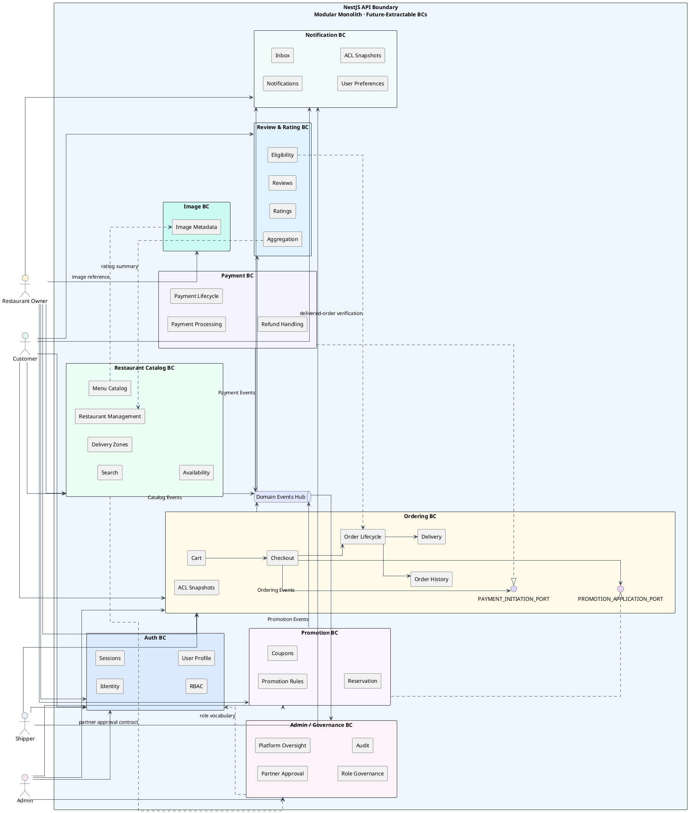
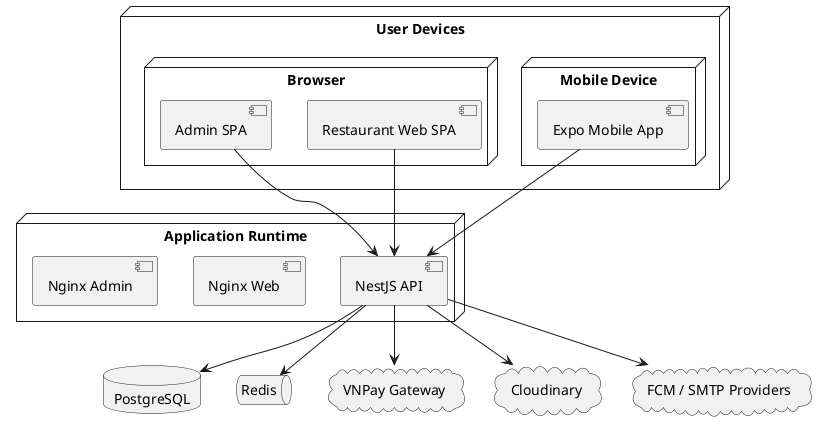
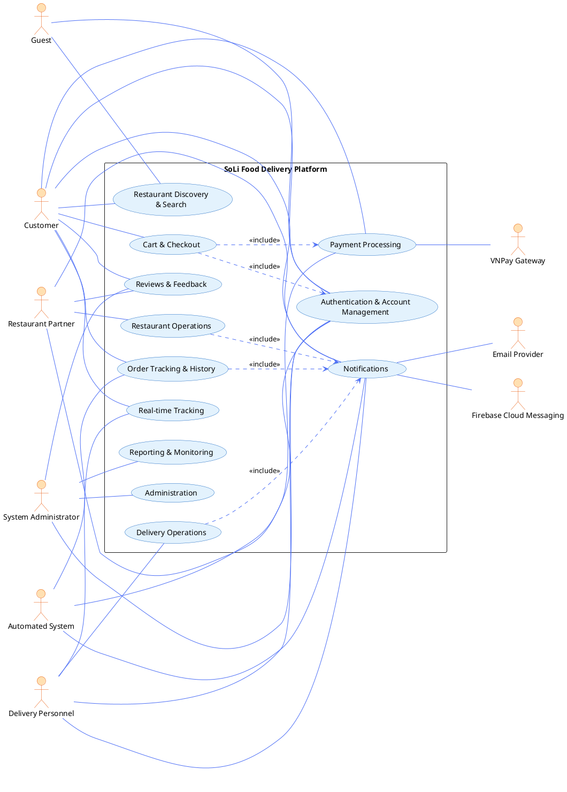

# ĐẠI HỌC QUỐC GIA TP. HỒ CHÍ MINH

# TRƯỜNG ĐẠI HỌC CÔNG NGHỆ THÔNG TIN

# KHOA CÔNG NGHỆ PHẦN MỀM

## ĐỒ ÁN 1/2

## BÁO CÁO PHÂN TÍCH, THIẾT KẾ, XÂY DỰNG VÀ KIỂM THỬ HỆ THỐNG SOLI FOOD DELIVERY PLATFORM

**GV hướng dẫn:** Nguyễn Thị Xuân Hương  
**SV thực hiện:**  
[Mã số sinh viên 1 - Họ và tên]  
[Mã số sinh viên 2 - Họ và tên]  
**TP. Hồ Chí Minh, 2026**

---

# LỜI CẢM ƠN

Nhóm thực hiện trân trọng cảm ơn giảng viên hướng dẫn đã định hướng, góp ý và theo dõi xuyên suốt quá trình thực hiện đề tài. Những góp ý về yêu cầu nghiệp vụ, kiến trúc hệ thống, cách tổ chức tài liệu và tiêu chuẩn trình bày đã giúp nhóm hoàn thiện sản phẩm theo hướng nhất quán giữa nhu cầu nghiệp vụ, hiện trạng triển khai và yêu cầu học thuật.

Nhóm cũng cảm ơn các thành viên đã phối hợp trong quá trình phân tích yêu cầu, xây dựng kiến trúc, phát triển ứng dụng backend, web, mobile, kiểm thử và hoàn thiện bộ tài liệu cuối kỳ. Báo cáo này được xây dựng trên cơ sở đối chiếu chặt chẽ giữa tài liệu nghiệp vụ, tài liệu yêu cầu, tài liệu kiến trúc và hiện trạng mã nguồn của dự án SoLi Food Delivery Platform.

---

# MỤC LỤC

- Lời cảm ơn
- Lời nói đầu
- Chương 1. Tổng quan đề tài
- Chương 2. Cơ sở lý thuyết
- Chương 3. Phân tích và thiết kế hệ thống
- Chương 4. Xây dựng ứng dụng và kiểm thử chương trình
- Kết luận và hướng phát triển
- Tài liệu tham khảo

---

# LỜI NÓI ĐẦU

SoLi Food Delivery Platform là đề tài xây dựng nền tảng đặt và giao đồ ăn trực tuyến theo mô hình marketplace nhiều vai trò, kết nối khách hàng, nhà hàng, shipper và quản trị viên trên cùng một hệ thống. Mục tiêu của đề tài không chỉ dừng lại ở việc hiện thực hóa một ứng dụng phục vụ quy trình đặt món, thanh toán, giao hàng và theo dõi trạng thái đơn hàng, mà còn hướng đến một bộ tài liệu kỹ thuật hoàn chỉnh, thể hiện rõ sự liên kết giữa định hướng kinh doanh, yêu cầu hệ thống, kiến trúc phần mềm và trạng thái triển khai thực tế.

Báo cáo này được xây dựng theo đúng cấu trúc của tài liệu `NoiDung Bao Cao Đồ án 1,2.md`, đồng thời ưu tiên tái sử dụng các nguồn sự thật đã tồn tại trong dự án gồm Vision and Scope, BRD, Business Rules, SRS, Use Case Specification, Sequence Diagrams, Utility Tree, ASR, ADD, ADR, SAD, CD Guide và hiện trạng mã nguồn trong toàn bộ repository. Khi có khác biệt giữa tài liệu và source code, báo cáo áp dụng nguyên tắc ưu tiên tài liệu cho Business Rules, Business Objectives, Success Metrics, Use Cases và các quyết định kiến trúc; đồng thời ưu tiên source code cho công nghệ sử dụng thực tế, schema dữ liệu, cấu trúc thư mục và giao diện hiện có.

Trong phạm vi báo cáo này, nhóm trình bày tổng quan đề tài, cơ sở công nghệ và AI, kiến trúc hệ thống, thiết kế use case, thiết kế dữ liệu, thiết kế giao diện, cấu trúc dự án, cách thức kiểm thử và định hướng phát triển tiếp theo của hệ thống SoLi Food Delivery Platform.

---

# Chương 1. TỔNG QUAN ĐỀ TÀI

## 1.1 Động lực nghiên cứu và lý do chọn đề tài

Ngành dịch vụ ăn uống tại Việt Nam đang chuyển dịch mạnh sang môi trường số. Tuy nhiên, ở nhiều bối cảnh thực tế, trải nghiệm đặt món vẫn bị phân mảnh: khách hàng phải tìm kiếm thông tin trên nhiều kênh khác nhau; nhà hàng khó kiểm soát đồng thời menu, tình trạng mở cửa và luồng xử lý đơn; lực lượng giao hàng thiếu một quy trình thống nhất để nhận, lấy và hoàn tất đơn; trong khi đơn vị vận hành gặp khó khăn khi cần giám sát toàn bộ vòng đời đơn hàng trên cùng một nền tảng.

Vấn đề của bài toán không chỉ nằm ở việc “xây một ứng dụng đặt món”, mà nằm ở việc tổ chức được một hệ thống nhiều vai trò có thể vận hành đồng bộ. Một nền tảng giao đồ ăn muốn phát huy hiệu quả phải đồng thời giải quyết nhiều yêu cầu: hỗ trợ khám phá nhà hàng và món ăn thuận tiện cho khách hàng, cho phép nhà hàng xử lý đơn theo nhịp bếp thực tế, hỗ trợ shipper theo dõi và cập nhật trạng thái giao hàng, đồng thời cung cấp cho quản trị viên khả năng quan sát và điều phối toàn cục.

Đề tài SoLi Food Delivery Platform được lựa chọn vì hội tụ cả hai giá trị. Ở góc độ ứng dụng, đề tài giải quyết một nhu cầu có thật, có phạm vi đủ lớn để phản ánh đúng bài toán nền tảng số nhiều tác nhân. Ở góc độ học thuật, đề tài tạo điều kiện để phân tích đồng thời các lớp bài toán quan trọng của kỹ nghệ phần mềm hiện đại như mô hình hóa nghiệp vụ, quản lý trạng thái đơn hàng, thiết kế kiến trúc theo bounded context, đồng bộ dữ liệu giữa nhiều ứng dụng khách và tích hợp các dịch vụ ngoài như thanh toán, lưu trữ ảnh, thông báo đẩy và quan sát hệ thống.

Những lý do chính khiến đề tài có giá trị nghiên cứu và triển khai gồm:

- Phản ánh đúng một bài toán chuyển đổi số phổ biến trong lĩnh vực dịch vụ ăn uống.
- Bao phủ đầy đủ chuỗi tác nhân chính gồm khách hàng, nhà hàng, shipper và quản trị viên.
- Có đủ chiều sâu để nghiên cứu từ lớp nghiệp vụ đến lớp kiến trúc và triển khai.
- Tạo môi trường phù hợp để khảo sát các quyết định thiết kế có tính hệ thống như module hóa, tách trách nhiệm dữ liệu, xử lý sự kiện và mở rộng đa kênh.

  - Mở ra khả năng phát triển các hướng nâng cao như quan sát vận hành, phân tích dữ liệu và AI đa phương thức trong các giai đoạn tiếp theo.

## 1.4 Chất lượng phần mềm và mục tiêu chất lượng

Hệ thống SoLi được đánh giá và thiết kế theo một tập hợp thuộc tính chất lượng nhằm đảm bảo sản phẩm vừa đáp ứng yêu cầu nghiệp vụ vừa phù hợp với tiêu chí học thuật. Những thuộc tính chính gồm:

- **Performance (Hiệu năng):** Đáp ứng các yêu cầu tương tác người dùng (p95 truy vấn tìm kiếm ≤ 2s, checkout p95 ≤ 3s) và giới hạn độ trễ cho luồng đặt hàng.
- **Availability (Sẵn sàng):** Đảm bảo các đường dẫn xác thực và kênh thời gian thực có cơ chế suy giảm mềm (graceful degradation) để hạn chế gián đoạn dịch vụ.
- **Reliability (Độ tin cậy):** Bảo toàn tính toàn vẹn vòng đời đơn hàng (order lifecycle) và xử lý idempotency trong kịch bản retry/callback.
- **Security (Bảo mật):** Bảo vệ dữ liệu người dùng, đảm bảo xác thực/ủy quyền và bảo toàn tính toàn vẹn callback thanh toán.
- **Scalability (Khả năng mở rộng):** Hướng tới mở rộng theo chiều ngang của runtime (replicate instances) và phân tầng cache để chịu được lưu lượng tăng dần.
- **Modifiability (Khả năng thay đổi):** Cấu trúc module theo bounded context để giảm diện ảnh hưởng khi thay đổi nghiệp vụ.
- **Observability (Quan sát vận hành):** Telemetry (traces, metrics, logs) phải đủ để điều tra lỗi, tối ưu hiệu năng và giám sát SLA.
- **Maintainability (Dễ bảo trì):** Thiết kế rõ ràng giữa business logic và integration adapters, test coverage phù hợp để giảm chi phí thay đổi.

Mỗi thuộc tính ở trên gắn với mục tiêu định lượng (quality goals) được nêu trong phần Utility Tree và ASR, giúp đánh giá mức độ thỏa mãn khi so sánh kết quả kiểm thử và bằng chứng triển khai.

---

# Chương 2. CƠ SỞ LÝ THUYẾT VÀ CÔNG NGHỆ SỬ DỤNG

Phần này trình bày các thành phần công nghệ chính được áp dụng cho SoLi, phân tích ưu/nhược điểm và lý do lựa chọn phù hợp với bài toán dự án.

## 2.1 Backend: Node.js, TypeScript, NestJS

- Giới thiệu: Ứng dụng backend được xây dựng bằng TypeScript trên nền Node.js, sử dụng framework NestJS để tổ chức module, dependency injection và lifecycle.
- Ưu điểm: Productive for team nhỏ → nhanh khai triển, strong typing với TypeScript giúp phát hiện lỗi sớm, NestJS cung cấp cấu trúc module phù hợp với bounded-context.
- Nhược điểm: Single-threaded event loop cần chú ý khi xử lý CPU-bound; cần thiết lập worker hoặc dịch vụ phụ cho tác vụ nặng.
- Lý do lựa chọn: Cân bằng giữa năng suất phát triển, hệ sinh thái thư viện, và khả năng tổ chức mã theo module cho đồ án capstone.

## 2.2 Persistence: PostgreSQL + Drizzle ORM

- Giới thiệu: PostgreSQL làm hệ quản trị quan hệ, Drizzle cung cấp lớp truy vấn kiểu an toàn cho TypeScript.
- Ưu điểm: PostgreSQL mạnh về tính nhất quán giao dịch, Drizzle giữ type-safety và độ minh bạch của SQL; dễ audit và migrate.
- Nhược điểm: ORM nhẹ như Drizzle vẫn yêu cầu hiểu biết SQL để tối ưu; migration partial-index cần xử lý bằng SQL thủ công.
- Lý do lựa chọn: Đáp ứng nhu cầu transaction cho checkout và payment, đồng thời giữ mã nguồn rõ ràng cho báo cáo kỹ thuật.

## 2.3 In-memory / Cache: Redis

- Giới thiệu: Redis dùng cho cart tạm thời, idempotency keys, locks ngắn hạn và một số projection runtime.
- Ưu điểm: Độ trễ thấp, primitives cho lock/idempotency, TTL, pub/sub cho một số luồng thời gian thực.
- Nhược điểm: Dữ liệu volatile; cần chiến lược backup và tái khởi tạo projection.
- Lý do lựa chọn: Giảm tải DB chính, phục vụ phần read-mostly và coordination nhanh cho runtime.

## 2.4 Frontend: React + Vite + Tailwind; Mobile: Expo React Native

- Giới thiệu: Web SPA sử dụng React với Vite cho dev speed; UI tiện ích xây trên Tailwind; Mobile dùng Expo để tăng tốc phát triển cross-platform.
- Ưu điểm: Nhanh khi phát triển prototyping, hệ sinh thái lớn, dễ tích hợp design tokens.
- Nhược điểm: Cần quản lý bundle và tối ưu client; Expo có giới hạn native module trong một số kịch bản.
- Lý do lựa chọn: Tối ưu thời gian demo, phù hợp với phạm vi capstone và nhóm sinh viên.

## 2.5 Real-time: Socket.IO

- Giới thiệu: Socket.IO/Cross-client realtime channel cho notifications và order-tracking.
- Ưu điểm: Giao thức abstraction, fallback cơ chế cho môi trường kém.
- Nhược điểm: Cần tính toán scale (sticky sessions hoặc adapter) cho nhiều client.
- Lý do lựa chọn: Cung cấp UX realtime đơn giản và thực tế cho bài toán theo dõi đơn hàng.

## 2.6 Observability

- Giới thiệu: Bộ công cụ đề xuất gồm OpenTelemetry (traces, metrics), Grafana cho dashboard, Sentry/PostHog cho lỗi và analytics.
- Ưu điểm: Chuẩn hoá telemetry, hỗ trợ root-cause analysis, giúp đánh giá quality-goals.
- Nhược điểm: Thiết lập ban đầu và chi phí lưu trữ/thu thập cần cân nhắc.
- Lý do lựa chọn: Cần khả năng điều tra lỗi và thẩm tra quality goals cho bài toán production-like.

## 2.7 Testing

- Giới thiệu: Jest cho unit test, Supertest cho API integration, cấu trúc test pyramid được áp dụng.
- Ưu điểm: Hệ sinh thái rộng, hỗ trợ mocking, snapshot testing và integration.
- Nhược điểm: Việc duy trì test bảo toàn không thể tự phát sinh, cần đầu tư viết test có chất lượng.
- Lý do lựa chọn: Phù hợp với monorepo TypeScript, hỗ trợ luyện tập kỹ thuật kiểm thử theo khoa học.

## 2.8 DevOps & CI/CD

- Giới thiệu: Docker cho containerization; GitHub Actions cho CI; GHCR làm registry; Render/terraform cho môi trường staging/production.
- Ưu điểm: Tự động hoá build/publish, dễ tái tạo môi trường.
- Nhược điểm: Cấu hình CI/CD cần thời gian thiết lập và quota cho artifact registry.
- Lý do lựa chọn: Giúp minh hoá pipeline deploy và phù hợp với yêu cầu triển khai thực tế.

## 2.9 API Documentation & Validation

- Giới thiệu: OpenAPI/Swagger để mô tả contract; Zod / class-validator cho validation layer.
- Ưu điểm: Contract-first hoặc contract-aware development, validation rõ ràng.
- Nhược điểm: Cần đồng bộ schema giữa DTO và DB.
- Lý do lựa chọn: Giúp tạo tài liệu API cho client và tăng tính ổn định khi tích hợp.

---

### 3.1.1 Logical View

Ở mức logic, các thành phần chính của hệ thống gồm Auth BC, Restaurant Catalog BC, Image BC, Ordering BC, Payment BC, Promotion BC, Notification BC, Review BC và Admin Analytics BC. Mobile app, restaurant web và admin portal không làm việc trực tiếp với dữ liệu thô, mà đi qua backend API và các contract nghiệp vụ tương ứng.


```

Thiết kế logic này làm rõ ba nguyên tắc vận hành của hệ thống. Thứ nhất, dữ liệu và luật nghiệp vụ phải có chủ sở hữu duy nhất. Thứ hai, giao tiếp xuyên miền phải đi qua event, snapshot hoặc adapter thay vì join chéo tùy tiện. Thứ ba, mỗi bề mặt client chỉ nhìn thấy hệ thống qua các use case và API phù hợp với vai trò của nó.

### 3.1.2 Runtime View

Runtime View của SoLi tập trung vào những luồng có tác động trực tiếp đến doanh thu, tính đúng đắn nghiệp vụ và trải nghiệm người dùng.

**Packet 1 - Order placement**: customer duyệt nhà hàng, thêm món vào giỏ, checkout; Ordering BC kiểm tra single-restaurant constraint, khả năng phục vụ của restaurant, phạm vi delivery zone, idempotency và promotion trước khi tạo order.

**Packet 2 - Event and ACL synchronization**: các thay đổi từ Restaurant Catalog BC như giá món, availability hoặc delivery zone được phát qua event nội tiến trình; Ordering BC duy trì các bảng snapshot cục bộ để dùng cho checkout.

**Packet 3 - Payment compensation**: Payment BC xử lý redirect URL, IPN callback, timeout và refund; khi có hủy đơn sau thanh toán, hiệu ứng bù trừ được lan sang Notification BC và Promotion BC.

**Packet 4 - Delivery to review**: shipper chuyển đơn qua các trạng thái `picked_up`, `delivering`, `delivered`; khi hoàn tất giao hàng, Notification BC gửi tín hiệu cho khách hàng và Review BC có đủ điều kiện để tiếp nhận đánh giá hậu đơn hàng.

Điểm nổi bật của runtime là các trạng thái cốt lõi được cập nhật trong phạm vi giao dịch hoặc command handler kiểm soát chặt, còn những tác động phụ như thông báo, projection và phân tích được xử lý sau đó theo hướng sự kiện. Cách tiếp cận này giảm coupling nhưng vẫn bảo vệ tốt tính nhất quán của order và payment.

### 3.1.3 Implementation View

Implementation View ánh xạ trực tiếp từ kiến trúc logic sang cấu trúc monorepo:

```text
apps/
  api/
    src/module/
      admin-analytics/
      auth/
      image/
      notification/
      ordering/
      payment/
      promotion/
      restaurant-catalog/
      review/
  mobile/
  web/
  admin/
infra/
  render/
docs/
tools/
```

Ở lớp backend, từng bounded context có module NestJS, schema Drizzle, service, repository, controller và adapter riêng. Ở lớp client, `apps/mobile` phục vụ customer journey, `apps/web` phục vụ restaurant operations và `apps/admin` phục vụ governance. Việc chia ứng dụng theo vai trò sử dụng giúp hệ thống bám sát nghiệp vụ hơn thay vì gộp tất cả vào một bề mặt UI duy nhất.

### 3.1.4 Data View

Data View của SoLi tuân theo nguyên tắc database per bounded-context ownership trong cùng một PostgreSQL instance. Đây không phải là mô hình “mỗi BC một database vật lý”, mà là mô hình “mỗi BC một vùng sở hữu dữ liệu” trên cùng hạ tầng lưu trữ.

Ba đặc điểm quan trọng của Data View là:

- `orders`, `order_items`, `order_status_logs` thuộc Ordering BC; `payment_transactions` thuộc Payment BC; `promotions`, `coupon_codes`, `promotion_usages` thuộc Promotion BC; `notifications` và các bảng phụ thuộc thuộc Notification BC.
- Các quan hệ xuyên BC chủ yếu lưu dưới dạng UUID logic, không ép buộc foreign key vật lý xuyên ranh giới nghiệp vụ.
- Ordering BC và Notification BC dùng ACL snapshot (`ordering_restaurant_snapshots`, `ordering_menu_item_snapshots`, `ordering_delivery_zone_snapshots`, `notification_restaurant_snapshots`) để tránh đọc trực tiếp bảng của Catalog BC.

Thiết kế này giúp hệ thống đạt được sự cân bằng giữa tính nhất quán, tốc độ truy xuất, khả năng mở rộng hợp lý và đặc biệt là tính bảo trì của mã nguồn.

### 3.1.5 Deployment View

Về triển khai, SoLi gồm ba ứng dụng khách và một backend trung tâm. Backend, web và admin portal có thể được đóng gói bằng container; mobile app được phát hành theo chuỗi công cụ Expo/EAS; PostgreSQL và Redis là hai thành phần hạ tầng trạng thái chính; các dịch vụ ngoài gồm VNPay, Cloudinary, FCM và SMTP nằm ở rìa hệ thống.



Mô hình triển khai trên cho phép nhóm phát triển và kiểm thử toàn bộ hệ thống trong một môi trường thống nhất, đồng thời vẫn giữ được khả năng đóng gói và tự động hóa theo chuẩn của một dự án kỹ thuật thực tế.

### 3.1.6 Các quyết định kiến trúc chính

**ADR-001 - Adopt Modular Monolith Architecture**: backend được tổ chức thành modular monolith để dung hòa giữa ranh giới miền nghiệp vụ và chi phí vận hành.

**ADR-003 - Use Database per BC Ownership**: một PostgreSQL instance duy nhất nhưng quyền sở hữu bảng được phân theo bounded context.

**ADR-004 - Use In-process Event Bus for Cross-BC Propagation**: event nội tiến trình được dùng để đồng bộ projection và xử lý side effect xuyên miền mà không cần message broker phân tán ngay từ đầu.

**ADR-005 - Use ACL Snapshots for Cross-BC Reads**: thay vì join trực tiếp bảng của miền khác, Ordering và Notification duy trì snapshot cục bộ phục vụ các bài toán đọc quan trọng.

**ADR-006 - Adopt Redis as Runtime State Layer**: cart, idempotency, lock ngắn hạn và presence được đưa sang Redis nhằm giảm tải và giảm độ trễ.

**ADR-007 - Use Ports and Adapters for External Integrations**: các tích hợp với VNPay, Cloudinary, FCM và SMTP được cô lập sau adapter để bảo vệ business logic.

**ADR-008 - Adopt Drizzle Type-safe Persistence Layer**: Drizzle được chọn nhằm duy trì type-safety nhưng vẫn giữ được sự minh bạch của schema, migration và truy vấn SQL.

## 3.2 Thiết kế Use Case

Phần này giữ nguyên các domain use case ở cấp độ đã được chuẩn hóa cho hệ thống. Cấu trúc bảng, tên thuộc tính và nội dung mô tả được bảo toàn để bảo đảm người đọc có thể đối chiếu trực tiếp với tài liệu đặc tả use case mà không phát sinh sai lệch do diễn giải lại.

### 3.2.1 Sơ đồ Use Case tổng thể



### 3.2.2 UC-DOM-01 — Authentication & Account Management

| Attribute | Detail |
|-----------|--------|
| **Use Case ID** | UC-DOM-01 |
| **Use Case Name** | Authentication & Account Management |
| **Created By** | Business Analysis Team |
| **Last Updated By** | Business Analysis Team |
| **Created Date** | 15/01/2026 |
| **Updated Date** | 28/01/2026 |
| **Actors** | Primary: Guest, Customer, Restaurant Partner, Delivery Personnel, System Administrator. |
| **Description** | This domain enables identity establishment and identity-related lifecycle operations across the platform. It covers self-registration, sign-in, sign-out, session refresh, profile management, email verification, password recovery, social sign-in (planned), and administrative role and account-state controls. Authentication is the prerequisite for every personalized capability such as cart management, ordering, partner operations, and delivery assignments. |
| **Preconditions** | The platform is reachable. The user has an internet-connected client device. For administrative sub-flows, the actor's session is associated with the `admin` role. |
| **Postconditions** | A valid authenticated session is established or invalidated as appropriate. User profile attributes, role assignments, or account-state flags are persisted. |
| **Priority** | P1 — Must |
| **Frequency of Use** | Very high — every interactive session begins with authentication. |
| **Normal Course of Events** | 1. The actor opens the client application. <br> 2. The actor selects "Register" or "Sign In". <br> 3. For registration, the actor supplies name, email, password, and accepts the terms of service. <br> 4. The system validates input format, ensures email uniqueness, persists the user account, and assigns the default `user` role. <br> 5. The actor signs in with email and password; the system verifies credentials and issues an authenticated session token. <br> 6. The actor may view and update profile details (display name, avatar, phone) at any time. <br> 7. The actor may sign out, which invalidates the current session. |
| **Alternative Courses** | **A1 — Email verification:** Following registration, the customer requests verification; the system dispatches a verification email containing a single-use link. <br> **A2 — Forgotten password recovery:** The actor selects "Forgot password"; the system emails a time-limited reset link; the actor sets a new password and is redirected to sign-in. <br> **A3 — Social sign-in (Planned, R2):** The actor signs in with an external identity provider; on first use, a platform account is created and linked to the provider identity. <br> **A4 — Administrative role assignment:** The administrator selects a user account and assigns or revokes a role (`restaurant`, `shipper`, `admin`). <br> **A5 — Administrative ban / suspension:** The administrator marks a user account as banned; subsequent sign-in attempts are rejected. <br> **A6 — Administrative impersonation (Planned/Partial):** The administrator initiates a debug impersonation session for a target user, scoped and audit-logged. |
| **Exceptions** | **E1 — Duplicate email:** Registration is rejected with a clear error; the actor is invited to sign in or recover the password. <br> **E2 — Invalid credentials:** Sign-in is rejected; the system applies rate-limiting after repeated failures. <br> **E3 — Banned account:** Sign-in is rejected with a notice referring the actor to support. <br> **E4 — Expired session:** Protected actions return an authentication error; the actor is redirected to sign in or refresh. <br> **E5 — Reset link expired or already used:** The recovery flow is rejected; the actor is invited to request a new link. |
| **Includes** | None. |
| **Extends** | Request Email Verification «extends» Register Account. |
| **Special Requirements** | Credentials must be stored using industry-standard hashing. Sessions must be invalidated upon explicit sign-out. The platform must enforce role-based access control (RBAC) on all protected endpoints. All authentication traffic must be transported over TLS. PII must not appear in application logs. |
| **Assumptions** | Users have access to the email account they register with. The administrator account is provisioned out-of-band before go-live. |
| **Notes & Issues** | Social sign-in (UC-AUTH-11) is approved business capability but not configured in the current release. Password reset (UC-AUTH-12) is partial — recovery flow exists; UI exposure is finalized in R1.1. |

### 3.2.3 UC-DOM-02 — Restaurant Discovery & Search

| Attribute | Detail |
|-----------|--------|
| **Use Case ID** | UC-DOM-02 |
| **Use Case Name** | Restaurant Discovery & Search |
| **Created By** | Business Analysis Team |
| **Last Updated By** | Business Analysis Team |
| **Created Date** | 15/01/2026 |
| **Updated Date** | 28/01/2026 |
| **Actors** | Primary: Guest, Customer. |
| **Description** | This domain exposes the unified discovery surface through which guests and customers browse approved restaurants, examine menus and modifier options, search by keyword, filter by cuisine, category, tag, and geographic proximity, and review delivery fee estimates and rating summaries. The discovery surface drives the order funnel and is intentionally accessible without authentication for restaurants and menu items. |
| **Preconditions** | The platform is reachable. At least one restaurant is approved and active. For geographic filtering, the actor's device has supplied a location or the actor has entered a delivery address. |
| **Postconditions** | The actor has obtained a list of restaurants and/or menu items consistent with the supplied criteria. No business state is modified by discovery actions. |
| **Priority** | P1 — Must |
| **Frequency of Use** | Very high — discovery is the primary entry point to ordering. |
| **Normal Course of Events** | 1. The actor opens the application's discovery surface. <br> 2. The system displays approved restaurants ordered by relevance and proximity. <br> 3. The actor selects a restaurant; the system displays the restaurant profile, operating hours, menu categories, and menu items. <br> 4. The actor opens a menu item detail view; the system displays item description, pricing, availability, image, and configurable modifier options. <br> 5. The actor optionally enters a delivery address; the system computes and displays the delivery fee estimate based on the restaurant's configured delivery zone. |
| **Alternative Courses** | **A1 — Keyword search:** The actor enters a search term; the system returns matching restaurants and menu items in a single response with separate result counts. <br> **A2 — Filter by cuisine, category, or tag:** The actor applies one or more filters; the system constrains results accordingly. <br> **A3 — Filter by delivery radius:** The actor enables proximity-based filtering; the system returns only restaurants whose delivery zone covers the actor's location. <br> **A4 — View ratings summary (Planned, R2):** The actor opens a restaurant's profile; the system displays aggregate star rating and recent reviews. |
| **Exceptions** | **E1 — No results:** The system displays a clear empty-state with suggestions to broaden criteria. <br> **E2 — Out-of-zone address:** The delivery estimate sub-flow returns a zone-coverage error; the actor is invited to revise the address or choose another restaurant. <br> **E3 — Restaurant unavailable:** A restaurant currently closed or sold out is displayed with a non-actionable indicator. |
| **Includes** | View Restaurant Detail «include» View Delivery Fee Estimate; View Menu Item Detail «include» View Modifier Options. |
| **Extends** | Filter by Cuisine «extends» Search Restaurants & Menu Items; Filter by Category/Tag «extends» Search Restaurants & Menu Items; Filter by Delivery Radius «extends» Search Restaurants & Menu Items. |
| **Special Requirements** | Search must support accent-insensitive matching for the Vietnamese language. Discovery endpoints must remain accessible to anonymous users. Result pagination must be enforced to bound response sizes. |
| **Assumptions** | Restaurant partners maintain accurate menu data and operating hours. Geolocation services are available with sufficient quota. |
| **Notes & Issues** | Ratings summary depends on the Reviews & Feedback domain (UC-DOM-09) and inherits its planned-R2 status. |

### 3.2.4 UC-DOM-03 — Cart & Checkout

| Attribute | Detail |
|-----------|--------|
| **Use Case ID** | UC-DOM-03 |
| **Use Case Name** | Cart & Checkout |
| **Created By** | Business Analysis Team |
| **Last Updated By** | Business Analysis Team |
| **Created Date** | 15/01/2026 |
| **Updated Date** | 28/01/2026 |
| **Actors** | Primary: Customer. Secondary: Automated System. |
| **Description** | This domain governs the construction of the customer's cart, modification of cart items and modifier selections, and the checkout transition that converts the cart into a confirmed order. Checkout enforces the single-restaurant cart constraint, delivery zone eligibility, payment method selection, and order idempotency. |
| **Preconditions** | The customer is authenticated. The customer has selected at least one menu item from one approved restaurant. The customer has a deliverable address. |
| **Postconditions** | An order has been created and is associated with the customer, the restaurant, and the chosen payment method. The cart is cleared on successful checkout. |
| **Priority** | P1 — Must |
| **Frequency of Use** | High — every transaction passes through this domain. |
| **Normal Course of Events** | 1. The customer adds a menu item to the cart, optionally with modifier selections and quantity. <br> 2. The system validates the single-restaurant constraint and persists the cart line. <br> 3. The customer reviews, updates quantity, edits modifiers, or removes items. <br> 4. The customer initiates checkout. <br> 5. The system re-validates the cart, confirms delivery zone eligibility for the supplied address, computes delivery fee, and presents the order summary. <br> 6. The customer selects a payment method (COD or VNPay) and confirms the order. <br> 7. The system applies an idempotency key, persists the order in `pending` state, clears the cart, and dispatches the appropriate downstream events (notifications and, for VNPay, payment URL generation). |
| **Alternative Courses** | **A1 — Cross-restaurant addition:** The customer attempts to add an item from a different restaurant; the system prompts the customer to either clear the existing cart or cancel the action. <br> **A2 — Modifier price re-resolution:** At checkout, the system re-resolves modifier prices from the catalog snapshot to guarantee price integrity. <br> **A3 — Apply discount code (Planned, R2):** The customer enters a promotion code; the system validates eligibility and adjusts the order total. <br> **A4 — Save delivery address:** On checkout, the customer may save the entered address to their profile for future use. |
| **Exceptions** | **E1 — Item unavailable at checkout:** A previously cart-added item is now sold out; the system invites the customer to remove it before continuing. <br> **E2 — Address outside delivery zone:** Checkout is blocked with a zone-coverage error; the customer must enter a deliverable address. <br> **E3 — Duplicate submission:** A repeated submission within the idempotency window is silently de-duplicated. <br> **E4 — Restaurant closed:** Checkout is blocked with a restaurant-status error. |
| **Includes** | Place Order «include» Validate Single-Restaurant Cart; Place Order «include» Validate Delivery Radius; Place Order «include» Apply Idempotency Key; Place Order «include» Select Payment Method. |
| **Extends** | Apply Discount Code «extends» Place Order. |
| **Special Requirements** | Cart state is held in a low-latency cache keyed by user identity. Checkout enforces transactional integrity — an order is either fully created or not created. Modifier and item pricing must be re-resolved server-side at checkout. The idempotency window must align with the configured platform setting. |
| **Assumptions** | Customers have valid delivery addresses within the platform's service area. Restaurants maintain up-to-date availability flags on items. |
| **Notes & Issues** | Promotion-code redemption is approved and modeled but deferred to Release 2. |

### 3.2.5 UC-DOM-04 — Payment

| Attribute | Detail |
|-----------|--------|
| **Use Case ID** | UC-DOM-04 |
| **Use Case Name** | Payment |
| **Created By** | Business Analysis Team |
| **Last Updated By** | Business Analysis Team |
| **Created Date** | 15/01/2026 |
| **Updated Date** | 28/01/2026 |
| **Actors** | Primary: Customer, System Administrator. Secondary: VNPay Gateway, Automated System. |
| **Description** | This domain manages the financial settlement of orders. It supports two payment paths: Cash on Delivery (COD), in which the order proceeds directly to the restaurant fulfillment workflow; and VNPay, in which the customer is redirected to the gateway, the platform receives an Instant Payment Notification (IPN), and the order is transitioned to `paid` only after cryptographic verification. The domain also encompasses payment-driven auto-cancellation for unpaid orders, refund initiation on cancellation of paid orders, and administrator-initiated dispute refunds on delivered orders. |
| **Preconditions** | An order has been placed and is in the `pending` state. For VNPay, the customer is signed in and the gateway is reachable. For dispute refund, the order is in the `delivered` state. |
| **Postconditions** | The order's payment state is recorded as `paid`, `failed`, `cancelled`, or `refunded`. Notifications are dispatched to relevant participants. |
| **Priority** | P1 — Must |
| **Frequency of Use** | Very high — every order produces at least one payment-domain interaction. |
| **Normal Course of Events** | **VNPay flow** — 1. At checkout the system generates a signed VNPay payment URL and redirects the customer. <br> 2. The customer completes payment at the VNPay portal. <br> 3. The gateway sends an IPN callback to the platform. <br> 4. The platform verifies the HMAC signature, reconciles the transaction, and transitions the order to `paid`. <br> 5. The browser-return URL renders a UI confirmation; no business state is mutated through this redirect. <br> **COD flow** — 1. The customer selects COD at checkout. <br> 2. The order proceeds directly to the restaurant for acceptance; settlement is recorded by the shipper at delivery time. |
| **Alternative Courses** | **A1 — Payment timeout:** A `pending` order whose VNPay payment is not confirmed within the configured threshold is auto-transitioned to `cancelled`; a payment-failed notification is dispatched. <br> **A2 — Refund on cancellation after payment:** When a paid order is cancelled, the platform initiates a refund to the original payment instrument and notifies the customer. <br> **A3 — Admin dispute refund:** The administrator approves a refund on a delivered order; the platform initiates the refund and transitions the order to `refunded`. <br> **A4 — View payment receipt:** The customer reviews the receipt and transaction reference from order detail. |
| **Exceptions** | **E1 — Signature verification failure:** The IPN is rejected; no state change is applied; the event is logged for audit. <br> **E2 — Duplicate IPN:** Repeated callbacks for the same transaction are idempotently ignored. <br> **E3 — Gateway unreachable:** The customer is informed; the order remains in `pending` until the timeout cycle resolves it. <br> **E4 — Refund rejected by gateway:** The administrator is alerted; the order remains marked for manual reconciliation. |
| **Includes** | Process VNPay IPN «include» Transition Order to Paid. |
| **Extends** | None |
| **Special Requirements** | All gateway communications must be signed and verified using the configured HMAC scheme. Gateway credentials must be managed via environment variables. Payment-state transitions must be idempotent. PII and payment identifiers must not appear in application logs. |
| **Assumptions** | The VNPay sandbox certification has been completed prior to production deployment. The payment gateway maintains the SLA stated in BRD AS-3. |
| **Notes & Issues** | MoMo integration is approved as a Release 2 capability and is modeled here as a future extension of the VNPay flow. |

### 3.2.6 UC-DOM-05 — Order Tracking & History

| Attribute | Detail |
|-----------|--------|
| **Use Case ID** | UC-DOM-05 |
| **Use Case Name** | Order Tracking & History |
| **Created By** | Business Analysis Team |
| **Last Updated By** | Business Analysis Team |
| **Created Date** | 15/01/2026 |
| **Updated Date** | 28/01/2026 |
| **Actors** | Primary: Customer. Secondary: Automated System. |
| **Description** | This domain enables the customer to monitor the lifecycle of their orders and review historical orders. It includes paginated history retrieval, order detail inspection, real-time status tracking, status timeline review, customer-initiated cancellation of orders that have not yet entered preparation, system-driven auto-cancellation when restaurant acceptance times out, and one-tap reorder convenience. |
| **Preconditions** | The customer is authenticated and has at least one order on record (for history-related flows). For real-time tracking, the customer holds an active order in a non-terminal state. |
| **Postconditions** | The customer has obtained the requested view. For cancellation, the order is transitioned to `cancelled` and downstream refund and notification events are dispatched. For reorder, a draft cart is prepared with the previous order's items and modifiers. |
| **Priority** | P1 — Must |
| **Frequency of Use** | High — order history and tracking are accessed once per active order and on demand thereafter. |
| **Normal Course of Events** | 1. The customer opens "My Orders". <br> 2. The system displays a paginated list of orders sorted by recency, including status, total, and restaurant. <br> 3. The customer selects an order to view detail, including items, modifiers, charges, payment method, status, and the status transition timeline. <br> 4. For an active order, the system streams real-time status updates to the customer through the notification channel. |
| **Alternative Courses** | **A1 — Cancel order before preparation:** The customer cancels an order in `pending` or `paid` state; the system records the reason, transitions the order to `cancelled`, and triggers refund and notifications as applicable. <br> **A2 — Reorder:** The customer selects "Reorder" on a previous order; the system returns the items and modifier selections from the source order for the client to pre-fill the cart (read-only; no server-side cart state is created). <br> **A3 — System-driven auto-cancellation:** When a restaurant fails to accept an order within the configured threshold, the platform automatically transitions the order to `cancelled` and notifies the customer. |
| **Exceptions** | **E1 — Cancellation no longer permitted:** The order is in preparation or later; the system blocks cancellation and informs the customer. <br> **E2 — Reorder item unavailable:** Some items in the source order are no longer available; the customer is informed and asked to confirm the partial reorder. |
| **Includes** | View Order Detail «include» View Status Timeline. |
| **Extends** | None. |
| **Special Requirements** | Real-time status delivery latency must remain under 3 seconds under normal operating load. Order timeline entries must be immutable and timestamped at second precision. |
| **Assumptions** | The customer remains authenticated when accessing personal order data. The customer's device supports persistent real-time connectivity. |
| **Notes & Issues** | Live shipper GPS tracking is covered separately in UC-DOM-11 (Real-time Tracking) and is targeted for Release 2. |

### 3.2.7 UC-DOM-06 — Restaurant Operations

| Attribute | Detail |
|-----------|--------|
| **Use Case ID** | UC-DOM-06 |
| **Use Case Name** | Restaurant Operations |
| **Created By** | Business Analysis Team |
| **Last Updated By** | Business Analysis Team |
| **Created Date** | 15/01/2026 |
| **Updated Date** | 28/01/2026 |
| **Actors** | Primary: Restaurant Partner. Secondary: System Administrator (oversight and elevated privileges). |
| **Description** | This domain provides the restaurant partner with the operational tools required to run their business on the platform. It encompasses restaurant onboarding and profile management, real-time open/closed control, end-to-end order handling from acceptance through ready-for-pickup, full menu and modifier management, and configuration of delivery zones with associated fees and ETAs. Flash-sale management is approved as a Release 2 extension. |
| **Preconditions** | The actor is authenticated as a restaurant partner. For order-handling sub-flows, the restaurant has at least one active order. For administrative override, the actor is authenticated as administrator. |
| **Postconditions** | Restaurant profile, menu, modifier, and delivery zone changes are persisted and reflected to customers. Order state transitions are recorded with timestamp and actor attribution. Downstream notifications are dispatched. |
| **Priority** | P1 — Must |
| **Frequency of Use** | Continuous during restaurant operating hours. |
| **Normal Course of Events** | **Onboarding** — 1. The restaurant partner registers the restaurant, supplying name, address, contact information, opening hours, and cuisine type. <br> 2. The restaurant remains in unapproved state until administrator approval. <br> **Daily operations** — 3. The partner toggles the restaurant to "open" at the start of service. <br> 4. New orders appear in the kitchen view in real time. <br> 5. The partner accepts each order, transitioning it to `confirmed`. <br> 6. The partner marks the order as `preparing` when work begins, then `ready_for_pickup` when complete. <br> **Menu management** — 7. The partner creates and maintains menu categories, items, modifier groups, and modifier options, with images, prices, and availability flags. <br> **Delivery zone management** — 8. The partner configures one or more delivery zones with radius, base fee, distance pricing, ETA parameters, and quiet hours. |
| **Alternative Courses** | **A1 — Reject / cancel order before preparation:** The partner cancels an order with a reason; refund is initiated when applicable. <br> **A2 — Toggle item availability:** The partner marks an item as sold out; it is hidden from new cart additions and search results. <br> **A3 — Update modifier group:** The partner adjusts modifier options or pricing; existing carts are not retroactively repriced. <br> **A4 — Deactivate delivery zone:** The partner removes coverage of a zone; subsequent orders for addresses in that zone are blocked at checkout. <br> **A5 — Manage flash sale (Planned, R2):** The partner creates a time-limited price reduction for selected items. <br> **A6 — Administrator override:** The administrator updates restaurant data or transitions order state on behalf of the partner. |
| **Exceptions** | **E1 — Restaurant not yet approved:** Customer-facing operations (open status, accepting orders) are blocked until administrator approval. <br> **E2 — Item in active cart:** Deletion of an item with active customer carts is allowed; carts are revalidated at checkout. <br> **E3 — Order acceptance timeout:** If the partner does not accept the order within the configured threshold, the platform auto-cancels and notifies the customer. <br> **E4 — Invalid zone radius:** Configuration with an unreasonable radius is rejected by validation. |
| **Includes** | None. |
| **Extends** | None. |
| **Special Requirements** | The kitchen view must update in real time without page refresh. Menu and modifier changes must propagate promptly to the customer-facing catalog. Delivery zone fee computation must be deterministic and auditable. |
| **Assumptions** | Restaurant staff have stable internet connectivity at the order-reception point. Menu pricing is the partner's responsibility. |
| **Notes & Issues** | Multi-branch grouping is approved for Release 3 and treated as a future extension of restaurant onboarding. |

### 3.2.8 UC-DOM-07 — Delivery Operations

| Attribute | Detail |
|-----------|--------|
| **Use Case ID** | UC-DOM-07 |
| **Use Case Name** | Delivery Operations |
| **Created By** | Business Analysis Team |
| **Last Updated By** | Business Analysis Team |
| **Created Date** | 15/01/2026 |
| **Updated Date** | 28/01/2026 |
| **Actors** | Primary: Delivery Personnel (Shipper). Secondary: System Administrator. |
| **Description** | This domain enables delivery personnel to claim, transport, and complete delivery assignments. It provides visibility into the available order pool, the shipper's currently active delivery, and historical deliveries. Optimized routing and earnings statements are approved Release 2 extensions. |
| **Preconditions** | The actor is authenticated as delivery personnel and has been approved by the administrator. The shipper holds a current online status. |
| **Postconditions** | The order moves through the delivery lifecycle (`ready_for_pickup → picked_up → delivering → delivered`). Each transition is timestamped and actor-attributed. Notifications are dispatched to the customer and the restaurant at the appropriate stages. |
| **Priority** | P1 — Must |
| **Frequency of Use** | Continuous during delivery shifts. |
| **Normal Course of Events** | 1. The shipper opens the delivery application and views the available order pool — orders in `ready_for_pickup` state. <br> 2. The shipper selects an order; the platform applies first-come-first-served self-assignment. <br> 3. The shipper navigates to the restaurant and confirms pickup, transitioning the order to `picked_up`. <br> 4. The shipper marks the order as en-route, transitioning to `delivering`. <br> 5. Upon handing the order to the customer, the shipper confirms delivery; the order transitions to `delivered`. <br> 6. The shipper reviews delivery history at any time. |
| **Alternative Courses** | **A1 — Multiple shippers attempt to claim:** Only the first claim succeeds; subsequent attempts receive a contention error and the pool is refreshed. <br> **A2 — Administrator override:** The administrator transitions the order on the shipper's behalf for exceptional cases. <br> **A3 — View optimized route (Planned, R2):** The shipper views a suggested pickup-and-delivery route. <br> **A4 — View earnings statement (Planned, R2):** The shipper reviews cumulative earnings and commission deductions by period. |
| **Exceptions** | **E1 — Order no longer available:** The selected order has been cancelled or claimed; the pool is refreshed. <br> **E2 — Pickup denied at restaurant:** The shipper reports a discrepancy; the administrator intervenes. <br> **E3 — Customer not reachable:** The shipper logs the issue; the administrator decides on resolution. |
| **Includes** | None. |
| **Extends** | None in current scope. |
| **Special Requirements** | Self-assignment must be atomic to prevent duplicate claims. The shipper's active delivery is constrained to one at a time. Live GPS broadcast (UC-TRACK-03) is governed under UC-DOM-11. |
| **Assumptions** | Shippers operate GPS-enabled smartphones with mobile data. Identity verification is completed during onboarding. |
| **Notes & Issues** | Earnings reporting depends on commission configuration in UC-DOM-10 and the reporting subsystem in UC-DOM-12. |

### 3.2.9 UC-DOM-08 — Notifications

| Attribute | Detail |
|-----------|--------|
| **Use Case ID** | UC-DOM-08 |
| **Use Case Name** | Notifications |
| **Created By** | Business Analysis Team |
| **Last Updated By** | Business Analysis Team |
| **Created Date** | 15/01/2026 |
| **Updated Date** | 28/01/2026 |
| **Actors** | Primary: Authenticated User (Customer, Restaurant Partner, Delivery Personnel, System Administrator). Secondary: Automated System, Firebase Cloud Messaging, Email Provider. |
| **Description** | This domain delivers timely workflow alerts across in-app, push, email, and real-time notification channels. It supports a real-time notification stream, push notifications via Firebase Cloud Messaging (FCM), and transactional email notifications for customer-facing events such as order confirmation, payment confirmation, refund processing, and delivery completion. Authenticated users may manage devices, configure notification preferences, and benefit from quiet-hours suppression for non-urgent channels. |
| **Preconditions** |The recipient is an authenticated user. For push delivery, the user has registered at least one valid device token. For email delivery, the customer account contains a valid email address. For real-time delivery, the user has an active real-time session connection. |
| **Postconditions** | The notification is recorded in the user's inbox, dispatched on the eligible channels according to role eligibility and notification preferences, and reflected in the unread count. |
| **Priority** | P1 — Must |
| **Frequency of Use** | Continuous and event-driven; tightly coupled to order lifecycle events. |
| **Normal Course of Events** | 1. A domain event (e.g., order placed, order status changed, payment confirmed) occurs. <br> 2. The notification subsystem maps the event to one or more recipient–channel combinations defined by the platform's status-transition map. <br> 3. For each recipient, the in-app record is persisted. <br> 4. Push and email channels are dispatched subject to user preferences and quiet-hours rules. <br> 5. The recipient views, reads, or batch-reads notifications from the inbox. |
| **Alternative Courses** | **A1 — Register device push token:** The user registers a new device token for push delivery. <br> **A2 — Update notification preferences:** The user toggles channels (in-app, push, email) and configures quiet-hours windows. <br> **A3 — Mark all as read:** The user clears the unread badge in a single action. <br> **A4 — Manage registered devices:** The user reviews and removes previously registered devices associated with their account. <br> **A5 — Token cleanup:** The platform automatically purges inactive or invalid tokens. <br> **A6 — Quiet-hours suppression:** During configured windows, push and email notifications are suppressed while in-app notifications remain available. |
| **Exceptions** | **E1 — FCM rejection:** A push delivery fails for a token; the system records the failure and may deactivate persistently failing tokens. <br> **E2 — Email bounce:** The email provider reports a bounce; the system marks the address as undeliverable for that channel. <br> **E3 — User offline:** The user is not connected; in-app notifications are persisted and surfaced upon next sign-in. |
| **Includes** | View Notification Inbox «include» View Unread Count; Receive Push Notification «include» Respect Quiet Hours; Receive Email Notification «include» Respect Quiet Hours. |
| **Extends** | Mark Notification as Read «extends» View Notification Inbox; Mark All as Read «extends» View Notification Inbox. |
| **Special Requirements** | Real-time event-to-client latency must be under 3 seconds under normal load. Real-time presence state is tracked centrally to support multi-device notification delivery. PII must be excluded from server logs. Notification delivery must remain consistent across multiple devices for the same user. |
| **Assumptions** | FCM and SMTP providers maintain availability targets. Users keep at least one device active for time-sensitive workflows. |
| **Notes & Issues** | Shipper-assignment notifications and multi-device synchronization are approved platform capabilities and may be expanded in Release 2 without affecting the core notification lifecycle. Channel-fanout policy is owned by the platform and may be tuned without business-rule changes. |

### 3.2.10 UC-DOM-09 — Reviews & Feedback

| Attribute | Detail |
|-----------|--------|
| **Use Case ID** | UC-DOM-09 |
| **Use Case Name** | Reviews & Feedback |
| **Created By** | Business Analysis Team |
| **Last Updated By** | Business Analysis Team |
| **Created Date** | 15/01/2026 |
| **Updated Date** | 28/01/2026 |
| **Actors** | Primary: Guest, Customer, Restaurant Partner, System Administrator. |
| **Description** | This domain enables customers to submit numeric ratings and written reviews of completed orders, restaurant partners to respond to customer reviews, and administrators to moderate inappropriate content. Aggregate rating statistics are surfaced on restaurant profiles and search results. The domain is approved for Release 2. |
| **Preconditions** | For submission, the customer has at least one order in `delivered` status that has not yet been reviewed. For moderation, the actor is the system administrator. |
| **Postconditions** | The review is persisted, optionally moderated, and aggregated into the restaurant's rating profile. Restaurant responses and moderation outcomes are linked to the originating review. |
| **Priority** | P3 — Could |
| **Frequency of Use** | Moderate — once per delivered order at most. |
| **Normal Course of Events** | 1. The customer opens a delivered order. <br> 2. The customer submits a star rating (1–5) and an optional written comment. <br> 3. The platform persists the review, links it to the order and restaurant, and updates the aggregate rating. <br> 4. The restaurant partner views and optionally responds to the review. <br> 5. Guests and customers see the review on the restaurant's public profile. |
| **Alternative Courses** | **A1 — Flag abusive review:** Any user reports a review for moderation. <br> **A2 — Administrator moderation:** The administrator reviews flagged content and either approves, redacts, or removes the review. <br> **A3 — View restaurant rating summary:** Discovery surfaces and restaurant profiles display the aggregate star rating and recent reviews. |
| **Exceptions** | **E1 — Ineligible order:** Submission is rejected if the order is not delivered or is already reviewed. <br> **E2 — Inappropriate content:** Automated content checks (planned) flag the review for moderation prior to publication. |
| **Includes** | None. |
| **Extends** | None. |
| **Special Requirements** | Each customer may submit at most one review per order. Reviews must be linked to the originating order for auditability. Moderation actions must be logged in the administrator audit trail. |
| **Assumptions** | A content moderation policy will be defined prior to Release 2 launch. |
| **Notes & Issues** | Open issue OI-6 in the BRD records the choice between manual and automated content moderation; resolution is pending. |

### 3.2.11 UC-DOM-10 — Administration

| Attribute | Detail |
|-----------|--------|
| **Use Case ID** | UC-DOM-10 |
| **Use Case Name** | Administration |
| **Created By** | Business Analysis Team |
| **Last Updated By** | Business Analysis Team |
| **Created Date** | 15/01/2026 |
| **Updated Date** | 28/01/2026 |
| **Actors** | Primary: System Administrator. |
| **Description** | This domain provides cross-cutting platform governance, operational oversight, configuration management, and monitoring capabilities. It encompasses restaurant and shipper approval workflows, partner suspension management, full-platform order oversight with composable filters, order-state override authority, dispute refunds on delivered orders, user account administration and suspension control, configuration of application settings and commission rates, audit-log inspection, promotion-performance monitoring, and revenue-report access. |
| **Preconditions** | The actor is authenticated as administrator. |
| **Postconditions** | The selected administrative action is applied. Partner approval and suspension states, user states, order states, refunds, and configuration values are persisted. Notifications are dispatched where business-relevant, and audit-log entries are recorded for traceability. |
| **Priority** | P1 — Must |
| **Frequency of Use** | Continuous — administration is a daily activity. |
| **Normal Course of Events** | 1. The administrator signs in to the web portal. <br> 2. The administrator reviews pending restaurant registrations and approves eligible partners. <br> 3. The administrator monitors active orders across the platform using composable filters (status, date, restaurant, customer). <br> 4. The administrator inspects order detail and, where required, overrides order state (e.g., force-cancel an unresponsive order). <br> 5. The administrator approves a dispute refund on a delivered order. <br> 6. The administrator manages user accounts — search, role assignment, ban / unban. <br> 7. The administrator reviews and updates application settings such as timeout thresholds and commission rates. |
| **Alternative Courses** | **A1 — Suspend a restaurant:** A non-compliant restaurant is suspended and removed from the public catalog. <br> **A2 — Approve / suspend shipper:** The administrator manages shipper onboarding state. <br> **A3 — View revenue reports (Planned, R2):** The administrator runs a report by period or restaurant. <br> **A4 — View promotion performance (Planned, R3):** The administrator analyzes campaign uptake. <br> **A5 — Review audit log (Planned, R2):** The administrator inspects historical administrative actions. |
| **Exceptions** | **E1 — Override blocked by lifecycle:** Some transitions are not permitted from certain states; the system rejects the override with an explanatory message. <br> **E2 — Refund failure at gateway:** The dispute refund cannot be settled automatically; a manual reconciliation case is created. <br> **E3 — Ban during active session:** Banning a user with an active session immediately invalidates the session. |
| **Includes** | View All Orders «include» View Any Order Detail. |
| **Extends** | None. |
| **Special Requirements** | All administrative actions must be auditable. Administrator privileges are subject to role-based access control. Configuration changes must take effect without service restart. Refund execution must be idempotent and reconcilable with gateway records. |
| **Assumptions** | The administrator team is small and trusted in the initial release; advanced delegation models (sub-roles) are not required for MVP. |
| **Notes & Issues** | Audit log surfacing (UC-ADMIN-14) is approved and planned for Release 2. Commission-rate management (UC-ADMIN-15) is partial and to be completed alongside the reporting suite. |

### 3.2.12 UC-DOM-11 — Real-time Tracking

| Attribute | Detail |
|-----------|--------|
| **Use Case ID** | UC-DOM-11 |
| **Use Case Name** | Real-time Tracking |
| **Created By** | Business Analysis Team |
| **Last Updated By** | Business Analysis Team |
| **Created Date** | 15/01/2026 |
| **Updated Date** | 28/01/2026 |
| **Actors** | Primary: Customer, Delivery Personnel. |
| **Description** | This domain provides the customer with real-time visibility into their active order. In Release 1, this manifests as real-time order-status tracking delivered through persistent client connections. In Release 2, the domain is extended with live GPS broadcast from the delivery personnel and dynamic estimated-arrival-time updates rendered on a map. |
| **Preconditions** | The customer holds an active order in a non-terminal state. The customer's client device maintains an active real-time session connection. For live GPS, the shipper has consented to location broadcast and is actively delivering the order. |
| **Postconditions** | The customer is presented with the most recent order status and, when available, the live shipper position and updated ETA. No business state is mutated by tracking. |
| **Priority** | P1 — Must (status updates) ; P3 — Could (live GPS, R2) |
| **Frequency of Use** | High during active orders. |
| **Normal Course of Events** | 1. The customer opens the active order screen. <br> 2. The system continuously updates the customer with the latest order status as the delivery lifecycle progresses. <br> 3. As the order enters the `delivering` state, the customer sees status indication and an ETA derived from the configured zone parameters. |
| **Alternative Courses** | **A1 — Live GPS tracking (Planned, R2):** The shipper's location is broadcast at a moderate cadence; the customer sees the delivery location update on the map in real time. <br> **A2 — Dynamic estimated arrival time (Partial → R2):** The platform recomputes estimated arrival time based on current delivery progress and routing conditions. <br> **A3 — Reconnection:** The client recovers from a transient disconnect and re-synchronizes with the latest server-side state. |
| **Exceptions** | **E1 — Connection lost:** The client falls back to periodic synchronization and re-establishes the real-time session when connectivity is restored. <br> **E2 — GPS unavailable on shipper device:** Live GPS is suppressed; status updates remain available. |
| **Includes** | View Live GPS of Shipper on Map «include» Share Live Delivery Location. |
| **Extends** | None. |
| **Special Requirements** | Latency from event to client must remain under 3 seconds. Live GPS broadcast must respect the shipper's privacy and only be active for the assigned customer during the active order. |
| **Assumptions** | Customers maintain network connectivity during the delivery window. Map provider quotas are sufficient for projected concurrency. |
| **Notes & Issues** | Open issue OI-1 in the BRD records the pending decision between Google Maps and Mapbox; resolution affects this domain. |

### 3.2.13 UC-DOM-12 — Reporting & Monitoring

| Attribute | Detail |
|-----------|--------|
| **Use Case ID** | UC-DOM-12 |
| **Use Case Name** | Reporting & Monitoring |
| **Created By** | Business Analysis Team |
| **Last Updated By** | Business Analysis Team |
| **Created Date** | 15/01/2026 |
| **Updated Date** | 28/01/2026 |
| **Actors** | Primary: System Administrator. |
| **Description** | This domain provides administrators with operational and financial visibility into platform activity. It includes platform-wide order volume and status breakdown, restaurant performance reporting, delivery performance monitoring, platform revenue metrics, commission reporting, exportable reporting datasets, and demand heatmaps. Basic monitoring capabilities are available in Release 1 through composable operational filters, while the complete reporting suite is approved for Release 2. |
| **Preconditions** | The actor is authenticated as administrator. Sufficient historical data exists for the requested reporting period. |
| **Postconditions** | The administrator has obtained the requested report, monitoring view, or exported dataset. No business state is modified by reporting actions. |
| **Priority** | P2 — Should |
| **Frequency of Use** | Daily for operational monitoring; periodic for financial and performance reporting. |
| **Normal Course of Events** | 1. The administrator opens the reporting console. <br> 2. The administrator selects the desired operational or financial report and the reporting period. <br> 3. The system computes aggregates and presents the results in tabular and chart form. <br> 4. The administrator may export the selected reporting dataset for offline analysis or reconciliation. |
| **Alternative Courses** | **A1 — Filter by restaurant or delivery personnel:** The administrator narrows the report to a specific operational partner. <br> **A2 — Export reporting data:** The administrator exports the selected reporting dataset for offline analysis and reconciliation. <br> **A3 — Live operational monitoring:** The administrator observes near real-time operational activity using filtered order and status views. |
| **Exceptions** | **E1 — No data in reporting period:** The system displays a clear empty-state result. <br> **E2 — Export size limit exceeded:** The administrator is prompted to narrow the reporting scope or period. |
| **Includes** | None. |
| **Extends** | None. |
| **Special Requirements** | Reports must complete within the platform's interactive performance budget for the requested period. Aggregation queries must not negatively impact operational order-processing workloads. Personally identifiable information (PII) must be excluded from exported datasets unless explicitly authorized for support or audit purposes through access-controlled workflows. |
| **Assumptions** | The reporting subsystem reads from operational data stores in Release 1. A dedicated analytics datastore may be introduced in Release 2 if reporting performance or scalability requirements increase. |
| **Notes & Issues** | Reporting depends on commission configuration managed under UC-DOM-10. Demand heatmaps depend on the geolocation provider selected under BRD Open Issue OI-1. |

## 3.3 Thiết kế CSDL

### 3.3.1 ERD tổng thể

Thiết kế cơ sở dữ liệu của SoLi bám sát nguyên tắc ownership theo bounded context. Mỗi bảng có một miền nghiệp vụ sở hữu duy nhất, còn nhu cầu đọc xuyên miền được giải quyết thông qua logical reference hoặc snapshot cục bộ. Cách tiếp cận này làm rõ trách nhiệm nghiệp vụ, giảm coupling và hỗ trợ tốt cho các luồng giao dịch trọng yếu như checkout, payment và notification.

```plantuml
@startuml SoLi_Data_View
skinparam backgroundColor #FFFFFF
skinparam shadowing false
skinparam packageStyle rectangle
skinparam defaultTextAlignment left
skinparam ArrowColor #334155
skinparam linetype ortho
skinparam classAttributeIconSize 0
hide circle
hide methods
left to right direction

package "PostgreSQL\nsingle physical database\nlogical schemas grouped by BC ownership" as PG #DCFCE7 {
  package "AUTH" as DAuth #DBEAFE {
    entity "user" as users {
      *id : uuid
      --
      email : text
      name : text
      role : text
      banned : boolean
      createdAt : timestamp
    }

    entity "session" as sessions {
      *id : uuid
      --
      userId : uuid
      token : text
      expiresAt : timestamp
      ipAddress : text
    }

    entity "account" as accounts {
      *id : uuid
      --
      userId : uuid
      providerId : text
      accountId : text
      password : text
    }

    entity "verification" as verifications {
      *id : uuid
      --
      identifier : text
      value : text
      expiresAt : timestamp
    }
  }

  package "RESTAURANT_CATALOG" as DCatalog #BBF7D0 {
    entity "restaurants" as restaurants {
      *id : uuid
      --
      ownerId : uuid
      name : text
      isOpen : boolean
      isApproved : boolean
      latitude : double
      longitude : double
    }

    entity "delivery_zones" as delivery_zones {
      *id : uuid
      --
      restaurantId : uuid
      radiusKm : double
      baseFee : integer
      perKmRate : integer
      isActive : boolean
    }

    entity "menu_categories" as menu_categories {
      *id : uuid
      --
      restaurantId : uuid
      name : text
      displayOrder : integer
    }

    entity "menu_items" as menu_items {
      *id : uuid
      --
      restaurantId : uuid
      categoryId : uuid
      name : text
      price : integer
      status : enum
      imageUrl : text
    }

    entity "modifier_groups" as modifier_groups {
      *id : uuid
      --
      menuItemId : uuid
      name : text
      minSelections : integer
      maxSelections : integer
    }

    entity "modifier_options" as modifier_options {
      *id : uuid
      --
      groupId : uuid
      name : text
      price : integer
      isAvailable : boolean
    }
  }

  package "ORDERING" as DOrdering #FFF7E0 {
    entity "orders" as orders {
      *id : uuid
      --
      customerId : uuid
      restaurantId : uuid
      restaurantName : text
      cartId : uuid
      status : enum
      totalAmount : integer
    }

    entity "order_items" as order_items {
      *id : uuid
      --
      orderId : uuid
      menuItemId : uuid
      itemName : text
      unitPrice : integer
    }

    entity "order_status_logs" as order_status_logs {
      *id : uuid
      --
      orderId : uuid
      fromStatus : enum
      toStatus : enum
      createdAt : timestamp
    }

    entity "ordering_restaurant_snapshots" as ors {
      *restaurantId : uuid
      --
      name : text
      isOpen : boolean
      address : text
    }

    entity "ordering_menu_item_snapshots" as oms {
      *menuItemId : uuid
      --
      restaurantId : uuid
      name : text
      price : integer
    }

    entity "ordering_delivery_zone_snapshots" as odz {
      *zoneId : uuid
      --
      restaurantId : uuid
      name : text
      radiusKm : double
    }

    entity "app_settings" as app_settings {
      *key : text
      --
      value : text
    }
  }

  package "PAYMENT & PROMOTION" as DPayment #F5F3FF {
    entity "payment_transactions" as payment_transactions {
      *id : uuid
      --
      orderId : uuid
      customerId : uuid
      amount : integer
      status : enum
    }

    entity "promotions" as promotions {
      *id : uuid
      --
      name : text
      type : enum
      scope : enum
    }

    entity "coupon_codes" as coupon_codes {
      *id : uuid
      --
      promotionId : uuid
      code : text
    }

    entity "promotion_usages" as promotion_usages {
      *id : uuid
      --
      promotionId : uuid
      orderId : uuid
      customerId : uuid
      discountAmount : integer
      status : enum
    }
  }

  package "NOTIFICATION" as DNotif #F0FDFA {
    entity "notifications" as notifications {
      *id : uuid
      --
      recipientId : uuid
      type : enum
      channel : enum
      title : text
      body : text
    }

    entity "notification_preferences" as notification_preferences {
      *id : uuid
      --
      userId : uuid
      pushEnabled : boolean
    }

    entity "device_tokens" as device_tokens {
      *id : uuid
      --
      userId : uuid
      token : text
      platform : enum
    }

    entity "notification_delivery_logs" as notification_delivery_logs {
      *id : uuid
      --
      notificationId : uuid
      channel : text
      status : enum
    }

    entity "notification_restaurant_snapshots" as nrs {
      *restaurantId : uuid
      --
      ownerId : uuid
      name : text
    }
  }

  package "REVIEW & IMAGE" as DReview #E0F2FE {
    entity "reviews" as reviews {
      *id : uuid
      --
      orderId : uuid
      customerId : uuid
      restaurantId : uuid
      stars : smallint
    }

    entity "images" as images {
      *id : uuid
      --
      publicId : text
      secureUrl : text
      width : integer
      height : integer
    }
  }
}

@enduml
```



Ở mức tổng thể, hệ dữ liệu được chia thành ba lớp: dữ liệu lõi giao dịch, dữ liệu hỗ trợ tính đúng đắn và dữ liệu projection hoặc auxiliary. Phân lớp này giúp người đọc hiểu vì sao một số bảng giữ vai trò nguồn sự thật nghiệp vụ, trong khi các bảng khác chỉ tồn tại để phục vụ hiệu năng hoặc điều phối runtime.

### 3.3.2 Auth BC

Auth BC chịu trách nhiệm định danh, phiên và liên kết tới provider. Dưới đây là từ điển dữ liệu chi tiết theo từng bảng (tên cột, kiểu, ràng buộc/index và ý nghĩa nghiệp vụ), lấy trực tiếp từ các định nghĩa Drizzle trong mã nguồn.

#### Bảng: `user`

| Cột | Kiểu | Ràng buộc / Index | Ý nghĩa nghiệp vụ |
|---|---:|---|---|
| `id` | `uuid` | PK, `defaultRandom()` | Định danh duy nhất người dùng |
| `name` | `text` | NOT NULL | Tên hoặc hiển thị của người dùng |
| `email` | `text` | NOT NULL, UNIQUE | Địa chỉ email (đăng nhập / liên hệ) |
| `phone_number` | `text` | NULL | Số điện thoại liên hệ |
| `phone_number_verified` | `boolean` | DEFAULT false | Cờ xác thực số điện thoại |
| `email_verified` | `boolean` | DEFAULT false, NOT NULL | Cờ xác thực email |
| `image` | `text` | NULL | URL avatar / ảnh hồ sơ |
| `role` | `text` | NULL | Vai trò (customer/restaurant/shipper/admin) |
| `banned` | `boolean` | DEFAULT false | Cờ tài khoản bị khóa |
| `ban_reason` | `text` | NULL | Lý do bị khóa (nếu có) |
| `ban_expires` | `timestamp` | NULL | Thời hạn khóa (nếu có) |
| `created_at` | `timestamp` | DEFAULT now(), NOT NULL | Thời điểm tạo bản ghi |
| `updated_at` | `timestamp` | DEFAULT now() `on update`, NOT NULL | Thời điểm cập nhật bản ghi |

#### Bảng: `session`

| Cột | Kiểu | Ràng buộc / Index | Ý nghĩa nghiệp vụ |
|---|---:|---|---|
| `id` | `uuid` | PK, `defaultRandom()` | Định danh session |
| `expires_at` | `timestamp` | NOT NULL | Thời hạn phiên |
| `token` | `text` | NOT NULL, UNIQUE | Token phiên (xác thực API/ứng dụng) |
| `created_at` / `updated_at` | `timestamp` | timestamps | Audit vòng đời session |
| `ip_address` | `text` | NULL | IP đăng nhập (hữu ích cho audit) |
| `user_agent` | `text` | NULL | Chuỗi user-agent |
| `user_id` | `uuid` | NOT NULL, FK logic → `user.id` (ON DELETE CASCADE); index: `session_userId_idx` | Liên kết tới chủ sở hữu session |
| `impersonated_by` | `text` | NULL | Ghi nhận user thực hiện impersonation (nếu có) |

#### Bảng: `account`

| Cột | Kiểu | Ràng buộc / Index | Ý nghĩa nghiệp vụ |
|---|---:|---|---|
| `id` | `uuid` | PK | Định danh record account |
| `account_id` | `text` | NOT NULL | ID do provider cung cấp |
| `provider_id` | `text` | NOT NULL | Tên/ID provider (e.g., oauth provider) |
| `user_id` | `uuid` | NOT NULL, FK logic → `user.id` (ON DELETE CASCADE); index: `account_userId_idx` | Liên kết tới user sở hữu account |
| `access_token` / `refresh_token` / `id_token` | `text` | NULL | Tokens provider (nếu sử dụng OAuth) |
| `access_token_expires_at` / `refresh_token_expires_at` | `timestamp` | NULL | Hạn token provider |
| `scope` | `text` | NULL | Phạm vi token |
| `password` | `text` | NULL | Hash mật khẩu khi dùng local auth |
| `created_at` / `updated_at` | `timestamp` | timestamps | Audit |

#### Bảng: `verification`

| Cột | Kiểu | Ràng buộc / Index | Ý nghĩa nghiệp vụ |
|---|---:|---|---|
| `id` | `uuid` | PK | Định danh verification |
| `identifier` | `text` | NOT NULL; index: `verification_identifier_idx` | Thẻ nhận diện (email/phone) |
| `value` | `text` | NOT NULL | Mã/giá trị xác thực |
| `expires_at` | `timestamp` | NOT NULL | Hết hạn mã xác thực |
| `created_at` / `updated_at` | `timestamp` | timestamps | Audit |

---

### 3.3.3 Restaurant Catalog BC

Đây là miền chứa hồ sơ nhà hàng, menu và các thực thể hỗ trợ khám phá. Các cột và index phản ánh yêu cầu truy vấn công khai (search, filter, list) và tính nhất quán giới hạn trong nội bộ nhà hàng.

#### Bảng: `restaurants`

| Cột | Kiểu | Ràng buộc / Index | Ý nghĩa nghiệp vụ |
|---|---:|---|---|
| `id` | `uuid` | PK | Định danh nhà hàng |
| `owner_id` | `uuid` | NOT NULL | Chủ sở hữu (user id) |
| `name` | `text` | NOT NULL | Tên nhà hàng |
| `description` | `text` | NULL | Mô tả |
| `address` | `text` | NOT NULL | Địa chỉ hiển thị |
| `phone` | `text` | NOT NULL | SĐT liên hệ |
| `is_open` / `is_approved` | `boolean` | NOT NULL, DEFAULT false; composite index: `restaurants_approved_open_idx` | Trạng thái hoạt động / phê duyệt (dùng cho lọc public) |
| `latitude` / `longitude` | `double precision` | NULL | Tọa độ dùng cho tính toán khoảng cách/ETA |
| `cuisine_type` | `text` | NULL | Tag hoặc loại ẩm thực |
| `logo_url` / `cover_image_url` | `text` | NULL | Tham chiếu media (Image BC) |
| `average_rating` / `rating_sum` / `review_count` | `real` / `integer` | denormalized counters, DEFAULTs present | Dùng để hiển thị rating nhanh, cập nhật bởi review handler |
| `created_at` / `updated_at` | `timestamp` | timestamps | Audit |

#### Bảng: `delivery_zones`

| Cột | Kiểu | Ràng buộc / Index | Ý nghĩa nghiệp vụ |
|---|---:|---|---|
| `id` | `uuid` | PK | Định danh zone |
| `restaurant_id` | `uuid` | NOT NULL, FK → `restaurants.id` (ON DELETE CASCADE) | Thuộc về nhà hàng |
| `name` | `text` | NOT NULL | Tên vùng |
| `radius_km` | `double precision` | NOT NULL | Bán kính phục vụ |
| `base_fee` / `per_km_rate` | `integer` | DEFAULT 0 | Công thức phí giao |
| `avg_speed_kmh` / `prep_time_minutes` / `buffer_minutes` | `real` | defaults | Thông số dùng cho ước tính ETA |
| `is_active` | `boolean` | DEFAULT true | Cờ kích hoạt vùng |
| `created_at` / `updated_at` | `timestamp` | timestamps | Audit |

#### Bảng: `menu_categories`

| Cột | Kiểu | Ràng buộc / Index | Ý nghĩa nghiệp vụ |
|---|---:|---|---|
| `id` | `uuid` | PK | Định danh category |
| `restaurant_id` | `uuid` | NOT NULL, FK → `restaurants.id` | Thuộc về nhà hàng |
| `name` | `text` | NOT NULL | Tên nhóm món |
| `display_order` | `integer` | DEFAULT 0 | Thứ tự hiển thị |
| `created_at` / `updated_at` | `timestamp` | timestamps | Audit |

Index: `menu_categories_restaurant_name_uidx` (unique on `restaurant_id`,`name`) — ngăn trùng tên category trong cùng nhà hàng.

#### Bảng: `menu_items`

| Cột | Kiểu | Ràng buộc / Index | Ý nghĩa nghiệp vụ |
|---|---:|---|---|
| `id` | `uuid` | PK | Định danh món |
| `restaurant_id` | `uuid` | NOT NULL, FK → `restaurants.id` | Thuộc nhà hàng |
| `name` | `text` | NOT NULL | Tên món |
| `description` | `text` | NULL | Mô tả |
| `price` | `integer` | NOT NULL | Giá (VND, integer) |
| `sku` | `text` | NULL | Mã sản phẩm (nếu có) |
| `category_id` | `uuid` | FK → `menu_categories.id` (ON DELETE SET NULL) | Phân nhóm |
| `status` | `menu_item_status` enum | DEFAULT 'available' | Trạng thái availability |
| `image_url` | `text` | NULL | Tham chiếu media |
| `tags` | `text[]` | GIN index `menu_items_tags_gin_idx` | Mảng tag hỗ trợ tìm kiếm |
| `created_at` / `updated_at` | `timestamp` | timestamps | Audit |

#### Bảng: `modifier_groups` và `modifier_options`

`modifier_groups` lưu cấu trúc nhóm tùy chọn của một món; `modifier_options` lưu từng lựa chọn trong nhóm.

| Cột (modifier_groups) | Kiểu | Ràng buộc | Ý nghĩa |
|---|---:|---|---|
| `id` | `uuid` | PK | Định danh nhóm |
| `menu_item_id` | `uuid` | FK → `menu_items.id` | Thuộc món |
| `name` | `text` | NOT NULL | Tên nhóm |
| `min_selections` / `max_selections` | `integer` | DEFAULTs | Giới hạn chọn |

| Cột (modifier_options) | Kiểu | Ràng buộc | Ý nghĩa |
|---|---:|---|---|
| `id` | `uuid` | PK | Định danh option |
| `group_id` | `uuid` | FK → `modifier_groups.id` | Thuộc nhóm |
| `name` | `text` | NOT NULL | Tên lựa chọn |
| `price` | `integer` | DEFAULT 0 | Giá thêm (VND) |
| `is_default` | `boolean` | DEFAULT false | Cờ mặc định |
| `is_available` | `boolean` | DEFAULT true | Trạng thái |

---

### 3.3.4 Ordering BC

Ordering BC là aggregate trung tâm cho vòng đời đơn hàng; các bảng dưới đây thể hiện model ổn định dùng cho giao dịch và audit.

#### Bảng: `orders`

| Cột | Kiểu | Ràng buộc / Index | Ý nghĩa nghiệp vụ |
|---|---:|---|---|
| `id` | `uuid` | PK | Định danh order |
| `customer_id` | `uuid` | NOT NULL | Tham chiếu cross-context tới khách hàng |
| `restaurant_id` | `uuid` | NOT NULL | Tham chiếu cross-context tới nhà hàng |
| `restaurant_name` | `text` | NOT NULL | Snapshot tên nhà hàng tại thời điểm đặt |
| `cart_id` | `uuid` | NOT NULL, UNIQUE (`orders_cart_id_unique`) | Khóa idempotency — một cart tạo đúng một order |
| `status` | `order_status` enum | DEFAULT 'pending' | Trạng thái lifecycle |
| `total_amount` / `shipping_fee` / `discount_amount` | `integer` | NOT NULL | Các khoản tiền (VND) |
| `estimated_delivery_minutes` | `real` | NULL | Thời gian ước tính giao (minutes) |
| `payment_method` | `order_payment_method` enum | NOT NULL | Phương thức thanh toán (cod|vnpay) |
| `delivery_address` | `jsonb` | NOT NULL | DeliveryAddress snapshot (street, city, lat/lon) |
| `note` | `text` | NULL | Ghi chú khách hàng |
| `payment_url` | `text` | NULL | VNPay redirect URL nếu có |
| `expires_at` | `timestamp with time zone` | NULL | Hết hạn chờ nhà hàng xác nhận |
| `version` | `integer` | DEFAULT 0 | Optimistic lock counter |
| `shipper_id` | `uuid` | NULL | ID shipper khi được gán |
| `created_at` / `updated_at` | `timestamp` | timestamps | Audit |

#### Bảng: `order_items`

| Cột | Kiểu | Ràng buộc | Ý nghĩa nghiệp vụ |
|---|---:|---|---|
| `id` | `uuid` | PK | Định danh order item |
| `order_id` | `uuid` | NOT NULL, FK → `orders.id` (ON DELETE CASCADE) | Thuộc order |
| `menu_item_id` | `uuid` | NOT NULL | Cross-context reference đến menu item |
| `item_name` | `text` | NOT NULL | Snapshot tên món |
| `unit_price` | `integer` | NOT NULL | Giá đơn vị tại thời điểm checkout |
| `modifiers_price` | `integer` | DEFAULT 0 | Tổng phí modifier |
| `quantity` | `integer` | NOT NULL | Số lượng |
| `subtotal` | `integer` | NOT NULL | Tổng line item |
| `modifiers` | `jsonb` | NOT NULL, DEFAULT [] | Chi tiết lựa chọn modifier (OrderModifier[])

#### Bảng: `order_status_logs`

| Cột | Kiểu | Ràng buộc | Ý nghĩa |
|---|---:|---|---|
| `id` | `uuid` | PK | Định danh log |
| `order_id` | `uuid` | NOT NULL, FK → `orders.id` | Thuộc order |
| `from_status` | `order_status` enum | NULL | Trạng thái trước đó (nullable cho creation) |
| `to_status` | `order_status` enum | NOT NULL | Trạng thái đến |
| `triggered_by` | `uuid` | NULL | Actor ID hoặc NULL cho hệ thống |
| `triggered_by_role` | `order_triggered_by_role` enum | NOT NULL | Vai trò gây chuyển trạng thái |
| `note` | `text` | NULL | Ghi chú chuyển trạng thái |
| `cancellation_reason` | `order_cancellation_reason` enum | NULL | Lý do hủy (nếu applicable) |
| `created_at` | `timestamp` | DEFAULT now() | Thời điểm log |

#### Bảng projection: `ordering_restaurant_snapshots`, `ordering_menu_item_snapshots`, `ordering_delivery_zone_snapshots`

Những bảng này là read-model (ACL snapshots) do Ordering BC duy trì độc lập, dùng để validate giá/availability/vùng giao tại thời điểm checkout. Các trường chính, kiểu và index đã được mô tả trong schema (ví dụ `ordering_delivery_zone_snapshots` có index trên `restaurantId`).

#### Bảng: `app_settings`

| Cột | Kiểu | Ràng buộc | Ý nghĩa |
|---|---:|---|---|
| `key` | `text` | PK | Khóa cấu hình runtime |
| `value` | `text` | NOT NULL | Giá trị (text — consumer parse) |
| `description` | `text` | NULL | Mô tả |
| `updated_at` | `timestamp` | DEFAULT now() on update | Thời điểm cập nhật |

---

### 3.3.5 Payment BC

#### Bảng: `payment_transactions`

| Cột | Kiểu | Ràng buộc / Index | Ý nghĩa nghiệp vụ |
|---|---:|---|---|
| `id` | `uuid` | PK | Định danh transaction |
| `order_id` | `uuid` | NOT NULL | Cross-context order reference |
| `customer_id` | `uuid` | NOT NULL | Cross-context customer reference |
| `amount` | `integer` | NOT NULL | Số tiền (VND) |
| `status` | `payment_status` enum | DEFAULT 'pending' | Trạng thái thanh toán |
| `payment_url` | `text` | NULL | VNPay redirect URL |
| `provider_txn_id` | `text` | UNIQUE (`payment_transactions_provider_txn_id_unique`) | Mã giao dịch do gateway — dùng cho idempotency IPN |
| `vnp_response_code` | `text` | NULL | Mã trả về từ VNPay |
| `raw_ipn_payload` | `jsonb` | NULL | Lưu query params IPN cho forensic |
| `ipn_received_at` / `paid_at` / `refund_initiated_at` / `refunded_at` | `timestamp` | NULL | Timestamps vòng đời |
| `expires_at` | `timestamp` | NOT NULL; index: `idx_ptxn_expires_at` | Hạn phiên thanh toán (dùng cho timeout task) |
| `version` | `integer` | DEFAULT 0 | Optimistic lock |
| `created_at` / `updated_at` | `timestamp` | timestamps | Audit |

Indexes: `idx_ptxn_order_id`, `idx_ptxn_customer_id`, plus uniqueness on `provider_txn_id` to prevent double-processing IPN.

---

### 3.3.6 Promotion BC

#### Bảng: `promotions`

| Cột | Kiểu | Ràng buộc / Index | Ý nghĩa nghiệp vụ |
|---|---:|---|---|
| `id` | `uuid` | PK | Định danh chương trình |
| `name` / `description` | `text` | NULLABLE | Metadata quản trị |
| `type` | `promotion_type` enum | NOT NULL | Cách tính giảm giá |
| `scope` | `promotion_scope` enum | NOT NULL | platform / restaurant |
| `status` | `promotion_status` enum | DEFAULT 'draft'; index: `idx_promotions_status` | Trạng thái lifecycle |
| `trigger` | `promotion_trigger` enum | NOT NULL | auto_apply / coupon_code |
| `stacking_mode` | `stacking_mode` enum | DEFAULT 'non_stackable' | Quy tắc chồng promotion |
| `restaurant_id` | `uuid` | NULL | Nếu NULL → platform-wide |
| `discount_value` | `integer` | NOT NULL | Giá trị giảm (theo type semantics) |
| `min_order_amount` / `max_discount_amount` | `integer` | NULL | Ràng buộc áp dụng |
| `max_total_uses` / `current_total_uses` | `integer` | NULL / DEFAULT 0 | Quota tổng |
| `max_uses_per_user` | `integer` | NULL | Quota per-user |
| `starts_at` / `ends_at` | `timestamp with tz` | NOT NULL | Khoảng thời gian hợp lệ |
| `version` | `integer` | DEFAULT 0 | Optimistic lock |
| `created_at` / `updated_at` | `timestamp` | timestamps | Audit |

#### Bảng: `coupon_codes`

| Cột | Kiểu | Ràng buộc / Index | Ý nghĩa |
|---|---:|---|---|
| `id` | `uuid` | PK | Định danh code |
| `promotion_id` | `uuid` | NOT NULL | Thuộc promotion |
| `code` | `text` | NOT NULL, UNIQUE (`coupon_codes_code_unique`) | Mã coupon (lookup O(1) tại checkout) |
| `status` | `coupon_status` enum | DEFAULT 'active' | Trạng thái code |
| `max_uses` / `current_uses` | `integer` | NULL / DEFAULT 0 | Quota cho code |
| `expires_at` | `timestamp` | NULL | Hết hạn code |

#### Bảng: `promotion_usages`

Ledger ghi nhận reservation/confirm/rollback của promotion tại thời điểm checkout.

| Cột | Kiểu | Ràng buộc / Index | Ý nghĩa |
|---|---:|---|---|
| `id` | `uuid` | PK | Định danh usage |
| `promotion_id` / `coupon_code_id` | `uuid` | Nullable FK logic | References |
| `order_id` / `customer_id` | `uuid` | NOT NULL | Cross-context refs |
| `discount_on_items` / `discount_on_shipping` / `discount_amount` | `integer` | NOT NULL | Số tiền giảm |
| `status` | `usage_status` enum | DEFAULT 'reserved'; index: `idx_promo_usages_status_reserved_at` | reserved/confirmed/rolled_back |
| `reserved_at` / `confirmed_at` / `rolled_back_at` | `timestamp` | timestamps | Audit lifecycle |

Indexes: `idx_promo_usages_order_id`, `idx_promo_usages_promo_customer`.

---

### 3.3.7 Notification BC

Notification BC lưu inbox, cấu hình người dùng, device tokens và nhật ký lần gửi để hỗ trợ fan-out và forensic.

#### Bảng: `notifications`

| Cột | Kiểu | Ràng buộc / Index | Ý nghĩa |
|---|---:|---|---|
| `id` | `uuid` | PK | Định danh notification row |
| `recipient_id` | `uuid` | NOT NULL | Người nhận (cross-context) |
| `recipient_role` | `text` | NOT NULL | Vai trò người nhận |
| `type` | `notification_type` enum | NOT NULL | Loại notification |
| `channel` | `notification_channel` enum | NOT NULL | in_app / push / email / sms |
| `title` / `body` | `text` | NOT NULL | Nội dung thông báo |
| `data` | `jsonb` | NULL | Payload cho deep link/frontend |
| `status` | `notification_status` enum | DEFAULT 'pending' | Trạng thái gửi |
| `is_read` / `read_at` | `boolean` / `timestamp` | DEFAULT false | Trạng thái đọc |
| `order_id` | `uuid` | NULL | Tham chiếu business context |
| `idempotency_key` | `text` | NOT NULL, UNIQUE | Ngăn duplicate khi replay events |
| `delivery_attempts` | `integer` | DEFAULT 0 | Số lần thử gửi |
| `created_at` / `expires_at` | `timestamp` | timestamps | Audit / cleanup |

Indexes (notable): `notif_recipient_created_idx` (recipient, created_at); partial indexes for unread counts and retries are defined in migrations.

#### Bảng: `notification_preferences`

| Cột | Kiểu | Ràng buộc | Ý nghĩa |
|---|---:|---|---|
| `id` | `uuid` | PK | Định danh record |
| `user_id` | `uuid` | NOT NULL, UNIQUE | Một bản ghi trên một user |
| `push_enabled` / `in_app_enabled` / `email_enabled` / `sms_enabled` | `boolean` | DEFAULTs | Opt-in channels |
| `quiet_hours_start` / `quiet_hours_end` | `integer` | NULL | Quiet hours local hour (0–23) |
| `muted_types` | `jsonb` | DEFAULT [] | Loại notification bị tắt |
| `email` | `text` | NULL | Denormalized email để gửi nhanh |
| `timezone` | `text` | DEFAULT 'Asia/Ho_Chi_Minh' | Dùng để tính quiet hours |

#### Bảng: `device_tokens`

| Cột | Kiểu | Ràng buộc / Index | Ý nghĩa |
|---|---:|---|---|
| `id` | `uuid` | PK | Định danh token |
| `user_id` | `uuid` | NOT NULL | Chủ token |
| `token` | `text` | NOT NULL | FCM registration token |
| `platform` | `device_platform` enum | NOT NULL | ios/android/web |
| `is_active` | `boolean` | DEFAULT true | Token còn hoạt động |
| `last_seen_at` | `timestamp` | DEFAULT now() | Lần dùng gần nhất |
| `created_at` | `timestamp` | DEFAULT now() | Audit |

Unique / indexes: `device_token_user_token_unique` prevents duplicate token per user; partial active index speeds fan-out.

#### Bảng: `notification_delivery_logs`

Audit trail per delivery attempt: columns `notification_id`, `channel`, `status`, `attempt_number`, `error_code`, `error_message`, `attempted_at`. Index on `notificationId` for support queries.

#### Bảng projection: `notification_restaurant_snapshots`

Projection nhẹ cho mapping restaurant → owner used khi cần định tuyến notification cho chủ nhà hàng.

---

### 3.3.8 Review BC

#### Bảng: `reviews`

| Cột | Kiểu | Ràng buộc / Index | Ý nghĩa |
|---|---:|---|---|
| `id` | `uuid` | PK | Định danh review |
| `order_id` | `uuid` | NOT NULL, UNIQUE (`reviews_order_id_unique`) | Một review cho mỗi order |
| `customer_id` | `uuid` | NOT NULL | Người gửi review |
| `restaurant_id` | `uuid` | NOT NULL | Nhà hàng nhận review |
| `stars` | `smallint` | NOT NULL, CHECK 1..5 | Rating 1–5 |
| `comment` | `text` | NULL | Nội dung review |
| `tags` | `text[]` | NULL | Thẻ mô tả |
| `moderation_status` | `review_moderation_status` enum | DEFAULT 'visible' | Trạng thái moderation |
| `moderation_reason` | `text` | NULL | Lý do ẩn/flag |
| `created_at` / `updated_at` | `timestamp` | timestamps | Audit |

Indexes: `reviews_restaurant_id_moderation_idx`, `reviews_customer_id_idx`.

---

### 3.3.9 Image BC

#### Bảng: `images`

| Cột | Kiểu | Ràng buộc | Ý nghĩa |
|---|---:|---|---|
| `id` | `uuid` | PK | Định danh ảnh |
| `public_id` | `text` | NOT NULL | Cloudinary public id |
| `secure_url` | `text` | NOT NULL | URL truy cập an toàn |
| `width` / `height` | `integer` | NOT NULL | Kích thước ảnh |
| `created_at` | `timestamp` | DEFAULT now() | Thời điểm upload |

`images` lưu metadata media; các thực thể tham chiếu tới ảnh (restaurants, menu_items) chỉ lưu `image_url`/`public_id` thay vì nhúng binary.

---


## 3.4 Thiết kế giao diện

### 3.4.1 Phân lớp giao diện

Hệ thống SoLi được tổ chức theo ba bề mặt giao diện tương ứng với ba nhóm vai trò sử dụng chính. Cách chia này phản ánh trực tiếp chiến lược phát triển đa ứng dụng khách nhưng dùng chung một lõi nghiệp vụ backend.

| Nhóm giao diện | Ứng dụng | Vai trò chính | Mục tiêu nghiệp vụ |
|----------------|----------|---------------|--------------------|
| Customer Mobile | `apps/mobile` | Guest, Customer, Shipper ở phạm vi di động | Khám phá nhà hàng, đặt món, theo dõi đơn, nhận thông báo, đánh giá |
| Restaurant Portal | `apps/web` | Restaurant Partner | Quản lý menu, nhận và xử lý đơn, điều hành hoạt động nhà hàng |
| Admin Portal | `apps/admin` | System Administrator | Quản trị toàn nền tảng, giám sát chỉ số, xử lý ngoại lệ và governance |

Việc tách giao diện theo vai trò cho phép mỗi ứng dụng tối ưu luồng sử dụng và vocabulary nghiệp vụ riêng của đối tượng mà không làm phức tạp quá mức một giao diện hợp nhất.

### 3.4.2 Giao diện ứng dụng khách hàng trên thiết bị di động

Ứng dụng di động là bề mặt quan trọng nhất của hệ thống vì đây là nơi hình thành phần lớn lưu lượng tương tác với nền tảng. Về mặt thiết kế, giao diện di động được tổ chức thành một chuỗi màn hình bám sát customer journey.

**Nhóm xác thực** gồm các màn hình đăng nhập, đăng ký và khởi tạo phiên sử dụng. Nhóm này tập trung vào tốc độ gia nhập hệ thống, giảm ma sát ban đầu và làm rõ trạng thái xác thực của người dùng.

**Nhóm khám phá** gồm trang chủ, danh sách nhà hàng, chi tiết nhà hàng và chi tiết món ăn. Nhiệm vụ của nhóm này là giúp người dùng chuyển từ nhu cầu chưa rõ ràng sang quyết định chọn nhà hàng và chọn món. Thiết kế nhóm khám phá nhấn mạnh tính dễ quét, thông tin về tình trạng hoạt động của nhà hàng, giá và khả năng tùy biến món ăn.

**Nhóm đặt hàng** gồm giỏ hàng, địa chỉ giao, bước checkout, chọn phương thức thanh toán và xác nhận đơn. Đây là nhóm giao diện có mật độ nghiệp vụ cao nhất, vì phải trình bày rõ line item, modifier, phí giao hàng, tổng tiền, trạng thái thanh toán và các ràng buộc giao hàng.

**Nhóm hậu đơn hàng** gồm theo dõi đơn hàng, lịch sử đơn và đánh giá sau giao. Vai trò của nhóm này là duy trì tính liên tục của trải nghiệm sau thời điểm thanh toán, đồng thời đóng vòng phản hồi để người dùng đánh giá chất lượng dịch vụ.

### 3.4.3 Giao diện cổng nhà hàng

Cổng nhà hàng được thiết kế như một workspace vận hành theo thời gian thực. Thay vì ưu tiên khám phá như mobile app, giao diện này tập trung vào khả năng phản ứng nhanh trước đơn hàng mới và khả năng cập nhật dữ liệu vận hành.

Các màn hình trọng tâm gồm dashboard vận hành, quản lý menu, quản lý modifier, quản lý vùng giao hàng và quản lý đơn hàng. Trong đó, dashboard vận hành đóng vai trò cửa ngõ để nhà hàng theo dõi tình trạng mở cửa, số lượng đơn đang chờ xử lý và các điểm nghẽn trong chuỗi chuẩn bị món.

Về mặt trải nghiệm, cổng nhà hàng phải hỗ trợ thao tác ngắn, rõ ràng và ít bước đối với các hành động cốt lõi như xác nhận đơn, chuyển trạng thái chuẩn bị, cập nhật tình trạng món ăn và điều chỉnh vùng giao hàng.

### 3.4.4 Giao diện cổng quản trị

Cổng quản trị có phạm vi quan sát rộng nhất trong toàn hệ thống. Mục tiêu của giao diện này không phải phục vụ một luồng nghiệp vụ đơn lẻ, mà là cung cấp góc nhìn điều hành cho người quản trị nền tảng.

Các cụm màn hình quan trọng gồm đăng nhập quản trị, dashboard KPI, quản lý đơn hàng toàn hệ thống, quản lý người dùng, quản lý đối tác và các khu vực quan sát hiệu năng vận hành. Trong đó, dashboard KPI là nơi tổng hợp các số đo như doanh thu, số lượng nhà hàng hoạt động, tỉ lệ hoàn tất đơn, top performers và các điểm nghẽn vận hành.

So với mobile app và cổng nhà hàng, giao diện quản trị ưu tiên mật độ thông tin cao hơn, khả năng lọc dữ liệu và khả năng can thiệp ngoại lệ. Điều này phù hợp với vai trò governance, monitoring và hỗ trợ vận hành của administrator.

### 3.4.5 Đánh giá thiết kế giao diện

Thiết kế giao diện của SoLi có thể được xem là nhất quán với kiến trúc đa vai trò của hệ thống. Mỗi ứng dụng khách tương ứng với một nhóm actor trung tâm, nhờ đó giảm nhiễu nhận thức và giúp từng bề mặt giao diện bám sát mục tiêu nghiệp vụ của chính nó. Đây là một quyết định thiết kế phù hợp cho đồ án có phạm vi tương đối lớn, vì nó cho phép phát triển song song nhiều luồng nghiệp vụ mà không buộc tất cả chúng phải cùng chia sẻ một kiến trúc trình bày duy nhất.
Customer, System Administrator, VNPay Gateway, Automated System.

#### Preconditions

- Order đã được tạo và đang ở trạng thái `pending`.
- Với VNPay, gateway phải khả dụng.
- Với dispute refund, order đang ở trạng thái `delivered`.

#### Main Success Scenario

1. Với VNPay, hệ thống tạo signed payment URL và chuyển hướng customer sang gateway.
2. Customer hoàn tất thanh toán tại VNPay portal.
3. Gateway gửi IPN callback về hệ thống.
4. Hệ thống verify HMAC signature, reconcile transaction và chuyển order sang `paid`.
5. Return URL chỉ phục vụ hiển thị UI xác nhận, không mutate business state.
6. Với COD, order đi thẳng vào luồng fulfillment của restaurant.

#### Alternative Flows

- Payment timeout.
- Refund khi hủy đơn sau thanh toán.
- Admin dispute refund.
- Xem payment receipt trong chi tiết đơn.

#### Business Rules

- Mọi giao tiếp với gateway phải được ký và xác minh bằng HMAC scheme cấu hình.
- Gateway credentials phải được quản lý qua environment variables.
- Payment-state transition phải idempotent.
- PII và payment identifier không được xuất hiện trong application log.

# Chương 4. XÂY DỰNG ỨNG DỤNG VÀ KIỂM THỬ CHƯƠNG TRÌNH

## 4.1 Yêu cầu phần cứng và phần mềm

### Yêu cầu về phần cứng

- Máy chủ triển khai API có khả năng chạy container Node.js/NestJS, kết nối tới PostgreSQL và Redis.
- Máy chủ hoặc dịch vụ web có khả năng chạy container nginx phục vụ web build output.
- Thiết bị di động Android/iOS có kết nối Internet để chạy ứng dụng Expo/React Native.
- Máy trạm phát triển đủ tài nguyên để chạy monorepo, Docker Compose, database cục bộ và các lệnh build/test.

### Yêu cầu về phần mềm

- Node.js và pnpm để quản lý monorepo.
- Turbo để orchestrate build/lint/test ở cấp repository.
- Docker/Docker Compose cho local development và packaging.
- PostgreSQL làm persistent database.
- Redis/Valkey-compatible service cho runtime state.
- GitHub Actions và GHCR cho CI/publish image.
- Render cho deployment image-backed service theo CD Guide.

Các biến môi trường triển khai quan trọng theo CD Guide gồm `DATABASE_URL`, `BETTER_AUTH_SECRET`, `BETTER_AUTH_URL`, `CORS_ORIGIN`, `REDIS_HOST`, `REDIS_PORT`, `VNPAY_TMN_CODE`, `VNPAY_HASH_SECRET`, `VNPAY_URL`, `VNPAY_RETURN_URL`, `CLOUDINARY_CLOUD_NAME`, `CLOUDINARY_API_KEY`, `CLOUDINARY_API_SECRET` và các biến mail/firebase tùy chọn.

## 4.2 Tổ chức thư mục của dự án

Repository hiện tại được tổ chức theo mô hình monorepo. Cấu trúc khái quát như sau:

```text
SoLi-Food-Order-and-Deliver-App/
├─ apps/
│  ├─ api/
│  │  ├─ src/
│  │  │  ├─ module/
│  │  │  │  ├─ admin-analytics/
│  │  │  │  ├─ auth/
│  │  │  │  ├─ image/
│  │  │  │  ├─ notification/
│  │  │  │  ├─ ordering/
│  │  │  │  ├─ payment/
│  │  │  │  ├─ promotion/
│  │  │  │  ├─ restaurant-catalog/
│  │  │  │  └─ review/
│  │  │  ├─ drizzle/
│  │  │  ├─ lib/
│  │  │  ├─ config/
│  │  │  ├─ observability/
│  │  │  └─ shared/
│  │  ├─ docs/
│  │  └─ test/
│  ├─ mobile/
│  │  ├─ src/app/
│  │  ├─ src/features/
│  │  ├─ src/lib/
│  │  └─ assets/
│  ├─ web/
│  │  ├─ src/app/pages/
│  │  ├─ src/features/
│  │  ├─ src/components/
│  │  └─ src/lib/
│  └─ admin/
│     ├─ src/app/pages/
│     ├─ src/features/
│     └─ src/components/
├─ docs/
├─ infra/
│  └─ render/
├─ tools/
├─ package.json
├─ pnpm-workspace.yaml
└─ turbo.json
```

Ý nghĩa cấu trúc:

- `apps/api` chứa backend chính và toàn bộ bounded contexts nghiệp vụ.
- `apps/mobile` là customer mobile app.
- `apps/web` là restaurant/partner portal.
- `apps/admin` là admin portal riêng.
- `docs` và `apps/api/docs` chứa tài liệu kiến trúc, vận hành, kiểm thử và final documents.
- `infra/render` chứa Terraform cho hạ tầng Render.
- `tools` chứa script hỗ trợ.

## 4.3 Kiểm thử chương trình

Kiểm thử là hoạt động then chốt để bảo đảm hệ thống SoLi không chỉ đúng về mặt chức năng mà còn đáp ứng các ràng buộc về độ tin cậy, an toàn và khả năng vận hành. Trong khuôn khổ đồ án, chiến lược kiểm thử được tổ chức theo hướng nhiều lớp, kết hợp giữa kiểm thử chức năng, kiểm thử tích hợp và kiểm thử các thuộc tính phi chức năng. Phần này trình bày cách tiếp cận kiểm thử ở mức báo cáo kỹ thuật, dựa trên tài liệu yêu cầu, các quyết định kiến trúc và bằng chứng triển khai đã có trong hệ thống.

### 4.3.1 Chiến lược kiểm thử tổng thể

Chiến lược kiểm thử của SoLi tuân theo tư duy test pyramid. Ở đáy của kim tự tháp là kiểm thử đơn vị cho các thành phần nghiệp vụ có logic cô đọng như validation, transition rule, pricing rule, idempotency guard hoặc handler xử lý command/query. Lớp giữa là kiểm thử tích hợp, dùng để xác nhận sự phối hợp đúng giữa controller, service, repository, database, Redis và các adapter nghiệp vụ. Ở đỉnh là kiểm thử end-to-end hoặc kiểm thử mức luồng người dùng, dùng để xác nhận các kịch bản quan trọng như đăng nhập, duyệt nhà hàng, checkout, thanh toán, theo dõi đơn và vận hành nhà hàng.

Xét theo phạm vi, SoLi có thể chia hoạt động kiểm thử thành bốn lớp chính:

- **Kiểm thử đơn vị**: tập trung vào các hàm, service hoặc handler độc lập, đặc biệt là các luật nghiệp vụ có thể kiểm chứng bằng dữ liệu đầu vào và đầu ra rõ ràng.
- **Kiểm thử tích hợp**: xác nhận hành vi đúng khi nhiều thành phần cùng tham gia vào một use case, ví dụ tạo order, cập nhật trạng thái đơn, xử lý IPN thanh toán hoặc phát thông báo.
- **Kiểm thử luồng đầu-cuối**: kiểm tra tính liên tục của các kịch bản nghiệp vụ từ góc nhìn người dùng hoặc actor nghiệp vụ.
- **Kiểm thử phi chức năng**: đánh giá các yêu cầu về hiệu năng, độ tin cậy, bảo mật, tính sẵn sàng và khả năng mở rộng.

Với kiến trúc modular monolith, kiểm thử tích hợp có ý nghĩa đặc biệt quan trọng vì nhiều bounded context cùng chạy trong một runtime nhưng vẫn phải giữ ranh giới ownership và contract rõ ràng. Do đó, bài toán kiểm thử của SoLi không chỉ là “tính năng có chạy hay không”, mà còn là “các tương tác xuyên miền có giữ đúng quyết định kiến trúc hay không”.

### 4.3.2 Kiểm thử chức năng

| Test Case                    | Expected                                                                           | Actual                                                                                                                                                   | Result       |
| ---------------------------- | ---------------------------------------------------------------------------------- | -------------------------------------------------------------------------------------------------------------------------------------------------------- | ------------ |
| Đăng ký/đăng nhập khách hàng | Tạo tài khoản mới, đăng nhập thành công, session hợp lệ                            | `better-auth` được tích hợp ở backend; mobile có `SignInScreen`, `SignUpPage`; auth schema có `user`, `session`, `account`, `verification`               | Đạt          |
| Tìm kiếm và duyệt nhà hàng   | Hiển thị danh sách nhà hàng đã được approve, có thể mở chi tiết nhà hàng và món ăn | Có Restaurant Catalog BC, search/menu/restaurant controllers; mobile home và restaurant detail screen hiện diện                                          | Đạt          |
| Quản lý giỏ hàng             | Thêm món, cập nhật số lượng, đổi modifier, xóa món; chặn cross-restaurant cart     | `CartService` lưu Redis cart, enforce single-restaurant cart, update quantity/modifier, remove item                                                      | Đạt          |
| Checkout COD/VNPay           | Tạo order, chọn payment method, đảm bảo idempotency                                | `PlaceOrderHandler`, `orders` schema, `paymentMethodEnum`, VNPay flow, idempotency key trong Redis và `UNIQUE(cart_id)`                                  | Đạt          |
| Theo dõi trạng thái đơn      | Xem lịch sử, chi tiết và timeline trạng thái                                       | Order history/lifecycle có trong Ordering BC; mobile có route order detail và tracking                                                                   | Đạt          |
| Vận hành nhà hàng            | Nhà hàng xử lý order và quản lý menu/delivery zone                                 | `restaurant-catalog` + `ordering` có đầy đủ module; web có dashboard, menu, orders pages                                                                 | Đạt          |
| Giao hàng                    | Shipper nhận đơn, pickup, giao thành công                                          | Ordering lifecycle hỗ trợ shipper states; mobile/web có luồng vận hành tương ứng trong tài liệu và code                                                  | Đạt một phần |
| Đánh giá đơn hàng            | Gửi rating/review cho order đã giao                                                | Backend có ReviewModule và schema `reviews`; mobile có `RateOrderScreen`; tuy nhiên Use Case Specification vẫn đánh dấu domain ở trạng thái Planned (R2) | Đạt một phần |
| Quản trị nền tảng            | Admin xem dashboard, orders, users, duy trì governance                             | `apps/admin` có login, dashboard, orders, users; backend có `admin-analytics` và admin surfaces                                                          | Đạt          |

Ở góc nhìn chức năng, mức bao phủ hiện có cho thấy các capability cốt lõi của hệ thống đã hình thành tương đối đầy đủ. Nhóm tính năng discovery, ordering, payment, restaurant operations và administration đã có dấu hiệu liên kết tốt giữa tài liệu đặc tả, schema dữ liệu và bề mặt giao diện. Các capability như review nâng cao, shipper analytics hoặc một số tính năng realtime mở rộng vẫn còn ở trạng thái hoàn thiện dần theo lộ trình phát triển.

### 4.3.3 Kiểm thử đơn vị, tích hợp và đầu-cuối

Ở lớp **kiểm thử đơn vị**, các thành phần phù hợp nhất để kiểm thử là các service và handler mang tính quy tắc như xác thực điều kiện chuyển trạng thái order, tính phí giao hàng theo delivery zone, xác minh idempotency khi checkout, hay xác minh điều kiện hợp lệ của promotion. Đây là các phần có ít phụ thuộc giao diện nhưng quyết định trực tiếp đến tính đúng đắn nghiệp vụ.

Ở lớp **kiểm thử tích hợp**, trọng tâm cần đặt vào các giao điểm giữa bounded context và hạ tầng. Ví dụ điển hình gồm: luồng tạo order từ cart sang `orders` và `order_items`; luồng xác nhận IPN từ VNPay vào `payment_transactions` và cập nhật order lifecycle; luồng event-driven đồng bộ snapshot từ Restaurant Catalog sang Ordering; và luồng fan-out notification tới inbox, push hoặc email. Những trường hợp này không thể được đánh giá đầy đủ nếu chỉ dựa trên unit test đơn lẻ.

Ở lớp **kiểm thử đầu-cuối**, các kịch bản quan trọng nhất cần được ưu tiên là:

- khách hàng đăng ký, đăng nhập và duyệt nhà hàng;
- khách hàng thêm món, checkout và hoàn tất thanh toán;
- nhà hàng nhận đơn, chuẩn bị đơn và chuyển đơn sang trạng thái sẵn sàng giao;
- shipper nhận đơn và hoàn tất giao hàng;
- quản trị viên theo dõi đơn hàng và xử lý ngoại lệ vận hành.

Nếu xét theo mức độ ưu tiên triển khai, SoLi nên duy trì nguyên tắc: logic thuần kiểm ở unit test, giao điểm hạ tầng kiểm ở integration test, và chỉ giữ một số lượng vừa phải các kịch bản end-to-end để kiểm chứng luồng nghiệp vụ trọng yếu. Cách tổ chức này giúp tối ưu chi phí kiểm thử trong khi vẫn bảo đảm giá trị xác nhận cao.

### 4.3.4 Kiểm thử các yêu cầu phi chức năng

| Nhóm kiểm thử | Mục tiêu                                                                      | Bằng chứng hiện trạng                                                                                                                 | Kết quả                                      |
| ------------- | ----------------------------------------------------------------------------- | ------------------------------------------------------------------------------------------------------------------------------------- | -------------------------------------------- |
| Performance   | Search p95 ≤ 2 giây, checkout p95 ≤ 3 giây                                    | ADD có QA-P-01 và QA-P-03 ở trạng thái Implemented; search và checkout có cấu trúc query/transaction rõ ràng                          | Đạt theo thiết kế và implementation evidence |
| Reliability   | Exactly-once order creation, state machine integrity, payment IPN idempotency | Redis idempotency + `UNIQUE(cart_id)`, TRANSITIONS map, optimistic locking, ProcessIpnHandler                                         | Đạt                                          |
| Security      | VNPay callback integrity, RBAC, input validation                              | HMAC verification, Better Auth, role utility, ValidationPipe, Drizzle parameterized query                                             | Đạt                                          |
| Availability  | Auth path và realtime channel graceful degradation                            | ADD đánh dấu một phần; REST inbox fallback và durable notification rows đã có, unread polling chưa wire đầy đủ ở client               | Đạt một phần                                 |
| Scalability   | 2× peak load cho browse/search và scale full API instances                    | Redis tách state runtime; CD Guide/SAD mô tả scale full instances; multi-instance websocket còn cần sticky session hoặc Redis adapter | Đạt một phần                                 |

Các yêu cầu phi chức năng trong SoLi gắn chặt với kiến trúc đã lựa chọn. Ví dụ, exactly-once order creation không thể được tách rời khỏi cơ chế Redis idempotency và `UNIQUE(cart_id)`; độ tin cậy của payment flow không thể tách khỏi HMAC verification và IPN idempotency; còn khả năng mở rộng của realtime channel lại liên quan trực tiếp tới việc lựa chọn chiến lược scale websocket trong tương lai. Vì vậy, kiểm thử phi chức năng ở đây không chỉ là đo số liệu, mà còn là xác nhận các quyết định kiến trúc đã thật sự hỗ trợ mục tiêu chất lượng đặt ra.

### 4.3.5 Đánh giá mức độ bao phủ kiểm thử

Nhìn tổng thể, SoLi đã có nền tảng tốt để hình thành một chiến lược kiểm thử nhiều lớp. Điểm mạnh là các capability nghiệp vụ chính đã đủ rõ về ranh giới miền, trạng thái dữ liệu và contract xử lý để có thể kiểm thử có hệ thống. Điểm cần tiếp tục hoàn thiện là lớp bằng chứng thực thi đầu-cuối ở phía client, kiểm thử realtime đa instance và các kịch bản đo tải hoặc phục hồi lỗi trong điều kiện gần với môi trường vận hành thực tế.

Từ góc nhìn đồ án, mức độ kiểm thử hiện tại cho thấy hệ thống đã vượt ra khỏi phạm vi một prototype giao diện đơn thuần. Hệ thống có đủ cơ sở để được đánh giá như một nền tảng phần mềm nhiều vai trò có định hướng chất lượng rõ ràng, dù một số thành phần nâng cao vẫn cần tiếp tục được kiểm chứng sâu hơn ở các giai đoạn phát triển tiếp theo.

---

# KẾT LUẬN VÀ HƯỚNG PHÁT TRIỂN

## Kết luận

Đề tài SoLi Food Delivery Platform đã xây dựng được một nền tảng nhiều vai trò có cấu trúc kiến trúc rõ ràng, bám sát tài liệu nghiệp vụ và thể hiện được tính nhất quán giữa mục tiêu kinh doanh, yêu cầu chức năng, ràng buộc chất lượng, quyết định kiến trúc và giải pháp phần mềm đã triển khai.

Đối chiếu với Business Objectives:

- **BO-1:** Hệ thống đã hiện thực trục discovery → cart → checkout với customer mobile flow khá đầy đủ, tạo nền tảng để rút ngắn thời gian đặt món.
- **BO-2:** Restaurant portal và các năng lực menu/order handling đã có trong codebase, phù hợp mục tiêu mở rộng order volume cho đối tác.
- **BO-3:** Luồng shipper, order lifecycle, realtime status visibility và atomic assignment tạo nền tảng để nâng tỷ lệ giao hàng thành công.
- **BO-4:** Thanh toán online qua VNPay đã được tích hợp trong Release 1; mục tiêu mở rộng tỷ lệ online payment tiếp tục phụ thuộc vào adoption và các payment provider bổ sung như MoMo.

Đối chiếu với Success Metrics:

- **SM-1** và **SM-2** phụ thuộc vào dữ liệu vận hành thật sau triển khai, nhưng hệ thống đã có đầy đủ các capability cốt lõi để onboard khách hàng và nhà hàng.
- **SM-3** hiện cần đồng bộ hoàn toàn giữa tài liệu use case và triển khai review/rating để đo lường nhất quán hơn.
- **SM-4** đã có cơ chế delivery zone, ETA estimate, order lifecycle và shipping flow, tạo nền tảng theo dõi performance giao hàng trong vùng phục vụ.

Từ góc độ học thuật và kỹ thuật, giá trị lớn nhất của SoLi nằm ở việc hệ thống không chỉ được xây dựng ở mức tính năng, mà còn được tài liệu hóa thành một bộ artifact kiến trúc hoàn chỉnh, đủ để giải thích rõ từ nhu cầu nghiệp vụ đến giải pháp triển khai và hướng phát triển tiếp theo.

## Hướng phát triển

Các hướng phát triển tiếp theo, dựa trên BRD và Proposal Multimodel, gồm:

1. **AI Review Analysis**: mở rộng từ review text/rating hiện có sang các bài toán phân tích cảm xúc, aspect extraction và explanation generation.
2. **Multimodal Quality Assessment**: tích hợp đề xuất ConvNeXt + XLM-R + Fusion + XAI + AI Agent như một dịch vụ AI độc lập để đánh giá chất lượng sản phẩm hoặc đánh giá nội dung review nâng cao.
3. **Loyalty Program**: bổ sung điểm thưởng, voucher tích lũy và cơ chế giữ chân người dùng ở Release 3.
4. **Predictive ETA**: nâng ETA hiện tại từ rule-based estimation lên mô hình dự đoán theo lịch sử vận hành, tình trạng nhà hàng và mật độ giao hàng.
5. **Recommendation Engine**: gợi ý nhà hàng, món ăn và khuyến mãi theo lịch sử đơn và hành vi người dùng.
6. **Payment Expansion**: bổ sung MoMo và các ví điện tử khác theo lộ trình Vision and Scope/BRD.
7. **Full Realtime Tracking**: hoàn thiện live GPS tracking và multi-instance realtime correctness thông qua Redis adapter hoặc chiến lược websocket scaling phù hợp.
8. **Operational Analytics**: mở rộng dashboard quản trị, export và monitoring sang heatmap, bottleneck diagnostics, fraud detection và analytics chuyên sâu.

---

# TÀI LIỆU THAM KHẢO

1. `apps/api/docs/Final_Documents/Food_Delivery_Vision_and_Scope.md`
2. `apps/api/docs/Final_Documents/BRD.md`
3. `apps/api/docs/Final_Documents/Business_Rules.md`
4. `apps/api/docs/Final_Documents/SRS_FoodDelivery.md`
5. `apps/api/docs/Final_Documents/USE_CASE_SPECIFICATION.md`
6. `apps/api/docs/Final_Documents/User-Stories-and-Acceptance-Criteria.md`
7. `apps/api/docs/Final_Documents/SRS_SequenceDiagrams.md`
8. `apps/api/docs/Final_Documents/Utility-Tree-ASRs.md`
9. `apps/api/docs/Final_Documents/ASR-ADD-SAD/14 Quality Attribute.md`
10. `apps/api/docs/Final_Documents/ASR-ADD-SAD/ASR_FoodDelivery.md`
11. `apps/api/docs/Final_Documents/ASR-ADD-SAD/ADD_FoodDelivery.md`
12. `apps/api/docs/Final_Documents/ASR-ADD-SAD/ADR_FoodDelivery.md`
13. `apps/api/docs/Final_Documents/ASR-ADD-SAD/SAD_FoodDelivery.md`
14. `apps/api/docs/Final_Documents/ASR-ADD-SAD/CD_GUIDE.md`
15. `apps/api/docs/Final_Documents/Proposal_Multimodel.md`
16. `apps/api/src/app.module.ts`
17. `apps/api/src/drizzle/schema.ts`
18. `apps/api/src/module/auth/auth.schema.ts`
19. `apps/api/src/module/restaurant-catalog/restaurant/restaurant.schema.ts`
20. `apps/api/src/module/restaurant-catalog/menu/menu.schema.ts`
21. `apps/api/src/module/ordering/order/order.schema.ts`
22. `apps/api/src/module/payment/domain/payment-transaction.schema.ts`
23. `apps/api/src/module/promotion/domain/promotion.schema.ts`
24. `apps/api/src/module/notification/domain/notification.schema.ts`
25. `apps/api/src/module/review/domain/review.schema.ts`
26. `apps/api/src/module/ordering/cart/cart.service.ts`
27. `apps/mobile/src/app`
28. `apps/web/src/app/pages`
29. `apps/admin/src/app/pages`


