# ĐẠI HỌC QUỐC GIA TP. HỒ CHÍ MINH

# TRƯỜNG ĐẠI HỌC CÔNG NGHỆ THÔNG TIN

# KHOA CÔNG NGHỆ PHẦN MỀM

## ĐỒ ÁN 1/2

## BÁO CÁO PHÂN TÍCH, THIẾT KẾ, XÂY DỰNG VÀ KIỂM THỬ HỆ THỐNG SOLI FOOD DELIVERY PLATFORM

**GV hướng dẫn:** Nguyễn Thị Xuân Hương  
**SV thực hiện:**  
[Mã số sinh viên 1 - Họ và tên]  
[Mã số sinh viên 2 - Họ và tên]  
**TP. Hồ Chí Minh, 2026**

---

# LỜI CẢM ƠN

Nhóm thực hiện trân trọng cảm ơn giảng viên hướng dẫn đã định hướng, góp ý và theo dõi xuyên suốt quá trình thực hiện đề tài. Những góp ý về yêu cầu nghiệp vụ, kiến trúc hệ thống, cách tổ chức tài liệu và tiêu chuẩn trình bày đã giúp nhóm hoàn thiện sản phẩm theo hướng nhất quán giữa nhu cầu nghiệp vụ, hiện trạng triển khai và yêu cầu học thuật.

Nhóm cũng cảm ơn các thành viên đã phối hợp trong quá trình phân tích yêu cầu, xây dựng kiến trúc, phát triển ứng dụng backend, web, mobile, kiểm thử và hoàn thiện bộ tài liệu cuối kỳ. Báo cáo này được xây dựng trên cơ sở đối chiếu chặt chẽ giữa tài liệu nghiệp vụ, tài liệu yêu cầu, tài liệu kiến trúc và hiện trạng mã nguồn của dự án SoLi Food Delivery Platform.

---

# MỤC LỤC

- Lời cảm ơn
- Lời nói đầu
- Chương 1. Tổng quan đề tài
- Chương 2. Cơ sở lý thuyết
- Chương 3. Phân tích và thiết kế hệ thống
- Chương 4. Xây dựng ứng dụng và kiểm thử chương trình
- Kết luận và hướng phát triển
- Tài liệu tham khảo

---

# LỜI NÓI ĐẦU

SoLi Food Delivery Platform là đề tài xây dựng nền tảng đặt và giao đồ ăn trực tuyến theo mô hình marketplace nhiều vai trò, kết nối khách hàng, nhà hàng, shipper và quản trị viên trên cùng một hệ thống. Mục tiêu của đề tài không chỉ dừng lại ở việc hiện thực hóa một ứng dụng phục vụ quy trình đặt món, thanh toán, giao hàng và theo dõi trạng thái đơn hàng, mà còn hướng đến một bộ tài liệu kỹ thuật hoàn chỉnh, thể hiện rõ sự liên kết giữa định hướng kinh doanh, yêu cầu hệ thống, kiến trúc phần mềm và trạng thái triển khai thực tế.

Báo cáo này được xây dựng theo đúng cấu trúc của tài liệu `NoiDung Bao Cao Đồ án 1,2.md`, đồng thời ưu tiên tái sử dụng các nguồn sự thật đã tồn tại trong dự án gồm Vision and Scope, BRD, Business Rules, SRS, Use Case Specification, Sequence Diagrams, Utility Tree, ASR, ADD, ADR, SAD, CD Guide và hiện trạng mã nguồn trong toàn bộ repository. Khi có khác biệt giữa tài liệu và source code, báo cáo áp dụng nguyên tắc ưu tiên tài liệu cho Business Rules, Business Objectives, Success Metrics, Use Cases và các quyết định kiến trúc; đồng thời ưu tiên source code cho công nghệ sử dụng thực tế, schema dữ liệu, cấu trúc thư mục và giao diện hiện có.

Trong phạm vi báo cáo này, nhóm trình bày tổng quan đề tài, cơ sở công nghệ và AI, kiến trúc hệ thống, thiết kế use case, thiết kế dữ liệu, thiết kế giao diện, cấu trúc dự án, cách thức kiểm thử và định hướng phát triển tiếp theo của hệ thống SoLi Food Delivery Platform.

---

# Chương 1. TỔNG QUAN ĐỀ TÀI

## 1.1 Động lực nghiên cứu và lý do chọn đề tài

Ngành dịch vụ ăn uống tại Việt Nam đang trải qua quá trình chuyển đổi số mạnh mẽ. Theo tài liệu Vision and Scope của dự án, người dùng hiện nay vẫn phải đặt món thông qua nhiều hình thức rời rạc như đến trực tiếp cửa hàng, gọi điện thoại hoặc sử dụng các nền tảng trung gian nhưng không phải lúc nào cũng có trải nghiệm ổn định, đồng nhất và phù hợp với mọi bên tham gia trong chuỗi giao nhận. Các bất cập này tạo ra nhu cầu về một nền tảng tích hợp, cho phép kết nối xuyên suốt khách hàng, nhà hàng và shipper trên cùng một hệ thống.

Đối với khách hàng, vấn đề lớn nhất là thời gian đặt món kéo dài, khó so sánh lựa chọn, khó theo dõi trạng thái đơn hàng và thiếu sự liền mạch giữa duyệt món, thanh toán và nhận hàng. Theo Vision and Scope, người dùng mong muốn một ứng dụng giúp tiết kiệm thời gian, theo dõi đơn theo thời gian thực và hỗ trợ thanh toán trực tuyến thuận tiện.

Đối với nhà hàng, nhu cầu tập trung ở khả năng tiếp cận khách hàng số, quản lý menu, nhận và xử lý đơn hàng tập trung, đồng thời duy trì kiểm soát tình trạng mở cửa, trạng thái món ăn, khu vực giao hàng và luồng chuẩn bị món. BRD của hệ thống xác định rõ nhu cầu về portal dành cho đối tác nhà hàng, quản lý trạng thái đơn và quản trị vận hành hằng ngày.

Đối với shipper, thách thức nằm ở việc thiếu một hệ thống hỗ trợ nhận đơn, xác nhận lấy hàng, cập nhật trạng thái giao hàng và tối ưu hóa quy trình giao nhận. Vision and Scope nêu rõ cơ hội xây dựng một môi trường làm việc linh hoạt hơn cho nhân sự giao hàng, gắn với điều phối đơn và theo dõi trạng thái theo thời gian thực.

Đối với tổ chức vận hành nền tảng, việc thiếu một kiến trúc nhất quán và khả năng quản trị xuyên suốt nhiều vai trò khiến quá trình mở rộng, kiểm soát chất lượng và đo lường hiệu quả vận hành gặp nhiều khó khăn. Từ đó, SoLi được xây dựng như một nền tảng food delivery có kiến trúc module hóa, đủ thực tiễn để triển khai các chức năng cốt lõi và đủ chặt chẽ để trở thành tài liệu tham khảo học thuật về phát triển hệ thống đa vai trò hiện đại.

Lý do lựa chọn đề tài SoLi Food Delivery Platform có thể tóm lược như sau:

- Giải quyết nhu cầu thực tế của bài toán đặt và giao đồ ăn trong bối cảnh chuyển đổi số tại Việt Nam.
- Bao quát đầy đủ chuỗi giá trị khách hàng - nhà hàng - shipper - quản trị viên.
- Kết hợp được cả yêu cầu nghiệp vụ, yêu cầu hệ thống, kiến trúc phần mềm và vận hành triển khai.
- Phù hợp để nghiên cứu kiến trúc modular monolith, CQRS chọn lọc, tích hợp thanh toán và thông báo thời gian thực.
- Tạo nền tảng mở rộng cho các hướng phát triển AI, phân tích đánh giá người dùng và tối ưu vận hành trong các giai đoạn sau.

## 1.2 Khảo sát hiện trạng

Các nền tảng như GrabFood, ShopeeFood và Baemin đã chứng minh tính khả thi của mô hình food delivery marketplace tại Việt Nam. Vision and Scope của dự án sử dụng các hệ thống này như những ví dụ cho thấy thị trường có nhu cầu thật, đồng thời đặt ra bài toán xây dựng một hệ thống vừa có tính thực tiễn, vừa có giá trị tham khảo học thuật.

Về mặt hiện trạng thị trường, GrabFood là nền tảng có độ phủ lớn, tập trung mạnh vào giao đồ ăn, logistics và hệ sinh thái dịch vụ số. ShopeeFood có lợi thế về mạng lưới người dùng thương mại điện tử và khả năng kích hoạt các chương trình khuyến mại. Baemin từng tạo dấu ấn ở trải nghiệm thương hiệu và giao diện người dùng, nhưng cũng phản ánh áp lực cạnh tranh rất cao trong thị trường giao đồ ăn. SoLi không cạnh tranh trực diện về quy mô, mà tập trung vào tính đúng đắn kiến trúc, luồng nghiệp vụ rõ ràng, khả năng theo dõi đơn hàng, tích hợp thanh toán và khả năng mở rộng chức năng trong tương lai.

| Tiêu chí                                    | GrabFood                                               | ShopeeFood                                          | SoLi                                                                                      |
| ------------------------------------------- | ------------------------------------------------------ | --------------------------------------------------- | ----------------------------------------------------------------------------------------- |
| Mô hình nền tảng                            | Marketplace giao đồ ăn quy mô lớn                      | Marketplace giao đồ ăn tích hợp hệ sinh thái Shopee | Marketplace nhiều vai trò phục vụ mục tiêu triển khai thực tế và học thuật                |
| Nhóm người dùng chính                       | Khách hàng, đối tác quán ăn, tài xế, vận hành          | Khách hàng, đối tác quán ăn, tài xế, vận hành       | Customer, Restaurant Partner, Shipper, Administrator                                      |
| Chức năng cốt lõi                           | Tìm kiếm món, đặt hàng, thanh toán, theo dõi giao hàng | Tìm kiếm, đặt hàng, thanh toán, khuyến mại          | Đăng nhập, tìm kiếm, giỏ hàng, checkout, COD/VNPay, theo dõi trạng thái, quản trị đối tác |
| Theo dõi thời gian thực                     | Có                                                     | Có                                                  | Có ở mức trạng thái đơn hàng; live GPS là hướng mở rộng                                   |
| Mục tiêu học thuật / tài liệu hóa kiến trúc | Không phải mục tiêu chính                              | Không phải mục tiêu chính                           | Là một mục tiêu cốt lõi của đề tài                                                        |
| Kiến trúc và tài liệu hóa                   | Không công bố như tài liệu học thuật                   | Không công bố như tài liệu học thuật                | Có BRD, SRS, ASR, ADD, ADR, SAD, UC Specification, Sequence Diagrams                      |
| Khả năng mở rộng nghiên cứu                 | Hạn chế đối với nhóm sinh viên                         | Hạn chế đối với nhóm sinh viên                      | Cao, do chủ động kiến trúc và mã nguồn                                                    |

Trong bối cảnh đó, SoLi đóng vai trò là một nền tảng được thiết kế có chủ đích để cân bằng giữa tính ứng dụng thực tế, tính minh bạch trong kiến trúc và khả năng mở rộng theo lộ trình release.

## 1.3 Đối tượng và phạm vi nghiên cứu

### Đối tượng

Theo BRD, bốn nhóm đối tượng chính của hệ thống gồm:

- **Customer**: người dùng đã đăng ký, thực hiện tìm kiếm, đặt món, thanh toán, theo dõi đơn và đánh giá sau giao hàng.
- **Restaurant Partner**: đối tác nhà hàng quản lý hồ sơ, menu, khu vực giao hàng, trạng thái món và tiếp nhận xử lý đơn.
- **Shipper**: nhân sự giao hàng nhận đơn, xác nhận lấy hàng, cập nhật trạng thái vận chuyển và hoàn tất giao hàng.
- **Administrator**: người vận hành nền tảng, chịu trách nhiệm phê duyệt đối tác, giám sát đơn hàng, quản trị người dùng, cấu hình hệ thống và báo cáo.

### Phạm vi

Phạm vi nghiên cứu của báo cáo tập trung vào **Release 1** theo BRD và Vision and Scope, gồm các chức năng chính:

- Đăng ký, đăng nhập và quản lý hồ sơ cơ bản.
- Tìm kiếm nhà hàng và món ăn.
- Quản lý giỏ hàng và checkout.
- Thanh toán bằng COD và VNPay.
- Theo dõi lịch sử đơn hàng và trạng thái đơn theo thời gian thực.
- Quản lý nhà hàng, menu, modifier, delivery zone.
- Luồng nghiệp vụ dành cho shipper trong nhận và giao đơn.
- Quản trị đối tác, người dùng và giám sát vận hành cơ bản.
- Thông báo in-app, push, email theo trạng thái nghiệp vụ.

Các năng lực mở rộng như MoMo, live GPS map tracking đầy đủ, loyalty program, predictive ETA, fraud detection, advanced BI, recommendation engine và multimodal AI chưa thuộc phạm vi triển khai lõi hiện tại, nhưng đã được xác định trong lộ trình tài liệu hoặc proposal mở rộng.

## 1.4 Mục tiêu đề tài

### Business Objectives

Theo tài liệu Vision and Scope, các mục tiêu kinh doanh của đề tài gồm:

- **BO-1:** Giảm 50% thời gian trung bình khách hàng cần để đặt món trong vòng 6 tháng sau khi phát hành phiên bản đầu tiên.  
  Thước đo: thời gian từ lúc chọn món đến lúc xác nhận đơn.  
  Goal: dưới 5 phút.  
  Stretch: dưới 3 phút.

- **BO-2:** Giúp nhà hàng tăng 30% số lượng đơn mỗi ngày trong vòng 12 tháng sau khi phát hành phiên bản đầu tiên, thông qua việc tiếp cận tệp khách hàng số rộng hơn.

- **BO-3:** Đạt tỷ lệ giao hàng thành công từ 95% trở lên trong vòng 6 tháng sau khi phát hành, thông qua tối ưu hóa logic điều phối và vận chuyển.

- **BO-4:** Đưa tỷ lệ thanh toán trực tuyến (VNPay, MoMo) đạt ít nhất 70% tổng số đơn hàng trong vòng 6 tháng sau khi phát hành.

### Success Metrics

Theo tài liệu Vision and Scope, các chỉ số thành công gồm:

- **SM-1:** Có ít nhất 500 khách hàng đăng ký và đặt đơn tối thiểu một lần mỗi tuần trong vòng 3 tháng sau khi phát hành.
- **SM-2:** Có ít nhất 30 đối tác nhà hàng được onboard và đang xử lý đơn trong vòng 3 tháng sau khi phát hành.
- **SM-3:** Điểm hài lòng trung bình của khách hàng đạt từ 4.0/5 trở lên dựa trên đánh giá sau giao hàng trong vòng 6 tháng sau khi phát hành.
- **SM-4:** Thời gian trung bình từ lúc đặt đơn đến lúc giao không vượt quá 45 phút đối với các đơn trong vùng phục vụ chỉ định trong vòng 6 tháng sau khi phát hành.

## 1.4.1 Yêu cầu chức năng hệ thống

Từ SRS và Use Case Specification, các yêu cầu chức năng chính được nhóm theo actor như sau.

### Customer

- **Authentication**: đăng ký, đăng nhập, đăng xuất, làm mới phiên, xem và cập nhật hồ sơ cá nhân, khôi phục mật khẩu, xác minh email.
- **Search**: duyệt nhà hàng đã được phê duyệt, xem chi tiết nhà hàng, xem món ăn và modifier, tìm kiếm theo từ khóa, lọc theo cuisine, category, tag và bán kính giao hàng.
- **Cart**: xem giỏ hàng, thêm món, cập nhật số lượng, cập nhật modifier, xóa món, xóa toàn bộ giỏ hàng, đảm bảo ràng buộc single-restaurant cart.
- **Checkout**: xác nhận địa chỉ giao hàng, kiểm tra delivery zone, áp dụng idempotency key, chọn phương thức thanh toán, đặt đơn.
- **Payment**: thanh toán COD hoặc VNPay, xem biên nhận, nhận kết quả thanh toán, hoàn tiền trong các luồng hủy đơn hợp lệ.
- **Tracking**: xem lịch sử đơn, xem chi tiết đơn, xem timeline trạng thái, theo dõi trạng thái theo thời gian thực, khởi tạo reorder.

### Restaurant

- **Menu Management**: quản lý hồ sơ nhà hàng, menu category, menu item, modifier group, modifier option, tình trạng mở cửa, trạng thái món và delivery zone.
- **Order Processing**: nhận đơn, chấp nhận đơn, bắt đầu chuẩn bị, đánh dấu sẵn sàng nhận, hủy đơn trong điều kiện phù hợp, xem lịch sử đơn.

### Shipper

- **Delivery Operations**: xem pool đơn khả dụng, nhận đơn, xác nhận pickup, cập nhật trạng thái đang giao, xác nhận giao thành công, xem lịch sử giao hàng.

### Admin

- **Governance**: phê duyệt hoặc đình chỉ đối tác nhà hàng và shipper, quản lý người dùng, khóa/mở tài khoản, can thiệp trạng thái đơn, dispute refund, cấu hình tham số vận hành.
- **Reporting**: theo dõi vận hành, xem doanh thu nền tảng, báo cáo commission, giám sát hiệu suất nhà hàng và giao hàng, xuất dữ liệu báo cáo.

## 1.4.2 Yêu cầu dữ liệu

Từ SRS, SAD và source code Drizzle schema, hệ thống có các thực thể dữ liệu cốt lõi sau:

- **User**: quản lý danh tính, role, trạng thái email/phone verification, session, account liên kết và trạng thái banned.
- **Restaurant**: lưu thông tin nhà hàng, chủ sở hữu, trạng thái mở cửa, trạng thái phê duyệt, địa chỉ, tọa độ, loại ẩm thực, hình ảnh và thống kê rating.
- **MenuItem**: quản lý món ăn, giá, ảnh, category, trạng thái khả dụng, tags và modifier.
- **Cart**: là thực thể logic của Ordering BC, được lưu trong Redis, không có bảng PostgreSQL riêng; mỗi cart gắn với đúng một customer và một restaurant tại một thời điểm.
- **Order**: aggregate trung tâm của Ordering BC, lưu customer, restaurant snapshot, cartId, trạng thái, tổng tiền, phí giao hàng, giảm giá, địa chỉ giao, payment method, payment URL, expiry, shipperId và version.
- **Payment**: lưu giao dịch thanh toán với trạng thái `pending`, `awaiting_ipn`, `completed`, `failed`, `refund_pending`, `refunded`, cùng thông tin VNPay và dữ liệu webhook phục vụ audit.
- **Review**: lưu đánh giá cho đơn hàng đã giao, điểm sao, bình luận, tags và trạng thái moderation.
- **Promotion**: quản lý loại khuyến mãi, phạm vi áp dụng, trigger, stacking mode, quota và trạng thái lifecycle.
- **Notification**: lưu thông báo theo recipient, channel, content, unread/read state, idempotency key, lịch sử gửi và thời hạn lưu trữ.

## 1.4.3 Yêu cầu giao diện, phần cứng, phần mềm

Theo SAD và hiện trạng source code, hệ thống yêu cầu các thành phần giao diện và nền tảng phần mềm như sau:

- **Web**: ứng dụng React + Vite dành cho restaurant/partner portal, triển khai các màn hình dashboard, menu management, order management, promotion và settings.
- **Mobile**: ứng dụng Expo/React Native dành cho khách hàng, cung cấp đăng nhập, trang chủ, chi tiết nhà hàng, giỏ hàng, checkout, theo dõi đơn, notification, profile và review.
- **Backend**: dịch vụ NestJS modular monolith cung cấp REST API, Better Auth, CQRS cho các luồng quan trọng, EventBus nội tiến trình và Socket.IO cho thông báo thời gian thực.
- **Database**: PostgreSQL là kho dữ liệu bền vững chính cho user, restaurant, menu, order, payment, promotion, review, notification và các snapshot ACL.
- **Redis**: dùng cho cart state, idempotency key, distributed lock, WebSocket presence và trạng thái runtime cần truy cập nhanh.
- **Cloudinary**: dùng cho upload và lưu trữ ảnh menu/image metadata qua Image BC.

Về phần cứng, tài liệu triển khai hiện tại định hướng chạy hệ thống trên môi trường container hóa, sử dụng máy chủ/instance có khả năng chạy API NestJS, web service nginx/Vite build output, PostgreSQL và Redis. Đối với phía client, hệ thống yêu cầu smartphone có kết nối Internet cho mobile app và trình duyệt hiện đại cho web/admin portal.

## 1.4.4 Yêu cầu phi chức năng

Từ Utility Tree, ASR và ADD, các yêu cầu phi chức năng trọng yếu của SoLi được tổng hợp như sau:

| Loại            | Mục tiêu                                                                                                                    | Cơ sở tài liệu                        |
| --------------- | --------------------------------------------------------------------------------------------------------------------------- | ------------------------------------- |
| Performance     | Search backend p95 ≤ 2 giây; trang danh sách nhà hàng hiển thị trang đầu ≤ 2 giây                                           | Utility Tree, ADD QA-P-01             |
| Availability    | Authentication endpoints và realtime channel hướng đến uptime ≥ 99.9% với graceful degradation                              | Utility Tree, ADD QA-A-01, QA-A-02    |
| Reliability     | Checkout hỗ trợ idempotency, order lifecycle duy trì state machine integrity, giao hàng xác nhận exactly-once               | Utility Tree, ADD QA-R-01 đến QA-R-07 |
| Security        | VNPay callback phải được verify integrity; admin endpoints phải chặn 401/403; input được validate                           | Utility Tree, ADD QA-S-01 đến QA-S-05 |
| Scalability     | Hệ thống phải chịu được tải browse/search gấp 2 lần peak dự kiến thông qua scale full API instances và externalized state   | Utility Tree, ADD QA-SC-01, QA-SC-02  |
| Maintainability | Khi thêm order status mới chỉ nên thay đổi tập trung ở tối đa 2 module và giữ rõ ràng boundary giữa bounded contexts        | Utility Tree, ADD QA-MA-01            |
| Flexibility     | Có thể thêm payment provider mới phía sau abstraction mà không phá checkout contract                                        | Utility Tree, ADD QA-FL-01            |
| Usability       | Luồng đăng ký/đăng nhập hoàn tất trong ≤ 2 phút với ≥ 90% người dùng thử nghiệm; trải nghiệm tìm nhà hàng phải dự đoán được | Utility Tree, ADD QA-U-01, QA-U-02    |

---

# Chương 2. CƠ SỞ LÝ THUYẾT

## 2.1 Các ngôn ngữ lập trình và công cụ sử dụng

### 2.1.1 TypeScript

#### Giới thiệu

TypeScript là ngôn ngữ lập trình mở rộng từ JavaScript, bổ sung hệ thống kiểu tĩnh, interface, generic và nhiều cơ chế giúp kiểm soát cấu trúc dữ liệu tốt hơn trong các ứng dụng quy mô lớn.

#### Ưu điểm

- Kiểm soát kiểu dữ liệu ngay từ thời gian biên dịch.
- Hỗ trợ refactor tốt trên codebase nhiều module.
- Dễ chia sẻ model giữa backend, web và mobile.
- Phù hợp với các framework hiện đại như NestJS, React và React Native.

#### Nhược điểm

- Tăng độ phức tạp cấu hình build và typecheck.
- Yêu cầu đội phát triển hiểu rõ type system.
- Một số lỗi runtime vẫn không thể loại bỏ hoàn toàn chỉ bằng type.

#### Lý do lựa chọn cho hệ thống SoLi

Toàn bộ ba ứng dụng chính của SoLi (`apps/api`, `apps/web`, `apps/mobile`) đều triển khai bằng TypeScript. Với kiến trúc monorepo và số lượng domain lớn, TypeScript giúp duy trì tính nhất quán giữa DTO, schema, response shape, hook và UI state.

### 2.1.2 NestJS

#### Giới thiệu

NestJS là framework backend cho Node.js theo phong cách module, decorator và dependency injection, phù hợp với các hệ thống dịch vụ có cấu trúc rõ ràng.

#### Ưu điểm

- Hỗ trợ module hóa rõ ràng theo bounded context.
- Tích hợp tốt với dependency injection, interceptor, guard, schedule và WebSocket.
- Phù hợp cho CQRS và kiến trúc modular monolith.
- Thuận tiện cho kiểm thử đơn vị và tích hợp.

#### Nhược điểm

- Tương đối nặng với các ứng dụng cực nhỏ.
- Cần thời gian làm quen với decorator, DI và module system.
- Nếu không kiểm soát, số lượng provider và abstraction có thể tăng nhanh.

#### Lý do lựa chọn cho hệ thống SoLi

SoLi backend được hiện thực dưới dạng một NestJS application duy nhất trong `apps/api/src/app.module.ts`, với các module `auth`, `restaurant-catalog`, `ordering`, `payment`, `promotion`, `notification`, `image`, `review`, `admin-analytics`. Điều này phù hợp trực tiếp với quyết định kiến trúc modular monolith trong ADR-001.

### 2.1.3 React

#### Giới thiệu

React là thư viện xây dựng giao diện người dùng theo mô hình component-based, phù hợp với các ứng dụng web có nhiều màn hình và trạng thái tương tác.

#### Ưu điểm

- Tái sử dụng component tốt.
- Hệ sinh thái phong phú cho form, routing, query state và UI library.
- Phù hợp với các dashboard quản trị và portal nghiệp vụ.
- Kết hợp tốt với Vite để tăng tốc độ phát triển.

#### Nhược điểm

- Không áp đặt sẵn kiến trúc hoàn chỉnh, cần nhóm tự tổ chức conventions.
- Quản lý state phức tạp nếu không kiểm soát luồng dữ liệu.
- Dễ tạo phân mảnh nếu quá nhiều thư viện UI/hook khác nhau.

#### Lý do lựa chọn cho hệ thống SoLi

`apps/web` và `apps/admin` đều sử dụng React + Vite. Web app phục vụ restaurant/partner portal, còn admin app phục vụ dashboard quản trị. Kiến trúc này hỗ trợ tốt cho dashboard, bảng điều khiển, form quản trị, thao tác dữ liệu nhiều vai trò và tốc độ phát triển cao.

### 2.1.4 React Native

#### Giới thiệu

React Native là framework phát triển ứng dụng di động đa nền tảng bằng JavaScript/TypeScript, cho phép xây dựng UI native-style với cách tiếp cận component tương tự React.

#### Ưu điểm

- Tận dụng được kinh nghiệm React trên web.
- Phù hợp để chia sẻ tư duy component và model dữ liệu với backend/web.
- Phát triển nhanh hơn so với viết native hoàn toàn.
- Hỗ trợ tốt cho ứng dụng khách hàng có nhiều màn hình động.

#### Nhược điểm

- Vẫn có rào cản khi cần can thiệp sâu vào native layer.
- Phụ thuộc vào chất lượng bridge và thư viện bên thứ ba.
- Debug một số lỗi thiết bị thật có thể tốn thời gian hơn.

#### Lý do lựa chọn cho hệ thống SoLi

Ứng dụng mobile của SoLi dùng Expo + React Native. Đây là lựa chọn hợp lý cho customer app cần tốc độ phát triển nhanh, hỗ trợ notification, deep link thanh toán VNPay và nhiều màn hình như home, restaurant detail, cart, checkout, tracking và review.

### 2.1.5 PostgreSQL

#### Giới thiệu

PostgreSQL là hệ quản trị cơ sở dữ liệu quan hệ mạnh, hỗ trợ tốt transaction, index, JSONB và các mô hình dữ liệu phức tạp.

#### Ưu điểm

- Đảm bảo ACID phù hợp cho order, payment và audit log.
- Hỗ trợ JSONB cho delivery address và dữ liệu linh hoạt.
- Khả năng index và query tốt cho các bảng lớn.
- Phù hợp với schema evolution qua migration.

#### Nhược điểm

- Cần tối ưu index và query khi dữ liệu tăng mạnh.
- Một số state runtime truy cập nhanh không phù hợp để đặt toàn bộ trên PostgreSQL.

#### Lý do lựa chọn cho hệ thống SoLi

Theo ASR và source code, PostgreSQL là kho dữ liệu bền vững duy nhất của backend, lưu user, restaurant, menu, order, payment, promotion, review, notification và snapshot ACL. Đây là nền tảng cần thiết để đảm bảo integrity cho BR-4 và BR-7.

### 2.1.6 Redis

#### Giới thiệu

Redis là in-memory data store thường dùng cho cache, distributed state, lock, idempotency key và dữ liệu runtime cần truy cập độ trễ thấp.

#### Ưu điểm

- Tốc độ truy xuất rất nhanh.
- Hỗ trợ TTL phù hợp cho cart, lock và idempotency.
- Thích hợp cho presence tracking và state chia sẻ giữa các instance.

#### Nhược điểm

- Không phải kho dữ liệu nghiệp vụ bền vững chính.
- Cần quản lý cẩn thận TTL, key naming và consistency với database.

#### Lý do lựa chọn cho hệ thống SoLi

Source code xác nhận Redis được dùng cho giỏ hàng, idempotency key, distributed locks và WebSocket presence. Quyết định này hỗ trợ trực tiếp các ASR về exactly-once order creation, cart scaling và realtime visibility.

### 2.1.7 Drizzle ORM

#### Giới thiệu

Drizzle ORM là ORM thiên về typed SQL schema, cho phép mô tả bảng, quan hệ và migration bằng TypeScript.

#### Ưu điểm

- Schema được mô tả rõ ràng và kiểm soát bằng mã nguồn.
- Kiểu dữ liệu sát với PostgreSQL và TypeScript.
- Dễ theo dõi data ownership theo bounded context.
- Phù hợp với chiến lược schema evolution bằng migration.

#### Nhược điểm

- Ít abstraction cao cấp hơn một số ORM khác, cần hiểu rõ database hơn.
- Một số truy vấn phức tạp vẫn cần tư duy gần SQL.

#### Lý do lựa chọn cho hệ thống SoLi

Drizzle được dùng xuyên suốt backend. File `src/drizzle/schema.ts` export schema từ từng bounded context, phản ánh đúng định hướng data ownership trong ADD và ADR. Điều này đặc biệt phù hợp với kiến trúc modular monolith cần ranh giới schema rõ ràng.

### 2.1.8 Better Auth

#### Giới thiệu

Better Auth là thư viện xác thực và quản lý session hiện đại cho ứng dụng web/mobile, hỗ trợ email/password, session, adapter database và các plugin quản trị.

#### Ưu điểm

- Giảm chi phí tự xây dựng authentication từ đầu.
- Tích hợp session, account, verification table và plugin admin.
- Đồng bộ tốt giữa backend và client app.
- Hạn chế rủi ro từ việc tự triển khai crypto/auth flow.

#### Nhược điểm

- Phụ thuộc vào hành vi và contract của thư viện.
- Một số tuỳ biến đặc thù có thể cần đọc sâu tài liệu/adapter.

#### Lý do lựa chọn cho hệ thống SoLi

`apps/api` sử dụng `better-auth`, `@better-auth/drizzle-adapter` và `@thallesp/nestjs-better-auth`; `apps/mobile` và `apps/web` cũng có dependency Better Auth. Đây là nền tảng xác thực dùng chung cho đa kênh, phù hợp với yêu cầu reusability và security trong user stories.

### 2.1.9 Cloudinary

#### Giới thiệu

Cloudinary là dịch vụ lưu trữ và xử lý ảnh trên cloud, hỗ trợ upload, CDN, tối ưu kích thước và quản lý media asset.

#### Ưu điểm

- Tách ảnh khỏi database chính.
- Hỗ trợ URL-based asset delivery thuận tiện cho web/mobile.
- Giảm chi phí tự quản trị hạ tầng ảnh.

#### Nhược điểm

- Phụ thuộc bên thứ ba cho media pipeline.
- Cần quản lý secret và chính sách upload an toàn.

#### Lý do lựa chọn cho hệ thống SoLi

Image BC của SoLi sử dụng package `cloudinary` và provider riêng để upload ảnh. Các menu item và restaurant assets được tham chiếu qua URL thay vì lưu binary trong database, phù hợp với QA-I-03 trong ADD.

### 2.1.10 Firebase Cloud Messaging

#### Giới thiệu

Firebase Cloud Messaging là dịch vụ gửi push notification đa nền tảng cho mobile app.

#### Ưu điểm

- Phù hợp cho thông báo trạng thái đơn hàng trên thiết bị di động.
- Tích hợp tốt với ứng dụng Expo/React Native qua Firebase ecosystem.
- Hỗ trợ delivery đến nhiều token thiết bị.

#### Nhược điểm

- Cần quản lý device token, token invalidation và chính sách retry.
- Phụ thuộc tính sẵn sàng của dịch vụ bên ngoài.

#### Lý do lựa chọn cho hệ thống SoLi

Backend dùng `firebase-admin`, mobile dùng `@react-native-firebase/messaging` và `expo-notifications`. Notification BC triển khai push channel và quản lý device token, đúng với mô tả trong ASR và ADD.

### 2.1.11 VNPay

#### Giới thiệu

VNPay là cổng thanh toán trực tuyến được tích hợp cho luồng checkout online trong Release 1.

#### Ưu điểm

- Phù hợp với bối cảnh thị trường Việt Nam.
- Hỗ trợ luồng redirect và IPN callback rõ ràng.
- Có thể kiểm soát integrity bằng chữ ký HMAC.

#### Nhược điểm

- Luồng callback và redirect yêu cầu xử lý cẩn thận.
- Hệ thống phải giải quyết timeout, duplicate callback và refund reconciliation.

#### Lý do lựa chọn cho hệ thống SoLi

BR-4 xác định VNPay là phương thức thanh toán online của Release 1. Source code backend có `vnpay.service.ts`, `process-ipn.handler.ts` và schema `payment_transactions`, phản ánh đầy đủ integration này. Đây là một driver kiến trúc trọng yếu trong ASR và ADD.

## 2.2 Các mô hình AI áp dụng

Phần AI của đề tài được mô tả trong `Proposal_Multimodel.md`. Đây là hướng mở rộng có giá trị nghiên cứu cao, nhưng **chưa được tích hợp vào luồng triển khai hiện tại của SoLi Food Delivery Platform** theo hiện trạng source code repository. Vì vậy, nội dung dưới đây được trình bày như nền tảng lý thuyết và lộ trình mở rộng tương lai.

### 2.2.1 ConvNeXt

#### Kiến trúc

Proposal xác định ConvNeXt là backbone xử lý ảnh, được pretrain trên tập ảnh lớn và fine-tune cho bài toán đánh giá chất lượng sản phẩm dựa trên ảnh.

#### Thuật toán

ConvNeXt nhận ảnh đầu vào đã resize và normalize, trích xuất visual embedding cấp cao, sau đó embedding này được đưa vào fusion module để kết hợp với embedding từ text. Trong giai đoạn fine-tuning, có thể đóng băng một số lớp đầu rồi unfreeze dần để tránh overfitting.

#### Ưu điểm

- Là kiến trúc CNN hiện đại, mạnh hơn các khối ResNet truyền thống.
- Phù hợp với các tín hiệu thị giác tinh vi như lỗi bề mặt, hỏng bao bì, sai lệch màu sắc, chất lượng hình thức.
- Cân bằng tốt giữa hiệu năng, transfer learning stability và interpretability.

#### Nhược điểm

- Chỉ nhìn thấy tín hiệu thị giác, không hiểu cảm nhận hay ngữ nghĩa văn bản.
- Phụ thuộc mạnh vào chất lượng ảnh đầu vào và phân phối dữ liệu huấn luyện.

#### Lý do chọn

Theo proposal, ConvNeXt phù hợp hơn ResNet cho bài toán đánh giá chất lượng sản phẩm vì có khả năng nắm bắt các dấu hiệu hình ảnh tinh vi và tạo embedding chất lượng cao cho bài toán fusion đa phương thức.

### 2.2.2 XLM-RoBERTa

#### Kiến trúc

XLM-R là multilingual transformer pretrained trên nhiều ngôn ngữ, được dùng để encode review text thành contextual embedding.

#### Thuật toán

Review text sau tiền xử lý sẽ được tokenize bằng XLM-R tokenizer, đi qua transformer layers để sinh embedding ngữ nghĩa, sau đó đưa sang prediction head hoặc fusion module.

#### Ưu điểm

- Mạnh với ngữ liệu đa ngôn ngữ và code-mixed.
- Phù hợp với review tiếng Việt, tiếng Anh và biến thể pha trộn.
- Chịu được lỗi chính tả, slang, abbreviation và short review tốt hơn pipeline ngôn ngữ đơn lẻ.

#### Nhược điểm

- Không thể suy ra đầy đủ chất lượng trực quan nếu chỉ dựa vào text.
- Chi phí huấn luyện và suy luận lớn hơn các mô hình nhẹ.

#### Lý do chọn

Theo proposal, XLM-R tốt hơn BERT thông thường trong bối cảnh dữ liệu review thương mại điện tử Đông Nam Á có tính đa ngôn ngữ, ngắn, nhiễu và code-mixed.

### 2.2.3 Fusion Layer

Fusion layer là thành phần kết hợp image embedding từ ConvNeXt với text embedding từ XLM-R để tạo dự đoán cuối cùng.

#### Concatenation

- Ghép trực tiếp hai embedding ảnh và văn bản.
- Đưa vector ghép qua fully connected layers.
- Sinh overall quality score và factor-level scores.

#### Cross-Attention

- Cho phép đặc trưng văn bản attend vào tín hiệu hình ảnh và ngược lại.
- Hữu ích khi ảnh và text mang tín hiệu bổ sung hoặc mâu thuẫn nhau.
- Tăng độ robust với review ngắn, nơi văn bản một mình chưa đủ thông tin.

#### Pain point của fusion

- **Image** chỉ phản ánh biểu hiện trực quan như màu sắc, bao bì, lỗi bề mặt.
- **Text** chỉ phản ánh cảm nhận, giá cả, ý kiến chủ quan của người dùng.
- **Fusion** giúp mô hình hiểu đồng thời cả “thấy gì” và “người dùng nói gì”, nhờ đó tạo đánh giá chất lượng đầy đủ hơn.

### 2.2.4 Explainable AI

Proposal đề xuất tích hợp các kỹ thuật giải thích mô hình như:

- **Grad-CAM**: làm nổi bật vùng ảnh có ảnh hưởng mạnh đến dự đoán.
- **SHAP**: ước lượng mức đóng góp của từng đặc trưng vào đầu ra mô hình.
- **LIME**: xây dựng giải thích cục bộ cho từng mẫu đầu vào cụ thể.

Ba kỹ thuật này giúp hệ thống không chỉ dự đoán điểm chất lượng mà còn giải thích nguyên nhân của dự đoán, nâng cao độ tin cậy cho người dùng cuối.

### 2.2.5 AI Agent

Proposal định nghĩa AI Agent như lớp chuyển đổi kết quả dự đoán và kết quả giải thích thành mô tả ngôn ngữ tự nhiên ngắn gọn, dễ hiểu. Vai trò của AI Agent là tạo ra explanation summary thay vì chỉ trả về score hoặc heatmap rời rạc.

### 2.2.6 Quy trình áp dụng AI vào hệ thống

```text
Review Image
+
Review Text
↓
ConvNeXt
↓
XLM-R
↓
Fusion
↓
Prediction
↓
XAI
↓
AI Agent
↓
Quality Report
```

Quy trình trên phản ánh kiến trúc end-to-end mà proposal hướng tới: dữ liệu ảnh và review text cùng đi qua hai encoder riêng, được hợp nhất trong fusion module, sau đó trải qua prediction heads, explainability module và cuối cùng là AI Agent sinh ra báo cáo chất lượng bằng ngôn ngữ tự nhiên.

### 2.2.7 Training và Evaluation

Theo proposal, chiến lược huấn luyện và đánh giá gồm:

- **Dataset**: ảnh sản phẩm và review text thu thập từ Shopee/Lazada, chứa dữ liệu nhiễu, ngắn, đa ngôn ngữ, có slang và emoji.
- **Training Strategy**: bắt đầu từ ConvNeXt và XLM-R pretrained, dùng staged fine-tuning để hạn chế overfitting trên tập dữ liệu crawl thực tế.
- **Loss Function**: dùng MSE hoặc MAE cho overall score regression; có thể dùng Binary Cross Entropy hoặc Cross Entropy cho factor-level prediction khi gán nhãn theo classification/multi-label.
- **Optimizer**: AdamW là optimizer chính; có thể kết hợp warmup và cosine decay.
- **Metrics**: MAE, MSE, RMSE, Pearson/Spearman correlation, Accuracy, Precision, Recall, F1-score và Confusion Matrix tùy loại đầu ra.

Proposal cũng nhấn mạnh việc so sánh baseline đơn phương thức với mô hình fusion để định lượng lợi ích thực sự của multi-modal learning.

---

# Chương 3. PHÂN TÍCH VÀ THIẾT KẾ HỆ THỐNG

## 3.1 Kiến trúc hệ thống

Theo ADR-001, SoLi lựa chọn kiến trúc **Modular Monolith** cho backend. Theo `app.module.ts`, toàn bộ nghiệp vụ được triển khai trong một NestJS application duy nhất, nhưng được tách rõ thành các bounded context/module nghiệp vụ: `auth`, `restaurant-catalog`, `image`, `ordering`, `payment`, `promotion`, `notification`, `review`, `admin-analytics`, cùng các thành phần hạ tầng dùng chung. Kiến trúc này giúp hệ thống tránh được chi phí vận hành của microservices trong giai đoạn hiện tại, đồng thời vẫn giữ được ranh giới domain và khả năng mở rộng sau này.

Trạng thái triển khai thực tế của hệ thống phù hợp với ASR:

- Modular monolith với EventBus nội tiến trình.
- Selective CQRS cho các luồng quan trọng như đặt đơn, chuyển trạng thái đơn và xử lý payment IPN.
- PostgreSQL là durable store chính.
- Redis là runtime state store cho cart, idempotency, lock, presence.
- Socket.IO dùng cho realtime notification.
- VNPay, Cloudinary, FCM, SMTP được tích hợp qua adapter/provider.

### 3.1.1 Logical View

Logical View của hệ thống phân chia kiến trúc theo business capability và bounded context, thay vì chia theo tầng kỹ thuật thuần túy. Các context chính gồm Auth BC, Restaurant Catalog BC, Image BC, Ordering BC, Payment BC, Promotion BC, Notification BC, Review & Rating BC và Admin/Governance BC.

Quan hệ giữa các module ở mức logic được mô tả như sau:

- Auth BC quản lý identity, sessions, RBAC và profile.
- Restaurant Catalog BC quản lý nhà hàng, menu, search, delivery zones và availability.
- Image BC quản lý image metadata và tích hợp Cloudinary.
- Ordering BC quản lý cart, checkout, lifecycle, delivery progress, order history và ACL snapshots.
- Payment BC quản lý payment lifecycle và refund.
- Promotion BC quản lý rule khuyến mãi, coupon, stacking và reservation.
- Notification BC quản lý inbox, push, email, preferences và delivery logs.
- Review BC quản lý eligibility, review, rating và aggregation.
- Admin/Governance BC quản lý partner approval, oversight, role governance và audit.

Ở mức dependency, Ordering BC gọi Payment BC và Promotion BC thông qua dependency inversion ports, đồng thời nhiều BC giao tiếp qua in-process EventBus.

### 3.1.2 Runtime View

Runtime View của hệ thống tập trung vào các luồng động có ý nghĩa kiến trúc cao, đặc biệt là:

- **Order placement runtime**: khách hàng checkout, hệ thống kiểm tra giỏ hàng, delivery zone, idempotency, áp dụng snapshot dữ liệu, lưu order và phát event sau commit.
- **Event and ACL synchronization runtime**: khi menu/restaurant/delivery zone thay đổi, event được phát qua EventBus và projector cập nhật snapshot cục bộ cho Ordering và Notification.
- **Payment compensation runtime**: các luồng VNPay IPN, payment timeout, refund initiation và rollback promotion diễn ra theo cơ chế event-driven, idempotent và có optimistic locking.
- **Delivery to review runtime**: trạng thái giao hàng đi từ `ready_for_pickup` đến `delivered`, sau đó kích hoạt eligibility cho review và notification liên quan.

Trong triển khai hiện tại, EventBus vẫn là synchronous in-process EventBus, nghĩa là publisher và subscriber cùng nằm trong một runtime application. Đây là điểm phù hợp với modular monolith nhưng cũng là giới hạn cần lưu ý nếu sau này tách service vật lý.

### 3.1.3 Implementation View

Implementation View ánh xạ kiến trúc vào source code hiện tại của repository:

- `apps/api/src/module/auth`: authentication, session, role.
- `apps/api/src/module/restaurant-catalog`: restaurant, menu, search, delivery zones, modifiers.
- `apps/api/src/module/image`: image metadata và Cloudinary integration.
- `apps/api/src/module/ordering`: cart, order, order lifecycle, order history, ACL snapshots, analytics.
- `apps/api/src/module/payment`: payment transactions, VNPay integration, IPN processing, refund tasks.
- `apps/api/src/module/promotion`: promotion rules, coupon state, usage lifecycle.
- `apps/api/src/module/notification`: inbox, channels, device token, preferences, gateway.
- `apps/api/src/module/review`: review schema và review-related logic.
- `apps/api/src/module/admin-analytics`: analytics phục vụ dashboard quản trị.

Ở tầng client:

- `apps/mobile`: customer-facing mobile application bằng Expo/React Native.
- `apps/web`: restaurant/partner portal bằng React + Vite.
- `apps/admin`: admin portal bằng React + Vite.

### 3.1.4 Data View

Data View của SoLi kết hợp ba lớp dữ liệu chính:

- **PostgreSQL**: dữ liệu bền vững cho auth, catalog, order, payment, promotion, notification, review.
- **Redis**: state runtime tốc độ cao cho cart, idempotency, locks và realtime presence.
- **Cloudinary**: data authority đối với media assets của Image BC.

Nguyên tắc chính của Data View là mỗi bounded context sở hữu nhóm bảng riêng của mình. Các tham chiếu xuyên context thường được lưu dưới dạng plain UUID snapshot thay vì foreign key trực tiếp, giúp duy trì ranh giới BC và mở đường cho future extraction.

### 3.1.5 Deployment View

Theo CD Guide và các Docker artifact hiện có, topology triển khai hướng mục tiêu của hệ thống gồm:

- Web service chạy image React/nginx.
- API service chạy image NestJS modular monolith.
- PostgreSQL managed database.
- Redis-compatible managed key-value store.
- GHCR dùng để lưu image build từ GitHub Actions.
- Render dùng để pull và chạy image prebuilt.

Pipeline CI/CD hiện hành gồm validate, publish-docker và publish-mobile. `publish-docker.yml` build image API và web, gắn tag `master` và `sha-<short-sha>`, sau đó push lên GHCR. CD Guide khuyến nghị dùng Render deploy hooks sau bước publish-docker để triển khai image immutable, thay vì rebuild monorepo ở môi trường đích.

## 3.2 Thiết kế Use Case

Phần thiết kế use case trong báo cáo này **chỉ sử dụng Use Case Specification làm nguồn duy nhất**, đúng theo yêu cầu nguồn sự thật. Các use case được giữ nguyên ở mức **12 domain use cases**, không tách thành 35 use case nhỏ.

### 3.2.1 Sơ đồ Use Case tổng thể

Sơ đồ tổng thể sau được giữ nguyên từ mục `2.1 System-Level Overview Diagram` của `USE_CASE_SPECIFICATION.md`.

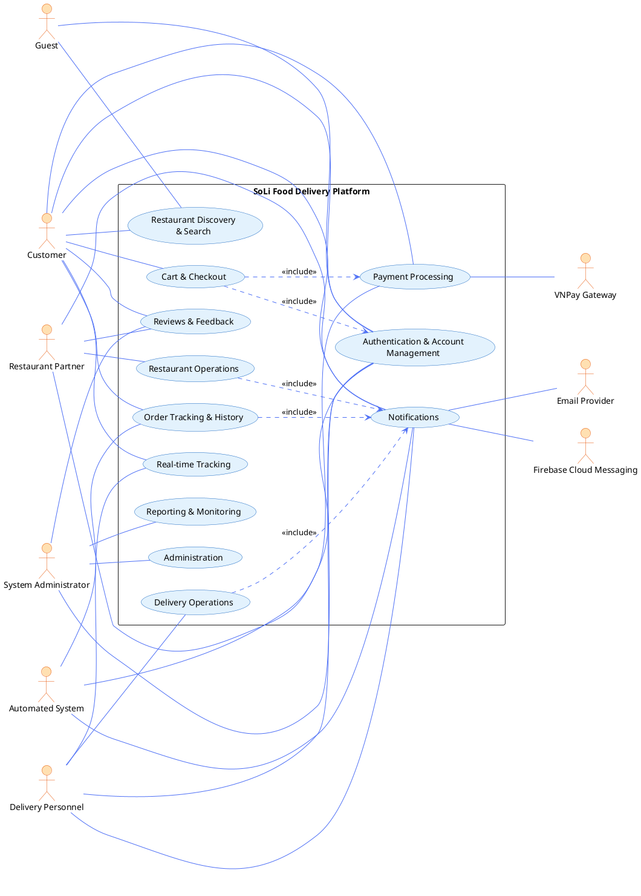

Các actor chính trong sơ đồ gồm Guest, Customer, Restaurant Partner, Delivery Personnel và System Administrator. Hệ thống được mô tả ở mức 12 domain use cases đúng như tài liệu nguồn.

### 3.2.2 UC-DOM-01 Authentication & Account Management

#### Use Case Diagram

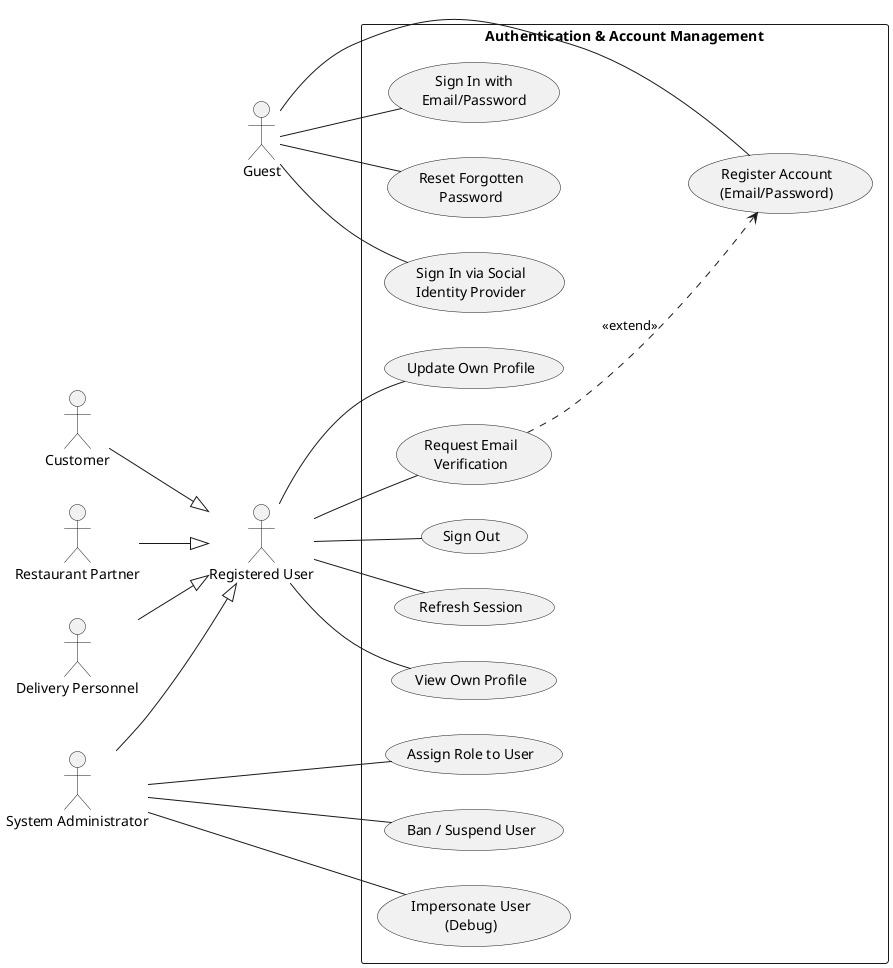

#### Description

Domain này cho phép thiết lập và quản trị vòng đời định danh trên toàn nền tảng, bao gồm đăng ký, đăng nhập, đăng xuất, làm mới phiên, quản lý hồ sơ, xác minh email, khôi phục mật khẩu, social sign-in (planned) và các thao tác quản trị vai trò/tài khoản.

#### Actors

Guest, Customer, Restaurant Partner, Delivery Personnel, System Administrator.

#### Preconditions

- Nền tảng có thể truy cập.
- Người dùng có thiết bị kết nối Internet.
- Với các luồng quản trị, session của actor phải gắn với role `admin`.

#### Main Success Scenario

1. Actor mở ứng dụng.
2. Actor chọn Register hoặc Sign In.
3. Với đăng ký, actor nhập tên, email, mật khẩu và chấp nhận điều khoản.
4. Hệ thống kiểm tra định dạng dữ liệu, tính duy nhất của email, lưu tài khoản và gán role mặc định `user`.
5. Actor đăng nhập bằng email và mật khẩu; hệ thống kiểm tra thông tin xác thực và phát hành session hợp lệ.
6. Actor có thể xem và cập nhật hồ sơ cá nhân bất kỳ lúc nào.
7. Actor có thể đăng xuất để vô hiệu session hiện tại.

#### Alternative Flows

- Email verification.
- Forgotten password recovery.
- Social sign-in ở Release 2.
- Administrative role assignment.
- Administrative ban/suspension.
- Administrative impersonation ở trạng thái planned/partial.

#### Business Rules

- Thông tin xác thực phải được lưu bằng cơ chế hash chuẩn công nghiệp.
- Session phải bị vô hiệu khi người dùng đăng xuất rõ ràng.
- Hệ thống phải áp dụng RBAC trên toàn bộ protected endpoint.
- Toàn bộ traffic xác thực phải đi qua TLS.
- PII không được xuất hiện trong log ứng dụng.

### 3.2.3 UC-DOM-02 Restaurant Discovery & Search

#### Use Case Diagram

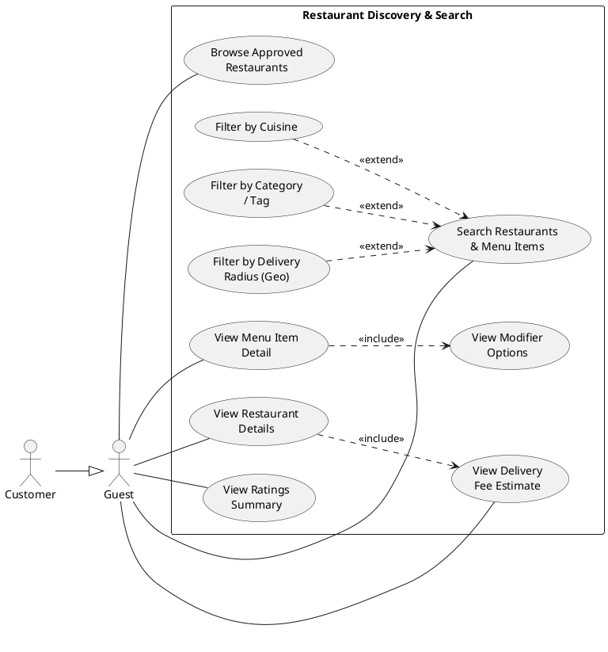

#### Description

Domain này cung cấp bề mặt discovery thống nhất cho guest và customer để duyệt nhà hàng đã được phê duyệt, xem menu, modifier, tìm kiếm theo từ khóa, lọc theo cuisine/category/tag/vị trí và xem ước tính phí giao hàng.

#### Actors

Guest, Customer.

#### Preconditions

- Nền tảng truy cập được.
- Có ít nhất một nhà hàng đã được phê duyệt và đang active.
- Với lọc theo vị trí, thiết bị đã cung cấp location hoặc người dùng đã nhập địa chỉ giao hàng.

#### Main Success Scenario

1. Actor mở bề mặt khám phá của ứng dụng.
2. Hệ thống hiển thị danh sách nhà hàng được phê duyệt theo mức độ liên quan và khoảng cách.
3. Actor chọn một nhà hàng để xem hồ sơ, giờ hoạt động, menu category và menu item.
4. Actor mở chi tiết một món ăn để xem mô tả, giá, trạng thái, ảnh và modifier.
5. Actor có thể nhập địa chỉ giao hàng để hệ thống tính phí giao hàng theo delivery zone.

#### Alternative Flows

- Tìm kiếm theo từ khóa.
- Lọc theo cuisine, category hoặc tag.
- Lọc theo delivery radius.
- Hiển thị ratings summary ở giai đoạn planned.

#### Business Rules

- Search phải hỗ trợ accent-insensitive matching cho tiếng Việt.
- Discovery endpoints phải truy cập được với anonymous user.
- Phân trang là bắt buộc để giới hạn kích thước response.
- Nhà hàng đang đóng cửa hoặc sold out phải được hiển thị với chỉ báo không action được.

### 3.2.4 UC-DOM-03 Cart & Checkout

#### Use Case Diagram

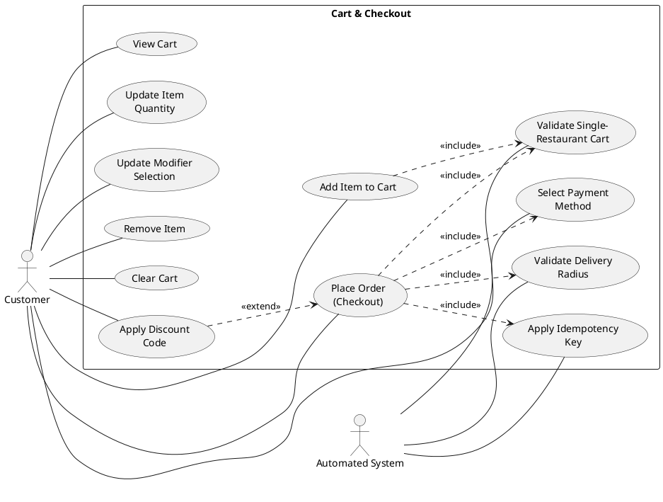

#### Description

Domain này quản trị giỏ hàng của khách, bao gồm thao tác với line item, modifier và bước checkout biến cart thành order. Checkout phải bảo đảm single-restaurant cart, delivery zone eligibility, payment method selection và order idempotency.

#### Actors

Customer, Automated System.

#### Preconditions

- Customer đã xác thực.
- Customer đã chọn ít nhất một món từ một nhà hàng đã được phê duyệt.
- Customer có địa chỉ giao hàng hợp lệ.

#### Main Success Scenario

1. Customer thêm món vào cart, có thể kèm modifier và quantity.
2. Hệ thống kiểm tra single-restaurant constraint và lưu giỏ hàng.
3. Customer xem lại, đổi số lượng, đổi modifier hoặc xóa món.
4. Customer khởi tạo checkout.
5. Hệ thống kiểm tra lại cart, delivery zone và tính phí giao hàng.
6. Customer chọn COD hoặc VNPay và xác nhận đơn.
7. Hệ thống áp dụng idempotency key, lưu order ở trạng thái `pending`, xóa giỏ hàng và phát downstream events.

#### Alternative Flows

- Thêm món từ nhà hàng khác vào cart hiện tại.
- Re-resolve giá modifier tại thời điểm checkout.
- Áp dụng discount code ở Release 2.
- Lưu địa chỉ giao hàng vào hồ sơ người dùng.

#### Business Rules

- Cart state được lưu trong low-latency cache keyed by user identity.
- Checkout phải đảm bảo transactional integrity: hoặc tạo order đầy đủ, hoặc không tạo.
- Giá item và modifier phải được server-side re-resolve tại checkout.
- Cửa sổ idempotency phải bám theo cấu hình hệ thống.

### 3.2.5 UC-DOM-04 Payment

#### Use Case Diagram

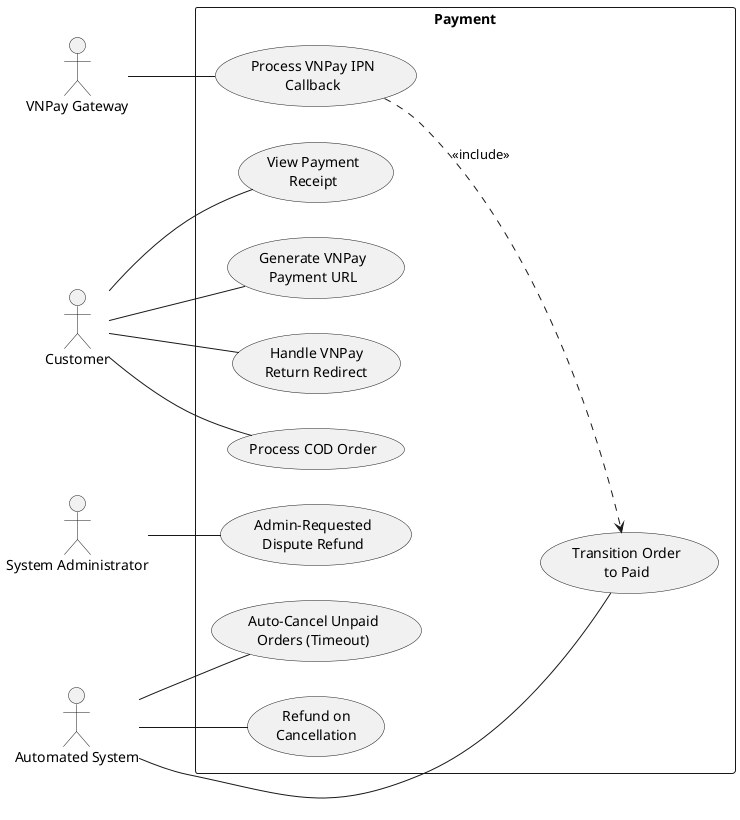

#### Description

Domain Payment quản lý settlement của order theo hai nhánh COD và VNPay, bao gồm generate payment URL, nhận IPN, verify integrity, chuyển order sang `paid`, timeout cancel, refund on cancellation và dispute refund do admin kích hoạt.

#### Actors

Customer, System Administrator, VNPay Gateway, Automated System.

#### Preconditions

- Order đã được tạo và đang ở trạng thái `pending`.
- Với VNPay, gateway phải khả dụng.
- Với dispute refund, order đang ở trạng thái `delivered`.

#### Main Success Scenario

1. Với VNPay, hệ thống tạo signed payment URL và chuyển hướng customer sang gateway.
2. Customer hoàn tất thanh toán tại VNPay portal.
3. Gateway gửi IPN callback về hệ thống.
4. Hệ thống verify HMAC signature, reconcile transaction và chuyển order sang `paid`.
5. Return URL chỉ phục vụ hiển thị UI xác nhận, không mutate business state.
6. Với COD, order đi thẳng vào luồng fulfillment của restaurant.

#### Alternative Flows

- Payment timeout.
- Refund khi hủy đơn sau thanh toán.
- Admin dispute refund.
- Xem payment receipt trong chi tiết đơn.

#### Business Rules

- Mọi giao tiếp với gateway phải được ký và xác minh bằng HMAC scheme cấu hình.
- Gateway credentials phải được quản lý qua environment variables.
- Payment-state transition phải idempotent.
- PII và payment identifier không được xuất hiện trong application log.

### 3.2.6 UC-DOM-05 Order Tracking & History

#### Use Case Diagram

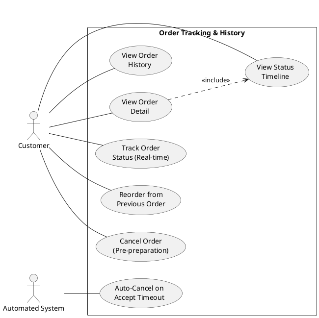

#### Description

Domain này cho phép customer theo dõi lịch sử đơn hàng, chi tiết đơn, timeline trạng thái, trạng thái realtime, hủy đơn ở giai đoạn phù hợp và khởi tạo reorder.

#### Actors

Customer, Automated System.

#### Preconditions

- Customer đã xác thực.
- Customer có ít nhất một order trên hệ thống đối với các luồng history/detail.
- Với realtime tracking, customer đang có order ở trạng thái chưa kết thúc.

#### Main Success Scenario

1. Customer mở mục My Orders.
2. Hệ thống trả về danh sách đơn hàng có phân trang theo thứ tự mới nhất.
3. Customer chọn một order để xem chi tiết và timeline trạng thái.
4. Với active order, hệ thống tiếp tục gửi update trạng thái theo thời gian thực.

#### Alternative Flows

- Cancel order trước khi bước vào preparing.
- Reorder từ một order cũ.
- Auto-cancel do restaurant acceptance timeout.

#### Business Rules

- Timeline trạng thái phải bất biến và được timestamp ở độ chính xác phù hợp.
- Reorder chỉ trả về cart-shaped payload; không làm phát sinh server-side cart mutation ngay lập tức.
- Live GPS tracking được tách sang UC-DOM-11.

### 3.2.7 UC-DOM-06 Restaurant Operations

#### Use Case Diagram

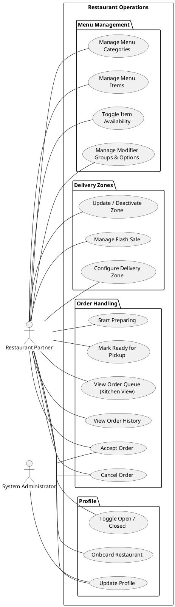

#### Description

Domain này cung cấp cho restaurant partner bộ công cụ vận hành: onboarding, profile, open/closed control, kitchen view, xử lý order, menu/modifier management, delivery zone configuration và flash sale ở trạng thái planned.

#### Actors

Restaurant Partner, System Administrator.

#### Preconditions

- Actor được xác thực là restaurant partner.
- Với order-handling, nhà hàng có active orders.
- Với override, actor là admin.

#### Main Success Scenario

1. Restaurant partner đăng ký nhà hàng, cung cấp hồ sơ và thông tin vận hành.
2. Nhà hàng ở trạng thái unapproved cho đến khi admin phê duyệt.
3. Khi vận hành, partner bật trạng thái open.
4. Đơn mới xuất hiện ở kitchen view theo thời gian thực.
5. Partner xác nhận đơn, chuyển sang `confirmed`.
6. Partner chuyển tiếp `preparing` rồi `ready_for_pickup`.
7. Partner quản lý menu categories, items, modifier groups/options, ảnh, giá và availability.
8. Partner cấu hình delivery zones và các thông số ETA/fee.

#### Alternative Flows

- Hủy order trước khi chuẩn bị.
- Toggle item availability.
- Update modifier group.
- Deactivate delivery zone.
- Flash sale ở Release 2.
- Administrator override.

#### Business Rules

- Kitchen view phải cập nhật realtime không cần refresh trang.
- Menu và modifier thay đổi phải propagate kịp thời sang customer-facing catalog.
- Tính phí giao hàng theo delivery zone phải deterministic và audit được.

### 3.2.8 UC-DOM-07 Delivery Operations

#### Use Case Diagram

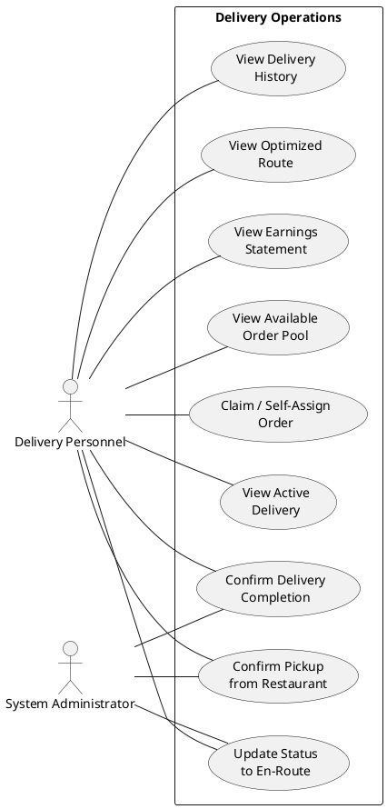

#### Description

Domain này hỗ trợ shipper xem order pool, tự nhận đơn, xác nhận pickup, cập nhật trạng thái giao hàng, xác nhận hoàn tất giao và xem lịch sử giao hàng.

#### Actors

Delivery Personnel, System Administrator.

#### Preconditions

- Actor đã được xác thực là shipper và đã được admin phê duyệt.
- Shipper đang online.

#### Main Success Scenario

1. Shipper mở ứng dụng giao hàng và xem available order pool.
2. Shipper chọn một order và hệ thống áp dụng self-assignment first-come-first-served.
3. Shipper đến nhà hàng và xác nhận pickup.
4. Order chuyển sang trạng thái đang giao.
5. Shipper xác nhận giao thành công, order chuyển sang `delivered`.
6. Shipper có thể xem lịch sử giao hàng.

#### Alternative Flows

- Nhiều shipper cùng nhận một đơn.
- Administrator override.
- Optimized route ở Release 2.
- Earnings statement ở Release 2.

#### Business Rules

- Self-assignment phải atomic để tránh duplicate claims.
- Mỗi shipper chỉ có một active delivery tại một thời điểm.
- Live GPS broadcast được quản lý ở UC-DOM-11.

### 3.2.9 UC-DOM-08 Notifications

#### Use Case Diagram

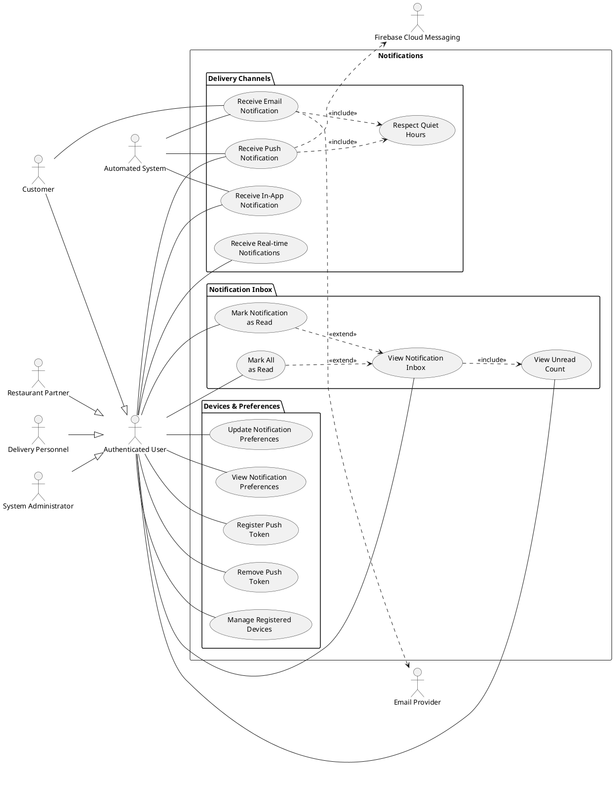

#### Description

Domain này phân phối thông báo theo nhiều kênh: in-app, push, email và realtime stream. Đồng thời quản lý inbox, unread count, device token, preferences và quiet hours.

#### Actors

Authenticated User, Automated System, Firebase Cloud Messaging, Email Provider.

#### Preconditions

- Recipient đã xác thực.
- Với push, user có ít nhất một device token hợp lệ.
- Với email, account có địa chỉ email hợp lệ.
- Với realtime, user đang có active session connection.

#### Main Success Scenario

1. Một domain event xảy ra, ví dụ order placed hoặc payment confirmed.
2. Notification subsystem ánh xạ event thành recipient-channel combinations.
3. Hệ thống lưu bản ghi in-app cho từng recipient.
4. Push và email được gửi theo notification preferences và quiet-hours rules.
5. Recipient xem, đọc hoặc đánh dấu đã đọc thông báo trong inbox.

#### Alternative Flows

- Register device push token.
- Update notification preferences.
- Mark all as read.
- Manage registered devices.
- Token cleanup.
- Quiet-hours suppression.

#### Business Rules

- Event-to-client latency ở điều kiện bình thường phải dưới 3 giây.
- Presence state phải được theo dõi tập trung để hỗ trợ multi-device delivery.
- PII không được log ra server.
- Delivery phải nhất quán trên nhiều thiết bị của cùng một user.

### 3.2.10 UC-DOM-09 Reviews & Feedback

#### Use Case Diagram

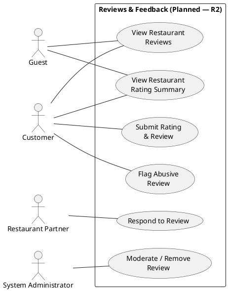

#### Description

Domain này cho phép customer gửi rating và review sau khi đơn đã giao, restaurant partner phản hồi review và admin moderation nội dung. Theo Use Case Specification, domain này là planned for Release 2.

#### Actors

Guest, Customer, Restaurant Partner, System Administrator.

#### Preconditions

- Customer có ít nhất một order ở trạng thái `delivered` chưa được review.
- Với moderation, actor là admin.

#### Main Success Scenario

1. Customer mở một delivered order.
2. Customer gửi số sao và bình luận tùy chọn.
3. Hệ thống lưu review, gắn với order và restaurant, đồng thời cập nhật aggregate rating.
4. Restaurant partner xem và có thể phản hồi review.
5. Guest và customer khác có thể xem review trên hồ sơ nhà hàng.

#### Alternative Flows

- Flag abusive review.
- Administrator moderation.
- View rating summary trên discovery surface.

#### Business Rules

- Mỗi customer chỉ được gửi tối đa một review cho một order.
- Review phải gắn với order gốc để đảm bảo auditability.
- Mọi moderation action phải được log vào administrator audit trail.

### 3.2.11 UC-DOM-10 Administration

#### Use Case Diagram

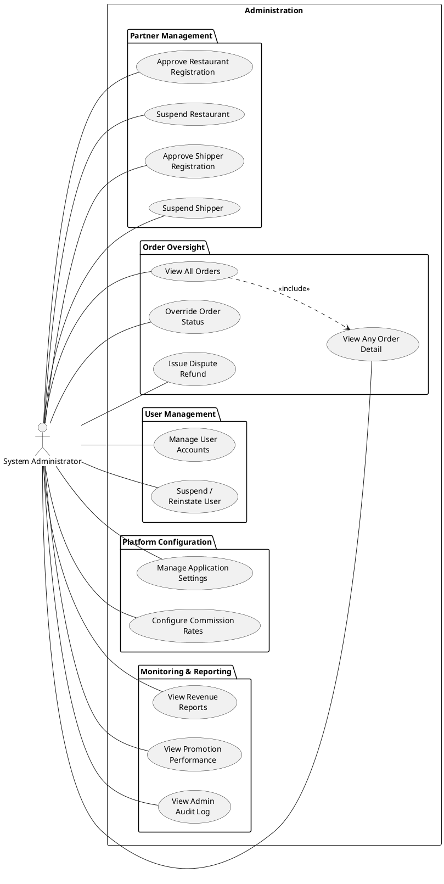

#### Description

Domain này cung cấp khả năng quản trị xuyên nền tảng: phê duyệt đối tác, giám sát vận hành, quản lý user, override order state, dispute refund, quản lý setting và commission rate.

#### Actors

System Administrator.

#### Preconditions

- Actor đã xác thực là admin.

#### Main Success Scenario

1. Admin đăng nhập web portal.
2. Admin kiểm tra pending restaurant registrations và phê duyệt đối tác đủ điều kiện.
3. Admin theo dõi active orders với nhiều bộ lọc.
4. Admin xem chi tiết đơn và can thiệp trạng thái trong các tình huống đặc biệt.
5. Admin phê duyệt dispute refund cho delivered order khi cần.
6. Admin quản lý user accounts, role assignment, ban/unban.
7. Admin cập nhật application settings và commission rate.

#### Alternative Flows

- Suspend restaurant.
- Approve/suspend shipper.
- Revenue reports ở trạng thái planned/partial.
- Promotion performance ở Release 3.
- Audit log surfacing ở Release 2.

#### Business Rules

- Tất cả thao tác quản trị phải audit được.
- Admin privileges bị ràng buộc bởi RBAC.
- Thay đổi cấu hình phải có hiệu lực mà không cần restart dịch vụ.
- Refund execution phải idempotent và reconcile được với gateway record.

### 3.2.12 UC-DOM-11 Real-time Tracking

#### Use Case Diagram

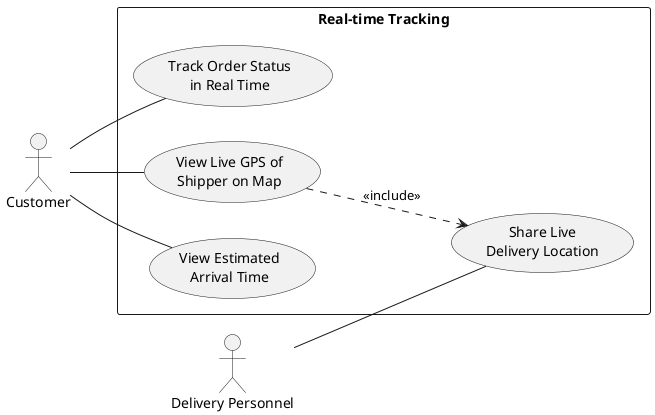

#### Description

Domain này cung cấp khả năng theo dõi realtime cho customer. Ở Release 1, trọng tâm là trạng thái đơn hàng theo thời gian thực; live GPS và dynamic ETA đầy đủ là phần mở rộng của Release 2.

#### Actors

Customer, Delivery Personnel.

#### Preconditions

- Customer đang có active order ở trạng thái chưa kết thúc.
- Client duy trì realtime connection.
- Với live GPS, shipper chấp thuận broadcast vị trí và đang giao đơn.

#### Main Success Scenario

1. Customer mở màn hình active order.
2. Hệ thống liên tục cập nhật trạng thái mới nhất của đơn.
3. Khi đơn bước sang `delivering`, customer thấy status indication và ETA suy ra từ zone parameters.

#### Alternative Flows

- Live GPS tracking ở Release 2.
- Dynamic ETA cập nhật ở trạng thái partial/Release 2.
- Reconnection sau mất kết nối.

#### Business Rules

- Độ trễ event-to-client phải nhỏ hơn 3 giây ở điều kiện bình thường.
- Live GPS chỉ được bật cho customer được gán và chỉ trong active order window.
- Khi mất kết nối, client phải fallback sang cơ chế resynchronization.

### 3.2.13 UC-DOM-12 Reporting & Monitoring

#### Use Case Diagram

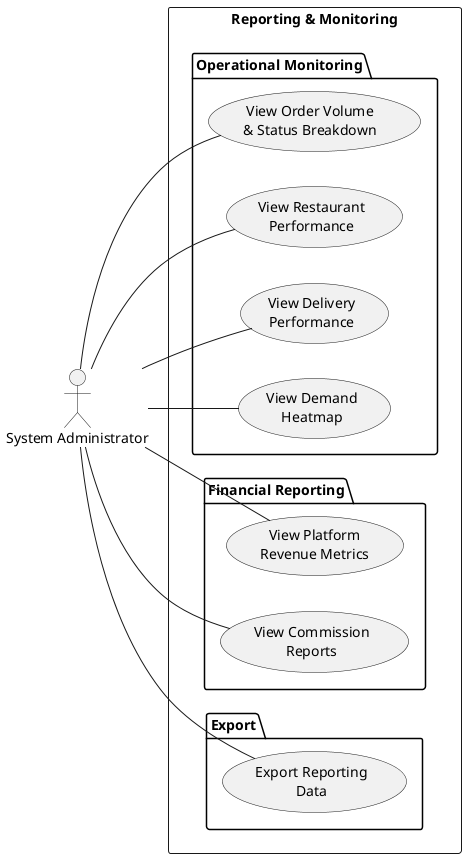

#### Description

Domain này cung cấp cho admin khả năng quan sát vận hành và tài chính của nền tảng, bao gồm order volume, status breakdown, restaurant performance, delivery performance, revenue metrics, commission report, exportable dataset và demand heatmap.

#### Actors

System Administrator.

#### Preconditions

- Actor đã xác thực là admin.
- Có đủ historical data cho kỳ báo cáo được chọn.

#### Main Success Scenario

1. Admin mở reporting console.
2. Admin chọn report cần xem và kỳ báo cáo.
3. Hệ thống tính toán aggregate và hiển thị dưới dạng bảng/biểu đồ.
4. Admin có thể export dataset để phân tích hoặc đối soát.

#### Alternative Flows

- Lọc theo restaurant hoặc shipper.
- Export reporting data.
- Live operational monitoring bằng filtered order/status views.

#### Business Rules

- Report phải hoàn tất trong interactive performance budget của hệ thống.
- Aggregation query không được ảnh hưởng tiêu cực tới workload xử lý order vận hành.
- Dữ liệu export không được chứa PII nếu không có access-controlled workflow phù hợp.

## 3.3 Thiết kế CSDL

### 3.3.1 Sơ đồ dữ liệu

Sơ đồ dữ liệu tổng thể của hệ thống phản ánh nguyên tắc data ownership theo bounded context. Trong đó:

- Auth BC sở hữu `user`, `session`, `account`, `verification`.
- Restaurant Catalog BC sở hữu `restaurants`, `delivery_zones`, `menu_categories`, `menu_items`, `modifier_groups`, `modifier_options`.
- Ordering BC sở hữu `orders`, `order_items`, `order_status_logs` và các bảng snapshot ACL.
- Payment BC sở hữu `payment_transactions`.
- Promotion BC sở hữu các bảng `promotions`, coupon/usage lifecycle.
- Notification BC sở hữu `notifications`, `device_tokens`, `notification_preferences`, `notification_delivery_logs`.
- Review BC sở hữu `reviews`.

Quan hệ dữ liệu chính:

- Một `user` có thể tạo nhiều `session` và `account` liên kết.
- Một `restaurant` có nhiều `delivery_zone` và nhiều `menu_item`.
- Một `menu_item` có thể có nhiều `modifier_group`; mỗi `modifier_group` có nhiều `modifier_option`.
- Một `order` có nhiều `order_item` và nhiều `order_status_log`.
- Một `payment_transaction` gắn logic với một `orderId` nhưng không dùng foreign key xuyên BC.
- Một `review` gắn với `orderId`, `customerId`, `restaurantId` ở dạng cross-context reference.

### 3.3.2 Bảng CSDL

#### Bảng User

| Cột           | Kiểu dữ liệu | Ý nghĩa                      |
| ------------- | ------------ | ---------------------------- |
| id            | uuid         | Khóa chính của người dùng    |
| name          | text         | Tên hiển thị                 |
| email         | text         | Email duy nhất của tài khoản |
| phoneNumber   | text         | Số điện thoại                |
| emailVerified | boolean      | Trạng thái xác minh email    |
| role          | text         | Role của người dùng          |
| banned        | boolean      | Trạng thái khóa tài khoản    |
| createdAt     | timestamp    | Thời điểm tạo                |
| updatedAt     | timestamp    | Thời điểm cập nhật           |

#### Bảng Restaurant

| Cột                     | Kiểu dữ liệu    | Ý nghĩa                   |
| ----------------------- | --------------- | ------------------------- |
| id                      | uuid            | Khóa chính nhà hàng       |
| ownerId                 | uuid            | Chủ sở hữu nhà hàng       |
| name                    | text            | Tên nhà hàng              |
| address                 | text            | Địa chỉ                   |
| phone                   | text            | Số điện thoại             |
| isOpen                  | boolean         | Trạng thái mở cửa         |
| isApproved              | boolean         | Trạng thái được phê duyệt |
| latitude / longitude    | doublePrecision | Tọa độ                    |
| cuisineType             | text            | Loại ẩm thực              |
| logoUrl / coverImageUrl | text            | Ảnh nhà hàng              |
| averageRating           | real            | Điểm đánh giá trung bình  |

#### Bảng MenuItem

| Cột          | Kiểu dữ liệu | Ý nghĩa                                    |
| ------------ | ------------ | ------------------------------------------ |
| id           | uuid         | Khóa chính món ăn                          |
| restaurantId | uuid         | Nhà hàng sở hữu                            |
| name         | text         | Tên món                                    |
| description  | text         | Mô tả                                      |
| price        | integer      | Giá lưu theo VND                           |
| sku          | text         | Mã SKU nội bộ                              |
| categoryId   | uuid         | Category của món                           |
| status       | enum         | `available`, `unavailable`, `out_of_stock` |
| imageUrl     | text         | Ảnh món                                    |
| tags         | text[]       | Nhãn tìm kiếm/lọc                          |

#### Bảng Order

| Cột             | Kiểu dữ liệu | Ý nghĩa                    |
| --------------- | ------------ | -------------------------- |
| id              | uuid         | Khóa chính đơn hàng        |
| customerId      | uuid         | Người đặt                  |
| restaurantId    | uuid         | Nhà hàng nhận đơn          |
| restaurantName  | text         | Snapshot tên nhà hàng      |
| cartId          | uuid         | ID giỏ hàng tạo đơn        |
| status          | enum         | Vòng đời đơn hàng          |
| totalAmount     | integer      | Tổng tiền                  |
| shippingFee     | integer      | Phí giao hàng              |
| discountAmount  | integer      | Số tiền giảm giá           |
| paymentMethod   | enum         | `cod` hoặc `vnpay`         |
| deliveryAddress | jsonb        | Địa chỉ giao hàng          |
| paymentUrl      | text         | URL thanh toán VNPay       |
| expiresAt       | timestamp    | Thời hạn timeout           |
| shipperId       | uuid         | Shipper nhận đơn           |
| version         | integer      | Phục vụ optimistic locking |

#### Bảng OrderItem

| Cột            | Kiểu dữ liệu | Ý nghĩa                    |
| -------------- | ------------ | -------------------------- |
| id             | uuid         | Khóa chính line item       |
| orderId        | uuid         | Khóa ngoại tới orders      |
| menuItemId     | uuid         | Snapshot tham chiếu món ăn |
| itemName       | text         | Tên món tại thời điểm đặt  |
| unitPrice      | integer      | Giá gốc                    |
| modifiersPrice | integer      | Tổng giá modifier          |
| quantity       | integer      | Số lượng                   |
| subtotal       | integer      | Thành tiền                 |
| modifiers      | jsonb        | Snapshot modifier đã chọn  |

#### Bảng Payment

| Cột             | Kiểu dữ liệu | Ý nghĩa                      |
| --------------- | ------------ | ---------------------------- |
| id              | uuid         | Khóa chính giao dịch         |
| orderId         | uuid         | Tham chiếu logic tới order   |
| customerId      | uuid         | Người thanh toán             |
| amount          | integer      | Số tiền VND                  |
| status          | enum         | Trạng thái payment lifecycle |
| paymentUrl      | text         | VNPay redirect URL           |
| providerTxnId   | text         | Mã giao dịch phía provider   |
| vnpResponseCode | text         | Mã phản hồi VNPay            |
| rawIpnPayload   | jsonb        | Dữ liệu IPN thô để audit     |
| expiresAt       | timestamp    | Thời hạn thanh toán          |
| version         | integer      | Optimistic locking           |

#### Bảng Review

| Cột              | Kiểu dữ liệu | Ý nghĩa                        |
| ---------------- | ------------ | ------------------------------ |
| id               | uuid         | Khóa chính đánh giá            |
| orderId          | uuid         | Mỗi order tối đa một review    |
| customerId       | uuid         | Người đánh giá                 |
| restaurantId     | uuid         | Nhà hàng được đánh giá         |
| stars            | smallint     | Điểm 1-5                       |
| comment          | text         | Nhận xét                       |
| tags             | text[]       | Các tag mô tả                  |
| moderationStatus | enum         | `visible`, `flagged`, `hidden` |
| moderationReason | text         | Lý do moderation               |

## 3.4 Thiết kế giao diện

### 3.4.1 Danh sách giao diện

Theo hiện trạng source code, hệ thống hiện có ba bề mặt giao diện chính.

| Nhóm giao diện       | Ứng dụng      | File/route đại diện                              | Mục đích                                                  |
| -------------------- | ------------- | ------------------------------------------------ | --------------------------------------------------------- |
| Customer Mobile Auth | `apps/mobile` | `src/app/(auth)/sign-in.tsx`, `sign-up.tsx`      | Đăng nhập, đăng ký và khởi tạo session khách hàng         |
| Customer Mobile Home | `apps/mobile` | `src/app/(customer)/(tabs)/index.tsx`            | Trang chủ khám phá nhà hàng và món ăn                     |
| Restaurant Detail    | `apps/mobile` | `src/app/(customer)/restaurant/[id].tsx`         | Xem menu, chi tiết nhà hàng, thêm món vào giỏ             |
| Cart                 | `apps/mobile` | `src/app/(customer)/cart.tsx`                    | Xem và chỉnh sửa giỏ hàng                                 |
| Checkout             | `apps/mobile` | `src/app/(customer)/checkout/index.tsx`          | Checkout một màn hình, chọn thanh toán và xác nhận đơn    |
| Tracking             | `apps/mobile` | `src/app/(customer)/orders/[id]/track.tsx`       | Theo dõi trạng thái đơn hàng                              |
| Review               | `apps/mobile` | `src/app/(customer)/orders/[id]/rate.tsx`        | Gửi đánh giá cho đơn đã giao                              |
| Restaurant Dashboard | `apps/web`    | `src/app/pages/dashboard/DashboardPage.tsx`      | Bảng điều khiển vận hành của đối tác nhà hàng             |
| Menu Management      | `apps/web`    | `src/app/pages/menu/*`                           | Quản lý danh mục, món ăn, modifier                        |
| Orders Management    | `apps/web`    | `src/app/pages/orders/*`                         | Theo dõi và xử lý đơn của nhà hàng                        |
| Admin Login          | `apps/admin`  | `src/app/pages/auth/LoginPage.tsx`               | Đăng nhập khu vực quản trị                                |
| Admin Dashboard      | `apps/admin`  | `src/app/pages/dashboard/AdminDashboardPage.tsx` | Giám sát KPI, bottleneck, bản đồ đơn hàng, top performers |
| Admin Orders / Users | `apps/admin`  | `src/app/pages/orders/*`, `users/*`              | Quản trị đơn hàng và người dùng                           |

### 3.4.2 Chi tiết giao diện

Repository hiện tại không lưu bộ screenshot tĩnh hoàn chỉnh cho các màn hình trong phạm vi báo cáo. Vì vậy, phần này mô tả giao diện theo **màn hình thực tế được định nghĩa trong source code hiện trạng**.

#### Login

- Mobile login nằm ở `apps/mobile/src/app/(auth)/sign-in.tsx`.
- Màn hình dùng `SignInScreen`, gọi `authApi.signIn`, hỗ trợ email/password và Google sign-in, hiển thị loading state, alert khi thất bại và điều hướng về customer tabs khi thành công.
- Admin login được tách thành ứng dụng riêng trong `apps/admin`, phục vụ khu vực quản trị.

#### Home

- Trang chủ khách hàng trên mobile được mount từ `apps/mobile/src/app/(customer)/(tabs)/index.tsx` và render `HomeScreen` của feature restaurants.
- Mục tiêu giao diện là làm bề mặt khám phá nhà hàng, dẫn người dùng vào restaurant detail và các luồng đặt hàng.

#### Restaurant Detail

- `apps/mobile/src/app/(customer)/restaurant/[id].tsx` gọi `useRestaurant` và `useRestaurantMenu` để lấy thông tin nhà hàng và menu.
- Màn hình hiển thị trạng thái loading/error riêng, cho phép back navigation, mở chi tiết item và thêm item vào giỏ thông qua `useGuardedAddToCart`.
- Đây là màn hình then chốt của luồng discovery → order funnel.

#### Cart

- `apps/mobile/src/app/(customer)/cart.tsx` render `CartScreen`.
- Giao diện đóng vai trò tổng hợp line item đã chọn, quantity, modifier, tổng tiền và điểm khởi phát sang checkout.

#### Checkout

- `apps/mobile/src/app/(customer)/checkout/index.tsx` render `SingleScreenCheckout`.
- Ngoài ra hệ thống còn có các route phụ như `delivery-address.tsx`, `order-review.tsx`, `payment.tsx`, `promo-picker.tsx` thể hiện checkout flow đã được tách thành các bước nghiệp vụ rõ ràng.
- Đây là giao diện hiện thực hóa BR-2, BR-3, BR-4 và idempotency trong ordering flow.

#### Tracking

- `apps/mobile/src/app/(customer)/orders/[id]/track.tsx` render `OrderTrackingScreen`.
- Màn hình này phục vụ hiển thị trạng thái order theo thời gian thực hoặc theo cơ chế đồng bộ hiện trạng, phù hợp với UC-DOM-05 và UC-DOM-11.

#### Review

- `apps/mobile/src/app/(customer)/orders/[id]/rate.tsx` render `RateOrderScreen`.
- Điều này cho thấy codebase đã chuẩn bị bề mặt giao diện cho đánh giá đơn hàng sau giao, dù tài liệu use case domain vẫn xếp Reviews & Feedback ở trạng thái planned cho Release 2.

#### Admin Dashboard

- `apps/admin/src/app/pages/dashboard/AdminDashboardPage.tsx` là dashboard quản trị riêng biệt.
- Giao diện này hiển thị KPI của nền tảng như GMV, doanh thu, số lượng restaurant online/offline, success rate, top earners, bottlenecks và live order map.
- Đây là màn hình phản ánh rõ nhất hướng phát triển Reporting & Monitoring và Governance trên thực tế mã nguồn hiện tại.

---

# Chương 4. XÂY DỰNG ỨNG DỤNG VÀ KIỂM THỬ CHƯƠNG TRÌNH

## 4.1 Yêu cầu phần cứng và phần mềm

### Yêu cầu về phần cứng

- Máy chủ triển khai API có khả năng chạy container Node.js/NestJS, kết nối tới PostgreSQL và Redis.
- Máy chủ hoặc dịch vụ web có khả năng chạy container nginx phục vụ web build output.
- Thiết bị di động Android/iOS có kết nối Internet để chạy ứng dụng Expo/React Native.
- Máy trạm phát triển đủ tài nguyên để chạy monorepo, Docker Compose, database cục bộ và các lệnh build/test.

### Yêu cầu về phần mềm

- Node.js và pnpm để quản lý monorepo.
- Turbo để orchestrate build/lint/test ở cấp repository.
- Docker/Docker Compose cho local development và packaging.
- PostgreSQL làm persistent database.
- Redis/Valkey-compatible service cho runtime state.
- GitHub Actions và GHCR cho CI/publish image.
- Render cho deployment image-backed service theo CD Guide.

Các biến môi trường triển khai quan trọng theo CD Guide gồm `DATABASE_URL`, `BETTER_AUTH_SECRET`, `BETTER_AUTH_URL`, `CORS_ORIGIN`, `REDIS_HOST`, `REDIS_PORT`, `VNPAY_TMN_CODE`, `VNPAY_HASH_SECRET`, `VNPAY_URL`, `VNPAY_RETURN_URL`, `CLOUDINARY_CLOUD_NAME`, `CLOUDINARY_API_KEY`, `CLOUDINARY_API_SECRET` và các biến mail/firebase tùy chọn.

## 4.2 Tổ chức thư mục của dự án

Repository hiện tại được tổ chức theo mô hình monorepo. Cấu trúc khái quát như sau:

```text
SoLi-Food-Order-and-Deliver-App/
├─ apps/
│  ├─ api/
│  │  ├─ src/
│  │  │  ├─ module/
│  │  │  │  ├─ admin-analytics/
│  │  │  │  ├─ auth/
│  │  │  │  ├─ image/
│  │  │  │  ├─ notification/
│  │  │  │  ├─ ordering/
│  │  │  │  ├─ payment/
│  │  │  │  ├─ promotion/
│  │  │  │  ├─ restaurant-catalog/
│  │  │  │  └─ review/
│  │  │  ├─ drizzle/
│  │  │  ├─ lib/
│  │  │  ├─ config/
│  │  │  ├─ observability/
│  │  │  └─ shared/
│  │  ├─ docs/
│  │  └─ test/
│  ├─ mobile/
│  │  ├─ src/app/
│  │  ├─ src/features/
│  │  ├─ src/lib/
│  │  └─ assets/
│  ├─ web/
│  │  ├─ src/app/pages/
│  │  ├─ src/features/
│  │  ├─ src/components/
│  │  └─ src/lib/
│  └─ admin/
│     ├─ src/app/pages/
│     ├─ src/features/
│     └─ src/components/
├─ docs/
├─ infra/
│  └─ render/
├─ tools/
├─ package.json
├─ pnpm-workspace.yaml
└─ turbo.json
```

Ý nghĩa cấu trúc:

- `apps/api` chứa backend chính và toàn bộ bounded contexts nghiệp vụ.
- `apps/mobile` là customer mobile app.
- `apps/web` là restaurant/partner portal.
- `apps/admin` là admin portal riêng.
- `docs` và `apps/api/docs` chứa tài liệu kiến trúc, vận hành, kiểm thử và final documents.
- `infra/render` chứa Terraform cho hạ tầng Render.
- `tools` chứa script hỗ trợ.

## 4.3 Kiểm thử chương trình

Phần kiểm thử dưới đây được tổng hợp từ User Stories & Acceptance Criteria, SRS, ASR, ADD và đối chiếu hiện trạng source code. Báo cáo này không thay thế cho một đợt test execution mới, mà phản ánh mức độ bao phủ chức năng và ràng buộc chất lượng theo tài liệu và implementation evidence hiện có.

### 4.3.1 Kiểm thử chức năng

| Test Case                    | Expected                                                                           | Actual                                                                                                                                                   | Result       |
| ---------------------------- | ---------------------------------------------------------------------------------- | -------------------------------------------------------------------------------------------------------------------------------------------------------- | ------------ |
| Đăng ký/đăng nhập khách hàng | Tạo tài khoản mới, đăng nhập thành công, session hợp lệ                            | `better-auth` được tích hợp ở backend; mobile có `SignInScreen`, `SignUpPage`; auth schema có `user`, `session`, `account`, `verification`               | Đạt          |
| Tìm kiếm và duyệt nhà hàng   | Hiển thị danh sách nhà hàng đã được approve, có thể mở chi tiết nhà hàng và món ăn | Có Restaurant Catalog BC, search/menu/restaurant controllers; mobile home và restaurant detail screen hiện diện                                          | Đạt          |
| Quản lý giỏ hàng             | Thêm món, cập nhật số lượng, đổi modifier, xóa món; chặn cross-restaurant cart     | `CartService` lưu Redis cart, enforce single-restaurant cart, update quantity/modifier, remove item                                                      | Đạt          |
| Checkout COD/VNPay           | Tạo order, chọn payment method, đảm bảo idempotency                                | `PlaceOrderHandler`, `orders` schema, `paymentMethodEnum`, VNPay flow, idempotency key trong Redis và `UNIQUE(cart_id)`                                  | Đạt          |
| Theo dõi trạng thái đơn      | Xem lịch sử, chi tiết và timeline trạng thái                                       | Order history/lifecycle có trong Ordering BC; mobile có route order detail và tracking                                                                   | Đạt          |
| Vận hành nhà hàng            | Nhà hàng xử lý order và quản lý menu/delivery zone                                 | `restaurant-catalog` + `ordering` có đầy đủ module; web có dashboard, menu, orders pages                                                                 | Đạt          |
| Giao hàng                    | Shipper nhận đơn, pickup, giao thành công                                          | Ordering lifecycle hỗ trợ shipper states; mobile/web có luồng vận hành tương ứng trong tài liệu và code                                                  | Đạt một phần |
| Đánh giá đơn hàng            | Gửi rating/review cho order đã giao                                                | Backend có ReviewModule và schema `reviews`; mobile có `RateOrderScreen`; tuy nhiên Use Case Specification vẫn đánh dấu domain ở trạng thái Planned (R2) | Đạt một phần |
| Quản trị nền tảng            | Admin xem dashboard, orders, users, duy trì governance                             | `apps/admin` có login, dashboard, orders, users; backend có `admin-analytics` và admin surfaces                                                          | Đạt          |

### 4.3.2 Kiểm thử các yêu cầu phi chức năng

| Nhóm kiểm thử | Mục tiêu                                                                      | Bằng chứng hiện trạng                                                                                                                 | Kết quả                                      |
| ------------- | ----------------------------------------------------------------------------- | ------------------------------------------------------------------------------------------------------------------------------------- | -------------------------------------------- |
| Performance   | Search p95 ≤ 2 giây, checkout p95 ≤ 3 giây                                    | ADD có QA-P-01 và QA-P-03 ở trạng thái Implemented; search và checkout có cấu trúc query/transaction rõ ràng                          | Đạt theo thiết kế và implementation evidence |
| Reliability   | Exactly-once order creation, state machine integrity, payment IPN idempotency | Redis idempotency + `UNIQUE(cart_id)`, TRANSITIONS map, optimistic locking, ProcessIpnHandler                                         | Đạt                                          |
| Security      | VNPay callback integrity, RBAC, input validation                              | HMAC verification, Better Auth, role utility, ValidationPipe, Drizzle parameterized query                                             | Đạt                                          |
| Availability  | Auth path và realtime channel graceful degradation                            | ADD đánh dấu một phần; REST inbox fallback và durable notification rows đã có, unread polling chưa wire đầy đủ ở client               | Đạt một phần                                 |
| Scalability   | 2× peak load cho browse/search và scale full API instances                    | Redis tách state runtime; CD Guide/SAD mô tả scale full instances; multi-instance websocket còn cần sticky session hoặc Redis adapter | Đạt một phần                                 |

---

# KẾT LUẬN VÀ HƯỚNG PHÁT TRIỂN

## Kết luận

Đề tài SoLi Food Delivery Platform đã xây dựng được một nền tảng nhiều vai trò có cấu trúc kiến trúc rõ ràng, bám sát tài liệu nghiệp vụ và thể hiện được tính nhất quán giữa Business Objectives, Success Metrics, Use Cases, ASR, ADD, ADR, SAD và source code hiện trạng.

Đối chiếu với Business Objectives:

- **BO-1:** Hệ thống đã hiện thực trục discovery → cart → checkout với customer mobile flow khá đầy đủ, tạo nền tảng để rút ngắn thời gian đặt món.
- **BO-2:** Restaurant portal và các năng lực menu/order handling đã có trong codebase, phù hợp mục tiêu mở rộng order volume cho đối tác.
- **BO-3:** Luồng shipper, order lifecycle, realtime status visibility và atomic assignment tạo nền tảng để nâng tỷ lệ giao hàng thành công.
- **BO-4:** Thanh toán online qua VNPay đã được tích hợp trong Release 1; mục tiêu mở rộng tỷ lệ online payment tiếp tục phụ thuộc vào adoption và các payment provider bổ sung như MoMo.

Đối chiếu với Success Metrics:

- **SM-1** và **SM-2** phụ thuộc vào dữ liệu vận hành thật sau triển khai, nhưng hệ thống đã có đầy đủ các capability cốt lõi để onboard khách hàng và nhà hàng.
- **SM-3** hiện cần đồng bộ hoàn toàn giữa tài liệu use case và triển khai review/rating để đo lường nhất quán hơn.
- **SM-4** đã có cơ chế delivery zone, ETA estimate, order lifecycle và shipping flow, tạo nền tảng theo dõi performance giao hàng trong vùng phục vụ.

Từ góc độ học thuật và kỹ thuật, giá trị lớn nhất của SoLi nằm ở việc hệ thống không chỉ được xây dựng ở mức tính năng, mà còn được tài liệu hóa thành một bộ artifact kiến trúc hoàn chỉnh và có khả năng đối chiếu ngược với source code thực tế.

## Hướng phát triển

Các hướng phát triển tiếp theo, dựa trên BRD và Proposal Multimodel, gồm:

1. **AI Review Analysis**: mở rộng từ review text/rating hiện có sang các bài toán phân tích cảm xúc, aspect extraction và explanation generation.
2. **Multimodal Quality Assessment**: tích hợp đề xuất ConvNeXt + XLM-R + Fusion + XAI + AI Agent như một dịch vụ AI độc lập để đánh giá chất lượng sản phẩm hoặc đánh giá nội dung review nâng cao.
3. **Loyalty Program**: bổ sung điểm thưởng, voucher tích lũy và cơ chế giữ chân người dùng ở Release 3.
4. **Predictive ETA**: nâng ETA hiện tại từ rule-based estimation lên mô hình dự đoán theo lịch sử vận hành, tình trạng nhà hàng và mật độ giao hàng.
5. **Recommendation Engine**: gợi ý nhà hàng, món ăn và khuyến mãi theo lịch sử đơn và hành vi người dùng.
6. **Payment Expansion**: bổ sung MoMo và các ví điện tử khác theo lộ trình Vision and Scope/BRD.
7. **Full Realtime Tracking**: hoàn thiện live GPS tracking và multi-instance realtime correctness thông qua Redis adapter hoặc chiến lược websocket scaling phù hợp.
8. **Operational Analytics**: mở rộng dashboard quản trị, export và monitoring sang heatmap, bottleneck diagnostics, fraud detection và analytics chuyên sâu.

---

# TÀI LIỆU THAM KHẢO

1. `apps/api/docs/Final_Documents/Food_Delivery_Vision_and_Scope.md`
2. `apps/api/docs/Final_Documents/BRD.md`
3. `apps/api/docs/Final_Documents/Business_Rules.md`
4. `apps/api/docs/Final_Documents/SRS_FoodDelivery.md`
5. `apps/api/docs/Final_Documents/USE_CASE_SPECIFICATION.md`
6. `apps/api/docs/Final_Documents/User-Stories-and-Acceptance-Criteria.md`
7. `apps/api/docs/Final_Documents/SRS_SequenceDiagrams.md`
8. `apps/api/docs/Final_Documents/Utility-Tree-ASRs.md`
9. `apps/api/docs/Final_Documents/ASR-ADD-SAD/14 Quality Attribute.md`
10. `apps/api/docs/Final_Documents/ASR-ADD-SAD/ASR_FoodDelivery.md`
11. `apps/api/docs/Final_Documents/ASR-ADD-SAD/ADD_FoodDelivery.md`
12. `apps/api/docs/Final_Documents/ASR-ADD-SAD/ADR_FoodDelivery.md`
13. `apps/api/docs/Final_Documents/ASR-ADD-SAD/SAD_FoodDelivery.md`
14. `apps/api/docs/Final_Documents/ASR-ADD-SAD/CD_GUIDE.md`
15. `apps/api/docs/Final_Documents/Proposal_Multimodel.md`
16. `apps/api/src/app.module.ts`
17. `apps/api/src/drizzle/schema.ts`
18. `apps/api/src/module/auth/auth.schema.ts`
19. `apps/api/src/module/restaurant-catalog/restaurant/restaurant.schema.ts`
20. `apps/api/src/module/restaurant-catalog/menu/menu.schema.ts`
21. `apps/api/src/module/ordering/order/order.schema.ts`
22. `apps/api/src/module/payment/domain/payment-transaction.schema.ts`
23. `apps/api/src/module/promotion/domain/promotion.schema.ts`
24. `apps/api/src/module/notification/domain/notification.schema.ts`
25. `apps/api/src/module/review/domain/review.schema.ts`
26. `apps/api/src/module/ordering/cart/cart.service.ts`
27. `apps/mobile/src/app`
28. `apps/web/src/app/pages`
29. `apps/admin/src/app/pages`
