# ĐẠI HỌC QUỐC GIA TP. HỒ CHÍ MINH

# TRƯỜNG ĐẠI HỌC CÔNG NGHỆ THÔNG TIN

# KHOA CÔNG NGHỆ PHẦN MỀM

## ĐỒ ÁN 1/2

## BÁO CÁO PHÂN TÍCH, THIẾT KẾ, XÂY DỰNG VÀ KIỂM THỬ HỆ THỐNG SOLI FOOD DELIVERY PLATFORM

**GV hướng dẫn:** Nguyễn Thị Xuân Hương
**SV thực hiện:**
[Mã số sinh viên 1 - Họ và tên]
[Mã số sinh viên 2 - Họ và tên]
**TP. Hồ Chí Minh, 2026**

---

# LỜI CẢM ƠN

Nhóm thực hiện trân trọng cảm ơn giảng viên hướng dẫn Cô Nguyễn Thị Xuân Hương đã tận tâm định hướng, góp ý và theo dõi xuyên suốt quá trình thực hiện đề tài. Những góp ý về yêu cầu nghiệp vụ, kiến trúc hệ thống, cách tổ chức tài liệu và tiêu chuẩn trình bày đã giúp nhóm hoàn thiện sản phẩm theo hướng nhất quán giữa nhu cầu nghiệp vụ, hiện trạng triển khai và yêu cầu học thuật.

Nhóm cũng cảm ơn các thành viên đã phối hợp trong quá trình phân tích yêu cầu, xây dựng kiến trúc, phát triển ứng dụng backend, web, mobile, kiểm thử và hoàn thiện báo cáo cuối kỳ. Nội dung báo cáo được trình bày theo hướng độc lập, giúp người đọc nắm được mục tiêu, phạm vi, kiến trúc, thiết kế dữ liệu, giao diện, triển khai và kiểm thử của dự án SoLi Food Delivery Platform.

---

# MỤC LỤC

- Lời cảm ơn
- Lời nói đầu
- Chương 1. Tổng quan đề tài
- Chương 2. Cơ sở lý thuyết
- Chương 3. Phân tích và thiết kế hệ thống
- Chương 4. Xây dựng ứng dụng và kiểm thử chương trình
- Kết luận và hướng phát triển
- Tài liệu tham khảo

---

# LỜI NÓI ĐẦU

SoLi Food Delivery Platform là đề tài xây dựng nền tảng đặt và giao đồ ăn trực tuyến theo mô hình marketplace nhiều vai trò. Hệ thống kết nối khách hàng, đối tác nhà hàng, nhân sự giao hàng và quản trị viên trong cùng một chuỗi nghiệp vụ: khám phá nhà hàng, chọn món, quản lý giỏ hàng, đặt đơn, thanh toán, xử lý đơn, cập nhật giao hàng, thông báo và đánh giá sau khi hoàn tất.

Báo cáo này trình bày đề tài như một sản phẩm phần mềm hoàn chỉnh, không chỉ ở mức mô tả chức năng mà còn ở mức phân tích nghiệp vụ, kiến trúc, thiết kế dữ liệu, thiết kế giao diện, triển khai và kiểm thử. Nội dung được tổ chức theo yêu cầu báo cáo đồ án, đồng thời bảo đảm người đọc có thể hiểu được bối cảnh, mục tiêu, phạm vi, cấu trúc hệ thống và các quyết định kỹ thuật quan trọng mà không cần mở thêm các tài liệu phụ trợ.

Về mặt kỹ thuật, SoLi được xây dựng theo hướng modular monolith trên nền tảng NestJS, PostgreSQL, Redis, Drizzle ORM, Better Auth, React, Expo/React Native và các tích hợp bên ngoài như VNPay, Cloudinary, Firebase Cloud Messaging, SMTP, OpenTelemetry và hệ thống CI/CD bằng GitHub Actions, GHCR, Docker và Render. Cách tiếp cận này giúp hệ thống giữ được ranh giới nghiệp vụ rõ ràng, giảm chi phí vận hành ở giai đoạn đồ án, đồng thời vẫn chuẩn bị được nền tảng để mở rộng trong các giai đoạn sau.

Báo cáo gồm bốn chương chính. Chương 1 trình bày tổng quan đề tài, hiện trạng, đối tượng, phạm vi và yêu cầu hệ thống. Chương 2 trình bày cơ sở lý thuyết, công nghệ sử dụng và hướng nghiên cứu AI đa phương thức. Chương 3 phân tích kiến trúc, use case, thiết kế dữ liệu và thiết kế giao diện. Chương 4 trình bày môi trường xây dựng, tổ chức mã nguồn và chiến lược kiểm thử chương trình.

---

# Chương 1. TỔNG QUAN ĐỀ TÀI

## 1.1 Động lực nghiên cứu và lý do chọn đề tài

Dịch vụ đặt và giao đồ ăn trực tuyến đã trở thành một phần quen thuộc của đời sống đô thị. Người dùng mong muốn đặt món nhanh, thanh toán thuận tiện, theo dõi trạng thái rõ ràng và nhận thông báo kịp thời. Nhà hàng cần một kênh bán hàng số giúp quản lý menu, tiếp nhận đơn và mở rộng tệp khách hàng. Nhân sự giao hàng cần quy trình nhận đơn, xác nhận lấy hàng và cập nhật giao hàng minh bạch. Đội ngũ vận hành cần công cụ quản trị để kiểm soát đối tác, đơn hàng, người dùng, khuyến mãi và các chỉ số vận hành.

Các hệ thống food delivery quy mô lớn đã chứng minh nhu cầu thị trường, nhưng chúng thường không công khai cấu trúc nghiệp vụ, kiến trúc, mô hình dữ liệu và cách kiểm thử ở mức có thể dùng cho một đồ án học thuật. Vì vậy, SoLi được chọn làm đề tài vì vừa có giá trị thực tiễn, vừa đủ độ phức tạp để thể hiện đầy đủ quy trình phát triển phần mềm: phân tích yêu cầu, mô hình hóa nghiệp vụ, thiết kế kiến trúc, hiện thực hóa API, xây dựng giao diện, tích hợp thanh toán, xây dựng thông báo thời gian thực, thiết kế dữ liệu và kiểm thử.

Đề tài cũng phù hợp để nghiên cứu mô hình modular monolith. Food delivery là bài toán có nhiều miền nghiệp vụ liên quan chặt chẽ: authentication, catalog, ordering, payment, promotion, notification, review và administration. Nếu chia nhỏ thành microservices quá sớm, nhóm phải gánh chi phí vận hành lớn như message broker, distributed tracing, network failure, deployment orchestration và data consistency phân tán. Ngược lại, nếu xây dựng monolith không có ranh giới domain, hệ thống dễ phát sinh phụ thuộc chéo và khó bảo trì. Modular monolith giúp cân bằng hai yêu cầu: triển khai gọn trong một backend duy nhất nhưng vẫn giữ cấu trúc theo bounded context.

Lý do lựa chọn đề tài được tổng hợp như sau:

- Bài toán có nhu cầu thực tế, dễ kiểm chứng bằng trải nghiệm người dùng và quy trình vận hành.
- Hệ thống bao phủ nhiều vai trò, nhiều luồng nghiệp vụ và nhiều loại dữ liệu khác nhau.
- Đề tài cho phép kết hợp phân tích nghiệp vụ, thiết kế hệ thống, kiến trúc phần mềm, kiểm thử và DevOps.
- Các tích hợp như VNPay, Cloudinary, FCM, SMTP, Redis và WebSocket tạo chiều sâu kỹ thuật phù hợp với đồ án/capstone.
- Hệ thống có lộ trình mở rộng rõ ràng sang AI, phân tích dữ liệu, gợi ý món ăn, tối ưu giao hàng và đánh giá chất lượng dịch vụ.

## 1.2 Khảo sát hiện trạng

Các nền tảng như GrabFood, ShopeeFood và Baemin cho thấy thị trường giao đồ ăn trực tuyến tại Việt Nam đã có nhu cầu lớn và hành vi người dùng tương đối ổn định. Điểm chung của các nền tảng này là cung cấp một chuỗi trải nghiệm gồm tìm kiếm nhà hàng, chọn món, thanh toán, theo dõi đơn, giao hàng và chăm sóc sau giao. Tuy nhiên, mỗi nền tảng có trọng tâm riêng: GrabFood mạnh về mạng lưới logistics, ShopeeFood tận dụng hệ sinh thái thương mại điện tử, còn Baemin từng tạo dấu ấn về nhận diện thương hiệu và trải nghiệm giao diện.

SoLi không đặt mục tiêu cạnh tranh với các nền tảng thương mại quy mô lớn. Mục tiêu của đề tài là xây dựng một nền tảng có phạm vi đủ thực tế, kiến trúc rõ ràng, mã nguồn có thể kiểm tra, tài liệu hóa đầy đủ và phù hợp với bối cảnh đồ án đại học. Hệ thống tập trung vào các chức năng lõi của Release 1: đăng ký/đăng nhập, khám phá nhà hàng, quản lý giỏ hàng, checkout, thanh toán COD/VNPay, vận hành nhà hàng, theo dõi trạng thái đơn, thông báo, quản trị nền tảng và nền tảng cho review/promotion.

**Bảng 1.1. So sánh hiện trạng các nền tảng giao đồ ăn**

| Tiêu chí           | GrabFood                                   | ShopeeFood                              | SoLi                                                                 |
| ------------------ | ------------------------------------------ | --------------------------------------- | -------------------------------------------------------------------- |
| Mô hình            | Marketplace giao đồ ăn quy mô lớn          | Marketplace gắn với hệ sinh thái Shopee | Marketplace học thuật nhiều vai trò                                  |
| Nhóm người dùng    | Khách hàng, nhà hàng, tài xế, vận hành     | Khách hàng, quán ăn, tài xế, vận hành   | Customer, Restaurant Partner, Shipper, Administrator                 |
| Chức năng lõi      | Đặt món, thanh toán, giao hàng, khuyến mãi | Đặt món, thanh toán, voucher, gợi ý     | Auth, search, cart, checkout, payment, tracking, admin, notification |
| Theo dõi đơn       | Có                                         | Có                                      | Có ở mức trạng thái đơn; live GPS là lộ trình mở rộng                |
| Tài liệu kiến trúc | Không công khai ở mức học thuật            | Không công khai ở mức học thuật         | Có bộ tài liệu nghiệp vụ, yêu cầu, kiến trúc và triển khai           |
| Mục tiêu chính     | Thương mại hóa                             | Thương mại hóa                          | Hoàn thiện sản phẩm và báo cáo đồ án chuyên nghiệp                   |

Từ khảo sát này, SoLi được định vị như một nền tảng food delivery thu nhỏ nhưng có chiều sâu về thiết kế. Hệ thống không chỉ trả lời câu hỏi “ứng dụng làm gì”, mà còn trả lời “vì sao tổ chức theo cách đó”, “dữ liệu được sở hữu bởi miền nào”, “luồng đặt đơn được bảo vệ khỏi lỗi lặp như thế nào”, “thanh toán online được xác minh ra sao” và “kiểm thử đảm bảo các ràng buộc nghiệp vụ quan trọng bằng cách nào”.

## 1.3 Đối tượng và phạm vi nghiên cứu

### Đối tượng

Bốn nhóm người dùng chính của hệ thống gồm:

- **Customer**: người dùng đặt món, quản lý giỏ hàng, chọn phương thức thanh toán, theo dõi đơn, nhận thông báo và đánh giá sau khi giao thành công.
- **Restaurant Partner**: đối tác nhà hàng quản lý hồ sơ, menu, modifier, khu vực giao hàng, trạng thái mở cửa và xử lý đơn hàng.
- **Shipper**: nhân sự giao hàng nhận đơn khả dụng, xác nhận lấy hàng, cập nhật trạng thái đang giao và hoàn tất giao hàng.
- **Administrator**: người vận hành nền tảng quản lý đối tác, người dùng, đơn hàng, khuyến mãi, báo cáo và các tình huống cần can thiệp nghiệp vụ.

Ngoài ra, hệ thống còn tương tác với các tác nhân phụ trợ như VNPay Gateway, Firebase Cloud Messaging, SMTP provider, Cloudinary, PostgreSQL, Redis và các workflow CI/CD.

### Phạm vi

Phạm vi chính của đồ án tập trung vào Release 1 và các chức năng lõi đã được hiện thực hóa hoặc chuẩn bị rõ trong hệ thống:

- Đăng ký, đăng nhập, phiên làm việc và quản lý vai trò cơ bản.
- Tìm kiếm nhà hàng, xem chi tiết nhà hàng, xem menu item, category, tag và modifier.
- Quản lý giỏ hàng một nhà hàng, cập nhật số lượng và modifier.
- Checkout với kiểm tra vùng giao hàng, phí giao hàng, giảm giá và idempotency.
- Thanh toán COD và VNPay, xử lý IPN, return URL, timeout và trạng thái giao dịch.
- Quản lý vòng đời đơn hàng từ tạo đơn, xác nhận, chuẩn bị, sẵn sàng lấy hàng, pickup, đang giao, đã giao, hủy hoặc hoàn tiền.
- Quản lý nhà hàng, menu, delivery zone, hình ảnh và trạng thái availability.
- Thông báo in-app, push, email, unread count, preference và device token.
- Khuyến mãi ở mức promotion, coupon, usage reservation và rollback.
- Review/rating ở mức nền tảng backend và mobile screen, với phạm vi nghiệp vụ đầy đủ thuộc giai đoạn mở rộng.
- Dashboard quản trị, phân tích vận hành và CI/CD triển khai image.

Các nội dung nằm ngoài phạm vi chính gồm microservices vật lý, live GPS tracking hoàn chỉnh, predictive ETA, fraud detection, recommendation engine, loyalty program, B2B ordering, subscription meal plan và pipeline AI production.

## 1.4 Mục tiêu đề tài

### Business Objectives

**Bảng 1.2. Business Objectives**

| ID   | Mục tiêu                                                         | Chỉ tiêu đo lường                                                                   | Thời hạn               |
| ---- | ---------------------------------------------------------------- | ----------------------------------------------------------------------------------- | ---------------------- |
| BO-1 | Giảm 50% thời gian trung bình khách hàng cần để hoàn tất đặt món | Dưới 5 phút từ duyệt món đến xác nhận đơn; mục tiêu mở rộng dưới 3 phút             | 6 tháng sau Release 1  |
| BO-2 | Giúp đối tác nhà hàng tăng số lượng đơn hằng ngày                | Tăng 30% số đơn trung bình mỗi ngày trên mỗi đối tác hoạt động                      | 12 tháng sau Release 1 |
| BO-3 | Đạt tỷ lệ giao hàng thành công cao                               | Tối thiểu 95% đơn đã điều phối được giao thành công                                 | 6 tháng sau Release 1  |
| BO-4 | Tăng tỷ lệ thanh toán trực tuyến                                 | Tối thiểu 70% đơn hoàn tất được thanh toán qua VNPay hoặc ví điện tử được phê duyệt | 6 tháng sau Release 1  |

### Success Metrics

**Bảng 1.3. Success Metrics**

| ID   | Chỉ số thành công                                           | Mục tiêu               | Cửa sổ đo lường       |
| ---- | ----------------------------------------------------------- | ---------------------- | --------------------- |
| SM-1 | Khách hàng đăng ký có phát sinh đơn hằng tuần               | Ít nhất 500 khách hàng | 3 tháng sau Release 1 |
| SM-2 | Đối tác nhà hàng hoạt động và xử lý đơn                     | Ít nhất 30 đối tác     | 3 tháng sau Release 1 |
| SM-3 | Điểm hài lòng trung bình sau giao hàng                      | Ít nhất 4.0/5.0        | 6 tháng sau Release 1 |
| SM-4 | Thời gian trung bình từ đặt đơn đến giao trong vùng phục vụ | Không quá 45 phút      | 6 tháng sau Release 1 |

## 1.4.1 Yêu cầu chức năng hệ thống

### Customer

- Đăng ký, đăng nhập, đăng xuất, duy trì session và quản lý hồ sơ cá nhân.
- Duyệt nhà hàng đã được phê duyệt, tìm kiếm nhà hàng/món ăn, xem chi tiết menu và modifier.
- Thêm món vào giỏ hàng, cập nhật số lượng, cập nhật modifier, xóa món và xóa giỏ hàng.
- Checkout với một nhà hàng duy nhất, chọn địa chỉ giao, xác nhận phí giao hàng, áp dụng promotion và chọn phương thức thanh toán.
- Thanh toán COD hoặc VNPay, nhận kết quả thanh toán và theo dõi trạng thái giao dịch.
- Xem lịch sử đơn, chi tiết đơn, timeline trạng thái, reorder và theo dõi đơn đang hoạt động.
- Nhận thông báo trong ứng dụng, push notification, email và quản lý tùy chọn thông báo.
- Gửi rating/review cho đơn hàng đã giao thành công trong phạm vi chức năng review.

### Restaurant Partner

- Đăng ký tài khoản đối tác và chờ quản trị viên phê duyệt trước khi vận hành.
- Quản lý hồ sơ nhà hàng, địa chỉ, tọa độ, loại ẩm thực, trạng thái mở cửa và hình ảnh.
- Quản lý menu category, menu item, modifier group, modifier option, tag, giá và trạng thái sold-out/unavailable.
- Cấu hình delivery zone, bán kính, phí cơ bản, phí theo km, thời gian chuẩn bị và buffer giao hàng.
- Theo dõi đơn mới, xác nhận hoặc từ chối, bắt đầu chuẩn bị, đánh dấu sẵn sàng lấy hàng và xử lý hủy hợp lệ.
- Quản lý khuyến mãi phạm vi nhà hàng và theo dõi hiệu quả vận hành qua dashboard.

### Shipper

- Đăng nhập và sử dụng ứng dụng khách hàng/shipper phù hợp với vai trò.
- Xem danh sách đơn khả dụng trong trạng thái sẵn sàng lấy hàng.
- Nhận đơn theo cơ chế tránh trùng shipper, xác nhận pickup, chuyển sang đang giao và hoàn tất giao hàng.
- Theo dõi lịch sử đơn giao và nhận thông báo nghiệp vụ liên quan.

### Administrator

- Phê duyệt hoặc từ chối nhà hàng/shipper mới.
- Quản lý người dùng, role, trạng thái khóa/mở và các hành động quản trị.
- Theo dõi đơn hàng toàn hệ thống, xem chi tiết đơn, can thiệp trạng thái trong trường hợp ngoại lệ.
- Quản lý khuyến mãi phạm vi nền tảng, coupon và chiến dịch.
- Xem dashboard vận hành, phân tích doanh thu, trạng thái đơn, bottleneck và hiệu suất đối tác.
- Giám sát health/observability và vận hành CI/CD triển khai.

## 1.4.2 Yêu cầu dữ liệu

Dữ liệu của SoLi được tổ chức theo nhóm nghiệp vụ rõ ràng:

- **Identity data**: người dùng, session, account, verification, role và trạng thái banned.
- **Restaurant catalog data**: nhà hàng, delivery zone, menu category, menu item, modifier group, modifier option và image metadata.
- **Ordering data**: order, order item, order status log, delivery address, checkout snapshot, trạng thái shipper và các snapshot ACL phục vụ checkout.
- **Payment data**: payment transaction, VNPay response, IPN payload, payment URL, lifecycle timestamp và refund state.
- **Promotion data**: promotion, coupon code, usage reservation, quota, stacking mode và trạng thái rollback/confirm.
- **Notification data**: notification, device token, user preference, delivery log và restaurant snapshot phục vụ routing thông báo.
- **Review data**: review, star rating, comment, tag, moderation status và moderation reason.
- **Runtime data**: cart, idempotency key, lock và WebSocket presence được đặt trong Redis thay vì PostgreSQL để tối ưu độ trễ và TTL.

Các quan hệ dữ liệu phải bảo đảm bốn nguyên tắc: dữ liệu tiền tệ lưu bằng integer VND, dữ liệu thanh toán và đơn hàng có audit trail, tham chiếu xuyên context dùng snapshot hoặc UUID logic khi cần giữ ranh giới domain, và mọi mutation quan trọng phải có validation trước khi ghi.

## 1.4.3 Yêu cầu giao diện, phần cứng, phần mềm

### Giao diện

- **Mobile customer app**: phục vụ đăng nhập, trang chủ, restaurant detail, product detail, cart, checkout, payment return, order tracking, notification, profile và rating.
- **Restaurant web portal**: phục vụ dashboard, menu management, delivery zones, order board, promotions, analytics và settings.
- **Admin portal**: phục vụ login, platform dashboard, restaurant approval, users, orders, promotions và settings.
- **API documentation UI**: phục vụ kiểm tra REST API và Better Auth endpoints thông qua OpenAPI/Scalar.

### Phần cứng

- Máy phát triển có khả năng chạy Node.js, pnpm, Docker, PostgreSQL, Redis và các ứng dụng Vite/Expo.
- Môi trường triển khai có thể chạy container API, web/admin static service, PostgreSQL và Redis/Valkey.
- Thiết bị di động Android/iOS có Internet để chạy ứng dụng Expo/React Native.

### Phần mềm

- Node.js, pnpm, Turborepo, TypeScript, NestJS, Vite, React, Expo/React Native.
- PostgreSQL, Redis, Drizzle ORM và Drizzle Kit.
- Better Auth, class-validator, Zod, Swagger/OpenAPI, Scalar API Reference.
- Docker, Docker Compose, GitHub Actions, GHCR, Render và Terraform cho hạ tầng Render.
- OpenTelemetry, Grafana Faro, PostHog, Sentry và logging/telemetry phục vụ quan sát hệ thống.

## 1.4.4 Yêu cầu phi chức năng

**Bảng 1.4. Mục tiêu chất lượng phi chức năng**

| Thuộc tính chất lượng | Mục tiêu chất lượng                                                                                                        | Ý nghĩa đối với hệ thống                                                               |
| --------------------- | -------------------------------------------------------------------------------------------------------------------------- | -------------------------------------------------------------------------------------- |
| Performance           | Search backend đạt p95 không quá 2 giây; checkout đạt p95 không quá 3 giây trong tải thông thường                          | Bảo đảm trải nghiệm đặt món nhanh và trực tiếp hỗ trợ mục tiêu giảm thời gian đặt hàng |
| Availability          | Authentication và realtime status channel hướng đến mức sẵn sàng 99.9%, có fallback khi kênh realtime suy giảm             | Người dùng vẫn có thể đăng nhập, xem đơn và phục hồi trạng thái khi mất kết nối        |
| Reliability           | Checkout không tạo trùng đơn khi retry; order lifecycle chặn chuyển trạng thái sai; payment callback được xử lý idempotent | Bảo vệ tính đúng đắn của đơn hàng, thanh toán, giao hàng và hoàn tiền                  |
| Security              | Xác thực phiên, phân quyền admin/partner, xác minh chữ ký VNPay, validate input và không ghi log dữ liệu nhạy cảm          | Giảm rủi ro giả mạo thanh toán, truy cập trái phép và khai thác dữ liệu                |
| Scalability           | Browse/search và cart/order flow có thể mở rộng bằng cách tăng số API instance, trong khi state runtime dùng Redis         | Hệ thống có thể tăng tải mà không phá cấu trúc modular monolith                        |
| Modifiability         | Thêm payment provider, thêm trạng thái đơn hoặc thay đổi provider notification phải tập trung ở ít module                  | Giảm chi phí thay đổi khi lộ trình sản phẩm mở rộng                                    |
| Observability         | Request, lỗi, log, trace, metric và sự kiện nghiệp vụ quan trọng có thể được quan sát và truy vết                          | Hỗ trợ phát hiện lỗi, phân tích sự cố, kiểm tra stuck order và đánh giá vận hành       |
| Maintainability       | Bounded context, repository, schema và controller/service được tổ chức rõ, tránh phụ thuộc chéo không kiểm soát            | Giúp nhóm phát triển duy trì chất lượng khi codebase tăng kích thước                   |
| Testability           | Lifecycle rule, payment handler, promotion engine, notification channel và observability helper có test tự động            | Tăng độ tin cậy của thay đổi và giảm rủi ro regression                                 |
| Usability             | Đăng ký/đăng nhập hoàn tất nhanh; tìm nhà hàng và mở menu dễ dự đoán; lỗi checkout cần rõ ràng và có hành động tiếp theo   | Bảo đảm hệ thống không chỉ đúng về kỹ thuật mà còn dùng được trong quy trình thật      |
| Interoperability      | VNPay, Cloudinary, FCM, SMTP và các client app được tích hợp qua adapter/contract rõ ràng                                  | Giảm phụ thuộc trực tiếp vào chi tiết provider và chuẩn bị cho thay thế/mở rộng        |
| Conceptual Integrity  | Trạng thái đơn, payment method, role, notification type và dữ liệu tiền tệ phải thống nhất giữa tài liệu, API và database  | Tránh sai lệch mô hình nghiệp vụ giữa các module và giao diện                          |

Các yêu cầu phi chức năng này là nền tảng cho thiết kế kiến trúc ở Chương 3. Chúng định hướng việc chọn modular monolith, data ownership theo bounded context, EventBus nội tiến trình, snapshot ACL, Redis runtime layer, ports/adapters và Drizzle type-safe persistence.

# Chương 2. CƠ SỞ LÝ THUYẾT

## 2.1 Các ngôn ngữ lập trình và công cụ sử dụng

### 2.1.1 TypeScript

#### Giới thiệu

TypeScript là ngôn ngữ mở rộng từ JavaScript, bổ sung hệ thống kiểu tĩnh, interface, generic, union type, type inference và khả năng kiểm tra lỗi ở thời điểm biên dịch. Trong các hệ thống nhiều ứng dụng như backend, web, admin và mobile, TypeScript giúp đội phát triển thống nhất model dữ liệu và giảm sai lệch giữa API contract, DTO, hook, state và UI.

#### Ưu điểm

- Phát hiện nhiều lỗi kiểu dữ liệu trước khi chạy chương trình.
- Tăng chất lượng refactor trong codebase có nhiều module và nhiều nhóm tính năng.
- Dễ chia sẻ tư duy model giữa NestJS, React, Expo/React Native và các thư viện validation.
- Kết hợp tốt với Drizzle ORM, Zod, class-validator và OpenAPI để mô tả dữ liệu có cấu trúc.

#### Nhược điểm

- Cần cấu hình compiler, lint, path alias và test transform cẩn thận.
- Đội phát triển phải hiểu rõ type system để tránh lạm dụng `any` hoặc type assertion.
- Kiểu tĩnh không thay thế được validation runtime đối với dữ liệu từ client hoặc external provider.

#### Lý do lựa chọn

SoLi có nhiều bề mặt triển khai: API, web portal, admin portal và mobile app. TypeScript giúp giữ tính nhất quán giữa request/response shape, schema database, form data, state quản lý giỏ hàng, trạng thái đơn và dữ liệu thanh toán. Đây là nền tảng phù hợp cho hệ thống cần vừa phát triển nhanh vừa duy trì chất lượng kỹ thuật.

### 2.1.2 NestJS

#### Giới thiệu

NestJS là framework backend trên Node.js, tổ chức ứng dụng theo module, controller, provider, dependency injection và decorator. Framework này hỗ trợ REST API, WebSocket, schedule task, interceptor, pipe, guard, OpenAPI và CQRS.

#### Ưu điểm

- Phù hợp với modular monolith vì mỗi bounded context có thể được biểu diễn bằng module riêng.
- Dependency injection giúp tách controller, service, repository, provider và adapter.
- Hỗ trợ interceptor và middleware cho logging, observability, authentication và validation.
- Có hệ sinh thái tốt cho Swagger/OpenAPI, schedule jobs, WebSocket và testing.

#### Nhược điểm

- Cấu trúc decorator và dependency injection có độ phức tạp cao hơn Express thuần.
- Nếu module boundary không được kiểm soát, provider có thể bị import chéo và làm yếu ranh giới domain.
- Startup và build có chi phí lớn hơn các framework tối giản.

#### Lý do lựa chọn

Backend SoLi cần nhiều nhóm nghiệp vụ độc lập nhưng vẫn chạy trong một application duy nhất. NestJS giúp biểu diễn các module như auth, restaurant-catalog, ordering, payment, promotion, notification, review, image và admin-analytics một cách rõ ràng. Cấu trúc này hỗ trợ phát triển theo bounded context, dùng EventBus nội tiến trình và giữ chi phí vận hành thấp trong giai đoạn đồ án.

### 2.1.3 React và Vite

#### Giới thiệu

React là thư viện xây dựng giao diện theo mô hình component. Vite là toolchain build/dev server hiện đại, tối ưu tốc độ khởi động và hot module replacement cho ứng dụng web.

#### Ưu điểm

- Component hóa tốt cho dashboard, form, table, kanban board và nhiều màn hình quản trị.
- Vite giúp tăng tốc vòng lặp phát triển, typecheck và build production.
- Hệ sinh thái phong phú: React Router, TanStack Query, React Hook Form, Zustand, Lucide, Recharts và các UI primitive.
- Phù hợp với web portal cần cập nhật dữ liệu API thường xuyên.

#### Nhược điểm

- React không áp đặt kiến trúc ứng dụng, do đó cần convention rõ cho feature, API client, hook và layout.
- Dashboard phức tạp dễ phát sinh state phân tán nếu không quản lý query/cache tốt.
- Vite build-time environment variables cần rebuild khi thay đổi cấu hình production.

#### Lý do lựa chọn

SoLi có hai ứng dụng web: portal cho restaurant partner và portal quản trị. React + Vite phù hợp với các giao diện cần tương tác dày đặc như quản lý menu, order board, promotion, settings, users, dashboard và analytics. Kết hợp TanStack Query giúp đồng bộ dữ liệu API, trong khi React Router hỗ trợ tổ chức route theo màn hình nghiệp vụ.

### 2.1.4 Expo và React Native

#### Giới thiệu

React Native cho phép phát triển ứng dụng di động bằng JavaScript/TypeScript với UI native-style. Expo cung cấp toolchain, router, build profile, dev client và nhiều API thiết bị như notification, secure storage, location, haptics, file system và deep linking.

#### Ưu điểm

- Rút ngắn thời gian phát triển mobile app đa nền tảng.
- Tận dụng cùng tư duy component và TypeScript với web/backend.
- Hỗ trợ notification, deep link thanh toán, secure storage và route-based navigation.
- Phù hợp với customer app có nhiều màn hình: home, restaurant detail, cart, checkout, payment return, tracking, notifications và profile.

#### Nhược điểm

- Một số tính năng native như push notification, map, payment return và background behavior cần cấu hình thiết bị thật.
- Phụ thuộc vào độ tương thích giữa Expo SDK, React Native version và native libraries.
- Debug lỗi production mobile thường phức tạp hơn web.

#### Lý do lựa chọn

Customer app là bề mặt quan trọng nhất của food delivery. Expo/React Native giúp nhóm triển khai nhanh trải nghiệm đặt món trên thiết bị di động, tích hợp notification và route cho luồng checkout/payment/tracking mà không phải duy trì hai codebase native riêng biệt.

### 2.1.5 PostgreSQL

#### Giới thiệu

PostgreSQL là hệ quản trị cơ sở dữ liệu quan hệ hỗ trợ transaction ACID, index mạnh, JSONB, constraint, enum, check constraint và khả năng mở rộng tốt cho hệ thống nghiệp vụ.

#### Ưu điểm

- Phù hợp với các dữ liệu cần tính nhất quán cao như order, payment, promotion usage và notification audit.
- Hỗ trợ JSONB cho delivery address, payload và snapshot linh hoạt.
- Index, unique constraint và check constraint giúp bảo vệ invariants quan trọng.
- Có hệ sinh thái tốt với Drizzle ORM và containerized development.

#### Nhược điểm

- Cần thiết kế index và query cẩn thận khi dữ liệu tăng lớn.
- Không phải lựa chọn tốt nhất cho state tạm thời có TTL hoặc access rất nhanh như cart/session runtime.
- Migration production cần quy trình kiểm soát để tránh thay đổi phá vỡ dữ liệu.

#### Lý do lựa chọn

Food delivery có nhiều nghiệp vụ cần lưu bền vững và truy vết: đơn hàng, item snapshot, thanh toán, trạng thái đơn, khuyến mãi, thông báo và đánh giá. PostgreSQL cung cấp nền tảng ổn định để quản lý các dữ liệu này, trong khi vẫn hỗ trợ JSONB cho các trường có cấu trúc linh hoạt.

### 2.1.6 Redis

#### Giới thiệu

Redis là in-memory data store dùng cho dữ liệu runtime cần truy cập nhanh, thường được áp dụng cho cache, cart state, lock, presence, TTL key và idempotency.

#### Ưu điểm

- Độ trễ thấp, phù hợp cho giỏ hàng và trạng thái runtime.
- TTL tự nhiên giúp quản lý cart abandonment, idempotency window và lock expiry.
- Có thể dùng làm lớp chia sẻ state khi scale nhiều API instance.
- Hỗ trợ các pattern như distributed lock, presence tracking và rate-limit bucket.

#### Nhược điểm

- Không thay thế PostgreSQL cho dữ liệu nghiệp vụ bền vững.
- Dữ liệu có thể mất nếu cấu hình persistence/backup không phù hợp.
- Cần quản lý key naming và consistency giữa Redis và database cẩn thận.

#### Lý do lựa chọn

Cart trong SoLi cần thao tác nhanh và có TTL; checkout cần idempotency key; WebSocket cần presence; một số tác vụ cần lock để tránh race condition. Redis phù hợp cho các nhu cầu này vì tách state runtime khỏi PostgreSQL, giữ database chính tập trung vào dữ liệu bền vững.

### 2.1.7 Drizzle ORM và Drizzle Kit

#### Giới thiệu

Drizzle ORM là ORM type-safe cho TypeScript, mô tả schema database bằng code và hỗ trợ query builder gần SQL. Drizzle Kit hỗ trợ generate migration, migrate, push schema và studio.

#### Ưu điểm

- Schema database nằm trong mã nguồn TypeScript, dễ review và typecheck.
- Mapping giữa bảng, enum, constraint và repository rõ ràng.
- Ít che giấu SQL, phù hợp với hệ thống cần kiểm soát transaction và index.
- Dễ tổ chức schema theo bounded context.

#### Nhược điểm

- Ít abstraction tự động hơn các ORM cấp cao như Prisma.
- Developer cần hiểu SQL và PostgreSQL để viết query hiệu quả.
- Một số khả năng như partial index có thể cần migration SQL thủ công.

#### Lý do lựa chọn

SoLi cần kiểm soát chặt dữ liệu tiền tệ, trạng thái đơn, payment lifecycle và promotion usage. Drizzle giúp mô tả schema type-safe nhưng vẫn giữ tư duy gần database, phù hợp với yêu cầu học thuật về data model và yêu cầu kỹ thuật về tính đúng đắn.

### 2.1.8 Better Auth

#### Giới thiệu

Better Auth là thư viện xác thực hiện đại cho ứng dụng web/mobile, hỗ trợ session, account, verification, adapter database, integration với client và plugin quản trị.

#### Ưu điểm

- Giảm rủi ro tự triển khai credential/session handling từ đầu.
- Có adapter cho Drizzle và tích hợp được với NestJS.
- Dễ dùng chung cho backend, web, admin và mobile.
- Hỗ trợ quản lý session, account, verification và admin-related capability.

#### Nhược điểm

- Hệ thống phụ thuộc vào contract của thư viện và adapter.
- Một số luồng nâng cao như impersonation, social login hoặc policy riêng cần cấu hình kỹ.
- Debug lỗi session trên nhiều client có thể cần hiểu sâu cookie/header/token flow.

#### Lý do lựa chọn

Hệ thống có nhiều vai trò và nhiều bề mặt client. Better Auth giúp chuẩn hóa authentication/session, giảm rủi ro bảo mật và cho phép nhóm tập trung vào nghiệp vụ food delivery thay vì tự xây authentication framework.

### 2.1.9 Cloudinary

#### Giới thiệu

Cloudinary là dịch vụ cloud media hỗ trợ upload, lưu trữ, tối ưu và phân phối hình ảnh qua CDN.

#### Ưu điểm

- Tách binary image khỏi database nghiệp vụ.
- Cung cấp secure URL, public ID, metadata và tối ưu phân phối ảnh.
- Giảm chi phí vận hành hạ tầng file storage riêng.
- Phù hợp với ảnh nhà hàng, ảnh bìa và ảnh món ăn.

#### Nhược điểm

- Phụ thuộc vào provider bên ngoài.
- Cần bảo vệ API key, secret và upload signature.
- Cần chính sách kiểm soát loại file/kích thước để tránh lạm dụng.

#### Lý do lựa chọn

Restaurant catalog và menu cần hình ảnh để tăng khả năng khám phá món ăn. Cloudinary giúp quản lý media asset chuyên dụng, còn database chỉ lưu metadata và URL phục vụ giao diện web/mobile.

### 2.1.10 Firebase Cloud Messaging và SMTP

#### Giới thiệu

Firebase Cloud Messaging cung cấp push notification đa nền tảng. SMTP provider phục vụ email transactional như xác nhận, thông báo giao dịch hoặc thông báo trạng thái quan trọng.

#### Ưu điểm

- Push notification phù hợp với mobile app khi người dùng không mở ứng dụng.
- Email là kênh dự phòng cho các sự kiện cần lưu vết hoặc thông báo chính thức.
- Có thể kết hợp in-app, push và email để tăng khả năng nhận thông tin.
- Device token và delivery log giúp quản lý trạng thái gửi.

#### Nhược điểm

- Push token có thể hết hạn, bị vô hiệu hoặc thay đổi theo thiết bị.
- FCM/SMTP là external provider nên có thể gặp lỗi mạng, quota hoặc credential.
- Cần xử lý quiet hours, preference, retry và log thất bại.

#### Lý do lựa chọn

Food delivery cần thông báo tức thời về đơn mới, trạng thái đơn, thanh toán và giao hàng. FCM, SMTP và in-app notification giúp hệ thống duy trì giao tiếp đa kênh với customer, restaurant, shipper và admin.

### 2.1.11 VNPay

#### Giới thiệu

VNPay là cổng thanh toán trực tuyến phổ biến tại Việt Nam, hỗ trợ mô hình redirect payment, return URL và Instant Payment Notification.

#### Ưu điểm

- Phù hợp với bối cảnh thanh toán điện tử tại Việt Nam.
- Có cơ chế chữ ký HMAC để xác minh callback.
- Tách trải nghiệm thanh toán khỏi hệ thống food delivery nhưng vẫn cho phép đồng bộ trạng thái qua IPN.
- Có sandbox/manual test flow phù hợp giai đoạn phát triển.

#### Nhược điểm

- Luồng redirect và IPN cần xử lý idempotency, timeout và duplicate callback.
- Return URL không nên là nguồn ghi nhận trạng thái nghiệp vụ vì có thể bị người dùng can thiệp.
- Refund/reconciliation đòi hỏi quy trình vận hành chặt hơn COD.

#### Lý do lựa chọn

SoLi cần hỗ trợ thanh toán online ngoài COD. VNPay là lựa chọn phù hợp với thị trường Việt Nam và đủ phức tạp để thể hiện năng lực tích hợp provider tài chính, xác minh chữ ký, quản lý transaction và đồng bộ trạng thái đơn hàng.

### 2.1.12 OpenTelemetry, Grafana Faro, PostHog và Sentry

#### Giới thiệu

Observability là tập hợp kỹ thuật giúp quan sát hệ thống thông qua logs, metrics, traces, frontend telemetry, error reporting và product analytics. OpenTelemetry cung cấp chuẩn instrumentation cho backend; Grafana Faro phục vụ frontend telemetry; PostHog phục vụ product analytics; Sentry phục vụ error monitoring cho mobile.

#### Ưu điểm

- Giúp phát hiện lỗi, đo latency, theo dõi request và phân tích hành vi người dùng.
- Tách quan sát kỹ thuật khỏi logic nghiệp vụ.
- Hỗ trợ điều tra sự cố qua correlation ID, route telemetry, redaction và structured logging.
- Cần thiết cho hệ thống có payment, order lifecycle và realtime notification.

#### Nhược điểm

- Tăng độ phức tạp cấu hình và chi phí vận hành.
- Cần kiểm soát dữ liệu nhạy cảm trước khi gửi logs/traces ra provider.
- Một số dashboard/alert chỉ có giá trị khi triển khai production đủ lâu.

#### Lý do lựa chọn

SoLi có nhiều luồng khó debug nếu chỉ dựa vào console log: checkout, payment IPN, promotion rollback, notification fan-out và realtime connection. Observability giúp hệ thống có khả năng vận hành và hỗ trợ sự cố tốt hơn, đặc biệt khi triển khai lên môi trường cloud.

### 2.1.13 Jest, Supertest và ts-jest

#### Giới thiệu

Jest là framework kiểm thử JavaScript/TypeScript. ts-jest hỗ trợ chạy test TypeScript. Supertest dùng để kiểm thử HTTP endpoint ở mức integration/e2e.

#### Ưu điểm

- Phù hợp với unit test service, handler, utility, validator và adapter.
- Có thể chạy e2e test cho NestJS API với HTTP request thật.
- Dễ tích hợp vào CI pipeline.
- Hỗ trợ coverage report và test isolation.

#### Nhược điểm

- Test e2e cần môi trường PostgreSQL/Redis ổn định.
- Mock quá mức có thể làm test xa hành vi thực tế.
- Test bất đồng bộ với WebSocket, schedule task và provider bên ngoài cần thiết kế fixture cẩn thận.

#### Lý do lựa chọn

Food delivery có nhiều invariants cần tự động kiểm tra: single-restaurant cart, order transition, VNPay IPN, promotion reservation, notification channel, review eligibility và observability redaction. Jest/Supertest phù hợp để phủ cả unit test và API e2e test.

### 2.1.14 Docker, GitHub Actions, GHCR, Render, Terraform và Turborepo

#### Giới thiệu

Docker đóng gói ứng dụng thành image. GitHub Actions chạy CI/CD. GHCR lưu container images. Render chạy service production. Terraform mô tả hạ tầng Render. Turborepo điều phối build/lint/test trong monorepo.

#### Ưu điểm

- Docker bảo đảm môi trường build và runtime ổn định.
- GitHub Actions tự động hóa lint, typecheck, audit, test, build, migration sync và e2e.
- GHCR tạo kho image có tag theo branch và commit.
- Render đơn giản hóa triển khai web/API/database cho nhóm nhỏ.
- Terraform giúp mô tả hạ tầng có thể review và version.
- Turborepo giúp monorepo build/test có cache và affected task.

#### Nhược điểm

- CI/CD cần quản lý nhiều secret và biến môi trường.
- Docker image monorepo cần prune/build đúng để tránh image quá lớn.
- Terraform state và Render service cần quy trình quản trị cẩn thận.
- Web/mobile chưa có test tự động tương đương API nên chất lượng client cần tăng ở giai đoạn sau.

#### Lý do lựa chọn

SoLi là monorepo gồm API, web, admin và mobile. Bộ công cụ này giúp hệ thống có quy trình phát triển, kiểm thử, đóng gói và triển khai rõ ràng, phù hợp với đồ án cần chứng minh không chỉ có code chạy được mà còn có pipeline vận hành.

### 2.1.15 Swagger/OpenAPI và Scalar API Reference

#### Giới thiệu

OpenAPI là chuẩn mô tả REST API. SwaggerModule trong NestJS có thể sinh OpenAPI document từ controller/decorator, còn Scalar API Reference cung cấp giao diện đọc và thử API hiện đại.

#### Ưu điểm

- Giúp frontend, mobile và tester hiểu contract API.
- Hỗ trợ bearer auth, schema, request body, response và tag grouping.
- Giảm chi phí giao tiếp giữa backend và client.
- Có thể gộp tài liệu Better Auth endpoints với NestJS endpoints.

#### Nhược điểm

- Tài liệu chỉ đúng khi decorator và DTO được duy trì đầy đủ.
- Một số endpoint dynamic hoặc provider callback cần mô tả thủ công để dễ hiểu.
- OpenAPI không thay thế kiểm thử contract thực tế.

#### Lý do lựa chọn

Hệ thống có nhiều endpoint cho restaurant, menu, cart, order, payment, promotion, notification và review. OpenAPI/Scalar giúp biến API thành tài sản kỹ thuật có thể kiểm tra, hỗ trợ phát triển client và đánh giá đồ án.

### 2.1.16 Zod, class-validator và ValidationPipe

#### Giới thiệu

Zod là thư viện validation/schema runtime thường dùng cho environment variables và dữ liệu cấu hình. class-validator kết hợp class-transformer và NestJS ValidationPipe để validate DTO từ request client.

#### Ưu điểm

- Zod giúp fail-fast khi thiếu hoặc sai biến môi trường quan trọng.
- class-validator giúp chặn payload sai trước khi vào service layer.
- ValidationPipe có thể transform dữ liệu query/body về đúng kiểu.
- Phù hợp với API nhiều endpoint và nhiều actor.

#### Nhược điểm

- Validation phải được duy trì đồng bộ với domain invariant.
- DTO validation không thay thế constraint ở database hoặc rule trong service.
- Nếu thông báo lỗi không được thiết kế tốt, người dùng cuối khó sửa dữ liệu nhập.

#### Lý do lựa chọn

SoLi xử lý dữ liệu nhạy cảm như payment callback, promotion code, order transition và review text. Validation runtime là lớp bảo vệ bắt buộc trước service logic, trong khi Zod giúp đảm bảo backend không khởi động với cấu hình thiếu hoặc nguy hiểm.

### 2.1.17 Client State, UI, Realtime, Mapping và Visualization Libraries

#### Giới thiệu

Bên cạnh framework chính, SoLi sử dụng một nhóm thư viện hỗ trợ trải nghiệm client và giao tiếp thời gian thực. Web/admin sử dụng TanStack Query cho server state, React Hook Form và Zod cho form validation, React Router cho điều hướng, Zustand cho một số state cục bộ, Tailwind CSS và các UI primitive cho giao diện. Admin dashboard dùng Recharts để trực quan hóa số liệu. Mobile sử dụng NativeWind, Expo Router, React Navigation, MapLibre React Native và các Expo module cho location/notification. Realtime notification dựa trên Socket.IO ở backend và client.

#### Ưu điểm

- TanStack Query giúp chuẩn hóa cache, refetch, loading/error state và invalidation ở các màn hình gọi API nhiều.
- React Hook Form kết hợp Zod giúp form nhẹ, dễ validate và ít re-render không cần thiết.
- Socket.IO phù hợp cho notification và trạng thái realtime vì hỗ trợ WebSocket cùng cơ chế fallback.
- Recharts, Leaflet và MapLibre giúp dashboard, bản đồ và dữ liệu không gian được trình bày trực quan hơn.
- Tailwind/NativeWind và UI primitives giúp các ứng dụng client giữ được tốc độ phát triển nhanh nhưng vẫn có cấu trúc component rõ.

#### Nhược điểm

- Nhiều thư viện client làm tăng chi phí học tập và rủi ro lệch convention giữa web, admin và mobile.
- Cache phía client cần được invalidation đúng; nếu không, UI có thể hiển thị dữ liệu cũ sau khi order hoặc promotion thay đổi.
- Realtime connection cần xử lý mất kết nối, reconnect và fallback để tránh gây hiểu nhầm cho người dùng.
- Mapping library và charting library làm tăng kích thước bundle nếu import không kiểm soát.

#### Lý do lựa chọn

Food delivery là hệ thống có nhiều màn hình dữ liệu động: danh sách nhà hàng, giỏ hàng, đơn hàng, inbox, dashboard vận hành và bản đồ giao hàng. Nhóm thư viện này giúp client phản hồi nhanh, giảm code lặp ở phần gọi API, hỗ trợ realtime notification và trình bày dữ liệu vận hành dễ đọc hơn. Việc dùng cùng hệ sinh thái TypeScript cũng giúp schema, DTO và validation nhất quán hơn giữa backend và các client.

## 2.2 Các mô hình AI áp dụng

### 2.2.1 Bài toán

Nền tảng food delivery không chỉ cần xử lý đặt đơn và giao hàng, mà còn cần hiểu chất lượng trải nghiệm sau giao. Khách hàng thường đánh giá món ăn bằng điểm sao, bình luận ngắn và đôi khi ảnh chụp. Những dữ liệu này chứa tín hiệu quan trọng về chất lượng món, cách đóng gói, độ tươi, độ đúng món, trải nghiệm giao hàng và cảm nhận tổng thể.

Nếu chỉ thống kê điểm sao trung bình, hệ thống dễ bỏ lỡ nguyên nhân sâu hơn. Hai nhà hàng có cùng điểm 4.2/5 có thể gặp vấn đề rất khác nhau: một bên bị chê vì giao chậm, một bên bị chê vì món bị nguội, hình ảnh khác mô tả hoặc bao bì kém. Vì vậy, bài toán AI được đặt ra là đánh giá chất lượng sản phẩm/dịch vụ từ dữ liệu đa phương thức gồm ảnh và văn bản, sau đó sinh ra giải thích có thể hiểu được.

### 2.2.2 Động lực áp dụng AI

Động lực áp dụng AI đến từ ba nhu cầu chính. Thứ nhất, nền tảng cần hỗ trợ nhà hàng cải thiện chất lượng bằng phản hồi có cấu trúc thay vì chỉ nhận comment rời rạc. Thứ hai, đội ngũ vận hành cần phát hiện xu hướng giảm chất lượng, sản phẩm thường bị phàn nàn hoặc trải nghiệm giao hàng không ổn định. Thứ ba, người dùng cần một hệ thống đánh giá đáng tin cậy hơn, không chỉ dựa trên điểm sao mà có thể giải thích lý do.

Trong lộ trình mở rộng, AI có thể tạo ra các khả năng như quality score, factor-level prediction, cảnh báo món có rủi ro chất lượng, phân tích sentiment, gợi ý cải thiện cho nhà hàng và hỗ trợ moderation review.

### 2.2.3 Hạn chế của ảnh đơn lẻ

Ảnh cung cấp tín hiệu trực quan mạnh: món ăn có đúng hình dạng không, bao bì có bị hỏng không, màu sắc có bất thường không, khẩu phần có thiếu không hoặc trình bày có kém không. Tuy nhiên, ảnh đơn lẻ không hiểu đầy đủ bối cảnh. Một ảnh món ăn đẹp không bảo đảm món ngon, giao đúng giờ hoặc đúng nhiệt độ. Ảnh cũng có thể bị thiếu sáng, chụp góc xấu, bị crop hoặc không thể hiện vấn đề mà khách hàng thật sự gặp.

Vì vậy, mô hình chỉ dựa vào ảnh dễ đánh giá sai các vấn đề mang tính cảm nhận như vị quá mặn, giao trễ, thiếu topping, shipper giao nhầm hoặc trải nghiệm không đúng kỳ vọng.

### 2.2.4 Hạn chế của văn bản đơn lẻ

Văn bản review chứa cảm nhận trực tiếp của khách hàng, nhưng thường ngắn, nhiều slang, lỗi chính tả, emoji, tiếng Việt không dấu, code-mixed tiếng Anh/Việt hoặc nhận xét mơ hồ như “ổn”, “tạm”, “không như hình”. Một số review mang tính chủ quan cao, trong khi có review thiếu mô tả cụ thể.

Nếu chỉ dùng text, mô hình không quan sát được bằng chứng hình ảnh. Khi khách hàng nói “món bị cháy”, “hộp bị móp” hoặc “không giống hình”, hệ thống cần ảnh để kiểm tra mức độ và vị trí vấn đề. Text đơn lẻ cũng khó phát hiện trường hợp review tích cực nhưng ảnh cho thấy chất lượng đóng gói kém.

### 2.2.5 Lý do cần Multimodal AI

Multimodal AI kết hợp cả ảnh và văn bản để tận dụng tín hiệu bổ sung. Ảnh trả lời câu hỏi “hệ thống nhìn thấy gì”; văn bản trả lời câu hỏi “khách hàng cảm nhận gì”. Khi hai nguồn dữ liệu khớp nhau, dự đoán đáng tin cậy hơn. Khi hai nguồn mâu thuẫn, mô hình có thể học cách cân bằng hoặc đánh dấu mẫu cần kiểm tra lại.

Flow xử lý được định hướng như sau:

```text
Business Problem
↓
AI Problem
↓
Multimodal Solution
↓
ConvNeXt
↓
XLM-RoBERTa
↓
Fusion Layer
↓
Explainable AI
↓
AI Agent
```

### 2.2.6 ConvNeXt

#### Giới thiệu

ConvNeXt là kiến trúc convolutional network hiện đại, kế thừa ưu điểm của CNN truyền thống nhưng được cải tiến để cạnh tranh tốt hơn với vision transformer trong nhiều bài toán thị giác.

#### Cách áp dụng

Ảnh món ăn hoặc ảnh sản phẩm được resize, normalize và đưa vào ConvNeXt để trích xuất visual embedding. Embedding này biểu diễn các đặc trưng như màu sắc, bề mặt, hình dạng, cấu trúc món, lỗi bao bì hoặc dấu hiệu bất thường. Sau đó, embedding ảnh được đưa sang fusion layer để kết hợp với embedding văn bản.

#### Giá trị đối với hệ thống

ConvNeXt giúp hệ thống hiểu tín hiệu thị giác từ review image. Trong food delivery, đây là nguồn dữ liệu quan trọng để đánh giá chất lượng trình bày, đóng gói, sai lệch so với kỳ vọng và các dấu hiệu lỗi có thể quan sát được.

### 2.2.7 XLM-RoBERTa

#### Giới thiệu

XLM-RoBERTa là mô hình transformer đa ngôn ngữ, phù hợp với dữ liệu review có nhiều ngôn ngữ, từ lóng, viết tắt và code-mixed.

#### Cách áp dụng

Review text được làm sạch, tokenize và đưa qua XLM-RoBERTa để tạo contextual embedding. Embedding này không chỉ biểu diễn từ khóa đơn lẻ mà còn nắm bắt ngữ cảnh, sắc thái và quan hệ giữa các cụm từ trong câu.

#### Giá trị đối với hệ thống

Trong môi trường Việt Nam, review có thể chứa tiếng Việt có dấu, không dấu, tiếng Anh, emoji và cách diễn đạt ngắn. XLM-RoBERTa giúp hệ thống đọc các phản hồi này tốt hơn so với các mô hình đơn ngôn ngữ, đồng thời cung cấp tín hiệu ngữ nghĩa cho fusion layer.

### 2.2.8 Fusion Layer

Fusion layer là lớp kết hợp embedding ảnh từ ConvNeXt và embedding văn bản từ XLM-RoBERTa. Hai hướng thiết kế chính gồm concatenation và cross-attention.

Với concatenation, hệ thống ghép hai vector embedding rồi đưa qua các lớp fully connected để dự đoán overall quality score và các factor-level scores. Cách này đơn giản, dễ huấn luyện và phù hợp baseline.

Với cross-attention, mô hình cho phép tín hiệu ảnh và văn bản chú ý lẫn nhau. Cách này hữu ích khi một review nhắc đến chi tiết cụ thể trong ảnh, hoặc khi ảnh và text có dấu hiệu mâu thuẫn.

Fusion layer là điểm trung tâm của bài toán đa phương thức vì nó quyết định cách hệ thống kết hợp “thấy” và “hiểu” trước khi đưa ra đánh giá cuối cùng.

### 2.2.9 Explainable AI

Explainable AI giúp kết quả dự đoán không còn là một con số khó hiểu. Các kỹ thuật đề xuất gồm:

- **Grad-CAM**: chỉ ra vùng ảnh ảnh hưởng mạnh đến dự đoán.
- **SHAP**: ước lượng mức đóng góp của đặc trưng vào đầu ra.
- **LIME**: tạo giải thích cục bộ cho từng mẫu dữ liệu.

Trong bối cảnh food delivery, explainability giúp nhà hàng biết vì sao món bị đánh giá thấp, giúp quản trị viên hiểu mẫu review đáng nghi và giúp khách hàng tin hơn vào đánh giá tổng hợp của nền tảng.

### 2.2.10 AI Agent

AI Agent là lớp diễn giải kết quả mô hình thành ngôn ngữ tự nhiên. Thay vì chỉ trả về `qualityScore = 0.72`, hệ thống có thể sinh mô tả như: “Điểm chất lượng giảm chủ yếu do bình luận tiêu cực về độ nguội của món và vùng ảnh cho thấy bao bì bị móp.”

Vai trò của AI Agent là biến output kỹ thuật thành insight có thể dùng được cho nhà hàng, quản trị viên và người dùng cuối.

### 2.2.11 Tích hợp AI vào hệ thống SoLi

Trong kiến trúc mở rộng của SoLi, AI không đứng ngoài nền tảng mà được đặt như một năng lực phân tích hậu giao hàng xoay quanh Review BC. Backend NestJS vẫn là điểm tiếp nhận nghiệp vụ chính: khách hàng gửi review qua mobile app, Review BC kiểm tra điều kiện đánh giá, lưu review, cập nhật rating projection của nhà hàng và phát sự kiện sau commit. Từ đây, lớp AI được kích hoạt như một pipeline phân tích bất đồng bộ, giúp hệ thống biến phản hồi thô thành báo cáo chất lượng có thể hành động.

Vị trí hợp lý của AI là một dịch vụ phân tích độc lập nhưng nằm trong biên kiến trúc SoLi, kết nối với backend thông qua integration boundary rõ ràng. Cách bố trí này giữ cho Ordering, Review và Dashboard không phải mang logic machine learning bên trong business module, đồng thời cho phép thay đổi mô hình, chiến lược inference hay hạ tầng GPU mà không làm biến động lõi nghiệp vụ của nền tảng.

Những module tham gia trực tiếp vào luồng này gồm:

- Review BC: nguồn dữ liệu nghiệp vụ chính của AI, sở hữu `reviews`, kiểm soát eligibility và phát sinh sự kiện sau khi review được ghi nhận hợp lệ.
- Ordering BC: cung cấp ngữ cảnh đơn hàng và trạng thái đã giao để bảo đảm dữ liệu đầu vào là phản hồi sau trải nghiệm thực tế.
- Restaurant Catalog BC: nhận rating projection đã được cập nhật và tiếp tục dùng kết quả đó trong discovery/search.
- Image BC: có thể mở rộng để quản lý metadata ảnh review khi hệ thống bổ sung `review_images` hoặc cơ chế liên kết review với media asset.
- Dashboard tầng restaurant/admin: là nơi tiêu thụ kết quả AI dưới dạng quality score, factor score, xu hướng suy giảm chất lượng, cảnh báo theo món hoặc theo nhà hàng.

Dữ liệu đầu vào của AI không chỉ là ảnh và bình luận. Một bản ghi phân tích hoàn chỉnh nên bao gồm điểm sao, comment, tag, thời điểm review, nhà hàng, món/đơn liên quan, trạng thái giao hàng, cùng metadata ảnh nếu khách hàng gửi ảnh minh họa. Điều này giúp mô hình không chỉ dự đoán cảm xúc tổng quát mà còn liên kết chất lượng cảm nhận với bối cảnh vận hành thực tế.

Kết quả đầu ra của AI được sử dụng ở hai lớp. Lớp thứ nhất là restaurant dashboard, nơi chủ nhà hàng cần xem quality report, nguyên nhân chính làm giảm điểm và nhóm món cần cải thiện. Lớp thứ hai là admin dashboard, nơi đội ngũ vận hành quan sát xu hướng chất lượng, phát hiện cụm review bất thường, hỗ trợ moderation và ưu tiên kiểm tra các nhà hàng có tín hiệu suy giảm liên tục.

Vai trò của Review BC trong kiến trúc này là giữ vai trò source of truth của feedback sau giao hàng. AI không thay thế review, mà đọc review để tạo lớp diễn giải sâu hơn. Vai trò của dashboard là tiêu thụ kết quả phân tích thay vì tự suy luận. Nhờ đó, chuỗi giá trị dữ liệu được giữ mạch lạc: dữ liệu phát sinh ở giao dịch, được xác thực ở domain, được phân tích ở lớp AI, rồi quay trở lại hỗ trợ quyết định vận hành.

Flow kiến trúc tích hợp được mô tả như sau:

```text
Customer Review
↓
Review BC
↓
AI Quality Analysis Pipeline
↓
ConvNeXt
↓
XLM-RoBERTa
↓
Fusion Layer
↓
Explainable AI
↓
AI Agent
↓
Quality Report
↓
Restaurant Dashboard
```

Ở góc nhìn kiến trúc, AI vì vậy nên được hiểu là một phần mở rộng của hệ thống SoLi ở giai đoạn sau giao hàng. Nó bắt đầu từ dữ liệu nghiệp vụ thật do nền tảng tạo ra, quay lại phục vụ dashboard, moderation và cải thiện chất lượng nhà hàng. Cách đặt này giúp đề tài AI gắn tự nhiên với bài toán food delivery thay vì trở thành một phụ lục tách rời.

### 2.2.12 Quy trình áp dụng AI vào hệ thống

```text
Review Image
và
Review Text
↓
Image Preprocessing + Text Preprocessing
↓
ConvNeXt Visual Encoder
+
XLM-RoBERTa Text Encoder
↓
Fusion Layer
↓
Quality Prediction Heads
↓
Explainable AI
↓
AI Agent Explanation
↓
Quality Report
```

Trong chuỗi xử lý này, Review BC đóng vai trò điểm khởi phát nghiệp vụ, còn AI pipeline là tầng phân tích chuyên sâu hoạt động sau khi dữ liệu đã được xác nhận và lưu bền vững. Cách xử lý bất đồng bộ làm giảm ảnh hưởng của inference time lên trải nghiệm gửi review, đồng thời cho phép dashboard chỉ đọc kết quả phân tích đã sẵn sàng thay vì chờ mô hình xử lý trực tiếp trên request của người dùng.

### 2.2.13 Training và Evaluation

Dữ liệu huấn luyện gồm ảnh sản phẩm/món ăn và review text. Dữ liệu cần được làm sạch do có nhiễu, ngôn ngữ không chuẩn, ảnh chất lượng thấp, nhãn không đồng đều và phản hồi chủ quan.

Chiến lược huấn luyện gồm:

- Bắt đầu từ ConvNeXt và XLM-RoBERTa pretrained.
- Fine-tune theo giai đoạn để tránh overfitting trên dữ liệu nhỏ.
- Dùng MSE/MAE cho bài toán regression overall score.
- Dùng Cross Entropy hoặc Binary Cross Entropy cho factor-level classification/multi-label.
- Dùng AdamW, learning-rate warmup, dropout và early stopping.

Các metric đánh giá gồm MAE, MSE, RMSE, Pearson/Spearman correlation cho regression; Accuracy, Precision, Recall, F1-score và Confusion Matrix cho classification; ngoài ra cần so sánh mô hình ảnh-only, text-only và multimodal để chứng minh giá trị của fusion.

# Chương 3. PHÂN TÍCH VÀ THIẾT KẾ HỆ THỐNG

## 3.1 Kiến trúc hệ thống

Kiến trúc SoLi được tổ chức theo modular monolith. Backend chạy trong một NestJS application duy nhất, nhưng các miền nghiệp vụ được tách thành bounded context: Auth, Restaurant Catalog, Image, Ordering, Payment, Promotion, Notification, Review & Rating và Admin/Governance. Cách tổ chức này giúp nhóm giữ chi phí triển khai thấp trong giai đoạn đồ án, đồng thời vẫn kiểm soát được ranh giới domain, data ownership và khả năng mở rộng về sau.

Ở mức kiến trúc, hệ thống có ba nguyên tắc xuyên suốt:

- Ranh giới nghiệp vụ được thể hiện bằng module, schema, repository, service và event contract riêng.
- Dữ liệu bền vững nằm trong PostgreSQL, dữ liệu runtime tốc độ cao nằm trong Redis, còn media asset nằm ngoài database qua Cloudinary.
- Các tích hợp có biến động cao như payment, promotion, notification và media được đặt sau port/adapter hoặc provider để giảm coupling với luồng nghiệp vụ chính.

### 3.1.1 Logical View

Logical View trình bày hệ thống ở mức business capability. Các actor chính tương tác với các bounded context thay vì tương tác trực tiếp với bảng dữ liệu hay provider kỹ thuật. View này cho thấy Ordering là miền trung tâm của transaction đặt món, trong khi Payment, Promotion và Notification tham gia thông qua port, event và snapshot.

**Hình 3.1. Logical View**

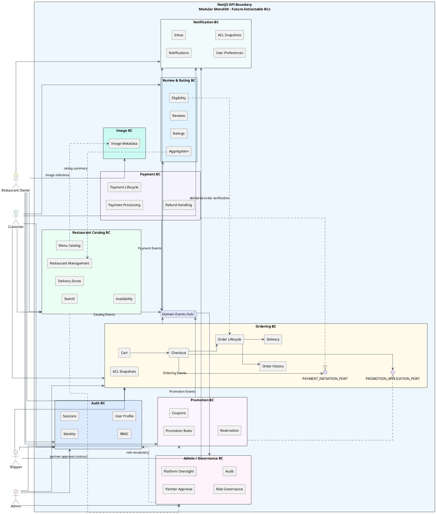
```plantuml
@startuml SoLi_Logical_View
skinparam backgroundColor #FFFFFF
skinparam shadowing false
skinparam componentStyle rectangle
skinparam packageStyle rectangle
skinparam defaultTextAlignment center
skinparam ArrowColor #334155
left to right direction
skinparam linetype ortho

actor Customer #DFF7E8
actor "Restaurant Owner" as RestaurantOwner #FFF4D6
actor Shipper #E7F0FF
actor Admin #FCE7F3

rectangle "NestJS API Boundary\nModular Monolith · Future-Extractable BCs" as Domain #EEF6FF {

  package "Auth BC" as AuthBC #DBEAFE {
    component "Identity" as AuthIdentity
    component "Sessions" as AuthSessions
    component "RBAC" as AuthRBAC
    component "User Profile" as AuthProfile
  }

  package "Restaurant Catalog BC" as CatalogBC #ECFDF5 {
    component "Restaurant Management" as CatalogRestaurant
    component "Menu Catalog" as CatalogMenu
    component "Search" as CatalogSearch
    component "Delivery Zones" as CatalogDeliveryZones
    component "Availability" as CatalogAvailability
  }

  package "Image BC" as ImageBC #CCFBF1 {
    component "Image Metadata" as ImageMeta
  }

  package "Ordering BC" as OrderingBC #FFFBEB {
    component "Cart" as OrderingCart
    component "Checkout" as OrderingCheckout
    component "Order Lifecycle" as OrderingLifecycle
    component "Delivery" as OrderingDelivery
    component "Order History" as OrderingHistory
    component "ACL Snapshots" as OrderingACL
    interface "PAYMENT_INITIATION_PORT" as PaymentPort #DDD6FE
    interface "PROMOTION_APPLICATION_PORT" as PromotionPort #E9D5FF
  }

  package "Payment BC" as PaymentBC #F5F3FF {
    component "Payment Processing" as PaymentProcessing
    component "Payment Lifecycle" as PaymentLifecycle
    component "Refund Handling" as PaymentRefunds
  }

  package "Promotion BC" as PromotionBC #FAF5FF {
    component "Promotion Rules" as PromotionRules
    component "Coupons" as PromotionCoupons
    component "Reservation" as PromotionReservation
  }

  package "Notification BC" as NotificationBC #F0FDFA {
    component "Notifications" as NotificationNotifications
    component "Inbox" as NotificationInbox
    component "User Preferences" as NotificationPrefs
    component "ACL Snapshots" as NotificationACL
  }

  package "Review & Rating BC" as ReviewBC #E0F2FE {
    component "Eligibility" as ReviewEligibility
    component "Reviews" as ReviewReviews
    component "Ratings" as ReviewRatings
    component "Aggregation" as ReviewAggregation
  }

  package "Admin / Governance BC" as GovernanceBC #FDF2F8 {
    component "Partner Approval" as GovernanceApproval
    component "Platform Oversight" as GovernanceOversight
    component "Role Governance" as GovernanceRole
    component "Audit" as GovernanceAudit
  }

  queue "Domain Events Hub" as DomainEvents #E0E7FF

  ' ── 2-column grid alignment (hidden links) ──────────────────────
  AuthBC         -[hidden]right-> CatalogBC
  ImageBC        -[hidden]right-> OrderingBC
  PaymentBC      -[hidden]right-> PromotionBC
  NotificationBC -[hidden]right-> ReviewBC

  AuthBC         -[hidden]down-> ImageBC
  CatalogBC      -[hidden]down-> OrderingBC
  ImageBC        -[hidden]down-> PaymentBC
  OrderingBC     -[hidden]down-> PromotionBC
  PaymentBC      -[hidden]down-> NotificationBC
  PromotionBC    -[hidden]down-> ReviewBC
  NotificationBC -[hidden]down-> GovernanceBC
  GovernanceBC   -[hidden]down-> DomainEvents
  OrderingHistory -[hidden]down-> PaymentPort
  PaymentPort    -[hidden]down-> PromotionPort

  ' ── Key intra-BC flow ───────────────────────────────────────────
  OrderingCart     --> OrderingCheckout
  OrderingCheckout --> OrderingLifecycle
  OrderingLifecycle --> OrderingDelivery
  OrderingLifecycle --> OrderingHistory

  ' ── Port usage (Ordering defines) · implementation (Payment / Promotion)
  OrderingCheckout --> PaymentPort
  OrderingCheckout --> PromotionPort
  PaymentBC        ..|> PaymentPort
  PromotionBC      ..|> PromotionPort

  ' ── Cross-BC contracts (dotted) ─────────────────────────────────
  CatalogMenu       ..> ImageMeta         : image reference
  ReviewEligibility ..> OrderingLifecycle  : delivered-order verification
  ReviewAggregation ..> CatalogRestaurant  : rating summary
  GovernanceBC      ..> AuthBC            : role vocabulary
  CatalogBC         ..> GovernanceBC      : partner approval contract

  ' ── Domain Events Hub (publishers → hub → consumers) ────────────
  CatalogBC   --> DomainEvents : Catalog Events
  OrderingBC  --> DomainEvents : Ordering Events
  PaymentBC   --> DomainEvents : Payment Events
  PromotionBC --> DomainEvents : Promotion Events
  DomainEvents --> NotificationBC
  DomainEvents --> ReviewBC
  DomainEvents --> GovernanceBC
}

' ── Actor → BC connections (BC level only) ───────────────────────
' ── Authentication (all authenticated actors) ────────────────────
Customer        --> AuthBC
RestaurantOwner --> AuthBC
Shipper         --> AuthBC
Admin           --> AuthBC

' ── Customer capabilities ────────────────────────────────────────
Customer        --> CatalogBC
Customer        --> OrderingBC
Customer        --> NotificationBC
Customer        --> ReviewBC

' ── Restaurant Owner capabilities ───────────────────────────────
RestaurantOwner --> CatalogBC
RestaurantOwner --> ImageBC
RestaurantOwner --> OrderingBC
RestaurantOwner --> PromotionBC
RestaurantOwner --> NotificationBC

' ── Shipper capabilities ─────────────────────────────────────────
Shipper --> OrderingBC
Shipper --> NotificationBC

' ── Admin capabilities ───────────────────────────────────────────
Admin --> GovernanceBC
Admin --> OrderingBC
Admin --> PromotionBC
@enduml
```

Giải thích:

- Auth BC cung cấp danh tính, session, role và profile cho tất cả actor.
- Restaurant Catalog BC sở hữu nhà hàng, menu, tìm kiếm, delivery zone và availability.
- Ordering BC sở hữu cart, checkout, order lifecycle, order history và snapshot cần thiết để đặt đơn.
- Payment BC xử lý giao dịch VNPay, trạng thái thanh toán và hoàn tiền.
- Promotion BC xử lý luật khuyến mãi, coupon và reservation trong checkout.
- Notification BC xử lý inbox, push, email, preference và delivery log.
- Review & Rating BC xử lý đánh giá sau giao hàng và tổng hợp rating.
- Admin/Governance BC xử lý phê duyệt đối tác, giám sát, vai trò và audit.

### 3.1.2 Runtime View

Runtime View mô tả các luồng động có ảnh hưởng lớn nhất đến tính đúng đắn của hệ thống: tạo đơn, đồng bộ dữ liệu xuyên bounded context, xử lý thanh toán và bù trừ, cùng vòng đời giao hàng đến review.

#### 3.1.2.1 Order Placement Runtime

**Hình 3.2.1. Order Placement Runtime**

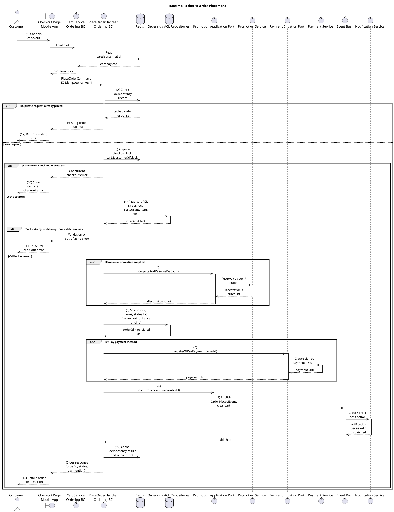
```plantuml
@startuml SoLi_Order_Placement_Runtime
skinparam shadowing false
skinparam sequenceMessageAlign center
skinparam responseMessageBelowArrow true
skinparam maxMessageSize 120
skinparam sequenceArrowThickness 1.5
skinparam ParticipantPadding 20
skinparam BoxPadding 10

title Runtime Packet 1: Order Placement

actor "Customer" as Actor
boundary "Checkout Page\nMobile App" as UI
control "Cart Service\nOrdering BC" as CartSvc
control "PlaceOrderHandler\nOrdering BC" as OrderSvc
database "Redis" as Redis
database "Ordering / ACL Repositories" as OrderRepo
control "Promotion Application Port" as PromPort
control "Promotion Service" as PromSvc
control "Payment Initiation Port" as PayPort
control "Payment Service" as PaySvc
control "Event Bus" as EventBus
control "Notification Service" as NotiSvc

autonumber stop

Actor -> UI : (1) Confirm checkout
UI -> CartSvc : Load cart
activate CartSvc
CartSvc -> Redis : Read cart:{customerId}
Redis --> CartSvc : cart payload
CartSvc --> UI : cart summary
deactivate CartSvc

UI -> OrderSvc : PlaceOrderCommand\n[X-Idempotency-Key?]
activate OrderSvc
OrderSvc -> Redis : (2) Check idempotency record

alt Duplicate request already placed
  Redis --> OrderSvc : cached order response
  OrderSvc --> UI : Existing order response
  deactivate OrderSvc
  UI --> Actor : (17) Return existing order
else New request
  OrderSvc -> Redis : (3) Acquire checkout lock\ncart:{customerId}:lock

  alt Concurrent checkout in progress
    OrderSvc --> UI : Concurrent checkout error
    deactivate OrderSvc
    UI --> Actor : (16) Show concurrent checkout error
  else Lock acquired
    OrderSvc -> OrderRepo : (4) Read cart ACL snapshots, restaurant, item, zone
    activate OrderRepo
    OrderRepo --> OrderSvc : checkout facts
    deactivate OrderRepo

    alt Cart, catalog, or delivery-zone validation fails
      OrderSvc --> UI : Validation or out-of-zone error
      deactivate OrderSvc
      UI --> Actor : (14-15) Show checkout error
    else Validation passed
      opt Coupon or promotion supplied
        OrderSvc -> PromPort : (5) computeAndReserveDiscount()
        activate PromPort
        PromPort -> PromSvc : Reserve coupon / quota
        activate PromSvc
        PromSvc --> PromPort : reservation + discount
        deactivate PromSvc
        PromPort --> OrderSvc : discount amount
        deactivate PromPort
      end

      OrderSvc -> OrderRepo : (6) Save order, items, status log\n(server-authoritative pricing)
      activate OrderRepo
      OrderRepo --> OrderSvc : orderId + persisted totals
      deactivate OrderRepo

      opt VNPay payment method
        OrderSvc -> PayPort : (7) initiateVNPayPayment(orderId)
        activate PayPort
        PayPort -> PaySvc : Create signed payment session
        activate PaySvc
        PaySvc --> PayPort : payment URL
        deactivate PaySvc
        PayPort --> OrderSvc : payment URL
        deactivate PayPort
      end

      OrderSvc -> PromPort : (8) confirmReservations(orderId)
      OrderSvc -> EventBus : (9) Publish OrderPlacedEvent; clear cart
      activate EventBus
      EventBus -> NotiSvc : Create order notification
      activate NotiSvc
      NotiSvc --> EventBus : notification persisted / dispatched
      deactivate NotiSvc
      EventBus --> OrderSvc : published
      deactivate EventBus
      OrderSvc -> Redis : (10) Cache idempotency result and release lock
      OrderSvc --> UI : Order response (orderId, status, paymentUrl?)
      deactivate OrderSvc
      UI --> Actor : (12) Return order confirmation
    end
  end
end

@enduml
```

- `Mục tiêu`: biến giỏ hàng tạm thời thành một order bền vững, đúng giá, đúng vùng giao và không bị tạo lặp.
- `Luồng xử lý`: checkout đọc cart từ Redis, lấy snapshot nhà hàng và menu ở Ordering BC, kiểm tra điều kiện giao hàng, áp dụng khuyến mãi, ghi order cùng order items vào PostgreSQL, sau đó mới khởi tạo các tác vụ phụ như thanh toán VNPay và thông báo.
- `Vai trò EventBus`: EventBus tách phần “tạo đơn” khỏi các phản ứng sau commit như notification, giúp luồng đặt đơn giữ trọng tâm vào transaction chính thay vì gọi chồng nhiều service phụ thuộc trực tiếp.
- `Vai trò Redis`: Redis giữ cart, khóa checkout và kết quả idempotency. Nhờ vậy request retry hoặc double-tap ở giao diện không làm phát sinh nhiều order khác nhau cho cùng một cart.
- `Vai trò Idempotency`: idempotency key là lớp bảo vệ ở cạnh request, còn `UNIQUE(cart_id)` là lớp bảo vệ ở cạnh persistence. Hai lớp này kết hợp để giảm rủi ro trùng đơn khi mạng chập chờn hoặc người dùng gửi lại yêu cầu.
- `Kết luận`: runtime packet này thể hiện rõ triết lý của SoLi ở luồng trọng yếu nhất: dữ liệu runtime ở Redis, dữ liệu nghiệp vụ bền vững ở PostgreSQL, còn side effects được trì hoãn đến sau khi order đã ổn định.

#### 3.1.2.2 Event & ACL Synchronization Runtime

**Hình 3.2.2. Event & ACL Synchronization Runtime**

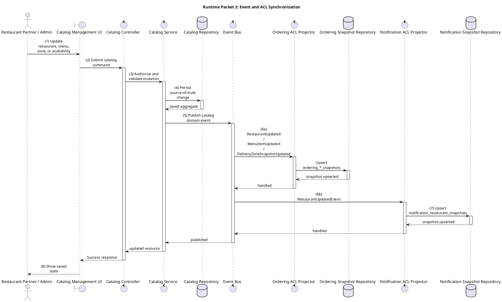
```plantuml
@startuml SoLi_Event_ACL_Synchronization_Runtime
skinparam shadowing false
skinparam sequenceMessageAlign center
skinparam responseMessageBelowArrow true
skinparam maxMessageSize 120
skinparam sequenceArrowThickness 1.5
skinparam ParticipantPadding 20
skinparam BoxPadding 10

title Runtime Packet 2: Event and ACL Synchronization

actor "Restaurant Partner / Admin" as Actor
boundary "Catalog Management UI" as UI
control "Catalog Controller" as CatalogController
control "Catalog Service" as CatalogService
database "Catalog Repository" as CatalogRepo
control "Event Bus" as EventBus
control "Ordering ACL Projector" as OrderingProjector
database "Ordering Snapshot Repository" as OrderingAclRepo
control "Notification ACL Projector" as NotificationProjector
database "Notification Snapshot Repository" as NotificationRepo

autonumber stop

Actor -> UI : (1) Update restaurant, menu, zone, or availability
UI -> CatalogController : (2) Submit catalog command
activate CatalogController
CatalogController -> CatalogService : (3) Authorize and validate mutation
activate CatalogService
CatalogService -> CatalogRepo : (4) Persist source-of-truth change
activate CatalogRepo
CatalogRepo --> CatalogService : saved aggregate
deactivate CatalogRepo

CatalogService -> EventBus : (5) Publish catalog domain event
activate EventBus

EventBus -> OrderingProjector : (6a) RestaurantUpdated / MenuItemUpdated / DeliveryZoneSnapshotUpdated
activate OrderingProjector
OrderingProjector -> OrderingAclRepo : Upsert ordering_*_snapshots
activate OrderingAclRepo
OrderingAclRepo --> OrderingProjector : snapshot upserted
deactivate OrderingAclRepo
OrderingProjector --> EventBus : handled
deactivate OrderingProjector

EventBus -> NotificationProjector : (6b) RestaurantUpdatedEvent
activate NotificationProjector
NotificationProjector -> NotificationRepo : (7) Upsert notification_restaurant_snapshots
activate NotificationRepo
NotificationRepo --> NotificationProjector : snapshot upserted
deactivate NotificationRepo
NotificationProjector --> EventBus : handled
deactivate NotificationProjector

EventBus --> CatalogService : published
deactivate EventBus
CatalogService --> CatalogController : updated resource
deactivate CatalogService
CatalogController --> UI : Success response
deactivate CatalogController
UI --> Actor : (8) Show saved state
@enduml
```

- `Mục tiêu`: bảo đảm Ordering và Notification có dữ liệu cục bộ đủ dùng cho các quyết định runtime mà không phải phụ thuộc trực tiếp vào bảng của Restaurant Catalog.
- `Luồng xử lý`: sau khi Catalog lưu thay đổi của restaurant, menu hoặc delivery zone, hệ thống phát domain event; các projector trong Ordering và Notification nhận sự kiện rồi cập nhật snapshot nội bộ của chính bounded context đó.
- `Vai trò ACL Snapshot`: snapshot là lớp read model cục bộ, chỉ giữ đúng phần dữ liệu downstream cần. Ordering cần tên nhà hàng, trạng thái mở/đóng, menu item và delivery zone để checkout; Notification cần owner routing data để chuyển đúng thông báo.
- `Eventual Consistency`: dữ liệu giữa source context và consumer context không đồng bộ tuyệt đối từng mili giây, nhưng được đồng bộ đủ nhanh cho các luồng nghiệp vụ. Đổi lại, checkout không cần cross-BC join và notification không phải gọi ngược về Catalog trong thời điểm phát sinh sự kiện.
- `Kết luận`: runtime packet này cho thấy SoLi ưu tiên ranh giới domain và độ ổn định của checkout hơn việc truy cập trực tiếp dữ liệu nguồn ở mọi nơi.

#### 3.1.2.3 Payment & Compensation Runtime

**Hình 3.2.3. Payment & Compensation Runtime**

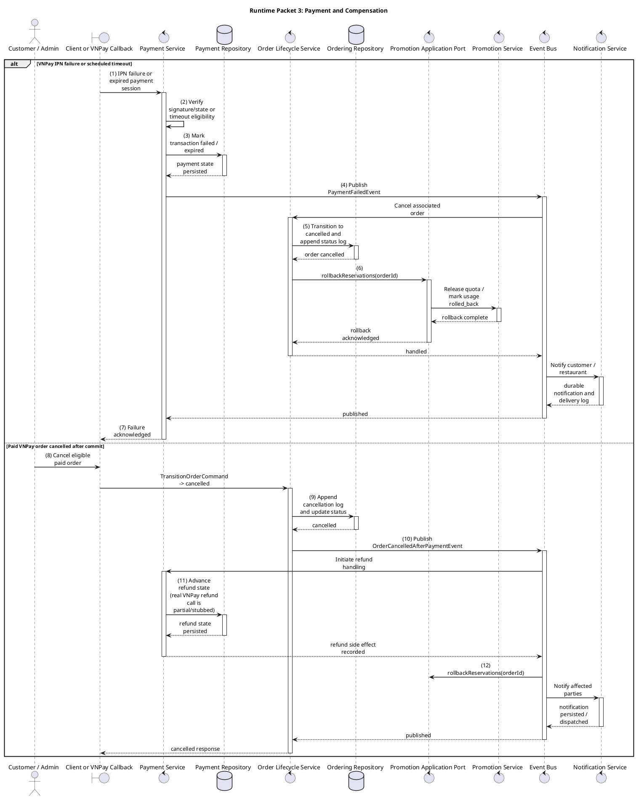
```plantuml
@startuml SoLi_Payment_Compensation_Runtime
skinparam shadowing false
skinparam sequenceMessageAlign center
skinparam responseMessageBelowArrow true
skinparam maxMessageSize 120
skinparam sequenceArrowThickness 1.5
skinparam ParticipantPadding 20
skinparam BoxPadding 10

title Runtime Packet 3: Payment and Compensation

actor "Customer / Admin" as Actor
boundary "Client or VNPay Callback" as Boundary
control "Payment Service" as PaySvc
database "Payment Repository" as PayRepo
control "Order Lifecycle Service" as OrderSvc
database "Ordering Repository" as OrderRepo
control "Promotion Application Port" as PromPort
control "Promotion Service" as PromSvc
control "Event Bus" as EventBus
control "Notification Service" as NotiSvc

autonumber stop

alt VNPay IPN failure or scheduled timeout
  Boundary -> PaySvc : (1) IPN failure or expired payment session
  activate PaySvc
  PaySvc -> PaySvc : (2) Verify signature/state or timeout eligibility
  PaySvc -> PayRepo : (3) Mark transaction failed / expired
  activate PayRepo
  PayRepo --> PaySvc : payment state persisted
  deactivate PayRepo
  PaySvc -> EventBus : (4) Publish PaymentFailedEvent
  activate EventBus
  EventBus -> OrderSvc : Cancel associated order
  activate OrderSvc
  OrderSvc -> OrderRepo : (5) Transition to cancelled and append status log
  activate OrderRepo
  OrderRepo --> OrderSvc : order cancelled
  deactivate OrderRepo
  OrderSvc -> PromPort : (6) rollbackReservations(orderId)
  activate PromPort
  PromPort -> PromSvc : Release quota / mark usage rolled_back
  activate PromSvc
  PromSvc --> PromPort : rollback complete
  deactivate PromSvc
  PromPort --> OrderSvc : rollback acknowledged
  deactivate PromPort
  OrderSvc --> EventBus : handled
  deactivate OrderSvc
  EventBus -> NotiSvc : Notify customer / restaurant
  activate NotiSvc
  NotiSvc --> EventBus : durable notification and delivery log
  deactivate NotiSvc
  EventBus --> PaySvc : published
  deactivate EventBus
  PaySvc --> Boundary : (7) Failure acknowledged
  deactivate PaySvc
else Paid VNPay order cancelled after commit
  Actor -> Boundary : (8) Cancel eligible paid order
  Boundary -> OrderSvc : TransitionOrderCommand -> cancelled
  activate OrderSvc
  OrderSvc -> OrderRepo : (9) Append cancellation log and update status
  activate OrderRepo
  OrderRepo --> OrderSvc : cancelled
  deactivate OrderRepo
  OrderSvc -> EventBus : (10) Publish OrderCancelledAfterPaymentEvent
  activate EventBus
  EventBus -> PaySvc : Initiate refund handling
  activate PaySvc
  PaySvc -> PayRepo : (11) Advance refund state\n(real VNPay refund call is partial/stubbed)
  activate PayRepo
  PayRepo --> PaySvc : refund state persisted
  deactivate PayRepo
  PaySvc --> EventBus : refund side effect recorded
  deactivate PaySvc
  EventBus -> PromPort : (12) rollbackReservations(orderId)
  EventBus -> NotiSvc : Notify affected parties
  activate NotiSvc
  NotiSvc --> EventBus : notification persisted / dispatched
  deactivate NotiSvc
  EventBus --> OrderSvc : published
  deactivate EventBus
  OrderSvc --> Boundary : cancelled response
  deactivate OrderSvc
end
@enduml
```

- `Mục tiêu`: giữ cho trạng thái order, payment transaction, promotion usage và notification không bị lệch nhau khi thanh toán thất bại, hết hạn hoặc đơn đã thanh toán bị hủy.
- `Payment Success`: khi VNPay callback hợp lệ và transaction được xác minh thành công, Payment BC cập nhật transaction sang trạng thái hoàn tất, sau đó luồng Ordering có thể chuyển order VNPay từ chờ thanh toán sang đã thanh toán để tiếp tục vòng đời xử lý.
- `Payment Failure`: nhánh đầu của sơ đồ cho thấy callback thất bại hoặc timeout không dừng ở Payment BC. Sau khi transaction bị đánh dấu failed/expired, hệ thống phát sự kiện để Ordering hủy đơn liên quan, tránh giữ lại một order chờ xử lý nhưng không còn khả năng thanh toán hợp lệ.
- `Compensation Flow`: nếu một đơn đã thanh toán bị hủy về sau, hệ thống kích hoạt hoàn tác gồm refund state ở Payment BC, rollback reservation ở Promotion BC và thông báo cho các bên liên quan. Đây là phần quan trọng để giữ cho dữ liệu tài chính và ưu đãi không bị “mắc kẹt” sau một quyết định hủy đơn.
- `Kết luận`: runtime packet này thể hiện tư duy thiết kế bù trừ của SoLi: không cố ép mọi thứ vào một transaction xuyên module, mà dùng state machine cộng với sự kiện hậu xử lý để đạt tính nhất quán nghiệp vụ.

#### 3.1.2.4 Delivery & Review Runtime

**Hình 3.2.4. Delivery & Review Runtime**

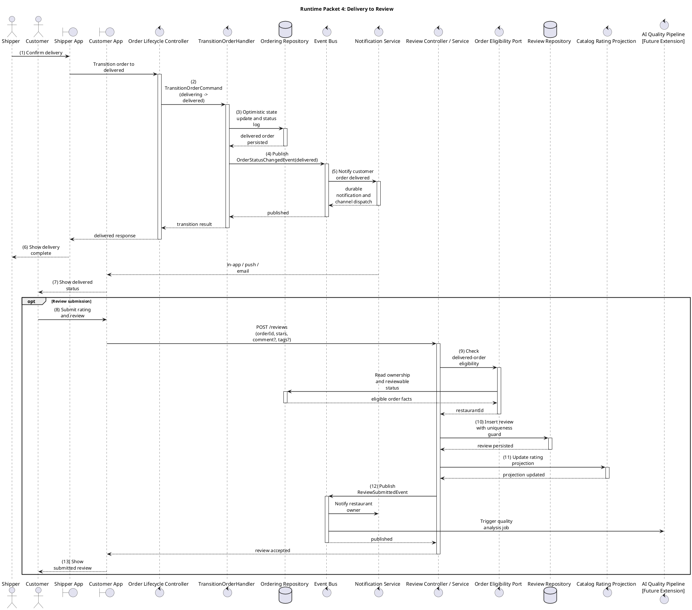
```plantuml
@startuml SoLi_Delivery_Review_Runtime
skinparam shadowing false
skinparam sequenceMessageAlign center
skinparam responseMessageBelowArrow true
skinparam maxMessageSize 120
skinparam sequenceArrowThickness 1.5
skinparam ParticipantPadding 20
skinparam BoxPadding 10

title Runtime Packet 4: Delivery to Review

actor "Shipper" as Shipper
actor "Customer" as Customer
boundary "Shipper App" as ShipUI
boundary "Customer App" as CustUI
control "Order Lifecycle Controller" as LifecycleController
control "TransitionOrderHandler" as TransitionHandler
database "Ordering Repository" as OrderRepo
control "Event Bus" as EventBus
control "Notification Service" as Notification
control "Review Controller / Service" as ReviewService
control "Order Eligibility Port" as ReviewEligibility
database "Review Repository" as ReviewRepo
control "Catalog Rating Projection" as Catalog
control "AI Quality Pipeline\n[Future Extension]" as AIPipeline

autonumber stop

Shipper -> ShipUI : (1) Confirm delivery
ShipUI -> LifecycleController : Transition order to delivered
activate LifecycleController
LifecycleController -> TransitionHandler : (2) TransitionOrderCommand\n(delivering -> delivered)
activate TransitionHandler
TransitionHandler -> OrderRepo : (3) Optimistic state update and status log
activate OrderRepo
OrderRepo --> TransitionHandler : delivered order persisted
deactivate OrderRepo
TransitionHandler -> EventBus : (4) Publish OrderStatusChangedEvent(delivered)
activate EventBus
EventBus -> Notification : (5) Notify customer order delivered
activate Notification
Notification --> EventBus : durable notification and channel dispatch
deactivate Notification
EventBus --> TransitionHandler : published
deactivate EventBus
TransitionHandler --> LifecycleController : transition result
deactivate TransitionHandler
LifecycleController --> ShipUI : delivered response
deactivate LifecycleController
ShipUI --> Shipper : (6) Show delivery complete
Notification --> CustUI : in-app / push / email
CustUI --> Customer : (7) Show delivered status

opt Review submission
  Customer -> CustUI : (8) Submit rating and review
  CustUI -> ReviewService : POST /reviews\n(orderId, stars, comment?, tags?)
  activate ReviewService
  ReviewService -> ReviewEligibility : (9) Check delivered-order eligibility
  activate ReviewEligibility
  ReviewEligibility -> OrderRepo : Read ownership and reviewable status
  activate OrderRepo
  OrderRepo --> ReviewEligibility : eligible order facts
  deactivate OrderRepo
  ReviewEligibility --> ReviewService : restaurantId
  deactivate ReviewEligibility
  ReviewService -> ReviewRepo : (10) Insert review with uniqueness guard
  activate ReviewRepo
  ReviewRepo --> ReviewService : review persisted
  deactivate ReviewRepo
  ReviewService -> Catalog : (11) Update rating projection
  activate Catalog
  Catalog --> ReviewService : projection updated
  deactivate Catalog
  ReviewService -> EventBus : (12) Publish ReviewSubmittedEvent
  activate EventBus
  EventBus -> Notification : Notify restaurant owner
  EventBus -> AIPipeline : Trigger quality analysis job
  EventBus --> ReviewService : published
  deactivate EventBus
  ReviewService --> CustUI : review accepted
  deactivate ReviewService
  CustUI --> Customer : (13) Show submitted review
end
@enduml
```

- `Mục tiêu`: nối trạng thái giao hàng hoàn tất với vòng phản hồi sau giao hàng, để review trở thành một phần của lifecycle dịch vụ chứ không chỉ là tính năng bổ sung ở giao diện.
- `Delivery Lifecycle`: shipper xác nhận giao thành công, Ordering cập nhật trạng thái bằng optimistic locking, ghi order status log và phát sự kiện để Notification thông báo cho khách hàng. Nhờ đó, cột mốc `delivered` được ghi nhận rõ ràng trước khi hệ thống mở quyền đánh giá.
- `Review Eligibility`: Review BC không tự đọc tùy ý toàn bộ nghiệp vụ Ordering mà đi qua một contract kiểm tra eligibility. Contract này xác nhận order tồn tại, thuộc về đúng customer và đã đi đến trạng thái cho phép review trước khi Review BC chấp nhận ghi nhận phản hồi.
- `Future AI Integration`: sau khi review được lưu và rating projection được cập nhật, `ReviewSubmittedEvent` là điểm móc tự nhiên để kích hoạt AI Quality Pipeline. Pipeline này có thể đọc comment, stars, tags và ảnh review mở rộng trong tương lai, sinh quality report rồi đẩy về dashboard cho nhà hàng và quản trị viên.
- `Kết luận`: runtime packet cuối cùng cho thấy SoLi khép kín vòng phản hồi dịch vụ: từ giao hàng, thông báo, đánh giá đến phân tích chất lượng. Đây là nền tảng tốt để AI gắn vào hệ thống như một lớp tăng cường giá trị sau giao dịch.

### 3.1.3 Implementation View

Implementation View ánh xạ các quyết định kiến trúc vào cấu trúc mã nguồn. Mỗi bounded context có chuỗi controller, service, repository và schema tương ứng. Các provider bên ngoài như VNPay, Cloudinary, FCM và SMTP được đặt ở lớp adapter/provider thay vì trộn trực tiếp vào core business flow.

**Hình 3.3. Implementation View**

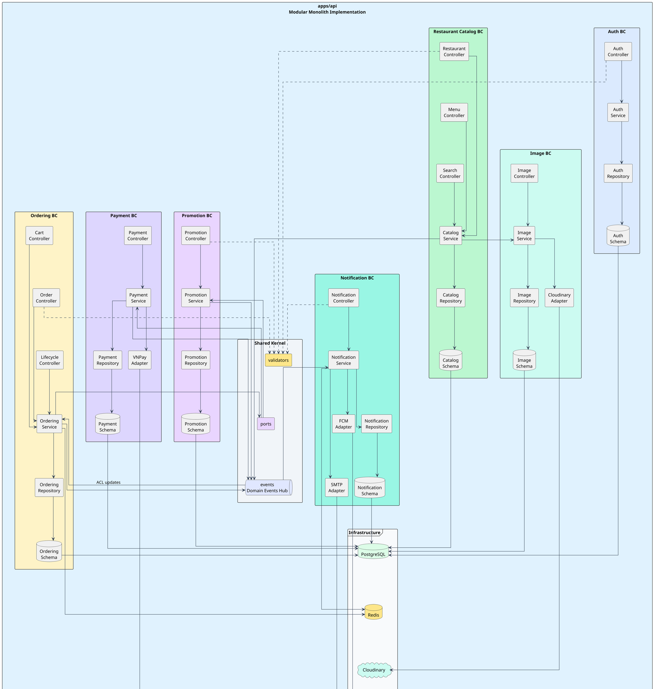
```plantuml
@startuml SoLi_Implementation_View
skinparam backgroundColor #FFFFFF
skinparam shadowing false
skinparam componentStyle rectangle
skinparam packageStyle rectangle
skinparam defaultTextAlignment center
skinparam ArrowColor #334155
skinparam linetype ortho
top to bottom direction
skinparam ranksep 135
skinparam nodesep 20
skinparam dpi 180
rectangle "apps/api\nModular Monolith Implementation" as Api #E0F2FE {
  together {
    package "Auth BC" as AuthBC #DBEAFE {
      component "Auth\nController" as AuthController
      component "Auth\nService" as AuthService
      component "Auth\nRepository" as AuthRepository
      database "Auth\nSchema" as AuthSchema

      AuthController -[hidden]down-> AuthService
      AuthService -[hidden]down-> AuthRepository
      AuthRepository -[hidden]down-> AuthSchema
    }

    package "Restaurant Catalog BC" as CatalogBC #BBF7D0 {
      component "Restaurant\nController" as RestaurantController
      component "Menu\nController" as MenuController
      component "Search\nController" as SearchController
      component "Catalog\nService" as CatalogService
      component "Catalog\nRepository" as CatalogRepository
      database "Catalog\nSchema" as CatalogSchema

      RestaurantController -[hidden]down-> MenuController
      MenuController -[hidden]down-> SearchController
      SearchController -[hidden]down-> CatalogService
      CatalogService -[hidden]down-> CatalogRepository
      CatalogRepository -[hidden]down-> CatalogSchema
    }

    package "Image BC" as ImageBC #CCFBF1 {
      component "Image\nController" as ImageController
      component "Image\nService" as ImageService
      component "Image\nRepository" as ImageRepository
      database "Image\nSchema" as ImageSchema
      component "Cloudinary\nAdapter" as CloudinaryAdapter

      ImageController -[hidden]down-> ImageService
      ImageService -[hidden]down-> ImageRepository
      ImageRepository -[hidden]down-> ImageSchema
      ImageService -[hidden]right-> CloudinaryAdapter
    }

    AuthBC -[hidden]right-> CatalogBC
    CatalogBC -[hidden]right-> ImageBC
  }

  together {
    package "Ordering BC" as OrderingBC #FEF3C7 {
      component "Cart\nController" as CartController
      component "Order\nController" as OrderController
      component "Lifecycle\nController" as LifecycleController
      component "Ordering\nService" as OrderingService
      component "Ordering\nRepository" as OrderingRepository
      database "Ordering\nSchema" as OrderingSchema

      CartController -[hidden]down-> OrderController
      OrderController -[hidden]down-> LifecycleController
      LifecycleController -[hidden]down-> OrderingService
      OrderingService -[hidden]down-> OrderingRepository
      OrderingRepository -[hidden]down-> OrderingSchema
    }

    package "Payment BC" as PaymentBC #DDD6FE {
      component "Payment\nController" as PaymentController
      component "Payment\nService" as PaymentService
      component "Payment\nRepository" as PaymentRepository
      database "Payment\nSchema" as PaymentSchema
      component "VNPay\nAdapter" as VNPayAdapter

      PaymentController -[hidden]down-> PaymentService
      PaymentService -[hidden]down-> PaymentRepository
      PaymentRepository -[hidden]down-> PaymentSchema
      PaymentService -[hidden]right-> VNPayAdapter
    }

    package "Promotion BC" as PromotionBC #E9D5FF {
      component "Promotion\nController" as PromotionController
      component "Promotion\nService" as PromotionService
      component "Promotion\nRepository" as PromotionRepository
      database "Promotion\nSchema" as PromotionSchema

      PromotionController -[hidden]down-> PromotionService
      PromotionService -[hidden]down-> PromotionRepository
      PromotionRepository -[hidden]down-> PromotionSchema
    }

    OrderingBC -[hidden]right-> PaymentBC
    PaymentBC -[hidden]right-> PromotionBC
  }

  together {
    package "Notification BC" as NotificationBC #99F6E4 {
      component "Notification\nController" as NotificationController
      component "Notification\nService" as NotificationService
      component "Notification\nRepository" as NotificationRepository
      database "Notification\nSchema" as NotificationSchema
      component "FCM\nAdapter" as FCMAdapter
      component "SMTP\nAdapter" as SMTPAdapter

      NotificationController -[hidden]down-> NotificationService
      NotificationService -[hidden]down-> NotificationRepository
      NotificationRepository -[hidden]down-> NotificationSchema
      NotificationService -[hidden]right-> FCMAdapter
      FCMAdapter -[hidden]down-> SMTPAdapter
    }

    package "Shared Kernel" as SharedKernel #F1F5F9 {
      component "validators" as SharedValidators #FDE68A
      component "ports" as SharedPorts #E9D5FF
      queue "events\nDomain Events Hub" as DomainEventsHub #E0E7FF

      SharedValidators -[hidden]down-> SharedPorts
      SharedPorts -[hidden]down-> DomainEventsHub
    }

    frame "Infrastructure" as Infrastructure #F8FAFC {
      database "PostgreSQL" as Postgres #DCFCE7
      database "Redis" as Redis #FDE68A
      cloud "Cloudinary" as ExtCloudinary #CCFBF1
      cloud "VNPay" as ExtVNPay #DDD6FE
      cloud "FCM" as ExtFCM #DCFCE7
      cloud "SMTP" as ExtSMTP #F5F5F4

      Postgres -[hidden]down-> Redis
      Redis -[hidden]down-> ExtCloudinary
      ExtCloudinary -[hidden]down-> ExtVNPay
      ExtVNPay -[hidden]down-> ExtFCM
      ExtFCM -[hidden]down-> ExtSMTP
    }

    NotificationBC -[hidden]right-> SharedKernel
    SharedKernel -[hidden]right-> Infrastructure
  }

  AuthBC -[hidden]down-> OrderingBC
  CatalogBC -[hidden]down-> PaymentBC
  ImageBC -[hidden]down-> PromotionBC
  OrderingBC -[hidden]down-> NotificationBC
  PaymentBC -[hidden]down-> SharedKernel
  PromotionBC -[hidden]down-> Infrastructure
}

AuthController --> AuthService
AuthController ..> SharedValidators
AuthService --> AuthRepository
AuthRepository --> AuthSchema
AuthSchema -down-> Postgres

RestaurantController --> CatalogService
MenuController --> CatalogService
SearchController --> CatalogService
RestaurantController ..> SharedValidators
CatalogService --> CatalogRepository
CatalogRepository --> CatalogSchema
CatalogSchema -down-> Postgres
CatalogService -right-> ImageService
CatalogService -down-> DomainEventsHub

ImageController --> ImageService
ImageService --> ImageRepository
ImageRepository --> ImageSchema
ImageSchema -down-> Postgres
ImageService --> CloudinaryAdapter
CloudinaryAdapter -down-> ExtCloudinary

CartController --> OrderingService
OrderController --> OrderingService
LifecycleController --> OrderingService
OrderController ..> SharedValidators
OrderingService --> OrderingRepository
OrderingRepository --> OrderingSchema
OrderingSchema -down-> Postgres
OrderingService -right-> SharedPorts
OrderingService -down-> Redis
OrderingService -down-> DomainEventsHub

PaymentController --> PaymentService
PaymentService --> PaymentRepository
PaymentRepository --> PaymentSchema
PaymentSchema -down-> Postgres
PaymentService --> VNPayAdapter
VNPayAdapter -down-> ExtVNPay
PaymentService -down-> DomainEventsHub

PromotionController --> PromotionService
PromotionController ..> SharedValidators
PromotionService --> PromotionRepository
PromotionRepository --> PromotionSchema
PromotionSchema -down-> Postgres
PromotionService -down-> DomainEventsHub

NotificationController --> NotificationService
NotificationController ..> SharedValidators
NotificationService --> NotificationRepository
NotificationRepository --> NotificationSchema
NotificationSchema -down-> Postgres
NotificationService -down-> Redis
NotificationService --> FCMAdapter
NotificationService --> SMTPAdapter
FCMAdapter -down-> ExtFCM
SMTPAdapter -down-> ExtSMTP

SharedPorts -up-> PaymentService
SharedPorts -up-> PromotionService

DomainEventsHub -left-> NotificationService
DomainEventsHub -left-> OrderingService : ACL updates
@enduml
```

Giải thích:

- `apps/api/src/module/auth` quản lý identity/session/role.
- `apps/api/src/module/restaurant-catalog` quản lý restaurant, menu, search, modifiers và delivery zones.
- `apps/api/src/module/ordering` quản lý cart, checkout, order, lifecycle, order history, analytics và ACL snapshots.
- `apps/api/src/module/payment` quản lý payment transaction, VNPay service, IPN handler và refund event handler.
- `apps/api/src/module/promotion` quản lý promotion, coupon, usage và pricing engine.
- `apps/api/src/module/notification` quản lý notification, preferences, device token, channel dispatcher, gateway và delivery log.
- `apps/api/src/module/review` quản lý review submission và rating data.
- `apps/web`, `apps/admin` và `apps/mobile` là ba client application tương ứng với restaurant portal, admin portal và customer mobile app.

### 3.1.4 Data View

Data View trình bày cách dữ liệu được sở hữu và lưu trữ. PostgreSQL là database bền vững chính, Redis là lớp runtime state, còn Cloudinary là nơi lưu trữ media asset. Các bảng được nhóm theo bounded context để tránh một module đọc/ghi tùy tiện dữ liệu thuộc module khác.

**Hình 3.4. Data View**


```plantuml
@startuml SoLi_Data_View
skinparam backgroundColor #FFFFFF
skinparam shadowing false
skinparam packageStyle rectangle
skinparam defaultTextAlignment left
skinparam ArrowColor #334155
skinparam linetype ortho
skinparam classAttributeIconSize 0
hide circle
hide methods
left to right direction

package "PostgreSQL\nsingle physical database\nlogical schemas grouped by BC ownership" as PG #DCFCE7 {
  package "AUTH" as DAuth #DBEAFE {
    entity "user" as users {
      *id : uuid
      --
      email : text
      name : text
      role : text
      banned : boolean
      createdAt : timestamp
    }

    entity "session" as sessions {
      *id : uuid
      --
      userId : uuid
      token : text
      expiresAt : timestamp
      ipAddress : text
    }

    entity "account" as accounts {
      *id : uuid
      --
      userId : uuid
      providerId : text
      accountId : text
      password : text
    }

    entity "verification" as verifications {
      *id : uuid
      --
      identifier : text
      value : text
      expiresAt : timestamp
    }
  }

  package "RESTAURANT_CATALOG" as DCatalog #BBF7D0 {
    entity "restaurants" as restaurants {
      *id : uuid
      --
      ownerId : uuid
      name : text
      isOpen : boolean
      isApproved : boolean
      latitude : double
      longitude : double
    }

    entity "delivery_zones" as delivery_zones {
      *id : uuid
      --
      restaurantId : uuid
      radiusKm : double
      baseFee : integer
      perKmRate : integer
      isActive : boolean
    }

    entity "menu_categories" as menu_categories {
      *id : uuid
      --
      restaurantId : uuid
      name : text
      displayOrder : integer
    }

    entity "menu_items" as menu_items {
      *id : uuid
      --
      restaurantId : uuid
      categoryId : uuid
      name : text
      price : integer
      status : enum
      imageUrl : text
    }

    entity "modifier_groups" as modifier_groups {
      *id : uuid
      --
      menuItemId : uuid
      name : text
      minSelections : integer
      maxSelections : integer
    }

    entity "modifier_options" as modifier_options {
      *id : uuid
      --
      groupId : uuid
      name : text
      price : integer
      isAvailable : boolean
    }
  }

  package "IMAGE" as DImage #CCFBF1 {
    entity "images" as images {
      *id : uuid
      --
      publicId : text
      secureUrl : text
      width : integer
      height : integer
      createdAt : timestamp
    }
  }

  package "ORDERING" as DOrdering #FEF3C7 {
    entity "orders" as orders {
      *id : uuid
      --
      customerId : uuid
      restaurantId : uuid
      cartId : uuid
      status : enum
      totalAmount : integer
      paymentMethod : enum
      shipperId : uuid
      version : integer
    }

    entity "order_items" as order_items {
      *id : uuid
      --
      orderId : uuid
      menuItemId : uuid
      itemName : text
      unitPrice : integer
      quantity : integer
      subtotal : integer
    }

    entity "order_status_logs" as order_status_logs {
      *id : uuid
      --
      orderId : uuid
      fromStatus : enum
      toStatus : enum
      triggeredByRole : enum
      createdAt : timestamp
    }

    entity "app_settings" as app_settings {
      *key : text
      --
      value : text
      description : text
      updatedAt : timestamp
    }

    entity "ordering_restaurant_snapshots" as ordering_restaurant_snapshots {
      *restaurantId : uuid
      --
      ownerId : uuid
      name : text
      isOpen : boolean
      isApproved : boolean
      lastSyncedAt : timestamp
    }

    entity "ordering_menu_item_snapshots" as ordering_menu_item_snapshots {
      *menuItemId : uuid
      --
      restaurantId : uuid
      name : text
      price : integer
      status : enum
      lastSyncedAt : timestamp
    }

    entity "ordering_delivery_zone_snapshots" as ordering_delivery_zone_snapshots {
      *zoneId : uuid
      --
      restaurantId : uuid
      radiusKm : double
      baseFee : integer
      perKmRate : integer
      isActive : boolean
    }
  }

  package "PAYMENT" as DPayment #DDD6FE {
    entity "payment_transactions" as payment_transactions {
      *id : uuid
      --
      orderId : uuid
      customerId : uuid
      amount : integer
      status : enum
      providerTxnId : text
      expiresAt : timestamp
      version : integer
    }
  }

  package "PROMOTION" as DPromotion #E9D5FF {
    entity "promotions" as promotions {
      *id : uuid
      --
      restaurantId : uuid
      scope : enum
      status : enum
      trigger : enum
      discountValue : integer
      currentTotalUses : integer
      version : integer
    }

    entity "coupon_codes" as coupon_codes {
      *id : uuid
      --
      promotionId : uuid
      code : text
      status : enum
      maxUses : integer
      currentUses : integer
    }

    entity "promotion_usages" as promotion_usages {
      *id : uuid
      --
      promotionId : uuid
      couponCodeId : uuid
      orderId : uuid
      customerId : uuid
      discountAmount : integer
      status : enum
    }
  }

  package "NOTIFICATION" as DNotification #99F6E4 {
    entity "notifications" as notifications {
      *id : uuid
      --
      recipientId : uuid
      type : enum
      channel : enum
      status : enum
      orderId : uuid
      idempotencyKey : text
    }

    entity "notification_preferences" as notification_preferences {
      *id : uuid
      --
      userId : uuid
      pushEnabled : boolean
      inAppEnabled : boolean
      emailEnabled : boolean
      mutedTypes : jsonb
    }

    entity "device_tokens" as device_tokens {
      *id : uuid
      --
      userId : uuid
      token : text
      platform : enum
      isActive : boolean
      lastSeenAt : timestamp
    }

    entity "notification_delivery_logs" as notification_delivery_logs {
      *id : uuid
      --
      notificationId : uuid
      channel : enum
      status : enum
      attemptNumber : integer
      errorCode : text
    }

    entity "notification_restaurant_snapshots" as notification_restaurant_snapshots {
      *restaurantId : uuid
      --
      ownerId : uuid
      name : text
      lastSyncedAt : timestamp
    }
  }

  package "REVIEW" as DReview #E0F2FE {
    entity "reviews" as reviews {
      *id : uuid
      --
      orderId : uuid
      customerId : uuid
      restaurantId : uuid
      stars : smallint
      moderationStatus : text
    }
  }

  package "GOVERNANCE_ADMIN\n(no dedicated PostgreSQL tables in current build)" as DAdmin #FDF2F8 {
  }
}

package "SHARED_STATE\nRedis / Valkey" as DShared #FDE68A {
  entity "cart:{customerId}" as cart_state <<redis>> {
    *customerId : uuid
    --
    restaurantId : uuid
    items : json
    totals : json
    ttlSeconds : integer
  }

  entity "cart:{customerId}:lock" as checkout_locks <<redis>> {
    *customerId : uuid
    --
    lockToken : text
    ttlSeconds : integer
  }

  entity "idempotency:order:{key}" as order_idempotency_keys <<redis>> {
    *key : text
    --
    orderId : uuid
    responseBody : json
    ttlSeconds : integer
  }

  entity "ws:connections:{userId}" as ws_presence <<redis>> {
    *userId : uuid
    --
    connectionCount : integer
    heartbeatTtl : integer
  }

  entity "rate-limit buckets\n[Planned]" as rate_limit_buckets <<planned>> {
    *bucketKey : text
    --
    windowStart : timestamp
    count : integer
    ttlSeconds : integer
  }
}

package "EXTERNAL_DATA_OWNERS" as DExternal #F5F3FF {
  entity "VNPay gateway" as vnpay_gateway <<external>> {
    *providerTxnId : text
    --
    amount : integer
    responseCode : text
    ipnPayload : json
  }

  entity "Cloudinary assets" as cloudinary_assets <<external>> {
    *publicId : text
    --
    secureUrl : text
    width : integer
    height : integer
  }

  entity "FCM delivery" as fcm_delivery <<external>> {
    *registrationToken : text
    --
    platform : text
    deliveryStatus : text
  }

  entity "SMTP delivery" as smtp_delivery <<external>> {
    *messageId : text
    --
    recipientEmail : text
    deliveryStatus : text
  }
}

DAuth -[hidden]right-> DCatalog
DImage -[hidden]right-> DOrdering
DPayment -[hidden]right-> DPromotion
DNotification -[hidden]right-> DReview
DAdmin -[hidden]right-> DShared
DShared -[hidden]right-> DExternal
DAuth -[hidden]down-> DImage
DCatalog -[hidden]down-> DOrdering
DImage -[hidden]down-> DPayment
DOrdering -[hidden]down-> DPromotion
DPayment -[hidden]down-> DNotification
DPromotion -[hidden]down-> DReview
DNotification -[hidden]down-> DAdmin

users ||--o{ sessions : userId
users ||--o{ accounts : userId
verifications }o..|| users : identifier / email

users ||..o{ restaurants : ownerId
restaurants ||--o{ delivery_zones : restaurantId
restaurants ||--o{ menu_categories : restaurantId
restaurants ||--o{ menu_items : restaurantId
menu_categories ||--o{ menu_items : categoryId
menu_items ||--o{ modifier_groups : menuItemId
modifier_groups ||--o{ modifier_options : groupId

users ||..o{ orders : customerId
users ||..o{ orders : shipperId
restaurants ||..o{ orders : restaurantId
orders ||--o{ order_items : orderId
orders ||--o{ order_status_logs : orderId
menu_items ||..o{ order_items : menuItemId snapshot

restaurants ||..o{ ordering_restaurant_snapshots : event projection
menu_items ||..o{ ordering_menu_item_snapshots : event projection
delivery_zones ||..o{ ordering_delivery_zone_snapshots : event projection
restaurants ||..o{ notification_restaurant_snapshots : event projection

orders ||..o{ payment_transactions : logical orderId
users ||..o{ payment_transactions : logical customerId
payment_transactions }o..|| vnpay_gateway : providerTxnId / IPN

promotions ||..o{ coupon_codes : logical promotionId
promotions ||..o{ promotion_usages : logical promotionId
coupon_codes ||..o{ promotion_usages : logical couponCodeId
orders ||..o{ promotion_usages : logical orderId
users ||..o{ promotion_usages : logical customerId
restaurants ||..o{ promotions : restaurantId scope

users ||..o{ notifications : recipientId
orders ||..o{ notifications : logical orderId
notifications ||..o{ notification_delivery_logs : logical notificationId
users ||..o{ notification_preferences : logical userId
users ||..o{ device_tokens : logical userId
device_tokens }o..|| fcm_delivery : registration token
notifications }o..|| smtp_delivery : email metadata

images }o..|| cloudinary_assets : publicId / secureUrl
orders ||..o{ reviews : eligibility orderId
users ||..o{ reviews : customerId
restaurants ||..o{ reviews : restaurantId
reviews }o..|| restaurants : rating projection

users ||..o{ cart_state : customerId key
cart_state }o..|| restaurants : restaurantId
orders ||..o{ order_idempotency_keys : cached create response
users ||..o{ checkout_locks : checkout lock
users ||..o{ ws_presence : presence key
users ||..o{ rate_limit_buckets : quota key
@enduml
```

Giải thích:

- Auth BC sở hữu user, session, account, verification.
- Restaurant Catalog BC sở hữu restaurants, delivery_zones, menu_categories, menu_items, modifier_groups, modifier_options.
- Image BC sở hữu images và metadata liên quan đến Cloudinary.
- Ordering BC sở hữu orders, order*items, order_status_logs, app_settings và các snapshot ordering*\*.
- Payment BC sở hữu payment_transactions.
- Promotion BC sở hữu promotions, coupon_codes, promotion_usages.
- Notification BC sở hữu notifications, device_tokens, notification_preferences, notification_delivery_logs, notification_restaurant_snapshots.
- Review BC sở hữu reviews.
- Governance/Admin hiện chưa sở hữu bảng PostgreSQL riêng trong phiên bản hiện tại; dashboard quản trị khai thác dữ liệu tổng hợp từ các bounded context đã có.

### 3.1.5 Deployment View

Deployment View mô tả topology triển khai mục tiêu của hệ thống: client thiết bị di động/trình duyệt, API container, web/admin static service, PostgreSQL, Redis/Valkey, GHCR, GitHub Actions, Render deploy hooks và các external providers.

**Hình 3.5. Deployment View**


```plantuml
@startuml SoLi_Deployment_View
skinparam backgroundColor #FFFFFF
skinparam shadowing false
skinparam componentStyle rectangle
skinparam packageStyle rectangle
skinparam defaultTextAlignment center
skinparam ArrowColor #334155
left to right direction

actor Developer #F3F4F6
cloud "Internet" as Internet #DBEAFE

node "Client Devices" as ClientDevices #F8FAFC {
  component "Browser\nweb dashboard" as Browser #FED7AA
  component "Mobile app\nExpo runtime" as MobileRuntime #99F6E4
}

node "GitHub" as GitHub #F3F4F6 {
  component "Repository\nmaster branch" as GitHubRepo
  component "GitHub Actions\nci.yml" as Actions
  component "validate.yml\nlint/typecheck/audit/tests/build/e2e" as ValidateJob #BAE6FD
  component "publish-docker.yml\nDocker Buildx api+web" as DockerJob #FED7AA
  component "publish-mobile.yml\nEAS Android artifact" as MobileJob #99F6E4
  component "GHCR\napi:web images\nbranch + short-SHA tags" as GHCR #E0E7FF
}

cloud "Render Deploy Hooks\n[documented target]" as RenderHooks #DBEAFE

node "Render / Production Runtime\nSingle region; HA target" as Render #E0F2FE {
  component "Managed HTTPS Edge\nTLS termination" as Edge #DBEAFE
  component "Load Balancer\n[Target]" as LoadBalancer #BAE6FD
  component "Static Web Service\nnginx + React image" as WebService #FED7AA

  rectangle "API Autoscaling Group\nscale FULL modular-monolith instances" as ApiGroup #E0F2FE {
    node "API Instance 1\nNestJS Docker image\nall BCs loaded" as Api1 #BAE6FD
    node "API Instance 2\nNestJS Docker image\nall BCs loaded" as Api2 #BAE6FD
    node "API Instance N\nAutoscaling target" as ApiN #BAE6FD
  }

  component "Autoscaling Policy\nCPU / latency / connection pressure\n[Planned]" as Autoscaling #FDE68A
  component "Sticky Sessions\nOR Socket.IO Redis Adapter\n[Required for multi-instance WS]" as WsScaling #FDE68A
  database "Managed PostgreSQL\nprimary + backups\nread replica target" as ManagedPostgres #BBF7D0
  database "Managed Redis / Valkey\nshared cart, lock, idempotency,\npresence, rate-limit buckets" as ManagedRedis #FDE68A
  component "Monitoring Stack\nRender logs implemented;\nPrometheus/Grafana/APM planned" as Monitoring #FECACA
  component "Rate Limiting\nedge or Nest throttler\n[Planned]" as RateLimiting #FECACA
}

cloud "VNPay" as VNPay #DDD6FE
cloud "Cloudinary" as Cloudinary #CCFBF1
cloud "Firebase Cloud Messaging" as FCM #DCFCE7
cloud "SMTP Provider" as SMTP #F5F5F4

Developer --> GitHubRepo : push to master
GitHubRepo --> Actions
Actions --> ValidateJob
ValidateJob --> DockerJob
ValidateJob --> MobileJob
DockerJob --> GHCR
GHCR --> RenderHooks : immutable image tag / imgURL
RenderHooks --> WebService : pull web image
RenderHooks --> Api1 : pull api image
RenderHooks --> Api2 : pull same api image
RenderHooks --> ApiN : pull same api image

Browser --> Internet
MobileRuntime --> Internet
Internet --> Edge : HTTPS
Edge --> WebService : static assets
Edge --> LoadBalancer : API REST / realtime
WebService --> LoadBalancer : browser API calls
LoadBalancer --> Api1
LoadBalancer --> Api2
LoadBalancer --> ApiN
Autoscaling ..> ApiGroup

Api1 --> ManagedPostgres
Api2 --> ManagedPostgres
ApiN --> ManagedPostgres
Api1 --> ManagedRedis
Api2 --> ManagedRedis
ApiN --> ManagedRedis
RateLimiting --> ManagedRedis
WsScaling ..> LoadBalancer
WsScaling ..> ManagedRedis
WsScaling ..> ApiGroup

Api1 --> VNPay : HTTPS payment redirect/IPN
Api2 --> VNPay
ApiN --> VNPay
Api1 --> Cloudinary : signed upload / metadata
Api2 --> Cloudinary
ApiN --> Cloudinary
Api1 --> FCM : push delivery
Api2 --> FCM
ApiN --> FCM
Api1 --> SMTP : email delivery
Api2 --> SMTP
ApiN --> SMTP

Api1 --> Monitoring
Api2 --> Monitoring
ApiN --> Monitoring
LoadBalancer --> Monitoring
ManagedPostgres --> Monitoring
ManagedRedis --> Monitoring
@enduml
```

Giải thích:

- GitHub Actions chạy validation, test, build và đóng gói image.
- GHCR lưu image API, web và admin với tag theo branch/commit.
- Render chạy service bằng image đã build, giúp tách build artifact khỏi runtime.
- API có thể scale bằng cách tăng toàn bộ instance modular monolith; mỗi instance vẫn load đầy đủ bounded context.
- PostgreSQL và Redis là các thành phần dùng chung cho các API instance.
- VNPay, Cloudinary, FCM và SMTP là provider bên ngoài cần cấu hình secret và quan sát lỗi.

### 3.1.6 Architectural Decisions

#### ADR-001 — Adopt Modular Monolith Architecture

**Bối cảnh**

SoLi là nền tảng nhiều vai trò với các miền nghiệp vụ thay đổi vì những lý do khác nhau: xác thực người dùng, catalog nhà hàng, giỏ hàng, đặt đơn, thanh toán, khuyến mãi, thông báo, review và quản trị vận hành. Bài toán đặt ra là phải giữ ranh giới nghiệp vụ rõ ràng nhưng vẫn bảo đảm triển khai đơn giản, dễ chạy local, dễ kiểm thử và phù hợp với nguồn lực ở quy mô đồ án/capstone.

**Các phương án được xem xét**

- `Candidate A`: layered monolith, tổ chức code chủ yếu theo controller, service, repository và utility chung.
- `Candidate B`: microservices, tách Ordering, Payment, Promotion, Notification, Catalog và Review thành các service triển khai độc lập.
- `Candidate C`: modular monolith, giữ một backend deployable nhưng phân tách chặt theo bounded context và contract nội bộ.

**So sánh và đánh đổi**

**Bảng 3.1. ADR-001 — Adopt Modular Monolith Architecture**

| Tiêu chí                   | Candidate A                     | Candidate B                                  | Candidate C                                 |
| -------------------------- | ------------------------------- | -------------------------------------------- | ------------------------------------------- |
| Ranh giới domain           | Yếu, dễ trộn business logic     | Rất mạnh do tách process                     | Mạnh ở mức module và contract               |
| Chi phí vận hành           | Thấp                            | Cao nhất                                     | Thấp đến trung bình                         |
| Độ phức tạp checkout       | Dễ bắt đầu nhưng dễ rối về sau  | Cao do phân tán transaction và communication | Cân bằng giữa rõ domain và đơn giản runtime |
| Kiểm thử end-to-end        | Dễ chạy nhưng khó cô lập domain | Khó hơn do nhiều service phụ thuộc           | Dễ chạy và vẫn test được theo BC            |
| Khả năng mở rộng tương lai | Bị giới hạn bởi cấu trúc layer  | Tốt nhưng tốn chi phí sớm                    | Có đường tách service về sau                |

**Quyết định**

Backend được tổ chức theo modular monolith.

**Lý do lựa chọn**

Phương án này giữ được một runtime duy nhất cho các luồng nhạy cảm như checkout và payment, đồng thời vẫn thể hiện rõ ownership của Auth, Restaurant Catalog, Ordering, Payment, Promotion, Notification và Review. Cách tổ chức này cũng phù hợp với thực tế monorepo hiện tại, nơi mobile app, web portal và admin portal cùng dựa vào một backend trung tâm.

**Tác động**

Hệ thống chỉ cần một pipeline triển khai backend và một môi trường local tương đối gọn. Đổi lại, các ranh giới không được cưỡng chế bằng hạ tầng nên nhóm phát triển phải giữ kỷ luật module, tránh import chéo tùy tiện và tránh để các truy vấn/reporting làm xói mòn boundary. Khi quy mô vận hành tăng lên, kiến trúc hiện tại vẫn cho phép tách dần các miền có nhu cầu riêng như Notification hoặc AI service.

#### ADR-002 — Use Database per BC Ownership

**Bối cảnh**

SoLi lưu trữ nhiều nhóm dữ liệu khác nhau: user/session, restaurant/menu, image metadata, order, payment transaction, promotion usage, notification log và review. Một PostgreSQL duy nhất giúp hệ thống triển khai gọn, nhưng nếu mọi module có thể đọc ghi tự do mọi bảng thì data coupling sẽ phá vỡ toàn bộ ranh giới kiến trúc.

**Các phương án được xem xét**

- `Candidate A`: shared database không kiểm soát, cho phép join và mutate xuyên module theo nhu cầu chức năng.
- `Candidate B`: tách vật lý thành database riêng cho từng bounded context.
- `Candidate C`: dùng một PostgreSQL vật lý nhưng ownership của bảng thuộc về từng bounded context.

**So sánh và đánh đổi**

**Bảng 3.2. ADR-002 — Use Database per BC Ownership**

| Tiêu chí                    | Candidate A            | Candidate B         | Candidate C |
| --------------------------- | ---------------------- | ------------------- | ----------- |
| Tốc độ triển khai ban đầu   | Cao                    | Thấp                | Cao         |
| Kỷ luật ownership           | Thấp                   | Rất cao             | Cao         |
| Độ phức tạp vận hành        | Thấp                   | Cao                 | Thấp        |
| Hỗ trợ transaction local    | Tốt                    | Kém hơn do phân tán | Tốt         |
| Khả năng service extraction | Thấp do phụ thuộc chéo | Cao                 | Khá tốt     |

**Quyết định**

SoLi dùng một PostgreSQL nhưng phân chia quyền sở hữu bảng theo bounded context.

**Lý do lựa chọn**

Phương án này cân bằng giữa tính thực dụng và chất lượng kiến trúc. Ordering có thể ghi `orders`, `order_items`, `order_status_logs` trong một transaction cục bộ; Payment sở hữu `payment_transactions`; Review sở hữu `reviews`; Notification sở hữu `notifications`, `device_tokens`, `notification_preferences` và `notification_delivery_logs`. Các liên kết xuyên context được biểu diễn bằng UUID logic hoặc snapshot, thay vì dựa vào việc một module truy cập trực tiếp bảng của module khác.

**Tác động**

Mỗi bounded context phải duy trì schema, repository và migration theo phần dữ liệu của mình. Các nhu cầu đọc xuyên context phải đi qua snapshot, projection hoặc contract ổn định. Nhược điểm là vẫn cần kỷ luật ở mức code review vì PostgreSQL vật lý vẫn là một điểm dùng chung; ưu điểm là luồng dữ liệu nghiệp vụ được tách bạch mà không phải chấp nhận chi phí của distributed persistence quá sớm.

#### ADR-003 — Use In-process EventBus Communication

**Bối cảnh**

Nhiều hành vi trong SoLi có bản chất “một module phát sinh trạng thái, module khác cần phản ứng sau đó”. Ví dụ restaurant cập nhật menu thì Ordering phải đồng bộ snapshot; order được tạo thì Notification cần gửi thông báo; payment được xác nhận thì Ordering phải tiếp tục state machine; review được gửi thì nhà hàng cần nhận thông báo và dashboard có thể tiếp nhận phân tích mới.

**Các phương án được xem xét**

- `Candidate A`: gọi service trực tiếp giữa các module ngay trong luồng nghiệp vụ.
- `Candidate B`: dùng message broker bên ngoài cho toàn bộ domain event.
- `Candidate C`: dùng EventBus nội tiến trình trong một backend modular monolith.

**So sánh và đánh đổi**

**Bảng 3.3. ADR-003 — Use In-process EventBus Communication**

| Tiêu chí                   | Candidate A          | Candidate B | Candidate C         |
| -------------------------- | -------------------- | ----------- | ------------------- |
| Coupling giữa module       | Cao                  | Thấp        | Thấp đến trung bình |
| Chi phí hạ tầng            | Thấp                 | Cao         | Thấp                |
| Độ bền của event           | Phụ thuộc call chain | Cao         | Thấp hơn broker     |
| Tốc độ phản ứng nội bộ     | Cao                  | Trung bình  | Cao                 |
| Phù hợp giai đoạn hiện tại | Trung bình           | Thấp        | Cao                 |

**Quyết định**

SoLi dùng EventBus nội tiến trình để truyền domain event giữa các bounded context.

**Lý do lựa chọn**

In-process EventBus giúp Catalog, Ordering, Payment, Notification và Review phối hợp mà không biến mỗi use case thành một chuỗi service call chặt khớp. Đây là lựa chọn hợp lý cho một modular monolith vì publisher và subscriber cùng sống trong một runtime, không cần thêm broker, consumer group hay cơ chế vận hành message queue. Đồng thời, code vẫn giữ được ngôn ngữ nghiệp vụ rõ: `OrderPlacedEvent`, `PaymentFailedEvent`, `ReviewSubmittedEvent`, `RestaurantUpdatedEvent`.

**Tác động**

Ưu điểm là business flow dễ đọc, dễ kiểm thử và dễ thêm subscriber mới. Nhược điểm là event không bền vững như broker và bị giới hạn trong phạm vi process hiện tại. Khi hệ thống cần multi-runtime event delivery hoặc cần durability chặt hơn, SoLi sẽ phải tiến thêm một bước với outbox và external broker. Tuy nhiên ở giai đoạn hiện tại, EventBus nội tiến trình là điểm cân bằng hợp lý giữa độ tách rời và độ đơn giản.

#### ADR-004 — Adopt ACL Snapshot Pattern

**Bối cảnh**

Checkout là luồng nhạy cảm nhất của SoLi, nhưng Ordering lại cần dữ liệu thuộc Restaurant Catalog như trạng thái mở cửa, menu item, modifier và delivery zone. Notification cũng cần dữ liệu tối thiểu của restaurant để xác định chủ nhà hàng khi phát thông báo. Nếu hai module này đọc trực tiếp bảng Catalog, ranh giới data ownership sẽ bị phá vỡ ngay tại các luồng quan trọng nhất.

**Các phương án được xem xét**

- `Candidate A`: join trực tiếp sang bảng của Restaurant Catalog khi cần.
- `Candidate B`: gọi runtime service sang Restaurant Catalog để lấy dữ liệu hiện thời.
- `Candidate C`: duy trì local snapshot theo Anti-Corruption Layer trong Ordering và Notification.

**So sánh và đánh đổi**

**Bảng 3.4. ADR-004 — Adopt ACL Snapshot Pattern**

| Tiêu chí                      | Candidate A | Candidate B | Candidate C                 |
| ----------------------------- | ----------- | ----------- | --------------------------- |
| Tốc độ đọc trong checkout     | Cao         | Trung bình  | Cao                         |
| Độ phụ thuộc vào module nguồn | Rất cao     | Cao         | Thấp                        |
| Khả năng bảo vệ boundary      | Thấp        | Trung bình  | Cao                         |
| Độ phức tạp triển khai        | Thấp        | Trung bình  | Trung bình                  |
| Rủi ro inconsistency ngắn hạn | Thấp        | Thấp        | Có, do eventual consistency |

**Quyết định**

SoLi áp dụng ACL Snapshot Pattern cho các nhu cầu đọc xuyên bounded context ở Ordering và Notification.

**Lý do lựa chọn**

Snapshot cho phép consumer context đọc dữ liệu cục bộ với cấu trúc đúng nhu cầu của mình mà không cần biết chi tiết bên trong schema nguồn. Ordering có thể xác thực checkout bằng `ordering_*_snapshots`; Notification có thể định tuyến thông báo cho chủ nhà hàng bằng `notification_restaurant_snapshots`. Nhờ vậy, business rule của checkout được xử lý cục bộ, nhanh và ít phụ thuộc hơn.

**Tác động**

Đổi lại, hệ thống phải duy trì projector, upsert logic và cơ chế chịu đựng eventual consistency. Snapshot có thể chậm một nhịp so với dữ liệu nguồn, nên các projector phải đủ idempotent và dễ quan sát khi lỗi. Dù vậy, cái giá này hợp lý vì nó đổi lấy boundary sạch hơn, checkout ổn định hơn và một đường phát triển rõ ràng nếu sau này các bounded context được tách thành service độc lập.

#### ADR-005 — Use Redis Runtime Layer

**Bối cảnh**

Không phải mọi dữ liệu trong SoLi đều có cùng đặc tính. Cart, checkout lock, idempotency key, WebSocket presence và một số cửa sổ rate limit là dữ liệu sống ngắn, cần TTL, đọc ghi nhanh và không nên gánh cùng cách xử lý với order hay payment transaction trong PostgreSQL.

**Các phương án được xem xét**

- `Candidate A`: chỉ dùng PostgreSQL cho cả business state lẫn runtime coordination.
- `Candidate B`: giữ state tạm hoàn toàn trong memory của process.
- `Candidate C`: dùng Redis làm runtime layer, còn PostgreSQL tiếp tục giữ durable business state.

**So sánh và đánh đổi**

**Bảng 3.5. ADR-005 — Use Redis Runtime Layer**

| Tiêu chí                          | Candidate A    | Candidate B             | Candidate C |
| --------------------------------- | -------------- | ----------------------- | ----------- |
| TTL và cleanup                    | Không tự nhiên | Tự nhiên                | Rất phù hợp |
| Chia sẻ state giữa nhiều instance | Có             | Không                   | Có          |
| Hiệu năng thao tác key/value      | Trung bình     | Rất cao                 | Rất cao     |
| Độ bền dữ liệu                    | Cao            | Thấp                    | Trung bình  |
| Phù hợp cho cart/presence/lock    | Trung bình     | Chỉ hợp single-instance | Cao         |

**Quyết định**

SoLi dùng Redis làm lớp runtime state cho cart, lock, idempotency, presence và các nhu cầu coordination tốc độ cao.

**Lý do lựa chọn**

Redis khớp rất tự nhiên với các bài toán key-based và TTL-based của food delivery. Cart có thể hết hạn, checkout lock cần tự giải phóng, idempotency key cần tồn tại trong một khoảng retry window, còn WebSocket presence cần heartbeat và reference counting. Những đặc tính này nếu ép vào PostgreSQL sẽ làm tăng chi phí đọc ghi và cleanup không cần thiết.

**Tác động**

Hệ thống phải đặt quy ước rõ cho key naming, TTL, reconnect policy và cách fallback khi Redis gặp lỗi. Redis cũng trở thành một thành phần vận hành quan trọng đối với trải nghiệm checkout và notification realtime. Tuy nhiên, vì dữ liệu nghiệp vụ cuối cùng vẫn được ghi vào PostgreSQL, Redis chỉ đóng vai trò tăng tốc và điều phối runtime, không thay thế system of record.

#### ADR-006 — Use Ports and Adapters Integration Pattern

**Bối cảnh**

SoLi tích hợp với nhiều capability có khả năng thay đổi: thanh toán VNPay, promotion engine, Cloudinary, Firebase Cloud Messaging, SMTP và về sau có thể thêm AI service. Nếu business logic import trực tiếp SDK hoặc concrete service ở khắp nơi, lõi nghiệp vụ sẽ nhanh chóng bị trộn với chi tiết hạ tầng và provider protocol.

**Các phương án được xem xét**

- `Candidate A`: import trực tiếp provider SDK hoặc concrete service vào business module.
- `Candidate B`: gom mọi tích hợp vào một số shared integration service dùng chung toàn hệ thống.
- `Candidate C`: định nghĩa port ở ranh giới nghiệp vụ và gắn adapter cụ thể ở module sở hữu tích hợp.

**So sánh và đánh đổi**

**Bảng 3.6. ADR-006 — Use Ports and Adapters Integration Pattern**

| Tiêu chí               | Candidate A | Candidate B | Candidate C |
| ---------------------- | ----------- | ----------- | ----------- |
| Coupling với provider  | Cao         | Trung bình  | Thấp        |
| Độ rõ ownership        | Thấp        | Trung bình  | Cao         |
| Khả năng thay provider | Thấp        | Trung bình  | Cao         |
| Số lượng abstraction   | Thấp        | Trung bình  | Cao hơn     |
| Testability            | Trung bình  | Trung bình  | Cao         |

**Quyết định**

SoLi áp dụng Ports and Adapters cho các tích hợp xuyên context và tích hợp với hệ thống bên ngoài.

**Lý do lựa chọn**

Ordering chỉ cần “khởi tạo thanh toán” và “áp dụng/rollback khuyến mãi”, không cần biết chi tiết VNPay signing hay promotion repository. Tương tự, Notification cần một channel abstraction thay vì gắn chặt với FCM hay SMTP, còn AI service trong tương lai cũng nên xuất hiện như một capability phân tích thay vì một SDK bị gọi rải rác trong dashboard hoặc Review BC. Pattern này giữ cho các module nghiệp vụ chỉ phụ thuộc vào contract ổn định.

**Tác động**

Codebase sẽ có thêm interface, DI token và binding logic ở module composition. Đó là chi phí chấp nhận được để đổi lấy khả năng thay provider, viết test double và giữ business flow sạch hơn. Khi hệ thống mở rộng sang MoMo, nhà cung cấp push khác hoặc AI analysis service riêng, phần thay đổi chủ yếu nằm ở adapter thay vì lan vào Ordering hay Review.

#### ADR-007 — Adopt Drizzle Type-safe Persistence Layer

**Bối cảnh**

SoLi cần một persistence layer vừa type-safe, vừa đủ gần SQL để kiểm soát transaction, constraint, enum, optimistic locking và migration cho các luồng có độ nhạy cao như checkout, payment lifecycle, notification delivery log và review uniqueness. Công nghệ persistence vì vậy không chỉ là lựa chọn coding style, mà còn ảnh hưởng trực tiếp đến chất lượng dữ liệu của toàn hệ thống.

**Các phương án được xem xét**

- `Candidate A`: dùng `pg` và raw SQL cho toàn bộ repository.
- `Candidate B`: dùng một high-level ORM như Prisma.
- `Candidate C`: dùng Drizzle ORM kết hợp Drizzle Kit.

**So sánh và đánh đổi**

**Bảng 3.7. ADR-007 — Adopt Drizzle Type-safe Persistence Layer**

| Tiêu chí                               | Candidate A         | Candidate B         | Candidate C |
| -------------------------------------- | ------------------- | ------------------- | ----------- |
| Kiểm soát SQL                          | Rất cao             | Trung bình          | Cao         |
| Type safety                            | Thấp đến trung bình | Cao                 | Cao         |
| Độ minh bạch của query                 | Cao                 | Trung bình          | Cao         |
| Mức độ phù hợp với module-local schema | Trung bình          | Thấp đến trung bình | Cao         |
| Chi phí viết repository                | Cao                 | Thấp                | Trung bình  |

**Quyết định**

SoLi dùng Drizzle ORM và Drizzle Kit làm type-safe persistence layer cho PostgreSQL.

**Lý do lựa chọn**

Drizzle phù hợp với kiến trúc modular monolith vì schema có thể sống gần bounded context sở hữu nó, trong khi query vẫn đủ tường minh để kiểm soát constraint, index, JSONB snapshot, uniqueness và transaction boundary. Nó cũng phù hợp với hệ sinh thái TypeScript của backend hiện tại, đồng thời hỗ trợ tốt cho Better Auth và workflow migration của repository.

**Tác động**

Nhóm phát triển cần hiểu rõ PostgreSQL và cách Drizzle biểu diễn query, chứ không thể xem ORM như một lớp che hoàn toàn database. Một số migration phức tạp vẫn đòi hỏi rà soát thủ công. Bù lại, data model trở nên minh bạch hơn, dễ review hơn và phù hợp với định hướng giữ ownership dữ liệu theo bounded context trong toàn bộ SoLi.

### 3.1.7 Observability & Operational Monitoring

Một hệ thống giao đồ ăn không chỉ cần xử lý đúng nghiệp vụ mà còn phải cho phép đội vận hành quan sát được những gì đang diễn ra trong từng phiên checkout, thanh toán, giao hàng và gửi thông báo. Đặc điểm của SoLi là nhiều luồng xử lý diễn ra theo thời gian thực, có sự phối hợp giữa HTTP request, command handler, domain event, Redis và các dịch vụ phía người dùng cuối. Vì vậy, khả năng quan sát không được xem là phần bổ sung tùy chọn mà là một năng lực vận hành cốt lõi giúp hệ thống phát hiện sự cố sớm, khoanh vùng nguyên nhân và đánh giá chất lượng trải nghiệm sau mỗi lần phát hành.

**Structured Logging và request context**

Tầng backend xây dựng logging theo hướng structured JSON thay vì log chuỗi tự do. Mỗi request được gắn một `requestId` ổn định, đồng thời giữ thêm các trường ngữ cảnh như `traceId`, `spanId`, `method`, `path`, `routeTemplate`, `statusCode`, `durationMs`, `userId` và thông tin lỗi khi phát sinh exception. Cách tiếp cận này giải quyết ba vấn đề vận hành thường gặp.

Thứ nhất, nó tạo ra một khóa liên kết xuyên suốt giữa log ứng dụng, trace và phản hồi trả về cho client. Khi người dùng báo lỗi ở một phiên thanh toán cụ thể, đội vận hành có thể lần ngược từ `x-request-id` để xác định đúng request, đúng handler và đúng thời điểm phát sinh lỗi. Thứ hai, logging theo cấu trúc giúp việc lọc dữ liệu trên các công cụ tập trung trở nên nhất quán hơn, đặc biệt với các tiêu chí như tuyến API, nhóm route hoặc actor đang thao tác. Thứ ba, cơ chế redaction ở logger hạn chế việc ghi nhận dữ liệu nhạy cảm vào log, từ đó giảm rủi ro lộ thông tin trong quá trình chẩn đoán sự cố.

Ngoài logging ở request layer, hệ thống còn gắn interceptor ở mức toàn cục để thu thập telemetry cho các lỗi chưa được xử lý ở controller và command flow. Điều này làm tăng độ đầy đủ của bằng chứng chẩn đoán, nhất là trong các luồng nghiệp vụ dài như đặt món kèm thanh toán trực tuyến hoặc xử lý callback từ cổng thanh toán.

**Distributed tracing và metrics**

SoLi sử dụng OpenTelemetry làm lớp tiêu chuẩn hóa cho tracing, metrics và telemetry export. Việc lựa chọn một cơ chế chung giúp backend không bị khóa vào một công cụ quan sát cụ thể, đồng thời vẫn duy trì được khả năng xuất dữ liệu sang môi trường giám sát tập trung thông qua giao thức OTLP. Trong thực tế vận hành, cách tổ chức này đặc biệt hữu ích với các tác vụ có nhiều bước phụ thuộc lẫn nhau như:

- tạo phiên checkout và kiểm tra idempotency;
- khởi tạo giao dịch thanh toán;
- xử lý IPN và cập nhật trạng thái đơn hàng;
- phát sinh event để đồng bộ ACL hoặc gửi notification.

Ở mức kỹ thuật, trace cho phép biểu diễn một transaction nghiệp vụ dưới dạng cây thao tác thay vì các dòng log rời rạc. Khi thời gian xử lý tăng bất thường, đội vận hành có thể phân biệt được độ trễ nằm ở khâu truy vấn database, thao tác Redis hay bước tích hợp thanh toán. Metrics bổ sung thêm góc nhìn định lượng bằng các bộ đếm và histogram ở cả request layer lẫn domain layer, chẳng hạn số lượng request, số lỗi HTTP, thời gian phản hồi và các chỉ số nghiệp vụ như số đơn được đặt hoặc số lần thanh toán thất bại. Từ đó, hệ thống không chỉ trả lời câu hỏi "đã xảy ra lỗi gì" mà còn trả lời được "lỗi đó có tần suất bao nhiêu và đang ảnh hưởng đến khu vực nghiệp vụ nào".

Hạ tầng dashboard của dự án được chuẩn bị theo hướng tương thích với Grafana stack để trực quan hóa logs, traces và metrics trên cùng một mặt phẳng vận hành. Giá trị lớn nhất của cách tổ chức này nằm ở khả năng kết nối tín hiệu: một spike lỗi thanh toán có thể được soi tiếp bằng trace chi tiết, sau đó đối chiếu lại log của request tương ứng mà không phải chuyển đổi tư duy giữa nhiều hệ thống rời rạc.

**Quan sát phía frontend và thiết bị di động**

Khả năng quan sát của SoLi không dừng ở backend. Ứng dụng web tích hợp Grafana Faro để ghi nhận lỗi phía trình duyệt, route transition, API breadcrumbs và các sự kiện giao diện liên quan đến hành vi sử dụng thật. Đây là lớp quan sát quan trọng vì nhiều vấn đề trải nghiệm người dùng không phát sinh từ server error mà đến từ rendering failure, lỗi điều hướng hoặc tương tác không hoàn tất ở client. Khi telemetry từ client được đặt cạnh telemetry từ backend, đội phát triển có thể xác định liệu một phiên checkout thất bại xuất phát từ API, từ giao diện hay từ sự kết hợp của cả hai.

Với ứng dụng mobile, hệ thống sử dụng Sentry để theo dõi lỗi runtime, gắn release metadata và lưu lại breadcrumb trong những thao tác có giá trị chẩn đoán như gọi API hoặc xử lý socket thông báo. Điều này giúp việc phân tích sự cố trên thiết bị di động trở nên khả thi hơn, nhất là khi lỗi xuất hiện phân tán theo phiên bản ứng dụng hoặc theo môi trường phát hành. Mobile telemetry vì vậy đóng vai trò như lớp bằng chứng bổ sung cho backend, thay vì chỉ là công cụ thống kê lỗi đơn lẻ.

Ở thời điểm hiện tại, phần telemetry phía client được triển khai rõ nhất trên web và mobile. Dashboard quản trị tập trung chủ yếu vào việc khai thác dữ liệu nghiệp vụ và tín hiệu vận hành đã được thu thập, thay vì tự nó trở thành một nguồn telemetry ngang hàng với hai ứng dụng người dùng cuối.

**Product analytics và quan sát hành vi sử dụng**

Ngoài tín hiệu phục vụ chẩn đoán kỹ thuật, SoLi còn duy trì một lớp product analytics trên web thông qua PostHog. Mục tiêu của lớp này không phải thay thế logging hay tracing, mà là giúp nhóm phát triển hiểu người dùng đang tương tác với hệ thống như thế nào: họ có vào được trang thanh toán hay không, ở bước nào tỷ lệ rời bỏ cao hơn, hoặc sau khi thêm các tính năng như review và reorder thì tần suất sử dụng thay đổi ra sao.

Việc tách product analytics khỏi telemetry vận hành đem lại một lợi ích quan trọng: dữ liệu phân tích hành vi có thể được xử lý theo mô hình tối ưu cho sản phẩm, trong khi dữ liệu quan sát kỹ thuật vẫn giữ cấu trúc phù hợp cho điều tra sự cố. Đồng thời, lớp analytics hiện tại có cơ chế lọc bớt các thuộc tính nhạy cảm trước khi gửi sự kiện, từ đó cân bằng giữa nhu cầu hiểu người dùng và yêu cầu bảo vệ dữ liệu.

**Đối tượng sử dụng dữ liệu quan sát**

Dữ liệu observability được sử dụng bởi nhiều nhóm với mục tiêu khác nhau. Nhóm kỹ thuật dùng log, trace và metric để phân tích lỗi, đo độ trễ và đánh giá tác động của thay đổi code. Nhóm vận hành dùng dashboard và cảnh báo để phát hiện bất thường trong checkout, payment, notification hoặc API availability. Nhóm sản phẩm dùng product analytics để hiểu hành vi người dùng, tỷ lệ rời bỏ và mức độ sử dụng các tính năng như review, reorder hoặc dashboard. Nhóm quản trị dùng dữ liệu vận hành tổng hợp để quan sát chất lượng đối tác, trạng thái đơn hàng và các điểm nghẽn trong quá trình phục vụ.

**Lợi ích vận hành tổng thể**

Khi ghép các lớp structured logging, tracing, metrics, frontend monitoring, mobile error monitoring và analytics vào cùng một kiến trúc, SoLi đạt được một mức độ hiển thị vận hành đủ sâu cho bối cảnh capstone có nhiều phân hệ. Hệ thống có thể:

- phát hiện sớm các bất thường như tăng độ trễ checkout hoặc lỗi IPN;
- rút ngắn thời gian phân tích nguyên nhân gốc nhờ liên kết giữa log, trace và request identifier;
- đánh giá ảnh hưởng của từng phiên bản phát hành thông qua release metadata ở cả backend và mobile;
- theo dõi tác động của thay đổi sản phẩm bằng dữ liệu hành vi thay vì chỉ dựa vào cảm nhận chủ quan.

Về bản chất, observability trong SoLi không chỉ phục vụ sửa lỗi. Nó tạo nên nền tảng để hệ thống được vận hành có kiểm soát, đo lường được chất lượng dịch vụ và hỗ trợ các quyết định cải tiến sản phẩm trong những vòng phát triển tiếp theo.

### 3.1.8 Khả năng bảo trì và mở rộng hệ thống

Khả năng bảo trì của SoLi được hình thành từ cách phân tách bounded context, tổ chức code theo module và bổ sung các cơ chế kiểm soát rủi ro ngay trong runtime. Thay vì xem bảo trì là hoạt động sửa lỗi sau cùng, kiến trúc của hệ thống hướng đến việc làm cho thay đổi trở nên cục bộ hơn, an toàn hơn và có thể kiểm chứng được bằng test cũng như tín hiệu vận hành. Dưới góc nhìn kỹ thuật phần mềm, năng lực này có thể được phân tích theo bốn loại bảo trì phổ biến.

**Corrective maintenance**

Corrective maintenance tập trung vào khả năng phát hiện, cô lập và sửa lỗi mà không làm tổn hại đến các luồng nghiệp vụ đã ổn định. SoLi hỗ trợ mục tiêu này bằng một cấu trúc kiểm thử nhiều lớp gồm unit test, integration-oriented test và e2e test ở backend. Các kịch bản e2e không chỉ kiểm tra endpoint đơn lẻ mà còn bao phủ các chuỗi nghiệp vụ có rủi ro cao như order lifecycle, payment callback, promotion application, review submission và search behavior. Cách tổ chức này giúp mỗi lần chỉnh sửa lỗi đều có thể được đối chiếu ngay với hành vi hệ thống ở mức gần thực tế.

Khả năng sửa lỗi còn được tăng cường bởi validation tập trung và logging có ngữ cảnh. Khi dữ liệu đầu vào sai định dạng hoặc thiếu điều kiện tiền đề, lỗi được chặn ở sớm thay vì lan sâu vào domain flow. Khi lỗi vẫn lọt qua đến runtime, request context và structured log giúp đội phát triển truy nguyên được request nào, actor nào và handler nào đã gây ra bất thường. Nhờ đó, corrective maintenance không biến thành hoạt động phỏng đoán mà dựa trên bằng chứng tương đối rõ ràng.

**Adaptive maintenance**

Adaptive maintenance thể hiện ở khả năng thích ứng khi môi trường triển khai, đối tác tích hợp hoặc yêu cầu nghiệp vụ thay đổi. Trên phương diện kiến trúc, việc chia hệ thống thành các bounded context với ownership dữ liệu tương đối độc lập làm giảm phạm vi ảnh hưởng của thay đổi, cũng như dễ dàng migrate lên Microservices sau này khi hệ thống cần mở rộng. Một điều chỉnh ở Notification BC hoặc Payment BC không buộc toàn bộ hệ thống phải đồng thời thay đổi schema, repository và service ở các context khác.

Trong Notification BC, khả năng thích ứng được thể hiện rõ qua cơ chế Strategy cho channel và provider. Lớp điều phối gửi thông báo làm việc với abstraction mức kênh như in-app, email và push; bên dưới, từng kênh tiếp tục chọn provider phù hợp như `NodemailerEmailProvider`, `FirebasePushProvider`. Cấu trúc này cho phép hệ thống thay đổi cách gửi thông báo theo môi trường hoặc theo nhà cung cấp mà không phải viết lại toàn bộ luồng notification nghiệp vụ.

Đối với thanh toán, logic đặc thù của VNPay được cô lập trong Payment BC, còn phần orchestration chung nằm ở `PaymentService`. Thiết kế này chưa đồng nghĩa với việc bài toán đa cổng thanh toán đã hoàn tất, nhưng nó tạo ra một điểm mở rộng hợp lý: khi cần bổ sung thêm nhà cung cấp mới, nhóm phát triển có thể tập trung thay đổi tại Payment BC thay vì phát tán logic thanh toán sang Ordering hay Notification.

Khả năng thích ứng còn thể hiện ở phương diện nền tảng. Hệ thống được chuẩn bị cho quy trình build và triển khai container hóa, đồng thời sử dụng schema validation cho biến môi trường để phát hiện sai lệch cấu hình ngay từ đầu vòng đời chạy ứng dụng. Cách tổ chức đó làm giảm rủi ro khi chuyển môi trường từ máy phát triển sang CI hoặc môi trường triển khai thực tế, và đặc biệt hữu ích với một hệ thống có backend, web, admin và mobile cùng phát triển song song.

**Perfective maintenance**

Perfective maintenance hướng đến việc cải thiện hiệu năng, khả năng sử dụng và giá trị nghiệp vụ khi hệ thống đã hoạt động ổn định. Trong SoLi, lớp Redis runtime đóng vai trò quan trọng cho nhóm cải tiến này. Shopping cart được đặt trên Redis để hỗ trợ thao tác cập nhật nhanh và giảm độ phụ thuộc vào database giao dịch cho các hành vi tần suất cao. Cùng với đó, Redis còn được dùng cho những nhu cầu runtime như idempotency, lock ngắn hạn và một phần dữ liệu phục vụ xử lý thời gian thực, qua đó giúp hệ thống phản hồi mượt hơn ở các luồng nhạy cảm.

Ở tầng dữ liệu, schema được thiết kế kèm index và constraint cho các truy vấn quan trọng như order lookup, notification delivery, review và payment transaction. Điều này không chỉ phục vụ tính đúng đắn mà còn tạo điều kiện để tối ưu hiệu năng truy vấn khi dữ liệu tăng dần. Bên cạnh đó, việc xây dựng dashboard quản trị, lớp analytics trên web và cơ chế theo dõi review mở rộng giá trị của hệ thống từ một ứng dụng đặt món đơn thuần thành một nền tảng có khả năng hỗ trợ quyết định vận hành.

Hướng phát triển AI cho review quality analysis cũng thuộc nhóm perfective maintenance. Nó không thay đổi bản chất lõi của nghiệp vụ đặt món, nhưng làm tăng chiều sâu giá trị dữ liệu sau bán bằng cách biến review thành nguồn tri thức phục vụ nhà hàng và đội quản trị.

**Preventive maintenance**

Preventive maintenance trong SoLi tập trung vào việc giảm xác suất phát sinh lỗi khó phục hồi trước khi chúng xảy ra trong môi trường thật. Ở luồng đặt hàng, hệ thống áp dụng idempotency key và checkout lock trên Redis để hạn chế tình trạng submit lặp hoặc tạo nhiều đơn ngoài ý muốn. Trong các transaction nhạy cảm như payment transaction hoặc cập nhật trạng thái đơn hàng, optimistic locking giúp phát hiện xung đột ghi thay vì âm thầm ghi đè dữ liệu mới bằng dữ liệu cũ.

ACL snapshot pattern cũng là một biện pháp phòng ngừa quan trọng. Thay vì để các bounded context truy vấn chéo dữ liệu nghiệp vụ theo thời gian thực, hệ thống sao chụp những phần thông tin cần thiết về context sở hữu cục bộ. Cách làm này giảm coupling trực tiếp, giảm xác suất lỗi dây chuyền khi một context thay đổi cấu trúc đọc và đồng thời làm cho các giao diện nội bộ ổn định hơn.

Một yếu tố phòng ngừa khác là cơ chế state transition của đơn hàng. Việc biểu diễn lifecycle bằng tập chuyển trạng thái hợp lệ giúp loại bỏ nhiều lớp lỗi logic như nhảy trạng thái không hợp lệ hoặc xử lý sai thứ tự nghiệp vụ. Các tác vụ nền như timeout payment session hoặc dọn dẹp device token cũ tiếp tục củng cố preventive maintenance bằng cách ngăn dữ liệu tạm thời hoặc phiên giao dịch treo tích tụ theo thời gian.

Cuối cùng, chuỗi CI/CD với lint, typecheck, audit, test và build tạo thành quality gate tự động trước khi mã nguồn được đóng gói và triển khai. Đây là lớp phòng thủ cuối nhưng rất quan trọng, bởi nó giúp ngăn các lỗi hồi quy phổ biến xâm nhập vào môi trường chạy thật ngay từ sớm trong pipeline phát triển.

Nhìn tổng thể, khả năng bảo trì và mở rộng của SoLi không đến từ một kỹ thuật đơn lẻ mà từ sự phối hợp giữa modular architecture, kiểm thử tự động, cơ chế runtime an toàn và quy trình phát hành có kiểm soát. Nhờ vậy, hệ thống có thể tiếp tục tiến hóa mà không đánh đổi quá nhiều về độ ổn định của các luồng nghiệp vụ cốt lõi.

### 3.1.9 Design Patterns Applied in the System

SoLi không theo đuổi việc áp dụng design pattern một cách hình thức. Các pattern xuất hiện chủ yếu như kết quả của việc giải quyết những vấn đề thực tế: điều phối command, phát tán event, thay thế provider, gom logic phức tạp sau một façade hay thích nghi với cơ chế lưu trữ cụ thể. Việc nhận diện đúng các pattern này giúp làm rõ vì sao codebase vẫn giữ được tính tổ chức khi số lượng module và luồng nghiệp vụ tăng lên.

**Singleton**

Mô hình singleton xuất hiện dưới dạng framework-assisted singleton thông qua cơ chế dependency injection của NestJS. Những service dùng chung như `RedisService`, `GeoService` và một số provider hạ tầng toàn cục được khởi tạo một lần và tái sử dụng xuyên suốt ứng dụng. Cách tổ chức này giúp hệ thống tránh việc mở nhiều kết nối hoặc tạo nhiều bản thể không cần thiết cho các thành phần mang tính dùng chung ở cấp hạ tầng.

**Strategy**

Strategy là pattern nổi bật trong Notification BC. Ở lớp kênh gửi, hệ thống lựa chọn giữa in-app, email và push tùy theo cấu hình thông báo và ngữ cảnh nghiệp vụ. Ở lớp provider phía dưới, email có thể được xử lý bởi `NodemailerEmailProvider`, còn push có thể dùng `FirebasePushProvider`. Lợi ích kiến trúc của pattern này là tách phần quyết định "gửi bằng cách nào" ra khỏi phần "khi nào cần gửi", nhờ đó luồng nghiệp vụ giữ được tính ổn định ngay cả khi hạ tầng tích hợp thay đổi.

**Command**

Pattern Command được thể hiện rõ trong các nghiệp vụ có side effect lớn như `PlaceOrderCommand`, `TransitionOrderCommand`, `ProcessIpnCommand` và `SubmitReviewCommand`. Việc đóng gói dữ liệu đầu vào thành command object rồi chuyển cho handler phù hợp giúp hệ thống biểu diễn được ý định nghiệp vụ một cách tường minh, đồng thời làm cho transaction boundary, validation và telemetry dễ gắn vào hơn. Đây cũng là cơ sở để các tác vụ thay đổi trạng thái được tách khỏi controller và trở nên thuận tiện hơn trong kiểm thử.

**Observer**

Observer xuất hiện ở cơ chế domain event và các subscriber đăng ký qua `EventBus`. Sau khi một sự kiện nghiệp vụ được phát ra, nhiều thành phần có thể phản ứng độc lập như đồng bộ ACL snapshot, gửi notification hoặc cập nhật read model. Pattern này giúp SoLi giảm phụ thuộc trực tiếp giữa nơi phát sinh sự kiện và nơi xử lý hậu quả của sự kiện, từ đó phù hợp với kiến trúc bounded context có nhu cầu cộng tác nhưng không muốn ghép chặt.

**Mediator**

`CommandBus` và `EventBus` đóng vai trò mediator ở mức kiến trúc ứng dụng. Thay vì để controller hoặc service gọi trực tiếp lẫn nhau theo kiểu point-to-point, các thành phần gửi yêu cầu hoặc phát sự kiện vào bus chung, còn việc chọn đúng handler hay subscriber được mediator đảm nhận. Cách tổ chức này làm giảm coupling giữa người gửi và người nhận, đồng thời giữ cho luồng điều phối ở mức application trở nên nhất quán hơn khi số lượng use case tăng dần.

**Facade**

Một số service được thiết kế như facade nhằm che bớt sự phân mảnh nội bộ của module. `NotificationService` gom logic tạo thông báo, quản lý preference, đăng ký push token và phối hợp channel dispatch. `CartService` cung cấp một mặt truy cập thống nhất cho giỏ hàng đặt trên Redis. `OrderHistoryService` và `AclService` che đi chi tiết truy vấn, mapping và kiểm tra điều kiện đọc dữ liệu. Nhờ facade, controller và tầng gọi phía trên không cần biết toàn bộ cấu trúc repository, projector hay provider nằm phía dưới.

**Adapter**

Adapter được áp dụng tại các điểm mà hệ thống cần thích nghi một contract chung với cơ chế triển khai cụ thể. `CartRedisRepository` là ví dụ rõ nhất khi lớp repository cho giỏ hàng được thiết kế xoay quanh Redis nhưng vẫn đóng vai trò như cổng truy cập ổn định cho tầng nghiệp vụ. Bên cạnh đó, `drizzleAdapter()` là cầu nối giữa cơ chế persistence của ứng dụng và thư viện xác thực, cho phép lớp xác thực làm việc với hạ tầng dữ liệu hiện tại mà không kéo business module phụ thuộc trực tiếp vào chi tiết triển khai của auth stack.

**Bảng 3.8. Tổng hợp các design pattern đã áp dụng**

| Pattern   | Applied Components                                                                                                     | Architectural Benefit                                                                       |
| --------- | ---------------------------------------------------------------------------------------------------------------------- | ------------------------------------------------------------------------------------------- |
| Singleton | `RedisService`, `GeoService`, global infrastructure providers                                                          | Tái sử dụng tài nguyên dùng chung, giảm chi phí khởi tạo và giữ cấu hình hạ tầng nhất quán  |
| Strategy  | `INotificationChannel`, `EmailChannelService`, `PushChannelService`, `NodemailerEmailProvider`, `FirebasePushProvider` | Cho phép thay đổi channel hoặc provider mà không làm vỡ luồng notification nghiệp vụ        |
| Command   | `PlaceOrderCommand`, `TransitionOrderCommand`, `ProcessIpnCommand`, `SubmitReviewCommand`                              | Biểu diễn ý định nghiệp vụ rõ ràng, thuận lợi cho transaction management, telemetry và test |
| Observer  | Domain events và các `@EventsHandler` subscriber                                                                       | Giảm coupling giữa nơi phát sinh sự kiện và nơi phản ứng, hỗ trợ mở rộng hậu xử lý          |
| Mediator  | `CommandBus`, `EventBus`                                                                                               | Chuẩn hóa cơ chế điều phối ở application layer, hạn chế giao tiếp point-to-point phức tạp   |
| Facade    | `NotificationService`, `CartService`, `OrderHistoryService`, `AclService`                                              | Đơn giản hóa bề mặt truy cập của module và che giấu phức tạp nội bộ                         |
| Adapter   | `CartRedisRepository`, `drizzleAdapter()`                                                                              | Thích nghi contract chung với hạ tầng triển khai cụ thể, giảm ràng buộc chéo giữa các lớp   |

### 3.1.10 Architectural Traceability Matrix

Sau các view kiến trúc, ADR và pattern, có thể tóm tắt mối liên hệ giữa vấn đề nghiệp vụ và giải pháp kiến trúc chủ đạo của SoLi như sau. Ma trận này giúp nhìn thấy vì sao từng quyết định kiến trúc tồn tại và nó đóng góp gì cho chất lượng vận hành của hệ thống.

**Bảng 3.9. Ma trận liên kết vấn đề nghiệp vụ và giải pháp kiến trúc**

| Business Problem                                                                | Architectural Solution                                             | Giá trị mang lại                                                                                   |
| ------------------------------------------------------------------------------- | ------------------------------------------------------------------ | -------------------------------------------------------------------------------------------------- |
| Khách hàng gửi checkout lặp do double-tap hoặc mạng chập chờn                   | Idempotency key, checkout lock và unique `cart_id`                 | Giảm rủi ro tạo trùng đơn và bảo vệ tính đúng đắn của checkout                                     |
| Ordering cần dữ liệu catalog ổn định khi đặt đơn                                | ACL snapshot cho restaurant, menu item và delivery zone            | Checkout không phụ thuộc cross-BC query trực tiếp và vẫn giữ được giá tại thời điểm đặt            |
| Trạng thái runtime như cart, lock, presence không phù hợp để ghi vào PostgreSQL | Redis runtime layer                                                | Tăng tốc thao tác tần suất cao và tách dữ liệu tạm thời khỏi dữ liệu nghiệp vụ bền vững            |
| Thanh toán VNPay có callback, timeout và retry phức tạp                         | Payment BC, payment transaction state và compensation event        | Giữ payment/order/promotion nhất quán khi thành công, thất bại hoặc hủy sau thanh toán             |
| Notification cần thay đổi provider theo môi trường                              | Strategy cho channel, email provider và push provider              | Cho phép thay SMTP/FCM/stub mà không làm thay đổi luồng notification nghiệp vụ                     |
| Hệ thống cần mở rộng mà không tăng chi phí vận hành như microservices quá sớm   | Modular monolith theo bounded context                              | Giữ ranh giới domain rõ, test/deploy đơn giản và chuẩn bị đường tách service trong tương lai       |
| Sự cố vận hành cần được điều tra nhanh                                          | Structured logging, OpenTelemetry, Grafana Faro, Sentry và PostHog | Liên kết request, trace, lỗi client và dữ liệu hành vi để rút ngắn thời gian phân tích nguyên nhân |
| Review cần trở thành nguồn dữ liệu chất lượng cho nhà hàng                      | Review BC và AI quality analysis roadmap                           | Biến phản hồi sau giao hàng thành tín hiệu cải tiến chất lượng dịch vụ và dashboard nhà hàng       |

## 3.2 Thiết kế Use Case

Thiết kế use case của hệ thống được trình bày ở mức domain-level. Cách trình bày này giữ nguyên 12 use case domain lớn, mỗi domain đại diện cho một nhóm năng lực nghiệp vụ chính của nền tảng. Các use case chi tiết hơn được bao hàm trong từng domain thông qua normal course, alternative course, exception, include, extend và special requirements.

### 3.2.1 Sơ đồ Use Case

### 3.2.1.1 System-Level Overview Diagram

**Hình 3.6. System-Level Use Case Overview**

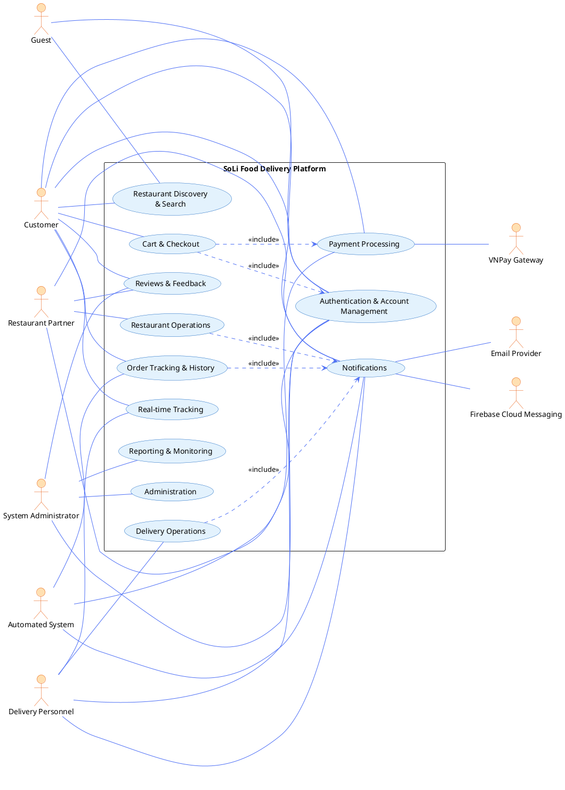
```plantuml
@startuml SystemOverview
left to right direction
skinparam packageStyle rectangle
skinparam shadowing false
skinparam ArrowColor #4C6EF5
skinparam usecase {
  BackgroundColor #E3F2FD
  BorderColor #1565C0
}
skinparam actor {
  BackgroundColor #FFE0B2
  BorderColor #E65100
}

actor "Guest" as Guest
actor "Customer" as Customer
actor "Restaurant Partner" as Restaurant
actor "Delivery Personnel" as Shipper
actor "System Administrator" as Admin
actor "Automated System" as SystemActor
actor "VNPay Gateway" as VNPay
actor "Firebase Cloud Messaging" as FCM
actor "Email Provider" as Email

rectangle "SoLi Food Delivery Platform" {
  usecase "Authentication & Account\nManagement" as DOM_AUTH
  usecase "Restaurant Discovery\n& Search" as DOM_DISC
  usecase "Cart & Checkout" as DOM_CART
  usecase "Payment Processing" as DOM_PAY
  usecase "Order Tracking & History" as DOM_ORD
  usecase "Restaurant Operations" as DOM_REST
  usecase "Delivery Operations" as DOM_SHIP
  usecase "Notifications" as DOM_NOTIF
  usecase "Reviews & Feedback" as DOM_REV
  usecase "Administration" as DOM_ADMIN
  usecase "Real-time Tracking" as DOM_TRACK
  usecase "Reporting & Monitoring" as DOM_RPT
}

Guest -- DOM_AUTH
Guest -- DOM_DISC
Customer -- DOM_AUTH
Customer -- DOM_DISC
Customer -- DOM_CART
Customer -- DOM_PAY
Customer -- DOM_ORD
Customer -- DOM_TRACK
Customer -- DOM_REV
Customer -- DOM_NOTIF

Restaurant -- DOM_AUTH
Restaurant -- DOM_REST
Restaurant -- DOM_NOTIF
Restaurant -- DOM_REV

Shipper -- DOM_AUTH
Shipper -- DOM_SHIP
Shipper -- DOM_NOTIF
Shipper -- DOM_TRACK

Admin -- DOM_AUTH
Admin -- DOM_ADMIN
Admin -- DOM_RPT
Admin -- DOM_REV

DOM_CART ..> DOM_AUTH : <<include>>
DOM_CART ..> DOM_PAY : <<include>>
DOM_ORD ..> DOM_NOTIF : <<include>>
DOM_REST ..> DOM_NOTIF : <<include>>
DOM_SHIP ..> DOM_NOTIF : <<include>>

SystemActor -- DOM_PAY
SystemActor -- DOM_ORD
SystemActor -- DOM_NOTIF

DOM_PAY -- VNPay
DOM_NOTIF -- FCM
DOM_NOTIF -- Email
@enduml
```

### 3.2.1.2 Authentication & Account Management

**Hình 3.7. Authentication & Account Management Use Case**

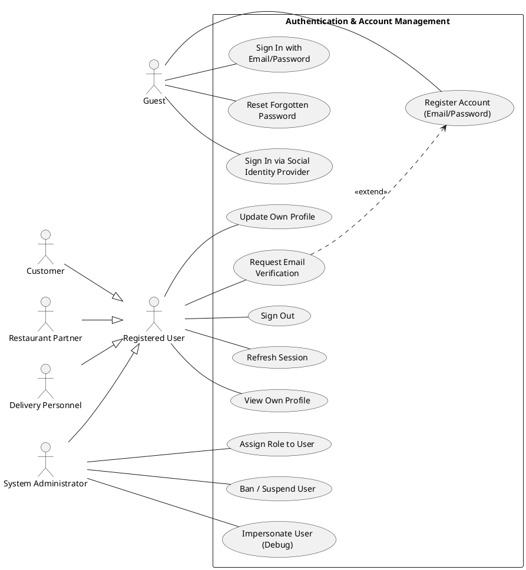
```plantuml
@startuml AuthDiagram
left to right direction
skinparam packageStyle rectangle
skinparam shadowing false

actor "Guest" as Guest
actor "Registered User" as RegUser
actor "Customer" as Customer
actor "Restaurant Partner" as Restaurant
actor "Delivery Personnel" as Shipper
actor "System Administrator" as Admin

Customer --|> RegUser
Restaurant --|> RegUser
Shipper --|> RegUser
Admin --|> RegUser

rectangle "Authentication & Account Management" {

  usecase "Register Account\n(Email/Password)" as UC_AUTH_01
  usecase "Sign In with\nEmail/Password" as UC_AUTH_02
  usecase "Sign Out" as UC_AUTH_03
  usecase "Refresh Session" as UC_AUTH_04
  usecase "View Own Profile" as UC_AUTH_05
  usecase "Update Own Profile" as UC_AUTH_06
  usecase "Request Email\nVerification" as UC_AUTH_07
  usecase "Reset Forgotten\nPassword" as UC_AUTH_12
  usecase "Sign In via Social\nIdentity Provider" as UC_AUTH_11
  usecase "Assign Role to User" as UC_AUTH_08
  usecase "Ban / Suspend User" as UC_AUTH_09
  usecase "Impersonate User\n(Debug)" as UC_AUTH_10
}

Guest -- UC_AUTH_01
Guest -- UC_AUTH_02
Guest -- UC_AUTH_11
Guest -- UC_AUTH_12

RegUser -- UC_AUTH_03
RegUser -- UC_AUTH_04
RegUser -- UC_AUTH_05
RegUser -- UC_AUTH_06
RegUser -- UC_AUTH_07

Admin -- UC_AUTH_08
Admin -- UC_AUTH_09
Admin -- UC_AUTH_10

UC_AUTH_07 ..> UC_AUTH_01 : <<extend>>

@enduml
```

### 3.2.1.3 Restaurant Discovery & Search

**Hình 3.8. Restaurant Discovery & Search Use Case**

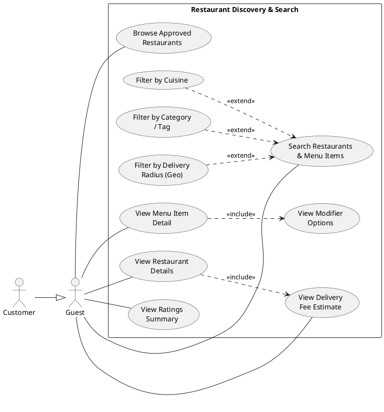
```plantuml
@startuml DiscoveryDiagram
left to right direction
skinparam shadowing false

actor "Guest" as Guest
actor "Customer" as Customer

Customer --|> Guest

rectangle "Restaurant Discovery & Search" {

  usecase "Browse Approved\nRestaurants" as UC_DISC_01
  usecase "View Restaurant\nDetails" as UC_DISC_02
  usecase "Search Restaurants\n& Menu Items" as UC_DISC_03

  usecase "Filter by Cuisine" as UC_DISC_04
  usecase "Filter by Category\n/ Tag" as UC_DISC_05
  usecase "Filter by Delivery\nRadius (Geo)" as UC_DISC_06

  usecase "View Delivery\nFee Estimate" as UC_DISC_07

  usecase "View Menu Item\nDetail" as UC_DISC_09
  usecase "View Modifier\nOptions" as UC_DISC_08

  usecase "View Ratings\nSummary" as UC_DISC_10
}

Guest -- UC_DISC_01
Guest -- UC_DISC_02
Guest -- UC_DISC_03
Guest -- UC_DISC_07
Guest -- UC_DISC_09
Guest -- UC_DISC_10

UC_DISC_04 ..> UC_DISC_03 : <<extend>>
UC_DISC_05 ..> UC_DISC_03 : <<extend>>
UC_DISC_06 ..> UC_DISC_03 : <<extend>>

UC_DISC_02 ..> UC_DISC_07 : <<include>>
UC_DISC_09 ..> UC_DISC_08 : <<include>>

@enduml
```

### 3.2.1.4 Cart & Checkout

**Hình 3.9. Cart & Checkout Use Case**

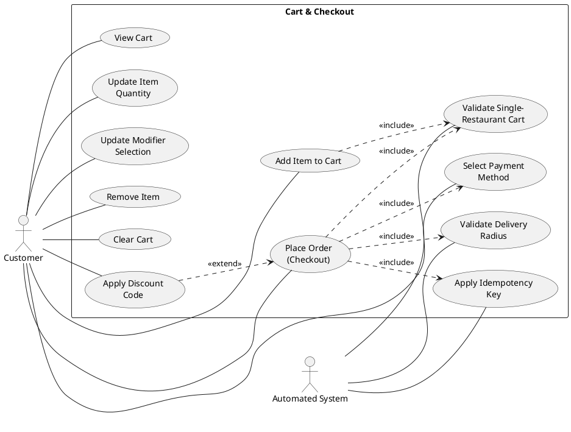
```plantuml
@startuml CartDiagram
left to right direction
skinparam shadowing false

actor "Customer" as Customer
actor "Automated System" as SystemActor

rectangle "Cart & Checkout" {
  usecase "View Cart" as UC_CART_01
  usecase "Add Item to Cart" as UC_CART_02
  usecase "Update Item\nQuantity" as UC_CART_03
  usecase "Update Modifier\nSelection" as UC_CART_04
  usecase "Remove Item" as UC_CART_05
  usecase "Clear Cart" as UC_CART_06
  usecase "Place Order\n(Checkout)" as UC_CART_07
  usecase "Validate Single-\nRestaurant Cart" as UC_CART_08
  usecase "Validate Delivery\nRadius" as UC_CART_09
  usecase "Apply Idempotency\nKey" as UC_CART_10
  usecase "Select Payment\nMethod" as UC_CART_11
  usecase "Apply Discount\nCode" as UC_CART_12
}

Customer -- UC_CART_01
Customer -- UC_CART_02
Customer -- UC_CART_03
Customer -- UC_CART_04
Customer -- UC_CART_05
Customer -- UC_CART_06
Customer -- UC_CART_07
Customer -- UC_CART_11
Customer -- UC_CART_12

SystemActor -- UC_CART_08
SystemActor -- UC_CART_09
SystemActor -- UC_CART_10

UC_CART_02 ..> UC_CART_08 : <<include>>
UC_CART_07 ..> UC_CART_08 : <<include>>
UC_CART_07 ..> UC_CART_09 : <<include>>
UC_CART_07 ..> UC_CART_10 : <<include>>
UC_CART_07 ..> UC_CART_11 : <<include>>
UC_CART_12 ..> UC_CART_07 : <<extend>>
@enduml
```

### 3.2.1.5 Payment

**Hình 3.10. Payment Use Case**

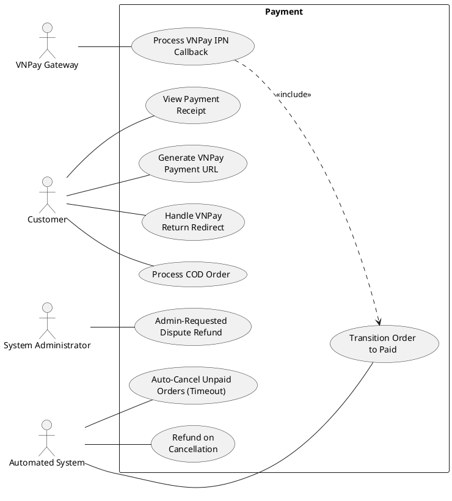
```plantuml
@startuml PaymentDiagram
left to right direction
skinparam shadowing false

actor "Customer" as Customer
actor "System Administrator" as Admin
actor "Automated System" as SystemActor
actor "VNPay Gateway" as VNPay

rectangle "Payment" {
  usecase "Generate VNPay\nPayment URL" as UC_PAY_01
  usecase "Process VNPay IPN\nCallback" as UC_PAY_02
  usecase "Handle VNPay\nReturn Redirect" as UC_PAY_03
  usecase "Transition Order\nto Paid" as UC_PAY_04
  usecase "Auto-Cancel Unpaid\nOrders (Timeout)" as UC_PAY_05
  usecase "Refund on\nCancellation" as UC_PAY_06
  usecase "Admin-Requested\nDispute Refund" as UC_PAY_07
  usecase "Process COD Order" as UC_PAY_08
  usecase "View Payment\nReceipt" as UC_PAY_10
}

Customer -- UC_PAY_01
Customer -- UC_PAY_03
Customer -- UC_PAY_08
Customer -- UC_PAY_10

VNPay -- UC_PAY_02
SystemActor -- UC_PAY_04
SystemActor -- UC_PAY_05
SystemActor -- UC_PAY_06
Admin -- UC_PAY_07

UC_PAY_02 ..> UC_PAY_04 : <<include>>
@enduml
```

### 3.2.1.6 Order Tracking & History

**Hình 3.11. Order Tracking & History Use Case**

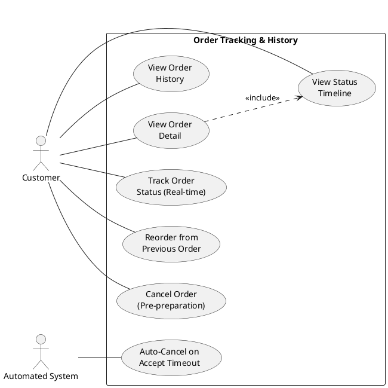
```plantuml
@startuml OrderDiagram
left to right direction
skinparam shadowing false

actor "Customer" as Customer
actor "Automated System" as SystemActor

rectangle "Order Tracking & History" {
  usecase "View Order\nHistory" as UC_ORD_01
  usecase "View Order\nDetail" as UC_ORD_02
  usecase "Track Order\nStatus (Real-time)" as UC_ORD_03
  usecase "View Status\nTimeline" as UC_ORD_04
  usecase "Reorder from\nPrevious Order" as UC_ORD_05
  usecase "Cancel Order\n(Pre-preparation)" as UC_ORD_06
  usecase "Auto-Cancel on\nAccept Timeout" as UC_ORD_07
}

Customer -- UC_ORD_01
Customer -- UC_ORD_02
Customer -- UC_ORD_03
Customer -- UC_ORD_04
Customer -- UC_ORD_05
Customer -- UC_ORD_06

SystemActor -- UC_ORD_07

UC_ORD_02 ..> UC_ORD_04 : <<include>>
@enduml
```

### 3.2.1.7 Restaurant Operations

**Hình 3.12. Restaurant Operations Use Case**

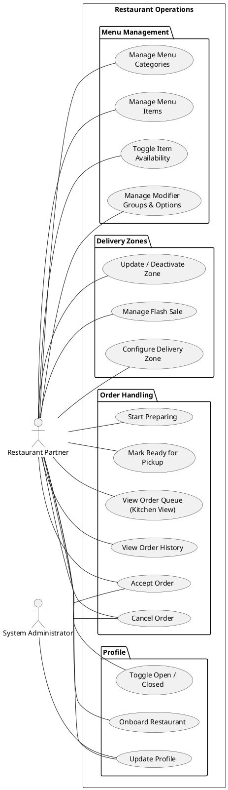
```plantuml
@startuml RestaurantOpsDiagram
left to right direction
skinparam shadowing false

actor "Restaurant Partner" as Restaurant
actor "System Administrator" as Admin

rectangle "Restaurant Operations" {
  package "Profile" {
    usecase "Onboard Restaurant" as UC_REST_01
    usecase "Update Profile" as UC_REST_02
    usecase "Toggle Open /\nClosed" as UC_REST_03
  }

  package "Order Handling" {
    usecase "View Order Queue\n(Kitchen View)" as UC_REST_04
    usecase "View Order History" as UC_REST_05
    usecase "Accept Order" as UC_REST_06
    usecase "Start Preparing" as UC_REST_07
    usecase "Mark Ready for\nPickup" as UC_REST_08
    usecase "Cancel Order" as UC_REST_09
  }

  package "Menu Management" {
    usecase "Manage Menu\nCategories" as UC_REST_10_11
    usecase "Manage Menu\nItems" as UC_REST_12_15
    usecase "Toggle Item\nAvailability" as UC_REST_14
    usecase "Manage Modifier\nGroups & Options" as UC_REST_16_18
  }

  package "Delivery Zones" {
    usecase "Configure Delivery\nZone" as UC_REST_19
    usecase "Update / Deactivate\nZone" as UC_REST_20
    usecase "Manage Flash Sale" as UC_REST_22
  }
}

Restaurant -- UC_REST_01
Restaurant -- UC_REST_02
Restaurant -- UC_REST_03
Restaurant -- UC_REST_04
Restaurant -- UC_REST_05
Restaurant -- UC_REST_06
Restaurant -- UC_REST_07
Restaurant -- UC_REST_08
Restaurant -- UC_REST_09
Restaurant -- UC_REST_10_11
Restaurant -- UC_REST_12_15
Restaurant -- UC_REST_14
Restaurant -- UC_REST_16_18
Restaurant -- UC_REST_19
Restaurant -- UC_REST_20
Restaurant -- UC_REST_22

Admin -- UC_REST_02
Admin -- UC_REST_06
Admin -- UC_REST_09

@enduml
```

### 3.2.1.8 Delivery Operations

**Hình 3.13. Delivery Operations Use Case**

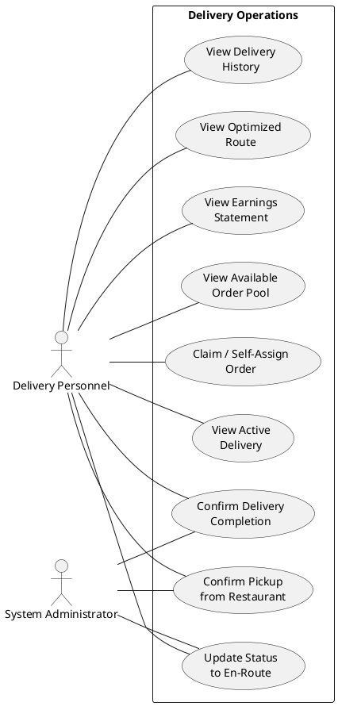
```plantuml
@startuml DeliveryDiagram
left to right direction
skinparam shadowing false

actor "Delivery Personnel" as Shipper
actor "System Administrator" as Admin

rectangle "Delivery Operations" {
  usecase "View Available\nOrder Pool" as UC_SHIP_01
  usecase "Claim / Self-Assign\nOrder" as UC_SHIP_02
  usecase "Confirm Pickup\nfrom Restaurant" as UC_SHIP_03
  usecase "Update Status\nto En-Route" as UC_SHIP_04
  usecase "Confirm Delivery\nCompletion" as UC_SHIP_05
  usecase "View Active\nDelivery" as UC_SHIP_06
  usecase "View Delivery\nHistory" as UC_SHIP_07
  usecase "View Optimized\nRoute" as UC_SHIP_08
  usecase "View Earnings\nStatement" as UC_SHIP_09
}

Shipper -- UC_SHIP_01
Shipper -- UC_SHIP_02
Shipper -- UC_SHIP_03
Shipper -- UC_SHIP_04
Shipper -- UC_SHIP_05
Shipper -- UC_SHIP_06
Shipper -- UC_SHIP_07
Shipper -- UC_SHIP_08
Shipper -- UC_SHIP_09

Admin -- UC_SHIP_03
Admin -- UC_SHIP_04
Admin -- UC_SHIP_05

@enduml
```

### 3.2.1.9 Notifications

**Hình 3.14. Notifications Use Case**

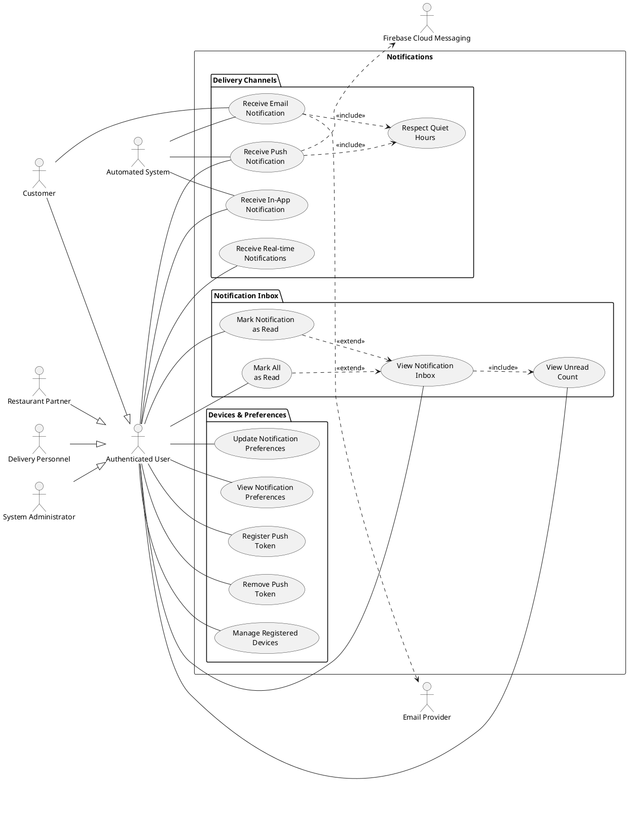
```plantuml
@startuml NotificationDiagram
left to right direction
skinparam shadowing false

actor "Authenticated User" as User
actor "Customer" as Customer
actor "Restaurant Partner" as Restaurant
actor "Delivery Personnel" as Shipper
actor "System Administrator" as Admin

actor "Automated System" as SystemActor
actor "Firebase Cloud Messaging" as FCM
actor "Email Provider" as Email

Customer --|> User
Restaurant --|> User
Shipper --|> User
Admin --|> User

rectangle "Notifications" {

  package "Delivery Channels" {

    usecase "Receive In-App\nNotification" as UC_NOTIF_INAPP

    usecase "Receive Push\nNotification" as UC_NOTIF_PUSH

    usecase "Receive Email\nNotification" as UC_NOTIF_EMAIL

    usecase "Receive Real-time\nNotifications" as UC_NOTIF_07

    usecase "Respect Quiet\nHours" as UC_NOTIF_20
  }

  package "Notification Inbox" {

    usecase "View Notification\nInbox" as UC_NOTIF_08

    usecase "View Unread\nCount" as UC_NOTIF_09

    usecase "Mark Notification\nas Read" as UC_NOTIF_10

    usecase "Mark All\nas Read" as UC_NOTIF_11
  }

  package "Devices & Preferences" {

    usecase "Register Push\nToken" as UC_NOTIF_12

    usecase "Remove Push\nToken" as UC_NOTIF_13

    usecase "Manage Registered\nDevices" as UC_NOTIF_14

    usecase "Update Notification\nPreferences" as UC_NOTIF_15

    usecase "View Notification\nPreferences" as UC_NOTIF_16
  }
}

User -- UC_NOTIF_INAPP
User -- UC_NOTIF_PUSH
User -- UC_NOTIF_07
User -- UC_NOTIF_08
User -- UC_NOTIF_09
User -- UC_NOTIF_10
User -- UC_NOTIF_11
User -- UC_NOTIF_12
User -- UC_NOTIF_13
User -- UC_NOTIF_14
User -- UC_NOTIF_15
User -- UC_NOTIF_16

Customer -- UC_NOTIF_EMAIL

SystemActor -- UC_NOTIF_INAPP
SystemActor -- UC_NOTIF_PUSH
SystemActor -- UC_NOTIF_EMAIL

UC_NOTIF_08 ..> UC_NOTIF_09 : <<include>>
UC_NOTIF_10 ..> UC_NOTIF_08 : <<extend>>
UC_NOTIF_11 ..> UC_NOTIF_08 : <<extend>>

UC_NOTIF_PUSH ..> UC_NOTIF_20 : <<include>>
UC_NOTIF_EMAIL ..> UC_NOTIF_20 : <<include>>

UC_NOTIF_PUSH ..> FCM
UC_NOTIF_EMAIL ..> Email

@enduml
```

### 3.2.1.10 Reviews & Feedback

**Hình 3.15. Reviews & Feedback Use Case**

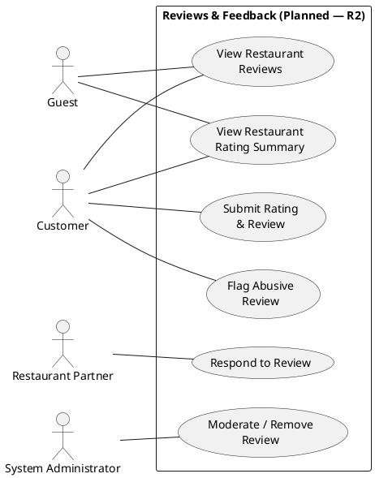
```plantuml
@startuml ReviewDiagram
left to right direction
skinparam shadowing false

actor "Guest" as Guest
actor "Customer" as Customer
actor "Restaurant Partner" as Restaurant
actor "System Administrator" as Admin

rectangle "Reviews & Feedback (Planned — R2)" {

  usecase "Submit Rating\n& Review" as UC_REV_01

  usecase "View Restaurant\nReviews" as UC_REV_02

  usecase "View Restaurant\nRating Summary" as UC_REV_06

  usecase "Respond to Review" as UC_REV_03

  usecase "Flag Abusive\nReview" as UC_REV_04

  usecase "Moderate / Remove\nReview" as UC_REV_05
}

Customer -- UC_REV_01
Customer -- UC_REV_02
Customer -- UC_REV_04
Customer -- UC_REV_06

Guest -- UC_REV_02
Guest -- UC_REV_06

Restaurant -- UC_REV_03

Admin -- UC_REV_05

@enduml
```

### 3.2.1.11 Administration

**Hình 3.16. Administration Use Case**

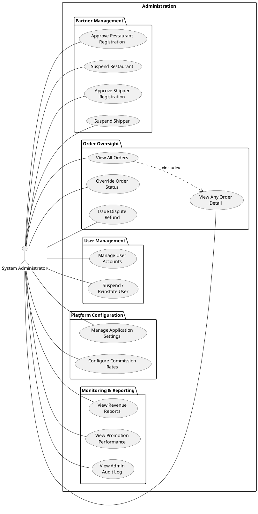
```plantuml
@startuml AdminDiagram
left to right direction
skinparam shadowing false

actor "System Administrator" as Admin

rectangle "Administration" {

  package "Partner Management" {

    usecase "Approve Restaurant\nRegistration" as UC_ADMIN_01

    usecase "Suspend Restaurant" as UC_ADMIN_02

    usecase "Approve Shipper\nRegistration" as UC_ADMIN_03

    usecase "Suspend Shipper" as UC_ADMIN_04
  }

  package "Order Oversight" {

    usecase "View All Orders" as UC_ADMIN_05

    usecase "View Any Order\nDetail" as UC_ADMIN_06

    usecase "Override Order\nStatus" as UC_ADMIN_07

    usecase "Issue Dispute\nRefund" as UC_ADMIN_08
  }

  package "User Management" {

    usecase "Manage User\nAccounts" as UC_ADMIN_10

    usecase "Suspend /\nReinstate User" as UC_ADMIN_11
  }

  package "Platform Configuration" {

    usecase "Manage Application\nSettings" as UC_ADMIN_09

    usecase "Configure Commission\nRates" as UC_ADMIN_15
  }

  package "Monitoring & Reporting" {

    usecase "View Revenue\nReports" as UC_ADMIN_12

    usecase "View Promotion\nPerformance" as UC_ADMIN_13

    usecase "View Admin\nAudit Log" as UC_ADMIN_14
  }
}

Admin -- UC_ADMIN_01
Admin -- UC_ADMIN_02
Admin -- UC_ADMIN_03
Admin -- UC_ADMIN_04
Admin -- UC_ADMIN_05
Admin -- UC_ADMIN_06
Admin -- UC_ADMIN_07
Admin -- UC_ADMIN_08
Admin -- UC_ADMIN_09
Admin -- UC_ADMIN_10
Admin -- UC_ADMIN_11
Admin -- UC_ADMIN_12
Admin -- UC_ADMIN_13
Admin -- UC_ADMIN_14
Admin -- UC_ADMIN_15

UC_ADMIN_05 ..> UC_ADMIN_06 : <<include>>

@enduml
```

### 3.2.1.12 Real-time Tracking

**Hình 3.17. Real-time Tracking Use Case**

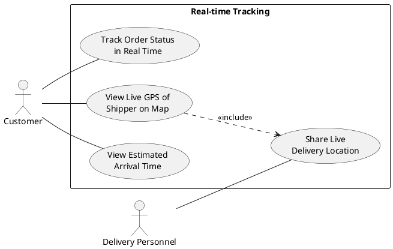
```plantuml
@startuml TrackingDiagram
left to right direction
skinparam shadowing false

actor "Customer" as Customer
actor "Delivery Personnel" as Shipper

rectangle "Real-time Tracking" {

  usecase "Track Order Status\nin Real Time" as UC_TRACK_01

  usecase "View Live GPS of\nShipper on Map" as UC_TRACK_02

  usecase "Share Live\nDelivery Location" as UC_TRACK_03

  usecase "View Estimated\nArrival Time" as UC_TRACK_04
}

Customer -- UC_TRACK_01
Customer -- UC_TRACK_02
Customer -- UC_TRACK_04

Shipper -- UC_TRACK_03

UC_TRACK_02 ..> UC_TRACK_03 : <<include>>

@enduml
```

### 3.2.1.13 Reporting & Monitoring

**Hình 3.18. Reporting & Monitoring Use Case**

```plantuml
@startuml ReportingDiagram
left to right direction
skinparam shadowing false

actor "System Administrator" as Admin

rectangle "Reporting & Monitoring" {

  package "Operational Monitoring" {

    usecase "View Order Volume\n& Status Breakdown" as UC_RPT_01

    usecase "View Restaurant\nPerformance" as UC_RPT_02

    usecase "View Delivery\nPerformance" as UC_RPT_06

    usecase "View Demand\nHeatmap" as UC_RPT_07
  }

  package "Financial Reporting" {

    usecase "View Platform\nRevenue Metrics" as UC_RPT_03

    usecase "View Commission\nReports" as UC_RPT_04
  }

  package "Export" {

    usecase "Export Reporting\nData" as UC_RPT_05
  }
}

Admin -- UC_RPT_01
Admin -- UC_RPT_02
Admin -- UC_RPT_03
Admin -- UC_RPT_04
Admin -- UC_RPT_05
Admin -- UC_RPT_06
Admin -- UC_RPT_07

@enduml
```

---

### 3.2.2 Danh sách Use Case Domain

The following table summarizes every domain-level use case specification contained in this document. Each row represents a **major business domain**; the underlying atomic use cases (`UC-XXX-NN`) are inventoried in the Use Case Proposal and elaborated within the corresponding domain specification.

**Bảng 3.10. Danh sách Use Case Domain**

| Spec ID   | Domain Use Case                     | Primary Actor(s)                             | Priority | Status                                            |
| --------- | ----------------------------------- | -------------------------------------------- | -------- | ------------------------------------------------- |
| UC-DOM-01 | Authentication & Account Management | Guest, Customer, Restaurant, Shipper, Admin  | P1       | Implemented                                       |
| UC-DOM-02 | Restaurant Discovery & Search       | Guest, Customer                              | P1       | Implemented                                       |
| UC-DOM-03 | Cart & Checkout                     | Customer                                     | P1       | Implemented                                       |
| UC-DOM-04 | Payment                             | Customer, Admin, VNPay, System               | P1       | Implemented                                       |
| UC-DOM-05 | Order Tracking & History            | Customer, System                             | P1       | Implemented                                       |
| UC-DOM-06 | Restaurant Operations               | Restaurant, Admin                            | P1       | Implemented (flash sales planned)                 |
| UC-DOM-07 | Delivery Operations                 | Shipper, Admin                               | P1       | Implemented (routing/earnings planned)            |
| UC-DOM-08 | Notifications                       | Customer, Restaurant, Shipper, Admin, System | P1       | Implemented                                       |
| UC-DOM-09 | Reviews & Feedback                  | Customer, Restaurant, Admin                  | P3       | Implemented                                       |
| UC-DOM-10 | Administration                      | Admin                                        | P1       | Implemented                                       |
| UC-DOM-11 | Real-time Tracking                  | Customer, Shipper                            | P1 / P3  | Status updates implemented; live GPS planned (R2) |
| UC-DOM-12 | Reporting & Monitoring              | Admin                                        | P2       | Implemented                                       |

---

### 3.2.3 Đặc tả chi tiết Use Case Domain

Each domain specification follows the same template:

> **Use Case ID, Use Case Name, Created By, Last Updated By, Created Date, Updated Date, Actors, Description, Preconditions, Postconditions, Priority, Frequency of Use, Normal Course of Events, Alternative Courses, Exceptions, Includes, Extends, Special Requirements, Assumptions, Notes & Issues.**

---

### 3.2.3.1 UC-DOM-01 — Authentication & Account Management

**Bảng 3.11. Đặc tả UC-DOM-01 — Authentication & Account Management**

| Attribute                   | Detail                                                                                                                                                                                                                                                                                                                                                                                                                                                                                                                                                                                                                                                                                                                                                                                                                                                                                                                                                                                                                 |
| --------------------------- | ---------------------------------------------------------------------------------------------------------------------------------------------------------------------------------------------------------------------------------------------------------------------------------------------------------------------------------------------------------------------------------------------------------------------------------------------------------------------------------------------------------------------------------------------------------------------------------------------------------------------------------------------------------------------------------------------------------------------------------------------------------------------------------------------------------------------------------------------------------------------------------------------------------------------------------------------------------------------------------------------------------------------- |
| **Use Case ID**             | UC-DOM-01                                                                                                                                                                                                                                                                                                                                                                                                                                                                                                                                                                                                                                                                                                                                                                                                                                                                                                                                                                                                              |
| **Use Case Name**           | Authentication & Account Management                                                                                                                                                                                                                                                                                                                                                                                                                                                                                                                                                                                                                                                                                                                                                                                                                                                                                                                                                                                    |
| **Created By**              | Business Analysis Team                                                                                                                                                                                                                                                                                                                                                                                                                                                                                                                                                                                                                                                                                                                                                                                                                                                                                                                                                                                                 |
| **Last Updated By**         | Business Analysis Team                                                                                                                                                                                                                                                                                                                                                                                                                                                                                                                                                                                                                                                                                                                                                                                                                                                                                                                                                                                                 |
| **Created Date**            | 15/01/2026                                                                                                                                                                                                                                                                                                                                                                                                                                                                                                                                                                                                                                                                                                                                                                                                                                                                                                                                                                                                             |
| **Updated Date**            | 28/01/2026                                                                                                                                                                                                                                                                                                                                                                                                                                                                                                                                                                                                                                                                                                                                                                                                                                                                                                                                                                                                             |
| **Actors**                  | Primary: Guest, Customer, Restaurant Partner, Delivery Personnel, System Administrator.                                                                                                                                                                                                                                                                                                                                                                                                                                                                                                                                                                                                                                                                                                                                                                                                                                                                                                                                |
| **Description**             | This domain enables identity establishment and identity-related lifecycle operations across the platform. It covers self-registration, sign-in, sign-out, session refresh, profile management, email verification, password recovery, social sign-in (planned), and administrative role and account-state controls. Authentication is the prerequisite for every personalized capability such as cart management, ordering, partner operations, and delivery assignments.                                                                                                                                                                                                                                                                                                                                                                                                                                                                                                                                              |
| **Preconditions**           | The platform is reachable. The user has an internet-connected client device. For administrative sub-flows, the actor's session is associated with the `admin` role.                                                                                                                                                                                                                                                                                                                                                                                                                                                                                                                                                                                                                                                                                                                                                                                                                                                    |
| **Postconditions**          | A valid authenticated session is established or invalidated as appropriate. User profile attributes, role assignments, or account-state flags are persisted.                                                                                                                                                                                                                                                                                                                                                                                                                                                                                                                                                                                                                                                                                                                                                                                                                                                           |
| **Priority**                | P1 — Must                                                                                                                                                                                                                                                                                                                                                                                                                                                                                                                                                                                                                                                                                                                                                                                                                                                                                                                                                                                                              |
| **Frequency of Use**        | Very high — every interactive session begins with authentication.                                                                                                                                                                                                                                                                                                                                                                                                                                                                                                                                                                                                                                                                                                                                                                                                                                                                                                                                                      |
| **Normal Course of Events** | 1. The actor opens the client application. <br> 2. The actor selects "Register" or "Sign In". <br> 3. For registration, the actor supplies name, email, password, and accepts the terms of service. <br> 4. The system validates input format, ensures email uniqueness, persists the user account, and assigns the default `user` role. <br> 5. The actor signs in with email and password; the system verifies credentials and issues an authenticated session token. <br> 6. The actor may view and update profile details (display name, avatar, phone) at any time. <br> 7. The actor may sign out, which invalidates the current session.                                                                                                                                                                                                                                                                                                                                                                        |
| **Alternative Courses**     | **A1 — Email verification:** Following registration, the customer requests verification; the system dispatches a verification email containing a single-use link. <br> **A2 — Forgotten password recovery:** The actor selects "Forgot password"; the system emails a time-limited reset link; the actor sets a new password and is redirected to sign-in. <br> **A3 — Social sign-in (Planned, R2):** The actor signs in with an external identity provider; on first use, a platform account is created and linked to the provider identity. <br> **A4 — Administrative role assignment:** The administrator selects a user account and assigns or revokes a role (`restaurant`, `shipper`, `admin`). <br> **A5 — Administrative ban / suspension:** The administrator marks a user account as banned; subsequent sign-in attempts are rejected. <br> **A6 — Administrative impersonation (Planned/Partial):** The administrator initiates a debug impersonation session for a target user, scoped and audit-logged. |
| **Exceptions**              | **E1 — Duplicate email:** Registration is rejected with a clear error; the actor is invited to sign in or recover the password. <br> **E2 — Invalid credentials:** Sign-in is rejected; the system applies rate-limiting after repeated failures. <br> **E3 — Banned account:** Sign-in is rejected with a notice referring the actor to support. <br> **E4 — Expired session:** Protected actions return an authentication error; the actor is redirected to sign in or refresh. <br> **E5 — Reset link expired or already used:** The recovery flow is rejected; the actor is invited to request a new link.                                                                                                                                                                                                                                                                                                                                                                                                         |
| **Includes**                | None.                                                                                                                                                                                                                                                                                                                                                                                                                                                                                                                                                                                                                                                                                                                                                                                                                                                                                                                                                                                                                  |
| **Extends**                 | Request Email Verification «extends» Register Account.                                                                                                                                                                                                                                                                                                                                                                                                                                                                                                                                                                                                                                                                                                                                                                                                                                                                                                                                                                 |
| **Special Requirements**    | Credentials must be stored using industry-standard hashing. Sessions must be invalidated upon explicit sign-out. The platform must enforce role-based access control (RBAC) on all protected endpoints. All authentication traffic must be transported over TLS. PII must not appear in application logs.                                                                                                                                                                                                                                                                                                                                                                                                                                                                                                                                                                                                                                                                                                              |
| **Assumptions**             | Users have access to the email account they register with. The administrator account is provisioned out-of-band before go-live.                                                                                                                                                                                                                                                                                                                                                                                                                                                                                                                                                                                                                                                                                                                                                                                                                                                                                        |
| **Notes & Issues**          | Social sign-in (UC-AUTH-11) is approved business capability but not configured in the current release. Password reset (UC-AUTH-12) is partial — recovery flow exists; UI exposure is finalized in R1.1.                                                                                                                                                                                                                                                                                                                                                                                                                                                                                                                                                                                                                                                                                                                                                                                                                |

---

### 3.2.3.2 UC-DOM-02 — Restaurant Discovery & Search

**Bảng 3.12. Đặc tả UC-DOM-02 — Restaurant Discovery & Search**

| Attribute                   | Detail                                                                                                                                                                                                                                                                                                                                                                                                                                                                                                                                                                                                                                    |
| --------------------------- | ----------------------------------------------------------------------------------------------------------------------------------------------------------------------------------------------------------------------------------------------------------------------------------------------------------------------------------------------------------------------------------------------------------------------------------------------------------------------------------------------------------------------------------------------------------------------------------------------------------------------------------------- |
| **Use Case ID**             | UC-DOM-02                                                                                                                                                                                                                                                                                                                                                                                                                                                                                                                                                                                                                                 |
| **Use Case Name**           | Restaurant Discovery & Search                                                                                                                                                                                                                                                                                                                                                                                                                                                                                                                                                                                                             |
| **Created By**              | Business Analysis Team                                                                                                                                                                                                                                                                                                                                                                                                                                                                                                                                                                                                                    |
| **Last Updated By**         | Business Analysis Team                                                                                                                                                                                                                                                                                                                                                                                                                                                                                                                                                                                                                    |
| **Created Date**            | 15/01/2026                                                                                                                                                                                                                                                                                                                                                                                                                                                                                                                                                                                                                                |
| **Updated Date**            | 28/01/2026                                                                                                                                                                                                                                                                                                                                                                                                                                                                                                                                                                                                                                |
| **Actors**                  | Primary: Guest, Customer.                                                                                                                                                                                                                                                                                                                                                                                                                                                                                                                                                                                                                 |
| **Description**             | This domain exposes the unified discovery surface through which guests and customers browse approved restaurants, examine menus and modifier options, search by keyword, filter by cuisine, category, tag, and geographic proximity, and review delivery fee estimates and rating summaries. The discovery surface drives the order funnel and is intentionally accessible without authentication for restaurants and menu items.                                                                                                                                                                                                         |
| **Preconditions**           | The platform is reachable. At least one restaurant is approved and active. For geographic filtering, the actor's device has supplied a location or the actor has entered a delivery address.                                                                                                                                                                                                                                                                                                                                                                                                                                              |
| **Postconditions**          | The actor has obtained a list of restaurants and/or menu items consistent with the supplied criteria. No business state is modified by discovery actions.                                                                                                                                                                                                                                                                                                                                                                                                                                                                                 |
| **Priority**                | P1 — Must                                                                                                                                                                                                                                                                                                                                                                                                                                                                                                                                                                                                                                 |
| **Frequency of Use**        | Very high — discovery is the primary entry point to ordering.                                                                                                                                                                                                                                                                                                                                                                                                                                                                                                                                                                             |
| **Normal Course of Events** | 1. The actor opens the application's discovery surface. <br> 2. The system displays approved restaurants ordered by relevance and proximity. <br> 3. The actor selects a restaurant; the system displays the restaurant profile, operating hours, menu categories, and menu items. <br> 4. The actor opens a menu item detail view; the system displays item description, pricing, availability, image, and configurable modifier options. <br> 5. The actor optionally enters a delivery address; the system computes and displays the delivery fee estimate based on the restaurant's configured delivery zone.                         |
| **Alternative Courses**     | **A1 — Keyword search:** The actor enters a search term; the system returns matching restaurants and menu items in a single response with separate result counts. <br> **A2 — Filter by cuisine, category, or tag:** The actor applies one or more filters; the system constrains results accordingly. <br> **A3 — Filter by delivery radius:** The actor enables proximity-based filtering; the system returns only restaurants whose delivery zone covers the actor's location. <br> **A4 — View ratings summary (Planned, R2):** The actor opens a restaurant's profile; the system displays aggregate star rating and recent reviews. |
| **Exceptions**              | **E1 — No results:** The system displays a clear empty-state with suggestions to broaden criteria. <br> **E2 — Out-of-zone address:** The delivery estimate sub-flow returns a zone-coverage error; the actor is invited to revise the address or choose another restaurant. <br> **E3 — Restaurant unavailable:** A restaurant currently closed or sold out is displayed with a non-actionable indicator.                                                                                                                                                                                                                                |
| **Includes**                | View Restaurant Detail «include» View Delivery Fee Estimate; View Menu Item Detail «include» View Modifier Options.                                                                                                                                                                                                                                                                                                                                                                                                                                                                                                                       |
| **Extends**                 | Filter by Cuisine «extends» Search Restaurants & Menu Items; Filter by Category/Tag «extends» Search Restaurants & Menu Items; Filter by Delivery Radius «extends» Search Restaurants & Menu Items.                                                                                                                                                                                                                                                                                                                                                                                                                                       |
| **Special Requirements**    | Search must support accent-insensitive matching for the Vietnamese language. Discovery endpoints must remain accessible to anonymous users. Result pagination must be enforced to bound response sizes.                                                                                                                                                                                                                                                                                                                                                                                                                                   |
| **Assumptions**             | Restaurant partners maintain accurate menu data and operating hours. Geolocation services are available with sufficient quota.                                                                                                                                                                                                                                                                                                                                                                                                                                                                                                            |
| **Notes & Issues**          | Ratings summary depends on the Reviews & Feedback domain (UC-DOM-09) and inherits its planned-R2 status.                                                                                                                                                                                                                                                                                                                                                                                                                                                                                                                                  |

---

### 3.2.3.3 UC-DOM-03 — Cart & Checkout

**Bảng 3.13. Đặc tả UC-DOM-03 — Cart & Checkout**

| Attribute                   | Detail                                                                                                                                                                                                                                                                                                                                                                                                                                                                                                                                                                                                                                                                                                                                                                                   |
| --------------------------- | ---------------------------------------------------------------------------------------------------------------------------------------------------------------------------------------------------------------------------------------------------------------------------------------------------------------------------------------------------------------------------------------------------------------------------------------------------------------------------------------------------------------------------------------------------------------------------------------------------------------------------------------------------------------------------------------------------------------------------------------------------------------------------------------- |
| **Use Case ID**             | UC-DOM-03                                                                                                                                                                                                                                                                                                                                                                                                                                                                                                                                                                                                                                                                                                                                                                                |
| **Use Case Name**           | Cart & Checkout                                                                                                                                                                                                                                                                                                                                                                                                                                                                                                                                                                                                                                                                                                                                                                          |
| **Created By**              | Business Analysis Team                                                                                                                                                                                                                                                                                                                                                                                                                                                                                                                                                                                                                                                                                                                                                                   |
| **Last Updated By**         | Business Analysis Team                                                                                                                                                                                                                                                                                                                                                                                                                                                                                                                                                                                                                                                                                                                                                                   |
| **Created Date**            | 15/01/2026                                                                                                                                                                                                                                                                                                                                                                                                                                                                                                                                                                                                                                                                                                                                                                               |
| **Updated Date**            | 28/01/2026                                                                                                                                                                                                                                                                                                                                                                                                                                                                                                                                                                                                                                                                                                                                                                               |
| **Actors**                  | Primary: Customer. Secondary: Automated System.                                                                                                                                                                                                                                                                                                                                                                                                                                                                                                                                                                                                                                                                                                                                          |
| **Description**             | This domain governs the construction of the customer's cart, modification of cart items and modifier selections, and the checkout transition that converts the cart into a confirmed order. Checkout enforces the single-restaurant cart constraint, delivery zone eligibility, payment method selection, and order idempotency.                                                                                                                                                                                                                                                                                                                                                                                                                                                         |
| **Preconditions**           | The customer is authenticated. The customer has selected at least one menu item from one approved restaurant. The customer has a deliverable address.                                                                                                                                                                                                                                                                                                                                                                                                                                                                                                                                                                                                                                    |
| **Postconditions**          | An order has been created and is associated with the customer, the restaurant, and the chosen payment method. The cart is cleared on successful checkout.                                                                                                                                                                                                                                                                                                                                                                                                                                                                                                                                                                                                                                |
| **Priority**                | P1 — Must                                                                                                                                                                                                                                                                                                                                                                                                                                                                                                                                                                                                                                                                                                                                                                                |
| **Frequency of Use**        | High — every transaction passes through this domain.                                                                                                                                                                                                                                                                                                                                                                                                                                                                                                                                                                                                                                                                                                                                     |
| **Normal Course of Events** | 1. The customer adds a menu item to the cart, optionally with modifier selections and quantity. <br> 2. The system validates the single-restaurant constraint and persists the cart line. <br> 3. The customer reviews, updates quantity, edits modifiers, or removes items. <br> 4. The customer initiates checkout. <br> 5. The system re-validates the cart, confirms delivery zone eligibility for the supplied address, computes delivery fee, and presents the order summary. <br> 6. The customer selects a payment method (COD or VNPay) and confirms the order. <br> 7. The system applies an idempotency key, persists the order in `pending` state, clears the cart, and dispatches the appropriate downstream events (notifications and, for VNPay, payment URL generation). |
| **Alternative Courses**     | **A1 — Cross-restaurant addition:** The customer attempts to add an item from a different restaurant; the system prompts the customer to either clear the existing cart or cancel the action. <br> **A2 — Modifier price re-resolution:** At checkout, the system re-resolves modifier prices from the catalog snapshot to guarantee price integrity. <br> **A3 — Apply discount code (Planned, R2):** The customer enters a promotion code; the system validates eligibility and adjusts the order total. <br> **A4 — Save delivery address:** On checkout, the customer may save the entered address to their profile for future use.                                                                                                                                                  |
| **Exceptions**              | **E1 — Item unavailable at checkout:** A previously cart-added item is now sold out; the system invites the customer to remove it before continuing. <br> **E2 — Address outside delivery zone:** Checkout is blocked with a zone-coverage error; the customer must enter a deliverable address. <br> **E3 — Duplicate submission:** A repeated submission within the idempotency window is silently de-duplicated. <br> **E4 — Restaurant closed:** Checkout is blocked with a restaurant-status error.                                                                                                                                                                                                                                                                                 |
| **Includes**                | Place Order «include» Validate Single-Restaurant Cart; Place Order «include» Validate Delivery Radius; Place Order «include» Apply Idempotency Key; Place Order «include» Select Payment Method.                                                                                                                                                                                                                                                                                                                                                                                                                                                                                                                                                                                         |
| **Extends**                 | Apply Discount Code «extends» Place Order.                                                                                                                                                                                                                                                                                                                                                                                                                                                                                                                                                                                                                                                                                                                                               |
| **Special Requirements**    | Cart state is held in a low-latency cache keyed by user identity. Checkout enforces transactional integrity — an order is either fully created or not created. Modifier and item pricing must be re-resolved server-side at checkout. The idempotency window must align with the configured platform setting.                                                                                                                                                                                                                                                                                                                                                                                                                                                                            |
| **Assumptions**             | Customers have valid delivery addresses within the platform's service area. Restaurants maintain up-to-date availability flags on items.                                                                                                                                                                                                                                                                                                                                                                                                                                                                                                                                                                                                                                                 |
| **Notes & Issues**          | Promotion-code redemption is approved and modeled but deferred to Release 2.                                                                                                                                                                                                                                                                                                                                                                                                                                                                                                                                                                                                                                                                                                             |

---

### 3.2.3.4 UC-DOM-04 — Payment

**Bảng 3.14. Đặc tả UC-DOM-04 — Payment**

| Attribute                   | Detail                                                                                                                                                                                                                                                                                                                                                                                                                                                                                                                                                                                                                                                                          |
| --------------------------- | ------------------------------------------------------------------------------------------------------------------------------------------------------------------------------------------------------------------------------------------------------------------------------------------------------------------------------------------------------------------------------------------------------------------------------------------------------------------------------------------------------------------------------------------------------------------------------------------------------------------------------------------------------------------------------- |
| **Use Case ID**             | UC-DOM-04                                                                                                                                                                                                                                                                                                                                                                                                                                                                                                                                                                                                                                                                       |
| **Use Case Name**           | Payment                                                                                                                                                                                                                                                                                                                                                                                                                                                                                                                                                                                                                                                                         |
| **Created By**              | Business Analysis Team                                                                                                                                                                                                                                                                                                                                                                                                                                                                                                                                                                                                                                                          |
| **Last Updated By**         | Business Analysis Team                                                                                                                                                                                                                                                                                                                                                                                                                                                                                                                                                                                                                                                          |
| **Created Date**            | 15/01/2026                                                                                                                                                                                                                                                                                                                                                                                                                                                                                                                                                                                                                                                                      |
| **Updated Date**            | 28/01/2026                                                                                                                                                                                                                                                                                                                                                                                                                                                                                                                                                                                                                                                                      |
| **Actors**                  | Primary: Customer, System Administrator. Secondary: VNPay Gateway, Automated System.                                                                                                                                                                                                                                                                                                                                                                                                                                                                                                                                                                                            |
| **Description**             | This domain manages the financial settlement of orders. It supports two payment paths: Cash on Delivery (COD), in which the order proceeds directly to the restaurant fulfillment workflow; and VNPay, in which the customer is redirected to the gateway, the platform receives an Instant Payment Notification (IPN), and the order is transitioned to `paid` only after cryptographic verification. The domain also encompasses payment-driven auto-cancellation for unpaid orders, refund initiation on cancellation of paid orders, and administrator-initiated dispute refunds on delivered orders.                                                                       |
| **Preconditions**           | An order has been placed and is in the `pending` state. For VNPay, the customer is signed in and the gateway is reachable. For dispute refund, the order is in the `delivered` state.                                                                                                                                                                                                                                                                                                                                                                                                                                                                                           |
| **Postconditions**          | The order's payment state is recorded as `paid`, `failed`, `cancelled`, or `refunded`. Notifications are dispatched to relevant participants.                                                                                                                                                                                                                                                                                                                                                                                                                                                                                                                                   |
| **Priority**                | P1 — Must                                                                                                                                                                                                                                                                                                                                                                                                                                                                                                                                                                                                                                                                       |
| **Frequency of Use**        | Very high — every order produces at least one payment-domain interaction.                                                                                                                                                                                                                                                                                                                                                                                                                                                                                                                                                                                                       |
| **Normal Course of Events** | **VNPay flow** — 1. At checkout the system generates a signed VNPay payment URL and redirects the customer. <br> 2. The customer completes payment at the VNPay portal. <br> 3. The gateway sends an IPN callback to the platform. <br> 4. The platform verifies the HMAC signature, reconciles the transaction, and transitions the order to `paid`. <br> 5. The browser-return URL renders a UI confirmation; no business state is mutated through this redirect. <br> **COD flow** — 1. The customer selects COD at checkout. <br> 2. The order proceeds directly to the restaurant for acceptance; settlement is recorded by the shipper at delivery time.                  |
| **Alternative Courses**     | **A1 — Payment timeout:** A `pending` order whose VNPay payment is not confirmed within the configured threshold is auto-transitioned to `cancelled`; a payment-failed notification is dispatched. <br> **A2 — Refund on cancellation after payment:** When a paid order is cancelled, the platform initiates a refund to the original payment instrument and notifies the customer. <br> **A3 — Admin dispute refund:** The administrator approves a refund on a delivered order; the platform initiates the refund and transitions the order to `refunded`. <br> **A4 — View payment receipt:** The customer reviews the receipt and transaction reference from order detail. |
| **Exceptions**              | **E1 — Signature verification failure:** The IPN is rejected; no state change is applied; the event is logged for audit. <br> **E2 — Duplicate IPN:** Repeated callbacks for the same transaction are idempotently ignored. <br> **E3 — Gateway unreachable:** The customer is informed; the order remains in `pending` until the timeout cycle resolves it. <br> **E4 — Refund rejected by gateway:** The administrator is alerted; the order remains marked for manual reconciliation.                                                                                                                                                                                        |
| **Includes**                | Process VNPay IPN «include» Transition Order to Paid.                                                                                                                                                                                                                                                                                                                                                                                                                                                                                                                                                                                                                           |
| **Extends**                 | None                                                                                                                                                                                                                                                                                                                                                                                                                                                                                                                                                                                                                                                                            |
| **Special Requirements**    | All gateway communications must be signed and verified using the configured HMAC scheme. Gateway credentials must be managed via environment variables. Payment-state transitions must be idempotent. PII and payment identifiers must not appear in application logs.                                                                                                                                                                                                                                                                                                                                                                                                          |
| **Assumptions**             | The VNPay sandbox certification has been completed prior to production deployment. The payment gateway maintains the SLA stated in BRD AS-3.                                                                                                                                                                                                                                                                                                                                                                                                                                                                                                                                    |
| **Notes & Issues**          | MoMo integration is approved as a Release 2 capability and is modeled here as a future extension of the VNPay flow.                                                                                                                                                                                                                                                                                                                                                                                                                                                                                                                                                             |

---

### 3.2.3.5 UC-DOM-05 — Order Tracking & History

**Bảng 3.15. Đặc tả UC-DOM-05 — Order Tracking & History**

| Attribute                   | Detail                                                                                                                                                                                                                                                                                                                                                                                                                                                                                                                                                                                                                                                                                             |
| --------------------------- | -------------------------------------------------------------------------------------------------------------------------------------------------------------------------------------------------------------------------------------------------------------------------------------------------------------------------------------------------------------------------------------------------------------------------------------------------------------------------------------------------------------------------------------------------------------------------------------------------------------------------------------------------------------------------------------------------- |
| **Use Case ID**             | UC-DOM-05                                                                                                                                                                                                                                                                                                                                                                                                                                                                                                                                                                                                                                                                                          |
| **Use Case Name**           | Order Tracking & History                                                                                                                                                                                                                                                                                                                                                                                                                                                                                                                                                                                                                                                                           |
| **Created By**              | Business Analysis Team                                                                                                                                                                                                                                                                                                                                                                                                                                                                                                                                                                                                                                                                             |
| **Last Updated By**         | Business Analysis Team                                                                                                                                                                                                                                                                                                                                                                                                                                                                                                                                                                                                                                                                             |
| **Created Date**            | 15/01/2026                                                                                                                                                                                                                                                                                                                                                                                                                                                                                                                                                                                                                                                                                         |
| **Updated Date**            | 28/01/2026                                                                                                                                                                                                                                                                                                                                                                                                                                                                                                                                                                                                                                                                                         |
| **Actors**                  | Primary: Customer. Secondary: Automated System.                                                                                                                                                                                                                                                                                                                                                                                                                                                                                                                                                                                                                                                    |
| **Description**             | This domain enables the customer to monitor the lifecycle of their orders and review historical orders. It includes paginated history retrieval, order detail inspection, real-time status tracking, status timeline review, customer-initiated cancellation of orders that have not yet entered preparation, system-driven auto-cancellation when restaurant acceptance times out, and one-tap reorder convenience.                                                                                                                                                                                                                                                                               |
| **Preconditions**           | The customer is authenticated and has at least one order on record (for history-related flows). For real-time tracking, the customer holds an active order in a non-terminal state.                                                                                                                                                                                                                                                                                                                                                                                                                                                                                                                |
| **Postconditions**          | The customer has obtained the requested view. For cancellation, the order is transitioned to `cancelled` and downstream refund and notification events are dispatched. For reorder, a draft cart is prepared with the previous order's items and modifiers.                                                                                                                                                                                                                                                                                                                                                                                                                                        |
| **Priority**                | P1 — Must                                                                                                                                                                                                                                                                                                                                                                                                                                                                                                                                                                                                                                                                                          |
| **Frequency of Use**        | High — order history and tracking are accessed once per active order and on demand thereafter.                                                                                                                                                                                                                                                                                                                                                                                                                                                                                                                                                                                                     |
| **Normal Course of Events** | 1. The customer opens "My Orders". <br> 2. The system displays a paginated list of orders sorted by recency, including status, total, and restaurant. <br> 3. The customer selects an order to view detail, including items, modifiers, charges, payment method, status, and the status transition timeline. <br> 4. For an active order, the system streams real-time status updates to the customer through the notification channel.                                                                                                                                                                                                                                                            |
| **Alternative Courses**     | **A1 — Cancel order before preparation:** The customer cancels an order in `pending` or `paid` state; the system records the reason, transitions the order to `cancelled`, and triggers refund and notifications as applicable. <br> **A2 — Reorder:** The customer selects "Reorder" on a previous order; the system returns the items and modifier selections from the source order for the client to pre-fill the cart (read-only; no server-side cart state is created). <br> **A3 — System-driven auto-cancellation:** When a restaurant fails to accept an order within the configured threshold, the platform automatically transitions the order to `cancelled` and notifies the customer. |
| **Exceptions**              | **E1 — Cancellation no longer permitted:** The order is in preparation or later; the system blocks cancellation and informs the customer. <br> **E2 — Reorder item unavailable:** Some items in the source order are no longer available; the customer is informed and asked to confirm the partial reorder.                                                                                                                                                                                                                                                                                                                                                                                       |
| **Includes**                | View Order Detail «include» View Status Timeline.                                                                                                                                                                                                                                                                                                                                                                                                                                                                                                                                                                                                                                                  |
| **Extends**                 | None.                                                                                                                                                                                                                                                                                                                                                                                                                                                                                                                                                                                                                                                                                              |
| **Special Requirements**    | Real-time status delivery latency must remain under 3 seconds under normal operating load. Order timeline entries must be immutable and timestamped at second precision.                                                                                                                                                                                                                                                                                                                                                                                                                                                                                                                           |
| **Assumptions**             | The customer remains authenticated when accessing personal order data. The customer's device supports persistent real-time connectivity.                                                                                                                                                                                                                                                                                                                                                                                                                                                                                                                                                           |
| **Notes & Issues**          | Live shipper GPS tracking is covered separately in UC-DOM-11 (Real-time Tracking) and is targeted for Release 2.                                                                                                                                                                                                                                                                                                                                                                                                                                                                                                                                                                                   |

---

### 3.2.3.6 UC-DOM-06 — Restaurant Operations

**Bảng 3.16. Đặc tả UC-DOM-06 — Restaurant Operations**

| Attribute                   | Detail                                                                                                                                                                                                                                                                                                                                                                                                                                                                                                                                                                                                                                                                                                                                                                                                                                                                                                                                    |
| --------------------------- | ----------------------------------------------------------------------------------------------------------------------------------------------------------------------------------------------------------------------------------------------------------------------------------------------------------------------------------------------------------------------------------------------------------------------------------------------------------------------------------------------------------------------------------------------------------------------------------------------------------------------------------------------------------------------------------------------------------------------------------------------------------------------------------------------------------------------------------------------------------------------------------------------------------------------------------------- |
| **Use Case ID**             | UC-DOM-06                                                                                                                                                                                                                                                                                                                                                                                                                                                                                                                                                                                                                                                                                                                                                                                                                                                                                                                                 |
| **Use Case Name**           | Restaurant Operations                                                                                                                                                                                                                                                                                                                                                                                                                                                                                                                                                                                                                                                                                                                                                                                                                                                                                                                     |
| **Created By**              | Business Analysis Team                                                                                                                                                                                                                                                                                                                                                                                                                                                                                                                                                                                                                                                                                                                                                                                                                                                                                                                    |
| **Last Updated By**         | Business Analysis Team                                                                                                                                                                                                                                                                                                                                                                                                                                                                                                                                                                                                                                                                                                                                                                                                                                                                                                                    |
| **Created Date**            | 15/01/2026                                                                                                                                                                                                                                                                                                                                                                                                                                                                                                                                                                                                                                                                                                                                                                                                                                                                                                                                |
| **Updated Date**            | 28/01/2026                                                                                                                                                                                                                                                                                                                                                                                                                                                                                                                                                                                                                                                                                                                                                                                                                                                                                                                                |
| **Actors**                  | Primary: Restaurant Partner. Secondary: System Administrator (oversight and elevated privileges).                                                                                                                                                                                                                                                                                                                                                                                                                                                                                                                                                                                                                                                                                                                                                                                                                                         |
| **Description**             | This domain provides the restaurant partner with the operational tools required to run their business on the platform. It encompasses restaurant onboarding and profile management, real-time open/closed control, end-to-end order handling from acceptance through ready-for-pickup, full menu and modifier management, and configuration of delivery zones with associated fees and ETAs. Flash-sale management is approved as a Release 2 extension.                                                                                                                                                                                                                                                                                                                                                                                                                                                                                  |
| **Preconditions**           | The actor is authenticated as a restaurant partner. For order-handling sub-flows, the restaurant has at least one active order. For administrative override, the actor is authenticated as administrator.                                                                                                                                                                                                                                                                                                                                                                                                                                                                                                                                                                                                                                                                                                                                 |
| **Postconditions**          | Restaurant profile, menu, modifier, and delivery zone changes are persisted and reflected to customers. Order state transitions are recorded with timestamp and actor attribution. Downstream notifications are dispatched.                                                                                                                                                                                                                                                                                                                                                                                                                                                                                                                                                                                                                                                                                                               |
| **Priority**                | P1 — Must                                                                                                                                                                                                                                                                                                                                                                                                                                                                                                                                                                                                                                                                                                                                                                                                                                                                                                                                 |
| **Frequency of Use**        | Continuous during restaurant operating hours.                                                                                                                                                                                                                                                                                                                                                                                                                                                                                                                                                                                                                                                                                                                                                                                                                                                                                             |
| **Normal Course of Events** | **Onboarding** — 1. The restaurant partner registers the restaurant, supplying name, address, contact information, opening hours, and cuisine type. <br> 2. The restaurant remains in unapproved state until administrator approval. <br> **Daily operations** — 3. The partner toggles the restaurant to "open" at the start of service. <br> 4. New orders appear in the kitchen view in real time. <br> 5. The partner accepts each order, transitioning it to `confirmed`. <br> 6. The partner marks the order as `preparing` when work begins, then `ready_for_pickup` when complete. <br> **Menu management** — 7. The partner creates and maintains menu categories, items, modifier groups, and modifier options, with images, prices, and availability flags. <br> **Delivery zone management** — 8. The partner configures one or more delivery zones with radius, base fee, distance pricing, ETA parameters, and quiet hours. |
| **Alternative Courses**     | **A1 — Reject / cancel order before preparation:** The partner cancels an order with a reason; refund is initiated when applicable. <br> **A2 — Toggle item availability:** The partner marks an item as sold out; it is hidden from new cart additions and search results. <br> **A3 — Update modifier group:** The partner adjusts modifier options or pricing; existing carts are not retroactively repriced. <br> **A4 — Deactivate delivery zone:** The partner removes coverage of a zone; subsequent orders for addresses in that zone are blocked at checkout. <br> **A5 — Manage flash sale (Planned, R2):** The partner creates a time-limited price reduction for selected items. <br> **A6 — Administrator override:** The administrator updates restaurant data or transitions order state on behalf of the partner.                                                                                                         |
| **Exceptions**              | **E1 — Restaurant not yet approved:** Customer-facing operations (open status, accepting orders) are blocked until administrator approval. <br> **E2 — Item in active cart:** Deletion of an item with active customer carts is allowed; carts are revalidated at checkout. <br> **E3 — Order acceptance timeout:** If the partner does not accept the order within the configured threshold, the platform auto-cancels and notifies the customer. <br> **E4 — Invalid zone radius:** Configuration with an unreasonable radius is rejected by validation.                                                                                                                                                                                                                                                                                                                                                                                |
| **Includes**                | None.                                                                                                                                                                                                                                                                                                                                                                                                                                                                                                                                                                                                                                                                                                                                                                                                                                                                                                                                     |
| **Extends**                 | None.                                                                                                                                                                                                                                                                                                                                                                                                                                                                                                                                                                                                                                                                                                                                                                                                                                                                                                                                     |
| **Special Requirements**    | The kitchen view must update in real time without page refresh. Menu and modifier changes must propagate promptly to the customer-facing catalog. Delivery zone fee computation must be deterministic and auditable.                                                                                                                                                                                                                                                                                                                                                                                                                                                                                                                                                                                                                                                                                                                      |
| **Assumptions**             | Restaurant staff have stable internet connectivity at the order-reception point. Menu pricing is the partner's responsibility.                                                                                                                                                                                                                                                                                                                                                                                                                                                                                                                                                                                                                                                                                                                                                                                                            |
| **Notes & Issues**          | Multi-branch grouping is approved for Release 3 and treated as a future extension of restaurant onboarding.                                                                                                                                                                                                                                                                                                                                                                                                                                                                                                                                                                                                                                                                                                                                                                                                                               |

---

### 3.2.3.7 UC-DOM-07 — Delivery Operations

**Bảng 3.17. Đặc tả UC-DOM-07 — Delivery Operations**

| Attribute                   | Detail                                                                                                                                                                                                                                                                                                                                                                                                                                                                                                                                                                                                 |
| --------------------------- | ------------------------------------------------------------------------------------------------------------------------------------------------------------------------------------------------------------------------------------------------------------------------------------------------------------------------------------------------------------------------------------------------------------------------------------------------------------------------------------------------------------------------------------------------------------------------------------------------------ |
| **Use Case ID**             | UC-DOM-07                                                                                                                                                                                                                                                                                                                                                                                                                                                                                                                                                                                              |
| **Use Case Name**           | Delivery Operations                                                                                                                                                                                                                                                                                                                                                                                                                                                                                                                                                                                    |
| **Created By**              | Business Analysis Team                                                                                                                                                                                                                                                                                                                                                                                                                                                                                                                                                                                 |
| **Last Updated By**         | Business Analysis Team                                                                                                                                                                                                                                                                                                                                                                                                                                                                                                                                                                                 |
| **Created Date**            | 15/01/2026                                                                                                                                                                                                                                                                                                                                                                                                                                                                                                                                                                                             |
| **Updated Date**            | 28/01/2026                                                                                                                                                                                                                                                                                                                                                                                                                                                                                                                                                                                             |
| **Actors**                  | Primary: Delivery Personnel (Shipper). Secondary: System Administrator.                                                                                                                                                                                                                                                                                                                                                                                                                                                                                                                                |
| **Description**             | This domain enables delivery personnel to claim, transport, and complete delivery assignments. It provides visibility into the available order pool, the shipper's currently active delivery, and historical deliveries. Optimized routing and earnings statements are approved Release 2 extensions.                                                                                                                                                                                                                                                                                                  |
| **Preconditions**           | The actor is authenticated as delivery personnel and has been approved by the administrator. The shipper holds a current online status.                                                                                                                                                                                                                                                                                                                                                                                                                                                                |
| **Postconditions**          | The order moves through the delivery lifecycle (`ready_for_pickup → picked_up → delivering → delivered`). Each transition is timestamped and actor-attributed. Notifications are dispatched to the customer and the restaurant at the appropriate stages.                                                                                                                                                                                                                                                                                                                                              |
| **Priority**                | P1 — Must                                                                                                                                                                                                                                                                                                                                                                                                                                                                                                                                                                                              |
| **Frequency of Use**        | Continuous during delivery shifts.                                                                                                                                                                                                                                                                                                                                                                                                                                                                                                                                                                     |
| **Normal Course of Events** | 1. The shipper opens the delivery application and views the available order pool — orders in `ready_for_pickup` state. <br> 2. The shipper selects an order; the platform applies first-come-first-served self-assignment. <br> 3. The shipper navigates to the restaurant and confirms pickup, transitioning the order to `picked_up`. <br> 4. The shipper marks the order as en-route, transitioning to `delivering`. <br> 5. Upon handing the order to the customer, the shipper confirms delivery; the order transitions to `delivered`. <br> 6. The shipper reviews delivery history at any time. |
| **Alternative Courses**     | **A1 — Multiple shippers attempt to claim:** Only the first claim succeeds; subsequent attempts receive a contention error and the pool is refreshed. <br> **A2 — Administrator override:** The administrator transitions the order on the shipper's behalf for exceptional cases. <br> **A3 — View optimized route (Planned, R2):** The shipper views a suggested pickup-and-delivery route. <br> **A4 — View earnings statement (Planned, R2):** The shipper reviews cumulative earnings and commission deductions by period.                                                                        |
| **Exceptions**              | **E1 — Order no longer available:** The selected order has been cancelled or claimed; the pool is refreshed. <br> **E2 — Pickup denied at restaurant:** The shipper reports a discrepancy; the administrator intervenes. <br> **E3 — Customer not reachable:** The shipper logs the issue; the administrator decides on resolution.                                                                                                                                                                                                                                                                    |
| **Includes**                | None.                                                                                                                                                                                                                                                                                                                                                                                                                                                                                                                                                                                                  |
| **Extends**                 | None in current scope.                                                                                                                                                                                                                                                                                                                                                                                                                                                                                                                                                                                 |
| **Special Requirements**    | Self-assignment must be atomic to prevent duplicate claims. The shipper's active delivery is constrained to one at a time. Live GPS broadcast (UC-TRACK-03) is governed under UC-DOM-11.                                                                                                                                                                                                                                                                                                                                                                                                               |
| **Assumptions**             | Shippers operate GPS-enabled smartphones with mobile data. Identity verification is completed during onboarding.                                                                                                                                                                                                                                                                                                                                                                                                                                                                                       |
| **Notes & Issues**          | Earnings reporting depends on commission configuration in UC-DOM-10 and the reporting subsystem in UC-DOM-12.                                                                                                                                                                                                                                                                                                                                                                                                                                                                                          |

---

### 3.2.3.8 UC-DOM-08 — Notifications

**Bảng 3.18. Đặc tả UC-DOM-08 — Notifications**

| Attribute                   | Detail                                                                                                                                                                                                                                                                                                                                                                                                                                                                                                                                                                                                                                                                                                         |
| --------------------------- | -------------------------------------------------------------------------------------------------------------------------------------------------------------------------------------------------------------------------------------------------------------------------------------------------------------------------------------------------------------------------------------------------------------------------------------------------------------------------------------------------------------------------------------------------------------------------------------------------------------------------------------------------------------------------------------------------------------- |
| **Use Case ID**             | UC-DOM-08                                                                                                                                                                                                                                                                                                                                                                                                                                                                                                                                                                                                                                                                                                      |
| **Use Case Name**           | Notifications                                                                                                                                                                                                                                                                                                                                                                                                                                                                                                                                                                                                                                                                                                  |
| **Created By**              | Business Analysis Team                                                                                                                                                                                                                                                                                                                                                                                                                                                                                                                                                                                                                                                                                         |
| **Last Updated By**         | Business Analysis Team                                                                                                                                                                                                                                                                                                                                                                                                                                                                                                                                                                                                                                                                                         |
| **Created Date**            | 15/01/2026                                                                                                                                                                                                                                                                                                                                                                                                                                                                                                                                                                                                                                                                                                     |
| **Updated Date**            | 28/01/2026                                                                                                                                                                                                                                                                                                                                                                                                                                                                                                                                                                                                                                                                                                     |
| **Actors**                  | Primary: Authenticated User (Customer, Restaurant Partner, Delivery Personnel, System Administrator). Secondary: Automated System, Firebase Cloud Messaging, Email Provider.                                                                                                                                                                                                                                                                                                                                                                                                                                                                                                                                   |
| **Description**             | This domain delivers timely workflow alerts across in-app, push, email, and real-time notification channels. It supports a real-time notification stream, push notifications via Firebase Cloud Messaging (FCM), and transactional email notifications for customer-facing events such as order confirmation, payment confirmation, refund processing, and delivery completion. Authenticated users may manage devices, configure notification preferences, and benefit from quiet-hours suppression for non-urgent channels.                                                                                                                                                                                  |
| **Preconditions**           | The recipient is an authenticated user. For push delivery, the user has registered at least one valid device token. For email delivery, the customer account contains a valid email address. For real-time delivery, the user has an active real-time session connection.                                                                                                                                                                                                                                                                                                                                                                                                                                      |
| **Postconditions**          | The notification is recorded in the user's inbox, dispatched on the eligible channels according to role eligibility and notification preferences, and reflected in the unread count.                                                                                                                                                                                                                                                                                                                                                                                                                                                                                                                           |
| **Priority**                | P1 — Must                                                                                                                                                                                                                                                                                                                                                                                                                                                                                                                                                                                                                                                                                                      |
| **Frequency of Use**        | Continuous and event-driven; tightly coupled to order lifecycle events.                                                                                                                                                                                                                                                                                                                                                                                                                                                                                                                                                                                                                                        |
| **Normal Course of Events** | 1. A domain event (e.g., order placed, order status changed, payment confirmed) occurs. <br> 2. The notification subsystem maps the event to one or more recipient–channel combinations defined by the platform's status-transition map. <br> 3. For each recipient, the in-app record is persisted. <br> 4. Push and email channels are dispatched subject to user preferences and quiet-hours rules. <br> 5. The recipient views, reads, or batch-reads notifications from the inbox.                                                                                                                                                                                                                        |
| **Alternative Courses**     | **A1 — Register device push token:** The user registers a new device token for push delivery. <br> **A2 — Update notification preferences:** The user toggles channels (in-app, push, email) and configures quiet-hours windows. <br> **A3 — Mark all as read:** The user clears the unread badge in a single action. <br> **A4 — Manage registered devices:** The user reviews and removes previously registered devices associated with their account. <br> **A5 — Token cleanup:** The platform automatically purges inactive or invalid tokens. <br> **A6 — Quiet-hours suppression:** During configured windows, push and email notifications are suppressed while in-app notifications remain available. |
| **Exceptions**              | **E1 — FCM rejection:** A push delivery fails for a token; the system records the failure and may deactivate persistently failing tokens. <br> **E2 — Email bounce:** The email provider reports a bounce; the system marks the address as undeliverable for that channel. <br> **E3 — User offline:** The user is not connected; in-app notifications are persisted and surfaced upon next sign-in.                                                                                                                                                                                                                                                                                                           |
| **Includes**                | View Notification Inbox «include» View Unread Count; Receive Push Notification «include» Respect Quiet Hours; Receive Email Notification «include» Respect Quiet Hours.                                                                                                                                                                                                                                                                                                                                                                                                                                                                                                                                        |
| **Extends**                 | Mark Notification as Read «extends» View Notification Inbox; Mark All as Read «extends» View Notification Inbox.                                                                                                                                                                                                                                                                                                                                                                                                                                                                                                                                                                                               |
| **Special Requirements**    | Real-time event-to-client latency must be under 3 seconds under normal load. Real-time presence state is tracked centrally to support multi-device notification delivery. PII must be excluded from server logs. Notification delivery must remain consistent across multiple devices for the same user.                                                                                                                                                                                                                                                                                                                                                                                                       |
| **Assumptions**             | FCM and SMTP providers maintain availability targets. Users keep at least one device active for time-sensitive workflows.                                                                                                                                                                                                                                                                                                                                                                                                                                                                                                                                                                                      |
| **Notes & Issues**          | Shipper-assignment notifications and multi-device synchronization are approved platform capabilities and may be expanded in Release 2 without affecting the core notification lifecycle. Channel-fanout policy is owned by the platform and may be tuned without business-rule changes.                                                                                                                                                                                                                                                                                                                                                                                                                        |

---

### 3.2.3.9 UC-DOM-09 — Reviews & Feedback

**Bảng 3.19. Đặc tả UC-DOM-09 — Reviews & Feedback**

| Attribute                   | Detail                                                                                                                                                                                                                                                                                                                                                                                                   |
| --------------------------- | -------------------------------------------------------------------------------------------------------------------------------------------------------------------------------------------------------------------------------------------------------------------------------------------------------------------------------------------------------------------------------------------------------- |
| **Use Case ID**             | UC-DOM-09                                                                                                                                                                                                                                                                                                                                                                                                |
| **Use Case Name**           | Reviews & Feedback                                                                                                                                                                                                                                                                                                                                                                                       |
| **Created By**              | Business Analysis Team                                                                                                                                                                                                                                                                                                                                                                                   |
| **Last Updated By**         | Business Analysis Team                                                                                                                                                                                                                                                                                                                                                                                   |
| **Created Date**            | 15/01/2026                                                                                                                                                                                                                                                                                                                                                                                               |
| **Updated Date**            | 28/01/2026                                                                                                                                                                                                                                                                                                                                                                                               |
| **Actors**                  | Primary: Guest, Customer, Restaurant Partner, System Administrator.                                                                                                                                                                                                                                                                                                                                      |
| **Description**             | This domain enables customers to submit numeric ratings and written reviews of completed orders, restaurant partners to respond to customer reviews, and administrators to moderate inappropriate content. Aggregate rating statistics are surfaced on restaurant profiles and search results. The domain is approved for Release 2.                                                                     |
| **Preconditions**           | For submission, the customer has at least one order in `delivered` status that has not yet been reviewed. For moderation, the actor is the system administrator.                                                                                                                                                                                                                                         |
| **Postconditions**          | The review is persisted, optionally moderated, and aggregated into the restaurant's rating profile. Restaurant responses and moderation outcomes are linked to the originating review.                                                                                                                                                                                                                   |
| **Priority**                | P3 — Could                                                                                                                                                                                                                                                                                                                                                                                               |
| **Frequency of Use**        | Moderate — once per delivered order at most.                                                                                                                                                                                                                                                                                                                                                             |
| **Normal Course of Events** | 1. The customer opens a delivered order. <br> 2. The customer submits a star rating (1–5) and an optional written comment. <br> 3. The platform persists the review, links it to the order and restaurant, and updates the aggregate rating. <br> 4. The restaurant partner views and optionally responds to the review. <br> 5. Guests and customers see the review on the restaurant's public profile. |
| **Alternative Courses**     | **A1 — Flag abusive review:** Any user reports a review for moderation. <br> **A2 — Administrator moderation:** The administrator reviews flagged content and either approves, redacts, or removes the review. <br> **A3 — View restaurant rating summary:** Discovery surfaces and restaurant profiles display the aggregate star rating and recent reviews.                                            |
| **Exceptions**              | **E1 — Ineligible order:** Submission is rejected if the order is not delivered or is already reviewed. <br> **E2 — Inappropriate content:** Automated content checks (planned) flag the review for moderation prior to publication.                                                                                                                                                                     |
| **Includes**                | None.                                                                                                                                                                                                                                                                                                                                                                                                    |
| **Extends**                 | None.                                                                                                                                                                                                                                                                                                                                                                                                    |
| **Special Requirements**    | Each customer may submit at most one review per order. Reviews must be linked to the originating order for auditability. Moderation actions must be logged in the administrator audit trail.                                                                                                                                                                                                             |
| **Assumptions**             | A content moderation policy will be defined prior to Release 2 launch.                                                                                                                                                                                                                                                                                                                                   |
| **Notes & Issues**          | Open issue OI-6 in the BRD records the choice between manual and automated content moderation; resolution is pending.                                                                                                                                                                                                                                                                                    |

---

### 3.2.3.10 UC-DOM-10 — Administration

**Bảng 3.20. Đặc tả UC-DOM-10 — Administration**

| Attribute                   | Detail                                                                                                                                                                                                                                                                                                                                                                                                                                                                                                                                                                                                                                                                                                               |
| --------------------------- | -------------------------------------------------------------------------------------------------------------------------------------------------------------------------------------------------------------------------------------------------------------------------------------------------------------------------------------------------------------------------------------------------------------------------------------------------------------------------------------------------------------------------------------------------------------------------------------------------------------------------------------------------------------------------------------------------------------------- |
| **Use Case ID**             | UC-DOM-10                                                                                                                                                                                                                                                                                                                                                                                                                                                                                                                                                                                                                                                                                                            |
| **Use Case Name**           | Administration                                                                                                                                                                                                                                                                                                                                                                                                                                                                                                                                                                                                                                                                                                       |
| **Created By**              | Business Analysis Team                                                                                                                                                                                                                                                                                                                                                                                                                                                                                                                                                                                                                                                                                               |
| **Last Updated By**         | Business Analysis Team                                                                                                                                                                                                                                                                                                                                                                                                                                                                                                                                                                                                                                                                                               |
| **Created Date**            | 15/01/2026                                                                                                                                                                                                                                                                                                                                                                                                                                                                                                                                                                                                                                                                                                           |
| **Updated Date**            | 28/01/2026                                                                                                                                                                                                                                                                                                                                                                                                                                                                                                                                                                                                                                                                                                           |
| **Actors**                  | Primary: System Administrator.                                                                                                                                                                                                                                                                                                                                                                                                                                                                                                                                                                                                                                                                                       |
| **Description**             | This domain provides cross-cutting platform governance, operational oversight, configuration management, and monitoring capabilities. It encompasses restaurant and shipper approval workflows, partner suspension management, full-platform order oversight with composable filters, order-state override authority, dispute refunds on delivered orders, user account administration and suspension control, configuration of application settings and commission rates, audit-log inspection, promotion-performance monitoring, and revenue-report access.                                                                                                                                                        |
| **Preconditions**           | The actor is authenticated as administrator.                                                                                                                                                                                                                                                                                                                                                                                                                                                                                                                                                                                                                                                                         |
| **Postconditions**          | The selected administrative action is applied. Partner approval and suspension states, user states, order states, refunds, and configuration values are persisted. Notifications are dispatched where business-relevant, and audit-log entries are recorded for auditability.                                                                                                                                                                                                                                                                                                                                                                                                                                        |
| **Priority**                | P1 — Must                                                                                                                                                                                                                                                                                                                                                                                                                                                                                                                                                                                                                                                                                                            |
| **Frequency of Use**        | Continuous — administration is a daily activity.                                                                                                                                                                                                                                                                                                                                                                                                                                                                                                                                                                                                                                                                     |
| **Normal Course of Events** | 1. The administrator signs in to the web portal. <br> 2. The administrator reviews pending restaurant registrations and approves eligible partners. <br> 3. The administrator monitors active orders across the platform using composable filters (status, date, restaurant, customer). <br> 4. The administrator inspects order detail and, where required, overrides order state (e.g., force-cancel an unresponsive order). <br> 5. The administrator approves a dispute refund on a delivered order. <br> 6. The administrator manages user accounts — search, role assignment, ban / unban. <br> 7. The administrator reviews and updates application settings such as timeout thresholds and commission rates. |
| **Alternative Courses**     | **A1 — Suspend a restaurant:** A non-compliant restaurant is suspended and removed from the public catalog. <br> **A2 — Approve / suspend shipper:** The administrator manages shipper onboarding state. <br> **A3 — View revenue reports (Planned, R2):** The administrator runs a report by period or restaurant. <br> **A4 — View promotion performance (Planned, R3):** The administrator analyzes campaign uptake. <br> **A5 — Review audit log (Planned, R2):** The administrator inspects historical administrative actions.                                                                                                                                                                                  |
| **Exceptions**              | **E1 — Override blocked by lifecycle:** Some transitions are not permitted from certain states; the system rejects the override with an explanatory message. <br> **E2 — Refund failure at gateway:** The dispute refund cannot be settled automatically; a manual reconciliation case is created. <br> **E3 — Ban during active session:** Banning a user with an active session immediately invalidates the session.                                                                                                                                                                                                                                                                                               |
| **Includes**                | View All Orders «include» View Any Order Detail.                                                                                                                                                                                                                                                                                                                                                                                                                                                                                                                                                                                                                                                                     |
| **Extends**                 | None.                                                                                                                                                                                                                                                                                                                                                                                                                                                                                                                                                                                                                                                                                                                |
| **Special Requirements**    | All administrative actions must be auditable. Administrator privileges are subject to role-based access control. Configuration changes must take effect without service restart. Refund execution must be idempotent and reconcilable with gateway records.                                                                                                                                                                                                                                                                                                                                                                                                                                                          |
| **Assumptions**             | The administrator team is small and trusted in the initial release; advanced delegation models (sub-roles) are not required for MVP.                                                                                                                                                                                                                                                                                                                                                                                                                                                                                                                                                                                 |
| **Notes & Issues**          | Audit log surfacing (UC-ADMIN-14) is approved and planned for Release 2. Commission-rate management (UC-ADMIN-15) is partial and to be completed alongside the reporting suite.                                                                                                                                                                                                                                                                                                                                                                                                                                                                                                                                      |

---

### 3.2.3.11 UC-DOM-11 — Real-time Tracking

**Bảng 3.21. Đặc tả UC-DOM-11 — Real-time Tracking**

| Attribute                   | Detail                                                                                                                                                                                                                                                                                                                                                                                                                                                                                 |
| --------------------------- | -------------------------------------------------------------------------------------------------------------------------------------------------------------------------------------------------------------------------------------------------------------------------------------------------------------------------------------------------------------------------------------------------------------------------------------------------------------------------------------- |
| **Use Case ID**             | UC-DOM-11                                                                                                                                                                                                                                                                                                                                                                                                                                                                              |
| **Use Case Name**           | Real-time Tracking                                                                                                                                                                                                                                                                                                                                                                                                                                                                     |
| **Created By**              | Business Analysis Team                                                                                                                                                                                                                                                                                                                                                                                                                                                                 |
| **Last Updated By**         | Business Analysis Team                                                                                                                                                                                                                                                                                                                                                                                                                                                                 |
| **Created Date**            | 15/01/2026                                                                                                                                                                                                                                                                                                                                                                                                                                                                             |
| **Updated Date**            | 28/01/2026                                                                                                                                                                                                                                                                                                                                                                                                                                                                             |
| **Actors**                  | Primary: Customer, Delivery Personnel.                                                                                                                                                                                                                                                                                                                                                                                                                                                 |
| **Description**             | This domain provides the customer with real-time visibility into their active order. In Release 1, this manifests as real-time order-status tracking delivered through persistent client connections. In Release 2, the domain is extended with live GPS broadcast from the delivery personnel and dynamic estimated-arrival-time updates rendered on a map.                                                                                                                           |
| **Preconditions**           | The customer holds an active order in a non-terminal state. The customer's client device maintains an active real-time session connection. For live GPS, the shipper has consented to location broadcast and is actively delivering the order.                                                                                                                                                                                                                                         |
| **Postconditions**          | The customer is presented with the most recent order status and, when available, the live shipper position and updated ETA. No business state is mutated by tracking.                                                                                                                                                                                                                                                                                                                  |
| **Priority**                | P1 — Must (status updates) ; P3 — Could (live GPS, R2)                                                                                                                                                                                                                                                                                                                                                                                                                                 |
| **Frequency of Use**        | High during active orders.                                                                                                                                                                                                                                                                                                                                                                                                                                                             |
| **Normal Course of Events** | 1. The customer opens the active order screen. <br> 2. The system continuously updates the customer with the latest order status as the delivery lifecycle progresses. <br> 3. As the order enters the `delivering` state, the customer sees status indication and an ETA derived from the configured zone parameters.                                                                                                                                                                 |
| **Alternative Courses**     | **A1 — Live GPS tracking (Planned, R2):** The shipper's location is broadcast at a moderate cadence; the customer sees the delivery location update on the map in real time. <br> **A2 — Dynamic estimated arrival time (Partial → R2):** The platform recomputes estimated arrival time based on current delivery progress and routing conditions. <br> **A3 — Reconnection:** The client recovers from a transient disconnect and re-synchronizes with the latest server-side state. |
| **Exceptions**              | **E1 — Connection lost:** The client falls back to periodic synchronization and re-establishes the real-time session when connectivity is restored. <br> **E2 — GPS unavailable on shipper device:** Live GPS is suppressed; status updates remain available.                                                                                                                                                                                                                          |
| **Includes**                | View Live GPS of Shipper on Map «include» Share Live Delivery Location.                                                                                                                                                                                                                                                                                                                                                                                                                |
| **Extends**                 | None.                                                                                                                                                                                                                                                                                                                                                                                                                                                                                  |
| **Special Requirements**    | Latency from event to client must remain under 3 seconds. Live GPS broadcast must respect the shipper's privacy and only be active for the assigned customer during the active order.                                                                                                                                                                                                                                                                                                  |
| **Assumptions**             | Customers maintain network connectivity during the delivery window. Map provider quotas are sufficient for projected concurrency.                                                                                                                                                                                                                                                                                                                                                      |
| **Notes & Issues**          | Open issue OI-1 in the BRD records the pending decision between Google Maps and Mapbox; resolution affects this domain.                                                                                                                                                                                                                                                                                                                                                                |

---

### 3.2.3.12 UC-DOM-12 — Reporting & Monitoring

**Bảng 3.22. Đặc tả UC-DOM-12 — Reporting & Monitoring**

| Attribute                   | Detail                                                                                                                                                                                                                                                                                                                                                                                                                                                                                                   |
| --------------------------- | -------------------------------------------------------------------------------------------------------------------------------------------------------------------------------------------------------------------------------------------------------------------------------------------------------------------------------------------------------------------------------------------------------------------------------------------------------------------------------------------------------- |
| **Use Case ID**             | UC-DOM-12                                                                                                                                                                                                                                                                                                                                                                                                                                                                                                |
| **Use Case Name**           | Reporting & Monitoring                                                                                                                                                                                                                                                                                                                                                                                                                                                                                   |
| **Created By**              | Business Analysis Team                                                                                                                                                                                                                                                                                                                                                                                                                                                                                   |
| **Last Updated By**         | Business Analysis Team                                                                                                                                                                                                                                                                                                                                                                                                                                                                                   |
| **Created Date**            | 15/01/2026                                                                                                                                                                                                                                                                                                                                                                                                                                                                                               |
| **Updated Date**            | 28/01/2026                                                                                                                                                                                                                                                                                                                                                                                                                                                                                               |
| **Actors**                  | Primary: System Administrator.                                                                                                                                                                                                                                                                                                                                                                                                                                                                           |
| **Description**             | This domain provides administrators with operational and financial visibility into platform activity. It includes platform-wide order volume and status breakdown, restaurant performance reporting, delivery performance monitoring, platform revenue metrics, commission reporting, exportable reporting datasets, and demand heatmaps. Basic monitoring capabilities are available in Release 1 through composable operational filters, while the complete reporting suite is approved for Release 2. |
| **Preconditions**           | The actor is authenticated as administrator. Sufficient historical data exists for the requested reporting period.                                                                                                                                                                                                                                                                                                                                                                                       |
| **Postconditions**          | The administrator has obtained the requested report, monitoring view, or exported dataset. No business state is modified by reporting actions.                                                                                                                                                                                                                                                                                                                                                           |
| **Priority**                | P2 — Should                                                                                                                                                                                                                                                                                                                                                                                                                                                                                              |
| **Frequency of Use**        | Daily for operational monitoring; periodic for financial and performance reporting.                                                                                                                                                                                                                                                                                                                                                                                                                      |
| **Normal Course of Events** | 1. The administrator opens the reporting console. <br> 2. The administrator selects the desired operational or financial report and the reporting period. <br> 3. The system computes aggregates and presents the results in tabular and chart form. <br> 4. The administrator may export the selected reporting dataset for offline analysis or reconciliation.                                                                                                                                         |
| **Alternative Courses**     | **A1 — Filter by restaurant or delivery personnel:** The administrator narrows the report to a specific operational partner. <br> **A2 — Export reporting data:** The administrator exports the selected reporting dataset for offline analysis and reconciliation. <br> **A3 — Live operational monitoring:** The administrator observes near real-time operational activity using filtered order and status views.                                                                                     |
| **Exceptions**              | **E1 — No data in reporting period:** The system displays a clear empty-state result. <br> **E2 — Export size limit exceeded:** The administrator is prompted to narrow the reporting scope or period.                                                                                                                                                                                                                                                                                                   |
| **Includes**                | None.                                                                                                                                                                                                                                                                                                                                                                                                                                                                                                    |
| **Extends**                 | None.                                                                                                                                                                                                                                                                                                                                                                                                                                                                                                    |
| **Special Requirements**    | Reports must complete within the platform's interactive performance budget for the requested period. Aggregation queries must not negatively impact operational order-processing workloads. Personally identifiable information (PII) must be excluded from exported datasets unless explicitly authorized for support or audit purposes through access-controlled workflows.                                                                                                                            |
| **Assumptions**             | The reporting subsystem reads from operational data stores in Release 1. A dedicated analytics datastore may be introduced in Release 2 if reporting performance or scalability requirements increase.                                                                                                                                                                                                                                                                                                   |
| **Notes & Issues**          | Reporting depends on commission configuration managed under UC-DOM-10. Demand heatmaps depend on the geolocation provider selected under BRD Open Issue OI-1.                                                                                                                                                                                                                                                                                                                                            |

---

_End of Use Case Specification v1.0_

## 3.3 Thiết kế CSDL

Thiết kế dữ liệu của SoLi tuân theo nguyên tắc mỗi bounded context sở hữu nhóm bảng nghiệp vụ của mình. Hệ thống sử dụng một PostgreSQL vật lý để giảm chi phí vận hành, nhưng các bảng được tổ chức theo ownership rõ ràng. Các dữ liệu runtime như cart, idempotency key, lock và presence được lưu trong Redis nên không xuất hiện như bảng PostgreSQL.

### 3.3.1 ERD tổng thể

**Hình 3.19. ERD tổng thể**

```mermaid
erDiagram
    user ||--o{ session : owns
    user ||--o{ account : owns
    user ||--o{ verification : verifies

    restaurants ||--o{ delivery_zones : configures
    restaurants ||--o{ menu_categories : groups
    restaurants ||--o{ menu_items : offers
    menu_categories ||--o{ menu_items : categorizes
    menu_items ||--o{ modifier_groups : defines
    modifier_groups ||--o{ modifier_options : contains

    orders ||--o{ order_items : contains
    orders ||--o{ order_status_logs : audits

    promotions ||--o{ coupon_codes : issues
    promotions ||--o{ promotion_usages : records
    coupon_codes ||--o{ promotion_usages : redeems

    notifications ||--o{ notification_delivery_logs : logs

    user {
      uuid id PK
      text email
      text role
      boolean banned
    }
    session {
      uuid id PK
      uuid user_id FK
      text token
      timestamp expires_at
    }
    account {
      uuid id PK
      uuid user_id FK
      text provider_id
      text account_id
    }
    verification {
      uuid id PK
      text identifier
      text value
      timestamp expires_at
    }
    restaurants {
      uuid id PK
      uuid owner_id
      text name
      boolean is_open
      boolean is_approved
      real average_rating
    }
    delivery_zones {
      uuid id PK
      uuid restaurant_id FK
      text name
      double radius_km
      int base_fee
    }
    menu_categories {
      uuid id PK
      uuid restaurant_id FK
      text name
      int display_order
    }
    menu_items {
      uuid id PK
      uuid restaurant_id FK
      uuid category_id FK
      text name
      int price
      enum status
    }
    modifier_groups {
      uuid id PK
      uuid menu_item_id FK
      text name
      int min_selections
      int max_selections
    }
    modifier_options {
      uuid id PK
      uuid group_id FK
      text name
      int price
      boolean is_available
    }
    orders {
      uuid id PK
      uuid customer_id
      uuid restaurant_id
      uuid cart_id UK
      enum status
      int total_amount
      enum payment_method
    }
    order_items {
      uuid id PK
      uuid order_id FK
      uuid menu_item_id
      text item_name
      int subtotal
      jsonb modifiers
    }
    order_status_logs {
      uuid id PK
      uuid order_id FK
      enum from_status
      enum to_status
      uuid triggered_by
    }
    payment_transactions {
      uuid id PK
      uuid order_id
      uuid customer_id
      int amount
      enum status
      text provider_txn_id UK
    }
    promotions {
      uuid id PK
      text name
      enum type
      enum scope
      enum status
      int discount_value
    }
    coupon_codes {
      uuid id PK
      uuid promotion_id
      text code UK
      enum status
    }
    promotion_usages {
      uuid id PK
      uuid promotion_id
      uuid coupon_code_id
      uuid order_id
      uuid customer_id
      enum status
    }
    notifications {
      uuid id PK
      uuid recipient_id
      enum type
      enum channel
      enum status
      text idempotency_key UK
    }
    notification_delivery_logs {
      uuid id PK
      uuid notification_id
      text channel
      enum status
      int attempt_number
    }
    images {
      uuid id PK
      text public_id
      text secure_url
      int width
      int height
    }
    reviews {
      uuid id PK
      uuid order_id UK
      uuid customer_id
      uuid restaurant_id
      smallint stars
      enum moderation_status
    }
```

ERD tổng thể cho thấy hai loại quan hệ. Loại thứ nhất là quan hệ foreign key nội bộ trong cùng bounded context, ví dụ restaurant với menu, order với order item, user với session. Loại thứ hai là quan hệ logic xuyên context được lưu bằng UUID nhưng không tạo foreign key trực tiếp, ví dụ `orders.restaurant_id`, `payment_transactions.order_id`, `reviews.order_id` hoặc `promotion_usages.order_id`. Bảng `images` thuộc Image BC và lưu metadata media thay vì binary; các module nghiệp vụ tham chiếu ảnh thông qua URL hoặc public id khi cần. Cách làm này giữ ranh giới dữ liệu của từng context và hỗ trợ khả năng tách module trong tương lai.

### 3.3.2 Auth BC Data Model

#### Mô tả BC

Auth BC quản lý danh tính, tài khoản đăng nhập, session, verification token, role và trạng thái khóa tài khoản. Đây là nền tảng bảo mật cho toàn bộ hệ thống vì mọi workflow cá nhân hóa như đặt đơn, quản lý nhà hàng, giao hàng và quản trị đều cần session hợp lệ.

#### Danh sách bảng

**Bảng 3.23. Danh sách bảng của Auth BC**

| Bảng           | Mục đích                                                                                |
| -------------- | --------------------------------------------------------------------------------------- |
| `user`         | Lưu thông tin người dùng, email, role, avatar, trạng thái xác minh và trạng thái banned |
| `session`      | Lưu session token, thời điểm hết hạn, IP, user agent và liên kết user                   |
| `account`      | Lưu tài khoản đăng nhập theo provider, password hash hoặc token provider                |
| `verification` | Lưu verification value và thời hạn cho email/password recovery flow                     |

#### Data Dictionary

**Bảng 3.24. Data Dictionary của Auth BC**

| Bảng           | Cột chính                                                                                                                                                            | Ghi chú nghiệp vụ                                                                        |
| -------------- | -------------------------------------------------------------------------------------------------------------------------------------------------------------------- | ---------------------------------------------------------------------------------------- |
| `user`         | `id`, `name`, `email`, `phone_number`, `email_verified`, `phone_number_verified`, `image`, `role`, `banned`, `ban_reason`, `ban_expires`, `created_at`, `updated_at` | `email` là duy nhất; `role` quyết định quyền truy cập; `banned` chặn hoạt động tài khoản |
| `session`      | `id`, `expires_at`, `token`, `ip_address`, `user_agent`, `user_id`, `impersonated_by`, `created_at`, `updated_at`                                                    | `token` duy nhất; `user_id` cascade khi user bị xóa                                      |
| `account`      | `id`, `account_id`, `provider_id`, `user_id`, `access_token`, `refresh_token`, `id_token`, `password`, `scope`, `created_at`, `updated_at`                           | Cho phép nhiều provider/account gắn với một user                                         |
| `verification` | `id`, `identifier`, `value`, `expires_at`, `created_at`, `updated_at`                                                                                                | Phục vụ xác minh hoặc recovery có thời hạn                                               |

#### Quan hệ

- `user` 1-n `session`.
- `user` 1-n `account`.
- `verification` không bắt buộc foreign key trực tiếp tới user; bảng này hoạt động theo identifier/token.

#### Ý nghĩa nghiệp vụ

Auth BC bảo đảm chỉ người dùng hợp lệ mới được truy cập các chức năng cá nhân hóa. Role của user là nền tảng cho phân quyền customer, restaurant, shipper và admin. Session giúp các client web/mobile duy trì trạng thái đăng nhập, còn verification hỗ trợ các luồng xác minh và phục hồi tài khoản.

### 3.3.3 Restaurant Catalog BC Data Model

#### Mô tả BC

Restaurant Catalog BC sở hữu dữ liệu hiển thị và dữ liệu vận hành của nhà hàng: hồ sơ nhà hàng, menu, danh mục, modifier, vùng giao hàng, trạng thái mở cửa và trạng thái món. Đây là nguồn dữ liệu chính cho discovery, search, menu browsing và checkout snapshot.

#### Danh sách bảng

**Bảng 3.25. Danh sách bảng của Restaurant Catalog BC**

| Bảng               | Mục đích                                                                      |
| ------------------ | ----------------------------------------------------------------------------- |
| `restaurants`      | Hồ sơ nhà hàng, trạng thái mở cửa/phê duyệt, tọa độ, ảnh và rating projection |
| `delivery_zones`   | Vùng giao hàng, bán kính, phí giao, vận tốc trung bình và thời gian chuẩn bị  |
| `menu_categories`  | Nhóm món theo từng nhà hàng                                                   |
| `menu_items`       | Món ăn, giá, ảnh, trạng thái availability, tag và category                    |
| `modifier_groups`  | Nhóm tùy chọn cho từng món, ví dụ size, topping, độ cay                       |
| `modifier_options` | Tùy chọn cụ thể trong modifier group                                          |

#### Data Dictionary

**Bảng 3.26. Data Dictionary của Restaurant Catalog BC**

| Bảng               | Cột chính                                                                                                                                                                                                                                 | Ghi chú nghiệp vụ                                                                                                         |
| ------------------ | ----------------------------------------------------------------------------------------------------------------------------------------------------------------------------------------------------------------------------------------- | ------------------------------------------------------------------------------------------------------------------------- |
| `restaurants`      | `id`, `owner_id`, `name`, `description`, `address`, `phone`, `is_open`, `is_approved`, `latitude`, `longitude`, `cuisine_type`, `logo_url`, `cover_image_url`, `average_rating`, `rating_sum`, `review_count`, `created_at`, `updated_at` | `is_approved` chặn nhà hàng chưa được duyệt; `is_open` chặn checkout khi đóng cửa; rating projection giúp discovery nhanh |
| `delivery_zones`   | `id`, `restaurant_id`, `name`, `radius_km`, `base_fee`, `per_km_rate`, `avg_speed_kmh`, `prep_time_minutes`, `buffer_minutes`, `is_active`, `created_at`, `updated_at`                                                                    | Dùng để kiểm tra địa chỉ giao có nằm trong vùng phục vụ và tính phí/ETA                                                   |
| `menu_categories`  | `id`, `restaurant_id`, `name`, `display_order`, `created_at`, `updated_at`                                                                                                                                                                | Unique theo `restaurant_id + name` để tránh trùng category trong một nhà hàng                                             |
| `menu_items`       | `id`, `restaurant_id`, `name`, `description`, `price`, `sku`, `category_id`, `status`, `image_url`, `tags`, `created_at`, `updated_at`                                                                                                    | `price` lưu integer VND; `status` là availability canonical; `tags` hỗ trợ search/filter                                  |
| `modifier_groups`  | `id`, `menu_item_id`, `name`, `min_selections`, `max_selections`, `display_order`, `created_at`, `updated_at`                                                                                                                             | Ràng buộc số lượng option khách hàng được chọn                                                                            |
| `modifier_options` | `id`, `group_id`, `name`, `price`, `is_default`, `display_order`, `is_available`, `created_at`, `updated_at`                                                                                                                              | Mỗi option có giá riêng và trạng thái khả dụng                                                                            |

#### Quan hệ

- `restaurants` 1-n `delivery_zones`.
- `restaurants` 1-n `menu_categories`.
- `restaurants` 1-n `menu_items`.
- `menu_categories` 1-n `menu_items`, với `category_id` có thể null.
- `menu_items` 1-n `modifier_groups`.
- `modifier_groups` 1-n `modifier_options`.
- Trường ảnh trong `restaurants` và `menu_items` tham chiếu media thông qua URL, không tạo FK cứng sang Image BC.

#### Ý nghĩa nghiệp vụ

Restaurant Catalog BC quyết định nội dung khách hàng nhìn thấy khi khám phá nhà hàng. Bảng delivery zone liên quan trực tiếp đến khả năng checkout; menu item và modifier quyết định giá trị order item; trạng thái availability giúp nhà hàng chặn đơn mới khi món hết hoặc nhà hàng đóng cửa.

### 3.3.4 Ordering BC Data Model

#### Mô tả BC

Ordering BC quản lý cart, checkout, order lifecycle, order history, delivery progress và các snapshot cần thiết để đặt đơn không phụ thuộc trực tiếp vào Catalog ở runtime. Cart nằm trong Redis; PostgreSQL lưu order aggregate, order item, status log, setting và snapshot ACL.

#### Danh sách bảng

**Bảng 3.27. Danh sách bảng của Ordering BC**

| Bảng                               | Mục đích                                                                                    |
| ---------------------------------- | ------------------------------------------------------------------------------------------- |
| `orders`                           | Aggregate đơn hàng, tổng tiền, trạng thái, payment method, địa chỉ giao, shipper và version |
| `order_items`                      | Line item bất biến tại thời điểm checkout                                                   |
| `order_status_logs`                | Audit log cho mọi chuyển trạng thái đơn                                                     |
| `ordering_restaurant_snapshots`    | Snapshot restaurant phục vụ checkout và authorization restaurant owner                      |
| `ordering_menu_item_snapshots`     | Snapshot menu item, price, status và modifier tree phục vụ cart/checkout                    |
| `ordering_delivery_zone_snapshots` | Snapshot delivery zone phục vụ tính phí và kiểm tra bán kính giao                           |
| `app_settings`                     | Cấu hình runtime như idempotency TTL, timeout chấp nhận đơn, cart abandoned TTL             |

#### Data Dictionary

**Bảng 3.28. Data Dictionary của Ordering BC**

| Bảng                               | Cột chính                                                                                                                                                                                                                                                                                     | Ghi chú nghiệp vụ                                                                                            |
| ---------------------------------- | --------------------------------------------------------------------------------------------------------------------------------------------------------------------------------------------------------------------------------------------------------------------------------------------- | ------------------------------------------------------------------------------------------------------------ |
| `orders`                           | `id`, `customer_id`, `restaurant_id`, `restaurant_name`, `cart_id`, `status`, `total_amount`, `shipping_fee`, `discount_amount`, `estimated_delivery_minutes`, `payment_method`, `delivery_address`, `note`, `payment_url`, `expires_at`, `version`, `shipper_id`, `created_at`, `updated_at` | `cart_id` unique để ngăn một cart tạo nhiều order; `version` hỗ trợ optimistic locking; tiền lưu integer VND |
| `order_items`                      | `id`, `order_id`, `menu_item_id`, `item_name`, `unit_price`, `modifiers_price`, `quantity`, `subtotal`, `modifiers`                                                                                                                                                                           | Lưu snapshot món và modifier tại thời điểm đặt đơn; không phụ thuộc giá catalog sau này                      |
| `order_status_logs`                | `id`, `order_id`, `from_status`, `to_status`, `triggered_by`, `triggered_by_role`, `note`, `cancellation_reason`, `created_at`                                                                                                                                                                | Audit trail append-only cho lifecycle và tranh chấp vận hành                                                 |
| `ordering_restaurant_snapshots`    | `restaurant_id`, `name`, `is_open`, `is_approved`, `address`, `cuisine_type`, `latitude`, `longitude`, `owner_id`, `last_synced_at`                                                                                                                                                           | Cho phép checkout kiểm tra restaurant mà không đọc bảng Catalog                                              |
| `ordering_menu_item_snapshots`     | `menu_item_id`, `restaurant_id`, `name`, `price`, `status`, `modifiers`, `last_synced_at`                                                                                                                                                                                                     | Cho phép cart/checkout re-resolve giá, trạng thái và modifier hợp lệ                                         |
| `ordering_delivery_zone_snapshots` | `zone_id`, `restaurant_id`, `name`, `radius_km`, `base_fee`, `per_km_rate`, `avg_speed_kmh`, `prep_time_minutes`, `buffer_minutes`, `is_active`, `is_deleted`, `last_synced_at`                                                                                                               | Kiểm tra giao hàng trong vùng, tính phí và ETA                                                               |
| `app_settings`                     | `key`, `value`, `description`, `updated_at`                                                                                                                                                                                                                                                   | Cấu hình vận hành có thể thay đổi mà không cần redeploy                                                      |

#### Quan hệ

- `orders` 1-n `order_items`.
- `orders` 1-n `order_status_logs`.
- `ordering_*_snapshots` dùng upstream ID làm khóa chính hoặc chỉ mục, không tạo FK trực tiếp tới Catalog.
- `payment_transactions`, `promotion_usages`, `notifications` và `reviews` tham chiếu `orders.id` bằng UUID logic khi cần.

#### Ý nghĩa nghiệp vụ

Ordering BC là lõi giao dịch của hệ thống. Nó bảo đảm đơn hàng được tạo chính xác, giá được snapshot, chuyển trạng thái được kiểm soát và mọi thay đổi trạng thái đều có log. Các bảng snapshot là điểm quan trọng giúp checkout nhanh, ổn định và ít coupling.

### 3.3.5 Payment BC Data Model

#### Mô tả BC

Payment BC quản lý vòng đời giao dịch thanh toán, đặc biệt với VNPay. Bảng dữ liệu lưu payment attempt, amount, trạng thái, redirect URL, provider transaction id, raw IPN payload, timestamp từng giai đoạn, timeout và optimistic locking.

#### Danh sách bảng

**Bảng 3.29. Danh sách bảng của Payment BC**

| Bảng                   | Mục đích                                                                             |
| ---------------------- | ------------------------------------------------------------------------------------ |
| `payment_transactions` | Một dòng cho mỗi payment attempt; quản lý VNPay URL, IPN, trạng thái và refund state |

#### Data Dictionary

**Bảng 3.30. Data Dictionary của Payment BC**

| Bảng                   | Cột chính                                                                                                                                                                                                                                                                    | Ghi chú nghiệp vụ                                                                                                      |
| ---------------------- | ---------------------------------------------------------------------------------------------------------------------------------------------------------------------------------------------------------------------------------------------------------------------------- | ---------------------------------------------------------------------------------------------------------------------- |
| `payment_transactions` | `id`, `order_id`, `customer_id`, `amount`, `status`, `payment_url`, `provider_txn_id`, `vnp_response_code`, `raw_ipn_payload`, `ipn_received_at`, `paid_at`, `refund_initiated_at`, `refunded_at`, `refund_retry_count`, `expires_at`, `version`, `created_at`, `updated_at` | `provider_txn_id` unique giúp chống xử lý trùng IPN; `expires_at` phục vụ timeout; `version` phục vụ concurrent update |

#### Quan hệ

- `payment_transactions.order_id` là tham chiếu logic tới `orders.id`.
- `payment_transactions.customer_id` là tham chiếu logic tới user.
- Không tạo foreign key xuyên BC để giữ Payment có ownership riêng.

#### Ý nghĩa nghiệp vụ

Payment BC giúp hệ thống tách bạch giữa order lifecycle và trạng thái tài chính. Khi VNPay callback thành công, payment state được ghi nhận trước khi order chuyển sang trạng thái phù hợp. Khi thất bại hoặc timeout, hệ thống có dữ liệu để hủy đơn, rollback promotion và thông báo cho người dùng.

### 3.3.6 Promotion BC Data Model

#### Mô tả BC

Promotion BC quản lý chương trình khuyến mãi, coupon code và usage ledger. Mô hình dữ liệu hỗ trợ promotion theo phạm vi platform hoặc restaurant, nhiều loại giảm giá, quota, trigger, stacking mode, reservation, confirmation và rollback.

#### Danh sách bảng

**Bảng 3.31. Danh sách bảng của Promotion BC**

| Bảng               | Mục đích                                                                              |
| ------------------ | ------------------------------------------------------------------------------------- |
| `promotions`       | Aggregate khuyến mãi, loại giảm giá, phạm vi, trạng thái, thời gian hiệu lực và quota |
| `coupon_codes`     | Mã coupon duy nhất, trạng thái, quota riêng và thời hạn                               |
| `promotion_usages` | Ledger ghi nhận reservation/confirmation/rollback cho từng order/customer             |

#### Data Dictionary

**Bảng 3.32. Data Dictionary của Promotion BC**

| Bảng               | Cột chính                                                                                                                                                                                                                                                                                                                    | Ghi chú nghiệp vụ                                                                    |
| ------------------ | ---------------------------------------------------------------------------------------------------------------------------------------------------------------------------------------------------------------------------------------------------------------------------------------------------------------------------- | ------------------------------------------------------------------------------------ |
| `promotions`       | `id`, `name`, `description`, `type`, `scope`, `status`, `trigger`, `stacking_mode`, `restaurant_id`, `discount_value`, `min_order_amount`, `max_discount_amount`, `max_total_uses`, `current_total_uses`, `max_uses_per_user`, `requires_approved_restaurant`, `starts_at`, `ends_at`, `version`, `created_at`, `updated_at` | Hỗ trợ percentage, fixed amount, free delivery, reduced delivery và các loại mở rộng |
| `coupon_codes`     | `id`, `promotion_id`, `code`, `status`, `max_uses`, `current_uses`, `expires_at`, `version`, `created_at`, `updated_at`                                                                                                                                                                                                      | `code` unique toàn hệ thống; quota cập nhật có kiểm soát                             |
| `promotion_usages` | `id`, `promotion_id`, `coupon_code_id`, `order_id`, `customer_id`, `discount_on_items`, `discount_on_shipping`, `discount_amount`, `status`, `reserved_at`, `confirmed_at`, `rolled_back_at`, `created_at`, `updated_at`                                                                                                     | Ghi nhận discount đã reserve và trạng thái confirm/rollback                          |

#### Quan hệ

- `promotions` 1-n `coupon_codes` theo UUID logic `promotion_id`.
- `promotions` 1-n `promotion_usages`.
- `coupon_codes` 1-n `promotion_usages` khi promotion dùng coupon.
- `promotion_usages.order_id` tham chiếu logic tới `orders.id`.

#### Ý nghĩa nghiệp vụ

Promotion BC bảo đảm giảm giá không chỉ là phép tính tạm thời ở UI. Mọi lượt áp dụng khuyến mãi đều được reserve, confirm hoặc rollback, giúp kiểm soát quota, chống dùng vượt giới hạn và hỗ trợ hoàn tác khi checkout hoặc payment thất bại.

### 3.3.7 Notification BC Data Model

#### Mô tả BC

Notification BC quản lý thông báo đa kênh, unread state, device token, user preferences, quiet hours, delivery attempt logs và snapshot restaurant phục vụ routing thông báo cho restaurant owner.

#### Danh sách bảng

**Bảng 3.33. Danh sách bảng của Notification BC**

| Bảng                                | Mục đích                                                                   |
| ----------------------------------- | -------------------------------------------------------------------------- |
| `notifications`                     | Thông báo theo recipient, channel, type, content, state và idempotency key |
| `device_tokens`                     | FCM token theo user/device/platform                                        |
| `notification_preferences`          | Tùy chọn kênh, quiet hours, muted type và email của user                   |
| `notification_delivery_logs`        | Log từng lần gửi thông báo qua channel                                     |
| `notification_restaurant_snapshots` | Snapshot restaurant owner/name để route thông báo cho nhà hàng             |

#### Data Dictionary

**Bảng 3.34. Data Dictionary của Notification BC**

| Bảng                                | Cột chính                                                                                                                                                                                                                                         | Ghi chú nghiệp vụ                                                                              |
| ----------------------------------- | ------------------------------------------------------------------------------------------------------------------------------------------------------------------------------------------------------------------------------------------------- | ---------------------------------------------------------------------------------------------- |
| `notifications`                     | `id`, `recipient_id`, `recipient_role`, `type`, `channel`, `title`, `body`, `data`, `status`, `is_read`, `read_at`, `order_id`, `idempotency_key`, `delivery_attempts`, `last_attempt_at`, `next_retry_at`, `created_at`, `sent_at`, `expires_at` | Một sự kiện có thể tạo nhiều dòng theo channel; `idempotency_key` chống trùng khi event replay |
| `device_tokens`                     | `id`, `user_id`, `token`, `platform`, `is_active`, `last_seen_at`, `created_at`                                                                                                                                                                   | Unique theo `user_id + token`; token lỗi có thể bị deactivate                                  |
| `notification_preferences`          | `id`, `user_id`, `push_enabled`, `in_app_enabled`, `email_enabled`, `sms_enabled`, `quiet_hours_start`, `quiet_hours_end`, `muted_types`, `email`, `timezone`, `created_at`, `updated_at`                                                         | Mỗi user có một preference row; nếu chưa có thì dùng default                                   |
| `notification_delivery_logs`        | `id`, `notification_id`, `channel`, `status`, `attempt_number`, `error_code`, `error_message`, `attempted_at`                                                                                                                                     | Audit từng attempt, hỗ trợ điều tra vì sao thông báo không đến                                 |
| `notification_restaurant_snapshots` | `restaurant_id`, `owner_id`, `name`, `last_synced_at`                                                                                                                                                                                             | Notification cần biết owner để gửi thông báo nhà hàng khi có order mới                         |

#### Quan hệ

- `notifications` 1-n `notification_delivery_logs` theo `notification_id` logic.
- `device_tokens.user_id` và `notification_preferences.user_id` tham chiếu logic tới user.
- `notification_restaurant_snapshots.restaurant_id` là upstream restaurant ID và không phụ thuộc FK tới Catalog.

#### Ý nghĩa nghiệp vụ

Notification BC giúp hệ thống giao tiếp với người dùng đúng thời điểm. Một đơn hàng thay đổi trạng thái cần thông báo cho customer, restaurant hoặc shipper; một payment thất bại cần thông báo rõ cho customer; một review mới cần báo cho nhà hàng. Dữ liệu delivery log và preference giúp notification không chỉ “gửi đi” mà còn có thể vận hành và kiểm tra.

### 3.3.8 Review BC Data Model

#### Mô tả BC

Review BC quản lý đánh giá sau giao hàng. Dữ liệu review liên kết logic với order, customer và restaurant, lưu điểm sao, bình luận, tag và trạng thái moderation. Schema hiện tại có bảng `reviews`; chưa có bảng `review_images`. Nếu cần ảnh review trong giai đoạn sau, hệ thống có thể mở rộng bằng bảng riêng hoặc dùng Image BC để quản lý metadata ảnh.

#### Danh sách bảng

**Bảng 3.35. Danh sách bảng của Review BC**

| Bảng      | Mục đích                                                                           |
| --------- | ---------------------------------------------------------------------------------- |
| `reviews` | Lưu một review cho mỗi order đã giao, gồm stars, comment, tags và moderation state |

#### Data Dictionary

**Bảng 3.36. Data Dictionary của Review BC**

| Bảng      | Cột chính                                                                                                                                          | Ghi chú nghiệp vụ                                                                                                                       |
| --------- | -------------------------------------------------------------------------------------------------------------------------------------------------- | --------------------------------------------------------------------------------------------------------------------------------------- |
| `reviews` | `id`, `order_id`, `customer_id`, `restaurant_id`, `stars`, `comment`, `tags`, `moderation_status`, `moderation_reason`, `created_at`, `updated_at` | `order_id` unique để mỗi order chỉ có một review; `stars` có check constraint từ 1 đến 5; moderation state gồm visible, flagged, hidden |

#### Quan hệ

- `reviews.order_id` tham chiếu logic tới đơn hàng đã giao.
- `reviews.customer_id` tham chiếu logic tới customer.
- `reviews.restaurant_id` tham chiếu logic tới restaurant.
- Restaurant Catalog giữ rating projection thông qua `average_rating`, `rating_sum` và `review_count`.

#### Ý nghĩa nghiệp vụ

Review BC tạo vòng phản hồi sau giao hàng. Điểm sao và bình luận giúp đo chất lượng nhà hàng, hỗ trợ discovery, dashboard vận hành và lộ trình AI phân tích chất lượng. Unique constraint trên `order_id` bảo đảm một đơn hàng chỉ được đánh giá một lần, còn moderation state cho phép xử lý nội dung không phù hợp.

### 3.3.9 Image BC Data Model

#### Mô tả BC

Image BC quản lý metadata của media asset được lưu bên ngoài database, chủ yếu phục vụ ảnh nhà hàng, ảnh món ăn và các khả năng mở rộng liên quan đến review media trong tương lai. Hệ thống không lưu binary image trong PostgreSQL; database chỉ giữ public id, secure URL và thông tin kích thước để các module nghiệp vụ có thể tham chiếu ảnh một cách nhẹ và ổn định.

#### Danh sách bảng

**Bảng 3.37. Danh sách bảng của Image BC**

| Bảng     | Mục đích                                                                 |
| -------- | ------------------------------------------------------------------------ |
| `images` | Lưu metadata ảnh đã upload lên Cloudinary, gồm public id, URL và kích cỡ |

#### Data Dictionary

**Bảng 3.38. Data Dictionary của Image BC**

| Bảng     | Cột chính                                                        | Ghi chú nghiệp vụ                                                                                   |
| -------- | ---------------------------------------------------------------- | --------------------------------------------------------------------------------------------------- |
| `images` | `id`, `public_id`, `secure_url`, `width`, `height`, `created_at` | `public_id` dùng để định danh asset ở Cloudinary; `secure_url` là đường dẫn được các client sử dụng |

#### Quan hệ

- Image BC không tạo foreign key cứng tới Restaurant Catalog hoặc Review BC.
- Các bảng như `restaurants` và `menu_items` lưu URL ảnh ở trường nghiệp vụ tương ứng khi cần hiển thị.
- Khi cần ảnh review, hệ thống có thể mở rộng bằng bảng liên kết hoặc quy ước tham chiếu media mà không phải thay đổi binary storage.

#### Ý nghĩa nghiệp vụ

Image BC giúp tách việc quản lý media khỏi các module nghiệp vụ lõi. Cách tách này làm giảm tải cho PostgreSQL, tận dụng CDN/object delivery của Cloudinary và giữ cho các bảng như restaurant, menu item hoặc review chỉ tập trung vào dữ liệu nghiệp vụ.

### 3.3.10 Governance/Admin Data Scope

#### Mô tả BC

Governance/Admin BC cung cấp năng lực quản trị, giám sát vận hành và khai thác dashboard. Trong phiên bản hiện tại, nhóm chức năng này chưa sở hữu bảng PostgreSQL riêng. Thay vào đó, admin dashboard đọc dữ liệu tổng hợp từ các bounded context đã có như Auth, Restaurant Catalog, Ordering, Payment, Promotion, Notification và Review.

#### Danh sách bảng

**Bảng 3.39. Phạm vi bảng của Governance/Admin BC**

| Bảng riêng | Trạng thái                                                |
| ---------- | --------------------------------------------------------- |
| Không có   | Chưa có bảng governance chuyên biệt trong schema hiện tại |

#### Data Dictionary

**Bảng 3.40. Nguồn dữ liệu khai thác bởi Governance/Admin BC**

| Nguồn dữ liệu   | Dữ liệu được khai thác                                      | Ghi chú nghiệp vụ                                             |
| --------------- | ----------------------------------------------------------- | ------------------------------------------------------------- |
| Auth BC         | user, role, trạng thái tài khoản                            | Phục vụ phân quyền và quản lý người dùng                      |
| Catalog BC      | nhà hàng, trạng thái phê duyệt, menu và rating projection   | Phục vụ giám sát đối tác và chất lượng danh mục               |
| Ordering BC     | đơn hàng, trạng thái, lịch sử và dữ liệu vận hành giao hàng | Phục vụ dashboard đơn hàng và phân tích hoạt động             |
| Payment BC      | giao dịch thanh toán, trạng thái IPN, refund state          | Phục vụ theo dõi thanh toán và xử lý sự cố tài chính          |
| Notification BC | notification, delivery log, preference                      | Phục vụ kiểm tra tình trạng gửi thông báo                     |
| Review BC       | review, moderation status                                   | Phục vụ đánh giá chất lượng nhà hàng và định hướng moderation |

#### Quan hệ

- Governance/Admin không tạo ownership dữ liệu mới ở phiên bản hiện tại.
- Các màn hình quản trị sử dụng API và query tổng hợp để đọc dữ liệu từ các BC sở hữu nguồn.
- Nếu bổ sung audit log hoặc partner application workflow trong tương lai, các bảng này nên được đặt dưới ownership rõ ràng của Governance/Admin BC.

#### Ý nghĩa nghiệp vụ

Việc chưa tạo bảng riêng cho Governance/Admin là phù hợp với phạm vi hiện tại vì dashboard chủ yếu đóng vai trò quan sát và điều phối. Cách tiếp cận này tránh tạo dữ liệu quản trị trùng lặp quá sớm, đồng thời vẫn để ngỏ khả năng mở rộng sang audit log, workflow duyệt đối tác hoặc policy management khi hệ thống bước vào giai đoạn vận hành sâu hơn.

## 3.4 Thiết kế giao diện

### 3.4.1 Danh sách giao diện

Hệ thống hiện có ba bề mặt giao diện chính được triển khai trong các ứng dụng client riêng.

**Bảng 3.41. Danh sách giao diện chính**

| Nhóm giao diện       | Ứng dụng      | File/route đại diện                              | Mục đích                                                  |
| -------------------- | ------------- | ------------------------------------------------ | --------------------------------------------------------- |
| Customer Mobile Auth | `apps/mobile` | `src/app/(auth)/sign-in.tsx`, `sign-up.tsx`      | Đăng nhập, đăng ký và khởi tạo session khách hàng         |
| Customer Mobile Home | `apps/mobile` | `src/app/(customer)/(tabs)/index.tsx`            | Trang chủ khám phá nhà hàng và món ăn                     |
| Restaurant Detail    | `apps/mobile` | `src/app/(customer)/restaurant/[id].tsx`         | Xem menu, chi tiết nhà hàng, thêm món vào giỏ             |
| Cart                 | `apps/mobile` | `src/app/(customer)/cart.tsx`                    | Xem và chỉnh sửa giỏ hàng                                 |
| Checkout             | `apps/mobile` | `src/app/(customer)/checkout/index.tsx`          | Checkout một màn hình, chọn thanh toán và xác nhận đơn    |
| Tracking             | `apps/mobile` | `src/app/(customer)/orders/[id]/track.tsx`       | Theo dõi trạng thái đơn hàng                              |
| Review               | `apps/mobile` | `src/app/(customer)/orders/[id]/rate.tsx`        | Gửi đánh giá cho đơn đã giao                              |
| Restaurant Dashboard | `apps/web`    | `src/app/pages/dashboard/DashboardPage.tsx`      | Bảng điều khiển vận hành của đối tác nhà hàng             |
| Menu Management      | `apps/web`    | `src/app/pages/menu/*`                           | Quản lý danh mục, món ăn, modifier                        |
| Orders Management    | `apps/web`    | `src/app/pages/orders/*`                         | Theo dõi và xử lý đơn của nhà hàng                        |
| Admin Login          | `apps/admin`  | `src/app/pages/auth/LoginPage.tsx`               | Đăng nhập khu vực quản trị                                |
| Admin Dashboard      | `apps/admin`  | `src/app/pages/dashboard/AdminDashboardPage.tsx` | Giám sát KPI, bottleneck, bản đồ đơn hàng, top performers |
| Admin Orders / Users | `apps/admin`  | `src/app/pages/orders/*`, `users/*`              | Quản trị đơn hàng và người dùng                           |

### 3.4.2 Chi tiết giao diện

Phạm vi báo cáo tập trung mô tả các màn hình nghiệp vụ chính thay vì trình bày bộ screenshot tĩnh. Cách mô tả này giúp làm rõ vai trò của từng giao diện trong luồng sử dụng và mối liên hệ giữa giao diện với chức năng hệ thống.

#### Login

- Mobile login nằm ở `apps/mobile/src/app/(auth)/sign-in.tsx`.
- Màn hình dùng `SignInScreen`, gọi `authApi.signIn`, hỗ trợ email/password và Google sign-in, hiển thị loading state, alert khi thất bại và điều hướng về customer tabs khi thành công.
- Admin login được tách thành ứng dụng riêng trong `apps/admin`, phục vụ khu vực quản trị.

#### Home

- Trang chủ khách hàng trên mobile được mount từ `apps/mobile/src/app/(customer)/(tabs)/index.tsx` và render `HomeScreen` của feature restaurants.
- Mục tiêu giao diện là làm bề mặt khám phá nhà hàng, dẫn người dùng vào restaurant detail và các luồng đặt hàng.

#### Restaurant Detail

- `apps/mobile/src/app/(customer)/restaurant/[id].tsx` gọi `useRestaurant` và `useRestaurantMenu` để lấy thông tin nhà hàng và menu.
- Màn hình hiển thị trạng thái loading/error riêng, cho phép back navigation, mở chi tiết item và thêm item vào giỏ thông qua `useGuardedAddToCart`.
- Đây là màn hình then chốt của luồng discovery → order funnel.

#### Cart

- `apps/mobile/src/app/(customer)/cart.tsx` render `CartScreen`.
- Giao diện đóng vai trò tổng hợp line item đã chọn, quantity, modifier, tổng tiền và điểm khởi phát sang checkout.

#### Checkout

- `apps/mobile/src/app/(customer)/checkout/index.tsx` render `SingleScreenCheckout`.
- Ngoài ra hệ thống còn có các route phụ như `delivery-address.tsx`, `order-review.tsx`, `payment.tsx`, `promo-picker.tsx` thể hiện checkout flow đã được tách thành các bước nghiệp vụ rõ ràng.
- Đây là giao diện hiện thực hóa các ràng buộc quan trọng của ordering flow: một giỏ hàng thuộc một nhà hàng, địa chỉ nằm trong vùng giao, phương thức thanh toán hợp lệ và chống gửi trùng checkout.

#### Tracking

- `apps/mobile/src/app/(customer)/orders/[id]/track.tsx` render `OrderTrackingScreen`.
- Màn hình này phục vụ hiển thị trạng thái order theo thời gian thực hoặc theo cơ chế đồng bộ hiện trạng, phù hợp với nhu cầu theo dõi đơn hàng và cập nhật trạng thái giao hàng.

#### Review

- `apps/mobile/src/app/(customer)/orders/[id]/rate.tsx` render `RateOrderScreen`.
- Màn hình này chuẩn bị bề mặt giao diện cho đánh giá đơn hàng sau giao, hỗ trợ mở rộng trải nghiệm hậu giao hàng và thu thập phản hồi chất lượng dịch vụ.

#### Admin Dashboard

- `apps/admin/src/app/pages/dashboard/AdminDashboardPage.tsx` là dashboard quản trị riêng biệt.
- Giao diện này hiển thị KPI của nền tảng như GMV, doanh thu, số lượng restaurant online/offline, success rate, top earners, bottlenecks và live order map.
- Đây là màn hình phản ánh rõ nhất hướng phát triển Reporting & Monitoring và Governance trong năng lực quản trị của hệ thống.

---

# Chương 4. XÂY DỰNG ỨNG DỤNG VÀ KIỂM THỬ CHƯƠNG TRÌNH

## 4.1 Yêu cầu phần cứng và phần mềm

### Yêu cầu về phần cứng

- Máy chủ triển khai API có khả năng chạy container Node.js/NestJS, kết nối tới PostgreSQL và Redis.
- Máy chủ hoặc dịch vụ web có khả năng chạy container nginx phục vụ web build output.
- Thiết bị di động Android/iOS có kết nối Internet để chạy ứng dụng Expo/React Native.
- Máy trạm phát triển đủ tài nguyên để chạy monorepo, Docker Compose, database cục bộ và các lệnh build/test.

### Yêu cầu về phần mềm

- Node.js và pnpm để quản lý monorepo.
- Turbo để orchestrate build/lint/test ở cấp repository.
- Docker/Docker Compose cho local development và packaging.
- PostgreSQL làm persistent database.
- Redis/Valkey-compatible service cho runtime state.
- GitHub Actions và GHCR cho CI/publish image.
- Render cho deployment image-backed service theo CD Guide.

Các biến môi trường triển khai quan trọng theo CD Guide gồm `DATABASE_URL`, `BETTER_AUTH_SECRET`, `BETTER_AUTH_URL`, `CORS_ORIGIN`, `REDIS_HOST`, `REDIS_PORT`, `VNPAY_TMN_CODE`, `VNPAY_HASH_SECRET`, `VNPAY_URL`, `VNPAY_RETURN_URL`, `CLOUDINARY_CLOUD_NAME`, `CLOUDINARY_API_KEY`, `CLOUDINARY_API_SECRET` và các biến mail/firebase tùy chọn.

## 4.2 Tổ chức thư mục của dự án

Repository hiện tại được tổ chức theo mô hình monorepo. Cấu trúc khái quát như sau:

```text
SoLi-Food-Order-and-Deliver-App/
├─ apps/
│  ├─ api/
│  │  ├─ src/
│  │  │  ├─ module/
│  │  │  │  ├─ admin-analytics/
│  │  │  │  ├─ auth/
│  │  │  │  ├─ image/
│  │  │  │  ├─ notification/
│  │  │  │  ├─ ordering/
│  │  │  │  ├─ payment/
│  │  │  │  ├─ promotion/
│  │  │  │  ├─ restaurant-catalog/
│  │  │  │  └─ review/
│  │  │  ├─ drizzle/
│  │  │  ├─ lib/
│  │  │  ├─ config/
│  │  │  ├─ observability/
│  │  │  └─ shared/
│  │  ├─ docs/
│  │  └─ test/
│  ├─ mobile/
│  │  ├─ src/app/
│  │  ├─ src/features/
│  │  ├─ src/lib/
│  │  └─ assets/
│  ├─ web/
│  │  ├─ src/app/pages/
│  │  ├─ src/features/
│  │  ├─ src/components/
│  │  └─ src/lib/
│  └─ admin/
│     ├─ src/app/pages/
│     ├─ src/features/
│     └─ src/components/
├─ docs/
├─ infra/
│  └─ render/
├─ tools/
├─ package.json
├─ pnpm-workspace.yaml
└─ turbo.json
```

Ý nghĩa cấu trúc:

- `apps/api` chứa backend chính và toàn bộ bounded contexts nghiệp vụ.
- `apps/mobile` là customer mobile app.
- `apps/web` là restaurant/partner portal.
- `apps/admin` là admin portal riêng.
- `docs` và `apps/api/docs` chứa tài liệu kiến trúc, vận hành, kiểm thử và final documents.
- `infra/render` chứa Terraform cho hạ tầng Render.
- `tools` chứa script hỗ trợ.

## 4.3 Kiểm thử chương trình

Kiểm thử của SoLi được tổ chức xoay quanh rủi ro nghiệp vụ. Các luồng như authentication, cart, checkout, payment, order lifecycle, promotion, notification, review và observability cần được kiểm thử tự động vì lỗi ở các luồng này có thể tạo đơn trùng, sai tiền, sai trạng thái, mất thông báo hoặc giảm độ tin cậy vận hành.

### 4.3.1 Testing Strategy

#### Testing Pyramid

Chiến lược kiểm thử sử dụng testing pyramid gồm ba tầng chính:

- **Unit test**: kiểm thử service, handler, pricing engine, validator, utility, channel provider và logic chuyển trạng thái. Đây là tầng nhiều nhất vì chạy nhanh và phát hiện lỗi nghiệp vụ sớm.
- **Integration test**: kiểm thử API module, repository, database interaction, Redis interaction, provider adapter và luồng HTTP qua NestJS application.
- **End-to-end test**: kiểm thử các workflow lớn từ client/API perspective như cart, checkout, payment, order lifecycle, promotion, notification inbox, review và observability.

#### Testing Scope

**Bảng 4.1. Testing Scope**

| Nhóm kiểm thử      | Phạm vi                                                                                      |
| ------------------ | -------------------------------------------------------------------------------------------- |
| Authentication     | Session, role, test user middleware, protected endpoint và admin access                      |
| Restaurant Catalog | Restaurant CRUD, delivery zone, menu item, modifier và search                                |
| Ordering           | Cart, checkout, order creation, lifecycle transition, order history, analytics, ACL snapshot |
| Payment            | VNPay URL, IPN, timeout, payment state, refund-related event                                 |
| Promotion          | Promotion engine, coupon validation, reservation, checkout integration, rollback             |
| Notification       | In-app, push, email, preference, quiet hours, device token, delivery log, gateway            |
| Review             | Submit review, list restaurant reviews, one-review-per-order, moderation-related data        |
| Observability      | JSON logger, redaction, request context, route telemetry, config validation                  |
| DevOps             | Lint, typecheck, audit, build, database sync, e2e trong CI                                   |

### 4.3.2 Unit Testing

#### Framework

API sử dụng Jest, ts-jest và NestJS TestingModule. Unit test nằm trong `apps/api/src` với pattern `*.spec.ts`. Test được chạy bằng lệnh:

```bash
pnpm --filter=api test
```

Coverage có thể được tạo bằng:

```bash
pnpm --filter=api test:cov
```

#### Structure

Các nhóm unit test tiêu biểu:

**Bảng 4.2. Cấu trúc unit test tiêu biểu**

| Nhóm          | File đại diện                                                    | Mục tiêu                                                                     |
| ------------- | ---------------------------------------------------------------- | ---------------------------------------------------------------------------- |
| Config        | `src/config/env.schema.spec.ts`                                  | Kiểm tra biến môi trường, secret, URL và cấu hình fail-fast                  |
| Auth          | `src/module/auth/role.util.spec.ts`                              | Kiểm tra role parsing và role matching                                       |
| Cart          | `src/module/ordering/cart/cart.service.spec.ts`                  | Kiểm tra single-restaurant cart, update quantity, modifier và clear cart     |
| Place Order   | `src/module/ordering/order/commands/place-order.handler.spec.ts` | Kiểm tra checkout, idempotency, snapshot, payment/promotion port             |
| Lifecycle     | `src/module/ordering/order-lifecycle/*/*.spec.ts`                | Kiểm tra state transition, timeout, optimistic locking và event handling     |
| Payment       | `src/module/payment/**/*.spec.ts`                                | Kiểm tra VNPay service, payment service, process IPN, refund-related handler |
| Promotion     | `src/module/promotion/**/*.spec.ts`                              | Kiểm tra promotion pricing engine và promotion service                       |
| Notification  | `src/module/notification/**/*.spec.ts`                           | Kiểm tra channel dispatcher, push/email/in-app, quiet hours, cleanup task    |
| Image         | `src/module/image/image.service.spec.ts`                         | Kiểm tra image service và metadata handling                                  |
| Observability | `src/observability/*.spec.ts`                                    | Kiểm tra logger, redaction, request context, config và route telemetry       |

#### Example Tests

Các ví dụ test quan trọng trong hệ thống:

- `transitions.spec.ts` kiểm tra các cạnh allowed/forbidden của order lifecycle.
- `transition-order.handler.spec.ts` kiểm tra quyền actor và optimistic update khi chuyển trạng thái.
- `process-ipn.handler.spec.ts` kiểm tra VNPay IPN, chữ ký, duplicate callback và trạng thái payment.
- `promotion-pricing-engine.spec.ts` kiểm tra giảm giá theo phần trăm, fixed amount, free delivery, reduced delivery và stacking rule.
- `notification.service.spec.ts` kiểm tra tạo notification, idempotency key, inbox và unread count.
- `redaction.spec.ts` kiểm tra việc loại bỏ token/secret khỏi log.

#### Coverage

Repository có cấu hình `test:cov` cho API nhưng chưa lưu báo cáo coverage cố định trong tài liệu cuối kỳ. Vì vậy, báo cáo không ghi một con số coverage tuyệt đối. Đánh giá chất lượng kiểm thử nên dựa vào phạm vi test suite hiện có và khả năng chạy lại bằng CI.

### 4.3.3 Integration Testing

#### API Integration

API integration test được hiện thực qua NestJS application factory và Supertest trong thư mục `apps/api/test`. E2E config nằm ở `apps/api/test/jest-e2e.json`, với setup tách riêng cho app, database và environment.

Các helper chính:

**Bảng 4.3. Helper phục vụ API integration và E2E test**

| Helper                      | Vai trò                                   |
| --------------------------- | ----------------------------------------- |
| `test/setup/app-factory.ts` | Khởi tạo NestJS application cho e2e test  |
| `test/setup/db-setup.ts`    | Chuẩn bị database test và cleanup dữ liệu |
| `test/setup/env-setup.ts`   | Nạp biến môi trường test                  |
| `test/helpers/auth.ts`      | Hỗ trợ xác thực request trong test        |
| `test/helpers/db.ts`        | Hỗ trợ thao tác database test             |
| `test/helpers/test-auth.ts` | Hỗ trợ user/session giả lập               |

#### Database Integration

Database integration tập trung vào Drizzle schema, repository và constraint:

- Unique constraint `orders_cart_id_unique` chống tạo trùng order từ cùng cart.
- Unique constraint `payment_transactions_provider_txn_id_unique` chống xử lý trùng VNPay transaction.
- Unique constraint `coupon_codes_code_unique` bảo đảm coupon code duy nhất.
- Unique constraint `reviews_order_id_unique` bảo đảm mỗi order chỉ có một review.
- Check constraint `reviews_stars_check` bảo đảm stars nằm trong 1 đến 5.
- Index notification, promotion, delivery zone và search phục vụ query thường dùng.

PostgreSQL và Redis được khởi động trong CI để các test API có thể kiểm tra hành vi gần runtime thật hơn thay vì chỉ mock hoàn toàn.

### 4.3.4 End-to-End Testing

E2E test được chạy bằng:

```bash
pnpm --filter=api test:e2e
```

Các test suite e2e hiện có trong `apps/api/test/e2e` gồm:

**Bảng 4.4. Các test suite end-to-end hiện có**

| Test suite                       | Phạm vi                                                                  |
| -------------------------------- | ------------------------------------------------------------------------ |
| `acl.e2e-spec.ts`                | ACL snapshot và truy cập dữ liệu ordering snapshot                       |
| `cart.e2e-spec.ts`               | Giỏ hàng, thêm/sửa/xóa item, modifier, single-restaurant rule            |
| `menu.e2e-spec.ts`               | Menu item và category APIs                                               |
| `modifiers.e2e-spec.ts`          | Modifier group và modifier option APIs                                   |
| `notification-inbox.e2e-spec.ts` | Inbox, unread count, read/read-all                                       |
| `notification-n4.e2e-spec.ts`    | Notification channel và device token behavior                            |
| `observability.e2e-spec.ts`      | Route telemetry và observability behavior                                |
| `order.e2e-spec.ts`              | Place order và order detail                                              |
| `order-history.e2e-spec.ts`      | Customer/restaurant/shipper/admin order history                          |
| `order-lifecycle.e2e-spec.ts`    | Confirm, preparing, ready, pickup, delivering, delivered, cancel, refund |
| `payment.e2e-spec.ts`            | Payment API smoke flow ở cấp e2e root                                    |
| `payment-phase8.e2e-spec.ts`     | Payment lifecycle và VNPay-related flow                                  |
| `promotion-checkout.e2e-spec.ts` | Áp dụng promotion trong checkout                                         |
| `promotion-pr1-pr2.e2e-spec.ts`  | Promotion CRUD, coupon và eligibility                                    |
| `restaurant.e2e-spec.ts`         | Restaurant APIs                                                          |
| `review.e2e-spec.ts`             | Review submission và review listing                                      |
| `search.e2e-spec.ts`             | Search restaurant/menu                                                   |
| `spec-e2e.e2e-spec.ts`           | Smoke test cho bootstrap API e2e                                         |
| `zones.e2e-spec.ts`              | Delivery zone APIs và delivery estimate                                  |

Một workflow e2e tiêu biểu cho khách hàng:

```text
Login
↓
Search Restaurant
↓
Open Restaurant Detail
↓
Add Item To Cart
↓
Apply Modifier
↓
Checkout
↓
VNPay or COD Payment
↓
Track Order Status
↓
Receive Notification
↓
Submit Review
```

Một workflow e2e tiêu biểu cho nhà hàng/shipper:

```text
Restaurant Login
↓
Receive New Order
↓
Confirm Order
↓
Start Preparing
↓
Mark Ready For Pickup
↓
Shipper Claims Order
↓
Pickup
↓
Deliver
↓
Customer Sees Delivered Status
```

### 4.3.5 Non-functional Testing

#### Performance

Performance testing tập trung vào các endpoint đọc nhiều và luồng checkout. Các điểm cần đo gồm:

- Search restaurant/menu p95 response time.
- Cart mutation latency khi Redis hoạt động ổn định.
- Checkout p95 latency gồm đọc snapshot, tính phí, áp dụng promotion và ghi order.
- Notification emit latency từ order event đến inbox/WebSocket/push dispatch.
- Admin dashboard query latency khi số lượng order tăng.

Repository có kịch bản k6 ở `tools/k6/realistic-user.js`, cho phép mở rộng kiểm thử tải theo hành vi người dùng thực tế trong giai đoạn sau.

#### Reliability

Reliability testing tập trung vào các tình huống dễ gây sai dữ liệu:

- Retry checkout với cùng idempotency key không tạo order mới.
- Chuyển trạng thái sai thứ tự bị từ chối.
- Hai shipper đồng thời claim một order chỉ một người thành công.
- VNPay gửi duplicate IPN không tạo duplicate payment event.
- Promotion reservation được rollback khi checkout/payment thất bại.
- Notification idempotency key không tạo nhiều thông báo giống nhau khi event replay.

#### Security

Security testing gồm:

- Request thiếu session hoặc sai role bị từ chối ở endpoint protected.
- Payload DTO sai format bị ValidationPipe chặn.
- VNPay callback bị sửa chữ ký không làm thay đổi trạng thái payment/order.
- Log redaction loại bỏ token, secret, credential và dữ liệu nhạy cảm.
- `pnpm audit --audit-level high` chạy trong CI để chặn dependency risk nghiêm trọng.

#### Availability

Availability testing tập trung vào khả năng phục hồi khi provider hoặc connection suy giảm:

- Notification vẫn được lưu in-app khi push/email provider lỗi.
- Client có thể đọc inbox/unread count khi realtime connection mất.
- API fail-fast nếu thiếu cấu hình bắt buộc, tránh chạy production ở trạng thái nguy hiểm.
- Docker/Render runtime có health/startup behavior rõ ràng.

#### Observability

Observability testing gồm kiểm tra JSON logger, request context, route telemetry, redaction và cấu hình telemetry. Mục tiêu là bảo đảm lỗi trong payment/order/notification có đủ ngữ cảnh để điều tra mà không lộ dữ liệu nhạy cảm.

### 4.3.6 Kết quả kiểm thử chức năng

**Bảng 4.5. Kết quả kiểm thử chức năng**

| Nhóm chức năng      | Kết quả hiện tại          | Ghi chú                                                                                      |
| ------------------- | ------------------------- | -------------------------------------------------------------------------------------------- |
| Authentication      | Đạt mức nền tảng          | Better Auth, session và role utility đã có; cần mở rộng thêm test UI client                  |
| Restaurant Catalog  | Đạt                       | Restaurant, menu, modifier, search và delivery zone có API/test                              |
| Cart & Checkout     | Đạt                       | Cart Redis, single-restaurant rule, checkout và promotion/payment integration được test      |
| Payment             | Đạt một phần cao          | VNPay/IPN/payment lifecycle có test; refund provider thực tế cần hoàn thiện thêm khi go-live |
| Order Lifecycle     | Đạt                       | Transition map, service, handler, timeout và e2e lifecycle được phủ tốt                      |
| Promotion           | Đạt                       | Promotion CRUD, coupon, pricing engine và checkout integration có test                       |
| Notification        | Đạt                       | Inbox, preference, device token, channel dispatcher và provider behavior có test             |
| Review              | Đạt mức nền tảng          | Backend/mobile flow đã có; phạm vi nghiệp vụ mở rộng cần moderation/AI sau                   |
| Admin/Analytics     | Đạt một phần              | Admin dashboard và admin analytics có triển khai; cần thêm e2e/UI test chuyên sâu            |
| Web/Admin/Mobile UI | Đạt ở mức build/typecheck | Scripts test hiện tại chưa có test UI tự động thực sự cho web/admin/mobile                   |

### 4.3.7 Đánh giá kiểm thử

API là phần có test suite mạnh nhất của hệ thống, gồm unit test và e2e test cho các domain trọng yếu. Điều này phù hợp vì backend là nơi giữ invariant nghiệp vụ và dữ liệu bền vững. Web, admin và mobile hiện chủ yếu dựa vào typecheck, lint, build và kiểm thử thủ công; đây là điểm cần cải thiện trong giai đoạn sau bằng Playwright, React Testing Library hoặc Detox/Maestro cho mobile.

Chiến lược kiểm thử hiện tại đủ để bảo vệ các luồng lõi của đồ án, đặc biệt là cart, checkout, payment, order lifecycle, promotion, notification và review. Tuy nhiên, để đạt mức production cao hơn, hệ thống cần bổ sung load testing định kỳ, security regression suite, contract test giữa client/API và UI e2e cho các workflow chính.

---

# KẾT LUẬN VÀ HƯỚNG PHÁT TRIỂN

## Kết luận

Đề tài SoLi Food Delivery Platform đã xây dựng được một nền tảng nhiều vai trò có cấu trúc kiến trúc rõ ràng, bao phủ các luồng nghiệp vụ cốt lõi của bài toán đặt và giao đồ ăn trực tuyến. Hệ thống thể hiện được sự kết hợp giữa phân tích nghiệp vụ, thiết kế kiến trúc, thiết kế dữ liệu, hiện thực hóa API, xây dựng giao diện và kiểm thử chương trình.

Mức độ đáp ứng mục tiêu đề tài:

- **BO-1:** Hệ thống đã hiện thực trục discovery → cart → checkout với customer mobile flow khá đầy đủ, tạo nền tảng để rút ngắn thời gian đặt món.
- **BO-2:** Restaurant portal và các năng lực menu/order handling hỗ trợ đối tác nhà hàng mở rộng kênh bán hàng số.
- **BO-3:** Luồng shipper, order lifecycle, realtime status visibility và atomic assignment tạo nền tảng để nâng tỷ lệ giao hàng thành công.
- **BO-4:** Thanh toán online qua VNPay đã được tích hợp trong Release 1; mục tiêu mở rộng tỷ lệ online payment tiếp tục phụ thuộc vào adoption và các payment provider bổ sung như MoMo.

Mức độ sẵn sàng cho các chỉ số thành công:

- **SM-1** và **SM-2** phụ thuộc vào dữ liệu vận hành thật sau triển khai, nhưng hệ thống đã có đầy đủ các capability cốt lõi để onboard khách hàng và nhà hàng.
- **SM-3** hiện cần hoàn thiện nhất quán năng lực review/rating để đo lường chất lượng dịch vụ sau giao hàng đầy đủ hơn.
- **SM-4** đã có cơ chế delivery zone, ETA estimate, order lifecycle và shipping flow, tạo nền tảng theo dõi performance giao hàng trong vùng phục vụ.

Từ góc độ học thuật và kỹ thuật, giá trị lớn nhất của SoLi nằm ở việc hệ thống không chỉ được xây dựng ở mức tính năng, mà còn có cấu trúc kiến trúc, mô hình dữ liệu, luồng nghiệp vụ và chiến lược kiểm thử đủ rõ để tiếp tục phát triển trong các giai đoạn sau.

## Hướng phát triển

Các hướng phát triển tiếp theo gồm:

1. **AI Review Analysis**: mở rộng từ review text/rating hiện có sang các bài toán phân tích cảm xúc, aspect extraction và explanation generation.
2. **Multimodal Quality Assessment**: tích hợp đề xuất ConvNeXt + XLM-R + Fusion + XAI + AI Agent như một dịch vụ AI độc lập để đánh giá chất lượng sản phẩm hoặc đánh giá nội dung review nâng cao.
3. **Loyalty Program**: bổ sung điểm thưởng, voucher tích lũy và cơ chế giữ chân người dùng ở Release 3.
4. **Predictive ETA**: nâng ETA hiện tại từ rule-based estimation lên mô hình dự đoán theo lịch sử vận hành, tình trạng nhà hàng và mật độ giao hàng.
5. **Recommendation Engine**: gợi ý nhà hàng, món ăn và khuyến mãi theo lịch sử đơn và hành vi người dùng.
6. **Payment Expansion**: bổ sung MoMo và các ví điện tử khác để đa dạng hóa lựa chọn thanh toán.
7. **Full Realtime Tracking**: hoàn thiện live GPS tracking và multi-instance realtime correctness thông qua Redis adapter hoặc chiến lược websocket scaling phù hợp.
8. **Operational Analytics**: mở rộng dashboard quản trị, export và monitoring sang heatmap, bottleneck diagnostics, fraud detection và analytics chuyên sâu.

---

# TÀI LIỆU THAM KHẢO

1. `apps/api/docs/Final_Documents/Food_Delivery_Vision_and_Scope.md`
2. `apps/api/docs/Final_Documents/BRD.md`
3. `apps/api/docs/Final_Documents/Business_Rules.md`
4. `apps/api/docs/Final_Documents/SRS_FoodDelivery.md`
5. `apps/api/docs/Final_Documents/USE_CASE_SPECIFICATION.md`
6. `apps/api/docs/Final_Documents/User-Stories-and-Acceptance-Criteria.md`
7. `apps/api/docs/Final_Documents/SRS_SequenceDiagrams.md`
8. `apps/api/docs/Final_Documents/Utility-Tree-ASRs.md`
9. `apps/api/docs/Final_Documents/ASR-ADD-SAD/14 Quality Attribute.md`
10. `apps/api/docs/Final_Documents/ASR-ADD-SAD/ASR_FoodDelivery.md`
11. `apps/api/docs/Final_Documents/ASR-ADD-SAD/ADD_FoodDelivery.md`
12. `apps/api/docs/Final_Documents/ASR-ADD-SAD/ADR_FoodDelivery.md`
13. `apps/api/docs/Final_Documents/ASR-ADD-SAD/SAD_FoodDelivery.md`
14. `apps/api/docs/Final_Documents/ASR-ADD-SAD/CD_GUIDE.md`
15. `apps/api/docs/Final_Documents/Proposal_Multimodel.md`
16. `apps/api/src/app.module.ts`
17. `apps/api/src/drizzle/schema.ts`
18. `apps/api/src/module/auth/auth.schema.ts`
19. `apps/api/src/module/restaurant-catalog/restaurant/restaurant.schema.ts`
20. `apps/api/src/module/restaurant-catalog/menu/menu.schema.ts`
21. `apps/api/src/module/ordering/order/order.schema.ts`
22. `apps/api/src/module/payment/domain/payment-transaction.schema.ts`
23. `apps/api/src/module/promotion/domain/promotion.schema.ts`
24. `apps/api/src/module/notification/domain/notification.schema.ts`
25. `apps/api/src/module/review/domain/review.schema.ts`
26. `apps/api/src/module/ordering/cart/cart.service.ts`
27. `apps/mobile/src/app`
28. `apps/web/src/app/pages`
29. `apps/admin/src/app/pages`
