`# Software Requirements Specification

## SoLi Food Delivery Application

---

| Field              | Detail                                                               |
| ------------------ | -------------------------------------------------------------------- |
| **Document Title** | Software Requirements Specification — SoLi Food Delivery Application |
| **Version**        | 1.11                                                                 |
| **Status**         | Final — Submission Ready                                             |
| **Prepared by**    | Development Team                                                     |
| **Last Modified**  | 2026-05-18                                                           |

---

## Revision History

| Version | Date       | Author   | Summary of Changes                                                                                                                                                                                                                                   |
| ------- | ---------- | -------- | ---------------------------------------------------------------------------------------------------------------------------------------------------------------------------------------------------------------------------------------------------- |
| 1.0     | 2025-01-01 | Dev Team | Initial SRS baseline with Introduction, conventions, and the first 10 functional use cases.                                                                                                                                                          |
| 1.5     | 2026-05-15 | Dev Team | Business Rules and Message Appendix restructured; UC activity/message conventions normalized for DOCX output.                                                                                                                                        |
| 1.8     | 2026-05-15 | Dev Team | UC-20–UC-26 aligned with ordering, payment, promotion, refund, and notification behavior verified from implementation evidence.                                                                                                                      |
| 1.11    | 2026-05-24 | Dev Team | Final submission audit: UC-1–UC-35 reviewed against BRD, User Stories, Use Case Specification, sequence diagrams, architecture artifacts, and implementation evidence; BR tables normalized to single-activity rows; message traceability finalized. |

---

## Table of Contents

1. [Introduction](#1-introduction)
   - 1.1 Purpose
   - 1.2 Scope
   - 1.3 Intended Audience
   - 1.4 Document Conventions
   - 1.5 Notation
2. [Functional Requirements — Use Cases](#2-functional-requirements--use-cases)
   - **Foundation & Customer Ordering Core (UC-1 – UC-10)**
     - UC-1: User Authentication
     - UC-2: Discover Restaurants & Food
     - UC-3: View Restaurant Details
     - UC-4: Add Item to Cart
     - UC-5: Manage Shopping Cart
     - UC-6: Save & Manage Delivery Addresses
     - UC-7: Manage Delivery Zones
     - UC-8: Place Order
     - UC-9: Make Online Payment (VNPay)
     - UC-10: View Order History
   - **Restaurant & Delivery Operations (UC-11 – UC-19)**
     - UC-11: Restaurant Registration & Profile Management
     - UC-12: Manage Menu Catalog
     - UC-13: Toggle Item & Restaurant Availability
     - UC-14: Accept or Reject Order
     - UC-15: Prepare Order for Pickup
     - UC-16: Shipper Registration
     - UC-17: Manage Shipper Availability
     - UC-18: Accept Delivery Assignment
     - UC-19: Deliver Order
   - **Customer Interaction, Promotion & Notification (UC-20 – UC-26)**
     - UC-20: Track Order Status
     - UC-21: Cancel Order
     - UC-22: Submit Rating & Review
     - UC-23: Manage Restaurant Promotions
     - UC-24: Manage Platform Promotions
     - UC-25: Process Payment Refund
     - UC-26: Manage Real-Time Notifications
   - **Administration & Governance (UC-27 – UC-35)**
     - UC-27: Approve or Reject Restaurant Applications
     - UC-28: Approve or Reject Shipper Applications
     - UC-29: Suspend or Reactivate Partner Accounts
     - UC-30: Monitor Orders and Platform Health
     - UC-31: Search and Manage User Accounts
     - UC-32: Administrative Order Cancellation & Refund
     - UC-33: View and Export Operational Reports
     - UC-34: View Dashboard & Platform Overview
     - UC-35: Manage Admin Roles & Permissions
3. [Appendix — Message List](#3-appendix--message-list)

---

## 1. Introduction

### 1.1 Purpose

This Software Requirements Specification (SRS) defines the functional requirements for the **SoLi Food Delivery** application. It serves as the authoritative reference for system behavior shared between design, development, QA, and stakeholder review.

### 1.2 Scope

This SRS covers the end-to-end ordering platform across all functional domains:

**Foundation & Customer Ordering Core (UC-1 – UC-10):**

- User authentication and session management
- Restaurant and food discovery
- Cart management and checkout
- Delivery zone configuration
- Order placement and VNPay online payment
- Order history and reorder

**Restaurant & Delivery Operations (UC-11 – UC-19):**

- Restaurant partner onboarding (registration, admin approval, profile management)
- Menu catalog management (categories, items, modifier groups and options)
- Real-time item and restaurant availability control (BR-8)
- Order acceptance, rejection and refund-triggering cancellations
- Order preparation and ready-for-pickup signalling
- Shipper onboarding and online/offline availability
- Self-assigned delivery pickup and end-to-end delivery completion

**Customer Interaction, Promotion & Notification (UC-20 – UC-26):**

- Real-time order tracking via authoritative reads and WebSocket pushes
- Customer-initiated order cancellation with payment-aware refund triggering
- Post-delivery rating and review
- Restaurant-scoped promotion authoring and lifecycle management
- Platform-wide promotion authoring, coupon-code issuance and stacking governance
- Cross-context payment refund pipeline (`completed → refund_pending → refunded`)
- Multi-channel notification dispatch (in-app, push, email) with per-user preferences and quiet hours

**Administration & Governance (UC-27 – UC-35):**

- Restaurant partner approval and revocation (closes BR-1 loop from UC-11)
- Shipper application review, approval and rejection queue
- Account suspension and reactivation with session invalidation and last-admin safeguard
- Cross-tenant order monitoring with composable filters and full lifecycle history
- User account search, profile management, and delegation to suspension and role-change UCs
- Administrative order cancellation and post-delivery refund override
- Operational reports across order, financial, user and promotion domains with CSV/XLSX export
- Admin dashboard summary with today's KPIs and recent-activity stream
- Role assignment and governance with last-admin safeguard and shipper-role-via-UC-28 constraint

### 1.3 Intended Audience

| Audience          | Usage                                             |
| ----------------- | ------------------------------------------------- |
| Business Analysts | Validate requirements against business goals      |
| Developers        | Implementation reference for each functional area |
| QA Engineers      | Test case derivation from Business Rules          |
| Product Owners    | Sprint planning and acceptance criteria           |

### 1.4 Document Conventions

- Use cases are prefixed `UC-N` (e.g., `UC-1`, `UC-8`).
- Business Rules are identified by UC-local keys using the pattern `BR-x.y` (e.g., `BR-6.1`, `BR-8.4`).
- Activity Diagram steps use stable sequential numbering `(1)`, `(2)`, `(3)`, …. Each diagram has exactly **one** end node; both success and error branches converge at this single `stop`.
- Step references in the Business Rules table Activity column use one italic parenthetical activity per row, e.g., _(3)_. Grouped activity ranges are not used.
- All customer- or actor-visible messages are centralized in **§3 Appendix — Message List**. Codes follow the pattern `MSG-<DOMAIN>-<NN>` (e.g., `MSG-AUTH-01`, `MSG-ORD-13`). Business Rules reference codes only; full message content lives exclusively in §3.
- The symbol ❖ introduces a main business rule bullet; ● introduces a sub-item; ➢ introduces a nested detail.

### 1.5 Notation

| Symbol / Format | Meaning                                            |
| --------------- | -------------------------------------------------- |
| `'value'`       | Exact string enumeration value (e.g., `'pending'`) |
| `[field]`       | Variable or data field                             |
| ❖               | Primary business rule bullet                       |
| ●               | Sub-item under a primary bullet                    |
| ➢               | Nested detail under a sub-item                     |
| **Bold**        | Rule-type label within a description cell          |
| `HTTP NNN`      | HTTP status code                                   |

---

## 2. Functional Requirements — Use Cases

---

### UC-1: User Authentication

| Name               | User Authentication                                                                                                                                                                                                |
| ------------------ | ------------------------------------------------------------------------------------------------------------------------------------------------------------------------------------------------------------------ |
| **Description**    | This use case describes how users register, sign in, recover their password, sign out, and how the system validates sessions on protected endpoints.                                                               |
| **Actor**          | Guest (unauthenticated user), Authenticated User                                                                                                                                                                   |
| **Trigger**        | ❖ Guest navigates to the Sign In or Sign Up page.<br>❖ User clicks "Logout".<br>❖ System receives a request to a protected endpoint with a Bearer token.                                                           |
| **Pre-condition**  | ❖ For Sign In / Forgot Password: a valid user account exists.<br>❖ For Sign Up: no duplicate email exists in the system.                                                                                           |
| **Post-condition** | ❖ Sign Up / Sign In: a session is created and the user is redirected to the home page.<br>❖ Logout: the session is invalidated.<br>❖ Session Validation: the request proceeds with the authenticated user context. |

#### Activities Flow

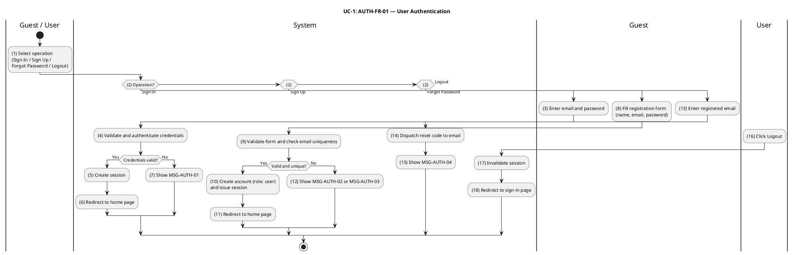

#### Business Rules

| Activity | BR Code   | Description                                                                                                                                                                                                                                                                                                                                                                                                                                                                                                                              |
| -------- | --------- | ---------------------------------------------------------------------------------------------------------------------------------------------------------------------------------------------------------------------------------------------------------------------------------------------------------------------------------------------------------------------------------------------------------------------------------------------------------------------------------------------------------------------------------------- |
| _(3)_    | _BR-1.1_  | **Form Input Rules (Sign In):**<br>❖ System collects `email` and `password` from user input.                                                                                                                                                                                                                                                                                                                                                                                                                                             |
| _(4)_    | _BR-1.2_  | **Authenticate Rules:**<br>❖ System validates that `email` exists in the `users` table via the Better Auth account adapter.<br>❖ Password comparison uses Better Auth's configured hashing algorithm (scrypt by default; salted, constant-time compare).<br>❖ Authentication failure (unknown email OR wrong password) returns HTTP 401 referencing `MSG-AUTH-01` without leaking which factor failed.<br>❖ After `auth.api.signInEmail({ body: { email, password } })` succeeds, a session token is created and returned to the client. |
| _(7)_    | _BR-1.3_  | **Message Rules (Sign In Failure):**<br>❖ System displays `MSG-AUTH-01` on authentication failure (email not found or password incorrect).                                                                                                                                                                                                                                                                                                                                                                                               |
| _(5)_    | _BR-1.4_  | **Session Creation Rules:**<br>❖ Upon successful authentication, system creates a session record with `expiresAt = now + sessionTtl` (default 7 days).<br>❖ `ipAddress` and `userAgent` are captured for audit purposes.<br>❖ Session token is returned to client as Bearer token for all subsequent authenticated requests.<br>❖ After `auth.api.signInEmail({ body: { email, password } })` completes, session token returned to client.                                                                                               |
| _(8)_    | _BR-1.5_  | **Registration Form Rules:**<br>❖ System collects `name` (full name), `email`, and `password` from the registration form.                                                                                                                                                                                                                                                                                                                                                                                                                |
| _(9)_    | _BR-1.6_  | **Validate Rules (Sign Up):**<br>❖ `name` must be a non-empty string.<br>❖ `email` must be a valid email format.<br>❖ `password` must be at least 8 characters and contain at least one letter and one digit.<br>❖ Invalid input returns HTTP 400 referencing `MSG-AUTH-03`.<br>❖ If `auth.api.signUpEmail({ body: { email, password, name } })` returns false, system returns an error response referencing `MSG-AUTH-03`.                                                                                                              |
| _(12)_   | _BR-1.7_  | **Duplicate Email Rules:**<br>❖ Email uniqueness is enforced at the database layer via a `UNIQUE` constraint on `users.email`.<br>❖ A pre-flight check inside `auth.api.signUpEmail({ body: { email, password, name } })` rejects sign-up when the email already exists.<br>❖ Duplicate email returns HTTP 409 referencing `MSG-AUTH-02`; no account is created and no password hash is computed.                                                                                                                                        |
| _(10)_   | _BR-1.8_  | **Account Initialization Rules:**<br>❖ New user account is created with `role = 'user'` and `status = 'active'`.<br>❖ Password is stored as a cryptographic hash; plaintext is never persisted.<br>❖ Elevation to `'restaurant'`, `'shipper'`, or `'admin'` role occurs through partner onboarding (UC-11, UC-16) or admin workflows (UC-35).                                                                                                                                                                                            |
| _(14)_   | _BR-1.9_  | **Reset Code Dispatch Rules:**<br>❖ System generates a single-use OTP valid for 60 minutes and stores it in the verification repository.<br>❖ OTP is transmitted via the configured channel (email or SMS) to the registered email address.<br>❖ System responds HTTP 200 referencing `MSG-AUTH-04` regardless of whether the email exists in the repository (anti-enumeration).<br>❖ After `auth.api.forgetPassword({ body: { email } })` completes, reset code dispatched to recipient mailbox.                                        |
| _(15)_   | _BR-1.10_ | **Message Rules (Reset Sent):**<br>❖ System displays `MSG-AUTH-04` confirming that a password reset code has been sent.                                                                                                                                                                                                                                                                                                                                                                                                                  |
| _(17)_   | _BR-1.11_ | **Logout Rules:**<br>❖ System immediately deletes the session record from the repository.<br>❖ Subsequent requests bearing the invalidated token receive HTTP 401 referencing `MSG-AUTH-05`.<br>❖ After `auth.api.signOut({ headers })` completes, session revoked.                                                                                                                                                                                                                                                                      |
| _(2)_    | _BR-1.12_ | **Session Validation Rules:**<br>❖ Every protected endpoint requires a valid non-expired Bearer token in the `Authorization` header.<br>❖ Missing, malformed, or expired token returns HTTP 401 referencing `MSG-AUTH-05`.<br>❖ Valid token attaches the session's user to the request context for authorization checks.<br>❖ If `auth.api.getSession({ headers })` fails the authorization check, system returns HTTP 403 referencing `MSG-AUTH-08`.                                                                                    |
| _(6)_    | _BR-1.13_ | **Redirect Rules (Sign In Success):**<br>❖ Upon successful authentication via Sign In, system redirects client to the home page.                                                                                                                                                                                                                                                                                                                                                                                                         |
| _(11)_   | _BR-1.14_ | **Redirect Rules (Sign Up Success):**<br>❖ Upon successful account creation via Sign Up, system redirects client to the home page and creates a session.                                                                                                                                                                                                                                                                                                                                                                                 |
| _(18)_   | _BR-1.15_ | **Redirect Rules (Logout):**<br>❖ Upon successful logout, system redirects client to the sign-in page.                                                                                                                                                                                                                                                                                                                                                                                                                                   |

---

### UC-2: Discover Restaurants & Food

| Name               | Discover Restaurants & Food                                                                                                          |
| ------------------ | ------------------------------------------------------------------------------------------------------------------------------------ |
| **Description**    | This use case describes how users search for restaurants and menu items by keyword, category, cuisine type, and geographic location. |
| **Actor**          | Guest, Customer                                                                                                                      |
| **Trigger**        | ❖ User navigates to the discovery or search page.<br>❖ User enters a search query or applies discovery filters.                      |
| **Pre-condition**  | ❖ None. Both authenticated and unauthenticated users may search.                                                                     |
| **Post-condition** | ❖ System returns a paginated list of matching restaurants and menu items.                                                            |

#### Activities Flow

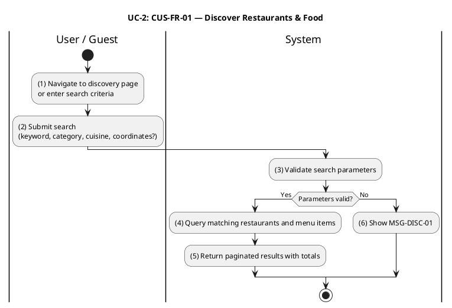

#### Business Rules

| Activity | BR Code  | Description                                                                                                                                                                                                                                                                                                                                                                                                                                                                                |
| -------- | -------- | ------------------------------------------------------------------------------------------------------------------------------------------------------------------------------------------------------------------------------------------------------------------------------------------------------------------------------------------------------------------------------------------------------------------------------------------------------------------------------------------ |
| _(3)_    | _BR-2.1_ | **Validate Rules:**<br>❖ If `lat` or `lon` is supplied, both must be present together. Missing one while providing the other returns HTTP 400 referencing `MSG-DISC-01`.<br>❖ `radiusKm` (if supplied) must be a positive number.<br>❖ If `SearchService.search(q, category, cuisineType, tag, lat, lon, radiusKm, offset, limit)` returns false, system returns an error response referencing `MSG-DISC-01`.                                                                              |
| _(6)_    | _BR-2.2_ | **Message Rules (Invalid Parameters):**<br>❖ System displays `MSG-DISC-01` for invalid or incomplete coordinate pairing.                                                                                                                                                                                                                                                                                                                                                                   |
| _(4)_    | _BR-2.3_ | **Pagination Rules:**<br>❖ `limit` is clamped to [1, 100]. `offset` is clamped to ≥ 0.<br>❖ Requests outside these bounds are silently corrected and processed with clamped values (no error returned).<br>❖ If `SearchService.search(q, category, cuisineType, tag, lat, lon, radiusKm, offset, limit)` returns false, system returns an error response referencing `MSG-DISC-02` (pagination params normalized).                                                                         |
| _(4)_    | _BR-2.4_ | **Restaurant Query Rules:**<br>❖ Only restaurants with `isApproved = true` AND `isOpen = true` are included in results.<br>❖ If `lat`, `lon`, and `radiusKm` are provided, filtering applies Haversine distance and returns only restaurants within the specified radius.<br>❖ When `RestaurantRepository.findAll({ offset, limit })` and `SearchService.search(q, category, cuisineType, tag, lat, lon, radiusKm, offset, limit)` executes, matching restaurants returned.                |
| _(4)_    | _BR-2.5_ | **Item Query Rules:**<br>❖ Only items with `status = 'available'` are included in search results.<br>❖ Items are populated only when at least one search criterion (`q`, `category`, or `tag`) is provided; otherwise empty array is returned.<br>❖ When `SearchService.search(q, category, cuisineType, tag, lat, lon, radiusKm, offset, limit)` executes, matching items returned.                                                                                                       |
| _(4)_    | _BR-2.6_ | **Relevance Scoring Rules:**<br>❖ Restaurants: exact name match +12 points, partial name match +9, cuisine match +6, description partial match +2.<br>❖ Items: exact name match +12 points, partial name match +8, tag match +5, category match +3.<br>❖ Results are sorted by score descending; ties broken by stable UUID ordering.<br>❖ After `SearchService.search(q, category, cuisineType, tag, lat, lon, radiusKm, offset, limit)` completes, ranked result set returned to caller. |
| _(5)_    | _BR-2.7_ | **Response Rules:**<br>❖ Response includes `total.restaurants` and `total.items` reflecting the full match count before pagination.<br>❖ If no results match the query, system returns HTTP 200 with empty arrays and zero totals (never HTTP 404).                                                                                                                                                                                                                                        |

---

### UC-3: View Restaurant Details

| Name               | View Restaurant Details                                                                                                            |
| ------------------ | ---------------------------------------------------------------------------------------------------------------------------------- |
| **Description**    | This use case describes how users view a restaurant's profile and its full menu, including categories, items, and modifier groups. |
| **Actor**          | Guest, Customer                                                                                                                    |
| **Trigger**        | ❖ User clicks a restaurant card from the discovery or search results page.                                                         |
| **Pre-condition**  | ❖ None. Available to authenticated and unauthenticated users.                                                                      |
| **Post-condition** | ❖ System returns the restaurant's profile and complete menu structure.                                                             |

#### Activities Flow

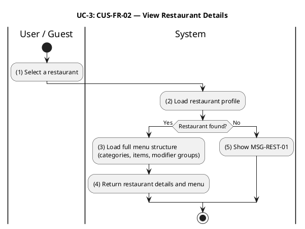

#### Business Rules

| Activity | BR Code  | Description                                                                                                                                                                                                                                                                                                                                                                                                                                                      |
| -------- | -------- | ---------------------------------------------------------------------------------------------------------------------------------------------------------------------------------------------------------------------------------------------------------------------------------------------------------------------------------------------------------------------------------------------------------------------------------------------------------------- |
| _(2)_    | _BR-3.1_ | **Validate Rules:**<br>❖ Restaurant `:id` path parameter must be a valid UUID format. Invalid format returns HTTP 400.                                                                                                                                                                                                                                                                                                                                           |
| _(2)_    | _BR-3.2_ | **Restaurant Lookup Rules:**<br>❖ System queries the restaurant repository by ID. If no record is found, system returns HTTP 404 referencing `MSG-REST-01`.<br>❖ No distinction is made between non-existent and unapproved restaurants to prevent information disclosure.<br>❖ If `RestaurantService.findOne(id)` returns null or empty, system returns an error response referencing `MSG-REST-01` (restaurant not found).                                     |
| _(5)_    | _BR-3.3_ | **Message Rules (Not Found):**<br>❖ System displays `MSG-REST-01` when restaurant does not exist or is unapproved.                                                                                                                                                                                                                                                                                                                                               |
| _(3)_    | _BR-3.4_ | **Menu Load Rules:**<br>❖ System returns all menu items regardless of their availability status (`available`, `out_of_stock`, `unavailable`).<br>❖ Client is responsible for rendering availability badges; server-side enforcement of availability occurs only at add-to-cart (UC-4, BR-4.2).<br>❖ When `MenuRepository.findByRestaurant(restaurantId, opts)` and `ModifiersService.findGroupsByMenuItem(menuItemId)` executes, menu groups and items returned. |
| _(4)_    | _BR-3.5_ | **Response Rules:**<br>❖ System returns a single JSON object containing restaurant profile (metadata, location, contact) and complete menu structure (categories, items, modifier groups with options).                                                                                                                                                                                                                                                          |

---

### UC-4: Add Item to Cart

| Name               | Add Item to Cart                                                                                               |
| ------------------ | -------------------------------------------------------------------------------------------------------------- |
| **Description**    | This use case describes how a customer adds a menu item with selected modifier options to their shopping cart. |
| **Actor**          | Customer (authenticated, role `'user'`)                                                                        |
| **Trigger**        | ❖ Customer taps "Add to Cart" on a menu item in the restaurant detail page.                                    |
| **Pre-condition**  | ❖ Customer is authenticated.<br>❖ The target restaurant's Ordering ACL snapshot is available.                  |
| **Post-condition** | ❖ The item is added or merged into the customer's cart. Cart TTL is reset to 7 days.                           |

#### Activities Flow

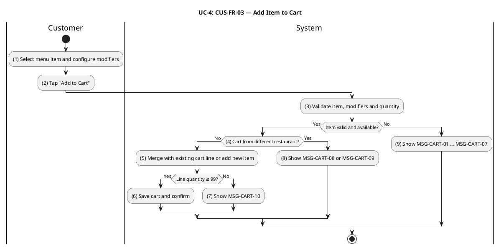

#### Business Rules

| Activity | BR Code   | Description                                                                                                                                                                                                                                                                                                                                                                                                                                                                                                                                                                                                                               |
| -------- | --------- | ----------------------------------------------------------------------------------------------------------------------------------------------------------------------------------------------------------------------------------------------------------------------------------------------------------------------------------------------------------------------------------------------------------------------------------------------------------------------------------------------------------------------------------------------------------------------------------------------------------------------------------------- |
| _(3)_    | _BR-4.1_  | **Validate Rules (Basic Fields):**<br>❖ `quantity` must be in [1, 99]. `unitPrice` must be > 0. `menuItemId` and `restaurantId` must be valid UUIDs. `itemName` must be non-empty.<br>❖ Invalid input returns HTTP 400 with field-level error details.                                                                                                                                                                                                                                                                                                                                                                                    |
| _(3)_    | _BR-4.2_  | **Item Availability Rules:**<br>❖ System fetches the Ordering ACL snapshot for the restaurant. If no snapshot is found, returns HTTP 400 referencing `MSG-CART-01`.<br>❖ Item `status` must be `'available'` within the snapshot. If not, returns HTTP 409 referencing `MSG-CART-02`.<br>❖ If `AclService.validateMenuItemSnapshot(menuItemId)` returns null or empty, system returns an error response referencing `MSG-CART-02` (item unavailable).                                                                                                                                                                                     |
| _(9)_    | _BR-4.3_  | **Message Rules (Item Validation Failure):**<br>❖ System displays appropriate error message from MSG-CART-01 through MSG-CART-07 based on the validation failure type.                                                                                                                                                                                                                                                                                                                                                                                                                                                                    |
| _(3)_    | _BR-4.4_  | **Modifier Validation Rules:**<br>❖ Each `(groupId, optionId)` pair must exist and be available on the snapshot.<br>❖ Per-group selection count must satisfy `minSelections ≤ count ≤ maxSelections`.<br>● Modifier group not found → HTTP 400 + `MSG-CART-03`.<br>● Modifier option not found → HTTP 400 + `MSG-CART-04`.<br>● Option unavailable → HTTP 400 + `MSG-CART-05`.<br>● Below minimum selections → HTTP 400 + `MSG-CART-06`.<br>● Exceeds maximum selections → HTTP 400 + `MSG-CART-07`.<br>❖ If `AclService.validateMenuItemSnapshot(menuItemId)` returns false, system returns an error response referencing `MSG-CART-03`. |
| _(9)_    | _BR-4.5_  | **Message Rules (Modifier Error):**<br>❖ On modifier validation failure, system displays the specific MSG code (`MSG-CART-03` through `MSG-CART-07`) corresponding to the failure reason.                                                                                                                                                                                                                                                                                                                                                                                                                                                 |
| _(4)_    | _BR-4.6_  | **Single-Restaurant Cart Check:**<br>❖ System verifies the customer's existing cart (if any) is empty or contains items from the same restaurant.<br>❖ If cart contains items from a different restaurant, returns HTTP 409 referencing `MSG-CART-08`.<br>❖ If ACL snapshot `restaurantId` mismatches request `restaurantId`, returns HTTP 409 referencing `MSG-CART-09`.<br>❖ If `CartService.addItem(customerId, dto)` returns false, system returns an error response referencing `MSG-CART-04` (cart belongs to different restaurant).                                                                                                |
| _(8)_    | _BR-4.7_  | **Message Rules (Cart Mismatch):**<br>❖ System displays `MSG-CART-08` (different restaurant) or `MSG-CART-09` (ACL mismatch) on cart conflict.                                                                                                                                                                                                                                                                                                                                                                                                                                                                                            |
| _(5)_    | _BR-4.8_  | **Line Item Merge Rules:**<br>❖ Line item identity is defined by `(menuItemId, modifierFingerprint)`. Adding the same item with identical modifiers increments the existing line's quantity.<br>❖ Per-line ceiling is 99 units. Adding would exceed this → HTTP 400 referencing `MSG-CART-10`.<br>❖ After `CartService.addItem(customerId, dto)` completes, line merged or appended in cart.                                                                                                                                                                                                                                              |
| _(7)_    | _BR-4.9_  | **Message Rules (Quantity Exceeded):**<br>❖ System displays `MSG-CART-10` when per-line quantity ceiling (99) would be exceeded.                                                                                                                                                                                                                                                                                                                                                                                                                                                                                                          |
| _(5)_    | _BR-4.10_ | **Cart Persistence Rules:**<br>❖ Cart is stored in Redis under key `cart:<customerId>`. Every successful mutation resets TTL to 7 days.<br>❖ After `CartService.addItem(customerId, dto)` completes, cart persisted in Redis with TTL.                                                                                                                                                                                                                                                                                                                                                                                                    |
| _(6)_    | _BR-4.11_ | **Response Rules:**<br>❖ System returns HTTP 200 with updated cart snapshot including all line items, subtotal, and restaurantId.                                                                                                                                                                                                                                                                                                                                                                                                                                                                                                         |

---

### UC-5: Manage Shopping Cart

| Name               | Manage Shopping Cart                                                                                             |
| ------------------ | ---------------------------------------------------------------------------------------------------------------- |
| **Description**    | This use case describes how a customer views, modifies, and clears their shopping cart prior to checkout.        |
| **Actor**          | Customer (authenticated, role `'user'`)                                                                          |
| **Trigger**        | ❖ Customer navigates to the cart screen.<br>❖ Customer taps an update, remove, or clear action.                  |
| **Pre-condition**  | ❖ Customer is authenticated.                                                                                     |
| **Post-condition** | ❖ Cart reflects the requested change. If the cart becomes empty, it is deleted and subsequent reads return null. |

#### Activities Flow

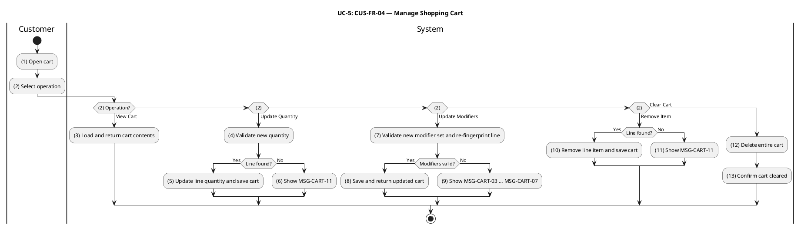

#### Business Rules

| Activity | BR Code   | Description                                                                                                                                                                                                                                                                                                                                                                                                                                                         |
| -------- | --------- | ------------------------------------------------------------------------------------------------------------------------------------------------------------------------------------------------------------------------------------------------------------------------------------------------------------------------------------------------------------------------------------------------------------------------------------------------------------------- |
| _(3)_    | _BR-5.1_  | **Cart Access Rules:**<br>❖ Cart is strictly scoped to the authenticated customer (`customerId = session.user.id`).<br>❖ If no cart exists for the customer, system returns HTTP 200 with `null`.<br>❖ If `CartService.getCart(customerId)` returns null or empty, system returns an error response referencing `MSG-CART-01` (cart not found).                                                                                                                     |
| _(4)_    | _BR-5.2_  | **Validate Quantity Rules:**<br>❖ New `quantity` must be in [0, 99].<br>❖ Setting `quantity = 0` removes the line item (equivalent to Remove Item operation).                                                                                                                                                                                                                                                                                                       |
| _(5)_    | _BR-5.3_  | **Update Quantity Rules:**<br>❖ System updates the specified line's quantity and resets Redis TTL to 7 days.<br>❖ After `CartService.updateItemQuantity(customerId, cartItemId, dto)` completes, quantity updated and totals recomputed.                                                                                                                                                                                                                            |
| _(6)_    | _BR-5.4_  | **Message Rules (Line Not Found):**<br>❖ If `cartItemId` is not found in the customer's cart, system returns HTTP 404 referencing `MSG-CART-11`.                                                                                                                                                                                                                                                                                                                    |
| _(7)_    | _BR-5.5_  | **Update Modifiers Rules:**<br>❖ Modifier set is replaced wholesale. Validation reuses BR-4.4 rules (`MSG-CART-03` through `MSG-CART-07`).<br>❖ If new modifier fingerprint collides with an existing line, the two lines are merged subject to the 99-unit ceiling.<br>❖ Overflow on merge returns HTTP 400 referencing `MSG-CART-10`.<br>❖ After `CartService.updateItemModifiers(customerId, cartItemId, dto)` completes, modifier selections persisted on line. |
| _(8)_    | _BR-5.6_  | **Response Rules (Update Modifiers):**<br>❖ System returns HTTP 200 with updated cart snapshot reflecting new modifier set and merged quantities.                                                                                                                                                                                                                                                                                                                   |
| _(9)_    | _BR-5.7_  | **Message Rules (Modifier Error):**<br>❖ On modifier validation failure during update, system displays the specific error message (`MSG-CART-03` through `MSG-CART-07`).                                                                                                                                                                                                                                                                                            |
| _(10)_   | _BR-5.8_  | **Remove Item Rules:**<br>❖ System deletes the specified line item from the cart. If `cartItemId` not found, returns HTTP 404 referencing `MSG-CART-11`.<br>❖ After `CartService.removeItem(customerId, cartItemId)` completes, line removed from cart.                                                                                                                                                                                                             |
| _(11)_   | _BR-5.9_  | **Message Rules (Remove Item Failure):**<br>❖ If specified line does not exist, system displays `MSG-CART-11`.                                                                                                                                                                                                                                                                                                                                                      |
| _(12)_   | _BR-5.10_ | **Clear Cart Rules:**<br>❖ System deletes the entire cart record. Clear is idempotent; clearing an already-empty cart returns HTTP 204 without error.<br>❖ After `CartService.clearCart(customerId)` completes, cart cleared.                                                                                                                                                                                                                                       |
| _(5)_    | _BR-5.11_ | **Empty State Rules (Update Qty):**<br>❖ When the last item is removed by setting `quantity = 0`, the Redis key is deleted.                                                                                                                                                                                                                                                                                                                                         |
| _(10)_   | _BR-5.12_ | **Empty State Rules (Remove Item):**<br>❖ When the last item is removed via Remove Item, the Redis key is deleted.                                                                                                                                                                                                                                                                                                                                                  |
| _(12)_   | _BR-5.13_ | **Empty State Rules (Clear Cart):**<br>❖ Clear Cart deletes the Redis key. Subsequent GET requests return `null`. Deletion returns HTTP 204 No Content.                                                                                                                                                                                                                                                                                                             |
| _(13)_   | _BR-5.14_ | **Response Rules (Clear Confirmation):**<br>❖ System confirms cart cleared with HTTP 204 No Content.                                                                                                                                                                                                                                                                                                                                                                |
| _(5)_    | _BR-5.15_ | **TTL Reset Rules (Update Qty):**<br>❖ Successful quantity update resets Redis TTL to 7 days. Read-only GET does not reset TTL.<br>❖ After `CartService.addItem(customerId, dto)` completes, cart TTL refreshed.                                                                                                                                                                                                                                                    |
| _(8)_    | _BR-5.16_ | **TTL Reset Rules (Update Modifiers):**<br>❖ Successful modifier update resets Redis TTL to 7 days.                                                                                                                                                                                                                                                                                                                                                                 |
| _(10)_   | _BR-5.17_ | **TTL Reset Rules (Remove Item):**<br>❖ Successful line removal resets Redis TTL to 7 days.                                                                                                                                                                                                                                                                                                                                                                         |
| _(12)_   | _BR-5.18_ | **TTL Reset Rules (Clear Cart):**<br>❖ Clear Cart immediately expires the Redis key.                                                                                                                                                                                                                                                                                                                                                                                |

---

### UC-6: Save & Manage Delivery Addresses

| Name               | Save & Manage Delivery Addresses                                                                                                                                              |
| ------------------ | ----------------------------------------------------------------------------------------------------------------------------------------------------------------------------- |
| **Description**    | This use case describes how a customer provides a delivery address at checkout. The address is validated, captured into the order, and checked for delivery zone eligibility. |
| **Actor**          | Customer (authenticated, role `'user'`)                                                                                                                                       |
| **Trigger**        | ❖ Customer proceeds to checkout and enters a delivery address.                                                                                                                |
| **Pre-condition**  | ❖ Customer is authenticated and has a non-empty cart.                                                                                                                         |
| **Post-condition** | ❖ Delivery address is captured and immutably stored with the placed order.                                                                                                    |

#### Activities Flow

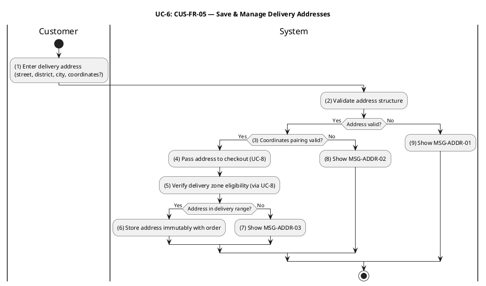

#### Business Rules

| Activity | BR Code  | Description                                                                                                                                                                                                                                                                                                                                                                                                                                                                                                                                                                                 |
| -------- | -------- | ------------------------------------------------------------------------------------------------------------------------------------------------------------------------------------------------------------------------------------------------------------------------------------------------------------------------------------------------------------------------------------------------------------------------------------------------------------------------------------------------------------------------------------------------------------------------------------------- |
| _(2)_    | _BR-6.1_ | **Validate Address Structure:**<br>❖ `address` is a required non-empty string (1–255 chars, trimmed); `unit` is optional (max 50 chars); `instructions` is optional (max 500 chars).<br>❖ Class-validator decorators on `DeliveryAddressDto` run before the controller body executes.<br>❖ Malformed structure returns HTTP 400 referencing `MSG-ADDR-01`.                                                                                                                                                                                                                                  |
| _(3)_    | _BR-6.2_ | **Validate Coordinate Pairing:**<br>❖ `lat` and `lon` are required, finite numbers within `lat ∈ [-90, 90]` and `lon ∈ [-180, 180]`.<br>❖ For SoLi's Vietnam-only operational scope, both coordinates must lie within Vietnam's bounding box (`lat ∈ [8.18, 23.39]`, `lon ∈ [102.14, 109.46]`).<br>❖ Supplying one coordinate without the other, or any out-of-bounds value, returns HTTP 400 referencing `MSG-ADDR-02`.                                                                                                                                                                    |
| _(8)_    | _BR-6.3_ | **Message Rules (Address Validation Failure):**<br>❖ System displays `MSG-ADDR-01` for invalid address structure or `MSG-ADDR-02` for invalid coordinate pairing.                                                                                                                                                                                                                                                                                                                                                                                                                           |
| _(9)_    | _BR-6.4_ | **Message Rules (Coordinate Validation):**<br>❖ Coordinates must lie within Vietnam's geographic bounds; out-of-bounds returns HTTP 400 referencing `MSG-ADDR-02`.                                                                                                                                                                                                                                                                                                                                                                                                                          |
| _(4)_    | _BR-6.5_ | **Delivery Zone Eligibility Check (via UC-8):**<br>❖ System passes the address to UC-8 (Place Order) where zone eligibility is evaluated via Haversine distance to restaurant's delivery zone center.                                                                                                                                                                                                                                                                                                                                                                                       |
| _(5)_    | _BR-6.6_ | **Zone Selection Rules:**<br>❖ The innermost eligible zone (smallest `radiusKm`) is selected. If address falls outside all active zones, UC-8 returns HTTP 422 referencing `MSG-ADDR-03`.<br>❖ If `ZonesService.findByRestaurant(restaurantId)` returns null or empty, system returns an error response referencing `MSG-ADDR-03` (address falls outside any active delivery zone).                                                                                                                                                                                                         |
| _(7)_    | _BR-6.7_ | **Message Rules (Out of Delivery Range):**<br>❖ System displays `MSG-ADDR-03` when address is outside all active delivery zones.                                                                                                                                                                                                                                                                                                                                                                                                                                                            |
| _(6)_    | _BR-6.8_ | **Address Immutability Rules:**<br>❖ At checkout the chosen delivery address is **snapshot-copied** onto the `orders` row (`address`, `unit`, `instructions`, `lat`, `lon`).<br>❖ Subsequent edits to the customer's address book DO NOT propagate to historical orders.<br>❖ Deleting or mutating an address that is referenced by an active in-flight order is rejected with HTTP 409 referencing `MSG-ADDR-04`.                                                                                                                                                                          |
| _(1)_    | _BR-6.9_ | **Address Book Lifecycle Rules:**<br>❖ A customer may save up to 10 named addresses (e.g. _home_, _work_, custom labels); exceeding the limit returns HTTP 422 referencing `MSG-ADDR-05`.<br>❖ The default-address flag is mutually exclusive — setting another address as default unflags the previous one in the same DB transaction.<br>❖ Deletion is soft (sets `deletedAt`); orders that already snapshotted the address retain their copy (see BR-6.8).<br>❖ Create, update, and delete operations persist immediately and return the updated address book referencing `MSG-ADDR-06`. |

---

### UC-7: Manage Delivery Zones

| Name               | Manage Delivery Zones                                                                                                                                                                  |
| ------------------ | -------------------------------------------------------------------------------------------------------------------------------------------------------------------------------------- |
| **Description**    | This use case describes how restaurant partners and administrators configure delivery zones (create, update, delete, list), and how customers request a delivery fee and ETA estimate. |
| **Actor**          | Restaurant Partner (role `'restaurant'`), Administrator (role `'admin'`), Customer (estimate only)                                                                                     |
| **Trigger**        | ❖ Restaurant Partner navigates to the delivery zone management screen.<br>❖ Customer requests a delivery estimate from the restaurant detail page.                                     |
| **Pre-condition**  | ❖ Zone management: actor is authenticated as Restaurant Partner or Admin.<br>❖ Estimate: restaurant has a configured location and at least one active delivery zone.                   |
| **Post-condition** | ❖ Zone management: zone is created, updated, or deleted; ACL snapshot is synchronized.<br>❖ Estimate: system returns the computed delivery fee and estimated time.                     |

#### Activities Flow

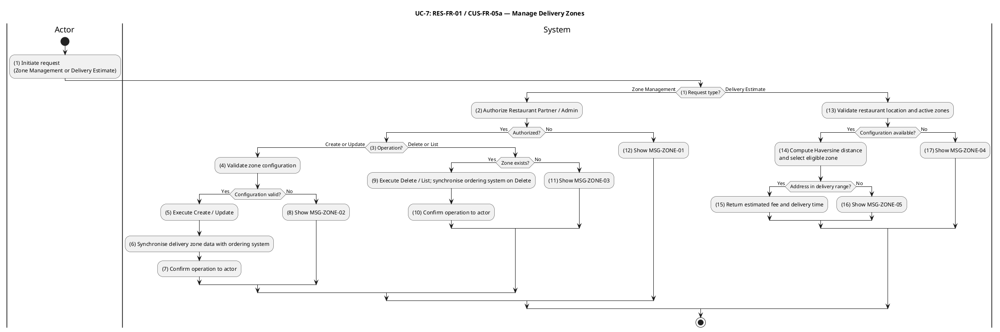

#### Business Rules

| Activity | BR Code   | Description                                                                                                                                                                                                                                                                                                                                                                                                                                                                                                                                     |
| -------- | --------- | ----------------------------------------------------------------------------------------------------------------------------------------------------------------------------------------------------------------------------------------------------------------------------------------------------------------------------------------------------------------------------------------------------------------------------------------------------------------------------------------------------------------------------------------------- |
| _(2)_    | _BR-7.1_  | **Authorization Rules (Zone Management):**<br>❖ Restaurant Partners may manage zones only for their own restaurants. Administrators may manage zones for any restaurant.<br>❖ Unauthorized access returns HTTP 403 referencing `MSG-ZONE-01`.<br>❖ If `ZonesService.create(restaurantId, requesterId, isAdmin, dto)` fails the authorization check, system returns HTTP 403 referencing `MSG-ZONE-01`.                                                                                                                                          |
| _(12)_   | _BR-7.2_  | **Message Rules (Zone Authorization Failure):**<br>❖ System displays `MSG-ZONE-01` when user lacks permission to manage the requested zone.                                                                                                                                                                                                                                                                                                                                                                                                     |
| _(4)_    | _BR-7.3_  | **Validate Zone Configuration:**<br>❖ `name` must be non-empty. `radiusKm` must be ≥ 0.1. `baseFee` and `perKmRate` must be non-negative integers that are exact multiples of 1,000 VND. `avgSpeedKmh` must be in [1, 120]. `prepTimeMinutes` and `bufferMinutes` must be ≥ 0.<br>❖ Invalid input returns HTTP 400 referencing `MSG-ZONE-02`.<br>❖ If `ZonesService.create(restaurantId, requesterId, isAdmin, dto)` returns false, system returns an error response referencing `MSG-ZONE-02`.                                                 |
| _(8)_    | _BR-7.4_  | **Message Rules (Zone Validation Failure):**<br>❖ System displays `MSG-ZONE-02` for invalid zone configuration.                                                                                                                                                                                                                                                                                                                                                                                                                                 |
| _(9)_    | _BR-7.5_  | **Zone Not Found Rules (Update / Delete):**<br>❖ Update or Delete operations on a non-existent zone ID return HTTP 404 referencing `MSG-ZONE-03`.                                                                                                                                                                                                                                                                                                                                                                                               |
| _(11)_   | _BR-7.6_  | **Message Rules (Zone Not Found):**<br>❖ System displays `MSG-ZONE-03` when zone ID does not exist.                                                                                                                                                                                                                                                                                                                                                                                                                                             |
| _(6)_    | _BR-7.7_  | **ACL Synchronization (Create / Update):**<br>❖ Every successful Create or Update publishes a `DeliveryZoneSnapshotUpdatedEvent`.<br>❖ Ordering ACL projector upserts the corresponding snapshot row. UC-8 reads zone data exclusively from this ACL projection.<br>❖ After `RestaurantService.create(ownerId, dto)` and `RestaurantService.update(id, requesterId, isAdmin, dto)` completes, `eventBus.publish(new RestaurantUpdatedEvent(restaurantId))` publishes the corresponding domain event (ACL snapshot synchronised in ordering BC). |
| _(9)_    | _BR-7.8_  | **ACL Synchronization (Delete):**<br>❖ Every successful Delete publishes a `DeliveryZoneSnapshotUpdatedEvent`.<br>❖ Ordering ACL projector removes the snapshot row.<br>❖ After `ZonesService.remove(id, restaurantId, requesterId, isAdmin)` completes, `eventBus.publish(new RestaurantUpdatedEvent(restaurantId))` publishes the corresponding domain event (ACL snapshot invalidated in ordering BC).                                                                                                                                       |
| _(13)_   | _BR-7.9_  | **Estimate Precondition Validation:**<br>❖ System verifies restaurant has configured `latitude` / `longitude` and at least one active delivery zone.<br>❖ Missing configuration returns HTTP 422 referencing `MSG-ZONE-04`.<br>❖ If `ZonesService.findByRestaurant(restaurantId)` returns false, system returns an error response referencing `MSG-ZONE-03`.                                                                                                                                                                                    |
| _(17)_   | _BR-7.10_ | **Message Rules (Estimate Precondition Failed):**<br>❖ System displays `MSG-ZONE-04` when restaurant has no location or active zones.                                                                                                                                                                                                                                                                                                                                                                                                           |
| _(14)_   | _BR-7.11_ | **Zone Selection Rules:**<br>❖ A zone is eligible when Haversine distance from restaurant to customer address ≤ zone `radiusKm`.<br>❖ Multiple eligible zones: innermost zone (smallest `radiusKm`) is selected. No eligible zone → HTTP 422 referencing `MSG-ZONE-05`.                                                                                                                                                                                                                                                                         |
| _(16)_   | _BR-7.12_ | **Message Rules (Out of Delivery Range):**<br>❖ System displays `MSG-ZONE-05` when address falls outside all eligible delivery zones.                                                                                                                                                                                                                                                                                                                                                                                                           |
| _(15)_   | _BR-7.13_ | **Fee and ETA Calculation Rules:**<br>❖ `shippingFee = round((baseFee + distanceKm × perKmRate) / 1000) × 1000` (nearest 1,000 VND).<br>❖ `estimatedDeliveryMinutes = ceil(prepTimeMinutes + (distanceKm / avgSpeedKmh) × 60 + bufferMinutes)`.<br>❖ After `ZonesService.findByRestaurant(restaurantId)` completes, fee and ETA returned in response payload.                                                                                                                                                                                   |

---

### UC-8: Place Order

| Name               | Place Order                                                                                                                                                                                                                                                                      |
| ------------------ | -------------------------------------------------------------------------------------------------------------------------------------------------------------------------------------------------------------------------------------------------------------------------------- |
| **Description**    | This use case describes the complete checkout flow in which a customer submits their cart to create an order. The system validates the cart contents, computes the final price, applies any promotion, persists the order, and initiates payment if the customer selected VNPay. |
| **Actor**          | Customer (authenticated, role `'user'`)                                                                                                                                                                                                                                          |
| **Trigger**        | ❖ Customer taps "Place Order" on the checkout confirmation screen.                                                                                                                                                                                                               |
| **Pre-condition**  | ❖ Customer is authenticated.<br>❖ Cart is non-empty.<br>❖ Delivery address is provided.<br>❖ Payment method is selected.                                                                                                                                                         |
| **Post-condition** | ❖ Order is persisted with `status = 'pending'`. Cart is cleared.<br>❖ For VNPay, a payment URL is returned.                                                                                                                                                                      |

#### Activities Flow

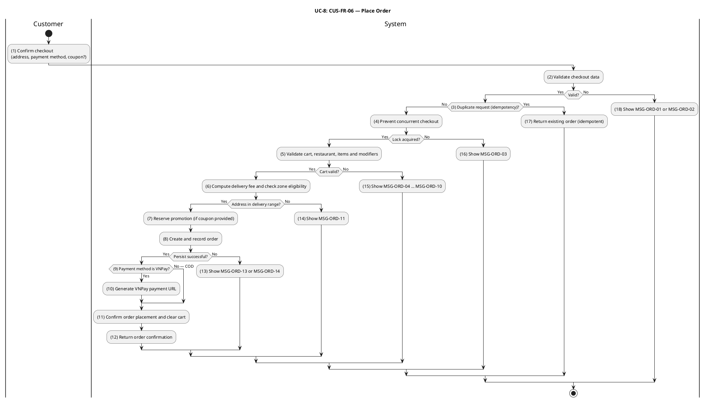

#### Business Rules

| Activity | BR Code   | Description                                                                                                                                                                                                                                                                                                                                                                                                                                                                                                                                                                                                                                                                                        |
| -------- | --------- | -------------------------------------------------------------------------------------------------------------------------------------------------------------------------------------------------------------------------------------------------------------------------------------------------------------------------------------------------------------------------------------------------------------------------------------------------------------------------------------------------------------------------------------------------------------------------------------------------------------------------------------------------------------------------------------------------- |
| _(2)_    | _BR-8.1_  | **Validate Rules:**<br>❖ `paymentMethod ∈ {cod, vnpay}`, `deliveryAddress.lat`, `deliveryAddress.lon`, and `deliveryAddress.address` are required.<br>❖ `idempotencyKey` is optional but, when present, must be a UUID v4; `couponCode` is optional; `notes` is optional (≤ 500 chars).<br>❖ Class-validator decorators on `CheckoutDto` validate every field before the handler runs; failures return HTTP 400 referencing `MSG-ORD-01`.<br>❖ A malformed `idempotencyKey` returns HTTP 400 referencing `MSG-ORD-02`.                                                                                                                                                                             |
| _(18)_   | _BR-8.2_  | **Input Validation Error Response Rules:**<br>❖ When input validation fails at activity (2), the system returns HTTP 400 with the appropriate error code.<br>❖ Responses reference `MSG-ORD-01` (general validation failure) or `MSG-ORD-02` (malformed idempotency key).                                                                                                                                                                                                                                                                                                                                                                                                                          |
| _(3)_    | _BR-8.3_  | **Idempotency Rules:**<br>❖ Idempotency key is derived as `IDEMPOTENCY_KEY_PREFIX + customerId + ':' + cartId` (or the explicit client-supplied key, when present).<br>❖ `PlaceOrderHandler` calls `RedisService.setnx(key, orderId, IDEMPOTENCY_TTL_FALLBACK_SECONDS)` to atomically reserve the key.<br>❖ If the key already exists, the previously persisted `orderId` is returned with HTTP 200 — the checkout pipeline is NOT executed twice (replay behaviour, see BR-8.4).                                                                                                                                                                                                                  |
| _(17)_   | _BR-8.4_  | **Idempotency Replay Response Rules:**<br>❖ When an idempotent request is detected at activity (3), the system returns the previously recorded order (HTTP 200) without executing the checkout pipeline again.                                                                                                                                                                                                                                                                                                                                                                                                                                                                                     |
| _(4)_    | _BR-8.5_  | **Concurrency Lock Rules:**<br>❖ Cart lock key is `CART_KEY_PREFIX + customerId + CART_LOCK_SUFFIX`.<br>❖ `PlaceOrderHandler` acquires the lock via `RedisService.setnx(lockKey, sessionId, CART_LOCK_TTL_SECONDS)` (Redis SET NX EX semantics).<br>❖ Failure to acquire the lock indicates another checkout is in flight for the same customer; the handler returns HTTP 409 referencing `MSG-ORD-03`.<br>❖ The lock is released after the checkout transaction commits or rolls back.                                                                                                                                                                                                            |
| _(16)_   | _BR-8.6_  | **Concurrency Lock Error Response Rules:**<br>❖ When a concurrency lock cannot be acquired at activity (4), system returns HTTP 409 referencing `MSG-ORD-03` to indicate the checkout is in progress.                                                                                                                                                                                                                                                                                                                                                                                                                                                                                              |
| _(5)_    | _BR-8.7_  | **Cart Validation Rules:**<br>❖ Cart must be non-empty; otherwise HTTP 400 referencing `MSG-ORD-04`.<br>❖ The restaurant's Ordering ACL snapshot must exist; otherwise HTTP 422 referencing `MSG-ORD-05`.<br>❖ Restaurant must have `isApproved = true`; otherwise HTTP 422 referencing `MSG-ORD-06`.<br>❖ Restaurant must have `isOpen = true`; otherwise HTTP 422 referencing `MSG-ORD-07`.<br>❖ If `CartService.getCart(customerId)` returns null or empty, system returns an error response referencing `MSG-ORD-04` (cart missing or empty).                                                                                                                                                  |
| _(15)_   | _BR-8.8_  | **Cart Validation Error Response Rules:**<br>❖ When cart or restaurant validation fails at activity (5), system returns HTTP 400 (empty cart) or HTTP 422 (restaurant issues) with the corresponding error code: `MSG-ORD-04` through `MSG-ORD-07`.                                                                                                                                                                                                                                                                                                                                                                                                                                                |
| _(5)_    | _BR-8.9_  | **Item and Modifier Validation Rules:**<br>❖ Each cart item's Ordering ACL snapshot must exist; delisted items return HTTP 422 referencing `MSG-ORD-08`.<br>❖ Item's `restaurantId` in snapshot must match the cart's restaurant; mismatches return HTTP 422 referencing `MSG-ORD-09`.<br>❖ Item `status` must be `'available'`; `'out_of_stock'` or `'unavailable'` returns HTTP 422 referencing `MSG-ORD-10`.<br>❖ Modifier groups, options, availability flags, and min/max constraints are re-validated against the current ACL snapshot at checkout time.<br>❖ If `AclService.validateMenuItemSnapshot(menuItemId)` returns false, system returns an error response referencing `MSG-ORD-05`. |
| _(15)_   | _BR-8.10_ | **Item Validation Error Response Rules:**<br>❖ When item or modifier validation fails at activity (5), system returns HTTP 422 referencing one of `MSG-ORD-08`, `MSG-ORD-09`, or `MSG-ORD-10` depending on the specific validation failure.                                                                                                                                                                                                                                                                                                                                                                                                                                                        |
| _(6)_    | _BR-8.11_ | **Delivery Fee Calculation Rules:**<br>❖ Haversine distance is computed against the restaurant's delivery zone snapshots; the innermost eligible zone is selected (per BR-7.11).<br>❖ If the delivery address falls outside all zones, return HTTP 422 referencing `MSG-ORD-11`.<br>❖ `shippingFee` is computed per BR-7.13.<br>❖ If coordinates or zone snapshots are unavailable, `shippingFee = 0` and a warning is logged (graceful degradation).<br>❖ If `ZonesService.findByRestaurant(restaurantId)` returns null or empty, system returns an error response referencing `MSG-ORD-06` (address out of zone).                                                                                |
| _(14)_   | _BR-8.12_ | **Out-of-Zone Error Response Rules:**<br>❖ When the delivery address falls outside all eligible zones at activity (6), system returns HTTP 422 referencing `MSG-ORD-11`.                                                                                                                                                                                                                                                                                                                                                                                                                                                                                                                           |
| _(7)_    | _BR-8.13_ | **Promotion Reservation Rules:**<br>❖ Promotion reservation is non-blocking; if reservation fails or returns `discountAmount = 0`, checkout continues without a discount.<br>❖ Promotion usage is confirmed after successful order persistence; failures in confirmation are reconciled by the promotion reconciliation task.<br>❖ After `PromotionService.computeAndReserveDiscount(params)` executes, reservation succeeds and discount applied.                                                                                                                                                                                                                                                 |
| _(8)_    | _BR-8.14_ | **Server-Authoritative Pricing Rules:**<br>❖ All prices, modifier deltas, shipping fees, and discount amounts are **recomputed server-side** from the Ordering ACL snapshot at activity (8). Client-supplied prices are ignored.<br>❖ `itemsTotal = Σ (item.unitPrice × item.quantity + Σ option.priceDelta)`; `totalAmount = itemsTotal + shippingFee − discountAmount`.<br>❖ `totalAmount` MUST be greater than 0; non-positive totals return HTTP 422 referencing `MSG-ORD-12`.<br>❖ All VND amounts are stored and transmitted as positive integers (multiples of 1 000).                                                                                                                      |
| _(13)_   | _BR-8.15_ | **Pricing Validation Error Response Rules:**<br>❖ When computed `itemsTotal` is ≤ 0 at activity (8), system returns HTTP 422 referencing `MSG-ORD-12`.                                                                                                                                                                                                                                                                                                                                                                                                                                                                                                                                             |
| _(8)_    | _BR-8.16_ | **Atomic Persistence Rules:**<br>❖ The `orders`, `order_items`, and initial `order_status_logs` row are inserted in a single database transaction.<br>❖ A `UNIQUE` constraint on `orders.cartId` prevents two orders from the same cart.<br>❖ Duplicate constraint violation returns HTTP 409 referencing `MSG-ORD-13`; generic database failure returns HTTP 500 referencing `MSG-ORD-14`.<br>❖ After `CommandBus.execute(placeOrderCommand)` succeeds, order, payment transaction and audit row persist atomically.                                                                                                                                                                              |
| _(13)_   | _BR-8.17_ | **Persistence Error Response Rules:**<br>❖ When order persistence fails at activity (8) due to constraint violation or database error, system returns HTTP 409 (`MSG-ORD-13`) or HTTP 500 (`MSG-ORD-14`) accordingly.                                                                                                                                                                                                                                                                                                                                                                                                                                                                              |
| _(8)_    | _BR-8.18_ | **Initial Order State Rules:**<br>❖ New order `status = 'pending'`.<br>❖ `expiresAt = now + RESTAURANT_ACCEPT_TIMEOUT_SECONDS` (default 600 s); orders not acknowledged by the restaurant within this window are auto-cancelled by the order-timeout scheduler.                                                                                                                                                                                                                                                                                                                                                                                                                                    |
| _(9)_    | _BR-8.19_ | **Payment Transaction Recording Rules:**<br>❖ For `paymentMethod = 'vnpay'`: a `payment_transactions` row is created with `status = 'pending'`.<br>❖ For `paymentMethod = 'cod'`: no payment transaction is created at checkout; payment is collected at delivery.<br>❖ VNPay URL generation failure is logged but non-blocking; payment timeout reconciliation is handled by UC-9 (BR-9.11).<br>❖ After `PaymentTransactionRepository.create(data)` completes, `pending` payment transaction persisted alongside order.                                                                                                                                                                           |
| _(10)_   | _BR-8.20_ | **VNPay URL Generation Rules:**<br>❖ For `paymentMethod = 'vnpay'` at activity (9), a VNPay redirect URL is generated and included in the response payload.<br>❖ For `paymentMethod = 'cod'`, no URL is generated; checkout proceeds with next activity.<br>❖ If `PaymentService.initiateVNPayPayment(orderId, customerId, amount, ipAddr)` returns success, VNPay redirect URL returned to client; otherwise the system records the failure and surfaces it to the caller.                                                                                                                                                                                                                        |
| _(11)_   | _BR-8.21_ | **Post-Persistence Rules:**<br>❖ `OrderPlacedEvent` is published exactly once after successful persistence.<br>❖ Cart deletion (`cart:<customerId>`) is best-effort; failure does not invalidate the order.<br>❖ Successful response: HTTP 201 referencing `MSG-ORD-15` with payload `{ orderId, status: 'pending', totalAmount, shippingFee, discountAmount, paymentUrl?, estimatedDeliveryMinutes? }`.<br>❖ `eventBus.publish(new OrderPlacedEvent(orderId, customerId, totalAmount))` publishes the corresponding domain event.                                                                                                                                                                 |
| _(12)_   | _BR-8.22_ | **Order Confirmation Response Rules:**<br>❖ After successful order persistence at activity (11), system returns HTTP 201 with order confirmation payload and `MSG-ORD-15`.<br>❖ After `CartController.checkout(session, dto)` completes, confirmation payload with `orderId` and `paymentUrl` returned.                                                                                                                                                                                                                                                                                                                                                                                            |

---

### UC-9: Make Online Payment (VNPay)

| Name               | Make Online Payment (VNPay)                                                                                                                                                                                           |
| ------------------ | --------------------------------------------------------------------------------------------------------------------------------------------------------------------------------------------------------------------- |
| **Description**    | This use case describes how a customer completes payment through VNPay, how the system processes the IPN (Instant Payment Notification) callback, and how payment timeout is handled.                                 |
| **Actor**          | Customer, VNPay (external payment gateway), Automated System (timeout scheduler)                                                                                                                                      |
| **Trigger**        | ❖ Customer opens the VNPay payment URL received from UC-8.<br>❖ VNPay sends an IPN to the system after the customer completes or abandons payment.<br>❖ The payment timeout process detects expired payment sessions. |
| **Pre-condition**  | ❖ Order has `status = 'pending'` and `paymentMethod = 'vnpay'`.<br>❖ A `payment_transactions` row with `status = 'pending'` exists for the order.                                                                     |
| **Post-condition** | ❖ Payment Success: `payment_transactions.status = 'completed'`; order transitions to `'paid'`.<br>❖ Payment Failure or Timeout: `payment_transactions.status = 'failed'`; order transitions to `'cancelled'`.         |

#### Activities Flow


#### Business Rules

| Activity | BR Code   | Description                                                                                                                                                                                                                                                                                                                                                                                                                                                                                                                                                                                                                                                                                                                                                                                                                                                     |
| -------- | --------- | --------------------------------------------------------------------------------------------------------------------------------------------------------------------------------------------------------------------------------------------------------------------------------------------------------------------------------------------------------------------------------------------------------------------------------------------------------------------------------------------------------------------------------------------------------------------------------------------------------------------------------------------------------------------------------------------------------------------------------------------------------------------------------------------------------------------------------------------------------------- |
| _(5)_    | _BR-9.1_  | **Signature Verification Rules:**<br>❖ The IPN signature is verified using HMAC-SHA512 over the sorted VNPay query parameters with the merchant secret key, using constant-time comparison to prevent timing attacks.<br>❖ Signature verification is the mandatory first step before any database access.<br>❖ Invalid signature returns `MSG-PAY-01` (RspCode 97).<br>❖ If `VNPayService.verifyIpn(query)` returns false, system returns an error response referencing `MSG-PAY-01` (signature invalid).                                                                                                                                                                                                                                                                                                                                                       |
| _(15)_   | _BR-9.2_  | **Signature Verification Response Rules:**<br>❖ When IPN signature verification fails at activity (5), system returns `MSG-PAY-01` (RspCode 97) to VNPay.                                                                                                                                                                                                                                                                                                                                                                                                                                                                                                                                                                                                                                                                                                       |
| _(6)_    | _BR-9.3_  | **Transaction Lookup Rules:**<br>❖ `vnp_TxnRef` is used to resolve the `payment_transactions` record.<br>❖ If not found, system returns `MSG-PAY-02` (RspCode 01).<br>❖ If `PaymentTransactionRepository.findByProviderTxnId(providerTxnId)` returns null or empty, system returns an error response referencing `MSG-PAY-02` (transaction reference unknown).                                                                                                                                                                                                                                                                                                                                                                                                                                                                                                  |
| _(14)_   | _BR-9.4_  | **Missing Transaction Response Rules:**<br>❖ When the transaction record is not found at activity (6), system returns `MSG-PAY-02` (RspCode 01) to VNPay.                                                                                                                                                                                                                                                                                                                                                                                                                                                                                                                                                                                                                                                                                                       |
| _(7)_    | _BR-9.5_  | **Idempotency Rules:**<br>❖ If the transaction is already in a terminal state (`'completed'`, `'failed'`, `'refund_pending'`, `'refunded'`), system acknowledges with `MSG-PAY-06` (RspCode 00) without making any further state change.<br>❖ If `ProcessIpnHandler.execute(command)` returns null or empty, system returns an error response referencing `MSG-PAY-03` (IPN already processed; cached response replayed).                                                                                                                                                                                                                                                                                                                                                                                                                                       |
| _(13)_   | _BR-9.6_  | **Response Rules:**<br>❖ When an already-terminal payment transaction is detected at activity (7), system returns `MSG-PAY-06` (RspCode 00) to acknowledge the callback without re-processing.                                                                                                                                                                                                                                                                                                                                                                                                                                                                                                                                                                                                                                                                  |
| _(8)_    | _BR-9.7_  | **Amount Integrity Rules:**<br>❖ `vnp_Amount` divided by 100 must exactly match `payment_transactions.amount`.<br>❖ Any mismatch marks the transaction `'failed'` and returns `MSG-PAY-03` (RspCode 04).<br>❖ If `ProcessIpnHandler.execute(command)` returns false, system returns an error response referencing `MSG-PAY-04` (amount mismatch).                                                                                                                                                                                                                                                                                                                                                                                                                                                                                                               |
| _(12)_   | _BR-9.8_  | **Amount Mismatch Response Rules:**<br>❖ When amount mismatch is detected at activity (8), system returns `MSG-PAY-03` (RspCode 04) to VNPay.                                                                                                                                                                                                                                                                                                                                                                                                                                                                                                                                                                                                                                                                                                                   |
| _(10)_   | _BR-9.9_  | **Payment Success Rules:**<br>❖ On success: `payment_transactions.status = 'completed'`, and `paidAt`, `providerTxnId`, `rawIpnPayload` are recorded.<br>❖ `PaymentConfirmedEvent` is published.<br>❖ Order lifecycle listener transitions the order from `'pending'` to `'paid'`.<br>❖ System returns `MSG-PAY-04` (RspCode 00) to stop VNPay retry attempts.<br>❖ Concurrent IPN deliveries are resolved by optimistic locking on `version` field; concurrency conflict returns `MSG-PAY-07` (RspCode 99), prompting VNPay to retry.<br>❖ After `CommandBus.execute(processIpnCommand)` and `eventBus.publish(new PaymentConfirmedEvent(orderId, txnRef, amount))` completes, `eventBus.publish(new PaymentConfirmedEvent(orderId, txnRef, amount))` publishes the corresponding domain event (payment marked `succeeded` and order advances to `confirmed`). |
| _(11)_   | _BR-9.10_ | **Payment Failure Rules:**<br>❖ On VNPay failure response: `payment_transactions.status = 'failed'`, `vnpResponseCode`, and `rawIpnPayload` are recorded.<br>❖ `PaymentFailedEvent` is published.<br>❖ Order lifecycle listener transitions the order from `'pending'` to `'cancelled'`.<br>❖ System returns `MSG-PAY-05` (RspCode 00) to stop VNPay retry attempts.<br>❖ `eventBus.publish(new PaymentFailedEvent(orderId, reason))` publishes the corresponding domain event (payment marked `failed` and order cancelled).                                                                                                                                                                                                                                                                                                                                   |
| _(16)_   | _BR-9.11_ | **Payment Timeout Rules:**<br>❖ `payment_transactions.expiresAt = now + PAYMENT_SESSION_TIMEOUT_SECONDS`.<br>❖ `PaymentTimeoutTask` queries transactions with `status ∈ {'pending', 'awaiting_ipn'}` AND `expiresAt < now`; for each matching record, marks transaction `'failed'`, publishes `PaymentFailedEvent`, and triggers order cancellation.<br>❖ After `PaymentTimeoutTask.handleExpiredPayments()` succeeds, unpaid orders past TTL are auto-cancelled.                                                                                                                                                                                                                                                                                                                                                                                               |
| _(17)_   | _BR-9.12_ | **Timeout Enforcement Rules:**<br>❖ The `PaymentTimeoutTask` runs periodically (every 60 seconds) to identify expired payment sessions and mark them as failed; no manual intervention is required.                                                                                                                                                                                                                                                                                                                                                                                                                                                                                                                                                                                                                                                             |
| _(4)_    | _BR-9.13_ | **Return URL Rules:**<br>❖ The browser return URL (`/payments/vnpay/return`) is read-only; it verifies the signature and reads transaction status for UI feedback only.<br>❖ The return URL must never mutate database state; authoritative payment outcome is determined exclusively by the IPN endpoint.<br>❖ After `VNPayService.verifyReturn(query)` completes, browser is redirected to the customer return URL.                                                                                                                                                                                                                                                                                                                                                                                                                                           |

---

### UC-10: View Order History

| Name               | View Order History                                                                                                                                                                                                                              |
| ------------------ | ----------------------------------------------------------------------------------------------------------------------------------------------------------------------------------------------------------------------------------------------- |
| **Description**    | This use case describes how a customer views their past orders, retrieves a detailed view of a specific order (including the status audit log), and initiates a reorder.                                                                        |
| **Actor**          | Customer (authenticated, role `'user'`)                                                                                                                                                                                                         |
| **Trigger**        | ❖ Customer navigates to the "Orders" or "Order History" screen.<br>❖ Customer selects a past order for detail.<br>❖ Customer taps "Reorder" on a past order.                                                                                    |
| **Pre-condition**  | ❖ Customer is authenticated.                                                                                                                                                                                                                    |
| **Post-condition** | ❖ List: system returns a paginated list of the customer's orders.<br>❖ Detail: system returns the full order with item list and status audit log.<br>❖ Reorder: system returns a cart-shaped payload ready for the customer to submit via UC-4. |

#### Activities Flow

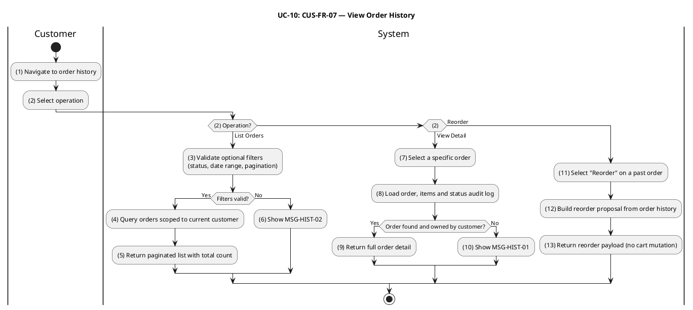

#### Business Rules

| Activity | BR Code    | Description                                                                                                                                                                                                                                                                                                                                                                                                                                                                                                                                                               |
| -------- | ---------- | ------------------------------------------------------------------------------------------------------------------------------------------------------------------------------------------------------------------------------------------------------------------------------------------------------------------------------------------------------------------------------------------------------------------------------------------------------------------------------------------------------------------------------------------------------------------------- |
| _(3)_    | _BR-10.1_  | **Filter Validation Rules:**<br>❖ `status` (if supplied) must match a canonical order status enum value (`'pending'`, `'paid'`, `'confirmed'`, `'preparing'`, `'ready_for_pickup'`, `'picked_up'`, `'delivering'`, `'delivered'`, `'cancelled'`, `'refunded'`).<br>❖ When both `minDate` and `maxDate` are supplied, `minDate ≤ maxDate` must hold.<br>❖ `limit` must be in [1, 100]; `offset` must be ≥ 0.<br>❖ Invalid filter values return HTTP 400 referencing `MSG-HIST-02`.                                                                                         |
| _(6)_    | _BR-10.2_  | **Filter Validation Error Response Rules:**<br>❖ When filter validation fails at activity (3), system returns HTTP 400 referencing `MSG-HIST-02`.                                                                                                                                                                                                                                                                                                                                                                                                                         |
| _(4)_    | _BR-10.3_  | **Ownership Scoping Rules:**<br>❖ The query is hard-scoped by `customerId = session.user.id`; no `customerId` query parameter is accepted from the client.<br>❖ Results are ordered by `createdAt DESC`.<br>❖ `total` reflects the full match count before pagination.<br>❖ When `OrderHistoryService.getCustomerOrderList(actorId, filters)` executes, only orders owned by the actor are included.                                                                                                                                                                      |
| _(5)_    | _BR-10.4_  | **List Summary Aggregation Rules:**<br>❖ Each order row in the list response includes `itemCount` (sum of `order_items.quantity` for that order) and `firstItemName` (the name of the line item with the lowest insertion order).<br>❖ When `OrderHistoryService.getCustomerOrderList(actorId, filters)` executes, paginated order summary list returned.                                                                                                                                                                                                                 |
| _(8)_    | _BR-10.5_  | **Order Access Rules:**<br>❖ System loads the order by ID; if the order does not exist or belongs to a different customer, system returns HTTP 404 referencing `MSG-HIST-01`.<br>❖ A uniform 404 is returned in both cases to prevent ownership disclosure.<br>❖ If `OrderHistoryService.getCustomerOrderDetail(actorId, orderId)` returns null or empty, system returns an error response referencing `MSG-ORD-10` (order not visible to caller).                                                                                                                        |
| _(10)_   | _BR-10.6_  | **Order Not Found Response Rules:**<br>❖ When order lookup fails or access is denied at activity (8), system returns HTTP 404 referencing `MSG-HIST-01`.                                                                                                                                                                                                                                                                                                                                                                                                                  |
| _(8)_    | _BR-10.7_  | **Detail Completeness Rules:**<br>❖ The detail response includes the complete `order_status_logs` array in chronological order.<br>❖ Each log entry includes: `fromStatus`, `toStatus`, `triggeredByRole`, optional `note`, and `createdAt`.<br>❖ When `OrderHistoryService.getCustomerOrderDetail(actorId, orderId)` executes, full order detail returned.                                                                                                                                                                                                               |
| _(9)_    | _BR-10.8_  | **Order Detail Response Rules:**<br>❖ When order detail is successfully loaded at activity (8), HTTP 200 response includes order items and complete status audit log.                                                                                                                                                                                                                                                                                                                                                                                                     |
| _(12)_   | _BR-10.9_  | **Reorder Rules:**<br>❖ No server-side cart mutation occurs during reorder; system returns a cart-shaped payload derived from historical `order_items` data.<br>❖ The client uses this payload to call UC-4 (Add Item to Cart).<br>❖ Historical prices and item names in the reorder payload may not reflect the current catalog; UC-4 re-validates all items, modifiers, and prices against the current ACL snapshot at submission.<br>❖ When `OrderHistoryService.getCustomerReorderItems(actorId, orderId)` executes, reorder payload populated for cart re-hydration. |
| _(13)_   | _BR-10.10_ | **Reorder Payload Response Rules:**<br>❖ When a reorder request is submitted at activity (12), system returns a cart-shaped payload (HTTP 200) derived from the historical order without executing cart mutation.                                                                                                                                                                                                                                                                                                                                                         |
| _(1)_    | _BR-10.11_ | **Initialization Rules:**<br>❖ The customer navigates to the order history view and can select from: list all orders (with optional filters), view detail of a specific past order, or initiate a reorder.                                                                                                                                                                                                                                                                                                                                                                |

---

### Restaurant & Delivery Operations (UC-11 – UC-19)

This section covers the operational use cases of the two supply-side actors that complete the platform: the **Restaurant Partner** (who owns the catalog and prepares orders) and the **Delivery Personnel** (also referred to as **Shipper**, who fulfils last-mile delivery). These use cases share the underlying `order_status` state machine, the Restaurant–Ordering ACL snapshot mechanism (D3-B), and the authentication and authorization stack established in UC-1.

---

### UC-11: Restaurant Registration & Profile Management

| Field                  | Detail                                                                                                                                                                                                                                                                                                                                                                                                                                                                                                                                                           |
| ---------------------- | ---------------------------------------------------------------------------------------------------------------------------------------------------------------------------------------------------------------------------------------------------------------------------------------------------------------------------------------------------------------------------------------------------------------------------------------------------------------------------------------------------------------------------------------------------------------- |
| **Use Case ID — Name** | RES-FR-01 — Restaurant Registration & Profile Management                                                                                                                                                                                                                                                                                                                                                                                                                                                                                                         |
| **Actor**              | Restaurant Partner, Administrator                                                                                                                                                                                                                                                                                                                                                                                                                                                                                                                                |
| **Trigger**            | ❖ Restaurant Partner submits **Register Restaurant** form after signing in with role `restaurant`.<br>❖ Restaurant Partner edits restaurant profile (`PATCH /restaurants/:id`).<br>❖ Administrator approves or unapproves a restaurant (`PATCH /restaurants/:id/{approve,unapprove}`).                                                                                                                                                                                                                                                                           |
| **Description**        | Registers a new restaurant entity owned by the authenticated partner, lets the owner maintain its profile (name, description, address, phone, geo-coordinates, cuisine type, logo and cover images), and lets an administrator decide whether the restaurant is publicly visible. Newly registered restaurants are created with `isApproved = false` and `isOpen = false` and remain invisible to customer discovery (UC-2) until both flags are set to `true`. Every mutation publishes a `RestaurantUpdatedEvent` that synchronises the Ordering ACL snapshot. |
| **Pre-condition**      | ❖ Actor is authenticated.<br>❖ For self-service registration and profile update: actor has role `restaurant` (or `admin`).<br>❖ For approve / unapprove: actor has role `admin`.                                                                                                                                                                                                                                                                                                                                                                                 |
| **Post-condition**     | ❖ Registration: a new `restaurants` row exists with `ownerId = session.user.id`, `isApproved = false`, `isOpen = false`; `RestaurantUpdatedEvent` is published.<br>❖ Profile update: the row reflects the new field values; `RestaurantUpdatedEvent` is published.<br>❖ Approve / unapprove: `isApproved` is set accordingly; `RestaurantUpdatedEvent` is published; customer discovery results (UC-2) reflect the new visibility on the next query.                                                                                                             |

#### Activities Flow

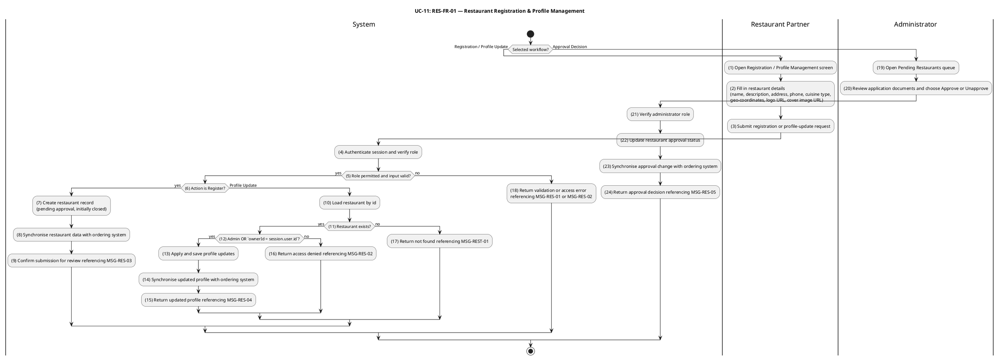

#### Business Rules

| Activity | BR Code    | Description                                                                                                                                                                                                                                                                                                                                                                                                                                                                                                                                                                                                                                                                                             |
| -------- | ---------- | ------------------------------------------------------------------------------------------------------------------------------------------------------------------------------------------------------------------------------------------------------------------------------------------------------------------------------------------------------------------------------------------------------------------------------------------------------------------------------------------------------------------------------------------------------------------------------------------------------------------------------------------------------------------------------------------------------- |
| _(3)_    | _BR-11.1_  | **Validate Rules (Registration / Profile Update):**<br>❖ `name`, `address`, and `phone` are required and non-empty.<br>❖ `phone` must match the Vietnamese mobile or landline format accepted by the platform validator.<br>❖ If `latitude` and `longitude` are supplied, both must be present together and lie inside Vietnam (latitude ∈ [8.0, 24.0], longitude ∈ [102.0, 110.0]).<br>❖ `logoUrl` and `coverImageUrl` (when supplied) must reference an existing image record produced by the Image module.<br>❖ Invalid input returns HTTP 400 referencing `MSG-RES-01`.<br>❖ If `RestaurantService.create(ownerId, dto)` returns false, system returns an error response referencing `MSG-REST-04`. |
| _(4)_    | _BR-11.2_  | **Authorization Rules (Registration):**<br>❖ `POST /restaurants` requires role `restaurant` or `admin`; otherwise HTTP 403 referencing `MSG-RES-02`.<br>❖ `PATCH /restaurants/:id` requires role `restaurant` or `admin`; otherwise HTTP 403 referencing `MSG-RES-02`.                                                                                                                                                                                                                                                                                                                                                                                                                                  |
| _(5)_    | _BR-11.3_  | **Authorization Rules (Approval):**<br>❖ `PATCH /restaurants/:id/approve` and `PATCH /restaurants/:id/unapprove` require role `admin`; otherwise HTTP 403 referencing `MSG-RES-02`.                                                                                                                                                                                                                                                                                                                                                                                                                                                                                                                     |
| _(7)_    | _BR-11.4_  | **Visibility Initialization Rules:**<br>❖ A newly created restaurant always has `isApproved = false` and `isOpen = false`, regardless of any client-supplied value for those fields.<br>❖ The restaurant is excluded from public discovery (UC-2) until an administrator approves it and the partner opens it (UC-13).<br>❖ HTTP 201 response references `MSG-RES-03` to inform the partner that submission is pending administrator review.                                                                                                                                                                                                                                                            |
| _(10)_   | _BR-11.5_  | **Ownership Rules (Profile Update):**<br>❖ For role `restaurant`, the update is allowed only when the persisted `restaurants.ownerId` equals `session.user.id`; otherwise HTTP 403 referencing `MSG-RES-02`.<br>❖ For role `admin`, the ownership check is bypassed and any restaurant can be edited.<br>❖ A non-existent `:id` returns HTTP 404 referencing `MSG-REST-01`; a successful update returns HTTP 200 referencing `MSG-RES-04`.<br>❖ If `RestaurantService.update(id, requesterId, isAdmin, dto)` fails the authorization check, system returns HTTP 403 referencing `MSG-REST-05`.                                                                                                          |
| _(11)_   | _BR-11.6_  | **Resource Existence Rules (Profile Load):**<br>❖ When a restaurant profile is loaded for update at activity (10), if the resource does not exist, return HTTP 404 referencing `MSG-REST-01`.                                                                                                                                                                                                                                                                                                                                                                                                                                                                                                           |
| _(12)_   | _BR-11.7_  | **Ownership Authorization Rules (Profile Mutation):**<br>❖ When profile update proceeds at activity (11), verify that for role `restaurant`, the `ownerId` matches `session.user.id`; for role `admin`, bypass ownership check.                                                                                                                                                                                                                                                                                                                                                                                                                                                                         |
| _(13)_   | _BR-11.8_  | **Persistence Rules (Profile Update):**<br>❖ The profile update is applied to the restaurant row; all modified fields are persisted atomically.<br>❖ After `RestaurantService.update(id, requesterId, isAdmin, dto)` completes, restaurant profile updated.                                                                                                                                                                                                                                                                                                                                                                                                                                             |
| _(14)_   | _BR-11.9_  | **Event Synchronisation Rules (Profile Update):**<br>❖ Every successful profile update publishes `RestaurantUpdatedEvent` containing the latest persisted state.<br>❖ The event is consumed by the Ordering ACL projector to refresh the restaurant snapshot used by UC-8 and ownership checks in UC-14 / UC-15.<br>❖ `eventBus.publish(new RestaurantUpdatedEvent(restaurantId))` publishes the corresponding domain event.                                                                                                                                                                                                                                                                            |
| _(15)_   | _BR-11.10_ | **Response Rules (Profile Update Success):**<br>❖ A successful profile update returns HTTP 200 referencing `MSG-RES-04` with the updated restaurant resource.                                                                                                                                                                                                                                                                                                                                                                                                                                                                                                                                           |
| _(21)_   | _BR-11.11_ | **Authorization Rules (Approval Decision):**<br>❖ Approval / unapproval endpoints require role `admin` to verify prior to processing the decision.                                                                                                                                                                                                                                                                                                                                                                                                                                                                                                                                                      |
| _(22)_   | _BR-11.12_ | **Visibility Activation Rules:**<br>❖ `isApproved` is set atomically by the admin approval/unapproval endpoint.<br>❖ A restaurant appears in public discovery (UC-2) only when `isApproved = true` AND `isOpen = true`.<br>❖ Unapproving an already-public restaurant immediately removes it from discovery; in-flight orders are not affected.<br>❖ After `RestaurantService.setApproved(id, isApproved)` succeeds, restaurant becomes publicly visible.                                                                                                                                                                                                                                               |
| _(23)_   | _BR-11.13_ | **Event Synchronisation Rules (Approval):**<br>❖ Every successful approve or unapprove publishes `RestaurantUpdatedEvent` containing the latest persisted state and new `isApproved` flag.<br>❖ The event is consumed by the Ordering ACL projector to refresh the restaurant snapshot.                                                                                                                                                                                                                                                                                                                                                                                                                 |
| _(24)_   | _BR-11.14_ | **Response Rules (Approval Decision):**<br>❖ HTTP 200 response references `MSG-RES-05` to confirm the approval or unapproval decision has been recorded.                                                                                                                                                                                                                                                                                                                                                                                                                                                                                                                                                |
| _(1)_    | _BR-11.15_ | **Workflow Initialization Rules:**<br>❖ A restaurant partner opens the registration / profile management screen or an administrator opens the pending restaurants queue.                                                                                                                                                                                                                                                                                                                                                                                                                                                                                                                                |
| _(2)_    | _BR-11.16_ | **Input Collection Rules:**<br>❖ Restaurant partner fills in restaurant details (name, description, address, phone, cuisine type, geo-coordinates, logo URL, cover image URL) or administrator reviews an application and chooses approve/unapprove.                                                                                                                                                                                                                                                                                                                                                                                                                                                    |
| _(8)_    | _BR-11.17_ | **Restaurant Record Creation Rules:**<br>❖ A new `restaurants` row is created with `ownerId = session.user.id`, `isApproved = false`, `isOpen = false`.<br>❖ After `RestaurantService.create(ownerId, dto)` completes, new restaurant record created with `isApproved=false`.                                                                                                                                                                                                                                                                                                                                                                                                                           |
| _(9)_    | _BR-11.18_ | **Registration Confirmation Rules:**<br>❖ After restaurant creation, the system confirms submission for review referencing `MSG-RES-03`.                                                                                                                                                                                                                                                                                                                                                                                                                                                                                                                                                                |
| _(19)_   | _BR-11.19_ | **Admin Workflow Rules:**<br>❖ Administrator opens the pending restaurants queue to review applications.                                                                                                                                                                                                                                                                                                                                                                                                                                                                                                                                                                                                |
| _(20)_   | _BR-11.20_ | **Approval Workflow Rules:**<br>❖ Administrator reviews application documents and chooses to approve or unapprove the restaurant.<br>❖ After `RestaurantService.setApproved(id, true)` and `RestaurantService.setApproved(id, false)` succeeds, approval state toggled by admin decision.                                                                                                                                                                                                                                                                                                                                                                                                               |

---

### UC-12: Manage Menu Catalog

| Field                  | Detail                                                                                                                                                                                                                                                                                                                                                                                                                                                                                                                                                                                                                                                                |
| ---------------------- | --------------------------------------------------------------------------------------------------------------------------------------------------------------------------------------------------------------------------------------------------------------------------------------------------------------------------------------------------------------------------------------------------------------------------------------------------------------------------------------------------------------------------------------------------------------------------------------------------------------------------------------------------------------------- |
| **Use Case ID — Name** | RES-FR-02, RES-FR-03 — Manage Menu Catalog (categories, items, modifier groups, modifier options)                                                                                                                                                                                                                                                                                                                                                                                                                                                                                                                                                                     |
| **Actor**              | Restaurant Partner, Administrator                                                                                                                                                                                                                                                                                                                                                                                                                                                                                                                                                                                                                                     |
| **Trigger**            | ❖ Restaurant Partner creates / updates / deletes a menu category, menu item, modifier group, or modifier option via the partner console (`POST`, `PATCH`, `DELETE` on `/menu-items`, `/menu-items/categories`, `/menu-items/:id/modifier-groups`, and `/.../options`).                                                                                                                                                                                                                                                                                                                                                                                                |
| **Description**        | Provides authenticated catalog maintenance for a single restaurant. The use case covers per-restaurant **menu categories**, **menu items** (with price stored as integer VND, optional SKU, optional category, tag array, image URL, and an availability `status` ∈ {`available`, `unavailable`, `out_of_stock`}), and the two-level **modifier model** (modifier groups with `minSelections`/`maxSelections` constraints and modifier options with their own price and availability flag). Every mutation re-publishes a `MenuItemUpdatedEvent` with the full modifier snapshot so the Ordering ACL stays consistent with what customers see during checkout (UC-8). |
| **Pre-condition**      | ❖ Actor is authenticated.<br>❖ Actor has role `restaurant` or `admin`.<br>❖ For a `restaurant` actor: the menu item / category / modifier resource ultimately belongs to a restaurant whose `ownerId = session.user.id`.                                                                                                                                                                                                                                                                                                                                                                                                                                              |
| **Post-condition**     | ❖ The catalog row is created, updated or removed in the corresponding table (`menu_categories`, `menu_items`, `modifier_groups`, `modifier_options`).<br>❖ `MenuItemUpdatedEvent` is published with the latest persisted state and full modifier snapshot for every affected menu item.<br>❖ The Ordering ACL projector refreshes its local snapshot, so subsequent calls to UC-4 / UC-8 use the new catalog values.                                                                                                                                                                                                                                                  |

#### Activities Flow

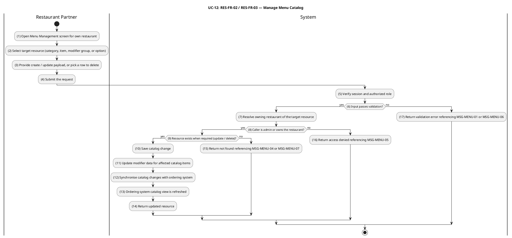

#### Business Rules

| Activity | BR Code    | Description                                                                                                                                                                                                                                                                                                                                                                                                                                                                                                                                                                                                                                                                                                                                                                      |
| -------- | ---------- | -------------------------------------------------------------------------------------------------------------------------------------------------------------------------------------------------------------------------------------------------------------------------------------------------------------------------------------------------------------------------------------------------------------------------------------------------------------------------------------------------------------------------------------------------------------------------------------------------------------------------------------------------------------------------------------------------------------------------------------------------------------------------------- |
| _(4)_    | _BR-12.1_  | **Validate Rules (Menu Item):**<br>❖ `name` is required and non-empty.<br>❖ `price` is required and must be a non-negative integer (VND, no fractional units).<br>❖ `restaurantId` is required and must reference an existing restaurant.<br>❖ `categoryId` (if supplied) must reference a category that belongs to the same `restaurantId`.<br>❖ `tags` (if supplied) must be an array of non-empty strings.<br>❖ Invalid input returns HTTP 400 referencing `MSG-MENU-01`.<br>❖ If `MenuService.create(requesterId, isAdmin, dto)` returns false, system returns an error response referencing `MSG-MENU-01`.                                                                                                                                                                  |
| _(5)_    | _BR-12.2_  | **Authorization Rules (Menu Mutation):**<br>❖ Catalog mutations (`POST`, `PATCH`, `DELETE`) require role `restaurant` or `admin`.<br>❖ For role `restaurant`, mutations are allowed only when the owning restaurant's `ownerId = session.user.id`; otherwise HTTP 403 referencing `MSG-MENU-05`.<br>❖ If `MenuService.update(id, requesterId, isAdmin, dto)` fails the authorization check, system returns HTTP 403 referencing `MSG-MENU-02`.                                                                                                                                                                                                                                                                                                                                   |
| _(6)_    | _BR-12.3_  | **Validate Rules (Menu Category):**<br>❖ `name` is required and non-empty.<br>❖ `displayOrder` (if supplied) must be a non-negative integer.<br>❖ The pair `(restaurantId, name)` must be unique; duplicate returns HTTP 409 referencing `MSG-MENU-03`.<br>❖ Invalid input returns HTTP 400 referencing `MSG-MENU-01`.<br>❖ If `MenuService.createCategory(restaurantId, requesterId, isAdmin, dto)` returns false, system returns an error response referencing `MSG-MENU-03`.                                                                                                                                                                                                                                                                                                  |
| _(7)_    | _BR-12.4_  | **Ownership Resolution Rules:**<br>❖ For role `restaurant`, resolve owning restaurant of target resource; verify `ownerId = session.user.id`; otherwise HTTP 403 referencing `MSG-MENU-05`.<br>❖ For role `admin`, ownership is bypassed and any restaurant's catalog can be edited.<br>❖ Ownership is resolved transitively for modifier groups and options: `option → group → menuItem → restaurant`.                                                                                                                                                                                                                                                                                                                                                                          |
| _(8)_    | _BR-12.5_  | **Resource Existence Rules:**<br>❖ For create: the parent resource (restaurant for items/categories, item for modifiers) must exist.<br>❖ For update / delete: the target resource must exist; otherwise HTTP 404 referencing `MSG-MENU-02`, `MSG-MENU-04`, or `MSG-MENU-07`.                                                                                                                                                                                                                                                                                                                                                                                                                                                                                                    |
| _(9)_    | _BR-12.6_  | **Delete Cascade Rules:**<br>❖ Deleting a menu category clears `categoryId` on all items in that category; items remain published with no `MenuItemUpdatedEvent` emitted.<br>❖ Deleting a menu item cascades to its modifier groups and options; publishes `MenuItemUpdatedEvent` with `status = 'unavailable'`.                                                                                                                                                                                                                                                                                                                                                                                                                                                                 |
| _(10)_   | _BR-12.7_  | **Catalog Persistence Rules:**<br>❖ The catalog row is created, updated, or removed in the corresponding table (`menu_categories`, `menu_items`, `modifier_groups`, `modifier_options`).<br>❖ After `RestaurantService.create(ownerId, dto)` and `RestaurantService.update(id, requesterId, isAdmin, dto)` completes, menu item or category persisted.                                                                                                                                                                                                                                                                                                                                                                                                                           |
| _(11)_   | _BR-12.8_  | **Modifier Snapshot Update Rules:**<br>❖ When a modifier group or modifier option is mutated, the full current modifier snapshot for the affected item is re-fetched.                                                                                                                                                                                                                                                                                                                                                                                                                                                                                                                                                                                                            |
| _(12)_   | _BR-12.9_  | **Event Synchronisation Rules:**<br>❖ Every successful menu-item, modifier-group, and modifier-option mutation publishes `MenuItemUpdatedEvent` for the affected item, carrying `id`, `restaurantId`, `name`, `price`, and `status`.<br>❖ Modifier-group and modifier-option mutations publish `modifiers` as a populated array (full snapshot); menu-item field-only updates publish `modifiers = null` to preserve the existing ACL snapshot unchanged.<br>❖ Deleting a menu item publishes `MenuItemUpdatedEvent` with `status = 'unavailable'` and `modifiers = []` (empty array).<br>❖ Menu-category mutations do NOT publish `MenuItemUpdatedEvent`.<br>❖ `eventBus.publish(new MenuItemUpdatedEvent(menuItemId, restaurantId))` publishes the corresponding domain event. |
| _(13)_   | _BR-12.10_ | **Ordering System Sync Rules:**<br>❖ The Ordering ACL projector refreshes its local snapshot in response to `MenuItemUpdatedEvent`, so subsequent UC-4 / UC-8 calls use the new catalog values.<br>❖ After `MenuItemProjector.handle(event)` succeeds, ordering BC snapshot refreshed from event.                                                                                                                                                                                                                                                                                                                                                                                                                                                                                |
| _(14)_   | _BR-12.11_ | **Response Rules (Mutation Success):**<br>❖ Upon successful create / update / delete, system returns HTTP 201 (create) or HTTP 200 (update / delete) with the updated resource.                                                                                                                                                                                                                                                                                                                                                                                                                                                                                                                                                                                                  |
| _(1)_    | _BR-12.12_ | **Workflow Initialization Rules:**<br>❖ A restaurant partner opens the Menu Management screen for their own restaurant.                                                                                                                                                                                                                                                                                                                                                                                                                                                                                                                                                                                                                                                          |
| _(2)_    | _BR-12.13_ | **Target Resource Selection Rules:**<br>❖ Partner selects the target resource type (category, item, modifier group, or option) and selects or provides create / update / delete payload.                                                                                                                                                                                                                                                                                                                                                                                                                                                                                                                                                                                         |
| _(3)_    | _BR-12.14_ | **Mutation Request Submission Rules:**<br>❖ Partner submits the create / update / delete request via the corresponding API endpoint.                                                                                                                                                                                                                                                                                                                                                                                                                                                                                                                                                                                                                                             |
| _(4)_    | _BR-12.15_ | **Validate Rules (Modifier Group & Option):**<br>❖ Modifier group: `minSelections` ≥ 0 and `maxSelections` ≥ `minSelections`; otherwise HTTP 400 referencing `MSG-MENU-06`.<br>❖ Modifier option: `price` is a non-negative integer (VND); `0` denotes a free option.<br>❖ Option must belong to a modifier group that belongs to the same menu item in the URL; otherwise HTTP 404 referencing `MSG-MENU-07`.<br>❖ If `ModifiersService.createGroup(menuItemId, requesterId, isAdmin, dto)` and `ModifiersService.updateGroup(groupId, menuItemId, requesterId, isAdmin, dto)` returns false, system returns an error response referencing `MSG-MENU-04`.                                                                                                                       |
| _(5)_    | _BR-12.16_ | **Session Verification Rules:**<br>❖ Session is verified and authorized role is resolved.                                                                                                                                                                                                                                                                                                                                                                                                                                                                                                                                                                                                                                                                                        |
| _(15)_   | _BR-12.17_ | **Failure Response Rules:**<br>❖ When validation or authorization fails, system returns HTTP 400 (validation), HTTP 403 (authorization), or HTTP 404 (resource not found) with the corresponding error message code.                                                                                                                                                                                                                                                                                                                                                                                                                                                                                                                                                             |

---

### UC-13: Toggle Item & Restaurant Availability

| Field                  | Detail                                                                                                                                                                                                                                                                                                                                                                                                                                                                                                  |
| ---------------------- | ------------------------------------------------------------------------------------------------------------------------------------------------------------------------------------------------------------------------------------------------------------------------------------------------------------------------------------------------------------------------------------------------------------------------------------------------------------------------------------------------------- |
| **Use Case ID — Name** | RES-FR-04 — Toggle Item & Restaurant Availability                                                                                                                                                                                                                                                                                                                                                                                                                                                       |
| **Actor**              | Restaurant Partner, Administrator                                                                                                                                                                                                                                                                                                                                                                                                                                                                       |
| **Trigger**            | ❖ Restaurant Partner toggles a menu item's sold-out flag (`PATCH /menu-items/:id/toggle-sold-out`).<br>❖ Restaurant Partner opens or closes the restaurant (sets `isOpen` via `PATCH /restaurants/:id`).                                                                                                                                                                                                                                                                                                |
| **Description**        | Lets the partner control catalog availability in real time without rewriting the menu. A single menu item can be flipped between `available` and `out_of_stock`; an item explicitly marked `unavailable` is treated as taken down and cannot be sold-out-toggled. The restaurant as a whole can be opened or closed by toggling `isOpen`. Both operations propagate immediately to the customer surfaces via `RestaurantUpdatedEvent` / `MenuItemUpdatedEvent` (BR-8 _Real-time Availability Control_). |
| **Pre-condition**      | ❖ Actor is authenticated.<br>❖ Actor has role `restaurant` or `admin`.<br>❖ For a `restaurant` actor: the target restaurant (or the restaurant that owns the target item) has `ownerId = session.user.id`.<br>❖ For sold-out toggle: the item's current `status` is not `unavailable`.                                                                                                                                                                                                                  |
| **Post-condition**     | ❖ Menu item: `status` flips between `available` and `out_of_stock`; `MenuItemUpdatedEvent` is published.<br>❖ Restaurant: `isOpen` is set to the new value; `RestaurantUpdatedEvent` is published.<br>❖ Customer surfaces (UC-2 discovery, UC-4 add to cart, UC-8 place order) reflect the change on their next call.                                                                                                                                                                                   |

#### Activities Flow

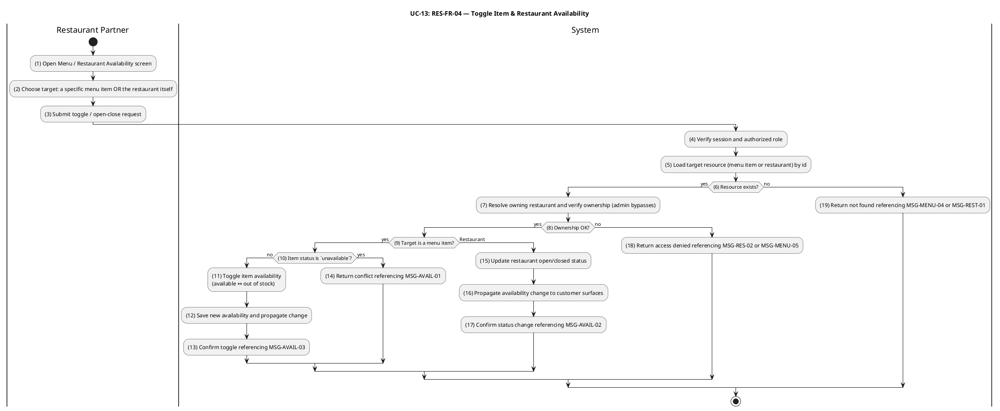

#### Business Rules

| Activity | BR Code    | Description                                                                                                                                                                                                                                                                                                                                                                                                                                                               |
| -------- | ---------- | ------------------------------------------------------------------------------------------------------------------------------------------------------------------------------------------------------------------------------------------------------------------------------------------------------------------------------------------------------------------------------------------------------------------------------------------------------------------------- |
| _(4)_    | _BR-13.1_  | **Authorization Rules:**<br>❖ Endpoints require role `restaurant` or `admin`.<br>❖ For role `restaurant`, operations are allowed only when `restaurants.ownerId = session.user.id` (transitively for menu items via `menuItem → restaurant`); otherwise HTTP 403 referencing `MSG-RES-02` or `MSG-MENU-05`.<br>❖ If `MenuService.update(id, requesterId, isAdmin, dto)` fails the authorization check, system returns HTTP 403 referencing `MSG-MENU-02`.                 |
| _(5)_    | _BR-13.2_  | **Resource Existence Rules:**<br>❖ Load target resource (menu item or restaurant) by id; if not found, return HTTP 404 referencing `MSG-MENU-04` (item) or `MSG-REST-01` (restaurant).                                                                                                                                                                                                                                                                                    |
| _(7)_    | _BR-13.3_  | **Ownership Verification Rules:**<br>❖ Resolve owning restaurant and verify ownership; for role `restaurant`, `restaurants.ownerId = session.user.id` must hold; for role `admin`, bypass ownership check.                                                                                                                                                                                                                                                                |
| _(10)_   | _BR-13.4_  | **Item Sold-Out Toggle Rules:**<br>❖ The toggle alternates between `available` and `out_of_stock` only.<br>❖ If the item's current `status` is `unavailable`, return HTTP 409 referencing `MSG-AVAIL-01`; the item must be re-published via UC-12 before the toggle can be applied.<br>❖ Successful toggle returns HTTP 200 referencing `MSG-AVAIL-03`.<br>❖ After `MenuService.toggleSoldOut(id, requesterId, isAdmin)` succeeds, `isSoldOut` flag toggled on menu item. |
| _(11)_   | _BR-13.5_  | **Item Availability Persistence Rules:**<br>❖ The item `status` is persisted atomically, flipping between `available` and `out_of_stock`.                                                                                                                                                                                                                                                                                                                                 |
| _(12)_   | _BR-13.6_  | **Propagation Rules (Item Toggle):**<br>❖ Every successful item toggle publishes `MenuItemUpdatedEvent` with the new `status`.<br>❖ The Ordering ACL projector refreshes its snapshot, so subsequent UC-4 / UC-8 calls reflect the new availability.<br>❖ `eventBus.publish(new MenuItemUpdatedEvent(menuItemId, restaurantId))` publishes the corresponding domain event.                                                                                                |
| _(13)_   | _BR-13.7_  | **Item Toggle Response Rules:**<br>❖ After successful item toggle, system returns HTTP 200 with the updated item and `MSG-AVAIL-03`.                                                                                                                                                                                                                                                                                                                                      |
| _(14)_   | _BR-13.8_  | **Restaurant Open/Close Persistence Rules:**<br>❖ `isOpen` is set atomically; the new value persists and controls "currently accepting orders" for the restaurant.<br>❖ After `RestaurantService.update(id, requesterId, isAdmin, dto)` completes, restaurant `isOpen` flag persisted.                                                                                                                                                                                    |
| _(15)_   | _BR-13.9_  | **Restaurant Visibility Rules:**<br>❖ Setting `isOpen = false` does not affect already-placed orders (UC-14 / UC-15 continue processing).<br>❖ Setting `isOpen = false` while `isApproved = true` keeps the restaurant in the public catalog but flags it as not currently serving on customer surfaces.                                                                                                                                                                  |
| _(16)_   | _BR-13.10_ | **Propagation Rules (Restaurant Status):**<br>❖ Every successful open/close operation publishes `RestaurantUpdatedEvent` with the new `isOpen` flag.<br>❖ The Ordering ACL projector refreshes its snapshot.<br>❖ `eventBus.publish(new RestaurantUpdatedEvent(restaurantId))` publishes the corresponding domain event.                                                                                                                                                  |
| _(17)_   | _BR-13.11_ | **Restaurant Status Response Rules:**<br>❖ After successful open/close, system returns HTTP 200 referencing `MSG-AVAIL-02`.                                                                                                                                                                                                                                                                                                                                               |
| _(1)_    | _BR-13.12_ | **Workflow Initialization Rules:**<br>❖ Restaurant partner opens the Menu / Restaurant Availability screen.                                                                                                                                                                                                                                                                                                                                                               |
| _(2)_    | _BR-13.13_ | **Target Selection Rules:**<br>❖ Partner chooses target: a specific menu item OR the restaurant itself.                                                                                                                                                                                                                                                                                                                                                                   |
| _(3)_    | _BR-13.14_ | **Toggle Request Submission Rules:**<br>❖ Partner submits toggle / open-close request via the corresponding endpoint.                                                                                                                                                                                                                                                                                                                                                     |
| _(8)_    | _BR-13.15_ | **Ownership Check Rules:**<br>❖ For role `restaurant`, verify that the owning restaurant's `ownerId = session.user.id`; for role `admin`, bypass.                                                                                                                                                                                                                                                                                                                         |

---

### UC-14: Accept or Reject Order

| Field                  | Detail                                                                                                                                                                                                                                                                                                                                                                                                                                                                                                                                                                                       |
| ---------------------- | -------------------------------------------------------------------------------------------------------------------------------------------------------------------------------------------------------------------------------------------------------------------------------------------------------------------------------------------------------------------------------------------------------------------------------------------------------------------------------------------------------------------------------------------------------------------------------------------- |
| **Use Case ID — Name** | RES-FR-05 — Accept or Reject Order                                                                                                                                                                                                                                                                                                                                                                                                                                                                                                                                                           |
| **Actor**              | Restaurant Partner, Administrator                                                                                                                                                                                                                                                                                                                                                                                                                                                                                                                                                            |
| **Trigger**            | ❖ Restaurant Partner accepts a new order (`PATCH /orders/:id/confirm`) — transitions `pending → confirmed` (T-01, COD) or `paid → confirmed` (T-04, VNPay paid).<br>❖ Restaurant Partner rejects a new order (`PATCH /orders/:id/cancel` with a reason note) — transitions `pending → cancelled` (T-03), `paid → cancelled` (T-05), or `confirmed → cancelled` (T-07).                                                                                                                                                                                                                       |
| **Description**        | Authorises the restaurant to decide whether an incoming order proceeds. Acceptance moves the order into `confirmed`, after which UC-15 (Prepare Order for Pickup) becomes the only forward path. Rejection requires a reason note for the audit log, and — for VNPay-paid orders cancelled from `paid` or `confirmed` — automatically triggers the refund pipeline by publishing `OrderCancelledAfterPaymentEvent`. All transitions are routed through the central CQRS `TransitionOrderCommand`, which enforces role, ownership, state validity, and optimistic locking (`version` column). |
| **Pre-condition**      | ❖ Actor is authenticated.<br>❖ Actor has role `restaurant` (limited to own restaurant's orders) or `admin` (any order).<br>❖ The order is in a state that allows the requested transition: `pending` (for T-01 / T-03), `paid` (for T-04 / T-05), or `confirmed` (for T-07).<br>❖ For T-01 by role `restaurant`: `order.paymentMethod = 'cod'`.<br>❖ For cancel transitions: a non-empty `reason` note is supplied.                                                                                                                                                                          |
| **Post-condition**     | ❖ `orders.status` is updated; `orders.version` is incremented atomically.<br>❖ A new `order_status_logs` row records `fromStatus`, `toStatus`, `triggeredBy`, `triggeredByRole`, and `note` (if any).<br>❖ `OrderStatusChangedEvent` is published after commit.<br>❖ For T-05 / T-07 on a VNPay order: `OrderCancelledAfterPaymentEvent` is published, which drives the refund pipeline (see UC-25).                                                                                                                                                                                         |

#### Activities Flow

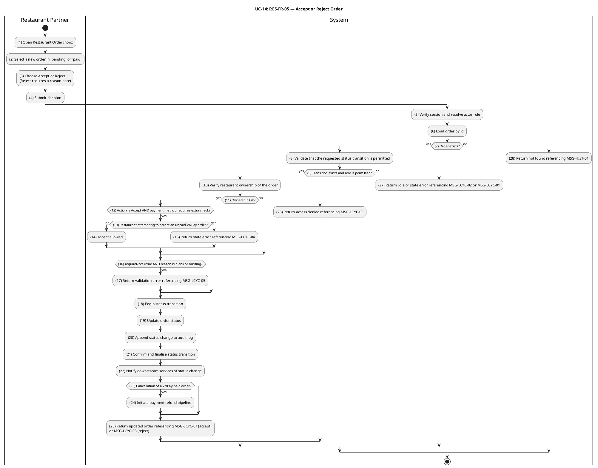

#### Business Rules

| Activity | BR Code    | Description                                                                                                                                                                                                                                                                                                                                                                                                                                                                                                                                                                                                                                                                                                                           |
| -------- | ---------- | ------------------------------------------------------------------------------------------------------------------------------------------------------------------------------------------------------------------------------------------------------------------------------------------------------------------------------------------------------------------------------------------------------------------------------------------------------------------------------------------------------------------------------------------------------------------------------------------------------------------------------------------------------------------------------------------------------------------------------------- |
| _(5)_    | _BR-14.1_  | **Session & Role Resolution Rules:**<br>❖ Session is verified and actor role (`restaurant`, `admin`, or `customer`) is resolved from authentication context.<br>❖ If `OrderLifecycleService.assertOwnership(order, actorId, 'restaurant')` fails the authorization check, system returns HTTP 403 referencing `MSG-LCYC-AUTH-01`.                                                                                                                                                                                                                                                                                                                                                                                                     |
| _(6)_    | _BR-14.2_  | **Order Loading Rules:**<br>❖ The order is loaded by id; a non-existent id returns HTTP 404 referencing `MSG-HIST-01`.<br>❖ If the order is already in the requested target status, system returns the order unchanged (no new audit row, no event).<br>❖ If `OrderRepository.findById(orderId)` returns null or empty, system returns an error response referencing `MSG-LCYC-02` (order not found).                                                                                                                                                                                                                                                                                                                                 |
| _(28)_   | _BR-14.3_  | **Message Rules:**<br>❖ When the order does not exist at activity (6), system returns HTTP 404 referencing `MSG-HIST-01`.                                                                                                                                                                                                                                                                                                                                                                                                                                                                                                                                                                                                             |
| _(8)_    | _BR-14.4_  | **Transition Validity Rules:**<br>❖ Allowed transitions for this UC: T-01 (`pending → confirmed`), T-03 (`pending → cancelled`), T-04 (`paid → confirmed`), T-05 (`paid → cancelled`), T-07 (`confirmed → cancelled`).<br>❖ T-03 and T-05 additionally allow roles `customer` and `system` per the TRANSITIONS map.<br>❖ Any other `(fromStatus, toStatus)` pair returns HTTP 422 referencing `MSG-LCYC-01`.<br>❖ Each transition has an `allowedRoles` set; a role outside the set returns HTTP 403 referencing `MSG-LCYC-02`.<br>❖ If `TransitionOrderHandler.execute(new TransitionOrderCommand(orderId, transitionKey, session))` returns false, system returns an error response referencing `MSG-LCYC-01` (transition invalid). |
| _(10)_   | _BR-14.5_  | **Restaurant Ownership Rules:**<br>❖ For role `restaurant`, the target order's `restaurantId` must belong to a restaurant whose `ownerId = session.user.id` (resolved via Ordering ACL snapshot); otherwise HTTP 403 referencing `MSG-LCYC-03`.<br>❖ For role `admin`, the ownership check is bypassed.<br>❖ If `OrderLifecycleService.assertOwnership(order, actorId, 'restaurant')` fails the authorization check, system returns HTTP 403 referencing `MSG-LCYC-AUTH-02`.                                                                                                                                                                                                                                                          |
| _(11)_   | _BR-14.6_  | **Ownership Error Handling Rules:**<br>❖ When restaurant ownership check fails at activity (10), system returns HTTP 403 referencing `MSG-LCYC-03`.                                                                                                                                                                                                                                                                                                                                                                                                                                                                                                                                                                                   |
| _(12)_   | _BR-14.7_  | **Payment-Method Pre-condition Rules (T-01):**<br>❖ Role `restaurant` may execute T-01 (`pending → confirmed`) only when `order.paymentMethod = 'cod'`.<br>❖ A `restaurant`-initiated T-01 on a VNPay order returns HTTP 422 referencing `MSG-LCYC-04`; VNPay orders must first reach `paid` via UC-9, after which T-04 becomes available.                                                                                                                                                                                                                                                                                                                                                                                            |
| _(14)_   | _BR-14.8_  | **Payment-Method Pre-condition Validation Rules:**<br>❖ When a restaurant attempts to accept an unpaid VNPay order at activity (13), system returns HTTP 422 referencing `MSG-LCYC-04`.                                                                                                                                                                                                                                                                                                                                                                                                                                                                                                                                               |
| _(16)_   | _BR-14.9_  | **Reject Reason Validation Rules:**<br>❖ T-03, T-05, and T-07 carry `requireNote = true`; a missing or whitespace-only `reason` returns HTTP 400 referencing `MSG-LCYC-05`.                                                                                                                                                                                                                                                                                                                                                                                                                                                                                                                                                           |
| _(18)_   | _BR-14.10_ | **Atomicity & Concurrency Rules:**<br>❖ Status update and audit log insert occur in a single database transaction.<br>❖ Status update uses optimistic locking (`WHERE id = :id AND version = :loaded_version`); a zero-row result returns HTTP 409 referencing `MSG-LCYC-06`.<br>❖ `order_status_logs` row records `triggeredBy`, `triggeredByRole`, and `note`.<br>❖ After `CommandBus.execute(new TransitionOrderCommand(orderId, 'T-04-CONFIRM', session))` and `CommandBus.execute(new TransitionOrderCommand(orderId, 'T-CANCEL', session, dto))` succeeds, order status, audit row and event publication commit atomically.                                                                                                     |
| _(19)_   | _BR-14.11_ | **Audit Log Creation Rules:**<br>❖ A new `order_status_logs` row is inserted atomically with the status update, recording `fromStatus`, `toStatus`, `triggeredBy`, `triggeredByRole`, and `note` (if any).<br>❖ After `OrderRepository.findById(orderId)` completes, audit row persisted with actor identity and timestamp.                                                                                                                                                                                                                                                                                                                                                                                                           |
| _(20)_   | _BR-14.12_ | **Transaction Finalization Rules:**<br>❖ After the status update and audit log insert, the transaction is committed.                                                                                                                                                                                                                                                                                                                                                                                                                                                                                                                                                                                                                  |
| _(22)_   | _BR-14.13_ | **Event Publication Rules:**<br>❖ `OrderStatusChangedEvent` is published after commit on every successful transition.<br>❖ Transitions flagged `triggersRefundIfVnpay` (T-05, T-07) on orders with `paymentMethod = 'vnpay'` additionally publish `OrderCancelledAfterPaymentEvent`. If both pre-conditions are met but the acting role is `shipper`, the refund event is suppressed and logged at ERROR (defensive guard).<br>❖ Event-publication failure after successful commit is logged but never rolls back the transition.<br>❖ `eventBus.publish(new OrderStatusChangedEvent(orderId, oldStatus, newStatus))` publishes the corresponding domain event.                                                                       |
| _(23)_   | _BR-14.14_ | **Refund Trigger Detection Rules:**<br>❖ When a cancellation transition occurs on a VNPay-paid order at activity (22), the system detects the `paymentMethod` and `triggersRefundIfVnpay` flag.                                                                                                                                                                                                                                                                                                                                                                                                                                                                                                                                       |
| _(24)_   | _BR-14.15_ | **Refund Initiation Rules:**<br>❖ If both conditions are met at activity (23), `OrderCancelledAfterPaymentEvent` is published to trigger the refund pipeline (UC-25).<br>❖ If `OrderCancelledAfterPaymentHandler.handle(event)` returns success, refund flow initiated for VNPay-paid order; otherwise the system records the failure and surfaces it to the caller.                                                                                                                                                                                                                                                                                                                                                                  |
| _(25)_   | _BR-14.16_ | **Confirmation Response Rules (Accept):**<br>❖ When T-01 or T-04 succeeds, HTTP 200 response references `MSG-LCYC-07` with the updated order.<br>❖ When T-03, T-05, or T-07 succeeds, HTTP 200 response references `MSG-LCYC-08` with the updated order.                                                                                                                                                                                                                                                                                                                                                                                                                                                                              |
| _(27)_   | _BR-14.17_ | **Transition State Error Response Rules:**<br>❖ When a transition is invalid or role is not permitted at activity (9), system returns HTTP 422 (`MSG-LCYC-01`) or HTTP 403 (`MSG-LCYC-02`).                                                                                                                                                                                                                                                                                                                                                                                                                                                                                                                                           |
| _(1)_    | _BR-14.18_ | **Workflow Initialization Rules:**<br>❖ Restaurant partner opens the Restaurant Order Inbox.                                                                                                                                                                                                                                                                                                                                                                                                                                                                                                                                                                                                                                          |
| _(2)_    | _BR-14.19_ | **Order Selection Rules:**<br>❖ Partner selects a new order in `pending` or `paid` status.                                                                                                                                                                                                                                                                                                                                                                                                                                                                                                                                                                                                                                            |
| _(3)_    | _BR-14.20_ | **Decision Submission Rules:**<br>❖ Partner chooses Accept or Reject (Reject requires a reason note) and submits the decision.                                                                                                                                                                                                                                                                                                                                                                                                                                                                                                                                                                                                        |

---

### UC-15: Prepare Order for Pickup

| Field                  | Detail                                                                                                                                                                                                                                                                                                                                                                                                                                                                                                                                                      |
| ---------------------- | ----------------------------------------------------------------------------------------------------------------------------------------------------------------------------------------------------------------------------------------------------------------------------------------------------------------------------------------------------------------------------------------------------------------------------------------------------------------------------------------------------------------------------------------------------------- |
| **Use Case ID — Name** | RES-FR-06 — Prepare Order for Pickup                                                                                                                                                                                                                                                                                                                                                                                                                                                                                                                        |
| **Actor**              | Restaurant Partner, Administrator                                                                                                                                                                                                                                                                                                                                                                                                                                                                                                                           |
| **Trigger**            | ❖ Restaurant Partner starts preparing a confirmed order (`PATCH /orders/:id/start-preparing`) — transitions `confirmed → preparing` (T-06).<br>❖ Restaurant Partner marks a prepared order as ready for the shipper to pick up (`PATCH /orders/:id/ready`) — transitions `preparing → ready_for_pickup` (T-08).                                                                                                                                                                                                                                             |
| **Description**        | Models the kitchen-side fulfilment of a confirmed order as a single unified business workflow with two atomic state transitions: T-06 (`confirmed → preparing`) and T-08 (`preparing → ready_for_pickup`). The `ready_for_pickup` transition additionally publishes `OrderReadyForPickupEvent` — enriched with the restaurant snapshot and the customer's delivery address — which is consumed by the Delivery Context to surface the order to nearby online shippers (UC-18) and by the Notification Context to notify the assigned or candidate shippers. |
| **Pre-condition**      | ❖ Actor is authenticated.<br>❖ Actor has role `restaurant` (limited to own restaurant's orders) or `admin`.<br>❖ T-06 requires `order.status = 'confirmed'`; T-08 requires `order.status = 'preparing'`.<br>❖ The restaurant has an ACL snapshot in the Ordering BC (used to populate `OrderReadyForPickupEvent`).                                                                                                                                                                                                                                          |
| **Post-condition**     | ❖ `orders.status` advances to `preparing` and subsequently to `ready_for_pickup`; `orders.version` is incremented on each transition.<br>❖ A `order_status_logs` row is appended for each transition.<br>❖ `OrderStatusChangedEvent` is published after each transition.<br>❖ The `preparing → ready_for_pickup` transition additionally publishes `OrderReadyForPickupEvent` with `orderId`, `restaurantId`, `restaurantName`, `restaurantAddress`, `customerId` and `deliveryAddress`.                                                                    |

#### Activities Flow

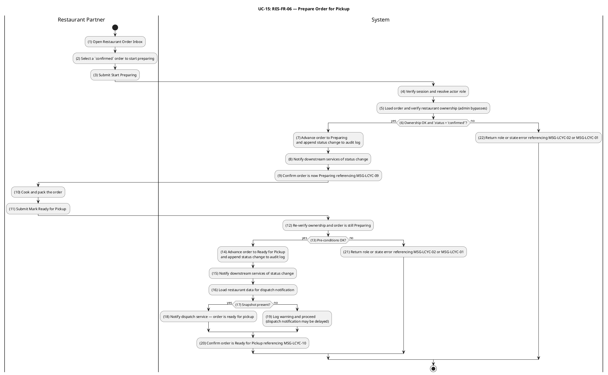

#### Business Rules

| Activity | BR Code    | Description                                                                                                                                                                                                                                                                                                                                                                                                                                                                                                                                       |
| -------- | ---------- | ------------------------------------------------------------------------------------------------------------------------------------------------------------------------------------------------------------------------------------------------------------------------------------------------------------------------------------------------------------------------------------------------------------------------------------------------------------------------------------------------------------------------------------------------- |
| _(4)_    | _BR-15.1_  | **Authorization Rules:**<br>❖ T-06 requires role `restaurant` or `admin`; other roles return HTTP 403 referencing `MSG-LCYC-02`.<br>❖ If `OrderLifecycleService.assertOwnership(order, actorId, 'restaurant')` fails the authorization check, system returns HTTP 403 referencing `MSG-LCYC-AUTH-01`.                                                                                                                                                                                                                                             |
| _(5)_    | _BR-15.2_  | **Ownership Rules:**<br>❖ For role `restaurant`, the target order's `restaurantId` must match the actor's restaurant id (resolved via ACL snapshot); otherwise HTTP 403 referencing `MSG-LCYC-03`.<br>❖ For role `admin`, ownership verification is bypassed.                                                                                                                                                                                                                                                                                     |
| _(6)_    | _BR-15.3_  | **State Transition Rules (T-06):**<br>❖ T-06 requires `order.status = 'confirmed'`; any other source state returns HTTP 422 referencing `MSG-LCYC-01`.<br>❖ Idempotent re-issue: if the order is already `preparing`, the system returns it unchanged without new audit row or event.<br>❖ After `CommandBus.execute(new TransitionOrderCommand(orderId, 'T-06-PREPARING', session))` succeeds, order transitions from `confirmed` to `preparing`.                                                                                                |
| _(7)_    | _BR-15.4_  | **Atomicity & Concurrency Rules (T-06):**<br>❖ Status update and audit log insert execute in a single DB transaction.<br>❖ Optimistic locking on `version` rejects concurrent updates with HTTP 409 referencing `MSG-LCYC-06`.                                                                                                                                                                                                                                                                                                                    |
| _(8)_    | _BR-15.5_  | **Event Publication Rules:**<br>❖ Successful T-06 publishes `OrderStatusChangedEvent` after commit with `fromStatus = 'confirmed'` and `toStatus = 'preparing'`.<br>❖ No additional side-effect events are emitted on T-06.<br>❖ `eventBus.publish(new OrderStatusChangedEvent(orderId, oldStatus, newStatus))` publishes the corresponding domain event.                                                                                                                                                                                         |
| _(9)_    | _BR-15.6_  | **Response Message Rules:**<br>❖ HTTP 200 response references `MSG-LCYC-09` to confirm order transition to Preparing.                                                                                                                                                                                                                                                                                                                                                                                                                             |
| _(12)_   | _BR-15.7_  | **T-08 Authorization Re-check Rules:**<br>❖ T-08 re-validates that the actor holds role `restaurant` or `admin` before advancing the order to `ready_for_pickup`; other roles return HTTP 403 referencing `MSG-LCYC-02`.<br>❖ For role `restaurant`, the order's `restaurantId` must match the actor's restaurant id resolved via the ACL snapshot; mismatch returns HTTP 403 referencing `MSG-LCYC-03`. For role `admin`, ownership verification is bypassed.                                                                                    |
| _(13)_   | _BR-15.8_  | **State Transition Rules (T-08):**<br>❖ T-08 requires `order.status = 'preparing'`; any other source state returns HTTP 422 referencing `MSG-LCYC-01`.<br>❖ Idempotent re-issue: if already `ready_for_pickup`, returns unchanged without duplicate audit row or event.<br>❖ After `CommandBus.execute(new TransitionOrderCommand(orderId, 'T-08-READY', session))` succeeds, order transitions from `preparing` to `ready_for_pickup`.                                                                                                           |
| _(14)_   | _BR-15.9_  | **T-08 Transactional Boundary Rules:**<br>❖ The `preparing` -> `ready_for_pickup` status update and its `order_status_logs` audit row are committed in a single DB transaction; the restaurant snapshot read and the `OrderReadyForPickupEvent` dispatch are explicitly post-commit side effects (not part of the transaction).<br>❖ Optimistic locking on `version` serialises the T-08 transition against any other lifecycle writer; conflict returns HTTP 409 referencing `MSG-LCYC-06` and the in-flight dispatch notification is abandoned. |
| _(15)_   | _BR-15.10_ | **Ready-for-Pickup Event Publication:**<br>❖ Successful T-08 publishes `OrderStatusChangedEvent` (always) and `OrderReadyForPickupEvent` (when restaurant snapshot present).<br>❖ Event carries: `orderId`, `restaurantId`, `restaurantName`, `restaurantAddress`, `customerId`, and `deliveryAddress` (street, district, city, optional coordinates).<br>❖ `eventBus.publish(new OrderReadyForPickupEvent(orderId, restaurantId))` publishes the corresponding domain event.                                                                     |
| _(16)_   | _BR-15.11_ | **Restaurant Snapshot Validation:**<br>❖ System verifies the restaurant's ACL snapshot is present before dispatching the pickup-ready event.<br>❖ Snapshot absence does not fail the transition; the DB update succeeds and a warning is logged.                                                                                                                                                                                                                                                                                                  |
| _(17)_   | _BR-15.12_ | **Dispatch Notification Decision:**<br>❖ When snapshot is present, the system notifies the Delivery BC dispatch service via `OrderReadyForPickupEvent` so nearby shippers can be surfaced.<br>❖ When snapshot is absent, dispatch notification is skipped; downstream reconciliation may handle it later.                                                                                                                                                                                                                                         |
| _(18)_   | _BR-15.13_ | **Dispatch Gateway Notification:**<br>❖ The Notification gateway receives `OrderReadyForPickupEvent` and broadcasts to candidate shipper pools.<br>❖ This is the contractual hand-off point from Restaurant BC to Delivery BC (UC-18 candidate assignment).<br>❖ After `NotificationGateway.sendToUser(userId, event, payload)` executes, WebSocket subscribers receive the status update push.                                                                                                                                                   |
| _(19)_   | _BR-15.14_ | **Fallback & Reconciliation Rules:**<br>❖ When restaurant snapshot is absent, the system logs a warning but allows the `ready_for_pickup` transition to complete.<br>❖ Downstream dispatch may occur via batch reconciliation; the order remains callable by the Delivery BC.                                                                                                                                                                                                                                                                     |
| _(20)_   | _BR-15.15_ | **Response Message Rules (T-08):**<br>❖ HTTP 200 response references `MSG-LCYC-10` to confirm order transition to Ready for Pickup.<br>❖ On concurrent lock loss, HTTP 409 references `MSG-LCYC-06`; on state error, HTTP 422 references `MSG-LCYC-01`.                                                                                                                                                                                                                                                                                           |

---

### UC-16: Shipper Registration

| Field                  | Detail                                                                                                                                                                                                                                                                                                                                                                                                                                                                               |
| ---------------------- | ------------------------------------------------------------------------------------------------------------------------------------------------------------------------------------------------------------------------------------------------------------------------------------------------------------------------------------------------------------------------------------------------------------------------------------------------------------------------------------ |
| **Use Case ID — Name** | DEL-FR-01 — Shipper Registration                                                                                                                                                                                                                                                                                                                                                                                                                                                     |
| **Actor**              | Delivery Personnel (prospective Shipper), Administrator                                                                                                                                                                                                                                                                                                                                                                                                                              |
| **Trigger**            | ❖ A signed-in user submits a Shipper Application form containing personal information, government-issued identification, vehicle type and licence-plate number, and a driving-licence reference image.<br>❖ An administrator reviews a submitted application and approves or rejects it.                                                                                                                                                                                             |
| **Description**        | Onboards a new Delivery Personnel partner to the platform. Mirrors the same admin-gated verification pattern used for Restaurant Registration (UC-11): the application is created in a `pending_approval` state and the applicant cannot perform delivery operations until an administrator approves the application, which elevates the account's role to `shipper`.                                                                                                                |
| **Pre-condition**      | ❖ Applicant is authenticated.<br>❖ Applicant does not yet have role `shipper` on their account.<br>❖ Applicant does not have a pending or approved shipper application on record.<br>❖ For approve / reject: actor has role `admin`.                                                                                                                                                                                                                                                 |
| **Post-condition**     | ❖ A `shipper_applications` row exists with `status = 'pending_approval'`, holding the submitted personal, vehicle, and document references.<br>❖ On administrator approval: the applicant's account role is elevated to `shipper`; a `ShipperApprovedEvent` is published; the shipper becomes eligible for UC-17 (availability) and UC-18 (pickup).<br>❖ On administrator rejection: the application row is marked `rejected` with a reason note; the applicant's role is unchanged. |

#### Activities Flow

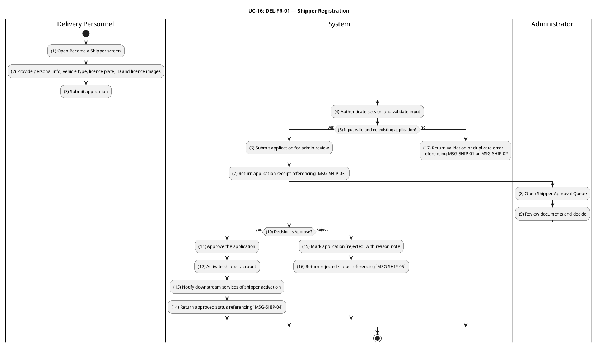

#### Business Rules

| Activity | BR Code    | Description                                                                                                                                                                                                                                                                                                                                                                                                                                                                     |
| -------- | ---------- | ------------------------------------------------------------------------------------------------------------------------------------------------------------------------------------------------------------------------------------------------------------------------------------------------------------------------------------------------------------------------------------------------------------------------------------------------------------------------------- | ----------------------------------------------------------------------------------------------------------------------------------------------------------- |
| _(3)_    | _BR-16.1_  | **Input Validation Rules:**<br>❖ Required fields: full name (1–80 chars, trimmed), national ID number (12 digits), driver licence number, vehicle type, licence plate in canonical Vietnamese format (`XX-NNN.NN`).<br>❖ Optional fields: bank account details for payouts; emergency contact.<br>❖ Phone number must match the Vietnamese mobile pattern (e.g. `^(\+84                                                                                                         | 0)[3-9][0-9]{8}$`).<br>❖ Class-validator decorators on `ShipperApplicationDto`enforce these constraints; failures return HTTP 400 referencing`MSG-SHIP-01`. |
| _(4)_    | _BR-16.2_  | **Image Reference Validation Rules:**<br>❖ The application must include four image references: national ID front, national ID back, driver licence, vehicle photo.<br>❖ Each reference is a Cloudinary public ID validated through `ImageService` before the application row is inserted.<br>❖ Missing or unresolvable references return HTTP 400 referencing `MSG-SHIP-02`.                                                                                                    |
| _(5)_    | _BR-16.3_  | **Duplicate Application Prevention:**<br>❖ A user with an existing `shipper_applications` row in `status ∈ {pending_approval, approved}` cannot submit a new application.<br>❖ The duplicate check runs inside the same DB transaction as the insertion (unique partial index on `(userId)` `WHERE status IN ('pending_approval', 'approved')`).<br>❖ Duplicate submission returns HTTP 409 referencing `MSG-SHIP-08`. A previously `rejected` application allows resubmission. |
| _(6)_    | _BR-16.4_  | **Default Status Rules:**<br>❖ A newly submitted application is always created with `status = 'pending_approval'`, regardless of any client-supplied status value.<br>❖ The applicant's account role remains unchanged at submission.                                                                                                                                                                                                                                           |
| _(7)_    | _BR-16.5_  | **Submission Receipt Message:**<br>❖ HTTP 200 response references `MSG-SHIP-03` to confirm application receipt and pending-review status.                                                                                                                                                                                                                                                                                                                                       |
| _(8)_    | _BR-16.6_  | **Admin Queue Access Rules:**<br>❖ The admin queue endpoint requires an authenticated session whose primary role is `admin`; non-admins return HTTP 403 referencing `MSG-AUTH-08`.<br>❖ Queue results are filtered by `status` (default `pending_approval`) with pagination (`limit ∈ [1, 100]`, `offset ≥ 0`).<br>❖ Each row resolves applicant identity, vehicle type, licence plate, submission timestamp, and signed CDN URLs for documents.                                |
| _(9)_    | _BR-16.7_  | **Rejection Documentation Rules:**<br>❖ Reject operation requires a non-empty reason note for the audit trail.<br>❖ Missing reason returns HTTP 400 referencing `MSG-SHIP-01`.                                                                                                                                                                                                                                                                                                  |
| _(10)_   | _BR-16.8_  | **Approval Decision Gate:**<br>❖ Only applications in `status = 'pending_approval'` are decidable.<br>❖ An already-approved or already-rejected application returns HTTP 409 referencing `MSG-ADM-30` without mutating data.<br>❖ Decision atomically updates the application row and (for approval) elevates the applicant's role inside a single DB transaction (see BR-16.9).                                                                                                |
| _(11)_   | _BR-16.9_  | **Role Elevation on Approval:**<br>❖ On approval, the applicant's primary `users.role` is updated to `shipper` (or `shipper` is appended to `users.soliRoles` for multi-role accounts).<br>❖ Elevation occurs in the same DB transaction as the application state change; failure of either rolls back both.<br>❖ After commit, `eventBus.publish(new ShipperApprovedEvent(shipperId))` is dispatched so downstream BCs (delivery dispatch, notifications) can react.           |
| _(12)_   | _BR-16.10_ | **Shipper Activation Notification:**<br>❖ The published `ShipperApprovedEvent` notifies downstream contexts (notification, delivery dispatch) that the shipper is now eligible for UC-17 (availability) and UC-18 (pickup assignments).<br>❖ `eventBus.publish(new ShipperApprovedEvent(shipperId))` publishes the corresponding domain event.                                                                                                                                  |
| _(13)_   | _BR-16.11_ | **Rejection Status Persistence:**<br>❖ On rejection, the application row is marked `status = 'rejected'` with the admin's reason note persisted for audit.<br>❖ The applicant's account role remains unchanged.                                                                                                                                                                                                                                                                 |
| _(14)_   | _BR-16.12_ | **Approval Confirmation Message:**<br>❖ HTTP 200 response after approval references `MSG-SHIP-04`.                                                                                                                                                                                                                                                                                                                                                                              |
| _(15)_   | _BR-16.13_ | **Rejection Confirmation Message:**<br>❖ HTTP 200 response after rejection references `MSG-SHIP-05`.                                                                                                                                                                                                                                                                                                                                                                            |

---

### UC-17: Manage Shipper Availability

| Field                  | Detail                                                                                                                                                                                                                                                                                                                         |
| ---------------------- | ------------------------------------------------------------------------------------------------------------------------------------------------------------------------------------------------------------------------------------------------------------------------------------------------------------------------------ |
| **Use Case ID — Name** | DEL-FR-02 — Manage Shipper Availability                                                                                                                                                                                                                                                                                        |
| **Actor**              | Delivery Personnel (approved Shipper)                                                                                                                                                                                                                                                                                          |
| **Trigger**            | ❖ Shipper toggles their online/offline status from the mobile shipper console.                                                                                                                                                                                                                                                 |
| **Description**        | Lets an approved shipper opt in or out of the dispatch pool in real time. Only shippers whose status is `online` are considered candidates for new pickup assignments in UC-18. The shipper cannot go offline while holding an order in `picked_up` or `delivering` (i.e. an in-flight delivery); such an attempt is rejected. |
| **Pre-condition**      | ❖ Actor is authenticated.<br>❖ Actor has role `shipper` (approved through UC-16).<br>❖ For setting status to `offline`: no order owned by this shipper is in `picked_up` or `delivering`.                                                                                                                                      |
| **Post-condition**     | ❖ The shipper's availability status is updated to `online` or `offline`.<br>❖ A `ShipperAvailabilityChangedEvent` is published so the dispatch service updates its candidate index.                                                                                                                                            |

#### Activities Flow

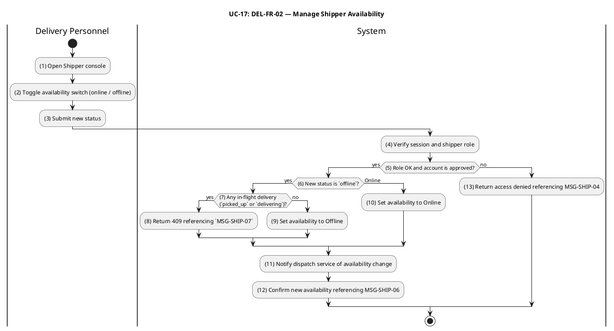

#### Business Rules

| Activity | BR Code    | Description                                                                                                                                                                                                                                                                                                                                                                                       |
| -------- | ---------- | ------------------------------------------------------------------------------------------------------------------------------------------------------------------------------------------------------------------------------------------------------------------------------------------------------------------------------------------------------------------------------------------------- |
| _(4)_    | _BR-17.1_  | **Session Verification Rules:**<br>❖ Endpoint requires an authenticated session with the caller's user id linked to an account holding role `shipper`.<br>❖ Non-authenticated requests return HTTP 401; non-shipper roles return HTTP 403 referencing `MSG-SHIP-04`.<br>❖ If `auth.api.getSession({ headers })` fails the authorization check, system returns HTTP 403 referencing `MSG-AUTH-08`. |
| _(5)_    | _BR-17.2_  | **Shipper Account Approval Gate:**<br>❖ The endpoint validates that the caller holds an `approved` shipper application (UC-16) before any availability mutation.<br>❖ Callers without role `shipper`, or with a non-approved application, return HTTP 403 referencing `MSG-SHIP-04`.<br>❖ The guard runs before any availability state change is persisted.                                       |
| _(6)_    | _BR-17.3_  | **Active-Delivery Lock Rules:**<br>❖ Setting status to `offline` is rejected with HTTP 409 referencing `MSG-SHIP-07` when the shipper owns any order in `picked_up` or `delivering`.<br>❖ The shipper must complete in-flight delivery (UC-19) or hand off via admin override before going offline.                                                                                               |
| _(7)_    | _BR-17.4_  | **In-Flight Delivery Query:**<br>❖ Before allowing the `online → offline` transition, the system queries orders owned by this shipper with `status ∈ {picked_up, delivering}` (composite index on `(shipperId, status)` for ≤ 100 ms response).<br>❖ A non-empty result blocks the transition and surfaces `MSG-SHIP-07` (see BR-17.3).<br>❖ An empty result allows the transition to proceed.    |
| _(8)_    | _BR-17.5_  | **Offline Transition Execution:**<br>❖ Once the in-flight check passes, the shipper's availability row is updated atomically to `offline`.<br>❖ The shipper is removed from the dispatch candidate pool consumed by UC-18.<br>❖ The transition publishes `ShipperAvailabilityChangedEvent` (see BR-17.8) so dependent services synchronise.                                                       |
| _(9)_    | _BR-17.6_  | **Online Transition Execution:**<br>❖ Setting availability to `online` proceeds immediately without in-flight checks.<br>❖ The shipper joins the candidate pool for new dispatch assignments (UC-18).                                                                                                                                                                                             |
| _(10)_   | _BR-17.7_  | **State Idempotency Rules:**<br>❖ Allowed values for availability are `online` and `offline`. Any other value returns HTTP 400 referencing `MSG-SHIP-01`.<br>❖ Setting the same status the shipper already has is idempotent — no event is republished.                                                                                                                                           |
| _(11)_   | _BR-17.8_  | **Availability Change Event:**<br>❖ A successful change publishes `ShipperAvailabilityChangedEvent` carrying `shipperId`, new availability status, and the timestamp.<br>❖ `eventBus.publish(new ShipperAvailabilityChangedEvent(shipperId, isAvailable))` publishes the corresponding domain event.                                                                                              |
| _(12)_   | _BR-17.9_  | **Dispatch Pool Synchronisation:**<br>❖ The dispatch service consumes `ShipperAvailabilityChangedEvent` and adds or removes the shipper from the online candidate set used by UC-18 assignment.<br>❖ This sync must complete within a configurable SLA (recommended < 2 seconds).                                                                                                                 |
| _(13)_   | _BR-17.10_ | **Confirmation Response Rules:**<br>❖ HTTP 200 response with new availability status references `MSG-SHIP-06`.                                                                                                                                                                                                                                                                                    |

---

### UC-18: Accept Delivery Assignment

| Field                  | Detail                                                                                                                                                                                                                                                                                                                                                                                                                                                                                                                                                                                                                                        |
| ---------------------- | --------------------------------------------------------------------------------------------------------------------------------------------------------------------------------------------------------------------------------------------------------------------------------------------------------------------------------------------------------------------------------------------------------------------------------------------------------------------------------------------------------------------------------------------------------------------------------------------------------------------------------------------- |
| **Use Case ID — Name** | DEL-FR-03 — Accept Delivery Assignment                                                                                                                                                                                                                                                                                                                                                                                                                                                                                                                                                                                                        |
| **Actor**              | Delivery Personnel (online Shipper), Administrator                                                                                                                                                                                                                                                                                                                                                                                                                                                                                                                                                                                            |
| **Trigger**            | ❖ A `ready_for_pickup` order is surfaced to one or more online shippers via the dispatch service (driven by `OrderReadyForPickupEvent`).<br>❖ A shipper claims the order from their queue (`PATCH /orders/:id/pickup`) — transitions `ready_for_pickup → picked_up` (T-09).                                                                                                                                                                                                                                                                                                                                                                   |
| **Description**        | Models the self-assignment of a `ready_for_pickup` order to a shipper. T-09 atomically sets `orders.shipperId` to the acting shipper's user id and advances `orders.status` to `picked_up`. Concurrency control is critical: when two online shippers attempt to claim the same order simultaneously, the optimistic-locking `version` guard guarantees that exactly one succeeds and the other receives a conflict response. An administrator may also execute T-09 as an operational override (e.g., to assign a specific shipper); in that case `shipperId` is set to the admin's user id, and the actual shipper is recorded out-of-band. |
| **Pre-condition**      | ❖ Actor is authenticated.<br>❖ Actor has role `shipper` and availability `online` (or role `admin` for override).<br>❖ Target order is in `status = 'ready_for_pickup'`.<br>❖ No other shipper has yet claimed the order.                                                                                                                                                                                                                                                                                                                                                                                                                     |
| **Post-condition**     | ❖ `orders.status = 'picked_up'`, `orders.shipperId = actorId`, `orders.version` incremented atomically.<br>❖ A new `order_status_logs` row records T-09 with `triggeredByRole = 'shipper'` (or `'admin'`).<br>❖ `OrderStatusChangedEvent` is published after commit.                                                                                                                                                                                                                                                                                                                                                                          |

#### Activities Flow

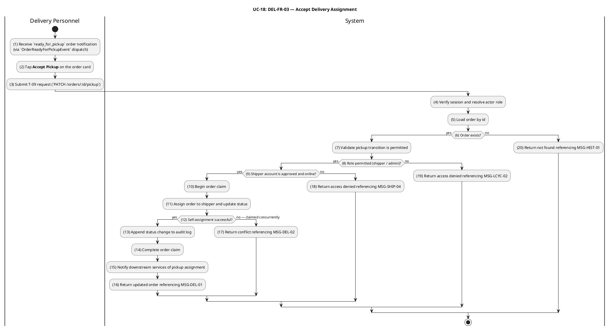

#### Business Rules

| Activity | BR Code    | Description                                                                                                                                                                                                                                                                                                                                                                                                                |
| -------- | ---------- | -------------------------------------------------------------------------------------------------------------------------------------------------------------------------------------------------------------------------------------------------------------------------------------------------------------------------------------------------------------------------------------------------------------------------- |
| _(4)_    | _BR-18.1_  | **Shipper Role Gate:**<br>❖ Shipper role is required; other authenticated roles (`user`, `restaurant`, `admin` override) have different assignment flows.<br>❖ Non-shipper attempt returns HTTP 403 referencing `MSG-LCYC-02`.<br>❖ If `OrderLifecycleService.assertOwnership(order, actorId, 'shipper')` fails the authorization check, system returns HTTP 403 referencing `MSG-LCYC-AUTH-03`.                           |
| _(5)_    | _BR-18.2_  | **Order Existence Check:**<br>❖ Load order by id; non-existent orders return HTTP 404 referencing `MSG-HIST-01`.<br>❖ If `OrderRepository.findById(orderId)` returns null or empty, system returns an error response referencing `MSG-LCYC-02` (order not found).                                                                                                                                                          |
| _(6)_    | _BR-18.3_  | **Ready-for-Pickup State Gate:**<br>❖ T-09 (`ready_for_pickup → picked_up`) requires the source state to be `ready_for_pickup`.<br>❖ Any other state returns HTTP 422 referencing `MSG-LCYC-01`.<br>❖ If `OrderRepository.findById(orderId)` returns false, system returns an error response referencing `MSG-LCYC-01` (order not in `ready_for_pickup` state).                                                            |
| _(7)_    | _BR-18.4_  | **Transition Direction Enforcement:**<br>❖ Only `ready_for_pickup → picked_up` is allowed via this endpoint; reverse or sideways transitions are forbidden.                                                                                                                                                                                                                                                                |
| _(8)_    | _BR-18.5_  | **Shipper Approval Status:**<br>❖ For role `shipper`, the underlying account must be `approved` (UC-16).<br>❖ Non-approved shipper attempt returns HTTP 403 referencing `MSG-SHIP-04`.                                                                                                                                                                                                                                     |
| _(9)_    | _BR-18.6_  | **Shipper Online Status:**<br>❖ For role `shipper`, the shipper's availability must be `online` (UC-17).<br>❖ Offline shipper attempt returns HTTP 403 referencing `MSG-SHIP-04`.                                                                                                                                                                                                                                          |
| _(10)_   | _BR-18.7_  | **Concurrency Control Initialization:**<br>❖ The order row is loaded with its current `version` value before any state mutation.<br>❖ The transition UPDATE is `UPDATE orders SET status = 'picked_up', shipperId = $sid, version = version + 1 WHERE id = $oid AND version = $expected`.<br>❖ Loss of the optimistic lock (zero rows updated) is treated as a race and falls through to the contention handler (BR-18.9). |
| _(11)_   | _BR-18.8_  | **Atomic Self-Assignment:**<br>❖ Status update and `shipperId` assignment execute in a single SQL `UPDATE` guarded by optimistic locking.<br>❖ For role `shipper`, `shipperId` is set to `session.user.id`. For role `admin`, `shipperId` is set to the admin's id.<br>❖ After `CommandBus.execute(new TransitionOrderCommand(orderId, 'T-09-PICKUP', session))` succeeds, order assigned to shipper atomically.           |
| _(12)_   | _BR-18.9_  | **Race Condition Resolution:**<br>❖ When two shippers race for the same order, the database guarantees at most one row update; the loser receives HTTP 409 referencing `MSG-DEL-02`.<br>❖ The winner's version is incremented and a new audit log is appended.                                                                                                                                                             |
| _(13)_   | _BR-18.10_ | **Audit Trail Recording:**<br>❖ A new `order_status_logs` row records T-09 with `fromStatus = 'ready_for_pickup'`, `toStatus = 'picked_up'`, `triggeredBy = actorId`, `triggeredByRole = 'shipper'` or `'admin'`.                                                                                                                                                                                                          |
| _(14)_   | _BR-18.11_ | **Status Changed Event Publication:**<br>❖ `OrderStatusChangedEvent` is published after commit carrying the transition details and order snapshot.<br>❖ `eventBus.publish(new OrderStatusChangedEvent(orderId, oldStatus, newStatus))` publishes the corresponding domain event.                                                                                                                                           |
| _(15)_   | _BR-18.12_ | **Success Response Contract:**<br>❖ HTTP 200 returns the updated order and references `MSG-DEL-01`.                                                                                                                                                                                                                                                                                                                        |
| _(16)_   | _BR-18.13_ | **Idempotent Re-issue Handling:**<br>❖ If the order is already in `picked_up` status at attempt time, the system returns the order unchanged without creating a duplicate audit log entry or re-publishing events.                                                                                                                                                                                                         |

---

### UC-19: Deliver Order

| Field                  | Detail                                                                                                                                                                                                                                                                                                                                                                                                                                                                                                                                  |
| ---------------------- | --------------------------------------------------------------------------------------------------------------------------------------------------------------------------------------------------------------------------------------------------------------------------------------------------------------------------------------------------------------------------------------------------------------------------------------------------------------------------------------------------------------------------------------- |
| **Use Case ID — Name** | DEL-FR-04 — Deliver Order                                                                                                                                                                                                                                                                                                                                                                                                                                                                                                               |
| **Actor**              | Delivery Personnel (assigned Shipper), Administrator                                                                                                                                                                                                                                                                                                                                                                                                                                                                                    |
| **Trigger**            | ❖ Assigned shipper starts the delivery leg (`PATCH /orders/:id/en-route`) — transitions `picked_up → delivering` (T-10).<br>❖ Assigned shipper marks the order as delivered to the customer (`PATCH /orders/:id/deliver`) — transitions `delivering → delivered` (T-11).                                                                                                                                                                                                                                                                |
| **Description**        | Completes the order fulfilment as a single unified business workflow with two sequential transitions: T-10 (`picked_up → delivering`) starts the en-route leg and T-11 (`delivering → delivered`) closes the order. Both transitions enforce **assigned-shipper ownership** — only the user whose id matches `orders.shipperId` (or an administrator) can advance the order. Each transition emits `OrderStatusChangedEvent` so the customer's order-tracking surface (UC-20) and the COD payment-on-delivery reconciliation can react. |
| **Pre-condition**      | ❖ Actor is authenticated.<br>❖ Actor has role `shipper` and `actorId = orders.shipperId`, OR actor has role `admin`.<br>❖ T-10 requires `order.status = 'picked_up'`; T-11 requires `order.status = 'delivering'`.                                                                                                                                                                                                                                                                                                                      |
| **Post-condition**     | ❖ `orders.status` advances to `delivering` and subsequently to `delivered`; `orders.version` is incremented on each transition.<br>❖ A `order_status_logs` row is appended for each transition.<br>❖ `OrderStatusChangedEvent` is published after each transition.<br>❖ On T-11, downstream consumers (notification, COD payment reconciliation, rating eligibility) react to the `delivered` status.                                                                                                                                   |

#### Activities Flow

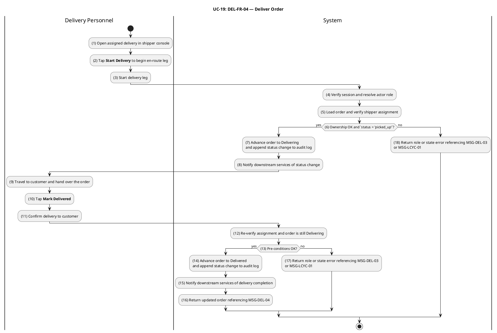

#### Business Rules

| Activity | BR Code    | Description                                                                                                                                                                                                                                                                                                                                                                                                                                                                                                                                                                                                                                                                                                                                                                                                                                                  |
| -------- | ---------- | ------------------------------------------------------------------------------------------------------------------------------------------------------------------------------------------------------------------------------------------------------------------------------------------------------------------------------------------------------------------------------------------------------------------------------------------------------------------------------------------------------------------------------------------------------------------------------------------------------------------------------------------------------------------------------------------------------------------------------------------------------------------------------------------------------------------------------------------------------------ |
| _(4)_    | _BR-19.1_  | **Shipper Role Authorization:**<br>❖ T-10 and T-11 are restricted to roles `shipper` and `admin`; other roles return HTTP 403 referencing `MSG-LCYC-02`.<br>❖ If `OrderLifecycleService.assertOwnership(order, actorId, 'shipper')` fails the authorization check, system returns HTTP 403 referencing `MSG-LCYC-AUTH-03`.                                                                                                                                                                                                                                                                                                                                                                                                                                                                                                                                   |
| _(5)_    | _BR-19.2_  | **Assigned-Shipper Ownership Check:**<br>❖ For role `shipper`, `orders.shipperId` must equal `session.user.id`; otherwise HTTP 403 referencing `MSG-DEL-03`.<br>❖ For role `admin`, the assigned-shipper check is bypassed.<br>❖ If `OrderLifecycleService.assertOwnership(order, actorId, 'shipper')` fails the authorization check, system returns HTTP 403 referencing `MSG-LCYC-AUTH-04`.                                                                                                                                                                                                                                                                                                                                                                                                                                                                |
| _(12)_   | _BR-19.3_  | **Ownership Re-verification on T-11:**<br>❖ T-11 re-verifies that `orders.shipperId = session.user.id` for role `shipper`; mismatch returns HTTP 403 referencing `MSG-DEL-03`. For role `admin`, the assigned-shipper check is bypassed.                                                                                                                                                                                                                                                                                                                                                                                                                                                                                                                                                                                                                     |
| _(6)_    | _BR-19.4_  | **T-10 Pickup-to-Delivering Source-State Precondition:**<br>❖ Transition T-10 (`picked_up` -> `delivering`) is only admitted when the shipper-owned order presents source status `picked_up`; any non-`picked_up` source (`ready_for_pickup`, `delivered`, `cancelled`) is rejected with HTTP 422 + `MSG-LCYC-01` and no audit row is appended.<br>❖ Idempotency contract for T-10: a repeat call against an order that has already advanced to `delivering` returns the current snapshot (HTTP 200) without writing a second `order_status_logs` entry, allowing the shipper mobile client to retry safely after network loss while the bike is moving.<br>❖ After `CommandBus.execute(new TransitionOrderCommand(orderId, 'T-10-EN-ROUTE', session))` succeeds, order transitions from `picked_up` to `delivering`.                                        |
| _(13)_   | _BR-19.5_  | **T-11 Delivery-Completion Source-State Precondition:**<br>❖ Transition T-11 (`delivering` -> `delivered`) is admitted only when the order is currently in `delivering`; calls against `picked_up` (shipper skipped the start-delivery handshake) or against the terminal `delivered` (replay) are rejected with HTTP 422 + `MSG-LCYC-01` and produce no audit row.<br>❖ Idempotency contract for T-11: because `delivered` is the happy-path terminal status, a duplicate completion call returns the persisted completion snapshot (HTTP 200, including `delivered_at` + proof-of-delivery photo URL) without writing a second `order_status_logs` entry or re-triggering payout settlement.<br>❖ After `CommandBus.execute(new TransitionOrderCommand(orderId, 'T-11-DELIVERED', session))` succeeds, order transitions from `delivering` to `delivered`. |
| _(7)_    | _BR-19.6_  | **Atomicity & Concurrency (T-10):**<br>❖ Status update and audit-log insert execute in a single DB transaction.<br>❖ Optimistic locking on `version` rejects concurrent updates with HTTP 409 referencing `MSG-LCYC-06`.                                                                                                                                                                                                                                                                                                                                                                                                                                                                                                                                                                                                                                     |
| _(14)_   | _BR-19.7_  | **T-11 Transactional Boundary Rules:**<br>❖ The `delivering` -> `delivered` status update and the `order_status_logs` audit row are committed in a single DB transaction; `delivered` is the terminal happy-path status, so no follow-on lifecycle scheduler claims this order after commit.<br>❖ Optimistic locking on `version` blocks any concurrent writer (e.g. an admin-initiated T-12 refund attempt racing with the shipper completing the order); conflict returns HTTP 409 referencing `MSG-LCYC-06` and the request is rejected without re-issuing the audit row.                                                                                                                                                                                                                                                                                 |
| _(8)_    | _BR-19.8_  | **T-10 Event Publication:**<br>❖ Successful T-10 publishes `OrderStatusChangedEvent` with `fromStatus = 'picked_up'`, `toStatus = 'delivering'` after commit.<br>❖ No refund event is triggered; T-12 (post-delivery dispute) is admin-only and out of scope.<br>❖ `eventBus.publish(new OrderStatusChangedEvent(orderId, oldStatus, newStatus))` publishes the corresponding domain event.                                                                                                                                                                                                                                                                                                                                                                                                                                                                  |
| _(15)_   | _BR-19.9_  | **T-11 Event Publication:**<br>❖ Successful T-11 publishes `OrderStatusChangedEvent` with `fromStatus = 'delivering'`, `toStatus = 'delivered'` after commit.                                                                                                                                                                                                                                                                                                                                                                                                                                                                                                                                                                                                                                                                                                |
| _(16)_   | _BR-19.10_ | **Delivery Completion Downstream Effects:**<br>❖ The `delivered` status is the trigger for customer rating eligibility (UC-22), order-history "delivered" filter (UC-10), and COD payment-on-delivery reconciliation.<br>❖ A delivered order can only advance to `refunded` via T-12 (admin-only dispute resolution).                                                                                                                                                                                                                                                                                                                                                                                                                                                                                                                                        |

---

### Customer Interaction, Promotion & Notification (UC-20 – UC-26)

This section specifies the customer-facing interaction surface following order placement (real-time tracking and self-service cancellation), the **rating and review** loop that closes the order lifecycle, and the cross-cutting **promotion**, **payment refund** and **notification** services consumed by all bounded contexts. These use cases formalise the cancellation-after-payment refund pipeline wired by transitions T-05, T-07 and T-12, and specify the multi-channel delivery contract (in-app, push, email) that surfaces every order, payment and refund event to the right actor within seconds.

---

### UC-20: Track Order Status

| Field                  | Detail                                                                                                                                                                                                                                                                                                                                                                                                                                                                                                                                |
| ---------------------- | ------------------------------------------------------------------------------------------------------------------------------------------------------------------------------------------------------------------------------------------------------------------------------------------------------------------------------------------------------------------------------------------------------------------------------------------------------------------------------------------------------------------------------------- |
| **Use Case ID — Name** | CUS-FR-08 — Track Order Status                                                                                                                                                                                                                                                                                                                                                                                                                                                                                                        |
| **Actor**              | Customer (authenticated, role `user`)                                                                                                                                                                                                                                                                                                                                                                                                                                                                                                 |
| **Trigger**            | ❖ Customer opens an active order in the mobile or web client.<br>❖ Customer's open session receives an `OrderStatusChangedEvent` push over the Notification WebSocket gateway.<br>❖ Client falls back to polling `GET /orders/:id` or `GET /orders/:id/timeline` when the WebSocket is unavailable.                                                                                                                                                                                                                                   |
| **Description**        | Provides the customer with a live view of one of their own orders. The use case combines an authoritative read API (`GET /orders/:id` and `GET /orders/:id/timeline`) with a real-time push channel served by the Notification gateway. Status updates originate from the `OrderStatusChangedEvent` published by every order status transition (T-01 through T-12); the customer surface reflects each transition within seconds while staying consistent with the order-history reads (UC-10, BR-10.4 — uniform 404 for non-owners). |
| **Pre-condition**      | ❖ Customer is authenticated.<br>❖ The order is owned by the customer (`orders.customerId = session.user.id`).<br>❖ For real-time push: an active WebSocket connection to the Notification gateway exists for the caller's session.                                                                                                                                                                                                                                                                                                    |
| **Post-condition**     | ❖ The client surfaces the order's current `status`, the chronological `order_status_logs` timeline, and any derived ETA.<br>❖ Subsequent transitions are reflected in the client either via WebSocket push or by the next poll cycle.                                                                                                                                                                                                                                                                                                 |

#### Activities Flow

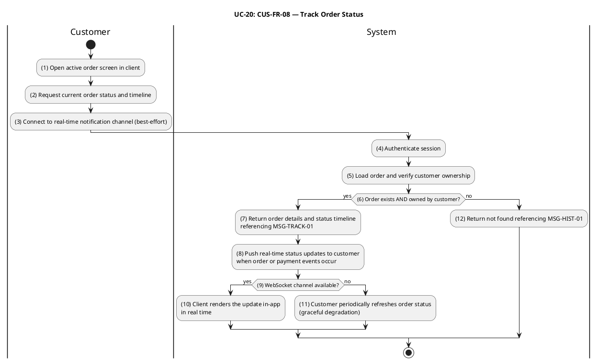

#### Business Rules

| Activity | BR Code    | Description                                                                                                                                                                                                                                                                                                                                                                                                                                                           |
| -------- | ---------- | --------------------------------------------------------------------------------------------------------------------------------------------------------------------------------------------------------------------------------------------------------------------------------------------------------------------------------------------------------------------------------------------------------------------------------------------------------------------- |
| _(4)_    | _BR-20.1_  | **Customer Ownership Validation:**<br>❖ `GET /orders/:id` enforces `orders.customerId = session.user.id` for role `user`.<br>❖ Non-owners receive HTTP 404 referencing `MSG-HIST-01` — never 403 — to avoid leaking order existence.<br>❖ If `OrderHistoryService.getCustomerOrderDetail(actorId, orderId)` returns null or empty, system returns an error response referencing `MSG-ORD-10` (order not owned by caller).                                             |
| _(5)_    | _BR-20.2_  | **Timeline Ownership Enforcement:**<br>❖ `GET /orders/:id/timeline` enforces `orders.customerId = session.user.id` for role `user`; non-owners receive HTTP 404 referencing `MSG-HIST-01` (uniform 404 prevents ownership disclosure).                                                                                                                                                                                                                                |
| _(12)_   | _BR-20.3_  | **Multi-Role Read Path Isolation:**<br>❖ Other authenticated roles (`restaurant`, `shipper`, `admin`) follow their own scoped read paths; they do NOT use the customer endpoint.<br>❖ This UC covers customer (`user`) role only.                                                                                                                                                                                                                                     |
| _(6)_    | _BR-20.4_  | **Canonical Order Header:**<br>❖ `GET /orders/:id` returns the authoritative order record: `id`, `status`, `paymentMethod`, `totalAmount`, `shipperId`, `version`, and persisted line items.<br>❖ When `OrderHistoryService.getCustomerOrderList(actorId, filters)` executes, canonical order summary returned.                                                                                                                                                       |
| _(7)_    | _BR-20.5_  | **Chronological Timeline:**<br>❖ `GET /orders/:id/timeline` returns the ordered projection of `order_status_logs` rows (`fromStatus`, `toStatus`, `triggeredByRole`, `note`, `createdAt`) for step-by-step progress rendering.<br>❖ When `OrderRepository.findTimeline(orderId)` executes, chronological status timeline returned.                                                                                                                                    |
| _(3)_    | _BR-20.6_  | **WebSocket Authentication & Routing:**<br>❖ The Notification WebSocket gateway authenticates via Bearer token and joins the socket to a per-user room based on `session.user.id`.<br>❖ If `NotificationGateway.handleConnection(client)` fails the authorization check, system returns HTTP 403 referencing `MSG-WS-01` (socket authenticated and joined to user room).                                                                                              |
| _(8)_    | _BR-20.7_  | **Real-Time Event Dispatch:**<br>❖ For every `OrderStatusChangedEvent` published after a successful transition (T-01 through T-12), the Notification BC dispatches a `notification_payload` to the customer's room.<br>❖ The `notification_type` is mapped from the `(fromStatus, toStatus)` pair (see UC-26).<br>❖ After `NotificationGateway.sendToUser(userId, event, payload)` executes, real-time event pushed to subscribed clients.                            |
| _(10)_   | _BR-20.8_  | **Fire-and-Forget Delivery Guarantee:**<br>❖ Payload delivery over WebSocket is fire-and-forget on the publishing side; failure to push does not affect the order's database state.                                                                                                                                                                                                                                                                                   |
| _(9)_    | _BR-20.9_  | **Polling Fallback & Read-Model Consistency:**<br>❖ When WebSocket is unavailable (cold start, mobile background, network loss), the client polls `GET /orders/:id` and `GET /orders/:id/timeline` at configurable interval (recommended 10s for active, 60s for stable).<br>❖ Both WebSocket push and polled reads derive from the same authoritative `orders` and `order_status_logs` tables, so displayed state remains consistent regardless of delivery channel. |
| _(11)_   | _BR-20.10_ | **Cross-Channel Convergence Rules:**<br>❖ When a client receives an update via WebSocket and subsequently polls the read endpoint, the polled response MUST contain the same or newer state (monotonic causality).<br>❖ A polling interval of at most 60 seconds is required so the polled channel converges with the WebSocket channel within the convergence SLA.                                                                                                   |
| _(8)_    | _BR-20.11_ | **Cross-BC Read-Model Boundary:**<br>❖ The Notification BC does NOT own or enrich order data; every field in the event payload comes from the published event itself (D-P7 isolation).<br>❖ Notification BC MUST NOT call any Ordering BC repository to augment payload.                                                                                                                                                                                              |

---

### UC-21: Cancel Order

| Field                  | Detail                                                                                                                                                                                                                                                                                                                                                                                                                                                                                                                                                                                                                                                                                  |
| ---------------------- | --------------------------------------------------------------------------------------------------------------------------------------------------------------------------------------------------------------------------------------------------------------------------------------------------------------------------------------------------------------------------------------------------------------------------------------------------------------------------------------------------------------------------------------------------------------------------------------------------------------------------------------------------------------------------------------- |
| **Use Case ID — Name** | CUS-FR-09 — Cancel Order                                                                                                                                                                                                                                                                                                                                                                                                                                                                                                                                                                                                                                                                |
| **Actor**              | Customer (authenticated, role `user`)                                                                                                                                                                                                                                                                                                                                                                                                                                                                                                                                                                                                                                                   |
| **Trigger**            | ❖ Customer chooses **Cancel Order** on an active order screen and submits a non-empty reason note.<br>❖ Client issues `PATCH /orders/:id/cancel` with body `{ reason: string }`.                                                                                                                                                                                                                                                                                                                                                                                                                                                                                                        |
| **Description**        | Allows a customer to cancel one of their own orders **before** the restaurant has confirmed it. Two backend transitions are reachable from this UC: T-03 (`pending → cancelled`, COD or pre-payment) and T-05 (`paid → cancelled`, VNPay paid). For T-05 the system additionally publishes an `OrderCancelledAfterPaymentEvent`, which is consumed by the Payment BC to initiate the refund pipeline (UC-25). After the order reaches `confirmed` the customer can no longer cancel — only the restaurant (T-07) or an admin may do so. The use case is **idempotent** with respect to the order version and uses optimistic locking to safely interleave with restaurant-side actions. |
| **Pre-condition**      | ❖ Customer is authenticated.<br>❖ The order is owned by the customer (`orders.customerId = session.user.id`).<br>❖ The order's current status is one of `pending` or `paid`; any later state is non-cancellable by the customer.<br>❖ A non-empty `reason` note is supplied.                                                                                                                                                                                                                                                                                                                                                                                                            |
| **Post-condition**     | ❖ Order status advances to `cancelled` via T-03 or T-05, version is incremented and an `order_status_logs` row is appended.<br>❖ `OrderStatusChangedEvent` is published for downstream notification fan-out.<br>❖ For T-05 only: `OrderCancelledAfterPaymentEvent` is published, kicking off the Payment BC refund pipeline (UC-25).<br>❖ Any active promotion reservations linked to the order are rolled back via the `PromotionRollbackOnCancellationHandler` (see BR-21.5).                                                                                                                                                                                                         |

#### Activities Flow

```plantuml
@startuml UC21-CancelOrder
title UC-21: CUS-FR-09 — Cancel Order
skinparam ConditionEndStyle hline

|Customer|
start
:(1) Open active order screen;
:(2) Tap **Cancel Order** and\nenter a non-empty reason;
:(3) Submit cancellation with reason;

|System|
:(4) Verify session and actor role;
:(5) Load order and verify customer ownership;
if ((6) Order found AND owned by customer?) then (yes)
  if ((7) `reason` non-empty?) then (yes)
    if ((8) Current status ∈ {`pending`, `paid`}?) then (yes)
      :(9) Determine applicable cancellation path;
      :(10) Cancel order and append status change to audit log;
      if ((11) Optimistic lock succeeded?) then (yes)
        :(12) Notify downstream services of cancellation;
        if ((13) Was the order paid via VNPay?) then (yes)
          :(14) Initiate payment refund pipeline;
        else (no)
          :(15) No refund applicable\n(COD or unpaid order);
        endif
        :(16) Roll back any applied promotion reservations;
        :(17) Return updated order referencing MSG-CANC-03;
      else (no)
        :(18) Return conflict referencing MSG-LCYC-06;
      endif
    else (no)
      :(19) Return state error referencing MSG-CANC-02;
    endif
  else (no)
    :(20) Return validation error referencing MSG-CANC-01;
  endif
else (no)
  :(21) Return not found referencing MSG-HIST-01;
endif
stop
@enduml
```

#### Business Rules

| Activity | BR Code    | Description                                                                                                                                                                                                                                                                                                                                                                                                                                                                                                                                                                                                         |
| -------- | ---------- | ------------------------------------------------------------------------------------------------------------------------------------------------------------------------------------------------------------------------------------------------------------------------------------------------------------------------------------------------------------------------------------------------------------------------------------------------------------------------------------------------------------------------------------------------------------------------------------------------------------------- |
| _(4)_    | _BR-21.1_  | **Session Role Mapping:**<br>❖ The endpoint is callable by any authenticated session; role-resolution maps to the most-privileged role (admin > restaurant > shipper > customer).<br>❖ If `OrderLifecycleService.assertOwnership(order, actorId, 'customer')` fails the authorization check, system returns HTTP 403 referencing `MSG-LCYC-AUTH-05`.                                                                                                                                                                                                                                                                |
| _(5)_    | _BR-21.2_  | **Customer Ownership Gate:**<br>❖ For role `customer`, `orders.customerId` MUST equal `session.user.id`; otherwise HTTP 404 referencing `MSG-HIST-01` (no order-existence leak).<br>❖ If `OrderLifecycleService.assertOwnership(order, actorId, 'customer')` fails the authorization check, system returns HTTP 403 referencing `MSG-LCYC-AUTH-06`.                                                                                                                                                                                                                                                                 |
| _(6)_    | _BR-21.3_  | **Order Existence Verification:**<br>❖ Load order by id; missing orders return HTTP 404 referencing `MSG-HIST-01`.                                                                                                                                                                                                                                                                                                                                                                                                                                                                                                  |
| _(21)_   | _BR-21.4_  | **Restaurant & Admin Cancellation Out-of-Scope:**<br>❖ Restaurant-initiated (T-07) and admin-initiated cancellations follow UC-14; they are not handled by this customer endpoint.                                                                                                                                                                                                                                                                                                                                                                                                                                  |
| _(7)_    | _BR-21.5_  | **Non-Empty Reason Validation:**<br>❖ Both T-03 and T-05 set `requireNote = true` in the transition map.<br>❖ Requests with missing or whitespace-only `reason` return HTTP 400 referencing `MSG-CANC-01`.<br>❖ If `CommandBus.execute(new TransitionOrderCommand(orderId, 'T-CANCEL', session, dto))` returns false, system returns an error response referencing `MSG-LCYC-CAN-01`.                                                                                                                                                                                                                               |
| _(20)_   | _BR-21.6_  | **Reason Note Audit Trail:**<br>❖ The accepted reason is persisted on the `order_status_logs` row so downstream support and analytics can audit the cancellation reason.                                                                                                                                                                                                                                                                                                                                                                                                                                            |
| _(8)_    | _BR-21.7_  | **Cancellable Window (Pending):**<br>❖ A customer may cancel while `order.status = 'pending'` (before payment or confirmation).<br>❖ This maps to T-03: `pending → cancelled`.<br>❖ After `CommandBus.execute(new TransitionOrderCommand(orderId, 'T-CANCEL', session, dto))` succeeds, order transitions to `cancelled` when within cancellable window.                                                                                                                                                                                                                                                            |
| _(19)_   | _BR-21.8_  | **Cancellable Window (Paid):**<br>❖ A customer may cancel while `order.status = 'paid'` (after VNPay success, before restaurant confirmation).<br>❖ This maps to T-05: `paid → cancelled`.                                                                                                                                                                                                                                                                                                                                                                                                                          |
| _(10)_   | _BR-21.9_  | **Locked Window After Confirmation:**<br>❖ Once the order reaches `confirmed`, `preparing`, `ready_for_pickup`, `picked_up`, `delivering`, `delivered`, `cancelled` or `refunded`, the customer endpoint returns HTTP 422 referencing `MSG-CANC-02`.<br>❖ Only restaurant (T-07) or admin may cancel post-confirmed orders.                                                                                                                                                                                                                                                                                         |
| _(11)_   | _BR-21.10_ | **Optimistic Lock Contention:**<br>❖ Cancellation uses optimistic locking via `WHERE id = $oid AND version = $expected` on the `orders` UPDATE.<br>❖ Concurrent cancellation attempts result in zero rows updated; the loser receives HTTP 409 referencing `MSG-CANC-04`.<br>❖ The successful transition increments `version` and writes the `order_status_logs` audit row atomically within the same DB transaction.<br>❖ After `CommandBus.execute(new TransitionOrderCommand(orderId, 'T-CANCEL', session, dto))` succeeds, the order's version is advanced; otherwise the handler retries or fails the request. |
| _(18)_   | _BR-21.11_ | **Idempotent Conflict Handling:**<br>❖ Re-issuing the same `PATCH /orders/:id/cancel` after the order is already `cancelled` yields HTTP 422 referencing `MSG-CANC-02`; the handler never double-publishes events.                                                                                                                                                                                                                                                                                                                                                                                                  |
| _(13)_   | _BR-21.12_ | **VNPay Refund Event (T-05):**<br>❖ When source status is `paid` AND `paymentMethod = 'vnpay'`, publish `OrderCancelledAfterPaymentEvent` with: `orderId`, `customerId`, `paymentMethod: 'vnpay'`, `paidAmount`, `cancelledAt`, `cancelledByRole: 'customer'`.<br>❖ `eventBus.publish(new OrderCancelledAfterPaymentEvent(orderId, refundAmount))` publishes the corresponding domain event.                                                                                                                                                                                                                        |
| _(14)_   | _BR-21.13_ | **Payment BC Refund Responsibility:**<br>❖ The Payment BC's `OrderCancelledAfterPaymentHandler` consumes `OrderCancelledAfterPaymentEvent` asynchronously and is solely responsible for the VNPay refund call (UC-25).<br>❖ Notification BC concurrently handles customer notifications (UC-26 BR-26.4).                                                                                                                                                                                                                                                                                                            |
| _(12)_   | _BR-21.14_ | **Notification Fan-out Events:**<br>❖ `OrderStatusChangedEvent` is published triggering Notification BC fan-out: channels `in_app`, `push`, `email` for `order_cancelled` recipient `customer`.<br>❖ `eventBus.publish(new OrderStatusChangedEvent(orderId, oldStatus, newStatus))` publishes the corresponding domain event.                                                                                                                                                                                                                                                                                       |
| _(16)_   | _BR-21.15_ | **Promotion Rollback Side-Effect:**<br>❖ `PromotionRollbackOnCancellationHandler` (Ordering BC) listens to the same `OrderStatusChangedEvent` and calls Promotion BC `rollbackReservations(orderId)`.<br>❖ Any `reserved` or `confirmed` promotion-usage rows flip to `rolled_back` and promotion counters decrement.<br>❖ After `PromotionService.rollbackReservations(orderId)` executes, promotion reservations rolled back.                                                                                                                                                                                     |
| _(17)_   | _BR-21.16_ | **Success Response Contract:**<br>❖ HTTP 200 returns the updated order and references `MSG-CANC-03`.                                                                                                                                                                                                                                                                                                                                                                                                                                                                                                                |

---

### UC-22: Submit Rating & Review

| Field                  | Detail                                                                                                                                                                                                                                                                                                                                                                                                                                                                                                                                                     |
| ---------------------- | ---------------------------------------------------------------------------------------------------------------------------------------------------------------------------------------------------------------------------------------------------------------------------------------------------------------------------------------------------------------------------------------------------------------------------------------------------------------------------------------------------------------------------------------------------------- |
| **Use Case ID — Name** | CUS-FR-10 — Submit Rating & Review                                                                                                                                                                                                                                                                                                                                                                                                                                                                                                                         |
| **Actor**              | Customer (authenticated, role `user`)                                                                                                                                                                                                                                                                                                                                                                                                                                                                                                                      |
| **Trigger**            | ❖ Customer opens a delivered order and selects **Rate & Review**.<br>❖ Customer submits `POST /reviews` with `{ orderId, stars, comment? }`.                                                                                                                                                                                                                                                                                                                                                                                                               |
| **Description**        | Lets a customer rate a delivered order on a 1–5 star scale and optionally leave a free-text comment. Exactly one review per `(orderId, customerId)` pair may exist. The review is owned by the Review BC, references the order by UUID only (D-P7 cross-context isolation), and is the input to the restaurant's aggregate rating projection consumed by UC-2 / UC-3 listings. Reviews are moderation-ready: the schema reserves a `status` column (`published`, `hidden`, `removed`) so administrators can hide abusive content without deleting the row. |
| **Pre-condition**      | ❖ Customer is authenticated.<br>❖ The referenced order is owned by the customer (`orders.customerId = session.user.id`).<br>❖ The referenced order has `status = 'delivered'`.<br>❖ No existing review row exists for `(orderId, customerId)`.                                                                                                                                                                                                                                                                                                             |
| **Post-condition**     | ❖ A new `reviews` row is persisted with `status = 'published'`.<br>❖ A `RestaurantRatingChangedEvent` is published; the Restaurant Catalog BC updates the aggregate rating projection for the restaurant (`ratingSum`, `ratingCount`, derived `averageRating`).<br>❖ The review is visible on the restaurant detail screen (UC-3).                                                                                                                                                                                                                         |

#### Activities Flow

```plantuml
@startuml UC22-SubmitRatingReview
title UC-22: CUS-FR-10 — Submit Rating & Review
skinparam ConditionEndStyle hline

|Customer|
start
:(1) Open delivered order screen;
:(2) Select **Rate & Review** and\nchoose 1–5 stars + optional comment;
:(3) Submit rating and optional comment;

|System|
:(4) Authenticate session;
:(5) Validate rating and comment content;
if ((6) Payload valid?) then (yes)
  :(7) Load order and verify customer ownership;
  if ((8) Order exists AND owned by customer?) then (yes)
    if ((9) `order.status = 'delivered'`?) then (yes)
      :(10) Check if review already exists;
      if ((11) No existing review?) then (yes)
        :(12) Save and publish review;
        :(13) Update restaurant aggregate rating;
        :(14) Return confirmation referencing MSG-RATE-04;
      else (no)
        :(15) Return conflict referencing MSG-RATE-03;
      endif
    else (no)
      :(16) Return state error referencing MSG-RATE-02;
    endif
  else (no)
    :(17) Return not found referencing MSG-HIST-01;
  endif
else (no)
  :(18) Return validation error referencing MSG-RATE-01;
endif
stop
@enduml
```

#### Business Rules

| Activity | BR Code    | Description                                                                                                                                                                                                                                                                                                                                                                                                                                                                                                                |
| -------- | ---------- | -------------------------------------------------------------------------------------------------------------------------------------------------------------------------------------------------------------------------------------------------------------------------------------------------------------------------------------------------------------------------------------------------------------------------------------------------------------------------------------------------------------------------- |
| _(5)_    | _BR-22.1_  | **Request Validation:**<br>❖ Required fields: `orderId` (UUID) and `stars` (integer in `[1, 5]`).<br>❖ Optional fields: `comment` (≤ 1 000 chars, trimmed); `tags` (array of pre-defined review tags, max 5 entries).<br>❖ Class-validator decorators on `SubmitReviewDto` enforce these constraints; failures return HTTP 400 referencing `MSG-RATE-01`.                                                                                                                                                                  |
| _(18)_   | _BR-22.2_  | **Validation Error Response:**<br>❖ Malformed payloads are rejected before any database interaction.<br>❖ HTTP 400 is returned referencing `MSG-RATE-01`.<br>❖ The Review BC logs validation failures at DEBUG level for audit trail.                                                                                                                                                                                                                                                                                      |
| _(7)_    | _BR-22.3_  | **Ownership Verification:**<br>❖ The review handler reads the target order from the Ordering BC's public read API (or a cached `(orderId → customerId, restaurantId, status)` snapshot).<br>❖ The order's `restaurantId` is **copied** onto the `reviews` row at creation time so that later restaurant deletion or reassignment cannot orphan the review.<br>❖ If `OrderLifecycleService.assertOwnership(order, actorId, 'customer')` fails the authorization check, system returns HTTP 403 referencing `MSG-REVIEW-02`. |
| _(8)_    | _BR-22.4_  | **Ownership Validation:**<br>❖ Ownership is checked by comparing `order.customerId` against `session.user.id`.<br>❖ Any mismatch rejects the submission with HTTP 404 referencing `MSG-HIST-01`.<br>❖ Mismatch protects against accidental or malicious attempts to rate orders owned by other customers.                                                                                                                                                                                                                  |
| _(17)_   | _BR-22.5_  | **Ownership Failure Response:**<br>❖ Non-owner access returns HTTP 404 (not 403) to avoid leaking order existence to unauthorized actors.<br>❖ The response references `MSG-HIST-01` and includes no order details.<br>❖ All ownership failures are logged with `request_id` correlation for security monitoring.                                                                                                                                                                                                          |
| _(9)_    | _BR-22.6_  | **Delivery Status Validation:**<br>❖ A review may only be submitted when `order.status = 'delivered'`.<br>❖ This gate ensures the rating reflects an actually-completed experience, not a speculative one.<br>❖ Status is checked server-side against the canonical Ordering BC state before any write.<br>❖ If `OrderRepository.findById(orderId)` returns false, system returns an error response referencing `MSG-REVIEW-03` (order not yet `delivered`).                                                               |
| _(16)_   | _BR-22.7_  | **Non-Delivered Status Rejection:**<br>❖ Orders in any state other than `delivered` (including `refunded` post-dispute and `cancelled`) are rejected.<br>❖ HTTP 422 with `MSG-RATE-02` is returned, indicating an unmet precondition rather than a validation error.<br>❖ This prevents rating disputes or cancelled deliveries from affecting restaurant averages.                                                                                                                                                        |
| _(10)_   | _BR-22.8_  | **Uniqueness Constraint:**<br>❖ A single `UNIQUE` constraint on `reviews(orderId)` enforces one review per order at the database layer.<br>❖ A duplicate INSERT raises a constraint violation that the application layer maps to HTTP 409 referencing `MSG-RATE-03`.<br>❖ This is the authoritative duplicate guard; the application-side optimistic check in BR-22.9 is best-effort only.                                                                                                                                 |
| _(11)_   | _BR-22.9_  | **Duplicate Detection:**<br>❖ The application checks for an existing review row matching the order before INSERT.<br>❖ This check is optimistic and can race with concurrent submissions; the database constraint is the final arbiter.<br>❖ Allows the handler to return a more informative error message before hitting the DB constraint.                                                                                                                                                                               |
| _(15)_   | _BR-22.10_ | **Duplicate Conflict Response:**<br>❖ When a duplicate submission is detected (either by application logic or DB constraint), HTTP 409 is returned referencing `MSG-RATE-03`.<br>❖ The response includes the timestamp and star count of the existing review for client transparency.<br>❖ Conflict signals to the client that a review already exists and must be edited, not re-posted.                                                                                                                                  |
| _(12)_   | _BR-22.11_ | **Transactional Publication:**<br>❖ The review INSERT and the `restaurants.averageRating` / `reviewCount` projection UPDATE run inside the same DB transaction.<br>❖ After commit, `eventBus.publish(new ReviewSubmittedEvent(reviewId, restaurantId, customerId, stars))` is dispatched.<br>❖ The Notification BC subscribes to deliver a `new_review` notification to the restaurant owner.                                                                                                                              |
| _(13)_   | _BR-22.12_ | **Restaurant Rating Projection:**<br>❖ A read-side projection maintains `restaurants.averageRating` (decimal) and `restaurants.reviewCount` (integer) columns.<br>❖ On each new review the projector applies the running update `avg' = (avg × count + stars) / (count + 1)` and `count' = count + 1` in the same transaction as the review INSERT.<br>❖ UC-2 (Discover Restaurants) reads from these denormalised columns to avoid a join on every list query.                                                            |
| _(12)_   | _BR-22.13_ | **Moderation-Ready Schema:**<br>❖ The `reviews` schema includes `moderationStatus ∈ {visible, hidden, flagged}` (default `visible`) and `moderationReason` (nullable text).<br>❖ Reviews flagged by automated checks (profanity, length, duplicate content) move to `flagged` and require admin moderation before becoming publicly visible again.<br>❖ `hidden` reviews are excluded from the rating projection (BR-22.12) and from public listing.                                                                       |

---

### UC-23: Manage Restaurant Promotions

| Field                  | Detail                                                                                                                                                                                                                                                                                                                                                                                                                                                                                                                                                                                                                                                                                                            |
| ---------------------- | ----------------------------------------------------------------------------------------------------------------------------------------------------------------------------------------------------------------------------------------------------------------------------------------------------------------------------------------------------------------------------------------------------------------------------------------------------------------------------------------------------------------------------------------------------------------------------------------------------------------------------------------------------------------------------------------------------------------- |
| **Use Case ID — Name** | RES-FR-07 — Manage Restaurant Promotions                                                                                                                                                                                                                                                                                                                                                                                                                                                                                                                                                                                                                                                                          |
| **Actor**              | Restaurant owner (authenticated, role `restaurant`)                                                                                                                                                                                                                                                                                                                                                                                                                                                                                                                                                                                                                                                               |
| **Trigger**            | ❖ Restaurant owner opens the promotion dashboard for one of their restaurants and submits any of:<br>● `POST /promotions/restaurant?restaurantId=…` (create)<br>● `GET /promotions/restaurant/my?restaurantId=…` (list)<br>● `GET /promotions/restaurant/:id` (detail)<br>● `PATCH /promotions/restaurant/:id` (update)<br>● `PATCH /promotions/restaurant/:id/activate` (activate from `draft` or `paused`)<br>● `PATCH /promotions/restaurant/:id/pause` (pause from `active`)                                                                                                                                                                                                                                  |
| **Description**        | Allows a restaurant owner to author and operate their own restaurant-scoped promotions. Each promotion is a row in `promotions` with `scope = 'restaurant'` and `restaurantId = <owned restaurant>`, evaluated by the shared `PromotionPricingEngine` at checkout (UC-8, BR-8.7). The owner controls the promotion's type (`percentage`, `fixed_amount`, `free_delivery`, `reduced_delivery`), trigger (`auto_apply` or `coupon_code`), stacking mode (`non_stackable`, `stackable`, `exclusive`), validity window, minimum-order threshold and usage caps. Lifecycle is `draft → active ↔ paused → cancelled`; `active` rows whose `endsAt` is in the past are filtered as `expired` by all eligibility queries. |
| **Pre-condition**      | ❖ Owner is authenticated with role `restaurant`.<br>❖ The `restaurantId` query parameter is one of the owner's approved restaurants (`restaurants.ownerUserId = session.user.id`, `approvalStatus = 'approved'`).<br>❖ Payload satisfies the Promotion BC validation contract (BR-23.2).                                                                                                                                                                                                                                                                                                                                                                                                                          |
| **Post-condition**     | ❖ A row is inserted, updated or transitioned in `promotions` with the requested change.<br>❖ Newly created rows enter `status = 'draft'`; activation moves them to `active` and makes them eligible for checkout reservations.<br>❖ All eligibility queries from UC-8 (`computeAndReserveDiscount`) and the public preview endpoint immediately reflect the new state.                                                                                                                                                                                                                                                                                                                                            |

#### Activities Flow

```plantuml
@startuml UC23-ManageRestaurantPromotions
title UC-23: RES-FR-07 — Manage Restaurant Promotions
skinparam ConditionEndStyle hline

|Restaurant Owner|
start
:(1) Open promotion dashboard;
:(2) Submit create / update / list / lifecycle\nrequest under `/promotions/restaurant/...`;

|System|
:(3) Verify session and restaurant role;
:(4) Load restaurant record;
if ((5) Restaurant exists, owned by actor, and approved?) then (yes)
  if ((6) Operation is read (`GET`)?) then (yes)
    :(7) Return restaurant's promotion list or detail;
  else (no)
    if ((8) Payload valid?) then (yes)
      if ((9) Operation is create?) then (yes)
        :(10) Create promotion in `draft` status;
      else (no)
        :(11) Load existing promotion and verify restaurant ownership;
        if ((12) Promotion found and owned by this restaurant?) then (yes)
          if ((13) Status transition is permitted?) then (yes)
            :(14) Apply and save changes;
          else (no)
            :(15) Return state error referencing MSG-PROMO-05;
          endif
        else (no)
          :(16) Return not found referencing MSG-PROMO-03;
        endif
      endif
      :(17) Return the resulting promotion;
    else (no)
      :(18) Return validation error referencing MSG-PROMO-01;
    endif
  endif
else (no)
  :(19) Return access denied referencing MSG-PROMO-02;
endif
stop
@enduml
```

#### Business Rules

| Activity | BR Code    | Description                                                                                                                                                                                                                                                                                                                                                                                                                                                                                                                                                 |
| -------- | ---------- | ----------------------------------------------------------------------------------------------------------------------------------------------------------------------------------------------------------------------------------------------------------------------------------------------------------------------------------------------------------------------------------------------------------------------------------------------------------------------------------------------------------------------------------------------------------- |
| _(3)_    | _BR-23.1_  | **Role & Restaurant Ownership Gate:**<br>❖ Every mutating route requires role `restaurant` AND `restaurants.ownerUserId = session.user.id` AND `approvalStatus = 'approved'`.<br>❖ The owner can only operate on rows where `promotions.scope = 'restaurant'` AND `promotions.restaurantId` equals an owned restaurant.<br>❖ Cross-restaurant access returns HTTP 403 referencing `MSG-PROMO-02`.<br>❖ If `RestaurantService.update(id, requesterId, isAdmin, dto)` fails the authorization check, system returns HTTP 403 referencing `MSG-PROMO-AUTH-01`. |
| _(4)_    | _BR-23.2_  | **Restaurant Record Loading:**<br>❖ The handler loads the target restaurant from the Restaurants aggregate by `restaurantId`.<br>❖ Restaurant approval status is verified to be `approved` before allowing mutation of promotions.<br>❖ Non-existent `restaurantId` returns HTTP 404 referencing `MSG-PROMO-03`.                                                                                                                                                                                                                                            |
| _(5)_    | _BR-23.3_  | **Read-Scope Visibility:**<br>❖ Every restaurant read endpoint filters server-side by `scope = 'restaurant'` AND `restaurantId IN (ownedRestaurants)`.<br>❖ A leaked `restaurantId` query parameter pointing to another owner's restaurant is rejected by BR-23.1.<br>❖ Pagination uses `offset` / `limit` (max 100); the response includes `total` for UI page rendering.                                                                                                                                                                                  |
| _(8)_    | _BR-23.4_  | **Payload Validation Contract:**<br>❖ `type ∈ {percentage, fixed_amount, free_delivery, reduced_delivery}`; unsupported types are rejected with `MSG-PROMO-01`.<br>❖ `discountValue` is an integer `1..100` for `percentage`; for other types it is a non-negative VND multiple of 1 000.<br>❖ `minOrderAmount`, `maxDiscountAmount`, `startsAt`, `endsAt` follow strict format rules; violations return HTTP 400.<br>❖ If `PromotionAdminService.createPromotion(dto)` returns false, system returns an error response referencing `MSG-PROMO-VAL-01`.     |
| _(10)_   | _BR-23.5_  | **Promotion Creation:**<br>❖ `POST /promotions/restaurant` creates a new promotion in `status = 'draft'`.<br>❖ Newly created rows are not eligible for checkout until activated via `PATCH /promotions/restaurant/:id/activate`.<br>❖ Creation persists all metadata: type, discount value, validity window, usage caps, and stacking mode.<br>❖ After `RestaurantService.create(ownerId, dto)` completes, promotion record persisted in `draft` state.                                                                                                     |
| _(11)_   | _BR-23.6_  | **Existing Promotion Loading:**<br>❖ `PATCH` and lifecycle endpoints load the existing promotion row by `:id`.<br>❖ Ownership is re-verified even though the initial gate passed (defense against concurrent deletion).<br>❖ Non-existent promotion returns HTTP 404 referencing `MSG-PROMO-03`.                                                                                                                                                                                                                                                            |
| _(13)_   | _BR-23.7_  | **Lifecycle State Machine:**<br>❖ Restaurant-owner-accessible transitions: `{draft, paused} → active` (via `activate`), `active → paused` (via `pause`).<br>❖ Restaurant owners have NO cancel endpoint — only admins may transition to `cancelled`.<br>❖ Disallowed transitions return HTTP 422 referencing `MSG-PROMO-05`.<br>❖ After `PromotionRestaurantService.activatePromotion(id, restaurantId, callerId)` and `PromotionRestaurantService.pausePromotion(id, restaurantId, callerId)` succeeds, promotion state transitions per requested action.  |
| _(14)_   | _BR-23.8_  | **Activation Eligibility:**<br>❖ Activation MUST verify that `startsAt ≤ now() < endsAt` is still satisfiable; otherwise reject with `MSG-PROMO-05`.<br>❖ For `trigger = coupon_code`, at least one coupon code MUST be active; the engine rejects activation otherwise.<br>❖ Verified codes are fetched from the `coupon_codes` table via `promotionId` FK.                                                                                                                                                                                                |
| _(15)_   | _BR-23.9_  | **Disallowed State Transitions:**<br>❖ Attempting invalid transitions (e.g., `cancelled → active`) returns HTTP 422 referencing `MSG-PROMO-05`.<br>❖ `expired` is a query-time filter, not an explicit endpoint-settable state; rows are never transitioned to `expired` via PATCH.<br>❖ The state machine prevents operations on soft-deleted or logically inactive promotions.                                                                                                                                                                            |
| _(10)_   | _BR-23.10_ | **Atomicity & Optimistic Locking:**<br>❖ Every mutating operation runs in a single DB transaction with optimistic locking on `promotions.version`.<br>❖ `DELETE` is a soft-cancel: the row transitions to `status = 'cancelled'`, never hard-deleted.<br>❖ Version mismatch (concurrent update) returns HTTP 409 and forces the client to refetch and retry.<br>❖ After `RestaurantService.update(id, requesterId, isAdmin, dto)` completes, promotion update committed with optimistic version check.                                                      |
| _(14)_   | _BR-23.11_ | **Cancellation Side Effects:**<br>❖ A cancellation publishes no event; in-flight checkout reservations already committed remain valid.<br>❖ The engine filters promotions by `status = 'active'` at reservation time, so cancelled rows are excluded automatically.<br>❖ Historical `promotion_usages` rows continue referencing cancelled promotions for reporting accuracy.<br>❖ After `PromotionRestaurantService.deletePromotion(id, restaurantId, callerId)` succeeds, promotion cancelled and reservations released.                                  |
| _(7)_    | _BR-23.12_ | **Pagination & Filtering:**<br>❖ List responses are paginated by `offset` / `limit` (max 100 per page); the response includes `total` count.<br>❖ Optional query filters: `status` (draft, active, paused, cancelled), `createdAfter` (ISO timestamp).<br>❖ Results are sorted by `createdAt DESC`; ties are broken by `id` for stable ordering.                                                                                                                                                                                                            |
| _(17)_   | _BR-23.13_ | **Response Detail & Message References:**<br>❖ Single promotion responses include all metadata: `type`, `discountValue`, `status`, `trigger`, `activationWindow`, usage metadata.<br>❖ Success responses reference appropriate message codes: `MSG-PROMO-01` (validation error), `MSG-PROMO-05` (state error).<br>❖ List operations return the full promotion objects, not summaries.<br>❖ After `PromotionAdminService.createCouponCodes(promotionId, dto)` completes, generated coupon codes returned to caller.                                          |

---

### UC-24: Manage Platform Promotions

| Field                  | Detail                                                                                                                                                                                                                                                                                                                                                                                                                                                                                                                                                                                                                |
| ---------------------- | --------------------------------------------------------------------------------------------------------------------------------------------------------------------------------------------------------------------------------------------------------------------------------------------------------------------------------------------------------------------------------------------------------------------------------------------------------------------------------------------------------------------------------------------------------------------------------------------------------------------- |
| **Use Case ID — Name** | ADM-FR-09 — Manage Platform Promotions                                                                                                                                                                                                                                                                                                                                                                                                                                                                                                                                                                                |
| **Actor**              | Administrator (authenticated, role `admin`)                                                                                                                                                                                                                                                                                                                                                                                                                                                                                                                                                                           |
| **Trigger**            | ❖ Admin opens the platform-wide promotion console and submits any of:<br>● `POST /promotions/admin` / `GET /promotions/admin` (CRUD)<br>● `PATCH /promotions/admin/:id` / `DELETE /promotions/admin/:id`<br>● `PATCH /promotions/admin/:id/activate` / `/pause`<br>● `POST /promotions/admin/:id/coupons` (bulk coupon code issuance)<br>● `GET /promotions/admin/:id/coupons` (list issued codes)                                                                                                                                                                                                                    |
| **Description**        | Provides administrators with full lifecycle control over the entire `promotions` table — both `scope = 'platform'` rows (platform-wide marketing) and `scope = 'restaurant'` rows (oversight, fraud response, restaurant-support workflows). Admins are also the sole issuers of coupon codes; bulk-generated `coupon_codes` rows link back to a parent promotion via `promotionId` and carry their own usage and expiration metadata. The use case overlays UC-23's authoring contract with admin-only capabilities: cross-scope visibility, coupon batch issuance, and the ability to override stacking precedence. |
| **Pre-condition**      | ❖ Caller is authenticated with role `admin`.<br>❖ Payload satisfies the same Promotion BC validation contract as UC-23 (BR-23.2).<br>❖ For coupon issuance, the parent promotion exists and has `trigger = 'coupon_code'`.                                                                                                                                                                                                                                                                                                                                                                                            |
| **Post-condition**     | ❖ The targeted `promotions` row is created / updated / lifecycle-transitioned / soft-cancelled.<br>❖ For coupon issuance: N `coupon_codes` rows are inserted with `status = 'active'` and the configured per-code limits.<br>❖ All eligibility queries (`previewDiscount`, `computeAndReserveDiscount`) immediately observe the updated state.                                                                                                                                                                                                                                                                        |

#### Activities Flow

```plantuml
@startuml UC24-ManagePlatformPromotions
title UC-24: ADM-FR-09 — Manage Platform Promotions
skinparam ConditionEndStyle hline

|Administrator|
start
:(1) Open admin promotion console;
:(2) Submit promotion or coupon request\nunder `/promotions/admin/...`;

|System|
:(3) Verify admin session;
if ((4) Operation is read (`GET`)?) then (yes)
  :(5) Return promotion and coupon list or detail;
else (no)
  if ((6) Operation is coupon issuance\n(`POST /:id/coupons`)?) then (yes)
    :(7) Load parent promotion;
    if ((8) Promotion exists and supports coupon codes?) then (yes)
      if ((9) Coupon batch payload valid?) then (yes)
        :(10) Issue and save provided coupon codes;
        :(11) Return issued codes referencing MSG-PROMO-10;
      else (no)
        :(12) Return validation error referencing MSG-PROMO-01;
      endif
    else (no)
      :(13) Return not found or state error\nreferencing MSG-PROMO-03 or MSG-PROMO-05;
    endif
  else (no)
    if ((14) Payload valid?) then (yes)
      if ((15) Target promotion (for update / lifecycle)\nexists?) then (yes)
        if ((16) Status transition permitted?) then (yes)
          :(17) Apply and save promotion change;
          :(18) Return the resulting promotion;
        else (no)
          :(19) Return state error referencing MSG-PROMO-05;
        endif
      else (no)
        :(20) Return not found referencing MSG-PROMO-03;
      endif
    else (no)
      :(21) Return validation error referencing MSG-PROMO-01;
    endif
  endif
endif
stop
@enduml
```

#### Business Rules

| Activity | BR Code    | Description                                                                                                                                                                                                                                                                                                                                                                                                                                                                                                                                                                                                  |
| -------- | ---------- | ------------------------------------------------------------------------------------------------------------------------------------------------------------------------------------------------------------------------------------------------------------------------------------------------------------------------------------------------------------------------------------------------------------------------------------------------------------------------------------------------------------------------------------------------------------------------------------------------------------ |
| _(3)_    | _BR-24.1_  | **Admin Role Gate:**<br>❖ Endpoint requires an authenticated session whose primary role is `admin`.<br>❖ Non-admin callers return HTTP 403 referencing `MSG-AUTH-08`.<br>❖ Role is verified via `hasRole(session.user.role, 'admin')` on every request variant (list, create, update, lifecycle).                                                                                                                                                                                                                                                                                                            |
| _(5)_    | _BR-24.2_  | **Cross-Scope Read Visibility:**<br>❖ Admin reads do not filter by `restaurantId` ownership, so the admin sees both platform-wide and restaurant-scoped promotions.<br>❖ List supports `status` and `restaurantId` query filters for triage workflows.<br>❖ Pagination defaults to 20 rows (max 100); results include `total` and `restaurantName` for context.                                                                                                                                                                                                                                              |
| _(14)_   | _BR-24.3_  | **Admin Promotion Creation:**<br>❖ Admins can create with `scope = 'platform'` (and `restaurantId = NULL`) or `scope = 'restaurant'` (with a specific `restaurantId`).<br>❖ The same payload validation as UC-23 BR-23.4 applies; failures return `MSG-PROMO-01`.<br>❖ Platform promotions are eligible for all orders regardless of restaurant.<br>❖ After `RestaurantService.create(ownerId, dto)` completes, platform promotion persisted.                                                                                                                                                                |
| _(14)_   | _BR-24.4_  | **Admin Promotion Updates:**<br>❖ Update / lifecycle endpoints honour the same state machine as UC-23 BR-23.7.<br>❖ Admins bypass the `startsAt ≤ now()` activation constraint that UC-23 enforces, allowing past-dated promotions to be activated for corrective workflows.<br>❖ Disallowed transitions still return `MSG-PROMO-05` regardless of admin role.<br>❖ After `RestaurantService.update(id, requesterId, isAdmin, dto)` completes, platform promotion updated.                                                                                                                                   |
| _(16)_   | _BR-24.5_  | **Status Transition Enforcement:**<br>❖ Admins can also execute `{active, paused} → cancelled` transitions via `DELETE /promotions/admin/:id`.<br>❖ Restaurant owners cannot cancel; only admins have this endpoint.<br>❖ Cancellation is idempotent: cancelling an already-cancelled promotion returns HTTP 204 No Content silently.<br>❖ After `PromotionAdminService.activatePromotion(id)` and `PromotionAdminService.pausePromotion(id)` succeeds, promotion state transitions per requested action.                                                                                                    |
| _(17)_   | _BR-24.6_  | **Atomic Soft-Delete Operation:**<br>❖ `DELETE` transitions the row to `status = 'cancelled'` and returns HTTP 204 No Content — never returns the row body.<br>❖ Historical `promotion_usages` rows continue referencing the cancelled promotion so reporting of past orders remains accurate.<br>❖ Coupon codes attached to a cancelled promotion are NOT auto-revoked.<br>❖ After `PromotionAdminService.deletePromotion(id)` succeeds, promotion soft-deleted atomically.                                                                                                                                 |
| _(21)_   | _BR-24.7_  | **Validation Error Responses:**<br>❖ Invalid payloads return HTTP 400 referencing `MSG-PROMO-01`.<br>❖ State errors (e.g., cannot activate) return HTTP 422 referencing `MSG-PROMO-05`.<br>❖ Non-existent target returns HTTP 404 referencing `MSG-PROMO-03`.                                                                                                                                                                                                                                                                                                                                                |
| _(7)_    | _BR-24.8_  | **Coupon Parent Validation:**<br>❖ Coupon issuance requires the parent promotion to exist (`MSG-PROMO-03` otherwise) AND have `trigger = 'coupon_code'` (`MSG-PROMO-05` otherwise).<br>❖ Cancelled promotions cannot receive new codes.<br>❖ The admin loads the promotion before accepting the coupon batch.<br>❖ If `RestaurantService.findOne(id)` returns null or empty, system returns an error response referencing `MSG-PROMO-VAL-02` (parent promotion not found).                                                                                                                                   |
| _(9)_    | _BR-24.9_  | **Coupon Code Format & Normalization:**<br>❖ Codes are normalised to UPPERCASE, stripped of surrounding whitespace, and must be 3–32 characters (alphanumeric + optional internal hyphens).<br>❖ Examples: `SUMMER15`, `VIP-2025`. Format violations return HTTP 400 referencing `MSG-PROMO-01`.<br>❖ Normalization is applied before any uniqueness check.                                                                                                                                                                                                                                                  |
| _(10)_   | _BR-24.10_ | **Coupon Batch Insertion:**<br>❖ Up to 200 codes may be submitted per request; exceeding this returns HTTP 413 (Payload Too Large).<br>❖ Each inserted row carries `promotionId`, `status = 'active'`, `maxUsesPerCode` (optional), `expiresAt` (optional), and `currentUses = 0`.<br>❖ All inserts run in a single transaction; a single duplicate causes the ENTIRE batch to fail.<br>❖ After `PromotionAdminService.createCouponCodes(promotionId, dto)` completes, coupon batch inserted in a single transaction.                                                                                        |
| _(11)_   | _BR-24.11_ | **Coupon Uniqueness Constraint:**<br>❖ `coupon_codes.code` values are globally unique (DB-level unique constraint).<br>❖ A single duplicate in the batch causes HTTP 409 (`ConflictException`); there is no partial-success or server-side retry.<br>❖ The admin must correct the duplicate codes and resubmit.                                                                                                                                                                                                                                                                                              |
| _(13)_   | _BR-24.12_ | **Coupon Parent Reference:**<br>❖ Each code row carries `promotionId` FK pointing to the parent promotion.<br>❖ Codes inherit the parent promotion's `scope` and `trigger` at creation time for audit trail consistency.<br>❖ If the parent promotion is later cancelled, codes are not auto-revoked but fail validation at checkout.                                                                                                                                                                                                                                                                        |
| _(9)_    | _BR-24.13_ | **Coupon Validation Contract (runtime):**<br>❖ A coupon is valid at checkout only when: `status = 'active'`, `expiresAt > now()`, `currentUses < maxUsesPerCode`, and parent promotion is also active.<br>❖ Any other state returns `MSG-PROMO-06` (invalid / expired / exhausted).<br>❖ Coupon scope is inherited from the parent: `scope = 'restaurant'` codes are rejected when the cart belongs to a different restaurant.<br>❖ If `PromotionService.computeAndReserveDiscount(params)` returns false, system returns an error response referencing `MSG-PROMO-VAL-03` (coupon code invalid or expired). |
| _(17)_   | _BR-24.14_ | **Admin Stacking Precedence Override:**<br>❖ When multiple promotions are eligible at checkout, the engine evaluates **platform-scoped before restaurant-scoped** within each stacking mode.<br>❖ Admins exploit this by issuing a single `exclusive` platform promotion to suppress all restaurant-scoped offers during a sitewide campaign.<br>❖ Admins MAY pause a restaurant-scoped promotion they did not author for fraud or policy reasons; the action is recorded on the row's audit fields.                                                                                                         |
| _(15)_   | _BR-24.15_ | **Soft-Delete & Historical Integrity:**<br>❖ Historical `promotion_usages` rows continue referencing cancelled promotions so reporting of past orders remains accurate and auditable.<br>❖ Admin-deleted promotions are NOT physically removed from the database.<br>❖ A query filter `WHERE status != 'cancelled'` is applied at read time to hide soft-deleted rows from normal queries.                                                                                                                                                                                                                   |

---

### UC-25: Process Payment Refund

| Field                  | Detail                                                                                                                                                                                                                                                                                                                                                                                                                                                                                                                                                                                                                                 |
| ---------------------- | -------------------------------------------------------------------------------------------------------------------------------------------------------------------------------------------------------------------------------------------------------------------------------------------------------------------------------------------------------------------------------------------------------------------------------------------------------------------------------------------------------------------------------------------------------------------------------------------------------------------------------------- |
| **Use Case ID — Name** | PAY-FR-02 — Process Payment Refund                                                                                                                                                                                                                                                                                                                                                                                                                                                                                                                                                                                                     |
| **Actor**              | System (Payment BC event handler), Administrator (for delivered-order disputes)                                                                                                                                                                                                                                                                                                                                                                                                                                                                                                                                                        |
| **Trigger**            | ❖ `OrderCancelledAfterPaymentEvent` published by the Ordering BC after a successful T-05 (`paid → cancelled`) or T-07 (`confirmed → cancelled`, VNPay) transition (see UC-14, UC-21).<br>❖ Admin invokes `POST /orders/:id/refund` to apply T-12 (`delivered → refunded`) for a post-delivery dispute.                                                                                                                                                                                                                                                                                                                                 |
| **Description**        | Captures the cross-context refund pipeline that returns funds to the customer when a paid order is no longer fulfillable. The Payment BC owns the `payment_transactions` aggregate and runs a small state machine on it: `completed → refund_pending → refunded`. The pipeline is **idempotent**, **optimistic-locked** and **retry-friendly**: duplicate events, concurrent handlers and partial gateway failures are all handled without double-refunding the customer. The Ordering BC and Payment BC communicate exclusively through the `OrderCancelledAfterPaymentEvent` payload; the handler MUST NOT call any Ordering BC API. |
| **Pre-condition**      | ❖ For automated path: a `payment_transactions` row exists for `event.orderId` with `status = 'completed'` and `amount > 0`.<br>❖ For admin T-12 path: the order is in `status = 'delivered'`, a non-empty reason note is supplied, and an admin role is established.                                                                                                                                                                                                                                                                                                                                                                   |
| **Post-condition**     | ❖ The targeted `payment_transactions` row reaches `status = 'refunded'` with `refundedAt` set, OR remains in `refund_pending` for the retry task to recover.<br>❖ A `refund_initiated` notification is dispatched to the customer (UC-26).<br>❖ For T-12: the order reaches `status = 'refunded'` and `OrderStatusChangedEvent` fires (independent of the payment row).                                                                                                                                                                                                                                                                |

#### Activities Flow

```plantuml
@startuml UC25-ProcessPaymentRefund
title UC-25: PAY-FR-02 — Process Payment Refund
skinparam ConditionEndStyle hline

|Ordering BC|
start
:(1) Successful cancellation transition\n(T-05 / T-07 for VNPay paid orders);
:(2) Signal Payment BC to initiate refund;

|Payment BC|
:(3) Payment BC receives cancellation signal;
:(4) Look up confirmed payment transaction;
if ((5) Completed transaction found?) then (yes)
  if ((6) `amount > 0`?) then (yes)
    if ((7) Status already `refund_pending` OR `refunded`?) then (yes)
      :(8) Log duplicate event and exit cleanly\n(referencing MSG-REFUND-02);
    else (no)
      :(9) Mark transaction as refund in progress;
      if ((10) Optimistic lock won?) then (yes)
        :(11) Notify customer that refund has been initiated\nreferencing MSG-REFUND-01;
        :(12) Submit refund request to payment gateway;
        if ((13) Gateway responded success?) then (yes)
          :(14) Record successful refund completion;
        else (no)
          :(15) Record refund attempt failure;\nschedule retry referencing MSG-REFUND-04;
        endif
      else (no)
        :(16) Concurrent handler is processing\nrefund — exit;
      endif
    endif
  else (no)
    :(17) Log data anomaly and exit;
  endif
else (no)
  :(18) Log and exit\n(COD or already-refunded order);
endif
stop
@enduml
```

#### Business Rules

| Activity | BR Code    | Description                                                                                                                                                                                                                                                                                                                                                                                                                                                                                                                                                                                                |
| -------- | ---------- | ---------------------------------------------------------------------------------------------------------------------------------------------------------------------------------------------------------------------------------------------------------------------------------------------------------------------------------------------------------------------------------------------------------------------------------------------------------------------------------------------------------------------------------------------------------------------------------------------------------- | ---------- | ----- | ------------------------------------------------------------------------------------------------------------------------------------------------------------------------------------------------------------------------ |
| _(2)_    | _BR-25.1_  | **Event-Driven Refund Trigger:**<br>❖ The Payment BC handler (`OrderCancelledAfterPaymentHandler`) is wired exclusively to `OrderCancelledAfterPaymentEvent`.<br>❖ The event is published by the Ordering BC only when `TRANSITIONS[key].triggersRefundIfVnpay = true` AND `order.paymentMethod = 'vnpay'` (transitions T-05 and T-07).<br>❖ The handler MUST NOT throw — any uncaught exception is logged at ERROR level.<br>❖ After `OrderCancelledAfterPaymentHandler.handle(event)` succeeds, refund workflow initiated from cancellation event.                                                       |
| _(3)_    | _BR-25.2_  | **Event Payload Structure:**<br>❖ The full event payload: `orderId` (string), `customerId` (string), `paymentMethod: 'vnpay'` (literal), `paidAmount` (VND), `cancelledAt` (Date), `cancelledByRole` (`customer                                                                                                                                                                                                                                                                                                                                                                                            | restaurant | admin | system`).<br>❖ The Notification BC has its own independent `@EventsHandler` for the same event — it fires concurrently via in-process CQRS fan-out.<br>❖ Both handlers subscribe independently and process idempotently. |
| _(4)_    | _BR-25.3_  | **Completed Transaction Lookup:**<br>❖ The handler uses `findCompletedByOrderId(orderId)`, which explicitly filters `status = 'completed'`.<br>❖ This ensures a newer `failed` row from an earlier payment attempt does not shadow the real refund target.<br>❖ Absence of a completed row is normal (COD orders, already-refunded) and logged at INFO level.<br>❖ If `PaymentTransactionRepository.findByOrderId(orderId)` returns null or empty, system returns an error response referencing `MSG-PAY-05` (no completed transaction found).                                                             |
| _(5)_    | _BR-25.4_  | **Missing Transaction Handling:**<br>❖ When no completed transaction is found, the handler logs `MSG-REFUND-03` and returns silently — this is not an error.<br>❖ COD orders or orders that never reached payment confirmation fall into this category.<br>❖ The handler never throws even when the transaction is absent.                                                                                                                                                                                                                                                                                 |
| _(18)_   | _BR-25.5_  | **Data Anomaly Defensive Guard:**<br>❖ If `txn.amount ≤ 0`, the handler aborts — all VND amounts are stored as positive multiples of 1 000.<br>❖ Non-positive values indicate data corruption and are logged at ERROR level for manual investigation.<br>❖ Aborts do not throw; the handler exits gracefully without invoking the gateway.                                                                                                                                                                                                                                                                 |
| _(6)_    | _BR-25.6_  | **Amount Validation:**<br>❖ The handler verifies `txn.amount > 0` before any gateway interaction.<br>❖ This defensive check catches data-layer corruption early and prevents partial refunds or no-ops at VNPay.<br>❖ Amount mismatches between `txn.amount` and `event.paidAmount` are logged but do NOT abort (Payment BC ground truth wins).<br>❖ If `OrderCancelledAfterPaymentHandler.handle(event)` returns false, system returns an error response referencing `MSG-PAY-06` (refund amount invalid).                                                                                                |
| _(17)_   | _BR-25.7_  | **Non-Positive Amount Rejection:**<br>❖ Transactions with amount `≤ 0` are logged at ERROR level and the handler exits without contacting VNPay.<br>❖ Manual finance intervention is required to investigate and correct the data.<br>❖ No exception is thrown to prevent this from disrupting other event subscribers.                                                                                                                                                                                                                                                                                    |
| _(7)_    | _BR-25.8_  | **Idempotency Early Guard:**<br>❖ If the row is already in `refund_pending` or `refunded`, the handler logs `MSG-REFUND-02` and exits — duplicate event delivery NEVER results in duplicate refund.<br>❖ This is the first layer of idempotency enforcement before optimistic locking.<br>❖ Prevents duplicate refund requests from reaching the VNPay gateway.<br>❖ If `OrderCancelledAfterPaymentHandler.handle(event)` returns null or empty, system returns an error response referencing `MSG-PAY-07` (duplicate refund event suppressed).                                                            |
| _(8)_    | _BR-25.9_  | **Duplicate Event Suppression:**<br>❖ A row in `refund_pending` or `refunded` state indicates this event was already processed by this handler or a concurrent one.<br>❖ Redelivery (CQRS retry, RabbitMQ at-least-once) is handled transparently without user impact.<br>❖ Idempotency is enforced at two levels: early select-based check and optimistic-lock guarded UPDATE.                                                                                                                                                                                                                            |
| _(9)_    | _BR-25.10_ | **State Machine & Optimistic Locking:**<br>❖ Allowed transitions: `completed → refund_pending → refunded`.<br>❖ Each UPDATE uses `WHERE id = $1 AND version = $expected`; lock loss means another concurrent handler won the race.<br>❖ `refundInitiatedAt` is written on the `completed → refund_pending` step; `refundedAt` on `refund_pending → refunded`.                                                                                                                                                                                                                                              |
| _(10)_   | _BR-25.11_ | **Optimistic Lock Acquisition:**<br>❖ The `completed → refund_pending` transition uses `UPDATE payment_transactions SET status = 'refund_pending', version = version + 1, refundInitiatedAt = now() WHERE id = $id AND version = $expected AND status = 'completed'`.<br>❖ Lock loss (zero rows updated) means another concurrent handler won the race; the loser exits silently (idempotent — see BR-25.13).<br>❖ After `PaymentTransactionRepository.create(data)` (or the version-guarded UPDATE) succeeds, the gateway call proceeds.                                                                  |
| _(14)_   | _BR-25.12_ | **Refund Completion:**<br>❖ A successful VNPay gateway response advances the transaction to `refunded` with `refundedAt = now()`.<br>❖ The UPDATE again uses optimistic locking to detect concurrent completion attempts.<br>❖ Success is logged at INFO level with the refund transaction ID from VNPay for audit trail.<br>❖ After `OrderCancelledAfterPaymentHandler.handle(event)` succeeds, refund transaction transitions to `completed`.                                                                                                                                                            |
| _(16)_   | _BR-25.13_ | **Optimistic Lock Failure Recovery:**<br>❖ If the lock is lost during the `refund_pending → refunded` transition, the handler exits silently — the concurrent winner is completing the refund.<br>❖ No exception is thrown; the event subscriber loop continues processing other events.<br>❖ In-flight redelivery of this event is handled by the idempotency guards in BR-25.8 and BR-25.9.                                                                                                                                                                                                              |
| _(12)_   | _BR-25.14_ | **VNPay Refund Request:**<br>❖ The refund amount sent to VNPay is `txn.amount` (Payment BC ground truth), not `event.paidAmount` — they MUST be equal but Payment BC owns the canonical value.<br>❖ The gateway call includes order context: `orderId`, `paymentMethod`, request correlation ID.<br>❖ Request is synchronous (blocking call); gateway timeout is handled by the retry loop below.<br>❖ If `OrderCancelledAfterPaymentHandler.handle(event)` returns success, VNPay refund gateway invoked; otherwise the system records the failure and surfaces it to the caller.                         |
| _(13)_   | _BR-25.15_ | **Gateway Success Path:**<br>❖ VNPay responds with a successful refund confirmation (transaction ID, timestamp, final balance).<br>❖ The handler immediately updates the transaction to `refunded` and logs the refund ID for reconciliation.<br>❖ Customer is notified via the Notification BC's independent `OrderCancelledAfterPaymentNotificationHandler`.                                                                                                                                                                                                                                             |
| _(14)_   | _BR-25.16_ | **Refund Confirmation Persistence:**<br>❖ The response transaction ID from VNPay is stored in `refundTransactionId` column for later reconciliation with bank statements.<br>❖ The full response timestamp is recorded as `refundedAt`.<br>❖ Database transaction is committed immediately after the gateway call succeeds.<br>❖ After `PaymentTransactionRepository.create(data)` completes, refund transaction persisted with gateway reference.                                                                                                                                                         |
| _(15)_   | _BR-25.17_ | **Gateway Failure & Retry Orchestration:**<br>❖ Gateway failures (timeout, 5xx, network error) increment `refundRetryCount` and leave the row in `refund_pending`.<br>❖ `PaymentRefundRetryTask` re-issues the call with exponential backoff using existing schema columns (`refundRetryCount`, `refundInitiatedAt`).<br>❖ The task runs automatically on failure; no manual intervention is required.                                                                                                                                                                                                     |
| _(11)_   | _BR-25.18_ | **Refund Initiated Notification:**<br>❖ The Notification BC's `OrderCancelledAfterPaymentNotificationHandler` subscribes independently and dispatches `refund_initiated` notification immediately when the event is published.<br>❖ Notification uses channels: `in_app` + `email` (no push per BR-26.4).<br>❖ Customer sees `refund_initiated` status as soon as the Payment BC event is published, before VNPay call completes.<br>❖ `eventBus.publish(new OrderCancelledAfterPaymentEvent(orderId, refundAmount))` publishes the corresponding domain event (refund-initiated notification dispatched). |
| _(2)_    | _BR-25.19_ | **Admin Post-Delivery Refund (T-12):**<br>❖ `POST /orders/:id/refund` is admin-only (enforced with `hasRole(session.user.role, 'admin')`).<br>❖ The transition `delivered → refunded` requires a non-empty reason note (`requireNote: true`); missing notes return HTTP 400 referencing `MSG-LCYC-05`.<br>❖ T-12 changes the Order aggregate only; actual `payment_transactions` reversal is performed manually by finance or via an admin-scoped refund event.                                                                                                                                            |

---

### UC-26: Manage Real-Time Notifications

| Field                  | Detail                                                                                                                                                                                                                                                                                                                                                                                                                                                                                                                                                                                                                                                                                                                                                                                                             |
| ---------------------- | ------------------------------------------------------------------------------------------------------------------------------------------------------------------------------------------------------------------------------------------------------------------------------------------------------------------------------------------------------------------------------------------------------------------------------------------------------------------------------------------------------------------------------------------------------------------------------------------------------------------------------------------------------------------------------------------------------------------------------------------------------------------------------------------------------------------ |
| **Use Case ID — Name** | NOTI-FR-01 — Manage Real-Time Notifications                                                                                                                                                                                                                                                                                                                                                                                                                                                                                                                                                                                                                                                                                                                                                                        |
| **Actor**              | Customer, Restaurant owner, Shipper, Administrator (any authenticated session)                                                                                                                                                                                                                                                                                                                                                                                                                                                                                                                                                                                                                                                                                                                                     |
| **Trigger**            | ❖ Any Ordering, Payment, Restaurant or Promotion domain event is published (`OrderPlacedEvent`, `OrderStatusChangedEvent`, `OrderCancelledAfterPaymentEvent`, `PaymentConfirmedEvent`, `PaymentFailedEvent`, `RefundInitiatedEvent`).<br>❖ Caller invokes any notification REST endpoint:<br>● `GET /notifications/my` (inbox)<br>● `GET /notifications/my/unread-count` (badge)<br>● `PATCH /notifications/:id/read` / `PATCH /notifications/my/read-all`<br>● `GET /notifications/my/preferences` / `PATCH /notifications/my/preferences`<br>● `GET /notifications/my/push-tokens` / `POST /notifications/my/push-tokens` / `DELETE /notifications/my/push-tokens`                                                                                                                                               |
| **Description**        | Specifies the cross-cutting notification dispatch contract used by every other bounded context. The Notification BC ingests domain events, resolves the recipient(s), evaluates the per-user `notification_preferences` (channel opt-in, quiet hours, muted types), and fans the message out to up to three channels: `in_app` (persisted + WebSocket push), `push` (FCM via `firebase-push.provider.ts`) and `email` (Nodemailer). Idempotency is enforced via the key `notif:{type}:{sourceId}:{recipientId}:{channel}` so duplicate event deliveries never produce duplicate notifications. The use case also covers the management REST surface that allows users to view their inbox, toggle channels, configure quiet hours, register or revoke push device tokens, and read the running unread count badge. |
| **Pre-condition**      | ❖ Caller of any REST endpoint is authenticated; the session resolves to a `userId`.<br>❖ For event-driven flows: a recipient `userId` is derivable from the event (either directly via `event.customerId` / `event.shipperId` or via the Restaurant ACL snapshot for restaurant-recipient types).                                                                                                                                                                                                                                                                                                                                                                                                                                                                                                                  |
| **Post-condition**     | ❖ For event-driven flows: a `notifications` row is persisted (per `(recipient, sourceId, type, channel)` idempotency key) and delivery attempts on enabled channels emit `notification_deliveries` rows with `succeeded` / `failed` outcomes.<br>❖ For REST flows: the user-visible state (inbox, unread count, preferences, registered device tokens) reflects the requested change.                                                                                                                                                                                                                                                                                                                                                                                                                              |

#### Activities Flow

```plantuml
@startuml UC26-RealTimeNotifications
title UC-26: NOTI-FR-01 — Manage Real-Time Notifications
skinparam ConditionEndStyle hline

|Publishing BC|
start
:(1) Publish a domain event\n(`OrderStatusChangedEvent`, `OrderPlacedEvent`,\n`PaymentConfirmedEvent`, `PaymentFailedEvent`,\n`OrderCancelledAfterPaymentEvent`, …);

|Notification BC|
:(2) Identify notification type and recipients;
:(3) Load each recipient's notification preferences;
if ((4) Recipient has muted this `type`?) then (yes)
  :(5) Persist notification record for audit\nbut SKIP delivery;
else (no)
  :(6) Determine enabled delivery channels per recipient preferences;
  if ((7) `type` is critical\n(`system_announcement`, `new_order_received`)?) then (yes)
    :(8) Bypass quiet-hours suppression;
  else (no)
    if ((9) Quiet hours configured AND\nnow is within user's quiet window?) then (yes)
      :(10) Remove push from enabled channels\n(in-app is always persisted);
    else (no)
      :(11) Keep all enabled channels;
    endif
  endif
  :(12) Persist notification record per channel\n(deduplicated to prevent duplicates);
  :(13) Dispatch notification to enabled channels\n(in-app, push, email) concurrently;
  :(14) Record delivery outcome per channel;
  if ((15) Push delivery returned\nan invalid or unregistered token?) then (yes)
    :(16) Mark invalid device token as inactive;
  else (no)
    :(17) Leave device tokens unchanged;
  endif
endif

|Authenticated User|
:(18) Manage inbox, preferences and\npush tokens via `/notifications/...`\nREST endpoints (BR-26.6 / 26.7);

|Notification BC|
:(19) Apply change and synchronise read-state\nacross all active sessions;
stop
@enduml
```

#### Business Rules

| Activity | BR Code    | Description                                                                                                                                                                                                                                                                                                                                                                                                                                                                                                                                                                                                                       |
| -------- | ---------- | --------------------------------------------------------------------------------------------------------------------------------------------------------------------------------------------------------------------------------------------------------------------------------------------------------------------------------------------------------------------------------------------------------------------------------------------------------------------------------------------------------------------------------------------------------------------------------------------------------------------------------- |
| _(1)_    | _BR-26.1_  | **Event Source Registration:**<br>❖ The Notification BC subscribes to: `OrderPlacedEvent`, `OrderStatusChangedEvent`, `OrderCancelledAfterPaymentEvent`, `PaymentConfirmedEvent`, `PaymentFailedEvent`.<br>❖ All events are consumed via `@EventsHandler` decorators on dedicated handler classes.<br>❖ The event bus is in-process (NestJS CQRS); subscribers fire concurrently.                                                                                                                                                                                                                                                 |
| _(2)_    | _BR-26.2_  | **Recipient Resolution:**<br>❖ Customer-facing notifications use `event.customerId` directly from the payload.<br>❖ Restaurant-facing types (e.g., `new_order_received`) resolve recipients via a denormalised `notification-restaurant-acl.repository.ts` snapshot.<br>❖ The handler NEVER calls back into the publishing BC; all recipient info is carried in the event or cached locally.<br>❖ If `NotificationService.sendFromEvent(params)` returns null or empty, system returns an error response (recipient resolved from event payload).                                                                                 |
| _(3)_    | _BR-26.3_  | **Preference & Mute Loading:**<br>❖ Each recipient's `notification_preferences` row is loaded; when missing, `DEFAULT_PREFERENCES` apply (push + in-app + email enabled, no mutes, no quiet hours).<br>❖ Muted notification types are persisted for audit but delivery is SKIPPED.<br>❖ Invalid preference payloads from earlier sessions do not block notification delivery.<br>❖ When `NotificationService.getInboxStats(recipientId)` executes, preference snapshot returned to caller.                                                                                                                                        |
| _(2)_    | _BR-26.4_  | **Notification Type ↔ Channel Mapping:**<br>❖ The static `STATUS_TRANSITION_NOTIFICATION` table maps every order status transition to its notification type and default channel set; transitions not in the map produce no notification (silent skip).<br>❖ Verified mappings: `order_placed` (in_app + push); `payment_confirmed` (in_app + push + email); `order_delivered` (in_app + push + email); `refund_initiated` (in_app + email only).<br>❖ Channels are filtered further by per-user preferences before dispatch.                                                                                                      |
| _(12)_   | _BR-26.5_  | **Dynamic Channel Selection:**<br>❖ Base channels from `STATUS_TRANSITION_NOTIFICATION` are filtered by the recipient's per-channel boolean flags in `notification_preferences`.<br>❖ If a channel is opt-out (`preferences.pushEnabled = false`), that channel is excluded even if the default mapping includes it.<br>❖ Result is the set of enabled channels to receive this notification.<br>❖ When `ChannelDispatcherService.dispatch(notification, context)` executes, active channels resolved for notification type.                                                                                                      |
| _(3)_    | _BR-26.6_  | **Preference Row Lifecycle:**<br>❖ Each user has at most one `notification_preferences` row (created on first PATCH).<br>❖ The `mutedTypes` JSONB array suppresses delivery while persisting the `notifications` row for audit.<br>❖ `PATCH /notifications/my/preferences` returns the updated row and references `MSG-NOTI-07`.<br>❖ After `NotificationService.getInboxStats(recipientId)` completes, preference row upserted and audited.                                                                                                                                                                                      |
| _(4)_    | _BR-26.7_  | **Mute & Preference Validation:**<br>❖ Invalid preference payloads (e.g., invalid timezone, non-boolean flags) return HTTP 400 referencing `MSG-NOTI-01`.<br>❖ The API enforces strict typing on channel flags, quiet-hours format, and muted-types array.<br>❖ Validation occurs on PATCH; GET always succeeds and returns current or default preferences.                                                                                                                                                                                                                                                                       |
| _(5)_    | _BR-26.8_  | **Preference Default Fallback:**<br>❖ When a user has no `notification_preferences` row, all handlers fall back to `DEFAULT_PREFERENCES`.<br>❖ Defaults are: push enabled, in-app enabled, email enabled, SMS disabled, no muted types, no quiet hours, timezone `Asia/Ho_Chi_Minh`.<br>❖ Defaults are hardcoded; there is no system-wide default that admins can modify.                                                                                                                                                                                                                                                         |
| _(7)_    | _BR-26.9_  | **Critical Type Bypass:**<br>❖ Critical types — `system_announcement`, `new_order_received` — bypass both mutes and quiet hours.<br>❖ For critical types: if the recipient's preference says to mute, delivery still occurs.<br>❖ If quiet hours are active, push channel is still sent for critical types.                                                                                                                                                                                                                                                                                                                       |
| _(8)_    | _BR-26.10_ | **Quiet Hours Calculation:**<br>❖ Quiet hours are timezone-aware; computed via `QuietHoursService` using the recipient's configured timezone.<br>❖ Quiet hours suppress ONLY the `push` channel; `in_app` is always persisted so the inbox remains complete.<br>❖ Comparison is: `startTime ≤ currentTime (in user's TZ) < endTime`.<br>❖ If `QuietHoursService.isQuietHours(prefs, now)` returns false, system returns an error response (delivery suppressed when within quiet-hours window).                                                                                                                                   |
| _(9)_    | _BR-26.11_ | **Quiet Hours Suppression Scope:**<br>❖ When now is within the user's quiet window, the `push` channel is removed from the enabled set before dispatch.<br>❖ Other channels (in-app, email) are unaffected and proceed as normal.<br>❖ Critical types bypass this suppression entirely (BR-26.9).                                                                                                                                                                                                                                                                                                                                 |
| _(10)_   | _BR-26.12_ | **Notification Record Persistence:**<br>❖ A `notifications` row is persisted for every notification, regardless of mute or delivery success.<br>❖ The row includes: recipient, type, source ID, channel, status (`pending → succeeded` or `failed`), and delivery metadata.<br>❖ Persisted rows serve as audit trail and enable support investigations.<br>❖ After `NotificationRepository.insertIfNotExists(data)` completes, notification record persisted for audit trail.                                                                                                                                                     |
| _(11)_   | _BR-26.13_ | **Delivery Outcome Recording:**<br>❖ Delivery attempts per channel write a `notification_deliveries` row with status `pending → succeeded` or `failed` (plus error detail).<br>❖ Fire-and-forget dispatch: failure on one channel NEVER aborts the others.<br>❖ Each channel delivery is logged independently so failures are granular and actionable.                                                                                                                                                                                                                                                                            |
| _(12)_   | _BR-26.14_ | **Idempotency Key & Deduplication:**<br>❖ The idempotency key is `notif:{type}:{sourceId}:{recipientId}:{channel}`. `sourceId` is `orderId` for order/payment events.<br>❖ The handler upserts on this key; redelivery (CQRS retry, RabbitMQ at-least-once) results in a no-op.<br>❖ This is the primary defence against duplicates when both `OrderStatusChangedEvent` and `OrderCancelledAfterPaymentEvent` fire for the same T-05 transition.<br>❖ If `NotificationRepository.insertIfNotExists(data)` returns null or empty, system returns an error response referencing `MSG-NOTIF-01` (duplicate notification suppressed). |
| _(13)_   | _BR-26.15_ | **Multi-Channel Dispatch Service:**<br>❖ `ChannelDispatcherService` dispatches per enabled channel in fire-and-forget mode; each channel is independent.<br>❖ Push delivery uses FCM via `firebase-push.provider.ts`; email uses Nodemailer; in-app uses WebSocket gateway.<br>❖ In-app falls through to inbox-only when no socket is connected (read on next `GET /notifications/my`).<br>❖ After `ChannelDispatcherService.dispatch(notification, context)` executes, channel adapters dispatch in parallel.                                                                                                                    |
| _(14)_   | _BR-26.16_ | **Channel Delivery Failure Handling:**<br>❖ Push delivery failures are recorded with error detail (e.g., `UNREGISTERED`, `NOT_REGISTERED`).<br>❖ Email failures log the SMTP error but do not retry automatically (mail server logs are the source of truth).<br>❖ In-app delivery never fails — message is queued to inbox and synced on next client poll.                                                                                                                                                                                                                                                                       |
| _(15)_   | _BR-26.17_ | **Device Token Invalidity Detection:**<br>❖ When FCM returns `UNREGISTERED`, `NOT_REGISTERED` or `INVALID_TOKEN`, the offending row in `device_tokens` is marked `isActive = false` immediately.<br>❖ Marked-inactive tokens are NOT re-used for future push attempts in this session.<br>❖ `DeviceTokenCleanupTask` removes tokens inactive longer than 30 days.<br>❖ After `DeviceTokenRepository.deactivate(userId, token)` succeeds, invalid device token marked inactive.                                                                                                                                                    |
| _(16)_   | _BR-26.18_ | **Device Token Masking:**<br>❖ Customer-facing endpoints (`POST` / `DELETE /notifications/my/push-tokens`) return masked token previews only — full tokens never echo in responses.<br>❖ Tokens are referenced by `MSG-NOTI-05` (register success) and `MSG-NOTI-06` (delete success).<br>❖ This prevents accidental exposure in logs or screenshots.                                                                                                                                                                                                                                                                             |
| _(18)_   | _BR-26.19_ | **Paginated Inbox REST Contract:**<br>❖ `GET /notifications/my` is paginated (default 20, max 100) with `unreadOnly` and `type` filters; response includes running `unreadCount`.<br>❖ `unreadCount` is cached in Redis (5-minute TTL) and invalidated on every read-state mutation.<br>❖ Non-existent ids in read endpoints return HTTP 404 referencing `MSG-NOTI-02`.<br>❖ When `NotificationService.getInboxByUserId(recipientId, limit, offset, filters)` executes, paginated inbox returned to caller.                                                                                                                       |
| _(19)_   | _BR-26.20_ | **Read-State Synchronisation:**<br>❖ `PATCH /notifications/:id/read` (single) and `PATCH /notifications/my/read-all` (bulk) emit WebSocket `notification_read` events for instant convergence across open tabs.<br>❖ Success references `MSG-NOTI-03` (single) or `MSG-NOTI-04` (bulk).<br>❖ All read queries are scoped by `session.user.id` — cross-user access is impossible.<br>❖ After `NotificationService.markRead(notificationId, recipientId)` and `NotificationService.markAllRead(recipientId)` completes, read flag persisted on notification rows.                                                                   |
| _(18)_   | _BR-26.21_ | **Reserved Type Enums:**<br>❖ The `notification_type` enum reserves `refund_completed` (real VNPay webhook), `pickup_request` (Delivery BC), and `system_announcement` (admin broadcast).<br>❖ Handlers MUST silently no-op when receiving a reserved type they do not yet implement; this protects rolling upgrades.<br>❖ No schema migration is required when these flows are later implemented.                                                                                                                                                                                                                                |
| _(19)_   | _BR-26.22_ | **Forward Compatibility:**<br>❖ New notification types can be added to the enum without breaking existing handlers.<br>❖ Existing handlers receiving unknown types simply log at DEBUG and skip (no exception thrown).<br>❖ This enables safe canary deployments where new code publishes types old handlers don't recognize.                                                                                                                                                                                                                                                                                                     |

---

### Administration & Governance (UC-27 – UC-35)

This section specifies the **administrative control plane** of the platform — the set of use cases that allow the **Administrator** actor to govern partner onboarding, account lifecycle, operational health, financial reporting and platform-level role assignments. These use cases read and mutate the same aggregates (restaurants, shipper applications, orders, payments, promotions, users) defined in the preceding sections without re-defining their domain rules. They complete the traceability for BR-1 (Partner Verification) and BR-5 (Commission Calculation) and add the admin-side workflows for partner approval queues, suspension, monitoring, reporting and role governance.

---

### UC-27: Approve or Reject Restaurant Applications

| Field                  | Detail                                                                                                                                                                                                                                                                                                                                                                                                                                                                                                                                                                                                                                                                                                                                      |
| ---------------------- | ------------------------------------------------------------------------------------------------------------------------------------------------------------------------------------------------------------------------------------------------------------------------------------------------------------------------------------------------------------------------------------------------------------------------------------------------------------------------------------------------------------------------------------------------------------------------------------------------------------------------------------------------------------------------------------------------------------------------------------------- |
| **Use Case ID — Name** | ADM-FR-02 — Approve or Reject Restaurant Applications                                                                                                                                                                                                                                                                                                                                                                                                                                                                                                                                                                                                                                                                                       |
| **Actor**              | Administrator                                                                                                                                                                                                                                                                                                                                                                                                                                                                                                                                                                                                                                                                                                                               |
| **Trigger**            | ❖ Administrator opens the Restaurant Approval Queue and selects an application to review.<br>❖ Administrator submits an approval decision (`PATCH /restaurants/:id/approve`) or revocation (`PATCH /restaurants/:id/unapprove`).                                                                                                                                                                                                                                                                                                                                                                                                                                                                                                            |
| **Description**        | Provides the admin-side workflow that completes the Restaurant Partner onboarding cycle initiated in UC-11. The administrator inspects pending restaurants, reviews submitted profile data (name, address, phone, geo-coordinates, cuisine type, logo and cover images) and the owning user record, and approves or unapproves the restaurant. Approval flips `isApproved = true` and, combined with the partner's later toggle of `isOpen = true` (UC-13), makes the restaurant publicly discoverable in UC-2. Unapproval is reversible: it removes the restaurant from discovery without affecting in-flight orders. Every decision publishes `RestaurantUpdatedEvent` so the Ordering ACL snapshot reflects the change at the next read. |
| **Pre-condition**      | ❖ Actor is authenticated with role `admin`.<br>❖ Target restaurant exists.<br>❖ For approve: the restaurant currently has `isApproved = false`.<br>❖ For unapprove: the restaurant currently has `isApproved = true`.                                                                                                                                                                                                                                                                                                                                                                                                                                                                                                                       |
| **Post-condition**     | ❖ The target restaurant's `isApproved` flag matches the admin decision; `RestaurantUpdatedEvent` is published carrying the new state.<br>❖ Discovery results (UC-2) reflect the change on the next query; previously placed orders are unaffected.<br>❖ An audit entry records the admin actor and the decision timestamp.                                                                                                                                                                                                                                                                                                                                                                                                                  |

#### Activities Flow

```plantuml
@startuml UC27-ApproveRejectRestaurantApplications
title UC-27: ADM-FR-02 — Approve or Reject Restaurant Applications
skinparam ConditionEndStyle hline

|Administrator|
start
:(1) Open Restaurant Approval Queue;
:(2) Filter applications\n(pending review, recently approved, recently revoked);
:(3) Select a restaurant and review submitted profile and documents;
:(4) Choose Approve or Unapprove;

|System|
:(5) Verify administrator session;
:(6) Load the target restaurant;
if ((7) Restaurant exists?) then (yes)
  if ((8) Requested decision differs from current approval state?) then (yes)
    :(9) Apply approval decision atomically;
    :(10) Synchronise approval change with downstream services;
    :(11) Record admin actor and decision timestamp on the restaurant row;
    :(12) Return the updated restaurant referencing\nMSG-ADM-02 (approved) or MSG-ADM-03 (unapproved);
  else (no)
    :(13) Return no-change acknowledgement referencing MSG-ADM-10;
  endif
else (no)
  :(14) Return not found referencing MSG-REST-01;
endif
stop
@enduml
```

#### Business Rules

| Activity | BR Code    | Description                                                                                                                                                                                                                                                                                                                                                                                                                                                                                                                                              |
| -------- | ---------- | -------------------------------------------------------------------------------------------------------------------------------------------------------------------------------------------------------------------------------------------------------------------------------------------------------------------------------------------------------------------------------------------------------------------------------------------------------------------------------------------------------------------------------------------------------- |
| _(5)_    | _BR-27.1_  | **Admin Role Authorization:**<br>❖ Endpoint requires an authenticated session whose primary role is `admin`.<br>❖ Non-admin callers return HTTP 403 referencing `MSG-AUTH-08`.<br>❖ After `auth.api.getSession({ headers })` extracts the session, role is verified via `hasRole(session.user.role, 'admin')`.                                                                                                                                                                                                                                           |
| _(9)_    | _BR-27.2_  | **Approval Decision Execution:**<br>❖ The decision writes `isApproved` (boolean) atomically to the restaurant row within a single DB transaction.<br>❖ Concurrent approval/unapproval attempts use optimistic locking to prevent race conditions.<br>❖ The `RestaurantUpdatedEvent` is published synchronously after the UPDATE succeeds.<br>❖ After `RestaurantService.setApproved(id, true)` and `RestaurantService.setApproved(id, false)` succeeds, approval state toggled per admin decision.                                                       |
| _(1)_    | _BR-27.3_  | **Approval Queue Filtering:**<br>❖ The approval queue is derived from `GET /restaurants` filtered by `isApproved = false` for **Pending** tab, and `isApproved = true` for **Approved** tab.<br>❖ For each row: restaurant name, owner email, submission timestamp, address, phone, and resolved image URLs for logo and cover.<br>❖ Pagination defaults to 20 rows (max 100); the response references `MSG-ADM-01`.<br>❖ When `RestaurantRepository.findAll({ offset, limit, approvalStatus: 'pending' })` executes, pending restaurant queue returned. |
| _(2)_    | _BR-27.4_  | **Queue Display Metadata:**<br>❖ Admin sees current approval state, owner contact info, and submission timeline for context-sensitive decision-making.<br>❖ Logo and cover URLs are resolved from the image service before returning to avoid client-side latency.<br>❖ Submitted documents are NOT displayed in the queue list; admins drill into detail view to inspect documents.                                                                                                                                                                     |
| _(3)_    | _BR-27.5_  | **Detail View Display:**<br>❖ When the admin selects a restaurant for detailed review, full profile data is returned: cuisine type, address coordinates, phone, and image references.<br>❖ Images (logo, cover, national ID, business license) are resolved to CDN URLs for display.<br>❖ Full owner user record (email, phone, approval status) is included for thoroughness.                                                                                                                                                                           |
| _(7)_    | _BR-27.6_  | **Restaurant Record Validation:**<br>❖ Before applying any decision, the handler loads the restaurant and verifies it exists.<br>❖ Non-existent `:id` returns HTTP 404 referencing `MSG-REST-01`.<br>❖ The check is performed even for no-op decisions (approving an already-approved restaurant) to detect deleted resources.<br>❖ If `RestaurantService.findOne(id)` returns null or empty, system returns an error response referencing `MSG-REST-01` (restaurant not found).                                                                         |
| _(8)_    | _BR-27.7_  | **Idempotency & No-Op Acknowledgement:**<br>❖ Approving an already-approved restaurant (or unapproving an already-unapproved one) returns HTTP 200 with the unchanged row and `MSG-ADM-10`.<br>❖ No event is republished for no-op decisions; discovery results are unaffected.<br>❖ The response acknowledges the decision as "already in desired state".                                                                                                                                                                                               |
| _(9)_    | _BR-27.8_  | **State Change Detection:**<br>❖ Before updating, the handler checks if `newState != currentState` to determine if a change is needed.<br>❖ Only true state changes trigger the UPDATE and event publication.<br>❖ This prevents spurious event storms when admins re-confirm already-correct decisions.<br>❖ After `RestaurantService.setApproved(id, isApproved)` succeeds, approval flag updated only when state changes.                                                                                                                             |
| _(14)_   | _BR-27.9_  | **Not Found Response:**<br>❖ Non-existent restaurant returns HTTP 404 referencing `MSG-REST-01`.<br>❖ Both approvers and unapprovers receive the same 404 (no difference in error messages).<br>❖ This prevents attackers from enumerating restaurants via repeated approve/unapprove attempts.                                                                                                                                                                                                                                                          |
| _(10)_   | _BR-27.10_ | **Event Publication for State Changes:**<br>❖ Every actual state change publishes `RestaurantUpdatedEvent` consumed by the Ordering ACL projector.<br>❖ The event carries the new `isApproved` value and restaurant ID.<br>❖ Ordering BC caches this change; discovery results reflect it on the next query.<br>❖ `eventBus.publish(new RestaurantUpdatedEvent(restaurantId))` publishes the corresponding domain event.                                                                                                                                 |
| _(11)_   | _BR-27.11_ | **Audit Trail Metadata:**<br>❖ Each approval/unapproval appends an audit row carrying `adminId`, `restaurantId`, `previousState`, `newState`, `decidedAt`, and (optionally) `reasonNote`.<br>❖ The audit row is inserted in the same DB transaction as the approval UPDATE; failure of either rolls back both.<br>❖ Audit data supports compliance review and admin performance reporting.                                                                                                                                                               |

---

### UC-28: Approve or Reject Shipper Applications

| Field                  | Detail                                                                                                                                                                                                                                                                                                                                                                                                                                                                                                                                                                                |
| ---------------------- | ------------------------------------------------------------------------------------------------------------------------------------------------------------------------------------------------------------------------------------------------------------------------------------------------------------------------------------------------------------------------------------------------------------------------------------------------------------------------------------------------------------------------------------------------------------------------------------- |
| **Use Case ID — Name** | ADM-FR-03 — Approve or Reject Shipper Applications                                                                                                                                                                                                                                                                                                                                                                                                                                                                                                                                    |
| **Actor**              | Administrator                                                                                                                                                                                                                                                                                                                                                                                                                                                                                                                                                                         |
| **Trigger**            | ❖ Administrator opens the Shipper Approval Queue and selects an application to review.<br>❖ Administrator submits an approval decision (approve / reject with a reason note).                                                                                                                                                                                                                                                                                                                                                                                                         |
| **Description**        | Completes the Delivery Personnel onboarding cycle initiated in UC-16. The administrator inspects pending shipper applications — applicant identity, vehicle type, licence-plate number, and the referenced national-ID and driving-licence images — and approves or rejects each one. On approval, the applicant's account role is elevated to `shipper` atomically with the application status update, and a `ShipperApprovedEvent` is published so the Delivery BC and Notification BC react. Rejection requires a reason note that is surfaced to the applicant via `MSG-SHIP-05`. |
| **Pre-condition**      | ❖ Actor is authenticated with role `admin`.<br>❖ A `shipper_applications` row exists in `status = 'pending_approval'`.<br>❖ For reject: a non-empty reason note is supplied.                                                                                                                                                                                                                                                                                                                                                                                                          |
| **Post-condition**     | ❖ On approval: the application row reaches `status = 'approved'`; the applicant's account role is elevated to `shipper`; `ShipperApprovedEvent` is published.<br>❖ On rejection: the application row reaches `status = 'rejected'` with the reason note persisted; the applicant's role is unchanged.<br>❖ An audit entry records the admin actor and the decision timestamp.                                                                                                                                                                                                         |

#### Activities Flow

```plantuml
@startuml UC28-ApproveRejectShipperApplications
title UC-28: ADM-FR-03 — Approve or Reject Shipper Applications
skinparam ConditionEndStyle hline

|Administrator|
start
:(1) Open Shipper Approval Queue;
:(2) Filter applications\n(pending, approved, rejected);
:(3) Select an application and review applicant identity,\nvehicle and licence documents;
:(4) Choose Approve or Reject\n(Reject requires a reason note);

|System|
:(5) Verify administrator session;
:(6) Load the target shipper application;
if ((7) Application exists?) then (yes)
  if ((8) Application currently in pending state?) then (yes)
    if ((9) Decision is Reject AND reason note is missing?) then (yes)
      :(10) Return validation error referencing MSG-LCYC-05;
    endif
    :(11) Apply decision atomically;
    if ((12) Decision is Approve?) then (yes)
      :(13) Elevate applicant account role to shipper;
      :(14) Notify downstream services of shipper activation;
      :(15) Return approved status referencing MSG-ADM-06;
    else (Reject)
      :(16) Persist rejection reason on the application row;
      :(17) Return rejected status referencing MSG-ADM-07;
    endif
    :(18) Record admin actor and decision timestamp;
  else (no)
    :(19) Return state error referencing MSG-ADM-30;
  endif
else (no)
  :(20) Return not found referencing MSG-ADM-29;
endif
stop
@enduml
```

#### Business Rules

| Activity | BR Code    | Description                                                                                                                                                                                                                                                                                                                                                                                                                                                                       |
| -------- | ---------- | --------------------------------------------------------------------------------------------------------------------------------------------------------------------------------------------------------------------------------------------------------------------------------------------------------------------------------------------------------------------------------------------------------------------------------------------------------------------------------- |
| _(5)_    | _BR-28.1_  | **Admin Role Enforcement:**<br>❖ Endpoint requires an authenticated session whose primary role is `admin`.<br>❖ Non-admin callers return HTTP 403 referencing `MSG-AUTH-08`.<br>❖ The role check is re-verified on each approve/reject request to prevent privilege drift between requests.                                                                                                                                                                                       |
| _(11)_   | _BR-28.2_  | **Decision Atomicity:**<br>❖ Approval and rejection decisions run in a single DB transaction that updates both the application row and (for approval) the user account role.<br>❖ If either update fails, the entire decision is rolled back; the queue remains unchanged and no event is published.<br>❖ `ShipperApprovedEvent` is published only after the transaction commits.                                                                                                 |
| _(1)_    | _BR-28.3_  | **Approval Queue Composition:**<br>❖ The queue returns `shipper_applications` rows with `status = 'pending_approval'` by default (filterable to `approved` / `rejected`).<br>❖ Each row includes applicant identity, vehicle type, licence plate, signed CDN URLs for documents, and submission timestamp.<br>❖ Pagination defaults to 20 rows (max 100); the list response references `MSG-ADM-05`.                                                                              |
| _(2)_    | _BR-28.4_  | **Queue Display Security:**<br>❖ Pagination defaults to 20 rows (max 100); the list response references `MSG-ADM-05`.<br>❖ Images are resolved to CDN URLs before returning to avoid client-side latency and prevent direct download of sensitive documents.<br>❖ Document URLs are scoped to admin access and expire after 1 hour.                                                                                                                                               |
| _(3)_    | _BR-28.5_  | **Detailed Application Inspection:**<br>❖ The detail endpoint returns the full application payload including national-ID images, driver licence, vehicle photo (resolved via `ImageService` to signed CDN URLs valid for 1 hour), and applicant contact data.<br>❖ Signed URLs are scoped to admin role and cannot be reused outside the request's session context.<br>❖ Detail response references `MSG-ADM-06`.                                                                 |
| _(8)_    | _BR-28.6_  | **Pending State Constraint:**<br>❖ Only applications in `status = 'pending_approval'` are decidable.<br>❖ An already-approved or already-rejected application returns HTTP 409 referencing `MSG-ADM-30` (entity already decided) without mutating data.<br>❖ A rejected application may be superseded by a fresh re-application; admins do NOT re-decide the old row.                                                                                                             |
| _(19)_   | _BR-28.7_  | **Non-Pending State Rejection:**<br>❖ When attempting to decide an already-decided application, HTTP 409 is returned referencing `MSG-ADM-30`.<br>❖ The error message indicates the application is already in a final state (approved or rejected).<br>❖ This prevents admins from accidentally reversing prior decisions via the same endpoints.                                                                                                                                 |
| _(9)_    | _BR-28.8_  | **Rejection Reason Validation:**<br>❖ Rejection requires a non-empty `reason` (1–500 chars, trimmed).<br>❖ Missing or whitespace-only reason returns HTTP 400 referencing `MSG-SHIP-01`.<br>❖ The reason is persisted in `shipper_applications.rejectionReason` for audit (see BR-28.10).                                                                                                                                                                                         |
| _(10)_   | _BR-28.9_  | **Required Note Enforcement:**<br>❖ The API validates that `reason` is present and non-empty before processing the rejection.<br>❖ Validation occurs at the DTO level so invalid requests fail before any database interaction.<br>❖ The reason text is persisted as-is (no sanitization; it is not user-facing).                                                                                                                                                                 |
| _(16)_   | _BR-28.10_ | **Reason Note Persistence:**<br>❖ The rejection reason is stored in `rejectionReason` column on the `shipper_applications` row.<br>❖ The reason is NOT surfaced in the approval queue list (only in detail view).<br>❖ Reasons are for admin audit only; applicant sees a generic rejection message via `MSG-SHIP-05`.                                                                                                                                                            |
| _(11)_   | _BR-28.11_ | **Atomic Role Elevation:**<br>❖ Approval atomically updates `shipper_applications.status = 'approved'` AND elevates the applicant's role on `users` (primary `role` and/or `soliRoles`) inside a single DB transaction.<br>❖ Failure of either update rolls back both; `ShipperApprovedEvent` is published only after the transaction commits.<br>❖ Idempotent: re-approving an already-approved row is a no-op and does not republish the event.                                 |
| _(12)_   | _BR-28.12_ | **Role Elevation Execution:**<br>❖ The applicant's `users.roles` is updated to include `shipper`; existing roles are preserved (idempotent append).<br>❖ The applicant immediately becomes eligible to accept delivery assignments (UC-18).<br>❖ Role change is logged with the admin actor ID and decision timestamp.                                                                                                                                                            |
| _(13)_   | _BR-28.13_ | **Event Publication Trigger:**<br>❖ `ShipperApprovedEvent` is published after the transaction commits, carrying: `userId`, vehicle type, licence-plate number, `decidedAt` timestamp.<br>❖ The Delivery BC and Notification BC react asynchronously to this event.<br>❖ Event publication never blocks the approval response; it is enqueued for fire-and-forget dispatch.<br>❖ `eventBus.publish(new ShipperApprovedEvent(shipperId))` publishes the corresponding domain event. |
| _(14)_   | _BR-28.14_ | **Downstream Subscriber Notification:**<br>❖ Delivery BC subscribers initialize the shipper's availability status upon receiving `ShipperApprovedEvent`.<br>❖ Notification BC subscribers dispatch a `shipper_approved` notification to the applicant.<br>❖ Both subscribers process the event independently and concurrently.                                                                                                                                                    |
| _(18)_   | _BR-28.15_ | **Audit Trail Recording:**<br>❖ Each decision appends an audit row to `shipper_approval_audit` carrying `adminId`, `applicationId`, `userId`, `decision` (`approved` / `rejected`), `reason`, `decidedAt`.<br>❖ The audit row is inserted in the same DB transaction as the application state change.<br>❖ Audit data supports admin performance review and applicant appeal workflows.                                                                                           |

---

### UC-29: Suspend or Reactivate Partner Accounts

| Field                  | Detail                                                                                                                                                                                                                                                                                                                                                                                                                                                                                                                                                                                                                                                                                                                                                                 |
| ---------------------- | ---------------------------------------------------------------------------------------------------------------------------------------------------------------------------------------------------------------------------------------------------------------------------------------------------------------------------------------------------------------------------------------------------------------------------------------------------------------------------------------------------------------------------------------------------------------------------------------------------------------------------------------------------------------------------------------------------------------------------------------------------------------------- |
| **Use Case ID — Name** | ADM-FR-04 — Suspend or Reactivate Partner Accounts                                                                                                                                                                                                                                                                                                                                                                                                                                                                                                                                                                                                                                                                                                                     |
| **Actor**              | Administrator                                                                                                                                                                                                                                                                                                                                                                                                                                                                                                                                                                                                                                                                                                                                                          |
| **Trigger**            | ❖ Administrator opens an account record (customer, restaurant owner, shipper or another admin) and chooses **Suspend** or **Reactivate**.<br>❖ Administrator submits the suspension or reactivation decision (with reason note and optional expiry).                                                                                                                                                                                                                                                                                                                                                                                                                                                                                                                   |
| **Description**        | Lets an administrator temporarily revoke an account's ability to use the platform without deleting any historical data. Suspension sets the account's `banned = true`, persists a reason note and an optional `banExpires` timestamp; reactivation clears those fields. Suspended accounts cannot establish new sessions and existing sessions are invalidated on the next request. The use case applies uniformly to every role (`user`, `restaurant`, `shipper`, `admin`) with the special safeguard that the **last active administrator cannot be suspended** to avoid platform lockout. The schema (`users.banned`, `users.banReason`, `users.banExpires`) already exists in the codebase; the dedicated admin endpoints are the missing piece this UC specifies. |
| **Pre-condition**      | ❖ Actor is authenticated with role `admin`.<br>❖ Target user account exists.<br>❖ For suspend: a non-empty reason note is supplied; `banExpires` (when present) is strictly later than the current timestamp.<br>❖ For reactivate: the target account is currently in `banned = true`.                                                                                                                                                                                                                                                                                                                                                                                                                                                                                 |
| **Post-condition**     | ❖ On suspend: `users.banned = true`, `users.banReason = <note>`, `users.banExpires` is set or NULL; all active sessions for the target user are invalidated at the auth layer.<br>❖ On reactivate: `users.banned = false`, `users.banReason = NULL`, `users.banExpires = NULL`.<br>❖ A `system_announcement` notification is dispatched to the target user describing the action and (when temporary) the expiry.<br>❖ An audit entry records the admin actor, decision timestamp and reason.                                                                                                                                                                                                                                                                          |

#### Activities Flow

```plantuml
@startuml UC29-SuspendReactivateAccount
title UC-29: ADM-FR-04 — Suspend or Reactivate Partner Accounts
skinparam ConditionEndStyle hline

|Administrator|
start
:(1) Open the target user account;
:(2) Choose Suspend or Reactivate;
:(3) Provide reason note\n(and, for temporary suspension, expiry date);
:(4) Submit decision;

|System|
:(5) Verify administrator session;
:(6) Load the target user account;
if ((7) Account exists?) then (yes)
  if ((8) Decision is Suspend?) then (yes)
    if ((9) Reason note non-empty AND expiry (if any) is later than now?) then (yes)
      if ((10) Target is the last active administrator?) then (no)
        :(11) Apply suspension and persist reason\nand optional expiry;
        :(12) Invalidate all active sessions for the target user;
        :(13) Notify target user of suspension;
        :(14) Return suspended state referencing MSG-ADM-08;
      else (yes)
        :(15) Return safeguard error referencing MSG-ADM-11;
      endif
    else (no)
      :(16) Return validation error referencing MSG-ADM-12;
    endif
  else (Reactivate)
    if ((17) Account currently suspended?) then (yes)
      :(18) Clear suspension fields;
      :(19) Notify target user of reactivation;
      :(20) Return reactivated state referencing MSG-ADM-09;
    else (no)
      :(21) Return no-change acknowledgement referencing MSG-ADM-10;
    endif
  endif
  :(22) Record admin actor and decision timestamp;
else (no)
  :(23) Return not found referencing MSG-ADM-13;
endif
stop
@enduml
```

#### Business Rules

| Activity | BR Code    | Description                                                                                                                                                                                                                                                                                                                                                                                                                                       |
| -------- | ---------- | ------------------------------------------------------------------------------------------------------------------------------------------------------------------------------------------------------------------------------------------------------------------------------------------------------------------------------------------------------------------------------------------------------------------------------------------------- |
| _(5)_    | _BR-29.1_  | **Authorization Rules:**<br>❖ Endpoint requires an authenticated session whose primary role is `admin`.<br>❖ Non-admin callers return HTTP 403 referencing `MSG-AUTH-08`.<br>❖ The role check is re-verified on each suspend / reactivate request.                                                                                                                                                                                                |
| _(6)_    | _BR-29.2_  | **Existence Rules:**<br>❖ The target user must exist in the `users` table.<br>❖ A non-existent `userId` returns HTTP 404 referencing `MSG-ADM-13` (see BR-29.16).<br>❖ The handler loads the user record before evaluating any further rule (validation, safeguard, persistence).                                                                                                                                                                 |
| _(9)_    | _BR-29.3_  | **Validate Rules:**<br>❖ `reason` is required (1–500 chars, trimmed); missing or whitespace-only returns HTTP 400 referencing `MSG-ADM-12`.<br>❖ `expiresAt` is optional; when provided it MUST be a valid future timestamp — past dates return HTTP 400 referencing `MSG-ADM-12`.<br>❖ `expiresAt = null` means permanent suspension; a future value means temporary suspension (auto-expiry via BR-29.15).                                      |
| _(10)_   | _BR-29.4_  | **Safeguard Rules:**<br>❖ Suspending a user whose only role on the platform is `admin` AND who is the only non-suspended `admin` account is rejected with HTTP 409 referencing `MSG-ADM-11`.<br>❖ This safeguard runs inside the same transaction that performs the suspension to prevent a TOCTOU race during simultaneous admin demotions.                                                                                                      |
| _(11)_   | _BR-29.5_  | **Persistence Rules:**<br>❖ Suspension persists `users.banned = true`, `banReason`, `banExpires`, `bannedAt`, and `bannedBy` atomically inside one DB transaction.<br>❖ The transaction also terminates active sessions (BR-29.6) and inserts the audit row (BR-29.14).<br>❖ After commit, `eventBus.publish(new PartnerSuspendedEvent(partnerId, partnerType))` is dispatched (see BR-29.7).                                                     |
| _(12)_   | _BR-29.6_  | **Session Termination Rules:**<br>❖ On suspension, every active session belonging to `userId` is deleted from the Better Auth session store inside the same DB transaction as the user-row update.<br>❖ Subsequent requests bearing those tokens receive HTTP 401 referencing `MSG-AUTH-05`.<br>❖ The customer / restaurant / shipper apps must redirect to the sign-in screen on the next 401.                                                   |
| _(13)_   | _BR-29.7_  | **Notification Rules:**<br>❖ A `system_announcement` notification carrying `reason` and `expiresAt` (when present) is dispatched via the Notification BC (UC-26); this is a **critical type** that bypasses quiet hours and mutes (see BR-26.6).<br>❖ The notification describes the action and (when temporary) the expiry.<br>❖ `eventBus.publish(new PartnerSuspendedEvent(partnerId, partnerType))` publishes the corresponding domain event. |
| _(16)_   | _BR-29.8_  | **Validation Error Response:**<br>❖ When validation fails (`reason` empty, `expiresAt` in past, or missing required field), HTTP 400 is returned referencing `MSG-ADM-12`.<br>❖ The response includes the specific validation failure reason in the error detail.                                                                                                                                                                                 |
| _(17)_   | _BR-29.9_  | **Reactivation Eligibility:**<br>❖ Reactivation is allowed only when `users.banned = true`; reactivating an already-active user returns HTTP 409 referencing `MSG-ADM-31`.<br>❖ Reactivation is admin-only; the suspended user cannot self-reactivate.<br>❖ A non-empty `reason` note is required on the reactivation endpoint to support audit (see BR-29.14).                                                                                   |
| _(18)_   | _BR-29.10_ | **Reactivation Persistence:**<br>❖ Reactivation clears `banned`, `banReason`, `banExpires` and stamps `reactivatedAt` / `reactivatedBy`.<br>❖ The Better Auth account can establish new sessions immediately afterwards; no role change is performed by this action.                                                                                                                                                                              |
| _(19)_   | _BR-29.11_ | **Reactivation Notification:**<br>❖ A `system_announcement` notification is dispatched via the Notification BC (UC-26); type is **critical** (bypasses quiet hours per BR-26.6).<br>❖ The notification confirms the reactivation and does not reference `expiresAt`.                                                                                                                                                                              |
| _(14)_   | _BR-29.12_ | **Suspension Response:**<br>❖ On successful suspension, HTTP 200 is returned with the updated user row referencing `MSG-ADM-08`.<br>❖ The response includes `banned`, `banReason`, `banExpires` and `bannedAt` fields.                                                                                                                                                                                                                            |
| _(20)_   | _BR-29.13_ | **Reactivation Response:**<br>❖ On successful reactivation, HTTP 200 is returned with the updated user row referencing `MSG-ADM-09`.<br>❖ The response includes `banned = false` and cleared `banReason` / `banExpires` fields.                                                                                                                                                                                                                   |
| _(22)_   | _BR-29.14_ | **Audit Log Rules:**<br>❖ Each suspend / reactivate decision appends a row to `user_status_audit` carrying `adminId`, `userId`, `action` (`suspended` / `reactivated`), `reason`, `expiresAt`, `decidedAt`.<br>❖ The audit row is inserted in the same DB transaction as the user-row mutation.<br>❖ Audit data supports compliance review, dispute resolution, and admin performance reporting.                                                  |
| _(18)_   | _BR-29.15_ | **Automatic Expiry:**<br>❖ A scheduled task `PartnerSuspensionTask` runs once per minute, scanning users where `banned = true AND banExpires <= now()`.<br>❖ For each match, the task clears `banned`, `banReason`, `banExpires` atomically and dispatches `PartnerReactivatedEvent`.<br>❖ The task records the count of automatic reactivations per run; failures are logged but never propagate.                                                |
| _(23)_   | _BR-29.16_ | **Not Found Response:**<br>❖ When the target user does not exist, HTTP 404 is returned referencing `MSG-ADM-13`.<br>❖ The response includes user identity information in the error context.                                                                                                                                                                                                                                                       |

---

### UC-30: Monitor Orders and Platform Health

| Field                  | Detail                                                                                                                                                                                                                                                                                                                                                                                                                                                                                                                                                                                                                                                                                            |
| ---------------------- | ------------------------------------------------------------------------------------------------------------------------------------------------------------------------------------------------------------------------------------------------------------------------------------------------------------------------------------------------------------------------------------------------------------------------------------------------------------------------------------------------------------------------------------------------------------------------------------------------------------------------------------------------------------------------------------------------- |
| **Use Case ID — Name** | ADM-FR-05 — Monitor Orders and Platform Health                                                                                                                                                                                                                                                                                                                                                                                                                                                                                                                                                                                                                                                    |
| **Actor**              | Administrator                                                                                                                                                                                                                                                                                                                                                                                                                                                                                                                                                                                                                                                                                     |
| **Trigger**            | ❖ Administrator opens the Order Operations console and applies one or more filters (status, restaurant, customer, shipper, payment method, date range, total amount).<br>❖ Administrator drills into a specific order to view its full timeline.                                                                                                                                                                                                                                                                                                                                                                                                                                                  |
| **Description**        | Provides the cross-tenant operational view that lets an administrator inspect every order on the platform — irrespective of restaurant ownership or assigned shipper — together with its full lifecycle history, payment ledger and assigned actors. Backed by `GET /admin/orders` (paginated list with composable filters) and `GET /admin/orders/:id` (full detail including audit log). All data is read-only in this UC; corrective actions (cancel, refund) are delegated to UC-32. The list query supports composite filtering by actor (`restaurantId`, `customerId`, `shipperId`), `status`, `paymentMethod`, date range and total-amount range, with sort by creation, update or amount. |
| **Pre-condition**      | ❖ Actor is authenticated with role `admin`.<br>❖ Filter values, when supplied, satisfy: `status` matches a canonical order state; `minDate ≤ maxDate`; `limit ∈ [1, 100]`; `offset ≥ 0`; `paymentMethod ∈ {cod, vnpay}`; sort key ∈ {`created_at`, `updated_at`, `total_amount`}.                                                                                                                                                                                                                                                                                                                                                                                                                 |
| **Post-condition**     | ❖ A paginated list of orders (or a single full order detail) is returned matching the supplied filters; no aggregate state is mutated.                                                                                                                                                                                                                                                                                                                                                                                                                                                                                                                                                            |

#### Activities Flow

```plantuml
@startuml UC30-MonitorOrdersPlatformHealth
title UC-30: ADM-FR-05 — Monitor Orders and Platform Health
skinparam ConditionEndStyle hline

|Administrator|
start
:(1) Open Order Operations console;
:(2) Apply filters and sort\n(status, restaurant, customer, shipper,\npayment method, date range, total range);
:(3) Submit query;

|System|
:(4) Verify administrator session;
if ((5) Filter values valid?) then (yes)
  :(6) Retrieve matching orders (no ownership filter);
  :(7) Return paginated list referencing MSG-ADM-16;

  |Administrator|
  :(8) Select an order to drill into;

  |System|
  :(9) Load full order detail with lifecycle history,\npayment ledger and assigned actors;
  if ((10) Order exists?) then (yes)
    :(11) Return full detail referencing MSG-ADM-17;
  else (no)
    :(12) Return not found referencing MSG-HIST-01;
  endif
else (no)
  :(13) Return validation error referencing MSG-ADM-18;
endif
stop
@enduml
```

#### Business Rules

| Activity | BR Code    | Description                                                                                                                                                                                                                                                                                                                                                                                                                                                                                                                                                                           |
| -------- | ---------- | ------------------------------------------------------------------------------------------------------------------------------------------------------------------------------------------------------------------------------------------------------------------------------------------------------------------------------------------------------------------------------------------------------------------------------------------------------------------------------------------------------------------------------------------------------------------------------------- |
| _(4)_    | _BR-30.1_  | **Authorization Rules:**<br>❖ Endpoint requires an authenticated session whose primary role is `admin`.<br>❖ Non-admin callers return HTTP 403 referencing `MSG-AUTH-08`.<br>❖ After `auth.api.getSession({ headers })` extracts the session, role is verified via `hasRole(session.user.role, 'admin')`.                                                                                                                                                                                                                                                                             |
| _(2)_    | _BR-30.2_  | **Composite Filter Contract:**<br>❖ The query DTO extends the customer history filter DTO with admin-only fields: `restaurantId`, `customerId`, `shipperId`, `paymentMethod`, `sortBy` (`created_at` / `updated_at` / `total_amount`) and `sortOrder` (`asc` / `desc`).<br>❖ All filters compose conjunctively (`AND`); empty filter values are ignored.<br>❖ If `OrderHistoryService.getCustomerOrderList(actorId, filters)` returns false, system returns an error response referencing `MSG-ORD-MON-01`.                                                                           |
| _(6)_    | _BR-30.3_  | **Cross-Tenant Read:**<br>❖ Admin reads bypass every ownership filter applied to the same data by UC-10 (customer scope), UC-14 (restaurant scope) and UC-19 (assigned-shipper scope).<br>❖ The admin sees the global cross-tenant view in a single query.<br>❖ When `OrderHistoryService.getAdminOrderList(filters)` executes, admin sees orders across all tenants.                                                                                                                                                                                                                 |
| _(3)_    | _BR-30.4_  | **Filter Validation:**<br>❖ Invalid filter values return HTTP 400 referencing `MSG-ADM-18` and never reach the database.<br>❖ Pagination defaults: `limit = 20`, `max = 100`, `offset ≥ 0` (see UC-10 BR-10.1 for the underlying filter validator).                                                                                                                                                                                                                                                                                                                                   |
| _(7)_    | _BR-30.5_  | **List Response Shape:**<br>❖ The list returns one row per order with summary fields (`id`, `status`, `restaurantName`, `customerName`, `shipperName?`, `paymentMethod`, `totalAmount`, `createdAt`, `updatedAt`) plus the running total count for pagination.<br>❖ Composite indexes on `(restaurantId, status)`, `(customerId, status)`, `(shipperId, status)` and standalone indexes on `(createdAt)`, `(updatedAt)`, `(totalAmount)` make every supported sort key efficient.<br>❖ When `OrderHistoryService.getAdminOrderList(filters)` executes, paginated order list returned. |
| _(5)_    | _BR-30.6_  | **Query Filter Application:**<br>❖ Filter values, when supplied, satisfy: `status` matches a canonical order state; `minDate ≤ maxDate`; `limit ∈ [1, 100]`; `offset ≥ 0`; `paymentMethod ∈ {cod, vnpay}`.<br>❖ Sort key ∈ {`created_at`, `updated_at`, `total_amount`}; invalid sort keys return HTTP 400 referencing `MSG-ADM-18`.                                                                                                                                                                                                                                                  |
| _(9)_    | _BR-30.7_  | **Detail Response Shape:**<br>❖ The detail endpoint returns the full order aggregate, including `order_items` with modifier-option snapshots, `order_status_logs` (audit timeline), the `payment_transactions` ledger and resolved actor references (restaurant name, customer name, shipper name).<br>❖ A successful retrieval references `MSG-ADM-17`.<br>❖ When `OrderHistoryService.getAdminOrderDetail(orderId)` executes, full order detail returned.                                                                                                                           |
| _(10)_   | _BR-30.8_  | **Detail Not Found:**<br>❖ A non-existent `:id` returns HTTP 404 referencing `MSG-HIST-01`.<br>❖ The response includes the requested order ID in the error context.                                                                                                                                                                                                                                                                                                                                                                                                                   |
| _(8)_    | _BR-30.9_  | **List Success Response:**<br>❖ A successful list retrieval references `MSG-ADM-16`.<br>❖ The response includes pagination metadata (`offset`, `limit`, `totalCount`).                                                                                                                                                                                                                                                                                                                                                                                                                |
| _(11)_   | _BR-30.10_ | **Detail Load Behavior:**<br>❖ The detail view resolves all related entities (restaurant, customer, shipper) by ID in parallel reads to minimize latency.<br>❖ If any actor reference is missing, the field is populated as `null` with a notation in the response that resolution failed.                                                                                                                                                                                                                                                                                            |
| _(12)_   | _BR-30.11_ | **Lifecycle Visibility:**<br>❖ The `order_status_logs` timeline shows every status transition with actor, timestamp, and reason (when applicable).<br>❖ Cancelled or refunded orders show the full history including the state they transitioned from.                                                                                                                                                                                                                                                                                                                                |
| _(6)_    | _BR-30.12_ | **Read-Only Contract:**<br>❖ UC-30 NEVER mutates any aggregate.<br>❖ Administrative cancellation, refund and any other corrective action is delegated to UC-32 and uses the same authorisation surface.                                                                                                                                                                                                                                                                                                                                                                               |
| _(9)_    | _BR-30.13_ | **Audit Preservation:**<br>❖ All audit logs preserve the read-only request via `request_id` correlation but no `order_status_logs` row is written for read access.<br>❖ Read patterns are logged separately in application telemetry for performance analysis.<br>❖ After `OrderRepository.findById(orderId)` completes, audit row appended for read-side action.                                                                                                                                                                                                                     |
| _(13)_   | _BR-30.14_ | **Validation Errors:**<br>❖ Invalid filter values return HTTP 400 referencing `MSG-ADM-18`.<br>❖ Date range violations (minDate > maxDate) also return HTTP 400 with `MSG-ADM-18`.                                                                                                                                                                                                                                                                                                                                                                                                    |
| _(7)_    | _BR-30.15_ | **Page Retrieval Success:**<br>❖ A successful retrieval references `MSG-ADM-16`.<br>❖ The response structure includes orders array, total count, and pagination pointers for client-side cursor navigation.                                                                                                                                                                                                                                                                                                                                                                           |

---

### UC-31: Search and Manage User Accounts

| Field                  | Detail                                                                                                                                                                                                                                                                                                                                                                                                                                                                                                                                                                                                                           |
| ---------------------- | -------------------------------------------------------------------------------------------------------------------------------------------------------------------------------------------------------------------------------------------------------------------------------------------------------------------------------------------------------------------------------------------------------------------------------------------------------------------------------------------------------------------------------------------------------------------------------------------------------------------------------- |
| **Use Case ID — Name** | ADM-FR-06 — Search and Manage User Accounts                                                                                                                                                                                                                                                                                                                                                                                                                                                                                                                                                                                      |
| **Actor**              | Administrator                                                                                                                                                                                                                                                                                                                                                                                                                                                                                                                                                                                                                    |
| **Trigger**            | ❖ Administrator opens the User Accounts console and applies filters (role, status, registered date range, free-text on email or display name).<br>❖ Administrator drills into a specific user to view profile, sessions and account-related history.<br>❖ Administrator updates user attributes — display name, contact email, primary role (see UC-35), suspension state (see UC-29).                                                                                                                                                                                                                                           |
| **Description**        | Provides the cross-role user directory and the single editing surface administrators use to maintain customer, restaurant owner, shipper and administrator accounts. UC-31 reads from the central `users` table and resolves the related role-scoped artefacts (restaurants owned, shipper application, order count). Mutations that change the **suspension state** delegate to UC-29 and mutations that change the **role** delegate to UC-35 so the policy gates for those actions stay centralised; UC-31 only handles profile-level edits (display name, contact email, optional metadata) and visibility into the account. |
| **Pre-condition**      | ❖ Actor is authenticated with role `admin`.<br>❖ Filter values, when supplied, satisfy: `role ∈ {user, restaurant, shipper, admin}`; `status ∈ {active, suspended}`; `minDate ≤ maxDate`; free-text query is 1–100 characters.                                                                                                                                                                                                                                                                                                                                                                                                   |
| **Post-condition**     | ❖ Read paths: a paginated list (or single user detail) is returned matching the supplied filters; no state mutates.<br>❖ Write paths: the profile fields owned by UC-31 are persisted; suspension and role changes are routed to UC-29 and UC-35 respectively.                                                                                                                                                                                                                                                                                                                                                                   |

#### Activities Flow

```plantuml
@startuml UC31-SearchManageUsers
title UC-31: ADM-FR-06 — Search and Manage User Accounts
skinparam ConditionEndStyle hline

|Administrator|
start
:(1) Open User Accounts console;
:(2) Apply filters\n(role, status, registered date range,\nfree-text on email or display name);
:(3) Submit query;

|System|
:(4) Verify administrator session;
if ((5) Filter values valid?) then (yes)
  :(6) Retrieve matching users;
  :(7) Return paginated list referencing MSG-ADM-14;
else (no)
  :(8) Return validation error referencing MSG-ADM-18;
endif

|Administrator|
:(9) Open a user account;

|System|
if ((10) User exists?) then (yes)
  :(11) Resolve owned restaurants, shipper application,\nrecent orders and active suspension (if any);
  :(12) Return profile view referencing MSG-ADM-14;
else (no)
  :(13) Return not found referencing MSG-ADM-13;
endif

|Administrator|
:(14) Choose an action\n(edit profile / suspend / reactivate / change role);

|System|
if ((15) Action is profile edit?) then (yes)
  if ((16) Payload valid?) then (yes)
    :(17) Apply and save profile updates;
    :(18) Return updated user referencing MSG-ADM-15;
  else (no)
    :(19) Return validation error referencing MSG-ADM-18;
  endif
else (no)
  :(20) Delegate to UC-29 (suspend / reactivate)\nor UC-35 (change role) following its own rules;
endif
stop
@enduml
```

#### Business Rules

| Activity | BR Code    | Description                                                                                                                                                                                                                                                                                                                                                                                                           |
| -------- | ---------- | --------------------------------------------------------------------------------------------------------------------------------------------------------------------------------------------------------------------------------------------------------------------------------------------------------------------------------------------------------------------------------------------------------------------- |
| _(4)_    | _BR-31.1_  | **Authorization Rules:**<br>❖ Endpoint requires an authenticated session whose primary role is `admin`.<br>❖ Non-admin callers return HTTP 403 referencing `MSG-AUTH-08`.<br>❖ The role check is re-verified on every endpoint variant (list, detail, profile edit) — see BR-31.20.                                                                                                                                   |
| _(6)_    | _BR-31.2_  | **Cross-Scope Visibility:**<br>❖ The admin sees and can edit any user, irrespective of role.<br>❖ Customer, restaurant owner, shipper and administrator accounts are all accessible via the same `/admin/users` surface.                                                                                                                                                                                              |
| _(2)_    | _BR-31.3_  | **Search Filter Contract:**<br>❖ Filter fields: `query` (free-text on `email` and `name`), `role` (single canonical value), `status ∈ {active, suspended, pending}`, `createdFrom`, `createdTo`, `limit ∈ [1, 100]`, `offset ≥ 0`.<br>❖ All filters compose conjunctively (`AND`); empty filter values are ignored.<br>❖ Free-text `query` performs case-insensitive prefix matching on `email` and `name`.           |
| _(3)_    | _BR-31.4_  | **Filter Validation:**<br>❖ Invalid filter values return HTTP 400 referencing `MSG-ADM-18` and never reach the database.<br>❖ Date range violations (`createdFrom > createdTo`) return HTTP 400 with the same message.<br>❖ Unsupported `role` or `status` values return HTTP 400.                                                                                                                                    |
| _(5)_    | _BR-31.5_  | **Search Execution:**<br>❖ The search query returns matching users in the requested page.<br>❖ Results are sorted by registration date (newest first) when no explicit sort is provided.                                                                                                                                                                                                                              |
| _(7)_    | _BR-31.6_  | **List Response Shape:**<br>❖ The list returns one row per user with summary fields (`id`, `email`, `name`, `role`, `status` derived from `banned`, `createdAt`).<br>❖ A successful retrieval references `MSG-ADM-14`.                                                                                                                                                                                                |
| _(9)_    | _BR-31.7_  | **Detail Load Precondition:**<br>❖ The detail endpoint requires a valid `userId` in UUID format.<br>❖ A malformed `userId` returns HTTP 400 referencing `MSG-ADM-18`.<br>❖ A non-existent `userId` returns HTTP 404 referencing `MSG-ADM-13` (see BR-31.8).                                                                                                                                                           |
| _(10)_   | _BR-31.8_  | **User Not Found:**<br>❖ A non-existent `userId` returns HTTP 404 referencing `MSG-ADM-13`.<br>❖ The response includes the requested user ID in the error context.                                                                                                                                                                                                                                                    |
| _(11)_   | _BR-31.9_  | **Detail Resolution:**<br>❖ The detail view resolves: owned restaurants (count and names), shipper application status (UC-28), recent order count and most recent order timestamp, active suspension reason and expiry.<br>❖ Related entities are fetched in parallel to minimize latency.                                                                                                                            |
| _(12)_   | _BR-31.10_ | **Detail Response Shape:**<br>❖ The detail view additionally includes `restaurants[]`, `shipperApplication{}`, `orderCount`, `recentOrderAt`, `suspensionDetails{}` (reason, expiresAt, if banned).<br>❖ A successful retrieval references `MSG-ADM-14`.                                                                                                                                                              |
| _(14)_   | _BR-31.11_ | **Action Routing:**<br>❖ The detail view presents action buttons that delegate to other UCs: **Suspend / Reactivate** → UC-29; **Change Role** → UC-35; **View Orders** → UC-30; **Refund Order** → UC-32.<br>❖ Each delegated action invokes its own endpoint and writes its own audit row; UC-31 does NOT proxy these calls.<br>❖ UC-31 itself only handles list / detail / profile-edit operations (see BR-31.17). |
| _(15)_   | _BR-31.12_ | **Profile-Edit Eligibility:**<br>❖ Editable profile fields: `name` (1–80 chars, trimmed), `contactEmail` (RFC 5322, must be unique platform-wide except for the current user), and an optional `notes` field (admin-internal, max 1 000 chars).<br>❖ The primary login `email` is NOT editable through this UC (Better Auth owns email change with its own verification flow).                                        |
| _(16)_   | _BR-31.13_ | **Profile Edit Validation:**<br>❖ `name` must be a non-empty trimmed string of 1–80 chars.<br>❖ `contactEmail`, when provided, must be valid RFC 5322 AND globally unique (excluding the current user); duplicate returns HTTP 409 referencing `MSG-ADM-30`.<br>❖ `notes` (admin-internal, max 1 000 chars) is optional.<br>❖ Validation failures return HTTP 400 referencing `MSG-ADM-18`.                           |
| _(17)_   | _BR-31.14_ | **Profile Persistence:**<br>❖ Profile changes persist atomically on `users` inside a single DB transaction; the transaction also writes the audit row (BR-31.18) and increments `users.version`.<br>❖ After commit, `eventBus.publish(new UserProfileUpdatedEvent(userId, changedFields))` is dispatched.<br>❖ The Notification BC consumes this event to refresh cached user-display data.                           |
| _(18)_   | _BR-31.15_ | **Profile Edit Response:**<br>❖ On success, HTTP 200 is returned with the updated user row referencing `MSG-ADM-15`.<br>❖ The response includes all user fields including the changed profile data.                                                                                                                                                                                                                   |
| _(19)_   | _BR-31.16_ | **Edit Validation Error:**<br>❖ Invalid payloads return HTTP 400 referencing `MSG-ADM-18`.<br>❖ The error detail includes which field failed validation.                                                                                                                                                                                                                                                              |
| _(20)_   | _BR-31.17_ | **Delegation Boundary:**<br>❖ UC-31 endpoints do NOT handle role assignment (UC-35), suspension (UC-29), nor order operations (UC-30 / UC-32).<br>❖ Any client attempting one of these via UC-31 receives HTTP 405 referencing `MSG-ADM-29`.<br>❖ The admin client must navigate to the dedicated UC endpoint and present the appropriate confirmation modal.                                                         |
| _(17)_   | _BR-31.18_ | **Audit Trail:**<br>❖ Each profile edit appends a row to `user_profile_audit` carrying `adminId`, `userId`, `fieldChanges` (JSON of `{field: {from, to}}`), `editedAt`.<br>❖ The audit row is inserted in the same DB transaction as the profile UPDATE.<br>❖ Audit data supports compliance review and user-dispute resolution.                                                                                      |
| _(8)_    | _BR-31.19_ | **List Filter Application:**<br>❖ Role, status and date-range filters are applied conjunctively; multiple role values are not supported (single role OR across multiple requests).<br>❖ Free-text queries perform case-insensitive prefix matching on `email` and `name` fields.                                                                                                                                      |
| _(4)_    | _BR-31.20_ | **Authorization Re-check:**<br>❖ The controller re-verifies role `admin` on every request endpoint variant (list, detail, edit).<br>❖ This ensures suspensions or demotions between requests do not leak cross-tenant data.                                                                                                                                                                                           |

---

### UC-32: Administrative Order Cancellation & Refund

| Field                  | Detail                                                                                                                                                                                                                                                                                                                                                                                                                                                                                                                                                                                                                                                                                                                                                                                                                                                                                                         |
| ---------------------- | -------------------------------------------------------------------------------------------------------------------------------------------------------------------------------------------------------------------------------------------------------------------------------------------------------------------------------------------------------------------------------------------------------------------------------------------------------------------------------------------------------------------------------------------------------------------------------------------------------------------------------------------------------------------------------------------------------------------------------------------------------------------------------------------------------------------------------------------------------------------------------------------------------------- |
| **Use Case ID — Name** | ADM-FR-07 — Administrative Order Cancellation & Refund                                                                                                                                                                                                                                                                                                                                                                                                                                                                                                                                                                                                                                                                                                                                                                                                                                                         |
| **Actor**              | Administrator                                                                                                                                                                                                                                                                                                                                                                                                                                                                                                                                                                                                                                                                                                                                                                                                                                                                                                  |
| **Trigger**            | ❖ Administrator drills into an order from the operations console (UC-30) and chooses **Cancel** (states `pending`, `paid`, `confirmed`) or **Refund** (state `delivered`).<br>❖ Administrator submits the decision with a non-empty reason note.                                                                                                                                                                                                                                                                                                                                                                                                                                                                                                                                                                                                                                                               |
| **Description**        | Captures the administrator's override authority over the order lifecycle: the admin can cancel an order from any state the canonical state machine permits (T-03 `pending → cancelled`, T-05 `paid → cancelled`, T-07 `confirmed → cancelled`) and is the **only** role authorised to drive the post-delivery refund transition (T-12 `delivered → refunded`). All admin transitions reuse the same `TransitionOrderCommand` and `TRANSITIONS` map used by UC-14, UC-15, UC-19 and UC-21, so the lifecycle invariants, audit log and downstream events stay identical regardless of who triggered the change. A VNPay-paid cancellation publishes `OrderCancelledAfterPaymentEvent` so the Payment BC refund pipeline (UC-25) takes over automatically. T-12 changes only the Order aggregate; the actual `payment_transactions` reversal is performed manually by finance or by an admin-scoped refund event. |
| **Pre-condition**      | ❖ Actor is authenticated with role `admin`.<br>❖ Target order exists; its current `status` is `pending`, `paid`, `confirmed` (for cancel) or `delivered` (for refund).<br>❖ A non-empty `reason` (1–500 chars, trimmed) is supplied.                                                                                                                                                                                                                                                                                                                                                                                                                                                                                                                                                                                                                                                                           |
| **Post-condition**     | ❖ Cancel: the order reaches `status = 'cancelled'`; an `order_status_logs` row is written with the admin actor and reason; `OrderStatusChangedEvent` fires; for VNPay-paid cancellations, `OrderCancelledAfterPaymentEvent` is published and the Payment BC refund pipeline (UC-25) runs.<br>❖ Refund (T-12): the order reaches `status = 'refunded'`; an `order_status_logs` row is written; `OrderStatusChangedEvent` fires; the customer is notified (`order_refunded` channel set, see BR-26.2).                                                                                                                                                                                                                                                                                                                                                                                                           |

#### Activities Flow

```plantuml
@startuml UC32-AdminCancelRefund
title UC-32: ADM-FR-07 — Administrative Order Cancellation & Refund
skinparam ConditionEndStyle hline

|Administrator|
start
:(1) Drill into a target order from UC-30;
:(2) Choose Cancel (pending / paid / confirmed)\nor Refund (delivered);
:(3) Provide reason note;
:(4) Submit decision;

|System|
:(5) Verify administrator session;
:(6) Load the target order;
if ((7) Order exists?) then (yes)
  :(8) Validate that the requested status transition\nis permitted for role admin in the current state;
  if ((9) Transition exists and admin is permitted?) then (yes)
    if ((10) Reason note non-empty?) then (yes)
      :(11) Apply status transition;
      :(12) Append admin decision to order audit log;
      :(13) Notify downstream services of status change;
      if ((14) VNPay-paid cancellation?) then (yes)
        :(15) Initiate payment refund pipeline (UC-25);
      endif
      :(16) Return the updated order referencing MSG-ADM-19;
    else (no)
      :(17) Return validation error referencing MSG-LCYC-05;
    endif
  else (no)
    :(18) Return state or role error\nreferencing MSG-ADM-20 or MSG-LCYC-02;
  endif
else (no)
  :(19) Return not found referencing MSG-HIST-01;
endif
stop
@enduml
```

#### Business Rules

| Activity | BR Code    | Description                                                                                                                                                                                                                                                                                                                                                                                                                                                                                                                                                     |
| -------- | ---------- | --------------------------------------------------------------------------------------------------------------------------------------------------------------------------------------------------------------------------------------------------------------------------------------------------------------------------------------------------------------------------------------------------------------------------------------------------------------------------------------------------------------------------------------------------------------- |
| _(5)_    | _BR-32.1_  | **Authorization Rules:**<br>❖ Endpoint requires an authenticated session whose primary role is `admin`.<br>❖ Non-admin callers return HTTP 403 referencing `MSG-AUTH-08`.<br>❖ The role check is re-verified on each cancel and refund request.                                                                                                                                                                                                                                                                                                                 |
| _(8)_    | _BR-32.2_  | **State Validation:**<br>❖ Cancel is permitted from `pending`, `paid` or `confirmed`. From any other source state the system returns HTTP 422 referencing `MSG-ADM-20`.<br>❖ Refund (T-12) is permitted from `delivered` only. An attempt from any other state returns HTTP 422 referencing `MSG-ADM-20`.                                                                                                                                                                                                                                                       |
| _(9)_    | _BR-32.3_  | **Reason Requirement:**<br>❖ Both admin actions require a non-empty `reason` (1–500 chars, trimmed); whitespace-only or missing reason returns HTTP 400 referencing `MSG-LCYC-05`.<br>❖ The reason is persisted in the `order_status_logs.notes` column.<br>❖ If `CommandBus.execute(new TransitionOrderCommand(orderId, 'T-CANCEL', session, dto))` returns false, system returns an error response referencing `MSG-LCYC-CAN-01`.                                                                                                                             |
| _(10)_   | _BR-32.4_  | **Transition Eligibility Check:**<br>❖ The requested status transition is verified to exist in the canonical `TRANSITIONS` map for the current order state.<br>❖ The admin role is checked against `allowedRoles` on that transition; if not allowed, HTTP 422 referencing `MSG-LCYC-02` is returned.                                                                                                                                                                                                                                                           |
| _(11)_   | _BR-32.5_  | **Lifecycle Application:**<br>❖ Admin transitions reuse `TransitionOrderCommand` / `TransitionOrderHandler` and therefore obey the same optimistic-lock contract documented in UC-14 BR-14.x and UC-21 BR-21.x.<br>❖ Every successful transition publishes `OrderStatusChangedEvent` with `actorRole = 'admin'`.<br>❖ After `CommandBus.execute(new TransitionOrderCommand(orderId, 'T-CANCEL', session, dto))` succeeds, order transitions to `cancelled` by admin decision.                                                                                   |
| _(12)_   | _BR-32.6_  | **Audit Recording:**<br>❖ An `order_status_logs` row is written with the admin actor (`userId`), decision timestamp, new state, and reason note.<br>❖ The optimistic-lock version is incremented so subsequent operations on the same order detect concurrent modification.<br>❖ After `OrderRepository.findById(orderId)` completes, cancellation audit row persisted.                                                                                                                                                                                         |
| _(13)_   | _BR-32.7_  | **Notification Dispatch:**<br>❖ Downstream Notification BC fan-out (UC-26) honours the same channel mapping (BR-26.4) used by customer- or restaurant-initiated transitions.<br>❖ The customer receives notifications in `in_app`, `email` and (for delivery) `push` channels as configured.<br>❖ `eventBus.publish(new OrderStatusChangedEvent(orderId, oldStatus, newStatus))` publishes the corresponding domain event.                                                                                                                                      |
| _(14)_   | _BR-32.8_  | **VNPay Cancellation Pipeline:**<br>❖ For VNPay-paid cancellation (T-05 or T-07), the handler publishes `OrderCancelledAfterPaymentEvent` carrying `cancelledByRole = 'admin'`.<br>❖ The Payment BC handler (UC-25) drives the refund state machine `completed → refund_pending → refunded`.                                                                                                                                                                                                                                                                    |
| _(15)_   | _BR-32.9_  | **Payment Refund Initiation:**<br>❖ The Payment BC handler processes the `OrderCancelledAfterPaymentEvent` and initiates the refund via VNPay's reversal API.<br>❖ For COD cancellation, no refund event fires (BR-25.1 condition).<br>❖ If `OrderCancelledAfterPaymentHandler.handle(event)` returns success, refund flow initiated for paid order; otherwise the system records the failure and surfaces it to the caller.                                                                                                                                    |
| _(16)_   | _BR-32.10_ | **Cancellation Response:**<br>❖ On successful cancellation, HTTP 200 is returned with the updated order row referencing `MSG-ADM-19`.<br>❖ The response includes the new status and the full updated order aggregate.                                                                                                                                                                                                                                                                                                                                           |
| _(11)_   | _BR-32.11_ | **Promotion Rollback:**<br>❖ Admin cancellation transitions trigger the promotion rollback handler (see UC-21 BR-21.12), rolling back any active promotion reservations linked to the cancelled order.<br>❖ Reservation counts are decremented and discount budgets are restored.<br>❖ After `PromotionService.rollbackReservations(orderId)` executes, promotion reservations rolled back.                                                                                                                                                                     |
| _(6)_    | _BR-32.12_ | **Order Load:**<br>❖ The target order is loaded from the repository by `orderId`.<br>❖ If the order does not exist, HTTP 404 is returned referencing `MSG-HIST-01`.                                                                                                                                                                                                                                                                                                                                                                                             |
| _(17)_   | _BR-32.13_ | **Reason Validation Error:**<br>❖ When reason is missing or whitespace-only, HTTP 400 is returned referencing `MSG-LCYC-05`.<br>❖ The response includes a specific validation failure reason.                                                                                                                                                                                                                                                                                                                                                                   |
| _(18)_   | _BR-32.14_ | **State Error Response:**<br>❖ When the current order state does not permit the requested transition, HTTP 422 is returned referencing `MSG-ADM-20`.<br>❖ The response includes the current status and the permitted transitions.                                                                                                                                                                                                                                                                                                                               |
| _(11)_   | _BR-32.15_ | **Post-Delivery Refund Scope:**<br>❖ T-12 (delivered → refunded) changes the Order aggregate only; the actual `payment_transactions` reversal is performed manually by finance or by emitting an admin-scoped refund event consumed by the Payment BC pipeline (UC-25 BR-25.19).<br>❖ The customer-facing notification for T-12 uses channels `in_app + email` only (no push) per BR-26.4.<br>❖ `eventBus.publish(new OrderCancelledAfterPaymentEvent(orderId, refundAmount))` publishes the corresponding domain event (post-delivery refund event published). |

---

### UC-33: View and Export Operational Reports

| Field                  | Detail                                                                                                                                                                                                                                                                                                                                                                                                                                                                                                                                                                                                                                                                                                                                                                                                                                                                                                                                                                                                                                               |
| ---------------------- | ---------------------------------------------------------------------------------------------------------------------------------------------------------------------------------------------------------------------------------------------------------------------------------------------------------------------------------------------------------------------------------------------------------------------------------------------------------------------------------------------------------------------------------------------------------------------------------------------------------------------------------------------------------------------------------------------------------------------------------------------------------------------------------------------------------------------------------------------------------------------------------------------------------------------------------------------------------------------------------------------------------------------------------------------------- |
| **Use Case ID — Name** | ADM-FR-08 — View and Export Operational Reports                                                                                                                                                                                                                                                                                                                                                                                                                                                                                                                                                                                                                                                                                                                                                                                                                                                                                                                                                                                                      |
| **Actor**              | Administrator                                                                                                                                                                                                                                                                                                                                                                                                                                                                                                                                                                                                                                                                                                                                                                                                                                                                                                                                                                                                                                        |
| **Trigger**            | ❖ Administrator selects a report type (orders, financial, users, promotions) and date range from the Reports console.<br>❖ Administrator requests an export (CSV or XLSX) of the currently rendered report.                                                                                                                                                                                                                                                                                                                                                                                                                                                                                                                                                                                                                                                                                                                                                                                                                                          |
| **Description**        | Surfaces the platform's operational KPIs and lets the administrator export the underlying tabular data for offline analysis. Reports are read-only aggregations computed on demand from the orders, payments, users, restaurants and promotions data: **Orders Report** (daily order volume, completion rate, cancellation rate, average preparation and delivery time, breakdown by status), **Financial Report** (GMV per restaurant, platform commission per BR-5, payment-method breakdown, daily revenue trend, COD vs VNPay reconciliation, refund volume), **Users Report** (new registrations per role, pending approvals, active vs suspended accounts), **Promotions Report** (active promotions, coupon redemption rate, discount value distributed). All reports honour an admin-supplied date range and optional filters (restaurant, payment method, scope). Export produces an immutable file containing the same data the on-screen view rendered. Report queries use the operational indexing strategy referenced by UC-30 BR-30.3. |
| **Pre-condition**      | ❖ Actor is authenticated with role `admin`.<br>❖ Report type is one of {`orders`, `financial`, `users`, `promotions`}; `dateFrom ≤ dateTo`; date range does not exceed 366 days; export `format ∈ {csv, xlsx}`.                                                                                                                                                                                                                                                                                                                                                                                                                                                                                                                                                                                                                                                                                                                                                                                                                                      |
| **Post-condition**     | ❖ View path: a structured report payload (tabular series + summary KPIs) is returned for the requested type, date range and filters.<br>❖ Export path: a file (CSV or XLSX) representing the same data is generated and a download URL is returned, OR the file is streamed directly in the HTTP response.                                                                                                                                                                                                                                                                                                                                                                                                                                                                                                                                                                                                                                                                                                                                           |

#### Activities Flow

```plantuml
@startuml UC33-Reports
title UC-33: ADM-FR-08 — View and Export Operational Reports
skinparam ConditionEndStyle hline

|Administrator|
start
:(1) Open Reports console;
:(2) Choose report type and date range\n(orders / financial / users / promotions);
:(3) Apply optional filters\n(restaurant, payment method, promotion scope);
:(4) Choose View or Export\n(format = csv / xlsx for Export);

|System|
:(5) Verify administrator session;
if ((6) Report type supported AND parameters valid?) then (yes)
  if ((7) Date range within supported window\n(`dateFrom ≤ dateTo`, span ≤ 366 days)?) then (yes)
    :(8) Compute report payload\n(time series + summary KPIs);
    if ((9) Action is Export?) then (yes)
      :(10) Generate file in requested format;
      :(11) Return file (or download URL)\nreferencing MSG-ADM-23;
    else (View)
      :(12) Return structured payload referencing MSG-ADM-21;
    endif
  else (no)
    :(13) Return validation error referencing MSG-ADM-22;
  endif
else (no)
  if ((14) Report type unsupported?) then (yes)
    :(15) Return unsupported-type error referencing MSG-ADM-24;
  else (no)
    :(16) Return validation error referencing MSG-ADM-22;
  endif
endif
stop
@enduml
```

#### Business Rules

| Activity | BR Code    | Description                                                                                                                                                                                                                                                                                                                                                                                                                                                                                        |
| -------- | ---------- | -------------------------------------------------------------------------------------------------------------------------------------------------------------------------------------------------------------------------------------------------------------------------------------------------------------------------------------------------------------------------------------------------------------------------------------------------------------------------------------------------- |
| _(5)_    | _BR-33.1_  | **Authorization Rules:**<br>❖ Endpoint requires an authenticated session whose primary role is `admin`.<br>❖ Non-admin callers return HTTP 403 referencing `MSG-AUTH-08`.<br>❖ The role check is re-verified on every report-view and export request.                                                                                                                                                                                                                                              |
| _(6)_    | _BR-33.2_  | **Parameter Validation:**<br>❖ `type ∈ {orders, financial, users, promotions}`; unsupported values return HTTP 400 referencing `MSG-ADM-24`.<br>❖ `dateFrom` and `dateTo` are required ISO dates with `dateFrom ≤ dateTo`; the span must not exceed 366 days.<br>❖ For export requests, `format ∈ {csv, xlsx}`; other values return HTTP 400 referencing `MSG-ADM-22`.                                                                                                                             |
| _(7)_    | _BR-33.3_  | **Date Range Validation:**<br>❖ Invalid values return HTTP 400 referencing `MSG-ADM-22`.<br>❖ Date ranges exceeding 366 days are rejected with a specific error message indicating the maximum span allowed.                                                                                                                                                                                                                                                                                       |
| _(14)_   | _BR-33.4_  | **Unsupported Type Handling:**<br>❖ A request for a report type not in the supported set returns HTTP 400 referencing `MSG-ADM-24` so the client can present a discoverable error distinct from generic validation failures.                                                                                                                                                                                                                                                                       |
| _(8)_    | _BR-33.5_  | **Report Computation:**<br>❖ **Orders Report** aggregates from `orders` and `order_status_logs`: daily order volume; completion rate (`delivered / total`); cancellation rate; average preparation time (`confirmed → ready_for_pickup`); average delivery time (`picked_up → delivered`); status breakdown.<br>❖ Metrics are scoped to the supplied date range and optional filters (`restaurantId`, `paymentMethod`).<br>❖ All time-bucket math uses the platform timezone (`Asia/Ho_Chi_Minh`). |
| _(8)_    | _BR-33.6_  | **Financial Report Definition:**<br>❖ **Financial Report** aggregates from `payment_transactions` and `orders`: daily GMV (gross merchandise value); platform commission per BR-5 (configurable %); payment-method breakdown (COD vs VNPay); refund volume.<br>❖ Restaurant-scoped view shows GMV per restaurant ranked descending.<br>❖ A reconciliation column flags discrepancies between `orders.totalAmount` and `payment_transactions.amount` for the same `orderId`.                        |
| _(8)_    | _BR-33.7_  | **Onboarding and Operations Reports:**<br>❖ **Users Report** — new registrations per role per day; pending approval counts (UC-27 restaurants + UC-28 shippers); active vs suspended account counts.<br>❖ **Promotions Report** — active promotions; coupon-redemption rate (`coupon_codes` with `currentUses > 0`); discount value distributed (sum of `promotion_usages.discountAmount`).<br>❖ Both reports honour the same date range and filter contract as the orders / financial reports.    |
| _(10)_   | _BR-33.8_  | **Export Contract:**<br>❖ Export `format ∈ {csv, xlsx}`; CSV uses UTF-8 with BOM and RFC 4180 escaping; XLSX uses OpenXML.<br>❖ The export file contains the same rows the on-screen view rendered for the same parameters.<br>❖ Each export row preserves the report's structural integrity (header row + data rows) so downstream tooling can ingest it directly.                                                                                                                                |
| _(11)_   | _BR-33.9_  | **Async Export Handling:**<br>❖ For small reports (≤ 10 000 rows) the file is streamed directly in the response; for larger reports the system enqueues an async job, returns a job id and `MSG-ADM-23`, and exposes a poll endpoint to retrieve the download URL when ready.<br>❖ File names follow `solifood_<type>_<from>_<to>.<ext>` (lowercase, ISO date components).                                                                                                                         |
| _(12)_   | _BR-33.10_ | **View Rendering:**<br>❖ A successful view request returns the structured report payload (tabular series + summary KPIs) referencing `MSG-ADM-21`.<br>❖ The response includes metadata about the report date range and any filters applied.                                                                                                                                                                                                                                                        |
| _(13)_   | _BR-33.11_ | **Validation Error Response:**<br>❖ Invalid parameters return HTTP 400 referencing `MSG-ADM-22`.<br>❖ Unsupported report types return HTTP 400 referencing `MSG-ADM-24`.                                                                                                                                                                                                                                                                                                                           |
| _(8)_    | _BR-33.12_ | **Data Freshness & Caching:**<br>❖ Report data freshness is `≤ 60 seconds` for KPIs derived from operational tables.<br>❖ A short-lived per-`(type, params)` cache with TTL of 30 seconds prevents request stampedes from dashboard polling.<br>❖ The cache key combines `type`, `dateFrom`, `dateTo`, and the canonicalised filter map; cache is invalidated on schema migrations.                                                                                                                |
| _(10)_   | _BR-33.13_ | **Export Success Response:**<br>❖ On successful export, HTTP 200 is returned with the file (direct stream or URL) referencing `MSG-ADM-23`.<br>❖ Response headers include `Content-Disposition` attachment with the calculated filename.                                                                                                                                                                                                                                                           |
| _(9)_    | _BR-33.14_ | **Action Routing:**<br>❖ The endpoint distinguishes between View and Export actions based on the `action` query parameter or content-type negotiation.<br>❖ View requests return structured JSON; Export requests return binary/CSV file streams.                                                                                                                                                                                                                                                  |

---

### UC-34: View Dashboard & Platform Overview

| Field                  | Detail                                                                                                                                                                                                                                                                                                                                                                                                                                                                                                                                                                                                                                                                                                                                                                                           |
| ---------------------- | ------------------------------------------------------------------------------------------------------------------------------------------------------------------------------------------------------------------------------------------------------------------------------------------------------------------------------------------------------------------------------------------------------------------------------------------------------------------------------------------------------------------------------------------------------------------------------------------------------------------------------------------------------------------------------------------------------------------------------------------------------------------------------------------------ |
| **Use Case ID — Name** | ADM-FR-01 — View Dashboard & Platform Overview                                                                                                                                                                                                                                                                                                                                                                                                                                                                                                                                                                                                                                                                                                                                                   |
| **Actor**              | Administrator                                                                                                                                                                                                                                                                                                                                                                                                                                                                                                                                                                                                                                                                                                                                                                                    |
| **Trigger**            | ❖ Administrator opens the Admin Dashboard.<br>❖ Dashboard polls or subscribes to live KPI updates while the page remains open.                                                                                                                                                                                                                                                                                                                                                                                                                                                                                                                                                                                                                                                                   |
| **Description**        | The Admin Dashboard is the entry-point read-only summary view that presents a single snapshot of the platform's current health. It surfaces today's KPIs (order count by status, GMV, commission, new registrations, pending approvals, active shippers, in-flight orders) and the most-recent activity stream (last-N orders, last-N restaurants registered, last-N shipper applications). The dashboard is a **pure aggregation** of data owned by other UCs: it never mutates any aggregate, never publishes events, and never enforces any business rule of its own. Drill-down links route the administrator into UC-30 (operations), UC-27/UC-28 (approval queues), UC-31 (users), UC-33 (full reports). Dashboard queries reuse the same operational read models used by UC-30 and UC-33. |
| **Pre-condition**      | ❖ Actor is authenticated with role `admin`.                                                                                                                                                                                                                                                                                                                                                                                                                                                                                                                                                                                                                                                                                                                                                      |
| **Post-condition**     | ❖ A dashboard snapshot is returned containing the configured KPI set and the most-recent activity stream; no state is mutated.                                                                                                                                                                                                                                                                                                                                                                                                                                                                                                                                                                                                                                                                   |

#### Activities Flow

```plantuml
@startuml UC34-ViewDashboardPlatformOverview
title UC-34: ADM-FR-01 — View Dashboard & Platform Overview
skinparam ConditionEndStyle hline

|Administrator|
start
:(1) Open Admin Dashboard;

|System|
:(2) Verify administrator session;
:(3) Compute today's KPIs\n(orders by status, GMV, commission,\nnew registrations, pending approvals,\nactive shippers, in-flight orders);
:(4) Resolve recent activity stream\n(last orders, last restaurants, last shipper applications);
:(5) Return dashboard snapshot referencing MSG-ADM-25;

|Administrator|
:(6) Drill into a tile\n(orders, users, approval queues, reports);

|System|
:(7) Route to the corresponding UC\n(UC-30, UC-27, UC-28, UC-31 or UC-33);
stop
@enduml
```

#### Business Rules

| Activity | BR Code   | Description                                                                                                                                                                                                                                                                                                                                                          |
| -------- | --------- | -------------------------------------------------------------------------------------------------------------------------------------------------------------------------------------------------------------------------------------------------------------------------------------------------------------------------------------------------------------------- |
| _(2)_    | _BR-34.1_ | **Authorization Rules:**<br>❖ Endpoint requires an authenticated session whose primary role is `admin`.<br>❖ Non-admin callers return HTTP 403 referencing `MSG-AUTH-08`.<br>❖ The role check is re-verified on every dashboard request.                                                                                                                             |
| _(3)_    | _BR-34.2_ | **KPI Catalogue:**<br>❖ **Today** — order count, GMV, new registrations.<br>❖ **Last 7 days** — order count, GMV, average order value, top 5 restaurants by revenue.<br>❖ **Live** — orders currently in `paid` / `confirmed` / `preparing` / `ready_for_pickup` / `picked_up` / `delivering`.                                                                       |
| _(3)_    | _BR-34.3_ | **Onboarding KPIs:**<br>❖ Pending restaurant approvals count = `restaurants WHERE isApproved = false`.<br>❖ Pending shipper approvals count = `shipper_applications WHERE status = 'pending_approval'`.<br>❖ New shippers approved in the last 7 days and new restaurants approved in the last 7 days (rolling-window counters).                                     |
| _(4)_    | _BR-34.4_ | **Recent Activity Stream:**<br>❖ Last 20 platform-wide events: orders placed, orders delivered, shippers approved, partners suspended.<br>❖ Each entry shows actor, action, timestamp, and an entity reference (clickable link to the owning detail UC).<br>❖ The stream is refreshed per request; no real-time push.                                                |
| _(5)_    | _BR-34.5_ | **Snapshot Response:**<br>❖ Successful retrieval returns the structured dashboard payload referencing `MSG-ADM-25`.<br>❖ Response includes `today`, `last7Days`, `live`, `onboarding`, and `recentActivity` sections.<br>❖ KPI values include both the current value and the previous-period delta for trend context.                                                |
| _(3)_    | _BR-34.6_ | **Operations KPIs:**<br>❖ **Operations** — active shippers (`shipper_applications.status = 'approved'` AND `availability = 'available'`), in-flight orders (status in {`paid`, `confirmed`, `preparing`, `ready_for_pickup`, `picked_up`, `delivering`}).<br>❖ In-flight counts are refreshed on every request.                                                      |
| _(5)_    | _BR-34.7_ | **Caching Strategy:**<br>❖ KPI computation results are cached per `(admin, time-window)` for 30 seconds to absorb dashboard refresh polling.<br>❖ The `live` counter section bypasses the cache to keep in-flight order counts accurate.<br>❖ Cache entries for the `today` / `live` tiles are invalidated on every `OrderPlacedEvent` or `OrderStatusChangedEvent`. |
| _(6)_    | _BR-34.8_ | **Read-Only Boundary:**<br>❖ UC-34 NEVER writes any aggregate, publishes any event, or affects rate limits beyond a standard `admin` quota.<br>❖ All corrective actions surfaced as drill-down links delegate to their owning UC and reuse that UC's authorisation surface and audit trail.                                                                          |
| _(7)_    | _BR-34.9_ | **Drill-Down Navigation:**<br>❖ Dashboard tiles include links to UC-30 (operations), UC-27/UC-28 (approval queues), UC-31 (users), UC-33 (full reports).<br>❖ Click-through preserves session context and pre-populates filter values when applicable.                                                                                                               |

---

### UC-35: Manage Admin Roles & Permissions

| Field                  | Detail                                                                                                                                                                                                                                                                                                                                                                                                                                                                                                                                                                                                                                                                                                                                                                                                                                                                                      |
| ---------------------- | ------------------------------------------------------------------------------------------------------------------------------------------------------------------------------------------------------------------------------------------------------------------------------------------------------------------------------------------------------------------------------------------------------------------------------------------------------------------------------------------------------------------------------------------------------------------------------------------------------------------------------------------------------------------------------------------------------------------------------------------------------------------------------------------------------------------------------------------------------------------------------------------- |
| **Use Case ID — Name** | ADM-FR-10 — Manage Admin Roles & Permissions                                                                                                                                                                                                                                                                                                                                                                                                                                                                                                                                                                                                                                                                                                                                                                                                                                                |
| **Actor**              | Administrator                                                                                                                                                                                                                                                                                                                                                                                                                                                                                                                                                                                                                                                                                                                                                                                                                                                                               |
| **Trigger**            | ❖ Administrator opens a user account (UC-31) and chooses **Change Role**.<br>❖ Administrator submits a role-assignment decision.                                                                                                                                                                                                                                                                                                                                                                                                                                                                                                                                                                                                                                                                                                                                                            |
| **Description**        | Centralises the policy for assigning, revoking and viewing the canonical role set on the platform — `admin`, `restaurant`, `shipper`, `user`. Role assignment is the **only** way to grant the privileged surfaces enforced elsewhere: `restaurant` unlocks UC-11 / UC-12 / UC-13; `shipper` is granted exclusively through UC-28 approval and CANNOT be assigned directly via this UC; `admin` unlocks every `/admin/*` endpoint; `user` is the default consumer role. The platform's role model is **single-primary-role** with a backwards-compatible escape hatch (`soliRoles: string[]` on the user row) that lets a single account hold multiple operational roles where the business demands it (e.g. a restaurant owner who also runs a shipper account from the same login). UC-35 enforces the **last-administrator safeguard** identically to UC-29 to prevent platform lockout. |
| **Pre-condition**      | ❖ Actor is authenticated with role `admin`.<br>❖ Target user account exists.<br>❖ Target role ∈ {`admin`, `restaurant`, `user`} for direct assignment; `shipper` is reachable only via UC-28 approval.                                                                                                                                                                                                                                                                                                                                                                                                                                                                                                                                                                                                                                                                                      |
| **Post-condition**     | ❖ `users.role` (primary) and `users.soliRoles` (operational set) are updated to reflect the decision; a `RoleAssignmentChangedEvent` is published.<br>❖ Active sessions of the target user are refreshed so the next request sees the new role set.<br>❖ An audit entry records the admin actor, the previous and new role sets, the reason note and the decision timestamp.                                                                                                                                                                                                                                                                                                                                                                                                                                                                                                                |

#### Activities Flow

```plantuml
@startuml UC35-ManageAdminRolesPermissions
title UC-35: ADM-FR-10 — Manage Admin Roles & Permissions
skinparam ConditionEndStyle hline

|Administrator|
start
:(1) Open target user account (UC-31);
:(2) Choose Change Role and select target role(s);
:(3) Provide reason note;
:(4) Submit decision;

|System|
:(5) Verify administrator session;
:(6) Load the target user;
if ((7) User exists AND not suspended?) then (yes)
  if ((8) Target role payload valid\n(role ∈ {admin, restaurant, user}\nand `shipper` not directly assigned)?) then (yes)
    if ((9) Reason note non-empty?) then (yes)
      if ((10) Decision removes the last active admin?) then (no)
        :(11) Apply primary role and operational role set;
        :(12) Refresh active sessions of the target user;
        :(13) Notify downstream services of role change;
        :(14) Record admin actor, previous and new role sets,\nreason and decision timestamp;
        :(15) Return updated user referencing MSG-ADM-26;
      else (yes)
        :(16) Return safeguard error referencing MSG-ADM-27;
      endif
    else (no)
      :(17) Return validation error referencing MSG-LCYC-05;
    endif
  else (no)
    :(18) Return validation error referencing MSG-ADM-28;
  endif
else (no)
  if ((19) User not found?) then (yes)
    :(20) Return not found referencing MSG-ADM-13;
  else (no)
    :(21) Return state error referencing MSG-ADM-31;
  endif
endif
stop
@enduml
```

#### Business Rules

| Activity | BR Code    | Description                                                                                                                                                                                                                                                                                                                                                                                                                |
| -------- | ---------- | -------------------------------------------------------------------------------------------------------------------------------------------------------------------------------------------------------------------------------------------------------------------------------------------------------------------------------------------------------------------------------------------------------------------------- |
| _(5)_    | _BR-35.1_  | **Authorization Rules:**<br>❖ Endpoint requires an authenticated session whose primary role is `admin`.<br>❖ Non-admin callers return HTTP 403 referencing `MSG-AUTH-08`.<br>❖ The role check is re-verified on every role-assignment call.                                                                                                                                                                                |
| _(8)_    | _BR-35.2_  | **Payload Validation:**<br>❖ Required fields: `userId` (UUID), `role` (one of `admin` / `restaurant` / `user`), `reason` (1–500 chars).<br>❖ Optional: `soliRoles` (array, subset of the canonical role set).<br>❖ `role = 'shipper'` is rejected — shipper elevation is reachable only via UC-28; attempting it here returns HTTP 400 referencing `MSG-ADM-28`.                                                           |
| _(9)_    | _BR-35.3_  | **Reason Note Requirement:**<br>❖ A non-empty `reason` (1–500 chars, trimmed) is required for every role change. Missing or whitespace-only reason returns HTTP 400 referencing `MSG-LCYC-05`.                                                                                                                                                                                                                             |
| _(10)_   | _BR-35.4_  | **Last-Administrator Safeguard:**<br>❖ Demoting the last active (`banned = false`) administrator account is rejected with HTTP 409 referencing `MSG-ADM-27`.<br>❖ The check is executed inside the same DB transaction that performs the role change so a concurrent demotion cannot create a platform lockout (no TOCTOU race).<br>❖ The action is allowed when at least one other active admin remains after the change. |
| _(7)_    | _BR-35.5_  | **Suspended-Account Guard:**<br>❖ A suspended account (`banned = true`) MUST be reactivated via UC-29 before its roles can change. Attempting role change on a suspended account returns HTTP 409 referencing `MSG-ADM-31`.                                                                                                                                                                                                |
| _(6)_    | _BR-35.6_  | **User Existence Check:**<br>❖ Target user must exist; a non-existent `userId` returns HTTP 404 referencing `MSG-ADM-13`.<br>❖ Admin loads the user record before evaluating safeguards (BR-35.4), suspension state (BR-35.5), or persistence (BR-35.7).                                                                                                                                                                   |
| _(11)_   | _BR-35.7_  | **Atomic Role Persistence:**<br>❖ Primary `users.role` and operational `users.soliRoles` are updated in a single DB transaction that also writes the audit row (BR-35.10) and increments `users.version`.<br>❖ After commit, `eventBus.publish(new RoleChangedEvent(userId, role, action))` is dispatched (see BR-35.8).<br>❖ Failure of any step rolls back the entire transaction.                                       |
| _(12)_   | _BR-35.8_  | **Role Change Event:**<br>❖ A `RoleAssignmentChangedEvent` carrying `userId`, `previousRole`, `previousSoliRoles`, `newRole`, `newSoliRoles`, `actorAdminId` is published.<br>❖ The Notification BC dispatches a `system_announcement` to the target user (critical type, bypasses quiet hours per BR-26.6).<br>❖ `eventBus.publish(new RoleChangedEvent(userId, role, action))` publishes the corresponding domain event. |
| _(13)_   | _BR-35.9_  | **Session Refresh:**<br>❖ After a successful role change, all active sessions belonging to `userId` are flagged for refresh.<br>❖ The next request bearing an existing session token triggers a re-fetch of role data from `users` so authorisation decisions reflect the new role set immediately.<br>❖ Sessions are NOT invalidated (no forced logout); only their cached role data refreshes.                           |
| _(14)_   | _BR-35.10_ | **Audit Trail:**<br>❖ Each role change appends a row to `role_assignment_audit` carrying `adminId`, `userId`, `previousRole`, `previousSoliRoles`, `newRole`, `newSoliRoles`, `reason`, `decidedAt`.<br>❖ The audit row is inserted in the same DB transaction as the role UPDATE.<br>❖ Audit data supports compliance review and user dispute resolution.                                                                 |
| _(15)_   | _BR-35.11_ | **Role Change Response:**<br>❖ On successful role change, HTTP 200 is returned with the updated user row referencing `MSG-ADM-26`.<br>❖ The response includes `role`, `soliRoles`, `roleUpdatedAt` and `roleUpdateReason`.                                                                                                                                                                                                 |
| _(18)_   | _BR-35.12_ | **Validation Error Response:**<br>❖ Invalid payload (e.g. unknown role, invalid `soliRoles` array) returns HTTP 400 referencing `MSG-ADM-28`.<br>❖ The response includes which field failed validation.                                                                                                                                                                                                                    |
| _(17)_   | _BR-35.13_ | **Reason Validation Error:**<br>❖ Missing or whitespace-only `reason` returns HTTP 400 referencing `MSG-LCYC-05`.<br>❖ The response indicates that reason is a required field.                                                                                                                                                                                                                                             |
| _(21)_   | _BR-35.14_ | **Suspension State Error:**<br>❖ Attempting role change on a suspended account returns HTTP 409 referencing `MSG-ADM-31`.<br>❖ The response indicates the account must be reactivated via UC-29 first.                                                                                                                                                                                                                     |
| _(20)_   | _BR-35.15_ | **Not Found Response:**<br>❖ When the target user does not exist, HTTP 404 is returned referencing `MSG-ADM-13`.<br>❖ The response includes the requested user ID in the error context.                                                                                                                                                                                                                                    |

---

## 3. Appendix — Message List

| Message Code  | Message Content                                                                                                                                                              | Button |
| ------------- | ---------------------------------------------------------------------------------------------------------------------------------------------------------------------------- | ------ |
| MSG-AUTH-01   | Invalid email or password.                                                                                                                                                   | OK     |
| MSG-AUTH-02   | User with this email already exists.                                                                                                                                         | OK     |
| MSG-AUTH-03   | Invalid input. Please check the form fields.                                                                                                                                 | OK     |
| MSG-AUTH-04   | If the email exists, a reset code has been sent.                                                                                                                             | OK     |
| MSG-AUTH-05   | Unauthorized.                                                                                                                                                                | OK     |
| MSG-DISC-01   | lat and lon must both be provided together for geo search.                                                                                                                   | OK     |
| MSG-REST-01   | Restaurant {id} not found.                                                                                                                                                   | OK     |
| MSG-CART-01   | Menu item {menuItemId} has no local snapshot. Cannot validate modifier options. Please try again or contact support.                                                         | OK     |
| MSG-CART-02   | Menu item '{itemName}' is currently not available (status: {status}).                                                                                                        | OK     |
| MSG-CART-03   | Modifier group {groupId} does not exist on this menu item.                                                                                                                   | OK     |
| MSG-CART-04   | Modifier option {optionId} does not exist in group '{groupName}'.                                                                                                            | OK     |
| MSG-CART-05   | Modifier option '{optionName}' in group '{groupName}' is currently unavailable.                                                                                              | OK     |
| MSG-CART-06   | Modifier group '{groupName}' requires at least {minSelections} selection(s), got {count}.                                                                                    | OK     |
| MSG-CART-07   | Modifier group '{groupName}' allows at most {maxSelections} selection(s).                                                                                                    | OK     |
| MSG-CART-08   | Cart already contains items from restaurant '{restaurantName}'. Clear your cart before adding items from a different restaurant.                                             | OK     |
| MSG-CART-09   | Menu item {menuItemId} does not belong to restaurant {restaurantId}.                                                                                                         | OK     |
| MSG-CART-10   | Total quantity for item '{itemName}' would exceed the maximum of 99.                                                                                                         | OK     |
| MSG-CART-11   | Cart item {cartItemId} is not in your cart.                                                                                                                                  | OK     |
| MSG-ADDR-01   | Address validation failed. Street, district, and city are required; coordinates (if provided) must lie within Vietnam.                                                       | OK     |
| MSG-ADDR-02   | lat and lon must both be provided together.                                                                                                                                  | OK     |
| MSG-ADDR-03   | Your location is {distanceKm} km from the restaurant, which is outside all delivery zones.                                                                                   | OK     |
| MSG-ZONE-01   | You do not own this restaurant.                                                                                                                                              | OK     |
| MSG-ZONE-02   | Invalid zone configuration. Fee values must be non-negative integer multiples of 1,000 VND; radius, speed and time values must satisfy declared ranges.                      | OK     |
| MSG-ZONE-03   | Delivery zone not found.                                                                                                                                                     | OK     |
| MSG-ZONE-04   | This restaurant has not configured its location yet, or has no active delivery zones.                                                                                        | OK     |
| MSG-ZONE-05   | Your location is {distanceKm} km from the restaurant, which is outside all delivery zones.                                                                                   | OK     |
| MSG-ORD-01    | Invalid checkout data. Please review payment method, delivery address and note.                                                                                              | OK     |
| MSG-ORD-02    | X-Idempotency-Key must be a UUID string (8–64 hexadecimal characters with optional hyphens).                                                                                 | OK     |
| MSG-ORD-03    | A checkout is already in progress for your cart. Please wait and try again.                                                                                                  | OK     |
| MSG-ORD-04    | No active cart found for customer {customerId}. Add items before checking out.                                                                                               | OK     |
| MSG-ORD-05    | Restaurant {restaurantId} is not available in the ordering system.                                                                                                           | OK     |
| MSG-ORD-06    | Restaurant '{restaurantName}' is not approved to receive orders.                                                                                                             | OK     |
| MSG-ORD-07    | Restaurant '{restaurantName}' is currently closed. Please try again later.                                                                                                   | OK     |
| MSG-ORD-08    | Menu item '{itemName}' is no longer available. Please remove it from your cart and try again.                                                                                | OK     |
| MSG-ORD-09    | Menu item '{itemName}' does not belong to the selected restaurant. Cart integrity violation — please clear your cart and try again.                                          | OK     |
| MSG-ORD-10    | Menu item '{snapshotName}' is currently {reason}. Please remove it from your cart and try again.                                                                             | OK     |
| MSG-ORD-11    | Your location is {distanceKm} km from the restaurant, which is outside all delivery zones.                                                                                   | OK     |
| MSG-ORD-12    | Order total must be greater than zero.                                                                                                                                       | OK     |
| MSG-ORD-13    | An order for this cart has already been placed. Duplicate order rejected.                                                                                                    | OK     |
| MSG-ORD-14    | Failed to place order. Please try again.                                                                                                                                     | OK     |
| MSG-ORD-15    | Your order has been placed successfully.                                                                                                                                     | OK     |
| MSG-PAY-01    | Invalid signature. (VNPay RspCode 97)                                                                                                                                        | —      |
| MSG-PAY-02    | Transaction not found. (VNPay RspCode 01)                                                                                                                                    | —      |
| MSG-PAY-03    | Amount mismatch. (VNPay RspCode 04)                                                                                                                                          | —      |
| MSG-PAY-04    | Confirmed. (VNPay RspCode 00 — payment success acknowledged)                                                                                                                 | —      |
| MSG-PAY-05    | Processed. (VNPay RspCode 00 — payment failure acknowledged)                                                                                                                 | —      |
| MSG-PAY-06    | Transaction already processed. (VNPay RspCode 00 — idempotent acknowledgement)                                                                                               | —      |
| MSG-PAY-07    | Concurrent processing conflict. (VNPay RspCode 99)                                                                                                                           | —      |
| MSG-HIST-01   | Order {orderId} not found.                                                                                                                                                   | OK     |
| MSG-HIST-02   | Invalid filter values. Status must be a canonical order state; date range must satisfy minDate ≤ maxDate; limit ∈ [1, 100]; offset ≥ 0.                                      | OK     |
| MSG-RES-01    | Invalid restaurant data. Name, address and phone are required; phone must match the Vietnamese mobile or landline format; coordinates (if provided) must lie within Vietnam. | OK     |
| MSG-RES-02    | You do not have permission to perform this action on this restaurant.                                                                                                        | OK     |
| MSG-RES-03    | Restaurant created. It is awaiting administrator approval before becoming visible to customers.                                                                              | OK     |
| MSG-RES-04    | Restaurant profile updated.                                                                                                                                                  | OK     |
| MSG-RES-05    | Restaurant approval status updated.                                                                                                                                          | OK     |
| MSG-MENU-01   | Invalid menu data. Please review name, price and the selected category.                                                                                                      | OK     |
| MSG-MENU-02   | Menu category not found.                                                                                                                                                     | OK     |
| MSG-MENU-03   | A category with this name already exists for this restaurant.                                                                                                                | OK     |
| MSG-MENU-04   | Menu item {id} not found.                                                                                                                                                    | OK     |
| MSG-MENU-05   | You do not own the restaurant associated with this menu item.                                                                                                                | OK     |
| MSG-MENU-06   | Modifier group is invalid: maxSelections must be ≥ minSelections and both must be ≥ 0.                                                                                       | OK     |
| MSG-MENU-07   | Modifier group or option not found, or it does not belong to the specified menu item.                                                                                        | OK     |
| MSG-AVAIL-01  | Cannot toggle sold-out on an unavailable item. Mark it available first, then retry.                                                                                          | OK     |
| MSG-AVAIL-02  | Restaurant availability updated.                                                                                                                                             | OK     |
| MSG-AVAIL-03  | Menu item availability updated.                                                                                                                                              | OK     |
| MSG-LCYC-01   | Cannot transition order from '{fromStatus}' to '{toStatus}' — not a valid state change.                                                                                      | OK     |
| MSG-LCYC-02   | Your role is not permitted to perform this order transition.                                                                                                                 | OK     |
| MSG-LCYC-03   | You do not own the restaurant associated with this order.                                                                                                                    | OK     |
| MSG-LCYC-04   | VNPay orders cannot be confirmed directly by the restaurant. Wait for payment confirmation before accepting.                                                                 | OK     |
| MSG-LCYC-05   | A reason note is required for this action.                                                                                                                                   | OK     |
| MSG-LCYC-06   | Order was modified concurrently. Please refresh and retry.                                                                                                                   | OK     |
| MSG-LCYC-07   | Order accepted.                                                                                                                                                              | OK     |
| MSG-LCYC-08   | Order rejected.                                                                                                                                                              | OK     |
| MSG-LCYC-09   | Order is now being prepared.                                                                                                                                                 | OK     |
| MSG-LCYC-10   | Order is ready for pickup. A shipper will be dispatched shortly.                                                                                                             | OK     |
| MSG-SHIP-01   | Invalid shipper application data. Please review the required fields and uploaded documents.                                                                                  | OK     |
| MSG-SHIP-02   | You already have a pending or approved shipper application on record.                                                                                                        | OK     |
| MSG-SHIP-03   | Shipper application submitted. It is awaiting administrator approval.                                                                                                        | OK     |
| MSG-SHIP-04   | Your account is not yet approved as an active shipper.                                                                                                                       | OK     |
| MSG-SHIP-05   | Shipper application rejected. See the reason note for details.                                                                                                               | OK     |
| MSG-SHIP-06   | Shipper availability updated.                                                                                                                                                | OK     |
| MSG-SHIP-07   | Cannot go offline while you have an in-flight delivery. Complete the active delivery first.                                                                                  | OK     |
| MSG-DEL-01    | Order picked up. Drive safely.                                                                                                                                               | OK     |
| MSG-DEL-02    | Another shipper has already claimed this order.                                                                                                                              | OK     |
| MSG-DEL-03    | Only the assigned shipper can advance this delivery.                                                                                                                         | OK     |
| MSG-DEL-04    | Order delivered. Thank you.                                                                                                                                                  | OK     |
| MSG-TRACK-01  | Tracking session opened. Live order status will be pushed in real time.                                                                                                      | —      |
| MSG-CANC-01   | A reason note is required to cancel an order.                                                                                                                                | OK     |
| MSG-CANC-02   | This order can no longer be cancelled by the customer. The restaurant has accepted it; please contact the restaurant for assistance.                                         | OK     |
| MSG-CANC-03   | Your order has been cancelled. If you paid online, the refund will be processed automatically.                                                                               | OK     |
| MSG-RATE-01   | Invalid review payload. Stars must be an integer between 1 and 5; comment must be at most 1000 characters.                                                                   | OK     |
| MSG-RATE-02   | You can only review an order that has been delivered.                                                                                                                        | OK     |
| MSG-RATE-03   | You have already submitted a review for this order.                                                                                                                          | OK     |
| MSG-RATE-04   | Thank you for your review.                                                                                                                                                   | OK     |
| MSG-RATE-05   | Review not found.                                                                                                                                                            | OK     |
| MSG-RATE-06   | You can only edit your own review.                                                                                                                                           | OK     |
| MSG-PROMO-01  | Invalid promotion data. Please review type, trigger, discount value, dates and limits.                                                                                       | OK     |
| MSG-PROMO-02  | You do not own the restaurant associated with this promotion.                                                                                                                | OK     |
| MSG-PROMO-03  | Promotion not found.                                                                                                                                                         | OK     |
| MSG-PROMO-05  | Cannot transition promotion from '{from}' to '{to}'.                                                                                                                         | OK     |
| MSG-PROMO-06  | Coupon code is invalid, expired, or has been fully redeemed.                                                                                                                 | OK     |
| MSG-PROMO-07  | Coupon code does not apply to the items in your cart.                                                                                                                        | OK     |
| MSG-PROMO-08  | An exclusive promotion is already applied and cannot be combined with other promotions.                                                                                      | OK     |
| MSG-PROMO-09  | Promotion quota has been reached.                                                                                                                                            | OK     |
| MSG-PROMO-10  | Coupon codes generated successfully.                                                                                                                                         | OK     |
| MSG-REFUND-01 | Refund initiated. Funds will return to your original payment method.                                                                                                         | —      |
| MSG-REFUND-02 | Refund is already in progress or has been completed for this order.                                                                                                          | —      |
| MSG-REFUND-03 | No completed payment was found for this order.                                                                                                                               | —      |
| MSG-REFUND-04 | Refund call to the payment gateway failed. The system will retry automatically.                                                                                              | —      |
| MSG-NOTI-01   | Invalid notification preference values.                                                                                                                                      | OK     |
| MSG-NOTI-02   | Notification not found.                                                                                                                                                      | OK     |
| MSG-NOTI-03   | Notification marked as read.                                                                                                                                                 | —      |
| MSG-NOTI-04   | All notifications marked as read.                                                                                                                                            | —      |
| MSG-NOTI-05   | Push notification token registered.                                                                                                                                          | —      |
| MSG-NOTI-06   | Push notification token removed.                                                                                                                                             | —      |
| MSG-NOTI-07   | Notification preferences updated.                                                                                                                                            | OK     |
| MSG-ADM-01    | Restaurant approval queue retrieved.                                                                                                                                         | OK     |
| MSG-ADM-02    | Restaurant approved.                                                                                                                                                         | OK     |
| MSG-ADM-03    | Restaurant unapproved.                                                                                                                                                       | OK     |
| MSG-ADM-05    | Shipper application queue retrieved.                                                                                                                                         | OK     |
| MSG-ADM-06    | Shipper application approved.                                                                                                                                                | OK     |
| MSG-ADM-07    | Shipper application rejected.                                                                                                                                                | OK     |
| MSG-ADM-08    | Account suspended.                                                                                                                                                           | OK     |
| MSG-ADM-09    | Account reactivated.                                                                                                                                                         | OK     |
| MSG-ADM-10    | Resource is already in the requested state.                                                                                                                                  | —      |
| MSG-ADM-11    | Cannot suspend or demote the only administrator account.                                                                                                                     | —      |
| MSG-ADM-12    | Suspension reason (and expiry, if temporary) required.                                                                                                                       | —      |
| MSG-ADM-13    | User not found.                                                                                                                                                              | —      |
| MSG-ADM-14    | User account list retrieved.                                                                                                                                                 | OK     |
| MSG-ADM-15    | User account updated.                                                                                                                                                        | OK     |
| MSG-ADM-16    | Admin order list retrieved.                                                                                                                                                  | OK     |
| MSG-ADM-17    | Admin order detail retrieved.                                                                                                                                                | OK     |
| MSG-ADM-18    | Invalid admin filter values.                                                                                                                                                 | —      |
| MSG-ADM-19    | Administrative order action applied.                                                                                                                                         | OK     |
| MSG-ADM-20    | Order cannot be transitioned in its current state.                                                                                                                           | —      |
| MSG-ADM-21    | Report generated successfully.                                                                                                                                               | OK     |
| MSG-ADM-22    | Report parameters are invalid.                                                                                                                                               | —      |
| MSG-ADM-23    | Report export prepared.                                                                                                                                                      | OK     |
| MSG-ADM-24    | Requested report type is not supported.                                                                                                                                      | —      |
| MSG-ADM-25    | Dashboard snapshot retrieved.                                                                                                                                                | OK     |
| MSG-ADM-26    | Role assignment updated.                                                                                                                                                     | OK     |
| MSG-ADM-27    | Cannot remove the last administrator role.                                                                                                                                   | —      |
| MSG-ADM-28    | Invalid role assignment payload.                                                                                                                                             | —      |
| MSG-ADM-29    | Shipper application not found.                                                                                                                                               | —      |
| MSG-ADM-30    | Shipper application has already been decided and cannot be changed.                                                                                                          | —      |
| MSG-ADM-31    | Account is suspended. Reactivate the account before making role changes.                                                                                                     | —      |

---

_End of Software Requirements Specification — Version 1.11_`
