# Software Requirements Specification

## SoLi Food Delivery Application — Phases 1 & 2

---

| Field              | Detail                                           |
|--------------------|--------------------------------------------------|
| **Document Title** | Software Requirements Specification — Phases 1 & 2 |
| **Version**        | 1.6                                              |
| **Status**         | Draft                                            |
| **Prepared by**    | Development Team                                 |
| **Last Modified**  | 2026-05-15                                       |

---

## Revision History

| Version | Date       | Author           | Summary of Changes                                                                                  |
|---------|------------|------------------|-----------------------------------------------------------------------------------------------------|
| 1.0     | 2025-01-01 | Dev Team         | Initial draft. Document structure, §1 Introduction, 10 functional UCs.                             |
| 1.1     | 2025-01-01 | Dev Team         | Added PlantUML Activity Diagrams and standalone Message Rules tables for all 10 UCs.               |
| 1.2     | 2025-01-01 | Dev Team         | Refactored all Activity Diagrams to business-level style. Merged Message Rules into Business Rules tables per TechMarket SRS conventions. Removed §1.7 (Global Message Code Conventions) — messages are now inline in BR descriptions. |
| 1.3     | 2026-05-14 | Dev Team         | Extracted Message Rules into dedicated per-UC tables (TechMarket-aligned). Renumbered all Activity Diagrams with stable sequential numbering (removed `A`-labels). Refactored all Activity Diagrams to a single end node. Business Rules now reference message codes only — no inline message text. |
| 1.4     | 2026-05-15 | Dev Team         | Centralized all per-UC Message Rules into one global Messages appendix (§3). Applied ` ` line-break formatting throughout all UC header tables and Business Rules cells for improved readability. |
| 1.5     | 2026-05-15 | Dev Team         | Added ` ` separator between bold rule title and first ❖ bullet in all Business Rules Description cells for consistent visual separation across all 10 UCs (69 BR rows updated). |
| 1.6     | 2026-05-15 | Dev Team         | Integrated **Phase 2 — Restaurant & Delivery Operations** (UC-11 through UC-19): Restaurant Registration & Profile Management, Manage Menu Catalog, Toggle Item & Restaurant Availability, Accept or Reject Order, Prepare Order for Pickup, Shipper Registration, Manage Shipper Availability, Accept Delivery Assignment, Deliver Order. Extended global Message Appendix (§3) with 35 new codes for `MSG-RES`, `MSG-MENU`, `MSG-AVAIL`, `MSG-LCYC`, `MSG-SHIP`, and `MSG-DEL` domains. |

---

## Table of Contents

1. [Introduction](#1-introduction)
   - 1.1 Purpose
   - 1.2 Scope
   - 1.3 Intended Audience
   - 1.4 Document Conventions
   - 1.5 Notation
   - 1.6 References
2. [Functional Requirements — Use Cases](#2-functional-requirements--use-cases)
   - **Phase 1 — Foundation & Customer Ordering Core**
     - UC-1: User Authentication
     - UC-2: Discover Restaurants & Food
     - UC-3: View Restaurant Details
     - UC-4: Add Item to Cart
     - UC-5: Manage Shopping Cart
     - UC-6: Save & Manage Delivery Addresses
     - UC-7: Manage Delivery Zones
     - UC-8: Place Order
     - UC-9: Make Online Payment (VNPay)
     - UC-10: View Order History
   - **Phase 2 — Restaurant & Delivery Operations**
     - UC-11: Restaurant Registration & Profile Management
     - UC-12: Manage Menu Catalog
     - UC-13: Toggle Item & Restaurant Availability
     - UC-14: Accept or Reject Order
     - UC-15: Prepare Order for Pickup
     - UC-16: Shipper Registration
     - UC-17: Manage Shipper Availability
     - UC-18: Accept Delivery Assignment
     - UC-19: Deliver Order
3. [Appendix — Message List](#3-appendix--message-list)

---

## 1. Introduction

### 1.1 Purpose

This Software Requirements Specification (SRS) defines the functional requirements for Phase 1 of the **SoLi Food Delivery** application. It serves as the authoritative reference for system behavior shared between design, development, QA, and stakeholder review.

### 1.2 Scope

This SRS covers the end-to-end ordering platform across two writing phases:

**Phase 1 — Foundation & Customer Ordering Core (UC-1 through UC-10):**
- User authentication and session management
- Restaurant and food discovery
- Cart management and checkout
- Delivery zone configuration
- Order placement and VNPay online payment
- Order history and reorder

**Phase 2 — Restaurant & Delivery Operations (UC-11 through UC-19):**
- Restaurant partner onboarding (registration, admin approval, profile management)
- Menu catalog management (categories, items, modifier groups and options)
- Real-time item and restaurant availability control (BR-8)
- Order acceptance, rejection and refund-triggering cancellations
- Order preparation and ready-for-pickup signalling
- Shipper onboarding and online/offline availability
- Self-assigned delivery pickup and end-to-end delivery completion

Out of scope for Phases 1 – 2: customer order tracking and cancellation UCs (Phase 3), customer rating and review (Phase 3), platform-wide and restaurant promotions (Phase 3), real-time push notifications surfaces (Phase 3), payment refund processing pipeline (Phase 3), and all administrator governance UCs (Phase 4).

### 1.3 Intended Audience

| Audience               | Usage                                                          |
|------------------------|----------------------------------------------------------------|
| Business Analysts      | Validate requirements against business goals                   |
| Developers             | Implementation reference for each functional area              |
| QA Engineers           | Test case derivation from Business Rules                       |
| Product Owners         | Sprint planning and acceptance criteria                        |

### 1.4 Document Conventions

- Use cases are prefixed `UC-N` (e.g., `UC-1`, `UC-8`).
- Business Rules are identified by domain-coded keys (e.g., `BR-AUTH-1`, `BR-8.4`).
- Activity Diagram steps use stable sequential numbering `(1)`, `(2)`, `(3)`, …. Each diagram has exactly **one** end node; both success and error branches converge at this single `stop`.
- Step references in the Business Rules table Activity column use italic parenthetical notation, e.g., _(3)_, _(4)–(5)_.
- All customer- or actor-visible messages are centralized in **§3 Appendix — Message List**. Codes follow the pattern `MSG-<DOMAIN>-<NN>` (e.g., `MSG-AUTH-01`, `MSG-ORD-13`). Business Rules reference codes only; full message content lives exclusively in §3.
- The symbol ❖ introduces a main business rule bullet; ● introduces a sub-item; ➢ introduces a nested detail.

### 1.5 Notation

| Symbol / Format | Meaning                                              |
|-----------------|------------------------------------------------------|
| `'value'`       | Exact string enumeration value (e.g., `'pending'`)   |
| `[field]`       | Variable or data field                               |
| ❖               | Primary business rule bullet                         |
| ●               | Sub-item under a primary bullet                      |
| ➢               | Nested detail under a sub-item                       |
| **Bold**        | Rule-type label within a description cell            |
| `HTTP NNN`      | HTTP status code                                     |

### 1.6 References

| Reference                  | Description                                          |
|----------------------------|------------------------------------------------------|
| `apps/api/src/`            | NestJS backend — authoritative source for all business logic and message text |
| `apps/api/src/drizzle/`    | Drizzle ORM schema — table definitions and enumerations |
| TechMarket SRS v1.0        | Style reference for UC presentation format           |
| VNPay Merchant Integration Guide | IPN signature verification and response codes |

---

## 2. Functional Requirements — Use Cases

---

### UC-1: User Authentication

| Name            | User Authentication                                                                 |
|-----------------|-------------------------------------------------------------------------------------|
| **Description** | This use case describes how users register, sign in, recover their password, sign out, and how the system validates sessions on protected endpoints. |
| **Actor**       | Guest (unauthenticated user), Authenticated User                                    |
| **Trigger**     | ❖ Guest navigates to the Sign In or Sign Up page. ❖ User clicks "Logout". ❖ System receives a request to a protected endpoint with a Bearer token. |
| **Pre-condition** | ❖ For Sign In / Forgot Password: a valid user account exists. ❖ For Sign Up: no duplicate email exists in the system. |
| **Post-condition** | ❖ Sign Up / Sign In: a session is created and the user is redirected to the home page. ❖ Logout: the session is invalidated. ❖ Session Validation: the request proceeds with the authenticated user context. |

#### Activities Flow

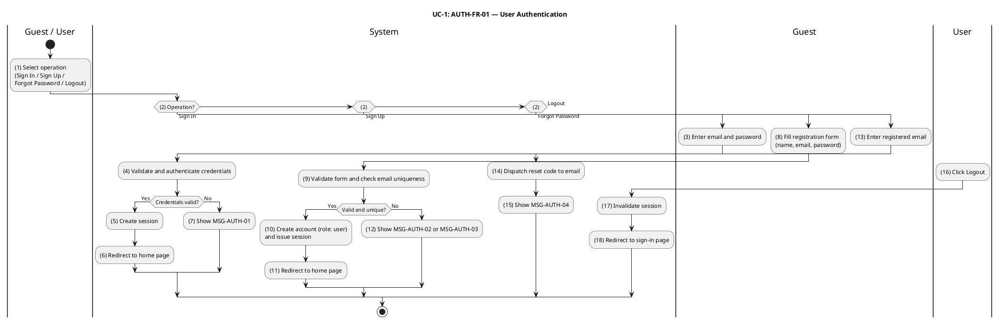

#### Business Rules

| Activity | BR Code | Description |
|---|---|---|
| _(3)–(4)_ | _BR-AUTH-1_ | **Validate Rules (Sign In):** ❖ `email` is required and must be a valid email format. ❖ `password` is required and non-empty. ❖ If any required field is missing or malformed, system rejects the request with HTTP 400 referencing `MSG-AUTH-03`. |
| _(7)_ | _BR-AUTH-2_ | **Sign In Failure Rules:** ❖ If email is not found, password is incorrect, or account is banned, system returns HTTP 401 referencing `MSG-AUTH-01`. ❖ The system makes no distinction between failure causes to prevent user enumeration attacks. |
| _(5)_ | _BR-AUTH-3_ | **Session Creation Rules:** ❖ A session record is created with `expiresAt = now + sessionTtl` (default 7 days). ❖ `ipAddress` and `userAgent` are stored for audit purposes. ❖ Session token is returned in the HTTP response and used as a Bearer token on all subsequent requests. |
| _(8)–(9)_ | _BR-AUTH-4_ | **Validate Rules (Sign Up):** ❖ `name` must be a non-empty string. ❖ `email` must be a valid email format. ❖ `password` must be at least 8 characters and contain at least one letter and one digit. ❖ Invalid input returns HTTP 400 referencing `MSG-AUTH-03`. |
| _(12)_ | _BR-AUTH-5_ | **Sign Up Duplicate Email Rules:** ❖ If the email is already registered, system returns HTTP 409 referencing `MSG-AUTH-02`. |
| _(10)_ | _BR-AUTH-6_ | **Account Initialization Rules:** ❖ New accounts are created with `role = 'user'`. ❖ Elevation to `'restaurant'`, `'shipper'`, or `'admin'` is handled in Phase 2/Phase 4 flows. ❖ Passwords are stored as secure hashes; plaintext is never persisted. |
| _(14)–(15)_ | _BR-AUTH-7_ | **Forgot Password Rules:** ❖ System creates a verification record with a single-use OTP valid for 60 minutes. ❖ System responds HTTP 200 referencing `MSG-AUTH-04` regardless of whether the email exists (anti-enumeration). ❖ The OTP is dispatched via the configured channel (email / SMS). |
| _(17)_ | _BR-AUTH-8_ | **Logout Rules:** ❖ The session record is deleted immediately. ❖ Any subsequent requests using the invalidated token receive HTTP 401 referencing `MSG-AUTH-05`. |
| _(all protected routes)_ | _BR-AUTH-9_ | **Session Validation Rules:** ❖ Every protected endpoint requires a valid non-expired Bearer token. ❖ Missing or expired token returns HTTP 401 referencing `MSG-AUTH-05`. ❖ The session's associated user is attached to the request context. |
| _(6)_, _(11)_, _(18)_ | _BR-AUTH-10_ | **Redirect Rules:** ❖ Successful Sign In and Sign Up redirect to the home page. ❖ Successful Logout redirects to the sign-in page. |

---

### UC-2: Discover Restaurants & Food

| Name            | Discover Restaurants & Food                                                           |
|-----------------|---------------------------------------------------------------------------------------|
| **Description** | This use case describes how users search for restaurants and menu items by keyword, category, cuisine type, and geographic location. |
| **Actor**       | Guest, Customer                                                                        |
| **Trigger**     | ❖ User navigates to the discovery or search page. ❖ User enters a search query or applies discovery filters. |
| **Pre-condition** | ❖ None. Both authenticated and unauthenticated users may search. |
| **Post-condition** | ❖ System returns a paginated list of matching restaurants and menu items. |

#### Activities Flow

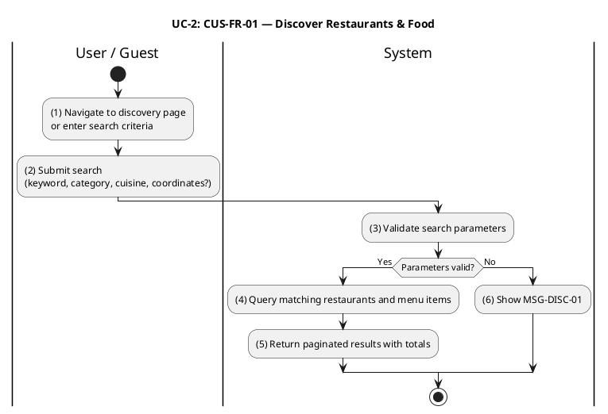

#### Business Rules

| Activity | BR Code | Description |
|---|---|---|
| _(3)_, _(6)_ | _BR-2.1_ | **Validate Rules:** ❖ `lat` and `lon` must be provided together. If only one is present, system returns HTTP 400 referencing `MSG-DISC-01`. ❖ `radiusKm` (if supplied) must be a positive number. |
| _(4)_ | _BR-2.2_ | **Pagination Rules:** ❖ `limit` is clamped to [1, 100]. `offset` is clamped to ≥ 0. ❖ Requests outside these bounds are accepted with clamped values (no error). |
| _(4)_ | _BR-2.3_ | **Restaurant Filter Rules:** ❖ Only restaurants with `isApproved = true` AND `isOpen = true` are included in results. ❖ If `lat`, `lon`, and `radiusKm` are provided, only restaurants within the specified radius are returned. |
| _(4)_ | _BR-2.4_ | **Item Filter Rules:** ❖ Only items with `status = 'available'` are included. ❖ The items array is populated only when at least one of `q`, `category`, or `tag` is provided; otherwise `items: []` is returned. |
| _(4)_ | _BR-2.5_ | **Relevance Scoring Rules:** ❖ Restaurants are scored: exact name match +12, partial name match +9, cuisine match +6, description partial match +2. ❖ Items are scored: exact name match +12, partial name match +8, tag match +5, category match +3. ❖ Ties are broken by stable UUID ordering. |
| _(5)_ | _BR-2.6_ | **Response Rules:** ❖ `total.restaurants` and `total.items` reflect the full match count before pagination is applied. ❖ If no results match the query, system returns HTTP 200 with empty arrays and zero totals — never HTTP 404. |

---

### UC-3: View Restaurant Details

| Name            | View Restaurant Details                                                               |
|-----------------|---------------------------------------------------------------------------------------|
| **Description** | This use case describes how users view a restaurant's profile and its full menu, including categories, items, and modifier groups. |
| **Actor**       | Guest, Customer                                                                        |
| **Trigger**     | ❖ User clicks a restaurant card from the discovery or search results page.             |
| **Pre-condition** | ❖ None. Available to authenticated and unauthenticated users. |
| **Post-condition** | ❖ System returns the restaurant's profile and complete menu structure. |

#### Activities Flow

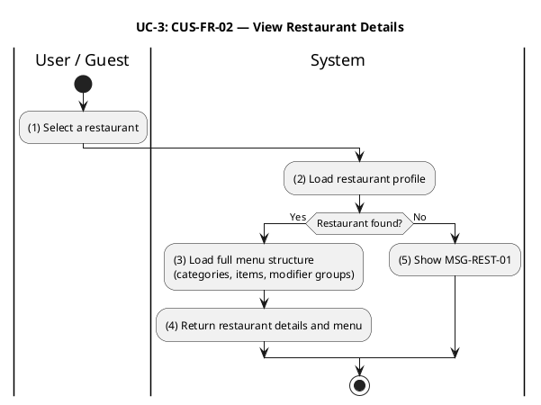

#### Business Rules

| Activity | BR Code | Description |
|---|---|---|
| _(2)_ | _BR-3.1_ | **Validate Rules:** ❖ Restaurant `:id` must be a valid UUID format. An invalid format returns HTTP 400. |
| _(2)_, _(5)_ | _BR-3.2_ | **Not Found Rules:** ❖ If no restaurant matches the given ID, system returns HTTP 404 referencing `MSG-REST-01`. ❖ No distinction is made between non-existent and unapproved restaurants to prevent information disclosure. |
| _(3)–(4)_ | _BR-3.3_ | **Menu Display Rules:** ❖ All menu items are returned regardless of availability status (`available`, `out_of_stock`, `unavailable`). ❖ The client is responsible for displaying availability badges. ❖ Availability is enforced server-side only at the point of adding to cart (UC-4, BR-4.2). |

---

### UC-4: Add Item to Cart

| Name            | Add Item to Cart                                                                        |
|-----------------|-----------------------------------------------------------------------------------------|
| **Description** | This use case describes how a customer adds a menu item with selected modifier options to their shopping cart. |
| **Actor**       | Customer (authenticated, role `'user'`)                                                  |
| **Trigger**     | ❖ Customer taps "Add to Cart" on a menu item in the restaurant detail page.              |
| **Pre-condition** | ❖ Customer is authenticated. ❖ The target restaurant's Ordering ACL snapshot is available. |
| **Post-condition** | ❖ The item is added or merged into the customer's cart. Cart TTL is reset to 7 days. |

#### Activities Flow

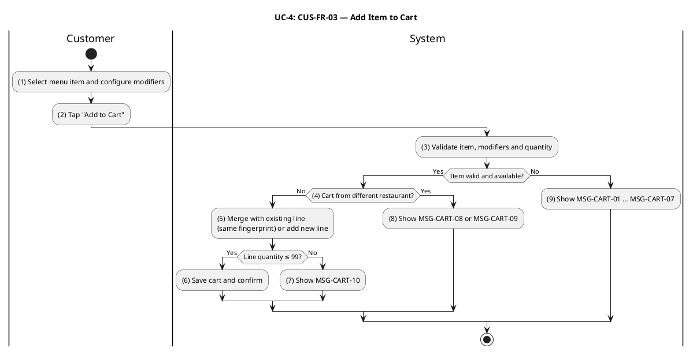

#### Business Rules

| Activity | BR Code | Description |
|---|---|---|
| _(3)_ | _BR-4.1_ | **Validate Rules:** ❖ `quantity` must be in [1, 99]. `unitPrice` must be > 0. `menuItemId` and `restaurantId` must be valid UUIDs. `itemName` must be non-empty. ❖ Invalid input returns HTTP 400 with a field-level error message. |
| _(3)_, _(9)_ | _BR-4.2_ | **Item Availability Rules:** ❖ The item must exist in the Ordering ACL snapshot. If no snapshot is found, system returns HTTP 400 referencing `MSG-CART-01`. ❖ Item `status` must be `'available'`. If not, system returns HTTP 409 referencing `MSG-CART-02`. |
| _(3)_, _(9)_ | _BR-4.3_ | **Modifier Validation Rules:** ❖ Each `(groupId, optionId)` pair must exist on the snapshot; the option must be available; per-group selection count must satisfy `minSelections ≤ count ≤ maxSelections`. ● Modifier group not found → HTTP 400 referencing `MSG-CART-03`. ● Modifier option not found → HTTP 400 referencing `MSG-CART-04`. ● Option unavailable → HTTP 400 referencing `MSG-CART-05`. ● Below minimum selections → HTTP 400 referencing `MSG-CART-06`. ● Exceeds maximum selections → HTTP 400 referencing `MSG-CART-07`. |
| _(4)_, _(8)_ | _BR-4.4_ | **Single-Restaurant Cart Rules:** ❖ A customer's cart may only contain items from one restaurant at a time. If the cart already contains items from a different restaurant, system returns HTTP 409 referencing `MSG-CART-08`. ❖ If the ACL snapshot's `restaurantId` mismatches the request `restaurantId`, system returns HTTP 409 referencing `MSG-CART-09`. |
| _(5)_, _(7)_ | _BR-4.5_ | **Merge and Quantity Rules:** ❖ Line item identity is defined by `(menuItemId, modifierFingerprint)`. Adding the same item with identical modifier selections increments the existing line's quantity rather than creating a duplicate. ❖ The per-line quantity ceiling is 99. If adding would exceed this, system returns HTTP 400 referencing `MSG-CART-10`. |
| _(5)–(6)_ | _BR-4.6_ | **Cart Persistence Rules:** ❖ Cart data is stored in Redis under the key `cart:<customerId>`. ❖ Every successful cart mutation resets the Redis TTL to 7 days. |

---

### UC-5: Manage Shopping Cart

| Name            | Manage Shopping Cart                                                                    |
|-----------------|-----------------------------------------------------------------------------------------|
| **Description** | This use case describes how a customer views, modifies, and clears their shopping cart prior to checkout. |
| **Actor**       | Customer (authenticated, role `'user'`)                                                  |
| **Trigger**     | ❖ Customer navigates to the cart screen. ❖ Customer taps an update, remove, or clear action. |
| **Pre-condition** | ❖ Customer is authenticated. |
| **Post-condition** | ❖ Cart reflects the requested change. If the cart becomes empty, it is deleted and subsequent reads return null. |

#### Activities Flow

#### Business Rules

| Activity | BR Code | Description |
|---|---|---|
| _(3)_ | _BR-5.1_ | **Cart Access Rules:** ❖ Cart is strictly scoped to the authenticated customer (`customerId = session.user.id`). ❖ If no cart exists for the customer, system returns HTTP 200 with `null`. |
| _(4)–(5)_, _(6)_ | _BR-5.2_ | **Update Quantity Rules:** ❖ `quantity` must be in [0, 99]. ❖ Setting `quantity = 0` is equivalent to removing the line item (same behavior as the Remove Item operation). ❖ If the `cartItemId` is not found in the customer's cart, system returns HTTP 404 referencing `MSG-CART-11`. |
| _(7)–(8)_, _(9)_ | _BR-5.3_ | **Update Modifiers Rules:** ❖ The modifier set is replaced wholesale. Modifier validation reuses the rules in BR-4.3 (`MSG-CART-03` … `MSG-CART-07`). ❖ If the new modifier selection produces a fingerprint that collides with an existing line, the two lines are merged subject to the 99-unit per-line ceiling. ❖ Overflow on merge returns HTTP 400 referencing `MSG-CART-10`. |
| _(10)_, _(11)_ | _BR-5.4_ | **Remove Item Rules:** ❖ If the `cartItemId` is not found in the customer's cart, system returns HTTP 404 referencing `MSG-CART-11`. |
| _(12)_ | _BR-5.5_ | **Clear Cart Rules:** ❖ Clear Cart is idempotent. Clearing an already-empty cart returns HTTP 204 without error. |
| _(5)_, _(10)_, _(12)–(13)_ | _BR-5.6_ | **Cart Empty State Rules:** ❖ When the last item is removed (by Update Qty to 0, Remove Item, or Clear Cart), the Redis key is deleted. ❖ Subsequent GET requests return `null`. Deletion operations return HTTP 204 No Content. |
| _(5)_, _(8)_, _(10)_, _(12)_ | _BR-5.7_ | **TTL Reset Rules:** ❖ Every successful cart mutation resets the Redis TTL to 7 days. ❖ Read-only GET (View Cart) does not reset the TTL. |

---

### UC-6: Save & Manage Delivery Addresses

| Name            | Save & Manage Delivery Addresses                                                        |
|-----------------|-----------------------------------------------------------------------------------------|
| **Description** | This use case describes how a customer provides a delivery address at checkout. The address is validated, captured into the order, and checked for delivery zone eligibility. |
| **Actor**       | Customer (authenticated, role `'user'`)                                                  |
| **Trigger**     | ❖ Customer proceeds to checkout and enters a delivery address. |
| **Pre-condition** | ❖ Customer is authenticated and has a non-empty cart. |
| **Post-condition** | ❖ Delivery address is captured and immutably stored with the placed order. |

#### Activities Flow

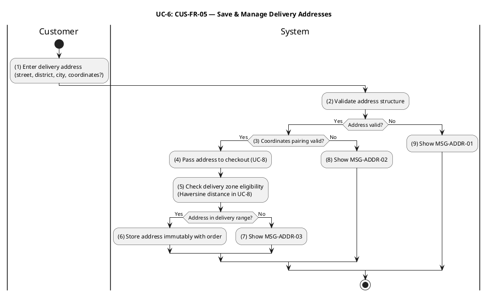

#### Business Rules

| Activity | BR Code | Description |
|---|---|---|
| _(2)–(3)_, _(8)_, _(9)_ | _BR-6.1_ | **Validate Rules:** ❖ `street`, `district`, and `city` are required non-empty strings. ❖ `latitude` and `longitude` are optional, but if either is provided both must be present. ❖ Coordinates must lie within Vietnam's geographic bounds. ❖ Invalid input returns HTTP 400 referencing `MSG-ADDR-01` (general validation) or `MSG-ADDR-02` (coordinate pairing). |
| _(4)–(5)_, _(7)_ | _BR-6.2_ | **Delivery Zone Eligibility Rules (via UC-8):** ❖ Delivery eligibility is evaluated at checkout (UC-8, BR-8.6) via Haversine distance between the address coordinates and the restaurant's delivery zone center. ❖ The innermost eligible zone is selected. If the address falls outside all active delivery zones, system returns HTTP 422 referencing `MSG-ADDR-03`. |
| _(6)_ | _BR-6.3_ | **Address Immutability Rules:** ❖ The delivery address is stored in the `orders.delivery_address` JSONB column at order placement. ❖ Once stored, it cannot be changed. Address correction requires order cancellation and re-placement. |
| _—_ | _BR-6.4_ | **Address Book (Deferred):** ❖ A persistent customer address book (`customer_addresses` table) is not implemented in Phase 1. Addresses are captured inline at checkout only. ❖ Future releases will support address save, list, update, and delete. |

---

### UC-7: Manage Delivery Zones

| Name            | Manage Delivery Zones                                                                   |
|-----------------|-----------------------------------------------------------------------------------------|
| **Description** | This use case describes how restaurant partners and administrators configure delivery zones (create, update, delete, list), and how customers request a delivery fee and ETA estimate. |
| **Actor**       | Restaurant Partner (role `'restaurant'`), Administrator (role `'admin'`), Customer (estimate only) |
| **Trigger**     | ❖ Restaurant Partner navigates to the delivery zone management screen. ❖ Customer requests a delivery estimate from the restaurant detail page. |
| **Pre-condition** | ❖ Zone management: actor is authenticated as Restaurant Partner or Admin. ❖ Estimate: restaurant has a configured location and at least one active delivery zone. |
| **Post-condition** | ❖ Zone management: zone is created, updated, or deleted; ACL snapshot is synchronized. ❖ Estimate: system returns the computed delivery fee and estimated time. |

#### Activities Flow

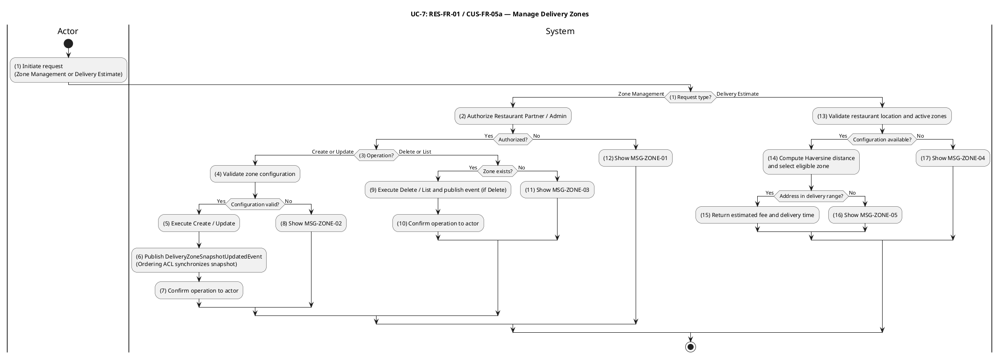

#### Business Rules

| Activity | BR Code | Description |
|---|---|---|
| _(2)_, _(12)_ | _BR-7.1_ | **Authorization Rules:** ❖ Restaurant Partners may manage zones only for restaurants they own. Administrators may manage zones for any restaurant. ❖ Unauthorized access returns HTTP 403 referencing `MSG-ZONE-01`. |
| _(4)_, _(8)_ | _BR-7.2_ | **Zone Validate Rules:** ❖ `name` must be non-empty. `radiusKm` must be ≥ 0.1. `baseFee` and `perKmRate` must be non-negative integers that are exact multiples of 1,000 VND. `avgSpeedKmh` must be in [1, 120]. `prepTimeMinutes` and `bufferMinutes` must be ≥ 0. ❖ Invalid input returns HTTP 400 referencing `MSG-ZONE-02`. |
| _(9)_, _(11)_ | _BR-7.3_ | **Zone Not Found Rules:** ❖ Update or Delete on a non-existent zone ID returns HTTP 404 referencing `MSG-ZONE-03`. |
| _(6)_, _(9)_ | _BR-7.4_ | **ACL Synchronization Rules:** ❖ Every successful Create, Update, or Delete publishes a `DeliveryZoneSnapshotUpdatedEvent`. ❖ The Ordering ACL projector handles this event by upserting or removing the corresponding snapshot row. ❖ UC-8 (Place Order) reads zone data exclusively from this ACL projection, never from the zones service directly. |
| _(13)_, _(17)_ | _BR-7.5_ | **Estimate Precondition Rules:** ❖ If the restaurant has no configured `latitude` / `longitude`, or has no active delivery zones, system returns HTTP 422 referencing `MSG-ZONE-04`. |
| _(14)_, _(16)_ | _BR-7.6_ | **Zone Selection Rules:** ❖ A zone is eligible when the Haversine distance from the restaurant to the customer's address is ≤ zone `radiusKm`. ❖ When multiple zones are eligible, the innermost zone (smallest `radiusKm`) is selected. ❖ If no zone is eligible, system returns HTTP 422 referencing `MSG-ZONE-05`. |
| _(15)_ | _BR-7.7_ | **Fee and ETA Calculation Rules:** ❖ `shippingFee = round((baseFee + distanceKm × perKmRate) / 1000) × 1000` (rounded to the nearest 1,000 VND). ❖ `estimatedDeliveryMinutes = ceil(prepTimeMinutes + (distanceKm / avgSpeedKmh) × 60 + bufferMinutes)`. |

---

### UC-8: Place Order

| Name            | Place Order                                                                             |
|-----------------|-----------------------------------------------------------------------------------------|
| **Description** | This use case describes the complete checkout flow in which a customer submits their cart to create an order. The system validates the cart contents, computes the final price, applies any promotion, persists the order, and initiates payment if the customer selected VNPay. |
| **Actor**       | Customer (authenticated, role `'user'`)                                                  |
| **Trigger**     | ❖ Customer taps "Place Order" on the checkout confirmation screen. |
| **Pre-condition** | ❖ Customer is authenticated. ❖ Cart is non-empty. ❖ Delivery address is provided. ❖ Payment method is selected. |
| **Post-condition** | ❖ Order is persisted with `status = 'pending'`. Cart is cleared. ❖ For VNPay, a payment URL is returned. |

#### Activities Flow

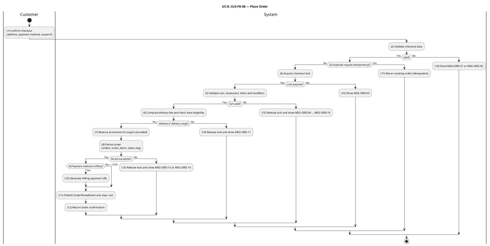

#### Business Rules

| Activity | BR Code | Description |
|---|---|---|
| _(2)_, _(18)_ | _BR-8.1_ | **Validate Rules:** ❖ `paymentMethod` must be one of `{'cod', 'vnpay'}`. ❖ `deliveryAddress` must satisfy address validation rules (BR-6.1). ❖ `note` must be ≤ 500 characters. ❖ `X-Idempotency-Key` (if present) must be a UUID string of 8–64 hexadecimal characters with optional hyphens. ❖ Invalid input returns HTTP 400 referencing `MSG-ORD-01` (general validation) or `MSG-ORD-02` (idempotency key format). |
| _(3)_, _(17)_ | _BR-8.2_ | **Idempotency Rules:** ❖ If an `X-Idempotency-Key` is present and a cached `orderId` already exists for that key, system returns the existing order response without re-processing. ❖ The idempotency record is written after successful order persistence so that partial failures do not cache a stale state. |
| _(4)_, _(16)_ | _BR-8.3_ | **Concurrency Lock Rules:** ❖ System acquires a Redis `SET NX` lock at `cart:<customerId>:lock` with a 30-second TTL before processing. ❖ If the lock is already held, system returns HTTP 409 referencing `MSG-ORD-03`. ❖ The lock is released in a `finally` block to guarantee release even on exception. |
| _(5)_, _(15)_ | _BR-8.4_ | **Cart Validate Rules:** ❖ Cart must be non-empty. If empty, system returns HTTP 400 referencing `MSG-ORD-04`. ❖ The restaurant's Ordering ACL snapshot must exist. If missing, system returns HTTP 422 referencing `MSG-ORD-05`. ❖ Restaurant must have `isApproved = true`. If not, HTTP 422 referencing `MSG-ORD-06`. ❖ Restaurant must have `isOpen = true`. If not, HTTP 422 referencing `MSG-ORD-07`. |
| _(5)_, _(15)_ | _BR-8.5_ | **Item and Modifier Validation Rules:** ❖ Each cart item's Ordering ACL snapshot must exist. Delisted item → HTTP 422 referencing `MSG-ORD-08`. ❖ Item's `restaurantId` in snapshot must match cart's restaurant. Mismatch → HTTP 422 referencing `MSG-ORD-09`. ❖ Item `status` must be `'available'`. If `'out_of_stock'` or `'unavailable'` → HTTP 422 referencing `MSG-ORD-10`. ❖ Modifier groups, options, availability flags, and min/max constraints are re-validated against the current ACL snapshot at checkout time. |
| _(6)_, _(14)_ | _BR-8.6_ | **Delivery Pricing Rules:** ❖ Haversine distance is computed against the restaurant's delivery zone snapshots. The innermost eligible zone is selected (per BR-7.6). ❖ If the delivery address falls outside all zones → HTTP 422 referencing `MSG-ORD-11`. ❖ `shippingFee` is computed per BR-7.7. ❖ If coordinates or zone snapshots are unavailable, `shippingFee = 0` and a warning is logged (graceful degradation). |
| _(7)_ | _BR-8.7_ | **Promotion Reservation Rules:** ❖ Promotion reservation is non-blocking. If reservation fails or returns `discountAmount = 0`, checkout continues without a discount. ❖ Promotion usage is confirmed after successful order persistence. Failures in confirmation are reconciled by a scheduled task (Phase 3). |
| _(8)_, _(13)_ | _BR-8.8_ | **Server-Authoritative Pricing Rules:** ❖ Order line `unitPrice` and modifier prices are taken from ACL snapshots at checkout time, not from the values stored at add-to-cart time. ❖ `itemsTotal` must be > 0. If ≤ 0 → HTTP 422 referencing `MSG-ORD-12`. ❖ `totalAmount = max(0, itemsTotal + shippingFee − discountAmount)`. |
| _(8)_, _(13)_ | _BR-8.9_ | **Atomic Persistence Rules:** ❖ The `orders`, `order_items`, and initial `order_status_logs` row are inserted in a single database transaction. ❖ A `UNIQUE` constraint on `orders.cartId` prevents two orders from the same cart. ❖ Duplicate constraint violation → HTTP 409 referencing `MSG-ORD-13`. ❖ Generic database failure → HTTP 500 referencing `MSG-ORD-14`. |
| _(8)_ | _BR-8.10_ | **Initial Order State Rules:** ❖ New order `status = 'pending'`. ❖ `expiresAt = now + RESTAURANT_ACCEPT_TIMEOUT_SECONDS` (default 600 s). Orders not acknowledged by the restaurant within this window are auto-cancelled (Phase 2). |
| _(9)–(10)_ | _BR-8.11_ | **Payment Initiation Rules:** ❖ For `paymentMethod = 'vnpay'`: a `payment_transactions` row is created with `status = 'pending'`, and a VNPay redirect URL is generated and included in the response. ❖ For `paymentMethod = 'cod'`: no payment transaction is created at checkout; payment is collected at delivery. ❖ VNPay URL generation failure is logged but non-blocking; payment timeout reconciliation is handled by UC-9 (BR-9.7). |
| _(11)–(12)_ | _BR-8.12_ | **Post-Persistence Rules:** ❖ `OrderPlacedEvent` is published exactly once after successful persistence. ❖ Cart deletion (`cart:<customerId>`) is best-effort; failure does not invalidate the order. ❖ Successful response: HTTP 201 referencing `MSG-ORD-15` with payload `{ orderId, status: 'pending', totalAmount, shippingFee, discountAmount, paymentUrl?, estimatedDeliveryMinutes? }`. |

---

### UC-9: Make Online Payment (VNPay)

| Name            | Make Online Payment (VNPay)                                                             |
|-----------------|-----------------------------------------------------------------------------------------|
| **Description** | This use case describes how a customer completes payment through VNPay, how the system processes the IPN (Instant Payment Notification) callback, and how payment timeout is handled. |
| **Actor**       | Customer, VNPay (external payment gateway), Automated System (timeout scheduler)        |
| **Trigger**     | ❖ Customer opens the VNPay payment URL received from UC-8. ❖ VNPay sends an IPN to the system after the customer completes or abandons payment. ❖ Scheduled task detects expired payment sessions. |
| **Pre-condition** | ❖ Order has `status = 'pending'` and `paymentMethod = 'vnpay'`. ❖ A `payment_transactions` row with `status = 'pending'` exists for the order. |
| **Post-condition** | ❖ Payment Success: `payment_transactions.status = 'completed'`; order transitions to `'paid'`. ❖ Payment Failure or Timeout: `payment_transactions.status = 'failed'`; order transitions to `'cancelled'`. |

#### Activities Flow

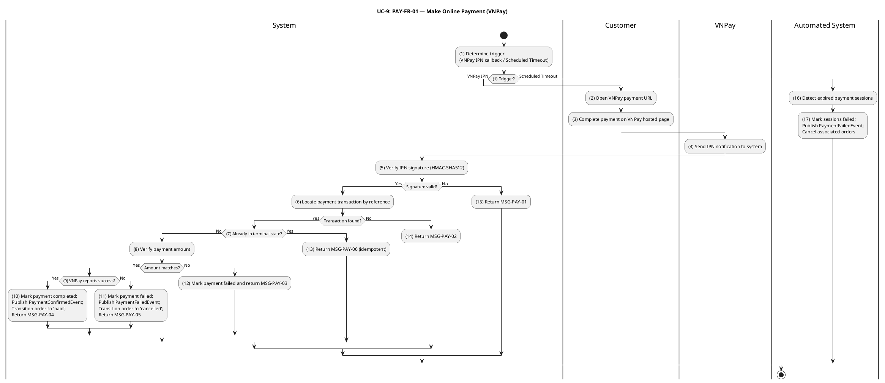

#### Business Rules

| Activity | BR Code | Description |
|---|---|---|
| _(5)_, _(15)_ | _BR-9.1_ | **Signature Verification Rules:** ❖ The IPN signature is verified using HMAC-SHA512 over the sorted VNPay query parameters with the merchant secret key, using a constant-time comparison to prevent timing attacks. ❖ Signature verification is the mandatory first step before any database access. ❖ Invalid signature → system returns `MSG-PAY-01` (RspCode 97). |
| _(6)_, _(14)_ | _BR-9.2_ | **Transaction Lookup Rules:** ❖ `vnp_TxnRef` is used to resolve the `payment_transactions` record. ❖ If not found → system returns `MSG-PAY-02` (RspCode 01). |
| _(7)_, _(13)_ | _BR-9.3_ | **Idempotency Rules:** ❖ If the transaction is already in a terminal state (`'completed'`, `'failed'`, `'refund_pending'`, `'refunded'`), system acknowledges with `MSG-PAY-06` (RspCode 00) without making any further state change. |
| _(8)_, _(12)_ | _BR-9.4_ | **Amount Integrity Rules:** ❖ `vnp_Amount` divided by 100 must exactly match `payment_transactions.amount`. ❖ Any mismatch marks the transaction `'failed'` and returns `MSG-PAY-03` (RspCode 04). |
| _(10)_ | _BR-9.5_ | **Payment Success Rules:** ❖ On success: `payment_transactions.status = 'completed'`, and `paidAt`, `providerTxnId`, `rawIpnPayload` are recorded. ❖ `PaymentConfirmedEvent` is published. ❖ Order lifecycle listener transitions the order from `'pending'` to `'paid'`. ❖ System returns `MSG-PAY-04` (RspCode 00) to stop VNPay retry attempts. ❖ Concurrent IPN deliveries are resolved by optimistic locking on the `version` field. A concurrency conflict returns `MSG-PAY-07` (RspCode 99), prompting VNPay to retry. |
| _(11)_ | _BR-9.6_ | **Payment Failure Rules:** ❖ On VNPay failure response: `payment_transactions.status = 'failed'`, `vnpResponseCode`, and `rawIpnPayload` are recorded. ❖ `PaymentFailedEvent` is published. ❖ Order lifecycle listener transitions the order from `'pending'` to `'cancelled'`. ❖ System returns `MSG-PAY-05` (RspCode 00) to stop VNPay retry attempts. |
| _(16)–(17)_ | _BR-9.7_ | **Payment Timeout Rules:** ❖ `payment_transactions.expiresAt = now + PAYMENT_SESSION_TIMEOUT_SECONDS`. ❖ A scheduled `PaymentTimeoutTask` queries transactions with `status ∈ {'pending', 'awaiting_ipn'}` AND `expiresAt < now`. For each matching record, the task marks the transaction `'failed'`, publishes `PaymentFailedEvent`, and triggers order cancellation. |
| _—_ | _BR-9.8_ | **Return URL Rules:** ❖ The browser return URL (`/payments/vnpay/return`) is read-only. It verifies the signature and reads transaction status for UI feedback only. ❖ The return URL must never mutate database state. Authoritative payment outcome is determined exclusively by the IPN endpoint. |

---

### UC-10: View Order History

| Name            | View Order History                                                                      |
|-----------------|-----------------------------------------------------------------------------------------|
| **Description** | This use case describes how a customer views their past orders, retrieves a detailed view of a specific order (including the status audit log), and initiates a reorder. |
| **Actor**       | Customer (authenticated, role `'user'`)                                                  |
| **Trigger**     | ❖ Customer navigates to the "Orders" or "Order History" screen. ❖ Customer selects a past order for detail. ❖ Customer taps "Reorder" on a past order. |
| **Pre-condition** | ❖ Customer is authenticated. |
| **Post-condition** | ❖ List: system returns a paginated list of the customer's orders. ❖ Detail: system returns the full order with item list and status audit log. ❖ Reorder: system returns a cart-shaped payload ready for the customer to submit via UC-4. |

#### Activities Flow

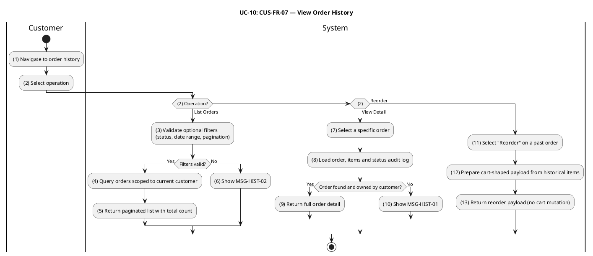

#### Business Rules

| Activity | BR Code | Description |
|---|---|---|
| _(3)_, _(6)_ | _BR-10.1_ | **Filter Validate Rules:** ❖ `status` (if supplied) must match a canonical order status enum value (`'pending'`, `'paid'`, `'confirmed'`, `'preparing'`, `'ready_for_pickup'`, `'picked_up'`, `'delivering'`, `'delivered'`, `'cancelled'`, `'refunded'`). ❖ When both `minDate` and `maxDate` are supplied, `minDate ≤ maxDate` must hold. ❖ `limit` must be in [1, 100]; `offset` must be ≥ 0. ❖ Invalid filter values return HTTP 400 referencing `MSG-HIST-02`. |
| _(4)–(5)_ | _BR-10.2_ | **Ownership Scoping Rules:** ❖ The query is hard-scoped by `customerId = session.user.id`. No `customerId` query parameter is accepted from the client. ❖ Results are ordered by `createdAt DESC`. ❖ `total` reflects the full match count before pagination. |
| _(4)_ | _BR-10.3_ | **List Summary Aggregation Rules:** ❖ Each order row in the list response includes `itemCount` (sum of `order_items.quantity` for that order) and `firstItemName` (the name of the line item with the lowest insertion order). |
| _(8)_, _(10)_ | _BR-10.4_ | **Order Access Rules:** ❖ System loads the order by ID. If the order does not exist, or it exists but belongs to a different customer, system returns HTTP 404 referencing `MSG-HIST-01`. ❖ A uniform 404 is returned in both cases to prevent ownership disclosure. |
| _(8)–(9)_ | _BR-10.5_ | **Detail Completeness Rules:** ❖ The detail response includes the complete `order_status_logs` array in chronological order. ❖ Each log entry includes: `fromStatus`, `toStatus`, `triggeredByRole`, optional `note`, and `createdAt`. |
| _(12)–(13)_ | _BR-10.6_ | **Reorder Rules:** ❖ No server-side cart mutation occurs during reorder. System returns a cart-shaped payload derived from the historical `order_items` data. ❖ The client uses this payload to call UC-4 (Add Item to Cart). ❖ Historical prices and item names in the reorder payload may not reflect the current catalog. UC-4 re-validates all items, modifiers, and prices against the current ACL snapshot at the point of submission. |

---

### Phase 2 — Restaurant & Delivery Operations

Phase 2 covers the operational use cases of the two supply-side actors that complete the platform: the **Restaurant Partner** (who owns the catalog and prepares orders) and the **Delivery Personnel** (also referred to as **Shipper**, who fulfils last-mile delivery). All Phase 2 use cases share the underlying `order_status` state machine introduced in Phase 1, the Restaurant–Ordering ACL snapshot mechanism (D3-B), and the same authentication and authorization stack used in Phase 1.

---

### UC-11: Restaurant Registration & Profile Management

| Field | Detail |
|---|---|
| **Use Case ID — Name** | RES-FR-01 — Restaurant Registration & Profile Management |
| **Actor** | Restaurant Partner, Administrator |
| **Trigger** | ❖ Restaurant Partner submits **Register Restaurant** form after signing in with role `restaurant`. ❖ Restaurant Partner edits restaurant profile (`PATCH /restaurants/:id`). ❖ Administrator approves or unapproves a restaurant (`PATCH /restaurants/:id/{approve,unapprove}`). |
| **Description** | Registers a new restaurant entity owned by the authenticated partner, lets the owner maintain its profile (name, description, address, phone, geo-coordinates, cuisine type, logo and cover images), and lets an administrator decide whether the restaurant is publicly visible. Newly registered restaurants are created with `isApproved = false` and `isOpen = false` and remain invisible to customer discovery (UC-2) until both flags are set to `true`. Every mutation publishes a `RestaurantUpdatedEvent` that synchronises the Ordering ACL snapshot. |
| **Pre-condition** | ❖ Actor is authenticated. ❖ For self-service registration and profile update: actor has role `restaurant` (or `admin`). ❖ For approve / unapprove: actor has role `admin`. |
| **Post-condition** | ❖ Registration: a new `restaurants` row exists with `ownerId = session.user.id`, `isApproved = false`, `isOpen = false`; `RestaurantUpdatedEvent` is published. ❖ Profile update: the row reflects the new field values; `RestaurantUpdatedEvent` is published. ❖ Approve / unapprove: `isApproved` is set accordingly; `RestaurantUpdatedEvent` is published; customer discovery results (UC-2) reflect the new visibility on the next query. |

#### Activities Flow

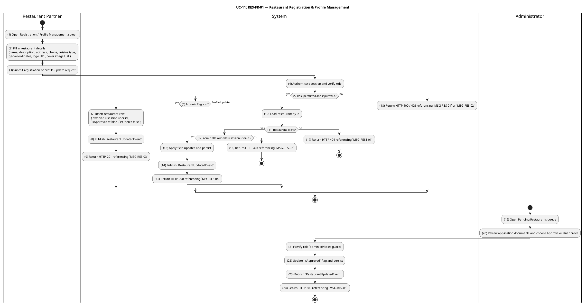

#### Business Rules

| Activity | BR Code | Description |
|---|---|---|
| _(3)–(5)_ | _BR-11.1_ | **Validate Rules (Registration / Profile Update):** ❖ `name`, `address` and `phone` are required and non-empty. ❖ `phone` must match the Vietnamese mobile or landline format accepted by the platform validator. ❖ If `latitude` and `longitude` are supplied, both must be present together and must lie inside Vietnam (latitude in [8.0, 24.0], longitude in [102.0, 110.0]). ❖ `logoUrl` and `coverImageUrl` (when supplied) must reference an existing image record produced by the Image module. ❖ Invalid input returns HTTP 400 referencing `MSG-RES-01`. |
| _(4)–(5)_, _(21)_ | _BR-11.2_ | **Authorization Rules:** ❖ `POST /restaurants` and `PATCH /restaurants/:id` require role `restaurant` or `admin`; otherwise HTTP 403 referencing `MSG-RES-02`. ❖ `PATCH /restaurants/:id/approve` and `PATCH /restaurants/:id/unapprove` require role `admin`; otherwise HTTP 403 referencing `MSG-RES-02`. |
| _(7)_ | _BR-11.3_ | **Default Visibility Rules (BR-1, Partner Verification):** ❖ A newly created restaurant always has `isApproved = false` and `isOpen = false`, regardless of any client-supplied value for those fields. ❖ The restaurant is excluded from public discovery (UC-2) until an administrator approves it and the partner opens it (UC-13). ❖ The HTTP 201 response references `MSG-RES-03` to inform the partner that the submission is pending administrator review. |
| _(10)–(16)_ | _BR-11.4_ | **Ownership Rules:** ❖ For role `restaurant`, the update is allowed only when the persisted `restaurants.ownerId` equals `session.user.id`; otherwise HTTP 403 referencing `MSG-RES-02`. ❖ For role `admin`, the ownership check is bypassed and any restaurant can be edited. ❖ A non-existent `:id` returns HTTP 404 referencing `MSG-REST-01`. ❖ A successful profile update returns HTTP 200 referencing `MSG-RES-04`. |
| _(8)_, _(14)_, _(23)_ | _BR-11.5_ | **Event Synchronisation Rules:** ❖ Every successful create, update, approve, and unapprove publishes `RestaurantUpdatedEvent` containing the latest persisted state. ❖ The event is consumed by the Ordering ACL projector to refresh the restaurant snapshot used by UC-8 (Place Order) and by ownership checks in UC-14 / UC-15. |
| _(22)–(24)_ | _BR-11.6_ | **Visibility Activation Rules:** ❖ `isApproved` is set atomically by the admin approval/unapproval endpoint; the HTTP 200 response references `MSG-RES-05`. ❖ A restaurant appears in public discovery (UC-2) only when `isApproved = true` AND `isOpen = true`. ❖ Unapproving an already-public restaurant immediately removes it from discovery; in-flight orders are not affected. |

---

### UC-12: Manage Menu Catalog

| Field | Detail |
|---|---|
| **Use Case ID — Name** | RES-FR-02, RES-FR-03 — Manage Menu Catalog (categories, items, modifier groups, modifier options) |
| **Actor** | Restaurant Partner, Administrator |
| **Trigger** | ❖ Restaurant Partner creates / updates / deletes a menu category, menu item, modifier group, or modifier option via the partner console (`POST`, `PATCH`, `DELETE` on `/menu-items`, `/menu-items/categories`, `/menu-items/:id/modifier-groups`, and `/.../options`). |
| **Description** | Provides authenticated catalog maintenance for a single restaurant. The use case covers per-restaurant **menu categories**, **menu items** (with price stored as integer VND, optional SKU, optional category, tag array, image URL, and an availability `status` ∈ {`available`, `unavailable`, `out_of_stock`}), and the two-level **modifier model** (modifier groups with `minSelections`/`maxSelections` constraints and modifier options with their own price and availability flag). Every mutation re-publishes a `MenuItemUpdatedEvent` with the full modifier snapshot so the Ordering ACL stays consistent with what customers see during checkout (UC-8). |
| **Pre-condition** | ❖ Actor is authenticated. ❖ Actor has role `restaurant` or `admin`. ❖ For a `restaurant` actor: the menu item / category / modifier resource ultimately belongs to a restaurant whose `ownerId = session.user.id`. |
| **Post-condition** | ❖ The catalog row is created, updated or removed in the corresponding table (`menu_categories`, `menu_items`, `modifier_groups`, `modifier_options`). ❖ `MenuItemUpdatedEvent` is published with the latest persisted state and full modifier snapshot for every affected menu item. ❖ The Ordering ACL projector refreshes its local snapshot, so subsequent calls to UC-4 / UC-8 use the new catalog values. |

#### Activities Flow

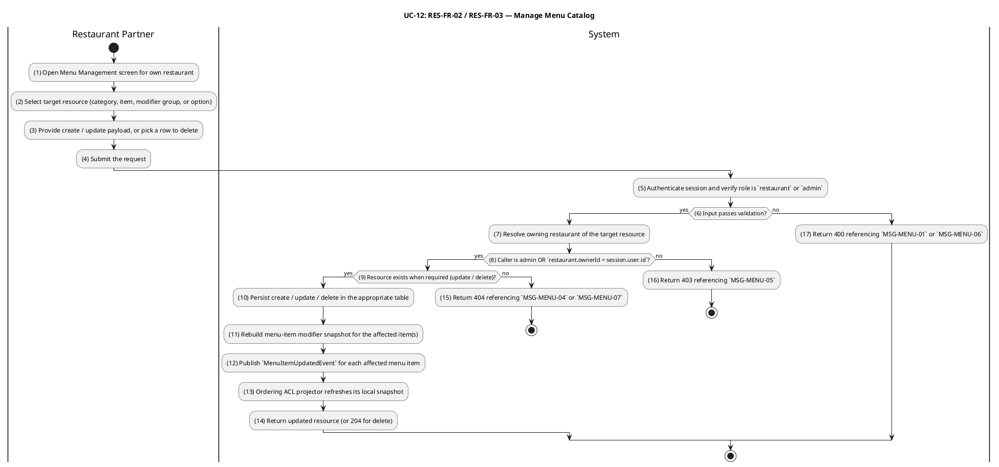

#### Business Rules

| Activity | BR Code | Description |
|---|---|---|
| _(4)–(6)_ | _BR-12.1_ | **Validate Rules (Menu Item):** ❖ `name` is required and non-empty. ❖ `price` is required and must be a non-negative integer (VND, no fractional units). ❖ `restaurantId` is required and must reference an existing restaurant. ❖ `categoryId` (if supplied) must reference a category that belongs to the same `restaurantId`. ❖ `tags` (if supplied) must be an array of non-empty strings. ❖ Invalid input returns HTTP 400 referencing `MSG-MENU-01`. |
| _(4)–(6)_ | _BR-12.2_ | **Validate Rules (Menu Category):** ❖ `name` is required and non-empty. ❖ `displayOrder` (if supplied) must be a non-negative integer. ❖ The pair `(restaurantId, name)` must be unique; a duplicate returns HTTP 409 referencing `MSG-MENU-03`. ❖ Invalid input returns HTTP 400 referencing `MSG-MENU-01`. |
| _(4)–(6)_ | _BR-12.3_ | **Validate Rules (Modifier Group & Option):** ❖ `minSelections` ≥ 0 and `maxSelections` ≥ `minSelections`; otherwise HTTP 400 referencing `MSG-MENU-06`. ❖ Modifier option `price` is a non-negative integer (VND); `0` denotes a free option. ❖ A modifier option must belong to a modifier group that belongs to the same menu item indicated in the URL; otherwise HTTP 404 referencing `MSG-MENU-07`. |
| _(7)–(8)_ | _BR-12.4_ | **Ownership Rules:** ❖ For role `restaurant`, mutations are allowed only when the owning restaurant's `ownerId = session.user.id`; otherwise HTTP 403 referencing `MSG-MENU-05`. ❖ For role `admin`, ownership is bypassed and any restaurant's catalog can be edited. ❖ Ownership is resolved transitively for modifier groups and options: `option → group → menuItem → restaurant`. |
| _(9)_, _(15)_ | _BR-12.5_ | **Resource Existence Rules:** ❖ Update / delete on a non-existent menu item returns HTTP 404 referencing `MSG-MENU-04`. ❖ Update / delete on a non-existent menu category returns HTTP 404 referencing `MSG-MENU-02`. ❖ Update / delete on a non-existent modifier group or option returns HTTP 404 referencing `MSG-MENU-07`. ❖ Deleting a menu category cascades by clearing `categoryId` on all items in that category; the items remain published and no `MenuItemUpdatedEvent` is emitted for the re-categorised items. ❖ Deleting a menu item cascades to its modifier groups and options and publishes `MenuItemUpdatedEvent` with `status = 'unavailable'` to invalidate the ACL snapshot. |
| _(10)–(13)_ | _BR-12.6_ | **Event Synchronisation Rules:** ❖ Every successful menu-item, modifier-group, and modifier-option mutation publishes `MenuItemUpdatedEvent` for the affected item, carrying `id`, `restaurantId`, `name`, `price`, and `status`. ❖ The `modifiers` payload differs by operation: modifier-group and modifier-option mutations re-fetch the complete current modifier snapshot and publish it as a populated array; menu-item field-only updates (price, name, tags, category) publish `modifiers = null`, signalling the ACL projector to preserve the existing modifier snapshot unchanged. ❖ Deleting a menu item publishes `MenuItemUpdatedEvent` with `status = 'unavailable'` and `modifiers = []` (empty array) to invalidate the ACL snapshot entry. ❖ Menu-category create, update, and delete operations do NOT publish `MenuItemUpdatedEvent`; affected items retain their existing ACL snapshots. |

---

### UC-13: Toggle Item & Restaurant Availability

| Field | Detail |
|---|---|
| **Use Case ID — Name** | RES-FR-04 — Toggle Item & Restaurant Availability |
| **Actor** | Restaurant Partner, Administrator |
| **Trigger** | ❖ Restaurant Partner toggles a menu item's sold-out flag (`PATCH /menu-items/:id/toggle-sold-out`). ❖ Restaurant Partner opens or closes the restaurant (sets `isOpen` via `PATCH /restaurants/:id`). |
| **Description** | Lets the partner control catalog availability in real time without rewriting the menu. A single menu item can be flipped between `available` and `out_of_stock`; an item explicitly marked `unavailable` is treated as taken down and cannot be sold-out-toggled. The restaurant as a whole can be opened or closed by toggling `isOpen`. Both operations propagate immediately to the customer surfaces via `RestaurantUpdatedEvent` / `MenuItemUpdatedEvent` (BR-8 *Real-time Availability Control*). |
| **Pre-condition** | ❖ Actor is authenticated. ❖ Actor has role `restaurant` or `admin`. ❖ For a `restaurant` actor: the target restaurant (or the restaurant that owns the target item) has `ownerId = session.user.id`. ❖ For sold-out toggle: the item's current `status` is not `unavailable`. |
| **Post-condition** | ❖ Menu item: `status` flips between `available` and `out_of_stock`; `MenuItemUpdatedEvent` is published. ❖ Restaurant: `isOpen` is set to the new value; `RestaurantUpdatedEvent` is published. ❖ Customer surfaces (UC-2 discovery, UC-4 add to cart, UC-8 place order) reflect the change on their next call. |

#### Activities Flow

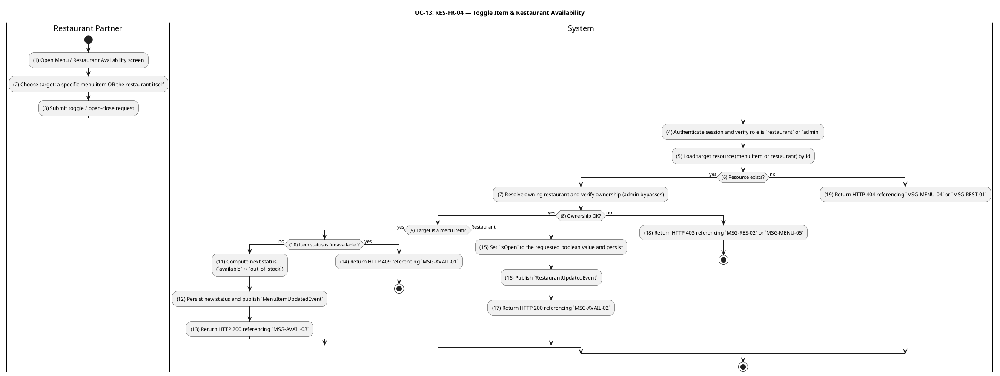

#### Business Rules

| Activity | BR Code | Description |
|---|---|---|
| _(4)_, _(7)–(8)_ | _BR-13.1_ | **Authorization & Ownership Rules:** ❖ Endpoints require role `restaurant` or `admin`. ❖ For role `restaurant`, the operation is allowed only when `restaurants.ownerId = session.user.id` (resolved transitively for menu-item operations via `menuItem → restaurant`); otherwise HTTP 403 referencing `MSG-RES-02` (restaurant scope) or `MSG-MENU-05` (item scope). |
| _(10)–(13)_ | _BR-13.2_ | **Item Sold-Out Toggle Rules:** ❖ The toggle alternates between `available` and `out_of_stock` only. ❖ If the item's current `status` is `unavailable`, the request is rejected with HTTP 409 referencing `MSG-AVAIL-01`; the item must be re-published via UC-12 before the sold-out toggle can be applied. ❖ A successful toggle returns HTTP 200 with the updated item, referencing `MSG-AVAIL-03`. |
| _(13)–(15)_ | _BR-13.3_ | **Restaurant Open/Close Rules:** ❖ `isOpen` is the single field that controls "currently accepting orders" for an approved restaurant. ❖ Setting `isOpen = false` does not affect already-placed orders (UC-14 / UC-15 continue to process them). ❖ Setting `isOpen = false` while `isApproved = true` keeps the restaurant in the public catalog but flags it as not currently serving on customer surfaces. |
| _(12)_, _(16)_ | _BR-13.4_ | **Real-Time Propagation Rules (BR-8):** ❖ Every successful operation synchronously publishes the corresponding domain event (`MenuItemUpdatedEvent` for items, `RestaurantUpdatedEvent` for restaurants). ❖ The Ordering ACL projector refreshes its local snapshot in response, so subsequent UC-4 / UC-8 calls reject items that are no longer `available` and restaurants that are closed. |
| _(5)–(6)_, _(19)_ | _BR-13.5_ | **Resource Existence Rules:** ❖ A sold-out toggle on a non-existent menu item returns HTTP 404 referencing `MSG-MENU-04`. ❖ An open/close request referencing a non-existent restaurant returns HTTP 404 referencing `MSG-REST-01`. |

---

### UC-14: Accept or Reject Order

| Field | Detail |
|---|---|
| **Use Case ID — Name** | RES-FR-05 — Accept or Reject Order |
| **Actor** | Restaurant Partner, Administrator |
| **Trigger** | ❖ Restaurant Partner accepts a new order (`PATCH /orders/:id/confirm`) — transitions `pending → confirmed` (T-01, COD) or `paid → confirmed` (T-04, VNPay paid). ❖ Restaurant Partner rejects a new order (`PATCH /orders/:id/cancel` with a reason note) — transitions `pending → cancelled` (T-03), `paid → cancelled` (T-05), or `confirmed → cancelled` (T-07). |
| **Description** | Authorises the restaurant to decide whether an incoming order proceeds. Acceptance moves the order into `confirmed`, after which UC-15 (Prepare Order for Pickup) becomes the only forward path. Rejection requires a reason note for the audit log, and — for VNPay-paid orders cancelled from `paid` or `confirmed` — automatically triggers the refund pipeline by publishing `OrderCancelledAfterPaymentEvent`. All transitions are routed through the central CQRS `TransitionOrderCommand`, which enforces role, ownership, state validity, and optimistic locking (`version` column). |
| **Pre-condition** | ❖ Actor is authenticated. ❖ Actor has role `restaurant` (limited to own restaurant's orders) or `admin` (any order). ❖ The order is in a state that allows the requested transition: `pending` (for T-01 / T-03), `paid` (for T-04 / T-05), or `confirmed` (for T-07). ❖ For T-01 by role `restaurant`: `order.paymentMethod = 'cod'`. ❖ For cancel transitions: a non-empty `reason` note is supplied. |
| **Post-condition** | ❖ `orders.status` is updated; `orders.version` is incremented atomically. ❖ A new `order_status_logs` row records `fromStatus`, `toStatus`, `triggeredBy`, `triggeredByRole`, and `note` (if any). ❖ `OrderStatusChangedEvent` is published after commit. ❖ For T-05 / T-07 on a VNPay order: `OrderCancelledAfterPaymentEvent` is published, which drives the refund pipeline (Phase 3 scope). |

#### Activities Flow

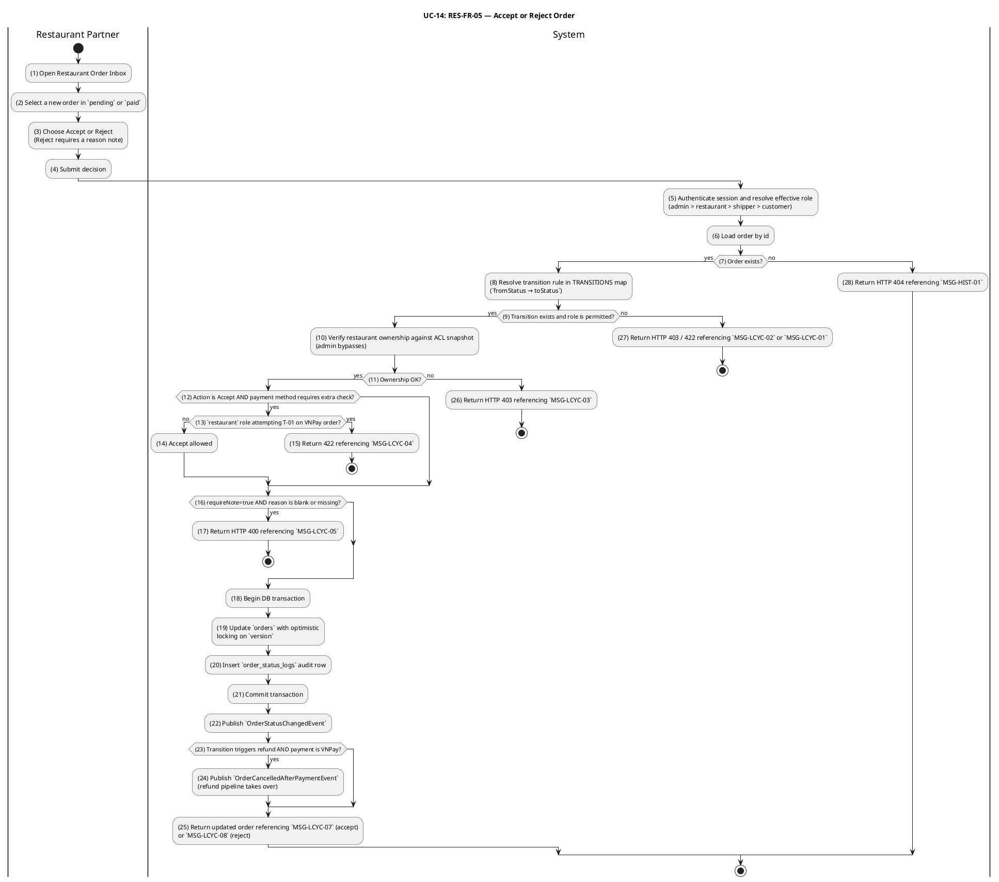

#### Business Rules

| Activity | BR Code | Description |
|---|---|---|
| _(5)–(6)_, _(28)_ | _BR-14.1_ | **Order Loading Rules:** ❖ The order is loaded by id. A non-existent id returns HTTP 404 referencing `MSG-HIST-01`. ❖ Idempotency: if the order is already in the requested target status, the system returns the order unchanged (no new audit row, no event). |
| _(8)–(9)_ | _BR-14.2_ | **Transition Validity Rules:** ❖ Allowed transitions for this UC (restaurant / admin actors): T-01 (`pending → confirmed`), T-03 (`pending → cancelled`), T-04 (`paid → confirmed`), T-05 (`paid → cancelled`), T-07 (`confirmed → cancelled`). ❖ T-03 and T-05 additionally allow roles `customer` and `system` per the TRANSITIONS map; `customer`-initiated cancellation is specified in Phase 3 (Customer Cancel Order). `system`-initiated cancellation is triggered by the order-timeout scheduler and does not route through this use-case endpoint. ❖ Any other `(fromStatus, toStatus)` pair returns HTTP 422 referencing `MSG-LCYC-01`. ❖ Each transition has an `allowedRoles` set; a role outside the set returns HTTP 403 referencing `MSG-LCYC-02`. |
| _(10)–(11)_ | _BR-14.3_ | **Restaurant Ownership Rules:** ❖ For role `restaurant`, the target order's `restaurantId` must belong to a restaurant whose `ownerId = session.user.id`, resolved via the Ordering ACL snapshot; otherwise HTTP 403 referencing `MSG-LCYC-03`. ❖ For role `admin`, the ownership check is bypassed. |
| _(12)–(15)_ | _BR-14.4_ | **Payment-Method Pre-condition Rules (T-01):** ❖ Role `restaurant` may execute T-01 (`pending → confirmed`) only when `order.paymentMethod = 'cod'`. ❖ A `restaurant`-initiated T-01 on a VNPay order returns HTTP 422 referencing `MSG-LCYC-04`. VNPay orders must first reach `paid` via the payment context (system actor, T-02), after which T-04 (`paid → confirmed`) becomes available. |
| _(16)–(17)_ | _BR-14.5_ | **Reject Reason Rules:** ❖ T-03, T-05 and T-07 carry `requireNote = true`. A missing or whitespace-only `reason` returns HTTP 400 referencing `MSG-LCYC-05`. |
| _(18)–(21)_ | _BR-14.6_ | **Atomicity & Concurrency Rules:** ❖ Status update and audit log insert occur in a single DB transaction. ❖ The status update uses optimistic locking (`WHERE id = :id AND version = :loaded_version`); a zero-row result returns HTTP 409 referencing `MSG-LCYC-06`. ❖ The `order_status_logs` row records `triggeredBy`, `triggeredByRole`, and `note`. |
| _(22)–(24)_ | _BR-14.7_ | **Event Publication Rules:** ❖ `OrderStatusChangedEvent` is published after commit on every successful transition. ❖ Transitions flagged `triggersRefundIfVnpay` (T-05, T-07) on orders with `paymentMethod = 'vnpay'` additionally publish `OrderCancelledAfterPaymentEvent`. If both pre-conditions are met but the acting role is `shipper`, the refund event is suppressed and the incident is logged at ERROR (defensive guard). ❖ Event-publication failure after a successful commit is logged but never rolls the transition back. |

---

### UC-15: Prepare Order for Pickup

| Field | Detail |
|---|---|
| **Use Case ID — Name** | RES-FR-06 — Prepare Order for Pickup |
| **Actor** | Restaurant Partner, Administrator |
| **Trigger** | ❖ Restaurant Partner starts preparing a confirmed order (`PATCH /orders/:id/start-preparing`) — transitions `confirmed → preparing` (T-06). ❖ Restaurant Partner marks a prepared order as ready for the shipper to pick up (`PATCH /orders/:id/ready`) — transitions `preparing → ready_for_pickup` (T-08). |
| **Description** | Models the kitchen-side fulfilment of a confirmed order as a single unified business workflow with two atomic state transitions: T-06 (`confirmed → preparing`) and T-08 (`preparing → ready_for_pickup`). The `ready_for_pickup` transition additionally publishes `OrderReadyForPickupEvent` — enriched with the restaurant snapshot and the customer's delivery address — which is consumed by the Delivery Context to surface the order to nearby online shippers (UC-18) and by the Notification Context to notify the assigned or candidate shippers. |
| **Pre-condition** | ❖ Actor is authenticated. ❖ Actor has role `restaurant` (limited to own restaurant's orders) or `admin`. ❖ T-06 requires `order.status = 'confirmed'`; T-08 requires `order.status = 'preparing'`. ❖ The restaurant has an ACL snapshot in the Ordering BC (used to populate `OrderReadyForPickupEvent`). |
| **Post-condition** | ❖ `orders.status` advances to `preparing` and subsequently to `ready_for_pickup`; `orders.version` is incremented on each transition. ❖ A `order_status_logs` row is appended for each transition. ❖ `OrderStatusChangedEvent` is published after each transition. ❖ The `preparing → ready_for_pickup` transition additionally publishes `OrderReadyForPickupEvent` with `orderId`, `restaurantId`, `restaurantName`, `restaurantAddress`, `customerId` and `deliveryAddress`. |

#### Activities Flow

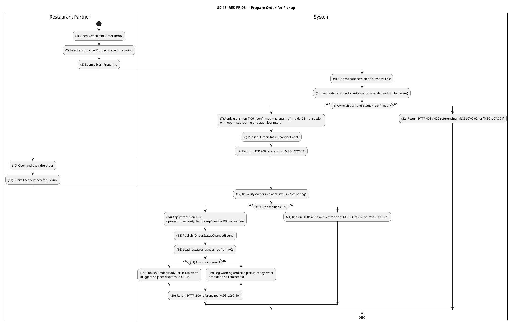

#### Business Rules

| Activity | BR Code | Description |
|---|---|---|
| _(4)–(5)_, _(12)_ | _BR-15.1_ | **Authorization & Ownership Rules:** ❖ T-06 and T-08 are restricted to roles `restaurant` and `admin`; other roles return HTTP 403 referencing `MSG-LCYC-02`. ❖ For role `restaurant`, the target order's `restaurantId` must belong to a restaurant whose `ownerId = session.user.id` (resolved through the ACL snapshot); otherwise HTTP 403 referencing `MSG-LCYC-03`. ❖ For role `admin`, ownership is bypassed. |
| _(6)_, _(13)_ | _BR-15.2_ | **Sequential Transition Rules:** ❖ T-06 requires `order.status = 'confirmed'`; any other source state returns HTTP 422 referencing `MSG-LCYC-01`. ❖ T-08 requires `order.status = 'preparing'`; any other source state returns HTTP 422 referencing `MSG-LCYC-01`. ❖ Idempotent re-issue: if the order is already in the requested target status the system returns it unchanged (no new audit row, no event). |
| _(7)_, _(14)_ | _BR-15.3_ | **Atomicity & Concurrency Rules:** ❖ Each transition runs the status update + audit log insert in a single DB transaction. ❖ Optimistic locking on `version` rejects concurrent updates with HTTP 409 referencing `MSG-LCYC-06`. |
| _(7)–(9)_ | _BR-15.4_ | **Event Publication & Response Rules (T-06):** ❖ Successful T-06 publishes `OrderStatusChangedEvent` after commit with `fromStatus = 'confirmed'` and `toStatus = 'preparing'`. ❖ No additional side-effect events are emitted on T-06 (no `OrderReadyForPickupEvent`, no refund event). ❖ The HTTP 200 response references `MSG-LCYC-09`. |
| _(14)–(20)_ | _BR-15.5_ | **Ready-for-Pickup Event Rules (T-08):** ❖ Successful T-08 publishes `OrderStatusChangedEvent` (always) and `OrderReadyForPickupEvent` (when the restaurant snapshot is present in the ACL). ❖ `OrderReadyForPickupEvent` carries `orderId`, `restaurantId`, `restaurantName`, `restaurantAddress`, `customerId`, and `deliveryAddress` (`street`, `district`, `city`, optional `latitude`/`longitude`). ❖ If the restaurant snapshot is absent from the ACL, the DB transition still succeeds; the system logs a warning and skips the pickup-ready event. Downstream shipper dispatch may still occur via reconciliation. ❖ The HTTP 200 response references `MSG-LCYC-10`. ❖ The event is the contractual hand-off point from the Restaurant context to the Delivery context (UC-18). |

---

### UC-16: Shipper Registration

| Field | Detail |
|---|---|
| **Use Case ID — Name** | DEL-FR-01 — Shipper Registration |
| **Actor** | Delivery Personnel (prospective Shipper), Administrator |
| **Trigger** | ❖ A signed-in user submits a Shipper Application form containing personal information, government-issued identification, vehicle type and licence-plate number, and a driving-licence reference image. ❖ An administrator reviews a submitted application and approves or rejects it. |
| **Description** | Onboards a new Delivery Personnel partner to the platform. Mirrors the same admin-gated verification pattern used for Restaurant Registration (UC-11): the application is created in a `pending_approval` state and the applicant cannot perform delivery operations until an administrator approves the application, which elevates the account's role to `shipper`. This use case represents the **target enterprise design**; the backend implementation is scheduled for completion in a subsequent Phase 2 sprint and is not yet present in the current codebase. |
| **Pre-condition** | ❖ Applicant is authenticated. ❖ Applicant does not yet have role `shipper` on their account. ❖ Applicant does not have a pending or approved shipper application on record. ❖ For approve / reject: actor has role `admin`. |
| **Post-condition** | ❖ A `shipper_applications` row exists with `status = 'pending_approval'`, holding the submitted personal, vehicle, and document references. ❖ On administrator approval: the applicant's account role is elevated to `shipper`; a `ShipperApprovedEvent` is published; the shipper becomes eligible for UC-17 (availability) and UC-18 (pickup). ❖ On administrator rejection: the application row is marked `rejected` with a reason note; the applicant's role is unchanged. |

#### Activities Flow

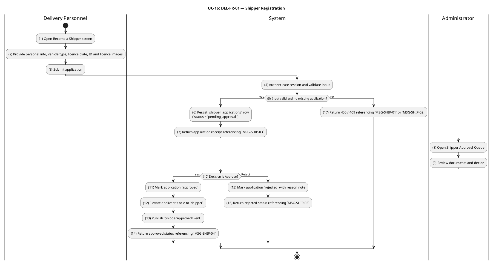

#### Business Rules

| Activity | BR Code | Description |
|---|---|---|
| _(3)–(5)_ | _BR-16.1_ | **Validate Rules (Application):** ❖ Full name, national ID number, vehicle type (`motorbike` / `bicycle` / `car`), licence-plate number (when vehicle type ≠ `bicycle`), and a driving-licence image reference are all required. ❖ Licence-plate number must match the Vietnamese plate format for the chosen vehicle type. ❖ Uploaded ID and licence images must reference existing image records owned by the applicant. ❖ Invalid input returns HTTP 400 referencing `MSG-SHIP-01`. |
| _(5)_, _(17)_ | _BR-16.2_ | **Duplicate Application Rules:** ❖ An applicant with an existing `pending_approval` or `approved` application is rejected with HTTP 409 referencing `MSG-SHIP-02`. ❖ An applicant whose previous application was `rejected` may re-apply; the new row supersedes the previous one for queue purposes. |
| _(6)_ | _BR-16.3_ | **Default Status Rules (BR-1, Partner Verification):** ❖ A newly submitted application is always created with `status = 'pending_approval'`, regardless of any client-supplied status value. ❖ The applicant's account role remains unchanged at submission time. |
| _(8)–(13)_ | _BR-16.4_ | **Authorization Rules (Approval):** ❖ Approve and reject endpoints require role `admin`; otherwise HTTP 403 referencing `MSG-AUTH-05`. ❖ Reject requires a reason note for the audit trail. |
| _(11)–(13)_ | _BR-16.5_ | **Role Elevation Rules:** ❖ On approval, the applicant's account gains role `shipper` atomically with the application status update inside one DB transaction. ❖ A `ShipperApprovedEvent` carrying `shipperId` and approved vehicle/plate is published after commit so downstream contexts (notification, delivery dispatch) can react. |

---

### UC-17: Manage Shipper Availability

| Field | Detail |
|---|---|
| **Use Case ID — Name** | DEL-FR-02 — Manage Shipper Availability |
| **Actor** | Delivery Personnel (approved Shipper) |
| **Trigger** | ❖ Shipper toggles their online/offline status from the mobile shipper console. |
| **Description** | Lets an approved shipper opt in or out of the dispatch pool in real time. Only shippers whose status is `online` are considered candidates for new pickup assignments in UC-18. The shipper cannot go offline while holding an order in `picked_up` or `delivering` (i.e. an in-flight delivery); such an attempt is rejected. This use case represents the **target enterprise design**; the backend implementation is scheduled for completion in a subsequent Phase 2 sprint. |
| **Pre-condition** | ❖ Actor is authenticated. ❖ Actor has role `shipper` (approved through UC-16). ❖ For setting status to `offline`: no order owned by this shipper is in `picked_up` or `delivering`. |
| **Post-condition** | ❖ The shipper's availability status is updated to `online` or `offline`. ❖ A `ShipperAvailabilityChangedEvent` is published so the dispatch service updates its candidate index. |

#### Activities Flow

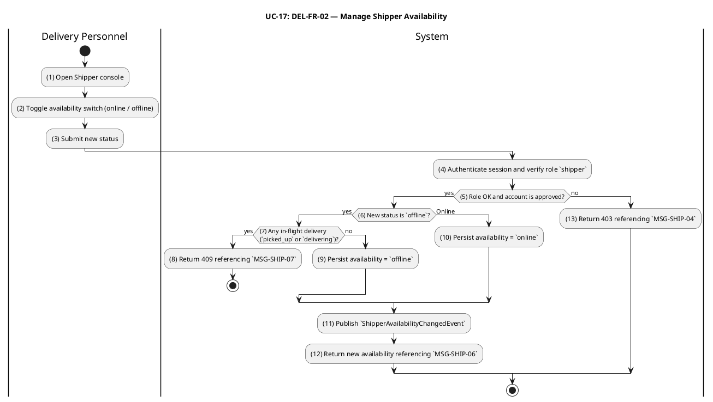

#### Business Rules

| Activity | BR Code | Description |
|---|---|---|
| _(4)–(5)_, _(13)_ | _BR-17.1_ | **Authorization Rules:** ❖ Endpoint requires role `shipper` whose underlying account is `approved`; otherwise HTTP 403 referencing `MSG-SHIP-04`. |
| _(6)–(9)_ | _BR-17.2_ | **Active-Delivery Lock Rules:** ❖ Setting status to `offline` is rejected with HTTP 409 referencing `MSG-SHIP-07` when the shipper owns any order in `picked_up` or `delivering`. ❖ The shipper must complete the in-flight delivery (UC-19) or hand it off (admin operational override) before going offline. |
| _(9)–(11)_ | _BR-17.3_ | **State Persistence Rules:** ❖ Allowed values for availability are `online` and `offline`. Any other value returns HTTP 400 referencing `MSG-SHIP-01`. ❖ Setting the same status the shipper already has is idempotent — no event is republished. |
| _(11)_ | _BR-17.4_ | **Dispatch Pool Synchronisation Rules:** ❖ A successful change publishes `ShipperAvailabilityChangedEvent` carrying `shipperId`, new availability, and the timestamp. ❖ The dispatch service uses this event to add or remove the shipper from the online candidate set used by UC-18. |

---

### UC-18: Accept Delivery Assignment

| Field | Detail |
|---|---|
| **Use Case ID — Name** | DEL-FR-03 — Accept Delivery Assignment |
| **Actor** | Delivery Personnel (online Shipper), Administrator |
| **Trigger** | ❖ A `ready_for_pickup` order is surfaced to one or more online shippers via the dispatch service (driven by `OrderReadyForPickupEvent`). ❖ A shipper claims the order from their queue (`PATCH /orders/:id/pickup`) — transitions `ready_for_pickup → picked_up` (T-09). |
| **Description** | Models the self-assignment of a `ready_for_pickup` order to a shipper. T-09 atomically sets `orders.shipperId` to the acting shipper's user id and advances `orders.status` to `picked_up`. Concurrency control is critical: when two online shippers attempt to claim the same order simultaneously, the optimistic-locking `version` guard guarantees that exactly one succeeds and the other receives a conflict response. An administrator may also execute T-09 as an operational override (e.g., to assign a specific shipper); in that case `shipperId` is set to the admin's user id, and the actual shipper is recorded out-of-band. |
| **Pre-condition** | ❖ Actor is authenticated. ❖ Actor has role `shipper` and availability `online` (or role `admin` for override). ❖ Target order is in `status = 'ready_for_pickup'`. ❖ No other shipper has yet claimed the order. |
| **Post-condition** | ❖ `orders.status = 'picked_up'`, `orders.shipperId = actorId`, `orders.version` incremented atomically. ❖ A new `order_status_logs` row records T-09 with `triggeredByRole = 'shipper'` (or `'admin'`). ❖ `OrderStatusChangedEvent` is published after commit. |

#### Activities Flow

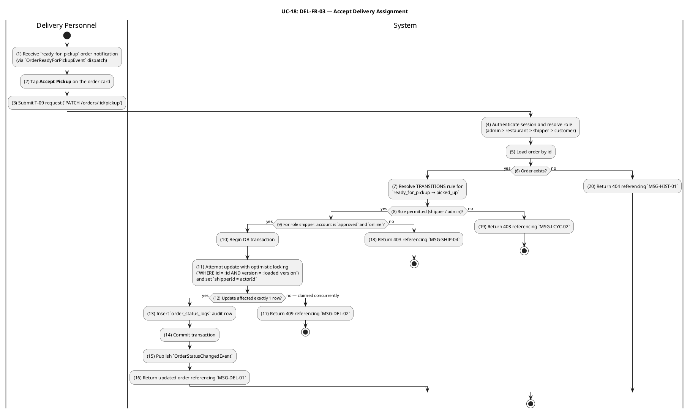

#### Business Rules

| Activity | BR Code | Description |
|---|---|---|
| _(4)–(8)_ | _BR-18.1_ | **Authorization & Transition Rules:** ❖ T-09 (`ready_for_pickup → picked_up`) is allowed only for roles `shipper` and `admin`; other roles return HTTP 403 referencing `MSG-LCYC-02`. ❖ An attempt from any source state other than `ready_for_pickup` returns HTTP 422 referencing `MSG-LCYC-01`. ❖ A non-existent order id returns HTTP 404 referencing `MSG-HIST-01`. ❖ Idempotency: if the order is already in `picked_up` status, the system returns the order unchanged without creating a duplicate audit log entry or re-publishing events. |
| _(9)_, _(18)_ | _BR-18.2_ | **Shipper Eligibility Rules:** ❖ For role `shipper`, the underlying account must be `approved` (UC-16) and the shipper's availability must be `online` (UC-17); otherwise HTTP 403 referencing `MSG-SHIP-04`. ❖ The eligibility check is bypassed for role `admin`. |
| _(10)–(14)_ | _BR-18.3_ | **Concurrency & Self-Assignment Rules:** ❖ The status update and `shipperId` assignment occur in a single SQL `UPDATE` guarded by `version = :loaded_version`. ❖ When two shippers race for the same order, the database guarantees at most one row update; the loser receives HTTP 409 referencing `MSG-DEL-02`. ❖ For role `shipper`, `shipperId` is set to `session.user.id`. For role `admin` operational override, `shipperId` is set to the admin's user id; subsequent T-10 / T-11 ownership rules then require the same actor. |
| _(13)_ | _BR-18.4_ | **Audit Log Rules:** ❖ A `order_status_logs` row is inserted in the same transaction with `fromStatus = 'ready_for_pickup'`, `toStatus = 'picked_up'`, `triggeredBy = actorId`, `triggeredByRole = 'shipper'` or `'admin'`. |
| _(15)_ | _BR-18.5_ | **Event Publication Rules:** ❖ `OrderStatusChangedEvent` is published after commit on every successful T-09. ❖ T-09 has no other side-effects (no refund, no ready-for-pickup republish). |

---

### UC-19: Deliver Order

| Field | Detail |
|---|---|
| **Use Case ID — Name** | DEL-FR-04 — Deliver Order |
| **Actor** | Delivery Personnel (assigned Shipper), Administrator |
| **Trigger** | ❖ Assigned shipper starts the delivery leg (`PATCH /orders/:id/en-route`) — transitions `picked_up → delivering` (T-10). ❖ Assigned shipper marks the order as delivered to the customer (`PATCH /orders/:id/deliver`) — transitions `delivering → delivered` (T-11). |
| **Description** | Completes the order fulfilment as a single unified business workflow with two sequential transitions: T-10 (`picked_up → delivering`) starts the en-route leg and T-11 (`delivering → delivered`) closes the order. Both transitions enforce **assigned-shipper ownership** — only the user whose id matches `orders.shipperId` (or an administrator) can advance the order. Each transition emits `OrderStatusChangedEvent` so the customer's order-tracking surface (Phase 3) and the COD payment-on-delivery reconciliation can react. |
| **Pre-condition** | ❖ Actor is authenticated. ❖ Actor has role `shipper` and `actorId = orders.shipperId`, OR actor has role `admin`. ❖ T-10 requires `order.status = 'picked_up'`; T-11 requires `order.status = 'delivering'`. |
| **Post-condition** | ❖ `orders.status` advances to `delivering` and subsequently to `delivered`; `orders.version` is incremented on each transition. ❖ A `order_status_logs` row is appended for each transition. ❖ `OrderStatusChangedEvent` is published after each transition. ❖ On T-11, downstream consumers (notification, COD payment reconciliation, rating eligibility) react to the `delivered` status. |

#### Activities Flow

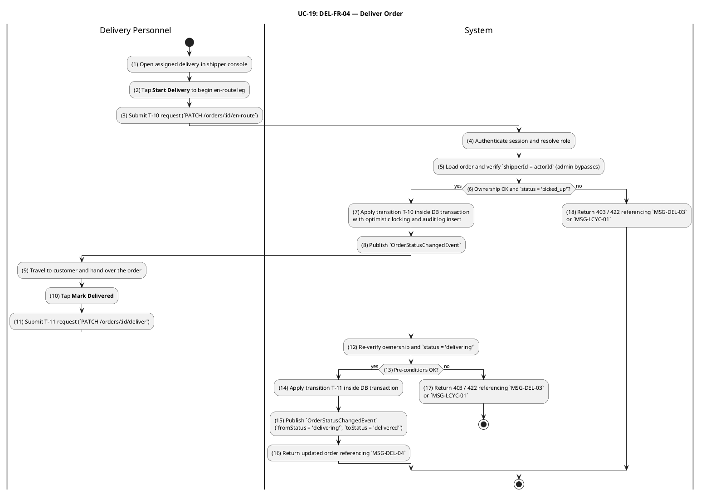

#### Business Rules

| Activity | BR Code | Description |
|---|---|---|
| _(4)–(5)_, _(12)_ | _BR-19.1_ | **Authorization & Assigned-Shipper Ownership Rules:** ❖ T-10 and T-11 are restricted to roles `shipper` and `admin`; other roles return HTTP 403 referencing `MSG-LCYC-02`. ❖ For role `shipper`, `orders.shipperId` must equal `session.user.id`; otherwise HTTP 403 referencing `MSG-DEL-03`. ❖ For role `admin`, the assigned-shipper check is bypassed. |
| _(6)_, _(13)_ | _BR-19.2_ | **Sequential Transition Rules:** ❖ T-10 requires `order.status = 'picked_up'`; any other source state returns HTTP 422 referencing `MSG-LCYC-01`. ❖ T-11 requires `order.status = 'delivering'`; any other source state returns HTTP 422 referencing `MSG-LCYC-01`. ❖ Idempotent re-issue: if the order is already in the requested target status the system returns it unchanged. |
| _(7)_, _(14)_ | _BR-19.3_ | **Atomicity & Concurrency Rules:** ❖ Each transition runs the status update plus audit-log insert in a single DB transaction. ❖ Optimistic locking on `version` rejects concurrent updates with HTTP 409 referencing `MSG-LCYC-06`. |
| _(8)_, _(15)_ | _BR-19.4_ | **Event Publication Rules:** ❖ Each successful T-10 and T-11 publishes `OrderStatusChangedEvent` after commit with the corresponding `fromStatus` / `toStatus`. ❖ Neither T-10 nor T-11 triggers a refund event; T-12 (`delivered → refunded`) is an admin-only post-delivery dispute path and is out of scope for this UC. |
| _(15)–(16)_ | _BR-19.5_ | **Delivery Completion Side-Effects Rules:** ❖ The `delivered` status is the trigger for downstream Phase 3 features: customer rating eligibility, order-history "delivered" filter, and COD payment-on-delivery reconciliation against `totalAmount`. ❖ A delivered order can only advance to `refunded` via T-12 (admin-only dispute resolution); no other forward transition is defined. |

---

## 3. Appendix — Message List

| Message Code | Message Content | Button |
|---|---|---|
| MSG-AUTH-01 | Invalid email or password. | OK |
| MSG-AUTH-02 | User with this email already exists. | OK |
| MSG-AUTH-03 | Invalid input. Please check the form fields. | OK |
| MSG-AUTH-04 | If the email exists, a reset code has been sent. | OK |
| MSG-AUTH-05 | Unauthorized. | OK |
| MSG-DISC-01 | lat and lon must both be provided together for geo search. | OK |
| MSG-REST-01 | Restaurant {id} not found. | OK |
| MSG-CART-01 | Menu item {menuItemId} has no local snapshot. Cannot validate modifier options. Please try again or contact support. | OK |
| MSG-CART-02 | Menu item '{itemName}' is currently not available (status: {status}). | OK |
| MSG-CART-03 | Modifier group {groupId} does not exist on this menu item. | OK |
| MSG-CART-04 | Modifier option {optionId} does not exist in group '{groupName}'. | OK |
| MSG-CART-05 | Modifier option '{optionName}' in group '{groupName}' is currently unavailable. | OK |
| MSG-CART-06 | Modifier group '{groupName}' requires at least {minSelections} selection(s), got {count}. | OK |
| MSG-CART-07 | Modifier group '{groupName}' allows at most {maxSelections} selection(s). | OK |
| MSG-CART-08 | Cart already contains items from restaurant '{restaurantName}'. Clear your cart before adding items from a different restaurant. | OK |
| MSG-CART-09 | Menu item {menuItemId} does not belong to restaurant {restaurantId}. | OK |
| MSG-CART-10 | Total quantity for item '{itemName}' would exceed the maximum of 99. | OK |
| MSG-CART-11 | Cart item {cartItemId} is not in your cart. | OK |
| MSG-ADDR-01 | Address validation failed. Street, district, and city are required; coordinates (if provided) must lie within Vietnam. | OK |
| MSG-ADDR-02 | lat and lon must both be provided together. | OK |
| MSG-ADDR-03 | Your location is {distanceKm} km from the restaurant, which is outside all delivery zones. | OK |
| MSG-ZONE-01 | You do not own this restaurant. | OK |
| MSG-ZONE-02 | Invalid zone configuration. Fee values must be non-negative integer multiples of 1,000 VND; radius, speed and time values must satisfy declared ranges. | OK |
| MSG-ZONE-03 | Delivery zone not found. | OK |
| MSG-ZONE-04 | This restaurant has not configured its location yet, or has no active delivery zones. | OK |
| MSG-ZONE-05 | Your location is {distanceKm} km from the restaurant, which is outside all delivery zones. | OK |
| MSG-ORD-01 | Invalid checkout data. Please review payment method, delivery address and note. | OK |
| MSG-ORD-02 | X-Idempotency-Key must be a UUID string (8–64 hexadecimal characters with optional hyphens). | OK |
| MSG-ORD-03 | A checkout is already in progress for your cart. Please wait and try again. | OK |
| MSG-ORD-04 | No active cart found for customer {customerId}. Add items before checking out. | OK |
| MSG-ORD-05 | Restaurant {restaurantId} is not available in the ordering system. | OK |
| MSG-ORD-06 | Restaurant '{restaurantName}' is not approved to receive orders. | OK |
| MSG-ORD-07 | Restaurant '{restaurantName}' is currently closed. Please try again later. | OK |
| MSG-ORD-08 | Menu item '{itemName}' is no longer available. Please remove it from your cart and try again. | OK |
| MSG-ORD-09 | Menu item '{itemName}' does not belong to the selected restaurant. Cart integrity violation — please clear your cart and try again. | OK |
| MSG-ORD-10 | Menu item '{snapshotName}' is currently {reason}. Please remove it from your cart and try again. | OK |
| MSG-ORD-11 | Your location is {distanceKm} km from the restaurant, which is outside all delivery zones. | OK |
| MSG-ORD-12 | Order total must be greater than zero. | OK |
| MSG-ORD-13 | An order for this cart has already been placed. Duplicate order rejected. | OK |
| MSG-ORD-14 | Failed to place order. Please try again. | OK |
| MSG-ORD-15 | Your order has been placed successfully. | OK |
| MSG-PAY-01 | Invalid signature. (VNPay RspCode 97) | — |
| MSG-PAY-02 | Transaction not found. (VNPay RspCode 01) | — |
| MSG-PAY-03 | Amount mismatch. (VNPay RspCode 04) | — |
| MSG-PAY-04 | Confirmed. (VNPay RspCode 00 — payment success acknowledged) | — |
| MSG-PAY-05 | Processed. (VNPay RspCode 00 — payment failure acknowledged) | — |
| MSG-PAY-06 | Transaction already processed. (VNPay RspCode 00 — idempotent acknowledgement) | — |
| MSG-PAY-07 | Concurrent processing conflict. (VNPay RspCode 99) | — |
| MSG-HIST-01 | Order {orderId} not found. | OK |
| MSG-HIST-02 | Invalid filter values. Status must be a canonical order state; date range must satisfy minDate ≤ maxDate; limit ∈ [1, 100]; offset ≥ 0. | OK |
| MSG-RES-01 | Invalid restaurant data. Name, address and phone are required; phone must match the Vietnamese mobile or landline format; coordinates (if provided) must lie within Vietnam. | OK |
| MSG-RES-02 | You do not have permission to perform this action on this restaurant. | OK |
| MSG-RES-03 | Restaurant created. It is awaiting administrator approval before becoming visible to customers. | OK |
| MSG-RES-04 | Restaurant profile updated. | OK |
| MSG-RES-05 | Restaurant approval status updated. | OK |
| MSG-MENU-01 | Invalid menu data. Please review name, price and the selected category. | OK |
| MSG-MENU-02 | Menu category not found. | OK |
| MSG-MENU-03 | A category with this name already exists for this restaurant. | OK |
| MSG-MENU-04 | Menu item {id} not found. | OK |
| MSG-MENU-05 | You do not own the restaurant associated with this menu item. | OK |
| MSG-MENU-06 | Modifier group is invalid: maxSelections must be ≥ minSelections and both must be ≥ 0. | OK |
| MSG-MENU-07 | Modifier group or option not found, or it does not belong to the specified menu item. | OK |
| MSG-AVAIL-01 | Cannot toggle sold-out on an unavailable item. Mark it available first, then retry. | OK |
| MSG-AVAIL-02 | Restaurant availability updated. | OK |
| MSG-AVAIL-03 | Menu item availability updated. | OK |
| MSG-LCYC-01 | Cannot transition order from '{fromStatus}' to '{toStatus}' — not a valid state change. | OK |
| MSG-LCYC-02 | Your role is not permitted to perform this order transition. | OK |
| MSG-LCYC-03 | You do not own the restaurant associated with this order. | OK |
| MSG-LCYC-04 | VNPay orders cannot be confirmed directly by the restaurant. Wait for payment confirmation before accepting. | OK |
| MSG-LCYC-05 | A reason note is required for this action. | OK |
| MSG-LCYC-06 | Order was modified concurrently. Please refresh and retry. | OK |
| MSG-LCYC-07 | Order accepted. | OK |
| MSG-LCYC-08 | Order rejected. | OK |
| MSG-LCYC-09 | Order is now being prepared. | OK |
| MSG-LCYC-10 | Order is ready for pickup. A shipper will be dispatched shortly. | OK |
| MSG-SHIP-01 | Invalid shipper application data. Please review the required fields and uploaded documents. | OK |
| MSG-SHIP-02 | You already have a pending or approved shipper application on record. | OK |
| MSG-SHIP-03 | Shipper application submitted. It is awaiting administrator approval. | OK |
| MSG-SHIP-04 | Your account is not yet approved as an active shipper. | OK |
| MSG-SHIP-05 | Shipper application rejected. See the reason note for details. | OK |
| MSG-SHIP-06 | Shipper availability updated. | OK |
| MSG-SHIP-07 | Cannot go offline while you have an in-flight delivery. Complete the active delivery first. | OK |
| MSG-DEL-01 | Order picked up. Drive safely. | OK |
| MSG-DEL-02 | Another shipper has already claimed this order. | OK |
| MSG-DEL-03 | Only the assigned shipper can advance this delivery. | OK |
| MSG-DEL-04 | Order delivered. Thank you. | OK |

---

*End of Software Requirements Specification — Phases 1 & 2, Version 1.6*
