# Software Requirements Specification

## SoLi Food Delivery Application

---

| Field              | Detail                                                    |
|--------------------|-----------------------------------------------------------|
| **Document Title** | Software Requirements Specification — SoLi Food Delivery Application |
| **Version**        | 1.11                                                      |
| **Status**         | Final — Submission Ready                                  |
| **Prepared by**    | Development Team                                          |
| **Last Modified**  | 2026-05-18                                                |

---

## Revision History

| Version | Date       | Author   | Summary of Changes |
|---------|------------|----------|--------------------|
| 1.0     | 2025-01-01 | Dev Team | Initial SRS baseline with Introduction, conventions, and the first 10 functional use cases. |
| 1.5     | 2026-05-15 | Dev Team | Business Rules and Message Appendix restructured; UC activity/message conventions normalized for DOCX output. |
| 1.8     | 2026-05-15 | Dev Team | UC-20–UC-26 aligned with ordering, payment, promotion, refund, and notification behavior verified from implementation evidence. |
| 1.11    | 2026-05-24 | Dev Team | Final submission audit: UC-1–UC-35 reviewed against BRD, User Stories, Use Case Specification, sequence diagrams, architecture artifacts, and implementation evidence; BR tables normalized to single-activity rows; message traceability finalized. |

---

## Table of Contents

1. [Introduction](#1-introduction)
   - 1.1 Purpose
   - 1.2 Scope
   - 1.3 Intended Audience
   - 1.4 Document Conventions
   - 1.5 Notation
2. [Functional Requirements — Use Cases](#2-functional-requirements--use-cases)
   - **Foundation & Customer Ordering Core (UC-1 – UC-10)**
     - UC-1: User Authentication
     - UC-2: Discover Restaurants & Food
     - UC-3: View Restaurant Details
     - UC-4: Add Item to Cart
     - UC-5: Manage Shopping Cart
     - UC-6: Save & Manage Delivery Addresses
     - UC-7: Manage Delivery Zones
     - UC-8: Place Order
     - UC-9: Make Online Payment (VNPay)
     - UC-10: View Order History
   - **Restaurant & Delivery Operations (UC-11 – UC-19)**
     - UC-11: Restaurant Registration & Profile Management
     - UC-12: Manage Menu Catalog
     - UC-13: Toggle Item & Restaurant Availability
     - UC-14: Accept or Reject Order
     - UC-15: Prepare Order for Pickup
     - UC-16: Shipper Registration
     - UC-17: Manage Shipper Availability
     - UC-18: Accept Delivery Assignment
     - UC-19: Deliver Order
   - **Customer Interaction, Promotion & Notification (UC-20 – UC-26)**
     - UC-20: Track Order Status
     - UC-21: Cancel Order
     - UC-22: Submit Rating & Review
     - UC-23: Manage Restaurant Promotions
     - UC-24: Manage Platform Promotions
     - UC-25: Process Payment Refund
     - UC-26: Manage Real-Time Notifications
   - **Administration & Governance (UC-27 – UC-35)**
     - UC-27: Approve or Reject Restaurant Applications
     - UC-28: Approve or Reject Shipper Applications
     - UC-29: Suspend or Reactivate Partner Accounts
     - UC-30: Monitor Orders and Platform Health
     - UC-31: Search and Manage User Accounts
     - UC-32: Administrative Order Cancellation & Refund
     - UC-33: View and Export Operational Reports
     - UC-34: View Dashboard & Platform Overview
     - UC-35: Manage Admin Roles & Permissions
3. [Appendix — Message List](#3-appendix--message-list)

---

## 1. Introduction

### 1.1 Purpose

This Software Requirements Specification (SRS) defines the functional requirements for the **SoLi Food Delivery** application. It serves as the authoritative reference for system behavior shared between design, development, QA, and stakeholder review.

### 1.2 Scope

This SRS covers the end-to-end ordering platform across all functional domains:

**Foundation & Customer Ordering Core (UC-1 – UC-10):**
- User authentication and session management
- Restaurant and food discovery
- Cart management and checkout
- Delivery zone configuration
- Order placement and VNPay online payment
- Order history and reorder

**Restaurant & Delivery Operations (UC-11 – UC-19):**
- Restaurant partner onboarding (registration, admin approval, profile management)
- Menu catalog management (categories, items, modifier groups and options)
- Real-time item and restaurant availability control (BR-8)
- Order acceptance, rejection and refund-triggering cancellations
- Order preparation and ready-for-pickup signalling
- Shipper onboarding and online/offline availability
- Self-assigned delivery pickup and end-to-end delivery completion

**Customer Interaction, Promotion & Notification (UC-20 – UC-26):**
- Real-time order tracking via authoritative reads and WebSocket pushes
- Customer-initiated order cancellation with payment-aware refund triggering
- Post-delivery rating and review
- Restaurant-scoped promotion authoring and lifecycle management
- Platform-wide promotion authoring, coupon-code issuance and stacking governance
- Cross-context payment refund pipeline (`completed → refund_pending → refunded`)
- Multi-channel notification dispatch (in-app, push, email) with per-user preferences and quiet hours

**Administration & Governance (UC-27 – UC-35):**
- Restaurant partner approval and revocation (closes BR-1 loop from UC-11)
- Shipper application review, approval and rejection queue
- Account suspension and reactivation with session invalidation and last-admin safeguard
- Cross-tenant order monitoring with composable filters and full lifecycle history
- User account search, profile management, and delegation to suspension and role-change UCs
- Administrative order cancellation and post-delivery refund override
- Operational reports across order, financial, user and promotion domains with CSV/XLSX export
- Admin dashboard summary with today's KPIs and recent-activity stream
- Role assignment and governance with last-admin safeguard and shipper-role-via-UC-28 constraint

### 1.3 Intended Audience

| Audience               | Usage                                                          |
|------------------------|----------------------------------------------------------------|
| Business Analysts      | Validate requirements against business goals                   |
| Developers             | Implementation reference for each functional area              |
| QA Engineers           | Test case derivation from Business Rules                       |
| Product Owners         | Sprint planning and acceptance criteria                        |

### 1.4 Document Conventions

- Use cases are prefixed `UC-N` (e.g., `UC-1`, `UC-8`).
- Business Rules are identified by UC-local keys using the pattern `BR-x.y` (e.g., `BR-6.1`, `BR-8.4`).
- Activity Diagram steps use stable sequential numbering `(1)`, `(2)`, `(3)`, …. Each diagram has exactly **one** end node; both success and error branches converge at this single `stop`.
- Step references in the Business Rules table Activity column use one italic parenthetical activity per row, e.g., _(3)_. Grouped activity ranges are not used.
- All customer- or actor-visible messages are centralized in **§3 Appendix — Message List**. Codes follow the pattern `MSG-<DOMAIN>-<NN>` (e.g., `MSG-AUTH-01`, `MSG-ORD-13`). Business Rules reference codes only; full message content lives exclusively in §3.
- The symbol ❖ introduces a main business rule bullet; ● introduces a sub-item; ➢ introduces a nested detail.

### 1.5 Notation

| Symbol / Format | Meaning                                              |
|-----------------|------------------------------------------------------|
| `'value'`       | Exact string enumeration value (e.g., `'pending'`)   |
| `[field]`       | Variable or data field                               |
| ❖               | Primary business rule bullet                         |
| ●               | Sub-item under a primary bullet                      |
| ➢               | Nested detail under a sub-item                       |
| **Bold**        | Rule-type label within a description cell            |
| `HTTP NNN`      | HTTP status code                                     |

---

## 2. Functional Requirements — Use Cases

---

### UC-1: User Authentication

| Name            | User Authentication                                                                 |
|-----------------|-------------------------------------------------------------------------------------|
| **Description** | This use case describes how users register, sign in, recover their password, sign out, and how the system validates sessions on protected endpoints. |
| **Actor**       | Guest (unauthenticated user), Authenticated User                                    |
| **Trigger**     | ❖ Guest navigates to the Sign In or Sign Up page.<br>❖ User clicks "Logout".<br>❖ System receives a request to a protected endpoint with a Bearer token. |
| **Pre-condition** | ❖ For Sign In / Forgot Password: a valid user account exists.<br>❖ For Sign Up: no duplicate email exists in the system. |
| **Post-condition** | ❖ Sign Up / Sign In: a session is created and the user is redirected to the home page.<br>❖ Logout: the session is invalidated.<br>❖ Session Validation: the request proceeds with the authenticated user context. |

#### Activities Flow

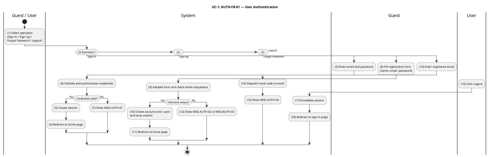

#### Business Rules

| Activity | BR Code | Description |
|---|---|---|
| _(3)_ | _BR-1.1_ | **Validate Rules (Sign In):**<br>❖ `email` is required and must be a valid email format.<br>❖ `password` is required and non-empty.<br>❖ If any required field is missing or malformed, system rejects the request with HTTP 400 referencing `MSG-AUTH-03`. |
| _(4)_ | _BR-1.2_ | **Validate Rules (Sign In): — Same Requirement Application:**<br>❖ _BR-1.2_ applies the detailed requirement, validation, persistence, event, and runtime constraints specified in _BR-1.1_ to activity _(4)_.<br>❖ Message trace retained: `MSG-AUTH-03`. |
| _(7)_ | _BR-1.3_ | **Sign In Failure Rules:**<br>❖ If email is not found, password is incorrect, or account is banned, system returns HTTP 401 referencing `MSG-AUTH-01`.<br>❖ The system makes no distinction between failure causes to prevent user enumeration attacks. |
| _(5)_ | _BR-1.4_ | **Session Creation Rules:**<br>❖ A session record is created with `expiresAt = now + sessionTtl` (default 7 days).<br>❖ `ipAddress` and `userAgent` are stored for audit purposes.<br>❖ Session token is returned in the HTTP response and used as a Bearer token on all subsequent requests. |
| _(8)_ | _BR-1.5_ | **Validate Rules (Sign Up):**<br>❖ `name` must be a non-empty string.<br>❖ `email` must be a valid email format.<br>❖ `password` must be at least 8 characters and contain at least one letter and one digit.<br>❖ Invalid input returns HTTP 400 referencing `MSG-AUTH-03`. |
| _(9)_ | _BR-1.6_ | **Validate Rules (Sign Up): — Same Requirement Application:**<br>❖ _BR-1.6_ applies the detailed requirement, validation, persistence, event, and runtime constraints specified in _BR-1.5_ to activity _(9)_.<br>❖ Message trace retained: `MSG-AUTH-03`. |
| _(12)_ | _BR-1.7_ | **Sign Up Duplicate Email Rules:**<br>❖ If the email is already registered, system returns HTTP 409 referencing `MSG-AUTH-02`. |
| _(10)_ | _BR-1.8_ | **Account Initialization Rules:**<br>❖ New accounts are created with `role = 'user'`.<br>❖ Elevation to `'restaurant'`, `'shipper'`, or `'admin'` is handled through the partner onboarding and administration workflows (see UC-11, UC-16, and UC-35).<br>❖ Passwords are stored as secure hashes; plaintext is never persisted. |
| _(14)_ | _BR-1.9_ | **Forgot Password Rules:**<br>❖ System creates a verification record with a single-use OTP valid for 60 minutes.<br>❖ System responds HTTP 200 referencing `MSG-AUTH-04` regardless of whether the email exists (anti-enumeration).<br>❖ The OTP is dispatched via the configured channel (email / SMS). |
| _(15)_ | _BR-1.10_ | **Forgot Password Rules: — Same Requirement Application:**<br>❖ _BR-1.10_ applies the detailed requirement, validation, persistence, event, and runtime constraints specified in _BR-1.9_ to activity _(15)_.<br>❖ Message trace retained: `MSG-AUTH-04`. |
| _(17)_ | _BR-1.11_ | **Logout Rules:**<br>❖ The session record is deleted immediately.<br>❖ Any subsequent requests using the invalidated token receive HTTP 401 referencing `MSG-AUTH-05`. |
| _(2)_ | _BR-1.12_ | **Session Validation Rules:**<br>❖ Every protected endpoint requires a valid non-expired Bearer token.<br>❖ Missing or expired token returns HTTP 401 referencing `MSG-AUTH-05`.<br>❖ The session's associated user is attached to the request context. |
| _(6)_ | _BR-1.13_ | **Redirect Rules:**<br>❖ Successful Sign In and Sign Up redirect to the home page.<br>❖ Successful Logout redirects to the sign-in page. |
| _(11)_ | _BR-1.14_ | **Redirect Rules: — Same Requirement Application:**<br>❖ _BR-1.14_ applies the detailed requirement, validation, persistence, event, and runtime constraints specified in _BR-1.13_ to activity _(11)_.<br>❖ No actor-facing message code is emitted by this activity. |
| _(18)_ | _BR-1.15_ | **Redirect Rules: — Same Requirement Application:**<br>❖ _BR-1.15_ applies the detailed requirement, validation, persistence, event, and runtime constraints specified in _BR-1.13_ to activity _(18)_.<br>❖ No actor-facing message code is emitted by this activity. |

---

### UC-2: Discover Restaurants & Food

| Name            | Discover Restaurants & Food                                                           |
|-----------------|---------------------------------------------------------------------------------------|
| **Description** | This use case describes how users search for restaurants and menu items by keyword, category, cuisine type, and geographic location. |
| **Actor**       | Guest, Customer                                                                        |
| **Trigger**     | ❖ User navigates to the discovery or search page.<br>❖ User enters a search query or applies discovery filters. |
| **Pre-condition** | ❖ None. Both authenticated and unauthenticated users may search. |
| **Post-condition** | ❖ System returns a paginated list of matching restaurants and menu items. |

#### Activities Flow

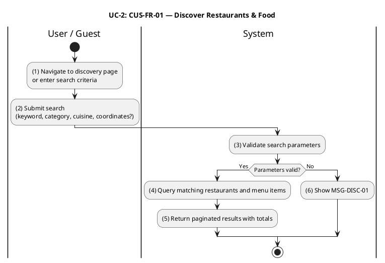

#### Business Rules

| Activity | BR Code | Description |
|---|---|---|
| _(3)_ | _BR-2.1_ | **Validate Rules:**<br>❖ `lat` and `lon` must be provided together. If only one is present, system returns HTTP 400 referencing `MSG-DISC-01`.<br>❖ `radiusKm` (if supplied) must be a positive number. |
| _(6)_ | _BR-2.2_ | **Validate Rules: — Same Requirement Application:**<br>❖ _BR-2.2_ applies the detailed requirement, validation, persistence, event, and runtime constraints specified in _BR-2.1_ to activity _(6)_.<br>❖ Message trace retained: `MSG-DISC-01`. |
| _(4)_ | _BR-2.3_ | **Pagination Rules:**<br>❖ `limit` is clamped to [1, 100]. `offset` is clamped to ≥ 0.<br>❖ Requests outside these bounds are accepted with clamped values (no error). |
| _(4)_ | _BR-2.4_ | **Restaurant Filter Rules:**<br>❖ Only restaurants with `isApproved = true` AND `isOpen = true` are included in results.<br>❖ If `lat`, `lon`, and `radiusKm` are provided, only restaurants within the specified radius are returned. |
| _(4)_ | _BR-2.5_ | **Item Filter Rules:**<br>❖ Only items with `status = 'available'` are included.<br>❖ The items array is populated only when at least one of `q`, `category`, or `tag` is provided; otherwise `items: []` is returned. |
| _(4)_ | _BR-2.6_ | **Relevance Scoring Rules:**<br>❖ Restaurants are scored: exact name match +12, partial name match +9, cuisine match +6, description partial match +2.<br>❖ Items are scored: exact name match +12, partial name match +8, tag match +5, category match +3.<br>❖ Ties are broken by stable UUID ordering. |
| _(5)_ | _BR-2.7_ | **Response Rules:**<br>❖ `total.restaurants` and `total.items` reflect the full match count before pagination is applied.<br>❖ If no results match the query, system returns HTTP 200 with empty arrays and zero totals — never HTTP 404. |

---

### UC-3: View Restaurant Details

| Name            | View Restaurant Details                                                               |
|-----------------|---------------------------------------------------------------------------------------|
| **Description** | This use case describes how users view a restaurant's profile and its full menu, including categories, items, and modifier groups. |
| **Actor**       | Guest, Customer                                                                        |
| **Trigger**     | ❖ User clicks a restaurant card from the discovery or search results page.             |
| **Pre-condition** | ❖ None. Available to authenticated and unauthenticated users. |
| **Post-condition** | ❖ System returns the restaurant's profile and complete menu structure. |

#### Activities Flow

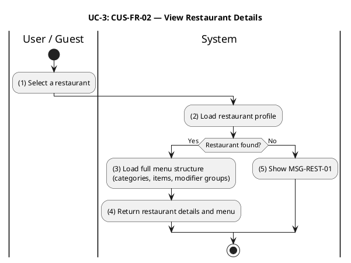

#### Business Rules

| Activity | BR Code | Description |
|---|---|---|
| _(2)_ | _BR-3.1_ | **Validate Rules:**<br>❖ Restaurant `:id` must be a valid UUID format. An invalid format returns HTTP 400. |
| _(2)_ | _BR-3.2_ | **Not Found Rules:**<br>❖ If no restaurant matches the given ID, system returns HTTP 404 referencing `MSG-REST-01`.<br>❖ No distinction is made between non-existent and unapproved restaurants to prevent information disclosure. |
| _(5)_ | _BR-3.3_ | **Not Found Rules: — Same Requirement Application:**<br>❖ _BR-3.3_ applies the detailed requirement, validation, persistence, event, and runtime constraints specified in _BR-3.2_ to activity _(5)_.<br>❖ Message trace retained: `MSG-REST-01`. |
| _(3)_ | _BR-3.4_ | **Menu Display Rules:**<br>❖ All menu items are returned regardless of availability status (`available`, `out_of_stock`, `unavailable`).<br>❖ The client is responsible for displaying availability badges.<br>❖ Availability is enforced server-side only at the point of adding to cart (UC-4, BR-4.2). |
| _(4)_ | _BR-3.5_ | **Menu Display Rules: — Same Requirement Application:**<br>❖ _BR-3.5_ applies the detailed requirement, validation, persistence, event, and runtime constraints specified in _BR-3.4_ to activity _(4)_.<br>❖ No actor-facing message code is emitted by this activity. |

---

### UC-4: Add Item to Cart

| Name            | Add Item to Cart                                                                        |
|-----------------|-----------------------------------------------------------------------------------------|
| **Description** | This use case describes how a customer adds a menu item with selected modifier options to their shopping cart. |
| **Actor**       | Customer (authenticated, role `'user'`)                                                  |
| **Trigger**     | ❖ Customer taps "Add to Cart" on a menu item in the restaurant detail page.              |
| **Pre-condition** | ❖ Customer is authenticated.<br>❖ The target restaurant's Ordering ACL snapshot is available. |
| **Post-condition** | ❖ The item is added or merged into the customer's cart. Cart TTL is reset to 7 days. |

#### Activities Flow

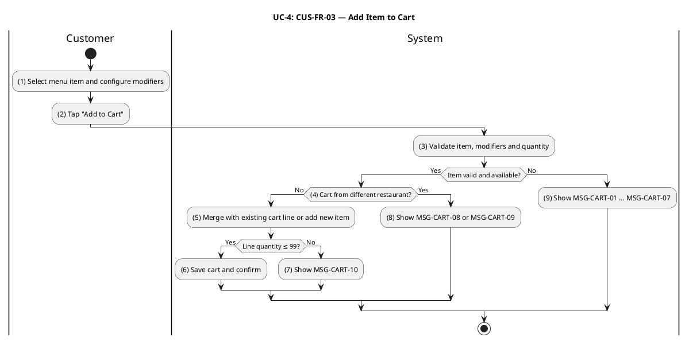

#### Business Rules

| Activity | BR Code | Description |
|---|---|---|
| _(3)_ | _BR-4.1_ | **Validate Rules:**<br>❖ `quantity` must be in [1, 99]. `unitPrice` must be > 0. `menuItemId` and `restaurantId` must be valid UUIDs. `itemName` must be non-empty.<br>❖ Invalid input returns HTTP 400 with a field-level error message. |
| _(3)_ | _BR-4.2_ | **Item Availability Rules:**<br>❖ The item must exist in the Ordering ACL snapshot. If no snapshot is found, system returns HTTP 400 referencing `MSG-CART-01`.<br>❖ Item `status` must be `'available'`. If not, system returns HTTP 409 referencing `MSG-CART-02`. |
| _(9)_ | _BR-4.3_ | **Item Availability Rules: — Same Requirement Application:**<br>❖ _BR-4.3_ applies the detailed requirement, validation, persistence, event, and runtime constraints specified in _BR-4.2_ to activity _(9)_.<br>❖ Message trace retained: `MSG-CART-01`, `MSG-CART-02`. |
| _(3)_ | _BR-4.4_ | **Modifier Validation Rules:**<br>❖ Each `(groupId, optionId)` pair must exist on the snapshot; the option must be available; per-group selection count must satisfy `minSelections ≤ count ≤ maxSelections`.<br>● Modifier group not found → HTTP 400 referencing `MSG-CART-03`.<br>● Modifier option not found → HTTP 400 referencing `MSG-CART-04`.<br>● Option unavailable → HTTP 400 referencing `MSG-CART-05`.<br>● Below minimum selections → HTTP 400 referencing `MSG-CART-06`.<br>● Exceeds maximum selections → HTTP 400 referencing `MSG-CART-07`. |
| _(9)_ | _BR-4.5_ | **Modifier Validation Rules: — Same Requirement Application:**<br>❖ _BR-4.5_ applies the detailed requirement, validation, persistence, event, and runtime constraints specified in _BR-4.4_ to activity _(9)_.<br>❖ Message trace retained: `MSG-CART-03`, `MSG-CART-04`, `MSG-CART-05`, `MSG-CART-06`, `MSG-CART-07`. |
| _(4)_ | _BR-4.6_ | **Single-Restaurant Cart Rules:**<br>❖ A customer's cart may only contain items from one restaurant at a time. If the cart already contains items from a different restaurant, system returns HTTP 409 referencing `MSG-CART-08`.<br>❖ If the ACL snapshot's `restaurantId` mismatches the request `restaurantId`, system returns HTTP 409 referencing `MSG-CART-09`. |
| _(8)_ | _BR-4.7_ | **Single-Restaurant Cart Rules: — Same Requirement Application:**<br>❖ _BR-4.7_ applies the detailed requirement, validation, persistence, event, and runtime constraints specified in _BR-4.6_ to activity _(8)_.<br>❖ Message trace retained: `MSG-CART-08`, `MSG-CART-09`. |
| _(5)_ | _BR-4.8_ | **Merge and Quantity Rules:**<br>❖ Line item identity is defined by `(menuItemId, modifierFingerprint)`. Adding the same item with identical modifier selections increments the existing line's quantity rather than creating a duplicate.<br>❖ The per-line quantity ceiling is 99. If adding would exceed this, system returns HTTP 400 referencing `MSG-CART-10`. |
| _(7)_ | _BR-4.9_ | **Merge and Quantity Rules: — Same Requirement Application:**<br>❖ _BR-4.9_ applies the detailed requirement, validation, persistence, event, and runtime constraints specified in _BR-4.8_ to activity _(7)_.<br>❖ Message trace retained: `MSG-CART-10`. |
| _(5)_ | _BR-4.10_ | **Cart Persistence Rules:**<br>❖ Cart data is stored in Redis under the key `cart:<customerId>`.<br>❖ Every successful cart mutation resets the Redis TTL to 7 days. |
| _(6)_ | _BR-4.11_ | **Cart Persistence Rules: — Same Requirement Application:**<br>❖ _BR-4.11_ applies the detailed requirement, validation, persistence, event, and runtime constraints specified in _BR-4.10_ to activity _(6)_.<br>❖ No actor-facing message code is emitted by this activity. |

---

### UC-5: Manage Shopping Cart

| Name            | Manage Shopping Cart                                                                    |
|-----------------|-----------------------------------------------------------------------------------------|
| **Description** | This use case describes how a customer views, modifies, and clears their shopping cart prior to checkout. |
| **Actor**       | Customer (authenticated, role `'user'`)                                                  |
| **Trigger**     | ❖ Customer navigates to the cart screen.<br>❖ Customer taps an update, remove, or clear action. |
| **Pre-condition** | ❖ Customer is authenticated. |
| **Post-condition** | ❖ Cart reflects the requested change. If the cart becomes empty, it is deleted and subsequent reads return null. |

#### Activities Flow

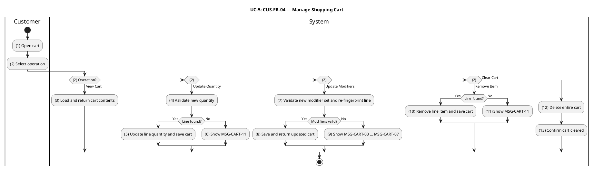

#### Business Rules

| Activity | BR Code | Description |
|---|---|---|
| _(3)_ | _BR-5.1_ | **Cart Access Rules:**<br>❖ Cart is strictly scoped to the authenticated customer (`customerId = session.user.id`).<br>❖ If no cart exists for the customer, system returns HTTP 200 with `null`. |
| _(4)_ | _BR-5.2_ | **Update Quantity Rules:**<br>❖ `quantity` must be in [0, 99].<br>❖ Setting `quantity = 0` is equivalent to removing the line item (same behavior as the Remove Item operation).<br>❖ If the `cartItemId` is not found in the customer's cart, system returns HTTP 404 referencing `MSG-CART-11`. |
| _(5)_ | _BR-5.3_ | **Update Quantity Rules: — Same Requirement Application:**<br>❖ _BR-5.3_ applies the detailed requirement, validation, persistence, event, and runtime constraints specified in _BR-5.2_ to activity _(5)_.<br>❖ Message trace retained: `MSG-CART-11`. |
| _(6)_ | _BR-5.4_ | **Update Quantity Rules: — Same Requirement Application:**<br>❖ _BR-5.4_ applies the detailed requirement, validation, persistence, event, and runtime constraints specified in _BR-5.2_ to activity _(6)_.<br>❖ Message trace retained: `MSG-CART-11`. |
| _(7)_ | _BR-5.5_ | **Update Modifiers Rules:**<br>❖ The modifier set is replaced wholesale. Modifier validation reuses the rules in BR-4.4 (`MSG-CART-03` … `MSG-CART-07`).<br>❖ If the new modifier selection produces a fingerprint that collides with an existing line, the two lines are merged subject to the 99-unit per-line ceiling.<br>❖ Overflow on merge returns HTTP 400 referencing `MSG-CART-10`. |
| _(8)_ | _BR-5.6_ | **Update Modifiers Rules: — Same Requirement Application:**<br>❖ _BR-5.6_ applies the detailed requirement, validation, persistence, event, and runtime constraints specified in _BR-5.5_ to activity _(8)_.<br>❖ Message trace retained: `MSG-CART-03`, `MSG-CART-07`, `MSG-CART-10`. |
| _(9)_ | _BR-5.7_ | **Update Modifiers Rules: — Same Requirement Application:**<br>❖ _BR-5.7_ applies the detailed requirement, validation, persistence, event, and runtime constraints specified in _BR-5.5_ to activity _(9)_.<br>❖ Message trace retained: `MSG-CART-03`, `MSG-CART-07`, `MSG-CART-10`. |
| _(10)_ | _BR-5.8_ | **Remove Item Rules:**<br>❖ If the `cartItemId` is not found in the customer's cart, system returns HTTP 404 referencing `MSG-CART-11`. |
| _(11)_ | _BR-5.9_ | **Remove Item Rules: — Same Requirement Application:**<br>❖ _BR-5.9_ applies the detailed requirement, validation, persistence, event, and runtime constraints specified in _BR-5.8_ to activity _(11)_.<br>❖ Message trace retained: `MSG-CART-11`. |
| _(12)_ | _BR-5.10_ | **Clear Cart Rules:**<br>❖ Clear Cart is idempotent. Clearing an already-empty cart returns HTTP 204 without error. |
| _(5)_ | _BR-5.11_ | **Cart Empty State Rules:**<br>❖ When the last item is removed (by Update Qty to 0, Remove Item, or Clear Cart), the Redis key is deleted.<br>❖ Subsequent GET requests return `null`. Deletion operations return HTTP 204 No Content. |
| _(10)_ | _BR-5.12_ | **Cart Empty State Rules: — Same Requirement Application:**<br>❖ _BR-5.12_ applies the detailed requirement, validation, persistence, event, and runtime constraints specified in _BR-5.11_ to activity _(10)_.<br>❖ No actor-facing message code is emitted by this activity. |
| _(12)_ | _BR-5.13_ | **Cart Empty State Rules: — Same Requirement Application:**<br>❖ _BR-5.13_ applies the detailed requirement, validation, persistence, event, and runtime constraints specified in _BR-5.11_ to activity _(12)_.<br>❖ No actor-facing message code is emitted by this activity. |
| _(13)_ | _BR-5.14_ | **Cart Empty State Rules: — Same Requirement Application:**<br>❖ _BR-5.14_ applies the detailed requirement, validation, persistence, event, and runtime constraints specified in _BR-5.11_ to activity _(13)_.<br>❖ No actor-facing message code is emitted by this activity. |
| _(5)_ | _BR-5.15_ | **TTL Reset Rules:**<br>❖ Every successful cart mutation resets the Redis TTL to 7 days.<br>❖ Read-only GET (View Cart) does not reset the TTL. |
| _(8)_ | _BR-5.16_ | **TTL Reset Rules: — Same Requirement Application:**<br>❖ _BR-5.16_ applies the detailed requirement, validation, persistence, event, and runtime constraints specified in _BR-5.15_ to activity _(8)_.<br>❖ No actor-facing message code is emitted by this activity. |
| _(10)_ | _BR-5.17_ | **TTL Reset Rules: — Same Requirement Application:**<br>❖ _BR-5.17_ applies the detailed requirement, validation, persistence, event, and runtime constraints specified in _BR-5.15_ to activity _(10)_.<br>❖ No actor-facing message code is emitted by this activity. |
| _(12)_ | _BR-5.18_ | **TTL Reset Rules: — Same Requirement Application:**<br>❖ _BR-5.18_ applies the detailed requirement, validation, persistence, event, and runtime constraints specified in _BR-5.15_ to activity _(12)_.<br>❖ No actor-facing message code is emitted by this activity. |

---

### UC-6: Save & Manage Delivery Addresses

| Name            | Save & Manage Delivery Addresses                                                        |
|-----------------|-----------------------------------------------------------------------------------------|
| **Description** | This use case describes how a customer provides a delivery address at checkout. The address is validated, captured into the order, and checked for delivery zone eligibility. |
| **Actor**       | Customer (authenticated, role `'user'`)                                                  |
| **Trigger**     | ❖ Customer proceeds to checkout and enters a delivery address. |
| **Pre-condition** | ❖ Customer is authenticated and has a non-empty cart. |
| **Post-condition** | ❖ Delivery address is captured and immutably stored with the placed order. |

#### Activities Flow

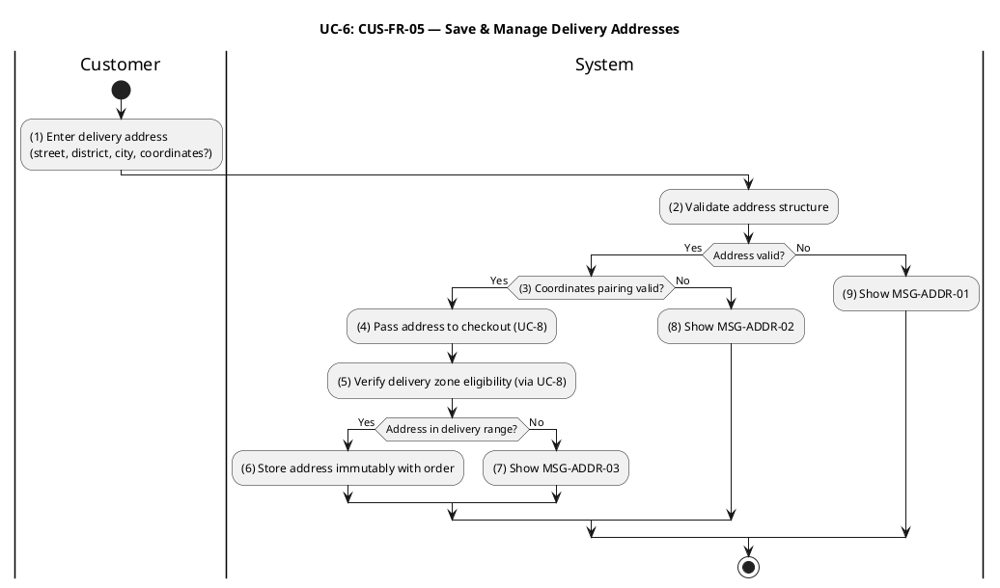

#### Business Rules

| Activity | BR Code | Description |
|---|---|---|
| _(2)_ | _BR-6.1_ | **Validate Rules:**<br>❖ `street`, `district`, and `city` are required non-empty strings.<br>❖ `latitude` and `longitude` are optional, but if either is provided both must be present.<br>❖ Coordinates must lie within Vietnam's geographic bounds.<br>❖ Invalid input returns HTTP 400 referencing `MSG-ADDR-01` (general validation) or `MSG-ADDR-02` (coordinate pairing). |
| _(3)_ | _BR-6.2_ | **Validate Rules: — Same Requirement Application:**<br>❖ _BR-6.2_ applies the detailed requirement, validation, persistence, event, and runtime constraints specified in _BR-6.1_ to activity _(3)_.<br>❖ Message trace retained: `MSG-ADDR-01`, `MSG-ADDR-02`. |
| _(8)_ | _BR-6.3_ | **Validate Rules: — Same Requirement Application:**<br>❖ _BR-6.3_ applies the detailed requirement, validation, persistence, event, and runtime constraints specified in _BR-6.1_ to activity _(8)_.<br>❖ Message trace retained: `MSG-ADDR-01`, `MSG-ADDR-02`. |
| _(9)_ | _BR-6.4_ | **Validate Rules: — Same Requirement Application:**<br>❖ _BR-6.4_ applies the detailed requirement, validation, persistence, event, and runtime constraints specified in _BR-6.1_ to activity _(9)_.<br>❖ Message trace retained: `MSG-ADDR-01`, `MSG-ADDR-02`. |
| _(4)_ | _BR-6.5_ | **Delivery Zone Eligibility Rules (via UC-8):**<br>❖ Delivery eligibility is evaluated at checkout (UC-8, BR-8.11) via Haversine distance between the address coordinates and the restaurant's delivery zone center.<br>❖ The innermost eligible zone is selected. If the address falls outside all active delivery zones, system returns HTTP 422 referencing `MSG-ADDR-03`. |
| _(5)_ | _BR-6.6_ | **Delivery Zone Eligibility Rules (via UC-8): — Same Requirement Application:**<br>❖ _BR-6.6_ applies the detailed requirement, validation, persistence, event, and runtime constraints specified in _BR-6.5_ to activity _(5)_.<br>❖ Message trace retained: `MSG-ADDR-03`. |
| _(7)_ | _BR-6.7_ | **Delivery Zone Eligibility Rules (via UC-8): — Same Requirement Application:**<br>❖ _BR-6.7_ applies the detailed requirement, validation, persistence, event, and runtime constraints specified in _BR-6.5_ to activity _(7)_.<br>❖ Message trace retained: `MSG-ADDR-03`. |
| _(6)_ | _BR-6.8_ | **Address Immutability Rules:**<br>❖ The delivery address is stored in the `orders.delivery_address` JSONB column at order placement.<br>❖ Once stored, it cannot be changed. Address correction requires order cancellation and re-placement. |
| _(1)_ | _BR-6.9_ | **Address Book Rules:**<br>❖ Customer addresses are managed through the address capability, including capture, validation, persistence, listing, update and deletion.<br>❖ Checkout binds the selected or entered address to the order snapshot so fulfillment remains immutable after placement. |

---

### UC-7: Manage Delivery Zones

| Name            | Manage Delivery Zones                                                                   |
|-----------------|-----------------------------------------------------------------------------------------|
| **Description** | This use case describes how restaurant partners and administrators configure delivery zones (create, update, delete, list), and how customers request a delivery fee and ETA estimate. |
| **Actor**       | Restaurant Partner (role `'restaurant'`), Administrator (role `'admin'`), Customer (estimate only) |
| **Trigger**     | ❖ Restaurant Partner navigates to the delivery zone management screen.<br>❖ Customer requests a delivery estimate from the restaurant detail page. |
| **Pre-condition** | ❖ Zone management: actor is authenticated as Restaurant Partner or Admin.<br>❖ Estimate: restaurant has a configured location and at least one active delivery zone. |
| **Post-condition** | ❖ Zone management: zone is created, updated, or deleted; ACL snapshot is synchronized.<br>❖ Estimate: system returns the computed delivery fee and estimated time. |

#### Activities Flow

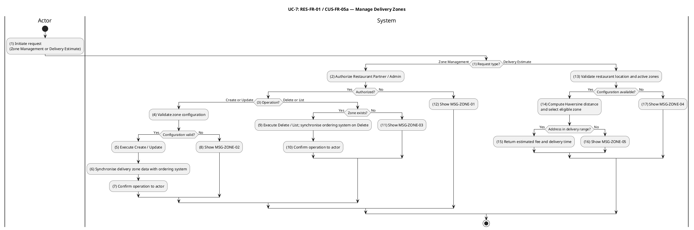

#### Business Rules

| Activity | BR Code | Description |
|---|---|---|
| _(2)_ | _BR-7.1_ | **Authorization Rules:**<br>❖ Restaurant Partners may manage zones only for restaurants they own. Administrators may manage zones for any restaurant.<br>❖ Unauthorized access returns HTTP 403 referencing `MSG-ZONE-01`. |
| _(12)_ | _BR-7.2_ | **Authorization Rules: — Same Requirement Application:**<br>❖ _BR-7.2_ applies the detailed requirement, validation, persistence, event, and runtime constraints specified in _BR-7.1_ to activity _(12)_.<br>❖ Message trace retained: `MSG-ZONE-01`. |
| _(4)_ | _BR-7.3_ | **Zone Validate Rules:**<br>❖ `name` must be non-empty. `radiusKm` must be ≥ 0.1. `baseFee` and `perKmRate` must be non-negative integers that are exact multiples of 1,000 VND. `avgSpeedKmh` must be in [1, 120]. `prepTimeMinutes` and `bufferMinutes` must be ≥ 0.<br>❖ Invalid input returns HTTP 400 referencing `MSG-ZONE-02`. |
| _(8)_ | _BR-7.4_ | **Zone Validate Rules: — Same Requirement Application:**<br>❖ _BR-7.4_ applies the detailed requirement, validation, persistence, event, and runtime constraints specified in _BR-7.3_ to activity _(8)_.<br>❖ Message trace retained: `MSG-ZONE-02`. |
| _(9)_ | _BR-7.5_ | **Zone Not Found Rules:**<br>❖ Update or Delete on a non-existent zone ID returns HTTP 404 referencing `MSG-ZONE-03`. |
| _(11)_ | _BR-7.6_ | **Zone Not Found Rules: — Same Requirement Application:**<br>❖ _BR-7.6_ applies the detailed requirement, validation, persistence, event, and runtime constraints specified in _BR-7.5_ to activity _(11)_.<br>❖ Message trace retained: `MSG-ZONE-03`. |
| _(6)_ | _BR-7.7_ | **ACL Synchronization Rules:**<br>❖ Every successful Create, Update, or Delete publishes a `DeliveryZoneSnapshotUpdatedEvent`.<br>❖ The Ordering ACL projector handles this event by upserting or removing the corresponding snapshot row.<br>❖ UC-8 (Place Order) reads zone data exclusively from this ACL projection, never from the zones service directly. |
| _(9)_ | _BR-7.8_ | **ACL Synchronization Rules: — Same Requirement Application:**<br>❖ _BR-7.8_ applies the detailed requirement, validation, persistence, event, and runtime constraints specified in _BR-7.7_ to activity _(9)_.<br>❖ No actor-facing message code is emitted by this activity. |
| _(13)_ | _BR-7.9_ | **Estimate Precondition Rules:**<br>❖ If the restaurant has no configured `latitude` / `longitude`, or has no active delivery zones, system returns HTTP 422 referencing `MSG-ZONE-04`. |
| _(17)_ | _BR-7.10_ | **Estimate Precondition Rules: — Same Requirement Application:**<br>❖ _BR-7.10_ applies the detailed requirement, validation, persistence, event, and runtime constraints specified in _BR-7.9_ to activity _(17)_.<br>❖ Message trace retained: `MSG-ZONE-04`. |
| _(14)_ | _BR-7.11_ | **Zone Selection Rules:**<br>❖ A zone is eligible when the Haversine distance from the restaurant to the customer's address is ≤ zone `radiusKm`.<br>❖ When multiple zones are eligible, the innermost zone (smallest `radiusKm`) is selected.<br>❖ If no zone is eligible, system returns HTTP 422 referencing `MSG-ZONE-05`. |
| _(16)_ | _BR-7.12_ | **Zone Selection Rules: — Same Requirement Application:**<br>❖ _BR-7.12_ applies the detailed requirement, validation, persistence, event, and runtime constraints specified in _BR-7.11_ to activity _(16)_.<br>❖ Message trace retained: `MSG-ZONE-05`. |
| _(15)_ | _BR-7.13_ | **Fee and ETA Calculation Rules:**<br>❖ `shippingFee = round((baseFee + distanceKm × perKmRate) / 1000) × 1000` (rounded to the nearest 1,000 VND).<br>❖ `estimatedDeliveryMinutes = ceil(prepTimeMinutes + (distanceKm / avgSpeedKmh) × 60 + bufferMinutes)`. |

---

### UC-8: Place Order

| Name            | Place Order                                                                             |
|-----------------|-----------------------------------------------------------------------------------------|
| **Description** | This use case describes the complete checkout flow in which a customer submits their cart to create an order. The system validates the cart contents, computes the final price, applies any promotion, persists the order, and initiates payment if the customer selected VNPay. |
| **Actor**       | Customer (authenticated, role `'user'`)                                                  |
| **Trigger**     | ❖ Customer taps "Place Order" on the checkout confirmation screen. |
| **Pre-condition** | ❖ Customer is authenticated.<br>❖ Cart is non-empty.<br>❖ Delivery address is provided.<br>❖ Payment method is selected. |
| **Post-condition** | ❖ Order is persisted with `status = 'pending'`. Cart is cleared.<br>❖ For VNPay, a payment URL is returned. |

#### Activities Flow

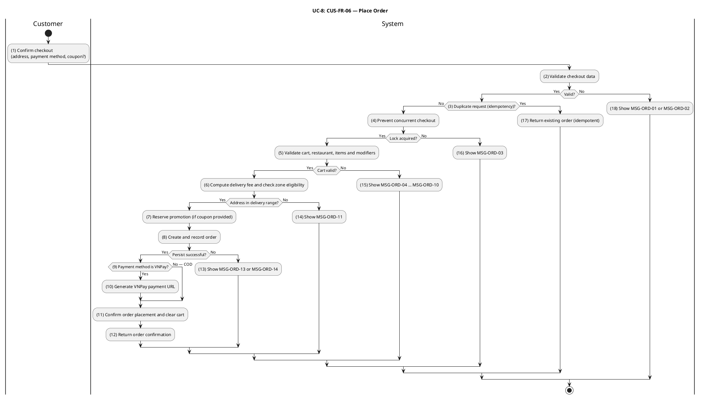

#### Business Rules

| Activity | BR Code | Description |
|---|---|---|
| _(2)_ | _BR-8.1_ | **Validate Rules:**<br>❖ `paymentMethod` must be one of `{'cod', 'vnpay'}`.<br>❖ `deliveryAddress` must satisfy address validation rules (BR-6.1).<br>❖ `note` must be ≤ 500 characters.<br>❖ `X-Idempotency-Key` (if present) must be a UUID string of 8–64 hexadecimal characters with optional hyphens.<br>❖ Invalid input returns HTTP 400 referencing `MSG-ORD-01` (general validation) or `MSG-ORD-02` (idempotency key format). |
| _(18)_ | _BR-8.2_ | **Validate Rules: — Same Requirement Application:**<br>❖ _BR-8.2_ applies the detailed requirement, validation, persistence, event, and runtime constraints specified in _BR-8.1_ to activity _(18)_.<br>❖ Message trace retained: `MSG-ORD-01`, `MSG-ORD-02`. |
| _(3)_ | _BR-8.3_ | **Idempotency Rules:**<br>❖ If an `X-Idempotency-Key` is present and a cached `orderId` already exists for that key, system returns the existing order response without re-processing.<br>❖ The idempotency record is written after successful order persistence so that partial failures do not cache a stale state. |
| _(17)_ | _BR-8.4_ | **Idempotency Rules: — Same Requirement Application:**<br>❖ _BR-8.4_ applies the detailed requirement, validation, persistence, event, and runtime constraints specified in _BR-8.3_ to activity _(17)_.<br>❖ No actor-facing message code is emitted by this activity. |
| _(4)_ | _BR-8.5_ | **Concurrency Lock Rules:**<br>❖ System acquires a Redis `SET NX` lock at `cart:<customerId>:lock` with a 30-second TTL before processing.<br>❖ If the lock is already held, system returns HTTP 409 referencing `MSG-ORD-03`.<br>❖ The lock is released in a `finally` block to guarantee release even on exception. |
| _(16)_ | _BR-8.6_ | **Concurrency Lock Rules: — Same Requirement Application:**<br>❖ _BR-8.6_ applies the detailed requirement, validation, persistence, event, and runtime constraints specified in _BR-8.5_ to activity _(16)_.<br>❖ Message trace retained: `MSG-ORD-03`. |
| _(5)_ | _BR-8.7_ | **Cart Validate Rules:**<br>❖ Cart must be non-empty. If empty, system returns HTTP 400 referencing `MSG-ORD-04`.<br>❖ The restaurant's Ordering ACL snapshot must exist. If missing, system returns HTTP 422 referencing `MSG-ORD-05`.<br>❖ Restaurant must have `isApproved = true`. If not, HTTP 422 referencing `MSG-ORD-06`.<br>❖ Restaurant must have `isOpen = true`. If not, HTTP 422 referencing `MSG-ORD-07`. |
| _(15)_ | _BR-8.8_ | **Cart Validate Rules: — Same Requirement Application:**<br>❖ _BR-8.8_ applies the detailed requirement, validation, persistence, event, and runtime constraints specified in _BR-8.7_ to activity _(15)_.<br>❖ Message trace retained: `MSG-ORD-04`, `MSG-ORD-05`, `MSG-ORD-06`, `MSG-ORD-07`. |
| _(5)_ | _BR-8.9_ | **Item and Modifier Validation Rules:**<br>❖ Each cart item's Ordering ACL snapshot must exist. Delisted item → HTTP 422 referencing `MSG-ORD-08`.<br>❖ Item's `restaurantId` in snapshot must match cart's restaurant. Mismatch → HTTP 422 referencing `MSG-ORD-09`.<br>❖ Item `status` must be `'available'`. If `'out_of_stock'` or `'unavailable'` → HTTP 422 referencing `MSG-ORD-10`.<br>❖ Modifier groups, options, availability flags, and min/max constraints are re-validated against the current ACL snapshot at checkout time. |
| _(15)_ | _BR-8.10_ | **Item and Modifier Validation Rules: — Same Requirement Application:**<br>❖ _BR-8.10_ applies the detailed requirement, validation, persistence, event, and runtime constraints specified in _BR-8.9_ to activity _(15)_.<br>❖ Message trace retained: `MSG-ORD-08`, `MSG-ORD-09`, `MSG-ORD-10`. |
| _(6)_ | _BR-8.11_ | **Delivery Pricing Rules:**<br>❖ Haversine distance is computed against the restaurant's delivery zone snapshots. The innermost eligible zone is selected (per BR-7.11).<br>❖ If the delivery address falls outside all zones → HTTP 422 referencing `MSG-ORD-11`.<br>❖ `shippingFee` is computed per BR-7.13.<br>❖ If coordinates or zone snapshots are unavailable, `shippingFee = 0` and a warning is logged (graceful degradation). |
| _(14)_ | _BR-8.12_ | **Delivery Pricing Rules: — Same Requirement Application:**<br>❖ _BR-8.12_ applies the detailed requirement, validation, persistence, event, and runtime constraints specified in _BR-8.11_ to activity _(14)_.<br>❖ Message trace retained: `MSG-ORD-11`. |
| _(7)_ | _BR-8.13_ | **Promotion Reservation Rules:**<br>❖ Promotion reservation is non-blocking. If reservation fails or returns `discountAmount = 0`, checkout continues without a discount.<br>❖ Promotion usage is confirmed after successful order persistence. Failures in confirmation are reconciled by the promotion reconciliation task. |
| _(8)_ | _BR-8.14_ | **Server-Authoritative Pricing Rules:**<br>❖ Order line `unitPrice` and modifier prices are taken from ACL snapshots at checkout time, not from the values stored at add-to-cart time.<br>❖ `itemsTotal` must be > 0. If ≤ 0 → HTTP 422 referencing `MSG-ORD-12`.<br>❖ `totalAmount = max(0, itemsTotal + shippingFee − discountAmount)`. |
| _(13)_ | _BR-8.15_ | **Server-Authoritative Pricing Rules: — Same Requirement Application:**<br>❖ _BR-8.15_ applies the detailed requirement, validation, persistence, event, and runtime constraints specified in _BR-8.14_ to activity _(13)_.<br>❖ Message trace retained: `MSG-ORD-12`. |
| _(8)_ | _BR-8.16_ | **Atomic Persistence Rules:**<br>❖ The `orders`, `order_items`, and initial `order_status_logs` row are inserted in a single database transaction.<br>❖ A `UNIQUE` constraint on `orders.cartId` prevents two orders from the same cart.<br>❖ Duplicate constraint violation → HTTP 409 referencing `MSG-ORD-13`.<br>❖ Generic database failure → HTTP 500 referencing `MSG-ORD-14`. |
| _(13)_ | _BR-8.17_ | **Atomic Persistence Rules: — Same Requirement Application:**<br>❖ _BR-8.17_ applies the detailed requirement, validation, persistence, event, and runtime constraints specified in _BR-8.16_ to activity _(13)_.<br>❖ Message trace retained: `MSG-ORD-13`, `MSG-ORD-14`. |
| _(8)_ | _BR-8.18_ | **Initial Order State Rules:**<br>❖ New order `status = 'pending'`.<br>❖ `expiresAt = now + RESTAURANT_ACCEPT_TIMEOUT_SECONDS` (default 600 s). Orders not acknowledged by the restaurant within this window are auto-cancelled by the order-timeout scheduler. |
| _(9)_ | _BR-8.19_ | **Payment Initiation Rules:**<br>❖ For `paymentMethod = 'vnpay'`: a `payment_transactions` row is created with `status = 'pending'`, and a VNPay redirect URL is generated and included in the response.<br>❖ For `paymentMethod = 'cod'`: no payment transaction is created at checkout; payment is collected at delivery.<br>❖ VNPay URL generation failure is logged but non-blocking; payment timeout reconciliation is handled by UC-9 (BR-9.11). |
| _(10)_ | _BR-8.20_ | **Payment Initiation Rules: — Same Requirement Application:**<br>❖ _BR-8.20_ applies the detailed requirement, validation, persistence, event, and runtime constraints specified in _BR-8.19_ to activity _(10)_.<br>❖ No actor-facing message code is emitted by this activity. |
| _(11)_ | _BR-8.21_ | **Post-Persistence Rules:**<br>❖ `OrderPlacedEvent` is published exactly once after successful persistence.<br>❖ Cart deletion (`cart:<customerId>`) is best-effort; failure does not invalidate the order.<br>❖ Successful response: HTTP 201 referencing `MSG-ORD-15` with payload `{ orderId, status: 'pending', totalAmount, shippingFee, discountAmount, paymentUrl?, estimatedDeliveryMinutes? }`. |
| _(12)_ | _BR-8.22_ | **Post-Persistence Rules: — Same Requirement Application:**<br>❖ _BR-8.22_ applies the detailed requirement, validation, persistence, event, and runtime constraints specified in _BR-8.21_ to activity _(12)_.<br>❖ Message trace retained: `MSG-ORD-15`. |

---

### UC-9: Make Online Payment (VNPay)

| Name            | Make Online Payment (VNPay)                                                             |
|-----------------|-----------------------------------------------------------------------------------------|
| **Description** | This use case describes how a customer completes payment through VNPay, how the system processes the IPN (Instant Payment Notification) callback, and how payment timeout is handled. |
| **Actor**       | Customer, VNPay (external payment gateway), Automated System (timeout scheduler)        |
| **Trigger**     | ❖ Customer opens the VNPay payment URL received from UC-8.<br>❖ VNPay sends an IPN to the system after the customer completes or abandons payment.<br>❖ The payment timeout process detects expired payment sessions. |
| **Pre-condition** | ❖ Order has `status = 'pending'` and `paymentMethod = 'vnpay'`.<br>❖ A `payment_transactions` row with `status = 'pending'` exists for the order. |
| **Post-condition** | ❖ Payment Success: `payment_transactions.status = 'completed'`; order transitions to `'paid'`.<br>❖ Payment Failure or Timeout: `payment_transactions.status = 'failed'`; order transitions to `'cancelled'`. |

#### Activities Flow


#### Business Rules

| Activity | BR Code | Description |
|---|---|---|
| _(5)_ | _BR-9.1_ | **Signature Verification Rules:**<br>❖ The IPN signature is verified using HMAC-SHA512 over the sorted VNPay query parameters with the merchant secret key, using a constant-time comparison to prevent timing attacks.<br>❖ Signature verification is the mandatory first step before any database access.<br>❖ Invalid signature → system returns `MSG-PAY-01` (RspCode 97). |
| _(15)_ | _BR-9.2_ | **Signature Verification Rules: — Same Requirement Application:**<br>❖ _BR-9.2_ applies the detailed requirement, validation, persistence, event, and runtime constraints specified in _BR-9.1_ to activity _(15)_.<br>❖ Message trace retained: `MSG-PAY-01`. |
| _(6)_ | _BR-9.3_ | **Transaction Lookup Rules:**<br>❖ `vnp_TxnRef` is used to resolve the `payment_transactions` record.<br>❖ If not found → system returns `MSG-PAY-02` (RspCode 01). |
| _(14)_ | _BR-9.4_ | **Transaction Lookup Rules: — Same Requirement Application:**<br>❖ _BR-9.4_ applies the detailed requirement, validation, persistence, event, and runtime constraints specified in _BR-9.3_ to activity _(14)_.<br>❖ Message trace retained: `MSG-PAY-02`. |
| _(7)_ | _BR-9.5_ | **Idempotency Rules:**<br>❖ If the transaction is already in a terminal state (`'completed'`, `'failed'`, `'refund_pending'`, `'refunded'`), system acknowledges with `MSG-PAY-06` (RspCode 00) without making any further state change. |
| _(13)_ | _BR-9.6_ | **Idempotency Rules: — Same Requirement Application:**<br>❖ _BR-9.6_ applies the detailed requirement, validation, persistence, event, and runtime constraints specified in _BR-9.5_ to activity _(13)_.<br>❖ Message trace retained: `MSG-PAY-06`. |
| _(8)_ | _BR-9.7_ | **Amount Integrity Rules:**<br>❖ `vnp_Amount` divided by 100 must exactly match `payment_transactions.amount`.<br>❖ Any mismatch marks the transaction `'failed'` and returns `MSG-PAY-03` (RspCode 04). |
| _(12)_ | _BR-9.8_ | **Amount Integrity Rules: — Same Requirement Application:**<br>❖ _BR-9.8_ applies the detailed requirement, validation, persistence, event, and runtime constraints specified in _BR-9.7_ to activity _(12)_.<br>❖ Message trace retained: `MSG-PAY-03`. |
| _(10)_ | _BR-9.9_ | **Payment Success Rules:**<br>❖ On success: `payment_transactions.status = 'completed'`, and `paidAt`, `providerTxnId`, `rawIpnPayload` are recorded.<br>❖ `PaymentConfirmedEvent` is published.<br>❖ Order lifecycle listener transitions the order from `'pending'` to `'paid'`.<br>❖ System returns `MSG-PAY-04` (RspCode 00) to stop VNPay retry attempts.<br>❖ Concurrent IPN deliveries are resolved by optimistic locking on the `version` field. A concurrency conflict returns `MSG-PAY-07` (RspCode 99), prompting VNPay to retry. |
| _(11)_ | _BR-9.10_ | **Payment Failure Rules:**<br>❖ On VNPay failure response: `payment_transactions.status = 'failed'`, `vnpResponseCode`, and `rawIpnPayload` are recorded.<br>❖ `PaymentFailedEvent` is published.<br>❖ Order lifecycle listener transitions the order from `'pending'` to `'cancelled'`.<br>❖ System returns `MSG-PAY-05` (RspCode 00) to stop VNPay retry attempts. |
| _(16)_ | _BR-9.11_ | **Payment Timeout Rules:**<br>❖ `payment_transactions.expiresAt = now + PAYMENT_SESSION_TIMEOUT_SECONDS`.<br>❖ `PaymentTimeoutTask` queries transactions with `status ∈ {'pending', 'awaiting_ipn'}` AND `expiresAt < now`. For each matching record, the task marks the transaction `'failed'`, publishes `PaymentFailedEvent`, and triggers order cancellation. |
| _(17)_ | _BR-9.12_ | **Payment Timeout Rules: — Same Requirement Application:**<br>❖ _BR-9.12_ applies the detailed requirement, validation, persistence, event, and runtime constraints specified in _BR-9.11_ to activity _(17)_.<br>❖ No actor-facing message code is emitted by this activity. |
| _(4)_ | _BR-9.13_ | **Return URL Rules:**<br>❖ The browser return URL (`/payments/vnpay/return`) is read-only. It verifies the signature and reads transaction status for UI feedback only.<br>❖ The return URL must never mutate database state. Authoritative payment outcome is determined exclusively by the IPN endpoint. |

---

### UC-10: View Order History

| Name            | View Order History                                                                      |
|-----------------|-----------------------------------------------------------------------------------------|
| **Description** | This use case describes how a customer views their past orders, retrieves a detailed view of a specific order (including the status audit log), and initiates a reorder. |
| **Actor**       | Customer (authenticated, role `'user'`)                                                  |
| **Trigger**     | ❖ Customer navigates to the "Orders" or "Order History" screen.<br>❖ Customer selects a past order for detail.<br>❖ Customer taps "Reorder" on a past order. |
| **Pre-condition** | ❖ Customer is authenticated. |
| **Post-condition** | ❖ List: system returns a paginated list of the customer's orders.<br>❖ Detail: system returns the full order with item list and status audit log.<br>❖ Reorder: system returns a cart-shaped payload ready for the customer to submit via UC-4. |

#### Activities Flow

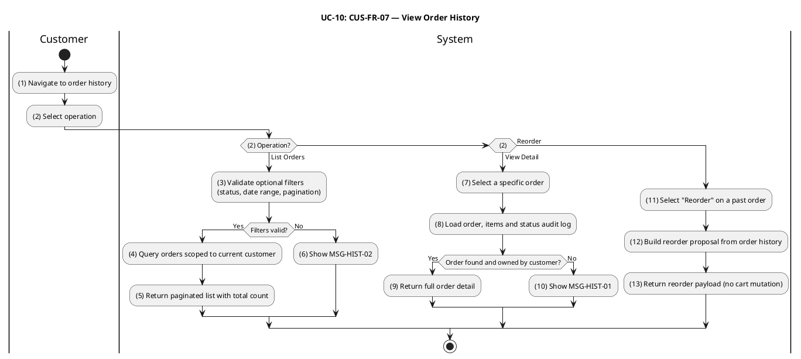

#### Business Rules

| Activity | BR Code | Description |
|---|---|---|
| _(3)_ | _BR-10.1_ | **Filter Validate Rules:**<br>❖ `status` (if supplied) must match a canonical order status enum value (`'pending'`, `'paid'`, `'confirmed'`, `'preparing'`, `'ready_for_pickup'`, `'picked_up'`, `'delivering'`, `'delivered'`, `'cancelled'`, `'refunded'`).<br>❖ When both `minDate` and `maxDate` are supplied, `minDate ≤ maxDate` must hold.<br>❖ `limit` must be in [1, 100]; `offset` must be ≥ 0.<br>❖ Invalid filter values return HTTP 400 referencing `MSG-HIST-02`. |
| _(6)_ | _BR-10.2_ | **Filter Validate Rules: — Same Requirement Application:**<br>❖ _BR-10.2_ applies the detailed requirement, validation, persistence, event, and runtime constraints specified in _BR-10.1_ to activity _(6)_.<br>❖ Message trace retained: `MSG-HIST-02`. |
| _(4)_ | _BR-10.3_ | **Ownership Scoping Rules:**<br>❖ The query is hard-scoped by `customerId = session.user.id`. No `customerId` query parameter is accepted from the client.<br>❖ Results are ordered by `createdAt DESC`.<br>❖ `total` reflects the full match count before pagination. |
| _(5)_ | _BR-10.4_ | **Ownership Scoping Rules: — Same Requirement Application:**<br>❖ _BR-10.4_ applies the detailed requirement, validation, persistence, event, and runtime constraints specified in _BR-10.3_ to activity _(5)_.<br>❖ No actor-facing message code is emitted by this activity. |
| _(4)_ | _BR-10.5_ | **List Summary Aggregation Rules:**<br>❖ Each order row in the list response includes `itemCount` (sum of `order_items.quantity` for that order) and `firstItemName` (the name of the line item with the lowest insertion order). |
| _(8)_ | _BR-10.6_ | **Order Access Rules:**<br>❖ System loads the order by ID. If the order does not exist, or it exists but belongs to a different customer, system returns HTTP 404 referencing `MSG-HIST-01`.<br>❖ A uniform 404 is returned in both cases to prevent ownership disclosure. |
| _(10)_ | _BR-10.7_ | **Order Access Rules: — Same Requirement Application:**<br>❖ _BR-10.7_ applies the detailed requirement, validation, persistence, event, and runtime constraints specified in _BR-10.6_ to activity _(10)_.<br>❖ Message trace retained: `MSG-HIST-01`. |
| _(8)_ | _BR-10.8_ | **Detail Completeness Rules:**<br>❖ The detail response includes the complete `order_status_logs` array in chronological order.<br>❖ Each log entry includes: `fromStatus`, `toStatus`, `triggeredByRole`, optional `note`, and `createdAt`. |
| _(9)_ | _BR-10.9_ | **Detail Completeness Rules: — Same Requirement Application:**<br>❖ _BR-10.9_ applies the detailed requirement, validation, persistence, event, and runtime constraints specified in _BR-10.8_ to activity _(9)_.<br>❖ No actor-facing message code is emitted by this activity. |
| _(12)_ | _BR-10.10_ | **Reorder Rules:**<br>❖ No server-side cart mutation occurs during reorder. System returns a cart-shaped payload derived from the historical `order_items` data.<br>❖ The client uses this payload to call UC-4 (Add Item to Cart).<br>❖ Historical prices and item names in the reorder payload may not reflect the current catalog. UC-4 re-validates all items, modifiers, and prices against the current ACL snapshot at the point of submission. |
| _(13)_ | _BR-10.11_ | **Reorder Rules: — Same Requirement Application:**<br>❖ _BR-10.11_ applies the detailed requirement, validation, persistence, event, and runtime constraints specified in _BR-10.10_ to activity _(13)_.<br>❖ No actor-facing message code is emitted by this activity. |

---

### Restaurant & Delivery Operations (UC-11 – UC-19)

This section covers the operational use cases of the two supply-side actors that complete the platform: the **Restaurant Partner** (who owns the catalog and prepares orders) and the **Delivery Personnel** (also referred to as **Shipper**, who fulfils last-mile delivery). These use cases share the underlying `order_status` state machine, the Restaurant–Ordering ACL snapshot mechanism (D3-B), and the authentication and authorization stack established in UC-1.

---

### UC-11: Restaurant Registration & Profile Management

| Field | Detail |
|---|---|
| **Use Case ID — Name** | RES-FR-01 — Restaurant Registration & Profile Management |
| **Actor** | Restaurant Partner, Administrator |
| **Trigger** | ❖ Restaurant Partner submits **Register Restaurant** form after signing in with role `restaurant`.<br>❖ Restaurant Partner edits restaurant profile (`PATCH /restaurants/:id`).<br>❖ Administrator approves or unapproves a restaurant (`PATCH /restaurants/:id/{approve,unapprove}`). |
| **Description** | Registers a new restaurant entity owned by the authenticated partner, lets the owner maintain its profile (name, description, address, phone, geo-coordinates, cuisine type, logo and cover images), and lets an administrator decide whether the restaurant is publicly visible. Newly registered restaurants are created with `isApproved = false` and `isOpen = false` and remain invisible to customer discovery (UC-2) until both flags are set to `true`. Every mutation publishes a `RestaurantUpdatedEvent` that synchronises the Ordering ACL snapshot. |
| **Pre-condition** | ❖ Actor is authenticated.<br>❖ For self-service registration and profile update: actor has role `restaurant` (or `admin`).<br>❖ For approve / unapprove: actor has role `admin`. |
| **Post-condition** | ❖ Registration: a new `restaurants` row exists with `ownerId = session.user.id`, `isApproved = false`, `isOpen = false`; `RestaurantUpdatedEvent` is published.<br>❖ Profile update: the row reflects the new field values; `RestaurantUpdatedEvent` is published.<br>❖ Approve / unapprove: `isApproved` is set accordingly; `RestaurantUpdatedEvent` is published; customer discovery results (UC-2) reflect the new visibility on the next query. |

#### Activities Flow

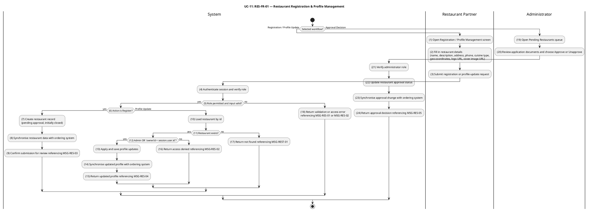

#### Business Rules

| Activity | BR Code | Description |
|---|---|---|
| _(3)_ | _BR-11.1_ | **Validate Rules (Registration / Profile Update):**<br>❖ `name`, `address` and `phone` are required and non-empty.<br>❖ `phone` must match the Vietnamese mobile or landline format accepted by the platform validator.<br>❖ If `latitude` and `longitude` are supplied, both must be present together and must lie inside Vietnam (latitude in [8.0, 24.0], longitude in [102.0, 110.0]).<br>❖ `logoUrl` and `coverImageUrl` (when supplied) must reference an existing image record produced by the Image module.<br>❖ Invalid input returns HTTP 400 referencing `MSG-RES-01`. |
| _(4)_ | _BR-11.2_ | **Validate Rules (Registration / Profile Update): — Same Requirement Application:**<br>❖ _BR-11.2_ applies the detailed requirement, validation, persistence, event, and runtime constraints specified in _BR-11.1_ to activity _(4)_.<br>❖ Message trace retained: `MSG-RES-01`. |
| _(5)_ | _BR-11.3_ | **Validate Rules (Registration / Profile Update): — Same Requirement Application:**<br>❖ _BR-11.3_ applies the detailed requirement, validation, persistence, event, and runtime constraints specified in _BR-11.1_ to activity _(5)_.<br>❖ Message trace retained: `MSG-RES-01`. |
| _(4)_ | _BR-11.4_ | **Authorization Rules:**<br>❖ `POST /restaurants` and `PATCH /restaurants/:id` require role `restaurant` or `admin`; otherwise HTTP 403 referencing `MSG-RES-02`.<br>❖ `PATCH /restaurants/:id/approve` and `PATCH /restaurants/:id/unapprove` require role `admin`; otherwise HTTP 403 referencing `MSG-RES-02`. |
| _(5)_ | _BR-11.5_ | **Authorization Rules: — Same Requirement Application:**<br>❖ _BR-11.5_ applies the detailed requirement, validation, persistence, event, and runtime constraints specified in _BR-11.4_ to activity _(5)_.<br>❖ Message trace retained: `MSG-RES-02`. |
| _(21)_ | _BR-11.6_ | **Authorization Rules: — Same Requirement Application:**<br>❖ _BR-11.6_ applies the detailed requirement, validation, persistence, event, and runtime constraints specified in _BR-11.4_ to activity _(21)_.<br>❖ Message trace retained: `MSG-RES-02`. |
| _(7)_ | _BR-11.7_ | **Default Visibility Rules (BR-1, Partner Verification):**<br>❖ A newly created restaurant always has `isApproved = false` and `isOpen = false`, regardless of any client-supplied value for those fields.<br>❖ The restaurant is excluded from public discovery (UC-2) until an administrator approves it and the partner opens it (UC-13).<br>❖ The HTTP 201 response references `MSG-RES-03` to inform the partner that the submission is pending administrator review. |
| _(10)_ | _BR-11.8_ | **Ownership Rules:**<br>❖ For role `restaurant`, the update is allowed only when the persisted `restaurants.ownerId` equals `session.user.id`; otherwise HTTP 403 referencing `MSG-RES-02`.<br>❖ For role `admin`, the ownership check is bypassed and any restaurant can be edited.<br>❖ A non-existent `:id` returns HTTP 404 referencing `MSG-REST-01`.<br>❖ A successful profile update returns HTTP 200 referencing `MSG-RES-04`. |
| _(11)_ | _BR-11.9_ | **Ownership Rules: — Same Requirement Application:**<br>❖ _BR-11.9_ applies the detailed requirement, validation, persistence, event, and runtime constraints specified in _BR-11.8_ to activity _(11)_.<br>❖ Message trace retained: `MSG-RES-02`, `MSG-RES-04`, `MSG-REST-01`. |
| _(12)_ | _BR-11.10_ | **Ownership Rules: — Same Requirement Application:**<br>❖ _BR-11.10_ applies the detailed requirement, validation, persistence, event, and runtime constraints specified in _BR-11.8_ to activity _(12)_.<br>❖ Message trace retained: `MSG-RES-02`, `MSG-RES-04`, `MSG-REST-01`. |
| _(13)_ | _BR-11.11_ | **Ownership Rules: — Same Requirement Application:**<br>❖ _BR-11.11_ applies the detailed requirement, validation, persistence, event, and runtime constraints specified in _BR-11.8_ to activity _(13)_.<br>❖ Message trace retained: `MSG-RES-02`, `MSG-RES-04`, `MSG-REST-01`. |
| _(14)_ | _BR-11.12_ | **Ownership Rules: — Same Requirement Application:**<br>❖ _BR-11.12_ applies the detailed requirement, validation, persistence, event, and runtime constraints specified in _BR-11.8_ to activity _(14)_.<br>❖ Message trace retained: `MSG-RES-02`, `MSG-RES-04`, `MSG-REST-01`. |
| _(15)_ | _BR-11.13_ | **Ownership Rules: — Same Requirement Application:**<br>❖ _BR-11.13_ applies the detailed requirement, validation, persistence, event, and runtime constraints specified in _BR-11.8_ to activity _(15)_.<br>❖ Message trace retained: `MSG-RES-02`, `MSG-RES-04`, `MSG-REST-01`. |
| _(16)_ | _BR-11.14_ | **Ownership Rules: — Same Requirement Application:**<br>❖ _BR-11.14_ applies the detailed requirement, validation, persistence, event, and runtime constraints specified in _BR-11.8_ to activity _(16)_.<br>❖ Message trace retained: `MSG-RES-02`, `MSG-RES-04`, `MSG-REST-01`. |
| _(8)_ | _BR-11.15_ | **Event Synchronisation Rules:**<br>❖ Every successful create, update, approve, and unapprove publishes `RestaurantUpdatedEvent` containing the latest persisted state.<br>❖ The event is consumed by the Ordering ACL projector to refresh the restaurant snapshot used by UC-8 (Place Order) and by ownership checks in UC-14 / UC-15. |
| _(14)_ | _BR-11.16_ | **Event Synchronisation Rules: — Same Requirement Application:**<br>❖ _BR-11.16_ applies the detailed requirement, validation, persistence, event, and runtime constraints specified in _BR-11.15_ to activity _(14)_.<br>❖ No actor-facing message code is emitted by this activity. |
| _(23)_ | _BR-11.17_ | **Event Synchronisation Rules: — Same Requirement Application:**<br>❖ _BR-11.17_ applies the detailed requirement, validation, persistence, event, and runtime constraints specified in _BR-11.15_ to activity _(23)_.<br>❖ No actor-facing message code is emitted by this activity. |
| _(22)_ | _BR-11.18_ | **Visibility Activation Rules:**<br>❖ `isApproved` is set atomically by the admin approval/unapproval endpoint; the HTTP 200 response references `MSG-RES-05`.<br>❖ A restaurant appears in public discovery (UC-2) only when `isApproved = true` AND `isOpen = true`.<br>❖ Unapproving an already-public restaurant immediately removes it from discovery; in-flight orders are not affected. |
| _(23)_ | _BR-11.19_ | **Visibility Activation Rules: — Same Requirement Application:**<br>❖ _BR-11.19_ applies the detailed requirement, validation, persistence, event, and runtime constraints specified in _BR-11.18_ to activity _(23)_.<br>❖ Message trace retained: `MSG-RES-05`. |
| _(24)_ | _BR-11.20_ | **Visibility Activation Rules: — Same Requirement Application:**<br>❖ _BR-11.20_ applies the detailed requirement, validation, persistence, event, and runtime constraints specified in _BR-11.18_ to activity _(24)_.<br>❖ Message trace retained: `MSG-RES-05`. |

---

### UC-12: Manage Menu Catalog

| Field | Detail |
|---|---|
| **Use Case ID — Name** | RES-FR-02, RES-FR-03 — Manage Menu Catalog (categories, items, modifier groups, modifier options) |
| **Actor** | Restaurant Partner, Administrator |
| **Trigger** | ❖ Restaurant Partner creates / updates / deletes a menu category, menu item, modifier group, or modifier option via the partner console (`POST`, `PATCH`, `DELETE` on `/menu-items`, `/menu-items/categories`, `/menu-items/:id/modifier-groups`, and `/.../options`). |
| **Description** | Provides authenticated catalog maintenance for a single restaurant. The use case covers per-restaurant **menu categories**, **menu items** (with price stored as integer VND, optional SKU, optional category, tag array, image URL, and an availability `status` ∈ {`available`, `unavailable`, `out_of_stock`}), and the two-level **modifier model** (modifier groups with `minSelections`/`maxSelections` constraints and modifier options with their own price and availability flag). Every mutation re-publishes a `MenuItemUpdatedEvent` with the full modifier snapshot so the Ordering ACL stays consistent with what customers see during checkout (UC-8). |
| **Pre-condition** | ❖ Actor is authenticated.<br>❖ Actor has role `restaurant` or `admin`.<br>❖ For a `restaurant` actor: the menu item / category / modifier resource ultimately belongs to a restaurant whose `ownerId = session.user.id`. |
| **Post-condition** | ❖ The catalog row is created, updated or removed in the corresponding table (`menu_categories`, `menu_items`, `modifier_groups`, `modifier_options`).<br>❖ `MenuItemUpdatedEvent` is published with the latest persisted state and full modifier snapshot for every affected menu item.<br>❖ The Ordering ACL projector refreshes its local snapshot, so subsequent calls to UC-4 / UC-8 use the new catalog values. |

#### Activities Flow

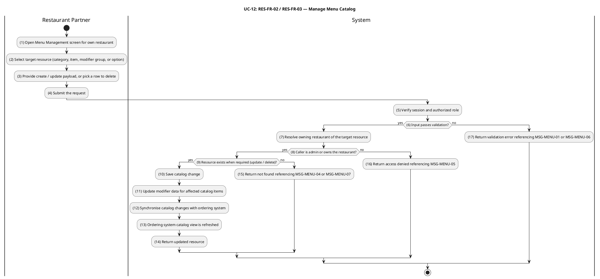

#### Business Rules

| Activity | BR Code | Description |
|---|---|---|
| _(4)_ | _BR-12.1_ | **Validate Rules (Menu Item):**<br>❖ `name` is required and non-empty.<br>❖ `price` is required and must be a non-negative integer (VND, no fractional units).<br>❖ `restaurantId` is required and must reference an existing restaurant.<br>❖ `categoryId` (if supplied) must reference a category that belongs to the same `restaurantId`.<br>❖ `tags` (if supplied) must be an array of non-empty strings.<br>❖ Invalid input returns HTTP 400 referencing `MSG-MENU-01`. |
| _(5)_ | _BR-12.2_ | **Validate Rules (Menu Item): — Same Requirement Application:**<br>❖ _BR-12.2_ applies the detailed requirement, validation, persistence, event, and runtime constraints specified in _BR-12.1_ to activity _(5)_.<br>❖ Message trace retained: `MSG-MENU-01`. |
| _(6)_ | _BR-12.3_ | **Validate Rules (Menu Item): — Same Requirement Application:**<br>❖ _BR-12.3_ applies the detailed requirement, validation, persistence, event, and runtime constraints specified in _BR-12.1_ to activity _(6)_.<br>❖ Message trace retained: `MSG-MENU-01`. |
| _(4)_ | _BR-12.4_ | **Validate Rules (Menu Category):**<br>❖ `name` is required and non-empty.<br>❖ `displayOrder` (if supplied) must be a non-negative integer.<br>❖ The pair `(restaurantId, name)` must be unique; a duplicate returns HTTP 409 referencing `MSG-MENU-03`.<br>❖ Invalid input returns HTTP 400 referencing `MSG-MENU-01`. |
| _(5)_ | _BR-12.5_ | **Validate Rules (Menu Category): — Same Requirement Application:**<br>❖ _BR-12.5_ applies the detailed requirement, validation, persistence, event, and runtime constraints specified in _BR-12.4_ to activity _(5)_.<br>❖ Message trace retained: `MSG-MENU-01`, `MSG-MENU-03`. |
| _(6)_ | _BR-12.6_ | **Validate Rules (Menu Category): — Same Requirement Application:**<br>❖ _BR-12.6_ applies the detailed requirement, validation, persistence, event, and runtime constraints specified in _BR-12.4_ to activity _(6)_.<br>❖ Message trace retained: `MSG-MENU-01`, `MSG-MENU-03`. |
| _(4)_ | _BR-12.7_ | **Validate Rules (Modifier Group & Option):**<br>❖ `minSelections` ≥ 0 and `maxSelections` ≥ `minSelections`; otherwise HTTP 400 referencing `MSG-MENU-06`.<br>❖ Modifier option `price` is a non-negative integer (VND); `0` denotes a free option.<br>❖ A modifier option must belong to a modifier group that belongs to the same menu item indicated in the URL; otherwise HTTP 404 referencing `MSG-MENU-07`. |
| _(5)_ | _BR-12.8_ | **Validate Rules (Modifier Group & Option): — Same Requirement Application:**<br>❖ _BR-12.8_ applies the detailed requirement, validation, persistence, event, and runtime constraints specified in _BR-12.7_ to activity _(5)_.<br>❖ Message trace retained: `MSG-MENU-06`, `MSG-MENU-07`. |
| _(6)_ | _BR-12.9_ | **Validate Rules (Modifier Group & Option): — Same Requirement Application:**<br>❖ _BR-12.9_ applies the detailed requirement, validation, persistence, event, and runtime constraints specified in _BR-12.7_ to activity _(6)_.<br>❖ Message trace retained: `MSG-MENU-06`, `MSG-MENU-07`. |
| _(7)_ | _BR-12.10_ | **Ownership Rules:**<br>❖ For role `restaurant`, mutations are allowed only when the owning restaurant's `ownerId = session.user.id`; otherwise HTTP 403 referencing `MSG-MENU-05`.<br>❖ For role `admin`, ownership is bypassed and any restaurant's catalog can be edited.<br>❖ Ownership is resolved transitively for modifier groups and options: `option → group → menuItem → restaurant`. |
| _(8)_ | _BR-12.11_ | **Ownership Rules: — Same Requirement Application:**<br>❖ _BR-12.11_ applies the detailed requirement, validation, persistence, event, and runtime constraints specified in _BR-12.10_ to activity _(8)_.<br>❖ Message trace retained: `MSG-MENU-05`. |
| _(9)_ | _BR-12.12_ | **Resource Existence Rules:**<br>❖ Update / delete on a non-existent menu item returns HTTP 404 referencing `MSG-MENU-04`.<br>❖ Update / delete on a non-existent menu category returns HTTP 404 referencing `MSG-MENU-02`.<br>❖ Update / delete on a non-existent modifier group or option returns HTTP 404 referencing `MSG-MENU-07`.<br>❖ Deleting a menu category cascades by clearing `categoryId` on all items in that category; the items remain published and no `MenuItemUpdatedEvent` is emitted for the re-categorised items.<br>❖ Deleting a menu item cascades to its modifier groups and options and publishes `MenuItemUpdatedEvent` with `status = 'unavailable'` to invalidate the ACL snapshot. |
| _(15)_ | _BR-12.13_ | **Resource Existence Rules: — Same Requirement Application:**<br>❖ _BR-12.13_ applies the detailed requirement, validation, persistence, event, and runtime constraints specified in _BR-12.12_ to activity _(15)_.<br>❖ Message trace retained: `MSG-MENU-02`, `MSG-MENU-04`, `MSG-MENU-07`. |
| _(10)_ | _BR-12.14_ | **Event Synchronisation Rules:**<br>❖ Every successful menu-item, modifier-group, and modifier-option mutation publishes `MenuItemUpdatedEvent` for the affected item, carrying `id`, `restaurantId`, `name`, `price`, and `status`.<br>❖ The `modifiers` payload differs by operation: modifier-group and modifier-option mutations re-fetch the complete current modifier snapshot and publish it as a populated array; menu-item field-only updates (price, name, tags, category) publish `modifiers = null`, signalling the ACL projector to preserve the existing modifier snapshot unchanged.<br>❖ Deleting a menu item publishes `MenuItemUpdatedEvent` with `status = 'unavailable'` and `modifiers = []` (empty array) to invalidate the ACL snapshot entry.<br>❖ Menu-category create, update, and delete operations do NOT publish `MenuItemUpdatedEvent`; affected items retain their existing ACL snapshots. |
| _(11)_ | _BR-12.15_ | **Event Synchronisation Rules: — Same Requirement Application:**<br>❖ _BR-12.15_ applies the detailed requirement, validation, persistence, event, and runtime constraints specified in _BR-12.14_ to activity _(11)_.<br>❖ No actor-facing message code is emitted by this activity. |
| _(12)_ | _BR-12.16_ | **Event Synchronisation Rules: — Same Requirement Application:**<br>❖ _BR-12.16_ applies the detailed requirement, validation, persistence, event, and runtime constraints specified in _BR-12.14_ to activity _(12)_.<br>❖ No actor-facing message code is emitted by this activity. |
| _(13)_ | _BR-12.17_ | **Event Synchronisation Rules: — Same Requirement Application:**<br>❖ _BR-12.17_ applies the detailed requirement, validation, persistence, event, and runtime constraints specified in _BR-12.14_ to activity _(13)_.<br>❖ No actor-facing message code is emitted by this activity. |

---

### UC-13: Toggle Item & Restaurant Availability

| Field | Detail |
|---|---|
| **Use Case ID — Name** | RES-FR-04 — Toggle Item & Restaurant Availability |
| **Actor** | Restaurant Partner, Administrator |
| **Trigger** | ❖ Restaurant Partner toggles a menu item's sold-out flag (`PATCH /menu-items/:id/toggle-sold-out`).<br>❖ Restaurant Partner opens or closes the restaurant (sets `isOpen` via `PATCH /restaurants/:id`). |
| **Description** | Lets the partner control catalog availability in real time without rewriting the menu. A single menu item can be flipped between `available` and `out_of_stock`; an item explicitly marked `unavailable` is treated as taken down and cannot be sold-out-toggled. The restaurant as a whole can be opened or closed by toggling `isOpen`. Both operations propagate immediately to the customer surfaces via `RestaurantUpdatedEvent` / `MenuItemUpdatedEvent` (BR-8 *Real-time Availability Control*). |
| **Pre-condition** | ❖ Actor is authenticated.<br>❖ Actor has role `restaurant` or `admin`.<br>❖ For a `restaurant` actor: the target restaurant (or the restaurant that owns the target item) has `ownerId = session.user.id`.<br>❖ For sold-out toggle: the item's current `status` is not `unavailable`. |
| **Post-condition** | ❖ Menu item: `status` flips between `available` and `out_of_stock`; `MenuItemUpdatedEvent` is published.<br>❖ Restaurant: `isOpen` is set to the new value; `RestaurantUpdatedEvent` is published.<br>❖ Customer surfaces (UC-2 discovery, UC-4 add to cart, UC-8 place order) reflect the change on their next call. |

#### Activities Flow

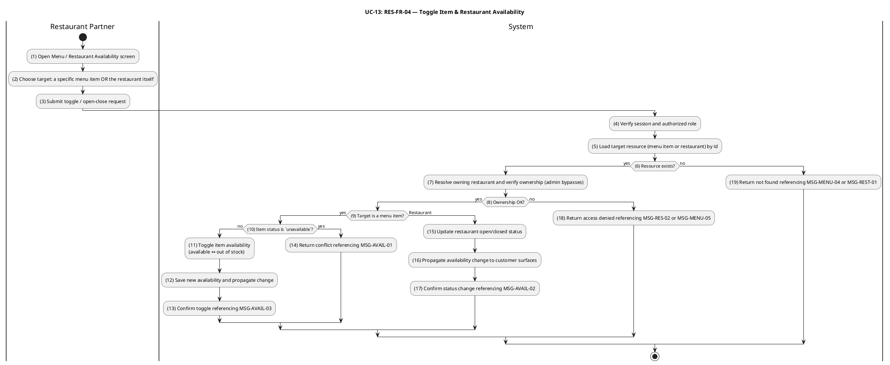

#### Business Rules

| Activity | BR Code | Description |
|---|---|---|
| _(4)_ | _BR-13.1_ | **Authorization & Ownership Rules:**<br>❖ Endpoints require role `restaurant` or `admin`.<br>❖ For role `restaurant`, the operation is allowed only when `restaurants.ownerId = session.user.id` (resolved transitively for menu-item operations via `menuItem → restaurant`); otherwise HTTP 403 referencing `MSG-RES-02` (restaurant scope) or `MSG-MENU-05` (item scope). |
| _(7)_ | _BR-13.2_ | **Authorization & Ownership Rules: — Same Requirement Application:**<br>❖ _BR-13.2_ applies the detailed requirement, validation, persistence, event, and runtime constraints specified in _BR-13.1_ to activity _(7)_.<br>❖ Message trace retained: `MSG-MENU-05`, `MSG-RES-02`. |
| _(8)_ | _BR-13.3_ | **Authorization & Ownership Rules: — Same Requirement Application:**<br>❖ _BR-13.3_ applies the detailed requirement, validation, persistence, event, and runtime constraints specified in _BR-13.1_ to activity _(8)_.<br>❖ Message trace retained: `MSG-MENU-05`, `MSG-RES-02`. |
| _(10)_ | _BR-13.4_ | **Item Sold-Out Toggle Rules:**<br>❖ The toggle alternates between `available` and `out_of_stock` only.<br>❖ If the item's current `status` is `unavailable`, the request is rejected with HTTP 409 referencing `MSG-AVAIL-01`; the item must be re-published via UC-12 before the sold-out toggle can be applied.<br>❖ A successful toggle returns HTTP 200 with the updated item, referencing `MSG-AVAIL-03`. |
| _(11)_ | _BR-13.5_ | **Item Sold-Out Toggle Rules: — Same Requirement Application:**<br>❖ _BR-13.5_ applies the detailed requirement, validation, persistence, event, and runtime constraints specified in _BR-13.4_ to activity _(11)_.<br>❖ Message trace retained: `MSG-AVAIL-01`, `MSG-AVAIL-03`. |
| _(12)_ | _BR-13.6_ | **Item Sold-Out Toggle Rules: — Same Requirement Application:**<br>❖ _BR-13.6_ applies the detailed requirement, validation, persistence, event, and runtime constraints specified in _BR-13.4_ to activity _(12)_.<br>❖ Message trace retained: `MSG-AVAIL-01`, `MSG-AVAIL-03`. |
| _(13)_ | _BR-13.7_ | **Item Sold-Out Toggle Rules: — Same Requirement Application:**<br>❖ _BR-13.7_ applies the detailed requirement, validation, persistence, event, and runtime constraints specified in _BR-13.4_ to activity _(13)_.<br>❖ Message trace retained: `MSG-AVAIL-01`, `MSG-AVAIL-03`. |
| _(13)_ | _BR-13.8_ | **Restaurant Open/Close Rules:**<br>❖ `isOpen` is the single field that controls "currently accepting orders" for an approved restaurant.<br>❖ Setting `isOpen = false` does not affect already-placed orders (UC-14 / UC-15 continue to process them).<br>❖ Setting `isOpen = false` while `isApproved = true` keeps the restaurant in the public catalog but flags it as not currently serving on customer surfaces. |
| _(14)_ | _BR-13.9_ | **Restaurant Open/Close Rules: — Same Requirement Application:**<br>❖ _BR-13.9_ applies the detailed requirement, validation, persistence, event, and runtime constraints specified in _BR-13.8_ to activity _(14)_.<br>❖ No actor-facing message code is emitted by this activity. |
| _(15)_ | _BR-13.10_ | **Restaurant Open/Close Rules: — Same Requirement Application:**<br>❖ _BR-13.10_ applies the detailed requirement, validation, persistence, event, and runtime constraints specified in _BR-13.8_ to activity _(15)_.<br>❖ No actor-facing message code is emitted by this activity. |
| _(12)_ | _BR-13.11_ | **Real-Time Propagation Rules (BR-8):**<br>❖ Every successful operation synchronously publishes the corresponding domain event (`MenuItemUpdatedEvent` for items, `RestaurantUpdatedEvent` for restaurants).<br>❖ The Ordering ACL projector refreshes its local snapshot in response, so subsequent UC-4 / UC-8 calls reject items that are no longer `available` and restaurants that are closed. |
| _(16)_ | _BR-13.12_ | **Real-Time Propagation Rules (BR-8): — Same Requirement Application:**<br>❖ _BR-13.12_ applies the detailed requirement, validation, persistence, event, and runtime constraints specified in _BR-13.11_ to activity _(16)_.<br>❖ No actor-facing message code is emitted by this activity. |
| _(5)_ | _BR-13.13_ | **Resource Existence Rules:**<br>❖ A sold-out toggle on a non-existent menu item returns HTTP 404 referencing `MSG-MENU-04`.<br>❖ An open/close request referencing a non-existent restaurant returns HTTP 404 referencing `MSG-REST-01`. |
| _(6)_ | _BR-13.14_ | **Resource Existence Rules: — Same Requirement Application:**<br>❖ _BR-13.14_ applies the detailed requirement, validation, persistence, event, and runtime constraints specified in _BR-13.13_ to activity _(6)_.<br>❖ Message trace retained: `MSG-MENU-04`, `MSG-REST-01`. |
| _(19)_ | _BR-13.15_ | **Resource Existence Rules: — Same Requirement Application:**<br>❖ _BR-13.15_ applies the detailed requirement, validation, persistence, event, and runtime constraints specified in _BR-13.13_ to activity _(19)_.<br>❖ Message trace retained: `MSG-MENU-04`, `MSG-REST-01`. |

---

### UC-14: Accept or Reject Order

| Field | Detail |
|---|---|
| **Use Case ID — Name** | RES-FR-05 — Accept or Reject Order |
| **Actor** | Restaurant Partner, Administrator |
| **Trigger** | ❖ Restaurant Partner accepts a new order (`PATCH /orders/:id/confirm`) — transitions `pending → confirmed` (T-01, COD) or `paid → confirmed` (T-04, VNPay paid).<br>❖ Restaurant Partner rejects a new order (`PATCH /orders/:id/cancel` with a reason note) — transitions `pending → cancelled` (T-03), `paid → cancelled` (T-05), or `confirmed → cancelled` (T-07). |
| **Description** | Authorises the restaurant to decide whether an incoming order proceeds. Acceptance moves the order into `confirmed`, after which UC-15 (Prepare Order for Pickup) becomes the only forward path. Rejection requires a reason note for the audit log, and — for VNPay-paid orders cancelled from `paid` or `confirmed` — automatically triggers the refund pipeline by publishing `OrderCancelledAfterPaymentEvent`. All transitions are routed through the central CQRS `TransitionOrderCommand`, which enforces role, ownership, state validity, and optimistic locking (`version` column). |
| **Pre-condition** | ❖ Actor is authenticated.<br>❖ Actor has role `restaurant` (limited to own restaurant's orders) or `admin` (any order).<br>❖ The order is in a state that allows the requested transition: `pending` (for T-01 / T-03), `paid` (for T-04 / T-05), or `confirmed` (for T-07).<br>❖ For T-01 by role `restaurant`: `order.paymentMethod = 'cod'`.<br>❖ For cancel transitions: a non-empty `reason` note is supplied. |
| **Post-condition** | ❖ `orders.status` is updated; `orders.version` is incremented atomically.<br>❖ A new `order_status_logs` row records `fromStatus`, `toStatus`, `triggeredBy`, `triggeredByRole`, and `note` (if any).<br>❖ `OrderStatusChangedEvent` is published after commit.<br>❖ For T-05 / T-07 on a VNPay order: `OrderCancelledAfterPaymentEvent` is published, which drives the refund pipeline (see UC-25). |

#### Activities Flow

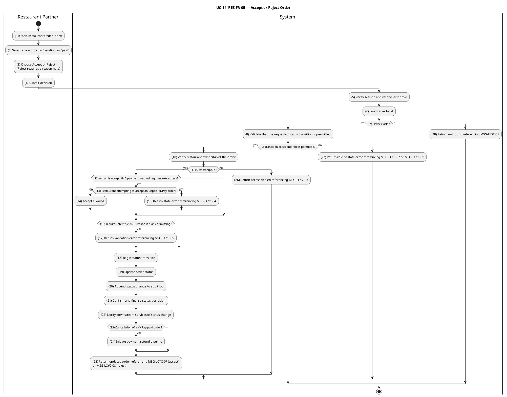

#### Business Rules

| Activity | BR Code | Description |
|---|---|---|
| _(5)_ | _BR-14.1_ | **Order Loading Rules:**<br>❖ The order is loaded by id. A non-existent id returns HTTP 404 referencing `MSG-HIST-01`.<br>❖ Idempotency: if the order is already in the requested target status, the system returns the order unchanged (no new audit row, no event). |
| _(6)_ | _BR-14.2_ | **Order Loading Rules: — Same Requirement Application:**<br>❖ _BR-14.2_ applies the detailed requirement, validation, persistence, event, and runtime constraints specified in _BR-14.1_ to activity _(6)_.<br>❖ Message trace retained: `MSG-HIST-01`. |
| _(28)_ | _BR-14.3_ | **Order Loading Rules: — Same Requirement Application:**<br>❖ _BR-14.3_ applies the detailed requirement, validation, persistence, event, and runtime constraints specified in _BR-14.1_ to activity _(28)_.<br>❖ Message trace retained: `MSG-HIST-01`. |
| _(8)_ | _BR-14.4_ | **Transition Validity Rules:**<br>❖ Allowed transitions for this UC (restaurant / admin actors): T-01 (`pending → confirmed`), T-03 (`pending → cancelled`), T-04 (`paid → confirmed`), T-05 (`paid → cancelled`), T-07 (`confirmed → cancelled`).<br>❖ T-03 and T-05 additionally allow roles `customer` and `system` per the TRANSITIONS map; `customer`-initiated cancellation is specified in UC-21 (Cancel Order). `system`-initiated cancellation is triggered by the order-timeout scheduler and does not route through this use-case endpoint.<br>❖ Any other `(fromStatus, toStatus)` pair returns HTTP 422 referencing `MSG-LCYC-01`.<br>❖ Each transition has an `allowedRoles` set; a role outside the set returns HTTP 403 referencing `MSG-LCYC-02`. |
| _(9)_ | _BR-14.5_ | **Transition Validity Rules: — Same Requirement Application:**<br>❖ _BR-14.5_ applies the detailed requirement, validation, persistence, event, and runtime constraints specified in _BR-14.4_ to activity _(9)_.<br>❖ Message trace retained: `MSG-LCYC-01`, `MSG-LCYC-02`. |
| _(10)_ | _BR-14.6_ | **Restaurant Ownership Rules:**<br>❖ For role `restaurant`, the target order's `restaurantId` must belong to a restaurant whose `ownerId = session.user.id`, resolved via the Ordering ACL snapshot; otherwise HTTP 403 referencing `MSG-LCYC-03`.<br>❖ For role `admin`, the ownership check is bypassed. |
| _(11)_ | _BR-14.7_ | **Restaurant Ownership Rules: — Same Requirement Application:**<br>❖ _BR-14.7_ applies the detailed requirement, validation, persistence, event, and runtime constraints specified in _BR-14.6_ to activity _(11)_.<br>❖ Message trace retained: `MSG-LCYC-03`. |
| _(12)_ | _BR-14.8_ | **Payment-Method Pre-condition Rules (T-01):**<br>❖ Role `restaurant` may execute T-01 (`pending → confirmed`) only when `order.paymentMethod = 'cod'`.<br>❖ A `restaurant`-initiated T-01 on a VNPay order returns HTTP 422 referencing `MSG-LCYC-04`. VNPay orders must first reach `paid` via the payment context (system actor, T-02), after which T-04 (`paid → confirmed`) becomes available. |
| _(13)_ | _BR-14.9_ | **Payment-Method Pre-condition Rules (T-01): — Same Requirement Application:**<br>❖ _BR-14.9_ applies the detailed requirement, validation, persistence, event, and runtime constraints specified in _BR-14.8_ to activity _(13)_.<br>❖ Message trace retained: `MSG-LCYC-04`. |
| _(14)_ | _BR-14.10_ | **Payment-Method Pre-condition Rules (T-01): — Same Requirement Application:**<br>❖ _BR-14.10_ applies the detailed requirement, validation, persistence, event, and runtime constraints specified in _BR-14.8_ to activity _(14)_.<br>❖ Message trace retained: `MSG-LCYC-04`. |
| _(15)_ | _BR-14.11_ | **Payment-Method Pre-condition Rules (T-01): — Same Requirement Application:**<br>❖ _BR-14.11_ applies the detailed requirement, validation, persistence, event, and runtime constraints specified in _BR-14.8_ to activity _(15)_.<br>❖ Message trace retained: `MSG-LCYC-04`. |
| _(16)_ | _BR-14.12_ | **Reject Reason Rules:**<br>❖ T-03, T-05 and T-07 carry `requireNote = true`. A missing or whitespace-only `reason` returns HTTP 400 referencing `MSG-LCYC-05`. |
| _(17)_ | _BR-14.13_ | **Reject Reason Rules: — Same Requirement Application:**<br>❖ _BR-14.13_ applies the detailed requirement, validation, persistence, event, and runtime constraints specified in _BR-14.12_ to activity _(17)_.<br>❖ Message trace retained: `MSG-LCYC-05`. |
| _(18)_ | _BR-14.14_ | **Atomicity & Concurrency Rules:**<br>❖ Status update and audit log insert occur in a single DB transaction.<br>❖ The status update uses optimistic locking (`WHERE id = :id AND version = :loaded_version`); a zero-row result returns HTTP 409 referencing `MSG-LCYC-06`.<br>❖ The `order_status_logs` row records `triggeredBy`, `triggeredByRole`, and `note`. |
| _(19)_ | _BR-14.15_ | **Atomicity & Concurrency Rules: — Same Requirement Application:**<br>❖ _BR-14.15_ applies the detailed requirement, validation, persistence, event, and runtime constraints specified in _BR-14.14_ to activity _(19)_.<br>❖ Message trace retained: `MSG-LCYC-06`. |
| _(20)_ | _BR-14.16_ | **Atomicity & Concurrency Rules: — Same Requirement Application:**<br>❖ _BR-14.16_ applies the detailed requirement, validation, persistence, event, and runtime constraints specified in _BR-14.14_ to activity _(20)_.<br>❖ Message trace retained: `MSG-LCYC-06`. |
| _(21)_ | _BR-14.17_ | **Atomicity & Concurrency Rules: — Same Requirement Application:**<br>❖ _BR-14.17_ applies the detailed requirement, validation, persistence, event, and runtime constraints specified in _BR-14.14_ to activity _(21)_.<br>❖ Message trace retained: `MSG-LCYC-06`. |
| _(22)_ | _BR-14.18_ | **Event Publication Rules:**<br>❖ `OrderStatusChangedEvent` is published after commit on every successful transition.<br>❖ Transitions flagged `triggersRefundIfVnpay` (T-05, T-07) on orders with `paymentMethod = 'vnpay'` additionally publish `OrderCancelledAfterPaymentEvent`. If both pre-conditions are met but the acting role is `shipper`, the refund event is suppressed and the incident is logged at ERROR (defensive guard).<br>❖ Event-publication failure after a successful commit is logged but never rolls the transition back. |
| _(23)_ | _BR-14.19_ | **Event Publication Rules: — Same Requirement Application:**<br>❖ _BR-14.19_ applies the detailed requirement, validation, persistence, event, and runtime constraints specified in _BR-14.18_ to activity _(23)_.<br>❖ No actor-facing message code is emitted by this activity. |
| _(24)_ | _BR-14.20_ | **Event Publication Rules: — Same Requirement Application:**<br>❖ _BR-14.20_ applies the detailed requirement, validation, persistence, event, and runtime constraints specified in _BR-14.18_ to activity _(24)_.<br>❖ No actor-facing message code is emitted by this activity. |

---

### UC-15: Prepare Order for Pickup

| Field | Detail |
|---|---|
| **Use Case ID — Name** | RES-FR-06 — Prepare Order for Pickup |
| **Actor** | Restaurant Partner, Administrator |
| **Trigger** | ❖ Restaurant Partner starts preparing a confirmed order (`PATCH /orders/:id/start-preparing`) — transitions `confirmed → preparing` (T-06).<br>❖ Restaurant Partner marks a prepared order as ready for the shipper to pick up (`PATCH /orders/:id/ready`) — transitions `preparing → ready_for_pickup` (T-08). |
| **Description** | Models the kitchen-side fulfilment of a confirmed order as a single unified business workflow with two atomic state transitions: T-06 (`confirmed → preparing`) and T-08 (`preparing → ready_for_pickup`). The `ready_for_pickup` transition additionally publishes `OrderReadyForPickupEvent` — enriched with the restaurant snapshot and the customer's delivery address — which is consumed by the Delivery Context to surface the order to nearby online shippers (UC-18) and by the Notification Context to notify the assigned or candidate shippers. |
| **Pre-condition** | ❖ Actor is authenticated.<br>❖ Actor has role `restaurant` (limited to own restaurant's orders) or `admin`.<br>❖ T-06 requires `order.status = 'confirmed'`; T-08 requires `order.status = 'preparing'`.<br>❖ The restaurant has an ACL snapshot in the Ordering BC (used to populate `OrderReadyForPickupEvent`). |
| **Post-condition** | ❖ `orders.status` advances to `preparing` and subsequently to `ready_for_pickup`; `orders.version` is incremented on each transition.<br>❖ A `order_status_logs` row is appended for each transition.<br>❖ `OrderStatusChangedEvent` is published after each transition.<br>❖ The `preparing → ready_for_pickup` transition additionally publishes `OrderReadyForPickupEvent` with `orderId`, `restaurantId`, `restaurantName`, `restaurantAddress`, `customerId` and `deliveryAddress`. |

#### Activities Flow

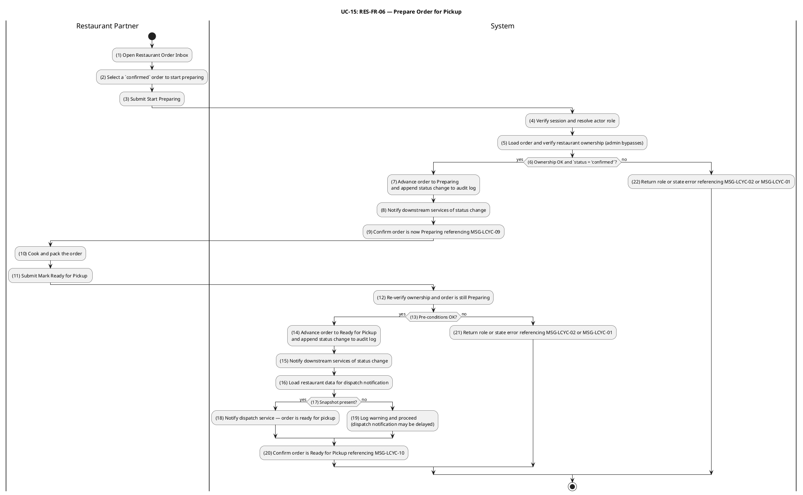

#### Business Rules

| Activity | BR Code | Description |
|---|---|---|
| _(4)_ | _BR-15.1_ | **Authorization & Ownership Rules:**<br>❖ T-06 and T-08 are restricted to roles `restaurant` and `admin`; other roles return HTTP 403 referencing `MSG-LCYC-02`.<br>❖ For role `restaurant`, the target order's `restaurantId` must belong to a restaurant whose `ownerId = session.user.id` (resolved through the ACL snapshot); otherwise HTTP 403 referencing `MSG-LCYC-03`.<br>❖ For role `admin`, ownership is bypassed. |
| _(5)_ | _BR-15.2_ | **Authorization & Ownership Rules: — Same Requirement Application:**<br>❖ _BR-15.2_ applies the detailed requirement, validation, persistence, event, and runtime constraints specified in _BR-15.1_ to activity _(5)_.<br>❖ Message trace retained: `MSG-LCYC-02`, `MSG-LCYC-03`. |
| _(12)_ | _BR-15.3_ | **Authorization & Ownership Rules: — Same Requirement Application:**<br>❖ _BR-15.3_ applies the detailed requirement, validation, persistence, event, and runtime constraints specified in _BR-15.1_ to activity _(12)_.<br>❖ Message trace retained: `MSG-LCYC-02`, `MSG-LCYC-03`. |
| _(6)_ | _BR-15.4_ | **Sequential Transition Rules:**<br>❖ T-06 requires `order.status = 'confirmed'`; any other source state returns HTTP 422 referencing `MSG-LCYC-01`.<br>❖ T-08 requires `order.status = 'preparing'`; any other source state returns HTTP 422 referencing `MSG-LCYC-01`.<br>❖ Idempotent re-issue: if the order is already in the requested target status the system returns it unchanged (no new audit row, no event). |
| _(13)_ | _BR-15.5_ | **Sequential Transition Rules: — Same Requirement Application:**<br>❖ _BR-15.5_ applies the detailed requirement, validation, persistence, event, and runtime constraints specified in _BR-15.4_ to activity _(13)_.<br>❖ Message trace retained: `MSG-LCYC-01`. |
| _(7)_ | _BR-15.6_ | **Atomicity & Concurrency Rules:**<br>❖ Each transition runs the status update + audit log insert in a single DB transaction.<br>❖ Optimistic locking on `version` rejects concurrent updates with HTTP 409 referencing `MSG-LCYC-06`. |
| _(14)_ | _BR-15.7_ | **Atomicity & Concurrency Rules: — Same Requirement Application:**<br>❖ _BR-15.7_ applies the detailed requirement, validation, persistence, event, and runtime constraints specified in _BR-15.6_ to activity _(14)_.<br>❖ Message trace retained: `MSG-LCYC-06`. |
| _(7)_ | _BR-15.8_ | **Event Publication & Response Rules (T-06):**<br>❖ Successful T-06 publishes `OrderStatusChangedEvent` after commit with `fromStatus = 'confirmed'` and `toStatus = 'preparing'`.<br>❖ No additional side-effect events are emitted on T-06 (no `OrderReadyForPickupEvent`, no refund event).<br>❖ The HTTP 200 response references `MSG-LCYC-09`. |
| _(8)_ | _BR-15.9_ | **Event Publication & Response Rules (T-06): — Same Requirement Application:**<br>❖ _BR-15.9_ applies the detailed requirement, validation, persistence, event, and runtime constraints specified in _BR-15.8_ to activity _(8)_.<br>❖ Message trace retained: `MSG-LCYC-09`. |
| _(9)_ | _BR-15.10_ | **Event Publication & Response Rules (T-06): — Same Requirement Application:**<br>❖ _BR-15.10_ applies the detailed requirement, validation, persistence, event, and runtime constraints specified in _BR-15.8_ to activity _(9)_.<br>❖ Message trace retained: `MSG-LCYC-09`. |
| _(14)_ | _BR-15.11_ | **Ready-for-Pickup Event Rules (T-08):**<br>❖ Successful T-08 publishes `OrderStatusChangedEvent` (always) and `OrderReadyForPickupEvent` (when the restaurant snapshot is present in the ACL).<br>❖ `OrderReadyForPickupEvent` carries `orderId`, `restaurantId`, `restaurantName`, `restaurantAddress`, `customerId`, and `deliveryAddress` (`street`, `district`, `city`, optional `latitude`/`longitude`).<br>❖ If the restaurant snapshot is absent from the ACL, the DB transition still succeeds; the system logs a warning and skips the pickup-ready event. Downstream shipper dispatch may still occur via reconciliation.<br>❖ The HTTP 200 response references `MSG-LCYC-10`.<br>❖ The event is the contractual hand-off point from the Restaurant context to the Delivery context (UC-18). |
| _(15)_ | _BR-15.12_ | **Ready-for-Pickup Event Rules (T-08): — Same Requirement Application:**<br>❖ _BR-15.12_ applies the detailed requirement, validation, persistence, event, and runtime constraints specified in _BR-15.11_ to activity _(15)_.<br>❖ Message trace retained: `MSG-LCYC-10`. |
| _(16)_ | _BR-15.13_ | **Ready-for-Pickup Event Rules (T-08): — Same Requirement Application:**<br>❖ _BR-15.13_ applies the detailed requirement, validation, persistence, event, and runtime constraints specified in _BR-15.11_ to activity _(16)_.<br>❖ Message trace retained: `MSG-LCYC-10`. |
| _(17)_ | _BR-15.14_ | **Ready-for-Pickup Event Rules (T-08): — Same Requirement Application:**<br>❖ _BR-15.14_ applies the detailed requirement, validation, persistence, event, and runtime constraints specified in _BR-15.11_ to activity _(17)_.<br>❖ Message trace retained: `MSG-LCYC-10`. |
| _(18)_ | _BR-15.15_ | **Ready-for-Pickup Event Rules (T-08): — Same Requirement Application:**<br>❖ _BR-15.15_ applies the detailed requirement, validation, persistence, event, and runtime constraints specified in _BR-15.11_ to activity _(18)_.<br>❖ Message trace retained: `MSG-LCYC-10`. |
| _(19)_ | _BR-15.16_ | **Ready-for-Pickup Event Rules (T-08): — Same Requirement Application:**<br>❖ _BR-15.16_ applies the detailed requirement, validation, persistence, event, and runtime constraints specified in _BR-15.11_ to activity _(19)_.<br>❖ Message trace retained: `MSG-LCYC-10`. |
| _(20)_ | _BR-15.17_ | **Ready-for-Pickup Event Rules (T-08): — Same Requirement Application:**<br>❖ _BR-15.17_ applies the detailed requirement, validation, persistence, event, and runtime constraints specified in _BR-15.11_ to activity _(20)_.<br>❖ Message trace retained: `MSG-LCYC-10`. |

---

### UC-16: Shipper Registration

| Field | Detail |
|---|---|
| **Use Case ID — Name** | DEL-FR-01 — Shipper Registration |
| **Actor** | Delivery Personnel (prospective Shipper), Administrator |
| **Trigger** | ❖ A signed-in user submits a Shipper Application form containing personal information, government-issued identification, vehicle type and licence-plate number, and a driving-licence reference image.<br>❖ An administrator reviews a submitted application and approves or rejects it. |
| **Description** | Onboards a new Delivery Personnel partner to the platform. Mirrors the same admin-gated verification pattern used for Restaurant Registration (UC-11): the application is created in a `pending_approval` state and the applicant cannot perform delivery operations until an administrator approves the application, which elevates the account's role to `shipper`. |
| **Pre-condition** | ❖ Applicant is authenticated.<br>❖ Applicant does not yet have role `shipper` on their account.<br>❖ Applicant does not have a pending or approved shipper application on record.<br>❖ For approve / reject: actor has role `admin`. |
| **Post-condition** | ❖ A `shipper_applications` row exists with `status = 'pending_approval'`, holding the submitted personal, vehicle, and document references.<br>❖ On administrator approval: the applicant's account role is elevated to `shipper`; a `ShipperApprovedEvent` is published; the shipper becomes eligible for UC-17 (availability) and UC-18 (pickup).<br>❖ On administrator rejection: the application row is marked `rejected` with a reason note; the applicant's role is unchanged. |

#### Activities Flow

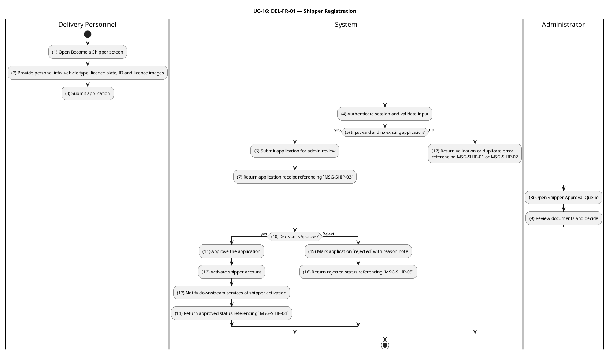

#### Business Rules

| Activity | BR Code | Description |
|---|---|---|
| _(3)_ | _BR-16.1_ | **Validate Rules (Application):**<br>❖ Full name, national ID number, vehicle type (`motorbike` / `bicycle` / `car`), licence-plate number (when vehicle type ≠ `bicycle`), and a driving-licence image reference are all required.<br>❖ Licence-plate number must match the Vietnamese plate format for the chosen vehicle type.<br>❖ Uploaded ID and licence images must reference existing image records owned by the applicant.<br>❖ Invalid input returns HTTP 400 referencing `MSG-SHIP-01`. |
| _(4)_ | _BR-16.2_ | **Validate Rules (Application): — Same Requirement Application:**<br>❖ _BR-16.2_ applies the detailed requirement, validation, persistence, event, and runtime constraints specified in _BR-16.1_ to activity _(4)_.<br>❖ Message trace retained: `MSG-SHIP-01`. |
| _(5)_ | _BR-16.3_ | **Validate Rules (Application): — Same Requirement Application:**<br>❖ _BR-16.3_ applies the detailed requirement, validation, persistence, event, and runtime constraints specified in _BR-16.1_ to activity _(5)_.<br>❖ Message trace retained: `MSG-SHIP-01`. |
| _(5)_ | _BR-16.4_ | **Duplicate Application Rules:**<br>❖ An applicant with an existing `pending_approval` or `approved` application is rejected with HTTP 409 referencing `MSG-SHIP-02`.<br>❖ An applicant whose previous application was `rejected` may re-apply; the new row supersedes the previous one for queue purposes. |
| _(17)_ | _BR-16.5_ | **Duplicate Application Rules: — Same Requirement Application:**<br>❖ _BR-16.5_ applies the detailed requirement, validation, persistence, event, and runtime constraints specified in _BR-16.4_ to activity _(17)_.<br>❖ Message trace retained: `MSG-SHIP-02`. |
| _(6)_ | _BR-16.6_ | **Default Status Rules (BR-1, Partner Verification):**<br>❖ A newly submitted application is always created with `status = 'pending_approval'`, regardless of any client-supplied status value.<br>❖ The applicant's account role remains unchanged at submission time. |
| _(8)_ | _BR-16.7_ | **Authorization Rules (Approval):**<br>❖ Approve and reject endpoints require role `admin`; otherwise HTTP 403 referencing `MSG-AUTH-05`.<br>❖ Reject requires a reason note for the audit trail. |
| _(9)_ | _BR-16.8_ | **Authorization Rules (Approval): — Same Requirement Application:**<br>❖ _BR-16.8_ applies the detailed requirement, validation, persistence, event, and runtime constraints specified in _BR-16.7_ to activity _(9)_.<br>❖ Message trace retained: `MSG-AUTH-05`. |
| _(10)_ | _BR-16.9_ | **Authorization Rules (Approval): — Same Requirement Application:**<br>❖ _BR-16.9_ applies the detailed requirement, validation, persistence, event, and runtime constraints specified in _BR-16.7_ to activity _(10)_.<br>❖ Message trace retained: `MSG-AUTH-05`. |
| _(11)_ | _BR-16.10_ | **Authorization Rules (Approval): — Same Requirement Application:**<br>❖ _BR-16.10_ applies the detailed requirement, validation, persistence, event, and runtime constraints specified in _BR-16.7_ to activity _(11)_.<br>❖ Message trace retained: `MSG-AUTH-05`. |
| _(12)_ | _BR-16.11_ | **Authorization Rules (Approval): — Same Requirement Application:**<br>❖ _BR-16.11_ applies the detailed requirement, validation, persistence, event, and runtime constraints specified in _BR-16.7_ to activity _(12)_.<br>❖ Message trace retained: `MSG-AUTH-05`. |
| _(13)_ | _BR-16.12_ | **Authorization Rules (Approval): — Same Requirement Application:**<br>❖ _BR-16.12_ applies the detailed requirement, validation, persistence, event, and runtime constraints specified in _BR-16.7_ to activity _(13)_.<br>❖ Message trace retained: `MSG-AUTH-05`. |
| _(11)_ | _BR-16.13_ | **Role Elevation Rules:**<br>❖ On approval, the applicant's account gains role `shipper` atomically with the application status update inside one DB transaction.<br>❖ A `ShipperApprovedEvent` carrying `shipperId` and approved vehicle/plate is published after commit so downstream contexts (notification, delivery dispatch) can react. |
| _(12)_ | _BR-16.14_ | **Role Elevation Rules: — Same Requirement Application:**<br>❖ _BR-16.14_ applies the detailed requirement, validation, persistence, event, and runtime constraints specified in _BR-16.13_ to activity _(12)_.<br>❖ No actor-facing message code is emitted by this activity. |
| _(13)_ | _BR-16.15_ | **Role Elevation Rules: — Same Requirement Application:**<br>❖ _BR-16.15_ applies the detailed requirement, validation, persistence, event, and runtime constraints specified in _BR-16.13_ to activity _(13)_.<br>❖ No actor-facing message code is emitted by this activity. |

---

### UC-17: Manage Shipper Availability

| Field | Detail |
|---|---|
| **Use Case ID — Name** | DEL-FR-02 — Manage Shipper Availability |
| **Actor** | Delivery Personnel (approved Shipper) |
| **Trigger** | ❖ Shipper toggles their online/offline status from the mobile shipper console. |
| **Description** | Lets an approved shipper opt in or out of the dispatch pool in real time. Only shippers whose status is `online` are considered candidates for new pickup assignments in UC-18. The shipper cannot go offline while holding an order in `picked_up` or `delivering` (i.e. an in-flight delivery); such an attempt is rejected. |
| **Pre-condition** | ❖ Actor is authenticated.<br>❖ Actor has role `shipper` (approved through UC-16).<br>❖ For setting status to `offline`: no order owned by this shipper is in `picked_up` or `delivering`. |
| **Post-condition** | ❖ The shipper's availability status is updated to `online` or `offline`.<br>❖ A `ShipperAvailabilityChangedEvent` is published so the dispatch service updates its candidate index. |

#### Activities Flow

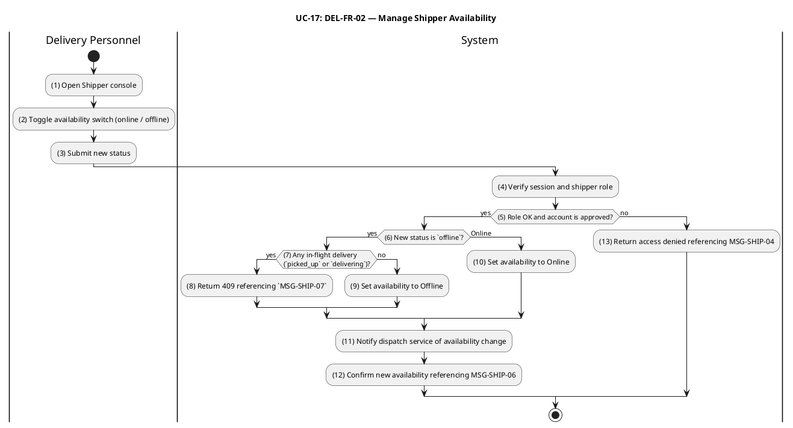

#### Business Rules

| Activity | BR Code | Description |
|---|---|---|
| _(4)_ | _BR-17.1_ | **Authorization Rules:**<br>❖ Endpoint requires role `shipper` whose underlying account is `approved`; otherwise HTTP 403 referencing `MSG-SHIP-04`. |
| _(5)_ | _BR-17.2_ | **Authorization Rules: — Same Requirement Application:**<br>❖ _BR-17.2_ applies the detailed requirement, validation, persistence, event, and runtime constraints specified in _BR-17.1_ to activity _(5)_.<br>❖ Message trace retained: `MSG-SHIP-04`. |
| _(13)_ | _BR-17.3_ | **Authorization Rules: — Same Requirement Application:**<br>❖ _BR-17.3_ applies the detailed requirement, validation, persistence, event, and runtime constraints specified in _BR-17.1_ to activity _(13)_.<br>❖ Message trace retained: `MSG-SHIP-04`. |
| _(6)_ | _BR-17.4_ | **Active-Delivery Lock Rules:**<br>❖ Setting status to `offline` is rejected with HTTP 409 referencing `MSG-SHIP-07` when the shipper owns any order in `picked_up` or `delivering`.<br>❖ The shipper must complete the in-flight delivery (UC-19) or hand it off (admin operational override) before going offline. |
| _(7)_ | _BR-17.5_ | **Active-Delivery Lock Rules: — Same Requirement Application:**<br>❖ _BR-17.5_ applies the detailed requirement, validation, persistence, event, and runtime constraints specified in _BR-17.4_ to activity _(7)_.<br>❖ Message trace retained: `MSG-SHIP-07`. |
| _(8)_ | _BR-17.6_ | **Active-Delivery Lock Rules: — Same Requirement Application:**<br>❖ _BR-17.6_ applies the detailed requirement, validation, persistence, event, and runtime constraints specified in _BR-17.4_ to activity _(8)_.<br>❖ Message trace retained: `MSG-SHIP-07`. |
| _(9)_ | _BR-17.7_ | **Active-Delivery Lock Rules: — Same Requirement Application:**<br>❖ _BR-17.7_ applies the detailed requirement, validation, persistence, event, and runtime constraints specified in _BR-17.4_ to activity _(9)_.<br>❖ Message trace retained: `MSG-SHIP-07`. |
| _(9)_ | _BR-17.8_ | **State Persistence Rules:**<br>❖ Allowed values for availability are `online` and `offline`. Any other value returns HTTP 400 referencing `MSG-SHIP-01`.<br>❖ Setting the same status the shipper already has is idempotent — no event is republished. |
| _(10)_ | _BR-17.9_ | **State Persistence Rules: — Same Requirement Application:**<br>❖ _BR-17.9_ applies the detailed requirement, validation, persistence, event, and runtime constraints specified in _BR-17.8_ to activity _(10)_.<br>❖ Message trace retained: `MSG-SHIP-01`. |
| _(11)_ | _BR-17.10_ | **State Persistence Rules: — Same Requirement Application:**<br>❖ _BR-17.10_ applies the detailed requirement, validation, persistence, event, and runtime constraints specified in _BR-17.8_ to activity _(11)_.<br>❖ Message trace retained: `MSG-SHIP-01`. |
| _(11)_ | _BR-17.11_ | **Dispatch Pool Synchronisation Rules:**<br>❖ A successful change publishes `ShipperAvailabilityChangedEvent` carrying `shipperId`, new availability, and the timestamp.<br>❖ The dispatch service uses this event to add or remove the shipper from the online candidate set used by UC-18. |

---

### UC-18: Accept Delivery Assignment

| Field | Detail |
|---|---|
| **Use Case ID — Name** | DEL-FR-03 — Accept Delivery Assignment |
| **Actor** | Delivery Personnel (online Shipper), Administrator |
| **Trigger** | ❖ A `ready_for_pickup` order is surfaced to one or more online shippers via the dispatch service (driven by `OrderReadyForPickupEvent`).<br>❖ A shipper claims the order from their queue (`PATCH /orders/:id/pickup`) — transitions `ready_for_pickup → picked_up` (T-09). |
| **Description** | Models the self-assignment of a `ready_for_pickup` order to a shipper. T-09 atomically sets `orders.shipperId` to the acting shipper's user id and advances `orders.status` to `picked_up`. Concurrency control is critical: when two online shippers attempt to claim the same order simultaneously, the optimistic-locking `version` guard guarantees that exactly one succeeds and the other receives a conflict response. An administrator may also execute T-09 as an operational override (e.g., to assign a specific shipper); in that case `shipperId` is set to the admin's user id, and the actual shipper is recorded out-of-band. |
| **Pre-condition** | ❖ Actor is authenticated.<br>❖ Actor has role `shipper` and availability `online` (or role `admin` for override).<br>❖ Target order is in `status = 'ready_for_pickup'`.<br>❖ No other shipper has yet claimed the order. |
| **Post-condition** | ❖ `orders.status = 'picked_up'`, `orders.shipperId = actorId`, `orders.version` incremented atomically.<br>❖ A new `order_status_logs` row records T-09 with `triggeredByRole = 'shipper'` (or `'admin'`).<br>❖ `OrderStatusChangedEvent` is published after commit. |

#### Activities Flow

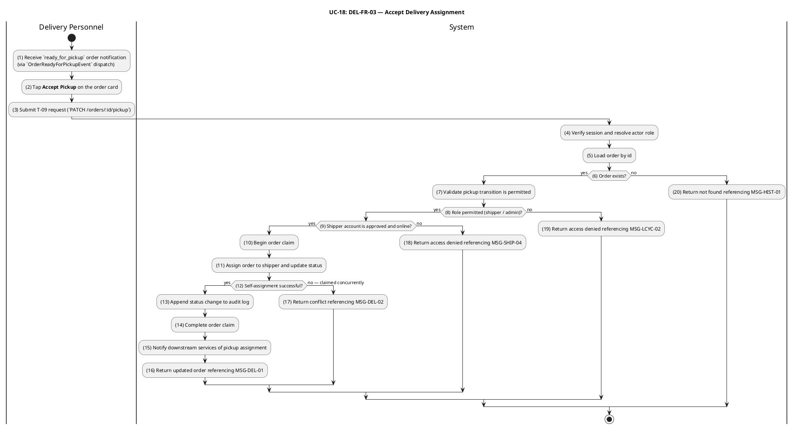

#### Business Rules

| Activity | BR Code | Description |
|---|---|---|
| _(4)_ | _BR-18.1_ | **Authorization & Transition Rules:**<br>❖ T-09 (`ready_for_pickup → picked_up`) is allowed only for roles `shipper` and `admin`; other roles return HTTP 403 referencing `MSG-LCYC-02`.<br>❖ An attempt from any source state other than `ready_for_pickup` returns HTTP 422 referencing `MSG-LCYC-01`.<br>❖ A non-existent order id returns HTTP 404 referencing `MSG-HIST-01`.<br>❖ Idempotency: if the order is already in `picked_up` status, the system returns the order unchanged without creating a duplicate audit log entry or re-publishing events. |
| _(5)_ | _BR-18.2_ | **Authorization & Transition Rules: — Same Requirement Application:**<br>❖ _BR-18.2_ applies the detailed requirement, validation, persistence, event, and runtime constraints specified in _BR-18.1_ to activity _(5)_.<br>❖ Message trace retained: `MSG-HIST-01`, `MSG-LCYC-01`, `MSG-LCYC-02`. |
| _(6)_ | _BR-18.3_ | **Authorization & Transition Rules: — Same Requirement Application:**<br>❖ _BR-18.3_ applies the detailed requirement, validation, persistence, event, and runtime constraints specified in _BR-18.1_ to activity _(6)_.<br>❖ Message trace retained: `MSG-HIST-01`, `MSG-LCYC-01`, `MSG-LCYC-02`. |
| _(7)_ | _BR-18.4_ | **Authorization & Transition Rules: — Same Requirement Application:**<br>❖ _BR-18.4_ applies the detailed requirement, validation, persistence, event, and runtime constraints specified in _BR-18.1_ to activity _(7)_.<br>❖ Message trace retained: `MSG-HIST-01`, `MSG-LCYC-01`, `MSG-LCYC-02`. |
| _(8)_ | _BR-18.5_ | **Authorization & Transition Rules: — Same Requirement Application:**<br>❖ _BR-18.5_ applies the detailed requirement, validation, persistence, event, and runtime constraints specified in _BR-18.1_ to activity _(8)_.<br>❖ Message trace retained: `MSG-HIST-01`, `MSG-LCYC-01`, `MSG-LCYC-02`. |
| _(9)_ | _BR-18.6_ | **Shipper Eligibility Rules:**<br>❖ For role `shipper`, the underlying account must be `approved` (UC-16) and the shipper's availability must be `online` (UC-17); otherwise HTTP 403 referencing `MSG-SHIP-04`.<br>❖ The eligibility check is bypassed for role `admin`. |
| _(18)_ | _BR-18.7_ | **Shipper Eligibility Rules: — Same Requirement Application:**<br>❖ _BR-18.7_ applies the detailed requirement, validation, persistence, event, and runtime constraints specified in _BR-18.6_ to activity _(18)_.<br>❖ Message trace retained: `MSG-SHIP-04`. |
| _(10)_ | _BR-18.8_ | **Concurrency & Self-Assignment Rules:**<br>❖ The status update and `shipperId` assignment occur in a single SQL `UPDATE` guarded by `version = :loaded_version`.<br>❖ When two shippers race for the same order, the database guarantees at most one row update; the loser receives HTTP 409 referencing `MSG-DEL-02`.<br>❖ For role `shipper`, `shipperId` is set to `session.user.id`. For role `admin` operational override, `shipperId` is set to the admin's user id; subsequent T-10 / T-11 ownership rules then require the same actor. |
| _(11)_ | _BR-18.9_ | **Concurrency & Self-Assignment Rules: — Same Requirement Application:**<br>❖ _BR-18.9_ applies the detailed requirement, validation, persistence, event, and runtime constraints specified in _BR-18.8_ to activity _(11)_.<br>❖ Message trace retained: `MSG-DEL-02`. |
| _(12)_ | _BR-18.10_ | **Concurrency & Self-Assignment Rules: — Same Requirement Application:**<br>❖ _BR-18.10_ applies the detailed requirement, validation, persistence, event, and runtime constraints specified in _BR-18.8_ to activity _(12)_.<br>❖ Message trace retained: `MSG-DEL-02`. |
| _(13)_ | _BR-18.11_ | **Concurrency & Self-Assignment Rules: — Same Requirement Application:**<br>❖ _BR-18.11_ applies the detailed requirement, validation, persistence, event, and runtime constraints specified in _BR-18.8_ to activity _(13)_.<br>❖ Message trace retained: `MSG-DEL-02`. |
| _(14)_ | _BR-18.12_ | **Concurrency & Self-Assignment Rules: — Same Requirement Application:**<br>❖ _BR-18.12_ applies the detailed requirement, validation, persistence, event, and runtime constraints specified in _BR-18.8_ to activity _(14)_.<br>❖ Message trace retained: `MSG-DEL-02`. |
| _(13)_ | _BR-18.13_ | **Audit Log Rules:**<br>❖ A `order_status_logs` row is inserted in the same transaction with `fromStatus = 'ready_for_pickup'`, `toStatus = 'picked_up'`, `triggeredBy = actorId`, `triggeredByRole = 'shipper'` or `'admin'`. |
| _(15)_ | _BR-18.14_ | **Event Publication Rules:**<br>❖ `OrderStatusChangedEvent` is published after commit on every successful T-09.<br>❖ T-09 has no other side-effects (no refund, no ready-for-pickup republish). |

---

### UC-19: Deliver Order

| Field | Detail |
|---|---|
| **Use Case ID — Name** | DEL-FR-04 — Deliver Order |
| **Actor** | Delivery Personnel (assigned Shipper), Administrator |
| **Trigger** | ❖ Assigned shipper starts the delivery leg (`PATCH /orders/:id/en-route`) — transitions `picked_up → delivering` (T-10).<br>❖ Assigned shipper marks the order as delivered to the customer (`PATCH /orders/:id/deliver`) — transitions `delivering → delivered` (T-11). |
| **Description** | Completes the order fulfilment as a single unified business workflow with two sequential transitions: T-10 (`picked_up → delivering`) starts the en-route leg and T-11 (`delivering → delivered`) closes the order. Both transitions enforce **assigned-shipper ownership** — only the user whose id matches `orders.shipperId` (or an administrator) can advance the order. Each transition emits `OrderStatusChangedEvent` so the customer's order-tracking surface (UC-20) and the COD payment-on-delivery reconciliation can react. |
| **Pre-condition** | ❖ Actor is authenticated.<br>❖ Actor has role `shipper` and `actorId = orders.shipperId`, OR actor has role `admin`.<br>❖ T-10 requires `order.status = 'picked_up'`; T-11 requires `order.status = 'delivering'`. |
| **Post-condition** | ❖ `orders.status` advances to `delivering` and subsequently to `delivered`; `orders.version` is incremented on each transition.<br>❖ A `order_status_logs` row is appended for each transition.<br>❖ `OrderStatusChangedEvent` is published after each transition.<br>❖ On T-11, downstream consumers (notification, COD payment reconciliation, rating eligibility) react to the `delivered` status. |

#### Activities Flow

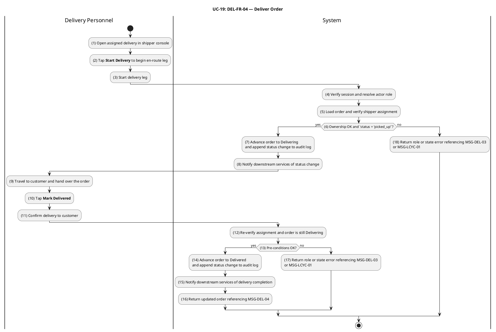

#### Business Rules

| Activity | BR Code | Description |
|---|---|---|
| _(4)_ | _BR-19.1_ | **Authorization & Assigned-Shipper Ownership Rules:**<br>❖ T-10 and T-11 are restricted to roles `shipper` and `admin`; other roles return HTTP 403 referencing `MSG-LCYC-02`.<br>❖ For role `shipper`, `orders.shipperId` must equal `session.user.id`; otherwise HTTP 403 referencing `MSG-DEL-03`.<br>❖ For role `admin`, the assigned-shipper check is bypassed. |
| _(5)_ | _BR-19.2_ | **Authorization & Assigned-Shipper Ownership Rules: — Same Requirement Application:**<br>❖ _BR-19.2_ applies the detailed requirement, validation, persistence, event, and runtime constraints specified in _BR-19.1_ to activity _(5)_.<br>❖ Message trace retained: `MSG-DEL-03`, `MSG-LCYC-02`. |
| _(12)_ | _BR-19.3_ | **Authorization & Assigned-Shipper Ownership Rules: — Same Requirement Application:**<br>❖ _BR-19.3_ applies the detailed requirement, validation, persistence, event, and runtime constraints specified in _BR-19.1_ to activity _(12)_.<br>❖ Message trace retained: `MSG-DEL-03`, `MSG-LCYC-02`. |
| _(6)_ | _BR-19.4_ | **Sequential Transition Rules:**<br>❖ T-10 requires `order.status = 'picked_up'`; any other source state returns HTTP 422 referencing `MSG-LCYC-01`.<br>❖ T-11 requires `order.status = 'delivering'`; any other source state returns HTTP 422 referencing `MSG-LCYC-01`.<br>❖ Idempotent re-issue: if the order is already in the requested target status the system returns it unchanged. |
| _(13)_ | _BR-19.5_ | **Sequential Transition Rules: — Same Requirement Application:**<br>❖ _BR-19.5_ applies the detailed requirement, validation, persistence, event, and runtime constraints specified in _BR-19.4_ to activity _(13)_.<br>❖ Message trace retained: `MSG-LCYC-01`. |
| _(7)_ | _BR-19.6_ | **Atomicity & Concurrency Rules:**<br>❖ Each transition runs the status update plus audit-log insert in a single DB transaction.<br>❖ Optimistic locking on `version` rejects concurrent updates with HTTP 409 referencing `MSG-LCYC-06`. |
| _(14)_ | _BR-19.7_ | **Atomicity & Concurrency Rules: — Same Requirement Application:**<br>❖ _BR-19.7_ applies the detailed requirement, validation, persistence, event, and runtime constraints specified in _BR-19.6_ to activity _(14)_.<br>❖ Message trace retained: `MSG-LCYC-06`. |
| _(8)_ | _BR-19.8_ | **Event Publication Rules:**<br>❖ Each successful T-10 and T-11 publishes `OrderStatusChangedEvent` after commit with the corresponding `fromStatus` / `toStatus`.<br>❖ Neither T-10 nor T-11 triggers a refund event; T-12 (`delivered → refunded`) is an admin-only post-delivery dispute path and is out of scope for this UC. |
| _(15)_ | _BR-19.9_ | **Event Publication Rules: — Same Requirement Application:**<br>❖ _BR-19.9_ applies the detailed requirement, validation, persistence, event, and runtime constraints specified in _BR-19.8_ to activity _(15)_.<br>❖ No actor-facing message code is emitted by this activity. |
| _(15)_ | _BR-19.10_ | **Delivery Completion Side-Effects Rules:**<br>❖ The `delivered` status is the trigger for downstream workflows: customer rating eligibility (UC-22), order-history "delivered" filter (UC-10), and COD payment-on-delivery reconciliation against `totalAmount`.<br>❖ A delivered order can only advance to `refunded` via T-12 (admin-only dispute resolution); no other forward transition is defined. |
| _(16)_ | _BR-19.11_ | **Delivery Completion Side-Effects Rules: — Same Requirement Application:**<br>❖ _BR-19.11_ applies the detailed requirement, validation, persistence, event, and runtime constraints specified in _BR-19.10_ to activity _(16)_.<br>❖ No actor-facing message code is emitted by this activity. |

---

### Customer Interaction, Promotion & Notification (UC-20 – UC-26)

This section specifies the customer-facing interaction surface following order placement (real-time tracking and self-service cancellation), the **rating and review** loop that closes the order lifecycle, and the cross-cutting **promotion**, **payment refund** and **notification** services consumed by all bounded contexts. These use cases formalise the cancellation-after-payment refund pipeline wired by transitions T-05, T-07 and T-12, and specify the multi-channel delivery contract (in-app, push, email) that surfaces every order, payment and refund event to the right actor within seconds.

---

### UC-20: Track Order Status

| Field | Detail |
|---|---|
| **Use Case ID — Name** | CUS-FR-08 — Track Order Status |
| **Actor** | Customer (authenticated, role `user`) |
| **Trigger** | ❖ Customer opens an active order in the mobile or web client.<br>❖ Customer's open session receives an `OrderStatusChangedEvent` push over the Notification WebSocket gateway.<br>❖ Client falls back to polling `GET /orders/:id` or `GET /orders/:id/timeline` when the WebSocket is unavailable. |
| **Description** | Provides the customer with a live view of one of their own orders. The use case combines an authoritative read API (`GET /orders/:id` and `GET /orders/:id/timeline`) with a real-time push channel served by the Notification gateway. Status updates originate from the `OrderStatusChangedEvent` published by every order status transition (T-01 through T-12); the customer surface reflects each transition within seconds while staying consistent with the order-history reads (UC-10, BR-10.4 — uniform 404 for non-owners). |
| **Pre-condition** | ❖ Customer is authenticated.<br>❖ The order is owned by the customer (`orders.customerId = session.user.id`).<br>❖ For real-time push: an active WebSocket connection to the Notification gateway exists for the caller's session. |
| **Post-condition** | ❖ The client surfaces the order's current `status`, the chronological `order_status_logs` timeline, and any derived ETA.<br>❖ Subsequent transitions are reflected in the client either via WebSocket push or by the next poll cycle. |

#### Activities Flow

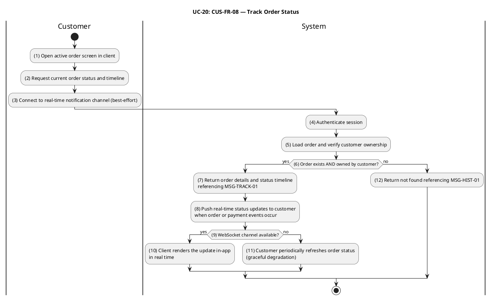

#### Business Rules

| Activity | BR Code | Description |
|---|---|---|
| _(4)_ | _BR-20.1_ | **Ownership-Based Access Control:**<br>❖ Both `GET /orders/:id` and `GET /orders/:id/timeline` enforce `orders.customerId = session.user.id` for role `user`.<br>❖ Any other authenticated role (`restaurant`, `shipper`, `admin`) is governed by its own scoped read path and is out of scope for this UC.<br>❖ Non-owners receive HTTP 404 referencing `MSG-HIST-01` — never 403 — to avoid leaking order existence (alignment with BR-10.6). |
| _(5)_ | _BR-20.2_ | **Ownership-Based Access Control: — Same Requirement Application:**<br>❖ _BR-20.2_ applies the detailed requirement, validation, persistence, event, and runtime constraints specified in _BR-20.1_ to activity _(5)_.<br>❖ Message trace retained: `MSG-HIST-01`. |
| _(12)_ | _BR-20.3_ | **Ownership-Based Access Control: — Same Requirement Application:**<br>❖ _BR-20.3_ applies the detailed requirement, validation, persistence, event, and runtime constraints specified in _BR-20.1_ to activity _(12)_.<br>❖ Message trace retained: `MSG-HIST-01`. |
| _(6)_ | _BR-20.4_ | **Authoritative Read Contract:**<br>❖ `GET /orders/:id` returns the canonical order header (`id`, `status`, `paymentMethod`, `totalAmount`, `shipperId`, `version`) plus the persisted line items.<br>❖ `GET /orders/:id/timeline` returns the chronological projection of `order_status_logs` (`fromStatus`, `toStatus`, `triggeredByRole`, `note`, `createdAt`) so the client can render a step-by-step progress bar.<br>❖ Both reads return on success and reference `MSG-TRACK-01`. |
| _(7)_ | _BR-20.5_ | **Authoritative Read Contract: — Same Requirement Application:**<br>❖ _BR-20.5_ applies the detailed requirement, validation, persistence, event, and runtime constraints specified in _BR-20.4_ to activity _(7)_.<br>❖ Message trace retained: `MSG-TRACK-01`. |
| _(3)_ | _BR-20.6_ | **Real-Time Push Contract:**<br>❖ The Notification WebSocket gateway authenticates the connection via the Bearer token and joins the socket to a per-user room.<br>❖ For every `OrderStatusChangedEvent` published after a successful transition (T-01 through T-12), the Notification BC dispatches a `notification_payload` to the customer's room with the `notification_type` mapped from the `(fromStatus, toStatus)` pair (see UC-26).<br>❖ Payload delivery is fire-and-forget on the publishing side; failure to push does not affect the database state of the order. |
| _(8)_ | _BR-20.7_ | **Real-Time Push Contract: — Same Requirement Application:**<br>❖ _BR-20.7_ applies the detailed requirement, validation, persistence, event, and runtime constraints specified in _BR-20.6_ to activity _(8)_.<br>❖ No actor-facing message code is emitted by this activity. |
| _(10)_ | _BR-20.8_ | **Real-Time Push Contract: — Same Requirement Application:**<br>❖ _BR-20.8_ applies the detailed requirement, validation, persistence, event, and runtime constraints specified in _BR-20.6_ to activity _(10)_.<br>❖ No actor-facing message code is emitted by this activity. |
| _(9)_ | _BR-20.9_ | **Polling Fallback & Read-Model Consistency:**<br>❖ When the WebSocket is unavailable (cold start, mobile background, transient network loss), the client polls `GET /orders/:id` and `GET /orders/:id/timeline` at a configurable interval (recommended 10 s for active orders, 60 s for stable states).<br>❖ Because both the WebSocket push and the polled read are derived from the same authoritative `orders` and `order_status_logs` tables, the displayed state remains consistent regardless of which channel delivers the update. |
| _(11)_ | _BR-20.10_ | **Polling Fallback & Read-Model Consistency: — Same Requirement Application:**<br>❖ _BR-20.10_ applies the detailed requirement, validation, persistence, event, and runtime constraints specified in _BR-20.9_ to activity _(11)_.<br>❖ No actor-facing message code is emitted by this activity. |
| _(8)_ | _BR-20.11_ | **Cross-BC Read-Model Boundary:**<br>❖ The Notification BC does not own the order; it only forwards the event payload so the client can refresh its local copy or render the toast.<br>❖ The Notification BC MUST NOT call any Ordering BC service or repository to enrich the payload — every field needed by the customer is published on the event itself (D-P7 cross-context isolation). |

---

### UC-21: Cancel Order

| Field | Detail |
|---|---|
| **Use Case ID — Name** | CUS-FR-09 — Cancel Order |
| **Actor** | Customer (authenticated, role `user`) |
| **Trigger** | ❖ Customer chooses **Cancel Order** on an active order screen and submits a non-empty reason note.<br>❖ Client issues `PATCH /orders/:id/cancel` with body `{ reason: string }`. |
| **Description** | Allows a customer to cancel one of their own orders **before** the restaurant has confirmed it. Two backend transitions are reachable from this UC: T-03 (`pending → cancelled`, COD or pre-payment) and T-05 (`paid → cancelled`, VNPay paid). For T-05 the system additionally publishes an `OrderCancelledAfterPaymentEvent`, which is consumed by the Payment BC to initiate the refund pipeline (UC-25). After the order reaches `confirmed` the customer can no longer cancel — only the restaurant (T-07) or an admin may do so. The use case is **idempotent** with respect to the order version and uses optimistic locking to safely interleave with restaurant-side actions. |
| **Pre-condition** | ❖ Customer is authenticated.<br>❖ The order is owned by the customer (`orders.customerId = session.user.id`).<br>❖ The order's current status is one of `pending` or `paid`; any later state is non-cancellable by the customer.<br>❖ A non-empty `reason` note is supplied. |
| **Post-condition** | ❖ Order status advances to `cancelled` via T-03 or T-05, version is incremented and an `order_status_logs` row is appended.<br>❖ `OrderStatusChangedEvent` is published for downstream notification fan-out.<br>❖ For T-05 only: `OrderCancelledAfterPaymentEvent` is published, kicking off the Payment BC refund pipeline (UC-25).<br>❖ Any active promotion reservations linked to the order are rolled back via the `PromotionRollbackOnCancellationHandler` (see BR-21.5). |

#### Activities Flow

```plantuml
@startuml UC21-CancelOrder
title UC-21: CUS-FR-09 — Cancel Order
skinparam ConditionEndStyle hline

|Customer|
start
:(1) Open active order screen;
:(2) Tap **Cancel Order** and\nenter a non-empty reason;
:(3) Submit cancellation with reason;

|System|
:(4) Verify session and actor role;
:(5) Load order and verify customer ownership;
if ((6) Order found AND owned by customer?) then (yes)
  if ((7) `reason` non-empty?) then (yes)
    if ((8) Current status ∈ {`pending`, `paid`}?) then (yes)
      :(9) Determine applicable cancellation path;
      :(10) Cancel order and append status change to audit log;
      if ((11) Optimistic lock succeeded?) then (yes)
        :(12) Notify downstream services of cancellation;
        if ((13) Was the order paid via VNPay?) then (yes)
          :(14) Initiate payment refund pipeline;
        else (no)
          :(15) No refund applicable\n(COD or unpaid order);
        endif
        :(16) Roll back any applied promotion reservations;
        :(17) Return updated order referencing MSG-CANC-03;
      else (no)
        :(18) Return conflict referencing MSG-LCYC-06;
      endif
    else (no)
      :(19) Return state error referencing MSG-CANC-02;
    endif
  else (no)
    :(20) Return validation error referencing MSG-CANC-01;
  endif
else (no)
  :(21) Return not found referencing MSG-HIST-01;
endif
stop
@enduml
```

#### Business Rules

| Activity | BR Code | Description |
|---|---|---|
| _(4)_ | _BR-21.1_ | **Ownership & Role Gate:**<br>❖ The endpoint is callable by any authenticated session; role-resolution maps the caller to the most-privileged role (admin > restaurant > shipper > customer).<br>❖ For role `customer`, `orders.customerId` MUST equal `session.user.id` — otherwise HTTP 404 referencing `MSG-HIST-01` (no order-existence leak).<br>❖ Restaurant-initiated (T-07) and admin-initiated cancellations follow UC-14 (Accept or Reject Order) and are out of scope for this UC. |
| _(5)_ | _BR-21.2_ | **Ownership & Role Gate: — Same Requirement Application:**<br>❖ _BR-21.2_ applies the detailed requirement, validation, persistence, event, and runtime constraints specified in _BR-21.1_ to activity _(5)_.<br>❖ Message trace retained: `MSG-HIST-01`. |
| _(6)_ | _BR-21.3_ | **Ownership & Role Gate: — Same Requirement Application:**<br>❖ _BR-21.3_ applies the detailed requirement, validation, persistence, event, and runtime constraints specified in _BR-21.1_ to activity _(6)_.<br>❖ Message trace retained: `MSG-HIST-01`. |
| _(21)_ | _BR-21.4_ | **Ownership & Role Gate: — Same Requirement Application:**<br>❖ _BR-21.4_ applies the detailed requirement, validation, persistence, event, and runtime constraints specified in _BR-21.1_ to activity _(21)_.<br>❖ Message trace retained: `MSG-HIST-01`. |
| _(7)_ | _BR-21.5_ | **Mandatory Reason Note:**<br>❖ Per the `TRANSITIONS` map, both T-03 and T-05 set `requireNote = true`.<br>❖ The handler rejects requests with a missing or whitespace-only `reason` with HTTP 400 referencing `MSG-CANC-01`.<br>❖ The accepted note is persisted on the `order_status_logs` row so downstream support and analytics can audit the cancellation reason. |
| _(20)_ | _BR-21.6_ | **Mandatory Reason Note: — Same Requirement Application:**<br>❖ _BR-21.6_ applies the detailed requirement, validation, persistence, event, and runtime constraints specified in _BR-21.5_ to activity _(20)_.<br>❖ Message trace retained: `MSG-CANC-01`. |
| _(8)_ | _BR-21.7_ | **Customer-Cancellable Window:**<br>❖ A customer may only cancel while the order is in `pending` or `paid`. Once the order reaches `confirmed`, `preparing`, `ready_for_pickup`, `picked_up`, `delivering`, `delivered`, `cancelled` or `refunded`, the customer endpoint returns HTTP 422 referencing `MSG-CANC-02`.<br>❖ This rule mirrors `ALLOWED_TRANSITIONS` exactly: `pending → cancelled` and `paid → cancelled` are the only customer-eligible cancellation edges. |
| _(19)_ | _BR-21.8_ | **Customer-Cancellable Window: — Same Requirement Application:**<br>❖ _BR-21.8_ applies the detailed requirement, validation, persistence, event, and runtime constraints specified in _BR-21.7_ to activity _(19)_.<br>❖ Message trace retained: `MSG-CANC-02`. |
| _(10)_ | _BR-21.9_ | **Atomicity & Optimistic Locking:**<br>❖ The status update, version bump and audit-log insert run inside a single DB transaction.<br>❖ The `UPDATE orders SET status = 'cancelled', version = version + 1 WHERE id = $1 AND version = $expected` predicate fails when a concurrent action (e.g., a restaurant `accept` for T-01/T-02) commits first.<br>❖ Lock-loss returns HTTP 409 referencing `MSG-LCYC-06`; the client SHOULD refresh and re-evaluate cancellation eligibility. |
| _(11)_ | _BR-21.10_ | **Atomicity & Optimistic Locking: — Same Requirement Application:**<br>❖ _BR-21.10_ applies the detailed requirement, validation, persistence, event, and runtime constraints specified in _BR-21.9_ to activity _(11)_.<br>❖ Message trace retained: `MSG-LCYC-06`. |
| _(18)_ | _BR-21.11_ | **Atomicity & Optimistic Locking: — Same Requirement Application:**<br>❖ _BR-21.11_ applies the detailed requirement, validation, persistence, event, and runtime constraints specified in _BR-21.9_ to activity _(18)_.<br>❖ Message trace retained: `MSG-LCYC-06`. |
| _(13)_ | _BR-21.12_ | **Payment-Aware Refund Triggering:**<br>❖ When the source status is `paid` AND `paymentMethod = 'vnpay'`, the handler publishes `OrderCancelledAfterPaymentEvent`.<br>❖ The event payload is: `orderId` (string), `customerId` (string), `paymentMethod: 'vnpay'` (literal string), `paidAmount` (number, VND), `cancelledAt` (Date), `cancelledByRole` (`customer | restaurant | admin | system`). The Payment BC's `OrderCancelledAfterPaymentHandler` consumes it asynchronously (UC-25) and is solely responsible for the VNPay refund call; the Notification BC's `OrderCancelledAfterPaymentNotificationHandler` concurrently dispatches customer notifications (UC-26 BR-26.4).<br>❖ COD cancellations never publish the refund event — there is no captured payment to reverse. |
| _(14)_ | _BR-21.13_ | **Payment-Aware Refund Triggering: — Same Requirement Application:**<br>❖ _BR-21.13_ applies the detailed requirement, validation, persistence, event, and runtime constraints specified in _BR-21.12_ to activity _(14)_.<br>❖ No actor-facing message code is emitted by this activity. |
| _(12)_ | _BR-21.14_ | **Notification & Promotion Side-Effects:**<br>❖ `OrderStatusChangedEvent` triggers the Notification fan-out (UC-26): channel `in_app`, `push` and `email` for `order_cancelled` recipient `customer`.<br>❖ `PromotionRollbackOnCancellationHandler` (in the Ordering BC) listens to the same event and calls the Promotion BC `rollbackReservations(orderId)` to flip any `reserved` or `confirmed` `promotion_usages` rows to `rolled_back` and decrement promotion counters. |
| _(16)_ | _BR-21.15_ | **Notification & Promotion Side-Effects: — Same Requirement Application:**<br>❖ _BR-21.15_ applies the detailed requirement, validation, persistence, event, and runtime constraints specified in _BR-21.14_ to activity _(16)_.<br>❖ No actor-facing message code is emitted by this activity. |
| _(17)_ | _BR-21.16_ | **Idempotent Response Contract:**<br>❖ A successful cancellation returns the updated order plus `MSG-CANC-03`.<br>❖ Re-issuing the same `PATCH /orders/:id/cancel` after the order is already `cancelled` is treated as out-of-window and yields HTTP 422 referencing `MSG-CANC-02`; the handler never double-publishes events. |

---

### UC-22: Submit Rating & Review

| Field | Detail |
|---|---|
| **Use Case ID — Name** | CUS-FR-10 — Submit Rating & Review |
| **Actor** | Customer (authenticated, role `user`) |
| **Trigger** | ❖ Customer opens a delivered order and selects **Rate & Review**.<br>❖ Customer submits `POST /reviews` with `{ orderId, stars, comment? }`. |
| **Description** | Lets a customer rate a delivered order on a 1–5 star scale and optionally leave a free-text comment. Exactly one review per `(orderId, customerId)` pair may exist. The review is owned by the Review BC, references the order by UUID only (D-P7 cross-context isolation), and is the input to the restaurant's aggregate rating projection consumed by UC-2 / UC-3 listings. Reviews are moderation-ready: the schema reserves a `status` column (`published`, `hidden`, `removed`) so administrators can hide abusive content without deleting the row. |
| **Pre-condition** | ❖ Customer is authenticated.<br>❖ The referenced order is owned by the customer (`orders.customerId = session.user.id`).<br>❖ The referenced order has `status = 'delivered'`.<br>❖ No existing review row exists for `(orderId, customerId)`. |
| **Post-condition** | ❖ A new `reviews` row is persisted with `status = 'published'`.<br>❖ A `RestaurantRatingChangedEvent` is published; the Restaurant Catalog BC updates the aggregate rating projection for the restaurant (`ratingSum`, `ratingCount`, derived `averageRating`).<br>❖ The review is visible on the restaurant detail screen (UC-3). |

#### Activities Flow

```plantuml
@startuml UC22-SubmitRatingReview
title UC-22: CUS-FR-10 — Submit Rating & Review
skinparam ConditionEndStyle hline

|Customer|
start
:(1) Open delivered order screen;
:(2) Select **Rate & Review** and\nchoose 1–5 stars + optional comment;
:(3) Submit rating and optional comment;

|System|
:(4) Authenticate session;
:(5) Validate rating and comment content;
if ((6) Payload valid?) then (yes)
  :(7) Load order and verify customer ownership;
  if ((8) Order exists AND owned by customer?) then (yes)
    if ((9) `order.status = 'delivered'`?) then (yes)
      :(10) Check if review already exists;
      if ((11) No existing review?) then (yes)
        :(12) Save and publish review;
        :(13) Update restaurant aggregate rating;
        :(14) Return confirmation referencing MSG-RATE-04;
      else (no)
        :(15) Return conflict referencing MSG-RATE-03;
      endif
    else (no)
      :(16) Return state error referencing MSG-RATE-02;
    endif
  else (no)
    :(17) Return not found referencing MSG-HIST-01;
  endif
else (no)
  :(18) Return validation error referencing MSG-RATE-01;
endif
stop
@enduml
```

#### Business Rules

| Activity | BR Code | Description |
|---|---|---|
| _(5)_ | _BR-22.1_ | **Payload Validation:**<br>❖ `stars` MUST be an integer in `[1, 5]`; `comment` is optional and bounded to 1 000 UTF-8 characters.<br>❖ The Review BC trims surrounding whitespace from `comment` and rejects empty-after-trim strings as `null`.<br>❖ Validation failures return HTTP 400 referencing `MSG-RATE-01`. |
| _(18)_ | _BR-22.2_ | **Payload Validation: — Same Requirement Application:**<br>❖ _BR-22.2_ applies the detailed requirement, validation, persistence, event, and runtime constraints specified in _BR-22.1_ to activity _(18)_.<br>❖ Message trace retained: `MSG-RATE-01`. |
| _(7)_ | _BR-22.3_ | **Ownership Gate:**<br>❖ The review handler reads the target order from the Ordering BC's public read API (or a cached `(orderId → customerId, restaurantId, status)` snapshot) and rejects any mismatch with HTTP 404 referencing `MSG-HIST-01`.<br>❖ The order's `restaurantId` is **copied** onto the `reviews` row at creation time so that later restaurant deletion or reassignment cannot orphan the review. |
| _(8)_ | _BR-22.4_ | **Ownership Gate: — Same Requirement Application:**<br>❖ _BR-22.4_ applies the detailed requirement, validation, persistence, event, and runtime constraints specified in _BR-22.3_ to activity _(8)_.<br>❖ Message trace retained: `MSG-HIST-01`. |
| _(17)_ | _BR-22.5_ | **Ownership Gate: — Same Requirement Application:**<br>❖ _BR-22.5_ applies the detailed requirement, validation, persistence, event, and runtime constraints specified in _BR-22.3_ to activity _(17)_.<br>❖ Message trace retained: `MSG-HIST-01`. |
| _(9)_ | _BR-22.6_ | **Delivered-Only Eligibility:**<br>❖ A review may only be submitted when `order.status = 'delivered'`.<br>❖ Any other status (including `refunded` post-dispute and `cancelled`) returns HTTP 422 referencing `MSG-RATE-02`.<br>❖ This guarantees the rating reflects an actually-delivered experience. |
| _(16)_ | _BR-22.7_ | **Delivered-Only Eligibility: — Same Requirement Application:**<br>❖ _BR-22.7_ applies the detailed requirement, validation, persistence, event, and runtime constraints specified in _BR-22.6_ to activity _(16)_.<br>❖ Message trace retained: `MSG-RATE-02`. |
| _(10)_ | _BR-22.8_ | **One-Review-Per-Order Uniqueness:**<br>❖ A UNIQUE constraint on `(orderId, customerId)` enforces a single review row per order.<br>❖ Duplicate-submission attempts return HTTP 409 referencing `MSG-RATE-03`.<br>❖ Editing an existing review uses `PATCH /reviews/:id` (subject to BR-22.13), not re-`POST`. |
| _(11)_ | _BR-22.9_ | **One-Review-Per-Order Uniqueness: — Same Requirement Application:**<br>❖ _BR-22.9_ applies the detailed requirement, validation, persistence, event, and runtime constraints specified in _BR-22.8_ to activity _(11)_.<br>❖ Message trace retained: `MSG-RATE-03`. |
| _(15)_ | _BR-22.10_ | **One-Review-Per-Order Uniqueness: — Same Requirement Application:**<br>❖ _BR-22.10_ applies the detailed requirement, validation, persistence, event, and runtime constraints specified in _BR-22.8_ to activity _(15)_.<br>❖ Message trace retained: `MSG-RATE-03`. |
| _(12)_ | _BR-22.11_ | **Cross-BC Projection Update:**<br>❖ The review insert and the `RestaurantRatingChangedEvent` publish run in the same DB transaction (outbox or transactional EventBus, whichever is in use).<br>❖ The Restaurant Catalog BC subscribes to the event and updates `restaurants.ratingSum`, `restaurants.ratingCount` and the derived `averageRating` projection used by UC-2 / UC-3 — the Review BC NEVER writes to the `restaurants` table directly (D-P7). |
| _(13)_ | _BR-22.12_ | **Cross-BC Projection Update: — Same Requirement Application:**<br>❖ _BR-22.12_ applies the detailed requirement, validation, persistence, event, and runtime constraints specified in _BR-22.11_ to activity _(13)_.<br>❖ No actor-facing message code is emitted by this activity. |
| _(12)_ | _BR-22.13_ | **Moderation-Ready Schema:**<br>❖ `reviews.status ∈ {'published', 'hidden', 'removed'}`. Customer endpoints only operate on `published` rows; administrators can transition to `hidden` (visible to author only) or `removed` (soft-delete).<br>❖ A `PATCH /reviews/:id` endpoint allows the original author to edit `stars` / `comment` while `status = 'published'`; non-owners receive `MSG-RATE-06` and non-existent ids return `MSG-RATE-05`. |

---

### UC-23: Manage Restaurant Promotions

| Field | Detail |
|---|---|
| **Use Case ID — Name** | RES-FR-07 — Manage Restaurant Promotions |
| **Actor** | Restaurant owner (authenticated, role `restaurant`) |
| **Trigger** | ❖ Restaurant owner opens the promotion dashboard for one of their restaurants and submits any of:<br>● `POST /promotions/restaurant?restaurantId=…` (create)<br>● `GET /promotions/restaurant/my?restaurantId=…` (list)<br>● `GET /promotions/restaurant/:id` (detail)<br>● `PATCH /promotions/restaurant/:id` (update)<br>● `PATCH /promotions/restaurant/:id/activate` (activate from `draft` or `paused`)<br>● `PATCH /promotions/restaurant/:id/pause` (pause from `active`) |
| **Description** | Allows a restaurant owner to author and operate their own restaurant-scoped promotions. Each promotion is a row in `promotions` with `scope = 'restaurant'` and `restaurantId = <owned restaurant>`, evaluated by the shared `PromotionPricingEngine` at checkout (UC-8, BR-8.7). The owner controls the promotion's type (`percentage`, `fixed_amount`, `free_delivery`, `reduced_delivery`), trigger (`auto_apply` or `coupon_code`), stacking mode (`non_stackable`, `stackable`, `exclusive`), validity window, minimum-order threshold and usage caps. Lifecycle is `draft → active ↔ paused → cancelled`; `active` rows whose `endsAt` is in the past are filtered as `expired` by all eligibility queries. |
| **Pre-condition** | ❖ Owner is authenticated with role `restaurant`.<br>❖ The `restaurantId` query parameter is one of the owner's approved restaurants (`restaurants.ownerUserId = session.user.id`, `approvalStatus = 'approved'`).<br>❖ Payload satisfies the Promotion BC validation contract (BR-23.2). |
| **Post-condition** | ❖ A row is inserted, updated or transitioned in `promotions` with the requested change.<br>❖ Newly created rows enter `status = 'draft'`; activation moves them to `active` and makes them eligible for checkout reservations.<br>❖ All eligibility queries from UC-8 (`computeAndReserveDiscount`) and the public preview endpoint immediately reflect the new state. |

#### Activities Flow

```plantuml
@startuml UC23-ManageRestaurantPromotions
title UC-23: RES-FR-07 — Manage Restaurant Promotions
skinparam ConditionEndStyle hline

|Restaurant Owner|
start
:(1) Open promotion dashboard;
:(2) Submit create / update / list / lifecycle\nrequest under `/promotions/restaurant/...`;

|System|
:(3) Verify session and restaurant role;
:(4) Load restaurant record;
if ((5) Restaurant exists, owned by actor, and approved?) then (yes)
  if ((6) Operation is read (`GET`)?) then (yes)
    :(7) Return restaurant's promotion list or detail;
  else (no)
    if ((8) Payload valid?) then (yes)
      if ((9) Operation is create?) then (yes)
        :(10) Create promotion in `draft` status;
      else (no)
        :(11) Load existing promotion and verify restaurant ownership;
        if ((12) Promotion found and owned by this restaurant?) then (yes)
          if ((13) Status transition is permitted?) then (yes)
            :(14) Apply and save changes;
          else (no)
            :(15) Return state error referencing MSG-PROMO-05;
          endif
        else (no)
          :(16) Return not found referencing MSG-PROMO-03;
        endif
      endif
      :(17) Return the resulting promotion;
    else (no)
      :(18) Return validation error referencing MSG-PROMO-01;
    endif
  endif
else (no)
  :(19) Return access denied referencing MSG-PROMO-02;
endif
stop
@enduml
```

#### Business Rules

| Activity | BR Code | Description |
|---|---|---|
| _(3)_ | _BR-23.1_ | **Ownership Gate:**<br>❖ Every mutating route requires role `restaurant` AND `restaurants.ownerUserId = session.user.id` AND `approvalStatus = 'approved'`.<br>❖ The owner can only operate on rows where `promotions.scope = 'restaurant'` AND `promotions.restaurantId` equals an owned restaurant.<br>❖ Cross-restaurant access returns HTTP 403 referencing `MSG-PROMO-02`; non-existent ids return HTTP 404 referencing `MSG-PROMO-03`. |
| _(4)_ | _BR-23.2_ | **Ownership Gate: — Same Requirement Application:**<br>❖ _BR-23.2_ applies the detailed requirement, validation, persistence, event, and runtime constraints specified in _BR-23.1_ to activity _(4)_.<br>❖ Message trace retained: `MSG-PROMO-02`, `MSG-PROMO-03`. |
| _(5)_ | _BR-23.3_ | **Ownership Gate: — Same Requirement Application:**<br>❖ _BR-23.3_ applies the detailed requirement, validation, persistence, event, and runtime constraints specified in _BR-23.1_ to activity _(5)_.<br>❖ Message trace retained: `MSG-PROMO-02`, `MSG-PROMO-03`. |
| _(11)_ | _BR-23.4_ | **Ownership Gate: — Same Requirement Application:**<br>❖ _BR-23.4_ applies the detailed requirement, validation, persistence, event, and runtime constraints specified in _BR-23.1_ to activity _(11)_.<br>❖ Message trace retained: `MSG-PROMO-02`, `MSG-PROMO-03`. |
| _(12)_ | _BR-23.5_ | **Ownership Gate: — Same Requirement Application:**<br>❖ _BR-23.5_ applies the detailed requirement, validation, persistence, event, and runtime constraints specified in _BR-23.1_ to activity _(12)_.<br>❖ Message trace retained: `MSG-PROMO-02`, `MSG-PROMO-03`. |
| _(19)_ | _BR-23.6_ | **Ownership Gate: — Same Requirement Application:**<br>❖ _BR-23.6_ applies the detailed requirement, validation, persistence, event, and runtime constraints specified in _BR-23.1_ to activity _(19)_.<br>❖ Message trace retained: `MSG-PROMO-02`, `MSG-PROMO-03`. |
| _(8)_ | _BR-23.7_ | **Payload Validation:**<br>❖ `type ∈ {percentage, fixed_amount, free_delivery, reduced_delivery}`; unsupported types such as `buy_x_get_y` and `free_item` are rejected with `MSG-PROMO-01`.<br>❖ `discountValue` is an integer `1..100` for `percentage`; for all other types it is a non-negative VND integer that MUST be a multiple of 1 000 (mirrors the engine's `floorToThousand` rounding).<br>❖ `minOrderAmount`, `maxDiscountAmount` (if set) MUST be non-negative multiples of 1 000 VND.<br>❖ `startsAt < endsAt` and both are timezone-aware UTC timestamps.<br>❖ `maxTotalUses` and `maxUsesPerUser` (if set) MUST be positive integers; once the engine observes `currentTotalUses ≥ maxTotalUses` at reservation time it returns `MSG-PROMO-09` (quota exhausted) and the promotion no longer applies.<br>❖ For `trigger = coupon_code`, at least one coupon code MUST be generated via UC-24 BR-24.14 before activation; the engine rejects activation otherwise. |
| _(18)_ | _BR-23.8_ | **Payload Validation: — Same Requirement Application:**<br>❖ _BR-23.8_ applies the detailed requirement, validation, persistence, event, and runtime constraints specified in _BR-23.7_ to activity _(18)_.<br>❖ Message trace retained: `MSG-PROMO-01`, `MSG-PROMO-09`. |
| _(13)_ | _BR-23.9_ | **Lifecycle State Machine:**<br>❖ Restaurant-owner-accessible transitions via `PromotionRestaurantController`: `{draft, paused} → active` (via `activate`), `active → paused` (via `pause`). Restaurant owners have NO cancel endpoint — only admins (UC-24) may transition to `cancelled`.<br>❖ Admin-accessible additional transitions: `{active, paused} → cancelled` (soft-delete via `DELETE /promotions/admin/:id`).<br>❖ `expired` is a valid status enum value in the DB schema and is set implicitly by query filters when `endsAt < now()`; it is NOT set via an explicit lifecycle endpoint.<br>❖ Activation MUST verify that `startsAt ≤ now() < endsAt` is still satisfiable; otherwise reject with `MSG-PROMO-05`.<br>❖ Disallowed transitions return HTTP 422 referencing `MSG-PROMO-05`. |
| _(14)_ | _BR-23.10_ | **Lifecycle State Machine: — Same Requirement Application:**<br>❖ _BR-23.10_ applies the detailed requirement, validation, persistence, event, and runtime constraints specified in _BR-23.9_ to activity _(14)_.<br>❖ Message trace retained: `MSG-PROMO-05`. |
| _(15)_ | _BR-23.11_ | **Lifecycle State Machine: — Same Requirement Application:**<br>❖ _BR-23.11_ applies the detailed requirement, validation, persistence, event, and runtime constraints specified in _BR-23.9_ to activity _(15)_.<br>❖ Message trace retained: `MSG-PROMO-05`. |
| _(10)_ | _BR-23.12_ | **Atomicity, Concurrency & Soft-Delete:**<br>❖ Every mutating operation runs in a single DB transaction with optimistic locking on `promotions.version`.<br>❖ `DELETE` is a soft-cancel: the row is transitioned to `status = 'cancelled'`. Hard deletion is forbidden because `promotion_usages` rows reference the row by FK-less UUID.<br>❖ A cancellation publishes no event; in-flight checkout reservations already committed remain valid (the engine only filters by `status = 'active'` at reservation time). |
| _(14)_ | _BR-23.13_ | **Atomicity, Concurrency & Soft-Delete: — Same Requirement Application:**<br>❖ _BR-23.13_ applies the detailed requirement, validation, persistence, event, and runtime constraints specified in _BR-23.12_ to activity _(14)_.<br>❖ No actor-facing message code is emitted by this activity. |
| _(7)_ | _BR-23.14_ | **Read-Scope & Visibility:**<br>❖ Every restaurant read endpoint filters server-side by `scope = 'restaurant'` AND `restaurantId IN (ownedRestaurants)`. A leaked `restaurantId` query parameter pointing to another owner's restaurant is rejected by BR-23.1.<br>❖ Pagination uses `offset` / `limit` (max 100); the response includes `total` so the UI can render page indicators consistently with UC-12. |
| _(17)_ | _BR-23.15_ | **Read-Scope & Visibility: — Same Requirement Application:**<br>❖ _BR-23.15_ applies the detailed requirement, validation, persistence, event, and runtime constraints specified in _BR-23.14_ to activity _(17)_.<br>❖ No actor-facing message code is emitted by this activity. |
| _(10)_ | _BR-23.16_ | **Stacking Mode Semantics (engine-side):**<br>❖ `non_stackable` — at most one promotion of this mode applies per checkout; if multiple are eligible the engine picks the highest absolute discount.<br>❖ `stackable` — multiple stackable promotions may apply on the same checkout, each evaluated in deterministic order (platform first, then restaurant).<br>❖ `exclusive` — at most one promotion total; if any exclusive promotion applies, no other promotion (platform or restaurant) is allowed. Attempting to combine an exclusive with another rejects the second one at preview time with `MSG-PROMO-08`. |
| _(14)_ | _BR-23.17_ | **Coupon Code Linkage:**<br>❖ For `trigger = coupon_code` promotions, the owner uses `POST /promotions/admin/:id/coupons` (admin-issued, see UC-24 BR-24.14). Restaurant owners do not generate codes directly; they request codes via support.<br>❖ Activating a `coupon_code` promotion without any active code rows returns HTTP 422 referencing `MSG-PROMO-05`. |

---

### UC-24: Manage Platform Promotions

| Field | Detail |
|---|---|
| **Use Case ID — Name** | ADM-FR-09 — Manage Platform Promotions |
| **Actor** | Administrator (authenticated, role `admin`) |
| **Trigger** | ❖ Admin opens the platform-wide promotion console and submits any of:<br>● `POST /promotions/admin` / `GET /promotions/admin` (CRUD)<br>● `PATCH /promotions/admin/:id` / `DELETE /promotions/admin/:id`<br>● `PATCH /promotions/admin/:id/activate` / `/pause`<br>● `POST /promotions/admin/:id/coupons` (bulk coupon code issuance)<br>● `GET /promotions/admin/:id/coupons` (list issued codes) |
| **Description** | Provides administrators with full lifecycle control over the entire `promotions` table — both `scope = 'platform'` rows (platform-wide marketing) and `scope = 'restaurant'` rows (oversight, fraud response, restaurant-support workflows). Admins are also the sole issuers of coupon codes; bulk-generated `coupon_codes` rows link back to a parent promotion via `promotionId` and carry their own usage and expiration metadata. The use case overlays UC-23's authoring contract with admin-only capabilities: cross-scope visibility, coupon batch issuance, and the ability to override stacking precedence. |
| **Pre-condition** | ❖ Caller is authenticated with role `admin`.<br>❖ Payload satisfies the same Promotion BC validation contract as UC-23 (BR-23.2).<br>❖ For coupon issuance, the parent promotion exists and has `trigger = 'coupon_code'`. |
| **Post-condition** | ❖ The targeted `promotions` row is created / updated / lifecycle-transitioned / soft-cancelled.<br>❖ For coupon issuance: N `coupon_codes` rows are inserted with `status = 'active'` and the configured per-code limits.<br>❖ All eligibility queries (`previewDiscount`, `computeAndReserveDiscount`) immediately observe the updated state. |

#### Activities Flow

```plantuml
@startuml UC24-ManagePlatformPromotions
title UC-24: ADM-FR-09 — Manage Platform Promotions
skinparam ConditionEndStyle hline

|Administrator|
start
:(1) Open admin promotion console;
:(2) Submit promotion or coupon request\nunder `/promotions/admin/...`;

|System|
:(3) Verify admin session;
if ((4) Operation is read (`GET`)?) then (yes)
  :(5) Return promotion and coupon list or detail;
else (no)
  if ((6) Operation is coupon issuance\n(`POST /:id/coupons`)?) then (yes)
    :(7) Load parent promotion;
    if ((8) Promotion exists and supports coupon codes?) then (yes)
      if ((9) Coupon batch payload valid?) then (yes)
        :(10) Issue and save provided coupon codes;
        :(11) Return issued codes referencing MSG-PROMO-10;
      else (no)
        :(12) Return validation error referencing MSG-PROMO-01;
      endif
    else (no)
      :(13) Return not found or state error\nreferencing MSG-PROMO-03 or MSG-PROMO-05;
    endif
  else (no)
    if ((14) Payload valid?) then (yes)
      if ((15) Target promotion (for update / lifecycle)\nexists?) then (yes)
        if ((16) Status transition permitted?) then (yes)
          :(17) Apply and save promotion change;
          :(18) Return the resulting promotion;
        else (no)
          :(19) Return state error referencing MSG-PROMO-05;
        endif
      else (no)
        :(20) Return not found referencing MSG-PROMO-03;
      endif
    else (no)
      :(21) Return validation error referencing MSG-PROMO-01;
    endif
  endif
endif
stop
@enduml
```

#### Business Rules

| Activity | BR Code | Description |
|---|---|---|
| _(3)_ | _BR-24.1_ | **Role Gate:**<br>❖ Every `/promotions/admin/*` endpoint enforces role `admin` via the `@Roles(['admin'])` guard.<br>❖ Non-admin sessions receive HTTP 403; the guard fires before any payload binding so no information about resource existence is leaked. |
| _(5)_ | _BR-24.2_ | **Cross-Scope Read Visibility:**<br>❖ Admin reads do not apply the `restaurantId = …` ownership filter required by UC-23, so the admin sees both platform-wide and restaurant-scoped promotions in one paginated list.<br>❖ The list supports `status` and `restaurantId` query filters for triage and audit workflows. |
| _(14)_ | _BR-24.3_ | **CRUD Semantics:**<br>❖ Admins can create a promotion with `scope = 'platform'` (and `restaurantId = NULL`) or `scope = 'restaurant'` (with a specific `restaurantId`).<br>❖ The same payload validation as UC-23 BR-23.7 applies; failures return `MSG-PROMO-01`.<br>❖ Update / lifecycle endpoints honour the same state machine as UC-23 BR-23.9; disallowed transitions return `MSG-PROMO-05`. |
| _(15)_ | _BR-24.4_ | **CRUD Semantics: — Same Requirement Application:**<br>❖ _BR-24.4_ applies the detailed requirement, validation, persistence, event, and runtime constraints specified in _BR-24.3_ to activity _(15)_.<br>❖ Message trace retained: `MSG-PROMO-01`, `MSG-PROMO-05`. |
| _(16)_ | _BR-24.5_ | **CRUD Semantics: — Same Requirement Application:**<br>❖ _BR-24.5_ applies the detailed requirement, validation, persistence, event, and runtime constraints specified in _BR-24.3_ to activity _(16)_.<br>❖ Message trace retained: `MSG-PROMO-01`, `MSG-PROMO-05`. |
| _(17)_ | _BR-24.6_ | **CRUD Semantics: — Same Requirement Application:**<br>❖ _BR-24.6_ applies the detailed requirement, validation, persistence, event, and runtime constraints specified in _BR-24.3_ to activity _(17)_.<br>❖ Message trace retained: `MSG-PROMO-01`, `MSG-PROMO-05`. |
| _(21)_ | _BR-24.7_ | **CRUD Semantics: — Same Requirement Application:**<br>❖ _BR-24.7_ applies the detailed requirement, validation, persistence, event, and runtime constraints specified in _BR-24.3_ to activity _(21)_.<br>❖ Message trace retained: `MSG-PROMO-01`, `MSG-PROMO-05`. |
| _(7)_ | _BR-24.8_ | **Coupon Batch Issuance:**<br>❖ Coupon issuance requires the parent promotion to exist (`MSG-PROMO-03` otherwise) AND have `trigger = 'coupon_code'` (`MSG-PROMO-05` otherwise). Cancelled promotions cannot receive new codes.<br>❖ The admin submits an explicit `codes: string[]` array in the request body (`CreateCouponCodesDto`); the system does NOT auto-generate codes. Codes are normalised to uppercase, stripped of surrounding whitespace, and must each be 3–32 characters, alphanumeric with optional internal hyphens (e.g. `SUMMER15`, `VIP-2025`).<br>❖ Up to 200 codes may be submitted per request. Each inserted row carries `promotionId`, `status = 'active'`, `maxUsesPerCode` (optional, null = unlimited), `expiresAt` (optional, defaults to parent promotion `endsAt`), and `currentUses = 0`.<br>❖ All `coupon_codes.code` values are globally unique (DB-level unique constraint). A single duplicate in the batch causes the entire insert to fail with HTTP 409 (`ConflictException`); there is no partial-success or server-side retry — the admin must correct the duplicate codes and resubmit. |
| _(8)_ | _BR-24.9_ | **Coupon Batch Issuance: — Same Requirement Application:**<br>❖ _BR-24.9_ applies the detailed requirement, validation, persistence, event, and runtime constraints specified in _BR-24.8_ to activity _(8)_.<br>❖ Message trace retained: `MSG-PROMO-03`, `MSG-PROMO-05`. |
| _(9)_ | _BR-24.10_ | **Coupon Batch Issuance: — Same Requirement Application:**<br>❖ _BR-24.10_ applies the detailed requirement, validation, persistence, event, and runtime constraints specified in _BR-24.8_ to activity _(9)_.<br>❖ Message trace retained: `MSG-PROMO-03`, `MSG-PROMO-05`. |
| _(10)_ | _BR-24.11_ | **Coupon Batch Issuance: — Same Requirement Application:**<br>❖ _BR-24.11_ applies the detailed requirement, validation, persistence, event, and runtime constraints specified in _BR-24.8_ to activity _(10)_.<br>❖ Message trace retained: `MSG-PROMO-03`, `MSG-PROMO-05`. |
| _(11)_ | _BR-24.12_ | **Coupon Batch Issuance: — Same Requirement Application:**<br>❖ _BR-24.12_ applies the detailed requirement, validation, persistence, event, and runtime constraints specified in _BR-24.8_ to activity _(11)_.<br>❖ Message trace retained: `MSG-PROMO-03`, `MSG-PROMO-05`. |
| _(13)_ | _BR-24.13_ | **Coupon Batch Issuance: — Same Requirement Application:**<br>❖ _BR-24.13_ applies the detailed requirement, validation, persistence, event, and runtime constraints specified in _BR-24.8_ to activity _(13)_.<br>❖ Message trace retained: `MSG-PROMO-03`, `MSG-PROMO-05`. |
| _(9)_ | _BR-24.14_ | **Coupon Validation Contract (run-time):**<br>❖ A coupon code consumed at checkout (UC-8) is valid only when its `status = 'active'`, `expiresAt > now()`, `currentUses < maxUses` and its parent promotion is also active.<br>❖ Any other state returns `MSG-PROMO-06` (invalid / expired / exhausted).<br>❖ Coupon scope is inherited from the parent promotion: a `scope = 'restaurant'` code is rejected by the engine when the cart belongs to a different restaurant (`MSG-PROMO-07`). |
| _(12)_ | _BR-24.15_ | **Coupon Validation Contract (run-time): — Same Requirement Application:**<br>❖ _BR-24.15_ applies the detailed requirement, validation, persistence, event, and runtime constraints specified in _BR-24.14_ to activity _(12)_.<br>❖ Message trace retained: `MSG-PROMO-06`, `MSG-PROMO-07`. |
| _(17)_ | _BR-24.16_ | **Stacking Precedence (admin override):**<br>❖ When multiple promotions are eligible at checkout, the engine evaluates **platform-scoped before restaurant-scoped** within each stacking mode. Admins exploit this by issuing a single `exclusive` platform promotion to suppress all restaurant-scoped offers during a sitewide campaign.<br>❖ Admins MAY pause a restaurant-scoped promotion they did not author for fraud or policy reasons; the action is recorded by the actor `userId` on the row's audit fields (denormalised columns on `promotions`). |
| _(15)_ | _BR-24.17_ | **Soft-Delete & Historical Integrity:**<br>❖ `DELETE /promotions/admin/:id` transitions the row to `status = 'cancelled'` and returns HTTP 204 No Content — never physical-deletes and never returns the row body.<br>❖ Historical `promotion_usages` rows continue to reference the cancelled promotion so reporting of past orders remains accurate.<br>❖ Coupon codes attached to a cancelled promotion are NOT auto-revoked but are short-circuited by the run-time validation in BR-24.14 (parent must be `active`). |
| _(20)_ | _BR-24.18_ | **Soft-Delete & Historical Integrity: — Same Requirement Application:**<br>❖ _BR-24.18_ applies the detailed requirement, validation, persistence, event, and runtime constraints specified in _BR-24.17_ to activity _(20)_.<br>❖ No actor-facing message code is emitted by this activity. |

---

### UC-25: Process Payment Refund

| Field | Detail |
|---|---|
| **Use Case ID — Name** | PAY-FR-02 — Process Payment Refund |
| **Actor** | System (Payment BC event handler), Administrator (for delivered-order disputes) |
| **Trigger** | ❖ `OrderCancelledAfterPaymentEvent` published by the Ordering BC after a successful T-05 (`paid → cancelled`) or T-07 (`confirmed → cancelled`, VNPay) transition (see UC-14, UC-21).<br>❖ Admin invokes `POST /orders/:id/refund` to apply T-12 (`delivered → refunded`) for a post-delivery dispute. |
| **Description** | Captures the cross-context refund pipeline that returns funds to the customer when a paid order is no longer fulfillable. The Payment BC owns the `payment_transactions` aggregate and runs a small state machine on it: `completed → refund_pending → refunded`. The pipeline is **idempotent**, **optimistic-locked** and **retry-friendly**: duplicate events, concurrent handlers and partial gateway failures are all handled without double-refunding the customer. The Ordering BC and Payment BC communicate exclusively through the `OrderCancelledAfterPaymentEvent` payload; the handler MUST NOT call any Ordering BC API. |
| **Pre-condition** | ❖ For automated path: a `payment_transactions` row exists for `event.orderId` with `status = 'completed'` and `amount > 0`.<br>❖ For admin T-12 path: the order is in `status = 'delivered'`, a non-empty reason note is supplied, and an admin role is established. |
| **Post-condition** | ❖ The targeted `payment_transactions` row reaches `status = 'refunded'` with `refundedAt` set, OR remains in `refund_pending` for the retry task to recover.<br>❖ A `refund_initiated` notification is dispatched to the customer (UC-26).<br>❖ For T-12: the order reaches `status = 'refunded'` and `OrderStatusChangedEvent` fires (independent of the payment row). |

#### Activities Flow

```plantuml
@startuml UC25-ProcessPaymentRefund
title UC-25: PAY-FR-02 — Process Payment Refund
skinparam ConditionEndStyle hline

|Ordering BC|
start
:(1) Successful cancellation transition\n(T-05 / T-07 for VNPay paid orders);
:(2) Signal Payment BC to initiate refund;

|Payment BC|
:(3) Payment BC receives cancellation signal;
:(4) Look up confirmed payment transaction;
if ((5) Completed transaction found?) then (yes)
  if ((6) `amount > 0`?) then (yes)
    if ((7) Status already `refund_pending` OR `refunded`?) then (yes)
      :(8) Log duplicate event and exit cleanly\n(referencing MSG-REFUND-02);
    else (no)
      :(9) Mark transaction as refund in progress;
      if ((10) Optimistic lock won?) then (yes)
        :(11) Notify customer that refund has been initiated\nreferencing MSG-REFUND-01;
        :(12) Submit refund request to payment gateway;
        if ((13) Gateway responded success?) then (yes)
          :(14) Record successful refund completion;
        else (no)
          :(15) Record refund attempt failure;\nschedule retry referencing MSG-REFUND-04;
        endif
      else (no)
        :(16) Concurrent handler is processing\nrefund — exit;
      endif
    endif
  else (no)
    :(17) Log data anomaly and exit;
  endif
else (no)
  :(18) Log and exit\n(COD or already-refunded order);
endif
stop
@enduml
```

#### Business Rules

| Activity | BR Code | Description |
|---|---|---|
| _(2)_ | _BR-25.1_ | **Event-Driven Cross-BC Boundary:**<br>❖ The Payment BC handler (`OrderCancelledAfterPaymentHandler`) is wired exclusively to `OrderCancelledAfterPaymentEvent`. The event is published by the Ordering BC only when `TRANSITIONS[key].triggersRefundIfVnpay = true` AND `order.paymentMethod = 'vnpay'` (transitions T-05 and T-07).<br>❖ The full event payload is: `orderId` (string), `customerId` (string), `paymentMethod: 'vnpay'` (literal), `paidAmount` (number, VND), `cancelledAt` (Date), `cancelledByRole` (`customer | restaurant | admin | system`).<br>❖ The Notification BC has its own independent `@EventsHandler` for the same event (`OrderCancelledAfterPaymentNotificationHandler`) — it fires concurrently via in-process CQRS fan-out and is NOT a sequential step within the Payment BC handler.
❖ The handler MUST NOT throw — any uncaught exception is logged at ERROR level so it does not disrupt other event subscribers on the EventBus. |
| _(3)_ | _BR-25.2_ | **Event-Driven Cross-BC Boundary: — Same Requirement Application:**<br>❖ _BR-25.2_ applies the detailed requirement, validation, persistence, event, and runtime constraints specified in _BR-25.1_ to activity _(3)_.<br>❖ No actor-facing message code is emitted by this activity. |
| _(4)_ | _BR-25.3_ | **Completed-Transaction Lookup:**<br>❖ The handler uses `findCompletedByOrderId(orderId)`, which explicitly filters `status = 'completed'`, so a newer `failed` row from an earlier payment attempt does not shadow the real refund target.<br>❖ Absence of a completed row is a normal outcome (COD orders, payment failed before confirmation, already-refunded) and the handler logs `MSG-REFUND-03` and returns. |
| _(5)_ | _BR-25.4_ | **Completed-Transaction Lookup: — Same Requirement Application:**<br>❖ _BR-25.4_ applies the detailed requirement, validation, persistence, event, and runtime constraints specified in _BR-25.3_ to activity _(5)_.<br>❖ Message trace retained: `MSG-REFUND-03`. |
| _(18)_ | _BR-25.5_ | **Completed-Transaction Lookup: — Same Requirement Application:**<br>❖ _BR-25.5_ applies the detailed requirement, validation, persistence, event, and runtime constraints specified in _BR-25.3_ to activity _(18)_.<br>❖ Message trace retained: `MSG-REFUND-03`. |
| _(6)_ | _BR-25.6_ | **Defensive Amount Guard:**<br>❖ The handler aborts if `txn.amount ≤ 0`. All VND amounts are stored as positive integer multiples of 1 000; a non-positive value indicates data corruption and requires manual investigation.<br>❖ Aborts are logged at ERROR level but never throw. |
| _(17)_ | _BR-25.7_ | **Defensive Amount Guard: — Same Requirement Application:**<br>❖ _BR-25.7_ applies the detailed requirement, validation, persistence, event, and runtime constraints specified in _BR-25.6_ to activity _(17)_.<br>❖ No actor-facing message code is emitted by this activity. |
| _(7)_ | _BR-25.8_ | **Idempotency Guard:**<br>❖ If the row is already in `refund_pending` or `refunded`, the handler logs `MSG-REFUND-02` and exits — duplicate event delivery NEVER results in a duplicate refund.<br>❖ Idempotency is enforced at two levels: an early select-based status check and an optimistic-lock guarded UPDATE (BR-25.10). |
| _(8)_ | _BR-25.9_ | **Idempotency Guard: — Same Requirement Application:**<br>❖ _BR-25.9_ applies the detailed requirement, validation, persistence, event, and runtime constraints specified in _BR-25.8_ to activity _(8)_.<br>❖ Message trace retained: `MSG-REFUND-02`. |
| _(9)_ | _BR-25.10_ | **State Machine & Optimistic Locking:**<br>❖ Allowed transitions: `completed → refund_pending → refunded`. Any other source state is rejected by the UPDATE predicate.<br>❖ Each UPDATE uses `WHERE id = $1 AND version = $expected`; lock loss means another concurrent handler is finishing the refund and the current invocation MUST exit silently.<br>❖ `refundInitiatedAt` is written on the `completed → refund_pending` step; `refundedAt` is written on the `refund_pending → refunded` step. |
| _(10)_ | _BR-25.11_ | **State Machine & Optimistic Locking: — Same Requirement Application:**<br>❖ _BR-25.11_ applies the detailed requirement, validation, persistence, event, and runtime constraints specified in _BR-25.10_ to activity _(10)_.<br>❖ No actor-facing message code is emitted by this activity. |
| _(14)_ | _BR-25.12_ | **State Machine & Optimistic Locking: — Same Requirement Application:**<br>❖ _BR-25.12_ applies the detailed requirement, validation, persistence, event, and runtime constraints specified in _BR-25.10_ to activity _(14)_.<br>❖ No actor-facing message code is emitted by this activity. |
| _(16)_ | _BR-25.13_ | **State Machine & Optimistic Locking: — Same Requirement Application:**<br>❖ _BR-25.13_ applies the detailed requirement, validation, persistence, event, and runtime constraints specified in _BR-25.10_ to activity _(16)_.<br>❖ No actor-facing message code is emitted by this activity. |
| _(12)_ | _BR-25.14_ | **VNPay Refund Call & Retry:**<br>❖ The refund amount sent to VNPay is `txn.amount` (Payment BC ground truth), not `event.paidAmount` — the two MUST be equal but the Payment BC owns the canonical value.<br>❖ Gateway failures increment `refundRetryCount` and leave the row in `refund_pending`; `PaymentRefundRetryTask` re-issues the call with exponential backoff using the existing schema columns.<br>❖ A successful gateway outcome advances the transaction to `refunded`; failed gateway attempts remain retryable and expose `MSG-REFUND-04`. |
| _(13)_ | _BR-25.15_ | **VNPay Refund Call & Retry: — Same Requirement Application:**<br>❖ _BR-25.15_ applies the detailed requirement, validation, persistence, event, and runtime constraints specified in _BR-25.14_ to activity _(13)_.<br>❖ No actor-facing message code is emitted by this activity. |
| _(14)_ | _BR-25.16_ | **VNPay Refund Call & Retry: — Same Requirement Application:**<br>❖ _BR-25.16_ applies the detailed requirement, validation, persistence, event, and runtime constraints specified in _BR-25.14_ to activity _(14)_.<br>❖ No actor-facing message code is emitted by this activity. |
| _(15)_ | _BR-25.17_ | **VNPay Refund Call & Retry: — Same Requirement Application:**<br>❖ _BR-25.17_ applies the detailed requirement, validation, persistence, event, and runtime constraints specified in _BR-25.14_ to activity _(15)_.<br>❖ No actor-facing message code is emitted by this activity. |
| _(11)_ | _BR-25.18_ | **Customer-Facing Notifications (Notification BC):**<br>❖ The Notification BC's `OrderCancelledAfterPaymentNotificationHandler` subscribes independently to `OrderCancelledAfterPaymentEvent` and dispatches TWO notifications to the customer in sequence:<br>► `order_cancelled` (channels: `in_app`, `push`, `email`) — idempotent with `OrderStatusChangedNotificationHandler` (same source `orderId` key; `ON CONFLICT DO NOTHING` guarantees one row regardless of which handler wins).<br>► `refund_initiated` (channels: `in_app`, `email`, referencing `MSG-REFUND-01`) — unique to this handler; no matching entry in `STATUS_TRANSITION_NOTIFICATION`.<br>❖ Both dispatches use `sendFromEvent({sourceId: orderId, ...})` and respect per-user channel preferences and quiet hours. <br>❖ Both notifications are independent of the Payment BC's `completed → refund_pending → refunded` state machine; the customer sees `refund_initiated` as soon as the event is published, before the VNPay API call completes. |
| _(2)_ | _BR-25.19_ | **Admin Post-Delivery Refund (T-12):**<br>❖ `POST /orders/:id/refund` is admin-only (enforced in-handler with `hasRole(session.user.role, 'admin')` — see UC-19 footer note).<br>❖ The transition `delivered → refunded` requires a non-empty reason note (`requireNote: true`); missing notes return HTTP 400 referencing `MSG-LCYC-05`.<br>❖ T-12 changes the Order aggregate only; the actual `payment_transactions` reversal is performed manually by finance or by an admin-scoped refund event consumed by the same Payment BC pipeline above. |

---

### UC-26: Manage Real-Time Notifications

| Field | Detail |
|---|---|
| **Use Case ID — Name** | NOTI-FR-01 — Manage Real-Time Notifications |
| **Actor** | Customer, Restaurant owner, Shipper, Administrator (any authenticated session) |
| **Trigger** | ❖ Any Ordering, Payment, Restaurant or Promotion domain event is published (`OrderPlacedEvent`, `OrderStatusChangedEvent`, `OrderCancelledAfterPaymentEvent`, `PaymentConfirmedEvent`, `PaymentFailedEvent`, `RefundInitiatedEvent`).<br>❖ Caller invokes any notification REST endpoint:<br>● `GET /notifications/my` (inbox)<br>● `GET /notifications/my/unread-count` (badge)<br>● `PATCH /notifications/:id/read` / `PATCH /notifications/my/read-all`<br>● `GET /notifications/my/preferences` / `PATCH /notifications/my/preferences`<br>● `GET /notifications/my/push-tokens` / `POST /notifications/my/push-tokens` / `DELETE /notifications/my/push-tokens` |
| **Description** | Specifies the cross-cutting notification dispatch contract used by every other bounded context. The Notification BC ingests domain events, resolves the recipient(s), evaluates the per-user `notification_preferences` (channel opt-in, quiet hours, muted types), and fans the message out to up to three channels: `in_app` (persisted + WebSocket push), `push` (FCM via `firebase-push.provider.ts`) and `email` (Nodemailer). Idempotency is enforced via the key `notif:{type}:{sourceId}:{recipientId}:{channel}` so duplicate event deliveries never produce duplicate notifications. The use case also covers the management REST surface that allows users to view their inbox, toggle channels, configure quiet hours, register or revoke push device tokens, and read the running unread count badge. |
| **Pre-condition** | ❖ Caller of any REST endpoint is authenticated; the session resolves to a `userId`.<br>❖ For event-driven flows: a recipient `userId` is derivable from the event (either directly via `event.customerId` / `event.shipperId` or via the Restaurant ACL snapshot for restaurant-recipient types). |
| **Post-condition** | ❖ For event-driven flows: a `notifications` row is persisted (per `(recipient, sourceId, type, channel)` idempotency key) and delivery attempts on enabled channels emit `notification_deliveries` rows with `succeeded` / `failed` outcomes.<br>❖ For REST flows: the user-visible state (inbox, unread count, preferences, registered device tokens) reflects the requested change. |

#### Activities Flow

```plantuml
@startuml UC26-RealTimeNotifications
title UC-26: NOTI-FR-01 — Manage Real-Time Notifications
skinparam ConditionEndStyle hline

|Publishing BC|
start
:(1) Publish a domain event\n(`OrderStatusChangedEvent`, `OrderPlacedEvent`,\n`PaymentConfirmedEvent`, `PaymentFailedEvent`,\n`OrderCancelledAfterPaymentEvent`, …);

|Notification BC|
:(2) Identify notification type and recipients;
:(3) Load each recipient's notification preferences;
if ((4) Recipient has muted this `type`?) then (yes)
  :(5) Persist notification record for audit\nbut SKIP delivery;
else (no)
  :(6) Determine enabled delivery channels per recipient preferences;
  if ((7) `type` is critical\n(`system_announcement`, `new_order_received`)?) then (yes)
    :(8) Bypass quiet-hours suppression;
  else (no)
    if ((9) Quiet hours configured AND\nnow is within user's quiet window?) then (yes)
      :(10) Remove push from enabled channels\n(in-app is always persisted);
    else (no)
      :(11) Keep all enabled channels;
    endif
  endif
  :(12) Persist notification record per channel\n(deduplicated to prevent duplicates);
  :(13) Dispatch notification to enabled channels\n(in-app, push, email) concurrently;
  :(14) Record delivery outcome per channel;
  if ((15) Push delivery returned\nan invalid or unregistered token?) then (yes)
    :(16) Mark invalid device token as inactive;
  else (no)
    :(17) Leave device tokens unchanged;
  endif
endif

|Authenticated User|
:(18) Manage inbox, preferences and\npush tokens via `/notifications/...`\nREST endpoints (BR-26.6 / 26.7);

|Notification BC|
:(19) Apply change and synchronise read-state\nacross all active sessions;
stop
@enduml
```

#### Business Rules

| Activity | BR Code | Description |
|---|---|---|
| _(1)_ | _BR-26.1_ | **Event Subscription Surface:**<br>❖ The Notification BC subscribes to the following events: `OrderPlacedEvent`, `OrderStatusChangedEvent`, `OrderCancelledAfterPaymentEvent`, `PaymentConfirmedEvent`, `PaymentFailedEvent`.<br>❖ Recipient resolution uses the event payload directly for customer-facing notifications (`event.customerId`) and a denormalised Restaurant ACL snapshot (`notification-restaurant-acl.repository.ts`) for restaurant-facing types like `new_order_received`. The handler NEVER calls back into the publishing BC. |
| _(2)_ | _BR-26.2_ | **Event Subscription Surface: — Same Requirement Application:**<br>❖ _BR-26.2_ applies the detailed requirement, validation, persistence, event, and runtime constraints specified in _BR-26.1_ to activity _(2)_.<br>❖ No actor-facing message code is emitted by this activity. |
| _(3)_ | _BR-26.3_ | **Event Subscription Surface: — Same Requirement Application:**<br>❖ _BR-26.3_ applies the detailed requirement, validation, persistence, event, and runtime constraints specified in _BR-26.1_ to activity _(3)_.<br>❖ No actor-facing message code is emitted by this activity. |
| _(2)_ | _BR-26.4_ | **Notification Type ↔ Channel Mapping:**<br>❖ The static `STATUS_TRANSITION_NOTIFICATION` table in `order-status-changed.handler.ts` maps every order status transition to its notification type and default channel set; transitions not in the map produce no notification (silent skip).<br>❖ Verified channel assignments from the backend source:<br>\u25ba `order_placed` — customer: `in_app + push`; restaurant: `new_order_received` — `in_app + push`.<br>\u25ba `payment_confirmed` — customer: `in_app + push + email`.<br>\u25ba `order_cancelled` (T-03, T-05, T-07) — customer: `in_app + push + email`.<br>\u25ba `order_delivered` (T-11) — customer: `in_app + push + email`.<br>\u25ba `order_refunded` (T-12) — customer: `in_app + email` only (no push).<br>\u25ba `refund_initiated` (`OrderCancelledAfterPaymentEvent`) — customer: `in_app + email` only (no push).<br>\u25ba Most other mid-lifecycle status transitions — `in_app + push`.<br>❖ Channels are filtered further by per-user `notification_preferences` (BR-26.6) before dispatch. |
| _(12)_ | _BR-26.5_ | **Notification Type ↔ Channel Mapping: — Same Requirement Application:**<br>❖ _BR-26.5_ applies the detailed requirement, validation, persistence, event, and runtime constraints specified in _BR-26.4_ to activity _(12)_.<br>❖ No actor-facing message code is emitted by this activity. |
| _(3)_ | _BR-26.6_ | **Preferences, Mutes & Quiet Hours:**<br>❖ Each user has at most one `notification_preferences` row; when missing, `DEFAULT_PREFERENCES` apply (push + in-app + email enabled, SMS disabled, no muted types, no quiet hours, timezone `Asia/Ho_Chi_Minh`).<br>❖ Channels are filtered by the per-channel boolean flags; the `mutedTypes` JSONB array suppresses delivery while still persisting the `notifications` row for audit.<br>❖ Quiet hours are timezone-aware (computed via `QuietHoursService`) and suppress ONLY the `push` channel; `in_app` is always persisted so the inbox remains complete. Critical types — `system_announcement`, `new_order_received` — bypass both mutes and quiet hours.<br>❖ Invalid preference payloads return HTTP 400 referencing `MSG-NOTI-01`; a successful `PATCH /notifications/my/preferences` returns the updated row and references `MSG-NOTI-07`. |
| _(4)_ | _BR-26.7_ | **Preferences, Mutes & Quiet Hours: — Same Requirement Application:**<br>❖ _BR-26.7_ applies the detailed requirement, validation, persistence, event, and runtime constraints specified in _BR-26.6_ to activity _(4)_.<br>❖ Message trace retained: `MSG-NOTI-01`, `MSG-NOTI-07`. |
| _(5)_ | _BR-26.8_ | **Preferences, Mutes & Quiet Hours: — Same Requirement Application:**<br>❖ _BR-26.8_ applies the detailed requirement, validation, persistence, event, and runtime constraints specified in _BR-26.6_ to activity _(5)_.<br>❖ Message trace retained: `MSG-NOTI-01`, `MSG-NOTI-07`. |
| _(7)_ | _BR-26.9_ | **Preferences, Mutes & Quiet Hours: — Same Requirement Application:**<br>❖ _BR-26.9_ applies the detailed requirement, validation, persistence, event, and runtime constraints specified in _BR-26.6_ to activity _(7)_.<br>❖ Message trace retained: `MSG-NOTI-01`, `MSG-NOTI-07`. |
| _(8)_ | _BR-26.10_ | **Preferences, Mutes & Quiet Hours: — Same Requirement Application:**<br>❖ _BR-26.10_ applies the detailed requirement, validation, persistence, event, and runtime constraints specified in _BR-26.6_ to activity _(8)_.<br>❖ Message trace retained: `MSG-NOTI-01`, `MSG-NOTI-07`. |
| _(9)_ | _BR-26.11_ | **Preferences, Mutes & Quiet Hours: — Same Requirement Application:**<br>❖ _BR-26.11_ applies the detailed requirement, validation, persistence, event, and runtime constraints specified in _BR-26.6_ to activity _(9)_.<br>❖ Message trace retained: `MSG-NOTI-01`, `MSG-NOTI-07`. |
| _(10)_ | _BR-26.12_ | **Preferences, Mutes & Quiet Hours: — Same Requirement Application:**<br>❖ _BR-26.12_ applies the detailed requirement, validation, persistence, event, and runtime constraints specified in _BR-26.6_ to activity _(10)_.<br>❖ Message trace retained: `MSG-NOTI-01`, `MSG-NOTI-07`. |
| _(11)_ | _BR-26.13_ | **Preferences, Mutes & Quiet Hours: — Same Requirement Application:**<br>❖ _BR-26.13_ applies the detailed requirement, validation, persistence, event, and runtime constraints specified in _BR-26.6_ to activity _(11)_.<br>❖ Message trace retained: `MSG-NOTI-01`, `MSG-NOTI-07`. |
| _(12)_ | _BR-26.14_ | **Idempotency Contract:**<br>❖ The idempotency key is `notif:{type}:{sourceId}:{recipientId}:{channel}`. `sourceId` is `orderId` for order/payment events.<br>❖ The handler upserts on this key; redelivery of the same event (CQRS retry, RabbitMQ at-least-once, manual replay) results in a no-op. This is the primary defence against duplicate notifications when both `OrderStatusChangedEvent` and `OrderCancelledAfterPaymentEvent` fire for the same T-05 transition. |
| _(13)_ | _BR-26.15_ | **Multi-Channel Dispatch:**<br>❖ `ChannelDispatcherService` dispatches per enabled channel in fire-and-forget mode; delivery failure on one channel NEVER aborts the others.<br>❖ Each delivery attempt writes a `notification_deliveries` row with status `pending → succeeded` or `failed` (plus error detail).<br>❖ Push delivery uses FCM via `firebase-push.provider.ts`; email uses Nodemailer; in-app uses the WebSocket gateway and falls through to inbox-only when no socket is connected (read on next `GET /notifications/my`). |
| _(14)_ | _BR-26.16_ | **Multi-Channel Dispatch: — Same Requirement Application:**<br>❖ _BR-26.16_ applies the detailed requirement, validation, persistence, event, and runtime constraints specified in _BR-26.15_ to activity _(14)_.<br>❖ No actor-facing message code is emitted by this activity. |
| _(15)_ | _BR-26.17_ | **Device Token Hygiene:**<br>❖ When FCM returns `UNREGISTERED`, `NOT_REGISTERED` or `INVALID_TOKEN`, the offending row in `device_tokens` is marked `isActive = false` immediately.<br>❖ `DeviceTokenCleanupTask` removes tokens that have been inactive longer than the configured grace period (default 30 days) to keep the table small.<br>❖ Customer-facing endpoints (`POST` / `DELETE /notifications/my/push-tokens`) return masked token previews only — full tokens are never echoed in responses (referenced by `MSG-NOTI-05` / `MSG-NOTI-06`). |
| _(16)_ | _BR-26.18_ | **Device Token Hygiene: — Same Requirement Application:**<br>❖ _BR-26.18_ applies the detailed requirement, validation, persistence, event, and runtime constraints specified in _BR-26.17_ to activity _(16)_.<br>❖ Message trace retained: `MSG-NOTI-05`, `MSG-NOTI-06`. |
| _(18)_ | _BR-26.19_ | **Inbox & Read-State REST Contract:**<br>❖ `GET /notifications/my` is paginated (default 20, max 100) and supports `unreadOnly` and `type` filters; the response also returns the running `unreadCount`.<br>❖ `unreadCount` is cached in Redis for 5 minutes per user and invalidated on every read-state mutation.<br>❖ `PATCH /notifications/:id/read` (single) and `PATCH /notifications/my/read-all` (bulk) emit a WebSocket `notification_read` event so other open tabs of the same user converge instantly; success references `MSG-NOTI-03` / `MSG-NOTI-04`.<br>❖ Non-existent ids return HTTP 404 referencing `MSG-NOTI-02`; cross-user access is impossible because every query is scoped by `session.user.id`. |
| _(19)_ | _BR-26.20_ | **Inbox & Read-State REST Contract: — Same Requirement Application:**<br>❖ _BR-26.20_ applies the detailed requirement, validation, persistence, event, and runtime constraints specified in _BR-26.19_ to activity _(19)_.<br>❖ Message trace retained: `MSG-NOTI-02`, `MSG-NOTI-03`, `MSG-NOTI-04`. |
| _(18)_ | _BR-26.21_ | **Reserved Types & Forward Compatibility:**<br>❖ The `notification_type` enum reserves `refund_completed` (real VNPay webhook integration), `pickup_request` (Delivery BC), and `system_announcement` (admin broadcast) so that introducing those flows does NOT require a breaking schema migration.<br>❖ Handlers MUST silently no-op when receiving a reserved type they do not yet implement; this protects rolling upgrades. |
| _(19)_ | _BR-26.22_ | **Reserved Types & Forward Compatibility: — Same Requirement Application:**<br>❖ _BR-26.22_ applies the detailed requirement, validation, persistence, event, and runtime constraints specified in _BR-26.21_ to activity _(19)_.<br>❖ No actor-facing message code is emitted by this activity. |

---

### Administration & Governance (UC-27 – UC-35)

This section specifies the **administrative control plane** of the platform — the set of use cases that allow the **Administrator** actor to govern partner onboarding, account lifecycle, operational health, financial reporting and platform-level role assignments. These use cases read and mutate the same aggregates (restaurants, shipper applications, orders, payments, promotions, users) defined in the preceding sections without re-defining their domain rules. They complete the traceability for BR-1 (Partner Verification) and BR-5 (Commission Calculation) and add the admin-side workflows for partner approval queues, suspension, monitoring, reporting and role governance.

---

### UC-27: Approve or Reject Restaurant Applications

| Field | Detail |
|---|---|
| **Use Case ID — Name** | ADM-FR-02 — Approve or Reject Restaurant Applications |
| **Actor** | Administrator |
| **Trigger** | ❖ Administrator opens the Restaurant Approval Queue and selects an application to review.<br>❖ Administrator submits an approval decision (`PATCH /restaurants/:id/approve`) or revocation (`PATCH /restaurants/:id/unapprove`). |
| **Description** | Provides the admin-side workflow that completes the Restaurant Partner onboarding cycle initiated in UC-11. The administrator inspects pending restaurants, reviews submitted profile data (name, address, phone, geo-coordinates, cuisine type, logo and cover images) and the owning user record, and approves or unapproves the restaurant. Approval flips `isApproved = true` and, combined with the partner's later toggle of `isOpen = true` (UC-13), makes the restaurant publicly discoverable in UC-2. Unapproval is reversible: it removes the restaurant from discovery without affecting in-flight orders. Every decision publishes `RestaurantUpdatedEvent` so the Ordering ACL snapshot reflects the change at the next read. |
| **Pre-condition** | ❖ Actor is authenticated with role `admin`.<br>❖ Target restaurant exists.<br>❖ For approve: the restaurant currently has `isApproved = false`.<br>❖ For unapprove: the restaurant currently has `isApproved = true`. |
| **Post-condition** | ❖ The target restaurant's `isApproved` flag matches the admin decision; `RestaurantUpdatedEvent` is published carrying the new state.<br>❖ Discovery results (UC-2) reflect the change on the next query; previously placed orders are unaffected.<br>❖ An audit entry records the admin actor and the decision timestamp. |

#### Activities Flow

```plantuml
@startuml UC27-ApproveRejectRestaurantApplications
title UC-27: ADM-FR-02 — Approve or Reject Restaurant Applications
skinparam ConditionEndStyle hline

|Administrator|
start
:(1) Open Restaurant Approval Queue;
:(2) Filter applications\n(pending review, recently approved, recently revoked);
:(3) Select a restaurant and review submitted profile and documents;
:(4) Choose Approve or Unapprove;

|System|
:(5) Verify administrator session;
:(6) Load the target restaurant;
if ((7) Restaurant exists?) then (yes)
  if ((8) Requested decision differs from current approval state?) then (yes)
    :(9) Apply approval decision atomically;
    :(10) Synchronise approval change with downstream services;
    :(11) Record admin actor and decision timestamp on the restaurant row;
    :(12) Return the updated restaurant referencing\nMSG-ADM-02 (approved) or MSG-ADM-03 (unapproved);
  else (no)
    :(13) Return no-change acknowledgement referencing MSG-ADM-10;
  endif
else (no)
  :(14) Return not found referencing MSG-REST-01;
endif
stop
@enduml
```

#### Business Rules

| Activity | BR Code | Description |
|---|---|---|
| _(5)_ | _BR-27.1_ | **Role Gate (BR-1 admin-side):**<br>❖ Both `PATCH /restaurants/:id/approve` and `PATCH /restaurants/:id/unapprove` require role `admin` via `@Roles(['admin'])`.<br>❖ Non-admin sessions receive HTTP 403 referencing `MSG-AUTH-05`; the guard fires before resource lookup so existence is not leaked.<br>❖ See primary partner-verification rule in UC-11 BR-11.7 / BR-11.18 — UC-27 documents the admin-side execution surface. |
| _(9)_ | _BR-27.2_ | **Role Gate (BR-1 admin-side): — Same Requirement Application:**<br>❖ _BR-27.2_ applies the detailed requirement, validation, persistence, event, and runtime constraints specified in _BR-27.1_ to activity _(9)_.<br>❖ Message trace retained: `MSG-AUTH-05`. |
| _(1)_ | _BR-27.3_ | **Approval Queue Composition:**<br>❖ The approval queue is derived from `GET /restaurants` filtered by `isApproved = false` for the **Pending** tab, and `isApproved = true` for the **Approved** tab.<br>❖ For each row the admin sees: restaurant name, owner email, submission timestamp, address, phone, and the resolved image URLs for logo and cover.<br>❖ Pagination defaults to 20 rows (max 100); the response references `MSG-ADM-01`. |
| _(2)_ | _BR-27.4_ | **Approval Queue Composition: — Same Requirement Application:**<br>❖ _BR-27.4_ applies the detailed requirement, validation, persistence, event, and runtime constraints specified in _BR-27.3_ to activity _(2)_.<br>❖ Message trace retained: `MSG-ADM-01`. |
| _(3)_ | _BR-27.5_ | **Approval Queue Composition: — Same Requirement Application:**<br>❖ _BR-27.5_ applies the detailed requirement, validation, persistence, event, and runtime constraints specified in _BR-27.3_ to activity _(3)_.<br>❖ Message trace retained: `MSG-ADM-01`. |
| _(7)_ | _BR-27.6_ | **Idempotency & No-Op Semantics:**<br>❖ Approving an already-approved restaurant (or unapproving an already-unapproved one) returns HTTP 200 with the unchanged row and `MSG-ADM-10`; no event is republished.<br>❖ A non-existent `:id` returns HTTP 404 referencing `MSG-REST-01`. |
| _(8)_ | _BR-27.7_ | **Idempotency & No-Op Semantics: — Same Requirement Application:**<br>❖ _BR-27.7_ applies the detailed requirement, validation, persistence, event, and runtime constraints specified in _BR-27.6_ to activity _(8)_.<br>❖ Message trace retained: `MSG-ADM-10`, `MSG-REST-01`. |
| _(9)_ | _BR-27.8_ | **Idempotency & No-Op Semantics: — Same Requirement Application:**<br>❖ _BR-27.8_ applies the detailed requirement, validation, persistence, event, and runtime constraints specified in _BR-27.6_ to activity _(9)_.<br>❖ Message trace retained: `MSG-ADM-10`, `MSG-REST-01`. |
| _(14)_ | _BR-27.9_ | **Idempotency & No-Op Semantics: — Same Requirement Application:**<br>❖ _BR-27.9_ applies the detailed requirement, validation, persistence, event, and runtime constraints specified in _BR-27.6_ to activity _(14)_.<br>❖ Message trace retained: `MSG-ADM-10`, `MSG-REST-01`. |
| _(10)_ | _BR-27.10_ | **Event Synchronisation:**<br>❖ Every actual state change publishes `RestaurantUpdatedEvent` consumed by the Ordering ACL projector (see UC-11 BR-11.15).<br>❖ Customers who were viewing UC-2 listings continue to see the restaurant until their next refresh; in-flight carts and orders are NOT invalidated by an unapproval. |
| _(11)_ | _BR-27.11_ | **Audit Trail:**<br>❖ The decision writes `approvalDecidedAt` (timestamp) and `approvalDecidedBy` (admin `userId`) onto the restaurant row so audits can trace who approved or revoked each partner.<br>❖ Repeated decisions overwrite the previous decision metadata; full history is reconstructable from the application log (`request_id` correlation). |

---

### UC-28: Approve or Reject Shipper Applications

| Field | Detail |
|---|---|
| **Use Case ID — Name** | ADM-FR-03 — Approve or Reject Shipper Applications |
| **Actor** | Administrator |
| **Trigger** | ❖ Administrator opens the Shipper Approval Queue and selects an application to review.<br>❖ Administrator submits an approval decision (approve / reject with a reason note). |
| **Description** | Completes the Delivery Personnel onboarding cycle initiated in UC-16. The administrator inspects pending shipper applications — applicant identity, vehicle type, licence-plate number, and the referenced national-ID and driving-licence images — and approves or rejects each one. On approval, the applicant's account role is elevated to `shipper` atomically with the application status update, and a `ShipperApprovedEvent` is published so the Delivery BC and Notification BC react. Rejection requires a reason note that is surfaced to the applicant via `MSG-SHIP-05`. |
| **Pre-condition** | ❖ Actor is authenticated with role `admin`.<br>❖ A `shipper_applications` row exists in `status = 'pending_approval'`.<br>❖ For reject: a non-empty reason note is supplied. |
| **Post-condition** | ❖ On approval: the application row reaches `status = 'approved'`; the applicant's account role is elevated to `shipper`; `ShipperApprovedEvent` is published.<br>❖ On rejection: the application row reaches `status = 'rejected'` with the reason note persisted; the applicant's role is unchanged.<br>❖ An audit entry records the admin actor and the decision timestamp. |

#### Activities Flow

```plantuml
@startuml UC28-ApproveRejectShipperApplications
title UC-28: ADM-FR-03 — Approve or Reject Shipper Applications
skinparam ConditionEndStyle hline

|Administrator|
start
:(1) Open Shipper Approval Queue;
:(2) Filter applications\n(pending, approved, rejected);
:(3) Select an application and review applicant identity,\nvehicle and licence documents;
:(4) Choose Approve or Reject\n(Reject requires a reason note);

|System|
:(5) Verify administrator session;
:(6) Load the target shipper application;
if ((7) Application exists?) then (yes)
  if ((8) Application currently in pending state?) then (yes)
    if ((9) Decision is Reject AND reason note is missing?) then (yes)
      :(10) Return validation error referencing MSG-LCYC-05;
    endif
    :(11) Apply decision atomically;
    if ((12) Decision is Approve?) then (yes)
      :(13) Elevate applicant account role to shipper;
      :(14) Notify downstream services of shipper activation;
      :(15) Return approved status referencing MSG-ADM-06;
    else (Reject)
      :(16) Persist rejection reason on the application row;
      :(17) Return rejected status referencing MSG-ADM-07;
    endif
    :(18) Record admin actor and decision timestamp;
  else (no)
    :(19) Return state error referencing MSG-ADM-30;
  endif
else (no)
  :(20) Return not found referencing MSG-ADM-29;
endif
stop
@enduml
```

#### Business Rules

| Activity | BR Code | Description |
|---|---|---|
| _(5)_ | _BR-28.1_ | **Role Gate (BR-1 admin-side):**<br>❖ The shipper approval endpoints (`PATCH /admin/shipper-applications/:id/approve` and `…/reject`) require role `admin` via `@Roles(['admin'])`.<br>❖ Non-admin sessions receive HTTP 403 referencing `MSG-AUTH-05`.<br>❖ See primary partner-verification rule in UC-16 BR-16.6 / BR-16.7 — UC-28 documents the admin-side queue and decision execution. |
| _(11)_ | _BR-28.2_ | **Role Gate (BR-1 admin-side): — Same Requirement Application:**<br>❖ _BR-28.2_ applies the detailed requirement, validation, persistence, event, and runtime constraints specified in _BR-28.1_ to activity _(11)_.<br>❖ Message trace retained: `MSG-AUTH-05`. |
| _(1)_ | _BR-28.3_ | **Approval Queue Composition:**<br>❖ The queue is derived from `GET /admin/shipper-applications` filtered by the `status` query parameter (`pending_approval`, `approved`, `rejected`).<br>❖ Each row exposes the applicant's email, full name, vehicle type, licence-plate number, submission timestamp, and the resolved image URLs for the national-ID and driving-licence references; sensitive identifiers are masked except for the last four characters.<br>❖ Pagination defaults to 20 rows (max 100); the list response references `MSG-ADM-05`. |
| _(2)_ | _BR-28.4_ | **Approval Queue Composition: — Same Requirement Application:**<br>❖ _BR-28.4_ applies the detailed requirement, validation, persistence, event, and runtime constraints specified in _BR-28.3_ to activity _(2)_.<br>❖ Message trace retained: `MSG-ADM-05`. |
| _(3)_ | _BR-28.5_ | **Approval Queue Composition: — Same Requirement Application:**<br>❖ _BR-28.5_ applies the detailed requirement, validation, persistence, event, and runtime constraints specified in _BR-28.3_ to activity _(3)_.<br>❖ Message trace retained: `MSG-ADM-05`. |
| _(8)_ | _BR-28.6_ | **Eligible-State Constraint:**<br>❖ Only applications in `status = 'pending_approval'` are decidable. An already-approved or already-rejected application returns HTTP 409 referencing `MSG-ADM-30` (entity already decided) without mutating any data.<br>❖ A rejected application may be superseded by a fresh re-application from the same applicant (see UC-16 BR-16.4); admins do NOT re-decide the old row. |
| _(19)_ | _BR-28.7_ | **Eligible-State Constraint: — Same Requirement Application:**<br>❖ _BR-28.7_ applies the detailed requirement, validation, persistence, event, and runtime constraints specified in _BR-28.6_ to activity _(19)_.<br>❖ Message trace retained: `MSG-ADM-30`. |
| _(9)_ | _BR-28.8_ | **Reason Note Requirement:**<br>❖ Reject requires a non-empty `reason` (1–500 chars, trimmed). Missing or whitespace-only reason returns HTTP 400 referencing `MSG-LCYC-05`.<br>❖ Approve does NOT require a reason; an optional note may still be persisted for audit. |
| _(10)_ | _BR-28.9_ | **Reason Note Requirement: — Same Requirement Application:**<br>❖ _BR-28.9_ applies the detailed requirement, validation, persistence, event, and runtime constraints specified in _BR-28.8_ to activity _(10)_.<br>❖ Message trace retained: `MSG-LCYC-05`. |
| _(16)_ | _BR-28.10_ | **Reason Note Requirement: — Same Requirement Application:**<br>❖ _BR-28.10_ applies the detailed requirement, validation, persistence, event, and runtime constraints specified in _BR-28.8_ to activity _(16)_.<br>❖ Message trace retained: `MSG-LCYC-05`. |
| _(11)_ | _BR-28.11_ | **Atomic Role Elevation:**<br>❖ Approval performs the application status update and the user role elevation in a single transaction; if either fails the whole decision is rolled back and the queue is unchanged.<br>❖ `ShipperApprovedEvent` carrying `userId`, vehicle type and licence-plate number is published after commit. Downstream contexts (Notification BC, Delivery BC dispatch) react asynchronously. |
| _(12)_ | _BR-28.12_ | **Atomic Role Elevation: — Same Requirement Application:**<br>❖ _BR-28.12_ applies the detailed requirement, validation, persistence, event, and runtime constraints specified in _BR-28.11_ to activity _(12)_.<br>❖ No actor-facing message code is emitted by this activity. |
| _(13)_ | _BR-28.13_ | **Atomic Role Elevation: — Same Requirement Application:**<br>❖ _BR-28.13_ applies the detailed requirement, validation, persistence, event, and runtime constraints specified in _BR-28.11_ to activity _(13)_.<br>❖ No actor-facing message code is emitted by this activity. |
| _(14)_ | _BR-28.14_ | **Atomic Role Elevation: — Same Requirement Application:**<br>❖ _BR-28.14_ applies the detailed requirement, validation, persistence, event, and runtime constraints specified in _BR-28.11_ to activity _(14)_.<br>❖ No actor-facing message code is emitted by this activity. |
| _(18)_ | _BR-28.15_ | **Audit Trail:**<br>❖ Every decision writes `decidedBy` (admin `userId`), `decidedAt` (timestamp) and (when present) `rejectionReason` onto the `shipper_applications` row.<br>❖ Application logs preserve a `request_id` correlation for forensic tracing. |

---

### UC-29: Suspend or Reactivate Partner Accounts

| Field | Detail |
|---|---|
| **Use Case ID — Name** | ADM-FR-04 — Suspend or Reactivate Partner Accounts |
| **Actor** | Administrator |
| **Trigger** | ❖ Administrator opens an account record (customer, restaurant owner, shipper or another admin) and chooses **Suspend** or **Reactivate**.<br>❖ Administrator submits the suspension or reactivation decision (with reason note and optional expiry). |
| **Description** | Lets an administrator temporarily revoke an account's ability to use the platform without deleting any historical data. Suspension sets the account's `banned = true`, persists a reason note and an optional `banExpires` timestamp; reactivation clears those fields. Suspended accounts cannot establish new sessions and existing sessions are invalidated on the next request. The use case applies uniformly to every role (`user`, `restaurant`, `shipper`, `admin`) with the special safeguard that the **last active administrator cannot be suspended** to avoid platform lockout. The schema (`users.banned`, `users.banReason`, `users.banExpires`) already exists in the codebase; the dedicated admin endpoints are the missing piece this UC specifies. |
| **Pre-condition** | ❖ Actor is authenticated with role `admin`.<br>❖ Target user account exists.<br>❖ For suspend: a non-empty reason note is supplied; `banExpires` (when present) is strictly later than the current timestamp.<br>❖ For reactivate: the target account is currently in `banned = true`. |
| **Post-condition** | ❖ On suspend: `users.banned = true`, `users.banReason = <note>`, `users.banExpires` is set or NULL; all active sessions for the target user are invalidated at the auth layer.<br>❖ On reactivate: `users.banned = false`, `users.banReason = NULL`, `users.banExpires = NULL`.<br>❖ A `system_announcement` notification is dispatched to the target user describing the action and (when temporary) the expiry.<br>❖ An audit entry records the admin actor, decision timestamp and reason. |

#### Activities Flow

```plantuml
@startuml UC29-SuspendReactivateAccount
title UC-29: ADM-FR-04 — Suspend or Reactivate Partner Accounts
skinparam ConditionEndStyle hline

|Administrator|
start
:(1) Open the target user account;
:(2) Choose Suspend or Reactivate;
:(3) Provide reason note\n(and, for temporary suspension, expiry date);
:(4) Submit decision;

|System|
:(5) Verify administrator session;
:(6) Load the target user account;
if ((7) Account exists?) then (yes)
  if ((8) Decision is Suspend?) then (yes)
    if ((9) Reason note non-empty AND expiry (if any) is later than now?) then (yes)
      if ((10) Target is the last active administrator?) then (no)
        :(11) Apply suspension and persist reason\nand optional expiry;
        :(12) Invalidate all active sessions for the target user;
        :(13) Notify target user of suspension;
        :(14) Return suspended state referencing MSG-ADM-08;
      else (yes)
        :(15) Return safeguard error referencing MSG-ADM-11;
      endif
    else (no)
      :(16) Return validation error referencing MSG-ADM-12;
    endif
  else (Reactivate)
    if ((17) Account currently suspended?) then (yes)
      :(18) Clear suspension fields;
      :(19) Notify target user of reactivation;
      :(20) Return reactivated state referencing MSG-ADM-09;
    else (no)
      :(21) Return no-change acknowledgement referencing MSG-ADM-10;
    endif
  endif
  :(22) Record admin actor and decision timestamp;
else (no)
  :(23) Return not found referencing MSG-ADM-13;
endif
stop
@enduml
```

#### Business Rules

| Activity | BR Code | Description |
|---|---|---|
| _(5)_ | _BR-29.1_ | **Role Gate:**<br>❖ Both endpoints (`PATCH /admin/users/:userId/suspend` and `PATCH /admin/users/:userId/reactivate`) require role `admin` via `@Roles(['admin'])`.<br>❖ Non-admin sessions receive HTTP 403 referencing `MSG-AUTH-05`. |
| _(11)_ | _BR-29.2_ | **Role Gate: — Same Requirement Application:**<br>❖ _BR-29.2_ applies the detailed requirement, validation, persistence, event, and runtime constraints specified in _BR-29.1_ to activity _(11)_.<br>❖ Message trace retained: `MSG-AUTH-05`. |
| _(18)_ | _BR-29.3_ | **Role Gate: — Same Requirement Application:**<br>❖ _BR-29.3_ applies the detailed requirement, validation, persistence, event, and runtime constraints specified in _BR-29.1_ to activity _(18)_.<br>❖ Message trace retained: `MSG-AUTH-05`. |
| _(9)_ | _BR-29.4_ | **Suspend Payload Validation:**<br>❖ `reason` is required and must be a trimmed, non-empty string of length 1–500.<br>❖ `expiresAt` (optional) — when present — MUST be later than the current timestamp; a past or current timestamp rejects with HTTP 400 referencing `MSG-ADM-12`.<br>❖ Absence of `expiresAt` indicates an indefinite suspension; the account remains suspended until explicit reactivation. |
| _(16)_ | _BR-29.5_ | **Suspend Payload Validation: — Same Requirement Application:**<br>❖ _BR-29.5_ applies the detailed requirement, validation, persistence, event, and runtime constraints specified in _BR-29.4_ to activity _(16)_.<br>❖ Message trace retained: `MSG-ADM-12`. |
| _(10)_ | _BR-29.6_ | **Last-Administrator Safeguard:**<br>❖ Suspending a user whose only role on the platform is `admin` AND who is the only non-suspended `admin` account is rejected with HTTP 409 referencing `MSG-ADM-11`.<br>❖ This safeguard runs inside the same transaction that performs the suspension to prevent a TOCTOU race during simultaneous admin demotions. |
| _(15)_ | _BR-29.7_ | **Last-Administrator Safeguard: — Same Requirement Application:**<br>❖ _BR-29.7_ applies the detailed requirement, validation, persistence, event, and runtime constraints specified in _BR-29.6_ to activity _(15)_.<br>❖ Message trace retained: `MSG-ADM-11`. |
| _(11)_ | _BR-29.8_ | **Suspension Effects:**<br>❖ The transaction updates `users.banned = true`, `users.banReason`, `users.banExpires` and stamps `users.bannedAt` / `users.bannedBy` (admin `userId`).<br>❖ All Better Auth sessions for the target user are invalidated; on the next request the auth layer rejects the session and returns HTTP 401 referencing `MSG-AUTH-05`.<br>❖ A `system_announcement` notification carrying `reason` and `expiresAt` (when present) is dispatched via the Notification BC (UC-26); this is a **critical type** that bypasses quiet hours and mutes (see BR-26.6). |
| _(12)_ | _BR-29.9_ | **Suspension Effects: — Same Requirement Application:**<br>❖ _BR-29.9_ applies the detailed requirement, validation, persistence, event, and runtime constraints specified in _BR-29.8_ to activity _(12)_.<br>❖ Message trace retained: `MSG-AUTH-05`. |
| _(13)_ | _BR-29.10_ | **Suspension Effects: — Same Requirement Application:**<br>❖ _BR-29.10_ applies the detailed requirement, validation, persistence, event, and runtime constraints specified in _BR-29.8_ to activity _(13)_.<br>❖ Message trace retained: `MSG-AUTH-05`. |
| _(17)_ | _BR-29.11_ | **Reactivation Effects:**<br>❖ Reactivation clears `banned`, `banReason`, `banExpires` and stamps `reactivatedAt` / `reactivatedBy`.<br>❖ The Better Auth account can establish new sessions immediately afterwards; no role change is performed by this action — the user resumes with whatever roles were on the account at suspension time.<br>❖ Reactivating an already-active account returns HTTP 200 with the unchanged row and `MSG-ADM-10`. |
| _(18)_ | _BR-29.12_ | **Reactivation Effects: — Same Requirement Application:**<br>❖ _BR-29.12_ applies the detailed requirement, validation, persistence, event, and runtime constraints specified in _BR-29.11_ to activity _(18)_.<br>❖ Message trace retained: `MSG-ADM-10`. |
| _(19)_ | _BR-29.13_ | **Reactivation Effects: — Same Requirement Application:**<br>❖ _BR-29.13_ applies the detailed requirement, validation, persistence, event, and runtime constraints specified in _BR-29.11_ to activity _(19)_.<br>❖ Message trace retained: `MSG-ADM-10`. |
| _(20)_ | _BR-29.14_ | **Reactivation Effects: — Same Requirement Application:**<br>❖ _BR-29.14_ applies the detailed requirement, validation, persistence, event, and runtime constraints specified in _BR-29.11_ to activity _(20)_.<br>❖ Message trace retained: `MSG-ADM-10`. |
| _(22)_ | _BR-29.15_ | **Audit Trail:**<br>❖ Every decision is recorded with admin `userId`, decision timestamp, action (`suspend` / `reactivate`), `reason` (suspend), `expiresAt` (suspend) on the user row. The history of multiple suspend/reactivate cycles is preserved through the request-correlated application log. |
| _(18)_ | _BR-29.16_ | **Automatic Expiry:**<br>❖ When `banExpires` is set and `now() ≥ banExpires`, `AccountSuspensionExpiryTask` automatically reactivates the account using the same code path as UC-29 with the system actor.<br>❖ Session validation also treats expired suspensions as inactive so expired suspensions do not block users while expiry reconciliation is running. |

---

### UC-30: Monitor Orders and Platform Health

| Field | Detail |
|---|---|
| **Use Case ID — Name** | ADM-FR-05 — Monitor Orders and Platform Health |
| **Actor** | Administrator |
| **Trigger** | ❖ Administrator opens the Order Operations console and applies one or more filters (status, restaurant, customer, shipper, payment method, date range, total amount).<br>❖ Administrator drills into a specific order to view its full timeline. |
| **Description** | Provides the cross-tenant operational view that lets an administrator inspect every order on the platform — irrespective of restaurant ownership or assigned shipper — together with its full lifecycle history, payment ledger and assigned actors. Backed by `GET /admin/orders` (paginated list with composable filters) and `GET /admin/orders/:id` (full detail including audit log). All data is read-only in this UC; corrective actions (cancel, refund) are delegated to UC-32. The list query supports composite filtering by actor (`restaurantId`, `customerId`, `shipperId`), `status`, `paymentMethod`, date range and total-amount range, with sort by creation, update or amount. |
| **Pre-condition** | ❖ Actor is authenticated with role `admin`.<br>❖ Filter values, when supplied, satisfy: `status` matches a canonical order state; `minDate ≤ maxDate`; `limit ∈ [1, 100]`; `offset ≥ 0`; `paymentMethod ∈ {cod, vnpay}`; sort key ∈ {`created_at`, `updated_at`, `total_amount`}. |
| **Post-condition** | ❖ A paginated list of orders (or a single full order detail) is returned matching the supplied filters; no aggregate state is mutated. |

#### Activities Flow

```plantuml
@startuml UC30-MonitorOrdersPlatformHealth
title UC-30: ADM-FR-05 — Monitor Orders and Platform Health
skinparam ConditionEndStyle hline

|Administrator|
start
:(1) Open Order Operations console;
:(2) Apply filters and sort\n(status, restaurant, customer, shipper,\npayment method, date range, total range);
:(3) Submit query;

|System|
:(4) Verify administrator session;
if ((5) Filter values valid?) then (yes)
  :(6) Retrieve matching orders (no ownership filter);
  :(7) Return paginated list referencing MSG-ADM-16;

  |Administrator|
  :(8) Select an order to drill into;

  |System|
  :(9) Load full order detail with lifecycle history,\npayment ledger and assigned actors;
  if ((10) Order exists?) then (yes)
    :(11) Return full detail referencing MSG-ADM-17;
  else (no)
    :(12) Return not found referencing MSG-HIST-01;
  endif
else (no)
  :(13) Return validation error referencing MSG-ADM-18;
endif
stop
@enduml
```

#### Business Rules

| Activity | BR Code | Description |
|---|---|---|
| _(4)_ | _BR-30.1_ | **Role Gate & Cross-Tenant Read:**<br>❖ All `/admin/orders*` endpoints require role `admin`; the controller additionally re-asserts `hasRole(session.user.role, 'admin')` and throws `ForbiddenException` if the assertion fails.<br>❖ Admin reads bypass every ownership filter applied to the same data by UC-10 (customer scope), UC-14 (restaurant scope) and UC-19 (assigned-shipper scope) so the admin sees the global cross-tenant view in a single query. |
| _(6)_ | _BR-30.2_ | **Role Gate & Cross-Tenant Read: — Same Requirement Application:**<br>❖ _BR-30.2_ applies the detailed requirement, validation, persistence, event, and runtime constraints specified in _BR-30.1_ to activity _(6)_.<br>❖ No actor-facing message code is emitted by this activity. |
| _(9)_ | _BR-30.3_ | **Role Gate & Cross-Tenant Read: — Same Requirement Application:**<br>❖ _BR-30.3_ applies the detailed requirement, validation, persistence, event, and runtime constraints specified in _BR-30.1_ to activity _(9)_.<br>❖ No actor-facing message code is emitted by this activity. |
| _(2)_ | _BR-30.4_ | **Composite Filter Contract:**<br>❖ The query DTO extends the customer history filter DTO with admin-only fields: `restaurantId`, `customerId`, `shipperId`, `paymentMethod`, `sortBy` (`created_at` / `updated_at` / `total_amount`) and `sortOrder` (`asc` / `desc`).<br>❖ All filters compose conjunctively (`AND`); empty filter values are ignored.<br>❖ Invalid filter values return HTTP 400 referencing `MSG-ADM-18` and never reach the database.<br>❖ Pagination defaults: `limit = 20`, `max = 100`, `offset ≥ 0` (see UC-10 BR-10.1 for the underlying filter validator). |
| _(3)_ | _BR-30.5_ | **Composite Filter Contract: — Same Requirement Application:**<br>❖ _BR-30.5_ applies the detailed requirement, validation, persistence, event, and runtime constraints specified in _BR-30.4_ to activity _(3)_.<br>❖ Message trace retained: `MSG-ADM-18`. |
| _(4)_ | _BR-30.6_ | **Composite Filter Contract: — Same Requirement Application:**<br>❖ _BR-30.6_ applies the detailed requirement, validation, persistence, event, and runtime constraints specified in _BR-30.4_ to activity _(4)_.<br>❖ Message trace retained: `MSG-ADM-18`. |
| _(5)_ | _BR-30.7_ | **Composite Filter Contract: — Same Requirement Application:**<br>❖ _BR-30.7_ applies the detailed requirement, validation, persistence, event, and runtime constraints specified in _BR-30.4_ to activity _(5)_.<br>❖ Message trace retained: `MSG-ADM-18`. |
| _(13)_ | _BR-30.8_ | **Composite Filter Contract: — Same Requirement Application:**<br>❖ _BR-30.8_ applies the detailed requirement, validation, persistence, event, and runtime constraints specified in _BR-30.4_ to activity _(13)_.<br>❖ Message trace retained: `MSG-ADM-18`. |
| _(7)_ | _BR-30.9_ | **List Response Shape:**<br>❖ The list returns one row per order with summary fields (`id`, `status`, `restaurantName`, `customerName`, `shipperName?`, `paymentMethod`, `totalAmount`, `createdAt`, `updatedAt`) plus the running total count for pagination.<br>❖ Composite indexes on `(restaurantId, status)`, `(customerId, status)`, `(shipperId, status)` and standalone indexes on `(createdAt)`, `(updatedAt)`, `(totalAmount)` make every supported sort key efficient at the documented page size.<br>❖ A successful retrieval references `MSG-ADM-16`. |
| _(9)_ | _BR-30.10_ | **Detail Response Shape:**<br>❖ The detail endpoint returns the full order aggregate, including `order_items` with modifier-option snapshots, `order_status_logs` (audit timeline), the `payment_transactions` ledger and resolved actor references (restaurant name, customer name, shipper name).<br>❖ A non-existent `:id` returns HTTP 404 referencing `MSG-HIST-01`.<br>❖ A successful retrieval references `MSG-ADM-17`. |
| _(10)_ | _BR-30.11_ | **Detail Response Shape: — Same Requirement Application:**<br>❖ _BR-30.11_ applies the detailed requirement, validation, persistence, event, and runtime constraints specified in _BR-30.10_ to activity _(10)_.<br>❖ Message trace retained: `MSG-ADM-17`, `MSG-HIST-01`. |
| _(11)_ | _BR-30.12_ | **Detail Response Shape: — Same Requirement Application:**<br>❖ _BR-30.12_ applies the detailed requirement, validation, persistence, event, and runtime constraints specified in _BR-30.10_ to activity _(11)_.<br>❖ Message trace retained: `MSG-ADM-17`, `MSG-HIST-01`. |
| _(12)_ | _BR-30.13_ | **Detail Response Shape: — Same Requirement Application:**<br>❖ _BR-30.13_ applies the detailed requirement, validation, persistence, event, and runtime constraints specified in _BR-30.10_ to activity _(12)_.<br>❖ Message trace retained: `MSG-ADM-17`, `MSG-HIST-01`. |
| _(6)_ | _BR-30.14_ | **Read-Only Boundary:**<br>❖ UC-30 NEVER mutates any aggregate. Administrative cancellation, refund and any other corrective action is delegated to UC-32 and uses the same authorisation surface.<br>❖ All audit logs preserve the read-only request via `request_id` correlation but no `order_status_logs` row is written for read access. |
| _(9)_ | _BR-30.15_ | **Read-Only Boundary: — Same Requirement Application:**<br>❖ _BR-30.15_ applies the detailed requirement, validation, persistence, event, and runtime constraints specified in _BR-30.14_ to activity _(9)_.<br>❖ No actor-facing message code is emitted by this activity. |

---

### UC-31: Search and Manage User Accounts

| Field | Detail |
|---|---|
| **Use Case ID — Name** | ADM-FR-06 — Search and Manage User Accounts |
| **Actor** | Administrator |
| **Trigger** | ❖ Administrator opens the User Accounts console and applies filters (role, status, registered date range, free-text on email or display name).<br>❖ Administrator drills into a specific user to view profile, sessions and account-related history.<br>❖ Administrator updates user attributes — display name, contact email, primary role (see UC-35), suspension state (see UC-29). |
| **Description** | Provides the cross-role user directory and the single editing surface administrators use to maintain customer, restaurant owner, shipper and administrator accounts. UC-31 reads from the central `users` table and resolves the related role-scoped artefacts (restaurants owned, shipper application, order count). Mutations that change the **suspension state** delegate to UC-29 and mutations that change the **role** delegate to UC-35 so the policy gates for those actions stay centralised; UC-31 only handles profile-level edits (display name, contact email, optional metadata) and visibility into the account. |
| **Pre-condition** | ❖ Actor is authenticated with role `admin`.<br>❖ Filter values, when supplied, satisfy: `role ∈ {user, restaurant, shipper, admin}`; `status ∈ {active, suspended}`; `minDate ≤ maxDate`; free-text query is 1–100 characters. |
| **Post-condition** | ❖ Read paths: a paginated list (or single user detail) is returned matching the supplied filters; no state mutates.<br>❖ Write paths: the profile fields owned by UC-31 are persisted; suspension and role changes are routed to UC-29 and UC-35 respectively. |

#### Activities Flow

```plantuml
@startuml UC31-SearchManageUsers
title UC-31: ADM-FR-06 — Search and Manage User Accounts
skinparam ConditionEndStyle hline

|Administrator|
start
:(1) Open User Accounts console;
:(2) Apply filters\n(role, status, registered date range,\nfree-text on email or display name);
:(3) Submit query;

|System|
:(4) Verify administrator session;
if ((5) Filter values valid?) then (yes)
  :(6) Retrieve matching users;
  :(7) Return paginated list referencing MSG-ADM-14;
else (no)
  :(8) Return validation error referencing MSG-ADM-18;
endif

|Administrator|
:(9) Open a user account;

|System|
if ((10) User exists?) then (yes)
  :(11) Resolve owned restaurants, shipper application,\nrecent orders and active suspension (if any);
  :(12) Return profile view referencing MSG-ADM-14;
else (no)
  :(13) Return not found referencing MSG-ADM-13;
endif

|Administrator|
:(14) Choose an action\n(edit profile / suspend / reactivate / change role);

|System|
if ((15) Action is profile edit?) then (yes)
  if ((16) Payload valid?) then (yes)
    :(17) Apply and save profile updates;
    :(18) Return updated user referencing MSG-ADM-15;
  else (no)
    :(19) Return validation error referencing MSG-ADM-18;
  endif
else (no)
  :(20) Delegate to UC-29 (suspend / reactivate)\nor UC-35 (change role) following its own rules;
endif
stop
@enduml
```

#### Business Rules

| Activity | BR Code | Description |
|---|---|---|
| _(4)_ | _BR-31.1_ | **Role Gate:**<br>❖ All `/admin/users*` endpoints require role `admin`; non-admin sessions receive HTTP 403 referencing `MSG-AUTH-05`.<br>❖ The admin scope bypasses the per-actor session filters used by Better Auth's self-service endpoints; the admin sees and edits any user. |
| _(6)_ | _BR-31.2_ | **Role Gate: — Same Requirement Application:**<br>❖ _BR-31.2_ applies the detailed requirement, validation, persistence, event, and runtime constraints specified in _BR-31.1_ to activity _(6)_.<br>❖ Message trace retained: `MSG-AUTH-05`. |
| _(11)_ | _BR-31.3_ | **Role Gate: — Same Requirement Application:**<br>❖ _BR-31.3_ applies the detailed requirement, validation, persistence, event, and runtime constraints specified in _BR-31.1_ to activity _(11)_.<br>❖ Message trace retained: `MSG-AUTH-05`. |
| _(17)_ | _BR-31.4_ | **Role Gate: — Same Requirement Application:**<br>❖ _BR-31.4_ applies the detailed requirement, validation, persistence, event, and runtime constraints specified in _BR-31.1_ to activity _(17)_.<br>❖ Message trace retained: `MSG-AUTH-05`. |
| _(2)_ | _BR-31.5_ | **Search Filter Contract:**<br>❖ Filters: `role` (single value), `status` (`active` / `suspended`), `registeredFrom` / `registeredTo` (ISO dates, `from ≤ to`), `q` (free-text on `email` or `name`, 1–100 chars, case-insensitive prefix match).<br>❖ Pagination defaults: `limit = 20`, `max = 100`, `offset ≥ 0`.<br>❖ Invalid filter values return HTTP 400 referencing `MSG-ADM-18`. |
| _(3)_ | _BR-31.6_ | **Search Filter Contract: — Same Requirement Application:**<br>❖ _BR-31.6_ applies the detailed requirement, validation, persistence, event, and runtime constraints specified in _BR-31.5_ to activity _(3)_.<br>❖ Message trace retained: `MSG-ADM-18`. |
| _(4)_ | _BR-31.7_ | **Search Filter Contract: — Same Requirement Application:**<br>❖ _BR-31.7_ applies the detailed requirement, validation, persistence, event, and runtime constraints specified in _BR-31.5_ to activity _(4)_.<br>❖ Message trace retained: `MSG-ADM-18`. |
| _(5)_ | _BR-31.8_ | **Search Filter Contract: — Same Requirement Application:**<br>❖ _BR-31.8_ applies the detailed requirement, validation, persistence, event, and runtime constraints specified in _BR-31.5_ to activity _(5)_.<br>❖ Message trace retained: `MSG-ADM-18`. |
| _(8)_ | _BR-31.9_ | **Search Filter Contract: — Same Requirement Application:**<br>❖ _BR-31.9_ applies the detailed requirement, validation, persistence, event, and runtime constraints specified in _BR-31.5_ to activity _(8)_.<br>❖ Message trace retained: `MSG-ADM-18`. |
| _(7)_ | _BR-31.10_ | **List & Detail Response Shape:**<br>❖ The list returns one row per user with summary fields (`id`, `email`, `name`, `role`, `status` derived from `banned`, `createdAt`).<br>❖ The detail view additionally resolves: owned restaurants (count and names), shipper application status (UC-28), order count and most recent order timestamp, active suspension reason and expiry.<br>❖ Successful retrieval references `MSG-ADM-14`. |
| _(12)_ | _BR-31.11_ | **List & Detail Response Shape: — Same Requirement Application:**<br>❖ _BR-31.11_ applies the detailed requirement, validation, persistence, event, and runtime constraints specified in _BR-31.10_ to activity _(12)_.<br>❖ Message trace retained: `MSG-ADM-14`. |
| _(10)_ | _BR-31.12_ | **Not Found:**<br>❖ A non-existent `userId` returns HTTP 404 referencing `MSG-ADM-13`. |
| _(13)_ | _BR-31.13_ | **Not Found: — Same Requirement Application:**<br>❖ _BR-31.13_ applies the detailed requirement, validation, persistence, event, and runtime constraints specified in _BR-31.12_ to activity _(13)_.<br>❖ Message trace retained: `MSG-ADM-13`. |
| _(15)_ | _BR-31.14_ | **Profile-Edit Surface:**<br>❖ Editable profile fields: `name` (1–80 chars, trimmed), `contactEmail` (RFC 5322, must be unique platform-wide except for the current user), and an optional `notes` field (admin-internal, max 1 000 chars).<br>❖ The primary login `email` is NOT editable through this UC (Better Auth owns email change with its own verification flow).<br>❖ Invalid payloads return HTTP 400 referencing `MSG-ADM-18`; conflicts on `contactEmail` return HTTP 409 referencing `MSG-AUTH-02`. |
| _(16)_ | _BR-31.15_ | **Profile-Edit Surface: — Same Requirement Application:**<br>❖ _BR-31.15_ applies the detailed requirement, validation, persistence, event, and runtime constraints specified in _BR-31.14_ to activity _(16)_.<br>❖ Message trace retained: `MSG-ADM-18`, `MSG-AUTH-02`. |
| _(17)_ | _BR-31.16_ | **Profile-Edit Surface: — Same Requirement Application:**<br>❖ _BR-31.16_ applies the detailed requirement, validation, persistence, event, and runtime constraints specified in _BR-31.14_ to activity _(17)_.<br>❖ Message trace retained: `MSG-ADM-18`, `MSG-AUTH-02`. |
| _(18)_ | _BR-31.17_ | **Profile-Edit Surface: — Same Requirement Application:**<br>❖ _BR-31.17_ applies the detailed requirement, validation, persistence, event, and runtime constraints specified in _BR-31.14_ to activity _(18)_.<br>❖ Message trace retained: `MSG-ADM-18`, `MSG-AUTH-02`. |
| _(19)_ | _BR-31.18_ | **Profile-Edit Surface: — Same Requirement Application:**<br>❖ _BR-31.18_ applies the detailed requirement, validation, persistence, event, and runtime constraints specified in _BR-31.14_ to activity _(19)_.<br>❖ Message trace retained: `MSG-ADM-18`, `MSG-AUTH-02`. |
| _(20)_ | _BR-31.19_ | **Delegation Boundary:**<br>❖ Suspension and reactivation MUST be performed via the UC-29 endpoints; UC-31 never writes `banned` / `banReason` / `banExpires` directly.<br>❖ Role assignment MUST be performed via the UC-35 endpoint; UC-31 never writes `role` directly.<br>❖ This separation keeps the last-admin safeguard (BR-29.6) and the role-policy audit trail (BR-35.7) authoritative in a single place. |
| _(17)_ | _BR-31.20_ | **Audit Trail:**<br>❖ Every profile edit records admin `userId`, decision timestamp and the set of changed fields on the user row's `updatedBy` / `updatedAt` metadata.<br>❖ Application logs preserve the `request_id` correlation. |

---

### UC-32: Administrative Order Cancellation & Refund

| Field | Detail |
|---|---|
| **Use Case ID — Name** | ADM-FR-07 — Administrative Order Cancellation & Refund |
| **Actor** | Administrator |
| **Trigger** | ❖ Administrator drills into an order from the operations console (UC-30) and chooses **Cancel** (states `pending`, `paid`, `confirmed`) or **Refund** (state `delivered`).<br>❖ Administrator submits the decision with a non-empty reason note. |
| **Description** | Captures the administrator's override authority over the order lifecycle: the admin can cancel an order from any state the canonical state machine permits (T-03 `pending → cancelled`, T-05 `paid → cancelled`, T-07 `confirmed → cancelled`) and is the **only** role authorised to drive the post-delivery refund transition (T-12 `delivered → refunded`). All admin transitions reuse the same `TransitionOrderCommand` and `TRANSITIONS` map used by UC-14, UC-15, UC-19 and UC-21, so the lifecycle invariants, audit log and downstream events stay identical regardless of who triggered the change. A VNPay-paid cancellation publishes `OrderCancelledAfterPaymentEvent` so the Payment BC refund pipeline (UC-25) takes over automatically. T-12 changes only the Order aggregate; the actual `payment_transactions` reversal is performed manually by finance or by an admin-scoped refund event. |
| **Pre-condition** | ❖ Actor is authenticated with role `admin`.<br>❖ Target order exists; its current `status` is `pending`, `paid`, `confirmed` (for cancel) or `delivered` (for refund).<br>❖ A non-empty `reason` (1–500 chars, trimmed) is supplied. |
| **Post-condition** | ❖ Cancel: the order reaches `status = 'cancelled'`; an `order_status_logs` row is written with the admin actor and reason; `OrderStatusChangedEvent` fires; for VNPay-paid cancellations, `OrderCancelledAfterPaymentEvent` is published and the Payment BC refund pipeline (UC-25) runs.<br>❖ Refund (T-12): the order reaches `status = 'refunded'`; an `order_status_logs` row is written; `OrderStatusChangedEvent` fires; the customer is notified (`order_refunded` channel set, see BR-26.2). |

#### Activities Flow

```plantuml
@startuml UC32-AdminCancelRefund
title UC-32: ADM-FR-07 — Administrative Order Cancellation & Refund
skinparam ConditionEndStyle hline

|Administrator|
start
:(1) Drill into a target order from UC-30;
:(2) Choose Cancel (pending / paid / confirmed)\nor Refund (delivered);
:(3) Provide reason note;
:(4) Submit decision;

|System|
:(5) Verify administrator session;
:(6) Load the target order;
if ((7) Order exists?) then (yes)
  :(8) Validate that the requested status transition\nis permitted for role admin in the current state;
  if ((9) Transition exists and admin is permitted?) then (yes)
    if ((10) Reason note non-empty?) then (yes)
      :(11) Apply status transition;
      :(12) Append admin decision to order audit log;
      :(13) Notify downstream services of status change;
      if ((14) VNPay-paid cancellation?) then (yes)
        :(15) Initiate payment refund pipeline (UC-25);
      endif
      :(16) Return the updated order referencing MSG-ADM-19;
    else (no)
      :(17) Return validation error referencing MSG-LCYC-05;
    endif
  else (no)
    :(18) Return state or role error\nreferencing MSG-ADM-20 or MSG-LCYC-02;
  endif
else (no)
  :(19) Return not found referencing MSG-HIST-01;
endif
stop
@enduml
```

#### Business Rules

| Activity | BR Code | Description |
|---|---|---|
| _(5)_ | _BR-32.1_ | **Role Gate (BR-7 admin override):**<br>❖ Admin cancellation uses the same `PATCH /orders/:id/cancel` endpoint as UC-21; the role `admin` is one of the `allowedRoles` declared on T-03, T-05 and T-07 in the canonical `TRANSITIONS` map.<br>❖ Admin refund uses the dedicated `POST /orders/:id/refund` endpoint; the controller asserts `hasRole(session.user.role, 'admin')` and throws `ForbiddenException` referencing `MSG-LCYC-02` for any other role.<br>❖ See UC-21 BR-21.x and UC-25 BR-25.19 for the underlying transition rules; UC-32 documents the admin override path. |
| _(8)_ | _BR-32.2_ | **Role Gate (BR-7 admin override): — Same Requirement Application:**<br>❖ _BR-32.2_ applies the detailed requirement, validation, persistence, event, and runtime constraints specified in _BR-32.1_ to activity _(8)_.<br>❖ Message trace retained: `MSG-LCYC-02`. |
| _(9)_ | _BR-32.3_ | **Role Gate (BR-7 admin override): — Same Requirement Application:**<br>❖ _BR-32.3_ applies the detailed requirement, validation, persistence, event, and runtime constraints specified in _BR-32.1_ to activity _(9)_.<br>❖ Message trace retained: `MSG-LCYC-02`. |
| _(11)_ | _BR-32.4_ | **Role Gate (BR-7 admin override): — Same Requirement Application:**<br>❖ _BR-32.4_ applies the detailed requirement, validation, persistence, event, and runtime constraints specified in _BR-32.1_ to activity _(11)_.<br>❖ Message trace retained: `MSG-LCYC-02`. |
| _(8)_ | _BR-32.5_ | **State Eligibility:**<br>❖ Cancel is permitted from `pending`, `paid` or `confirmed`. From any other source state the system returns HTTP 422 referencing `MSG-ADM-20`.<br>❖ Refund (T-12) is permitted from `delivered` only. An attempt from any other state returns HTTP 422 referencing `MSG-ADM-20`.<br>❖ Idempotency: an order already in the target state returns HTTP 200 with the unchanged row and `MSG-LCYC-06` (concurrent-modification message reused) — no duplicate audit row is written. |
| _(18)_ | _BR-32.6_ | **State Eligibility: — Same Requirement Application:**<br>❖ _BR-32.6_ applies the detailed requirement, validation, persistence, event, and runtime constraints specified in _BR-32.5_ to activity _(18)_.<br>❖ Message trace retained: `MSG-ADM-20`, `MSG-LCYC-06`. |
| _(10)_ | _BR-32.7_ | **Reason Note Requirement:**<br>❖ Both admin actions require a non-empty `reason` (1–500 chars, trimmed); whitespace-only or missing reason returns HTTP 400 referencing `MSG-LCYC-05`.<br>❖ The reason is persisted in the `order_status_logs.notes` column along with the admin `userId` and the decision timestamp. |
| _(17)_ | _BR-32.8_ | **Reason Note Requirement: — Same Requirement Application:**<br>❖ _BR-32.8_ applies the detailed requirement, validation, persistence, event, and runtime constraints specified in _BR-32.7_ to activity _(17)_.<br>❖ Message trace retained: `MSG-LCYC-05`. |
| _(11)_ | _BR-32.9_ | **Lifecycle Reuse:**<br>❖ Admin transitions reuse `TransitionOrderCommand` / `TransitionOrderHandler` and therefore obey the same optimistic-lock contract documented in UC-14 BR-14.x and UC-21 BR-21.x.<br>❖ Every successful transition publishes `OrderStatusChangedEvent` with `actorRole = 'admin'`; downstream Notification BC fan-out (UC-26) honours the same channel mapping (BR-26.4) used by customer- or restaurant-initiated transitions.<br>❖ Admin cancellation transitions also trigger the promotion rollback handler (see UC-21 BR-21.12), rolling back any active promotion reservations linked to the cancelled order. |
| _(12)_ | _BR-32.10_ | **Lifecycle Reuse: — Same Requirement Application:**<br>❖ _BR-32.10_ applies the detailed requirement, validation, persistence, event, and runtime constraints specified in _BR-32.9_ to activity _(12)_.<br>❖ No actor-facing message code is emitted by this activity. |
| _(13)_ | _BR-32.11_ | **Lifecycle Reuse: — Same Requirement Application:**<br>❖ _BR-32.11_ applies the detailed requirement, validation, persistence, event, and runtime constraints specified in _BR-32.9_ to activity _(13)_.<br>❖ No actor-facing message code is emitted by this activity. |
| _(14)_ | _BR-32.12_ | **VNPay Refund Pipeline (cancel):**<br>❖ For VNPay-paid cancellation (T-05 or T-07), the handler publishes `OrderCancelledAfterPaymentEvent` carrying `cancelledByRole = 'admin'`. The Payment BC handler (UC-25) drives the refund state machine `completed → refund_pending → refunded` and the Notification BC dispatches `order_cancelled` and `refund_initiated` notifications.<br>❖ For COD cancellation, no refund event fires (BR-25.1 condition). |
| _(15)_ | _BR-32.13_ | **VNPay Refund Pipeline (cancel): — Same Requirement Application:**<br>❖ _BR-32.13_ applies the detailed requirement, validation, persistence, event, and runtime constraints specified in _BR-32.12_ to activity _(15)_.<br>❖ No actor-facing message code is emitted by this activity. |
| _(11)_ | _BR-32.14_ | **Post-Delivery Refund (T-12) Scope:**<br>❖ T-12 changes the Order aggregate only. The actual `payment_transactions` reversal is performed manually by finance or by an admin-scoped refund event consumed by the same Payment BC pipeline as VNPay cancellations (see UC-25 BR-25.19).<br>❖ The customer-facing notification for T-12 uses channels `in_app + email` only (no push) per BR-26.4. |
| _(13)_ | _BR-32.15_ | **Post-Delivery Refund (T-12) Scope: — Same Requirement Application:**<br>❖ _BR-32.15_ applies the detailed requirement, validation, persistence, event, and runtime constraints specified in _BR-32.14_ to activity _(13)_.<br>❖ No actor-facing message code is emitted by this activity. |

---

### UC-33: View and Export Operational Reports

| Field | Detail |
|---|---|
| **Use Case ID — Name** | ADM-FR-08 — View and Export Operational Reports |
| **Actor** | Administrator |
| **Trigger** | ❖ Administrator selects a report type (orders, financial, users, promotions) and date range from the Reports console.<br>❖ Administrator requests an export (CSV or XLSX) of the currently rendered report. |
| **Description** | Surfaces the platform's operational KPIs and lets the administrator export the underlying tabular data for offline analysis. Reports are read-only aggregations computed on demand from the orders, payments, users, restaurants and promotions data: **Orders Report** (daily order volume, completion rate, cancellation rate, average preparation and delivery time, breakdown by status), **Financial Report** (GMV per restaurant, platform commission per BR-5, payment-method breakdown, daily revenue trend, COD vs VNPay reconciliation, refund volume), **Users Report** (new registrations per role, pending approvals, active vs suspended accounts), **Promotions Report** (active promotions, coupon redemption rate, discount value distributed). All reports honour an admin-supplied date range and optional filters (restaurant, payment method, scope). Export produces an immutable file containing the same data the on-screen view rendered. Report queries use the operational indexing strategy referenced by UC-30 BR-30.3. |
| **Pre-condition** | ❖ Actor is authenticated with role `admin`.<br>❖ Report type is one of {`orders`, `financial`, `users`, `promotions`}; `dateFrom ≤ dateTo`; date range does not exceed 366 days; export `format ∈ {csv, xlsx}`. |
| **Post-condition** | ❖ View path: a structured report payload (tabular series + summary KPIs) is returned for the requested type, date range and filters.<br>❖ Export path: a file (CSV or XLSX) representing the same data is generated and a download URL is returned, OR the file is streamed directly in the HTTP response. |

#### Activities Flow

```plantuml
@startuml UC33-Reports
title UC-33: ADM-FR-08 — View and Export Operational Reports
skinparam ConditionEndStyle hline

|Administrator|
start
:(1) Open Reports console;
:(2) Choose report type and date range\n(orders / financial / users / promotions);
:(3) Apply optional filters\n(restaurant, payment method, promotion scope);
:(4) Choose View or Export\n(format = csv / xlsx for Export);

|System|
:(5) Verify administrator session;
if ((6) Report type supported AND parameters valid?) then (yes)
  if ((7) Date range within supported window\n(`dateFrom ≤ dateTo`, span ≤ 366 days)?) then (yes)
    :(8) Compute report payload\n(time series + summary KPIs);
    if ((9) Action is Export?) then (yes)
      :(10) Generate file in requested format;
      :(11) Return file (or download URL)\nreferencing MSG-ADM-23;
    else (View)
      :(12) Return structured payload referencing MSG-ADM-21;
    endif
  else (no)
    :(13) Return validation error referencing MSG-ADM-22;
  endif
else (no)
  if ((14) Report type unsupported?) then (yes)
    :(15) Return unsupported-type error referencing MSG-ADM-24;
  else (no)
    :(16) Return validation error referencing MSG-ADM-22;
  endif
endif
stop
@enduml
```

#### Business Rules

| Activity | BR Code | Description |
|---|---|---|
| _(5)_ | _BR-33.1_ | **Role Gate:**<br>❖ All `/admin/reports/*` endpoints require role `admin`; non-admin sessions receive HTTP 403 referencing `MSG-AUTH-05`. |
| _(8)_ | _BR-33.2_ | **Role Gate: — Same Requirement Application:**<br>❖ _BR-33.2_ applies the detailed requirement, validation, persistence, event, and runtime constraints specified in _BR-33.1_ to activity _(8)_.<br>❖ Message trace retained: `MSG-AUTH-05`. |
| _(10)_ | _BR-33.3_ | **Role Gate: — Same Requirement Application:**<br>❖ _BR-33.3_ applies the detailed requirement, validation, persistence, event, and runtime constraints specified in _BR-33.1_ to activity _(10)_.<br>❖ Message trace retained: `MSG-AUTH-05`. |
| _(6)_ | _BR-33.4_ | **Parameter Validation:**<br>❖ `type ∈ {orders, financial, users, promotions}`; `dateFrom` and `dateTo` are required ISO dates and must satisfy `dateFrom ≤ dateTo`; the span MUST NOT exceed 366 days.<br>❖ Optional filters: `restaurantId` (UUID), `paymentMethod ∈ {cod, vnpay}`, `promotionScope ∈ {platform, restaurant}`.<br>❖ Invalid values return HTTP 400 referencing `MSG-ADM-22`. |
| _(7)_ | _BR-33.5_ | **Parameter Validation: — Same Requirement Application:**<br>❖ _BR-33.5_ applies the detailed requirement, validation, persistence, event, and runtime constraints specified in _BR-33.4_ to activity _(7)_.<br>❖ Message trace retained: `MSG-ADM-22`. |
| _(13)_ | _BR-33.6_ | **Parameter Validation: — Same Requirement Application:**<br>❖ _BR-33.6_ applies the detailed requirement, validation, persistence, event, and runtime constraints specified in _BR-33.4_ to activity _(13)_.<br>❖ Message trace retained: `MSG-ADM-22`. |
| _(16)_ | _BR-33.7_ | **Parameter Validation: — Same Requirement Application:**<br>❖ _BR-33.7_ applies the detailed requirement, validation, persistence, event, and runtime constraints specified in _BR-33.4_ to activity _(16)_.<br>❖ Message trace retained: `MSG-ADM-22`. |
| _(14)_ | _BR-33.8_ | **Unsupported Type:**<br>❖ A request for a report type not in the supported set returns HTTP 400 referencing `MSG-ADM-24` so the client can present a discoverable error distinct from generic validation failures. |
| _(15)_ | _BR-33.9_ | **Unsupported Type: — Same Requirement Application:**<br>❖ _BR-33.9_ applies the detailed requirement, validation, persistence, event, and runtime constraints specified in _BR-33.8_ to activity _(15)_.<br>❖ Message trace retained: `MSG-ADM-24`. |
| _(8)_ | _BR-33.10_ | **Report Definitions:**<br>❖ **Orders Report** — series: daily counts by status; KPIs: total orders, completion rate (`delivered / created`), cancellation rate, average preparation time (`confirmed → ready_for_pickup`) and delivery time (`picked_up → delivered`).<br>❖ **Financial Report** — series: daily GMV (sum of `totalAmount` for `delivered` orders), daily commission (GMV × commission rate, per BR-5), payment-method split, daily refund total (sum of refunded `payment_transactions.amount`); KPIs: period GMV, period commission, refund ratio.<br>❖ **Users Report** — series: new registrations per role per day; KPIs: total active, total suspended, pending shipper applications, pending restaurant approvals.<br>❖ **Promotions Report** — series: daily redemption count; KPIs: active promotions, total discount distributed, top-N coupons by redemption. |
| _(8)_ | _BR-33.11_ | **BR-5 Commission Calculation Anchor:**<br>❖ Commission is computed as `GMV × commissionRate` where `commissionRate` is the platform-wide fixed percentage configured in `app_settings`. The Financial Report is the canonical surface that materialises BR-5 (Commission Calculation) for stakeholders.<br>❖ GMV explicitly EXCLUDES cancelled and refunded orders; partially refunded amounts, when present, are subtracted from the original GMV row in the same period bucket. |
| _(10)_ | _BR-33.12_ | **Export Contract:**<br>❖ Supported formats: `csv` (UTF-8 with BOM, RFC 4180 quoting) and `xlsx` (Office Open XML, one sheet per series).<br>❖ The exported file contains the exact same rows that the on-screen view rendered for the same parameters — no extra rows or smoothing.<br>❖ For small reports (≤ 10 000 rows) the file is streamed directly in the response; for larger reports the system enqueues an async job, returns a job id and `MSG-ADM-23`, and exposes a poll endpoint to retrieve the download URL when ready.<br>❖ File names follow `solifood_<type>_<from>_<to>.<ext>` (lowercase, ISO date components). |
| _(11)_ | _BR-33.13_ | **Export Contract: — Same Requirement Application:**<br>❖ _BR-33.13_ applies the detailed requirement, validation, persistence, event, and runtime constraints specified in _BR-33.12_ to activity _(11)_.<br>❖ Message trace retained: `MSG-ADM-23`. |
| _(8)_ | _BR-33.14_ | **Data Freshness & Caching:**<br>❖ Reports are computed against the live operational database; no replication lag is involved. Aggregation queries leverage the indexes documented in BR-30.9.<br>❖ Identical parameter sets within a 60-second window may be served from an in-memory cache to absorb dashboard polling; cache keys include the admin `userId` so per-actor filtering remains consistent. |

---

### UC-34: View Dashboard & Platform Overview

| Field | Detail |
|---|---|
| **Use Case ID — Name** | ADM-FR-01 — View Dashboard & Platform Overview |
| **Actor** | Administrator |
| **Trigger** | ❖ Administrator opens the Admin Dashboard.<br>❖ Dashboard polls or subscribes to live KPI updates while the page remains open. |
| **Description** | The Admin Dashboard is the entry-point read-only summary view that presents a single snapshot of the platform's current health. It surfaces today's KPIs (order count by status, GMV, commission, new registrations, pending approvals, active shippers, in-flight orders) and the most-recent activity stream (last-N orders, last-N restaurants registered, last-N shipper applications). The dashboard is a **pure aggregation** of data owned by other UCs: it never mutates any aggregate, never publishes events, and never enforces any business rule of its own. Drill-down links route the administrator into UC-30 (operations), UC-27/UC-28 (approval queues), UC-31 (users), UC-33 (full reports). Dashboard queries reuse the same operational read models used by UC-30 and UC-33. |
| **Pre-condition** | ❖ Actor is authenticated with role `admin`. |
| **Post-condition** | ❖ A dashboard snapshot is returned containing the configured KPI set and the most-recent activity stream; no state is mutated. |

#### Activities Flow

```plantuml
@startuml UC34-ViewDashboardPlatformOverview
title UC-34: ADM-FR-01 — View Dashboard & Platform Overview
skinparam ConditionEndStyle hline

|Administrator|
start
:(1) Open Admin Dashboard;

|System|
:(2) Verify administrator session;
:(3) Compute today's KPIs\n(orders by status, GMV, commission,\nnew registrations, pending approvals,\nactive shippers, in-flight orders);
:(4) Resolve recent activity stream\n(last orders, last restaurants, last shipper applications);
:(5) Return dashboard snapshot referencing MSG-ADM-25;

|Administrator|
:(6) Drill into a tile\n(orders, users, approval queues, reports);

|System|
:(7) Route to the corresponding UC\n(UC-30, UC-27, UC-28, UC-31 or UC-33);
stop
@enduml
```

#### Business Rules

| Activity | BR Code | Description |
|---|---|---|
| _(2)_ | _BR-34.1_ | **Role Gate:**<br>❖ `GET /admin/dashboard` requires role `admin`; non-admin sessions receive HTTP 403 referencing `MSG-AUTH-05`. |
| _(3)_ | _BR-34.2_ | **Role Gate: — Same Requirement Application:**<br>❖ _BR-34.2_ applies the detailed requirement, validation, persistence, event, and runtime constraints specified in _BR-34.1_ to activity _(3)_.<br>❖ Message trace retained: `MSG-AUTH-05`. |
| _(4)_ | _BR-34.3_ | **Role Gate: — Same Requirement Application:**<br>❖ _BR-34.3_ applies the detailed requirement, validation, persistence, event, and runtime constraints specified in _BR-34.1_ to activity _(4)_.<br>❖ Message trace retained: `MSG-AUTH-05`. |
| _(5)_ | _BR-34.4_ | **Role Gate: — Same Requirement Application:**<br>❖ _BR-34.4_ applies the detailed requirement, validation, persistence, event, and runtime constraints specified in _BR-34.1_ to activity _(5)_.<br>❖ Message trace retained: `MSG-AUTH-05`. |
| _(3)_ | _BR-34.5_ | **KPI Catalogue:**<br>❖ **Orders Today** — count grouped by status (`pending`, `paid`, `confirmed`, `preparing`, `ready_for_pickup`, `picked_up`, `delivering`, `delivered`, `cancelled`, `refunded`).<br>❖ **Financial Today** — GMV (sum of `totalAmount` for `delivered` orders today), commission (GMV × `commissionRate`, per BR-5).<br>❖ **Onboarding Today** — new registrations by role, pending restaurant approvals (`isApproved = false`), pending shipper applications (`status = 'pending_approval'`).<br>❖ **Operations** — active shippers (`shipper_applications.status = 'approved'` AND `availability = 'available'`), in-flight orders (status in {`paid`, `confirmed`, `preparing`, `ready_for_pickup`, `picked_up`, `delivering`}). |
| _(4)_ | _BR-34.6_ | **Recent Activity Stream:**<br>❖ Last 10 orders by `createdAt`; last 5 restaurant registrations; last 5 shipper applications; last 5 platform-scope promotions.<br>❖ Each entry exposes the minimum fields needed for inline preview plus a deep link to the owning UC's detail view. |
| _(5)_ | _BR-34.7_ | **Snapshot Contract:**<br>❖ The dashboard endpoint SHOULD return within 1 second under nominal load; all underlying queries leverage the existing indexes documented in BR-30.9.<br>❖ Identical requests within a 30-second window may be served from an in-memory cache scoped to the admin `userId`; cache is invalidated by any UC-27, UC-28, UC-29, UC-32 write.<br>❖ A successful retrieval references `MSG-ADM-25`. |
| _(5)_ | _BR-34.8_ | **Read-Only Boundary:**<br>❖ UC-34 NEVER writes any aggregate, publishes any event, or affects rate limits beyond a standard `admin` quota.<br>❖ All corrective actions surfaced as drill-down links delegate to their owning UC and reuse that UC's authorisation surface and audit trail. |
| _(7)_ | _BR-34.9_ | **Read-Only Boundary: — Same Requirement Application:**<br>❖ _BR-34.9_ applies the detailed requirement, validation, persistence, event, and runtime constraints specified in _BR-34.8_ to activity _(7)_.<br>❖ No actor-facing message code is emitted by this activity. |

---

### UC-35: Manage Admin Roles & Permissions

| Field | Detail |
|---|---|
| **Use Case ID — Name** | ADM-FR-10 — Manage Admin Roles & Permissions |
| **Actor** | Administrator |
| **Trigger** | ❖ Administrator opens a user account (UC-31) and chooses **Change Role**.<br>❖ Administrator submits a role-assignment decision. |
| **Description** | Centralises the policy for assigning, revoking and viewing the canonical role set on the platform — `admin`, `restaurant`, `shipper`, `user`. Role assignment is the **only** way to grant the privileged surfaces enforced elsewhere: `restaurant` unlocks UC-11 / UC-12 / UC-13; `shipper` is granted exclusively through UC-28 approval and CANNOT be assigned directly via this UC; `admin` unlocks every `/admin/*` endpoint; `user` is the default consumer role. The platform's role model is **single-primary-role** with a backwards-compatible escape hatch (`soliRoles: string[]` on the user row) that lets a single account hold multiple operational roles where the business demands it (e.g. a restaurant owner who also runs a shipper account from the same login). UC-35 enforces the **last-administrator safeguard** identically to UC-29 to prevent platform lockout. |
| **Pre-condition** | ❖ Actor is authenticated with role `admin`.<br>❖ Target user account exists.<br>❖ Target role ∈ {`admin`, `restaurant`, `user`} for direct assignment; `shipper` is reachable only via UC-28 approval. |
| **Post-condition** | ❖ `users.role` (primary) and `users.soliRoles` (operational set) are updated to reflect the decision; a `RoleAssignmentChangedEvent` is published.<br>❖ Active sessions of the target user are refreshed so the next request sees the new role set.<br>❖ An audit entry records the admin actor, the previous and new role sets, the reason note and the decision timestamp. |

#### Activities Flow

```plantuml
@startuml UC35-ManageAdminRolesPermissions
title UC-35: ADM-FR-10 — Manage Admin Roles & Permissions
skinparam ConditionEndStyle hline

|Administrator|
start
:(1) Open target user account (UC-31);
:(2) Choose Change Role and select target role(s);
:(3) Provide reason note;
:(4) Submit decision;

|System|
:(5) Verify administrator session;
:(6) Load the target user;
if ((7) User exists AND not suspended?) then (yes)
  if ((8) Target role payload valid\n(role ∈ {admin, restaurant, user}\nand `shipper` not directly assigned)?) then (yes)
    if ((9) Reason note non-empty?) then (yes)
      if ((10) Decision removes the last active admin?) then (no)
        :(11) Apply primary role and operational role set;
        :(12) Refresh active sessions of the target user;
        :(13) Notify downstream services of role change;
        :(14) Record admin actor, previous and new role sets,\nreason and decision timestamp;
        :(15) Return updated user referencing MSG-ADM-26;
      else (yes)
        :(16) Return safeguard error referencing MSG-ADM-27;
      endif
    else (no)
      :(17) Return validation error referencing MSG-LCYC-05;
    endif
  else (no)
    :(18) Return validation error referencing MSG-ADM-28;
  endif
else (no)
  if ((19) User not found?) then (yes)
    :(20) Return not found referencing MSG-ADM-13;
  else (no)
    :(21) Return state error referencing MSG-ADM-31;
  endif
endif
stop
@enduml
```

#### Business Rules

| Activity | BR Code | Description |
|---|---|---|
| _(5)_ | _BR-35.1_ | **Role Gate:**<br>❖ `PATCH /admin/users/:userId/role` requires role `admin`; non-admin sessions receive HTTP 403 referencing `MSG-AUTH-05`. |
| _(11)_ | _BR-35.2_ | **Role Gate: — Same Requirement Application:**<br>❖ _BR-35.2_ applies the detailed requirement, validation, persistence, event, and runtime constraints specified in _BR-35.1_ to activity _(11)_.<br>❖ Message trace retained: `MSG-AUTH-05`. |
| _(8)_ | _BR-35.3_ | **Payload Validation:**<br>❖ `role` (primary) MUST be one of `{admin, restaurant, user}`. Direct assignment of `shipper` is rejected with HTTP 400 referencing `MSG-ADM-28`; the `shipper` role is acquired exclusively through UC-28 approval to preserve the application-and-documents audit trail (BR-1).<br>❖ `soliRoles` (optional) MUST be a subset of `{admin, restaurant, shipper, user}` AND MUST contain `role`. When omitted, `soliRoles` is reset to `[role]`.<br>❖ Any other payload shape returns HTTP 400 referencing `MSG-ADM-28`. |
| _(18)_ | _BR-35.4_ | **Payload Validation: — Same Requirement Application:**<br>❖ _BR-35.4_ applies the detailed requirement, validation, persistence, event, and runtime constraints specified in _BR-35.3_ to activity _(18)_.<br>❖ Message trace retained: `MSG-ADM-28`. |
| _(9)_ | _BR-35.5_ | **Reason Note Requirement:**<br>❖ A non-empty `reason` (1–500 chars, trimmed) is required for every role change. Missing or whitespace-only reason returns HTTP 400 referencing `MSG-LCYC-05`. |
| _(17)_ | _BR-35.6_ | **Reason Note Requirement: — Same Requirement Application:**<br>❖ _BR-35.6_ applies the detailed requirement, validation, persistence, event, and runtime constraints specified in _BR-35.5_ to activity _(17)_.<br>❖ Message trace retained: `MSG-LCYC-05`. |
| _(10)_ | _BR-35.7_ | **Last-Administrator Safeguard:**<br>❖ A decision that demotes the only non-suspended `admin` account is rejected with HTTP 409 referencing `MSG-ADM-27`. The safeguard runs inside the same transaction as the role update to defeat any TOCTOU race during simultaneous admin demotions.<br>❖ The check is the same predicate used in BR-29.6 so suspension and demotion cannot together remove the last administrator. |
| _(16)_ | _BR-35.8_ | **Last-Administrator Safeguard: — Same Requirement Application:**<br>❖ _BR-35.8_ applies the detailed requirement, validation, persistence, event, and runtime constraints specified in _BR-35.7_ to activity _(16)_.<br>❖ Message trace retained: `MSG-ADM-27`. |
| _(7)_ | _BR-35.9_ | **Suspended-Account Guard:**<br>❖ A suspended account (`banned = true`) MUST be reactivated via UC-29 before its roles can change. Attempting role change on a suspended account returns HTTP 409 referencing `MSG-ADM-31`. |
| _(21)_ | _BR-35.10_ | **Suspended-Account Guard: — Same Requirement Application:**<br>❖ _BR-35.10_ applies the detailed requirement, validation, persistence, event, and runtime constraints specified in _BR-35.9_ to activity _(21)_.<br>❖ Message trace retained: `MSG-ADM-31`. |
| _(11)_ | _BR-35.11_ | **Session Refresh & Event:**<br>❖ The transaction commits `role`, `soliRoles`, `roleUpdatedAt`, `roleUpdatedBy` and `roleUpdateReason` atomically.<br>❖ All Better Auth sessions for the target user are refreshed (claims re-issued) so the next request sees the new role set without requiring sign-out.<br>❖ A `RoleAssignmentChangedEvent` carrying `userId`, `previousRole`, `previousSoliRoles`, `newRole`, `newSoliRoles`, `actorAdminId` is published; the Notification BC dispatches a `system_announcement` to the target user (critical type, bypasses quiet hours per BR-26.6). |
| _(12)_ | _BR-35.12_ | **Session Refresh & Event: — Same Requirement Application:**<br>❖ _BR-35.12_ applies the detailed requirement, validation, persistence, event, and runtime constraints specified in _BR-35.11_ to activity _(12)_.<br>❖ No actor-facing message code is emitted by this activity. |
| _(13)_ | _BR-35.13_ | **Session Refresh & Event: — Same Requirement Application:**<br>❖ _BR-35.13_ applies the detailed requirement, validation, persistence, event, and runtime constraints specified in _BR-35.11_ to activity _(13)_.<br>❖ No actor-facing message code is emitted by this activity. |
| _(14)_ | _BR-35.14_ | **Audit Trail:**<br>❖ The full before-and-after role set is preserved on the user row for the latest change; historical role transitions are reconstructable from the request-correlated application log.<br>❖ Successful changes reference `MSG-ADM-26`. |
| _(8)_ | _BR-35.15_ | **Permission Scope:**<br>❖ The platform uses **coarse role-based access control**; there is no fine-grained permission system. Additional fine-grained policies (e.g. read-only auditor) MUST be modelled by introducing a new role into the canonical set with a documented policy mapping, NOT by adding ad-hoc per-endpoint allowlists. |

---

## 3. Appendix — Message List

| Message Code | Message Content | Button |
|---|---|---|
| MSG-AUTH-01 | Invalid email or password. | OK |
| MSG-AUTH-02 | User with this email already exists. | OK |
| MSG-AUTH-03 | Invalid input. Please check the form fields. | OK |
| MSG-AUTH-04 | If the email exists, a reset code has been sent. | OK |
| MSG-AUTH-05 | Unauthorized. | OK |
| MSG-DISC-01 | lat and lon must both be provided together for geo search. | OK |
| MSG-REST-01 | Restaurant {id} not found. | OK |
| MSG-CART-01 | Menu item {menuItemId} has no local snapshot. Cannot validate modifier options. Please try again or contact support. | OK |
| MSG-CART-02 | Menu item '{itemName}' is currently not available (status: {status}). | OK |
| MSG-CART-03 | Modifier group {groupId} does not exist on this menu item. | OK |
| MSG-CART-04 | Modifier option {optionId} does not exist in group '{groupName}'. | OK |
| MSG-CART-05 | Modifier option '{optionName}' in group '{groupName}' is currently unavailable. | OK |
| MSG-CART-06 | Modifier group '{groupName}' requires at least {minSelections} selection(s), got {count}. | OK |
| MSG-CART-07 | Modifier group '{groupName}' allows at most {maxSelections} selection(s). | OK |
| MSG-CART-08 | Cart already contains items from restaurant '{restaurantName}'. Clear your cart before adding items from a different restaurant. | OK |
| MSG-CART-09 | Menu item {menuItemId} does not belong to restaurant {restaurantId}. | OK |
| MSG-CART-10 | Total quantity for item '{itemName}' would exceed the maximum of 99. | OK |
| MSG-CART-11 | Cart item {cartItemId} is not in your cart. | OK |
| MSG-ADDR-01 | Address validation failed. Street, district, and city are required; coordinates (if provided) must lie within Vietnam. | OK |
| MSG-ADDR-02 | lat and lon must both be provided together. | OK |
| MSG-ADDR-03 | Your location is {distanceKm} km from the restaurant, which is outside all delivery zones. | OK |
| MSG-ZONE-01 | You do not own this restaurant. | OK |
| MSG-ZONE-02 | Invalid zone configuration. Fee values must be non-negative integer multiples of 1,000 VND; radius, speed and time values must satisfy declared ranges. | OK |
| MSG-ZONE-03 | Delivery zone not found. | OK |
| MSG-ZONE-04 | This restaurant has not configured its location yet, or has no active delivery zones. | OK |
| MSG-ZONE-05 | Your location is {distanceKm} km from the restaurant, which is outside all delivery zones. | OK |
| MSG-ORD-01 | Invalid checkout data. Please review payment method, delivery address and note. | OK |
| MSG-ORD-02 | X-Idempotency-Key must be a UUID string (8–64 hexadecimal characters with optional hyphens). | OK |
| MSG-ORD-03 | A checkout is already in progress for your cart. Please wait and try again. | OK |
| MSG-ORD-04 | No active cart found for customer {customerId}. Add items before checking out. | OK |
| MSG-ORD-05 | Restaurant {restaurantId} is not available in the ordering system. | OK |
| MSG-ORD-06 | Restaurant '{restaurantName}' is not approved to receive orders. | OK |
| MSG-ORD-07 | Restaurant '{restaurantName}' is currently closed. Please try again later. | OK |
| MSG-ORD-08 | Menu item '{itemName}' is no longer available. Please remove it from your cart and try again. | OK |
| MSG-ORD-09 | Menu item '{itemName}' does not belong to the selected restaurant. Cart integrity violation — please clear your cart and try again. | OK |
| MSG-ORD-10 | Menu item '{snapshotName}' is currently {reason}. Please remove it from your cart and try again. | OK |
| MSG-ORD-11 | Your location is {distanceKm} km from the restaurant, which is outside all delivery zones. | OK |
| MSG-ORD-12 | Order total must be greater than zero. | OK |
| MSG-ORD-13 | An order for this cart has already been placed. Duplicate order rejected. | OK |
| MSG-ORD-14 | Failed to place order. Please try again. | OK |
| MSG-ORD-15 | Your order has been placed successfully. | OK |
| MSG-PAY-01 | Invalid signature. (VNPay RspCode 97) | — |
| MSG-PAY-02 | Transaction not found. (VNPay RspCode 01) | — |
| MSG-PAY-03 | Amount mismatch. (VNPay RspCode 04) | — |
| MSG-PAY-04 | Confirmed. (VNPay RspCode 00 — payment success acknowledged) | — |
| MSG-PAY-05 | Processed. (VNPay RspCode 00 — payment failure acknowledged) | — |
| MSG-PAY-06 | Transaction already processed. (VNPay RspCode 00 — idempotent acknowledgement) | — |
| MSG-PAY-07 | Concurrent processing conflict. (VNPay RspCode 99) | — |
| MSG-HIST-01 | Order {orderId} not found. | OK |
| MSG-HIST-02 | Invalid filter values. Status must be a canonical order state; date range must satisfy minDate ≤ maxDate; limit ∈ [1, 100]; offset ≥ 0. | OK |
| MSG-RES-01 | Invalid restaurant data. Name, address and phone are required; phone must match the Vietnamese mobile or landline format; coordinates (if provided) must lie within Vietnam. | OK |
| MSG-RES-02 | You do not have permission to perform this action on this restaurant. | OK |
| MSG-RES-03 | Restaurant created. It is awaiting administrator approval before becoming visible to customers. | OK |
| MSG-RES-04 | Restaurant profile updated. | OK |
| MSG-RES-05 | Restaurant approval status updated. | OK |
| MSG-MENU-01 | Invalid menu data. Please review name, price and the selected category. | OK |
| MSG-MENU-02 | Menu category not found. | OK |
| MSG-MENU-03 | A category with this name already exists for this restaurant. | OK |
| MSG-MENU-04 | Menu item {id} not found. | OK |
| MSG-MENU-05 | You do not own the restaurant associated with this menu item. | OK |
| MSG-MENU-06 | Modifier group is invalid: maxSelections must be ≥ minSelections and both must be ≥ 0. | OK |
| MSG-MENU-07 | Modifier group or option not found, or it does not belong to the specified menu item. | OK |
| MSG-AVAIL-01 | Cannot toggle sold-out on an unavailable item. Mark it available first, then retry. | OK |
| MSG-AVAIL-02 | Restaurant availability updated. | OK |
| MSG-AVAIL-03 | Menu item availability updated. | OK |
| MSG-LCYC-01 | Cannot transition order from '{fromStatus}' to '{toStatus}' — not a valid state change. | OK |
| MSG-LCYC-02 | Your role is not permitted to perform this order transition. | OK |
| MSG-LCYC-03 | You do not own the restaurant associated with this order. | OK |
| MSG-LCYC-04 | VNPay orders cannot be confirmed directly by the restaurant. Wait for payment confirmation before accepting. | OK |
| MSG-LCYC-05 | A reason note is required for this action. | OK |
| MSG-LCYC-06 | Order was modified concurrently. Please refresh and retry. | OK |
| MSG-LCYC-07 | Order accepted. | OK |
| MSG-LCYC-08 | Order rejected. | OK |
| MSG-LCYC-09 | Order is now being prepared. | OK |
| MSG-LCYC-10 | Order is ready for pickup. A shipper will be dispatched shortly. | OK |
| MSG-SHIP-01 | Invalid shipper application data. Please review the required fields and uploaded documents. | OK |
| MSG-SHIP-02 | You already have a pending or approved shipper application on record. | OK |
| MSG-SHIP-03 | Shipper application submitted. It is awaiting administrator approval. | OK |
| MSG-SHIP-04 | Your account is not yet approved as an active shipper. | OK |
| MSG-SHIP-05 | Shipper application rejected. See the reason note for details. | OK |
| MSG-SHIP-06 | Shipper availability updated. | OK |
| MSG-SHIP-07 | Cannot go offline while you have an in-flight delivery. Complete the active delivery first. | OK |
| MSG-DEL-01 | Order picked up. Drive safely. | OK |
| MSG-DEL-02 | Another shipper has already claimed this order. | OK |
| MSG-DEL-03 | Only the assigned shipper can advance this delivery. | OK |
| MSG-DEL-04 | Order delivered. Thank you. | OK |
| MSG-TRACK-01 | Tracking session opened. Live order status will be pushed in real time. | — |
| MSG-CANC-01 | A reason note is required to cancel an order. | OK |
| MSG-CANC-02 | This order can no longer be cancelled by the customer. The restaurant has accepted it; please contact the restaurant for assistance. | OK |
| MSG-CANC-03 | Your order has been cancelled. If you paid online, the refund will be processed automatically. | OK |
| MSG-RATE-01 | Invalid review payload. Stars must be an integer between 1 and 5; comment must be at most 1000 characters. | OK |
| MSG-RATE-02 | You can only review an order that has been delivered. | OK |
| MSG-RATE-03 | You have already submitted a review for this order. | OK |
| MSG-RATE-04 | Thank you for your review. | OK |
| MSG-RATE-05 | Review not found. | OK |
| MSG-RATE-06 | You can only edit your own review. | OK |
| MSG-PROMO-01 | Invalid promotion data. Please review type, trigger, discount value, dates and limits. | OK |
| MSG-PROMO-02 | You do not own the restaurant associated with this promotion. | OK |
| MSG-PROMO-03 | Promotion not found. | OK |
| MSG-PROMO-05 | Cannot transition promotion from '{from}' to '{to}'. | OK |
| MSG-PROMO-06 | Coupon code is invalid, expired, or has been fully redeemed. | OK |
| MSG-PROMO-07 | Coupon code does not apply to the items in your cart. | OK |
| MSG-PROMO-08 | An exclusive promotion is already applied and cannot be combined with other promotions. | OK |
| MSG-PROMO-09 | Promotion quota has been reached. | OK |
| MSG-PROMO-10 | Coupon codes generated successfully. | OK |
| MSG-REFUND-01 | Refund initiated. Funds will return to your original payment method. | — |
| MSG-REFUND-02 | Refund is already in progress or has been completed for this order. | — |
| MSG-REFUND-03 | No completed payment was found for this order. | — |
| MSG-REFUND-04 | Refund call to the payment gateway failed. The system will retry automatically. | — |
| MSG-NOTI-01 | Invalid notification preference values. | OK |
| MSG-NOTI-02 | Notification not found. | OK |
| MSG-NOTI-03 | Notification marked as read. | — |
| MSG-NOTI-04 | All notifications marked as read. | — |
| MSG-NOTI-05 | Push notification token registered. | — |
| MSG-NOTI-06 | Push notification token removed. | — |
| MSG-NOTI-07 | Notification preferences updated. | OK |
| MSG-ADM-01 | Restaurant approval queue retrieved. | OK |
| MSG-ADM-02 | Restaurant approved. | OK |
| MSG-ADM-03 | Restaurant unapproved. | OK |
| MSG-ADM-05 | Shipper application queue retrieved. | OK |
| MSG-ADM-06 | Shipper application approved. | OK |
| MSG-ADM-07 | Shipper application rejected. | OK |
| MSG-ADM-08 | Account suspended. | OK |
| MSG-ADM-09 | Account reactivated. | OK |
| MSG-ADM-10 | Resource is already in the requested state. | — |
| MSG-ADM-11 | Cannot suspend or demote the only administrator account. | — |
| MSG-ADM-12 | Suspension reason (and expiry, if temporary) required. | — |
| MSG-ADM-13 | User not found. | — |
| MSG-ADM-14 | User account list retrieved. | OK |
| MSG-ADM-15 | User account updated. | OK |
| MSG-ADM-16 | Admin order list retrieved. | OK |
| MSG-ADM-17 | Admin order detail retrieved. | OK |
| MSG-ADM-18 | Invalid admin filter values. | — |
| MSG-ADM-19 | Administrative order action applied. | OK |
| MSG-ADM-20 | Order cannot be transitioned in its current state. | — |
| MSG-ADM-21 | Report generated successfully. | OK |
| MSG-ADM-22 | Report parameters are invalid. | — |
| MSG-ADM-23 | Report export prepared. | OK |
| MSG-ADM-24 | Requested report type is not supported. | — |
| MSG-ADM-25 | Dashboard snapshot retrieved. | OK |
| MSG-ADM-26 | Role assignment updated. | OK |
| MSG-ADM-27 | Cannot remove the last administrator role. | — |
| MSG-ADM-28 | Invalid role assignment payload. | — |
| MSG-ADM-29 | Shipper application not found. | — |
| MSG-ADM-30 | Shipper application has already been decided and cannot be changed. | — |
| MSG-ADM-31 | Account is suspended. Reactivate the account before making role changes. | — |

---

*End of Software Requirements Specification — Version 1.11*
