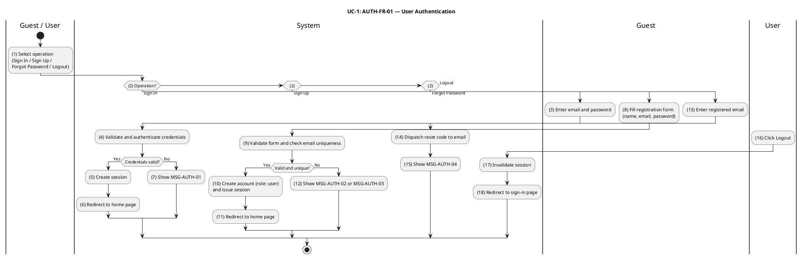
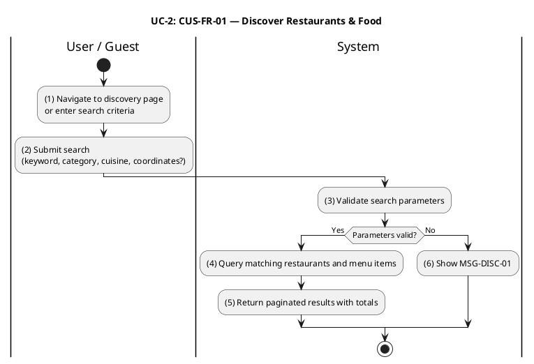
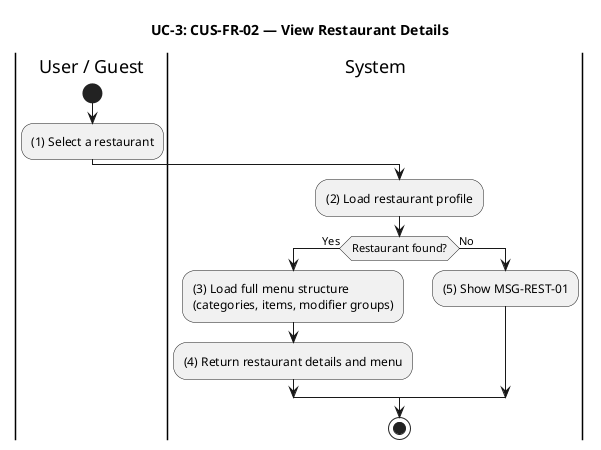
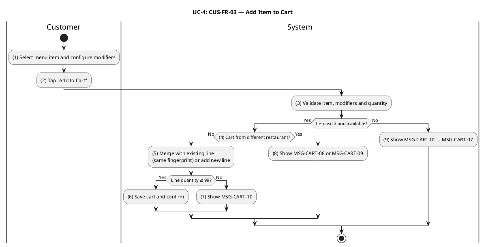
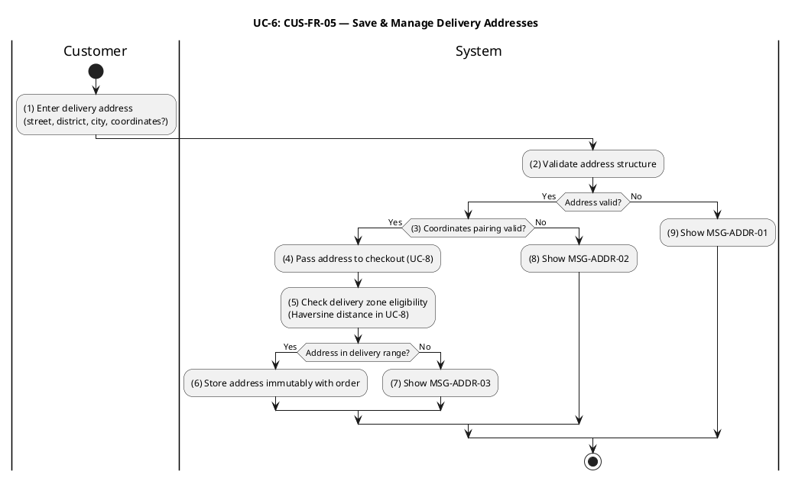
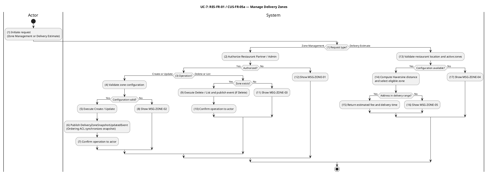
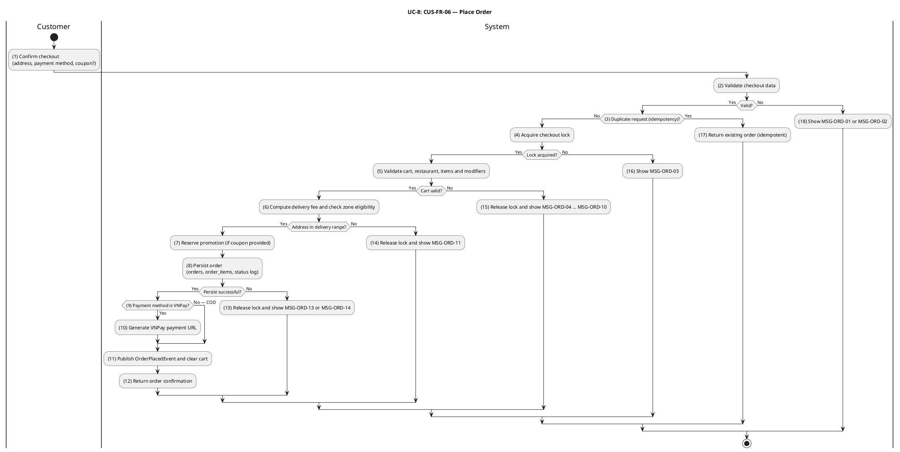
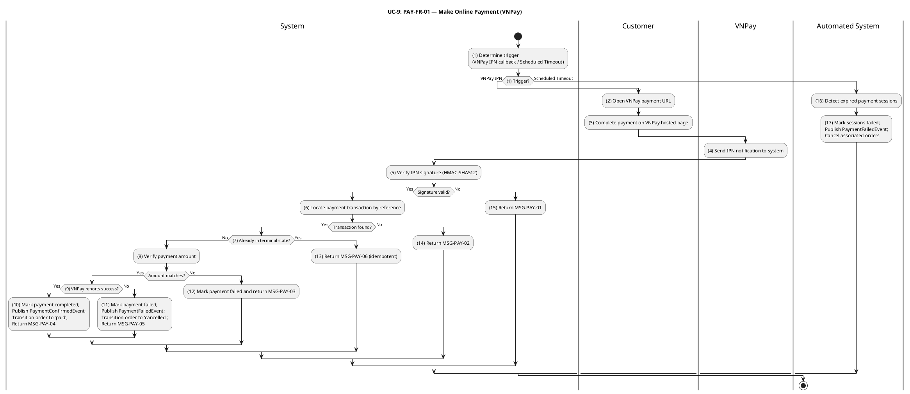
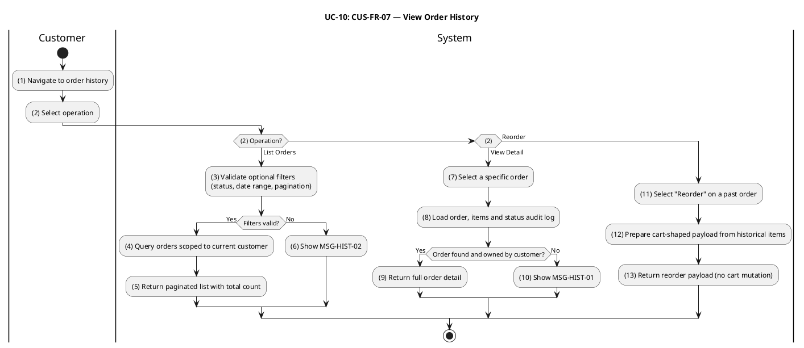

# Software Requirements Specification

## SoLi Food Delivery Application — Phase 1

---

| Field              | Detail                                           |
|--------------------|--------------------------------------------------|
| **Document Title** | Software Requirements Specification — Phase 1    |
| **Version**        | 1.3                                              |
| **Status**         | Draft                                            |
| **Prepared by**    | Development Team                                 |
| **Last Modified**  | 2026-05-14                                       |

---

## Revision History

| Version | Date       | Author           | Summary of Changes                                                                                  |
|---------|------------|------------------|-----------------------------------------------------------------------------------------------------|
| 1.0     | 2025-01-01 | Dev Team         | Initial draft. Document structure, §1 Introduction, 10 functional UCs.                             |
| 1.1     | 2025-01-01 | Dev Team         | Added PlantUML Activity Diagrams and standalone Message Rules tables for all 10 UCs.               |
| 1.2     | 2025-01-01 | Dev Team         | Refactored all Activity Diagrams to business-level style. Merged Message Rules into Business Rules tables per TechMarket SRS conventions. Removed §1.7 (Global Message Code Conventions) — messages are now inline in BR descriptions. |
| 1.3     | 2026-05-14 | Dev Team         | Extracted Message Rules into dedicated per-UC tables (TechMarket-aligned). Renumbered all Activity Diagrams with stable sequential numbering (removed `A`-labels). Refactored all Activity Diagrams to a single end node. Business Rules now reference message codes only — no inline message text. |

---

## Table of Contents

1. [Introduction](#1-introduction)
   - 1.1 Purpose
   - 1.2 Scope
   - 1.3 Intended Audience
   - 1.4 Document Conventions
   - 1.5 Notation
   - 1.6 References
2. [Functional Requirements — Use Cases](#2-functional-requirements--use-cases)
   - UC-1: User Authentication
   - UC-2: Discover Restaurants & Food
   - UC-3: View Restaurant Details
   - UC-4: Add Item to Cart
   - UC-5: Manage Shopping Cart
   - UC-6: Save & Manage Delivery Addresses
   - UC-7: Manage Delivery Zones
   - UC-8: Place Order
   - UC-9: Make Online Payment (VNPay)
   - UC-10: View Order History

---

## 1. Introduction

### 1.1 Purpose

This Software Requirements Specification (SRS) defines the functional requirements for Phase 1 of the **SoLi Food Delivery** application. It serves as the authoritative reference for system behavior shared between design, development, QA, and stakeholder review.

### 1.2 Scope

Phase 1 covers the complete end-to-end ordering flow:
- User authentication and session management
- Restaurant and food discovery
- Cart management and checkout
- Delivery zone configuration
- Order placement and VNPay online payment
- Order history and reorder

Out of scope for Phase 1: driver tracking, restaurant dashboard analytics, loyalty programs, multi-language support, and the customer address book.

### 1.3 Intended Audience

| Audience               | Usage                                                          |
|------------------------|----------------------------------------------------------------|
| Business Analysts      | Validate requirements against business goals                   |
| Developers             | Implementation reference for each functional area              |
| QA Engineers           | Test case derivation from Business Rules                       |
| Product Owners         | Sprint planning and acceptance criteria                        |

### 1.4 Document Conventions

- Use cases are prefixed `UC-N` (e.g., `UC-1`, `UC-8`).
- Business Rules are identified by domain-coded keys (e.g., `BR-AUTH-1`, `BR-8.4`).
- Activity Diagram steps use stable sequential numbering `(1)`, `(2)`, `(3)`, …. Each diagram has exactly **one** end node; both success and error branches converge at this single `stop`.
- Step references in the Business Rules table Activity column use italic parenthetical notation, e.g., _(3)_, _(4)–(5)_.
- Message Rules tables list every customer- or actor-visible message produced by a UC. Codes follow the pattern `MSG-<DOMAIN>-<NN>` (e.g., `MSG-AUTH-01`, `MSG-ORD-13`). Business Rules reference codes only; full message content lives exclusively in the Message Rules table.
- The symbol ❖ introduces a main business rule bullet; ● introduces a sub-item; ➢ introduces a nested detail.

### 1.5 Notation

| Symbol / Format | Meaning                                              |
|-----------------|------------------------------------------------------|
| `'value'`       | Exact string enumeration value (e.g., `'pending'`)   |
| `[field]`       | Variable or data field                               |
| ❖               | Primary business rule bullet                         |
| ●               | Sub-item under a primary bullet                      |
| ➢               | Nested detail under a sub-item                       |
| **Bold**        | Rule-type label within a description cell            |
| `HTTP NNN`      | HTTP status code                                     |

### 1.6 References

| Reference                  | Description                                          |
|----------------------------|------------------------------------------------------|
| `apps/api/src/`            | NestJS backend — authoritative source for all business logic and message text |
| `apps/api/src/drizzle/`    | Drizzle ORM schema — table definitions and enumerations |
| TechMarket SRS v1.0        | Style reference for UC presentation format           |
| VNPay Merchant Integration Guide | IPN signature verification and response codes |

---

## 2. Functional Requirements — Use Cases

---

### UC-1: User Authentication

| Name            | User Authentication                                                                 |
|-----------------|-------------------------------------------------------------------------------------|
| **Description** | This use case describes how users register, sign in, recover their password, sign out, and how the system validates sessions on protected endpoints. |
| **Actor**       | Guest (unauthenticated user), Authenticated User                                    |
| **Trigger**     | ❖ Guest navigates to the Sign In or Sign Up page. ❖ User clicks "Logout". ❖ System receives a request to a protected endpoint with a Bearer token. |
| **Pre-condition** | ❖ For Sign In / Forgot Password: a valid user account exists. ❖ For Sign Up: no duplicate email exists in the system. |
| **Post-condition** | ❖ Sign Up / Sign In: a session is created and the user is redirected to the home page. ❖ Logout: the session is invalidated. ❖ Session Validation: the request proceeds with the authenticated user context. |

#### Activities Flow

#### Business Rules

| Activity | BR Code | Description |
|---|---|---|
| _(3)–(4)_ | _BR-AUTH-1_ | **Validate Rules (Sign In):** ❖ `email` is required and must be a valid email format. ❖ `password` is required and non-empty. ❖ If any required field is missing or malformed, system rejects the request with HTTP 400 referencing `MSG-AUTH-03`. |
| _(7)_ | _BR-AUTH-2_ | **Sign In Failure Rules:** ❖ If email is not found, password is incorrect, or account is banned, system returns HTTP 401 referencing `MSG-AUTH-01`. ❖ The system makes no distinction between failure causes to prevent user enumeration attacks. |
| _(5)_ | _BR-AUTH-3_ | **Session Creation Rules:** ❖ A session record is created with `expiresAt = now + sessionTtl` (default 7 days). ❖ `ipAddress` and `userAgent` are stored for audit purposes. ❖ Session token is returned in the HTTP response and used as a Bearer token on all subsequent requests. |
| _(8)–(9)_ | _BR-AUTH-4_ | **Validate Rules (Sign Up):** ❖ `name` must be a non-empty string. ❖ `email` must be a valid email format. ❖ `password` must be at least 8 characters and contain at least one letter and one digit. ❖ Invalid input returns HTTP 400 referencing `MSG-AUTH-03`. |
| _(12)_ | _BR-AUTH-5_ | **Sign Up Duplicate Email Rules:** ❖ If the email is already registered, system returns HTTP 409 referencing `MSG-AUTH-02`. |
| _(10)_ | _BR-AUTH-6_ | **Account Initialization Rules:** ❖ New accounts are created with `role = 'user'`. ❖ Elevation to `'restaurant'`, `'shipper'`, or `'admin'` is handled in Phase 2/Phase 4 flows. ❖ Passwords are stored as secure hashes; plaintext is never persisted. |
| _(14)–(15)_ | _BR-AUTH-7_ | **Forgot Password Rules:** ❖ System creates a verification record with a single-use OTP valid for 60 minutes. ❖ System responds HTTP 200 referencing `MSG-AUTH-04` regardless of whether the email exists (anti-enumeration). ❖ The OTP is dispatched via the configured channel (email / SMS). |
| _(17)_ | _BR-AUTH-8_ | **Logout Rules:** ❖ The session record is deleted immediately. ❖ Any subsequent requests using the invalidated token receive HTTP 401 referencing `MSG-AUTH-05`. |
| _(all protected routes)_ | _BR-AUTH-9_ | **Session Validation Rules:** ❖ Every protected endpoint requires a valid non-expired Bearer token. ❖ Missing or expired token returns HTTP 401 referencing `MSG-AUTH-05`. ❖ The session's associated user is attached to the request context. |
| _(6)_, _(11)_, _(18)_ | _BR-AUTH-10_ | **Redirect Rules:** ❖ Successful Sign In and Sign Up redirect to the home page. ❖ Successful Logout redirects to the sign-in page. |

#### Message Rules

| Message Code | Message Content | Button |
|---|---|---|
| MSG-AUTH-01 | Invalid email or password. | OK |
| MSG-AUTH-02 | User with this email already exists. | OK |
| MSG-AUTH-03 | Invalid input. Please check the form fields. | OK |
| MSG-AUTH-04 | If the email exists, a reset code has been sent. | OK |
| MSG-AUTH-05 | Unauthorized. | OK |

---

### UC-2: Discover Restaurants & Food

| Name            | Discover Restaurants & Food                                                           |
|-----------------|---------------------------------------------------------------------------------------|
| **Description** | This use case describes how users search for restaurants and menu items by keyword, category, cuisine type, and geographic location. |
| **Actor**       | Guest, Customer                                                                        |
| **Trigger**     | ❖ User navigates to the discovery or search page. ❖ User enters a search query or applies discovery filters. |
| **Pre-condition** | ❖ None. Both authenticated and unauthenticated users may search. |
| **Post-condition** | ❖ System returns a paginated list of matching restaurants and menu items. |

#### Activities Flow

#### Business Rules

| Activity | BR Code | Description |
|---|---|---|
| _(3)_, _(6)_ | _BR-2.1_ | **Validate Rules:** ❖ `lat` and `lon` must be provided together. If only one is present, system returns HTTP 400 referencing `MSG-DISC-01`. ❖ `radiusKm` (if supplied) must be a positive number. |
| _(4)_ | _BR-2.2_ | **Pagination Rules:** ❖ `limit` is clamped to [1, 100]. `offset` is clamped to ≥ 0. ❖ Requests outside these bounds are accepted with clamped values (no error). |
| _(4)_ | _BR-2.3_ | **Restaurant Filter Rules:** ❖ Only restaurants with `isApproved = true` AND `isOpen = true` are included in results. ❖ If `lat`, `lon`, and `radiusKm` are provided, only restaurants within the specified radius are returned. |
| _(4)_ | _BR-2.4_ | **Item Filter Rules:** ❖ Only items with `status = 'available'` are included. ❖ The items array is populated only when at least one of `q`, `category`, or `tag` is provided; otherwise `items: []` is returned. |
| _(4)_ | _BR-2.5_ | **Relevance Scoring Rules:** ❖ Restaurants are scored: exact name match +12, partial name match +9, cuisine match +6, description partial match +2. ❖ Items are scored: exact name match +12, partial name match +8, tag match +5, category match +3. ❖ Ties are broken by stable UUID ordering. |
| _(5)_ | _BR-2.6_ | **Response Rules:** ❖ `total.restaurants` and `total.items` reflect the full match count before pagination is applied. ❖ If no results match the query, system returns HTTP 200 with empty arrays and zero totals — never HTTP 404. |

#### Message Rules

| Message Code | Message Content | Button |
|---|---|---|
| MSG-DISC-01 | lat and lon must both be provided together for geo search. | OK |

---

### UC-3: View Restaurant Details

| Name            | View Restaurant Details                                                               |
|-----------------|---------------------------------------------------------------------------------------|
| **Description** | This use case describes how users view a restaurant's profile and its full menu, including categories, items, and modifier groups. |
| **Actor**       | Guest, Customer                                                                        |
| **Trigger**     | ❖ User clicks a restaurant card from the discovery or search results page.             |
| **Pre-condition** | ❖ None. Available to authenticated and unauthenticated users. |
| **Post-condition** | ❖ System returns the restaurant's profile and complete menu structure. |

#### Activities Flow

#### Business Rules

| Activity | BR Code | Description |
|---|---|---|
| _(2)_ | _BR-3.1_ | **Validate Rules:** ❖ Restaurant `:id` must be a valid UUID format. An invalid format returns HTTP 400. |
| _(2)_, _(5)_ | _BR-3.2_ | **Not Found Rules:** ❖ If no restaurant matches the given ID, system returns HTTP 404 referencing `MSG-REST-01`. ❖ No distinction is made between non-existent and unapproved restaurants to prevent information disclosure. |
| _(3)–(4)_ | _BR-3.3_ | **Menu Display Rules:** ❖ All menu items are returned regardless of availability status (`available`, `out_of_stock`, `unavailable`). ❖ The client is responsible for displaying availability badges. ❖ Availability is enforced server-side only at the point of adding to cart (UC-4, BR-4.2). |

#### Message Rules

| Message Code | Message Content | Button |
|---|---|---|
| MSG-REST-01 | Restaurant {id} not found. | OK |

---

### UC-4: Add Item to Cart

| Name            | Add Item to Cart                                                                        |
|-----------------|-----------------------------------------------------------------------------------------|
| **Description** | This use case describes how a customer adds a menu item with selected modifier options to their shopping cart. |
| **Actor**       | Customer (authenticated, role `'user'`)                                                  |
| **Trigger**     | ❖ Customer taps "Add to Cart" on a menu item in the restaurant detail page.              |
| **Pre-condition** | ❖ Customer is authenticated. ❖ The target restaurant's Ordering ACL snapshot is available. |
| **Post-condition** | ❖ The item is added or merged into the customer's cart. Cart TTL is reset to 7 days. |

#### Activities Flow

#### Business Rules

| Activity | BR Code | Description |
|---|---|---|
| _(3)_ | _BR-4.1_ | **Validate Rules:** ❖ `quantity` must be in [1, 99]. `unitPrice` must be > 0. `menuItemId` and `restaurantId` must be valid UUIDs. `itemName` must be non-empty. ❖ Invalid input returns HTTP 400 with a field-level error message. |
| _(3)_, _(9)_ | _BR-4.2_ | **Item Availability Rules:** ❖ The item must exist in the Ordering ACL snapshot. If no snapshot is found, system returns HTTP 400 referencing `MSG-CART-01`. ❖ Item `status` must be `'available'`. If not, system returns HTTP 409 referencing `MSG-CART-02`. |
| _(3)_, _(9)_ | _BR-4.3_ | **Modifier Validation Rules:** ❖ Each `(groupId, optionId)` pair must exist on the snapshot; the option must be available; per-group selection count must satisfy `minSelections ≤ count ≤ maxSelections`. ● Modifier group not found → HTTP 400 referencing `MSG-CART-03`. ● Modifier option not found → HTTP 400 referencing `MSG-CART-04`. ● Option unavailable → HTTP 400 referencing `MSG-CART-05`. ● Below minimum selections → HTTP 400 referencing `MSG-CART-06`. ● Exceeds maximum selections → HTTP 400 referencing `MSG-CART-07`. |
| _(4)_, _(8)_ | _BR-4.4_ | **Single-Restaurant Cart Rules:** ❖ A customer's cart may only contain items from one restaurant at a time. If the cart already contains items from a different restaurant, system returns HTTP 409 referencing `MSG-CART-08`. ❖ If the ACL snapshot's `restaurantId` mismatches the request `restaurantId`, system returns HTTP 409 referencing `MSG-CART-09`. |
| _(5)_, _(7)_ | _BR-4.5_ | **Merge and Quantity Rules:** ❖ Line item identity is defined by `(menuItemId, modifierFingerprint)`. Adding the same item with identical modifier selections increments the existing line's quantity rather than creating a duplicate. ❖ The per-line quantity ceiling is 99. If adding would exceed this, system returns HTTP 400 referencing `MSG-CART-10`. |
| _(5)–(6)_ | _BR-4.6_ | **Cart Persistence Rules:** ❖ Cart data is stored in Redis under the key `cart:<customerId>`. ❖ Every successful cart mutation resets the Redis TTL to 7 days. |

#### Message Rules

| Message Code | Message Content | Button |
|---|---|---|
| MSG-CART-01 | Menu item {menuItemId} has no local snapshot. Cannot validate modifier options. Please try again or contact support. | OK |
| MSG-CART-02 | Menu item '{itemName}' is currently not available (status: {status}). | OK |
| MSG-CART-03 | Modifier group {groupId} does not exist on this menu item. | OK |
| MSG-CART-04 | Modifier option {optionId} does not exist in group '{groupName}'. | OK |
| MSG-CART-05 | Modifier option '{optionName}' in group '{groupName}' is currently unavailable. | OK |
| MSG-CART-06 | Modifier group '{groupName}' requires at least {minSelections} selection(s), got {count}. | OK |
| MSG-CART-07 | Modifier group '{groupName}' allows at most {maxSelections} selection(s). | OK |
| MSG-CART-08 | Cart already contains items from restaurant '{restaurantName}'. Clear your cart before adding items from a different restaurant. | OK |
| MSG-CART-09 | Menu item {menuItemId} does not belong to restaurant {restaurantId}. | OK |
| MSG-CART-10 | Total quantity for item '{itemName}' would exceed the maximum of 99. | OK |

---

### UC-5: Manage Shopping Cart

| Name            | Manage Shopping Cart                                                                    |
|-----------------|-----------------------------------------------------------------------------------------|
| **Description** | This use case describes how a customer views, modifies, and clears their shopping cart prior to checkout. |
| **Actor**       | Customer (authenticated, role `'user'`)                                                  |
| **Trigger**     | ❖ Customer navigates to the cart screen. ❖ Customer taps an update, remove, or clear action. |
| **Pre-condition** | ❖ Customer is authenticated. |
| **Post-condition** | ❖ Cart reflects the requested change. If the cart becomes empty, it is deleted and subsequent reads return null. |

#### Activities Flow

#### Business Rules

| Activity | BR Code | Description |
|---|---|---|
| _(3)_ | _BR-5.1_ | **Cart Access Rules:** ❖ Cart is strictly scoped to the authenticated customer (`customerId = session.user.id`). ❖ If no cart exists for the customer, system returns HTTP 200 with `null`. |
| _(4)–(5)_, _(6)_ | _BR-5.2_ | **Update Quantity Rules:** ❖ `quantity` must be in [0, 99]. ❖ Setting `quantity = 0` is equivalent to removing the line item (same behavior as the Remove Item operation). ❖ If the `cartItemId` is not found in the customer's cart, system returns HTTP 404 referencing `MSG-CART-11`. |
| _(7)–(8)_, _(9)_ | _BR-5.3_ | **Update Modifiers Rules:** ❖ The modifier set is replaced wholesale. Modifier validation reuses the rules in BR-4.3 (`MSG-CART-03` … `MSG-CART-07`). ❖ If the new modifier selection produces a fingerprint that collides with an existing line, the two lines are merged subject to the 99-unit per-line ceiling. ❖ Overflow on merge returns HTTP 400 referencing `MSG-CART-10`. |
| _(10)_, _(11)_ | _BR-5.4_ | **Remove Item Rules:** ❖ If the `cartItemId` is not found in the customer's cart, system returns HTTP 404 referencing `MSG-CART-11`. |
| _(12)_ | _BR-5.5_ | **Clear Cart Rules:** ❖ Clear Cart is idempotent. Clearing an already-empty cart returns HTTP 204 without error. |
| _(5)_, _(10)_, _(12)–(13)_ | _BR-5.6_ | **Cart Empty State Rules:** ❖ When the last item is removed (by Update Qty to 0, Remove Item, or Clear Cart), the Redis key is deleted. Subsequent GET requests return `null`. Deletion operations return HTTP 204 No Content. |
| _(5)_, _(8)_, _(10)_, _(12)_ | _BR-5.7_ | **TTL Reset Rules:** ❖ Every successful cart mutation resets the Redis TTL to 7 days. ❖ Read-only GET (View Cart) does not reset the TTL. |

#### Message Rules

| Message Code | Message Content | Button |
|---|---|---|
| MSG-CART-11 | Cart item {cartItemId} is not in your cart. | OK |

> Note: UC-5 also references `MSG-CART-03` … `MSG-CART-07` and `MSG-CART-10` defined in UC-4 (modifier validation and per-line quantity overflow).

---

### UC-6: Save & Manage Delivery Addresses

| Name            | Save & Manage Delivery Addresses                                                        |
|-----------------|-----------------------------------------------------------------------------------------|
| **Description** | This use case describes how a customer provides a delivery address at checkout. The address is validated, captured into the order, and checked for delivery zone eligibility. |
| **Actor**       | Customer (authenticated, role `'user'`)                                                  |
| **Trigger**     | ❖ Customer proceeds to checkout and enters a delivery address.                           |
| **Pre-condition** | ❖ Customer is authenticated and has a non-empty cart. |
| **Post-condition** | ❖ Delivery address is captured and immutably stored with the placed order. |

#### Activities Flow

#### Business Rules

| Activity | BR Code | Description |
|---|---|---|
| _(2)–(3)_, _(8)_, _(9)_ | _BR-6.1_ | **Validate Rules:** ❖ `street`, `district`, and `city` are required non-empty strings. ❖ `latitude` and `longitude` are optional, but if either is provided both must be present. ❖ Coordinates must lie within Vietnam's geographic bounds. ❖ Invalid input returns HTTP 400 referencing `MSG-ADDR-01` (general validation) or `MSG-ADDR-02` (coordinate pairing). |
| _(4)–(5)_, _(7)_ | _BR-6.2_ | **Delivery Zone Eligibility Rules (via UC-8):** ❖ Delivery eligibility is evaluated at checkout (UC-8, BR-8.6) via Haversine distance between the address coordinates and the restaurant's delivery zone center. ❖ The innermost eligible zone is selected. If the address falls outside all active delivery zones, system returns HTTP 422 referencing `MSG-ADDR-03`. |
| _(6)_ | _BR-6.3_ | **Address Immutability Rules:** ❖ The delivery address is stored in the `orders.delivery_address` JSONB column at order placement. ❖ Once stored, it cannot be changed. Address correction requires order cancellation and re-placement. |
| _—_ | _BR-6.4_ | **Address Book (Deferred):** ❖ A persistent customer address book (`customer_addresses` table) is not implemented in Phase 1. Addresses are captured inline at checkout only. Future releases will support address save, list, update, and delete. |

#### Message Rules

| Message Code | Message Content | Button |
|---|---|---|
| MSG-ADDR-01 | Address validation failed. Street, district, and city are required; coordinates (if provided) must lie within Vietnam. | OK |
| MSG-ADDR-02 | lat and lon must both be provided together. | OK |
| MSG-ADDR-03 | Your location is {distanceKm} km from the restaurant, which is outside all delivery zones. | OK |

---

### UC-7: Manage Delivery Zones

| Name            | Manage Delivery Zones                                                                   |
|-----------------|-----------------------------------------------------------------------------------------|
| **Description** | This use case describes how restaurant partners and administrators configure delivery zones (create, update, delete, list), and how customers request a delivery fee and ETA estimate. |
| **Actor**       | Restaurant Partner (role `'restaurant'`), Administrator (role `'admin'`), Customer (estimate only) |
| **Trigger**     | ❖ Restaurant Partner navigates to the delivery zone management screen. ❖ Customer requests a delivery estimate from the restaurant detail page. |
| **Pre-condition** | ❖ Zone management: actor is authenticated as Restaurant Partner or Admin. ❖ Estimate: restaurant has a configured location and at least one active delivery zone. |
| **Post-condition** | ❖ Zone management: zone is created, updated, or deleted; ACL snapshot is synchronized. ❖ Estimate: system returns the computed delivery fee and estimated time. |

#### Activities Flow

#### Business Rules

| Activity | BR Code | Description |
|---|---|---|
| _(2)_, _(12)_ | _BR-7.1_ | **Authorization Rules:** ❖ Restaurant Partners may manage zones only for restaurants they own. Administrators may manage zones for any restaurant. ❖ Unauthorized access returns HTTP 403 referencing `MSG-ZONE-01`. |
| _(4)_, _(8)_ | _BR-7.2_ | **Zone Validate Rules:** ❖ `name` must be non-empty. `radiusKm` must be ≥ 0.1. `baseFee` and `perKmRate` must be non-negative integers that are exact multiples of 1,000 VND. `avgSpeedKmh` must be in [1, 120]. `prepTimeMinutes` and `bufferMinutes` must be ≥ 0. ❖ Invalid input returns HTTP 400 referencing `MSG-ZONE-02`. |
| _(9)_, _(11)_ | _BR-7.3_ | **Zone Not Found Rules:** ❖ Update or Delete on a non-existent zone ID returns HTTP 404 referencing `MSG-ZONE-03`. |
| _(6)_, _(9)_ | _BR-7.4_ | **ACL Synchronization Rules:** ❖ Every successful Create, Update, or Delete publishes a `DeliveryZoneSnapshotUpdatedEvent`. ❖ The Ordering ACL projector handles this event by upserting or removing the corresponding snapshot row. ❖ UC-8 (Place Order) reads zone data exclusively from this ACL projection, never from the zones service directly. |
| _(13)_, _(17)_ | _BR-7.5_ | **Estimate Precondition Rules:** ❖ If the restaurant has no configured `latitude` / `longitude`, or has no active delivery zones, system returns HTTP 422 referencing `MSG-ZONE-04`. |
| _(14)_, _(16)_ | _BR-7.6_ | **Zone Selection Rules:** ❖ A zone is eligible when the Haversine distance from the restaurant to the customer's address is ≤ zone `radiusKm`. ❖ When multiple zones are eligible, the innermost zone (smallest `radiusKm`) is selected. ❖ If no zone is eligible, system returns HTTP 422 referencing `MSG-ZONE-05`. |
| _(15)_ | _BR-7.7_ | **Fee and ETA Calculation Rules:** ❖ `shippingFee = round((baseFee + distanceKm × perKmRate) / 1000) × 1000` (rounded to the nearest 1,000 VND). ❖ `estimatedDeliveryMinutes = ceil(prepTimeMinutes + (distanceKm / avgSpeedKmh) × 60 + bufferMinutes)`. |

#### Message Rules

| Message Code | Message Content | Button |
|---|---|---|
| MSG-ZONE-01 | You do not own this restaurant. | OK |
| MSG-ZONE-02 | Invalid zone configuration. Fee values must be non-negative integer multiples of 1,000 VND; radius, speed and time values must satisfy declared ranges. | OK |
| MSG-ZONE-03 | Delivery zone not found. | OK |
| MSG-ZONE-04 | This restaurant has not configured its location yet, or has no active delivery zones. | OK |
| MSG-ZONE-05 | Your location is {distanceKm} km from the restaurant, which is outside all delivery zones. | OK |

---

### UC-8: Place Order

| Name            | Place Order                                                                             |
|-----------------|-----------------------------------------------------------------------------------------|
| **Description** | This use case describes the complete checkout flow in which a customer submits their cart to create an order. The system validates the cart contents, computes the final price, applies any promotion, persists the order, and initiates payment if the customer selected VNPay. |
| **Actor**       | Customer (authenticated, role `'user'`)                                                  |
| **Trigger**     | ❖ Customer taps "Place Order" on the checkout confirmation screen.                       |
| **Pre-condition** | ❖ Customer is authenticated. ❖ Cart is non-empty. ❖ Delivery address is provided. ❖ Payment method is selected. |
| **Post-condition** | ❖ Order is persisted with `status = 'pending'`. Cart is cleared. For VNPay, a payment URL is returned. |

#### Activities Flow

#### Business Rules

| Activity | BR Code | Description |
|---|---|---|
| _(2)_, _(18)_ | _BR-8.1_ | **Validate Rules:** ❖ `paymentMethod` must be one of `{'cod', 'vnpay'}`. ❖ `deliveryAddress` must satisfy address validation rules (BR-6.1). ❖ `note` must be ≤ 500 characters. ❖ `X-Idempotency-Key` (if present) must be a UUID string of 8–64 hexadecimal characters with optional hyphens. ❖ Invalid input returns HTTP 400 referencing `MSG-ORD-01` (general validation) or `MSG-ORD-02` (idempotency key format). |
| _(3)_, _(17)_ | _BR-8.2_ | **Idempotency Rules:** ❖ If an `X-Idempotency-Key` is present and a cached `orderId` already exists for that key, system returns the existing order response without re-processing. ❖ The idempotency record is written after successful order persistence so that partial failures do not cache a stale state. |
| _(4)_, _(16)_ | _BR-8.3_ | **Concurrency Lock Rules:** ❖ System acquires a Redis `SET NX` lock at `cart:<customerId>:lock` with a 30-second TTL before processing. ❖ If the lock is already held, system returns HTTP 409 referencing `MSG-ORD-03`. ❖ The lock is released in a `finally` block to guarantee release even on exception. |
| _(5)_, _(15)_ | _BR-8.4_ | **Cart Validate Rules:** ❖ Cart must be non-empty. If empty, system returns HTTP 400 referencing `MSG-ORD-04`. ❖ The restaurant's Ordering ACL snapshot must exist. If missing, system returns HTTP 422 referencing `MSG-ORD-05`. ❖ Restaurant must have `isApproved = true`. If not, HTTP 422 referencing `MSG-ORD-06`. ❖ Restaurant must have `isOpen = true`. If not, HTTP 422 referencing `MSG-ORD-07`. |
| _(5)_, _(15)_ | _BR-8.5_ | **Item and Modifier Validation Rules:** ❖ Each cart item's Ordering ACL snapshot must exist. Delisted item → HTTP 422 referencing `MSG-ORD-08`. ❖ Item's `restaurantId` in snapshot must match cart's restaurant. Mismatch → HTTP 422 referencing `MSG-ORD-09`. ❖ Item `status` must be `'available'`. If `'out_of_stock'` or `'unavailable'` → HTTP 422 referencing `MSG-ORD-10`. ❖ Modifier groups, options, availability flags, and min/max constraints are re-validated against the current ACL snapshot at checkout time. |
| _(6)_, _(14)_ | _BR-8.6_ | **Delivery Pricing Rules:** ❖ Haversine distance is computed against the restaurant's delivery zone snapshots. The innermost eligible zone is selected (per BR-7.6). ❖ If the delivery address falls outside all zones → HTTP 422 referencing `MSG-ORD-11`. ❖ `shippingFee` is computed per BR-7.7. ❖ If coordinates or zone snapshots are unavailable, `shippingFee = 0` and a warning is logged (graceful degradation). |
| _(7)_ | _BR-8.7_ | **Promotion Reservation Rules:** ❖ Promotion reservation is non-blocking. If reservation fails or returns `discountAmount = 0`, checkout continues without a discount. ❖ Promotion usage is confirmed after successful order persistence. Failures in confirmation are reconciled by a scheduled task (Phase 3). |
| _(8)_, _(13)_ | _BR-8.8_ | **Server-Authoritative Pricing Rules:** ❖ Order line `unitPrice` and modifier prices are taken from ACL snapshots at checkout time, not from the values stored at add-to-cart time. ❖ `itemsTotal` must be > 0. If ≤ 0 → HTTP 422 referencing `MSG-ORD-12`. ❖ `totalAmount = max(0, itemsTotal + shippingFee − discountAmount)`. |
| _(8)_, _(13)_ | _BR-8.9_ | **Atomic Persistence Rules:** ❖ The `orders`, `order_items`, and initial `order_status_logs` row are inserted in a single database transaction. ❖ A `UNIQUE` constraint on `orders.cartId` prevents two orders from the same cart. ❖ Duplicate constraint violation → HTTP 409 referencing `MSG-ORD-13`. ❖ Generic database failure → HTTP 500 referencing `MSG-ORD-14`. |
| _(8)_ | _BR-8.10_ | **Initial Order State Rules:** ❖ New order `status = 'pending'`. ❖ `expiresAt = now + RESTAURANT_ACCEPT_TIMEOUT_SECONDS` (default 600 s). Orders not acknowledged by the restaurant within this window are auto-cancelled (Phase 2). |
| _(9)–(10)_ | _BR-8.11_ | **Payment Initiation Rules:** ❖ For `paymentMethod = 'vnpay'`: a `payment_transactions` row is created with `status = 'pending'`, and a VNPay redirect URL is generated and included in the response. ❖ For `paymentMethod = 'cod'`: no payment transaction is created at checkout; payment is collected at delivery. ❖ VNPay URL generation failure is logged but non-blocking; payment timeout reconciliation is handled by UC-9 (BR-9.7). |
| _(11)–(12)_ | _BR-8.12_ | **Post-Persistence Rules:** ❖ `OrderPlacedEvent` is published exactly once after successful persistence. ❖ Cart deletion (`cart:<customerId>`) is best-effort; failure does not invalidate the order. ❖ Successful response: HTTP 201 referencing `MSG-ORD-15` with payload `{ orderId, status: 'pending', totalAmount, shippingFee, discountAmount, paymentUrl?, estimatedDeliveryMinutes? }`. |

#### Message Rules

| Message Code | Message Content | Button |
|---|---|---|
| MSG-ORD-01 | Invalid checkout data. Please review payment method, delivery address and note. | OK |
| MSG-ORD-02 | X-Idempotency-Key must be a UUID string (8–64 hexadecimal characters with optional hyphens). | OK |
| MSG-ORD-03 | A checkout is already in progress for your cart. Please wait and try again. | OK |
| MSG-ORD-04 | No active cart found for customer {customerId}. Add items before checking out. | OK |
| MSG-ORD-05 | Restaurant {restaurantId} is not available in the ordering system. | OK |
| MSG-ORD-06 | Restaurant '{restaurantName}' is not approved to receive orders. | OK |
| MSG-ORD-07 | Restaurant '{restaurantName}' is currently closed. Please try again later. | OK |
| MSG-ORD-08 | Menu item '{itemName}' is no longer available. Please remove it from your cart and try again. | OK |
| MSG-ORD-09 | Menu item '{itemName}' does not belong to the selected restaurant. Cart integrity violation — please clear your cart and try again. | OK |
| MSG-ORD-10 | Menu item '{snapshotName}' is currently {reason}. Please remove it from your cart and try again. | OK |
| MSG-ORD-11 | Your location is {distanceKm} km from the restaurant, which is outside all delivery zones. | OK |
| MSG-ORD-12 | Order total must be greater than zero. | OK |
| MSG-ORD-13 | An order for this cart has already been placed. Duplicate order rejected. | OK |
| MSG-ORD-14 | Failed to place order. Please try again. | OK |
| MSG-ORD-15 | Your order has been placed successfully. | OK |

---

### UC-9: Make Online Payment (VNPay)

| Name            | Make Online Payment (VNPay)                                                             |
|-----------------|-----------------------------------------------------------------------------------------|
| **Description** | This use case describes how a customer completes payment through VNPay, how the system processes the IPN (Instant Payment Notification) callback, and how payment timeout is handled. |
| **Actor**       | Customer, VNPay (external payment gateway), Automated System (timeout scheduler)        |
| **Trigger**     | ❖ Customer opens the VNPay payment URL received from UC-8. ❖ VNPay sends an IPN to the system after the customer completes or abandons payment. ❖ Scheduled task detects expired payment sessions. |
| **Pre-condition** | ❖ Order has `status = 'pending'` and `paymentMethod = 'vnpay'`. ❖ A `payment_transactions` row with `status = 'pending'` exists for the order. |
| **Post-condition** | ❖ Payment Success: `payment_transactions.status = 'completed'`; order transitions to `'paid'`. ❖ Payment Failure or Timeout: `payment_transactions.status = 'failed'`; order transitions to `'cancelled'`. |

#### Activities Flow

#### Business Rules

| Activity | BR Code | Description |
|---|---|---|
| _(5)_, _(15)_ | _BR-9.1_ | **Signature Verification Rules:** ❖ The IPN signature is verified using HMAC-SHA512 over the sorted VNPay query parameters with the merchant secret key, using a constant-time comparison to prevent timing attacks. ❖ Signature verification is the mandatory first step before any database access. ❖ Invalid signature → system returns `MSG-PAY-01` (RspCode 97). |
| _(6)_, _(14)_ | _BR-9.2_ | **Transaction Lookup Rules:** ❖ `vnp_TxnRef` is used to resolve the `payment_transactions` record. ❖ If not found → system returns `MSG-PAY-02` (RspCode 01). |
| _(7)_, _(13)_ | _BR-9.3_ | **Idempotency Rules:** ❖ If the transaction is already in a terminal state (`'completed'`, `'failed'`, `'refund_pending'`, `'refunded'`), system acknowledges with `MSG-PAY-06` (RspCode 00) without making any further state change. |
| _(8)_, _(12)_ | _BR-9.4_ | **Amount Integrity Rules:** ❖ `vnp_Amount` divided by 100 must exactly match `payment_transactions.amount`. ❖ Any mismatch marks the transaction `'failed'` and returns `MSG-PAY-03` (RspCode 04). |
| _(10)_ | _BR-9.5_ | **Payment Success Rules:** ❖ On success: `payment_transactions.status = 'completed'`, and `paidAt`, `providerTxnId`, `rawIpnPayload` are recorded. ❖ `PaymentConfirmedEvent` is published. ❖ Order lifecycle listener transitions the order from `'pending'` to `'paid'`. ❖ System returns `MSG-PAY-04` (RspCode 00) to stop VNPay retry attempts. ❖ Concurrent IPN deliveries are resolved by optimistic locking on the `version` field. A concurrency conflict returns `MSG-PAY-07` (RspCode 99), prompting VNPay to retry. |
| _(11)_ | _BR-9.6_ | **Payment Failure Rules:** ❖ On VNPay failure response: `payment_transactions.status = 'failed'`, `vnpResponseCode`, and `rawIpnPayload` are recorded. ❖ `PaymentFailedEvent` is published. ❖ Order lifecycle listener transitions the order from `'pending'` to `'cancelled'`. ❖ System returns `MSG-PAY-05` (RspCode 00) to stop VNPay retry attempts. |
| _(16)–(17)_ | _BR-9.7_ | **Payment Timeout Rules:** ❖ `payment_transactions.expiresAt = now + PAYMENT_SESSION_TIMEOUT_SECONDS`. ❖ A scheduled `PaymentTimeoutTask` queries transactions with `status ∈ {'pending', 'awaiting_ipn'}` AND `expiresAt < now`. For each matching record, the task marks the transaction `'failed'`, publishes `PaymentFailedEvent`, and triggers order cancellation. |
| _—_ | _BR-9.8_ | **Return URL Rules:** ❖ The browser return URL (`/payments/vnpay/return`) is read-only. It verifies the signature and reads transaction status for UI feedback only. ❖ The return URL must never mutate database state. Authoritative payment outcome is determined exclusively by the IPN endpoint. |

#### Message Rules

| Message Code | Message Content | Button |
|---|---|---|
| MSG-PAY-01 | Invalid signature. (VNPay RspCode 97) | — |
| MSG-PAY-02 | Transaction not found. (VNPay RspCode 01) | — |
| MSG-PAY-03 | Amount mismatch. (VNPay RspCode 04) | — |
| MSG-PAY-04 | Confirmed. (VNPay RspCode 00 — payment success acknowledged) | — |
| MSG-PAY-05 | Processed. (VNPay RspCode 00 — payment failure acknowledged) | — |
| MSG-PAY-06 | Transaction already processed. (VNPay RspCode 00 — idempotent acknowledgement) | — |
| MSG-PAY-07 | Concurrent processing conflict. (VNPay RspCode 99) | — |

---

### UC-10: View Order History

| Name            | View Order History                                                                      |
|-----------------|-----------------------------------------------------------------------------------------|
| **Description** | This use case describes how a customer views their past orders, retrieves a detailed view of a specific order (including the status audit log), and initiates a reorder. |
| **Actor**       | Customer (authenticated, role `'user'`)                                                  |
| **Trigger**     | ❖ Customer navigates to the "Orders" or "Order History" screen. ❖ Customer selects a past order for detail. ❖ Customer taps "Reorder" on a past order. |
| **Pre-condition** | ❖ Customer is authenticated. |
| **Post-condition** | ❖ List: system returns a paginated list of the customer's orders. ❖ Detail: system returns the full order with item list and status audit log. ❖ Reorder: system returns a cart-shaped payload ready for the customer to submit via UC-4. |

#### Activities Flow

#### Business Rules

| Activity | BR Code | Description |
|---|---|---|
| _(3)_, _(6)_ | _BR-10.1_ | **Filter Validate Rules:** ❖ `status` (if supplied) must match a canonical order status enum value (`'pending'`, `'paid'`, `'confirmed'`, `'preparing'`, `'ready_for_pickup'`, `'picked_up'`, `'delivering'`, `'delivered'`, `'cancelled'`, `'refunded'`). ❖ When both `minDate` and `maxDate` are supplied, `minDate ≤ maxDate` must hold. ❖ `limit` must be in [1, 100]; `offset` must be ≥ 0. ❖ Invalid filter values return HTTP 400 referencing `MSG-HIST-02`. |
| _(4)–(5)_ | _BR-10.2_ | **Ownership Scoping Rules:** ❖ The query is hard-scoped by `customerId = session.user.id`. No `customerId` query parameter is accepted from the client. ❖ Results are ordered by `createdAt DESC`. ❖ `total` reflects the full match count before pagination. |
| _(4)_ | _BR-10.3_ | **List Summary Aggregation Rules:** ❖ Each order row in the list response includes `itemCount` (sum of `order_items.quantity` for that order) and `firstItemName` (the name of the line item with the lowest insertion order). |
| _(8)_, _(10)_ | _BR-10.4_ | **Order Access Rules:** ❖ System loads the order by ID. If the order does not exist, or it exists but belongs to a different customer, system returns HTTP 404 referencing `MSG-HIST-01`. ❖ A uniform 404 is returned in both cases to prevent ownership disclosure. |
| _(8)–(9)_ | _BR-10.5_ | **Detail Completeness Rules:** ❖ The detail response includes the complete `order_status_logs` array in chronological order. ❖ Each log entry includes: `fromStatus`, `toStatus`, `triggeredByRole`, optional `note`, and `createdAt`. |
| _(12)–(13)_ | _BR-10.6_ | **Reorder Rules:** ❖ No server-side cart mutation occurs during reorder. System returns a cart-shaped payload derived from the historical `order_items` data. ❖ The client uses this payload to call UC-4 (Add Item to Cart). ❖ Historical prices and item names in the reorder payload may not reflect the current catalog. UC-4 re-validates all items, modifiers, and prices against the current ACL snapshot at the point of submission. |

#### Message Rules

| Message Code | Message Content | Button |
|---|---|---|
| MSG-HIST-01 | Order {orderId} not found. | OK |
| MSG-HIST-02 | Invalid filter values. Status must be a canonical order state; date range must satisfy minDate ≤ maxDate; limit ∈ [1, 100]; offset ≥ 0. | OK |

---

*End of Software Requirements Specification — Phase 1, Version 1.3*
