# Appendix SD — Sequence Diagrams Specification

## SoLi Food Delivery Application

---

| Field | Value |
|-------|-------|
| **Document Title** | Appendix SD — Sequence Diagrams Specification |
| **Version** | 2.0 |
| **Status** | Final — Submission Ready |
| **Prepared For** | Software Requirements Specification — Final Submission |
| **Project** | SoLi Food Delivery Application |
| **Scope** | UC-1 through UC-35 — Enterprise-Style PlantUML Sequence Diagrams |
| **Diagram Count** | 35 |
| **Traceability Source** | SRS_FoodDelivery.md Activity Diagram step numbers |

---

**Traceability Statement**

All root message numbers in each sequence diagram correspond **directly** to the activity step numbers in the matching UC section of `SRS_FoodDelivery.md`. No numbering divergence exists; verification can be performed by cross-referencing the activity diagram of each use case with the sequence messages bearing the same step label.

---

## Table of Contents

1. [Customer Module — SD-1 through SD-10](#customer-module)
   - [SD-1: UC-1 — User Authentication](#sd-1)
   - [SD-2: UC-2 — Discover Restaurants & Food](#sd-2)
   - [SD-3: UC-3 — View Restaurant Details](#sd-3)
   - [SD-4: UC-4 — Add Item to Cart](#sd-4)
   - [SD-5: UC-5 — Manage Shopping Cart](#sd-5)
   - [SD-6: UC-6 — Save & Manage Delivery Addresses](#sd-6)
   - [SD-7: UC-7 — Manage Delivery Zones](#sd-7)
   - [SD-8: UC-8 — Place Order](#sd-8)
   - [SD-9: UC-9 — Make Online Payment (VNPay)](#sd-9)
   - [SD-10: UC-10 — View Order History](#sd-10)
2. [Restaurant Module — SD-11 through SD-15](#restaurant-module)
   - [SD-11: UC-11 — Restaurant Registration & Profile Management](#sd-11)
   - [SD-12: UC-12 — Manage Menu Catalog](#sd-12)
   - [SD-13: UC-13 — Toggle Item & Restaurant Availability](#sd-13)
   - [SD-14: UC-14 — Accept or Reject Order](#sd-14)
   - [SD-15: UC-15 — Prepare Order for Pickup](#sd-15)
3. [Shipper Module — SD-16 through SD-19](#shipper-module)
   - [SD-16: UC-16 — Shipper Registration](#sd-16)
   - [SD-17: UC-17 — Manage Shipper Availability](#sd-17)
   - [SD-18: UC-18 — Accept Delivery Assignment](#sd-18)
   - [SD-19: UC-19 — Deliver Order](#sd-19)
4. [Shared Platform Services — SD-20 through SD-26](#shared-platform-services)
   - [SD-20: UC-20 — Track Order Status](#sd-20)
   - [SD-21: UC-21 — Cancel Order](#sd-21)
   - [SD-22: UC-22 — Submit Rating & Review](#sd-22)
   - [SD-23: UC-23 — Manage Restaurant Promotions](#sd-23)
   - [SD-24: UC-24 — Manage Platform Promotions](#sd-24)
   - [SD-25: UC-25 — Process Payment Refund](#sd-25)
   - [SD-26: UC-26 — Manage Real-Time Notifications](#sd-26)
5. [Administration and Governance — SD-27 through SD-35](#administration-and-governance)
   - [SD-27: UC-27 — Approve or Reject Restaurant Applications](#sd-27)
   - [SD-28: UC-28 — Approve or Reject Shipper Applications](#sd-28)
   - [SD-29: UC-29 — Suspend or Reactivate Partner Accounts](#sd-29)
   - [SD-30: UC-30 — Monitor Orders and Platform Health](#sd-30)
   - [SD-31: UC-31 — Search and Manage User Accounts](#sd-31)
   - [SD-32: UC-32 — Administrative Order Cancellation & Refund](#sd-32)
   - [SD-33: UC-33 — View and Export Operational Reports](#sd-33)
   - [SD-34: UC-34 — View Dashboard & Platform Overview](#sd-34)
   - [SD-35: UC-35 — Manage Admin Roles & Permissions](#sd-35)

---

<div style="page-break-before: always;"></div>

## Customer Module

### Foundation and Customer Ordering Core

This module covers all customer-facing flows from initial authentication through cart management, address management, delivery zone discovery, order placement, online payment, and order history retrieval. It forms the transactional core of the SoLi Food Delivery platform.

---

### SD-1 — UC-1: User Authentication

| Attribute | Value |
|-----------|-------|
| **SD ID** | SD-1 |
| **Use Case** | UC-1 — User Authentication |
| **Module** | Customer Module |
| **Primary Actors** | Guest / Authenticated User |
| **Primary Service** | Authentication Service |
| **Related Services** | OTP Service |
| **Complexity** | Medium |
| **Trace Source** | SRS_FoodDelivery.md UC-1 Activity Diagram steps 1-20 |

**Overview**

End-to-end authentication flow covering sign-in with session creation, new account registration with email uniqueness validation, and password reset via email-delivered OTP. All interaction step numbers correspond directly to numbered activity steps in SRS UC-1.

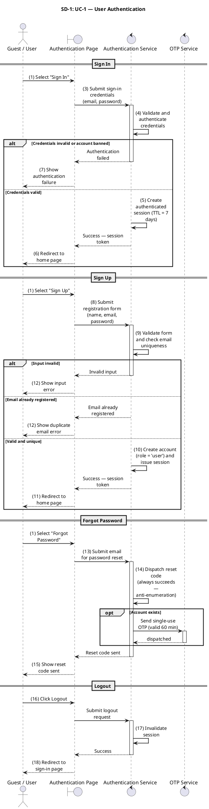

---

### SD-2 — UC-2: Discover Restaurants & Food

| Attribute | Value |
|-----------|-------|
| **SD ID** | SD-2 |
| **Use Case** | UC-2 — Discover Restaurants & Food |
| **Module** | Customer Module |
| **Primary Actors** | User / Guest |
| **Primary Service** | Search Service |
| **Related Services** | Restaurant & Menu Catalog |
| **Complexity** | Low |
| **Trace Source** | SRS_FoodDelivery.md UC-2 Activity Diagram steps 1-6 |

**Overview**

Search and discovery flow for browsing restaurants and menu items with keyword, category, cuisine, and geolocation-based filters. Returns paginated results from the restaurant and menu catalog with availability and approval status applied.

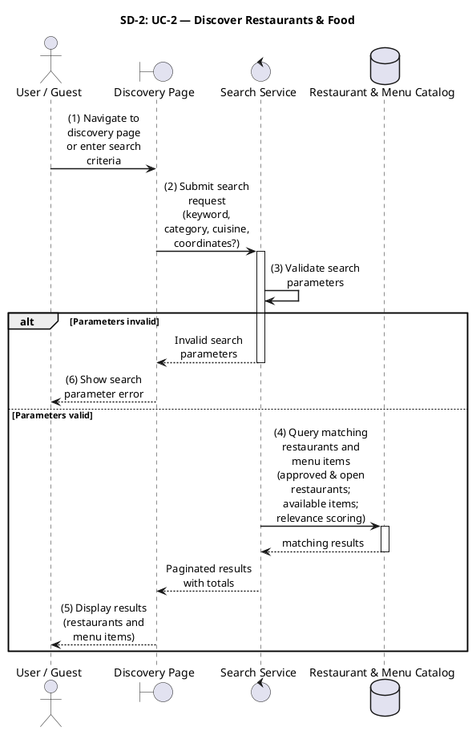

---

### SD-3 — UC-3: View Restaurant Details

| Attribute | Value |
|-----------|-------|
| **SD ID** | SD-3 |
| **Use Case** | UC-3 — View Restaurant Details |
| **Module** | Customer Module |
| **Primary Actors** | User / Guest |
| **Primary Service** | Restaurant Service |
| **Related Services** | Menu Catalog, Promotion Service |
| **Complexity** | Low |
| **Trace Source** | SRS_FoodDelivery.md UC-3 Activity Diagram steps 1-6 |

**Overview**

Retrieval of a single restaurant's full profile, menu catalog, and active promotions. Returns combined restaurant detail including operating hours, zone coverage, and item availability snapshot.

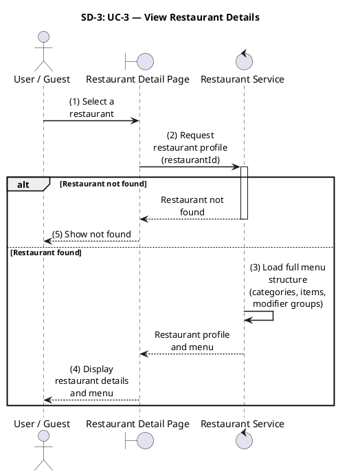

---

### SD-4 — UC-4: Add Item to Cart

| Attribute | Value |
|-----------|-------|
| **SD ID** | SD-4 |
| **Use Case** | UC-4 — Add Item to Cart |
| **Module** | Customer Module |
| **Primary Actors** | Customer (Authenticated) |
| **Primary Service** | Cart Service |
| **Related Services** | Menu Catalog |
| **Complexity** | Low-Medium |
| **Trace Source** | SRS_FoodDelivery.md UC-4 Activity Diagram steps 1-11 |

**Overview**

Validates item and modifier availability, applies a server-side pricing snapshot, and appends the line item to the customer's active cart. Enforces single-restaurant-per-cart constraint with conflict resolution options.

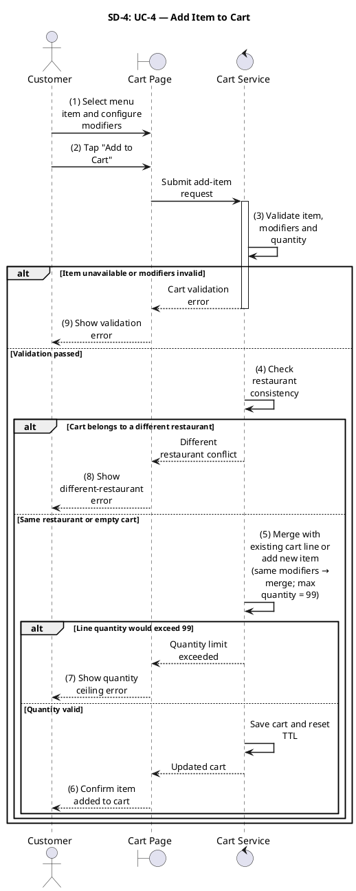

---

### SD-5 — UC-5: Manage Shopping Cart

| Attribute | Value |
|-----------|-------|
| **SD ID** | SD-5 |
| **Use Case** | UC-5 — Manage Shopping Cart |
| **Module** | Customer Module |
| **Primary Actors** | Customer |
| **Primary Service** | Cart Service |
| **Related Services** | Menu Catalog, Restaurant Catalog |
| **Complexity** | Medium |
| **Trace Source** | SRS_FoodDelivery.md UC-5 Activity Diagram steps 1-20 |

**Overview**

Full cart lifecycle management including view, quantity update, item removal, cart clear, and coupon code application with discount preview. All mutations revalidate item availability and pricing before persisting.

```plantuml
@startuml SD-5_ManageCart

skinparam shadowing false
skinparam sequenceMessageAlign center
skinparam responseMessageBelowArrow true
skinparam maxMessageSize 120
skinparam sequenceArrowThickness 1.5
skinparam ParticipantPadding 20
skinparam BoxPadding 10

title SD-5: UC-5 — Manage Shopping Cart

actor "Customer" as Actor
boundary "Cart Page" as UI
control "Cart Service" as CartSvc
database "Cart Store" as CartStore

autonumber stop

Actor -> UI : (1) Open cart

== View Cart ==

UI -> CartSvc : (3) Load and return cart contents
activate CartSvc
CartSvc -> CartStore : Retrieve customer cart
activate CartStore
CartStore --> CartSvc : cart | null
deactivate CartStore
CartSvc --> UI : Cart contents (or null)
deactivate CartSvc
UI --> Actor : Display cart

== Update Item Quantity ==

Actor -> UI : (2) Select "Update Quantity"
UI -> CartSvc : (4) Submit quantity update
activate CartSvc

CartSvc -> CartSvc : Validate quantity and find line

alt Line not found
    CartSvc --> UI : Cart item not found
    deactivate CartSvc
    UI --> Actor : (6) Show item not found
else Line found
    CartSvc -> CartStore : (5) Save updated cart (reset TTL)
    activate CartStore
    CartStore --> CartSvc : saved
    deactivate CartStore
    CartSvc --> UI : Updated cart
    deactivate CartSvc
    UI --> Actor : Display updated cart
end

== Update Item Modifiers ==

Actor -> UI : (2) Select "Update Modifiers"
UI -> CartSvc : (7) Submit modifier update
activate CartSvc

CartSvc -> CartSvc : Validate modifier set and re-fingerprint line

alt Modifiers invalid
    CartSvc --> UI : Modifier validation error
    deactivate CartSvc
    UI --> Actor : (9) Show modifier validation error
else Merged quantity would exceed 99
    CartSvc --> UI : Quantity limit exceeded
    deactivate CartSvc
    UI --> Actor : (9) Show quantity overflow error
else Valid
    CartSvc -> CartStore : Save updated cart
    activate CartStore
    CartStore --> CartSvc : saved
    deactivate CartStore
    CartSvc --> UI : Updated cart
    deactivate CartSvc
    UI --> Actor : (8) Display updated cart with new modifiers
end

== Remove Item ==

Actor -> UI : (2) Select "Remove Item"
UI -> CartSvc : (10) Remove line item (cartItemId)
activate CartSvc

alt Line not found
    CartSvc --> UI : Cart item not found
    deactivate CartSvc
    UI --> Actor : (11) Show item not found
else Line found
    CartSvc -> CartStore : Remove line and save cart
    activate CartStore
    CartStore --> CartSvc : saved | deleted
    deactivate CartStore
    CartSvc --> UI : Cart (or null)
    deactivate CartSvc
    UI --> Actor : Display updated cart
end

== Clear Cart ==

Actor -> UI : (2) Select "Clear Cart"
UI -> CartSvc : (12) Delete entire cart (idempotent)
activate CartSvc
CartSvc -> CartStore : Delete customer cart
activate CartStore
CartStore --> CartSvc : deleted
deactivate CartStore
CartSvc --> UI : Confirmed
deactivate CartSvc
UI --> Actor : (13) Confirm cart cleared

@enduml
```

---

### SD-6 — UC-6: Save & Manage Delivery Addresses

| Attribute | Value |
|-----------|-------|
| **SD ID** | SD-6 |
| **Use Case** | UC-6 — Save & Manage Delivery Addresses |
| **Module** | Customer Module |
| **Primary Actors** | Customer |
| **Primary Service** | Address Service |
| **Related Services** | Authentication Service |
| **Complexity** | Low |
| **Trace Source** | SRS_FoodDelivery.md UC-6 Activity Diagram steps 1-10 |

**Overview**

CRUD operations for the customer address book with default-address management and coordinate validation. Enforces address immutability for orders that have already snapshotted the address at checkout.

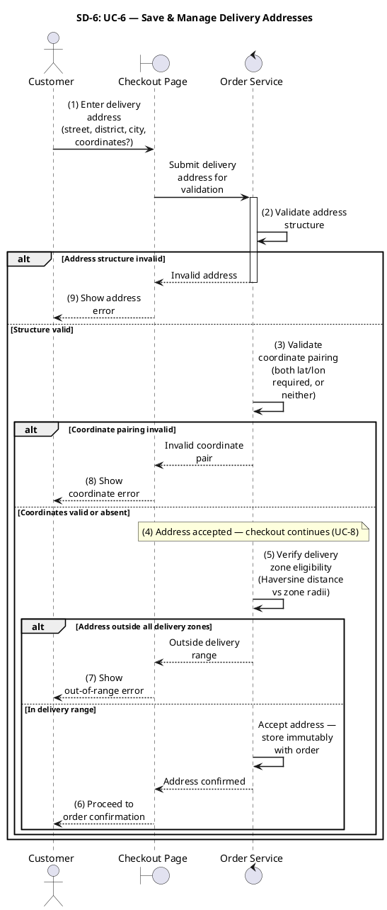

---

### SD-7 — UC-7: Manage Delivery Zones

| Attribute | Value |
|-----------|-------|
| **SD ID** | SD-7 |
| **Use Case** | UC-7 — Manage Delivery Zones |
| **Module** | Customer Module |
| **Primary Actors** | Restaurant Owner, Administrator |
| **Primary Service** | Delivery Zone Service |
| **Related Services** | Restaurant Catalog |
| **Complexity** | Medium |
| **Trace Source** | SRS_FoodDelivery.md UC-7 Activity Diagram steps 1-16 |

**Overview**

Creation, modification, and deletion of restaurant-specific delivery zones including coordinate polygon validation, minimum-order threshold, and zone overlap detection. Requires approved restaurant ownership for self-service operations.

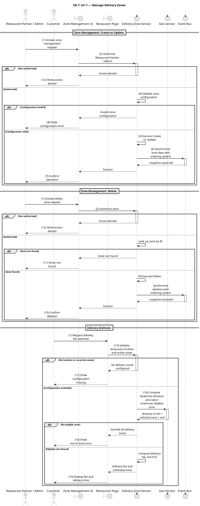

---

### SD-8 — UC-8: Place Order

| Attribute | Value |
|-----------|-------|
| **SD ID** | SD-8 |
| **Use Case** | UC-8 — Place Order |
| **Module** | Customer Module |
| **Primary Actors** | Customer |
| **Primary Service** | Order Service |
| **Related Services** | Promotion Service, Payment Service, Event Bus |
| **Complexity** | High |
| **Trace Source** | SRS_FoodDelivery.md UC-8 Activity Diagram steps 1-15 |

**Overview**

End-to-end checkout flow covering idempotency key control, Redis cart-lock acquisition, server-side price recomputation from the ACL snapshot, promotion reservation, order row persistence, payment initiation, and domain event publication. Client-supplied prices are never trusted.

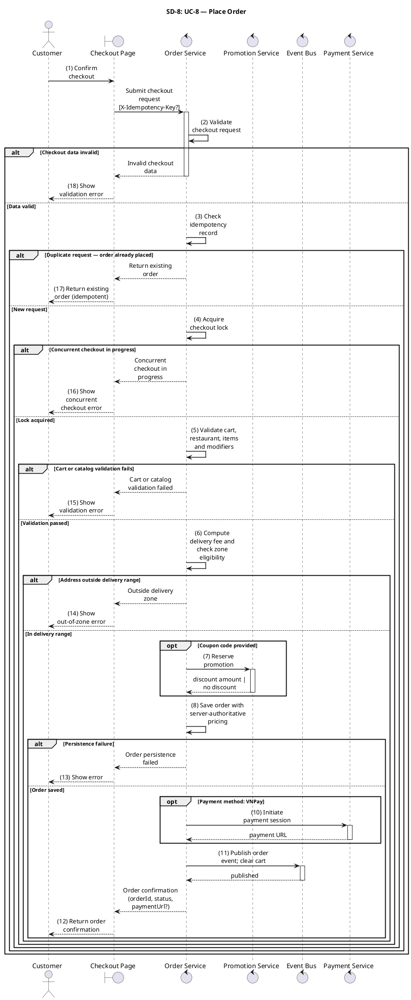

---

### SD-9 — UC-9: Make Online Payment (VNPay)

| Attribute | Value |
|-----------|-------|
| **SD ID** | SD-9 |
| **Use Case** | UC-9 — Make Online Payment (VNPay) |
| **Module** | Customer Module |
| **Primary Actors** | Customer |
| **Primary Service** | Payment Service (VNPay) |
| **Related Services** | Order Service, VNPay Gateway, Event Bus |
| **Complexity** | High |
| **Trace Source** | SRS_FoodDelivery.md UC-9 Activity Diagram steps 1-18 |

**Overview**

VNPay payment lifecycle including payment URL generation for browser redirect, IPN webhook verification with HMAC signature validation, order status promotion on confirmed payment, and return-URL processing for user-facing outcome display.

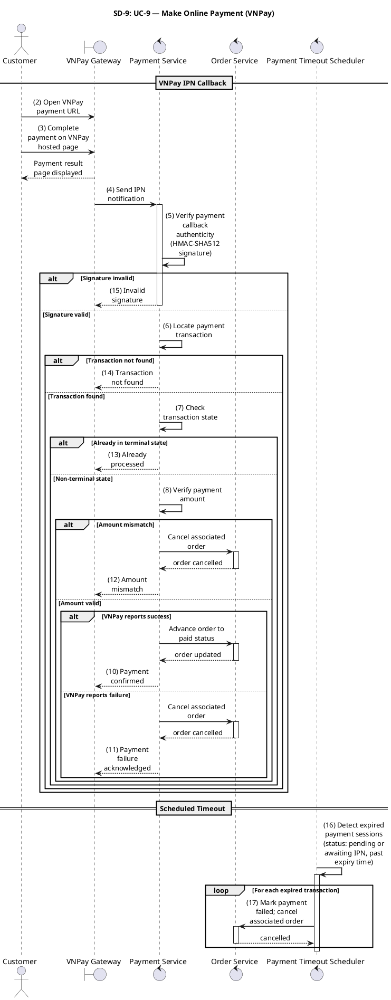

---

### SD-10 — UC-10: View Order History

| Attribute | Value |
|-----------|-------|
| **SD ID** | SD-10 |
| **Use Case** | UC-10 — View Order History |
| **Module** | Customer Module |
| **Primary Actors** | Customer, Restaurant Owner, Shipper, Administrator |
| **Primary Service** | Order History Service |
| **Related Services** | Order Repository |
| **Complexity** | Low |
| **Trace Source** | SRS_FoodDelivery.md UC-10 Activity Diagram steps 1-8 |

**Overview**

Role-scoped retrieval of paginated order history and full order detail including timeline events and line items. Each role sees only the orders within its own operational scope.

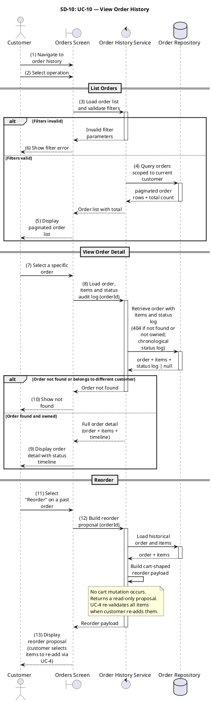

---

<div style="page-break-before: always;"></div>

## Restaurant Module

### Restaurant Operations and Menu Management

This module captures the restaurant owner operational flows including account onboarding, menu catalog management, real-time availability toggling, and order acceptance or rejection. These diagrams align with the restaurant-side bounded context in the SoLi architecture.

---

### SD-11 — UC-11: Restaurant Registration & Profile Management

| Attribute | Value |
|-----------|-------|
| **SD ID** | SD-11 |
| **Use Case** | UC-11 — Restaurant Registration & Profile Management |
| **Module** | Restaurant Module |
| **Primary Actors** | Restaurant Owner, Administrator |
| **Primary Service** | Restaurant Service |
| **Related Services** | Image Service, Event Bus |
| **Complexity** | Medium |
| **Trace Source** | SRS_FoodDelivery.md UC-11 Activity Diagram steps 1-18 |

**Overview**

Restaurant application submission with document upload, admin review and approval/rejection workflow, and self-service profile update for approved restaurants. Approval publishes a domain event that activates the restaurant for ordering.

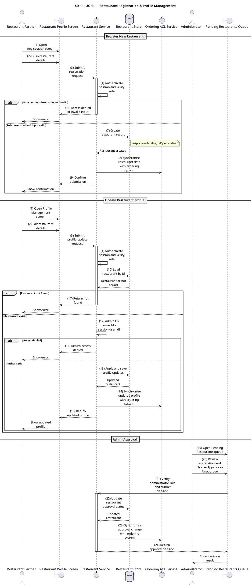

---

### SD-12 — UC-12: Manage Menu Catalog

| Attribute | Value |
|-----------|-------|
| **SD ID** | SD-12 |
| **Use Case** | UC-12 — Manage Menu Catalog |
| **Module** | Restaurant Module |
| **Primary Actors** | Restaurant Owner |
| **Primary Service** | Menu Service |
| **Related Services** | Restaurant Catalog, Image Service |
| **Complexity** | Medium |
| **Trace Source** | SRS_FoodDelivery.md UC-12 Activity Diagram steps 1-14 |

**Overview**

Full menu catalog management including category CRUD, menu item CRUD with image upload, and modifier group and option CRUD. All mutations are scoped to the authenticated restaurant owner.

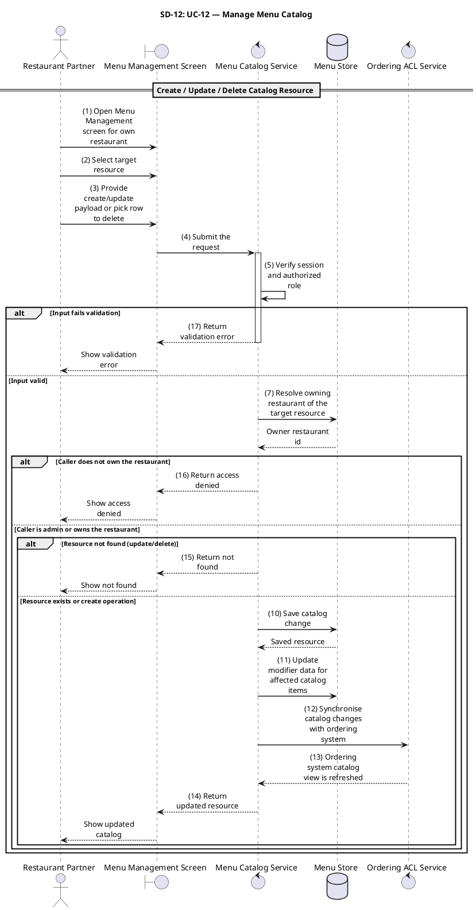

---

### SD-13 — UC-13: Toggle Item & Restaurant Availability

| Attribute | Value |
|-----------|-------|
| **SD ID** | SD-13 |
| **Use Case** | UC-13 — Toggle Item & Restaurant Availability |
| **Module** | Restaurant Module |
| **Primary Actors** | Restaurant Owner |
| **Primary Service** | Availability Service |
| **Related Services** | Restaurant Catalog, Event Bus |
| **Complexity** | Low |
| **Trace Source** | SRS_FoodDelivery.md UC-13 Activity Diagram steps 1-8 |

**Overview**

Real-time toggling of individual menu item availability and restaurant open/closed status with cache invalidation and downstream event publication so ordering flows immediately reflect the updated availability.

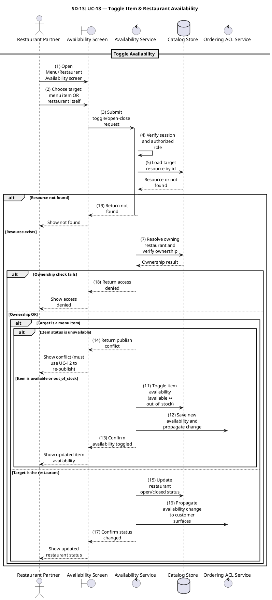

---

### SD-14 — UC-14: Accept or Reject Order

| Attribute | Value |
|-----------|-------|
| **SD ID** | SD-14 |
| **Use Case** | UC-14 — Accept or Reject Order |
| **Module** | Restaurant Module |
| **Primary Actors** | Restaurant Owner |
| **Primary Service** | Order Lifecycle Service |
| **Related Services** | Order Repository, Event Bus, Notification Service |
| **Complexity** | Medium |
| **Trace Source** | SRS_FoodDelivery.md UC-14 Activity Diagram steps 1-12 |

**Overview**

Restaurant-side order acceptance or rejection with optimistic locking to prevent duplicate state transitions, order status update, and downstream notification dispatch to the customer and delivery dispatch system.

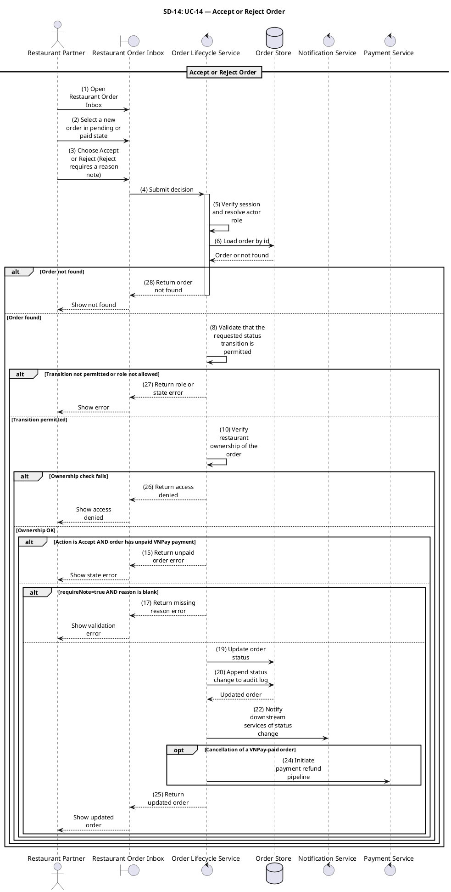

---

### SD-15 — UC-15: Prepare Order for Pickup

| Attribute | Value |
|-----------|-------|
| **SD ID** | SD-15 |
| **Use Case** | UC-15 — Prepare Order for Pickup |
| **Module** | Restaurant Module |
| **Primary Actors** | Restaurant Owner |
| **Primary Service** | Order Lifecycle Service |
| **Related Services** | Order Repository, Event Bus, Notification Service, Dispatch Service |
| **Complexity** | Medium |
| **Trace Source** | SRS_FoodDelivery.md UC-15 Activity Diagram steps 1-10 |

**Overview**

Order preparation lifecycle from confirmed state through marking ready-for-pickup. Triggers shipper dispatch pipeline and notifies the customer that the order is awaiting collection.

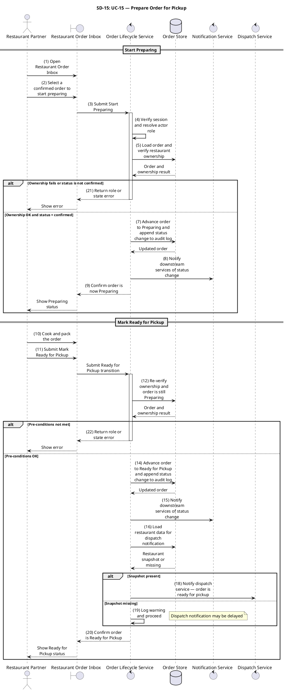

---

<div style="page-break-before: always;"></div>

## Shipper Module

### Delivery Personnel Operations

This module covers the delivery personnel (shipper) lifecycle from registration and document verification through availability management, delivery assignment acceptance, and delivery confirmation. These flows operate within the delivery dispatch bounded context.

---

### SD-16 — UC-16: Shipper Registration

| Attribute | Value |
|-----------|-------|
| **SD ID** | SD-16 |
| **Use Case** | UC-16 — Shipper Registration |
| **Module** | Shipper Module |
| **Primary Actors** | Delivery Personnel, Administrator |
| **Primary Service** | Shipper Application Service |
| **Related Services** | Image Service, Authentication Service, Event Bus |
| **Complexity** | Medium |
| **Trace Source** | SRS_FoodDelivery.md UC-16 Activity Diagram steps 1-17 |

**Overview**

Shipper onboarding flow including application submission with government-issued document upload, admin review queue management, approval or rejection decision, and automatic account role elevation to shipper on approval.

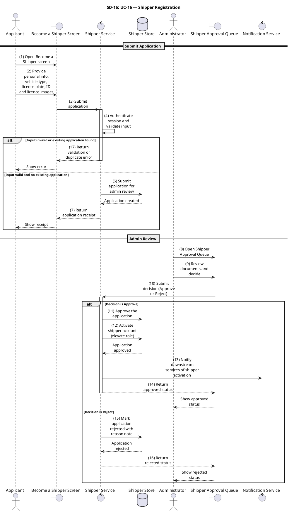

---

### SD-17 — UC-17: Manage Shipper Availability

| Attribute | Value |
|-----------|-------|
| **SD ID** | SD-17 |
| **Use Case** | UC-17 — Manage Shipper Availability |
| **Module** | Shipper Module |
| **Primary Actors** | Shipper |
| **Primary Service** | Shipper Availability Service |
| **Related Services** | Order Repository, Event Bus |
| **Complexity** | Low-Medium |
| **Trace Source** | SRS_FoodDelivery.md UC-17 Activity Diagram steps 1-11 |

**Overview**

Online/offline availability toggle for shippers. Going offline is guarded by an active-delivery check that prevents the shipper from dropping off the dispatch pool while a delivery is in progress.

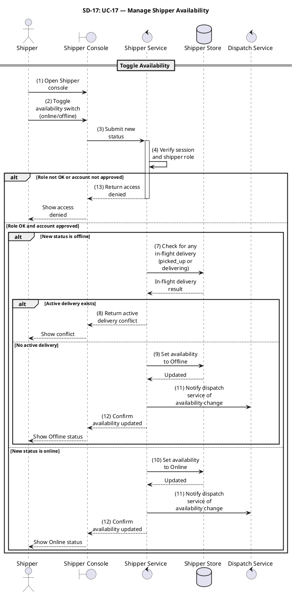

---

### SD-18 — UC-18: Accept Delivery Assignment

| Attribute | Value |
|-----------|-------|
| **SD ID** | SD-18 |
| **Use Case** | UC-18 — Accept Delivery Assignment |
| **Module** | Shipper Module |
| **Primary Actors** | Shipper |
| **Primary Service** | Delivery Dispatch Service |
| **Related Services** | Order Repository, Event Bus, Notification Service |
| **Complexity** | Medium |
| **Trace Source** | SRS_FoodDelivery.md UC-18 Activity Diagram steps 1-12 |

**Overview**

Delivery assignment acceptance with optimistic lock acquisition to prevent double-assignment, shipper binding to the order row, and notification to all stakeholders that pickup is in progress.

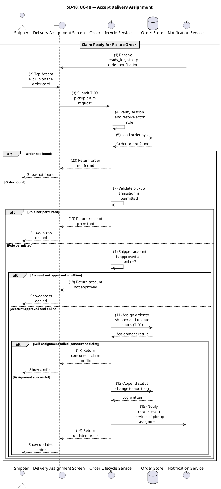

---

### SD-19 — UC-19: Deliver Order

| Attribute | Value |
|-----------|-------|
| **SD ID** | SD-19 |
| **Use Case** | UC-19 — Deliver Order |
| **Module** | Shipper Module |
| **Primary Actors** | Shipper |
| **Primary Service** | Order Lifecycle Service |
| **Related Services** | Order Repository, Event Bus, Notification Service |
| **Complexity** | Medium |
| **Trace Source** | SRS_FoodDelivery.md UC-19 Activity Diagram steps 1-9 |

**Overview**

Complete delivery execution lifecycle from en-route status update through successful delivery confirmation with GPS proof-of-delivery. Publishes a delivery completion event that finalises the order and notifies the customer.

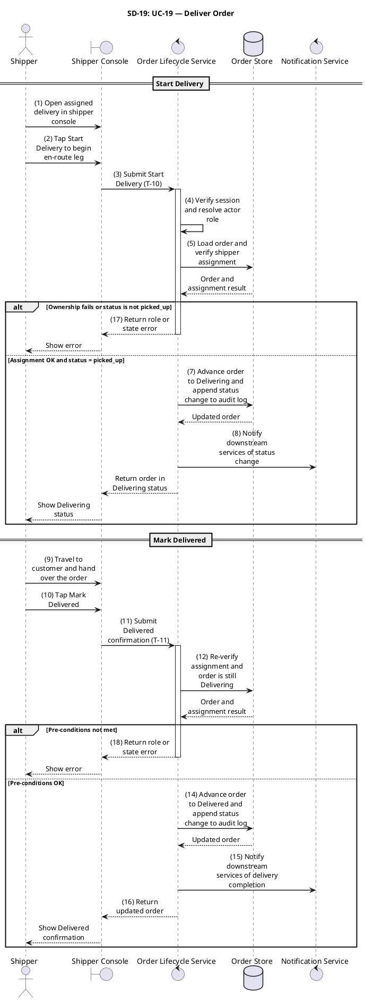

---

<div style="page-break-before: always;"></div>

## Shared Platform Services

### Cross-Cutting Customer Interaction, Promotions, and Notifications

This module encompasses cross-cutting flows shared across actor roles: real-time order tracking, cancellation policies, review submission, promotion management (restaurant and platform-wide), payment refund processing, and the real-time notification pipeline.

---

### SD-20 — UC-20: Track Order Status

| Attribute | Value |
|-----------|-------|
| **SD ID** | SD-20 |
| **Use Case** | UC-20 — Track Order Status |
| **Module** | Shared Platform Services |
| **Primary Actors** | Customer, Restaurant Owner, Shipper |
| **Primary Service** | Order Tracking Service |
| **Related Services** | WebSocket Gateway, Order Repository |
| **Complexity** | Medium |
| **Trace Source** | SRS_FoodDelivery.md UC-20 Activity Diagram steps 1-10 |

**Overview**

Real-time order status tracking using WebSocket push notifications, delivering live status updates to all stakeholder roles throughout the order lifecycle from placement through delivery.

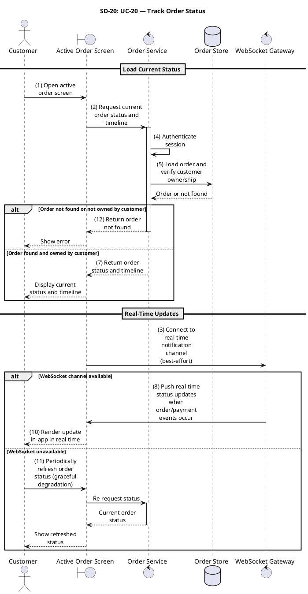

---

### SD-21 — UC-21: Cancel Order

| Attribute | Value |
|-----------|-------|
| **SD ID** | SD-21 |
| **Use Case** | UC-21 — Cancel Order |
| **Module** | Shared Platform Services |
| **Primary Actors** | Customer, Restaurant Owner, Administrator |
| **Primary Service** | Order Lifecycle Service |
| **Related Services** | Order Repository, Refund Service, Event Bus |
| **Complexity** | Medium-High |
| **Trace Source** | SRS_FoodDelivery.md UC-21 Activity Diagram steps 1-15 |

**Overview**

Multi-role order cancellation with policy enforcement per actor and current order state, refund initiation for paid orders, and optimistic locking to prevent concurrent cancellation race conditions.

```plantuml
@startuml SD-21_CancelOrder

skinparam shadowing false
skinparam sequenceMessageAlign center
skinparam responseMessageBelowArrow true
skinparam maxMessageSize 120
skinparam sequenceArrowThickness 1.5
skinparam ParticipantPadding 20
skinparam BoxPadding 10

title SD-21: UC-21 — Cancel Order

actor "Customer" as Actor
boundary "Active Order Screen" as UI
control "Order Lifecycle Service" as LifecycleSvc
database "Order Store" as OrderDB
control "Notification Service" as NotifSvc
control "Payment Service" as PaySvc
control "Promotion Service" as PromoSvc

autonumber stop

== Cancel Order ==

Actor -> UI : (1) Open active order screen
Actor -> UI : (2) Tap Cancel Order and enter a non-empty reason
UI -> LifecycleSvc : (3) Submit cancellation with reason
activate LifecycleSvc

LifecycleSvc -> LifecycleSvc : (4) Verify session and actor role
LifecycleSvc -> OrderDB : (5) Load order and verify customer ownership
OrderDB --> LifecycleSvc : Order or not found

alt Order not found or not owned by customer
    LifecycleSvc --> UI : (21) Return order not found
    deactivate LifecycleSvc
    UI --> Actor : Show not found
else Order found
    alt Reason is empty
        LifecycleSvc --> UI : (20) Return missing reason error
        deactivate LifecycleSvc
        UI --> Actor : Show validation error
    else Reason provided
        alt Current status not in pending or paid
            LifecycleSvc --> UI : (19) Return invalid order state
            deactivate LifecycleSvc
            UI --> Actor : Show state error
        else Status is pending or paid
            LifecycleSvc -> OrderDB : (10) Cancel order and append status change to audit log
            OrderDB --> LifecycleSvc : Cancellation result

            alt Optimistic lock failed
                LifecycleSvc --> UI : (18) Return concurrent update conflict
                deactivate LifecycleSvc
                UI --> Actor : Show conflict
            else Lock succeeded
                LifecycleSvc -> NotifSvc : (12) Notify downstream services of cancellation
                alt Order was paid via VNPay
                    LifecycleSvc -> PaySvc : (14) Initiate payment refund pipeline
                else COD or unpaid order
                    LifecycleSvc -> LifecycleSvc : (15) No refund applicable
                end
                LifecycleSvc -> PromoSvc : (16) Roll back any applied promotion reservations
                LifecycleSvc --> UI : (17) Return cancellation confirmed
                deactivate LifecycleSvc
                UI --> Actor : Show cancellation confirmation
            end
        end
    end
end

@enduml
```

---

### SD-22 — UC-22: Submit Rating & Review

| Attribute | Value |
|-----------|-------|
| **SD ID** | SD-22 |
| **Use Case** | UC-22 — Submit Rating & Review |
| **Module** | Shared Platform Services |
| **Primary Actors** | Customer |
| **Primary Service** | Review Service |
| **Related Services** | Order Repository, Restaurant Catalog, Notification Service |
| **Complexity** | Low |
| **Trace Source** | SRS_FoodDelivery.md UC-22 Activity Diagram steps 1-10 |

**Overview**

Post-delivery review submission with one-per-order uniqueness enforced by a database constraint, atomic rating projection update on the restaurant record, and notification to the restaurant owner.

```plantuml
@startuml SD-22_SubmitRatingReview

skinparam shadowing false
skinparam sequenceMessageAlign center
skinparam responseMessageBelowArrow true
skinparam maxMessageSize 120
skinparam sequenceArrowThickness 1.5
skinparam ParticipantPadding 20
skinparam BoxPadding 10

title SD-22: UC-22 — Submit Rating & Review

actor "Customer" as Actor
boundary "Delivered Order Screen" as UI
control "Review Service" as ReviewSvc
database "Review Store" as ReviewDB
database "Restaurant Store" as RestDB

autonumber stop

== Submit Rating ==

Actor -> UI : (1) Open delivered order screen
Actor -> UI : (2) Select Rate & Review — choose 1–5 stars + optional comment
UI -> ReviewSvc : (3) Submit rating and optional comment
activate ReviewSvc

ReviewSvc -> ReviewSvc : (4) Authenticate session
ReviewSvc -> ReviewSvc : (5) Validate rating and comment content

alt Payload invalid
    ReviewSvc --> UI : (18) Return invalid review
    deactivate ReviewSvc
    UI --> Actor : Show validation error
else Payload valid
    ReviewSvc -> ReviewDB : (7) Load order and verify customer ownership
    ReviewDB --> ReviewSvc : Order or not found

    alt Order not found or not owned
        ReviewSvc --> UI : (17) Return order not found
        deactivate ReviewSvc
        UI --> Actor : Show not found
    else Order found
        alt Order status is not delivered
            ReviewSvc --> UI : (16) Return order not eligible
            deactivate ReviewSvc
            UI --> Actor : Show state error
        else Order is delivered
            ReviewSvc -> ReviewDB : (10) Check if review already exists
            ReviewDB --> ReviewSvc : Existing review or none

            alt Review already exists
                ReviewSvc --> UI : (15) Return review already submitted
                deactivate ReviewSvc
                UI --> Actor : Show conflict
            else No existing review
                ReviewSvc -> ReviewDB : (12) Save and publish review
                ReviewDB --> ReviewSvc : Review saved
                ReviewSvc -> RestDB : (13) Update restaurant aggregate rating
                ReviewSvc --> UI : (14) Return review confirmed
                deactivate ReviewSvc
                UI --> Actor : Show confirmation
            end
        end
    end
end

@enduml
```

---

### SD-23 — UC-23: Manage Restaurant Promotions

| Attribute | Value |
|-----------|-------|
| **SD ID** | SD-23 |
| **Use Case** | UC-23 — Manage Restaurant Promotions |
| **Module** | Shared Platform Services |
| **Primary Actors** | Restaurant Owner |
| **Primary Service** | Promotion Service (Restaurant) |
| **Related Services** | Restaurant Catalog |
| **Complexity** | Medium |
| **Trace Source** | SRS_FoodDelivery.md UC-23 Activity Diagram steps 1-14 |

**Overview**

Restaurant self-service promotion management including creation, editing, scheduling, activation, and deactivation of item-level and order-level discount promotions within admin-approved bounds.

```plantuml
@startuml SD-23_ManageRestaurantPromotions

skinparam shadowing false
skinparam sequenceMessageAlign center
skinparam responseMessageBelowArrow true
skinparam maxMessageSize 120
skinparam sequenceArrowThickness 1.5
skinparam ParticipantPadding 20
skinparam BoxPadding 10

title SD-23: UC-23 — Manage Restaurant Promotions

actor "Restaurant Partner" as Partner
boundary "Promotion Dashboard" as UI
control "Promotion Service" as PromoSvc
database "Promotion Store" as PromoDB
database "Restaurant Store" as RestDB

autonumber stop

== Read / Create / Update / Lifecycle ==

Partner -> UI : (1) Open promotion dashboard
Partner -> UI : (2) Submit create/update/list/lifecycle request
UI -> PromoSvc : Submit request
activate PromoSvc

PromoSvc -> PromoSvc : (3) Verify session and restaurant role
PromoSvc -> RestDB : (4) Load restaurant record
RestDB --> PromoSvc : Restaurant or not found

alt Restaurant not found, not owned, or not approved
    PromoSvc --> UI : (19) Return access denied
    deactivate PromoSvc
    UI --> Partner : Show access denied
else Restaurant valid and owned
    alt Operation is read (GET)
        PromoSvc -> PromoDB : Load promotion list or detail
        PromoDB --> PromoSvc : Promotion data
        PromoSvc --> UI : (7) Return restaurant's promotion list or detail
        deactivate PromoSvc
        UI --> Partner : Display promotions
    else Write operation
        PromoSvc -> PromoSvc : (8) Validate payload

        alt Payload invalid
            PromoSvc --> UI : (18) Return validation error
            deactivate PromoSvc
            UI --> Partner : Show validation error
        else Payload valid
            alt Operation is create
                PromoSvc -> PromoDB : (10) Create promotion in Draft status
                PromoDB --> PromoSvc : Promotion created
                PromoSvc --> UI : (17) Return the resulting promotion
                deactivate PromoSvc
                UI --> Partner : Show new promotion
            else Update or lifecycle change
                PromoSvc -> PromoDB : (11) Load existing promotion and verify restaurant ownership
                PromoDB --> PromoSvc : Promotion or not found

                alt Promotion not found or not owned by restaurant
                    PromoSvc --> UI : (16) Return promotion not found
                    deactivate PromoSvc
                    UI --> Partner : Show not found
                else Promotion found
                    alt Status transition not permitted
                        PromoSvc --> UI : (15) Return invalid promotion transition
                        deactivate PromoSvc
                        UI --> Partner : Show state error
                    else Transition permitted
                        PromoSvc -> PromoDB : (14) Apply and save changes
                        PromoDB --> PromoSvc : Updated promotion
                        PromoSvc --> UI : (17) Return the resulting promotion
                        deactivate PromoSvc
                        UI --> Partner : Show updated promotion
                    end
                end
            end
        end
    end
end

@enduml
```

---

### SD-24 — UC-24: Manage Platform Promotions

| Attribute | Value |
|-----------|-------|
| **SD ID** | SD-24 |
| **Use Case** | UC-24 — Manage Platform Promotions |
| **Module** | Shared Platform Services |
| **Primary Actors** | Administrator |
| **Primary Service** | Promotion Service (Admin) |
| **Related Services** | Coupon Repository |
| **Complexity** | Medium |
| **Trace Source** | SRS_FoodDelivery.md UC-24 Activity Diagram steps 1-16 |

**Overview**

Platform-wide promotion and coupon management by administrators, including bulk coupon batch generation, usage tracking, redemption limits, and full promotion lifecycle control across all restaurant tenants.

```plantuml
@startuml SD-24_ManagePlatformPromotions

skinparam shadowing false
skinparam sequenceMessageAlign center
skinparam responseMessageBelowArrow true
skinparam maxMessageSize 120
skinparam sequenceArrowThickness 1.5
skinparam ParticipantPadding 20
skinparam BoxPadding 10

title SD-24: UC-24 — Manage Platform Promotions

actor "Administrator" as Admin
boundary "Admin Promotion Console" as UI
control "Promotion Service" as PromoSvc
database "Promotion Store" as PromoDB

autonumber stop

== Admin Promotion & Coupon Management ==

Admin -> UI : (1) Open admin promotion console
Admin -> UI : (2) Submit promotion or coupon request
UI -> PromoSvc : Submit request
activate PromoSvc

PromoSvc -> PromoSvc : (3) Verify admin session

alt Operation is read (GET)
    PromoSvc -> PromoDB : Load promotion and coupon data
    PromoDB --> PromoSvc : Data
    PromoSvc --> UI : (5) Return promotion and coupon list or detail
    deactivate PromoSvc
    UI --> Admin : Display data
else Write operation
    alt Operation is coupon issuance
        PromoSvc -> PromoDB : (7) Load parent promotion
        PromoDB --> PromoSvc : Promotion or not found

        alt Promotion not found or does not support coupon codes
            PromoSvc --> UI : (13) Return not found or invalid state
            deactivate PromoSvc
            UI --> Admin : Show error
        else Promotion supports coupons
            PromoSvc -> PromoSvc : (9) Validate coupon batch payload

            alt Payload invalid
                PromoSvc --> UI : (12) Return validation error
                deactivate PromoSvc
                UI --> Admin : Show validation error
            else Payload valid
                PromoSvc -> PromoDB : (10) Issue and save provided coupon codes
                PromoDB --> PromoSvc : Issued codes
                PromoSvc --> UI : (11) Return issued codes
                deactivate PromoSvc
                UI --> Admin : Show issued codes
            end
        end
    else Create or lifecycle change
        PromoSvc -> PromoSvc : (14) Validate payload

        alt Payload invalid
            PromoSvc --> UI : (21) Return validation error
            deactivate PromoSvc
            UI --> Admin : Show validation error
        else Payload valid
            PromoSvc -> PromoDB : (15) Load target promotion (if not create)
            PromoDB --> PromoSvc : Promotion or not found

            alt Promotion not found
                PromoSvc --> UI : (20) Return promotion not found
                deactivate PromoSvc
                UI --> Admin : Show not found
            else Promotion found or create
                alt Status transition not permitted
                    PromoSvc --> UI : (19) Return invalid promotion transition
                    deactivate PromoSvc
                    UI --> Admin : Show state error
                else Transition permitted
                    PromoSvc -> PromoDB : (17) Apply and save promotion change
                    PromoDB --> PromoSvc : Updated promotion
                    PromoSvc --> UI : (18) Return the resulting promotion
                    deactivate PromoSvc
                    UI --> Admin : Show updated promotion
                end
            end
        end
    end
end

@enduml
```

---

### SD-25 — UC-25: Process Payment Refund

| Attribute | Value |
|-----------|-------|
| **SD ID** | SD-25 |
| **Use Case** | UC-25 — Process Payment Refund |
| **Module** | Shared Platform Services |
| **Primary Actors** | Customer, Administrator |
| **Primary Service** | Refund Service |
| **Related Services** | Payment Gateway (VNPay), Order Repository, Event Bus |
| **Complexity** | Medium-High |
| **Trace Source** | SRS_FoodDelivery.md UC-25 Activity Diagram steps 1-14 |

**Overview**

End-to-end refund processing triggered by order cancellation or direct admin action. Covers VNPay refund API invocation, payment transaction state management with optimistic locking, and event-driven retry on failure.

```plantuml
@startuml SD-25_ProcessPaymentRefund

skinparam shadowing false
skinparam sequenceMessageAlign center
skinparam responseMessageBelowArrow true
skinparam maxMessageSize 120
skinparam sequenceArrowThickness 1.5
skinparam ParticipantPadding 20
skinparam BoxPadding 10

title SD-25: UC-25 — Process Payment Refund

control "Ordering BC" as OrderingBC
control "Payment Service" as PaySvc
database "Payment Store" as PayDB
control "Payment Gateway" as Gateway
control "Notification Service" as NotifSvc

autonumber stop

== Automated Refund (Event-Driven) ==

OrderingBC -> PaySvc : (2) Signal Payment BC to initiate refund
note right of OrderingBC : T-05 or T-07 cancellation on VNPay-paid order
activate PaySvc

PaySvc -> PayDB : (4) Look up confirmed payment transaction
PayDB --> PaySvc : Transaction or not found

alt Completed transaction not found
    PaySvc -> PaySvc : (18) Log and exit (COD or already-refunded order)
    deactivate PaySvc
else Completed transaction found
    alt amount <= 0
        PaySvc -> PaySvc : (17) Log data anomaly and exit
        deactivate PaySvc
    else amount > 0
        alt Status already refund_pending or refunded
            PaySvc -> PaySvc : (8) Log duplicate event and exit
            deactivate PaySvc
        else Status is completed
            PaySvc -> PayDB : (9) Mark transaction as refund in progress
            PayDB --> PaySvc : Lock result

            alt Optimistic lock lost
                PaySvc -> PaySvc : (16) Concurrent handler is processing refund — exit
                deactivate PaySvc
            else Lock won
                PaySvc -> NotifSvc : (11) Notify customer refund initiated
                PaySvc -> Gateway : (12) Submit refund request to payment gateway
                Gateway --> PaySvc : Gateway response

                alt Gateway responded success
                    PaySvc -> PayDB : (14) Record successful refund completion
                    PayDB --> PaySvc : Updated
                    deactivate PaySvc
                else Gateway failure
                    PaySvc -> PayDB : (15) Record refund failure and schedule retry
                    PayDB --> PaySvc : Updated
                    deactivate PaySvc
                end
            end
        end
    end
end

@enduml
```

---

### SD-26 — UC-26: Manage Real-Time Notifications

| Attribute | Value |
|-----------|-------|
| **SD ID** | SD-26 |
| **Use Case** | UC-26 — Manage Real-Time Notifications |
| **Module** | Shared Platform Services |
| **Primary Actors** | Customer, Restaurant Owner, Shipper, Administrator |
| **Primary Service** | Notification Service |
| **Related Services** | FCM (Firebase Cloud Messaging), WebSocket Gateway, Device Token Repository |
| **Complexity** | Medium |
| **Trace Source** | SRS_FoodDelivery.md UC-26 Activity Diagram steps 1-16 |

**Overview**

Multi-channel notification delivery pipeline supporting FCM push and WebSocket in-app channels with quiet-hours enforcement, device token lifecycle management, and idempotent persistence to prevent duplicate notifications.

```plantuml
@startuml SD-26_ManageRealTimeNotifications

skinparam shadowing false
skinparam sequenceMessageAlign center
skinparam responseMessageBelowArrow true
skinparam maxMessageSize 120
skinparam sequenceArrowThickness 1.5
skinparam ParticipantPadding 20
skinparam BoxPadding 10

title SD-26: UC-26 — Manage Real-Time Notifications

control "Publishing BC" as PublisherBC
control "Notification Service" as NotifSvc
database "Notification Store" as NotifDB
control "Channel Dispatcher" as Dispatcher
control "Push Provider (FCM)" as FCM
actor "Authenticated User" as User
boundary "Notification Inbox" as UI

autonumber stop

== Event-Driven Dispatch ==

PublisherBC -> NotifSvc : (1) Publish domain event
note right of PublisherBC : OrderStatusChangedEvent, OrderPlacedEvent,\nPaymentConfirmedEvent, PaymentFailedEvent,\nOrderCancelledAfterPaymentEvent
activate NotifSvc

NotifSvc -> NotifSvc : (2) Identify notification type and recipients
NotifSvc -> NotifDB : (3) Load each recipient's notification preferences
NotifDB --> NotifSvc : Preferences (or defaults)

alt Recipient has muted this type
    NotifSvc -> NotifDB : (5) Persist notification record for audit — skip delivery
    deactivate NotifSvc
else Recipient has not muted
    NotifSvc -> NotifSvc : (6) Determine enabled delivery channels per recipient preferences

    alt Type is critical (system_announcement, new_order_received)
        NotifSvc -> NotifSvc : (8) Bypass quiet-hours suppression
    else Non-critical type
        alt Quiet hours active and within quiet window
            NotifSvc -> NotifSvc : (10) Remove push from enabled channels
note right : in-app is always persisted
        else Outside quiet window
            NotifSvc -> NotifSvc : (11) Keep all enabled channels
        end
    end

    NotifSvc -> NotifDB : (12) Persist notification record per channel
    NotifDB --> NotifSvc : Records saved
    NotifSvc -> Dispatcher : (13) Dispatch notification to enabled channels concurrently
    activate Dispatcher
    Dispatcher -> FCM : Push via FCM
    FCM --> Dispatcher : Delivery result
    Dispatcher --> NotifSvc : (14) Record delivery outcome per channel
    deactivate Dispatcher

    alt Push delivery returned invalid or unregistered token
        NotifSvc -> NotifDB : (16) Mark invalid device token as inactive
    else Token valid
        NotifSvc -> NotifSvc : (17) Leave device tokens unchanged
    end
    deactivate NotifSvc
end

== REST Inbox & Preference Management ==

User -> UI : (18) Manage inbox, preferences and push tokens via REST endpoints
UI -> NotifSvc : Submit management request
activate NotifSvc

NotifSvc -> NotifDB : (19) Apply change and synchronise read-state across all active sessions
NotifDB --> NotifSvc : Updated
NotifSvc --> UI : Return updated state
deactivate NotifSvc
UI --> User : Show updated inbox / preferences

@enduml
```

---

<div style="page-break-before: always;"></div>

## Administration and Governance

### Admin Dashboard, Oversight, and Compliance

This module covers the full administrator operational surface: partner onboarding approval (restaurant and shipper), account suspension and reactivation, order monitoring, user account management, administrative cancellation and refund, operational reporting, dashboard KPIs, and role permission management.

---

### SD-27 — UC-27: Approve or Reject Restaurant Applications

| Attribute | Value |
|-----------|-------|
| **SD ID** | SD-27 |
| **Use Case** | UC-27 — Approve or Reject Restaurant Applications |
| **Module** | Administration & Governance |
| **Primary Actors** | Administrator |
| **Primary Service** | Restaurant Approval Service |
| **Related Services** | Restaurant Catalog, Event Bus, Notification Service |
| **Complexity** | Low-Medium |
| **Trace Source** | SRS_FoodDelivery.md UC-27 Activity Diagram steps 1-14 |

**Overview**

Admin-side restaurant application review and decision workflow with audit log recording, downstream event publication on approval, and applicant notification for both outcomes.

```plantuml
@startuml SD-27_ApproveRejectRestaurantApplications

skinparam shadowing false
skinparam sequenceMessageAlign center
skinparam responseMessageBelowArrow true
skinparam maxMessageSize 120
skinparam sequenceArrowThickness 1.5
skinparam ParticipantPadding 20
skinparam BoxPadding 10

title SD-27: UC-27 — Approve or Reject Restaurant Applications

actor "Administrator" as Admin
boundary "Restaurant Approval Queue" as UI
control "Restaurant Service" as RestSvc
database "Restaurant Store" as RestDB
control "Ordering ACL Service" as ACLSvc

autonumber stop

== Review Approval Queue ==

Admin -> UI : (1) Open Restaurant Approval Queue
Admin -> UI : (2) Filter applications (pending / recently approved / recently revoked)
Admin -> UI : (3) Select a restaurant and review submitted profile and documents
Admin -> UI : (4) Choose Approve or Unapprove

== Process Decision ==

UI -> RestSvc : Submit approval decision
activate RestSvc

RestSvc -> RestSvc : (5) Verify administrator session
RestSvc -> RestDB : (6) Load the target restaurant
RestDB --> RestSvc : Restaurant or not found

alt Restaurant not found
    RestSvc --> UI : (14) Return restaurant not found
    deactivate RestSvc
    UI --> Admin : Show not found
else Restaurant exists
    alt Decision already matches current approval state
        RestSvc --> UI : (13) Return no change
        deactivate RestSvc
        UI --> Admin : Show no-change
    else Decision differs from current state
        RestSvc -> RestDB : (9) Apply approval decision atomically
        RestDB --> RestSvc : Updated restaurant
        RestSvc -> ACLSvc : (10) Synchronise approval change with downstream services
        RestSvc -> RestDB : (11) Record admin actor and decision timestamp
        RestSvc --> UI : (12) Return updated restaurant
        deactivate RestSvc
        UI --> Admin : Show approval decision result
    end
end

@enduml
```

---

### SD-28 — UC-28: Approve or Reject Shipper Applications

| Attribute | Value |
|-----------|-------|
| **SD ID** | SD-28 |
| **Use Case** | UC-28 — Approve or Reject Shipper Applications |
| **Module** | Administration & Governance |
| **Primary Actors** | Administrator |
| **Primary Service** | Shipper Approval Service |
| **Related Services** | Authentication Service, Event Bus |
| **Complexity** | Low-Medium |
| **Trace Source** | SRS_FoodDelivery.md UC-28 Activity Diagram steps 1-16 |

**Overview**

Admin-side shipper application approval or rejection with atomic role elevation to shipper on approval, full audit trail recording, and domain event dispatch to notify downstream delivery and notification contexts.

```plantuml
@startuml SD-28_ApproveRejectShipperApplications

skinparam shadowing false
skinparam sequenceMessageAlign center
skinparam responseMessageBelowArrow true
skinparam maxMessageSize 120
skinparam sequenceArrowThickness 1.5
skinparam ParticipantPadding 20
skinparam BoxPadding 10

title SD-28: UC-28 — Approve or Reject Shipper Applications

actor "Administrator" as Admin
boundary "Shipper Approval Queue" as UI
control "Shipper Service" as ShipperSvc
database "Shipper Store" as ShipperDB
control "Notification Service" as NotifSvc

autonumber stop

== Review Approval Queue ==

Admin -> UI : (1) Open Shipper Approval Queue
Admin -> UI : (2) Filter applications (pending / approved / rejected)
Admin -> UI : (3) Select an application and review applicant identity, vehicle and licence documents
Admin -> UI : (4) Choose Approve or Reject (Reject requires a reason note)

== Process Decision ==

UI -> ShipperSvc : Submit decision
activate ShipperSvc

ShipperSvc -> ShipperSvc : (5) Verify administrator session
ShipperSvc -> ShipperDB : (6) Load the target shipper application
ShipperDB --> ShipperSvc : Application or not found

alt Application not found
    ShipperSvc --> UI : (20) Return application not found
    deactivate ShipperSvc
    UI --> Admin : Show not found
else Application found
    alt Application not in pending state
        ShipperSvc --> UI : (19) Return invalid application state
        deactivate ShipperSvc
        UI --> Admin : Show state error
    else Application is pending
        alt Decision is Reject AND reason note is missing
            ShipperSvc --> UI : (10) Return missing reason error
            deactivate ShipperSvc
            UI --> Admin : Show validation error
        else
            ShipperSvc -> ShipperDB : (11) Apply decision atomically
            ShipperDB --> ShipperSvc : Decision applied
            alt Decision is Approve
                ShipperSvc -> ShipperDB : (13) Elevate applicant account role to shipper
                ShipperSvc -> NotifSvc : (14) Notify downstream services of shipper activation
                ShipperSvc -> ShipperDB : (18) Record admin actor and decision timestamp
                ShipperSvc --> UI : (15) Return approved status
                deactivate ShipperSvc
                UI --> Admin : Show approved status
            else Decision is Reject
                ShipperSvc -> ShipperDB : (16) Persist rejection reason on the application row
                ShipperSvc -> ShipperDB : (18) Record admin actor and decision timestamp
                ShipperSvc --> UI : (17) Return rejected status
                deactivate ShipperSvc
                UI --> Admin : Show rejected status
            end
        end
    end
end

@enduml
```

---

### SD-29 — UC-29: Suspend or Reactivate Partner Accounts

| Attribute | Value |
|-----------|-------|
| **SD ID** | SD-29 |
| **Use Case** | UC-29 — Suspend or Reactivate Partner Accounts |
| **Module** | Administration & Governance |
| **Primary Actors** | Administrator |
| **Primary Service** | Partner Management Service |
| **Related Services** | Authentication Service, Event Bus, Notification Service |
| **Complexity** | Medium |
| **Trace Source** | SRS_FoodDelivery.md UC-29 Activity Diagram steps 1-13 |

**Overview**

Suspension and reactivation of customer, restaurant owner, and shipper accounts. Suspension immediately invalidates all active sessions, optionally sets an expiry timestamp for automatic reactivation, and records a mandatory audit entry.

```plantuml
@startuml SD-29_SuspendReactivatePartnerAccounts

skinparam shadowing false
skinparam sequenceMessageAlign center
skinparam responseMessageBelowArrow true
skinparam maxMessageSize 120
skinparam sequenceArrowThickness 1.5
skinparam ParticipantPadding 20
skinparam BoxPadding 10

title SD-29: UC-29 — Suspend or Reactivate Partner Accounts

actor "Administrator" as Admin
boundary "User Account Screen" as UI
control "Account Service" as AccountSvc
database "User Store" as UserDB
control "Notification Service" as NotifSvc

autonumber stop

== Suspend or Reactivate ==

Admin -> UI : (1) Open the target user account
Admin -> UI : (2) Choose Suspend or Reactivate
Admin -> UI : (3) Provide reason note
UI -> AccountSvc : (4) Submit decision
activate AccountSvc

AccountSvc -> AccountSvc : (5) Verify administrator session
AccountSvc -> UserDB : (6) Load the target user account
UserDB --> AccountSvc : User or not found

alt User not found
    AccountSvc --> UI : (23) Return account not found
    deactivate AccountSvc
    UI --> Admin : Show not found
else User found
    alt Decision is Suspend
        alt Reason note invalid or expiry in the past
            AccountSvc --> UI : (16) Return invalid suspension data
            deactivate AccountSvc
            UI --> Admin : Show validation error
        else Payload valid
            alt Target is the last active administrator
                AccountSvc --> UI : (15) Return last-admin safeguard error
                deactivate AccountSvc
                UI --> Admin : Show safeguard error
            else Not the last administrator
                AccountSvc -> UserDB : (11) Apply suspension and persist reason and optional expiry
                UserDB --> AccountSvc : Suspended
                AccountSvc -> AccountSvc : (12) Invalidate all active sessions for the target user
                AccountSvc -> NotifSvc : (13) Notify target user of suspension
                AccountSvc -> UserDB : (22) Record admin actor and decision timestamp
                AccountSvc --> UI : (14) Return account suspended
                deactivate AccountSvc
                UI --> Admin : Show suspension confirmed
            end
        end
    else Decision is Reactivate
        alt Account currently suspended
            AccountSvc -> UserDB : (18) Clear suspension fields
            UserDB --> AccountSvc : Reactivated
            AccountSvc -> NotifSvc : (19) Notify target user of reactivation
            AccountSvc -> UserDB : (22) Record admin actor and decision timestamp
            AccountSvc --> UI : (20) Return account reactivated
            deactivate AccountSvc
            UI --> Admin : Show reactivation confirmed
        else Account already active
            AccountSvc --> UI : (21) Return no change
            deactivate AccountSvc
            UI --> Admin : Show no-change
        end
    end
end

@enduml
```

---

### SD-30 — UC-30: Monitor Orders and Platform Health

| Attribute | Value |
|-----------|-------|
| **SD ID** | SD-30 |
| **Use Case** | UC-30 — Monitor Orders and Platform Health |
| **Module** | Administration & Governance |
| **Primary Actors** | Administrator |
| **Primary Service** | Admin Order Service |
| **Related Services** | Order Repository, Metrics Service |
| **Complexity** | Low |
| **Trace Source** | SRS_FoodDelivery.md UC-30 Activity Diagram steps 1-9 |

**Overview**

Administrative real-time order monitoring with multi-attribute filter search across all orders, live status breakdown KPIs, and individual order detail drill-down for operational oversight.

```plantuml
@startuml SD-30_MonitorOrdersPlatformHealth

skinparam shadowing false
skinparam sequenceMessageAlign center
skinparam responseMessageBelowArrow true
skinparam maxMessageSize 120
skinparam sequenceArrowThickness 1.5
skinparam ParticipantPadding 20
skinparam BoxPadding 10

title SD-30: UC-30 — Monitor Orders and Platform Health

actor "Administrator" as Admin
boundary "Order Operations Console" as UI
control "Admin Order Service" as AdminOrderSvc
database "Order Store" as OrderDB

autonumber stop

== Browse All Orders ==

Admin -> UI : (1) Open Order Operations console
Admin -> UI : (2) Apply filters and sort (status, restaurant, customer, shipper, payment method, date range, total range)
UI -> AdminOrderSvc : (3) Submit query
activate AdminOrderSvc

AdminOrderSvc -> AdminOrderSvc : (4) Verify administrator session

alt Filter values invalid
    AdminOrderSvc --> UI : (13) Return invalid filter parameters
    deactivate AdminOrderSvc
    UI --> Admin : Show validation error
else Filters valid
    AdminOrderSvc -> OrderDB : (6) Retrieve matching orders (no ownership filter)
    OrderDB --> AdminOrderSvc : Paginated results
    AdminOrderSvc --> UI : (7) Return paginated order list
    deactivate AdminOrderSvc
    UI --> Admin : Display order list
end

== Drill Into Order Detail ==

Admin -> UI : (8) Select an order to drill into
UI -> AdminOrderSvc : Load order detail
activate AdminOrderSvc

AdminOrderSvc -> AdminOrderSvc : Verify administrator session
AdminOrderSvc -> OrderDB : (9) Load full order detail with lifecycle history, payment ledger and assigned actors
OrderDB --> AdminOrderSvc : Order or not found

alt Order not found
    AdminOrderSvc --> UI : (12) Return order not found
    deactivate AdminOrderSvc
    UI --> Admin : Show not found
else Order found
    AdminOrderSvc --> UI : (11) Return full order detail
    deactivate AdminOrderSvc
    UI --> Admin : Display full order detail
end

@enduml
```

---

### SD-31 — UC-31: Search and Manage User Accounts

| Attribute | Value |
|-----------|-------|
| **SD ID** | SD-31 |
| **Use Case** | UC-31 — Search and Manage User Accounts |
| **Module** | Administration & Governance |
| **Primary Actors** | Administrator |
| **Primary Service** | User Management Service |
| **Related Services** | Authentication Service, Order Repository |
| **Complexity** | Medium |
| **Trace Source** | SRS_FoodDelivery.md UC-31 Activity Diagram steps 1-16 |

**Overview**

Admin user search with conjunctive multi-attribute filtering, full profile detail view, and inline account management actions. Role changes, suspensions, and order operations are delegated to their respective dedicated endpoints (UC-29, UC-30, UC-32, UC-35).

```plantuml
@startuml SD-31_SearchManageUserAccounts

skinparam shadowing false
skinparam sequenceMessageAlign center
skinparam responseMessageBelowArrow true
skinparam maxMessageSize 120
skinparam sequenceArrowThickness 1.5
skinparam ParticipantPadding 20
skinparam BoxPadding 10

title SD-31: UC-31 — Search and Manage User Accounts

actor "Administrator" as Admin
boundary "User Accounts Console" as UI
control "Admin User Service" as AdminUserSvc
database "User Store" as UserDB

autonumber stop

== Search Accounts ==

Admin -> UI : (1) Open User Accounts console
Admin -> UI : (2) Apply filters (role, status, registered date range, free-text)
UI -> AdminUserSvc : (3) Submit query
activate AdminUserSvc

AdminUserSvc -> AdminUserSvc : (4) Verify administrator session

alt Filter values invalid
    AdminUserSvc --> UI : (8) Return invalid filter parameters
    deactivate AdminUserSvc
    UI --> Admin : Show validation error
else Filters valid
    AdminUserSvc -> UserDB : (6) Retrieve matching users
    UserDB --> AdminUserSvc : Paginated results
    AdminUserSvc --> UI : (7) Return paginated user list
    deactivate AdminUserSvc
    UI --> Admin : Display user list
end

== View Profile & Act ==

Admin -> UI : (9) Open a user account
UI -> AdminUserSvc : Load user profile
activate AdminUserSvc

AdminUserSvc -> UserDB : (10) Check user exists
UserDB --> AdminUserSvc : User or not found

alt User not found
    AdminUserSvc --> UI : (13) Return user not found
    deactivate AdminUserSvc
    UI --> Admin : Show not found
else User found
    AdminUserSvc -> UserDB : (11) Resolve owned restaurants, shipper application, recent orders and active suspension
    UserDB --> AdminUserSvc : Enriched profile
    AdminUserSvc --> UI : (12) Return user profile
    deactivate AdminUserSvc
    UI --> Admin : Display profile
end

Admin -> UI : (14) Choose an action (edit profile / suspend / reactivate / change role)

alt Action is profile edit
    UI -> AdminUserSvc : (15) Submit profile update payload
    activate AdminUserSvc
    AdminUserSvc -> AdminUserSvc : (16) Validate payload
    alt Payload invalid
        AdminUserSvc --> UI : (19) Return validation error
        deactivate AdminUserSvc
        UI --> Admin : Show validation error
    else Valid
        AdminUserSvc -> UserDB : (17) Apply and save profile updates
        UserDB --> AdminUserSvc : Updated user
        AdminUserSvc --> UI : (18) Return updated user
        deactivate AdminUserSvc
        UI --> Admin : Show updated profile
    end
else Action is suspend / reactivate / change role
    UI --> Admin : (20) Delegate to UC-29 (suspend / reactivate) or UC-35 (change role)
end

@enduml
```

---

### SD-32 — UC-32: Administrative Order Cancellation & Refund

| Attribute | Value |
|-----------|-------|
| **SD ID** | SD-32 |
| **Use Case** | UC-32 — Administrative Order Cancellation & Refund |
| **Module** | Administration & Governance |
| **Primary Actors** | Administrator |
| **Primary Service** | Admin Order Lifecycle Service |
| **Related Services** | Refund Service, Event Bus, Notification Service |
| **Complexity** | Medium |
| **Trace Source** | SRS_FoodDelivery.md UC-32 Activity Diagram steps 1-12 |

**Overview**

Admin-initiated order cancellation and forced refund with eligibility validation, admin override privileges beyond customer cancellation windows, and downstream notification to all affected stakeholders.

```plantuml
@startuml SD-32_AdminCancelRefund

skinparam shadowing false
skinparam sequenceMessageAlign center
skinparam responseMessageBelowArrow true
skinparam maxMessageSize 120
skinparam sequenceArrowThickness 1.5
skinparam ParticipantPadding 20
skinparam BoxPadding 10

title SD-32: UC-32 — Administrative Order Cancellation & Refund

actor "Administrator" as Admin
boundary "Order Operations Console" as UI
control "Order Lifecycle Service" as LifecycleSvc
database "Order Store" as OrderDB
control "Notification Service" as NotifSvc
control "Payment Service" as PaySvc

autonumber stop

== Admin Cancel or Refund ==

Admin -> UI : (1) Drill into a target order from UC-30
Admin -> UI : (2) Choose Cancel (pending / paid / confirmed) or Refund (delivered)
Admin -> UI : (3) Provide reason note
UI -> LifecycleSvc : (4) Submit decision
activate LifecycleSvc

LifecycleSvc -> LifecycleSvc : (5) Verify administrator session
LifecycleSvc -> OrderDB : (6) Load the target order
OrderDB --> LifecycleSvc : Order or not found

alt Order not found
    LifecycleSvc --> UI : (19) Return order not found
    deactivate LifecycleSvc
    UI --> Admin : Show not found
else Order found
    LifecycleSvc -> LifecycleSvc : (8) Validate that the requested status transition is permitted for role admin in the current state

    alt Transition not permitted
        LifecycleSvc --> UI : (18) Return state or role error
        deactivate LifecycleSvc
        UI --> Admin : Show error
    else Transition permitted
        alt Reason note is empty
            LifecycleSvc --> UI : (17) Return missing reason error
            deactivate LifecycleSvc
            UI --> Admin : Show validation error
        else Reason provided
            LifecycleSvc -> OrderDB : (11) Apply status transition
            LifecycleSvc -> OrderDB : (12) Append admin decision to order audit log
            OrderDB --> LifecycleSvc : Updated order
            LifecycleSvc -> NotifSvc : (13) Notify downstream services of status change
            opt VNPay-paid cancellation
                LifecycleSvc -> PaySvc : (15) Initiate payment refund pipeline (UC-25)
            end
            LifecycleSvc --> UI : (16) Return updated order
            deactivate LifecycleSvc
            UI --> Admin : Show updated order
        end
    end
end

@enduml
```

---

### SD-33 — UC-33: View and Export Operational Reports

| Attribute | Value |
|-----------|-------|
| **SD ID** | SD-33 |
| **Use Case** | UC-33 — View and Export Operational Reports |
| **Module** | Administration & Governance |
| **Primary Actors** | Administrator |
| **Primary Service** | Reporting Service |
| **Related Services** | Order Repository, Payment Repository, Analytics Engine |
| **Complexity** | Medium |
| **Trace Source** | SRS_FoodDelivery.md UC-33 Activity Diagram steps 1-12 |

**Overview**

On-demand generation and CSV or XLSX export of operational reports covering orders, financials, user registrations, and promotion analytics within configurable date ranges up to 366 days.

```plantuml
@startuml SD-33_ViewExportOperationalReports

skinparam shadowing false
skinparam sequenceMessageAlign center
skinparam responseMessageBelowArrow true
skinparam maxMessageSize 120
skinparam sequenceArrowThickness 1.5
skinparam ParticipantPadding 20
skinparam BoxPadding 10

title SD-33: UC-33 — View and Export Operational Reports

actor "Administrator" as Admin
boundary "Reports Console" as UI
control "Report Service" as ReportSvc
database "Operations Store" as OpsDB

autonumber stop

== Generate or Export Report ==

Admin -> UI : (1) Open Reports console
Admin -> UI : (2) Choose report type and date range (orders / financial / users / promotions)
Admin -> UI : (3) Apply optional filters (restaurant, payment method, promotion scope)
Admin -> UI : (4) Choose View or Export (format = csv / xlsx for Export)
UI -> ReportSvc : Submit report request
activate ReportSvc

ReportSvc -> ReportSvc : (5) Verify administrator session

alt Report type unsupported
    ReportSvc --> UI : (15) Return unsupported report type
    deactivate ReportSvc
    UI --> Admin : Show error
else Report type valid
    alt Parameters invalid or date range out of bounds
        ReportSvc --> UI : (13) Return invalid parameters
        deactivate ReportSvc
        UI --> Admin : Show validation error
    else Parameters valid
        ReportSvc -> OpsDB : (8) Compute report payload (time series + summary KPIs)
        OpsDB --> ReportSvc : Report data
        alt Action is Export
            ReportSvc -> ReportSvc : (10) Generate file in requested format (csv / xlsx)
            ReportSvc --> UI : (11) Return exported file
            deactivate ReportSvc
            UI --> Admin : Prompt file download
        else Action is View
            ReportSvc --> UI : (12) Return report data
            deactivate ReportSvc
            UI --> Admin : Render report on screen
        end
    end
end

@enduml
```

---

### SD-34 — UC-34: View Dashboard & Platform Overview

| Attribute | Value |
|-----------|-------|
| **SD ID** | SD-34 |
| **Use Case** | UC-34 — View Dashboard & Platform Overview |
| **Module** | Administration & Governance |
| **Primary Actors** | Administrator |
| **Primary Service** | Dashboard Service |
| **Related Services** | Metrics Service, Order Repository, Analytics Engine |
| **Complexity** | Low-Medium |
| **Trace Source** | SRS_FoodDelivery.md UC-34 Activity Diagram steps 1-9 |

**Overview**

Real-time admin KPI dashboard presenting today's order and revenue metrics, 7-day trend summaries, live in-flight order pipeline, onboarding approval queue counts, and a recent platform activity stream.

```plantuml
@startuml SD-34_ViewDashboardPlatformOverview

skinparam shadowing false
skinparam sequenceMessageAlign center
skinparam responseMessageBelowArrow true
skinparam maxMessageSize 120
skinparam sequenceArrowThickness 1.5
skinparam ParticipantPadding 20
skinparam BoxPadding 10

title SD-34: UC-34 — View Dashboard & Platform Overview

actor "Administrator" as Admin
boundary "Admin Dashboard" as UI
control "Dashboard Service" as DashboardSvc
database "Operations Store" as OpsDB

autonumber stop

== Load Dashboard ==

Admin -> UI : (1) Open Admin Dashboard
UI -> DashboardSvc : Request dashboard snapshot
activate DashboardSvc

DashboardSvc -> DashboardSvc : (2) Verify administrator session
DashboardSvc -> OpsDB : (3) Compute today's KPIs (orders by status, GMV, commission, new registrations, pending approvals, active shippers, in-flight orders)
OpsDB --> DashboardSvc : KPI data
DashboardSvc -> OpsDB : (4) Resolve recent activity stream (last orders, last restaurants, last shipper applications)
OpsDB --> DashboardSvc : Activity data
DashboardSvc --> UI : (5) Return dashboard snapshot
deactivate DashboardSvc
UI --> Admin : Render dashboard

== Navigate to Detail ==

Admin -> UI : (6) Drill into a tile (orders, users, approval queues, reports)
UI --> Admin : (7) Route to corresponding UC (UC-30, UC-27, UC-28, UC-31 or UC-33)

@enduml
```

---

### SD-35 — UC-35: Manage Admin Roles & Permissions

| Attribute | Value |
|-----------|-------|
| **SD ID** | SD-35 |
| **Use Case** | UC-35 — Manage Admin Roles & Permissions |
| **Module** | Administration & Governance |
| **Primary Actors** | Administrator |
| **Primary Service** | Role Management Service |
| **Related Services** | Authentication Service, Event Bus, Audit Service |
| **Complexity** | Medium |
| **Trace Source** | SRS_FoodDelivery.md UC-35 Activity Diagram steps 1-12 |

**Overview**

Admin-to-admin role assignment and permission management with last-administrator safeguard preventing platform lockout, atomic role persistence, session refresh for affected users, and comprehensive audit trail recording.

```plantuml
@startuml SD-35_ManageAdminRolesPermissions

skinparam shadowing false
skinparam sequenceMessageAlign center
skinparam responseMessageBelowArrow true
skinparam maxMessageSize 120
skinparam sequenceArrowThickness 1.5
skinparam ParticipantPadding 20
skinparam BoxPadding 10

title SD-35: UC-35 — Manage Admin Roles & Permissions

actor "Administrator" as Admin
boundary "Role Management Screen" as UI
control "Admin User Service" as AdminUserSvc
database "User Store" as UserDB
control "Notification Service" as NotifSvc

autonumber stop

== Assign or Change Role ==

Admin -> UI : (1) Open target user account (UC-31)
Admin -> UI : (2) Choose Change Role and select target role(s)
Admin -> UI : (3) Provide reason note
UI -> AdminUserSvc : (4) Submit decision
activate AdminUserSvc

AdminUserSvc -> AdminUserSvc : (5) Verify administrator session
AdminUserSvc -> UserDB : (6) Load the target user
UserDB --> AdminUserSvc : User or not found

alt User not found
    AdminUserSvc --> UI : (20) Return user not found
    deactivate AdminUserSvc
    UI --> Admin : Show not found
else User found but suspended
    AdminUserSvc --> UI : (21) Return suspended account error
    deactivate AdminUserSvc
    UI --> Admin : Show state error (must reactivate first)
else User found and active
    alt Target role payload invalid
        AdminUserSvc --> UI : (18) Return invalid role payload
        deactivate AdminUserSvc
        UI --> Admin : Show validation error
    else Payload valid
        alt Reason note is empty
            AdminUserSvc --> UI : (17) Return missing reason error
            deactivate AdminUserSvc
            UI --> Admin : Show validation error
        else Reason provided
            alt Decision removes the last active admin
                AdminUserSvc --> UI : (16) Return last-admin safeguard error
                deactivate AdminUserSvc
                UI --> Admin : Show safeguard error
            else Safeguard passes
                AdminUserSvc -> UserDB : (11) Apply primary role and operational role set
                UserDB --> AdminUserSvc : Updated user
                AdminUserSvc -> AdminUserSvc : (12) Refresh active sessions of the target user
                AdminUserSvc -> NotifSvc : (13) Notify downstream services of role change
                AdminUserSvc -> UserDB : (14) Record admin actor, previous and new role sets, reason and decision timestamp
                AdminUserSvc --> UI : (15) Return updated user
                deactivate AdminUserSvc
                UI --> Admin : Show role updated
            end
        end
    end
end

@enduml
```

---

<div style="page-break-before: always;"></div>

---

*End of Appendix SD — Sequence Diagrams Specification v2.0*

*SoLi Food Delivery Application — Final Submission*