# USE CASE SPECIFICATION

## SoLi Food Delivery Platform

### *Nền tảng Đặt và Giao Đồ ăn Trực tuyến*

---

**Project:** SoLi — Food Order and Delivery Platform
**Document Type:** Use Case Specification
**Version:** 1.1
**Status:** Baseline
**Date:** May 11, 2026
**Document Owner:** Business Analysis Team
**Classification:** Internal — Project Documentation

---

## Version / Change Log

| Version | Date | Author | Description |
|---------|------|--------|-------------|
| 0.1 | 15/01/2026 | Business Analysis Team | Initial outline derived from Use Case Proposal v1.0 |
| 0.5 | 22/01/2026 | Business Analysis Team | Domain-level specifications drafted; PlantUML diagrams added |
| 1.0 | 28/01/2026 | Business Analysis Team | Baseline release; review and consistency pass completed |
| 1.1 | 11/05/2026 | Business Analysis Team | Consistency review: corrected UML «include»/«extend» semantics in system-overview, restaurant-ops, delivery-ops, notification, and payment diagrams; aligned spec Includes/Extends fields; clarified reorder postcondition |

---

## Approval

| Role | Name | Signature | Date |
|------|------|-----------|------|
| Product Owner | | | |
| Business Analyst Lead | | | |
| Technical Lead | | | |
| Project Supervisor | | | |

---

## Table of Contents

1. [Introduction](#1-introduction)
2. [Use Case Diagrams](#2-use-case-diagrams)
   - 2.1 System-Level Overview Diagram
   - 2.2 Authentication & Account Management
   - 2.3 Restaurant Discovery & Search
   - 2.4 Cart & Checkout
   - 2.5 Payment
   - 2.6 Order Tracking & History
   - 2.7 Restaurant Operations
   - 2.8 Delivery Operations
   - 2.9 Notifications
   - 2.10 Reviews & Feedback
   - 2.11 Administration
   - 2.12 Real-time Tracking
   - 2.13 Reporting & Monitoring
3. [Actor List](#3-actor-list)
4. [Use Case List](#4-use-case-list)
5. [Detailed Use Case Specifications](#5-detailed-use-case-specifications)
   - 5.1 UC-DOM-01 — Authentication & Account Management
   - 5.2 UC-DOM-02 — Restaurant Discovery & Search
   - 5.3 UC-DOM-03 — Cart & Checkout
   - 5.4 UC-DOM-04 — Payment
   - 5.5 UC-DOM-05 — Order Tracking & History
   - 5.6 UC-DOM-06 — Restaurant Operations
   - 5.7 UC-DOM-07 — Delivery Operations
   - 5.8 UC-DOM-08 — Notifications
   - 5.9 UC-DOM-09 — Reviews & Feedback
   - 5.10 UC-DOM-10 — Administration
   - 5.11 UC-DOM-11 — Real-time Tracking
   - 5.12 UC-DOM-12 — Reporting & Monitoring

---

# 1. Introduction

## 1.1 Purpose

This Use Case Specification document defines the complete set of actor–system interactions for the **SoLi Food Delivery Platform**. It elaborates the actor goals, normal and alternative flows, preconditions, postconditions, business rules, and exception handling associated with each functional domain of the system.

The document serves as the authoritative business-level reference for designers, developers, testers, and reviewers and complements the Business Requirements Document (BRD) and the Use Case Proposal.

## 1.2 Scope

This specification covers all functional domains of the platform — both Release 1 (MVP) capabilities that are currently implemented and Release 2 / Release 3 capabilities that are approved as planned business behavior. Each domain is presented as a single grouped specification rather than as one specification per micro-action, in line with academic and enterprise documentation practice.

## 1.3 Source Documents

| Reference | Document | Role |
|-----------|----------|------|
| BRD v1.0 | Business Requirements Document | Source of business objectives and rules |
| UCP v1.0 | Use Case Proposal — SoLi Food Delivery Platform | Single source of truth for actor and use case inventory |
| US v1.0 | User Stories and Acceptance Criteria | Cross-referenced for traceability |

## 1.4 Notation Conventions

| Symbol | Meaning |
|--------|---------|
| `UC-DOM-NN` | Domain-level Use Case Specification identifier |
| `UC-XXX-NN` | Atomic Use Case identifier (from Use Case Proposal) |
| `«include»` | Mandatory inclusion relationship |
| `«extend»` | Conditional extension relationship |
| **Priority** | P1 = Must, P2 = Should, P3 = Could, P4 = Won't (R1) |

---

# 2. Use Case Diagrams

All diagrams are produced in PlantUML and follow consistent actor placement, package grouping, and relationship conventions. Diagrams represent both implemented and approved-planned business capabilities.

## 2.1 System-Level Overview Diagram

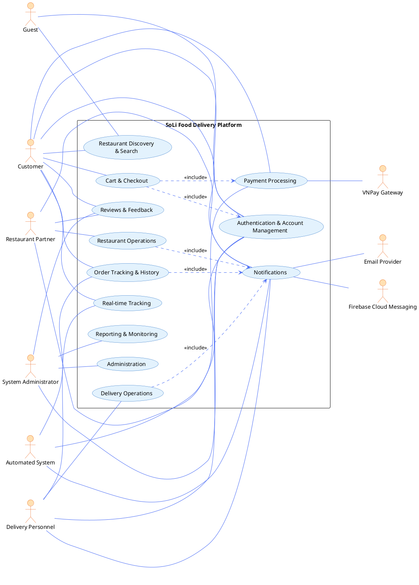

## 2.2 Authentication & Account Management

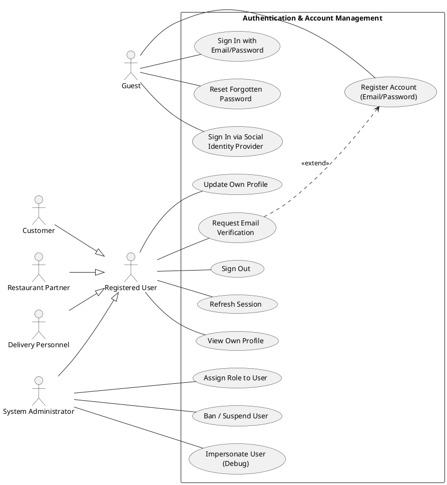

## 2.3 Restaurant Discovery & Search

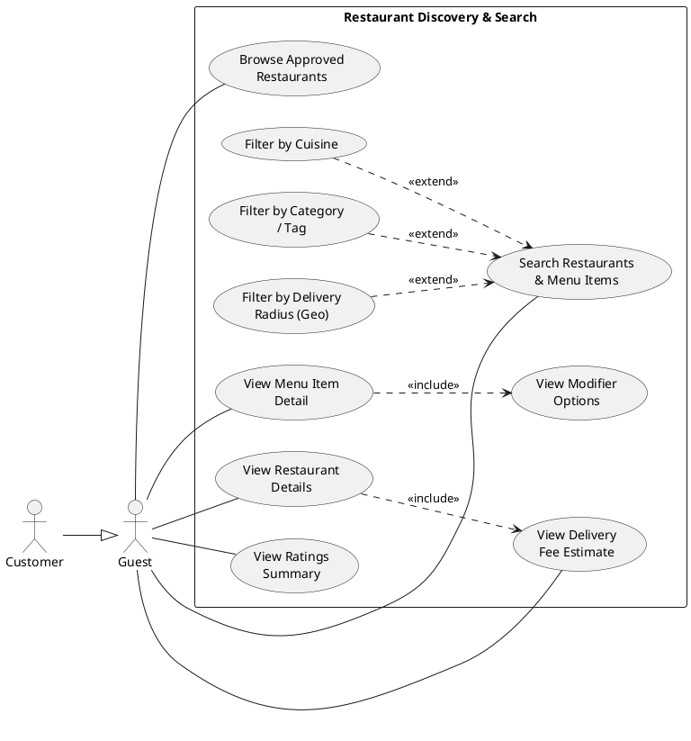

## 2.4 Cart & Checkout

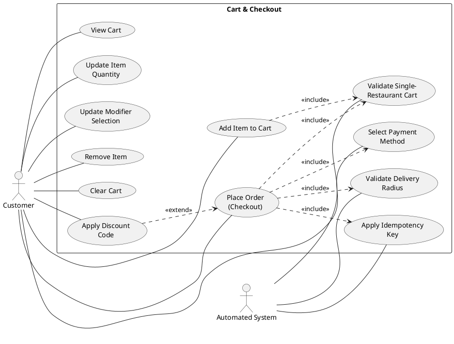

## 2.5 Payment

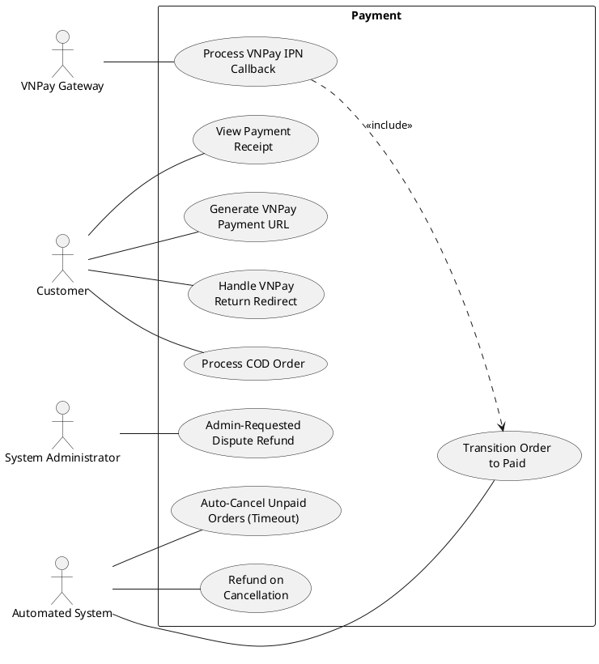

## 2.6 Order Tracking & History

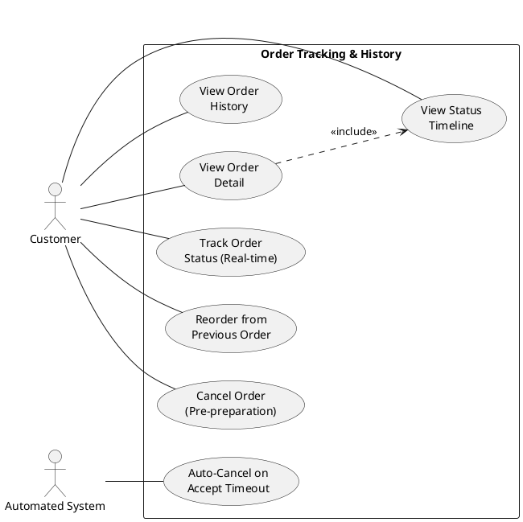

## 2.7 Restaurant Operations

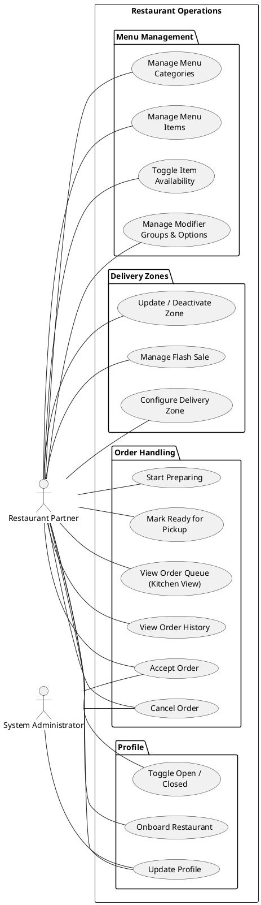

## 2.8 Delivery Operations

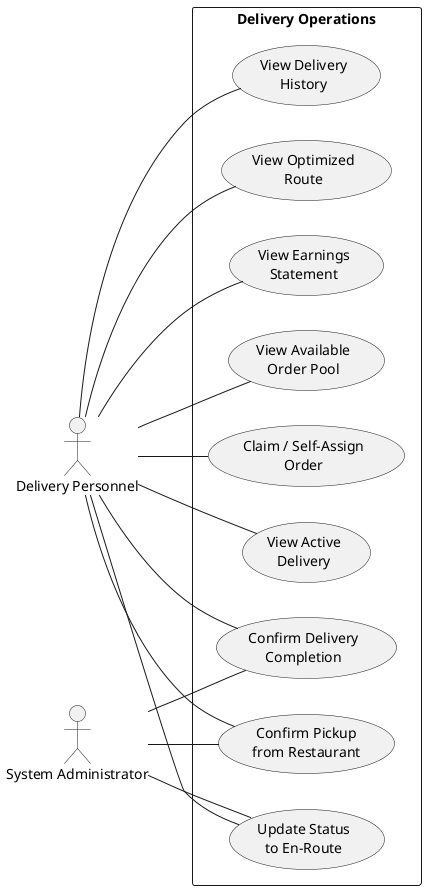

## 2.9 Notifications

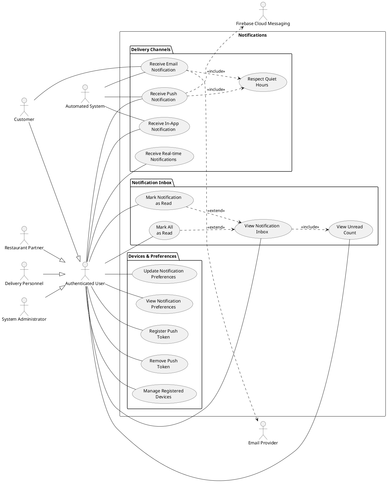

## 2.10 Reviews & Feedback

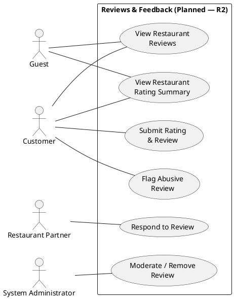

## 2.11 Administration

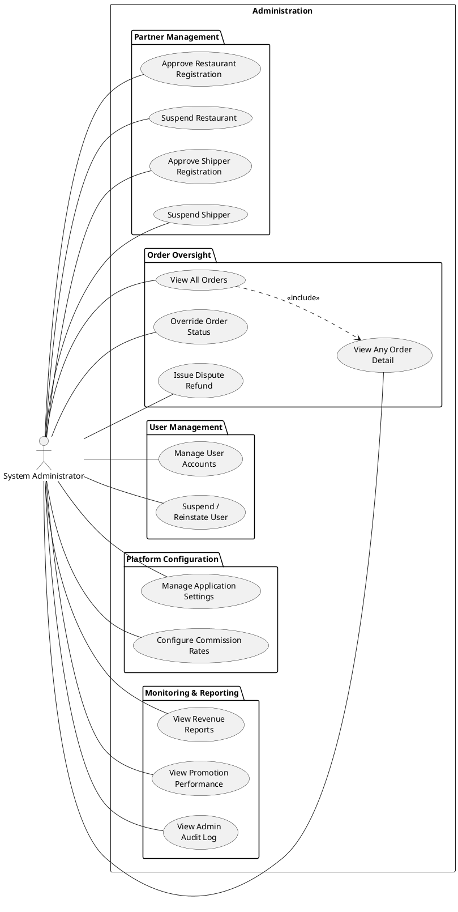

## 2.12 Real-time Tracking

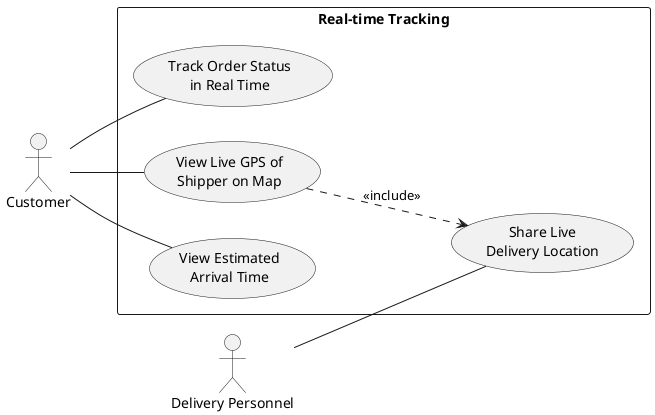

## 2.13 Reporting & Monitoring

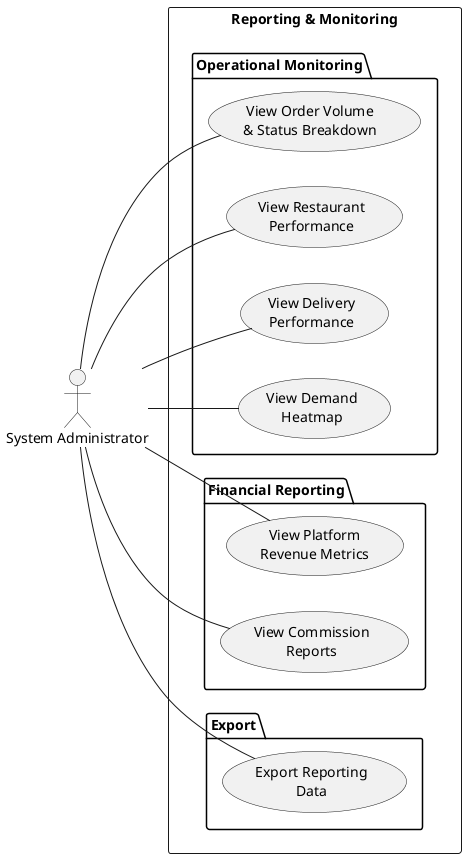

---

# 3. Actor List

## 3.1 Primary Actors

| ID | Actor | Description | Authentication |
|----|-------|-------------|----------------|
| A-01 | **Guest / Anonymous User** | An unauthenticated visitor who can browse public restaurant listings, search menus, and initiate the registration flow. | None |
| A-02 | **Customer** | An authenticated end-user (`user` role) who browses restaurants, manages a cart, places and pays for orders, tracks deliveries, and submits reviews. | Email/password |
| A-03 | **Restaurant Partner** | An authenticated business user (`restaurant` role) who manages restaurant profile, menus, modifiers, delivery zones, and incoming orders through the web portal. | Email/password |
| A-04 | **Delivery Personnel (Shipper)** | An authenticated courier (`shipper` role) who claims available delivery assignments and updates pickup and delivery status from the mobile application. | Email/password |
| A-05 | **System Administrator** | An authenticated platform operator (`admin` role) with cross-cutting authority over partner approvals, order oversight, refunds, account management, and platform configuration. | Email/password |

## 3.2 Secondary Actors

| ID | Actor | Description | Interaction Mode |
|----|-------|-------------|------------------|
| A-06 | **Automated System** | The platform's internal scheduling subsystem. Triggers timeout-driven cancellations, refund initiation, device token cleanup, and other periodic processes. | Internal cron scheduler |
| A-07 | **VNPay Gateway** | Vietnamese payment service provider integrated for online order settlement. Initiates server-to-server IPN callbacks confirming payment outcomes. | Inbound callback (IPN) |
| A-08 | **Firebase Cloud Messaging (FCM)** | Mobile push-notification delivery service. Receives outbound push payloads from the platform. | Outbound API |
| A-09 | **Email Provider** | Transactional email delivery service (SMTP) used for order confirmation and lifecycle email notifications. | Outbound SMTP |

---

# 4. Use Case List

The following table summarizes every domain-level use case specification contained in this document. Each row represents a **major business domain**; the underlying atomic use cases (`UC-XXX-NN`) are inventoried in the Use Case Proposal and elaborated within the corresponding domain specification.

| Spec ID | Domain Use Case | Primary Actor(s) | Priority | Status |
|---------|-----------------|------------------|----------|--------|
| UC-DOM-01 | Authentication & Account Management | Guest, Customer, Restaurant, Shipper, Admin | P1 | Implemented (with planned extensions) |
| UC-DOM-02 | Restaurant Discovery & Search | Guest, Customer | P1 | Implemented |
| UC-DOM-03 | Cart & Checkout | Customer | P1 | Implemented |
| UC-DOM-04 | Payment | Customer, Admin, VNPay, System | P1 | Implemented |
| UC-DOM-05 | Order Tracking & History | Customer, System | P1 | Implemented |
| UC-DOM-06 | Restaurant Operations | Restaurant, Admin | P1 | Implemented (flash sales planned) |
| UC-DOM-07 | Delivery Operations | Shipper, Admin | P1 | Implemented (routing/earnings planned) |
| UC-DOM-08 | Notifications | Customer, Restaurant, Shipper, Admin, System | P1 | Implemented |
| UC-DOM-09 | Reviews & Feedback | Customer, Restaurant, Admin | P3 | Planned (R2) |
| UC-DOM-10 | Administration | Admin | P1 | Implemented (reporting partial) |
| UC-DOM-11 | Real-time Tracking | Customer, Shipper | P1 / P3 | Status updates implemented; live GPS planned (R2) |
| UC-DOM-12 | Reporting & Monitoring | Admin | P2 | Partial (full suite R2) |

---

# 5. Detailed Use Case Specifications

Each domain specification follows the same template:

> **Use Case ID, Use Case Name, Created By, Last Updated By, Created Date, Updated Date, Actors, Description, Preconditions, Postconditions, Priority, Frequency of Use, Normal Course of Events, Alternative Courses, Exceptions, Includes, Extends, Special Requirements, Assumptions, Notes & Issues.**

---

## 5.1 UC-DOM-01 — Authentication & Account Management

| Attribute | Detail |
|-----------|--------|
| **Use Case ID** | UC-DOM-01 |
| **Use Case Name** | Authentication & Account Management |
| **Created By** | Business Analysis Team |
| **Last Updated By** | Business Analysis Team |
| **Created Date** | 15/01/2026 |
| **Updated Date** | 28/01/2026 |
| **Actors** | Primary: Guest, Customer, Restaurant Partner, Delivery Personnel, System Administrator. |
| **Description** | This domain enables identity establishment and identity-related lifecycle operations across the platform. It covers self-registration, sign-in, sign-out, session refresh, profile management, email verification, password recovery, social sign-in (planned), and administrative role and account-state controls. Authentication is the prerequisite for every personalized capability such as cart management, ordering, partner operations, and delivery assignments. |
| **Preconditions** | The platform is reachable. The user has an internet-connected client device. For administrative sub-flows, the actor's session is associated with the `admin` role. |
| **Postconditions** | A valid authenticated session is established or invalidated as appropriate. User profile attributes, role assignments, or account-state flags are persisted. |
| **Priority** | P1 — Must |
| **Frequency of Use** | Very high — every interactive session begins with authentication. |
| **Normal Course of Events** | 1. The actor opens the client application.   2. The actor selects "Register" or "Sign In".   3. For registration, the actor supplies name, email, password, and accepts the terms of service.   4. The system validates input format, ensures email uniqueness, persists the user account, and assigns the default `user` role.   5. The actor signs in with email and password; the system verifies credentials and issues an authenticated session token.   6. The actor may view and update profile details (display name, avatar, phone) at any time.   7. The actor may sign out, which invalidates the current session. |
| **Alternative Courses** | **A1 — Email verification:** Following registration, the customer requests verification; the system dispatches a verification email containing a single-use link.   **A2 — Forgotten password recovery:** The actor selects "Forgot password"; the system emails a time-limited reset link; the actor sets a new password and is redirected to sign-in.   **A3 — Social sign-in (Planned, R2):** The actor signs in with an external identity provider; on first use, a platform account is created and linked to the provider identity.   **A4 — Administrative role assignment:** The administrator selects a user account and assigns or revokes a role (`restaurant`, `shipper`, `admin`).   **A5 — Administrative ban / suspension:** The administrator marks a user account as banned; subsequent sign-in attempts are rejected.   **A6 — Administrative impersonation (Planned/Partial):** The administrator initiates a debug impersonation session for a target user, scoped and audit-logged. |
| **Exceptions** | **E1 — Duplicate email:** Registration is rejected with a clear error; the actor is invited to sign in or recover the password.   **E2 — Invalid credentials:** Sign-in is rejected; the system applies rate-limiting after repeated failures.   **E3 — Banned account:** Sign-in is rejected with a notice referring the actor to support.   **E4 — Expired session:** Protected actions return an authentication error; the actor is redirected to sign in or refresh.   **E5 — Reset link expired or already used:** The recovery flow is rejected; the actor is invited to request a new link. |
| **Includes** | None. |
| **Extends** | Request Email Verification «extends» Register Account. |
| **Special Requirements** | Credentials must be stored using industry-standard hashing. Sessions must be invalidated upon explicit sign-out. The platform must enforce role-based access control (RBAC) on all protected endpoints. All authentication traffic must be transported over TLS. PII must not appear in application logs. |
| **Assumptions** | Users have access to the email account they register with. The administrator account is provisioned out-of-band before go-live. |
| **Notes & Issues** | Social sign-in (UC-AUTH-11) is approved business capability but not configured in the current release. Password reset (UC-AUTH-12) is partial — recovery flow exists; UI exposure is finalized in R1.1. |

---

## 5.2 UC-DOM-02 — Restaurant Discovery & Search

| Attribute | Detail |
|-----------|--------|
| **Use Case ID** | UC-DOM-02 |
| **Use Case Name** | Restaurant Discovery & Search |
| **Created By** | Business Analysis Team |
| **Last Updated By** | Business Analysis Team |
| **Created Date** | 15/01/2026 |
| **Updated Date** | 28/01/2026 |
| **Actors** | Primary: Guest, Customer. |
| **Description** | This domain exposes the unified discovery surface through which guests and customers browse approved restaurants, examine menus and modifier options, search by keyword, filter by cuisine, category, tag, and geographic proximity, and review delivery fee estimates and rating summaries. The discovery surface drives the order funnel and is intentionally accessible without authentication for restaurants and menu items. |
| **Preconditions** | The platform is reachable. At least one restaurant is approved and active. For geographic filtering, the actor's device has supplied a location or the actor has entered a delivery address. |
| **Postconditions** | The actor has obtained a list of restaurants and/or menu items consistent with the supplied criteria. No business state is modified by discovery actions. |
| **Priority** | P1 — Must |
| **Frequency of Use** | Very high — discovery is the primary entry point to ordering. |
| **Normal Course of Events** | 1. The actor opens the application's discovery surface.   2. The system displays approved restaurants ordered by relevance and proximity.   3. The actor selects a restaurant; the system displays the restaurant profile, operating hours, menu categories, and menu items.   4. The actor opens a menu item detail view; the system displays item description, pricing, availability, image, and configurable modifier options.   5. The actor optionally enters a delivery address; the system computes and displays the delivery fee estimate based on the restaurant's configured delivery zone. |
| **Alternative Courses** | **A1 — Keyword search:** The actor enters a search term; the system returns matching restaurants and menu items in a single response with separate result counts.   **A2 — Filter by cuisine, category, or tag:** The actor applies one or more filters; the system constrains results accordingly.   **A3 — Filter by delivery radius:** The actor enables proximity-based filtering; the system returns only restaurants whose delivery zone covers the actor's location.   **A4 — View ratings summary (Planned, R2):** The actor opens a restaurant's profile; the system displays aggregate star rating and recent reviews. |
| **Exceptions** | **E1 — No results:** The system displays a clear empty-state with suggestions to broaden criteria.   **E2 — Out-of-zone address:** The delivery estimate sub-flow returns a zone-coverage error; the actor is invited to revise the address or choose another restaurant.   **E3 — Restaurant unavailable:** A restaurant currently closed or sold out is displayed with a non-actionable indicator. |
| **Includes** | View Restaurant Detail «include» View Delivery Fee Estimate; View Menu Item Detail «include» View Modifier Options. |
| **Extends** | Filter by Cuisine «extends» Search Restaurants & Menu Items; Filter by Category/Tag «extends» Search Restaurants & Menu Items; Filter by Delivery Radius «extends» Search Restaurants & Menu Items. |
| **Special Requirements** | Search must support accent-insensitive matching for the Vietnamese language. Discovery endpoints must remain accessible to anonymous users. Result pagination must be enforced to bound response sizes. |
| **Assumptions** | Restaurant partners maintain accurate menu data and operating hours. Geolocation services are available with sufficient quota. |
| **Notes & Issues** | Ratings summary depends on the Reviews & Feedback domain (UC-DOM-09) and inherits its planned-R2 status. |

---

## 5.3 UC-DOM-03 — Cart & Checkout

| Attribute | Detail |
|-----------|--------|
| **Use Case ID** | UC-DOM-03 |
| **Use Case Name** | Cart & Checkout |
| **Created By** | Business Analysis Team |
| **Last Updated By** | Business Analysis Team |
| **Created Date** | 15/01/2026 |
| **Updated Date** | 28/01/2026 |
| **Actors** | Primary: Customer. Secondary: Automated System. |
| **Description** | This domain governs the construction of the customer's cart, modification of cart items and modifier selections, and the checkout transition that converts the cart into a confirmed order. Checkout enforces the single-restaurant cart constraint, delivery zone eligibility, payment method selection, and order idempotency. |
| **Preconditions** | The customer is authenticated. The customer has selected at least one menu item from one approved restaurant. The customer has a deliverable address. |
| **Postconditions** | An order has been created and is associated with the customer, the restaurant, and the chosen payment method. The cart is cleared on successful checkout. |
| **Priority** | P1 — Must |
| **Frequency of Use** | High — every transaction passes through this domain. |
| **Normal Course of Events** | 1. The customer adds a menu item to the cart, optionally with modifier selections and quantity.   2. The system validates the single-restaurant constraint and persists the cart line.   3. The customer reviews, updates quantity, edits modifiers, or removes items.   4. The customer initiates checkout.   5. The system re-validates the cart, confirms delivery zone eligibility for the supplied address, computes delivery fee, and presents the order summary.   6. The customer selects a payment method (COD or VNPay) and confirms the order.   7. The system applies an idempotency key, persists the order in `pending` state, clears the cart, and dispatches the appropriate downstream events (notifications and, for VNPay, payment URL generation). |
| **Alternative Courses** | **A1 — Cross-restaurant addition:** The customer attempts to add an item from a different restaurant; the system prompts the customer to either clear the existing cart or cancel the action.   **A2 — Modifier price re-resolution:** At checkout, the system re-resolves modifier prices from the catalog snapshot to guarantee price integrity.   **A3 — Apply discount code (Planned, R2):** The customer enters a promotion code; the system validates eligibility and adjusts the order total.   **A4 — Save delivery address:** On checkout, the customer may save the entered address to their profile for future use. |
| **Exceptions** | **E1 — Item unavailable at checkout:** A previously cart-added item is now sold out; the system invites the customer to remove it before continuing.   **E2 — Address outside delivery zone:** Checkout is blocked with a zone-coverage error; the customer must enter a deliverable address.   **E3 — Duplicate submission:** A repeated submission within the idempotency window is silently de-duplicated.   **E4 — Restaurant closed:** Checkout is blocked with a restaurant-status error. |
| **Includes** | Place Order «include» Validate Single-Restaurant Cart; Place Order «include» Validate Delivery Radius; Place Order «include» Apply Idempotency Key; Place Order «include» Select Payment Method. |
| **Extends** | Apply Discount Code «extends» Place Order. |
| **Special Requirements** | Cart state is held in a low-latency cache keyed by user identity. Checkout enforces transactional integrity — an order is either fully created or not created. Modifier and item pricing must be re-resolved server-side at checkout. The idempotency window must align with the configured platform setting. |
| **Assumptions** | Customers have valid delivery addresses within the platform's service area. Restaurants maintain up-to-date availability flags on items. |
| **Notes & Issues** | Promotion-code redemption is approved and modeled but deferred to Release 2. |

---

## 5.4 UC-DOM-04 — Payment

| Attribute | Detail |
|-----------|--------|
| **Use Case ID** | UC-DOM-04 |
| **Use Case Name** | Payment |
| **Created By** | Business Analysis Team |
| **Last Updated By** | Business Analysis Team |
| **Created Date** | 15/01/2026 |
| **Updated Date** | 28/01/2026 |
| **Actors** | Primary: Customer, System Administrator. Secondary: VNPay Gateway, Automated System. |
| **Description** | This domain manages the financial settlement of orders. It supports two payment paths: Cash on Delivery (COD), in which the order proceeds directly to the restaurant fulfillment workflow; and VNPay, in which the customer is redirected to the gateway, the platform receives an Instant Payment Notification (IPN), and the order is transitioned to `paid` only after cryptographic verification. The domain also encompasses payment-driven auto-cancellation for unpaid orders, refund initiation on cancellation of paid orders, and administrator-initiated dispute refunds on delivered orders. |
| **Preconditions** | An order has been placed and is in the `pending` state. For VNPay, the customer is signed in and the gateway is reachable. For dispute refund, the order is in the `delivered` state. |
| **Postconditions** | The order's payment state is recorded as `paid`, `failed`, `cancelled`, or `refunded`. Notifications are dispatched to relevant participants. |
| **Priority** | P1 — Must |
| **Frequency of Use** | Very high — every order produces at least one payment-domain interaction. |
| **Normal Course of Events** | **VNPay flow** — 1. At checkout the system generates a signed VNPay payment URL and redirects the customer.   2. The customer completes payment at the VNPay portal.   3. The gateway sends an IPN callback to the platform.   4. The platform verifies the HMAC signature, reconciles the transaction, and transitions the order to `paid`.   5. The browser-return URL renders a UI confirmation; no business state is mutated through this redirect.   **COD flow** — 1. The customer selects COD at checkout.   2. The order proceeds directly to the restaurant for acceptance; settlement is recorded by the shipper at delivery time. |
| **Alternative Courses** | **A1 — Payment timeout:** A `pending` order whose VNPay payment is not confirmed within the configured threshold is auto-transitioned to `cancelled`; a payment-failed notification is dispatched.   **A2 — Refund on cancellation after payment:** When a paid order is cancelled, the platform initiates a refund to the original payment instrument and notifies the customer.   **A3 — Admin dispute refund:** The administrator approves a refund on a delivered order; the platform initiates the refund and transitions the order to `refunded`.   **A4 — View payment receipt:** The customer reviews the receipt and transaction reference from order detail. |
| **Exceptions** | **E1 — Signature verification failure:** The IPN is rejected; no state change is applied; the event is logged for audit.   **E2 — Duplicate IPN:** Repeated callbacks for the same transaction are idempotently ignored.   **E3 — Gateway unreachable:** The customer is informed; the order remains in `pending` until the timeout cycle resolves it.   **E4 — Refund rejected by gateway:** The administrator is alerted; the order remains marked for manual reconciliation. |
| **Includes** | Process VNPay IPN «include» Transition Order to Paid. |
| **Extends** | None |
| **Special Requirements** | All gateway communications must be signed and verified using the configured HMAC scheme. Gateway credentials must be managed via environment variables. Payment-state transitions must be idempotent. PII and payment identifiers must not appear in application logs. |
| **Assumptions** | The VNPay sandbox certification has been completed prior to production deployment. The payment gateway maintains the SLA stated in BRD AS-3. |
| **Notes & Issues** | MoMo integration is approved as a Release 2 capability and is modeled here as a future extension of the VNPay flow. |

---

## 5.5 UC-DOM-05 — Order Tracking & History

| Attribute | Detail |
|-----------|--------|
| **Use Case ID** | UC-DOM-05 |
| **Use Case Name** | Order Tracking & History |
| **Created By** | Business Analysis Team |
| **Last Updated By** | Business Analysis Team |
| **Created Date** | 15/01/2026 |
| **Updated Date** | 28/01/2026 |
| **Actors** | Primary: Customer. Secondary: Automated System. |
| **Description** | This domain enables the customer to monitor the lifecycle of their orders and review historical orders. It includes paginated history retrieval, order detail inspection, real-time status tracking, status timeline review, customer-initiated cancellation of orders that have not yet entered preparation, system-driven auto-cancellation when restaurant acceptance times out, and one-tap reorder convenience. |
| **Preconditions** | The customer is authenticated and has at least one order on record (for history-related flows). For real-time tracking, the customer holds an active order in a non-terminal state. |
| **Postconditions** | The customer has obtained the requested view. For cancellation, the order is transitioned to `cancelled` and downstream refund and notification events are dispatched. For reorder, a draft cart is prepared with the previous order's items and modifiers. |
| **Priority** | P1 — Must |
| **Frequency of Use** | High — order history and tracking are accessed once per active order and on demand thereafter. |
| **Normal Course of Events** | 1. The customer opens "My Orders".   2. The system displays a paginated list of orders sorted by recency, including status, total, and restaurant.   3. The customer selects an order to view detail, including items, modifiers, charges, payment method, status, and the status transition timeline.   4. For an active order, the system streams real-time status updates to the customer through the notification channel. |
| **Alternative Courses** | **A1 — Cancel order before preparation:** The customer cancels an order in `pending` or `paid` state; the system records the reason, transitions the order to `cancelled`, and triggers refund and notifications as applicable.   **A2 — Reorder:** The customer selects "Reorder" on a previous order; the system returns the items and modifier selections from the source order for the client to pre-fill the cart (read-only; no server-side cart state is created).   **A3 — System-driven auto-cancellation:** When a restaurant fails to accept an order within the configured threshold, the platform automatically transitions the order to `cancelled` and notifies the customer. |
| **Exceptions** | **E1 — Cancellation no longer permitted:** The order is in preparation or later; the system blocks cancellation and informs the customer.   **E2 — Reorder item unavailable:** Some items in the source order are no longer available; the customer is informed and asked to confirm the partial reorder. |
| **Includes** | View Order Detail «include» View Status Timeline. |
| **Extends** | None. |
| **Special Requirements** | Real-time status delivery latency must remain under 3 seconds under normal operating load. Order timeline entries must be immutable and timestamped at second precision. |
| **Assumptions** | The customer remains authenticated when accessing personal order data. The customer's device supports persistent real-time connectivity. |
| **Notes & Issues** | Live shipper GPS tracking is covered separately in UC-DOM-11 (Real-time Tracking) and is targeted for Release 2. |

---

## 5.6 UC-DOM-06 — Restaurant Operations

| Attribute | Detail |
|-----------|--------|
| **Use Case ID** | UC-DOM-06 |
| **Use Case Name** | Restaurant Operations |
| **Created By** | Business Analysis Team |
| **Last Updated By** | Business Analysis Team |
| **Created Date** | 15/01/2026 |
| **Updated Date** | 28/01/2026 |
| **Actors** | Primary: Restaurant Partner. Secondary: System Administrator (oversight and elevated privileges). |
| **Description** | This domain provides the restaurant partner with the operational tools required to run their business on the platform. It encompasses restaurant onboarding and profile management, real-time open/closed control, end-to-end order handling from acceptance through ready-for-pickup, full menu and modifier management, and configuration of delivery zones with associated fees and ETAs. Flash-sale management is approved as a Release 2 extension. |
| **Preconditions** | The actor is authenticated as a restaurant partner. For order-handling sub-flows, the restaurant has at least one active order. For administrative override, the actor is authenticated as administrator. |
| **Postconditions** | Restaurant profile, menu, modifier, and delivery zone changes are persisted and reflected to customers. Order state transitions are recorded with timestamp and actor attribution. Downstream notifications are dispatched. |
| **Priority** | P1 — Must |
| **Frequency of Use** | Continuous during restaurant operating hours. |
| **Normal Course of Events** | **Onboarding** — 1. The restaurant partner registers the restaurant, supplying name, address, contact information, opening hours, and cuisine type.   2. The restaurant remains in unapproved state until administrator approval.   **Daily operations** — 3. The partner toggles the restaurant to "open" at the start of service.   4. New orders appear in the kitchen view in real time.   5. The partner accepts each order, transitioning it to `confirmed`.   6. The partner marks the order as `preparing` when work begins, then `ready_for_pickup` when complete.   **Menu management** — 7. The partner creates and maintains menu categories, items, modifier groups, and modifier options, with images, prices, and availability flags.   **Delivery zone management** — 8. The partner configures one or more delivery zones with radius, base fee, distance pricing, ETA parameters, and quiet hours. |
| **Alternative Courses** | **A1 — Reject / cancel order before preparation:** The partner cancels an order with a reason; refund is initiated when applicable.   **A2 — Toggle item availability:** The partner marks an item as sold out; it is hidden from new cart additions and search results.   **A3 — Update modifier group:** The partner adjusts modifier options or pricing; existing carts are not retroactively repriced.   **A4 — Deactivate delivery zone:** The partner removes coverage of a zone; subsequent orders for addresses in that zone are blocked at checkout.   **A5 — Manage flash sale (Planned, R2):** The partner creates a time-limited price reduction for selected items.   **A6 — Administrator override:** The administrator updates restaurant data or transitions order state on behalf of the partner. |
| **Exceptions** | **E1 — Restaurant not yet approved:** Customer-facing operations (open status, accepting orders) are blocked until administrator approval.   **E2 — Item in active cart:** Deletion of an item with active customer carts is allowed; carts are revalidated at checkout.   **E3 — Order acceptance timeout:** If the partner does not accept the order within the configured threshold, the platform auto-cancels and notifies the customer.   **E4 — Invalid zone radius:** Configuration with an unreasonable radius is rejected by validation. |
| **Includes** | None. |
| **Extends** | None. |
| **Special Requirements** | The kitchen view must update in real time without page refresh. Menu and modifier changes must propagate promptly to the customer-facing catalog. Delivery zone fee computation must be deterministic and auditable. |
| **Assumptions** | Restaurant staff have stable internet connectivity at the order-reception point. Menu pricing is the partner's responsibility. |
| **Notes & Issues** | Multi-branch grouping is approved for Release 3 and treated as a future extension of restaurant onboarding. |

---

## 5.7 UC-DOM-07 — Delivery Operations

| Attribute | Detail |
|-----------|--------|
| **Use Case ID** | UC-DOM-07 |
| **Use Case Name** | Delivery Operations |
| **Created By** | Business Analysis Team |
| **Last Updated By** | Business Analysis Team |
| **Created Date** | 15/01/2026 |
| **Updated Date** | 28/01/2026 |
| **Actors** | Primary: Delivery Personnel (Shipper). Secondary: System Administrator. |
| **Description** | This domain enables delivery personnel to claim, transport, and complete delivery assignments. It provides visibility into the available order pool, the shipper's currently active delivery, and historical deliveries. Optimized routing and earnings statements are approved Release 2 extensions. |
| **Preconditions** | The actor is authenticated as delivery personnel and has been approved by the administrator. The shipper holds a current online status. |
| **Postconditions** | The order moves through the delivery lifecycle (`ready_for_pickup → picked_up → delivering → delivered`). Each transition is timestamped and actor-attributed. Notifications are dispatched to the customer and the restaurant at the appropriate stages. |
| **Priority** | P1 — Must |
| **Frequency of Use** | Continuous during delivery shifts. |
| **Normal Course of Events** | 1. The shipper opens the delivery application and views the available order pool — orders in `ready_for_pickup` state.   2. The shipper selects an order; the platform applies first-come-first-served self-assignment.   3. The shipper navigates to the restaurant and confirms pickup, transitioning the order to `picked_up`.   4. The shipper marks the order as en-route, transitioning to `delivering`.   5. Upon handing the order to the customer, the shipper confirms delivery; the order transitions to `delivered`.   6. The shipper reviews delivery history at any time. |
| **Alternative Courses** | **A1 — Multiple shippers attempt to claim:** Only the first claim succeeds; subsequent attempts receive a contention error and the pool is refreshed.   **A2 — Administrator override:** The administrator transitions the order on the shipper's behalf for exceptional cases.   **A3 — View optimized route (Planned, R2):** The shipper views a suggested pickup-and-delivery route.   **A4 — View earnings statement (Planned, R2):** The shipper reviews cumulative earnings and commission deductions by period. |
| **Exceptions** | **E1 — Order no longer available:** The selected order has been cancelled or claimed; the pool is refreshed.   **E2 — Pickup denied at restaurant:** The shipper reports a discrepancy; the administrator intervenes.   **E3 — Customer not reachable:** The shipper logs the issue; the administrator decides on resolution. |
| **Includes** | None. |
| **Extends** | None in current scope. |
| **Special Requirements** | Self-assignment must be atomic to prevent duplicate claims. The shipper's active delivery is constrained to one at a time. Live GPS broadcast (UC-TRACK-03) is governed under UC-DOM-11. |
| **Assumptions** | Shippers operate GPS-enabled smartphones with mobile data. Identity verification is completed during onboarding. |
| **Notes & Issues** | Earnings reporting depends on commission configuration in UC-DOM-10 and the reporting subsystem in UC-DOM-12. |

---

## 5.8 UC-DOM-08 — Notifications

| Attribute | Detail |
|-----------|--------|
| **Use Case ID** | UC-DOM-08 |
| **Use Case Name** | Notifications |
| **Created By** | Business Analysis Team |
| **Last Updated By** | Business Analysis Team |
| **Created Date** | 15/01/2026 |
| **Updated Date** | 28/01/2026 |
| **Actors** | Primary: Authenticated User (Customer, Restaurant Partner, Delivery Personnel, System Administrator). Secondary: Automated System, Firebase Cloud Messaging, Email Provider. |
| **Description** | This domain delivers timely workflow alerts across in-app, push, email, and real-time notification channels. It supports a real-time notification stream, push notifications via Firebase Cloud Messaging (FCM), and transactional email notifications for customer-facing events such as order confirmation, payment confirmation, refund processing, and delivery completion. Authenticated users may manage devices, configure notification preferences, and benefit from quiet-hours suppression for non-urgent channels. |
| **Preconditions** |The recipient is an authenticated user. For push delivery, the user has registered at least one valid device token. For email delivery, the customer account contains a valid email address. For real-time delivery, the user has an active real-time session connection. |
| **Postconditions** | The notification is recorded in the user's inbox, dispatched on the eligible channels according to role eligibility and notification preferences, and reflected in the unread count. |
| **Priority** | P1 — Must |
| **Frequency of Use** | Continuous and event-driven; tightly coupled to order lifecycle events. |
| **Normal Course of Events** | 1. A domain event (e.g., order placed, order status changed, payment confirmed) occurs.   2. The notification subsystem maps the event to one or more recipient–channel combinations defined by the platform's status-transition map.   3. For each recipient, the in-app record is persisted.   4. Push and email channels are dispatched subject to user preferences and quiet-hours rules.   5. The recipient views, reads, or batch-reads notifications from the inbox. |
| **Alternative Courses** | **A1 — Register device push token:** The user registers a new device token for push delivery.   **A2 — Update notification preferences:** The user toggles channels (in-app, push, email) and configures quiet-hours windows.   **A3 — Mark all as read:** The user clears the unread badge in a single action.   **A4 — Manage registered devices:** The user reviews and removes previously registered devices associated with their account.   **A5 — Token cleanup:** The platform automatically purges inactive or invalid tokens.   **A6 — Quiet-hours suppression:** During configured windows, push and email notifications are suppressed while in-app notifications remain available. |
| **Exceptions** | **E1 — FCM rejection:** A push delivery fails for a token; the system records the failure and may deactivate persistently failing tokens.   **E2 — Email bounce:** The email provider reports a bounce; the system marks the address as undeliverable for that channel.   **E3 — User offline:** The user is not connected; in-app notifications are persisted and surfaced upon next sign-in. |
| **Includes** | View Notification Inbox «include» View Unread Count; Receive Push Notification «include» Respect Quiet Hours; Receive Email Notification «include» Respect Quiet Hours. |
| **Extends** | Mark Notification as Read «extends» View Notification Inbox; Mark All as Read «extends» View Notification Inbox. |
| **Special Requirements** | Real-time event-to-client latency must be under 3 seconds under normal load. Real-time presence state is tracked centrally to support multi-device notification delivery. PII must be excluded from server logs. Notification delivery must remain consistent across multiple devices for the same user. |
| **Assumptions** | FCM and SMTP providers maintain availability targets. Users keep at least one device active for time-sensitive workflows. |
| **Notes & Issues** | Shipper-assignment notifications and multi-device synchronization are approved platform capabilities and may be expanded in Release 2 without affecting the core notification lifecycle. Channel-fanout policy is owned by the platform and may be tuned without business-rule changes. |

---

## 5.9 UC-DOM-09 — Reviews & Feedback

| Attribute | Detail |
|-----------|--------|
| **Use Case ID** | UC-DOM-09 |
| **Use Case Name** | Reviews & Feedback |
| **Created By** | Business Analysis Team |
| **Last Updated By** | Business Analysis Team |
| **Created Date** | 15/01/2026 |
| **Updated Date** | 28/01/2026 |
| **Actors** | Primary: Guest, Customer, Restaurant Partner, System Administrator. |
| **Description** | This domain enables customers to submit numeric ratings and written reviews of completed orders, restaurant partners to respond to customer reviews, and administrators to moderate inappropriate content. Aggregate rating statistics are surfaced on restaurant profiles and search results. The domain is approved for Release 2. |
| **Preconditions** | For submission, the customer has at least one order in `delivered` status that has not yet been reviewed. For moderation, the actor is the system administrator. |
| **Postconditions** | The review is persisted, optionally moderated, and aggregated into the restaurant's rating profile. Restaurant responses and moderation outcomes are linked to the originating review. |
| **Priority** | P3 — Could |
| **Frequency of Use** | Moderate — once per delivered order at most. |
| **Normal Course of Events** | 1. The customer opens a delivered order.   2. The customer submits a star rating (1–5) and an optional written comment.   3. The platform persists the review, links it to the order and restaurant, and updates the aggregate rating.   4. The restaurant partner views and optionally responds to the review.   5. Guests and customers see the review on the restaurant's public profile. |
| **Alternative Courses** | **A1 — Flag abusive review:** Any user reports a review for moderation.   **A2 — Administrator moderation:** The administrator reviews flagged content and either approves, redacts, or removes the review.   **A3 — View restaurant rating summary:** Discovery surfaces and restaurant profiles display the aggregate star rating and recent reviews. |
| **Exceptions** | **E1 — Ineligible order:** Submission is rejected if the order is not delivered or is already reviewed.   **E2 — Inappropriate content:** Automated content checks (planned) flag the review for moderation prior to publication. |
| **Includes** | None. |
| **Extends** | None. |
| **Special Requirements** | Each customer may submit at most one review per order. Reviews must be linked to the originating order for auditability. Moderation actions must be logged in the administrator audit trail. |
| **Assumptions** | A content moderation policy will be defined prior to Release 2 launch. |
| **Notes & Issues** | Open issue OI-6 in the BRD records the choice between manual and automated content moderation; resolution is pending. |

---

## 5.10 UC-DOM-10 — Administration

| Attribute | Detail |
|-----------|--------|
| **Use Case ID** | UC-DOM-10 |
| **Use Case Name** | Administration |
| **Created By** | Business Analysis Team |
| **Last Updated By** | Business Analysis Team |
| **Created Date** | 15/01/2026 |
| **Updated Date** | 28/01/2026 |
| **Actors** | Primary: System Administrator. |
| **Description** | This domain provides cross-cutting platform governance, operational oversight, configuration management, and monitoring capabilities. It encompasses restaurant and shipper approval workflows, partner suspension management, full-platform order oversight with composable filters, order-state override authority, dispute refunds on delivered orders, user account administration and suspension control, configuration of application settings and commission rates, audit-log inspection, promotion-performance monitoring, and revenue-report access. |
| **Preconditions** | The actor is authenticated as administrator. |
| **Postconditions** | The selected administrative action is applied. Partner approval and suspension states, user states, order states, refunds, and configuration values are persisted. Notifications are dispatched where business-relevant, and audit-log entries are recorded for traceability. |
| **Priority** | P1 — Must |
| **Frequency of Use** | Continuous — administration is a daily activity. |
| **Normal Course of Events** | 1. The administrator signs in to the web portal.   2. The administrator reviews pending restaurant registrations and approves eligible partners.   3. The administrator monitors active orders across the platform using composable filters (status, date, restaurant, customer).   4. The administrator inspects order detail and, where required, overrides order state (e.g., force-cancel an unresponsive order).   5. The administrator approves a dispute refund on a delivered order.   6. The administrator manages user accounts — search, role assignment, ban / unban.   7. The administrator reviews and updates application settings such as timeout thresholds and commission rates. |
| **Alternative Courses** | **A1 — Suspend a restaurant:** A non-compliant restaurant is suspended and removed from the public catalog.   **A2 — Approve / suspend shipper:** The administrator manages shipper onboarding state.   **A3 — View revenue reports (Planned, R2):** The administrator runs a report by period or restaurant.   **A4 — View promotion performance (Planned, R3):** The administrator analyzes campaign uptake.   **A5 — Review audit log (Planned, R2):** The administrator inspects historical administrative actions. |
| **Exceptions** | **E1 — Override blocked by lifecycle:** Some transitions are not permitted from certain states; the system rejects the override with an explanatory message.   **E2 — Refund failure at gateway:** The dispute refund cannot be settled automatically; a manual reconciliation case is created.   **E3 — Ban during active session:** Banning a user with an active session immediately invalidates the session. |
| **Includes** | View All Orders «include» View Any Order Detail. |
| **Extends** | None. |
| **Special Requirements** | All administrative actions must be auditable. Administrator privileges are subject to role-based access control. Configuration changes must take effect without service restart. Refund execution must be idempotent and reconcilable with gateway records. |
| **Assumptions** | The administrator team is small and trusted in the initial release; advanced delegation models (sub-roles) are not required for MVP. |
| **Notes & Issues** | Audit log surfacing (UC-ADMIN-14) is approved and planned for Release 2. Commission-rate management (UC-ADMIN-15) is partial and to be completed alongside the reporting suite. |

---

## 5.11 UC-DOM-11 — Real-time Tracking

| Attribute | Detail |
|-----------|--------|
| **Use Case ID** | UC-DOM-11 |
| **Use Case Name** | Real-time Tracking |
| **Created By** | Business Analysis Team |
| **Last Updated By** | Business Analysis Team |
| **Created Date** | 15/01/2026 |
| **Updated Date** | 28/01/2026 |
| **Actors** | Primary: Customer, Delivery Personnel. |
| **Description** | This domain provides the customer with real-time visibility into their active order. In Release 1, this manifests as real-time order-status tracking delivered through persistent client connections. In Release 2, the domain is extended with live GPS broadcast from the delivery personnel and dynamic estimated-arrival-time updates rendered on a map. |
| **Preconditions** | The customer holds an active order in a non-terminal state. The customer's client device maintains an active real-time session connection. For live GPS, the shipper has consented to location broadcast and is actively delivering the order. |
| **Postconditions** | The customer is presented with the most recent order status and, when available, the live shipper position and updated ETA. No business state is mutated by tracking. |
| **Priority** | P1 — Must (status updates) ; P3 — Could (live GPS, R2) |
| **Frequency of Use** | High during active orders. |
| **Normal Course of Events** | 1. The customer opens the active order screen.   2. The system continuously updates the customer with the latest order status as the delivery lifecycle progresses.   3. As the order enters the `delivering` state, the customer sees status indication and an ETA derived from the configured zone parameters. |
| **Alternative Courses** | **A1 — Live GPS tracking (Planned, R2):** The shipper's location is broadcast at a moderate cadence; the customer sees the delivery location update on the map in real time.   **A2 — Dynamic estimated arrival time (Partial → R2):** The platform recomputes estimated arrival time based on current delivery progress and routing conditions.   **A3 — Reconnection:** The client recovers from a transient disconnect and re-synchronizes with the latest server-side state. |
| **Exceptions** | **E1 — Connection lost:** The client falls back to periodic synchronization and re-establishes the real-time session when connectivity is restored.   **E2 — GPS unavailable on shipper device:** Live GPS is suppressed; status updates remain available. |
| **Includes** | View Live GPS of Shipper on Map «include» Share Live Delivery Location. |
| **Extends** | None. |
| **Special Requirements** | Latency from event to client must remain under 3 seconds. Live GPS broadcast must respect the shipper's privacy and only be active for the assigned customer during the active order. |
| **Assumptions** | Customers maintain network connectivity during the delivery window. Map provider quotas are sufficient for projected concurrency. |
| **Notes & Issues** | Open issue OI-1 in the BRD records the pending decision between Google Maps and Mapbox; resolution affects this domain. |

---

## 5.12 UC-DOM-12 — Reporting & Monitoring
| Attribute | Detail |
|-----------|--------|
| **Use Case ID** | UC-DOM-12 |
| **Use Case Name** | Reporting & Monitoring |
| **Created By** | Business Analysis Team |
| **Last Updated By** | Business Analysis Team |
| **Created Date** | 15/01/2026 |
| **Updated Date** | 28/01/2026 |
| **Actors** | Primary: System Administrator. |
| **Description** | This domain provides administrators with operational and financial visibility into platform activity. It includes platform-wide order volume and status breakdown, restaurant performance reporting, delivery performance monitoring, platform revenue metrics, commission reporting, exportable reporting datasets, and demand heatmaps. Basic monitoring capabilities are available in Release 1 through composable operational filters, while the complete reporting suite is approved for Release 2. |
| **Preconditions** | The actor is authenticated as administrator. Sufficient historical data exists for the requested reporting period. |
| **Postconditions** | The administrator has obtained the requested report, monitoring view, or exported dataset. No business state is modified by reporting actions. |
| **Priority** | P2 — Should |
| **Frequency of Use** | Daily for operational monitoring; periodic for financial and performance reporting. |
| **Normal Course of Events** | 1. The administrator opens the reporting console.   2. The administrator selects the desired operational or financial report and the reporting period.   3. The system computes aggregates and presents the results in tabular and chart form.   4. The administrator may export the selected reporting dataset for offline analysis or reconciliation. |
| **Alternative Courses** | **A1 — Filter by restaurant or delivery personnel:** The administrator narrows the report to a specific operational partner.   **A2 — Export reporting data:** The administrator exports the selected reporting dataset for offline analysis and reconciliation.   **A3 — Live operational monitoring:** The administrator observes near real-time operational activity using filtered order and status views. |
| **Exceptions** | **E1 — No data in reporting period:** The system displays a clear empty-state result.   **E2 — Export size limit exceeded:** The administrator is prompted to narrow the reporting scope or period. |
| **Includes** | None. |
| **Extends** | None. |
| **Special Requirements** | Reports must complete within the platform's interactive performance budget for the requested period. Aggregation queries must not negatively impact operational order-processing workloads. Personally identifiable information (PII) must be excluded from exported datasets unless explicitly authorized for support or audit purposes through access-controlled workflows. |
| **Assumptions** | The reporting subsystem reads from operational data stores in Release 1. A dedicated analytics datastore may be introduced in Release 2 if reporting performance or scalability requirements increase. |
| **Notes & Issues** | Reporting depends on commission configuration managed under UC-DOM-10. Demand heatmaps depend on the geolocation provider selected under BRD Open Issue OI-1. |

---

*End of Use Case Specification v1.0*

*Subsequent artefacts: Software Requirements Specification (SRS), System Architecture Document, API Specification, Test Plan. Use Case identifiers in this document are stable anchors for traceability.*
