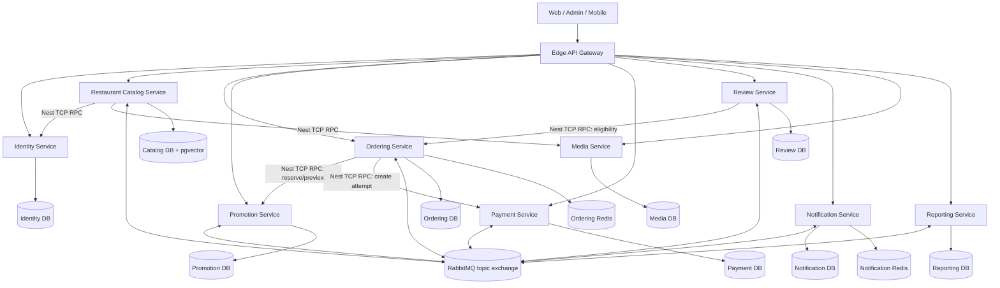

# API Modular Monolith to Microservices Migration Plan

**Status:** In progress — Phases 0–8 code-complete and verified; cutover/decommission pending

**Scope:** `apps/api` and the infrastructure, CI/CD, and clients that depend on it

**Prepared:** 2026-06-21
**Recommended delivery model:** Incremental strangler migration; no big-bang rewrite

### Implementation status

Each completed phase has a dedicated implementation report. "Code-complete"
means boundaries, service/Gateway ownership, durable events, infra (Compose,
CI/CD, Render Terraform), and cutover flags are implemented and verified at the
typecheck/unit/build level; live data backfill, staging drills, production
cutover, and legacy decommission remain owner actions.

| Phase | Scope                                       | Status        | Report                                   |
| ----- | ------------------------------------------- | ------------- | ---------------------------------------- |
| 0     | Baseline, security, architecture decisions  | Code-complete | [PHASE_0_REPORT.md](./PHASE_0_REPORT.md) |
| 1     | Platform foundation and edge gateway        | Code-complete | [PHASE_1_REPORT.md](./PHASE_1_REPORT.md) |
| 2     | Durable integration and monolith decoupling | Code-complete | [PHASE_2_REPORT.md](./PHASE_2_REPORT.md) |
| 3     | Extract Media pilot                         | Code-complete | [PHASE_3_REPORT.md](./PHASE_3_REPORT.md) |
| 4     | Extract Identity and internal auth          | Code-complete | [PHASE_4_REPORT.md](./PHASE_4_REPORT.md) |
| 5     | Extract Notifications                       | Code-complete | [PHASE_5_REPORT.md](./PHASE_5_REPORT.md) |
| 6     | Extract Restaurant Catalog                  | Code-complete | [PHASE_6_REPORT.md](./PHASE_6_REPORT.md) |
| 7     | Extract Promotions and Payments             | Code-complete | [PHASE_7_REPORT.md](./PHASE_7_REPORT.md) |
| 8     | Extract Reviews                             | Code-complete | [PHASE_8_REPORT.md](./PHASE_8_REPORT.md) |
| 9     | Extract Ordering + retire monolith          | Not started   | —                                        |

## 1. Executive recommendation

UITFood should migrate by turning the existing bounded contexts into independently deployable services one at a time while preserving the current public `/api/**` contract behind an edge gateway. The existing modular boundaries, ports, domain events, and Ordering snapshot tables provide a useful starting point. They are not yet microservice boundaries because all modules still share one NestJS process, one PostgreSQL database connection, in-process CQRS delivery, shared transactions, shared scheduled jobs, and one deployment unit.

The recommended extraction order is:

1. Build the gateway, NestJS TCP RPC foundation, RabbitMQ event platform, service template, and isolated staging environment.
2. Extract Media as the low-risk deployment pilot.
3. Extract Identity and establish a signed internal authentication model.
4. Extract Notifications to prove durable asynchronous consumption and WebSocket routing.
5. Extract Restaurant Catalog, using its existing events and Ordering snapshots as the anti-corruption boundary.
6. Extract Promotions, then Payments, and replace local port calls with idempotent network contracts.
7. Extract Reviews after removing its current cross-context database transaction.
8. Extract Ordering last because checkout, payment, promotion, Redis cart state, and order lifecycle form the highest-risk workflow.
9. Replace cross-context analytics joins with an event-fed Reporting service, then retire the monolith runtime.

Do not create one service for every NestJS submodule. `menu`, `nutrition`, `dietary-tags`, `delivery-zones`, and search should initially remain one Restaurant Catalog service. `cart`, `order`, `order-history`, `order-lifecycle`, and the catalog snapshot ACL should remain one Ordering service. Split those further only when measured scaling, ownership, or release-cadence pressure justifies the operational cost.

## 2. Current-state assessment

### 2.1 Existing business boundaries

The repository already documents and enforces these bounded contexts in `apps/api/docs/BOUNDED_CONTEXTS.md` and `src/architecture/module-boundaries.spec.ts`:

| Existing context   | Current responsibility                                                                 | Extraction readiness                                                                                                |
| ------------------ | -------------------------------------------------------------------------------------- | ------------------------------------------------------------------------------------------------------------------- |
| Identity           | Better Auth users, sessions, accounts, verification, and role changes                  | Medium; authentication is centralized but shares the unified schema and process                                     |
| Restaurant Catalog | Restaurants, menus, modifiers, zones, nutrition, dietary tags, search, and AI indexing | High at the code boundary; produces events and has no cross-context database foreign keys                           |
| Ordering           | Redis carts, orders, lifecycle, history, analytics, and catalog snapshots              | Medium; strong internal boundary but owns the most coupled workflows                                                |
| Promotions         | Promotions, coupons, reservations, and usage counters                                  | Medium; explicit port exists, but checkout expects synchronous local behavior                                       |
| Payments           | VNPay attempts, IPN processing, timeouts, and refund initiation                        | Medium; explicit port and events exist, but refund execution still contains a production TODO                       |
| Reviews            | Review submission and querying                                                         | Low-to-medium; owns one table but currently coordinates a transaction across Review, Ordering, and Catalog adapters |
| Notifications      | Inbox, preferences, device tokens, delivery logs, email, push, and WebSocket delivery  | High for event-driven extraction; handlers currently rely on in-process events                                      |
| Image/Media        | Image metadata and Cloudinary signing/persistence                                      | High; small surface and one owned table make it a good pilot                                                        |
| Admin Analytics    | Read-only joins across Catalog and Ordering tables                                     | Low; it deliberately violates database ownership and must become a projection                                       |

### 2.2 Current data ownership

The unified Drizzle schema exports approximately the following service-owned tables:

| Future owner       | Current tables/state                                                                                                                                                                                        |
| ------------------ | ----------------------------------------------------------------------------------------------------------------------------------------------------------------------------------------------------------- |
| Identity           | `user`, `session`, `account`, `verification`                                                                                                                                                                |
| Restaurant Catalog | `restaurants`, `delivery_zones`, `menu_categories`, `menu_items`, `modifier_groups`, `modifier_options`, nutrition tables, dietary tags, embedding jobs, and AI ranking statistics                          |
| Ordering           | `app_settings`, `orders`, `order_items`, `order_status_logs`, `ordering_restaurant_snapshots`, `ordering_menu_item_snapshots`, `ordering_delivery_zone_snapshots`, plus cart and idempotency state in Redis |
| Promotions         | `promotions`, `coupon_codes`, `promotion_usages`                                                                                                                                                            |
| Payments           | `payment_transactions`                                                                                                                                                                                      |
| Reviews            | `reviews`                                                                                                                                                                                                   |
| Notifications      | `notifications`, `notification_preferences`, `notification_delivery_logs`, `device_tokens`, `notification_restaurant_snapshots`                                                                             |
| Media              | `images`                                                                                                                                                                                                    |
| Reporting          | New projection tables derived from business events                                                                                                                                                          |

Most relational foreign keys stay inside a future service boundary. Cross-context references are UUID values rather than database foreign keys, which reduces data-extraction risk.

### 2.3 Coupling that must be removed

The following are the material blockers to independent services:

- `EventBus.publish()` is process-local. A successful database commit followed by a process crash can lose the event, and a remote service cannot consume it.
- Every module receives the same `DB_CONNECTION`, migrations are generated from one schema barrel, and Admin Analytics directly composes Catalog and Ordering tables.
- Review submission opens one PostgreSQL transaction and passes its transaction object through `UnitOfWorkContext` to Review, Ordering, and Catalog. That atomic operation cannot cross independent databases.
- Ordering invokes Payment and Promotion through local dependency-injection ports. Network timeouts, partial failure, retries, and idempotency are not represented in those interfaces.
- Catalog invokes Identity and Media through local ports.
- Scheduled tasks run inside the API process. Multiple replicas could run the same timeout, cleanup, or indexing job concurrently.
- WebSocket notifications are hosted by the same public API deployment.
- Web, Admin, and Mobile clients all use one base URL. This is useful for migration only if a gateway preserves that stable URL.
- Terraform and release workflows currently model one API image, one API service, one PostgreSQL resource, and one shared API environment group.

### 2.4 Mandatory pre-migration correctness work

These are release blockers, not optional cleanup:

- Restrict `DevTestUserMiddleware` to development and test. `AppModule.configure()` currently applies it to all routes without an environment guard, allowing `x-test-user-id` to create a synthetic privileged user.
- Remove or strictly disable `/api/notifications/test/push` and `/api/notifications/test/email` in production.

- Verify that every Catalog mutation publishes its corresponding menu, restaurant, or delivery-zone change event.
- Establish a passing baseline for unit, architecture, E2E, build, and load tests before changing topology.

## 3. Goals, non-goals, and success measures

### 3.1 Goals

- Deploy and roll back each business capability independently.
- Give each service exclusive write ownership of its data.
- Preserve the existing public URL and route shapes during migration.
- Make integration delivery durable, observable, versioned, and idempotent.
- Prevent a failure in optional capabilities such as Notifications or Reporting from failing checkout.
- Keep checkout, payment callbacks, promotions, and order transitions correct under retries and partial failures.
- Allow the monolith and extracted services to coexist safely for multiple releases.

### 3.2 Non-goals

- Rewriting working business logic solely to change frameworks.
- Introducing Kubernetes, a service mesh, gRPC, Kafka, or event sourcing without a measured need.
- Creating distributed ACID transactions or two-phase commit.
- Sharing a service's Drizzle schemas, repositories, or database credentials with another service.
- Allowing clients to call internal services directly.
- Splitting Catalog or Ordering into smaller services in the first migration.

### 3.3 Initial success criteria

Confirm final SLO values after measuring the current API for at least seven representative days. Until then, use these migration gates:

| Signal                   | Cutover gate                                                                                                                |
| ------------------------ | --------------------------------------------------------------------------------------------------------------------------- |
| Public API compatibility | No undocumented route, status-code, auth, or response-schema break in contract tests                                        |
| Availability             | At least 99.9% for gateway and checkout paths over a rolling 30-day production window                                       |
| Latency                  | Extracted route p95 no more than 10% slower than the measured monolith baseline; checkout excludes external VNPay user time |
| Error rate               | Less than 1% 5xx per service and no statistically significant increase from baseline                                        |
| Event reliability        | Zero unexplained event loss; DLQ is empty at cutover; p95 consumer lag below 30 seconds                                     |
| Data integrity           | Source/target counts and deterministic checksums match for migrated records; business invariants show zero violations       |
| Idempotency              | Duplicate checkout, payment callback, promotion reservation, and event-delivery tests produce one business effect           |
| Recovery                 | Rollback exercise completed in staging and service restore procedure meets the agreed RTO/RPO                               |

## 4. Target architecture



### 4.1 Concrete architecture decisions

Record each decision as an ADR before implementation.

| Concern                        | Decision                                                                                                                                                                                                                                                                                                              |
| ------------------------------ | --------------------------------------------------------------------------------------------------------------------------------------------------------------------------------------------------------------------------------------------------------------------------------------------------------------------- |
| Public ingress                 | Add one edge gateway and keep the current public HTTP origin. Only the gateway and required static assets are internet-facing. Extracted route handlers in the gateway translate HTTP requests to NestJS TCP request-response messages.                                                                               |
| Public contract                | Preserve `/api/**`, Better Auth callback paths, VNPay return/IPN paths, cookies, and WebSocket connection paths. Route ownership changes behind the gateway. Public HTTP remains documented by OpenAPI.                                                                                                               |
| Internal synchronous protocol  | Use NestJS `Transport.TCP`, `ClientProxy.send()`, and `@MessagePattern()` for request-response RPC. Use versioned pattern names, explicit RxJS timeouts, bounded retries, `RpcException` error envelopes, request/trace propagation, and TLS in production.                                                           |
| Durable asynchronous transport | Use RabbitMQ through NestJS `Transport.RMQ`, `ClientProxy.emit()`, and `@EventPattern()`. Use a durable topic exchange, per-consumer quorum queues, persistent messages, publisher confirms, manual acknowledgements, bounded prefetch, retry queues, and dead-letter queues.                                         |
| Delivery semantics             | At-least-once delivery. Producers use a transactional outbox; consumers use an inbox/deduplication table and idempotent handlers.                                                                                                                                                                                     |
| Database isolation             | One logical database and credential per service from the first extraction. Databases may initially share a managed PostgreSQL cluster for cost reasons, but services must not cross-query or share credentials. Move high-load databases to separate instances later without changing ownership.                      |
| Cache isolation                | Ordering and Notifications use separate Redis credentials/key prefixes and eventually separate instances. A service must tolerate cache loss when the cached data is not authoritative.                                                                                                                               |
| Authentication                 | Identity remains the source of users and sessions. The gateway validates the external cookie/bearer session through Identity and sends a short-lived, signed internal JWT with `sub`, roles, audience, correlation ID, and expiry. Services verify the signature and audience; they never trust raw identity headers. |
| Authorization                  | Each service enforces its own role and resource-ownership rules. Gateway authentication is not a substitute for service authorization.                                                                                                                                                                                |
| Configuration                  | Per-service validated environment schema and per-service secret group. Never link the current all-purpose API secret group to every service.                                                                                                                                                                          |
| Observability                  | OpenTelemetry traces, RED metrics, structured logs, domain metrics, and correlation/causation IDs across gateway HTTP, Nest TCP RPC, and RabbitMQ messages.                                                                                                                                                           |
| Deployment                     | Continue using pnpm/Turborepo, container images, GHCR immutable SHA tags, and Render. Create one deployable application per service and one reusable CI/CD workflow matrix.                                                                                                                                           |

### 4.2 Target service boundaries

| Service            | Gateway HTTP route mapping                                                                    | Data/state ownership                                                             | Key integrations                                            |
| ------------------ | --------------------------------------------------------------------------------------------- | -------------------------------------------------------------------------------- | ----------------------------------------------------------- |
| Edge Gateway       | All public `/api/**`, docs aggregation, CORS, request IDs, auth handoff, WebSocket routing    | No business data                                                                 | Every service; Identity session introspection               |
| Identity           | `/api/auth/**`                                                                                | Users, sessions, accounts, verification, roles                                   | Better Auth providers; role-change events                   |
| Media              | `/api/images/**`, `/api/cloudinary/**`                                                        | Image metadata                                                                   | Cloudinary; Catalog TCP RPC                                 |
| Restaurant Catalog | Restaurants, delivery zones, menu items/categories/modifiers, search, nutrition, dietary tags | All Catalog tables and search/indexing jobs                                      | Identity/Media TCP RPC; Catalog change events               |
| Ordering           | Carts, checkout, orders, role-specific order views, lifecycle, order history, Ordering ACL    | Orders, logs, catalog snapshots, app settings, Redis carts/idempotency           | Promotion/Payment TCP RPC; Catalog, Payment, Review events  |
| Promotion          | `/api/promotions/**`                                                                          | Promotions, coupons, usage/reservations                                          | Ordering reservation TCP RPC; rollback/confirmation events  |
| Payment            | `/api/payments/**`, including VNPay IPN/return/mobile-return                                  | Payment transactions and provider state                                          | VNPay; payment result events                                |
| Review             | `/api/reviews/**`                                                                             | Reviews                                                                          | Ordering eligibility TCP RPC during migration; Review event |
| Notification       | `/api/notifications/**` and notification Socket.IO traffic                                    | Inbox, preferences, device tokens, delivery logs, contact/restaurant projections | RabbitMQ events, FCM, SMTP, temporary Identity TCP RPC      |
| Reporting          | `/api/admin/analytics/**` and `/api/restaurant/analytics/**`                                  | Denormalized reporting projections                                               | Consumes business events; never queries another service DB  |

Search and AI indexing remain in Catalog initially because they join Catalog-owned menu, restaurant, nutrition, vector, and ranking data. Reconsider a Search service only if independent scaling or ownership becomes measurable.

## 5. Contract and consistency design

### 5.1 Event envelope

Replace shared TypeScript event classes as the wire contract with versioned JSON schemas in `packages/contracts/events`. Every message must use this envelope:

```json
{
  "eventId": "uuid",
  "eventType": "catalog.menu-item.changed",
  "eventVersion": 1,
  "aggregateId": "uuid",
  "aggregateVersion": 12,
  "occurredAt": "2026-06-21T10:00:00.000Z",
  "producer": "catalog-service",
  "correlationId": "uuid",
  "causationId": "uuid-or-null",
  "traceparent": "W3C-trace-context",
  "payload": {}
}
```

Rules:

- Never change an existing event payload incompatibly. Publish `eventVersion: 2` and support both versions during a migration window.
- Include all data required to update a consumer's projection. Consumers must not query the producer's database.
- Order only within an aggregate. Consumers reject or defer stale aggregate versions.
- Do not put secrets, session cookies, raw payment credentials, or unnecessary personal data into events.
- Maintain AsyncAPI documentation and example payloads beside the public OpenAPI document and TCP RPC contract catalog.

Initial event catalog:

- `catalog.restaurant.changed.v1`
- `catalog.menu-item.changed.v1`
- `catalog.delivery-zone.changed.v1`
- `ordering.order.placed.v1`
- `ordering.order-status.changed.v1`
- `ordering.order-ready-for-pickup.v1`
- `ordering.order-cancelled-after-payment.v1`
- `payment.confirmed.v1`
- `payment.failed.v1`
- `review.submitted.v1`
- `identity.user-contact.changed.v1`
- `identity.user-role.changed.v1`
- `promotion.reservation-confirmed.v1` and `promotion.reservation-rolled-back.v1` if asynchronous confirmation is adopted

### 5.2 RabbitMQ topology and delivery policy

Use one RabbitMQ virtual host per environment: `/uitfood-dev`, `/uitfood-staging`, and `/uitfood-prod`. Production should use a three-node RabbitMQ cluster so quorum queues can tolerate a node failure.

Declare this topology through version-controlled definitions or policies rather than ad hoc declarations in application code:

- One durable topic exchange named `uitfood.domain-events` in each environment vhost.
- Routing keys equal the versioned event names, for example `catalog.menu-item.changed.v1`.
- One durable queue per consumer service, not one queue shared by all consumers. Use names such as `ordering.catalog-events.v1` and `notification.order-events.v1` so every interested service receives its own copy.
- Production consumer queues use quorum queue type. Development may use a single-node durable queue but must keep the same bindings and acknowledgement behavior.
- Each consumer owns bounded retry queues, for example `.retry.5s`, `.retry.30s`, and `.retry.5m`, using TTL plus dead-letter routing back to the main exchange.
- Each consumer owns a final `.dlq`. Messages never loop indefinitely through `nack(requeue=true)`.
- Apply exchange, queue, dead-letter, retention, and maximum-length settings with RabbitMQ policies where possible so operational changes do not require redeploying every service.

NestJS RMQ consumers use `Transport.RMQ` with `wildcards: true`, the shared topic exchange, `noAck: false`, a durable queue, persistent delivery, and an explicit `prefetchCount`. Start with prefetch 5 for Ordering/Payment consumers and 20 for projection/Notification consumers, then tune from handler latency and queue depth.

RabbitMQ preserves queue order only within practical constraints; multiple consumers, retry, redelivery, and failure can reorder processing. Business handlers must use `aggregateVersion`, timestamps, and idempotency rules instead of depending on global event order.

### 5.3 Outbox, publisher confirms, inbox, and acknowledgement

Every service database must contain:

- `outbox_events`: `event_id`, type, version, aggregate ID/version, JSON payload, metadata, `occurred_at`, `published_at`, attempt count, next attempt, and last error.
- `inbox_messages`: consumer name plus `event_id` as a unique key, received/processed timestamps, attempt count, and last error.

The business write and outbox insert occur in the same local database transaction. An outbox relay publishes each event as a persistent RabbitMQ message and marks `published_at` only after receiving a publisher confirm. If the standard Nest RMQ `ClientProxy` does not expose the required publisher-confirm lifecycle, implement the relay with a small confirm-capable AMQP publisher adapter; domain services still consume through Nest `Transport.RMQ`.

A consumer starts a local transaction, inserts the inbox key, applies the business/projection change, then commits before acknowledging the delivery through `RmqContext`. Duplicate inbox inserts are acknowledged without repeating the effect. On a transient failure, route the message to the next bounded retry queue and acknowledge the original only after the retry publish is confirmed. On a permanent validation/schema failure or after the retry limit, route it to the consumer's DLQ and alert.

Do not acknowledge before the local transaction commits. During graceful shutdown, stop accepting new deliveries, let in-flight handlers finish within the shutdown budget, acknowledge completed work, close the RabbitMQ channel/connection, and then terminate.

### 5.4 NestJS TCP request-response rules

- Use `Transport.TCP` only for request-response work. Events and fire-and-forget commands go through RabbitMQ.
- Define versioned pattern constants in `packages/contracts/rpc`, for example `{ service: 'promotion', action: 'reserve', version: 1 }`. Handlers use `@MessagePattern(pattern, Transport.TCP)` and clients use `ClientProxy.send(pattern, payload)`.
- Convert the cold Observable returned by `ClientProxy.send()` with `firstValueFrom()` and apply an RxJS `timeout()` at every call site. Set an explicit end-to-end timeout budget at the gateway and a smaller timeout for every downstream call.
- Connect TCP clients during application startup, expose connection state in readiness, and close clients during graceful shutdown. Do not discover a broken TCP dependency on the first user request.
- Use a stable RPC response envelope containing `requestId`, result or error, machine-readable error code, retryability, and service name. Throw/map `RpcException` in services and translate it to the existing HTTP status/error contract only at the gateway.
- Retry only idempotent patterns and only for transport failures explicitly classified as transient. Use exponential backoff with jitter and a strict attempt limit; never blindly retry an unknown-outcome mutation.
- Require an idempotency key for checkout, payment-attempt creation, promotion reservation, webhook processing, and any retried command.
- Add circuit breakers for optional integrations. Notification, reporting, and analytics failure must not fail an order write.
- Propagate the request ID, correlation ID, W3C trace context, caller service, authenticated internal JWT, and deadline in RPC metadata.
- Enable Nest TCP TLS options in production and validate the remote certificate. Private networking alone is not an authentication or encryption boundary.
- Do not create synchronous dependency cycles. The allowed command direction is Gateway to services, Catalog to Identity/Media, Ordering to Promotion/Payment, and temporarily Review to Ordering.

Each service runs as a hybrid Nest application with three listeners as needed: a minimal private HTTP management listener for `/live`, `/ready`, and metrics; a Nest TCP listener for synchronous RPC; and a Nest RMQ listener for asynchronous events. Public clients never connect to TCP or RabbitMQ.

Initial internal TCP pattern catalog:

| Pattern                               | Caller                         | Owner     | Idempotency requirement                                  |
| ------------------------------------- | ------------------------------ | --------- | -------------------------------------------------------- |
| `identity.auth.handle.v1`             | Gateway                        | Identity  | Method-dependent; preserve Better Auth request semantics |
| `identity.session.introspect.v1`      | Gateway                        | Identity  | Read-only                                                |
| `identity.user.promote-restaurant.v1` | Catalog                        | Identity  | Idempotent by user ID and target role                    |
| `identity.user-contact.get.v1`        | Notification during transition | Identity  | Read-only; replace with a local projection later         |
| `media.image.create.v1`               | Gateway/Catalog                | Media     | Idempotency key required                                 |
| `media.cloudinary.signature.get.v1`   | Gateway/Catalog                | Media     | Read-only, short-lived result                            |
| `promotion.discount.preview.v1`       | Gateway/Ordering               | Promotion | Read-only                                                |
| `promotion.reservation.create.v1`     | Ordering                       | Promotion | Idempotent by order ID                                   |
| `promotion.reservation.confirm.v1`    | Ordering                       | Promotion | Idempotent by order ID                                   |
| `promotion.reservation.rollback.v1`   | Ordering                       | Promotion | Idempotent by order ID                                   |
| `payment.attempt.create.v1`           | Ordering                       | Payment   | Idempotent by order ID                                   |
| `payment.attempt.fail.v1`             | Ordering                       | Payment   | Idempotent by attempt ID                                 |
| `payment.refund.request.v1`           | Ordering/Admin gateway         | Payment   | Idempotency key required                                 |
| `payment.ipn.process.v1`              | Gateway                        | Payment   | Idempotent by provider transaction/reference             |
| `ordering.review-eligibility.get.v1`  | Review                         | Ordering  | Read-only                                                |

Public resource routes use the same naming convention, for example `catalog.restaurant.get.v1` or `ordering.cart.checkout.v1`. Keep pattern values centralized; never scatter string literals across controllers and clients.

### 5.5 Distributed workflow decisions

#### Checkout and promotion

Ordering remains the saga orchestrator.

1. Validate the Redis cart and local Catalog snapshots.
2. Generate `orderId` before remote calls; use it as the idempotency key everywhere.
3. Call Promotion to reserve a discount with a TTL and unique `orderId`.
4. Persist the order, order items, initial status log, saga/checkpoint state, and outbox event in the Ordering database.
5. For COD, confirm the promotion and complete checkout.
6. For VNPay, call Payment to create or return the existing payment attempt for that `orderId`.
7. Store the payment URL/attempt reference and advance the internal checkout checkpoint. Keep provider orchestration state separate from the public order status if adding a public status would break clients.
8. On terminal setup failure, cancel the order locally and publish a compensation event. Promotion rolls back idempotently.
9. VNPay IPN updates the Payment database and publishes `payment.confirmed` or `payment.failed`; Ordering consumes it exactly once from the business perspective.

Persist each saga checkpoint so a worker can resume after a crash. Do not attempt a cross-service database transaction.

#### Reviews and rating totals

Remove `UnitOfWorkContext` before extracting Review:

1. Review calls an idempotent Ordering TCP eligibility pattern for source-of-truth validation during the initial migration.
2. Review inserts the unique `orderId` review and `review.submitted` outbox event in one local transaction.
3. Ordering consumes the event and marks the order reviewed idempotently.
4. Catalog consumes the event and updates rating count/average idempotently.
5. Notifications consumes the same event independently.

The review is authoritative immediately; the Ordering reviewed marker and Catalog aggregate rating are eventually consistent. The database uniqueness constraint in Review remains the final duplicate defense.

#### Catalog snapshots

Ordering continues using its local restaurant, menu-item, modifier, and delivery-zone snapshots. Catalog publishes versioned change events. Ordering projection handlers upsert by aggregate version and expose projection lag metrics. Checkout fails safely with a retriable `catalog_snapshot_unavailable` response when a required snapshot is missing or known to be stale; it must not call the Catalog database.

## 6. Repository and delivery structure

Use the existing monorepo and add deployable applications without copying infrastructure code:

```text
apps/
  gateway/
  api/                         # shrinking legacy monolith during migration
  services/
    identity/
    media/
    notification/
    catalog/
    promotion/
    payment/
    review/
    ordering/
    reporting/
packages/
  contracts/                   # public OpenAPI, TCP RPC, AsyncAPI/event schemas, and generated types
  service-bootstrap/           # logging, validation, health, shutdown, telemetry
  messaging/                   # outbox/inbox and RabbitMQ adapters, no domain logic
  test-support/                # fixtures, broker/DB test harnesses
```

Shared packages may contain infrastructure primitives, generated contract types, and test support. They must not contain domain entities, Drizzle table definitions, repositories, business services, or a shared database client. A shared domain library would recreate the monolith at compile time.

Each service must have its own:

- `package.json`, Nest hybrid composition root, environment schema, Dockerfile, management health endpoints, TCP pattern manifest, migration directory, database URL, AsyncAPI producer/consumer list, dashboards, alerts, runbook, and CODEOWNERS entry. The gateway owns the combined public OpenAPI document.
- `/live` check that only proves the process is alive.
- `/ready` check that verifies only dependencies required to serve traffic; optional providers must be reported separately rather than making the whole service unready.

## 7. Phased migration plan

Estimates assume three to four engineers with access to a staging environment. Sequential delivery is approximately 24–36 weeks. Do not run multiple core cutovers in parallel. Re-estimate after Phase 2 using measured throughput.

### Phase 0 — Baseline, security, and architecture decisions (1–2 weeks)

**Objective:** Make the current system safe and establish measurable acceptance criteria.

Work:

1. Fix the production test-user middleware exposure and remove/protect notification test endpoints.
2. Complete VNPay refund behavior and its E2E tests.
3. Run and archive results for API lint, typecheck, unit tests, architecture tests, E2E tests, build, and `tools/k6/realistic-user.js`.
4. Record current traffic, p50/p95/p99 latency, error rate, database connections, slow queries, Redis latency, job duration, and event-handler failures.
5. Export the merged OpenAPI document and add a breaking-change check in CI.
6. Write ADRs for boundaries, Nest TCP RPC versus RabbitMQ events, RabbitMQ topology, database isolation, auth propagation, saga strategy, and deployment topology.
7. Assign a named owner and backup owner to every future service and schema.
8. Classify personal, payment, and operational data; define retention and backup requirements.

Deliverables:

- Approved ADRs and service ownership map.
- Baseline performance/reliability report.
- Versioned public OpenAPI baseline.
- Prioritized correctness fixes merged and deployed.

Exit criteria:

- All baseline suites pass twice from a clean checkout.
- No production request can use the development identity bypass.
- The team has agreed cutover SLOs, RTO, RPO, and rollback authority.

### Phase 1 — Platform foundation and edge gateway (2–3 weeks)

**Objective:** Prove that one independently deployed service can be routed, secured, observed, and rolled back without client changes.

Work:

1. Create `packages/service-bootstrap`, `packages/contracts`, `packages/messaging`, and `packages/test-support` with strict dependency rules.
2. Add `@nestjs/microservices` at the same major/minor version as the existing NestJS 11 packages. Add `amqplib`, `amqp-connection-manager`, and their required types for the RMQ transport/confirm publisher, and keep them in the workspace lockfile.
3. Create `apps/gateway`; initially proxy every route to the legacy API.
4. Preserve CORS, cookies, Better Auth callback behavior, request body limits, VNPay query strings, WebSocket upgrades, and current error shapes.
5. Strip any incoming internal-auth headers/tokens, propagate `x-request-id` and W3C trace context, and set total request timeouts.
6. Generate the public OpenAPI document from gateway controllers, validate every route-to-RPC mapping against the TCP contract catalog, and keep `/api-spec.json` plus `/docs` available.
7. Add a standard hybrid Nest service template with structured logging, telemetry, graceful shutdown, environment validation, private management HTTP, `Transport.TCP`, and `Transport.RMQ` listeners.
8. Standardize environment names such as `<SERVICE>_TCP_HOST`, `<SERVICE>_TCP_PORT`, `TCP_TLS_*`, `RABBITMQ_URL`, `RABBITMQ_VHOST`, `RABBITMQ_EXCHANGE`, `RABBITMQ_QUEUE`, `RABBITMQ_PREFETCH`, and `RABBITMQ_TLS_*`; validate them at startup.
9. Expand Docker Compose with the gateway and RabbitMQ, including version-controlled vhost, topic exchange, quorum-compatible queues, retry queues, DLX/DLQ bindings, users, and health checks. Add an isolated integration-test profile.
10. Provision a production three-node RabbitMQ cluster, preferably as a managed service. If self-hosted, use dedicated private broker nodes with persistent storage, monitoring, backups, and tested node replacement; never embed RabbitMQ in an application container.
11. Refactor Render Terraform to accept a service map and create a public gateway plus private service deployments, TCP host/port configuration, TLS certificate references, and RabbitMQ credentials. Keep service secrets scoped individually.
12. Refactor GitHub Actions into a matrix that detects changed services, runs affected tests, validates TCP/AsyncAPI contracts and RabbitMQ definitions, builds `ghcr.io/.../uitfood-<service>:sha-<sha>`, migrates backward-compatibly, deploys, smoke-tests, and promotes.

Deliverables:

- Gateway in staging proxying 100% of traffic to the monolith.
- One deployable hybrid template service and reusable infrastructure module.
- Trace visible across public HTTP to Nest TCP and through a RabbitMQ publish/consume round trip.
- Documented one-command local startup.

Exit criteria:

- Web, Admin, and Mobile pass E2E tests using only the gateway URL.
- Gateway rollback to the previous image and route configuration is rehearsed.
- No client contains a service-specific internal URL.
- A failed required TCP connection makes the correct service unready, while RabbitMQ downtime leaves durable outbox work for later publication.

### Phase 2 — Durable integration and monolith decoupling (2–4 weeks)

**Objective:** Make current bounded-context interactions safe across a process boundary before moving code.

Work:

1. Add the TCP pattern catalog, RPC payload/response schemas, event envelope, AsyncAPI document, compatibility tests, and generated TypeScript types.
2. Add outbox tables and a publisher-confirm-capable RabbitMQ relay to the monolith database.
3. Replace direct post-commit `EventBus.publish()` calls with a domain publisher that records the event transactionally. Where the original mutation is not transactional, wrap the mutation and outbox insert in one local transaction.
4. Bridge RabbitMQ messages back into existing monolith handlers through Nest RMQ consumers and inbox deduplication. Remove direct fan-out after every consumer is broker-backed.
5. Add manual acknowledgement, bounded prefetch, retry queues, DLX/DLQ routing, replay, poison-message quarantine, publisher-confirm, and queue-lag dashboards.
6. Refactor every scheduled task to use an idempotency key and a distributed lease. Ensure only the owning deployment enables the job during cutover.
7. Replace Admin Analytics direct joins with a first event-fed projection inside the monolith as a rehearsal for Reporting.
8. Remove the Review cross-context transaction using the workflow in section 5.5 while all modules are still easy to test together.
9. Wrap every current shared port in an adapter interface that can switch between a local implementation and a Nest TCP `ClientProxy` adapter by configuration.

Deliverables:

- Durable events for all currently shared event classes.
- Inbox/outbox metrics and replay runbook.
- No cross-context transaction carrier in production workflows.
- Local/Nest-TCP switchable adapters for Identity, Media, Promotion, Payment, and Ordering eligibility.

Exit criteria:

- Killing the API immediately after a database commit does not lose the corresponding event.
- Replaying every event twice leaves all projections and side effects correct.
- Broker unavailability queues outbox rows without failing the owning business write; recovery drains the backlog within the lag SLO.
- Consumer failure before acknowledgement redelivers safely; a publisher confirm is required before an outbox row is marked published.

### Phase 3 — Extract Media pilot (1–2 weeks)

**Objective:** Validate the complete extraction and cutover mechanism on the smallest business service.

Work:

1. Move Image/Cloudinary code into `apps/services/media` without changing its public DTOs.
2. Create Media migrations and a Media-only database credential.
3. Copy `images`, verify row counts and hashes, then prevent monolith writes during the short cutover window.
4. Replace Catalog's `IMAGE_MANAGEMENT_PORT` binding with a typed Media TCP client adapter using an idempotent create pattern.
5. Move the route adapters to Gateway and map `/api/images/**` and `/api/cloudinary/**` to Media TCP patterns.
6. Remove Cloudinary secrets from the legacy API after the rollback window.

Exit criteria:

- Media owns all image writes and the monolith credential cannot modify Media tables.
- Upload/signature/image flows pass browser, mobile, and E2E tests.
- Route rollback to the monolith has been rehearsed with synchronized data.

### Phase 4 — Extract Identity and internal authentication (2–3 weeks)

**Objective:** Establish one identity authority without distributing its database or secrets.

Work:

1. Move Better Auth configuration and the four auth tables into Identity.
2. Preserve the external auth base URL and all cookie attributes through a Gateway-to-Identity TCP compatibility adapter. It must faithfully carry the filtered method, URL, headers, cookies, raw/body payload, status, redirects, and multiple `Set-Cookie` response headers required by Better Auth.
3. Add `identity.session.introspect.v1` and gateway-issued short-lived JWTs with audience restrictions.
4. Publish contact and role-change events. Build service-local contact/role projections only where needed.
5. Replace Catalog role promotion and Notification email lookup ports with Identity contracts.
6. Migrate auth data in a controlled maintenance window, including sessions; verify active web, admin, and mobile sessions.
7. Rate-limit sign-in, OTP, and session introspection paths and audit admin role changes.

Exit criteria:

- Existing users can sign in/out and retain or renew sessions through the same public URL.
- Services reject expired, unsigned, wrong-audience, and externally injected internal tokens.
- Only Identity can read credentials and write auth tables.

### Phase 5 — Extract Notifications (2–3 weeks)

**Objective:** Prove asynchronous service isolation and independent WebSocket operation.

Work:

1. Move notification persistence, templates, FCM, SMTP, preferences, device tokens, delivery logs, and gateway code to Notification.
2. Backfill notification tables and restaurant/contact projections.
3. Subscribe durable consumers to Ordering, Payment, Review, Catalog, and Identity events.
4. Map `/api/notifications/**` gateway routes to Notification TCP patterns. Proxy Socket.IO upgrade traffic as a client connection to Notification while preserving the public URL/path; do not tunnel long-lived WebSocket frames through request-response TCP RPC.
5. Use a Notification-owned Redis instance/credential for presence, retry state, and a Socket.IO adapter when running multiple replicas.
6. Disable all notification handlers and cleanup tasks in the monolith immediately after route and consumer cutover.
7. Test provider outages: persist the inbox notification, retry channel delivery, and never fail the originating order/payment event.

Exit criteria:

- Duplicate events create one logical notification per recipient/type/business key.
- WebSocket reconnect, unread counts, push-token management, email, and FCM pass E2E tests.
- Notification downtime does not affect checkout or payment processing; backlog drains after recovery.

### Phase 6 — Extract Restaurant Catalog (3–4 weeks)

**Status:** Code-complete and verified — see [PHASE_6_REPORT.md](./PHASE_6_REPORT.md). Catalog data backfill, the `CATALOG_ROUTES_ENABLED` cutover, and deletion of the monolith `restaurant-catalog` module remain owner actions.

**Objective:** Move the largest read-heavy boundary while keeping Ordering independent through snapshots.

Work:

1. Move restaurants, menus, modifiers, zones, nutrition, dietary tags, standard/AI search, and indexing workers together.
2. Create the Catalog database with required PostgreSQL extensions and Catalog-only migrations/seeds.
3. Backfill Catalog data and vector/search artifacts; verify counts, key aggregates, nullable fields, and search result parity.
4. Publish bootstrap change events for every restaurant, menu item, modifier tree, and delivery zone. Rebuild Ordering and Notification snapshots from the broker and compare them with current snapshots.
5. Switch Catalog's Identity and Media adapters to remote mode.
6. Move Catalog route adapters to Gateway and map them to versioned Catalog TCP patterns as one unit. Do not split writes between monolith and service by percentage.
7. Move the embedding worker and ranking refresh jobs; enforce single ownership and observable checkpoints.
8. Revoke legacy Catalog write privileges after the rollback window.

Exit criteria:

- Ordering checkout uses only its local snapshots and succeeds while Catalog is temporarily unavailable for existing items.
- Search, menu, restaurant, nutrition, modifier, zone, and dietary-tag contract suites show parity.
- Snapshot rebuild from an empty database is documented, tested, and meets the recovery target.

### Phase 7 — Extract Promotions and Payments (3–4 weeks total, sequential cutovers)

**Status:** Wave 1 (Promotion) is code-complete and verified — see [PHASE_7_REPORT.md](./PHASE_7_REPORT.md). Wave 2 (Payment) is not started. Promotion data backfill, the `PROMOTION_ROUTES_ENABLED` cutover, Promotion infra wiring (Compose/CI/Render), and migrating the admin/restaurant promotion management surfaces remain owner actions.

**Objective:** Separate financial workflows with explicit idempotency and compensation.

#### Promotion wave

1. Define TCP preview, reserve, confirm, and rollback patterns with `orderId` idempotency.
2. Enforce unique reservations and atomic usage-counter updates inside the Promotion database.
3. Make cleanup safe under retries and ensure reservation TTL is longer than the maximum checkout orchestration window.
4. Migrate promotions, coupons, and usages; route public promotion endpoints; switch Ordering to the Nest TCP adapter.
5. Inject timeouts between reserve and confirm and verify saga recovery/compensation.

#### Payment wave

1. Define idempotent TCP create-attempt, mark-failed, refund, and query patterns.
2. Route VNPay IPN/return/mobile-return HTTP through Gateway and translate callbacks to Payment TCP patterns without altering provider-visible URLs, raw/query data, or signature verification.
3. Persist provider callback deduplication before acknowledging an IPN.
4. Publish payment result events from the Payment outbox; Ordering must no longer receive an in-process event.
5. Migrate payment transactions, reconcile them against orders and provider identifiers, then switch route and adapter ownership.
6. Test late, duplicate, reordered, invalid-signature, and conflicting callbacks plus refund retries.

Exit criteria:

- A repeated checkout/payment request returns the original attempt rather than creating a second charge or reservation.
- An unavailable Promotion service fails checkout predictably before order commitment, or follows the explicitly approved no-discount policy.
- A Payment outage leaves a recoverable saga checkpoint; no order is silently marked paid or cancelled.
- Finance reconciliation reports no unmatched successful provider transactions.

### Phase 8 — Extract Reviews (1–2 weeks)

**Objective:** Move review ownership after distributed transaction semantics have been removed.

Work:

1. Move the review table, command handler, repository, and controllers.
2. Use Ordering's TCP eligibility pattern with a short timeout and no automatic retry for non-idempotent submission beyond the request idempotency policy.
3. Write review plus outbox locally and let Ordering, Catalog, and Notification consume `review.submitted`.
4. Backfill reviews and rebuild Catalog rating aggregates from review events or a controlled export.
5. Test the race of two submissions for one order and delayed projection updates.

Exit criteria:

- The unique order-to-review invariant holds under concurrency.
- Rating and reviewed-marker projections converge and can be replayed.
- Review has no access to Ordering or Catalog databases.

### Phase 9 — Extract Ordering and harden the checkout saga (4–6 weeks)

**Objective:** Move the system's core transactional service after every dependency has a stable remote contract.

Work:

1. Move cart, order, lifecycle, history, role-specific order queries, ACL snapshots, settings, and operational order analytics into Ordering.
2. Provision Ordering PostgreSQL and a dedicated Redis. Define key prefixes, TTLs, persistence expectations, memory policy, and cart-loss behavior.
3. Add persisted checkout saga/checkpoint state and implement the workflow in section 5.4.
4. Backfill orders, items, status logs, settings, and Catalog snapshots at a recorded watermark. Stream deltas and verify status/history/amount checksums.
5. Quiesce order writes for the final cutover or use the approved WAL/CDC mechanism; never rely on unordered application dual-writes.
6. Route carts, checkout, order histories, role-specific order views, lifecycle transitions, and payment cancellation to Ordering as one consistency unit.
7. Move order/payment timeout task ownership and verify distributed leases before enabling multiple replicas.
8. Run load, soak, concurrency, retry, dependency-failure, Redis-loss, broker-loss, and database-failover tests.
9. Reconcile every order with payment and promotion state before removing legacy write access.

Exit criteria:

- No public route writes Ordering data through the monolith.
- Checkout passes duplicate, timeout, crash-after-commit, compensation, and provider-callback test matrices.
- Order totals, discounts, payment state, histories, and status transitions match the source data exactly.
- Ordering meets the latency/error SLO at expected peak load with at least 30% tested headroom.

### Phase 10 — Reporting migration and monolith retirement (2–3 weeks)

**Objective:** Eliminate the final shared-database reader and retire the unified API deployment.

Work:

1. Move Admin Analytics and restaurant operational analytics to Reporting projection tables.
2. Backfill historical order, restaurant, and lifecycle data and then consume live events.
3. Validate GMV, delivered/failed counts, restaurant state counts, hourly load, top earners, bottlenecks, district distribution, and commission calculations against frozen monolith queries.
4. Route analytics endpoints to Reporting and remove all cross-service joins.
5. Confirm the legacy API has no public routes, scheduled jobs, event consumers, or authoritative writes.
6. Remove the unified schema barrel from runtime use, archive legacy migrations, revoke shared database credentials, and delete obsolete Render/API deployment resources only after the rollback retention period.
7. Update architecture, onboarding, incident, backup, restore, and ownership documentation.

Exit criteria:

- Each table has exactly one service owner and each runtime credential can access only its service database.
- Gateway has no routes targeting the legacy API.
- A final restore and disaster-recovery exercise succeeds.
- The monolith is observed at zero traffic for at least 14 days before decommissioning.

## 8. Data migration and cutover procedure

Use this procedure for every stateful service. Create a service-specific runbook with exact commands and owners before production execution.

1. **Expand:** Deploy target schemas, outbox/inbox tables, indexes, and backward-compatible contract support.
2. **Backfill:** Copy a consistent source snapshot at a recorded watermark. Use deterministic batching by primary key and record batch counts/checksums.
3. **Catch up:** Apply post-watermark deltas from outbox/domain events or an approved PostgreSQL CDC/WAL stream. Domain events must be enriched first if they cannot reconstruct target rows.
4. **Verify:** Compare row counts, primary-key sets, null counts, sums for monetary fields, status distributions, and domain-specific invariants. Sample full row hashes.
5. **Shadow:** Mirror read requests or run offline comparisons without returning target results to users. Exclude nondeterministic fields explicitly.
6. **Quiesce:** Stop or briefly queue writes for the route group when final catch-up cannot be made race-free. A short controlled maintenance window is safer than uncoordinated application dual-writes.
7. **Switch authority:** Change one gateway route group and one adapter configuration. Enable target jobs/consumers and disable legacy jobs/consumers in the same change window.
8. **Observe:** Hold the release while checking SLOs, data divergence, event lag, DLQ, database load, and business metrics.
9. **Rollback if required:** Route back only while the legacy store is still synchronized from target change events. Stop target writers/jobs before re-enabling legacy authority.
10. **Contract:** After the rollback window, revoke legacy write credentials, remove mirror code, and delete obsolete copies only after backup retention requirements are met.

Required invariants include:

- One review per order.
- One effective payment success per order/provider transaction.
- One promotion reservation per order with counters equal to effective usages.
- Order total equals item totals plus shipping minus discount using integer VND rules.
- Every order status equals the terminal state of its ordered status log.
- Catalog and Ordering snapshot aggregate versions converge.
- Notification event dedupe keys prevent duplicate logical notifications.

## 9. Testing strategy

| Layer        | Required coverage                                                                                                                                                                 |
| ------------ | --------------------------------------------------------------------------------------------------------------------------------------------------------------------------------- |
| Unit         | Domain policies, state transitions, pricing, validation, mapping, retry classification, and idempotency decisions                                                                 |
| Architecture | No service imports another service's source, schema, repository, or migration; shared packages contain no domain persistence                                                      |
| Contract     | Public OpenAPI compatibility; TCP pattern/payload/response/error compatibility; AsyncAPI and RabbitMQ routing-key compatibility; provider/consumer tests                          |
| Integration  | Real PostgreSQL, Redis, RabbitMQ, Nest TCP client/server, outbox confirms, manual acknowledgement, inbox dedupe, retry/DLQ, and previous-release migrations                       |
| Component    | Each hybrid service booted with private management HTTP, TCP and RMQ listeners, fake external providers, and real owned infrastructure                                            |
| End-to-end   | Gateway through real service topology for Web, Admin, Mobile, auth, checkout, payment callbacks, review, notifications, and analytics                                             |
| Resilience   | TCP timeout/reset/unknown outcome, RabbitMQ outage, duplicate/reordered delivery, poison message, process kill before ack/after commit, stale projection, Redis loss, and retries |
| Performance  | Public and TCP RPC latency, connection saturation, peak load, 30% headroom, soak tests, DB pool use, RabbitMQ queue/confirm latency, and WebSocket reconnect storms               |
| Migration    | Backfill rehearsal on a production-sized sanitized copy, checksum validation, cutover, rollback, replay, backup, and restore                                                      |

CI must block a service release when it introduces an incompatible public API, TCP RPC, or RabbitMQ event change, fails the previous migration path, or violates dependency boundaries. Full cross-service E2E runs remain required before production promotion even when path filtering limits per-PR work.

## 10. Observability and operations

Every service dashboard must show:

- Request rate, error rate, latency, saturation, restarts, memory, and event-loop lag.
- Nest TCP request rate, p50/p95/p99 latency, timeouts, `RpcException` codes, reconnects, open connections, and per-pattern saturation.
- PostgreSQL pool usage, query latency, transaction failures, locks, and migration version.
- Redis latency, errors, memory, evictions, and key operational metrics where applicable.
- RabbitMQ node health, disk/memory alarms, connections/channels, publisher-confirm latency/failures, queue depth, ready/unacknowledged messages, redelivery rate, consumer utilization, retry depth, and DLQ count.
- Outbox oldest-unpublished age/count, publish attempts, inbox failures, and per-consumer event lag.
- Domain metrics: checkout attempts/success/failure, promotion reservation state, payment state/reconciliation gaps, order transitions, review submissions, notification channel success, and snapshot lag.
- External provider latency/errors for VNPay, Cloudinary, SMTP, FCM, and AI/embedding providers.

Tracing must preserve the current request ID and propagate W3C trace context through Nest TCP metadata and RabbitMQ headers, adding correlation/causation IDs for events. Logs must never include cookies, bearer tokens, OTPs, provider secrets, full payment payloads, or unnecessary personal data.

Create one runbook per service for deployment rollback, database restore, TCP dependency failure, RabbitMQ node/cluster failure, queue replay, DLQ handling, secret/certificate rotation, provider outage, and capacity exhaustion. Alerts must identify the owning service/team and distinguish user-impacting failures from recoverable backlog.

## 11. Security controls

- Only the gateway, explicitly required static resources, and provider callback paths are public. Services use private networking.
- Gateway strips externally supplied internal JWTs and identity headers before authentication.
- Internal JWTs use short expiry, issuer/audience validation, key rotation, and least-privilege claims.
- Services repeat authorization and ownership checks; they do not accept gateway routing as proof of permission.
- Each service receives only its database, RabbitMQ vhost/user permissions, allowed exchanges/routing keys, cache, TCP certificate, and provider secrets.
- RabbitMQ accounts have configure/write/read and topic-authorisation permissions limited to their exchanges, queue-name regexes, and routing-key prefixes. For example, Payment may publish `payment.*` and consume from `payment.*` queues but may not publish `catalog.*`.
- Encrypt Nest TCP and AMQP transport with TLS in production, validate certificates, and rotate TCP certificates/RabbitMQ credentials during extraction rather than copying long-lived shared secrets.
- Rate-limit auth, search/AI, checkout, payment, upload-signature, and test-like endpoints according to abuse risk.
- Audit role changes, restaurant approval, promotion administration, refunds, manual order transitions, replay operations, and DLQ redrives.
- Apply data retention/deletion workflows across Identity, Ordering, Review, Notification, and Reporting; event payload minimization is required because event logs are replicated data.

## 12. CI/CD and infrastructure changes

Replace the single `pipeline-api.yml` assumption with service-aware pipelines:

1. Detect affected services and shared packages with Turborepo.
2. Run service unit, architecture, public/TCP/RabbitMQ contract, integration, build, container, RabbitMQ-definition validation, and vulnerability checks.
3. Build an immutable image per affected service.
4. Run database migrations as an explicit one-shot release step; application startup must not race migrations across replicas.
5. Deploy consumers in backward-compatible mode before producers publish a new event version.
6. Deploy backward-compatible RabbitMQ bindings/consumers, private TCP services, then gateway route configuration.
7. Run smoke and synthetic checks through the public gateway.
8. Promote gradually for read-only routes; switch stateful write route groups atomically.
9. Automatically stop promotion on SLO, DLQ, migration, or reconciliation failures.

Terraform should model a service map containing image, plan, management health path, TCP host/port/TLS settings, network exposure, database/Redis dependencies, RabbitMQ vhost/user secret links, and scaling parameters. RabbitMQ cluster provisioning, persistence, policies, definitions, monitoring, backup, and network access must also be infrastructure as code. Keep application image promotion separate from infrastructure shape, matching the current deployment principle.

The current default free service/database plans are a cost baseline, not a production capacity decision. Size gateway, broker, databases, caches, and core services from measured load and recovery requirements before the first production cutover.

## 13. Risks and mitigations

| Risk                                                                | Impact                                                   | Mitigation                                                                                                                  |
| ------------------------------------------------------------------- | -------------------------------------------------------- | --------------------------------------------------------------------------------------------------------------------------- |
| Distributed monolith: many synchronous calls and shared deployments | Worse reliability with more operational cost             | Enforce call-direction rules, prefer local projections/events, and measure dependency depth                                 |
| Lost or duplicate events                                            | Missing snapshots/notifications or repeated side effects | Transactional outbox, inbox uniqueness, idempotent handlers, DLQ, replay tests                                              |
| Checkout partial failure                                            | Wrong discounts, orphan payments, inconsistent orders    | Persisted Ordering saga, idempotency by `orderId`, explicit compensation, reconciliation                                    |
| Auth migration breaks sessions/cookies                              | All clients lose access                                  | Preserve public origin/cookie contract, migrate sessions, rehearse each client, fast route rollback                         |
| Shared database remains an informal API                             | Services cannot evolve independently                     | Separate credentials/databases, deny cross-database access, architecture tests                                              |
| Reporting becomes stale                                             | Incorrect admin decisions                                | Projection lag SLO, replayable events, periodic source reconciliation                                                       |
| Scheduled jobs run in two deployments                               | Duplicate timeout/cleanup actions                        | Single owner flag, distributed lease, idempotent operation, cutover checklist                                               |
| Event schema drift                                                  | Consumers fail after producer release                    | Schema registry in Git, compatibility CI, version overlap, consumer-first deployment                                        |
| Too many services for the team                                      | Slower delivery and weak ownership                       | Keep nine coarse services, provide templates, assign owners, stop at a phase gate if benefits do not exceed cost            |
| Rollback writes diverge                                             | Unsafe return to monolith                                | Time-boxed reverse synchronization, invariant checks, atomic writer ownership, rehearsed runbook                            |
| RabbitMQ or network outage                                          | Event backlog or synchronous RPC failures                | Local commit plus outbox, publisher confirms, bounded TCP timeouts, circuit breakers, capacity and recovery tests           |
| RabbitMQ disk/memory alarm or quorum loss                           | Publishers blocked and consumers unavailable             | Three-node quorum deployment, capacity alerts, persistent storage, tested node recovery, and managed service where possible |

## 14. Governance and phase gates

At the end of every phase, the architecture owner, service owner, operations owner, security reviewer, and product representative must approve:

- Contract compatibility and client impact.
- Data verification and reconciliation output.
- SLO and business-metric comparison.
- Security and secret-boundary review.
- Cutover and rollback rehearsal evidence.
- Runbook, dashboard, alert, backup, restore, and ownership completeness.

Pause further extraction if two consecutive services do not demonstrate a concrete improvement in deployment independence, reliability isolation, scaling, or ownership. A well-enforced distributed modular monolith is preferable to continuing into an operationally expensive distributed monolith.

## 15. First 30-day implementation backlog

1. Fix the development identity middleware production exposure.
2. Remove/protect production notification test endpoints.
3. Complete VNPay refund behavior and tests.
4. Export and commit the current public OpenAPI baseline.
5. Record seven days of API/DB/Redis/job/load baseline metrics.
6. Approve ADRs for boundaries, gateway, Nest TCP contracts, RabbitMQ topology, databases, auth, and sagas.
7. Add service ownership and data-classification matrices.
8. Scaffold gateway and proxy 100% of routes to the monolith in local Compose.
9. Scaffold service bootstrap, contract, messaging, and test-support packages.
10. Implement one TLS-enabled Nest TCP request-response round trip with a versioned pattern, deadline, stable error envelope, trace propagation, startup connection, and graceful close.
11. Add RabbitMQ with the production-like vhost, topic exchange, quorum-compatible queues, retry queues, DLX/DLQ definitions, users, and policies to local/integration environments.
12. Implement outbox/inbox tables, publisher-confirm relay, manual acknowledgement, dedupe, retry, DLQ, and replay tooling.
13. Convert one low-risk Catalog event and its Ordering projector end to end through Nest RMQ.
14. Kill the producer after commit and the consumer before acknowledgement; prove recovery and idempotency.
15. Extend Render Terraform and CI/CD for one private Media service with its TCP listener and RabbitMQ permissions.
16. Map the Media public Gateway routes to Media TCP patterns and test timeout/error translation.
17. Rehearse Media data backfill, verification, cutover, and rollback in staging.

Completion of this backlog should produce the evidence needed to re-estimate the remaining migration and decide whether to proceed to Media production cutover.

## 16. Implementation references

- [NestJS microservices basics and TCP transport](https://docs.nestjs.com/microservices/basics)
- [NestJS RabbitMQ transporter](https://docs.nestjs.com/microservices/rabbitmq)
- [RabbitMQ consumer acknowledgements and publisher confirms](https://www.rabbitmq.com/docs/confirms)
- [RabbitMQ dead-letter exchanges](https://www.rabbitmq.com/docs/dlx)
- [RabbitMQ quorum queues](https://www.rabbitmq.com/docs/quorum-queues)
