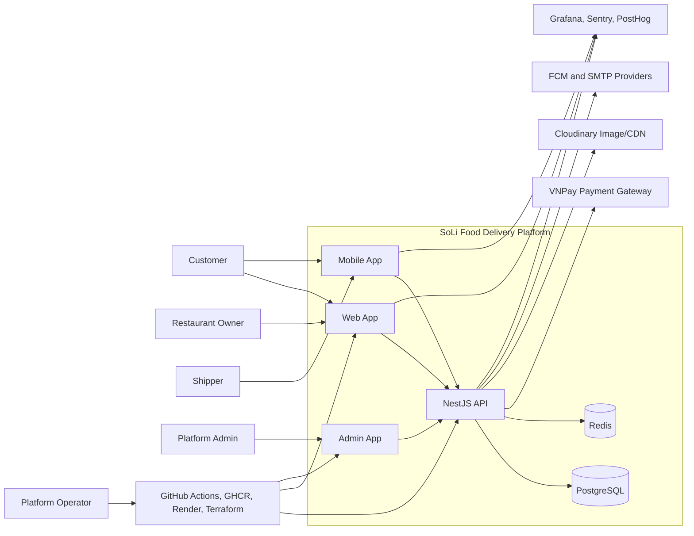
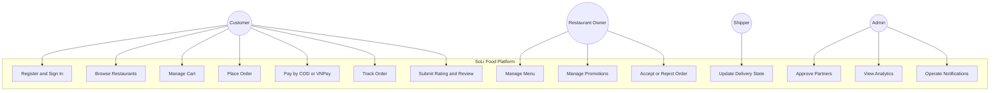
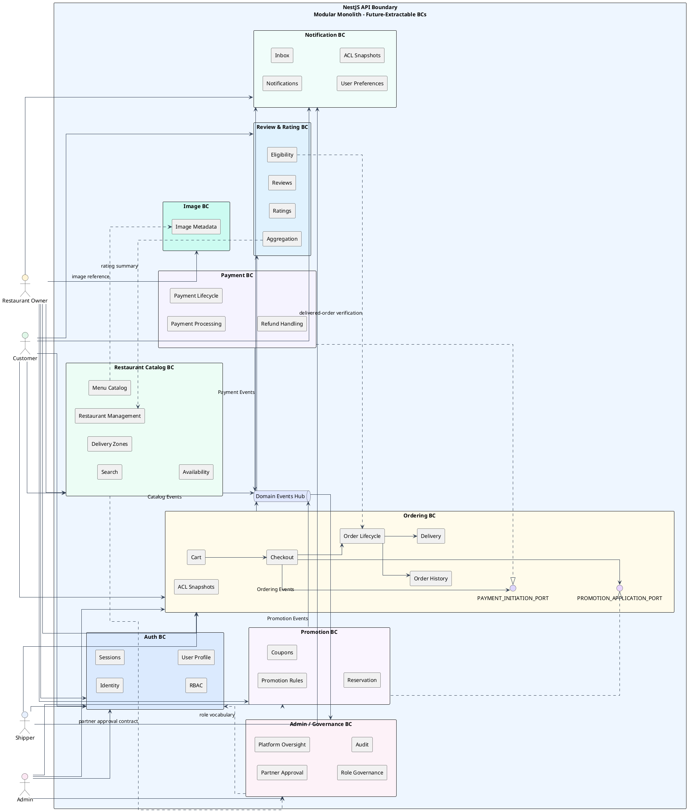
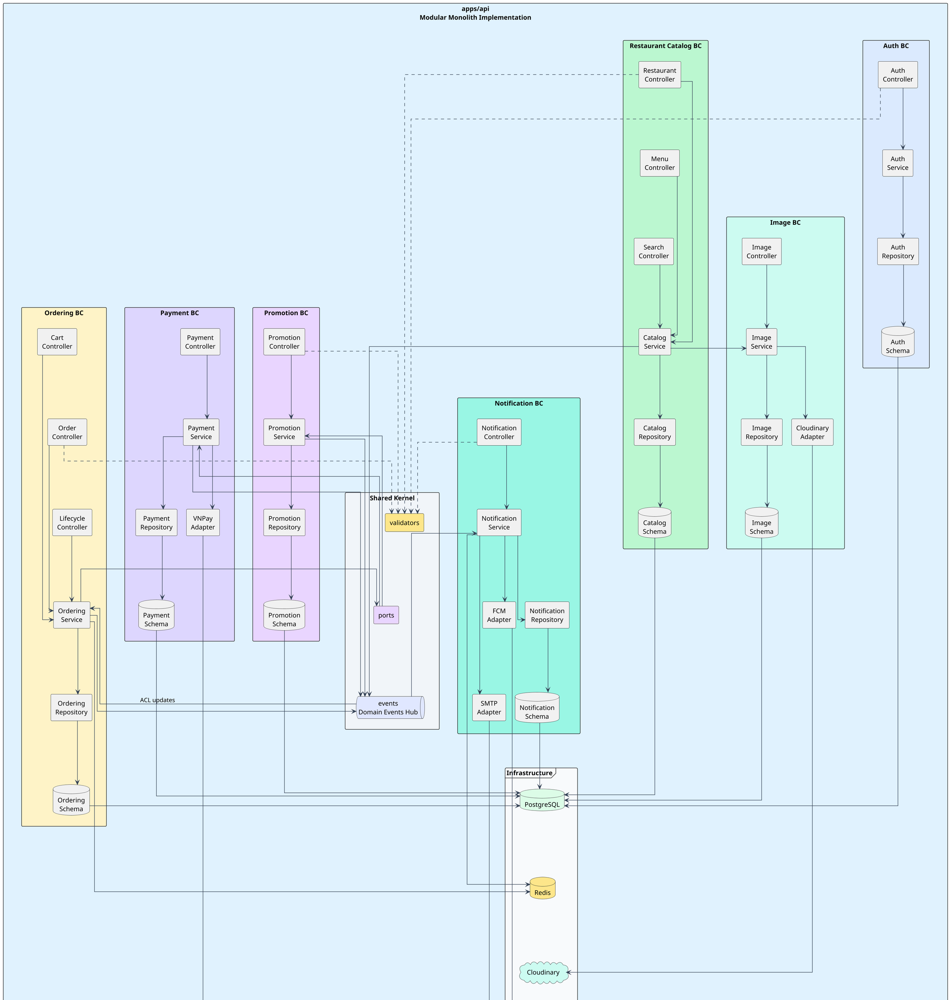
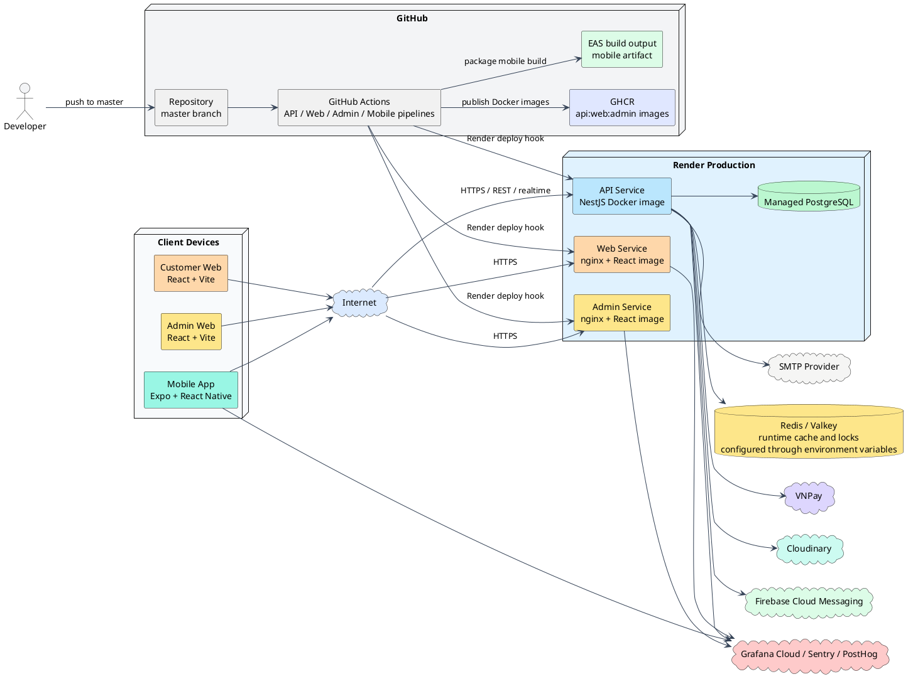
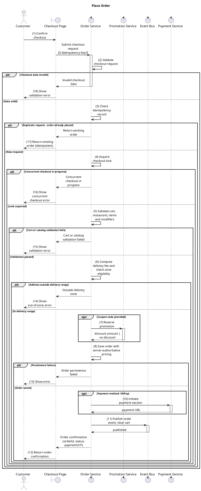
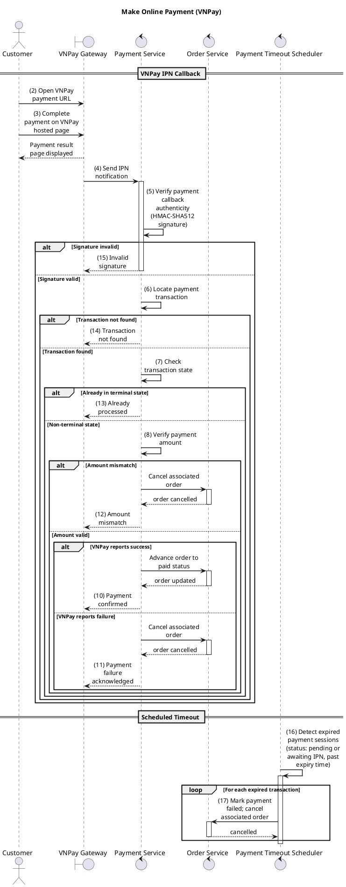
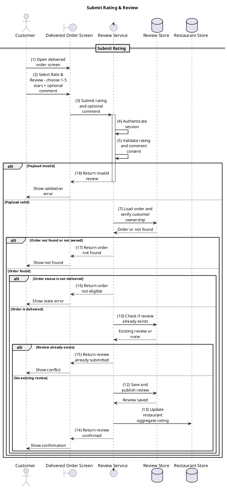

# Software Development, Operation and Maintenance Final Report

## Cover Page

| Field         | Value                                                                                                                                     |
| ------------- | ----------------------------------------------------------------------------------------------------------------------------------------- |
| Project       | SoLi Food Order and Delivery Platform                                                                                                     |
| Repository    | SoLi-Food-Order-and-Deliver-App                                                                                                           |
| Report type   | Final report for Software Development, Operation and Maintenance                                                                          |
| Prepared from | Source code, architecture documents, test artifacts, CI/CD configuration, infrastructure files, and operation documents in the repository |
| Status        | Final report artifact                                                                                                                     |

---

## Declaration

This report documents the actual state of the SoLi Food Order and Delivery Platform as implemented in the repository. It combines the business requirements, software architecture, system realization, testing strategy, deployment automation, operation practices, maintenance risks, and future development direction into one final submission artifact.

The report uses existing repository documents as supporting evidence, but the implementation is treated as the source of truth when older documents are stale. One important example is UC-22 Submit Rating and Review: some earlier architecture and use-case documents describe it as planned, while the current codebase contains `ReviewModule`, `SubmitReviewHandler`, review persistence, rating aggregation, and E2E coverage. The final report therefore records UC-22 as implemented and notes the documentation mismatch as a maintenance finding.

---

## Abstract

SoLi Food is a multi-role food ordering and delivery platform for customers, restaurant partners, shippers, administrators, and platform operators. The platform supports restaurant discovery, cart management, checkout, COD and VNPay payments, order lifecycle tracking, promotions, notifications, image management, rating and review submission, admin analytics, CI/CD validation, deployment automation, and observability.

The system is implemented as a TypeScript monorepo containing a NestJS backend API, React web client, React admin panel, Expo React Native mobile app, Docker packaging, GitHub Actions workflows, Render Terraform infrastructure, and observability configuration. The backend follows a modular monolith architecture with bounded contexts, Drizzle ORM over PostgreSQL, Redis for runtime state, in-process domain events, ports and adapters, anti-corruption layer snapshots, and risk-driven unit and E2E tests.

The strongest engineering evidence is concentrated in the backend core: cart and checkout reliability, VNPay IPN integrity, order lifecycle state control, promotion reservation and rollback, notification delivery, review submission, admin analytics, health checks, telemetry, and CI validation. The report also records known gaps honestly: web/admin/mobile automated tests are placeholders, some governance and shipper workflows remain partial, rate limiting is planned rather than integrated in the NestJS app, and production observability still requires complete alert and SLO operation.

The central conclusion is that SoLi Food is a maintainable modular-monolith product with mature backend workflow design and credible operational foundations, but it requires further hardening in UI testing, production security controls, client-side real-time integration, backup/restore drills, and operational alerting before it should be considered fully production mature.

---

## Project Contribution Matrix

The final repository evidence does not contain the official student roster. The table below records contribution areas and concrete deliverables so the team can map the official names to the correct ownership rows before institutional submission.

| Official team member | Responsibility area                       | Main deliverables and evidence                                                                                                                     |
| -------------------- | ----------------------------------------- | -------------------------------------------------------------------------------------------------------------------------------------------------- |
| Member 1             | Backend ordering and lifecycle            | Cart invariants, checkout orchestration, Redis idempotency, order state machine, order history, order lifecycle tests                              |
| Member 2             | Payment and promotion                     | VNPay payment URL generation, IPN verification, payment transaction state, promotion preview/reserve/confirm/rollback, payment and promotion tests |
| Member 3             | Restaurant catalog, image, review         | Restaurant/menu/zones, Cloudinary image module, UC-22 Submit Rating and Review, rating aggregation, review E2E                                     |
| Member 4             | Notification and real-time support        | In-app notification inbox, WebSocket gateway, email and push channels, quiet hours, device token cleanup, notification tests                       |
| Member 5             | Web/admin/mobile clients                  | React web app, React admin app, Expo mobile app, API client integration, app builds, client observability hooks                                    |
| Member 6             | DevOps, testing, operation, documentation | GitHub Actions, Turbo task graph, Docker, Render/Terraform, observability docs, unit/E2E testing summaries, final report evidence review           |

---

## Table of Contents

1. Introduction and Project Context
2. Analysis: Requirements, Business Rules, and Use Cases
3. Design: Architecture, Views, Decisions, and Quality Attributes
4. System Realization and Functional Implementation
5. Testing, Verification, and Validation
6. Installation, Deployment, and CI/CD
7. Operation and Maintenance
8. Conclusion and Lessons Learned
9. Development Direction and Future Improvements  
   Appendices

---

# Chapter 1: Introduction and Project Context

## 1.1 Problem Statement

Food delivery platforms need to coordinate customers, restaurants, delivery personnel, payment providers, and operational administrators. The system must do more than list restaurants and create orders. It must preserve business rules under retry, handle payment callbacks safely, prevent duplicate orders, notify stakeholders, support review and rating aggregation, provide operational visibility, and remain maintainable as the feature set grows.

SoLi Food addresses this problem as a multi-role marketplace. The platform is scoped as an MVP for a Vietnam city or district context. It focuses on customer ordering, restaurant operations, VNPay and COD payments, order state management, notifications, review submission, and platform administration.

## 1.2 Project Objectives

The project objectives are:

| Objective                        | Explanation                                                                                                    | Evidence                                                                                                     |
| -------------------------------- | -------------------------------------------------------------------------------------------------------------- | ------------------------------------------------------------------------------------------------------------ |
| Support customer ordering        | Customers can browse restaurants, manage a cart, checkout, pay, track orders, and submit reviews               | Realized through Ordering, Review, Notification, and client application flows                                |
| Support restaurant operations    | Restaurant partners can manage catalog state, availability, order acceptance, promotions, and preparation flow | Realized through Restaurant Catalog, Promotion, lifecycle control, and approval-sensitive administration     |
| Integrate safe online payment    | VNPay IPN is verified before payment state changes and is protected by idempotency and optimistic locking      | Realized through Payment bounded-context control, signed callback verification, and transaction versioning   |
| Preserve business reliability    | Checkout uses Redis locks, idempotency keys, ACL snapshots, transactions, and database uniqueness              | Realized through checkout orchestration, closed lifecycle rules, timeout recovery, and durable audit history |
| Enable operation and maintenance | CI/CD, Docker, Render/Terraform, health checks, logging, telemetry, redaction, and documentation are present   | Realized through the release pipeline, deployment configuration, health endpoints, and observability stack   |

## 1.3 Stakeholders and User Roles

| Stakeholder       | Primary needs                                                                                  | Current status                                                                           |
| ----------------- | ---------------------------------------------------------------------------------------------- | ---------------------------------------------------------------------------------------- |
| Customer          | Discover food, place orders, pay, track status, receive notifications, review completed orders | Implemented for core backend flows and client surfaces                                   |
| Restaurant owner  | Manage restaurant information, menu, availability, promotions, and incoming order decisions    | Implemented for core backend flows, with governance refinements pending                  |
| Shipper           | Participate in pickup and delivery lifecycle states                                            | Partial; lifecycle states exist, full dispatch/onboarding remains future work            |
| Platform admin    | Approve partners, monitor platform metrics, govern operational state, investigate issues       | Partial; admin analytics and approvals exist, deeper governance is roadmap               |
| Platform operator | Deploy, monitor, diagnose, and maintain the system                                             | Implemented foundations with CI/CD, health checks, and telemetry; alert maturity pending |
| External provider | VNPay, Cloudinary, FCM/email providers, Grafana/Sentry/PostHog                                 | Integrated or configurable through adapters and environment variables                    |

## 1.4 Product Scope and Boundaries

The MVP scope includes:

- Customer registration, login, restaurant discovery, cart, checkout, payment, order tracking, notifications, and review submission.
- Restaurant catalog management, availability, order acceptance, preparation, promotions, and owner notifications.
- Backend support for COD and VNPay payments.
- Notification through in-app/WebSocket, email, and push-channel abstractions.
- Admin analytics, restaurant approval, health checks, CI/CD, and deployment support.

The MVP excludes or only partially supports:

- B2B enterprise orders and subscription meals.
- Microservices and distributed message brokers.
- Full shipper application workflow and automated dispatch optimization.
- Mature production SLOs, full alert coverage, load testing, and disaster recovery drills.
- Complete automated testing for web, admin, and mobile clients.

## 1.5 Repository and System Overview

The project is organized as a pnpm/Turborepo monorepo with one backend application, three client applications, and supporting infrastructure and operational assets.

| Area               | Role                                                                                                                     |
| ------------------ | ------------------------------------------------------------------------------------------------------------------------ |
| API                | NestJS backend implementing the bounded contexts, persistence layer, Redis runtime behavior, and automated backend tests |
| Web application    | Customer-facing browser client for discovery, checkout, tracking, and review flows                                       |
| Admin application  | Administrative browser client for governance and analytics-oriented workflows                                            |
| Mobile application | Expo-based mobile client for ordering, notification reception, and mobile-first access                                   |
| Infrastructure     | Render-oriented deployment and environment configuration                                                                 |
| Observability      | Logging, telemetry, dashboard, and incident-diagnosis support artifacts                                                  |
| CI/CD              | Validation, packaging, deployment promotion, and infrastructure automation                                               |

## 1.6 Technology Stack Summary

| Layer     | Technology                                                                                                           |
| --------- | -------------------------------------------------------------------------------------------------------------------- |
| Backend   | NestJS 11, TypeScript, CQRS, Better Auth, Drizzle ORM, PostgreSQL, Redis, Socket.IO, OpenTelemetry                   |
| Web       | React 19, Vite, React Router, TanStack Query, Axios, Base/Radix UI, Grafana Faro, PostHog                            |
| Admin     | React 19, Vite, TanStack Query, Recharts, Better Auth, UI component libraries                                        |
| Mobile    | Expo SDK 55, React Native 0.83, Expo Router, Better Auth Expo, Firebase messaging, Socket.IO client, Sentry, PostHog |
| Testing   | Jest, ts-jest, Supertest, E2E tests with PostgreSQL and Redis                                                        |
| Operation | pnpm 11.1.2, Turborepo, Docker, GHCR, GitHub Actions, Render, Terraform, Grafana Cloud, Sentry                       |

## 1.7 System Context Diagram



## 1.8 Report Method

The final report was prepared by cross-checking:

- Business documents in [apps/api/docs/Final_Documents](Final_Documents).
- Architecture documents: ASR, ADD, ADR, SAD, quality attributes, and utility tree.
- Source code in [apps/api/src](../../../apps/api/src), [apps/web/src](../../../apps/web/src), [apps/admin/src](../../../apps/admin/src), and [apps/mobile/src](../../../apps/mobile/src).
- Unit and E2E tests under [apps/api/src](../../../apps/api/src) and [apps/api/test/e2e](../../../apps/api/test/e2e).
- CI/CD workflows under [.github/workflows](../../../.github/workflows).
- Docker, Terraform, and observability configuration.

Where documents and code disagree, the final report records the current implementation state and identifies the mismatch as a maintenance issue.

---

# Chapter 2: Analysis: Requirements, Business Rules, and Use Cases

## 2.1 Business Objectives

The business goal is to create a local food delivery marketplace where customers can order from approved restaurant partners and where the platform can operate payments, delivery states, notifications, reviews, and governance with predictable rules. The system is intended to be practical rather than speculative: it favors a maintainable modular monolith, strong backend correctness, and deployable operations over premature distributed-service complexity.

## 2.2 Business Rules

| Rule | Summary                                                              | Current implementation status                                                                          |
| ---- | -------------------------------------------------------------------- | ------------------------------------------------------------------------------------------------------ |
| BR-1 | Restaurant partner approval is required before marketplace operation | Implemented through restaurant approval state and role promotion patterns; deeper KYC workflow pending |
| BR-2 | Cart can contain items from only one restaurant                      | Implemented in cart service and guarded again during checkout                                          |
| BR-3 | Delivery radius must be validated before checkout                    | Implemented through delivery zones and Haversine distance logic                                        |
| BR-4 | MVP supports COD and VNPay payments                                  | Implemented through payment method handling and VNPay IPN flow                                         |
| BR-5 | Platform commission and revenue analytics are required               | Implemented as admin analytics; commission operations can be expanded                                  |
| BR-7 | Order lifecycle must follow valid transitions                        | Implemented through closed transition table, role checks, optimistic locking, and audit logs           |
| BR-8 | Restaurant and menu availability must control ordering               | Implemented through restaurant/menu state and ordering ACL snapshots                                   |
| BR-9 | Enterprise/B2B/subscription meal flows are out of scope              | Correctly excluded from MVP                                                                            |

## 2.3 Major Use-Case Groups

| Group                                 | Examples                                               | Status                                                                   |
| ------------------------------------- | ------------------------------------------------------ | ------------------------------------------------------------------------ |
| Authentication and account management | Sign up, sign in, role-based access                    | Implemented core; social login/MFA not implemented                       |
| Restaurant discovery and catalog      | Restaurant list, menu, modifiers, zones, search        | Implemented backend and client surfaces                                  |
| Cart and checkout                     | Add/update/remove cart items, place order, idempotency | Implemented and unit/E2E tested                                          |
| Order lifecycle                       | Confirm, prepare, pickup, deliver, cancel, audit       | Implemented backend state machine                                        |
| Payment                               | VNPay redirect, IPN, COD, payment timeout              | Implemented for payment creation/IPN; refund request integration partial |
| Promotion                             | Preview, reserve, confirm, rollback                    | Implemented backend workflows                                            |
| Notification                          | In-app, email, push, unread count, delivery logs       | Implemented backend; client live integration partial                     |
| Review and rating                     | Submit review, validate eligibility, aggregate rating  | Implemented; older docs are stale                                        |
| Administration                        | Approvals, analytics, operational governance           | Partial; admin analytics present, full governance roadmap remains        |

## 2.4 Use Case Diagram



## 2.5 Representative Use Cases

The following use cases are presented in the formal structure used by the approved use-case specification. They are included here because they best represent the project's core business flow, external integration behavior, and post-purchase customer interaction.

### UC-8 Place Order

| Field            | Description                                                                                                                                                                                                                                                                                                                                                                                                                                                                                                                                                             |
| ---------------- | ----------------------------------------------------------------------------------------------------------------------------------------------------------------------------------------------------------------------------------------------------------------------------------------------------------------------------------------------------------------------------------------------------------------------------------------------------------------------------------------------------------------------------------------------------------------------- |
| Goal             | Convert a valid customer cart into an order using a deliverable address and an accepted payment method.                                                                                                                                                                                                                                                                                                                                                                                                                                                                 |
| Primary actor    | Customer                                                                                                                                                                                                                                                                                                                                                                                                                                                                                                                                                                |
| Preconditions    | The customer is authenticated, has selected at least one item from one approved restaurant, and has a deliverable address.                                                                                                                                                                                                                                                                                                                                                                                                                                              |
| Main flow        | 1. The customer adds menu items, modifiers, and quantities to the cart. 2. The system validates the single-restaurant constraint and stores the cart state. 3. The customer reviews and updates the cart. 4. The customer initiates checkout. 5. The system revalidates cart contents, delivery-zone eligibility, and delivery fee. 6. The customer selects COD or VNPay and confirms the order. 7. The system applies idempotency control, creates the order in pending state, clears the cart, and triggers downstream payment and notification behavior as required. |
| Alternative flow | A cross-restaurant addition prompts the customer to clear the existing cart or cancel the action. Modifier prices are re-resolved at checkout to preserve pricing integrity. Promotion-code entry is modeled as a future extension. The customer may save the delivery address for reuse.                                                                                                                                                                                                                                                                               |
| Postconditions   | A new order is associated with the customer, restaurant, and payment method, and the cart is cleared after successful checkout.                                                                                                                                                                                                                                                                                                                                                                                                                                         |

### UC-9 VNPay Payment Confirmation

| Field            | Description                                                                                                                                                                                                                                                                                                                                                                                                                                                                                         |
| ---------------- | --------------------------------------------------------------------------------------------------------------------------------------------------------------------------------------------------------------------------------------------------------------------------------------------------------------------------------------------------------------------------------------------------------------------------------------------------------------------------------------------------- |
| Goal             | Complete or reject online payment through VNPay using a verified callback flow that preserves financial integrity.                                                                                                                                                                                                                                                                                                                                                                                  |
| Primary actor    | Customer                                                                                                                                                                                                                                                                                                                                                                                                                                                                                            |
| Preconditions    | An order has been placed and is in the pending state. For VNPay, the customer is signed in and the gateway is reachable.                                                                                                                                                                                                                                                                                                                                                                            |
| Main flow        | 1. The platform generates a signed VNPay payment URL at checkout. 2. The customer completes payment at the VNPay portal. 3. VNPay sends an Instant Payment Notification to the platform. 4. The platform verifies the cryptographic signature, reconciles the transaction, and updates the payment state. 5. The order is transitioned to paid only after successful verification. 6. The browser return URL is used for customer-facing confirmation and does not perform business-state mutation. |
| Alternative flow | Payment timeout leads to automatic cancellation. A paid order that is later cancelled triggers refund handling. An administrator may approve a dispute refund for a delivered order.                                                                                                                                                                                                                                                                                                                |
| Postconditions   | The payment state is recorded as paid, failed, cancelled, or refunded, and relevant notifications are dispatched.                                                                                                                                                                                                                                                                                                                                                                                   |

### UC-22 Submit Rating and Review

The approved use-case specification originally positioned this domain as a later release item. The final report keeps the approved use-case structure, but records the current implementation as ahead of that earlier planning baseline.

| Field            | Description                                                                                                                                                                                                                                                                                                                                                      |
| ---------------- | ---------------------------------------------------------------------------------------------------------------------------------------------------------------------------------------------------------------------------------------------------------------------------------------------------------------------------------------------------------------- |
| Goal             | Allow a customer to evaluate a completed order through a star rating and optional written review, and update the restaurant's rating profile.                                                                                                                                                                                                                    |
| Primary actor    | Customer                                                                                                                                                                                                                                                                                                                                                         |
| Preconditions    | The customer is authenticated and has at least one delivered order that has not already been reviewed.                                                                                                                                                                                                                                                           |
| Main flow        | 1. The customer opens a delivered order. 2. The customer submits a star rating and optional written comment. 3. The platform persists the review, links it to the order and restaurant, and updates the aggregate rating. 4. The restaurant may view and respond to the review. 5. Review information contributes to the restaurant's public reputation profile. |
| Alternative flow | A user may report abusive content for moderation. An administrator may approve, redact, or remove inappropriate content. Discovery views may present aggregate rating summaries and recent reviews.                                                                                                                                                              |
| Postconditions   | The review is persisted, linked to the originating order, and aggregated into the restaurant's rating profile.                                                                                                                                                                                                                                                   |

## 2.6 Requirements Traceability Overview

The final report uses a focused traceability model rather than a repository inventory. This keeps the chapter aligned with an academic report while still showing how business requirements, software requirements, implementation reality, and verification evidence relate to one another.

| Requirement theme             | Business and specification sources                                                    | Current status                                                 | Validation basis                                                        |
| ----------------------------- | ------------------------------------------------------------------------------------- | -------------------------------------------------------------- | ----------------------------------------------------------------------- |
| Customer checkout             | BR-2, BR-3, BR-4; SRS UC-8; Use Case Specification UC-DOM-03                          | Implemented                                                    | Backend unit tests, API E2E tests, and CI validation                    |
| Verified online payment       | BR-4; SRS UC-9; Use Case Specification UC-DOM-04                                      | Implemented with partial refund-provider completion            | Unit tests, payment E2E tests, and manual gateway validation guidance   |
| Order lifecycle integrity     | Business Rules, SRS order-handling flows, restaurant and shipper use cases            | Implemented                                                    | Transition-table tests, lifecycle E2E tests, audit-log behavior         |
| Notification support          | Shared-platform notification use cases and operational requirements                   | Implemented core                                               | Notification service tests, inbox and multi-channel E2E tests           |
| Rating and review             | SRS UC-22 and Use Case Specification UC-DOM-09                                        | Implemented in current codebase despite older release planning | Review E2E validation and current backend implementation                |
| Administration and governance | BRD governance scope, administration use cases, reporting and monitoring requirements | Partially implemented                                          | Admin analytics, approval behavior, and architecture/maintenance review |

---

# Chapter 3: Design: Architecture, Views, Decisions, and Quality Attributes

## 3.1 Architecture Style

SoLi Food uses a modular monolith. The system is deployed as one NestJS backend process, but the code is organized around bounded contexts and explicit integration boundaries. This decision fits the project because it preserves domain structure without introducing the operational overhead of microservices, distributed transactions, service discovery, message brokers, and multi-service CI/CD.

The architecture is not a simple layered CRUD monolith. It contains domain-focused modules, command handlers for high-risk writes, event handlers, ports and adapters, ACL snapshots, Redis runtime state, and explicit persistence ownership. This gives the system a path toward future extraction while keeping MVP deployment manageable.

## 3.2 Architectural Views Used in This Report

Chapter 1 already provides the system context diagram. This chapter therefore focuses on the four architectural views required for design analysis and uses the approved project artifacts as the primary source set.

| View             | Source artifact                                                  | Use in this report                                                                       |
| ---------------- | ---------------------------------------------------------------- | ---------------------------------------------------------------------------------------- |
| Logical View     | ADD_FoodDelivery, Section 3.1                                    | Shows bounded contexts, domain responsibilities, ports, and event-driven collaboration   |
| Development View | ADD_FoodDelivery, Section 3.2 Implementation View                | Shows module-level realization of the modular monolith and its adapter boundaries        |
| Data View        | ADD_FoodDelivery, Section 3.4                                    | Shows ownership of PostgreSQL tables, Redis runtime state, and external data boundaries  |
| Deployment View  | ADD_FoodDelivery, Section 3.3, adapted to current implementation | Shows the current GitHub Actions, GHCR, Render, PostgreSQL, Redis, and provider topology |

## 3.3 Logical View

Figure 3-1 reproduces the approved logical view from the architecture design document.



This view shows that the implemented system is not organized around technical layers alone. Business responsibilities are separated into bounded contexts, Ordering depends on Payment and Promotion through ports rather than concrete classes, and notification and review behavior are downstream consumers of published domain events.

## 3.4 Development View

The approved ADD uses the term Implementation View. In this final report, that figure is used as the development view because it shows the module-level realization that developers actually work with inside the modular monolith.



This view confirms the central development pattern used by the backend: controller-service-repository-schema realization inside each bounded context, explicit shared ports for cross-context collaboration, and adapters at the edge for VNPay, Cloudinary, FCM, and SMTP.

## 3.5 Data View and Database Design

Figure 3-3 reproduces the approved data view from the ADD. It is the primary source for explaining how durable state, runtime state, and external data ownership are separated in the platform.

```plantuml
@startuml SoLi_Data_View
skinparam backgroundColor #FFFFFF
skinparam shadowing false
skinparam packageStyle rectangle
skinparam defaultTextAlignment left
skinparam ArrowColor #334155
skinparam linetype ortho
skinparam classAttributeIconSize 0
hide circle
hide methods
left to right direction

package "PostgreSQL\nsingle physical database\nlogical schemas grouped by BC ownership" as PG #DCFCE7 {
  package "AUTH" as DAuth #DBEAFE {
    entity "user" as users {
      *id : uuid
      --
      email : text
      name : text
      role : text
      banned : boolean
      createdAt : timestamp
    }

    entity "session" as sessions {
      *id : uuid
      --
      userId : uuid
      token : text
      expiresAt : timestamp
      ipAddress : text
    }

    entity "account" as accounts {
      *id : uuid
      --
      userId : uuid
      providerId : text
      accountId : text
      password : text
    }

    entity "verification" as verifications {
      *id : uuid
      --
      identifier : text
      value : text
      expiresAt : timestamp
    }
  }

  package "RESTAURANT_CATALOG" as DCatalog #BBF7D0 {
    entity "restaurants" as restaurants {
      *id : uuid
      --
      ownerId : uuid
      name : text
      isOpen : boolean
      isApproved : boolean
      latitude : double
      longitude : double
    }

    entity "delivery_zones" as delivery_zones {
      *id : uuid
      --
      restaurantId : uuid
      radiusKm : double
      baseFee : integer
      perKmRate : integer
      isActive : boolean
    }

    entity "menu_categories" as menu_categories {
      *id : uuid
      --
      restaurantId : uuid
      name : text
      displayOrder : integer
    }

    entity "menu_items" as menu_items {
      *id : uuid
      --
      restaurantId : uuid
      categoryId : uuid
      name : text
      price : integer
      status : enum
      imageUrl : text
    }

    entity "modifier_groups" as modifier_groups {
      *id : uuid
      --
      menuItemId : uuid
      name : text
      minSelections : integer
      maxSelections : integer
    }

    entity "modifier_options" as modifier_options {
      *id : uuid
      --
      groupId : uuid
      name : text
      price : integer
      isAvailable : boolean
    }
  }

  package "IMAGE" as DImage #CCFBF1 {
    entity "images" as images {
      *id : uuid
      --
      publicId : text
      secureUrl : text
      width : integer
      height : integer
      createdAt : timestamp
    }
  }

  package "ORDERING" as DOrdering #FEF3C7 {
    entity "orders" as orders {
      *id : uuid
      --
      customerId : uuid
      restaurantId : uuid
      cartId : uuid
      status : enum
      totalAmount : integer
      paymentMethod : enum
      shipperId : uuid
      version : integer
    }

    entity "order_items" as order_items {
      *id : uuid
      --
      orderId : uuid
      menuItemId : uuid
      itemName : text
      unitPrice : integer
      quantity : integer
      subtotal : integer
    }

    entity "order_status_logs" as order_status_logs {
      *id : uuid
      --
      orderId : uuid
      fromStatus : enum
      toStatus : enum
      triggeredByRole : enum
      createdAt : timestamp
    }

    entity "app_settings" as app_settings {
      *key : text
      --
      value : text
      description : text
      updatedAt : timestamp
    }

    entity "ordering_restaurant_snapshots" as ordering_restaurant_snapshots {
      *restaurantId : uuid
      --
      ownerId : uuid
      name : text
      isOpen : boolean
      isApproved : boolean
      lastSyncedAt : timestamp
    }

    entity "ordering_menu_item_snapshots" as ordering_menu_item_snapshots {
      *menuItemId : uuid
      --
      restaurantId : uuid
      name : text
      price : integer
      status : enum
      lastSyncedAt : timestamp
    }

    entity "ordering_delivery_zone_snapshots" as ordering_delivery_zone_snapshots {
      *zoneId : uuid
      --
      restaurantId : uuid
      radiusKm : double
      baseFee : integer
      perKmRate : integer
      isActive : boolean
    }
  }

  package "PAYMENT" as DPayment #DDD6FE {
    entity "payment_transactions" as payment_transactions {
      *id : uuid
      --
      orderId : uuid
      customerId : uuid
      amount : integer
      status : enum
      providerTxnId : text
      expiresAt : timestamp
      version : integer
    }
  }

  package "PROMOTION" as DPromotion #E9D5FF {
    entity "promotions" as promotions {
      *id : uuid
      --
      restaurantId : uuid
      scope : enum
      status : enum
      trigger : enum
      discountValue : integer
      currentTotalUses : integer
      version : integer
    }

    entity "coupon_codes" as coupon_codes {
      *id : uuid
      --
      promotionId : uuid
      code : text
      status : enum
      maxUses : integer
      currentUses : integer
    }

    entity "promotion_usages" as promotion_usages {
      *id : uuid
      --
      promotionId : uuid
      couponCodeId : uuid
      orderId : uuid
      customerId : uuid
      discountAmount : integer
      status : enum
    }
  }

  package "NOTIFICATION" as DNotification #99F6E4 {
    entity "notifications" as notifications {
      *id : uuid
      --
      recipientId : uuid
      type : enum
      channel : enum
      status : enum
      orderId : uuid
      idempotencyKey : text
    }

    entity "notification_preferences" as notification_preferences {
      *id : uuid
      --
      userId : uuid
      pushEnabled : boolean
      inAppEnabled : boolean
      emailEnabled : boolean
      mutedTypes : jsonb
    }

    entity "device_tokens" as device_tokens {
      *id : uuid
      --
      userId : uuid
      token : text
      platform : enum
      isActive : boolean
      lastSeenAt : timestamp
    }

    entity "notification_delivery_logs" as notification_delivery_logs {
      *id : uuid
      --
      notificationId : uuid
      channel : enum
      status : enum
      attemptNumber : integer
      errorCode : text
    }

    entity "notification_restaurant_snapshots" as notification_restaurant_snapshots {
      *restaurantId : uuid
      --
      ownerId : uuid
      name : text
      lastSyncedAt : timestamp
    }
  }

  package "REVIEW_RATING\n[Target logical schema]" as DReview #E0F2FE {
    entity "reviews\n[Planned]" as reviews <<planned>> {
      *id : uuid
      --
      orderId : uuid
      customerId : uuid
      targetType : text
      targetId : uuid
      rating : integer
      moderationStatus : text
    }

    entity "ratings\n[Planned]" as ratings <<planned>> {
      *targetType : text
      *targetId : uuid
      --
      avgRating : decimal
      reviewCount : integer
      updatedAt : timestamp
    }
  }

  package "ADMIN_GOVERNANCE\n[Target logical schema]" as DAdmin #FDF2F8 {
    entity "partner_applications\n[Planned]" as partner_applications <<planned>> {
      *id : uuid
      --
      applicantUserId : uuid
      partnerType : text
      status : text
      reviewedBy : uuid
      decidedAt : timestamp
    }

    entity "governance_audit_logs\n[Planned]" as governance_audit_logs <<planned>> {
      *id : uuid
      --
      actorId : uuid
      action : text
      targetType : text
      targetId : uuid
      createdAt : timestamp
    }
  }
}

package "SHARED_STATE\nRedis / Valkey" as DShared #FDE68A {
  entity "cart:{customerId}" as cart_state <<redis>> {
    *customerId : uuid
    --
    restaurantId : uuid
    items : json
    totals : json
    ttlSeconds : integer
  }

  entity "cart:{customerId}:lock" as checkout_locks <<redis>> {
    *customerId : uuid
    --
    lockToken : text
    ttlSeconds : integer
  }

  entity "idempotency:order:{key}" as order_idempotency_keys <<redis>> {
    *key : text
    --
    orderId : uuid
    responseBody : json
    ttlSeconds : integer
  }

  entity "ws:connections:{userId}" as ws_presence <<redis>> {
    *userId : uuid
    --
    connectionCount : integer
    heartbeatTtl : integer
  }

  entity "rate-limit buckets\n[Planned]" as rate_limit_buckets <<planned>> {
    *bucketKey : text
    --
    windowStart : timestamp
    count : integer
    ttlSeconds : integer
  }
}

package "EXTERNAL_DATA_OWNERS" as DExternal #F5F3FF {
  entity "VNPay gateway" as vnpay_gateway <<external>> {
    *providerTxnId : text
    --
    amount : integer
    responseCode : text
    ipnPayload : json
  }

  entity "Cloudinary assets" as cloudinary_assets <<external>> {
    *publicId : text
    --
    secureUrl : text
    width : integer
    height : integer
  }

  entity "FCM delivery" as fcm_delivery <<external>> {
    *registrationToken : text
    --
    platform : text
    deliveryStatus : text
  }

  entity "SMTP delivery" as smtp_delivery <<external>> {
    *messageId : text
    --
    recipientEmail : text
    deliveryStatus : text
  }
}

DAuth -[hidden]right-> DCatalog
DImage -[hidden]right-> DOrdering
DPayment -[hidden]right-> DPromotion
DNotification -[hidden]right-> DReview
DAdmin -[hidden]right-> DShared
DShared -[hidden]right-> DExternal
DAuth -[hidden]down-> DImage
DCatalog -[hidden]down-> DOrdering
DImage -[hidden]down-> DPayment
DOrdering -[hidden]down-> DPromotion
DPayment -[hidden]down-> DNotification
DPromotion -[hidden]down-> DReview
DNotification -[hidden]down-> DAdmin

users ||--o{ sessions : userId
users ||--o{ accounts : userId
verifications }o..|| users : identifier / email

users ||..o{ restaurants : ownerId
restaurants ||--o{ delivery_zones : restaurantId
restaurants ||--o{ menu_categories : restaurantId
restaurants ||--o{ menu_items : restaurantId
menu_categories ||--o{ menu_items : categoryId
menu_items ||--o{ modifier_groups : menuItemId
modifier_groups ||--o{ modifier_options : groupId

users ||..o{ orders : customerId
users ||..o{ orders : shipperId
restaurants ||..o{ orders : restaurantId
orders ||--o{ order_items : orderId
orders ||--o{ order_status_logs : orderId
menu_items ||..o{ order_items : menuItemId snapshot

restaurants ||..o{ ordering_restaurant_snapshots : event projection
menu_items ||..o{ ordering_menu_item_snapshots : event projection
delivery_zones ||..o{ ordering_delivery_zone_snapshots : event projection
restaurants ||..o{ notification_restaurant_snapshots : event projection

orders ||..o{ payment_transactions : logical orderId
users ||..o{ payment_transactions : logical customerId
payment_transactions }o..|| vnpay_gateway : providerTxnId / IPN

promotions ||..o{ coupon_codes : logical promotionId
promotions ||..o{ promotion_usages : logical promotionId
coupon_codes ||..o{ promotion_usages : logical couponCodeId
orders ||..o{ promotion_usages : logical orderId
users ||..o{ promotion_usages : logical customerId
restaurants ||..o{ promotions : restaurantId scope

users ||..o{ notifications : recipientId
orders ||..o{ notifications : logical orderId
notifications ||..o{ notification_delivery_logs : logical notificationId
users ||..o{ notification_preferences : logical userId
users ||..o{ device_tokens : logical userId
device_tokens }o..|| fcm_delivery : registration token
notifications }o..|| smtp_delivery : email metadata

images }o..|| cloudinary_assets : publicId / secureUrl
orders ||..o{ reviews : eligibility orderId
users ||..o{ reviews : customerId
reviews }o..|| ratings : aggregation
ratings }o..|| restaurants : restaurant rating summary

users ||..o{ partner_applications : applicantUserId
users ||..o{ governance_audit_logs : actorId
restaurants ||..o{ governance_audit_logs : targetId

users ||..o{ cart_state : customerId key
cart_state }o..|| restaurants : restaurantId
orders ||..o{ order_idempotency_keys : cached create response
users ||..o{ checkout_locks : checkout lock
users ||..o{ ws_presence : presence key
users ||..o{ rate_limit_buckets : quota key
@enduml
```



The figure makes two structural decisions explicit. First, PostgreSQL is one physical database but tables remain grouped by bounded-context ownership. Second, Redis is reserved for volatile runtime concerns such as cart state, checkout locking, idempotency, and presence rather than becoming a second durable business store.

The original ADD labeled the review and governance schemas as target logical schemas during design-time planning. In the current implementation, review submission and rating aggregation are already realized in code and validated by E2E tests, so the report interprets that part of the design as implemented functionality rather than future scope.

For database design purposes, the most important realized relationships are the following.

| Data area               | Core entities                                                                                                           | Design role                                                                                      |
| ----------------------- | ----------------------------------------------------------------------------------------------------------------------- | ------------------------------------------------------------------------------------------------ |
| Identity and access     | `user`, `session`, `account`, `verification`                                                                            | Authentication, session control, and role-based access                                           |
| Restaurant catalog      | `restaurants`, `delivery_zones`, `menu_categories`, `menu_items`, `modifier_groups`, `modifier_options`, `images`       | Public discovery, menu management, delivery-fee computation, and availability control            |
| Ordering                | `orders`, `order_items`, `order_status_logs`, snapshot tables, `app_settings`                                           | Checkout, lifecycle progression, audit history, and configuration-driven runtime behavior        |
| Payment and promotion   | `payment_transactions`, `promotions`, `coupon_codes`, `promotion_usages`                                                | Online payment confirmation, reservation/rollback of discounts, and financial compensation flows |
| Notification and review | `notifications`, `notification_preferences`, `device_tokens`, `notification_delivery_logs`, reviews, rating aggregation | Multi-channel communication and post-delivery feedback                                           |

## 3.6 Deployment View

Figure 3-4 adapts the approved ADD deployment view so that it reflects the current implementation instead of the earlier planned multi-instance target topology.



The current repository proves image-based delivery for API, web, and admin, mobile packaging through EAS, Render-hosted runtime services, Terraform ownership of API/Web/PostgreSQL infrastructure shape, and Redis connectivity supplied through runtime environment configuration. The earlier ADD target of autoscaling API groups, shared WebSocket scaling strategy, and broader operational controls remains a future scaling direction rather than the current implemented baseline.

## 3.7 Mandatory Sequence Diagram 1: Place Order

This section reproduces SD-8 from the approved sequence-diagram specification.

| Attribute        | Value                                         |
| ---------------- | --------------------------------------------- |
| SD ID            | SD-8                                          |
| Use Case         | UC-8 - Place Order                            |
| Module           | Customer Module                               |
| Primary actors   | Customer                                      |
| Primary service  | Order Service                                 |
| Related services | Promotion Service, Payment Service, Event Bus |

The approved scenario models the end-to-end checkout flow, including idempotency control, checkout locking, server-side price recomputation, promotion reservation, order persistence, payment initiation, and event publication.



## 3.8 Mandatory Sequence Diagram 2: VNPay Payment Confirmation

This section reproduces SD-9 from the approved sequence-diagram specification.

| Attribute        | Value                              |
| ---------------- | ---------------------------------- |
| SD ID            | SD-9                               |
| Use Case         | UC-9 - Make Online Payment (VNPay) |
| Module           | Customer Module                    |
| Primary actors   | Customer                           |
| Primary service  | Payment Service (VNPay)            |
| Related services | Order Service, VNPay Gateway       |

The approved scenario covers URL generation, callback verification, order-state promotion on successful payment, and timeout-driven cancellation.



## 3.9 Mandatory Sequence Diagram 3: Submit Rating and Review

This section reproduces SD-22 from the approved sequence-diagram specification.

| Attribute        | Value                                                      |
| ---------------- | ---------------------------------------------------------- |
| SD ID            | SD-22                                                      |
| Use Case         | UC-22 - Submit Rating & Review                             |
| Module           | Shared Platform Services                                   |
| Primary actors   | Customer                                                   |
| Primary service  | Review Service                                             |
| Related services | Order Repository, Restaurant Catalog, Notification Service |

The approved scenario models post-delivery review submission with one-review-per-order control, aggregate rating update, and downstream restaurant notification.



## 3.10 Official Architecture Decision Records

| ADR     | Decision                                   | Architectural effect in the realized system                                                                                   |
| ------- | ------------------------------------------ | ----------------------------------------------------------------------------------------------------------------------------- |
| ADR-001 | Adopt Modular Monolith Architecture        | Keeps the platform in one deployable backend while preserving strong bounded-context separation and a future extraction path. |
| ADR-003 | Use Database per BC Ownership              | Uses one PostgreSQL database with explicit bounded-context ownership instead of a shared unstructured data model.             |
| ADR-004 | Use In-process EventBus Communication      | Supports synchronous domain-event collaboration without introducing a broker at the current scale.                            |
| ADR-005 | Adopt ACL Snapshot Pattern                 | Allows Ordering and Notification to read local projections instead of performing direct cross-context runtime reads.          |
| ADR-006 | Use Redis Runtime Layer                    | Separates volatile runtime concerns such as carts, locks, idempotency, and presence from durable business data.               |
| ADR-007 | Use Ports and Adapters Integration Pattern | Keeps Ordering independent from concrete payment, promotion, email, push, and image-provider implementations.                 |
| ADR-008 | Adopt Drizzle Type-safe Persistence Layer  | Gives the project typed schema definitions, SQL-oriented repositories, and migration discipline.                              |

## 3.11 Significant Engineering Decisions

| ID    | Decision                                    | Project effect                                                                                                                                  |
| ----- | ------------------------------------------- | ----------------------------------------------------------------------------------------------------------------------------------------------- |
| SD-01 | NestJS + TypeScript backend                 | Provides the dependency-injection, validation, modularization, and typed-contract foundation used across the backend.                           |
| SD-02 | Hybrid CQRS strategy                        | Concentrates high-risk writes such as checkout, order transition, VNPay IPN processing, and review submission into explicit handlers.           |
| SD-03 | Risk-driven testing strategy                | Directs effort toward payment, checkout, lifecycle, promotion, notification, and review flows rather than claiming uniform coverage everywhere. |
| SD-04 | CI/CD release gating                        | Treats lint, typecheck, audit, test, build, and deployment promotion as mandatory quality controls instead of manual release steps.             |
| SD-05 | Observability-first backend instrumentation | Adds structured logging, request context, telemetry hooks, and client-facing analytics/error channels as operational support mechanisms.        |

## 3.12 Quality Attribute: Maintainability

The maintainability claims in the architecture design document are expressed through explicit boundary control and disciplined schema evolution.

##### QA-MA-01 - Bounded-Context Boundary Enforcement [Implemented]

| Element          | Description                                                                                                                    |
| ---------------- | ------------------------------------------------------------------------------------------------------------------------------ |
| Stimulus         | A developer attempts to import a Payment / Promotion concrete class into Ordering                                              |
| Stimulus Source  | Pull request                                                                                                                   |
| Environment      | Development                                                                                                                    |
| Artifact         | Ports (`PAYMENT_INITIATION_PORT`, `PROMOTION_APPLICATION_PORT`); ACL snapshot tables                                           |
| Response         | The compiler permits it, but architectural reviews / planned ESLint boundary rules forbid it; only the port symbol is imported |
| Response Measure | Zero cross-BC concrete imports in `module/ordering`                                                                            |

##### QA-MA-02 - Schema Evolution via Drizzle Migrations [Implemented]

| Element          | Description                                                                               |
| ---------------- | ----------------------------------------------------------------------------------------- |
| Stimulus         | New table / column added                                                                  |
| Stimulus Source  | Developer                                                                                 |
| Environment      | Development → staging → production                                                        |
| Artifact         | Drizzle Kit migrations; `drizzle.config.ts`                                               |
| Response         | Generated migration file applied; existing data preserved                                 |
| Response Measure | Migrations are forward-compatible (no destructive rewrites without a coordinated release) |

## 3.13 Quality Attribute: Testability

##### QA-T-01 - Deterministic Order Placement Tests [Implemented]

| Element               | Description                                                                                                                               |
| --------------------- | ----------------------------------------------------------------------------------------------------------------------------------------- |
| Stimulus              | A new lifecycle / pricing rule is added                                                                                                   |
| Stimulus Source       | Developer                                                                                                                                 |
| Environment           | CI                                                                                                                                        |
| Artifact              | Jest unit + e2e tests; payment e2e ([test/payment.e2e-spec.ts](../../../test/payment.e2e-spec.ts))                                        |
| Response              | Tests pass deterministically against ephemeral DB + Redis + stub providers                                                                |
| Response Measure      | Existing e2e/spec coverage exercises payment, order, cart, ACL, promotion, and notification paths; coverage thresholds are not formalized |
| Architectural Tactics | Provider abstractions allow `NoopEmailProvider` / `StubPushProvider` in tests; injectable `RedisService` permits mocking                  |

## 3.14 Quality Attribute: Reliability

##### QA-R-01 - Order Placement Idempotency [Implemented]

| Element          | Description                                                                    |
| ---------------- | ------------------------------------------------------------------------------ |
| Stimulus         | Client retries the place-order request after timeout or uncertain response     |
| Stimulus Source  | Customer client                                                                |
| Environment      | Network instability                                                            |
| Artifact         | PlaceOrderHandler, Redis idempotency key, `orders.cart_id` uniqueness backstop |
| Response         | The same `orderId` is returned and no duplicate order is created               |
| Response Measure | Zero duplicate orders for the same idempotency key within the configured TTL   |

##### QA-R-02 - Payment IPN Webhook Idempotency [Implemented]

| Element          | Description                                                                                                |
| ---------------- | ---------------------------------------------------------------------------------------------------------- |
| Stimulus         | VNPay retries an IPN callback                                                                              |
| Stimulus Source  | VNPay gateway                                                                                              |
| Environment      | Provider retry behavior                                                                                    |
| Artifact         | ProcessIpnHandler and `payment_transactions.version`                                                       |
| Response         | The first winning update changes state and later retries are accepted without replaying downstream effects |
| Response Measure | Zero duplicate state transitions and zero duplicate payment events under callback retry                    |

##### QA-R-03 - Order State-Machine Integrity [Implemented]

| Element          | Description                                                                                                        |
| ---------------- | ------------------------------------------------------------------------------------------------------------------ |
| Stimulus         | Any actor requests an order-status transition                                                                      |
| Stimulus Source  | Customer, restaurant, shipper, administrator, or scheduler                                                         |
| Environment      | Normal and concurrent operation                                                                                    |
| Artifact         | Closed transition map, TransitionOrderHandler, lifecycle ownership checks, optimistic-lock versioning, status logs |
| Response         | Disallowed transitions are rejected; allowed transitions commit atomically and append an audit record              |
| Response Measure | Invalid transitions are rejected and committed transitions are always logged                                       |

##### QA-R-04 — Single-Restaurant Cart Invariant _[Implemented]_

| Element               | Description                                                                                         |
| --------------------- | --------------------------------------------------------------------------------------------------- |
| Stimulus              | Customer adds an item from Restaurant B to a cart already containing items from Restaurant A        |
| Stimulus Source       | Customer client                                                                                     |
| Environment           | Normal                                                                                              |
| Artifact              | [CartService](../../../src/module/ordering/cart/cart.service.ts)                                    |
| Response              | Request rejected with a structured error (`CART_RESTAURANT_CONFLICT`); existing cart left unchanged |
| Response Measure      | 100 % rejection in unit / e2e tests; cart store remains consistent                                  |
| Architectural Tactics | BR-2 enforcement in service before Redis write                                                      |

##### QA-R-05 - Payment Timeout Recovery [Implemented]

| Element          | Description                                                                                                                    |
| ---------------- | ------------------------------------------------------------------------------------------------------------------------------ |
| Stimulus         | A payment transaction remains pending beyond its `expiresAt` deadline                                                          |
| Stimulus Source  | Customer inactivity, gateway delay, or payment abandonment                                                                     |
| Environment      | Scheduled execution                                                                                                            |
| Artifact         | PaymentTimeoutTask, `payment_transactions.expiresAt`, `PaymentFailedEvent`                                                     |
| Response         | Expired payments are transitioned to failed and the associated order is cancelled through the same command path used elsewhere |
| Response Measure | Expired transactions are swept on schedule and terminal-state protection prevents duplicate processing                         |

##### QA-R-06 - Restaurant Acceptance Timeout [Implemented]

| Element          | Description                                                                                                                     |
| ---------------- | ------------------------------------------------------------------------------------------------------------------------------- |
| Stimulus         | A restaurant does not accept or reject an order within the configured window                                                    |
| Stimulus Source  | Restaurant operator inaction                                                                                                    |
| Environment      | Scheduled execution                                                                                                             |
| Artifact         | OrderTimeoutTask, runtime timeout settings, TransitionOrderCommand                                                              |
| Response         | Eligible orders are auto-cancelled through the normal CQRS lifecycle path and paid orders trigger refund behavior automatically |
| Response Measure | Eligible expired orders are scanned every minute and routed through the same transition logic as manual operations              |

##### QA-R-07 - Refund and Promotion Compensation Reliability [Partial]

| Element          | Description                                                                                                        |
| ---------------- | ------------------------------------------------------------------------------------------------------------------ |
| Stimulus         | A paid order is cancelled or a reserved promotion must be rolled back                                              |
| Stimulus Source  | Ordering lifecycle events                                                                                          |
| Environment      | Normal operation with asynchronous compensation                                                                    |
| Artifact         | Payment refund handler, promotion rollback handler, promotion service                                              |
| Response         | Refund and promotion compensation run asynchronously and do not roll back the already committed order-state change |
| Response Measure | Order-cancellation correctness is preserved even when refund completion still needs operational hardening          |

## 3.15 Quality Attribute: Manageability

The architecture design document does not group manageability into a standalone ADD subsection. Instead, the approved governance and monitoring requirements express this concern across administrative workflows and deployment controls.

##### QA-MG-01 - Immediate Administrative Approval Propagation [Partial]

| Element                | Description                                                                                                                                      |
| ---------------------- | ------------------------------------------------------------------------------------------------------------------------------------------------ |
| Scenario Source        | Restaurant profile management and restaurant approval requirements                                                                               |
| Stimulus               | An administrator approves or unapproves a restaurant partner                                                                                     |
| Environment            | Production administrative workflow                                                                                                               |
| Architectural Response | Approval takes effect immediately in the source database and synchronously refreshes dependent ACL projections used by Ordering and Notification |
| Current Status         | Partial, because the broader partner-governance workflow and audit-management surface are not yet complete                                       |

##### QA-MG-02 - Filterable Platform Monitoring [Partial]

| Element                | Description                                                                                                                                                                                                                  |
| ---------------------- | ---------------------------------------------------------------------------------------------------------------------------------------------------------------------------------------------------------------------------- |
| Scenario Source        | Monitor Orders and Platform Health requirements and SAD manageability mapping                                                                                                                                                |
| Stimulus               | Operators need to inspect order backlog, payment method, actor scope, or date-range anomalies                                                                                                                                |
| Environment            | Runtime operations                                                                                                                                                                                                           |
| Architectural Response | Administrative monitoring is expected to support filters for status, restaurant, customer, shipper, payment method, and date range while release/runtime settings are controlled through CI/CD and environment configuration |
| Current Status         | Partial, because the full diagnostics and anomaly-management surface remains planned                                                                                                                                         |

## 3.16 Quality Attribute: Flexibility

##### QA-FL-01 - Generalizing Payment Provider Integration [Partial]

| Element          | Description                                                                                                         |
| ---------------- | ------------------------------------------------------------------------------------------------------------------- |
| Stimulus         | Add a non-VNPay payment provider                                                                                    |
| Stimulus Source  | Product roadmap                                                                                                     |
| Environment      | Development                                                                                                         |
| Artifact         | Payment initiation port and Payment bounded context                                                                 |
| Response         | Ordering remains decoupled from concrete payment logic, but the current initiation contract is still VNPay-specific |
| Response Measure | Ordering has no concrete Payment imports, while provider-neutral initiation remains future work                     |

##### QA-FL-02 - Adding a New Order Status [Implemented]

| Element          | Description                                                                                                        |
| ---------------- | ------------------------------------------------------------------------------------------------------------------ |
| Stimulus         | A new lifecycle status is introduced                                                                               |
| Stimulus Source  | Operations roadmap                                                                                                 |
| Environment      | Development                                                                                                        |
| Artifact         | Order-status enum, transition map, and notification mapping                                                        |
| Response         | The new status is concentrated in the shared status vocabulary, transition matrix, and notification handling rules |
| Response Measure | Status evolution remains localized rather than scattered across unrelated modules                                  |

##### QA-FL-03 - Replacing a Notification Channel Provider [Implemented]

| Element          | Description                                                                                   |
| ---------------- | --------------------------------------------------------------------------------------------- |
| Stimulus         | Replace Firebase Cloud Messaging with another push provider                                   |
| Stimulus Source  | Operations or cost decision                                                                   |
| Environment      | Development                                                                                   |
| Artifact         | `PushProvider` interface and channel adapters                                                 |
| Response         | A new adapter can be bound without rewriting domain event handlers                            |
| Response Measure | Channel-provider replacement requires no changes in ordering, payment, or review domain logic |

## 3.17 Quality Attribute: Supportability

##### QA-SUP-01 - Audit Trail for Order Lifecycle [Implemented]

| Element          | Description                                                                                                      |
| ---------------- | ---------------------------------------------------------------------------------------------------------------- |
| Stimulus         | Any order-status transition                                                                                      |
| Stimulus Source  | Any actor                                                                                                        |
| Environment      | Any                                                                                                              |
| Artifact         | `order_status_logs`                                                                                              |
| Response         | Every committed transition writes one audit row with source state, target state, actor role, note, and timestamp |
| Response Measure | Transition history is queryable by order, actor, and time range                                                  |

##### QA-SUP-02 - Structured Logging on Cross-Context Events [Partial]

| Element          | Description                                                                                                                                                          |
| ---------------- | -------------------------------------------------------------------------------------------------------------------------------------------------------------------- |
| Stimulus         | An event handler fails, such as ACL projection or channel dispatch                                                                                                   |
| Stimulus Source  | Internal event processing                                                                                                                                            |
| Environment      | Production                                                                                                                                                           |
| Artifact         | NestJS logger and handler-specific failure policies                                                                                                                  |
| Response         | Handler failures are logged with contextual event information; notification and refund flows absorb failures while some projectors still rethrow after failed writes |
| Response Measure | Handler failures are visible through logs, although centralized correlation and active alerting are still incomplete                                                 |

## 3.18 Quality Attribute: Operability

The approved architectural set expresses operability mainly through the deployment view, CI/CD controls, and supportability mechanisms rather than through a separate ADD scenario block.

##### QA-OP-01 - Validated Release Promotion [Implemented]

| Element                | Description                                                                                                                                                                                |
| ---------------------- | ------------------------------------------------------------------------------------------------------------------------------------------------------------------------------------------ |
| Source Artifact        | Deployment view and CI/CD workflow design                                                                                                                                                  |
| Stimulus               | The team promotes a change toward production                                                                                                                                               |
| Environment            | GitHub Actions and Render deployment pipeline                                                                                                                                              |
| Architectural Response | API, web, admin, and mobile pipelines validate lint, typecheck, audit, test, and build concerns before image publication or mobile packaging; Render deploy hooks promote validated images |
| Current Status         | Implemented as the baseline release mechanism                                                                                                                                              |

##### QA-OP-02 - Runtime Health and Incident Detection [Partial]

| Element                | Description                                                                                                              |
| ---------------------- | ------------------------------------------------------------------------------------------------------------------------ |
| Source Artifact        | Deployment view, supportability scenarios, and SAD manageability mapping                                                 |
| Stimulus               | A dependency failure, unhealthy service start, or runtime degradation occurs                                             |
| Environment            | Production operation                                                                                                     |
| Architectural Response | Health endpoints, Render logs, OpenTelemetry export, and client telemetry channels provide first-line runtime visibility |
| Current Status         | Partial, because alerting maturity, SLO enforcement, and large-scale runtime validation remain future work               |

---

# Chapter 4: System Realization and Functional Implementation

## 4.1 Realization Overview

The implemented system consists of one modular NestJS backend and three client applications: a customer-facing web application, an administrative web application, and a mobile application built with Expo. On the backend, the realized bounded contexts include Auth, Restaurant Catalog, Image, Ordering, Payment, Promotion, Notification, Review, and Admin Analytics. This chapter explains how the major functional areas are realized in the current system rather than listing repository folders as evidence.

## 4.2 Restaurant Catalog, Discovery, and Delivery Coverage

Restaurant Catalog is the customer-entry point of the platform. It realizes restaurant registration, approval-sensitive visibility, public browsing, menu and modifier management, image association, delivery-zone configuration, and availability control. Public discovery only exposes restaurants that are both approved and operational, while the restaurant-management side allows owners and administrators to maintain profile, menu, and delivery settings.

An important implementation detail is the projection of restaurant, menu-item, and delivery-zone information into Ordering-owned snapshot tables. This keeps checkout independent from direct live reads against the catalog write model while still allowing catalog changes to become visible quickly through in-process event propagation.

[Insert Figure 4-1 here: Customer web restaurant listing and restaurant detail screen with menu, delivery coverage, and rating summary.]

## 4.3 Cart and Checkout Realization

Cart and checkout are the operational center of the customer flow. Cart state is maintained in Redis per customer, which gives the platform fast mutation behavior and allows short-lived runtime guarantees such as checkout locking and idempotency. Checkout then revalidates the cart against Ordering-owned snapshots before any order is committed.

The realized checkout flow enforces the following control points in sequence: single-restaurant validation, item and modifier revalidation, delivery-zone eligibility, total recomputation, optional promotion reservation, optional VNPay session initiation, transactional order persistence, and post-commit event publication. This design is central to the platform's reliability because it prevents duplicate orders, price drift, and invalid checkout continuation.

[Insert Figure 4-2 here: Cart page and checkout confirmation flow showing address, fee calculation, and payment-method selection.]

## 4.4 Order Lifecycle and Delivery Progress

The order lifecycle is realized as a closed transition system rather than as scattered status updates. Customer, restaurant, shipper, administrator, and scheduler actions all pass through the same transition logic, which applies role checks, ownership rules, note requirements, optimistic locking, and audit-log creation. This is the mechanism that turns the business rules into enforceable runtime behavior.

The realized states cover order creation, payment, restaurant acceptance, preparation, pickup readiness, shipper pickup, delivery progress, completion, cancellation, refund progression, and timeout-driven failure handling. Restaurant acceptance timeouts and payment timeouts are routed back through the same lifecycle logic, which keeps automatic and manual transitions consistent.

[Insert Figure 4-3 here: Restaurant order board or admin order-status timeline showing state progression and audit history.]

## 4.5 Payment Realization

Payment is implemented with two execution paths: Cash on Delivery for direct operational continuation, and VNPay for hosted online payment. The VNPay path creates a payment transaction, generates a signed payment URL, verifies the returned callback using HMAC-SHA512, validates payment amount, and updates transaction state with optimistic locking so repeated callbacks do not create duplicate effects.

Payment timeout recovery is also realized: abandoned or expired transactions are swept by a scheduled task and converted into the corresponding lifecycle outcome. Refund progression exists in the current implementation, but the external VNPay refund exchange still requires additional hardening before it can be described as fully completed production behavior.

[Insert Figure 4-4 here: VNPay redirection and payment-result flow, or a controlled demonstration of IPN confirmation and order-status update.]

## 4.6 Promotion Realization

Promotion behavior is not treated as a cosmetic discount layer; it is implemented as a controlled reservation process. The current system supports preview, reservation, confirmation, and rollback so that a discount is only finalized when an order is actually created. This prevents quota loss and inconsistent accounting when checkout fails or a paid order later needs compensation.

The promotion boundary is also architecturally important. Ordering invokes promotion behavior through a dedicated application port, which allows discount logic to evolve without turning checkout into a tightly coupled pricing module. Restaurant-scoped and platform-scoped promotion administration are both part of the realized design, although future work remains for richer campaign types and broader reporting.

[Insert Figure 4-5 here: Restaurant or admin promotion-management screen showing promotion status, coupon code, and usage limits.]

## 4.7 Notification and Communication Realization

Notification is realized as a multi-channel subsystem rather than a simple side effect. Order, payment, and review events are converted into durable in-app notifications, optional push notifications, optional email delivery, unread-count updates, and real-time WebSocket emission. User preferences, quiet hours, and device-token management are integrated into this process so the system can adapt delivery behavior without losing the durable inbox record.

This module is also part of the platform's operational resilience. Notification failures are isolated from the core transaction that produced the event, and delivery attempts are recorded for later diagnosis. As a result, the platform can preserve business correctness even when a provider such as FCM or SMTP is degraded.

[Insert Figure 4-6 here: Notification inbox, unread indicator, and a push/in-app notification example for order-status or payment events.]

## 4.8 Rating and Review Realization

The implemented review flow confirms that the customer owns the order, that the order is delivered, and that no prior review already exists for that order. Only after eligibility is confirmed does the system persist the review and update the restaurant's aggregate rating fields. This makes the review feature a proper business workflow rather than a simple content-posting form.

This area is especially important for the final report because it reveals the difference between design-time planning and implementation reality. Earlier planning artifacts positioned reviews as future scope, but the current codebase and E2E tests confirm that review submission, restaurant rating aggregation, and restaurant-owner notification are already realized.

[Insert Figure 4-7 here: Delivered-order screen with rating dialog and the resulting restaurant review display.]

## 4.9 Administration and Operational Oversight

The administrative realization focuses on operational control rather than end-user interaction. The current system provides approval-sensitive restaurant governance, platform analytics, protected operational endpoints, and durable lifecycle history. The analytics layer already computes platform measures such as order volumes, GMV-related aggregates, success indicators, restaurant counts, time-of-day distribution, and locality-level summaries.

At the same time, this is one of the most honest partial-completion areas in the system. Formal shipper-application governance, richer audit exploration, and some role-refresh behavior remain incomplete. The platform therefore demonstrates meaningful operational oversight, but not a finished governance suite.

[Insert Figure 4-8 here: Admin dashboard with platform KPIs, order monitoring, and restaurant approval controls.]

## 4.10 Web, Admin, and Mobile Application Surfaces

The customer web application realizes browsing, cart management, checkout, order tracking, and review-related interaction in a desktop browser context. The admin application realizes approval and monitoring workflows with analytics-oriented screens. The mobile application realizes mobile-first ordering, account access, notification reception, and order visibility with Expo and React Native.

From an engineering perspective, the three clients are integrated into the same monorepo and release process, but they are not equally mature in automated verification. Build, lint, and typecheck support are present for all three, while automated test coverage is currently strongest in the backend. That difference is an implementation fact and should remain visible in the final evaluation.

[Insert Figure 4-9 here: Side-by-side set of customer web, admin web, and mobile application screenshots.]

## 4.11 Infrastructure, Deployment Support, and Configuration Discipline

The realized system includes Docker packaging for backend and web surfaces, local dependency support through Docker Compose, GitHub Actions pipelines for validation and release promotion, Render-hosted runtime services, Terraform-managed Render infrastructure shape for API and web, and centralized observability configuration for backend and client applications. These are not peripheral concerns; they are part of how the software is actually operated and maintained.

The most important implementation discipline in this area is configuration ownership. Runtime behavior depends on validated environment variables, managed secrets, Render service configuration, and consistent image-promotion practices through GHCR and deploy hooks. This configuration discipline is what allows the realized software system to move from development to repeatable operation.

[Insert Figure 4-10 here: GitHub Actions pipeline view, Render service dashboard, or deployment-health screen used during release validation.]

---

# Chapter 5: Testing, Verification, and Validation

## 5.1 Testing Strategy Overview

The project uses a risk-driven testing strategy. Instead of claiming uniform automated coverage across every application in the monorepo, testing effort is concentrated on backend workflows where regression would have the highest business and operational cost: authentication, checkout, payment integrity, lifecycle control, promotion reservation, notification delivery, review submission, and observability support. This choice matches the current maturity of the system, because the backend is the most operationally critical and the best automated part of the platform.

## 5.2 Unit Test Inventory by Module

The documented unit-testing baseline records 504 passing tests across 33 suites. The current source inventory shows 34 backend unit-spec files because an additional environment-schema specification now exists in the codebase. The most useful way to present this evidence is by module, file group, and verification purpose.

| Module group                            | Unit test files                                                                                                                                                                                                                                                                                                   | Verification purpose                                                                                                                                         |
| --------------------------------------- | ----------------------------------------------------------------------------------------------------------------------------------------------------------------------------------------------------------------------------------------------------------------------------------------------------------------- | ------------------------------------------------------------------------------------------------------------------------------------------------------------ |
| Foundation, security, and observability | `env.schema.spec.ts`, `role.util.spec.ts`, `json-logger.spec.ts`, `observability-config.spec.ts`, `redaction.spec.ts`, `request-context.spec.ts`, `route-telemetry.spec.ts`                                                                                                                                       | Environment validation, RBAC behavior, structured logging, telemetry setup, and sensitive-data redaction                                                     |
| Restaurant catalog and media            | `restaurant.service.spec.ts`, `zones.service.spec.ts`, `image.service.spec.ts`                                                                                                                                                                                                                                    | Restaurant ownership rules, approval-sensitive behavior, delivery-zone logic, and image-service correctness                                                  |
| Ordering, checkout, and lifecycle       | `cart.service.spec.ts`, `place-order.handler.spec.ts`, `order-history.service.spec.ts`, `transitions.spec.ts`, `transition-order.handler.spec.ts`, `order-lifecycle.service.spec.ts`, `payment-confirmed.handler.spec.ts`, `payment-failed.handler.spec.ts`, `order-timeout.task.spec.ts`                         | Cart invariants, checkout orchestration, actor-scoped order access, lifecycle rules, timeout recovery, and transition-side effects                           |
| Payment                                 | `vnpay.service.spec.ts`, `payment.service.spec.ts`, `process-ipn.handler.spec.ts`, `order-cancelled-after-payment.handler.spec.ts`                                                                                                                                                                                | Payment URL generation, VNPay signature and amount validation, IPN idempotency, and refund compensation logic                                                |
| Promotion                               | `promotion-pricing-engine.spec.ts`, `promotion.service.spec.ts`                                                                                                                                                                                                                                                   | Discount math, coupon normalization, reservation/confirmation/rollback behavior, and quota enforcement                                                       |
| Notification                            | `notification.service.spec.ts`, `channel-dispatcher.service.spec.ts`, `quiet-hours.service.spec.ts`, `user-presence.service.spec.ts`, `device-token-cleanup.task.spec.ts`, `push.channel.service.spec.ts`, `in-app.channel.service.spec.ts`, `email.channel.service.spec.ts`, `nodemailer-email.provider.spec.ts` | Multi-channel dispatch, user presence, quiet hours, device-token hygiene, provider isolation, and durable notification behavior                              |
| Review                                  | No dedicated backend unit suite at present                                                                                                                                                                                                                                                                        | Review correctness is currently validated primarily through E2E scenarios because it depends on delivered-order eligibility and restaurant rating projection |

This inventory shows that the backend test suite is not a generic unit-test collection. It is organized around business-risk concentration points and around the components that carry operational correctness.

## 5.3 E2E Test Evidence

The backend E2E layer uses a real NestJS application with PostgreSQL, Redis, HTTP interactions, and authentication helpers. It therefore validates cross-module behavior more convincingly than isolated route mocks.

| E2E domain                                    | Representative suites                                                                                            | Main behavior validated                                                                                              |
| --------------------------------------------- | ---------------------------------------------------------------------------------------------------------------- | -------------------------------------------------------------------------------------------------------------------- |
| Platform baseline and cross-context integrity | `spec-e2e.e2e-spec.ts`, `acl.e2e-spec.ts`, `observability.e2e-spec.ts`                                           | Application startup, health behavior, ACL projection, and telemetry/logging integration                              |
| Catalog and restaurant operations             | `menu.e2e-spec.ts`, `modifiers.e2e-spec.ts`, `restaurant.e2e-spec.ts`, `search.e2e-spec.ts`, `zones.e2e-spec.ts` | Public catalog, menu structure, modifier behavior, restaurant approval-sensitive flows, and delivery-zone coverage   |
| Customer ordering and lifecycle               | `cart.e2e-spec.ts`, `order.e2e-spec.ts`, `order-history.e2e-spec.ts`, `order-lifecycle.e2e-spec.ts`              | Cart behavior, order creation, actor-scoped history, and lifecycle transitions across roles                          |
| Payment and promotion                         | `payment-phase8.e2e-spec.ts`, `promotion-checkout.e2e-spec.ts`, `promotion-pr1-pr2.e2e-spec.ts`                  | VNPay IPN verification, payment idempotency, and promotion integration with checkout and administration              |
| Notification and review                       | `notification-inbox.e2e-spec.ts`, `notification-n4.e2e-spec.ts`, `review.e2e-spec.ts`                            | Durable inbox behavior, multi-channel notifications, and UC-22 review submission with restaurant-facing side effects |

## 5.4 CI Validation

The CI/CD layer is not only a release mechanism; it is also part of the verification system. Validation is split into application-specific pipelines and reusable workflow components so that linting, type checking, dependency audit, testing, packaging, and deployment promotion are enforced consistently.

| Workflow family                              | Verification role                                                                          |
| -------------------------------------------- | ------------------------------------------------------------------------------------------ |
| Pull-request and shared validation workflows | Enforce lint, typecheck, audit, unit test, build, database setup, and API E2E checks       |
| API pipeline                                 | Validates backend correctness and publishes the API Docker image only after passing checks |
| Web pipeline                                 | Validates the customer web application and packages the deployable image                   |
| Admin pipeline                               | Validates the administrative web application and packages the deployable image             |
| Mobile pipeline                              | Validates the mobile workspace and packages mobile build artifacts                         |
| Docker and Render workflows                  | Promote validated images to GHCR and then to Render using controlled deployment hooks      |
| Render IaC workflow                          | Applies infrastructure-shape changes separately from application-image promotion           |

[Insert Figure 5-1 here: GitHub Actions validation workflow summary or a representative successful pipeline run.]

## 5.5 Defect Analysis and Recent Fixes

Two recent defects are useful because they demonstrate the difference between changing an assertion and fixing the real business or technical cause.

| Defect                              | Root cause                                                                                                                      | Correct fix                                                       |
| ----------------------------------- | ------------------------------------------------------------------------------------------------------------------------------- | ----------------------------------------------------------------- |
| PlaceOrderHandler unit test failure | A mock for cart deletion returned `undefined` while production code treated the method as Promise-like                          | Preserve async mock semantics by returning `Promise.resolve()`    |
| UC-22 RV-110 E2E failure            | Notification lookup found an older `new_review` notification for the same owner, causing `4 sao` instead of the current `5 sao` | Query by `orderId` in addition to notification type and recipient |

These cases are valuable in an operation-and-maintenance report because they show why maintenance work must start from behavioral diagnosis instead of from superficial test editing.

## 5.6 Testing Gaps

The testing baseline is strong for the backend, but it is not complete for the entire product.

- Web app tests are not configured.
- Admin app tests are not configured.
- Mobile app tests are not configured.
- Some backend controllers and repositories are intentionally left to integration/E2E coverage rather than unit mocks.
- Notification gateway and some client real-time behaviors need more direct automated validation.
- Full load testing and chaos/failure testing are not yet part of CI.

## 5.7 Validation Summary

| Validation area                     | Result    | Interpretation                                                                           |
| ----------------------------------- | --------- | ---------------------------------------------------------------------------------------- |
| Backend static and build validation | Satisfied | Lint, typecheck, and build controls are integrated into CI                               |
| Backend unit testing                | Satisfied | Critical backend domains are covered by a substantial unit-test inventory                |
| Backend end-to-end verification     | Satisfied | Major business workflows and cross-context interactions are exercised through E2E suites |
| Client-side validation              | Partial   | Build and static checks exist, but automated web/admin/mobile tests are still missing    |
| Release-process validation          | Satisfied | CI/CD pipelines gate image publication and deployment promotion                          |
| Runtime-operational validation      | Partial   | Health checks and telemetry exist, but formal SLO and alert evidence is still incomplete |

---

# Chapter 6: Installation, Deployment, and CI/CD

## 6.1 Prerequisites

The project requires:

- Node.js 22 for CI and local development alignment.
- pnpm 11.1.2.
- PostgreSQL 18.
- Redis 7 or compatible Redis/Valkey runtime.
- Environment variables for Better Auth, database, Redis, VNPay, Cloudinary, notification providers, and observability.
- Docker for local service dependencies and production image builds.

## 6.2 Local Installation Flow

Typical local setup:

```bash
pnpm install --frozen-lockfile
docker compose up -d
pnpm --filter api db:push
pnpm --filter api dev
pnpm --filter web dev
pnpm --filter admin dev
pnpm --filter mobile dev
```

The exact environment values must be supplied through `.env` or CI secrets. The API validates environment shape through the configuration schema.

## 6.3 Runtime Dependencies

| Dependency             | Purpose                                                                           |
| ---------------------- | --------------------------------------------------------------------------------- |
| PostgreSQL             | Durable business data, transactions, audit records, payment transactions, reviews |
| Redis                  | Cart state, checkout lock, idempotency keys, WebSocket presence, unread cache     |
| VNPay                  | Online payment redirect and IPN confirmation                                      |
| Cloudinary             | Image storage and CDN                                                             |
| SMTP/FCM               | Email and push notifications                                                      |
| Grafana/Sentry/PostHog | Telemetry, errors, product analytics                                              |

## 6.4 Turborepo Task Graph

The Turborepo configuration defines build, lint, test, typecheck, E2E, and development tasks. Environment variables in `globalEnv` invalidate cache for runtime-sensitive configuration such as database URLs, Redis URL, Better Auth secrets, VNPay secrets, OTEL settings, Sentry settings, Faro settings, PostHog settings, and Expo public variables.

## 6.5 GitHub Actions Workflow Inventory

| Workflow                 | Purpose                                    |
| ------------------------ | ------------------------------------------ |
| `pr-master-validate.yml` | Pull request validation to master          |
| `pipeline-api.yml`       | API validation, package, deploy path       |
| `pipeline-web.yml`       | Web validation, package, deploy path       |
| `pipeline-admin.yml`     | Admin validation, package, deploy path     |
| `pipeline-mobile.yml`    | Mobile validation and mobile package build |
| `ci-validate.yml`        | Reusable CI validation with services       |
| `cd-package-docker.yml`  | Docker build and GHCR image publication    |
| `cd-package-mobile.yml`  | Mobile packaging workflow                  |
| `cd-render-image.yml`    | Render image deploy hook                   |
| `cd-render-iac.yml`      | Render Terraform/IaC workflow              |

## 6.6 Docker and Image Packaging

Dockerfiles package the API, web, and admin applications. Images are published to GHCR and promoted to Render using deploy hooks. This separates image packaging from infrastructure provisioning and avoids mixing Terraform resource ownership with application image promotion.

## 6.7 Render and Terraform Deployment

Terraform under [infra/render](../../../infra/render) defines Render service shape, database resources, variables, outputs, and provider configuration. The infrastructure files show an intended deployment model where application services consume managed PostgreSQL and runtime configuration through Render environment variables and secrets.

Important operation note: Terraform intentionally ignores some secret-file changes, so the Render dashboard and CI secrets remain part of the operational process. This should be documented as a security and configuration management practice.

## 6.8 Health Checks

The API exposes:

- `GET /api/ready`: checks Redis and PostgreSQL readiness.
- `GET /api/live`: returns process liveness and uptime.
- `GET /api/health`: readiness alias.

The readiness endpoint returns service-unavailable status when Redis or PostgreSQL fails. This is enough for basic platform health checks, but it does not validate every business workflow.

## 6.9 Rollback Strategy

Rollback is based on:

- Re-promoting a known good GHCR image tag.
- Keeping database migrations controlled and reviewed.
- Avoiding destructive migrations without backup.
- Using health checks to detect failed deploys.
- Inspecting Render logs and telemetry after deployment.

The roadmap should add formal rollback drills, migration dry-runs, and restore tests.

---

# Chapter 7: Operation and Maintenance

## 7.1 Operational Baseline

The current operational baseline combines GitHub Actions validation, Docker packaging, Render-based service hosting, PostgreSQL persistence, Redis runtime state, health endpoints, structured logging, and telemetry export. This baseline matters because maintenance quality depends not only on source-code structure but also on the team's ability to detect, reproduce, deploy, and recover from changes in real operation.

The platform already has the minimum elements needed for continuous operation: repeatable build and release flow, environment validation, runtime health checks, log visibility, and domain data that preserves operational history. However, some higher-maturity operational practices such as formal SLO management, alert coverage, and restore rehearsal still remain incomplete.

[Insert Figure 7-1 here: Operational dashboard, health endpoint response, or production-monitoring view used in day-to-day support.]

## 7.2 Corrective Maintenance

Corrective maintenance addresses faults that have already appeared in the implemented system. In the current project history, two examples are especially important because they show disciplined fault correction rather than superficial patching.

The first example is the PlaceOrderHandler unit-test failure. The underlying defect was not in business logic but in the test double: the mocked cart-deletion function returned `undefined` while the production path depended on Promise-like behavior. The correct maintenance action was therefore to restore the asynchronous contract in the test, not to change production behavior or weaken the assertion.

The second example is the RV-110 review E2E failure. The visible symptom was a mismatch between expected and actual rating text, but the root cause was a non-deterministic notification lookup that selected an older record for the same restaurant owner. The corrective maintenance action was to query the notification by `orderId` together with recipient and type, which restored business specificity and test determinism.

Corrective maintenance in this project relies on several support mechanisms: order audit logs, payment transaction history, durable notifications, request-context logging, and executable automated tests that can confirm a real fix. These mechanisms reduce the chance of repairing the wrong layer of the system.

## 7.3 Adaptive Maintenance

Adaptive maintenance keeps the system aligned with its runtime environment, platform tooling, and external dependencies. In SoLi Food, this concern appears in deployment automation, infrastructure ownership, package/runtime alignment, and integration-provider handling.

Examples of adaptive maintenance already visible in the project include the use of Render-oriented infrastructure configuration, GHCR-based image promotion, mobile packaging through EAS, and environment-schema validation that prevents the backend from starting under invalid configuration. These are adaptations to real operating constraints rather than purely architectural preferences.

Important adaptive work remains on the roadmap. The platform still needs broader rate-limiting enforcement, more complete shipper and governance workflows, stronger multi-instance runtime validation, and a more provider-neutral payment boundary if new gateways such as MoMo or ZaloPay are added. These are adaptive changes because they respond to platform growth, deployment evolution, or integration expansion rather than to faults in existing functionality.

## 7.4 Perfective Maintenance

Perfective maintenance improves the quality, usability, or operational value of a system that is already functioning. Several realized features in the current codebase can be interpreted as perfective work because they go beyond bare functional completion.

The review feature is one example. Although earlier planning artifacts treated it as later scope, the implemented system already supports customer review submission, restaurant rating aggregation, and restaurant-owner notification. This adds post-purchase feedback capability and improves the value of the platform for both customers and restaurant partners.

The analytics layer is another perfective area. Administrative metrics such as order volume, GMV-related summaries, status distributions, and locality-level reporting improve platform oversight and managerial usefulness even when they are not strictly required for core order placement. Similarly, the notification subsystem's preferences, quiet-hours behavior, and multi-channel support improve the user experience and operational flexibility of a feature that could have been implemented far more minimally.

Future perfective work should focus on richer client experience, more complete real-time interaction, stronger analytics presentation, and broader automated client-side test coverage so that frontend quality can approach the maturity level already reached by the backend.

## 7.5 Preventive Maintenance

Preventive maintenance reduces the probability or cost of future defects. This is one of the strongest areas in the project because many architectural and process choices were made specifically to avoid classes of future failure.

Examples include idempotency keys for checkout, optimistic locking for payment and lifecycle mutation, closed transition tables for order-state control, ACL snapshots to avoid brittle cross-context runtime dependencies, Drizzle migrations for schema discipline, environment-schema validation, structured redaction for sensitive fields, and CI/CD quality gates that require lint, typecheck, tests, and build success before promotion.

The current preventive baseline is meaningful, but it is not complete. Missing restore drills, incomplete alerting, lack of client-side automated tests, and unfinished load/failure testing mean that some preventable risks are still carried forward into future releases. These gaps should be treated as preventive-maintenance priorities rather than as optional polish.

## 7.6 Maintenance Priority Matrix

| Maintenance type | Current priorities                                                                                                                                     |
| ---------------- | ------------------------------------------------------------------------------------------------------------------------------------------------------ |
| Corrective       | Continue diagnosing backend and integration defects through executable tests, durable logs, and business-identifier-based assertions                   |
| Adaptive         | Add production rate limiting, complete shipper and governance workflows, validate multi-instance behavior, and generalize payment-provider integration |
| Perfective       | Improve admin analytics presentation, complete client real-time experience, and expand user-facing product quality on web and mobile                   |
| Preventive       | Add client automated tests, alerting and SLO definitions, backup/restore drills, migration rollback rehearsal, and load/failure testing                |

## 7.7 Current Maintenance Risks

| Risk                                              | Maintenance concern            | Recommended direction                                                     |
| ------------------------------------------------- | ------------------------------ | ------------------------------------------------------------------------- |
| Missing automated tests in web, admin, and mobile | Preventive and perfective risk | Introduce client-side unit, component, and end-to-end testing             |
| Partial refund-provider completion                | Corrective and adaptive risk   | Complete the external refund exchange and callback handling               |
| Incomplete real-time client integration           | Perfective and adaptive risk   | Finish status and notification synchronization across all client surfaces |
| Missing rate limiting                             | Adaptive and preventive risk   | Add edge or Redis-backed throttling for public-facing endpoints           |
| Limited alert maturity                            | Preventive risk                | Define SLOs, alert rules, and escalation ownership                        |
| No restore-drill evidence                         | Preventive risk                | Execute and document backup/restore rehearsal                             |

## 7.8 Maintenance Conclusion

The project already demonstrates credible maintenance practice: real defect correction, deployment discipline, durable operational evidence, and architecture-level safeguards against common failure classes. Its main limitation is not the absence of maintenance thinking, but the uneven maturity between the strong backend core and the less-automated client and operations layers. The next maintenance phase should therefore concentrate on closing those maturity gaps without weakening the correctness guarantees already established in the backend.

---

# Chapter 8: Conclusion and Lessons Learned

## 8.1 Delivered Capabilities

The project delivers a working multi-role food delivery platform with a strong backend core. The most mature capabilities are:

- Modular NestJS backend with bounded contexts.
- Redis-backed cart, checkout lock, and idempotency.
- PostgreSQL/Drizzle persistence and transaction-oriented workflows.
- ACL snapshots for checkout safety.
- VNPay IPN verification, idempotency, and optimistic locking.
- Promotion preview/reserve/confirm/rollback.
- Notification delivery through in-app, email, and push abstractions.
- UC-22 review submission and rating aggregation.
- Order lifecycle state machine and audit logs.
- API unit and E2E tests for critical workflows.
- CI/CD workflows, Docker packaging, Render deployment shape, and observability foundations.

## 8.2 Technical Lessons Learned

### Architecture Lessons Learned

The modular monolith was the correct architecture for this project stage. It gave the team domain boundaries without the complexity of microservices. The main lesson is that boundaries still require discipline: modules must use ports, events, and snapshots rather than reaching into each other's internals.

### Development Lessons Learned

CQRS-style command handlers are valuable for high-risk writes. Checkout, IPN processing, order transitions, and review submission are easier to understand and test when the workflow is centralized in one handler. Simpler CRUD operations do not always need the same structure.

### Testing Lessons Learned

Tests must preserve production contracts. The async Promise mock issue in `PlaceOrderHandler` showed that a unit test can fail or misrepresent behavior when mocks do not match real return types. The RV-110 E2E issue showed that shared E2E state requires precise identifiers such as `orderId`.

### Operation Lessons Learned

CI/CD and observability are part of software quality, not optional documentation. Health checks, environment validation, Docker images, workflow gates, request IDs, telemetry, and redaction make the project easier to operate and defend.

### Maintenance Lessons Learned

Documentation becomes stale unless it is reviewed against source code. UC-22 was the clearest example: older docs marked review as planned, but code and tests show it is implemented. Final reporting should treat source code, tests, and workflows as active evidence and record documentation drift explicitly.

## 8.3 Engineering Lessons Learned

| Lesson                                 | Example                                                                           | Future behavior                                    |
| -------------------------------------- | --------------------------------------------------------------------------------- | -------------------------------------------------- |
| Do not overclaim readiness             | Client tests and alerting are incomplete                                          | Mark gaps honestly and convert them into backlog   |
| Protect money flows first              | VNPay IPN uses signature verification, amount check, idempotency, optimistic lock | Keep payment changes behind strong tests           |
| Use unique business identifiers in E2E | Review notification query must include `orderId`                                  | Design tests to be deterministic under shared data |
| Keep side effects isolated             | Notification and refund handlers should not break core transactions               | Make handlers idempotent and observable            |
| Prefer evidence over assumptions       | Read source, tests, workflows, and docs before final claims                       | Maintain traceability tables in future reports     |

## 8.4 Demonstration Package

Recommended lecturer demonstration flow:

1. Show repository structure and AppModule bounded contexts.
2. Demonstrate customer cart and checkout.
3. Demonstrate VNPay payment URL and IPN behavior through tests or controlled sandbox.
4. Demonstrate order lifecycle transition and audit log.
5. Demonstrate Submit Rating and Review, including owner notification.
6. Show unit and E2E test inventory.
7. Show CI/CD workflows, Docker packaging, and health endpoints.
8. Show observability configuration and redaction strategy.
9. Close with the maintenance backlog and roadmap.

---

# Chapter 9: Development Direction and Future Improvements

## 9.1 Product Roadmap

Future product work should focus on:

- Full shipper onboarding, approval, assignment, and dispatch.
- Real-time delivery tracking with map updates.
- Richer admin governance and audit dashboards.
- Review moderation and abuse prevention.
- Loyalty, wallet, and advanced promotion mechanisms.
- Additional payment providers such as MoMo or ZaloPay after payment port generalization.

## 9.2 Technical Improvements

Technical roadmap:

| Improvement                        | Reason                                                                         |
| ---------------------------------- | ------------------------------------------------------------------------------ |
| Generalize payment initiation port | Add providers without changing Ordering logic                                  |
| Add NestJS or edge rate limiting   | Protect public endpoints                                                       |
| Add outbox or broker when needed   | Improve event reliability if deployment becomes multi-instance and high volume |
| Add Redis-backed Socket.IO adapter | Support WebSocket fan-out across multiple API instances                        |
| Expand observability dashboards    | Improve incident detection and debugging                                       |
| Add backup/restore automation      | Improve recovery confidence                                                    |

## 9.3 Testing Roadmap

Testing improvements:

- Add Vitest and React Testing Library for web and admin.
- Add Playwright for browser E2E flows.
- Add mobile component and integration tests for Expo flows.
- Add contract tests for API/client payload compatibility.
- Add load tests for checkout, payment callback, search, and notification fan-out.
- Add failure-injection tests for Redis, provider timeouts, and duplicate IPN storms.

## 9.4 Operations Roadmap

Operations improvements:

- Define SLOs for checkout, payment IPN, order status propagation, and notification delivery.
- Add Grafana alerts for error rate, latency, failed IPN, stuck orders, Redis failures, and database saturation.
- Add incident severity levels and escalation ownership.
- Run restore drills and record evidence.
- Validate deployment rollback with real image tags.
- Verify web `/healthz` behavior and Render health check configuration.

## 9.5 Scaling Direction

The current architecture should scale first as a modular monolith by adding stateless API instances, shared PostgreSQL, shared Redis, and load-balanced clients. Before extracting microservices, the team should add a Redis-backed Socket.IO adapter, outbox/event reliability, explicit module boundary checks, provider contract tests, and operational dashboards. Microservice extraction should happen only for modules with clear independent scaling, ownership, and deployment needs.

## 9.6 Final Statement

SoLi Food demonstrates a credible software development, operation, and maintenance lifecycle. It has a well-structured backend, real business workflows, meaningful tests, deployment automation, and observability foundations. Its remaining work is not hidden: UI test automation, production security hardening, alert maturity, backup/recovery drills, real-time client completion, and deeper governance should be the next investment areas.

---

# Appendices

## Appendix A: References

| Ref. | Document set                                       | Role in this report                                                                        |
| ---- | -------------------------------------------------- | ------------------------------------------------------------------------------------------ |
| R1   | BRD, Vision and Scope, and Business Rules          | Business scope, goals, and operational constraints                                         |
| R2   | Use Case Specification                             | Formal use-case structure for checkout, payment, and review scenarios                      |
| R3   | SRS_FoodDelivery and SRS_SequenceDiagrams          | Functional behavior and approved sequence-diagram sources                                  |
| R4   | ASR_FoodDelivery                                   | Architectural drivers, governance requirements, and course taxonomy alignment              |
| R5   | ADD_FoodDelivery                                   | Logical, development, data, and deployment views together with primary QA scenario sources |
| R6   | ADR_FoodDelivery                                   | Architectural decision record baseline                                                     |
| R7   | SAD_FoodDelivery                                   | Cross-view consistency, manageability, and operability interpretation                      |
| R8   | UNIT_TESTING_IMPLEMENTATION_SUMMARY                | Backend unit-testing baseline and suite inventory                                          |
| R9   | CI/CD, observability, and infrastructure documents | Deployment, operational support, and runtime-management evidence                           |
| R10  | Current implementation and test suites             | Validation of realized behavior against the approved design baseline                       |

## Appendix B: Diagram Index

| Diagram    | Description                      | Source                                                                |
| ---------- | -------------------------------- | --------------------------------------------------------------------- |
| Figure 1-1 | System context diagram           | Report context synthesis based on business and architecture documents |
| Figure 3-1 | Logical View                     | ADD_FoodDelivery, Section 3.1                                         |
| Figure 3-2 | Development View                 | ADD_FoodDelivery Implementation View, Section 3.2                     |
| Figure 3-3 | Data View                        | ADD_FoodDelivery, Section 3.4                                         |
| Figure 3-4 | Deployment View                  | ADD_FoodDelivery, Section 3.3, adapted to current implementation      |
| SD-8       | UC-8 Place Order                 | SRS_SequenceDiagrams                                                  |
| SD-9       | UC-9 Make Online Payment (VNPay) | SRS_SequenceDiagrams                                                  |
| SD-22      | UC-22 Submit Rating and Review   | SRS_SequenceDiagrams                                                  |

## Appendix C: Recommended Screenshot Index

| Figure placeholder | Recommended screenshot                                       |
| ------------------ | ------------------------------------------------------------ |
| Figure 4-1         | Customer restaurant listing and restaurant detail screen     |
| Figure 4-2         | Cart page and checkout confirmation flow                     |
| Figure 4-3         | Order board or order-status timeline                         |
| Figure 4-4         | VNPay redirection or payment-confirmation flow               |
| Figure 4-5         | Promotion-management screen                                  |
| Figure 4-6         | Notification inbox or real-time notification example         |
| Figure 4-7         | Delivered-order review dialog and review result              |
| Figure 4-8         | Admin dashboard with operational KPIs                        |
| Figure 4-9         | Comparative web, admin, and mobile application views         |
| Figure 4-10        | GitHub Actions, Render dashboard, or release-validation view |
| Figure 5-1         | Successful CI validation workflow or test summary            |
| Figure 7-1         | Monitoring, health, or operational support dashboard         |

## Appendix D: Abbreviations

| Term  | Meaning                                                   |
| ----- | --------------------------------------------------------- |
| ACL   | Anti-Corruption Layer                                     |
| ADD   | Attribute-Driven Design                                   |
| ADR   | Architecture Decision Record                              |
| API   | Application Programming Interface                         |
| ASR   | Architecturally Significant Requirement                   |
| BC    | Bounded Context                                           |
| CI/CD | Continuous Integration and Continuous Delivery/Deployment |
| CQRS  | Command Query Responsibility Segregation                  |
| E2E   | End to End                                                |
| FCM   | Firebase Cloud Messaging                                  |
| GHCR  | GitHub Container Registry                                 |
| IPN   | Instant Payment Notification                              |
| OTEL  | OpenTelemetry                                             |
| SAD   | Software Architecture Document                            |
| SLO   | Service Level Objective                                   |
| SRS   | Software Requirements Specification                       |
| VNPay | Vietnamese payment gateway used by the platform           |
